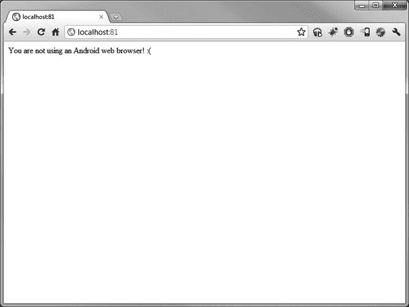
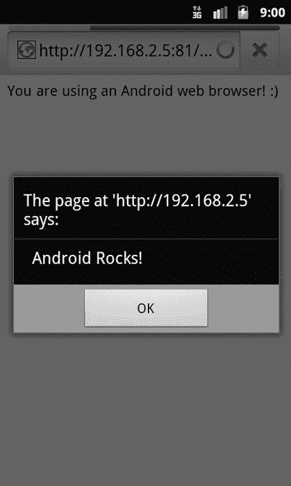
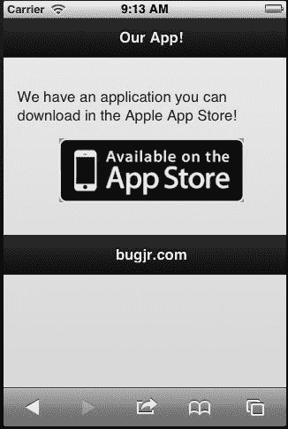

# 六、处理不同的浏览器平台

到目前为止，我们已经讨论了检测访问您的 web 页面或应用的设备类型以及适当处理它的方法。这涉及到特殊的 CSS 文件、格式问题等等。然而，正如任何优秀的面包师会告诉你的那样，把所有鸡蛋放在一个篮子里并不总是最明智的想法。这就是为什么，在这一章中，我们将后退一步，讨论您可以用来了解什么设备正在访问您的服务并采取适当行动的方法。

原因很简单:没有一种解决方案能解决所有问题。例如，您可能需要允许移动用户访问 web 应用，并且您可能会发现可以格式化页面，使其在桌面和手机上看起来都很棒。对于极其简单的布局，这通常是开发人员所做的。然而，对于更复杂的系统，可能需要创建一个完全独立的网站。中庸之道是构建一个在桌面、平板电脑或手机上都很好看的 HTML 文档。在这一章中，我们会给你一些你需要的工具来判断是什么设备在看你的页面，并且我们会提供一些关于你的页面如何对每个设备做出反应的想法。毕竟，就像没有两个网站是完全一样的——尽管很相似——也没有两个设备的行为是完全一样的(但谢天谢地，就像网站一样，有相似之处)。

### 元标签和视口

我们已经讨论了许多对于普通用户来说是隐藏的关于 HTML 的事情——使用的不同标签，不同的部分，比如`head`和`body`，甚至像 CSS 和 JavaScript 这样的东西如何嵌入到 HTML 文档中。然而，元标签或元素是特殊的，虽然它们不会显示给用户，但它们通常会影响用户对页面显示或格式的体验。

META 标签位于 HTML 页面的`head`部分，通常有两个元素，元素名和值。例如，以下值指定了与特定网页相关联的关键字:

`<**meta** name="keywords" content="android, howto, information" >`

#### 一点元历史

当搜索引擎首次开始索引互联网时，他们使用关键字和描述元素来理解给定网页的内容。在 20 世纪 90 年代末，全文搜索引擎(如谷歌)开始索引并使用给定网页的所有文本来确定页面包含的内容，这些`META`元素变得不那么重要了。事实上，一个完整的行业已经兴起，声称通过“优化”他们的网页来帮助网页所有者获得更多的流量，这通常包括更新搜索引擎使用的`META`元素。这个行业的“搜索引擎优化”，或搜索引擎优化，今天仍然存在，事实上是一个非常残酷的业务类型，虽然许多搜索引擎寻找旧的“技巧”使用，并可能惩罚网页使用它们。例如，使用的一个技巧被非正式地称为“关键字填充”，这听起来就像是——用许多不同的术语填充`META`关键字元素，其中一些可能在搜索引擎中得分很高，但在页面的实际内容方面并不准确。现代 SEO 公司必须依靠许多其他技术来提高页面的搜索排名，包括许多我们通常不认为是设计师的东西(例如，页面上有什么链接、页面标题、布局、措辞等等)。

关于`META`标签的一件有趣的事情是,“官方的”`META`标签比网络上存在的标签总数要少得多。各种生产网络浏览器的软件公司，如微软，可能决定构建他们的浏览器来检测“非官方的”`META`标签并对其做出响应。

例如，微软率先使用了 MobileOptimized `META`标签，该标签告诉其移动互联网浏览器(Pocket Internet Explorer 或 Internet Explorer Mobile)如何专门渲染使用该标签的页面。一些非微软生产的浏览器支持这种标签，但不能保证这种标签对竞争对手浏览器的用户会像对 Internet Explorer 用户一样有帮助。类似地，我们的老朋友 AvantGo(前面提到过)也使用了一个名为 HandheldFriendly 的标签来实现相同的目的，但也存在相同的问题。

#### 视口元素

所有这些困惑、竞争和不一致导致了被称为 Viewport 的新`META`元素的引入和相当广泛的接受，尽管仍然是非官方的，但它是移动开发人员感兴趣的最新“特殊”`META`标签。视口可以被认为是网页顶部的窗口。有时候，整个网页适合窗口，而其他时候，我们希望窗口大小不同，这取决于我们如何构建页面。与以前的尝试相比，Viewport 标签更成功的一个原因是它能容纳的信息量。例如，一个简单的视口标记可能如下所示:

`<meta name="viewport" content="width=320,height=device-height" />`

这段代码告诉移动浏览器，这个页面的内容应该是 320 像素宽，和设备的屏幕一样高。(如果你是为平板电脑设计的，你可能会把它调整到 800 像素宽。)为了更好地了解这将如何显示页面，请看一下[Figure 6–1](#fig_6_1)。它显示“那条推特是谁？”我们在[第二章](02.html#ch2)中使用前面的视口设置制作的游戏。

**图 6–1。** *这里我们有“那条推特是谁？”设置了视口的游戏*

注意页面的布局是如何大于手机的可用查看空间的？这是因为当我们将高度设置为设备的高度时，我们将宽度设置得太宽了——320 px——浏览器不知道任何关于初始比例的信息，正如页面底部的缩放按钮所证明的那样。在这种情况下，浏览器放大以显示页面的左上角，并提供缩放按钮，以便用户可以放大和缩小页面，根据自己的选择查看尽可能多或尽可能少的页面内容(虽然有时能够缩放页面上的内容很好，但如果我们可以在该页面上禁用该功能，则更好，这样我们可以保证我们的布局将按照我们预期的方式显示)。换句话说，浏览器对它应该如何显示这个页面做了一个有根据的猜测，但是由于把它拉到了左上方，它悲惨地失败了。它还可以显示所有缩小的内容，在这种情况下，所有 320 像素都适合，但文本会非常小。我们要给它更多的信息，这样它第一次就能正确显示。

幸运的是，Viewport 标签还可以包含关于页面缩放的信息——包括用户放大和缩小给定页面的能力。以下稍微复杂一些的 Viewport 标记指定了所有这些内容:

`<meta name="viewport" content="width=320, height=device-height, user-scalable=no,
initial-scale=1.0, maximum-scale=1.0, minimum-scale=1.0" />`

这段代码告诉浏览器两件事。首先，它提供了比例值，允许浏览器知道您认为最大和最小的比例，以及最初设置比例的位置。在这个例子中，我们告诉浏览器，我们对页面进行了编码，因此它被设计为 100%可见，它不应该再变大或变小。这段代码添加的第二项是关闭用户放大和缩小选项的能力，如下面的[图 6–2](#fig_6_2)所示。现在，我们不必担心我们的设计不会以我们希望的方式展示给用户。就我个人而言，我喜欢在构建移动网站或应用时总是剥夺用户缩放页面的能力。我知道有些人真的喜欢通过缩放天堂的能力，但在现实中，移动设备的屏幕空间非常有限，作为一名设计师或开发人员，我觉得你的工作是利用有限的屏幕空间，而不是让用户通过缩放来浏览你的成品。

**图 6–2。** *[第二章](02.html#ch2)的“那是谁的推特？”关闭用户可扩展的游戏*

但是，如果你想要一个快乐的媒介，即你的应用应该自动放大，但也应该允许用户根据自己的意愿修改缩放比例，那该怎么办呢？那么像素更高的设备呢(比如谷歌 Nexus One，480 像素宽)？我们可以用几种方法来解决这个问题。第一种方法是删除`META`标签中的`user-scalable=no`行，并针对某个屏幕密度调整比例值。这让`META`标签给出初始值，但不约束用户。为了确定这是否是正确的举措，我们可以进行一些用户测试(即，调查人们对我们的移动界面的看法)，或者如果我们真的很好奇，我们可以实现一些 javascript 代码来查看用户在做什么，然后将其写入日志(这超出了本书的范围，尽管资源确实存在，如本页的讨论:`[http://htmldoodads.appspot.com/zoom-level.html](http://htmldoodads.appspot.com/zoom-level.html)`)。我们还可以构建一个页面，根据设备像素密度以不同方式显示，这是我们必须在底层 CSS 中指定的，使用低密度(ldpi)、中密度(mdpi)和高密度(hdpi)标签，然后为每种情况指定不同的 CSS 格式。

最后，如果我们有幸只为一个平台开发(例如，只有 Android 手机)，我们可以研究浏览器的具体特性。在这种情况下，Android Webkit 浏览器会自动缩小文本元素的大小，以便它们适合屏幕(去查看在线报纸上的一篇文章，并放大一大块文本来查看这一过程)。如果这是我们的使用场景，那么我们就没有什么可担心的了。虽然这很容易让人相信，但你应该在 Android 设备上彻底测试你的页面。使用`META`标签作为额外的安全层来帮助内置浏览器也没有坏处。

### 用户代理

有时，指定浏览器应该如何处理您的页面并不能满足您的需求。例如，也许你知道某些信息，不管它在移动设备上如何缩放或格式化，对于普通用户来说在小屏幕上处理太多了。也许你的页面使用了一堆 Flash 小程序，这些程序不能在 iPhone 或 iPad 等 iOS 设备上运行，你想把这些用户重定向到其他地方。也许你的网站上有一些特性和功能并不是在所有的应用中都可用，对于不太先进的浏览器来说需要禁用。最后，也许你只是想给出一个网址`[http://mysite.com](http://mysite.com)`，让它自动将手机和平板电脑导向一个特殊的优化版本，同时向其他人显示整个页面。大多数网站实现这些目标的方式是通过读取访问者的 web 浏览器提供的用户代理字符串。让我们首先来看一个示例用户代理，然后看看我们如何在我们的应用中使用它。

#### Nexus One 用户代理

用户代理字符串的格式是由 RFC 1945(HTTP 规范)制定的，其中包括该字符串的定义。该字符串由产品名称和版本以及可选注释组成。虽然这些是 RFC 1945 要求的字符串的一部分，但是许多供应商添加了额外的信息，例如操作系统、加载的扩展和平台细节。运行 Android 2.2 (Froyo)的 Google Nexus One 上的内置浏览器发送以下用户代理:

`Mozilla/5.0 (Linux; U; Android 2.2; en-us; Nexus One Build/FRF91) AppleWebKit/533.1
(KHTML, like Gecko) Version/4.0 Mobile Safari/533.1`

这个字符串，分解后，翻译成:

*   Mozilla 5.0 浏览器
*   运行在 Linux 操作系统上，特别是 Android 2.2
*   使用美国英语
*   在 Nexus One 手机上，运行操作系统的内部版本 FRF91。
*   它(注释指示)类似于 AppleWebKit 浏览器(版本 533.1)。

我们的 web 页面或应用可以获得很多信息(如果您查看 RFC，甚至可以获得关于引擎或当前浏览器提供的安全级别的更多信息)。利用这一点，我们可以将特定手机、浏览器、操作系统和语言的用户引导到我们为他们创建的特殊格式的页面，或者显示我们针对的浏览器的特定功能。

然而，对于用户代理检测有一个需要考虑的警告:用户代理欺骗。许多第三方浏览器，如 Android 上流行的 Dolphin HD 浏览器，允许用户设置自己的用户代理。这有多种原因，包括:

*   用户希望看到页面的桌面版本，不管它的格式看起来有多糟糕。
*   用户想要访问专门为另一个操作系统或浏览器构建的页面(即，可能 web 开发者还没有构建优化的 Android 版本，但是已经有了优化的 iOS 版本。)
*   出于这样或那样的原因，用户只是想在网站的日志中显示为桌面系统！想到的一个是开发者设置的移动用户希望查看的限制(即，仅向桌面用户显示特殊报价)。

对于用户代理欺骗，我们无能为力。毕竟，整个系统的设置围绕着被准确报告的用户代理。如果这是您所关心的问题，您可能需要使用除用户代理检测之外的替代方法来为您的用户提供正确的页面，而不管他们想要什么。这通常采用脚本的形式来测试浏览器的功能——然而，人们需要知道移动浏览器具有哪些细微的功能，哪些只有桌面浏览器才具有——这远远超出了我们在这里讨论的范围。

现在，您已经对用户代理字符串的用途有了基本的了解，让我们看几个例子，在这些例子中，我们检测最终用户的用户代理字符串。

#### PHP 用户代理检测

清单 6–1 展示了一个 PHP 示例，在这个示例中，我们将检测用户代理字符串并将其显示给用户。如果用户使用的是 Android 网络浏览器，那么他们将会看到总是令人愉快的笑脸(见[图 6–3](#fig_6_3))，但是如果他们试图在非 Android 驱动的设备上查看脚本，那么他们将会看到一张永远不受欢迎的皱眉脸(见[图 6–4](#fig_6_4))。

**清单 6–1。** *PHP 用户检测代码*

`<?php
$userAgent = strtolower($_SERVER['HTTP_USER_AGENT']);
if(stripos($userAgent,'android') !== false) {
    echo 'You are using an Android web browser! :)';
}
else {
    echo 'You are not using an Android web browser! :(';
}
?>`

为了理解这段代码是如何工作的，我们将一行一行地把它拆开。首先，我们定义变量`$userAgent,`，它获取请求页面的浏览器的用户代理字符串。然后我们使用 PHP `stripos`函数——它在字符串中搜索一个字符串的出现——来解析用户代理以获得我们提供的值。如果在字符串中找不到这个值，在本例中是`android,`，那么向用户显示一条消息。如果找到了，将显示另一条消息。

这只是一个小例子，展示了如何使用 PHP 来检测用户代理字符串，但是在很多情况下，这种技术可能会让您省心。例如，在 PHP 中使用检测可能允许您在内容发送之前阻止它(通常 JavaScript 检测不会这样做)。此外，如果您的应用大部分是用 PHP 编写的，那么您可能更愿意用这种方式记录用户代理，而不是通过 JavaScript。

**图 6–3。** *使用 PHP，我们获取用户代理字符串，并使用它来决定向最终用户显示哪些内容*

**图 6–4:***Drat！看起来此人没有使用 Android 浏览器！*

#### JavaScript 用户代理检测

虽然 PHP 非常适合检测服务器端的用户代理字符串，但有时开发人员可能需要检测客户端的用户字符串。例如，假设您正在使用一个站点或应用，该站点或应用允许您将信息导出到用户计算机上的文本文件或二进制格式文件中，以便以后查看。在 Android 设备上，文本是没有问题的，但如果你的用户选择二进制格式，当它无法打开时，他们可能会感到困惑。因此，我们可能只想隐藏该选项，而让其他选项可用。幸运的是，使用 JavaScript 完成这项任务就像使用 PHP 一样简单。

#### 介绍 JavaScript 代理检测代码

[清单 6–2](#list_6_2)中显示的 JavaScript 代码让我们快速体验了 JavaScript 中的检测是多么简单；它类似于 PHP。与上一段代码相比，这段代码唯一的主要区别是，我们没有像使用 PHP 那样将消息写入页面，而是选择向用户显示一个弹出对话框(参见图 6–5 和图 6–6[)。](#fig_6_5)

**清单 6–2。** *Javascript 用户检测代码*

`` 

**图 6–5。**Android 2.3 姜饼设备上的*警告对话框*

**图 6–6。** *谷歌 Chrome 浏览器上无聊的警告对话框*

##### 使用 JavaScript 代理检测向不同平台展示不同内容

单一平台开发人员(例如，为 Android、iOS 或一个操作系统编写应用的人)的一个自然发展是跳到不同的平台。Web 应用非常适合这一点，因为它们很大程度上可以一次编码并轻松地“移植”到其他类似的架构上。然而，为了避免衍生版本成为一场噩梦(例如，Android 和 iOS 版本，需要您分别对两个版本进行添加)，可能更容易的是只拥有一段可以根据其运行位置进行更改的代码。在本例中，我们将向您展示如何将上一节中的[清单 6–2](#list_6_2)中的 JavaScript 代码实现到一个 Web 应用中，该应用将根据其运行的位置显示不同的内容。

我们还将通过把 jQuery Mobile 用作这个应用的“框架”,让您体验一下在下一章中会经常看到的东西。如果你喜欢接下来几个屏幕的样子，那么你会喜欢阅读第七章。

让我们首先讨论我们的总体目标:显示下载应用的适当链接。在 Android 中，我们希望链接指向 Android Market(或者可能是已经开放的新的 Android 应用商店之一，比如亚马逊的应用商店)。在 iOS 中，我们希望链接指向苹果应用商店。我们还想展示适当的图形。让我们从构建一个显示 Android 链接的简单页面开始。我们首先需要获取图形(可以在 Android 品牌页面上找到，(`[www.android.com/branding.html](http://www.android.com/branding.html)`)以及苹果应用商店图形(`[www.apple.com/itunes/affiliates/resources/documentation/identity-guidelines.html](http://www.apple.com/itunes/affiliates/resources/documentation/identity-guidelines.html)`)，并将它们放在与[清单 6–3](#list_6_3)相同的目录中。

**清单 6–3。** *下载我们的 App HTML 页面*

`<!DOCTYPE HTML>
<html>

<head>
<meta charset="utf-8">
<meta name="viewport" content="width=device-width, initial-scale=1">
<title>Download our App</title>
<link rel="stylesheet" href="//code.jquery.com/mobile/1.0.1/jquery.mobile-1.0.1.min.css"
/>

</head>

<body>

<h1>Our App!</h1>

<!-- /header -->

**
**

We have an application you can download in the Android Marketplace!

**
**

We have an application you can download in the Apple App Store!

<!-- /content -->

<h4>bugjr.com</h4>

<!-- /footer -->

<!-- /page -->

</body>
</html>`

您会注意到这个页面相当简单。如果您查看页面的内容，您会看到我们有两个内容块:第一个名为`androiddiv`，显示 Android Marketplace 的文本和图像。第二个是`applediv`，显示苹果应用商店的文本和图片。这两个块在它们的 div 标签中都被设置为`"display: none"`，这意味着默认情况下，两者都不显示。页面顶部是一个非常简单的 JavaScript 函数，它测试检测到哪个用户代理，并切换到适当的文本块(通过将显示设置为`"block"`)。如果我们在 Android 网络浏览器中加载这个页面，我们会看到[图 6–7](#fig_6_7):

**图 6–7。** *在安卓浏览器中加载下载 App HTML 页面*

然而，如果我们在 iPhone 上的 Safari 中加载这个页面，我们将会看到[Figure 6–8](#fig_6_8):

**图 6–8。***Safari 中下载 App HTML 页面*

现在我们有了一个简单的方法来引导我们的用户找到正确的下载，而不需要他们点击某个图标！正如你所想象的，我们可以将同样的检测用于其他目的——向不同的用户显示不同的文本，显示不同的广告，等等……最好的部分是它都是用 HTML 和 JavaScript 编写的，这意味着如果你选择使用一个产品将你的 Web 应用转换成一个本地应用(我们将在[第 13 章](13.html#ch13)中讨论，使用 PhoneGap 或 Titanium Mobile 等工具)，你可以使用这个技巧为用户提供更高级别的定制！

既然我们已经讨论了在 PHP 和 JavaScript 中检测用户代理，我们将讨论如何使用 Apache Web 服务器来完成检测。

#### 。htaccess 用户代理检测

这些类型的文件是通常与 Apache web 服务器相关联的配置文件。也称为分布式配置文件，`.htaccess`文件可以基于每个目录为 web 应用设置一系列规则和配置。如果服务器支持的话，通过使用 mod_rewrite 模块，`.htaccess`文件可以用来控制将 URL 重写为更干净、更容易被人阅读的内容。的另一个有趣的用法。htaccess 文件将使用它来检测用户代理字符串，并在需要时将用户定向到不同的站点或子域。参见[清单 6–4](#list_6_4)。

**清单 6–4。** *举个例子。htaccess 文件*

`<IfModule mod_rewrite.c>
RewriteEngine On
RewriteBase /
RewriteCond %{HTTP_USER_AGENT} ^.*Android.*$
RewriteRule ^(.*)$ http://android.yoursitesurl.com [R=301]
</IfModule>`

前面的代码首先检查 Apache 服务器是否支持重写代码，然后打开重写引擎并设置条件和规则。该条件在用户代理中检查 Android，如果找到，规则告诉 web 浏览器将请求重定向到`[http://android.yoursiteurl.com](http://android.yoursiteurl.com)`而不是通常的`[http://yoursiteurl.com](http://yoursiteurl.com)`(或者用户输入的任何内容)。

这种类型的检测是非常强大的，并且可能会惹恼一些用户。虽然用户可以通过关闭 JavaScript 来禁用 JavaScript 检测。htaccess 和 PHP 用户代理检测只能通过改变用户代理来“欺骗”,这不是所有浏览器都支持的。(值得注意的是，免费的 Dolphin HD 浏览器允许用户在 Android、iOS 和桌面之间轻松切换用户代理，这对于测试和欺骗非常有用！)此外，用户可能希望在他们的 Android 浏览器中查看完整的网页，虽然 PHP 方法允许您提供某种代码切换(即，用户可以单击的链接将设置一个 PHP 会话变量，告诉您的代码不要显示移动网站)。htaccess 用户代理检测不允许这样做。然而，在简单的情况下。htaccess 解决方案是最容易配置的。明智地选择您的检测方法！

### 总结

恭喜你！您已经完成了另一个章节，使用新发现的知识视窗和用户代理字符串，您将能够更好地处理可能不时出现的某些讨厌的用户界面问题。尽管这本书主要关注的是为 Android 设备构建 web 应用，但是认为你永远不会遇到需要开发跨所有平台的应用的情况是愚蠢的。使用我们在那里讨论的内容，您可以为您的应用定制一个高效、优雅的解决方案！