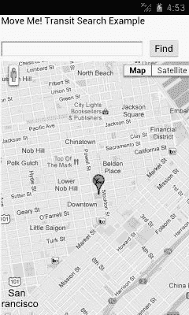
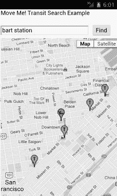
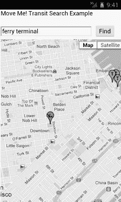
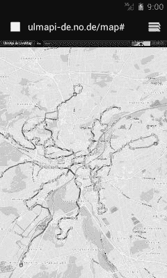

# 十、使用云服务：一个运输应用

掌握地理定位的基础知识是很好的，正如我们在第 9 章学到的那样，我们可以享受使用坐标的乐趣。一旦我们知道我们在哪里，以及有什么其他服务可以将我们的位置信息与其他数据混合，一个巨大的可能性就出现了。在这一章中，我们将利用我们的地理定位技术，并结合一些本地搜索功能，来构建一个个性化的公交应用。

我们的示例交通应用将找到您所在的位置，然后搜索离您最近的交通选项，无论是公共汽车站、地铁或火车站，甚至是机场。有了这些基础，您就可以将我们的 transit 应用扩展到几乎任何搜索加定位问题。

作为一名开发人员，在将基于 web 或基于云的服务与您自己的应用相结合时，您有许多选择来决定需要做多少工作。您可以选择使用公开可用的数据源构建自己的服务，使用完整的服务，或者构建混合服务。使用完整的服务在这一章中没有什么可谈的，所以我们选择了一种混合的方法，在这种方法中，我们将使用我们的地理定位技术来使用标准的搜索服务来提供有用的交通信息。

在我们深入研究代码、示例和解释之前，先花一分钟考虑一下您可能已经使用过，但可能没有积极思考过的各种构件。当构建任何类型的交通或运输应用时，我们希望将知识和数据结合起来，然后向用户提供一些有用的选项。这些将包括:

*   我是谁？在某种程度上，将“谁”在使用您的应用看作是实际用户、他们正在使用的设备及其功能的组合是很有用的。我们将重用我们在[第 9 章](09.html#ch9)中提到的检测代码来确定一个设备是否支持地理定位。
*   **我在哪里？**从[第 9 章](09.html#ch9)中，我们了解了如何通过用户 Android 设备和浏览器的地理定位功能来确定用户的位置。我们将从这一基本出发点出发，推动其他选择。
*   我想去哪里？这永远是一个微妙的问题。应用用户心中是否有一个位置，或者一种交通方式，或者实际上对如何在点与点之间旅行有任何偏好。这里要记住的两个关键点是，不要过早地限制应用中可用的选项，当您限制选项时，您是故意这样做的，并且将用户带在身边。例如，让他们知道其他路线或交通方式是可行的。
*   在线服务对我和我的位置有什么了解？这是一个很大的领域，涵盖了许多通用服务。给定一个位置，以及某种期望的旅程或目的地，考虑一下作为开发人员您可以获得哪些帮助，这样您就不需要自己做所有的工作。例如，Google、Yahoo 和 Microsoft 等公司的通用 web 搜索 API 可以处理多种类型的公交搜索，包括查找公交站点、测量距离和计算公交时间。使用这些工具，这样你就不必亲自动手了(当然，除非你的目标是在那个领域竞争)。
*   哪些专业服务知道我的位置？要考虑的最大领域，但不要被吓倒。专门的 API 和服务存在于令人眼花缭乱的一系列交通和运输类型中。世界上有大量的公共交通机构提供调度和路线数据，我们将在本章后面讨论。然而，许多还提供了一个直接的 API 来回答下一个服务、最近的服务等等的查询。聚合器的存在是为了提供泛提供商服务。一个例子是 Kayak 的航空运输搜索。通过思考(并询问)用户为什么想要进行一次特定的旅行，您可以进一步使用专门的 API。如果是去看电影，在餐馆吃饭，或者参加一些其他活动，像 Yelp、猫途鹰和其他服务提供 API 来搜索特定的地点和活动。作为应用开发人员，您可以创建有用的应用，将所有这些结合起来，以针对您的用户。
*   根据这些知识，我能得出什么有用的结论？利用您的应用收集的关于用户在哪里、他们想去哪里以及当他们到达那里时想做什么的数据，您开始描绘您的应用的流程和特性。专注于使用前面段落中描述的构建块，而不是重新发明它们，你将构建出引人注目的突出应用。例如，假设您知道用户想乘船从曼哈顿到布鲁克林去参观一家特定的餐馆。你可以将体验提升到一个新的水平，使用 OpenTable 在线服务来检查可用性，并注意到用户的餐厅已经预订一空，而是建议在哈德逊河上进行晚餐巡航。你让他们省去了一次令人失望的旅行，反而给了他们一次美好的经历。

因此，现在我们有了关于我们想要构建什么，以及为什么用户想要使用这样一个应用的大图。我们开始吧！

### 介绍“移动我”示例应用

我们的示例应用名为“移动我”我们将使用它来探索如何从任何位置找到附近的交通选项。当然，我们将使用我们在第 9 章中提到的技术来探测我们的位置。也就是说，我们将使用 Android 设备的地理定位功能来确定我们的纬度和经度，然后使用这些数据来驱动搜索服务，以找到我们首选的交通方式。

#### 检查代码

[清单 10–1](#list_10_1)显示了第一版 Move Me 的代码。不要被它的长度吓倒:我们将对它进行分解，涵盖各个组件，让您了解它的工作方式，并启发您进一步使用这个示例，并将其扩展到您自己的想法。

**清单 10–1。***Move Me 应用源代码，第 1 版*

`<!--
 Licensed under the Apache License, Version 2.0: http://www.apache.org/licenses/LICENSE-2.0
 -->
<html>
    <head>
        <title>Move Me! - Transit Search Example
        </title>
        <link href="./ch10–example9781430239574.css" rel="stylesheet" type="text/css"/>
        
        
    </head>
    <body>
        
Move Me! Transit Search Example

        

            <input type="text" id="searchtext" style="width: 240px;"/>
            <input type="button" value="Find" onclick="execSearch()"/>
            

                

                

            

            

        

    </body>
</html>`

首先，让我们把简单的事情处理掉。在第 9 章的[中，你应该已经从我们的地理定位介绍中认出了几个 JavaScript 函数。我们的老朋友`supportsGeo()`和`changeDiv()`都在，分别执行相同的地理位置支持检测功能和`
`内容改变功能。](09.html#ch9)

我们的示例代码稍微改变了我们调用一些我们正在使用的公共可用服务的方式。在这种情况下，因为我们已经选择使用 Google 的地图 API 和它的搜索 API，我们已经重构了加载 Google 的 JavaScript 库，首先加载基本框架，如下所示

``

然后，在我们自己的 JavaScript 中，我们使用 Google 的`google.load()`函数来额外加载地图 API 和搜索 API。如果您选择另一个服务或一组服务，比如 Bing、Yahoo、Baidu 或其他服务，那么加载 API 将会改变，以匹配这些服务的适当调用。对于我们的例子，代码非常简单:

`google.load('maps' , '3', {"other_params":"sensor=false"});
google.load('search', '1');`

 **注意:**如果你对谷歌地图第二版 API 更熟悉的话，你可以恢复使用它，但当你使用依赖该版本 API 的网站时，你会看到反复的警告，说它已被否决。

#### 处理全局状态

接下来，我们设置一些全局状态变量，让您很好地了解我们要做什么来使我们的 transit 应用工作。

`var myLatLong;
var myTransitMap;
var myLocalSearch;
var searchResults = [];`

变量名有望描述它们的用途，但是如果有任何疑问，我们将使用`myLatLong`来保存用户的坐标；`myTransitMap`表示用户位置的地图，最终还将包括附近的交通选项；`myLocalSearch`是搜索对象，它将包含我们查找相关交通选项的标准；最后，`searchResults`数组将保存从我们的`myLocalSearch`搜索返回的结果。

#### 定制位置标记

如果你曾经使用过在线地图服务(任何种类的)，你可能对用于精确定位的虚拟“地图图钉”很熟悉。在我们的例子中，当我们使用谷歌地图时，我们使用`google.maps.Marker`对象来表示地图上的特定位置。我们没有使用 Google Maps 默认自带的普通红色地图标记图标，而是为 Move Me 应用制作了一些自定义标记。我们定制的`google.map.MarkerImage`图形的代码如下。

`var resultMarker = new google.maps.MarkerImage(
    "Red_Train_Marker.png",
    new google.maps.Size(20, 34),
    new google.maps.Point(0, 0),
    new google.maps.Point(10, 34));
var youMarker = new google.maps.MarkerImage(
    "You_Marker.png",
    new google.maps.Size(20, 34),
    new google.maps.Point(0, 0),
    new google.maps.Point(10, 34));`

参考的两个`.png`图像文件包含在本书的源代码中。第一个是`Red_Train_Marker.png`，是谷歌地图使用的普通红色大头针，加上字母 T，代表过境或运输。`You_Marker.png`地图图钉是一个蓝色的标记，上面有“你”字。我们已经为地图图钉指定了正常大小，以帮助用户点击标记来查看“信息气泡”以了解给定点的更多详细信息。这使得小手机屏幕上的 pin 看起来有些大，但保持正常大小是很重要的，以便用户在按下屏幕时不太可能错过触摸 pin。

您会注意到两个`MarkerImage`对象都有两个对`google.map.Point()`的调用。第一个设置图像的原点，用作覆盖图。在我们前面的例子中，我们没有改变默认设置。对`google.map.Point()`的第二次调用为图像设置锚。默认情况下，当一个 `google.map.Marker`覆盖在地图上时，任何关联的`MarkerImage`都会在定位点的图像左上方呈现。我们实际上希望大头针图像的尖端看起来直观地指向我们感兴趣的位置，所以我们希望`MarkerImage`的中间、底部边缘与我们的位置结果对齐。为了实现这一点，您会看到我们将锚点偏移了大头针图像宽度的一半(10 像素)，大头针图像的完整高度为 34 像素。

#### 准备我们的地图

做好这些准备后，我们开始使用驱动 transit 应用的主要函数,`prepareMap()`函数。

`function prepareMap() {
    getLocation();

    myTransitMap = new google.maps.Map(document.getElementById("map"), {
        center: myLatLong,
        zoom: 14,
        mapTypeId: google.maps.MapTypeId.ROADMAP
    });

    var yourMarker = new google.maps.Marker({
        position: myLatLong,
        map: myTransitMap,
        icon: youMarker,
        title:"You!"
    });

    myLocalSearch = new GlocalSearch();
    myLocalSearch.setSearchCompleteCallback(null, processLocalSearchResults);
}`

`prepareMap()`功能很容易理解，分为四个主要动作。首先，我们调用我们的`getLocation()`函数，它主要是我们在[第 9 章](09.html#ch9)的[清单 9-5](09.html#list_9_5) 中的`initialize()`函数中展示的代码的重新标记版本。为了完整起见，这里再次说明:

`function getLocation() {
    if (supportsGeo()) {
        myLatitude = "";
        myLongitude = "";
        navigator.geolocation.getCurrentPosition(
            function(position) {
                myLatitude = position.coords.latitude;
                myLongitude = position.coords.longitude;
            },
            function(error) {
                switch(error.code) {
                    case error.TIMEOUT:
                        alert ('Geolocation returned a timeout error');
                        break;
                    case error.POSITION_UNAVAILABLE:
                        alert ('Geolocation returned a position unavailable error');
                        break;` `                    case error.PERMISSION_DENIED:
                        alert ('Geolocation returned permission denied (did you deny access?)');
                        break;
                    case error.UNKNOWN_ERROR:
                        alert ('Geolocation encountered an unknown error');
                        break;
                }
            }
        );
    }
    myLatLong = new google.maps.LatLng(myLatitude, myLongitude);
}`

如前一章所述，它使用浏览器的`navigator.geolocation`对象来确定您的纬度和经度。为了节省空间，我们将省略重复几乎相同的代码。

然后我们创建一个名为`myTransitMap`的新的`google.maps.Map`对象，将地图的中心放在我们检测到的位置上。我们将缩放级别设置为 14，因为这对于步行的人来说是一个很好的比例，尽管您可以将其更改为任何所需的缩放设置。我们也选择标准的道路地图风格的地图，而不是卫星视图。

提示:这里有一些缩放级别设置的便利值，在为用户渲染地图时要记住。

**缩放级别 12:** 适合公路级别驾驶，显示几十英里或几公里以上的主要路线。

**缩放级别 14:** 适用于市内驾驶，距离超过几十码或几米时的一般步行方向

**缩放级别 15:** 最适合详细的行走，显示建筑物轮廓，以及显示单行道和其他障碍物的驾驶方向。

在我们的`myTransitMap`对象上，我们在为手机或设备检测到的相同纬度和经度处放置一个标记。我们使用自定义的蓝色“你”标记，如前所述，甚至提供一些悬停文本来强调这个大头针将你放在地图上。

最后，我们构造一个新的本地搜索对象`myLocalSearch`，然后注册回调函数`processLocalSearchResults()`。当这个搜索对象完成搜索执行时，将调用这个函数。回调的机制将在本章的稍后部分展示。随着`prepareMap()`功能的完成，我们实际上可以看到当用户最初在他们的设备上运行我们的应用时是什么样子，如图[Figure 10–1](#fig_10_1)所示。

**图 10–1。【the Move Me 示例应用的初始屏幕**

我们对开始的例子做了一些改动，将我们在 Android 模拟器中的坐标设置为一个相当著名的位置:旧金山的联合广场。这并不像听起来那么做作。想象自己是旧金山的游客。你已经看到了这个城市的风景和声音，发现自己在联合广场，想找一辆火车，公共汽车，或渡轮到您的酒店或其他目的地。这就是我们示例应用中其余功能发挥作用的地方。

#### 执行本地交通搜索

我们示例中接下来的两个函数执行我们选择的本地搜索，并处理结果。

`function execSearch() {
    var searchText = document.getElementById("searchtext").value;
    myLocalSearch.execute(searchText);
}`

`execSearch()`函数只是读取 HTML 表单上`searchtext`字段的内容，见[Figure 10–1](#fig_10_1)的顶部，并用该文本调用`myLocalSearch()`对象上的`execute`方法。我们将`processLocalSearchResults()`方法注册为当`myLocalSearch()`报告执行完成时的回调函数。

`function processLocalSearchResults() {
    for (var i = 0; i < myLocalSearch.results.length; i++) {
        searchResults.push(new LocalResult(myLocalSearch.results[i]));
  }
}`

`processLocalSearchResults()`函数遍历我们的结果，实例化一个`LocalResult`对象，并将它们添加到`searchResults`数组中。`LocalResult`对象是 Google 在它的许多 API 示例中使用的常见示例对象，我们在这里复制了它。我们使用它主要是为了方便我们访问本地搜索结果的坐标。它做的工作与我们之前的代码类似，因为它在我们的地图上放置了一个标记，并且它还创建了一个文本结果列表。在我们当前的例子中，我们已经创建了 CSS 来隐藏文本列表，但是我们将很快介绍这方面的选项。

最后，就我们的 JavaScript 而言，我们将`prepareMap()`函数注册为回调函数，以便在 Google Search API 完成加载后调用。

`GSearch.setOnLoadCallback(prepareMap);`

剩下的就是实际的 HTML 代码，它控制我们的地图、搜索字段和查找按钮的大小，以及相关的`
`名称和嵌套。我们特意为整个显示选择了明确的像素大小，以及其中包含的地图对象，以适应手机上的垂直显示和平板电脑上的水平显示，同时还显示我们将在本章稍后介绍的文本结果。

`<body>
    
Move Me! Transit Search Example

    

        <input type="text" id="searchtext" style="width: 240px;"/>
        <input type="button" value="Find" onclick="execSearch()"/>
        

            

            

         

         

         

    

</body>`

我们的 HTML 显示了您在[Figure 10–1](#fig_10_1)中看到的简单表单。

#### 运行我们的代码

那么，当我们实际搜索交通工具时会发生什么呢？到目前为止，在我们的示例中，我们的候选用户是一名游客，他发现自己在联合广场，正在寻找最近的交通工具。如果你发现自己在旧金山，你可能会想到使用湾区交通系统，或 BART。所以让我们以此为标准来显示当我们调用`execSearch()`时实际发生了什么。[图 10–2](#fig_10_2)显示了通过本地搜索调用返回的结果，使用`LocalResult`对象绘制在地图上。

**图 10–2。** *我们的 Move Me 应用显示附近的交通选项*

瞧，我们找到了四个最近的地铁站，从市中心到恩巴卡德罗。您还可以看到我们在本章开始时描述的自定义 transit `MarkerImage`和`Marker`对象的最终渲染。

也许，作为一名游客，你真的是在寻找旧金山湾的美景，还有什么比找到最近的渡轮码头来寻找世界上最伟大的水道之一更好的方式呢？[图 10–3](#fig_10_3)显示了我们的应用查找最近的渡轮码头。

**图 10–3。** *找轮渡运输带搬我*

我们又一次找到了我们想要的运输方式。在这种情况下，您会注意到几个标记重叠在一个位置上。这是谷歌的搜索，返回了几个不同的渡轮公司和从该位置运营的渡轮选项，而不是我们使用的 HTML 或 JavaScript 中的错误。

### 改进“移动我”示例应用

到目前为止，您可能已经注意到，我们表单的简单性实际上变得有点麻烦了。当然，你的用户可以在他们的本地搜索中输入任何他们喜欢的东西，但是也许你想让他们不用在小软键盘上打字。我们示例代码的第二个版本，在文件`ch10–example02.html`中，修改了表单代码，为流行的交通类型提供了简单的按钮，并调用了我们修改后的`execSearch()`函数。我们的新表单编码如下。

`

    <input type="button" value="Subway" onclick="execSearch('BART station')"/>
    <input type="button" value="Train" onclick="execSearch('train station')"/>
    <input type="button" value="Bus" onclick="execSearch('bus stop')"/>
    <input type="button" value="Ferry" onclick="execSearch('ferry terminal')"/>

`

我们修改后的`execSearch()`函数不再需要读取文本字段，主要是因为我们已经移除了它！相反，它将我们调用函数时传递的文本作为参数，比如“火车站”或“渡轮码头”，并调用相关搜索的执行。

`function execSearch(searchText) {
  myLocalSearch.execute(searchText);
}`

我们的应用现在看起来更容易立即使用，有地铁、火车、公共汽车等等的相关按钮，如图[Figure 10–4](#fig_10_4)所示。

**图 10–4。** *使用专用中转按钮移动我应用*

从这里开始，按下一个按钮会产生和以前一样的结果，显然是为了匹配每个按钮的编码标准而定制的。

#### 处理其他运输可能性

有无数种方法可以让这个例子更进一步。一个明显的例子是增加交通选项按钮的数量。你可以包括出租车，机场，电车，等等。还有其他细微差别需要考虑。旧金山的地铁可以指 BART 系统，但市政系统的大部分也被认为是地铁。在其他城市，地铁有其他的名字，比如伦敦的“Underground”或者巴黎的“Metro”。代码可以扩展为重用您的坐标来确定用户当前所在的城市，并且搜索文本可以相应地本地化。

#### 我们方法的局限性

到目前为止，我们的例子有助于找到我们自己或当地的交通站或车站。这无疑有助于从任何给定的位置制定出可能的交通选择，但就像一次未完成的旅程，它让我们离我们真正想去的地方很近。我们可能知道拐角处就有一个公交车站，或者街道尽头就有一个火车站，但是我们知道从这些地方有哪些服务，以及它们要去哪里吗？我们知道下一次服务预定什么时候到达吗？我们到底知不知道那个车站有没有定期航班？

如果有某种方法可以为我们发现的中转站点找到匹配的中转计划数据就好了！

### 引入公交数据资源

到目前为止，我们已经探索了如何找到我们自己和我们周围可能的交通选择，并在地图上绘制结果。但是任何一个旅行者都会告诉你，知道*何时*交通工具运行和知道它们在哪里运行一样重要。如果有办法使用公共汽车时刻表、火车时刻表和其他交通时刻表来扩展我们的交通应用的可能性，那不是很好吗？嗯，有一个办法！

#### 利用交通时刻表和时刻表

尝试使用运输机构的数据的历史是漫长而曲折的。为了避免您之前的开发人员不得不忍受的痛苦，我们将缩短我们的故事:我们将专注于“那时”和“现在”1995 年以前，与各种政府或官僚机构打交道以获取他们的交通数据是一种代价高昂的受虐狂行为。未记录的专有格式、蓄意阻挠的政府官员和扭曲的所有权概念给任何使用“公共”交通数据的尝试蒙上了阴影。

1995 年，美国俄勒冈州主要城市波特兰的 TriMet 运输机构的一名员工对自己可以使用的专有地图和运输数据系统和来源感到沮丧。她写信给当时许多领先的地图和地理定位服务，询问他们有什么计划将公共交通数据纳入他们的服务。只有一家公司回应:谷歌。

从当时开发人员的角度来看，处理保管数据的机构的不稳定——甚至有时反复无常——的态度是非常令人沮丧和复杂的。但 TriMet 的试探性问题揭示了一个想法，即希望访问数据的沮丧的开发人员与希望看到数据更好地用于服务社区的沮丧的数据保管人和公共官员相匹配。

这引发了通用运输馈送规范(GTFS)的兴起，该规范旨在为运输数据格式提供一致的协议。这个时代的任何历史学家都会注意到，GTFS 格式几乎完全是波特兰 TriMet 公司用于传输数据的格式。通常情况下，特定技术领域的先行者是事实上的标准制定者*。很快，更多的政府和运输机构有远见地以这种格式发布他们持有的数据，这已经成为共享运输时间表、路线和相关数据的标准。*

 *几乎每个人都曾坐过公共汽车、火车、飞机或渡船，因此我们可以跳过 GTFS feed 的基本概念。相反，让我们从一个 Android 开发者的角度来看一下规范。

##### 检查 GTFS 组件

GTFS 提要就是一堆逗号分隔格式的文本数据，分成几个文本文件，然后打包成一个 zip 文件以便于处理。作为 web 应用或原生 Android 应用的开发人员，您可以获取 GTFS 提要的 zip 文件，然后使用它将交通位置、时间表信息等合并到您的代码中。典型的 GTFS zip 文件由(并且需要)以下文本文件组成:

*   **Agency.txt** 提供 GTFS 数据包中数据的机构和组织。
*   基于每周花名册的各种服务的日期。这包括服务的开始和结束日期的详细信息，以及服务可用和不可用的日期。
*   给定服务的停靠站集合，以及它们之间的路径。这与大多数人认为的单一公交路线、火车旅程等相匹配。
*   服务停止让乘客上下车的明显位置，包括终点站或终点。
*   **Stop_times.txt** 给定车辆到达和离开停靠点的时间。这也允许计算“停留时间”，即服务停留在停止状态的时间。
*   **Trips.txt** 给定路线的行程，其中给定车辆连续停靠。

除了前面的强制文件列表之外，给定的 GTFS 馈送还可以在相应的文本文件中包括以下可选附加数据中的一些或全部

*   **Calendar_dates.txt** 在 calendar.txt 文件中列出标准排班的服务细节的例外情况。
*   **Fare_attributes.txt** 由运营服务的机构收取的使用特定服务的实际费用的详细信息。
*   **Fare_rules.txt** 用于应用在 fare_attributes.txt 中指定的票价的规则。这可以包括诸如高峰和非高峰规则、对学生、老年人的优惠等等。
*   **Feed_info.txt** 关于此 GTFS 源的附加信息，例如版本号和适用日期。
*   **frequency . txt**不按固定频率运行的服务的定时信息。
*   **Shapes.txt** 帮助渲染路线图形的细节，比如如何表示出、回程路径的差异，回程点等。
*   关于从一个服务转移到另一个服务的任何规则的细节。

单个文件字段、格式要求和其他规则的细节可以在许多与 GTFS 相关的网站上找到，比如`[https://developers.google.com/transit/](https://developers.google.com/transit/)`。

世界各地的许多运输机构在`[www.gtfs-data-exchange.com/](http://www.gtfs-data-exchange.com/)`利用 GTFS 数据的中央交换所。该网站不仅充当 GTFS 馈送的中央存储库，而且包括关于规范的基本数据，以及关于如何贡献新 GTFS 数据集的细节。

如果这一切听起来不可思议——近乎乌托邦——有一个小问题总是影响着运输时间表和路线的理想，以及通勤者或游客的现实。当服务没有按时运行，或者根本没有运行时，会发生什么？输入 GTFS 实时标准。

##### 处理时间表现实

GTFS-实时时间是一个相对较新的除了 GTFS 的核心，由一组感兴趣的各方在 2011 年 8 月发布。它旨在以提供实时更新运输服务时间表的形式，解决“理论何时符合实践”的永恒问题。它向订阅数据的任何人实时提供以下类型的更新。

*   **行程更新:**计划服务的任何路线、时间变更或取消
*   **服务警报:**服务级别的变化，例如移动的站、关闭的站，或者甚至是整个网络的问题，例如电源故障或切换问题。
*   **车辆位置:**车辆在交通系统中的位置，以及车辆自身或相关交通基础设施提供的当地拥堵信息。

谷歌是 GTFS 实时系统发展的关键参与者，这在数据格式的选择上是显而易见的。GTFS 实时公司没有遵循基本 GTFS 标准的逗号分隔格式，而是采用了谷歌的协议缓冲格式。这只是另一种数据格式，它是基于高效的平台无关的序列化和反序列化的理念而创建的——基本上是一种与 XML 类似的简洁格式。实际上，这只是意味着需要参考协议缓冲区定义来确定文本/数据中的字段长度和属性。

#### 探索 GTFS 的例子

我们的章节已经很长了，介绍和探索一个小的 GTFS 例子将会涉及数百行 JavaScript、HTML 和 CSS。这并不是因为这些示例很难或很复杂，而是因为它们需要处理我们在本章中已经处理过的所有地理定位和地图渲染样式代码，以及大量文本处理代码和 I/O 代码来处理 GTFS 数据。

就其本身而言，将有足够的材料来单独出版一本书，因此，与其用如此大的篇幅来淹没我们的书，我们不如在网上调出一些优秀的公开可用的例子，你可以下载并探索你内心的内容，以发现更多关于 GTFS 及其可能性的信息。

在线提供的一些著名且非常有用的 GTFS 开源示例包括:

*   **谷歌公交开发者页面**作为 GTFS 社区的活跃成员，谷歌在网上有大量的例子。将你的浏览器指向`[https://developers.google.com/transit/gtfs/examples/display-to-users](https://developers.google.com/transit/gtfs/examples/display-to-users)`以获得大量的例子和背景信息。
*   **One Busway 项目**最初由开发人员在普吉特湾创建，`[http://developer.onebusaway.org](http://developer.onebusaway.org)`是 One bus way 项目的所在地，该项目已扩展为面向 GTFS 开发人员的全球计划。
*   **社区项目**如 UlmApi.de 的 Live Map，这是一次黑客马拉松的成果，它在几个小时内就构建了一个功能齐全的 GTFS 交通应用。完整的项目详情请见`[https://github.com/UlmApi/livemap](https://github.com/UlmApi/livemap)`

在[图 10–5](#fig_10_5)中，您可以看到 Ulm 清晨的完整交通系统，由 UlmApi.de Web 应用为 Android 渲染。

**图 10–5。** *安卓浏览器中的 UlmApi.de hackathon GTFS 应用*

本着基于公交和运输应用的真正精神，我们邀请您去探索这些和其他 GTFS 网站，并看看乘坐带您去哪里！

### 总结

在这一章中，我们探讨了 Android 基于位置的 Web 应用的进一步开发。我们的例子已经介绍了如何使用 Google 流行的本地搜索 web 服务来演示如何为脚步匆匆的游客找到火车、地铁、渡轮和其他交通工具。我们只是触及了像 GTFS 这样的交通数据馈送系统的表面，但是你现在已经知道了足够多的信息来探索你可以利用的许多在线选项。我们希望我们的示例应用已经展示了将基于手机的定位功能与基于云的服务相结合来创建有用的 mashups 和非常易于开发的功能是多么容易。*