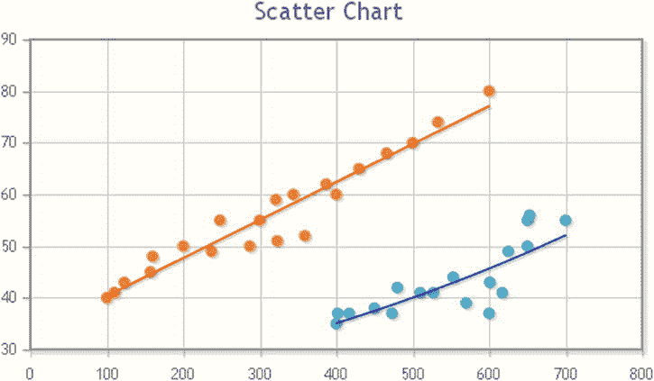
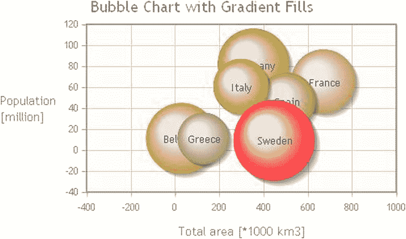

# 十三、jqPlot 散点图和气泡图

Abstract

在这一章中，我将讨论一类在表示数据分布时特别有用的图表。您可能会经常发现自己对一组数据如何沿两个不同参数定义的空间分布感兴趣，这两个参数沿 x 轴和 y 轴显示。这种数据分布可以暗示相关性或聚类。

在这一章中，我将讨论一类在表示数据分布时特别有用的图表。您可能会经常发现自己对一组数据如何沿两个不同参数定义的空间分布感兴趣，这两个参数沿 x 轴和 y 轴显示。这种数据分布可以暗示相关性或聚类。

散点图是显示数据分布的最佳选择，尤其是当需要分析大量数据时。因此，您将首先使用一个简单的示例来学习如何实现这种图表。随后，您将看到，一旦定义了两个不同的数据组(聚类)，就可以通过趋势线突出显示 x 和 y 变量之间的相关性。

最后，您将分析另外两种类型的图表:气泡图和块状图。这些可以被认为是散点图的变体，其中数据点被气泡或方块取代。当您需要用三个不同的参数来表示数据时，可以使用气泡图(散点图只适用于两个参数)；第三个参数由气泡的半径表示。方块图是一种特殊的散点图，在其中，您使用包含标签的方框来代替数据点。

## 散点图(xy 散点图)

乍一看，您可能认为散点图(也称为散点图或 xy 图)是一种点不相连的折线图，但这将是一个错误。事实上，散点图、气泡图和块状图都是一种特殊的图表。在散点图中，点由(x，y)对表示，但是您可以获得许多具有相同 x 值的点，这使得用线将它们连接起来既困难又不必要。折线图的目的是跟踪 x 值范围内 y 值的进度。散点图的目的是显示一组点，这些点可能有也可能没有某种关系(可以是非线性的)。此外，您可能希望分析这些点及其在(x，y)空间中的分布，例如，当它们分布在空间上独立的组中时。

您使用默认设置(如在折线图中)，禁用点之间的线。例如，让我们看两个(x，y)数据集合，它们可能呈现某种形式的关系，如清单 13-1 所示。

清单 13-1。ch13_04a.html

`var data = [[400, 35], [402, 37], [650, 55], [653, 56], [650, 50],`

`[700, 55], [600, 37], [601, 43], [450, 38], [473, 37],`

`[480, 42], [417, 37], [510, 41], [553, 44], [570, 39],`

`[527, 41], [617, 41], [625, 49]];`

`var data2 = [[100, 40], [600, 80], [200, 50], [300, 55], [400, 60],`

`[500, 70], [123, 43], [110, 41], [157, 45], [160, 48],`

`[237, 49], [248, 55], [287, 50], [321, 59], [359, 52],`

`[387, 62], [466, 68], [533, 74], [344, 60], [323, 51],`

`[430, 65]];`

与折线图不同，您输入的点没有任何顺序。如前所述，您使用默认设置，通过将`showLine`属性设置为“【T1””来禁用点之间的线(参见清单 13-2)。

清单 13-2。ch13_04a.html(使用'`false`'禁用点之间的线)

`var options = {`

`title: 'Scatter Chart',`

`seriesDefaults: {`

`showLine: false,`

`showMarkers: true`

`}`

`};`

`$.jqplot('myChart', [data, data2], options);`

这样你就得到图 [13-1](#Fig1) 中的散点图，其中两组数据覆盖了图表的两个不同区域。这些点被分成定义明确的组。

图 13-1。

A scatter chart

只有当两个数据集合被表示出来时，确定它们是否遵循线性或指数趋势才有意义。在这里，您可以使用 jqPlot 的趋势线功能。因此，您包括了趋势线插件:

``

或者，如果您更喜欢使用内容交付网络(CDN)服务，您可以按照以下方式进行:

``

或者，如果您更喜欢使用 CDN 服务，您可以按如下方式操作:

``

或者，如果您更喜欢使用 CDN 服务，您可以按如下方式操作:

`<script type="text/javascript" src="`[`http://cdn.jsdelivr.net/jqplot/1.0.8/plugins/jqplot.blockRenderer.min.js`](http://cdn.jsdelivr.net/jqplot/1.0.8/plugins/jqplot.blockRenderer.min.js)T2】

在本例中，您将使用三组数据。输入数据数组应该具有以下格式:

`[x, y, 'Label'],`

现在，定义三个不同的数组，如清单 13-9 所示。

清单 13-9。ch13_03.html

`var data1 = [[10, 30, 'Copper'], [100, 40, 'Gold'], [50, 50, 'Silver'],`

`[12, 78, 'Lead'], [44, 66, 'Brass']];`

`var data2 = [[68, 15, 'Maple'], [33, 22, 'Oak'],[10, 90, 'Ebony'],`

`[94, 30, 'Beech'],[70, 70, 'Ash']];`

`var data3 = [[22, 16, 'PVC'], [56, 76, 'PE'], [33, 78, 'PET'],`

`[27, 60, 'PC'], [70, 44, 'PU']];`

在`options`中，你只需要激活`seriesDefault`对象中的 BlockRenderer 插件(见清单 13-10)。

清单 13-10。ch13_03.html(激活`BlockRenderer`插件)

`var options = {`

`seriesDefaults:{`

`renderer: $.jqplot.BlockRenderer`

`}`

`};`

`$.jqplot ('myChart', [data1, data2, data3], options);`

图 [13-6](#Fig6) 给出了您刚刚定义的框图，其中每个系列用不同的颜色标记。

图 13-6。

A block chart

## 摘要

在这一章中，你已经学会了如何表示一个分布。您可能会经常发现自己对研究数据在空间中的分布感兴趣，以便发现任何可能的趋势或聚类。根据您更想突出什么，您可以选择通过散点图、气泡图或方块图来表示数据。此外，您已经看到了如何突出一个分布的趋势。

在下一章中，我将收集其他类型的图表，这些图表您还没有看过，但是属于 jqPlot 库的标准类型。首先，您将学习漏斗图以及如何通过`options`设置其属性。然后，您将发现贝塞尔曲线——它们是什么，以及 jqPlot 如何实现它们。