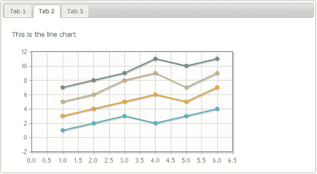
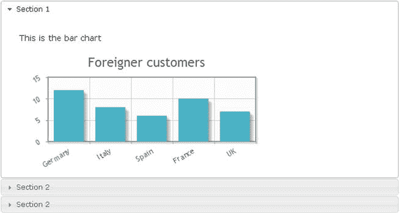
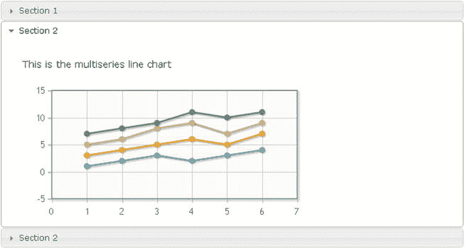
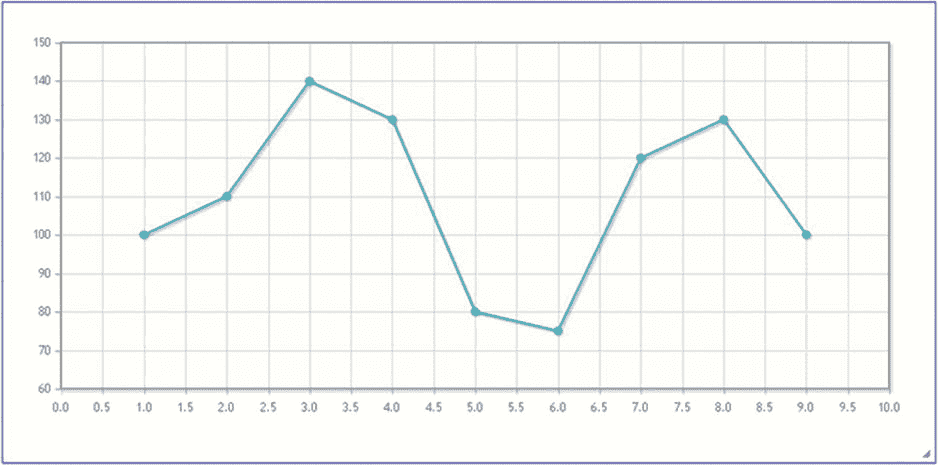

# 十六、在 jQuery 小部件中嵌入 jqPlot 图表

Abstract

在第 2 章中，您看到了几个用作容器的 jQuery UI 小部件的例子。在本章中，您将利用这种能力来表示这些容器中的图表。这使您能够利用 jQuery UI 小部件的巨大潜力来进一步改进图表的表示方式。

在第 2 章中，您看到了几个 jQuery UI 小部件被用作容器的例子。在本章中，您将利用这种能力来表示这些容器中的图表。这使您能够利用 jQuery UI 小部件的巨大潜力来进一步改进图表的表示方式。

结合 jQuery UI 和 jqPlot 库的好处是多方面的:可以在网页中显示更多占用相同空间的图表，同时保持页面的上下文整洁。另一个优点是 jQuery UI 小部件可以调整大小，甚至用户可以调整 jqPlot 图表的大小。

在本章中，您将探索三个简单的案例，在这些案例中，刚才提到的好处将变得显而易见。你在使用 jQuery UI 小部件时也会变得更加自信，甚至比你在第 2 章中做的还要自信。

## 选项卡上的 jqPlot 图表

你要用作容器的第一个小部件是选项卡(参见第 2 章的[中的“选项卡”一节)。在选项卡内插入图表允许您在同一页面的有限区域内显示不同的图表。在本例中，您将在三个选项卡中放置三个不同的 jqPlot 图表，分别称为`Tab 1`、`Tab 2`和`Tab 3`。在第一个选项卡中，您将放置一个条形图，在第二个选项卡中，您将放置一个多系列折线图，在最后一个选项卡中，您将放置一个饼图。您不会详细分析这些图表，因为它们与前几章中使用的图表完全相同。每种类型的图表都需要特定的插件，清单 16-1 显示了所需插件的列表。](02.html)

清单 16-1。ch16_01.html

`<!--[if lt IE 9]>`

``

`<link rel="stylesheet" type="text/css"`

`href="`[`http://cdn.jsdelivr.net/jqplot/1.0.8/jquery.jqplot.min.css`](http://cdn.jsdelivr.net/jqplot/1.0.8/jquery.jqplot.min.css)T2】

``

``

`<link rel="stylesheet" type="text/css" href="../src/jquery.jqplot.min.css" />`

`<link rel="stylesheet" href="../src/css/smoothness/jquery-ui-1.10.3.custom.min.css" />`

``

``

``

``

``

``

``

随着网页上引入如此多的图形元素，级联样式表(CSS)样式的使用变得越来越重要。您需要定义一些设置来修改选项卡的外观，使它们符合您的需要。添加清单 16-2 中的样式设置。

清单 16-2。ch16_01.html

``

您将使用三种不同的图表，它们已经在前面的章节中使用过(参见[第 9 章](09.html)的折线图、[第 10 章](10.html)的条形图和[第 11 章](11.html)的饼图)。因此，这一章不包括它们设置的细节。将它们添加到我们的 web 页面，用`chart1`、`chart2`和`chart3`替换通常的目标名称`myChart`。正如你在清单 16-3 中看到的，在这些图表中，你已经直接在三个`jqplot()`函数中定义了`options`对象。它们的返回值存储在三个不同的变量中:`plot1`、`plot2`和`plot3`。这些变量将用于处理 JavaScript 代码中相应的图表。

清单 16-3。ch16_01.html

`var bar1 = [['Germany', 12], ['Italy', 8], ['Spain', 6],`

`['France', 10], ['UK', 7]];`

`var data1 = [1, 2, 3, 2, 3, 4];`

`var data2 = [3, 4, 5, 6, 5, 7];`

`var data3 = [5, 6, 8, 9, 7, 9];`

`var data4 = [7, 8, 9, 11, 10, 11];`

`var pie1 = [`

`['Dairy', 212], ['Meat', 140], ['Grains', 276],`

`['Fish', 131], ['Vegetables', 510], ['Fruit', 325]`

`];`

`var plot1 = $.jqplot ('chart1', [bar1], {`

`title: 'Foreigner customers',`

`series:[{renderer:$.jqplot.BarRenderer}],`

`axesDefaults: {`

`tickRenderer: $.jqplot.CanvasAxisTickRenderer,`

`tickOptions: {`

`angle: -30,`

`fontSize: '10pt'`

`}`

`},`

`axes: {`

`xaxis: {`

`renderer: $.jqplot.CategoryAxisRenderer`

`}`

`}`

`});`

`var plot2 = $.jqplot ('chart2', [data1, data2, data3, data4],{});`

`var plot3 = $.jqplot ('chart3', [pie1], {`

`seriesDefaults: {`

`renderer: jQuery.jqplot.PieRenderer,`

`rendererOptions: {`

`showDataLabels: true,`

`dataLabels: 'value',`

`fill: false,`

`sliceMargin: 6,`

`lineWidth: 5`

`}`

`}`

`});`

现在是时候在`$(document).ready()`函数的末尾添加 jQueryUI `tabs()`函数了，如清单 16-4 所示。

清单 16-4。ch16_01.html

`$(document).ready(function(){`

`...`

`$("#tabs").tabs();`

`});`

这个调用创建了选项卡容器，因此您需要将选项卡绑定到您的绘图上(见清单 16-5)。

清单 16-5。ch16_01.html

`$('#tabs').bind('tabsshow', function(event, ui) {`

`if (ui.index === 0 && plot1._drawCount === 0) {`

`plot1.replot();`

`}`

`else if (ui.index === 1 && plot2._drawCount === 0) {`

`plot2.replot();`

`}`

`else if (ui.index === 2 && plot3._drawCount === 0) {`

`plot3.replot();`

`}`

`});`

选择一个选项卡将重新绘制其中的图表内容。现在，在 web 页面的`<body>`部分，您需要添加 jQuery UI 库将转换成选项卡的`
`元素。方法是用`tabs`指定一个`
`元素作为`id`。在其中，您定义了一个包含三个项目的列表，每个项目代表一个选项卡。在列表之后，您必须定义另外三个`tabs`的子部分:三个额外的`
`元素，称为`tabs-1`、`tabs-2`和`tabs-3`。你将把这些放到你的图表中:`chart1`、`chart2`和`chart3`(见清单 16-6)。

清单 16-6。ch16_01.html

`
`

`<ul>`

`<li><a href="#tabs-1">Tab 1</a></li>`

`<li><a href="#tabs-2">Tab 2</a></li>`

`<li><a href="#tabs-3">Tab 3</a></li>`

`</ul>`

`
`

`
This is the bar chart
`

`

`

`
`

`
`

`
This is the line chart
`

`

`

`
`

`
`

`
This is the pie chart
`

`

`

`
`

`
`

图 [16-1](#Fig1) 显示了最终结果。

T2】

图 16-1。

A page with three tabs containing different charts

## 手风琴上的 jqPlot 图表

另一种常用的 jQuery 容器是 accordion。这一次你将把前三张图表放进手风琴里。web 页面中包含的插件列表与上一个示例中的一样。你需要在 CSS 样式上做一些改变；手风琴有特定的 CSS 类，需要指定它们的属性。它们如清单 16-7 所示。

清单 16-7。ch16_02.html

``

正如您在前一个示例中所做的那样，您必须创建 jQueryUi 小部件。您可以通过调用`accordion()`函数来实现:

`$("#accordion").accordion();`

您还需要将这个 accordion 绑定到您的图表，如清单 16-8 所示。当您选择一个 accordion 选项卡时，该事件确保在其中重新绘制相应的图表，调用`replot()`函数。

清单 16-8。ch16_02.html

`$('#accordion').bind('accordionchange', function(event, ui) {`

`var index = $(this).find("h3").index ( ui.newHeader[0] );`

`if (index === 0) {`

`plot1.replot();`

`}`

`else if (index === 1) {`

`plot2.replot();`

`}`

`else if (index === 2) {`

`plot3.replot();`

`}`

`});`

如您所见，您定义手风琴的方式与您定义选项卡的方式非常相似。以同样的方式，您现在定义了将被转换成 HTML 代码中的折叠标签的`
`元素(见清单 16-9)。

清单 16-9。ch16_02.html

`
`

`<h3><a href="#">Section 1</a></h3>`

`
`

`
This is the bar chart
`

`

`

`
`

`<h3><a href="#">Section 2</a></h3>`

`
`

`
This is the multiseries line chart
`

`

`

`
`

`<h3><a href="#">Section 3</a></h3>`

`
`

`
This is the pie chart
`

`

 
`

`
`

在图 [16-2](#Fig2) 中可以看到，结果与上一个类似，但这次不同的图表是通过垂直滑动 accordion 选项卡来替换的。

T2】

图 16-2。

An accordion widget containing three charts

## 可调整大小和可拖动的图表

您可以在图表中广泛利用的另外两个功能允许用户调整和拖动容器区域。网页中可调整大小的框架允许您任意更改其大小及其包含的对象的大小。这个特性可以与在页面中拖动元素的能力相结合，这将使它们能够相对于原始元素占据不同的位置。

除了赋予页面布局流动性之外，当您希望用户交互地管理页面上不同框架所占据的空间时，该功能有时会很有用(参见图 [16-3](#Fig3) )。

图 16-3。

Enclosing the charts in jQueryUI containers enables you to resize and move them around the page

在本节中，您将看到两个示例。在第一个示例中，您将关注应用于折线图的大小调整。您将看到调整包含在容器中的图表的大小是多么容易。在第二个示例中，您将通过添加两个折线图来进一步开发该示例。一旦所有三个图表都启用了 draggable 属性，您将看到如何根据自己的喜好更改它们的位置，甚至交换它们。

### 可调整大小的折线图

在本例中，您将使用一个简单的折线图。因此，除了 jQuery 容器和基本 jqPlots 库所需的插件之外，您不再需要包含所有的 jqPlot 插件:

`<!--[if lt IE 9]>`

``

`<![endif]-->`

``

``

`<link rel="stylesheet" type="text/css" href="../src/jquery.jqplot.min.css" />`

`<link rel="stylesheet" href="../src/css/smoothness/jquery-ui-1.10.3.custom.min.css" />`

``

或者，如果您喜欢使用内容交付网络(CDN)服务:

`<!--[if lt IE 9]><script type="text/javascript" src="`[`http://cdn.jsdelivr.net/excanvas/r3/excanvas.js`](http://cdn.jsdelivr.net/excanvas/r3/excanvas.js)T2】

`<script src="`[`http://code.jquery.com/jquery-1.9.1.min.js`](http://code.jquery.com/jquery-1.9.1.min.js)T2】

`<script type="text/javascript" src="`[`http://cdn.jsdelivr.net/jqplot/1.0.8/jquery.jqplot.min.js`](http://cdn.jsdelivr.net/jqplot/1.0.8/jquery.jqplot.min.js)T2】

`<link rel="stylesheet" type="text/css" href="`[`http://cdn.jsdelivr.net/jqplot/1.0.8/jquery.jqplot.min.css`](http://cdn.jsdelivr.net/jqplot/1.0.8/jquery.jqplot.min.css)T2】

`<link rel="stylesheet" href="`[`http://code.jquery.com/ui/1.10.3/themes/smoothness/jquery-ui.css`](http://code.jquery.com/ui/1.10.3/themes/smoothness/jquery-ui.css)T2】

`<script src="`[`http://code.jquery.com/ui/1.10.3/jquery-ui.min.js`](http://code.jquery.com/ui/1.10.3/jquery-ui.min.js)T2】

即使在这里也有必要指定一些 CSS 样式，如清单 16-10 所示。

清单 16-10。ch16_03.html

``

在网页的`<body>`部分，你现在添加了`
`元素，它将是包含名为`chart1`的折线图的容器(见清单 16-11)。

清单 16-11。ch16_03.html

`
`

`

`

`
`

现在，在将`chart-container`定义为容器之后，可以用两个 jQuery 方法来处理它——`resizable()`函数添加了可调整大小的功能，而`bind()`函数将调整大小的事件绑定到图表的重新绘制上(参见清单 16-12)。

清单 16-12。ch16_03.html

`$(document).ready(function(){`

`var plot1 = $.jqplot ('chart1', [[100, 110, 140, 130, 80, 75, 120, 130, 100]]);`

`$('div.chart-container').resizable({delay: 20});`

`$('div.chart-container').bind('resize', function(event, ui) {`

`plot1.replot();`

`});`

`});`

结果是一个可调整大小的图表，如图 [16-4](#Fig4) 所示，在右下角有一个灰色的小三角形。通过点击它，用户可以调整容器的大小，从而调整 jqPlot 图表的大小。

图 16-4。

A resizable line chart

### 三个可拖动的折线图

从上一个示例开始，您将通过将折线图放在两个独立的容器中来添加两个折线图。这里的目标——除了使所有三个容器都可以调整大小之外——是使容器可以拖动。最终结果是一个包含三个折线图的网页，可以通过拖动它们来改变它们的位置，甚至交换它们的位置。

首先对前面的例子做一些小的补充。在清单 16-13 中，您添加了另外两个容器(`chart-container2`和`chart-container3`)，里面有新的折线图，分别命名为`chart2`和`chart3`。

清单 16-13。ch16_03b.html

`<BODY>`

`
`

`

`

`
`

`
`

`

`

`
`

`
`

`

`

`
`

`</BODY>`

现在你已经为新的折线图创建了容器，有必要通过三个不同的`$.jqplot()`函数来定义它们(见清单 16-14)。这三个函数返回的值将被传递给三个变量:`plot1`、`plot2`和`plot3`。这是因为每当容器发生变化时，您需要通过对这三个变量使用`replot()`函数来重新绘制这三个图表。

清单 16-14。ch16_03b.html

`$(document).ready(function(){`

`var plot1 = $.jqplot ('chart1', [[100, 110, 140, 130, 80, 75, 120, 130, 100]],`

`{seriesColors: [ "#bb0000" ]});`

`var plot2 = $.jqplot ('chart2', [[120, 90, 150, 120, 110, 75, 90, 120, 110]],`

`{seriesColors: [ "#00bb00" ]});`

`var plot3 = $.jqplot ('chart3', [[ 130, 110, 140, 100, 80, 135, 120, 90, 110]],`

`{seriesColors: [ "#0000bb" ]});`

`$('div.chart-container').resizable({delay:20});`

`...`

`});`

现在，您将为这三个容器激活可拖动特性。做到这一点真的很简单；您需要将该函数添加到应用于每个容器的三个 jQuery 选项中，如清单 16-15 所示。此外，您将为两个新容器添加调整大小功能，其方式与第一个容器相同。

清单 16-15。ch16_03b.html

`$(document).ready(function(){`

`...`

`var plot3 = $.jqplot ('chart3', [[130, 110, 140, 100, 80, 135, 120, 90, 110]],`

`{seriesColors: ["#0000bb"]});`

`$('div.chart-container').draggable({cursor: 'move'});`

`$('div.chart-container2').draggable({cursor: 'move'});`

`$('div.chart-container3').draggable({cursor: 'move'});`

`$('div.chart-container').resizable({delay: 20});`

`$('div.chart-container').bind('resize', function(event, ui) {`

`plot1.replot();`

`});`

`$('div.chart-container2').resizable({delay: 20});`

`$('div.chart-container2').bind('resize', function(event, ui) {`

`plot2.replot();`

`});`

`$('div.chart-container3').resizable({delay: 20});`

`$('div.chart-container3').bind('resize', function(event, ui) {`

`plot3.replot();`

`});`

`});`

剩下的就是添加 CSS 样式，从而定义每个容器的初始位置和大小，如清单 16-16 所示。

清单 16-16。ch16_03b.html

``

在图 [16-5](#Fig5) 中，你可以看到页面初始加载时的页面布局。图 [16-6](#Fig6) 显示了用户改变了第三个图表的位置和大小，使其位于其他两个图表的下方。

图 16-6。

By dragging and resizing the containers, the original layout can be changed

图 16-5。

The web page shows the three line charts enclosed in three different containers

## 摘要

在本章中，您已经看到了如何利用 jQuery UI 库提供给您的小部件的潜力，这些小部件可以帮助您改进图表的表示方式。您已经看到了如何在容器中包含更多的图表，例如折叠和标签，以便您可以逐个查看它们，即使它们占据相同的区域。您还看到了如何调整这些容器的大小，将这种功能扩展到用 jqPlot 库开发的图表。

到目前为止，你已经加深了你的图表的图形和代表性方面。在下一章，你将学习图表的核心:数据管理。到目前为止，为了使示例更容易理解，页面中定义的数据种类是有限的。实际上，在包含代码管理图表的同一个网页上定义数据是不太可能的。更有可能的是，数据是由外部文件或数据库通过 SQL 查询提供的。