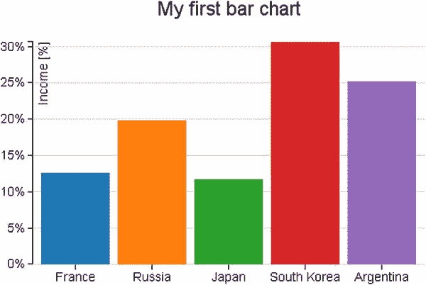
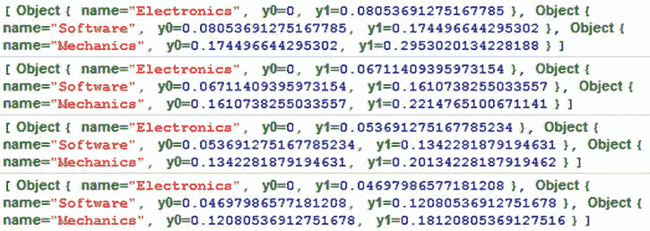
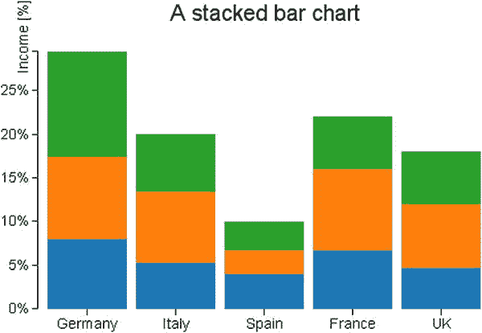
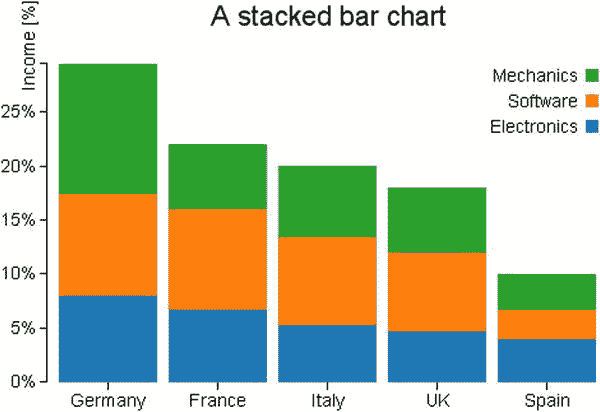
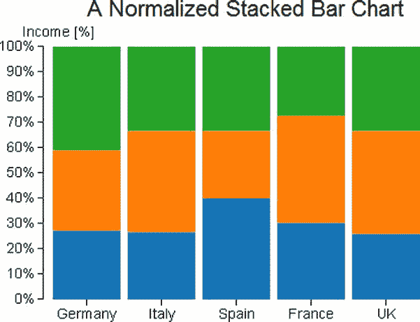
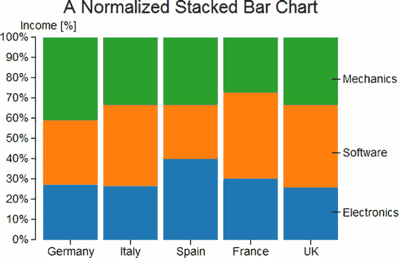
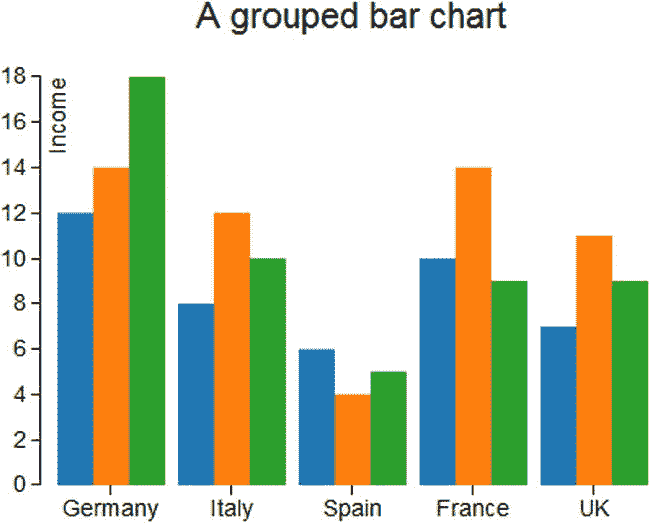

# 二十一、D3 条形图

Abstract

在这一章中，你将看到如何使用 D3 库来构建最常用的图表类型:条形图。作为第一个例子，您将从一个简单的条形图开始练习使用标量矢量图形(SVG)元素实现所有组件。

在这一章中，你将看到如何使用 D3 库来构建最常用的图表类型:条形图。作为第一个例子，您将从一个简单的条形图开始练习使用标量矢量图形(SVG)元素实现所有组件。

## 绘制条形图

在这方面，作为一个例子，我们选择用竖线来表示一些国家的收入，这样我们就可以对它们进行比较。作为类别标签，您将使用国家本身的名称。在这里，正如您对折线图所做的那样，您决定使用一个外部文件，比如包含所有数据的逗号分隔值(CSV)文件。然后，您的 web 页面将使用`d3.csv()`函数读取文件中包含的数据。因此，将清单 21-1 中的数据写入一个文件，并保存为`data_04.csv`。

清单 21-1。data_04.csv

`country,income`

`France,14`

`Russia,22`

`Japan,13`

`South Korea,34`

`Argentina,28`

清单 21-2 显示了一个空白网页，作为开发条形图的起点。你必须记得在网页中包含 D3 库(更多信息见附录 A)。如果您更喜欢使用内容交付网络(CDN)服务，您可以用以下内容替换参考:

``

`</head>`

`<body>`

``

`</body>`

`</html>`

首先，定义希望在其上表示条形图的绘图区域的大小是一个好习惯。尺寸是由`w`和`h`(宽度和高度)变量指定的，但是你也必须考虑边距的空间。这些空白值必须从`w`和`h`中减去，适当地限制分配给你的图表的区域(见清单 21-3)。

清单 21-3。ch21_01.html

``

此外，如果您查看 CSV 文件中的数据(见清单 21-1)，您会发现一系列五个国家及其相对值。如果你想用一种颜色来区分每个国家，就必须定义一个色标，正如你已经看到的，这可以用`category10()`函数来完成。

下一步是在 x 轴和 y 轴上定义一个刻度。x 轴上没有数值，而是标识原产国的字符串值。因此，对于这种类型的值，你必须定义一个顺序标度，如清单 21-4 所示。事实上，函数`rangeRoundBands`将作为参数传递的范围划分为离散的带，这正是您在条形图中需要的。对于 y 轴，因为它用数值表示变量，所以只需选择一个线性刻度。

清单 21-4。ch21_01.html

``

`</body>`

`</html>`

现在想想你想要设置的颜色和域。在前一个案例中，您用不同的颜色绘制了每个条形(国家)。事实上，你甚至可以给所有的条都同样的颜色。你的方法是一个可选的选择，主要是由于美学因素。但是，在这种情况下，需要使用一组不同的颜色来区分组成每个条形的各个部分。因此，每个条形都有一系列相同的颜色，每种颜色对应一个生产部门。一个小提示:当您需要一个图例来标识数据的各种表示时，您需要使用一系列颜色，反之亦然。您可以根据文件头定义颜色域，并通过过滤器删除第一项“国家”(参见清单 21-16)。

清单 21-16。ch21_02.html

`d3.csv("data_05.csv", function(error, data) {`

`color.domain(d3.keys(data[0]).filter(function(key) {`

`return key !== "Country"; }));`

`svg.append("g")`

`.attr("class", "x axis")`

`.attr("transform", "translate(0," + h + ")")`

`.call(xAxis);`

`...`

在 y 轴上，你不能画出收入的数值，而是它们占总收入的百分比。为了做到这一点，您需要知道所有收入值的总和，因此通过迭代从文件中读取的所有数据，您可以获得总和。同样，为了让 D3 明白三列(电子、机械和软件)中的值是数值，您必须在迭代中以如下方式明确指定它们:

`values = +values;`

在清单 21-17 中，你可以看到`forEach()`函数是如何迭代文件的值的，同时，计算出你需要得到的百分比的总和。

清单 21-17。ch21_02.html

`d3.csv("data_05.csv", function(error, data) {`

`color.domain(d3.keys(data[0]).filter(function(key) {`

`return key !== "Country"; }));`

`var sum= 0;`

`data.forEach(function(d){`

`d.Electronics = +d.Electronics;`

`d.Mechanics = +d.Mechanics;`

`d.Software = +d.Software;`

`sum = sum +d.Electronics +d.Mechanics +d.Software;`

`});`

`svg.append("g")`

`.attr("class", "x axis")`

`.attr("transform", "translate(0," + h + ")")`

`.call(xAxis);`

`...`

现在你需要创建一个数据结构来满足你的需求。为每个条形构建一个对象数组，其中每个对象对应于总收入被划分的部分之一。将这个数组命名为"`countries”`，并通过一个迭代函数来创建它(见清单 21-18)。

清单 21-18。ch21_02.html

`d3.csv("data_05.csv", function(error, data) {`

`...`

`data.forEach(function(d){`

`d.Electronics = +d.Electronics;`

`d.Mechanics = +d.Mechanics;`

`d.Software = +d.Software;`

`sum = sum +d.Electronics +d.Mechanics +d.Software;`

`});`

`data.forEach(function(d) {`

`var y0 = 0;`

`d.countries = color.domain().map(function(name) {`

`return {name: name, y0: y0/sum, y1: (y0 += +d[name])/sum }; });`

`d.total = d.countries[d.countries.length - 1].y1;`

`});`

`svg.append("g")`

`.attr("class", "x axis")`

`.attr("transform", "translate(0," + h + ")")`

`.call(xAxis);`

`...`

使用 Firebug 控制台(参见第 1 章中的“Firebug 和 DevTool”一节)，你可以直接看到这个数组的内部结构。因此，将对控制台的调用(临时)添加到将`countries`数组作为参数传递的代码中，如清单 21-19 所示。

清单 21-19。ch21_02.html

`data.forEach(function(d) {`

`var y0 = 0;`

`d.countries = color.domain().map(function(name) {`

`return {name: name, y0: y0/sum, y1: (y0 += +d[name])/sum }; });`

`d.total = d.countries[d.countries.length - 1].y1;`

`console.log(d.countries);`

`});`

图 [21-2](#Fig2) 显示了`countries`数组的内部结构及其所有内容，以及 Firebug 控制台是如何显示的。

图 21-2。

The Firebug console shows the content and the structure of the countries array

如果您详细分析数组的第一个元素:

`[Object { name="Electronics",  y0=0,  y1=0.08053691275167785},`

`Object { name="Software",  y0=0.08053691275167785,  y1=0.174496644295302},`

`Object { name="Mechanics",  y0=0.174496644295302,  y1=0.2953020134228188}]`

您可能会注意到，数组的每个元素依次是一个包含三个对象的数组。这三个对象代表要将数据拆分成的三个类别(多系列条形图的三个系列)。`y0`和`y1`的值分别是条形中每个部分的开始和结束的百分比。

在你整理好所有你需要的数据后，你可以把它包含在 x 和 y 的域中，如清单 21-20 所示。

清单 21-20。ch21_02.html

`d3.csv("data_05.csv", function(error, data) {`

`...`

`data.forEach(function(d) {`

`...`

`console.log(d.countries);`

`});`

`x.domain(data.map(function(d) { return d.Country; }));`

`y.domain([0, d3.max(data, function(d) { return d.total; })]);`

`svg.append("g")`

`.attr("class", "x axis")`

`.attr("transform", "translate(0," + h + ")")`

`.call(xAxis);`

`...`

然后，在清单 21-21 中，你开始定义构成图表条的`rect`元素。

清单 21-21。ch21_02.html

`d3.csv("data_05.csv", function(error, data) {`

`...`

`svg.append("g")`

`.attr("class", "grid")`

`.call(yGrid);`

`var country = svg.selectAll(".country")`

`.data(data)`

`.enter().append("g")`

`.attr("class", "country")`

`.attr("transform", function(d) {`

`return "translate(" + x(d.Country) + ",0)"; });`

`country.selectAll("rect")`

`.data(function(d) { return d.countries; })`

`.enter().append("rect")`

`.attr("width", x.rangeBand())`

`.attr("y", function(d) { return y(d.y1); })`

`.attr("height", function(d) { return (y(d.y0) - y(d.y1)); })`

`.style("fill", function(d) { return color(d.name); });`

`});`

您已经看到了带有库的数组的内部结构，由于 D3 总是从基本图形开始，所以最复杂的部分在于将数据结构转换成 SVG 元素的层次结构。标签有助于您建立适当的层次分组。在这方面，您必须为每个国家定义一个元素`<g>`。首先，您需要迭代地使用从 CSV 文件中读取的数据。这可以通过将`data`数组(原来的`data`数组，而不是您刚刚定义的`countries`数组)作为参数传递给`data()`函数来实现。当所有这些完成后，您有五个新的组项目`<g>`，因为五个是 CSV 文件中列出的国家，五个也是将要绘制的条。还应该管理每个条形在 x 轴上的位置。您不需要做任何计算来将正确的 x 值传递给`translate(x,0)`函数。事实上，如图 [21-3](#Fig3) 所示，这些值是由 D3 自动生成的，利用了您已经在 x 轴上定义了一个序数刻度的事实。

图 21-3。

Firebug shows the different translation values on the x axis that are automatically generated by the D3 library

在每个组元素`<g>`中，您现在必须创建`<rect>`元素，这将为每个部分生成彩色矩形。此外，有必要确保将正确的值分配给`y`和`height`属性，以便正确地将矩形一个放置在另一个之上，避免它们重叠，从而为每个国家获得单个堆叠条形图。

这一次，将使用`countries`数组，将其作为参数传递给`data()`函数。由于有必要对您创建的每个元素`<g>`进行进一步的迭代，您将把迭代`function(d)`作为参数传递给`data()`函数。这样，你在另一个迭代中创建一个迭代:第一个扫描`data` (countries)中的值；第二个内部函数扫描`countries`数组中的值(生产部门)。因此，您将最终百分比(y1)分配给`y`属性，并将初始百分比和最终百分比之间的差值(y0–y1)分配给`height`属性。当您逐个定义包含在国家数组中的对象时，值 y0 和 y1 已经在前面计算过了(参见图 [21-4](#Fig4) )。

图 21-4。

Firebug shows the different height values attributed to each rect element

最后，您可以欣赏图 [21-5](#Fig5) 中的堆积条形图。

图 21-5。

A stacked bar chart

看着你的堆积条形图，你马上会发现少了点什么。你如何识别生产部门，他们的参考色是什么？为什么不加个图例？

正如您对其他图表组件所做的那样，您可能更喜欢为这个新组件定义一个`legend`变量。一旦创建了组元素`<g>`，图例也需要一次迭代(见清单 21-22)。迭代必须在生产部门进行。对于每个项目，您需要获取扇区的名称和相应的颜色。为此，这次您将利用您之前定义的颜色域:对于`text`元素，您将使用 CSV 文件中的标题，而对于颜色，您将直接分配域的值。

清单 21-22。ch21_02.html

`d3.csv("data_05.csv", function(error, data) {`

`...`

`country.selectAll("rect")`

`.data(function(d) { return d.countries; })`

`.enter().append("rect")`

`.attr("width", x.rangeBand())`

`.attr("y", function(d) { return y(d.y1); })`

`.attr("height", function(d) { return  (y(d.y0) - y(d.y1)); })`

`.style("fill", function(d) { return color(d.name); });`

`var legend = svg.selectAll(".legend")`

`.data(color.domain().slice().reverse())`

`.enter().append("g")`

`.attr("class", "legend")`

`.attr("transform", function(d, i) {`

`return "translate(0," + i * 20 + ")"; });`

`legend.append("rect")`

`.attr("x", w - 18)`

`.attr("y", 4)`

`.attr("width", 10)`

`.attr("height", 10)`

`.style("fill", color);`

`legend.append("text")`

`.attr("x", w - 24)`

`.attr("y", 9)`

`.attr("dy", ".35em")`

`.style("text-anchor", "end")`

`.text(function(d) { return d; });`

`});`

为了完成堆叠条形图的主题，使用 D3 库，通过添加清单 21-23 中的单行，可以以降序来表示条形图。尽管在您的情况下您并不真正需要这个特性，但是在某些特定的情况下它可能是有用的。

清单 21-23。ch21_02.html

`d3.csv("data_05.csv", function(error, data) {`

`...`

`data.forEach(function(d) {`

`...`

`console.log(d.countries);`

`});`

`data.sort(function(a, b) { return b.total - a.total; });`

`x.domain(data.map(function(d) { return d.Country; }));`

`...`

`});`

图 [21-6](#Fig6) 显示了沿 x 轴降序排列的堆积条形图。

图 21-6。

A sorted stacked bar chart with a legend

## 标准化堆积条形图

在本节中，您将看到如何在规范化图表中转换前面的图表。所谓“标准化”，我们的意思是要在图表中显示的值的范围被转换成另一个目标范围，如果你谈论的是百分比，它通常从 0 到 1，或者从 0 到 100(一个非常相似的概念在第 1 章 9 的“范围、域和标度”一节中被处理)。因此，如果您想要比较包含彼此差异很大的数值范围的不同系列，您需要执行归一化，以 0 到 100(或 0 到 1)之间的百分比值报告所有这些区间。事实上，在比较多个数据系列时，我们通常对它们的相对特征感兴趣。例如，在我们的例子中，您可能对机械部门如何影响一个国家的经济收入(标准化)感兴趣，也可能对比较这种影响如何因国家而异(标准化值之间的比较)感兴趣。因此，为了响应这样的需求，您可以用规范化的格式表示堆积图。

您已经报告了 y 轴上的百分比值；然而，每个生产部门的百分比是相对于所有国家的收入总额计算的。这一次，百分比将根据每个国家的收入来计算。因此，在这种情况下，你不关心每个单独的部分如何分享全球收入(指所有五个国家)，但你只关心每个部门在各自国家产生的收入的百分比。因此，在这种情况下，每个国家将由 100%的条形表示。现在，没有哪个国家的收入比其他国家多的信息，但是你只对每个国家内部的信息感兴趣。

所有这些推理对你来说都很重要，你要明白，尽管从相同的数据开始，你需要选择不同类型的图表，这取决于你想让那些看图表的人注意到什么。

对于这个例子，你将使用同一个文件`data_05.csv`(参见清单 21-14)；正如我们刚才所说的，传入的信息是相同的，但它的解释是不同的。为了规范化前面的堆积条形图，您需要对代码进行一些更改。如清单 21-24 所示，首先将左边距和右边距延长几个像素。

清单 21-24。ch21_03.html

`var margin = {top: 70, right:``70``, bottom: 30, left:``50`T4】

`w = 500 - margin.left - margin.right,`

`h = 350 - margin.top - margin.bottom;`

在清单 21-25 中，在`d3.csv()`函数中，你必须消除计算总收入的迭代，这是不再需要的。相反，您可以添加一个新的迭代，将每个国家的百分比考虑在内。然后，你必须消除 y 域的定义，只留下 x 域。

清单 21-25。ch21_03.html

`d3.csv("data_05.csv", function(error, data) {`

`color.domain(d3.keys(data[0]).filter(function(key) {`

`return key !== "Country"; }));`

`data.forEach(function(d) {`

`var y0 = 0;`

`d.countries = color.domain().map(function(name) {`

`return {name: name, y0: y0, y1: y0 += +d[name]}; });`

`d.countries.forEach(function(d) { d.y0 /= y0; d.y1 /= y0; });`

`});`

`x.domain(data.map(function(d) { return d.Country; }));`

`var country = svg.selectAll(".country")`

`...`

在这种新型图表中，y 标签将被条形覆盖。因此，您必须删除或注释掉`rotate()`函数，以使它再次可见，如清单 21-26 所示。

清单 21-26。ch21_03.html

`labels.append("text")`

`//.attr("transform", "rotate(–90)")`

`.attr("x", 50)`

`.attr("y", -20)`

`.attr("dy", ".71em")`

`.style("text-anchor", "end")`

`.text("Income [%]");`

当你在做的时候，为什么不抓住机会改变你的图表的标题呢？因此，修改标题，如清单 21-27 所示。

清单 21-27。ch21_03.html

`title.append("text")`

`.attr("x", (w / 2))`

`.attr("y", -30 )`

`.attr("text-anchor", "middle")`

`.style("font-size", "22px")`

`.text("A normalized stacked bar chart");`

甚至不再需要图例。事实上，你可以用另一种功能非常相似的图形来代替它。因此，您可以从代码中删除定义清单 21-28 中图例的行。

清单 21-28。ch21_03.html

`var legend = svg.selectAll(".legend")`

`.data(color.domain().slice().reverse())`

`.enter().append("g")`

`.attr("class", "legend")`

`.attr("transform", function(d, i) {`

`return "translate(0," + i * 20 + ")"; });`

`legend.append("rect")`

`.attr("x", w - 18)`

`.attr("y", 4)`

`.attr("width", 10)`

`.attr("height", 10)`

`.style("fill", color);`

`legend.append("text")`

`.attr("x", w - 24)`

`.attr("y", 9)`

`.attr("dy", ".35em")`

`.style("text-anchor", "end")`

`.text(function(d) { return d; });`

现在您已经删除了图例并做了正确的更改，如果您加载网页，您将得到图 [21-7](#Fig7) 中的标准化堆积条形图。

图 21-7。

A normalized stacked bar chart

如果没有图例，你必须再一次知道，以某种方式，条形中的颜色指的是什么；您将使用报告组名称的标签来标记右边的最后一个条形。

首先在清单 21-29 中添加一个新的样式类。

清单 21-29。ch21_03.html

``

因此，代替你刚刚删除的代码，如清单 21-28 所示，你添加清单 21-30 中的代码。

清单 21-30。ch21_03.html

`country.selectAll("rect")`

`.data(function(d) { return d.countries; })`

`.enter().append("rect")`

`.attr("width", x.rangeBand())`

`.attr("y", function(d) { return y(d.y1); })`

`.attr("height", function(d) { return (y(d.y0) - y(d.y1)); })`

`.style("fill", function(d) { return color(d.name); });`

`var legend = svg.select(".country:last-child")`

`.data(data);`

`legend.selectAll(".legend")`

`.data(function(d) { return d.countries; })`

`.enter().append("g")`

`.attr("class", "legend")`

`.attr("transform", function(d) {`

`return "translate(" + x.rangeBand()*0.9 + "," +`

`y((d.y0 + d.y1) / 2) + ")";`

`});`

`legend.selectAll(".legend")`

`.append("line")`

`.attr("x2", 10);`

`legend.selectAll(".legend")`

`.append("text")`

`.attr("x", 13)`

`.attr("dy", ".35em")`

`.text(function(d) { return d.name; });`

`});`

当您将标签添加到最后一个条时，定义它们的 SVG 元素必须属于与最后一个国家对应的组。因此，您使用`.country: last-child`选择器来获取包含所有条的选择的最后一个元素。因此，新的图表看起来将如图 [21-8](#Fig8) 所示。

图 21-8。

A normalized stacked bar chart with labels as legend

## 绘制分组条形图

总是使用包含在`data_05.csv`中的相同数据，您可以获得另一种表示:分组条形图。当你想关注每个生产部门的个人收入时，这种表示法是最合适的。在这种情况下，你并不关心这些部门在总收入中所占的比重。因此，百分比消失，取而代之的是写入 CSV 文件的 y 值。

清单 21-31 显示的部分代码几乎可以与前面的例子相媲美，所以我们不会详细讨论它。事实上，您将使用它作为添加其他代码片段的起点。

清单 21-31。ch21_04.html

`<!DOCTYPE html>`

`<html>`

`<head>`

`<meta charset="utf-8">`

``

``

`</head>`

`<body>`

``

`</body>`

`</html>`

为了这个特定的目的，你需要在 x 轴上定义两个不同的变量:`x0`和`x1`，两者都遵循一个顺序标度，如清单 21-32 所示。`x0`标识所有条形组的顺序刻度，代表一个国家，而`x1`是每个组内每个单个条形的顺序刻度，代表一个生产部门。

清单 21-32。ch21_04.html

`var margin = {top: 70, right: 70, bottom: 30, left: 50},`

`w = 500 - margin.left - margin.right,`

`h = 350 - margin.top - margin.bottom;`

`var x0 = d3.scale.ordinal()`

`.rangeRoundBands([0, w], .1);`

`var x1 = d3.scale.ordinal();`

`var y = d3.scale.linear()`

`.range([h, 0]);`

`...`

因此，在轴的定义中，你将 x0 赋给 x 轴，y 赋给 y 轴(见清单 21-33)。取而代之的是，变量 x1 将在以后仅被用作表示单个条的参考。

清单 21-33。ch21_04.html

`...`

`var y = d3.scale.linear()`

`.range([h, 0]);`

`var xAxis = d3.svg.axis()`

`.scale(x0)`

`.orient("bottom");`

`var yAxis = d3.svg.axis()`

`.scale(y)`

`.orient("left");`

`...`

在`d3.csv()`函数中，用`keys()`函数提取所有生产部门的名称，用`filter()`函数从数组中过滤掉“国家”标题，如清单 21-34 所示。这里，您也为每个国家构建了一个对象数组，但是结构略有不同。新数组如下所示:

`[Object { name="Electronics",  value=12},`

`Object { name="Software",  value=14},`

`Object { name="Mechanics",  value=18}]`

清单 21-34。ch21_04.html

`...`

`d3.csv("data_05.csv", function(error, data) {`

`var sectorNames = d3.keys(data[0]).filter(function(key) {`

`return key !== "Country"; });`

`data.forEach(function(d) {`

`d.countries = sectorNames.map(function(name) {`

`return {name: name, value: +d[name]`

`};`

`});`

`...`

`});`

一旦定义了数据结构，就可以定义新的域，如清单 21-35 所示。

清单 21-35。ch21_04.html

`d3.csv("data_05.csv", function(error, data) {`

`...`

`data.forEach(function(d) {`

`...`

`});`

`x0.domain(data.map(function(d) { return d.Country; }));`

`x1.domain(sectorNames).rangeRoundBands([0, x0.rangeBand()]);`

`y.domain([0, d3.max(data, function(d) {`

`return d3.max(d.countries, function(d) { return d.value; });`

`})]);`

`svg.append("g")`

`.attr("class", "x axis")`

`.attr("transform", "translate(0," + h + ")")`

`.call(xAxis);`

`...`

如前所述，使用`x0`您可以指定每个国家名称的有序域名。相反，在`x1`中，各个扇区的名称组成了域名。最后，在`y`中，域是由数值定义的。用新域更新迭代中传递的值(见清单 21-36)。

清单 21-36。ch21_04.html

`d3.csv("data_05.csv", function(error, data) {`

`...`

`svg.append("g")`

`.attr("class", "grid")`

`.call(yGrid);`

`var country = svg.selectAll(".country")`

`.data(data)`

`.enter().append("g")`

`.attr("class", "country")`

`.attr("transform", function(d) {`

`return "translate(" + x0(d.Country) + ",0)";`

`});`

`country.selectAll("rect")`

`.data(function(d) { return d.countries; })`

`.enter().append("rect")`

`.attr("width", x1.rangeBand())`

`.attr("x", function(d) { return x1(d.name); })`

`.attr("y", function(d) { return y(d.value); })`

`.attr("height", function(d) { return h - y(d.value); })`

`.style("fill", function(d) { return color(d.name); });`

`});`

然后，在`csv()`函数的外部，你可以定义 SVG 元素，它将代表 y 轴上的轴标签，如清单 21-37 所示。它不需要在`csv()`函数中定义，因为它独立于 CSV 文件中包含的数据。

清单 21-37。ch21_04.html

`d3.csv("data_05.csv", function(error, data) {`

`...`

`});`

`var labels = svg.append("g")`

`.attr("class","labels")`

`labels.append("text")`

`.attr("transform", "rotate(–90)")`

`.attr("y", 5)`

`.attr("dy", ".71em")`

`.style("text-anchor", "end")`

`.text("Income");`

最后一件事。。。您需要给图表添加一个合适的标题，如清单 21-38 所示。

清单 21-38。ch21_04.html

`labels.append("text")`

`...`

`.text("Income");`

`var title = svg.append("g")`

`.attr("class","title")`

`title.append("text")`

`.attr("x", (w / 2))`

`.attr("y", -30 )`

`.attr("text-anchor", "middle")`

`.style("font-size", "22px")`

`.text("A grouped bar chart");`

而图 [21-9](#Fig9) 就是结果。

图 21-9。

A grouped bar chart

在前面的例子中，使用规范化条形图，您看到了表示图例的另一种方法。您已经通过在最后一个条上放置一些报告系列名称的标签建立了这个图例(参见图 [21-8](#Fig8) )。实际上你使用了点标签。这些标签可以包含任何文本，并直接连接到图表中的单个值。此时，引入点标签。您将把它们放在每个条形的顶部，显示该条形所表示的数值。这大大增加了每种图表的可读性。

正如您对任何其他图表组件所做的那样，定义了`PointLabels`变量后，您可以使用它来分配应用于相应选择的函数链。此外，对于这种类型的组件，它具有针对单个数据的特定值，您可以利用 CSV 文件中包含的数据的迭代。您想要迭代的数据与您用于条形图的数据相同。因此，你将同样的迭代`function(d)`作为参数传递给`data()`函数(见清单 21-39)。为了在条形顶部绘制数据，您将为每个`PointLabel`应用一个`translate()`转换。

清单 21-39。ch21_04.html

`d3.csv("data_05.csv", function(error, data) {`

`...`

`country.selectAll("rect")`

`...`

`.attr("height", function(d) { return h - y(d.value); })`

`.style("fill", function(d) { return color(d.name); });`

`var pointlabels = country.selectAll(".pointlabels")`

`.data(function(d) { return d.countries; })`

`.enter().append("g")`

`.attr("class", "pointlabels")`

`.attr("transform", function(d) {`

`return "translate(" + x1(d.name) + "," + y(d.value) + ")";`

`})`

`.append("text")`

`.attr("dy", "-0.3em")`

`.attr("x", x1.rangeBand()/2)`

`.attr("text-anchor", "middle")`

`.text(function(d) { return d.value; });`

`...`

`});`

最后，除了向图表中添加一个以经典格式分组的图例之外，没有什么要做的了(见清单 21-40)。

清单 21-40。ch21_04.html

`d3.csv("data_05.csv", function(error, data) {`

`...`

`pointlabels.append("text")`

`...`

`.text(function(d) { return d.value; });`

`var legend = svg.selectAll(".legend")`

`.data(color.domain().slice().reverse())`

`.enter().append("g")`

`.attr("class", "legend")`

`.attr("transform", function(d, i) {`

`return "translate(0," + i * 20 + ")";`

`});`

`legend.append("rect")`

`.attr("x", w - 18)`

`.attr("y", 4)`

`.attr("width", 10)`

`.attr("height", 10)`

`.style("fill", color);`

`legend.append("text")`

`.attr("x", w - 24)`

`.attr("y", 9)`

`.attr("dy", ".35em")`

`.style("text-anchor", "end")`

`.text(function(d) { return d; });`

`});`

图 [21-10](#Fig10) 显示了带有点标签和线段图例的新图表。

图 21-10。

A grouped bar chart reporting the values above each bar

## 带有负值的水平条形图

到目前为止你只使用了正值，但是如果你同时有正值和负值呢？你如何用条形图来表示它们呢？例如，这个包含正值和负值的值序列(见清单 21-41)。

清单 21-41。ch21_05.html

`var data = [4, 3, 1, -7, -10, -7, 1, 5, 7, -3, -5, -12, -7, -11, 3, 7, 8, -1];`

在分析要显示的数据之前，开始给图表添加页边空白，如清单 21-42 所示。

清单 21-42。ch21_05.html

`var data = [4, 3, 1, -7, -10, -7, 1, 5, 7, -3, -5, -12, -7, -11, 3, 7, 8, -1];`

`var margin = {top: 30, right: 10, bottom: 10, left: 30},`

`w = 700 - margin.left - margin.right,`

`h = 400 - margin.top - margin.bottom;`

在这种特殊情况下，您将使用水平条，输入数组中的值将在 x 轴上表示，值 0 位于中间。为了实现这一点，首先需要找到绝对值的最大值(包括负值和正值)。然后在线性标度上创建 x 变量，而 y 变量被赋给一个包含数据在输入数组中放置顺序的序数标度(见清单 21-43)。

清单 21-43。ch21_05.html

`...`

`var margin = {top: 30, right: 10, bottom: 10, left: 30},`

`w = 700 - margin.left - margin.right,`

`h = 400 - margin.top - margin.bottom;`

`var xMax = Math.max(-d3.min(data), d3.max(data));`

`var x = d3.scale.linear()`

`.domain([-xMax, xMax])`

`.range([0, w])`

`.nice();`

`var y = d3.scale.ordinal()`

`.domain(d3.range(data.length))`

`.rangeRoundBands([0, h], .2);`

在清单 21-44 中，你将两个刻度分配给相应的 x 轴和 y 轴。这一次，x 轴将绘制在图表的上部，而 y 轴将向下(y 值向下增长)。

清单 21-44。ch21_05.html

`var y = d3.scale.ordinal()`

`.domain(d3.range(data.length))`

`.rangeRoundBands([0, h], .2);`

`var xAxis = d3.svg.axis()`

`.scale(x)`

`.orient("top");`

`var yAxis = d3.svg.axis()`

`.scale(y)`

`.orient("left");`

此时，除了开始实现绘图区域之外，没有什么要做的了。创建根`<svg>`元素，指定先前定义的边距。然后，定义 x 轴和 y 轴(见清单 21-45)。

清单 21-45。ch21_05.html

`var yAxis = d3.svg.axis()`

`.scale(y)`

`.orient("left")`

`var svg = d3.select("body").append("svg")`

`.attr("width", w + margin.left + margin.right)`

`.attr("height", h + margin.top + margin.bottom)`

`.append("g")`

`.attr("transform", "translate(" + margin.left + "," + margin.top + ")");`

`svg.append("g")`

`.attr("class", "x axis")`

`.call(xAxis);`

`svg.append("g")`

`.attr("class", "y axis")`

`.attr("transform", "translate("+x(0)+",0)")`

`.call(yAxis);`

最后，您需要为每个要表示的条形插入一个`<rect>`元素，小心地将条形分成两个不同的组:负条形和正条形(见清单 21-46)。必须区分这两个类别，以便使用 CSS 样式类(例如，颜色)分别设置它们的属性。

清单 21-46。ch21_05.html

`svg.append("g")`

`.attr("class", "y axis")`

`.attr("transform", "translate("+x(0)+",0)")`

`.call(yAxis);`

`svg.selectAll(".bar")`

`.data(data)`

`.enter().append("rect")`

`.attr("class", function(d) {`

`return d < 0 ? "bar negative" : "bar positive";`

`})`

`.attr("x", function(d) { return x(Math.min(0, d)); })`

`.attr("y", function(d, i) { return y(i); })`

`.attr("width", function(d) { return Math.abs(x(d) - x(0)); })`

`.attr("height", y.rangeBand());`

事实上，如果你用 Firebug 分析图 [21-11](#Fig11) 中的结构，你会发现这个迭代在同一个组中创建了两种不同类型的条形，可以通过类名“正条形”和“负条形”的特征来识别通过这两个不同的名称，您可以应用两种不同的 CSS 样式来区分具有负值和正值的条形。

图 21-11。

Firebug shows how it is possible to distinguish the positive from the negative bars, indicating the distinction in the class of each rect element

根据我们刚才所说的，你为正负条形设置了样式类属性，如清单 21-47 所示。

清单 21-47。ch21_05.html

``

最后，你会得到图 [21-12](#Fig12) 中的图表，红色条代表正值，蓝色条代表负值。

图 21-12。

A horizontal bar chart

## 摘要

在这一章中，你已经涵盖了几乎所有与条形图实现相关的基本方面，这种类型的图表是在本书的第一部分中使用 jqPlot 库开发的。在这里，您使用了 D3 库。因此，您看到了如何逐个元素地实现一个简单的条形图；然后，您转到堆叠条形图和分组条形图的各种情况，最后看一个最特殊的情况:描绘负值的水平条形图。

在下一章中，您将继续使用相同的方法:您将学习如何以类似于使用 jqPlot 时所用的方式实现饼状图，但是这一次您将使用 D3 库。