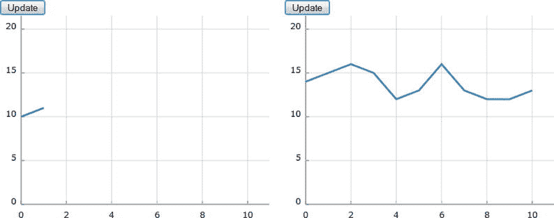
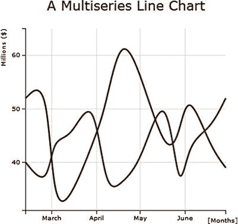

# 二十六、使用 D3 处理实时数据

Abstract

你已经看到了如何用 jqPlot 处理实时图表，在这一章中，你将使用 D3 库实现同样的例子。实际上，您将创建一个折线图，显示模拟外部数据源的函数所生成的实时值。数据会不断生成，因此折线图也会相应变化，始终显示最新情况。

你已经看到了如何用 jqPlot 处理实时图表，在这一章中，你将使用 D3 库实现同样的例子。实际上，您将创建一个折线图，显示模拟外部数据源的函数所生成的实时值。数据会不断生成，因此折线图也会相应变化，始终显示最新情况。

在本章的第二部分，你将制作一个稍微复杂一点的图表。这一次，您将使用一个例子，其中的数据源是一个真实的数据库。首先，您将实现一个折线图，它将读取外部文件中包含的数据。稍后，您将学习如何使用该示例来读取相同的数据，但这次是从数据库的表中读取。

## 实时图表

您有一个模拟函数的数据源，该函数返回变量性能的随机变化。这些值存储在一个具有缓冲区功能的数组中，其中只包含最近的 10 个值。对于生成或获取的每个输入值，最旧的值将被新值替换。此数组中包含的数据显示为每 3 秒更新一次的折线图。点击一个按钮就可以激活一切。

让我们开始设置表示折线图的基础(查看用 D3 库开发折线图，见[第 20 章](20.html))。首先，你写一个 HTML 结构，你将在这个结构上构建你的图表，如清单 26-1 所示。

清单 26-1。ch26_01.html

`<!DOCTYPE html>`

`<html>`

`<head>`

`<meta charset="utf-8">`

``

`</body>`

`</html>`

现在，从输入数据的管理开始，您开始定义在代码编写过程中对您有帮助的变量。如前所述，您将要在图表上表示的数据来自一个函数，该函数从一个初始值开始产生随机变量，可以是正的，也可以是负的。你决定从 10 点开始。

因此，从这个值开始，你从随机函数接收一个要在一个数组中收集的值序列，你将称之为`data`(见清单 26-2)。现在，你只在起始值(10)内给它赋值。给定这个数组，要实时接收值，您需要设置一个最大限制，在本例中是 11 个元素(0–10)。填充后，您将把数组作为一个队列来管理，其中最旧的项将被删除，以便为新项腾出空间。

清单 26-2。ch26_01.html

``

包含在`data`数组中的值将沿着 y 轴表示，因此有必要建立刻度标签必须覆盖的值的范围。例如，从值 10 开始，您可以决定此范围涵盖从 0 到 20 的值(稍后，您将确保刻度对应于 5 的倍数范围，即 0、5、10、15 和 20)。因为要显示的值是随机生成的，所以它们将逐渐假定值甚至大于 20，如果是这样，您将看到图表顶部边缘的线条消失了。怎么办？

因为主要目标是创建一个在获取新数据后自动重绘的图表，所以您将确保即使是刻度标签也根据包含在`data`数组中的值所覆盖的范围进行调整。为了实现这一点，您需要用`ymax`和`ymin`变量定义`y`范围，用`x`范围覆盖静态范围[0–10]。

`w`和`h`变量(宽度和高度)定义了您将在其上绘制折线图的绘图区域的大小，而`margin_x`和`margin_y`允许您调整边距。

现在，让我们创建代表图表各个部分的标量矢量图形(SVG)元素。首先创建`<svg>`根，然后定义 x 和 y 轴，如清单 26-3 所示。

清单 26-3。ch26_01.html

``

接下来，在两个轴上添加记号和相应的标签，然后添加栅格。最后，用`line()`函数在图表上画线(见清单 26-4)。

清单 26-4。ch26_01.html

``

为了给你的图表一个令人愉快的外观，定义层叠样式表(CSS)样式也是必要的，如清单 26-5 所示。

清单 26-5。ch26_01.html

``

现在，您在图表上方添加一个按钮，确保当用户点击它时`updateData()`功能被激活，如清单 26-6 所示。

清单 26-6。ch26_01.html

`< body>`

`
`

`<input name="updateButton"`

`type="button"`

`value="Update"`

`onclick="updateData()" />`

`
`

然后，你实现`getRandomInt()`函数，它产生一个介于最小值和最大值之间的随机整数值(见清单 26-7)。

清单 26-7。ch26_01.html

`function getRandomInt (min, max) {`

`return Math.floor(Math.random() * (max - min + 1)) + min;`

`};`

清单 26-8 显示了`updateData()`函数，其中由`getRandomInt()`函数生成的值被添加到数组的最近值中，以模拟趋势的变化。这个新值存储在数组中，而最旧的值被删除；因此，数组的大小总是保持不变。

清单 26-8。ch26_01.html

`function updateData() {`

`var last = data[data.length-1];`

`if(data.length > 10){`

`data.shift();`

`}`

`var newlast = last + getRandomInt(-3,3);`

`if(newlast < 0)`

`newlast = 0;`

`data.push(newlast);`

`};`

如果由`getRandomInt()`函数返回的新值大于或小于 y 轴上表示的范围，您将看到数据行延伸到图表的边缘。为了防止这种情况发生，你必须通过改变`ymin`和`ymax`变量来改变 y 轴上的间隔，并用这些新值更新`y`范围，如清单 26-9 所示。

清单 26-9。ch26_01.html

`function updateData() {`

`...`

`if(newlast < 0)`

`newlast = 0;`

`data.push(newlast);`

`if(newlast > ymax){`

`ymin = ymin + (newlast - ymax);`

`ymax = newlast;`

`y = d3.scale.linear().domain([ymin, ymax])`

`.range([0 + margin_y, h - margin_y]);`

`}`

`if(newlast < ymin){`

`ymax = ymax - (ymin - newlast);`

`ymin = newlast;`

`y = d3.scale.linear().domain([ymin, ymax])`

`.range([0 + margin_y, h - margin_y]);`

`}`

`};`

因为获得的新数据必须重新绘制，所以您需要删除无效的 SVG 元素并用新的元素替换它们。让我们对刻度标签和数据行都这样做(见清单 26-10)。最后，需要定时重复刷新图表。因此，使用`requestAnimFrame()`函数，您可以重复执行`UpdateData()`函数的内容。

清单 26-10。ch26_01.html

`function updateData() {`

`...`

`if(newlast < ymin){`

`ymax = ymax - (ymin - newlast);`

`ymin = newlast;`

`y = d3.scale.linear().domain([ymin, ymax]).range([0 + margin_y, h - margin_y]);`

`}`

`var svg = d3.select("body").transition();`

`g.selectAll(".yLabel").remove();`

`g.selectAll(".yLabel")`

`.data(y.ticks(5))`

`.enter().append("svg:text")`

`.attr("class", "yLabel")`

`.text(String)`

`.attr("x", 25)`

`.attr("y", function(d) { return -y(d) })`

`.attr("text-anchor", "end");`

`g.selectAll(".line").remove();`

`g.append("svg:path")`

`.attr("class","line")`

`.attr("d", line(data));`

`window.requestAnimFrame = (function(){`

`return window.requestAnimationFrame ||`

`window.webkitRequestAnimationFrame   ||`

`window.mozRequestAnimationFrame      ||`

`function( callback ){`

`window.setTimeout(callback, 1000);`

`};`

`})();`

`requestAnimFrame(setTimeout(updateData,3000));`

`render();`

`};`

现在，当点击 Update 按钮时，从左边开始有一条线画出由生成随机变量的函数获得的值。一旦该线到达图表的右端，它将更新每次采集，仅显示最后十个值(见图 [26-1](#Fig2) ) `.`

图 26-1。

A real-time chart with a start button

## 使用 PHP 从 MySQL 表中提取数据

最后，是时候使用数据库中包含的数据了，这种场景更符合您的日常需求。您选择 MySQL 作为数据库，并使用超文本预处理器(PHP)语言查询数据库，获得 JavaScript 对象表示法(JSON)格式的数据，以便 D3 可以读取。你会发现，一旦用 D3 构建了一个图表，过渡到这个阶段就很容易了。

下面这个例子不是为了解释 PHP 语言或者其他任何语言的使用，而是为了说明一个典型的真实案例。这个例子显示了将你所学的知识与其他编程语言结合起来是多么简单。通常，像 Java 和 PHP 这样的语言提供了一个很好的接口来从它们的来源(在这个例子中是数据库)收集和准备数据。

### 从 TSV 的档案开始

为了更清楚地理解你已经知道的东西与 PHP 和数据库接口之间的转换，让我们从一个你应该熟悉的案例开始(见清单 26-11)。首先，用这些系列数据编写一个制表符分隔的值(TSV)文件，并将它们保存为`data_13.tsv`。

清单 26-11。data_13.tsv

`day           income  expense`

`2012-02-12    52     40`

`2012-02-27    56     35`

`2012-03-02    31     45`

`2012-03-14    33     44`

`2012-03-30    44     54`

`2012-04-07    50     34`

`2012-04-18    65     36`

`2012-05-02    56     40`

`2012-05-19    41     56`

`2012-05-28    45     32`

`2012-06-03    54     44`

`2012-06-18    43     46`

`2012-06-29    39     52`

Note

注意，TSV 文件中的值是用制表符分隔的，所以当你编写或复制清单 26-11 时，记得检查每个值之间只有一个制表符。

实际上，正如所暗示的，你已经看到了这些数据，尽管形式略有不同；这些是`data_03.tsv`文件中的相同数据(参见第 20 章中的[清单 20-60)。您将列`date`更改为`day`，并修改了日期的格式。现在，您必须添加清单 26-12 中的 JavaScript 代码，这将允许您将这些数据表示为多系列折线图。(该代码与第 20 章](20.html)中[的“差异折线图”一节中使用的代码非常相似；关于清单 26-12 内容的解释和细节，请参阅该部分。)](20.html)

清单 26-12。ch26_02.html

`<!DOCTYPE html>`

`<html>`

`<head>`

`<meta charset="utf-8">`

``

`</body>`

`</html>`

有了这段代码，你就得到图 [26-2](#Fig2) 中的图表。

图 26-2。

A multiseries chart reading data from a TSV file

### 转到真正的案例

现在，让我们转到实际情况，您将处理数据库中的表。对于数据源，您在 MySQL 的测试数据库中选择一个名为 sales 的表。在用这个名称创建了一个表之后，可以用执行 SQL 序列的数据填充它(见清单 26-13)。

清单 26-13。销售. sql

`insert into sales`

`values ('2012-02-12', 52, 40);`

`insert into sales`

`values ('2012-02-27', 56, 35);`

`insert into sales`

`values ('2012-03-02', 31, 45);`

`insert into sales`

`values ('2012-03-14', 33, 44);`

`insert into sales`

`values ('2012-03-30', 44, 54);`

`insert into sales`

`values ('2012-04-07', 50, 34);`

`insert into sales`

`values ('2012-04-18', 65, 36);`

`insert into sales`

`values ('2012-05-02', 56, 40);`

`insert into sales`

`values ('2012-05-19', 41, 56);`

`insert into sales`

`values ('2012-05-28', 45, 32);`

`insert into sales`

`values ('2012-06-03', 54, 44);`

`insert into sales`

`values ('2012-06-18', 43, 46);`

`insert into sales`

`values ('2012-06-29', 39, 52);`

最好是，您应该在一个单独的文件中编写 PHP 脚本，并将其保存为`myPHP.php`。这个文件的内容如清单 26-14 所示。

清单 26-14 . myPHP.php

`<?php`

`$username = "dbuser";`

`$password = "dbuser";`

`$host = "localhost";`

`$database = "test";`

`$server = mysql_connect($host, $username, $password);`

`$connection = mysql_select_db($database, $server);`

`$myquery = "SELECT * FROM sales";`

`$query = mysql_query($myquery);`

`if ( ! $myquery ) {`

`echo mysql_error();`

`die;`

`}`

`$data = array();`

`for ($x = 0; $x < mysql_num_rows($query); $x++) {`

`$data[] = mysql_fetch_assoc($query);`

`}`

`echo json_encode($data);`

`mysql_close($server);`

`?>`

通常，一个 PHP 脚本可以通过它在特殊的开始和结束处理指令:`<?php`和`?>`中的封装来识别。每当我们需要连接到数据库时，通常都会用到这段简短但功能强大且用途广泛的代码片段。让我们浏览一下，看看它做了什么。

在本例中，`dbuser`被选为用户，`dbuser`被选为密码，但是这些值将取决于您想要连接的数据库。这同样适用于数据库和主机名值。因此，为了连接到一个数据库，你必须首先定义一组识别变量，如清单 26-15 所示。

清单 26-15 . myPHP.php

`$username = "homedbuser";`

`$password = "homedbuser";`

`$host = "localhost";`

`$database="homedb";`

一旦定义了它们，PHP 就提供了一组已经实现的函数，在这些函数中，您只需将这些变量作为参数传递，就可以与数据库建立连接。在这个例子中，您需要调用`mysql_connect()`和`myqsl_select_db()`函数来创建一个与数据库的连接，而不需要定义任何其他东西(参见清单 26-16)。

清单 26-16 . myPHP.php

`$server = mysql_connect($host, $username, $password);`

`$connection = mysql_select_db($database, $server);`

即使对于输入 SQL 查询，PHP 也被证明是一个真正实用的工具。清单 26-17 是一个非常简单的例子，展示了如何使用 SQL 查询从数据库中检索数据。如果您不熟悉 SQL 语言，查询是针对特定数据库的声明性语句，目的是获取数据库中包含的所需数据。您可以很容易地识别一个查询，因为它由一个`SELECT`语句和一个 FROM 语句组成，并且几乎总是在末尾有一个`WHERE`语句。

Note

如果你没有 SQL 语言的经验，并且想在不安装数据库和其他任何东西的情况下做一些练习，我建议你访问 w3schools 网站的这个网页: [`www.w3schools.com/sql`](http://www.w3schools.com/sql) 。在本文中，您将找到关于这些命令的完整文档，其中包含许多示例，甚至能够通过嵌入 SQL 测试查询来查询该站点提供的数据库证据(参见“亲自尝试”一节)。

在这个简单的例子中，`SELECT`语句后面跟有`'*'`，这意味着您想要接收在`FROM`语句(在这个例子中是`sales`)中指定的表中包含的所有列中的数据。

清单 26-17 . myPHP.php

`$myquery = "SELECT * FROM sales";`

`$query = mysql_query($myquery);`

一旦你做了一个查询，你需要检查它是否成功，如果出现错误就处理它(见清单 26-18)。

清单 26-18 . myPHP.php

`if ( ! $query ) {`

`echo mysql_error();`

`die;`

`}`

如果查询成功，那么您需要处理查询返回的数据。你把这些值放在一个名为`$data`的数组中，如清单 26-19 所示。这部分非常类似于 D3 的`csv()`和`tsv()`函数，只是它不是从文件中逐行读取，而是从数据库中检索的表中读取。`mysql_num_rows()`函数给出了表中的行数，类似于在`for()`循环中使用的 JavaScript 的 length()函数。`mysql_fetch_assoc()`函数将从查询中检索到的数据逐行分配给数据数组。

清单 26-19 . myPHP.php

`$data = array();`

`for ($x = 0; $x < mysql_num_rows($query); $x++) {`

`$data[] = mysql_fetch_assoc($query);`

`}`

`echo json_encode($data);`

该脚本的关键是对 PHP `json_encode()`方法的调用，该方法将数据格式转换成 JSON，然后使用 echo 返回数据，D3 将解析这些数据。最后，您必须关闭与服务器的连接，如清单 26-20 所示。

清单 26-20 . myPHP.php

`mysql_close($server);`

现在，您回到 JavaScript 代码，只修改了一行(是的，只有一行！)(参见清单 26-21)。用`json()`函数替换`tsv()`函数，直接传递 PHP 文件作为参数。

清单 26-21。ch26_02b.html

`d3.json("myPHP.php", function(error, data) {`

`//d3.tsv("data_03.tsv", function(error, data) {`

`data.forEach(function(d) {`

`d.day = parseDate(d.day);`

`d.income = +d.income;`

`d.expense = +d.expense;`

`});`

最终，你会得到同样的图表(见图 [26-3](#Fig2) )。

图 26-3。

A multiseries chart obtaining data directly from a database

## 摘要

这最后一章通过考虑两种不同的情况而结束。在第一个例子中，您看到了如何创建一个 web 页面，在这个页面中可以表示您实时生成或获取的数据。在第二个例子中，您学习了如何使用 D3 库来读取数据库中包含的数据。

## 结论

有了这一章，你就到了这本书的结尾。我必须说，尽管涵盖了大量的主题，但我还想补充许多其他主题。我希望这本书能让你更好地理解数据可视化的世界，尤其是图表。我还希望这本书为您提供了良好的数据可视化基础知识，并证明它对您处理图表的所有场合都是有价值的帮助。