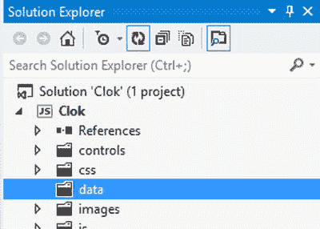
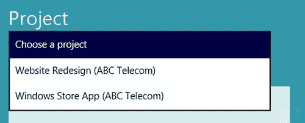
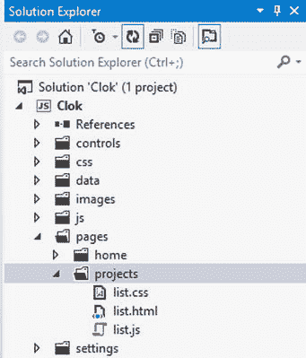
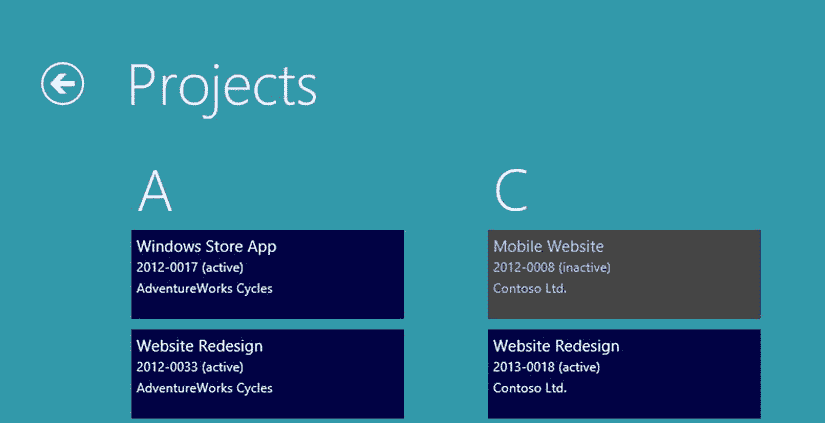
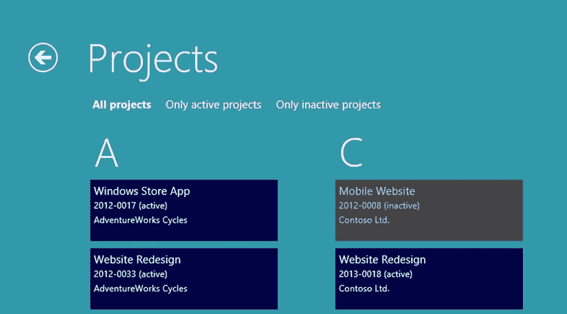
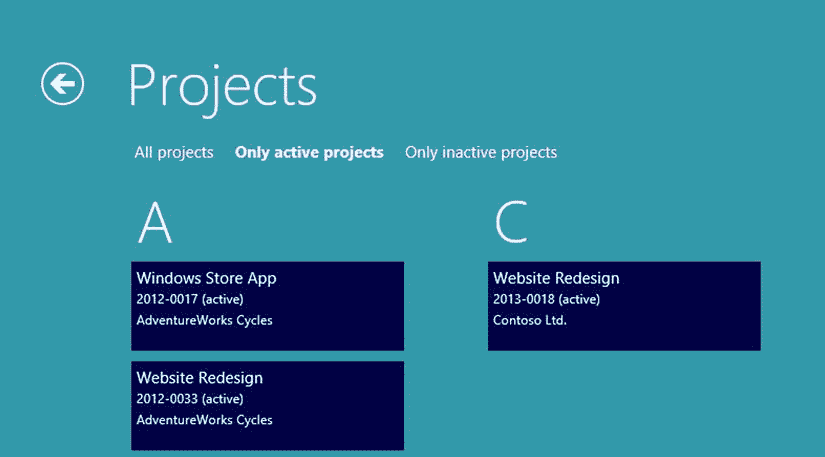
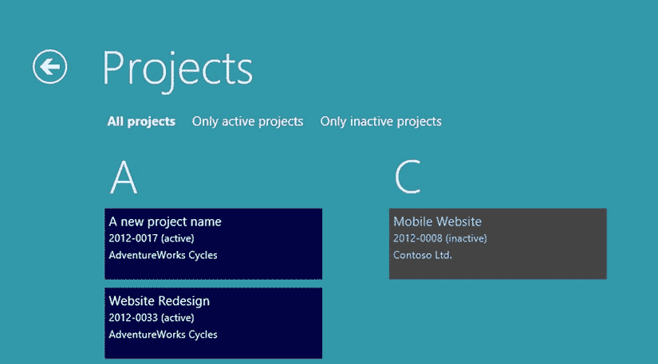
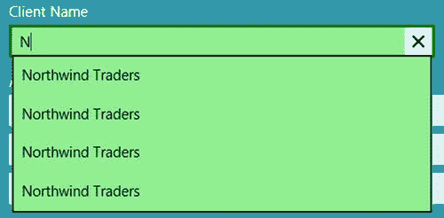
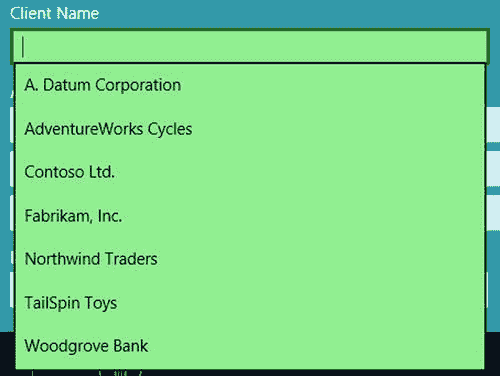

# 十一、数据绑定概念

不言而喻，数据是几乎所有有用应用不可或缺的一部分。我们的示例应用 Clok 也不例外。本章将介绍在应用中显示数据的各种技术——一个叫做*数据绑定*的过程。[第 14 章](14.html)、[第 15 章](15.html)和[第 16 章](16.html)将涵盖处理各种不同来源的数据，以及保存数据的不同方式。然而，为了使本章简单，我们将使用存储在内存中的数据。这有一个副作用，就是在我们关闭应用后，阻止我们的更改持续，但是我会在第 14 章中解决这个问题。

我们将把我们的数据模型构建成 JavaScript 中的几个类。这些类将定义我们的数据结构，以及如何使用它。让我们开始构建数据模型，我们将在整本书中继续扩展。

我们的数据模型

在这一章中，我们将构建一个类来建模项目和客户数据，以及一个单独的存储类来处理我们的内存数据库。这个存储类将允许我们创建、读取、更新和删除数据——这些概念统称为 CRUD 操作。尽管我们创建这些类是为了管理内存中的数据，但在升级 Clok 以利用其他数据源时，我们将继续使用它们。

随着我们继续构建 Clok，我们将向 Visual Studio 项目添加许多文件。因此，作为一种更有条理的方法，让我们为数据模型代码创建一个新文件夹。如果尚未打开，请在 Visual Studio 中打开 Clok 项目。然后在解决方案浏览器中添加一个名为`data`的文件夹(参见[图 11-1](#Fig1) )。我们将把这个文件夹用于我们在本章中创建的类，以及我们添加的任何其他文件，以便在整本书中执行不同的数据访问功能。



[图 11-1](#_Fig1) 。将数据文件夹添加到我们的项目中

 **注意**一个名为`data`的文件夹没有什么特别的，你没有理由不把我们将要处理的文件放在其他地方，只要你在本章后面的主题中正确引用它们。因此，如果您或您所在的团队有其他约定，您将能够在构建 Windows 应用商店应用时遵循这些约定。这些文件可以放在 Visual Studio 项目中的任何地方，但是对于本书的其余部分，我们将它们放在这个新的`data`文件夹中。

项目类别

我们的计时应用将有两种主要类型的对象:项目和时间条目。我不会在这一章中讨论时间条目，但是我们将定义一个类来表示项目。我们会让它非常简单地开始。在`data`文件夹中添加一个新的 JavaScript 文件，命名为`project.js`(参见[图 11-2](#Fig2) )。


[图 11-2](#_Fig2) 。为我们的项目数据模型添加一个类

在我建立或使用的其他项目管理和时间记录系统中，项目是一个非常复杂的概念。一个项目属于一个客户，这个客户有一个或多个联系人和一个或多个地址。一个项目由多个任务组成，每个任务可以分配给一个或多个开发人员。虽然这是一个非常健壮的项目管理应用，但它造成了一定程度的复杂性和重复的概念，不适合本书。因此，我们将把所有的功能整合到我们单一的简单的`Project`类中，我们通过添加来自[清单 11-1](#list1) 的代码在`project.js`中定义了这个类。

[***清单 11-1。***](#_list1) 定义我们的项目类

```js
(function () {
    "use strict";

    var projectClass = WinJS.Class.define(
        function constructor() {

            // define and initialize properties
            this.id = (new Date()).getTime();
            this.name = "";
            this.projectNumber = "";
            this.status = "active";
            this.description = "";
            this.startDate = new Date();
            this.dueDate = new Date();
            this.clientName = "";
            this.contactName = "";
            this.address1 = "";
            this.address2 = "";
            this.city = "";
            this.region = "";
            this.postalCode = "";
            this.email = "";
            this.phone = "";
        },
        {
            // instance members
        },
        {
            // static members
        }
    );

    WinJS.Namespace.define("Clok.Data", {
        Project: projectClass,
    });

})();
```

如前几章所述，我们在自执行函数中使用`WinJS.Class.define`方法定义了一个类，然后使用`WinJS.Namespace.define`方法将其公开为`Clok.Data.Project,`用于我们的应用。该类本身非常简单，定义了许多属性及其初始值，大部分是空字符串。我想特别解释一下这段代码。

传统的关系数据库引擎，如 Microsoft SQL Server 或 Oracle，允许开发人员创建标识字段作为对象的唯一标识符。这些通常表示为一个整数，对于数据库中的每个新记录自动递增，或者表示为一个全局唯一标识符(GUID) ，例如`C9EFEADF-A6BB-455A-8A9A-CD0BC5A588CB`。我将在[第 14 章](14.html)中介绍的 IndexedDB 也支持自动递增的标识字段。但是，因为 Clok 数据最终可能需要在多台计算机之间同步，所以最好使用 GUID 来防止标识冲突。虽然 JavaScript 可以创建看起来像 GUID 的随机字符串，但它并不是真正的全局唯一的，并且可能会出现重复值。在我们的内存示例中缺少真实身份功能的情况下，我使用了属于 JavaScript 的`Date`类的`getTime`方法。此方法返回自 1970 年 1 月 1 日以来经过的毫秒数。虽然它不是 identity 字段的完美替代品，但只要我们不在同一毫秒内创建多个项目，它就足够好了。我将在第 18 章中再次讨论这个问题，在那里你将看到如何使用一个外部库来为我们生成一个 GUID。

存储类

您可能已经注意到我们的`Project`类不包含任何 CRUD 操作的方法。它只是一个简单的类，定义了一些属性。因为我们需要某种方式来存储和检索这些数据，所以我们将创建一个`Storage`类来为我们处理这些操作。将[清单 11-2](#list2) 中的代码添加到本章前面创建的`data`文件夹中一个名为`storage.js`的新 JavaScript 文件中。

[***清单 11-2。***](#_list2) 定义我们的存储类

```js
(function () {
    "use strict";

    var storage = WinJS.Class.define(
        function constructor() {
        },
        {
            // instance members
        },
        {
            // static members
            projects: new WinJS.Binding.List([]),
        }
    );

    WinJS.Namespace.define("Clok.Data", {
        Storage: storage,
    });

})();
```

在这一点上，我们的新`Clok.Data.Storage`类是相当轻的。除了用 WinJS 创建类的样板代码之外，我们只定义了一个静态属性，名为`projects,`作为一个空的`WinJS.Binding.List`，它将存储用户将创建的所有`Project`对象。当你第一次看到`ListView`控件时，你已经在第 7 章的[中看到过这个`List`类。虽然我们可以使用常规的 JavaScript 数组来存储这些数据，但是`List`提供了许多额外的好处。我将在本章中介绍的一些好处包括对分组的支持(我也在第 7 章](07.html)中介绍过)和在`List`中创建数据的实时过滤和排序视图的能力。它还实现了必要的功能来支持 Windows 应用商店应用中的绑定。当我们构建 Clok 时，无论是在本章还是在后续章节，我们都会回到这个类来添加更多的功能。

引用我们的数据类

所以，我们有一个`Project`类和一个`Storage`类。现在我们必须让这些类对 Clok 的其他部分可用。因为我们创建的每个屏幕都必须访问这些类，所以最快最简单的方法就是添加对`default.html`的脚本引用。记住`default.html`是我们的应用启动时加载的第一个页面，我们创建的所有其他页面都在该页面中加载。如果您熟悉 ASP.NET 开发中母版页的概念，您可以将`default.html`视为我们应用的母版页。重要的是，因为我们使用 Clok 的导航应用模板，`default.html`总是被加载，所以我们引用的任何脚本中的代码总是可用的。将[清单 11-3](#list3) 中突出显示的代码添加到`default.html`的`head`部分。

[***清单 11-3。***](#_list3) 引用我们 default.html 的新班级

```js
<head>
    <meta charset="utf-8" />
    <title>Clok</title>

    <!-- WinJS references -->
    <link href="//Microsoft.WinJS.1.0/css/ui-dark.css" rel="stylesheet" />
    <script src="//Microsoft.WinJS.1.0/js/base.js"></script>
    <script src="//Microsoft.WinJS.1.0/js/ui.js"></script>
    <script src="/js/extensions.js"></script>
    <script src="/js/debug.js"></script>

    <!-- Clok references -->
    <link href="/css/default.css" rel="stylesheet" />
    <link href="/css/themeroller.css" rel="stylesheet" />
    <script src="/js/default.js"></script>
    <script src="/js/navigator.js"></script>
    <script src="/controls/js/clockControl.js"></script>

    <script src="/data/project.js"></script>
    <script src="/data/storage.js"></script>
</head>
```

 **注意**如果您决定使用一个文件夹而不是`data`来存储您的数据模型脚本，一定要相应地修改[清单 11-3](#list3) 。

临时数据

为了使本章中关于将数据绑定到用户界面的内容更简单，我们实际上不会在任何类型的持久存储中读写数据。我会在第 14 章和第 15 章的[中谈到这一点。然而，我们确实需要一些数据来帮助我们理解数据绑定是如何工作的。为了实现这一点，我们将通过在`storage.js`的最后添加来自](14.html)[清单 11-4](#list4) 的代码来硬编码一些项目。

[***清单 11-4。***](#_list4) 临时添加硬编码数据

```js
// add temp data
(function () {
    var createProject = function (name, projectNumber, clientName, id, status) {
        var newProject = new Clok.Data.Project();
        newProject.id = id;
        newProject.name = name;
        newProject.projectNumber = projectNumber;
        newProject.clientName = clientName;
        newProject.status = status || newProject.status;

        return newProject;
    }

    var projects = Clok.Data.Storage.projects;

    var name1 = "Windows Store App";
    var name2 = "Mobile Website";
    var name3 = "Website Redesign";
    var name4 = "Employee Portal";

    var client1 = "Northwind Traders";
    var client2 = "Contoso Ltd.";
    var client3 = "AdventureWorks Cycles";
    var client4 = "TailSpin Toys";
    var client5 = "A. Datum Corporation";
    var client6 = "Woodgrove Bank";
    var client7 = "Fabrikam, Inc.";

    projects.push(createProject(name1, "2012-0003", client1, 1368296808745, "inactive"));
    projects.push(createProject(name2, "2012-0008", client2, 1368296808746, "inactive"));
    projects.push(createProject(name3, "2012-0011", client1, 1368296808747, "inactive"));
    projects.push(createProject(name1, "2012-0017", client3, 1368296808748));
    projects.push(createProject(name3, "2012-0018", client4, 1368296808749, "deleted"));
    projects.push(createProject(name1, "2012-0023", client5, 1368296808750, "deleted"));
    projects.push(createProject(name3, "2012-0027", client6, 1368296808751, "inactive"));
    projects.push(createProject(name3, "2012-0030", client7, 1368296808752, "inactive"));
    projects.push(createProject(name3, "2012-0033", client3, 1368296808753));
    projects.push(createProject(name2, "2012-0039", client1, 1368296808754, "inactive"));
    projects.push(createProject(name4, "2012-0042", client3, 1368296808755, "inactive"));
    projects.push(createProject(name3, "2012-0050", client5, 1368296808756, "inactive"));
    projects.push(createProject(name1, "2012-0053", client4, 1368296808757, "inactive"));
    projects.push(createProject(name2, "2013-0012", client5, 1368296808758));
    projects.push(createProject(name2, "2013-0013", client7, 1368296808759));
    projects.push(createProject(name4, "2013-0016", client1, 1368296808760, "deleted"));
    projects.push(createProject(name4, "2013-0017", client6, 1368296808761));
    projects.push(createProject(name3, "2013-0018", client2, 1368296808762));
})();
```

总之，`createProject`方法是一种使用一行代码创建临时项目变得更容易的方法。所有的`name`和`client`变量只是为了确保一致性，让每一行更短，更容易阅读。`push`方法将一个新的`Project`添加到我们在`Storage`类中创建的`List`的末尾。

手动绑定下拉列表

现在我们已经定义了数据类和一些实际数据，让我们在屏幕上显示一些数据。我们将从做一些手工数据绑定开始。我的意思是，我们将显式设置控件的值，而不是使用 WinJS 中包含的绑定功能来为我们设置控件的值。虽然使用 WinJS 绑定功能通常比显式设置控件的值更容易，尤其是当您有多个控件时，有时手动设置也是合理的。一个特别的例子是将下拉列表中的项目绑定到您的数据。

虽然您将使用 HTML 和 JavaScript 来构建 Windows 应用商店应用的许多控件都支持 WinJS 绑定功能，但有一个特别的控件不支持下拉列表中的项目列表。为了将下拉列表中的选项绑定到我们的数据，我们将以更加手动的方式来完成。首先，让我们看看我们在做什么。在[第 9 章](09.html) ( [清单 9-13](#list13) )中，我们用`option`元素硬编码了`home.html`中 Clok 仪表板上的`project`下拉列表，以包含[图 11-3](#Fig3) 中所示的两个项目。



[图 11-3](#_Fig3) 。home.html 的硬编码项目

对于某些下拉列表，将数据硬编码是合适的。例如，如果您的下拉列表是一个月的列表，或者是美国的州，或者是某本书的章节，或者是其他很少改变的内容，那么硬编码下拉列表选项是完全有效的，就像我们到目前为止所做的那样。然而，很明显，对于用户当前正在进行的项目列表，硬编码并不是一个好的选择。

在我们开始将数据绑定到`project`下拉列表之前，我想描述一个我已经解释过几次的技术，以帮助减少一些不必要的代码重复。一般来说，我更喜欢描述性的名称空间和类名，因为它们使代码的目的更加清晰，无论是对其他开发人员还是对我来说。这就是为什么我在前面的例子中使用了名字`Clok.Data.Storage`和`Clok.Data.Project`。但是，我不想每次都键入全名，所以我借鉴了 Visual Studio 附带的项目模板中别名这些命名空间或类的做法。如果你打开`default.js`，你会在靠近文件顶部的[清单 11-5](#list5) 中看到代码。

[***清单 11-5。***](#_list5) 我们项目模板中一些常见的别名

```js
var app = WinJS.Application;
var activation = Windows.ApplicationModel.Activation;
var nav = WinJS.Navigation;
```

虽然这一步不是必需的，但它确实使我们代码的其余部分更容易阅读和编写。当我们在`default.js`工作时，我们现在可以输入`nav.navigate`而不是输入`WinJS.Navigation.navigate`。我们也可以将这个概念引入到我们的`home.js`文件中，在靠近文件顶部的[清单 11-6](#list6) 中添加突出显示的代码。

[***清单 11-6。***](#_list6) 在 home.js 中添加别名

```js
(function () {
    "use strict";

    var nav = WinJS.Navigation;
    var storage = Clok.Data.Storage;

    WinJS.UI.Pages.define("/pages/home/home.html", {

// SNIPPED
```

现在，让我们在添加一些功能时利用新的`storage`别名，在这个下拉列表中只显示那些将`status`设置为`active`的项目。将[清单 11-7](#list7) 中定义的`bindListOfProjects`函数添加到`home.js`中。

[***清单 11-7。***](#_list7) 新增功能填充项目下拉列表

```js
bindListOfProjects: function () {
    project.options.length = 1;

    var activeProjects = storage.projects.filter(
        function (p) { return p.status === "active"; }
    );

    activeProjects.forEach(function (item) {
        var option = document.createElement("option");
        option.text = item.name + " (" + item.projectNumber + ")";
        option.title = item.clientName;
        option.value = item.id;
        project.appendChild(option);
    });
},
```

第一行删除了来自`projects`的所有选项，只留下“选择一个项目”选项。我们使用`WinJS.Binding.List`的`filter`方法来获取一系列具有活动状态的项目。对于每个活动项目，我们创建一个新的`option`，并将其添加到`project`下拉列表中。现在，我们只需要调用这个方法。为此，将清单 11-8 中突出显示的代码添加到`home.js`中的`ready`函数中。

[***清单 11-8。***](#_list8) 调用新功能

```js
ready: function (element, options) {
    this.initializeMenuPointerAnimations();

    toggleTimerMenuItem.onclick = this.toggleTimerMenuItem_click.bind(this);

    this.bindListOfProjects();
    project.onchange = this.project_change.bind(this);
    saveTimeButton.onclick = this.saveTimeButton_click.bind(this);
    discardTimeButton.onclick = this.discardTimeButton_click.bind(this);

    this.setupTimerRelatedControls();
},
```

现在，当您运行 Clok 时，您应该会在下拉列表中看到我们在[清单 11-4](#list4) 中添加的一些项目(参见[图 11-4](#Fig4) )。尽管我们在本章前面将数据硬编码到了`storage.js`中，但是这个下拉列表是动态加载的。当我们稍后将 Clok 更改为使用持久存储并删除硬编码项目时，该功能仍将继续工作。


[图 11-4](#_Fig4) 。从我们的数据源添加的项目

将分组数据绑定到列表视图

为了使 Clok 成为一个有用的应用，用户需要一种方法来查看他或她的所有项目的列表。这是使用 WinJS 的数据绑定功能的绝佳机会。事实上，因为我们设计了我们的`Project`类和`Storage`类来使用`WinJS.Binding.List`存储我们的项目，所以添加一个`ListView`来显示它们将非常类似于[第 7 章](07.html)中的`ListView`示例。

创建和连接页面控件

首先向`pages`文件夹添加一个名为`projects`的新文件夹，然后向`projects`文件夹添加一个名为`list.html`的新页面控件。当你完成后，你的解决方案浏览器应该看起来类似于[图 11-5](#Fig5) 。



[图 11-5](#_Fig5) 。为项目列表添加页面控件

现在，我们必须修改 Clok 仪表板，以便项目菜单选项([图 11-6](#Fig6) )将导航到我们的新页面控件。


[图 11-6](#_Fig6) 。项目菜单选项

打开`home.js`，在`enableOrDisableButtons`函数的定义后添加[清单 11-9](#list9) 中的`projectsMenuItem_click`函数。

[***清单 11-9。***](#_list9) 定义事件处理程序

```js
projectsMenuItem_click: function (e) {
    nav.navigate("/pages/projects/list.html");
},
```

接下来，修改`ready`函数，添加清单 11-10 中突出显示的代码行。

[***清单 11-10。***](#_list10) 将事件处理程序连接到菜单项目选项

```js
ready: function (element, options) {
    this.initializeMenuPointerAnimations();

    toggleTimerMenuItem.onclick = this.toggleTimerMenuItem_click.bind(this);

    this.bindListOfProjects();
    project.onchange = this.project_change.bind(this);
    editProjectButton.onclick = this.editProjectButton_click.bind(this);
    saveTimeButton.onclick = this.saveTimeButton_click.bind(this);B
    discardTimeButton.onclick = this.discardTimeButton_click.bind(this);

    projectsMenuItem.onclick = this.projectsMenuItem_click.bind(this);

    this.setupTimerRelatedControls();
},
```

最后要记住的是，我们应该从`home.html`中的`projectsMenuItem div`中移除`notImplemented` CSS 类(在[清单 11-11](#list11) 中突出显示)。保留这个不会阻止导航工作，但是如果我们不能删除它，我们在第 10 章中添加的鼠标悬停动画将会保留，并可能给我们的用户造成混乱。

[***清单 11-11。***](#_list11) 应该删除的 CSS 类

```js
<div id="projectsMenuItem" class="mainMenuItem secondaryMenuItem notImplemented">
```

添加 ListView 并绑定数据

此时，我们可以导航到项目页面，但没有太多可看的。为了使这个页面有用，我们将添加一个`ListView,`来显示数据中每个`Clok.Data.Project`对象的一个项目。同时，我们还将按照项目的`clientName`属性的第一个字母对项目进行分组，并添加一个`SemanticZoom`控件，当用户有很多项目时，这将会派上用场。我们必须重新访问`storage.js,`来添加对项目数据分组的支持。打开该文件并添加清单 11-12 中突出显示的代码。

[***清单 11-12。***](#_list12) 添加对分组项目的支持

```js
// SNIPPED

{
    // static members
    projects: new WinJS.Binding.List([]),

    compareProjectGroups: function (left, right) {
        return left.toUpperCase().charCodeAt(0) - right.toUpperCase().charCodeAt(0);
    },
    getProjectGroupKey: function (dataItem) {
        return dataItem.clientName.toUpperCase().charAt(0);
    },
    getProjectGroupData: function (dataItem) {
        return {
            name: dataItem.clientName.toUpperCase().charAt(0)
        }
    },
    groupedProjects: {
        get: function () {
            var grouped = storage.projects.createGrouped(
                    storage.getProjectGroupKey,
                    storage.getProjectGroupData,
                    storage.compareProjectGroups);

            return grouped;
        }
    },
}

// SNIPPED
```

这段代码应该看起来很熟悉，因为我们在第 7 章[中使用了非常相似的代码来为那一章中的动物数据添加分组支持。事实上，任何时候你想要将一个`WinJS.Binding.List`中的数据分组到一个`ListView`中，你都必须调用`List`的`createGrouped`方法。该函数返回您的`List`中数据的实时视图，这意味着，通过添加或修改底层数据，分组视图也会发生变化。有关`createGrouped`功能的更多信息，请访问 MSDN: `http://msdn.microsoft.com/en-us/library/windows/apps/hh700742.aspx`。](07.html)

同样熟悉的是用`SemanticZoom`显示`ListView`所需的 HTML 代码。用清单 11-13 中[的代码替换`list.html`中的`body`元素。](#list13)

[***清单 11-13。***](#_list13) 添加 ListView 来显示项目

```js
<body>
    <div class="list fragment">
        <header aria-label="Header content" role="banner">
            <button class="win-backbutton" aria-label="Back" disabled type="button"></button>
            <h1 class="titlearea win-type-ellipsis">
                <span class="pagetitle">Projects</span>
            </h1>
        </header>
        <section aria-label="Main content" role="main">
            <div id="listViewHeaderTemplate"
                    data-win-control="WinJS.Binding.Template"
                    style="display: none">
                <div class="listViewHeader">
                    <h1 data-win-bind="innerText: name"></h1>
                </div>
            </div>

            <div id="listViewTemplate"
                    data-win-control="WinJS.Binding.Template"
                    style="display: none">
                <div class="listViewItem">
                    <h4 data-win-bind="innerText: name"></h4>
                    <h6>
                        <span data-win-bind="innerText: projectNumber"></span>
                         (<span data-win-bind="innerText: status"></span>)
                    </h6>
                    <h6 data-win-bind="innerText: clientName"></h6>
                </div>
            </div>

            <div id="semanticZoomTemplate"
                    data-win-control="WinJS.Binding.Template"
                    style="display: none">
                <div class="semanticZoomItem">
                    <h2 class="semanticZoomItemText" data-win-bind="innerText: name"></h2>
                </div>
            </div>

            <div id="semanticZoom" data-win-control="WinJS.UI.SemanticZoom">

                <!-- zoomed in -->
                <div id="listView"
                    class="win-selectionstylefilled"
                    data-win-control="WinJS.UI.ListView"
                    data-win-options="{
                        itemTemplate: select('#listViewTemplate'),
                        groupHeaderTemplate: select('#listViewHeaderTemplate'),
                        selectionMode: 'none',
                        tapBehavior: 'invoke',
                        swipeBehavior: 'none',
                        itemDataSource: Clok.Data.Storage.groupedProjects.dataSource,
                        groupDataSource: Clok.Data.Storage.groupedProjects.groups.dataSource
                }">
                </div>

                <!-- zoomed out -->
                <div id="zoomedOutListView"
                    data-win-control="WinJS.UI.ListView"
                    data-win-options="{
                        itemTemplate: select('#semanticZoomTemplate'),
                        selectionMode: 'none',
                        tapBehavior: 'invoke',
                        swipeBehavior: 'none',
                        itemDataSource: Clok.Data.Storage.groupedProjects.groups.dataSource
                    }">
                </div>
            </div>
        </section>
    </div>
</body>
```

最后，我们必须样式化`ListView`，通过添加[清单 11-14 中的代码](#list14)到`list.css`。

[***清单 11-14。***](#_list14) CSS 来样式 ListView

```js
.listViewHeader {
    width: 50px;
    height: 50px;
    padding: 8px;
}

.listViewItem {
    width: 250px;
    height: 75px;
    padding: 5px;
    overflow: hidden;
}

#listView {
    height: 400px;
    width: 100%;
}

#zoomedOutListView {
    height: 400px;
    width: 100%;
}

#semanticZoom {
    height: calc(100% - 30px);
    width: calc(100% - 120px);
}

.semanticZoomItem {
    color: #ffffff;
    background-color: #000046;
    width: 50px;
    height: 40px;
    padding: 5px 15px;
}
```

如果你现在在 Clok 中查看这个页面，你会看到一个类似于[图 11-7](#Fig7) 的列表视图。挺好的但是不算伟大。最大的问题是，它会显示已被删除的项目，但我们可以解决这个问题。


[图 11-7](#_Fig7) 。包含所有项目的 ListView

将筛选的数据绑定到 ListView

在 Clok 中，我们实际上不能删除项目，因为，一旦我们构建了功能，我们就可能拥有与项目相关联的时间条目。相反，我们给了项目一个已删除的状态，并通过代码中的逻辑不让它显示。此外，项目可以是活动的或不活动的，一旦我们的用户有几个项目，一个有用的特性将允许他或她按状态过滤项目。

显示过滤的数据

`WinJS.Binding.List`类有一个`createFiltered`方法，它返回满足 JavaScript 中定义的过滤条件的`List,`中的数据子集。像`createGrouped`方法一样，`createFiltered`返回`List,`的实时视图，这意味着添加或修改底层数据时，过滤后的视图也会改变。关于`createFiltered`功能的更多信息可从 MSDN: `http://msdn.microsoft.com/en-us/library/windows/apps/hh700741.aspx`获得。通过添加清单 11-15 中突出显示的代码来修改`storage.js`，注意把它放在类定义之外。

[***清单 11-15。***](#_list15) 添加分组和过滤方法

```js
var storage = WinJS.Class.define(
    // SNIPPED
);

storage.projects.getGroupedProjectsByStatus = function (statuses) {
    var filtered = this
        .createFiltered(function (p) {
            return statuses.indexOf(p.status) >= 0;
        });

    var grouped = filtered
        .createGrouped(
            storage.getProjectGroupKey,
            storage.getProjectGroupData,
            storage.compareProjectGroups);

    return grouped;
};

WinJS.Namespace.define("Clok.Data", {
    Storage: storage,
});
```

感谢 JavaScript 的动态特性，我们能够定义一个名为`getGroupedProjectsByStatus`的新函数，并将其添加到现有的`projects`变量中。该函数接受用户想要查看的一系列项目状态。因为`getGroupedProjectsByStatus`被添加到了`projects`，所以`this` JavaScript 关键字指的是项目的当前`List`。我们使用`createFiltered`方法返回与我们的过滤函数匹配的当前项目的子集——那些具有在`statuses`参数中指定的状态的项目。一旦我们有了一个过滤列表，我们就使用上一节中使用的相同的`createGrouped`方法对它们进行分组。

为了将我们的`ListView`绑定到这个函数的结果，我们必须更改我们现有的代码，以便在我们的 JavaScript 代码中设置数据源。用清单 11-16 中的[代码修改`list.js`中的`ready`函数来完成。](#list16)

[***清单 11-16。***](#_list16) 在 JavaScript 中设置 ListView 数据源

```js
ready: function (element, options) {
    this.filteredProjects =
        storage.projects.getGroupedProjectsByStatus(["active", "inactive"]);

    listView.winControl.itemDataSource = this.filteredProjects.dataSource;
    listView.winControl.groupDataSource = this.filteredProjects.groups.dataSource;
    zoomedOutListView.winControl.itemDataSource = this.filteredProjects.groups.dataSource;
},
```

 **注意**记得在`list.js`中定义`storage`别名，就像在[清单 11-6](#list6) 中的`home.js`中一样。

因为我们在代码中设置了`ListView`数据源，所以我们可以将它们从 HTML 标记中移除。从`list.html`中删除[清单 11-17](#list17) 中高亮显示的代码。

[***清单 11-17。***](#_list17) 从 list.html 删除数据源

```js
<!-- zoomed in -->
<div id="listView"
    class="win-selectionstylefilled"
    data-win-control="WinJS.UI.ListView"
    data-win-options="{
        itemTemplate: select('#listViewTemplate'),
        groupHeaderTemplate: select('#listViewHeaderTemplate'),
        selectionMode: 'none',
        tapBehavior: 'invoke',
        swipeBehavior: 'none',
        itemDataSource: Clok.Data.Storage.groupedProjects.dataSource,
        groupDataSource: Clok.Data.Storage.groupedProjects.groups.dataSource
}">
</div>

<!-- zoomed out -->
<div id="zoomedOutListView"
    data-win-control="WinJS.UI.ListView"
    data-win-options="{
        itemTemplate: select('#semanticZoomTemplate'),
        selectionMode: 'none',
        tapBehavior: 'invoke',
        swipeBehavior: 'none',
        itemDataSource: Clok.Data.Storage.groupedProjects.groups.dataSource
    }">
</div>
```

 **注意**不要忘记从`data-win-options`属性的最后一项中删除尾部逗号——在本例中，是在`swipeBehavior`选项后的逗号。

绑定其他控件属性

此时，您的项目页面应该只显示活动的和非活动的项目，并且您不应该看到任何已删除的项目，但是我们可以通过对每个项目进行不同的样式化来改善用户体验。WinJS 数据绑定非常强大，可以帮助我们非常容易地完成这个任务。除了绑定屏幕上显示的数据之外，还可以将控件的其他属性绑定到数据源。例如，我们可以将`ListView`模板的`className`属性绑定到`Project`类的`status`属性。假设您已经为`.active`和`.inactive`创建了 CSS 规则来改变项目的背景颜色，您可以通过添加清单 11-18 中突出显示的代码来修改`list.html`。

[***清单 11-18。***](#_list18) 通过 className 属性绑定 CSS 类

```js
<div class="listViewItem" data-win-bind="className: status">
```

然而，当我们现在运行 Clok 时，我们并没有完全看到我们所期望的。正如您在[图 11-8](#Fig8) 中看到的，我们丢失了之前在[清单 11-14](#list14) 中定义的样式，该样式设置了 CSS 属性，如`width`和`height`。这是因为通过绑定`className`属性，我们用`active`或`inactive`类替换了`listViewItem`类。


[图 11-8](#_Fig8) 。这不是我们想要的

此时，我们有几个选择。最直接的选择是向我们的`active`和`inactive` CSS 类添加额外的 CSS 定义。在这种情况下，这并不坏，因为只有两个类，但是我更喜欢不必复制这些设置。此外，如果我们这样做了，那么我就不能举例说明下一个选项。

为了实现我们想要的格式，我们必须确保当我们将一个值绑定到`className`属性时，`listViewItem`类中的原始 CSS 设置不会被覆盖。我将在这里演示的方法利用了 HTML5 中支持的`data-`属性。从第 5 章开始，我们就一直在使用这些属性，那时我们开始将`data-win-control`添加到 HTML 元素中，让 WinJS 将它们视为控件而不是`div`元素。此外，我们还使用了`data-win-options`来用默认设置初始化我们的控件，使用`data-win-bind`来配置绑定。您可能知道也可能不知道的是，您可以在 HTML5 中创建自己的`data-`属性，我们将利用这一点来解决我们的`ListView`样式问题。用[清单 11-19](#list19) 中高亮显示的代码再次修改`list.html`。

[***清单 11-19。***](#_list19) 通过 className 属性绑定 CSS 类

```js
<div data-class="listViewItem" data-win-bind="className: status">
```

与清单 11-18 中的[的唯一区别是将`class`属性改为我们的自定义`data-class`属性。现在，我们只需要相应地修改我们的 CSS，这是一个分为两部分的过程。首先，从`list.css`中删除](#list18)[清单 11-20](#list20) 中的代码。

[***清单 11-20。***](#_list20) 从 list.css 中移除此

```js
.listViewItem {
    width: 250px;
    height: 75px;
    padding: 5px;
    overflow: hidden;
}
```

将清单 11-21 中的[代码添加到`list.css`中，以代替删除的代码。](#list21)

[***清单 11-21。***](#_list21) 新的 CSS 规则为我们的 data-class 属性

```js
 [data-class=listViewItem] {
    width: 250px;
    height: 75px;
    padding: 5px;
    overflow: hidden;
}

    [data-class=listViewItem].active {
        background-color: #000046;
    }

    [data-class=listViewItem].inactive {
        background-color: #464646;
        color: #cccccc;
    }
```

 **注意**您可以使用`[attributeName=attributeValue]` CSS 选择器语法根据属性来设计元素的样式。

您将看到`[data-class=listViewItem]`的新规则与我们删除的`.listViewItem`规则相同。设置这个自定义属性并从我们的 CSS 中定位它意味着`className`属性不再有定义的值。在这种情况下，这使我们不必担心删除我们希望保留的 CSS 规则。然后，我们的新规则根据数据绑定过程中`className`属性是设置为`active`还是`inactive`来添加适当的样式。参见图 11-9 中的[结果。](#Fig9)



[图 11-9](#_Fig9) 。基于状态过滤和设计项目

使用 WinJS。Binding.as

我们的项目页面现在可以正确隐藏已删除的项目，只显示活动和非活动项目。它还根据它们的状态对它们进行不同的样式化。然而，随着用户项目列表的增长，这个页面可能会变得不必要的长。为了补救这一点，让我们添加一些功能，允许用户指定他或她是否希望只查看活动项目，只查看非活动项目，或者同时查看活动项目和非活动项目。首先，我们需要一些按钮，用户可以点击这些按钮来指示他们想要如何过滤他们的项目。将清单 11-22 中突出显示的代码添加到`list.html`中。

[***清单 11-22。***](#_list22) 添加按钮过滤列表中的项目

```js
<div id="semanticZoomTemplate" data-win-control="WinJS.Binding.Template" style="display: none">
    <div class="semanticZoomItem">
        <h2 class="semanticZoomItemText" data-win-bind="innerText: name"></h2>
    </div>
</div>

<div id="filters">
    <button id="allProjectsButton" class="selected">All projects</button>
    <button id="activeProjectsButton">Only active projects</button>
    <button id="inactiveProjectsButton">Only inactive projects</button>
</div>

<div id="semanticZoom" data-win-control="WinJS.UI.SemanticZoom">
<!-- SNIPPED -->
</div>
```

我们可以保留这些过滤按钮的默认样式，但是更好的用户体验(至少在我看来)是去掉按钮的边框，将当前选中的过滤按钮的文本加粗。因此，将清单 11-23 中的代码添加到`list.css`中。

[***清单 11-23。***](#_list23) CSS 来样式过滤按钮

```js
#filters {
    height: 30px;
}

    #filters button {
        border: 0px;
        font-weight: normal;
    }

        #filters button.selected {
            font-weight: bold;
        }
```

现在我们已经有了 UI，我们需要在 JavaScript 中做一些工作和返工，将所有的部分连接在一起。用清单 11-24 中的代码替换`list.js`中的整个页面定义。

[***清单 11-24。***](#_list24) 我们的新页面定义

```js
WinJS.UI.Pages.define("/pages/projects/list.html", {
    ready: function (element, options) {
        allProjectsButton.onclick = this.allStatusFilter_click.bind(this);
        activeProjectsButton.onclick = this.activeStatusFilter_click.bind(this);
        inactiveProjectsButton.onclick = this.inactiveStatusFilter_click.bind(this);

        this.filter = WinJS.Binding.as({ value: ["active", "inactive"] });
        this.filter.bind("value", this.filter_value_changed.bind(this));
    },

    allStatusFilter_click: function (e) {
        this.filter.value = ["active", "inactive"];
        this.setSelectedButton(allProjectsButton);
    },

    activeStatusFilter_click: function (e) {
        this.filter.value = ["active"];
        this.setSelectedButton(activeProjectsButton);
    },

    inactiveStatusFilter_click: function (e) {
        this.filter.value = ["inactive"];
        this.setSelectedButton(inactiveProjectsButton);
    },

    setSelectedButton: function (btnToSelect) {
        WinJS.Utilities.query("#filters button").removeClass("selected");
        WinJS.Utilities.addClass(btnToSelect, "selected");
    },

    filter_value_changed: function (e) {
        this.filteredProjects = storage.projects.getGroupedProjectsByStatus(this.filter.value);

        listView.winControl.itemDataSource = this.filteredProjects.dataSource;
        listView.winControl.groupDataSource = this.filteredProjects.groups.dataSource;
        zoomedOutListView.winControl.itemDataSource = this.filteredProjects.groups.dataSource;
    },

});
```

首先要注意的是，我们添加了函数来处理每个新过滤器按钮的`click`事件。它们非常简单明了:它们设置一个名为`filter`的变量的值，我稍后会讨论这个变量，然后它们使用`WinJS.Utilities`名称空间中的一些方法将被点击的按钮设置为当前选中的按钮。你还会看到一个名为`filter_value_changed,`的新函数，它看起来非常类似于我们在清单 11-16 中添加的代码，除了它还引用了`filter`变量。这里有趣的部分是`filter`的定义。我已经在清单 11-25 中复制了这个有趣的部分。

[***清单 11-25。***](#_list25)[清单 11-24 最有趣的部分](#list24)

```js
this.filter = WinJS.Binding.as({ value: ["active", "inactive"] });
this.filter.bind("value", this.filter_value_changed.bind(this));
```

我们已经将`filter`定义为一个新变量，用它来获取一个具有包含状态数组的`value`属性的对象，并通过对`WinJS.Binding.as` 的调用来包装它。`as`方法接受它收到的任何参数，并返回该参数的一个可观察版本。这是什么意思？简而言之，当某个东西是可观察的，那么任何正在观察它的东西，比如绑定到它的控件，都会在可观察对象改变时得到通知。在我们的例子中，我们将过滤器的`value`属性绑定到`filter_value_changed`，每当`value`改变时，就会调用`filter_value_changed`函数。

因此，当我们的按钮点击处理程序改变`filter.value`时，就会调用`filter_value_changed`并将`ListView`数据源重新绑定到一个经过过滤的项目列表中。更多关于`as`方法的信息可以在 MSDN: `http://msdn.microsoft.com/en-us/library/windows/apps/br229801.aspx`上找到。

 **注意**[清单 11-25](#list25) 的第二行包含对两个不同`bind`方法的调用。第一个是`this.filter.bind`，为`value`属性配置一个观察者作为`filter_value_changed`函数的地址。第二个，`this.filter_value_changed.bind`，标识了`this` JavaScript 关键字将在该方法中引用什么，在本例中，是页面定义本身，这是 ready 函数中`this`的值。

现在，当您运行 Clok 并导航到项目页面时，您最初会看到一个类似于[图 11-10](#Fig10) 的屏幕，显示所有活动和非活动的项目。这和我们在[图 11-9](#Fig9) 中看到的一样，只是增加了我们新的过滤按钮。



[图 11-10](#_Fig10) 。“项目”页面，带有新的过滤器按钮

现在，点击第二个过滤器按钮，只查看活动项目。页面将更新以匹配[图 11-11](#Fig11) ，选择第二个按钮并从`ListView`中移除不活动的项目。



[图 11-11](#_Fig11) 。仅显示活动项目

设置数据上下文

既然我们已经有了一个很好的工作项目列表，下一个合乎逻辑的步骤就是添加一个项目细节页面。该页面将允许用户查看和编辑现有项目，以及创建新项目。然而，HTML 表单没有数据源属性。因此，我们将看看如何通过设置数据上下文来有效地设置表单的数据源，或者任何任意的 HTML 元素。但是，首先，我们需要完成一些快速设置工作。

添加项目详细信息页面

将名为`detail.html`的新页面控件添加到我们在本章前面创建的同一个`projects`文件夹中。当你完成后，你的解决方案浏览器应该看起来类似于[图 11-12](#Fig12) 。


[图 11-12](#_Fig12) 。项目文件夹中的两个页面控件

用户可以通过两种方式访问项目详细信息页面:编辑现有项目和添加新项目。我们必须将这两个选项的导航添加到项目列表页面中。为了与 Windows Store 应用指南保持一致，我们将添加一个带有`AppBarCommand`按钮的`AppBar`，以便向项目列表页面添加一个新项目。将[清单 11-26](#list26) 中高亮显示的代码添加到`list.html`中的`body`元素之后。

[***清单 11-26。***](#_list26) 向项目列表页面添加 AppBar

```js
<body>
    <div id="projectListAppBar"
            class="win-ui-dark"
            data-win-control="WinJS.UI.AppBar">

        <button
            data-win-control="WinJS.UI.AppBarCommand"
            data-win-options="{
                id:'addProjectCommand',
                label:'Add',
                icon:'add',
                section:'global',
                tooltip:'Add'}">
        </button>
    </div>

<!-- SNIPPED -->
</body>
```

 **注意**记住应用栏可以用鼠标右键点击屏幕或者从触摸屏底边向上滑动打开。

为这个按钮添加一个 click-event 处理程序，当用户点击(调用)一个`ListView`中的项目时添加另一个处理程序，现在应该很熟悉了。将清单 11-27 中[突出显示的代码添加到`list.js`中的`ready`函数中。](#list27)

[***清单 11-27。***](#_list27) 布线起事件处理程序

```js
ready: function (element, options) {
    allProjectsButton.onclick = this.allStatusFilter_click.bind(this);
    activeProjectsButton.onclick = this.activeStatusFilter_click.bind(this);
    inactiveProjectsButton.onclick = this.inactiveStatusFilter_click.bind(this);

    this.filter = WinJS.Binding.as({ value: ["active", "inactive"] });
    this.filter.bind("value", this.filter_value_changed.bind(this));

    addProjectCommand.onclick = this.addProjectCommand_click.bind(this);
    listView.winControl.oniteminvoked = this.listView_itemInvoked.bind(this);
},
```

T5 注意当用户点击`ListView`中的一个项目时`ListView`会引发`itemInvoked`事件。这个事件非常类似于`click`事件，但是也包括关于哪个项目被点击的信息。

定义这些事件处理程序也非常简单。将清单 11-28 中[的代码添加到`list.js`中的就绪函数之后。](#list28)

[***清单 11-28。***](#_list28) 定义导航到项目详情页面的事件处理程序

```js
addProjectCommand_click: function (e) {
    WinJS.Navigation.navigate("/pages/projects/detail.html");
},

listView_itemInvoked: function (e) {
    var item = this.filteredProjects.getAt(e.detail.itemIndex);
    WinJS.Navigation.navigate("/pages/projects/detail.html", { id: item.id });
},
```

当点击`addProjectCommand`时，Clok 执行一个简单的导航到项目细节页面。当调用`ListView`中的一个项目时，我们使用`itemIndex`属性来确定选择了哪个项目，然后导航到项目详细信息页面，其初始状态包括所选`Project`对象的`id`。

向项目详细信息页面添加表单

现在，我们可以导航到项目详细信息页面，是时候向该页面添加一个表单了。我们将使用这个表单来查看、编辑和添加项目到 Clok。用[清单 11-29](#list29) 中的代码替换`detail.html`中的`body`元素。

[***清单 11-29。***](#_list29) 项目明细表

```js
<body>
    <div id="projectDetailAppBar"
            class="win-ui-dark"
            data-win-control="WinJS.UI.AppBar"
            data-win-options="{ sticky: true }">

        <button
            data-win-control="WinJS.UI.AppBarCommand"
            data-win-options="{
                id:'saveProjectCommand',
                label:'Save',
                icon:'save',
                section:'selection',
                tooltip:'Save'}">
        </button>
        <hr
            data-win-control="WinJS.UI.AppBarCommand"
            data-win-options="{type:'separator',section:'selection'}" />
        <button
            data-win-control="WinJS.UI.AppBarCommand"
            data-win-options="{
                id:'deleteProjectCommand',
                label:'Delete',
                icon:'delete',
                section:'selection',
                tooltip:'Delete',
                disabled: true}">
        </button>
    </div>

    <div class="detail fragment">
        <header aria-label="Header content" role="banner">
            <button class="win-backbutton" aria-label="Back" disabled type="button"></button>
            <h1 class="titlearea win-type-ellipsis">
                <span class="pagetitle">Project Detail</span>
            </h1>
        </header>
        <section aria-label="Main content" role="main">
            <form id="projectDetailForm" onsubmit="return false;">
                <div class="formField" style="-ms-grid-row: 1; -ms-grid-column: 1;">
                    <label for="projectName">Project Name</label><br />
                    <input type="text" id="projectName"
                        maxlength="75"
                        required
                        autofocus
                        data-win-bind="value: name">
                </div>
                <div class="formField" style="-ms-grid-row: 1; -ms-grid-column: 3;">
                    <label for="projectNumber">Project Number</label><br />
                    <input type="text" id="projectNumber"
                        maxlength="25"
                        required
                        data-win-bind="value: projectNumber">
                </div>
                <div class="formField" style="-ms-grid-row: 1; -ms-grid-column: 5;">
                    <label for="projectStatus">Status</label><br />
                    <div id="projectStatus"
                        data-win-control="WinJS.UI.ToggleSwitch"
                        data-win-options="{
                            labelOn: 'Active',
                            labelOff: 'Inactive'
                        }"></div>
                </div>

                <div class="formField"
                        style="-ms-grid-row: 2; -ms-grid-column: 1; -ms-grid-column-span: 3;">
                    <label for="projectDescription">Description</label><br />
                    <textarea id="projectDescription"
                        data-win-bind="value: description"></textarea>
                </div>

                <div class="formField" style="-ms-grid-row: 3; -ms-grid-column: 1;">
                    <label for="startDate">Start Date</label><br />
                    <div id="startDate"
                        data-win-control="WinJS.UI.DatePicker"
                        data-win-bind="winControl.current: startDate"></div>
                </div>
                <div class="formField" style="-ms-grid-row: 3; -ms-grid-column: 3;">
                    <label for="dueDate">Due Date</label><br />
                    <div id="dueDate"
                        data-win-control="WinJS.UI.DatePicker"
                        data-win-bind="winControl.current: dueDate"></div>
                </div>
                <div class="formField" style="-ms-grid-row: 4; -ms-grid-column: 1;">
                    <label for="clientName">Client Name</label><br />
                    <input type="text" id="clientName"
                        maxlength="50"
                        required
                        data-win-bind="value: clientName">
                </div>
                <div class="formField" style="-ms-grid-row: 4; -ms-grid-column: 3;">
                    <label for="contactName">Contact Name</label><br />
                    <input type="text" id="contactName"
                        maxlength="50"
                        data-win-bind="value: contactName">
                </div>
                <div class="formField"
                        style="-ms-grid-row: 5; -ms-grid-column: 1; -ms-grid-column-span: 3;">
                    <label for="address1">Address</label><br />
                    <input type="text" id="address1"
                        maxlength="60"
                        placeholder="Line 1 (e.g., 1234 Maple St.)"
                        data-win-bind="value: address1"><br />
                    <input type="text" id="address2"
                        maxlength="60"
                        placeholder="Line 2 (e.g., Suite A)"
                        data-win-bind="value: address2"><br />
                    <input type="text" id="city"
                        maxlength="35"
                        placeholder="City"
                        data-win-bind="value: city">
                    <input type="text" id="region"
                        maxlength="25"
                        placeholder="State/Region"
                        data-win-bind="value: region">
                    <input type="text" id="postalCode"
                        maxlength="12"
                        placeholder="Postal Code"
                        data-win-bind="value: postalCode">
                </div>
                <div class="formField" style="-ms-grid-row: 6; -ms-grid-column: 1;">
                    <label for="contactEmail">Email</label><br />
                    <input type="email" id="contactEmail"
                        maxlength="75"
                        data-win-bind="value: email">
                </div>
                <div class="formField" style="-ms-grid-row: 6; -ms-grid-column: 3;">
                    <label for="phone">Phone</label><br />
                    <input type="tel" id="phone"
                        maxlength="25"
                        data-win-bind="value: phone">
                </div>
            </form>
        </section>
    </div>
</body>
```

 **注意**在各种地址字段中使用`placeholder`属性为这些字段提供了很好的水印效果。占位符文本显示在空字段中，并在用户单击该字段时消失。这是向用户提供简单说明或示例输入的一种简单、紧凑的方式。

那有很多代码，但是正如你所看到的，很多都是不言自明的。我们创建一个带有两个`AppBarCommand`控件的`AppBar`，然后创建一个带有多个字段的表单。我们添加了一些 CSS 类，这样我们就可以在 CSS 中设置表单字段的样式，我们很快就会这样做。这很好，但这并不是什么新东西。在这一节中，我想特别说明两个主题，这两个主题都在[清单 11-30](#list30) 中进行了说明。

[***清单 11-30。***](#_list30) 项目名称字段为必填项

```js
<input type="text" id="projectName"
    maxlength="75"
    required
    autofocus
    data-win-bind="value: name" >
```

除了 Status 字段(我将在下一节中讨论)之外，页面上的每个字段都在其`data-win-bind`属性中定义了一个绑定。语法和我们在[清单 11-13](#list13) 中看到的完全一样。此外，我们用`required`属性标记了三个字段——项目名称、项目编号和客户名称——我们将在验证用户输入的数据时利用这个属性。

我稍后将回到这两个属性。然而，在我开始之前，让我们用一些 CSS 使这个表单看起来更好。将清单 11-31 中的代码添加到`detail.css`中。

[***清单 11-31。***](#_list31) 造型项目明细表

```js
#projectDetailForm {
    display: -ms-grid;
    -ms-grid-columns: 2fr 20px 1fr 20px 1fr;
    max-width: 900px;
}

    #projectDetailForm .formField {
        padding-bottom: 10px;
    }

        #projectDetailForm .formField input:invalid,
        #projectDetailForm .formField textarea:invalid,
        #projectDetailForm .formField select:invalid {
            border: 5px solid red;
            background-color: #EE9090;
        }

#projectName, #clientName, #contactName, #contactEmail {
    width: 430px;
}

#projectDescription {
    height: 60px;
    width: calc(90vw - 120px);
}

#projectNumber, #phone {
    width: 200px;
}

#address1, #address2 {
    width: 600px;
}

#city {
    width: 265px;
}

#region {
    width: 175px;
}

#postalCode {
    width: 140px;
}
```

同样，这是几行代码，但是非常简单。我们使用网格布局在表单中创建五列，其中三列用于表单内容，另外两列用于增加列间距。剩余的大部分 CSS 用于设置不同字段的尺寸，通过其`id`属性识别每个字段。

使用 CSS 样式化必填和无效字段

在清单 11-31 中，你可能不熟悉的一件事是`:invalid` CSS 伪类的使用。我们使用`:invalid`创建的 CSS 规则将用红色粗边框突出显示任何无效字段。因为我们按照要求标记了三个字段，HTML5 自动为我们验证这些字段，并在这些字段为空时添加`:invalid`伪类。此外，因为我们将它的`type`属性设置为`email`，HTML5 会自动验证我们的电子邮件字段包含的任何文本是否是有效的电子邮件地址。参见图 11-13 中的示例。


[图 11-13](#_Fig13) 。因为项目名称和项目编号是必需的，所以它们是无效的

这对我们的用户来说是一个很好的指示，他们输入或没有输入的东西是不允许的。对于用户体验来说不幸的是，当添加一个新项目时，只要项目详细信息页面一加载，字段就已经出现错误。虽然从技术上来说，项目必须有一个名字，但这对于用户来说是一种突兀的体验。因此，我们将做一个小的修改来达到两个目的:指示哪些字段是必需的，并且在用户与表单交互之前不指示它们是无效的。看看清单 11-32 中修改过的`detail.html`文件的一个片段。

[***清单 11-32。***](#_list32) 修改项目名称字段

```js
<div class="formField required " style="-ms-grid-row: 1; -ms-grid-column: 1; ">
    <label for="projectName">Project Name</label><br />
    <input type="text" id="projectName"
        maxlength="75"
        autofocus
        data-win-bind="value: name">
</div>
```

看到区别了吗？我们从`input`控件中移除了`required`属性，并向包含该控件的`div`元素添加了一个名为`required`的 CSS 类。对“项目编号”和“客户名称”字段进行同样的更改。然后通过添加清单 11-33 中突出显示的代码来修改`detail.css`。

[***清单 11-33。***](#_list33) 必填字段的新 CSS 规则

```js
#projectDetailForm .formField {
    padding-bottom: 10px;
}

    #projectDetailForm .formField.required input,
    #projectDetailForm .formField.required textarea,
    #projectDetailForm .formField.required select {
        border: solid green;
        background-color: lightgreen;
    }

    #projectDetailForm .formField input:invalid,
    #projectDetailForm .formField textarea:invalid,
    #projectDetailForm .formField select:invalid {
        border: 5px solid red;
        background-color: #EE9090;
    }
```

现在，当我们运行 Clok 并添加一个新项目时，必填字段会以较细的绿色边框和绿色背景突出显示(参见[图 11-14](#Fig14) )。


[图 11-14](#_Fig14) 。这些字段是必需的，但尚未被视为无效

然而，CSS 类并不特殊。当你使用这个表单时，你可能会注意到，无论你现在做什么，这些字段都不会出现无效，就像图 11-13 中的[一样。这是因为应用名为`required`的 CSS 类实际上并没有使字段成为必需的。应该发生的是，必填字段在有效时为绿色，在无效时为红色。用清单 11-34](#Fig13) 中的代码替换`detail.js`中的页面定义。

[***清单 11-34。***](#_list34) 配置 AppBarCommand 控件

```js
ready: function (element, options) {
    this.configureAppBar(options && options.id);
    saveProjectCommand.onclick = this.saveProjectCommand_click.bind(this);
},

saveProjectCommand_click: function (e) {
    WinJS.Utilities
        .query(".required input, .required textarea, .required select")
        .setAttribute("required", "required");
},

configureAppBar: function (existingId) {
    var fields = WinJS.Utilities.query("#projectDetailForm input, "
        + "#projectDetailForm textarea, "
        + "#projectDetailForm select");

    fields.listen("focus", function (e) {
        projectDetailAppBar.winControl.show();
    }, false);

    if (existingId) {
        deleteProjectCommand.winControl.disabled = false;
    }
},
```

这里采用的方法是，只有在用户第一次尝试保存表单之后，才将`required`属性添加到我们的必填字段。在此之前，我们不会通过强调任何空的必填字段都是无效的来打扰他们。我们通过查询具有`required` CSS 类的字段，并在用户单击保存按钮时向它们添加`required`属性来实现这一点。此外，为了更好地衡量，我们添加了一些代码来显示当用户将焦点放在一个字段上时的`AppBar`，并且只有当我们正在编辑一个现有的项目时，我们才启用删除按钮。

现在，当我们运行 Clok 并添加一个新项目时，必填字段的样式与预期一致。当字段有效时，或者在用户第一次尝试保存表单之前，字段是绿色的。第一次尝试保存表单后，任何无效字段都以红色突出显示，并给出一个较粗的边框(见[图 11-15](#Fig15) )。


[图 11-15](#_Fig15) 。一个有效字段和一个无效字段

设置表单的数据上下文

回到[清单 11-28](#list28) ，我们指出如果我们想添加一个新项目，我们只需导航到`detail.html`。然而，如果我们想要编辑一个现有的项目，我们将使用一个包含我们想要编辑的`Project`对象的`id`的对象来初始化页面。目前，我们没有一种简单的方法来为特定的`id`检索一个`Project`对象，所以让我们来解决这个问题。将[清单 11-35 中高亮显示的代码](#list35)添加到`storage.js`。

[***清单 11-35。***](#_list35) 通过 id 获取项目的新方法

```js
storage.projects.getGroupedProjectsByStatus = function (statuses) {
    // SNIPPED
};

storage.projects.getById = function (id) {
    if (id) {
        var matches = this.filter(function (p) { return p.id === id; });
        if (matches && matches.length === 1) {
            return matches[0];
        }
    }
    return undefined;
};

WinJS.Namespace.define("Clok.Data", {
    Storage: storage,
});
```

回到[清单 11-29](#list29) ，当我们在`detail.html`中定义表单时，我们为所有字段指定了一个`data-win-bind`属性。定义了新的`getById`函数后，我们现在可以对`detail.js,`做一些小的修改，以完成现有项目的数据绑定。首先，正如我们在[清单 11-6](#list6) 中所做的，让我们给`detail.js`添加一个`Clok.Data.Storage`的别名(参见[清单 11-36](#list36) )。

[***清单 11-36。***](#_list36) 添加别名来简化我们的代码

```js
var storage = Clok.Data.Storage;

WinJS.UI.Pages.define("/pages/projects/detail.html", {
    // SNIPPED
});
```

接下来，将[清单 11-37](#list37) 中突出显示的代码添加到`detail.js`中的`ready`函数中。

[***清单 11-37。***](#_list37) 用 processAll 设置数据绑定上下文

```js
ready: function (element, options) {
    this.currProject = storage.projects.getById(options && options.id)
        || new Clok.Data.Project();

    this.configureAppBar(options && options.id);

    saveProjectCommand.onclick = this.saveProjectCommand_click.bind(this);

    var form = document.getElementById("projectDetailForm");
    WinJS.Binding.processAll(form, this.currProject);
},
```

虽然与`ListView`一起使用的模板继承了数据上下文，但是由于包含在数据绑定的`ListView`中，我们的表单没有绑定到任何数据。我们添加的代码创建了一个名为`currProject`的属性。如果被请求的`Project`存在，`currProject`被设置为该对象。否则，它被设置为一个新的空的`Project`对象。然而，神奇之处在于对`WinJS.Binding.processAll`的调用。这个方法将我们的`currProject`属性配置为表单的数据上下文。因此，`projectDetailForm`中任何设置了`data-win-bind`属性的控件都被绑定到`currProject`。

结果，例如，因为项目名称字段的`data-win-bind`属性被设置为`"value: name"`，输入字段的`value`属性将被映射到`currProject`的`name`属性。现在，当我们运行 Clok 并点击一个已存在的项目时，表单被填充(见[图 11-16](#Fig16) )。我们在本章前面的临时数据中设置的项目的任何属性都被填充到表单中。


[图 11-16](#_Fig16) 。编辑现有项目

保存和删除项目

在我们解决 Status 字段没有绑定到任何东西的事实之前，让我们通过允许用户保存和删除项目来结束这一部分。第一步是通过添加清单 11-38 中突出显示的代码，在`storage.js`中定义两个新函数。

[***清单 11-38。***](#_list38) 功能保存和删除项目

```js
storage.projects.getById = function (id) {
    if (id) {
        var matches = this.filter(function (p) { return p.id === id; });
        if (matches && matches.length === 1) {
            return matches[0];
        }
    }
    return undefined;
};

storage.projects.save = function (p) {
    if (p && p.id) {
        var existing = storage.projects.getById(p.id);
        if (!existing) {
            storage.projects.push(p);
        }
    }
};

storage.projects.delete = function (p) {
    if (p && p.id) {
        var existing = storage.projects.getById(p.id);
        if (existing) {
            existing.status = "deleted";
            storage.projects.save(existing);
        }
    }
};

WinJS.Namespace.define("Clok.Data", {
    Storage: storage,
});
```

`save`和`delete`函数都将一个`Project`对象作为参数。现在，因为我们所有的数据都存储在内存中，当保存一个`Project,`时，我们只需要担心将新的`Project`对象添加到我们的`List`中。没有必要保存现有的`Project`对象。当我们将 Clok 更改为使用不同类型的存储时，我们也将实现必要的代码来保存这些更改。删除一个`Project`就像把它的`status`改成`deleted`然后保存一样简单。将清单 11-39 中突出显示的代码添加到`detail.js`中，以完成该过程。

[***清单 11-39。***](#_list39) 实现保存和删除功能

```js
ready: function (element, options) {
    this.currProject = storage.projects.getById(options && options.id)
        || new Clok.Data.Project();

    this.configureAppBar(options && options.id);

    saveProjectCommand.onclick = this.saveProjectCommand_click.bind(this);
    deleteProjectCommand.onclick = this.deleteProjectCommand_click.bind(this);

    var form = document.getElementById("projectDetailForm");
    WinJS.Binding.processAll(form, this.currProject);
},

saveProjectCommand_click: function (e) {
    WinJS.Utilities
        .query(".required input, .required textarea, .required select")
        .setAttribute("required", "required");

    if (projectDetailForm.checkValidity()) {
        this.populateProjectFromForm();
        storage.projects.save(this.currProject);
        WinJS.Navigation.back();
    }
},

deleteProjectCommand_click: function (e) {
    storage.projects.delete(this.currProject);
    WinJS.Navigation.back();
},

populateProjectFromForm: function () {
    this.currProject.name = document.getElementById("projectName").value;
    this.currProject.projectNumber = document.getElementById("projectNumber").value;
    this.currProject.status = (projectStatus.winControl.checked) ? "active" : "inactive";
    this.currProject.description = document.getElementById("projectDescription").value;
    this.currProject.startDate = startDate.winControl.current;
    this.currProject.dueDate = dueDate.winControl.current;
    this.currProject.clientName = document.getElementById("clientName").value;
    this.currProject.contactName = document.getElementById("contactName").value;
    this.currProject.address1 = document.getElementById("address1").value;
    this.currProject.address2 = document.getElementById("address2").value;
    this.currProject.city = document.getElementById("city").value;
    this.currProject.region = document.getElementById("region").value;
    this.currProject.postalCode = document.getElementById("postalCode").value;
    this.currProject.email = document.getElementById("contactEmail").value;
    this.currProject.phone = document.getElementById("phone").value;
},
```

因为 WinJS 绑定不是双向的——也就是说，对数据绑定表单字段的更改不会自动反映在底层数据上下文中——我们使用`populateProjectFromForm`函数根据用户在每个表单字段中提供的内容来设置我们的`currProject`值。保存和删除`Project`对象的点击事件处理程序调用我们刚刚在清单 11-38 中定义的适当方法，然后将用户返回到他或她之前查看的页面。这里最值得注意的一项是对 `projectDetailForm.checkValidity`的调用。该方法检查`projectDetailForm,`中每个字段的状态，以确保它们都是有效的。在这种情况下，它检查以确保必填字段有值，并且电子邮件地址的格式正确。然后，如果每个字段都有效，它只保存`Project`对象。

运行 Clok，对一些项目进行更改，并删除一些其他项目。除了 Status 字段(我们将在接下来讨论)之外，一切都应该按预期运行。对比[图 11-17](#Fig17) 和[图 11-10](#Fig10) ，你会发现我改了一个项目的名字，删除了另一个。



[图 11-17](#_Fig17) 。一个项目已被编辑，另一个已被删除

因为我们已经将所有的数据访问封装到了`Clok.Data.Storage`中，所以当我们开始持久化我们的数据，而不是将它保存在内存中时，我们应该只需要对`storage.js`进行更改，应用的其余部分应该或多或少保持不变。

绑定转换器

您肯定已经注意到 Status 字段还没有绑定到任何东西。当用户单击“保存”按钮时，我们已经保存了他们为此字段选择的任何值，但是当他们选择编辑现有项目时，我们没有显示正确的值。我们把这个留到最后的原因是为了说明绑定转换器。状态有三种可能的值(`active`、`inactive`和`deleted`)，但是我们用来显示该字段的`ToggleSwitch`控件只有两种可能的状态。绑定转换器允许我们绑定到一些数据，但是在绑定发生之前对其应用一些逻辑。简而言之，它们*将我们绑定的值*转换成绑定控件需要的格式。在这种情况下，我们将把一个`status`转换成一个布尔值，其中一个活动状态是`true`，其他任何状态都是`false`。

定义一个绑定转换器与定义一个函数没有太大的不同。事实上，这可以通过简单地将函数定义包装在对`project.js`中的`WinJS.Binding.converter`的调用中来实现(参见[清单 11-40](#list40) )。

[***清单 11-40。***](#_list40) 我们绑定转换器和新枚举

```js
var statuses = Object.freeze({
    Active: "active",
    Inactive: "inactive",
    Deleted: "deleted",
});

var projectStatusToBoolConverter = WinJS.Binding.converter(function (status) {
    return (status === Clok.Data.ProjectStatuses.Active);
});

WinJS.Namespace.define("Clok.Data", {
    Project: projectClass,
    ProjectStatuses: statuses,
    ProjectStatusToBoolConverter: projectStatusToBoolConverter,
});
```

在这段代码中，我们还创建了一个`ProjectStatuses`枚举，来定义一个`Project`对象可能拥有的状态。然后，我们将这个新的枚举和转换器添加到`Clok.Data`名称空间中。

 **注意**在本书附带的示例项目中，我已经将整个项目中所有硬编码的状态字符串改为使用`ProjectStatuses`枚举。因为枚举值与硬编码的字符串相同，所以不需要进行这种更改。然而，我更喜欢它的一致性，以及防止由输入错误引起的奇怪行为。

现在，我们可以将`projectStatus ToggleSwitch`绑定到当前数据上下文的`status`属性。将清单 11-41 中突出显示的代码添加到`detail.html`中。

[***清单 11-41。***](#_list41) 与转换器绑定

```js
<div id="projectStatus"
    data-win-control="WinJS.UI.ToggleSwitch"
    data-win-options="{ labelOn: 'Active', labelOff: 'Inactive' }"
    data-win-bind="winControl.checked: status Clok.Data.ProjectStatusToBoolConverter" ></div>
```

通过在数据绑定属性后指定一个绑定转换器，WinJS 将使用`status`作为参数调用`Clok.Data.ProjectStatusToBoolConverter`，并将结果绑定到`ToggleSwitch`控件的`checked`属性。

现在，当您运行 Clok 并从项目列表中选择不同的项目时，状态`ToggleSwitch`将被正确填充。因为我们已经实现了保存项目变更的功能，所以您可以将项目从活动状态切换到非活动状态，反之亦然，并在项目列表中查看变更。

一个简单的 MapReduce 例子

在这一章中我已经介绍了很多，但是在结束之前，我还想在项目细节界面中添加一个特性。因为与其他项目管理系统相比，我们有一个简化的项目概念，所以在添加或编辑项目时，我们可以在客户端名称字段中输入任何值。虽然这对于我们定义新的客户端很重要，但是在输入客户端名称字段时给用户提供提示会更好。我们希望尽可能容易地防止拼写错误或拼写不同的客户名称。

HTML5 有一个`datalist`控件。它类似于一个用`select`元素创建的下拉列表，你可以向它添加`option`元素，除了它本身不显示任何东西。它用于定义一个值列表，然后将该列表附加到另一个元素。添加从[清单 11-42](#list42) 到`detail.html`中突出显示的代码。

[***清单 11-42。***](#_list42) 添加一个数据列表在客户端名称字段提供提示

```js
<input type="text" id="clientName"
    maxlength="50"
    list="clientList"
    data-win-bind="value: clientName">
<datalist id="clientList"></datalist>
```

这段代码将获取我们添加到`clientList`中的任何项目，并在用户输入客户端名称的值时向他们提供提示。此时，`datalist`中没有任何项目，因此不会显示任何提示。理想的情况是用我们已经在 Clok 中定义的所有客户端填充`clientList`。我们可以使用`WinJS.Binding.List`类的`map`方法来创建一个包含用户客户端的数组。添加清单 11-43 中突出显示的代码到`storage.js`。

[***清单 11-43。***](#_list43) 运用地图法

```js
projects: new WinJS.Binding.List([]),
clients: {
    get: function () {
        return new WinJS.Binding.List(storage.projects
            .map(function (p) { return p.clientName; })
        );
    }
},
compareProjectGroups: function (left, right) {
    return left.toUpperCase().charCodeAt(0) - right.toUpperCase().charCodeAt(0);
},
```

现在我们有了一个`clients`属性，我们只需要用它来填充我们在[清单 11-42](#list42) 中创建的`datalist`控件。将清单 11-44[中突出显示的代码添加到`detail.js`中。](#list44)

[***清单 11-44。***](#_list44) 绑定客户端到 Datalist

```js
ready: function (element, options) {
    this.currProject = storage.projects.getById(options && options.id)
        || new Clok.Data.Project();

    this.configureAppBar(options && options.id);

    var form = document.getElementById("projectDetailForm");
    WinJS.Binding.processAll(form, this.currProject);

    this.bindClients();

    saveProjectCommand.onclick = this.saveProjectCommand_click.bind(this);
    deleteProjectCommand.onclick = this.deleteProjectCommand_click.bind(this);
},

bindClients: function () {
    storage.clients.forEach(function (item) {
        var option = document.createElement("option");
        option.textContent = item;
        option.value.textContent = item;
        clientList.appendChild(option);
    });
},

saveProjectCommand_click: function (e) {
    // SNIPPED
},
```

正如我提到的，`datalist`控件非常类似于从`select`元素创建的下拉列表控件。`datalist`和`select`都不支持 WinJS 数据绑定，这在我看来很不幸，所以在这两种情况下，我们都通过为数据源中的每一项手动创建一个`option`元素来绑定数据。注意清单 11-44 中的[和清单 11-7](#list44) 中的[之间的相似之处。](#list7)

这样，运行 Clok 并添加一个新项目。它像你期望的那样工作吗？这不是我想要的。我们的`datalist`对于用户的每个项目都有一个客户端，但是如果一个客户端有不止一个项目，那么这个客户端就不止一次出现在列表中。例如，Northwind Traders 有四个项目，所以在客户名称字段中键入字母`N`会产生一个`datalist`，如图 11-18 中的[所示。](#Fig18)



[图 11-18](#_Fig18) 。客户端名称，带有过度填充的数据列表

虽然这本身可能是有帮助的，但是随着越来越多的项目被添加进来，`datalist`将变得毫无用处。一个更好的选择是在`datalist`中只显示每个客户一次，不管用户有多少项目给那个客户。

如果你熟悉 MapReduce，你肯定知道接下来会发生什么。如果不是，一个简短的、非技术性的描述是，它将一组可能非常大的数据转换成该数据的有意义的摘要。例如，给定一所大学所有学生的几个考试分数，MapReduce 可能用于获取所有学生的子集，包括他们在该学期的 GPA。虽然概念是一致的，但是 MapReduce 实现在不同的语言和平台之间是不同的。关于 MapReduce 概念的更多详细信息可以在网上找到。特别是，`WinJS.Binding.List`类的`map`和`reduce`功能在 MSDN 的`http://msdn.microsoft.com/en-us/library/windows/apps/hh700766.aspx`和`http://msdn.microsoft.com/en-us/library/windows/apps/hh700784.aspx`有记录。无论如何，到目前为止我们只做了映射部分。我们想减少我们的客户列表，每个客户只包括一个项目。添加清单 11-45 中突出显示的代码到`storage.js`。

[***清单 11-45。***](#_list45) 排序然后减少我们映射的客户端

```js
clients: {
    get: function () {
        return new WinJS.Binding.List(storage.projects
            .map(function (p) { return p.clientName; })
            .sort()
            .reduce(function (accumulated, current) {
                if (current !== accumulated[accumulated.length - 1]) {
                    accumulated[accumulated.length] = current;
                }
                return accumulated;
            }, [])
        );
    }
},
```

在将我们的项目映射到客户列表之后，我们首先对结果进行排序，然后调用`reduce`方法。`reduce`方法为映射结果中的每一项调用指定的回调函数。在本例中，它将当前正在评估的客户端(变量`current`)添加到一个不断增长的客户端数组(变量`accumulated`)中，但前提是该客户端不在`accumulated`中。`reduce`方法也为`accumulated`结果取一个初始值，在我们的例子中，它是一个空数组`[]`。

运行 Clok 并添加一个新项目。当您第一次点击客户端名称字段时，会显示用户定义的所有客户端的列表，以防您的新项目是针对这些客户端中的一个(见[图 11-19](#Fig19) )。T3】



[图 11-19](#_Fig19) 。现有客户

当您开始在客户端名称字段中输入时，数据列表会自动过滤，仅显示与您目前输入的文本相匹配的提示(参见[图 11-20](#Fig20) )。


[图 11-20](#_Fig20) 。过滤和唯一提示

 **注意**本节代码有意包含了 Clok 中所有项目的客户端，包括已删除的项目。如果您希望只包含有活动或不活动项目的客户，那么您必须改变您的映射方法，只返回`p.clientName`，如果`p.status`有一个合适的值。

结论

这一章我已经讲了很多。将数据绑定到用户界面的技术有很多，我在这里已经介绍了几种。虽然我们目前使用内存中的数据作为 Clok，但是我们在本章中创建的所有数据绑定代码将继续工作，因为我们升级了我们的`Clok.Data.Storage`类，以更有意义的方式保存数据。数据绑定可能很简单，但它是一个庞大的主题，有很多信息不适合在本书中介绍。如果您对更多信息感兴趣，请致电`http://msdn.microsoft.com/en-us/library/windows/apps/br229775.aspx`了解更多关于 MSDN 的信息。