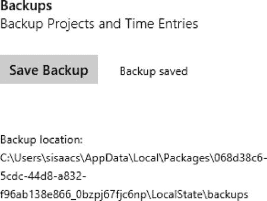
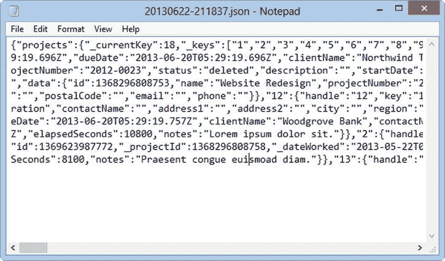
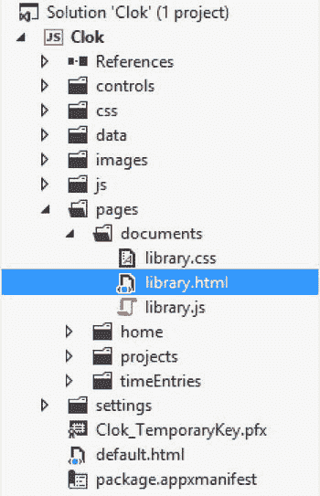
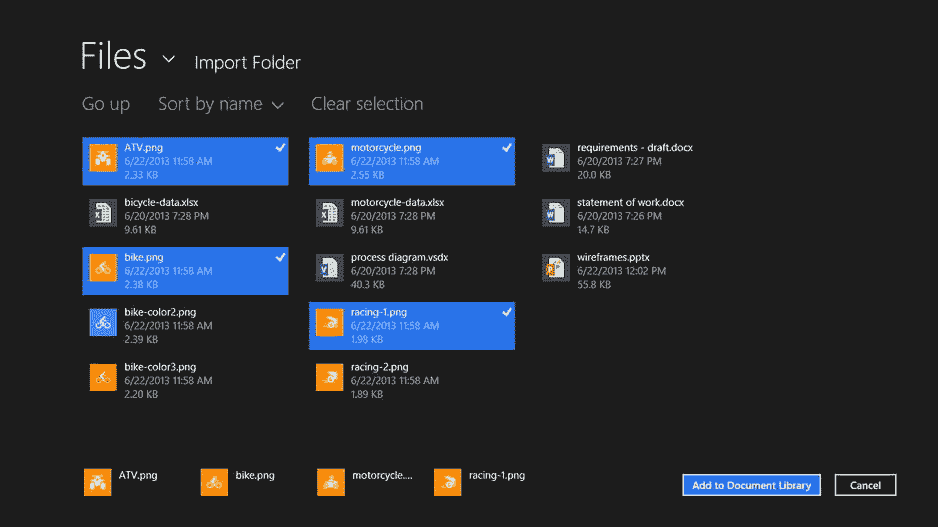
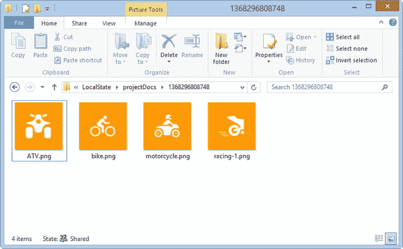

# 十六、文件

有了从 IndexedDB 到会话状态到本地设置等各种选项，在决定如何保存某些内容以备后用时，您有很多选择。在这一章中，我将介绍使用一种完全不同的数据类型:文件。

也许您正在构建的应用可以处理照片、电子表格、文档或任何其他类型的文件。虽然您可能会发现可以使用其他技术保存文件，例如在 IndexedDB 数据库中，但 Windows 8 应用可以在用户的文件系统中读取、写入和删除文件。计算机将文件存储在文件系统中已经有很长一段时间了，除非您有明确的要求，否则在考虑处理文件时，文件系统是最合理的起点。

窗户。存储命名空间

如果你要在 Windows Store 应用中处理文件和文件夹，你会花很多时间在`Windows.Storage`命名空间 中。这个名称空间包含创建、编辑、删除、读取或列出文件或文件夹所需的所有类。一些最常见的类是`StorageFile` 、`StorageFolder` 和`FileIO` 类，我将在本章中一一演示。

`StorageFile`和`StorageFolder`类代表用户计算机上的文件和文件夹。在任何需要处理文件或文件夹的时候，您都会用到这些类。每当用户在文件选择器或文件夹选择器中进行选择时，都会返回这些类型之一。这两个类都提供了许多有用的方法，例如，复制、创建、删除和打开文件和文件夹。虽然`StorageFile`类提供了在用户计算机上处理文件的方法，但是`FileIO`类提供了许多处理`StorageFile`对象的*内容*的方法。一旦你有了一个`StorageFile`对象，你可以使用`FileIO`类来读取文件的内容或者改变文件的内容。

 **注意**除了操作`StorageFile`对象的`FileIO`类之外，如果你有文件路径但没有`StorageFile`对象，你也可以使用`PathIO`类。两个类中存在相同的方法。

在 Windows 应用商店应用中处理文件和文件夹时，请记住一点。正如 WinRT 或 WinJS 库中任何潜在的高开销操作一样，`StorageFile`、`StorageFolder`和`FileIO`类中的所有方法都是异步的。它们都返回`Promise`对象来表示被请求的操作。

除了`StorageFile`、`StorageFolder`和`FileIO`类之外，`Windows.Storage`名称空间还提供了对存储应用数据的位置的访问点。该访问由第 15 章中用于设置和检索本地和漫游设置的同一个`ApplicationData`类提供。具体来说，您可以使用`Windows.Storage.ApplicationData.current`对象的`localFolder`属性来引用存储在您的应用范围内的文件。毫不奇怪，`localFolder`是`StorageFolder`类的一个实例。

 **注意** Windows Store 应用开发人员有两种方式来访问其应用的本地存储文件夹。如前所述，可以使用`Windows.Storage.ApplicationData.current.localFolder`。此外，在 WinJS 应用中，您可以使用 WinJS 的等效项`WinJS.Application.local.folder`。

在这一章中，我将介绍这些类的用法，展示我是如何在 Clok 中实现两个新特性的。首先是备份存储在 Clok 数据库中的项目和时间条目的能力。第二个是文档库，用户可以在其中存储与他们的项目相关的文件。

数据备份

在任何应用中，能够备份数据都是一个有用的功能。因此，这是我添加到 Clok 中的一个特性。Clok 用户将在 Clok 选项设置弹出菜单中访问此功能。从那里，他们将能够点击保存备份按钮，这将保存他们在 Clok 中保存的项目和时间条目数据的副本。

添加这个功能并不需要太多，代码也很短。虽然这段代码很短，但它将说明如何使用前一节中提到的一些常见的类。您将会看到我已经使用了`localFolder`属性来访问 Clok 的本地文件存储，还使用了来自`StorageFile`、`StorageFolder`和`FileIO`类的方法。在我向您介绍这段代码之前，您必须先对`options.html`做一个小小的改动。将清单 16-1 至`options.html`中的代码添加到调试部分的代码之后。

[***清单 16-1。***](#_list1) 向 Clok 选项设置弹出按钮添加控件

```js
<div class="win-settings-section">
    <h3>Backups</h3>
    <p>Backup Projects and Time Entries</p>
    <p>
        <button id="saveBackupButton">Save Backup</button>
        <span id="backupConfirmation"
            class="win-type-xx-small"
            style="display: none;">Backup saved</span>
    </p>
    <p class="win-type-xx-small">Backup location: <span id="backupPath"></span></p>
</div>
```

这段代码添加了一个按钮，用于启动备份过程，还添加了一个标签，用于向用户指示在哪里可以找到备份文件。您可以通过将[清单 16-2](#list2) 中的代码添加到`options.js`的`ready`函数中来配置这两个控件。

[***清单 16-2。***](#_list2) 配置备份控件

```js
saveBackupButton.onclick = this.saveBackupButton_click;
backupPath.innerText = appData.localFolder.path + "\\backups";
```

完成这个过程的最后一步是实现`saveBackupButton_click`处理函数。将[清单 16-3 中的代码](#list3)添加到`options.js`。

[***清单 16-3。***](#_list3) 编写备份文件

```js
saveBackupButton_click: function(e) {
    var dateFormatString = "{year.full}{month.integer(2)}{day.integer(2)}"
        + "-{hour.integer(2)}{minute.integer(2)}{second.integer(2)}";
    var clockIdentifiers = Windows.Globalization.ClockIdentifiers;

    var formatting = Windows.Globalization.DateTimeFormatting;
    var formatterTemplate = new formatting.DateTimeFormatter(dateFormatString);
    var formatter = new formatting.DateTimeFormatter(formatterTemplate.patterns[0],
                formatterTemplate.languages,
                formatterTemplate.geographicRegion,
                formatterTemplate.calendar,
                clockIdentifiers.twentyFourHour);

    var filename = formatter.format(new Date()) + ".json";

    var openIfExists = Windows.Storage.CreationCollisionOption.openIfExists;

    appData.localFolder
        .createFolderAsync("backups", openIfExists)
        .then(function (folder) {
            return folder.createFileAsync(filename, openIfExists);
        }).done(function (file) {

            var storage = Clok.Data.Storage;
            var backupData = {
                projects: storage.projects,
                timeEntries: storage.timeEntries
            };
            var contents = JSON.stringify(backupData);
            Windows.Storage.FileIO.writeTextAsync(file, contents);

            backupConfirmation.style.display = "inline";
        });
},
```

该函数的第一部分使用`DateTimeFormatter`类 根据当前日期为备份文件生成一个名称。因为`DateTimeFormatter`类中的一个限制阻止了指定 12 小时或 24 小时时钟的`Clock`属性在该类的实例创建后被设置，所以我首先创建了一个`formatterTemplate` 对象，使用所有的默认值。然后我基于`formatterTemplate`创建`formatter`对象，在构造函数中指定`Clock`。因为构造函数是唯一可以指定使用哪个`Clock`的地方，并且所有其他参数都是必需的，这允许`formatter`对象对所有其他构造函数参数使用系统默认值。

这个函数的核心是函数后半部分的`Promise`链。正如我上面提到的，`appData.localFolder`对象是`StorageFolder`的一个实例。对`createFolderAsync` 的调用将在应用的本地数据文件夹中创建一个`backups`文件夹，如果它还不存在的话。这个文件夹被传递给`then`函数，该函数通过`createFileAsync`调用创建一个`StorageFile`对象。这个文件被传递给`done`函数，该函数通过调用`JSON.stringify`将我们的应用数据序列化为一个字符串，并使用`writeTextAsync` 调用将其保存到文件中。最后一行只是向用户显示一条确认消息。

要了解这是如何工作的，请运行 Clok 并打开“Clok 选项设置”弹出按钮。点击保存备份按钮后(参见[图 16-1](#Fig1) ，使用 Windows 资源管理器导航到指定的备份位置查看文件(参见[图 16-2](#Fig2) )。



[图 16-1](#_Fig1) 。在“时钟选项设置”弹出菜单中保存的备份


[图 16-2](#_Fig2) 。备份文件

该文件包含 Clok 数据库中所有项目和时间条目的 JSON 表示。您可以在文本编辑器中打开该文件，如记事本(见[图 16-3](#Fig3) )，查看其内容。虽然这不是查看数据的最方便的格式，但是您应该能够看到所有的内容。



[图 16-3](#_Fig3) 。备份文件的内容

Clok 项目的文档库

我们最初的目标是为用户提供一种简单的方式来跟踪他们在项目上工作的时间。当我们在第 14 章中完成这个目标时，是时候创建一些新的需求，添加一些其他有用的相关功能了。在这一节中，我将向您展示如何开始构建一个文档库，用户可以在其中存储与他们正在处理的项目相关联的文档。最终，用户将能够导出和删除文件，但是我们将从允许他们向项目添加文档开始。

创建文档库页面控件

首先要做的是在 Visual Studio 项目的`pages`文件夹中创建一个名为`documents`的文件夹。在`documents`文件夹中，添加一个名为`library.html`的新页面控件(参见[图 16-4](#Fig4) )。



[图 16-4](#_Fig4) 。解决方案浏览器为文档提供了新的页面控件

我们将在本章的剩余部分构建文档库屏幕，您要做的第一个更改是更新屏幕的标题以反映正确的页面标题，以及当前选定项目的名称。用[清单 16-4](#list4) 中高亮显示的代码更新`library.html`。

[***清单 16-4。***](#_list4) 在文档库屏幕上显示当前项目的名称

```js
<div class="library fragment">
    <header aria-label="Header content" role="banner">
        <button class="win-backbutton" aria-label="Back" disabled type="button"></button>
        <h1 class="titlearea win-type-ellipsis">
            <span class="pagetitle">Document Library</span>
            <span class="win-type-x-large" id="projectName">[Project Name]</span>
        </h1>
    </header>
    <section aria-label="Main content" role="main">
        <p>Content goes here.</p>
    </section>
</div>
```

当然，`[Project Name]`只是一个占位符。您必须添加 JavaScript 代码来设置`projectName span`元素的正确值。在`library.js`顶部定义了现在熟悉的`storage`别名后，用清单 16-5 中[突出显示的代码更新文件。](#list5)

[***清单 16-5。***](#_list5) 设置项目名称

```js
ready: function (element, options) {
    this.projectId = options && options.projectId;
    this.setProjectName();
},

setProjectName: function () {
    if (this.projectId) {
        var project = storage.projects.getById(this.projectId);
        projectName.innerText = project.name + " (" + project.clientName + ")";
    }
},
```

目前，用户无法导航到文档库。用户应该能够从项目详细信息屏幕到达该屏幕。在`detail.html`和`detail.js`中进行所需的更改，向应用栏添加一个新按钮。按照您添加按钮以导航到时间表屏幕的方式，确保通过当前项目的`id`(回头参考[清单 12-32](12.html#list32) )并且仅在查看现有项目时启用该按钮。完成后，项目细节的应用栏应该类似于[图 16-5](#Fig5) 。


[图 16-5](#_Fig5) 。项目详细信息应用栏带有新建文档按钮

 **注意**通过将`AppBarButton`的`icon`属性 设置为`attach`可以显示回形针图标。本章描述的工作的完整版本可以在本书附带的源代码中找到。您可以在该书的 press product 页面的 Source Code/Downloads 选项卡上找到本章的代码示例(`www.apress.com/9781430257790`)。

立即运行 Clok 并导航到文档库屏幕。屏幕仍然是空的，但是项目和客户名称现在应该显示在标题中(见[图 16-6](#Fig6) )。将这些信息添加到屏幕上是一个很小的功能，但是像这样的事情将会使用户在使用应用时保持方向感。


[图 16-6](#_Fig6) 。项目名称为的文档库标题

向项目中添加文档

现在我们已经创建了文档库页面，下一个任务是允许用户向 Clok 中的项目添加文档。在 UI 中实现时，向应用栏添加一个添加命令是最自然的选择。将清单 16-6 中的代码添加到`body`元素之后。

[***清单 16-6。***](#_list6) 向文档库屏幕添加应用栏

```js
<div id="libraryAppBar"
    class="win-ui-dark"
    data-win-control="WinJS.UI.AppBar"
    data-win-options="{ sticky: true }">

    <button
        data-win-control="WinJS.UI.AppBarCommand"
        data-win-options="{
            id:'addDocumentsCommand',
            label:'Add',
            icon:'add',
            section:'global',
            tooltip:'Add'}">
    </button>
</div>
```

在这一节中，我将向您介绍`FileOpenPicker` ，它允许用户选择一个或多个要在您的应用中使用的文件。除了`FileOpenPicker`，`Windows.Storage.Pickers`名称空间还提供了`FileSavePicker`和`FolderPicker`类。我不会详细介绍`FileSavePicker`类，但是它允许用户在他们计算机上的指定位置用指定的名称保存文件。顾名思义,`FolderPicker`类允许用户选择一个文件夹，这将在本章后面介绍。MSDN ( `http://msdn.microsoft.com/en-us/library/windows/apps/windows.storage.pickers.aspx`)上有关于`Windows.Storage.Pickers`名称空间及其所有类的更多信息。

接下来，在`library.js`的`ready`函数中为`addDocumentsCommand`连接`click`事件处理程序。另外，将清单 16-7 中[突出显示的别名添加到`library.js`的顶部。](#list7)

[***清单 16-7。***](#_list7) 向 library.js 添加别名

```js
var storage = Clok.Data.Storage;
var appData = Windows.Storage.ApplicationData.current;
var createOption = Windows.Storage.CreationCollisionOption;
var pickerLocationId = Windows.Storage.Pickers.PickerLocationId;
```

本章和本书中使用的别名并不是必需的，但它们允许我们在使用它们时使用更短的语法，编写更少的代码，我相信这使它更容易阅读。我之前已经讨论过`Windows.Storage.ApplicationData`，在本章中我们将使用它来访问应用的本地文件夹。枚举用于指定当你的代码试图创建的文件或文件夹已经存在时，Windows 应该如何处理。选项包括让 Windows 生成一个新文件名、覆盖现有文件、使用现有文件或直接失败。`Windows.Storage.Pickers.PickerLocationId`枚举用于指定向用户显示的文件或文件夹选择器的首选位置。它包括许多公共位置，如用户的桌面文件夹或图片库。在清单 16-8 中，你可以看到这些别名是如何使用的。将下面的代码添加到`library.js`中。

[***清单 16-8。***](#_list8) 向库中添加文档

```js
getProjectFolder: function() {
    if (this.projectId) {
        var projectId = this.projectId;

        return appData.localFolder
            .createFolderAsync("projectDocs", createOption.openIfExists)
            .then(function (folder) {
                return folder.createFolderAsync(projectId.toString(), createOption.openIfExists)
            });
    } else {
        return WinJS.Promise.as();
    }
},

canOpenPicker: function () {
    var views = Windows.UI.ViewManagement;

    var currentState = views.ApplicationView.value;
    if (currentState === views.ApplicationViewState.snapped &&
            !views.ApplicationView.tryUnsnap()) {

        return false;
    }
    return true;
},

addDocumentsCommand_click: function (e) {
    if (!this.canOpenPicker()) {
        return;
    }

    var filePicker = new Windows.Storage.Pickers.FileOpenPicker();
    filePicker.commitButtonText = "Add to Document Library";
    filePicker.suggestedStartLocation = pickerLocationId.desktop;
    filePicker.fileTypeFilter.replaceAll(["*"]);

    filePicker.pickMultipleFilesAsync().then(function (files) {
        if (files && files.size > 0) {

            this.getProjectFolder().then(function (projectFolder) {
                var copyPromises = files.map(function (item) {
                    return item.copyAsync(
                        projectFolder,
                        item.name,
                        createOption.replaceExisting);
                });

                return WinJS.Promise.join(copyPromises);
            });
        } else {
            return WinJS.Promise.as();
        }
    }.bind(this));
},
```

我在这里定义了三个函数。第一个是`getProjectFolder` ，返回一个`Promise`，代表用于存储当前所选项目文档的文件夹。文档将存储在一个名为与当前项目的`id`相匹配的文件夹中。该文件夹将位于名为`projectDocs`的本地数据文件夹中。当你的应用被抓拍时，如果你试图显示一个`FileOpenPicker` ，或者上面提到的任何一个选择器，就会抛出一个异常。第二个函数`canOpenPicker` ，检查应用的当前视图状态，是截图还是全屏。如果应用被抓拍，那么对`tryUnsnap`的调用将尝试取消它的抓拍。

第三个函数是`addDocumentsCommand_click` 处理函数。如果对`canOpenPicker`的调用成功，那么文件选择器在显示给用户之前被初始化。我已经将`commitButtonText`设置为合适的值，而不是默认值“打开”我建议选取器在用户的桌面上启动，但是如果用户最近选择了另一个位置，则不强制执行该设置。最后，我指定应该显示所有文件类型。当显示选取器时，如果用户选择一个或多个文件，则使用从`FileOpenPicker`返回的每个`StorageFile`对象的`copyAsync`函数复制所选择的文件。

现在，运行 Clok 并导航到项目的文档库。激活应用栏(用鼠标右键单击或从触摸屏底部边缘滑动)，然后单击添加按钮。在[图 16-7](#Fig7) 中，我从桌面上名为`Import Folder`的文件夹中选择了四个文件。当您单击“添加到文档库”按钮时，选定的文件将被添加到项目的文档库中。



[图 16-7](#_Fig7) 。选择了四个文件的 FileOpenPicker

 **注意**除了指定他们计算机上的文件夹，通过展开“文件”下的菜单，用户还可以指定实现文件选取器契约的其他应用。例如，他们可以从他们的 SkyDrive 帐户中选择文件，甚至直接从他们计算机上的相机中导入图片。

探索项目文件

此时，您可以运行 Clok 并向项目中添加任意数量的文件。虽然目前还没有办法在 Clok 中查看它们，但是你可以在 Windows 资源管理器中查看它们。在图 16-8 中，你可以看到我给一个项目添加了四个图标。



[图 16-8](#_Fig8) 。将文件添加到项目中

我电脑上 Clok 的本地数据文件夹的路径是

```js

C:\Users\sisaacs\AppData\Local\Packages\068d38c6-5cdc-44d8-a832-f96ab138e866_0bzpj67fjc6np\LocalState
```

该路径在您的计算机上会有所不同，但它会在`%USERPROFILE%\AppData\Local\Packages`内的某个文件夹中。您很可能在`Packages`文件夹中有许多文件夹，并且您的应用的数据将在其中的一个中。有几种方法可以找到你的应用的本地数据文件夹:通过反复试验，通过检查`appData.localFolder.path`的值，或者通过匹配你的 Visual Studio 项目中`package.appxmanifest`文件的打包选项卡上的“包名”字段(参见[图 16-9](#Fig9) )。


[图 16-9](#_Fig9) 。package.appxmanifest 中的包名是本地数据文件夹路径的一部分

作为开发人员，我们有工具来帮助我们轻松地找到这个路径并在 Windows 资源管理器中查看文件。当然，对于在 Visual Studio 中没有检查变量或`package.appxmanifest`文件的优势的用户来说，这是不一样的。因此，让我们进行构建文档库的下一步:添加查看已添加文件的功能。

配置列表视图

如图[图 16-7](#Fig7) 所示的文件拾取器使用一个`ListView`来选择文件。为了与默认的 Windows 行为保持一致，我们还将使用一个`ListView`来向用户显示文档库中的文件。用清单 16-9 中[的代码替换`library.html`中的主`section`。](#list9)

[***清单 16-9。***](#_list9) 添加用于显示文件的 ListView】

```js
<section aria-label="Main content" role="main">
    <div id="libraryTemplate" data-win-control="WinJS.Binding.Template" style="display: none">
        <div class="libraryItem" data-win-bind="item: item Clok.Library.bindLibraryItem">
            <div class="libraryItem-icon-container">
                
            </div>
            <div class="libraryItem-details">
                <h3 class="libraryItem-filename win-type-ellipsis"></h3>
                <h6 class="libraryItem-modified-container win-type-ellipsis">
                    <strong>Modified:</strong> <span class="libraryItem-modified"></span>
                </h6>
                <h6 class="libraryItem-size-container win-type-ellipsis">
                    <strong>Size:</strong> <span class="libraryItem-size"></span>
                </h6>
            </div>
        </div>
    </div>

    <div id="libraryListView"
        class="win-selectionstylefilled"
        data-win-control="WinJS.UI.ListView"
        data-win-options="{
            itemTemplate: select('#libraryTemplate'),
            selectionMode: 'multi',
            swipeBehavior: 'select',
            tapBehavior: 'directSelect'
        }">
    </div>
    <div id="noDocuments" class="hidden">No documents found for this project.</div>
</section>
```

`libraryListView` 允许用户选择多个文件，每个文件根据`libraryTemplate` 定义的`Template`显示。对于每个文件，`ListView`将显示一个文件图标、文件名、文件类型和文件上次修改的日期。你可能已经注意到这个`Template`与之前的`ListView`例子有所不同。这次我没有单独绑定每个值，而是在顶层指定了绑定，并且指定了一个绑定初始化器`Clok.Library.bindLibraryItem`。这将允许我们在 JavaScript 代码中实现更复杂的绑定，我将在下一节更详细地展示这一点。

CSS 现在应该很熟悉了，因为它非常类似于项目、方向和时间表屏幕中使用的内容。将清单 16-10 中[的 CSS 代码添加到`library.css`。](#list10)

[***清单 16-10。***](#_list10) CSS 为文档库

```js
.hidden {
    display: none;
}

#libraryListView {
    height: calc(100% - 88px);
}

    #libraryListView .win-container {
        background-color: #46468C;
    }

    #libraryListView .libraryItem {
        display: -ms-grid;
        -ms-grid-columns: 80px 350px;
        height: 80px;
    }

    #libraryListView .libraryItem-icon {
        -ms-grid-column: 1;
        margin: 8px;
        width: 64px;
        height: 64px;
        text-align: center;
    }

    #libraryListView .libraryItem-details {
        -ms-grid-column: 2;
        margin: 5px;
    }

    #libraryListView .libraryItem-filename {
        font-size: 1.25em;
    }
```

在我们之前所有的`ListView`例子中，我们已经将`ListView`绑定到了一个`WinJS.Binding.List`对象。我们可以使用`StorageFile`和`StorageFolder`类上的函数来构建我们自己的`List`，但是有一种更好的方式在`ListView`中显示文件系统信息。

配置存储数据源

一个`ListView`可以绑定到任何实现`IListDataSource`接口的类。虽然我们可以用关于文件和文件夹的信息填充一个`WinJS.Binding.List`对象，但是`StorageDataSource`已经存在了。因为它实现了`IListDataSource`，我们可以直接绑定到它。除了比其他选择更简单之外，使用`StorageDataSource`还提供了文件和文件夹的“实时视图”的额外好处。因此，如果您添加了一个新文件，或者删除了一个现有的文件，数据源将立即反映这一点并更新`ListView`。

在这一节中，我将演示如何创建一个简单的`StorageDataSource`对象来反映项目文档库的内容。我将把这些数据绑定到上一节中创建的`ListView`，然后在下一节中，我将向您展示如何允许您的用户直接从 Clok 打开文件。

创建一个绑定到我们的`ListView`的对象只需要几行代码。将[清单 16-11](#list11) 中的代码添加到`library.js`中。

[***清单 16-11。***](#_list11) 创建存储数据源对象

```js
bindProjectLibraryFiles: function () {
    if (this.projectId) {
        var resizeThumbnail = thumbnailOptions.resizeThumbnail;
        var singleItem = thumbnailMode.singleItem;

        this.getProjectFolder().then(function (folder) {
                var fileQuery = folder.createFileQuery();

                var dataSourceOptions = {
                    mode: singleItem,
                    requestedThumbnailSize: 64,
                    thumbnailOptions: resizeThumbnail
                };

                var dataSource = new WinJS.UI.StorageDataSource(fileQuery, dataSourceOptions);

                dataSource.getCount().then(function (count) {
                    if (count >= 1) {
                        libraryListView.winControl.itemDataSource = dataSource;
                        WinJS.Utilities.addClass(noDocuments, "hidden");
                        WinJS.Utilities.removeClass(libraryListView, "hidden");
                    } else {
                        WinJS.Utilities.removeClass(noDocuments, "hidden");
                        WinJS.Utilities.addClass(libraryListView, "hidden");
                    }
                });
            });
    }
},
```

`StorageDataSource`构造函数接受一个查询对象和一个选项对象。查询参数可以是用户计算机上常见 Windows 库列表中的字符串(“音乐”、“图片”、“视频”或“文档”)，也可以是实现`IStorageQueryResultBase`的对象。例如，如果你专门处理用户的图片或音乐库，那么只需将其中一个字符串作为第一个参数传递给`StorageDataSource`构造函数就非常简单了。如果您正在使用用户计算机上的另一个位置，则必须创建一个查询对象。

在[清单 16-11](#list11) 中，因为我已经引用了一个`StorageFolder` 对象——当前项目的文档库——我可以调用`createFileQuery`函数来获得一个有效的查询对象。`StorageDataSource`构造函数的第二个参数定义了一些附加选项，主要与查询结果中包含的缩略图信息相关。关于`StorageDataSource`类和这两个构造函数参数的更多信息可以在 MSDN 网站(`http://msdn.microsoft.com/en-us/library/windows/apps/br212651.aspx`)上找到。

 **注意**`createFileQuery`函数构建了一个查询，允许您处理`StorageFolder`对象顶层的所有文件。除了`createFileQuery`之外，`StorageFolder`类还定义了其他五个返回不同类型的文件或文件夹查询的函数，以及两个可以用来同时查询文件和文件夹的函数。有关这些其他`StorageFolder`功能的更多信息，请访问 MSDN 网站(`http://msdn.microsoft.com/en-us/library/windows/apps/windows.storage.storagefolder.aspx`)。

创建数据源后，我调用了`getCount`函数，检查当前项目的文档库中是否有文件。如果有，那么我将`ListView`的`itemDataSource`属性设置到这个数据源，并使结果可见。如果不存在文件，我会向用户显示一条消息。

我在上一节中指出了我如何只将数据绑定到用于格式化文件信息的`WinJS.Binding.Template`的顶层。我没有单独绑定每个元素，而是选择使用名为`bindLibraryItem`的绑定初始化函数来处理一些更复杂的绑定需求。将清单 16-12 中[突出显示的代码添加到`library.js`中的页面定义之后。](#list12)

[***清单 16-12。***](#_list12) 绑定初始化函数

```js
(function () {
    "use strict";

    // SNIPPED

    WinJS.UI.Pages.define("/pages/documents/library.html", {
        // SNIPPED
    });

    function bindLibraryItem(source, sourceProperty, destination, destinationProperty) {
        var filenameElement = destination.querySelector(".libraryItem-filename");
        var modifiedElement = destination.querySelector(".libraryItem-modified");
        var sizeElement = destination.querySelector(".libraryItem-size");
        var iconElement = destination.querySelector(".libraryItem-icon");

        filenameElement.innerText = source.name;

        modifiedElement.innerText = source.basicProperties
            && source.basicProperties.dateModified
            && formatDateTime(source.basicProperties.dateModified);

        var size = source.basicProperties &&**source.basicProperties.size;**
        **if (size > (Math.pow(1024, 3))) {**
            **sizeElement.innerText = (size / Math.pow(1024, 3)).toFixed(1) + " GB";**
        **}**
        **else if (size > (Math.pow(1024, 2))) {**
            **sizeElement.innerText = (size / Math.pow(1024, 2)).toFixed(1) + " MB";**
        **}**
        **else if (size > 1024) {**
            **sizeElement.innerText = (size / 1024).toFixed(1) + " KB";**
        **}**
        **else {**
            **sizeElement.innerText = size + " B";**
        **}**

        **var url;**

        **if (source.thumbnail &&** **isImageType(source.fileType)) {**
            **url = URL.createObjectURL(source.thumbnail, { oneTimeOnly: true });**
        **} else {**
            **url = getIcon(source.fileType);**
        **}**

        **iconElement.src = url;**
        **iconElement.title = source.displayType;**
    **}**

    **WinJS.Utilities.markSupportedForProcessing(bindLibraryItem);**

    **WinJS.Namespace.define("Clok.Library", {**
        **bindLibraryItem: bindLibraryItem,**
    **});**

`})();`
```

 `当 WinJS 为`ListView`中的每一项调用我们的绑定初始化器时，它将数据源对象——文件——作为参数`source`传递给这个函数，并将 HTML 元素作为参数`destination`。可以为每个数据绑定值指定不同的初始化器，如果是这样的话，我们也可以利用`sourceProperty`和`destinationProperty` 参数。然而，在这种情况下，我忽略了这些。相反，我使用查询选择器来查找应该向用户显示数据绑定信息的元素，并根据我的自定义逻辑设置这些元素的`innerText`属性。例如，根据文件的大小，文件大小可以显示为千兆字节、兆字节、千字节或简单的字节。

文件图标略有不同。`StorageDataSource`提供了将在 Windows 资源管理器中使用的图标，我可以选择在`ListView`中显示这些图标。相反，只有当库中的文件是图像时，我才显示提供的图标。这将导致图像的缩略图版本显示在列表视图中。在所有其他情况下，我更喜欢显示与 Clok 的现代风格相匹配的自定义文件类型图标，并且我使用`getIcon`函数来确定该图标应该是什么，稍后我会介绍这个函数。

 **注意**我用于文件类型图标的图片可以在本书附带的源代码中找到。你可以在本书的 press 产品页面(`www.apress.com/9781430257790`)的 Source Code/Downloads 选项卡上找到本章的代码示例。

在定义了绑定初始化器之后，我通过调用`markSupportedForProcessing` 并将其公开为`Clok.Library.bindLibraryItem`，使得它可以从`library.html`开始使用。此外，还需要一些其他函数来使这个绑定初始化器工作。在`library.js`中的`bindLibraryItem`定义后添加清单 16-13 中的[代码。](#list13)

[***清单 16-13。***](#_list13) 函数支持绑定初始化器

```js
function formatDateTime(dt) {
    var formatting = Windows.Globalization.DateTimeFormatting;
    var dateFormatter = new formatting.DateTimeFormatter("shortdate");
    var timeFormatter = new formatting.DateTimeFormatter("shorttime");
    return dateFormatter.format(dt) + " " + timeFormatter.format(dt);
}

function isImageType(fileType) {
    fileType = (fileType || "").toLocaleUpperCase();

    return fileType === ".PNG"
        || fileType === ".GIF"
        || fileType === ".JPG"
        || fileType === ".JPEG"
        || fileType === ".BMP";
}

function getIcon(fileType) {
    fileType = (fileType || "").replace(".", "");

    var knownTypes = ["WAV", "XLS", "XLSX", "ZIP",
        "AI", "BMP", "DOC", "DOCX", "EPS", "GIF",
        "ICO", "JPEG", "JPG", "MP3", "PDF", "PNG",
        "PPT", "PPTX", "PSD", "TIFF", "VSD", "VSDX"];

    if (knownTypes.indexOf(fileType.toLocaleUpperCase()) >= 0) {
        return "/img/fileTypes/" + fileType + ".png";
    }

    return "/img/fileTypes/default.png";
}
```

雄心勃勃的开发人员可能会用一个动态检查`img/fileTypes`文件夹内容的定义来替换`getIcon`的定义，以确定哪些图标可用。因为这些图标包含在用户下载 Clok 时安装的包中，所以在本地数据文件夹中找不到这些图标。相反，你应该在`Windows.ApplicationModel.Package.current.installedLocation`中寻找这些文件，它也是一个`StorageFolder`对象。

要显示当前项目文档库中的文件，还需要两个简单的步骤。您必须在`library.js`的顶部添加两个别名(参见清单 16-14 中的[，并在`ready`函数中添加对`this.bindProjectLibraryFiles`的调用。](#list14)

[***清单 16-14。***](#_list14) 再加两个别名

```js
var storage = Clok.Data.Storage;
var appData = Windows.Storage.ApplicationData.current;
var createOption = Windows.Storage.CreationCollisionOption;
var pickerLocationId = Windows.Storage.Pickers.PickerLocationId;
var thumbnailOptions = Windows.Storage.FileProperties.ThumbnailOptions;
var thumbnailMode = Windows.Storage.FileProperties.ThumbnailMode;
```

立即运行 Clok 并导航到文档库。您将看到您之前添加的文件，如果您现在添加更多文件，`StorageDataSource` 将自动用新文件更新`ListView`(参见[图 16-10](#Fig10) )。


[图 16-10](#_Fig10) 。文档库中有各种图片和文档

正在启动文件

现在文件显示在文档库中，一个有用的特性是允许用户直接从 Clok 打开文档。在这一节中，我将演示如何添加一个新的应用栏按钮。将[清单 16-15](#list15) 中的代码添加到`library.html`中的`AppBar`定义中。

[***清单 16-15。***](#_list15) 向应用栏添加打开按钮

```js
<button
    data-win-control="WinJS.UI.AppBarCommand"
    data-win-options="{
        id:'openDocumentCommand',
        label:'Open',
        icon:'openfile',
        section:'selection',
        tooltip:'Open',
        disabled: true}">
</button>
```

为了防止一次意外启动多个文件，我添加了一次只能打开一个文件的要求。为了加强这一点，我处理了`ListView`的`onselectionchanged`事件，并且只有在`ListView`中选择了一个项目时，打开按钮才被激活。将[清单 16-16](#list16) 中的代码添加到`library.js`中以实现这一点。

[***清单 16-16。***](#_list16) 根据列表视图中选择的项目数量，启用或禁用打开按钮

```js
libraryListView_selectionChanged: function (e) {
    // Get the number of currently selected items
    var selectionCount = libraryListView.winControl.selection.count();

    if (selectionCount <= 0) {
        openDocumentCommand.winControl.disabled = true;
        libraryAppBar.winControl.hide();
    } else if (selectionCount > 1) {
        openDocumentCommand.winControl.disabled = true;
        libraryAppBar.winControl.show();
    } else { // if (selectionCount === 1) {
        openDocumentCommand.winControl.disabled = false;
        libraryAppBar.winControl.show();
    }
},
```

当用户点击这个按钮时，调用`Windows.System.Launcher.launchFileAsync`将在默认的文件查看器中打开文件。将[清单 16-17](#list17) 中的`click`事件处理程序添加到`library.js`中。

[***清单 16-17。***](#_list17) 打开按钮的 Click 事件处理程序

```js
openDocumentCommand_click: function (e) {
    libraryListView.winControl.selection.getItems()
        .then(function (selectedItems) {
            if (selectedItems && selectedItems[0] && selectedItems[0].data) {
                return Windows.System.Launcher.launchFileAsync(selectedItems[0].data);
            }
        })
        .then(null, function error(result) {
            new Windows.UI.Popups
                .MessageDialog("Could not open file.", "An error occurred. ")
                .showAsync();
        });
},
```

代码将只打开第一个被选择的文件，但是因为你在[清单 16-16](#list16) 中添加了代码，无论如何不应该有多于一个的项目被选择。如果文件可以打开，则启动该文件类型的默认应用；否则，将显示一条错误消息。一个重载版本的`launchFileAsync` 允许你在启动时指定额外的选项。例如，您还可以添加一个带有。。。应用栏按钮，并指定应该让用户选择为所选文件启动的应用。这对于图像尤其有用，因为默认应用可能是不允许用户编辑图像的应用。通过允许用户指定他们希望启动的应用，他们可以选择编辑文件。因为代码几乎与我刚刚介绍的相同，所以我不会在本书中演示，但是我已经在本书附带的源代码中实现了这个功能。(见该书的 Apress 产品页的源代码/下载标签[ `www.apress.com/9781430257790` ]。)

允许用户在默认应用中启动文档的最后一步是在`ready`函数中连接事件处理程序。将[清单 16-18 中突出显示的代码](#list18)添加到`library.js`。

[***清单 16-18。***](#_list18) 连接起新的事件处理器

```js
ready: function (element, options) {
    this.projectId = options && options.projectId;

    this.setProjectName();
    this.bindProjectLibraryFiles();

    libraryListView.winControl.onselectionchanged =
        this.libraryListView_selectionChanged.bind(this);

    openDocumentCommand.winControl.onclick = this.openDocumentCommand_click.bind(this);
    addDocumentsCommand.winControl.onclick = this.addDocumentsCommand_click.bind(this);
},
```

立即运行 Clok 并导航到文档库。当您选择一个文件时，您将能够使用该文件类型的默认应用打开它(参见[图 16-11](#Fig11) )。


[图 16-11](#_Fig11) 。单击打开按钮将使用 Microsoft ExcelT3 启动所选电子表格

管理项目文件

我们的文档库正在整合，已经成为 Clok 的一个有用的补充。在我结束这一章之前，我想再增加两个特性。为了说明从 Clok 的本地数据文件夹中复制文件，我将实现一个导出特性，为了说明如何从`StorageFolder`中删除文件，我将添加一个删除特性。

 **注意**那些认为自己是超级用户的用户会很高兴地发现，他们在 Windows 资源管理器中使用的键盘快捷键也适用于`ListView`控件中的项目。如果一个`ListView`当前处于焦点上，您可以使用 Ctrl+A 选择一个`ListView`中的所有项目，使用 ESC 键取消选择所有项目，使用箭头键浏览`ListView`中的项目。此外，您可以按住 Shift 键或 Ctrl 键单击`ListView`中的项目来选择多个项目。

使用文件夹选择器导出文件

允许用户向 Clok 添加任意多的文档，但不提供任何获取文档的方法，这有多大用处？在本节中，我将向您展示如何向文档库添加导出功能。首先，让我们在应用栏中添加一个新按钮。将清单 16-19 中[的代码添加到`library.html`中。](#list19)

[***清单 16-19。***](#_list19) 向应用栏添加导出按钮

```js
<button
    data-win-control="WinJS.UI.AppBarCommand"
    data-win-options="{
        id:'exportDocumentsCommand',
        label:'Export',
        icon:'savelocal',
        section:'selection',
        tooltip:'Export',
        disabled: true}">
</button>
```

毫不奇怪，从文档库中导出文件类似于向其中添加文件。`StorageFile`对象的`copyAsync`方法执行实际的文件复制操作。最大的区别在于，不是用`FileOpenPicker`挑选文件添加到文档库中，也不是用`getProjectFolder`函数确定`StorageFolder`，而是从`ListView`对象`selection`属性中获取对一组`StorageFile`对象的引用，并允许用户用`FolderPicker`指定一个`StorageFolder`。一旦你有了一个`StorageFolder`和`StorageFile`对象的集合，基本过程是一样的。将清单 16-20 中的代码添加到`library.js`中。

[***清单 16-20。***](#_list20) 导出按钮的点击处理程序

```js
exportDocumentsCommand_click: function (e) {
    if (!this.canOpenPicker()) {
        return;
    }

    var folderPicker = new Windows.Storage.Pickers.FolderPicker;
    folderPicker.suggestedStartLocation = pickerLocationId.desktop;
    folderPicker.fileTypeFilter.replaceAll(["*"]);

    folderPicker.pickSingleFolderAsync().then(function (folder) {
        if (folder) {
            return libraryListView.winControl.selection.getItems()
                .then(function (selectedItems) {
                    var copyPromises = selectedItems.map(function (item) {
                        return item.data.copyAsync(
                            folder,
                            item.data.name,
                            createOption.generateUniqueName);
                    });

                    return WinJS.Promise.join(copyPromises);
                });
        } else {
            return WinJS.Promise.as();
        }
    }).then(function error(result) {
        new Windows.UI.Popups
            .MessageDialog("All files successfully exported.", "File export is complete.")
            .showAsync();
    }, function error(result) {
        new Windows.UI.Popups
            .MessageDialog("Could not export all selected files.", "An error occurred. ")
            .showAsync();
    });
},
```

 **注意**记住在`ready`函数中绑定这个`click`事件处理程序，并修改`libraryListView_selectionChanged`，当列表中的一个或多个文档被选中时，激活导出按钮。

虽然过程与添加文档相同，但我在这里做了一处更改。如果存在命名冲突，`copyAsync`函数将为复制的文件生成一个新名称，而不是替换已经存在的文件。您可以自己实现的一个有用的功能是允许用户指定他或她是否想要替换现有文件，保留文件的两个副本，或者取消导出操作。

当您添加代码以在`ListView`中选择一个或多个项目时启用导出按钮，并在`library.js`的`ready`函数中绑定此`click`事件处理程序后，文档导出功能就完成了。但是，在测试之前，让我们继续添加删除功能。

从本地应用文件夹中删除文件

“呜呜！我不是故意加那个文件的。”"这个模型已经过时了。""我的硬盘快满了。"

用户希望从文档库中删除文件的原因有很多，这些只是其中的几个。幸运的是，删除文件就像导出文件一样简单。首先，让我们在应用栏中添加一个新按钮。将清单 16-21 中的代码添加到`library.html`中。

[***清单 16-21。***](#_list21) 向应用栏添加删除按钮

```js
<button
    data-win-control="WinJS.UI.AppBarCommand"
    data-win-options="{
        id:'deleteDocumentsCommand',
        label:'Delete',
        icon:'delete',
        section:'selection',
        tooltip:'Delete',
        disabled: true}">
</button>
```

在删除一个文件之前，这是一个永久的操作，您将提示用户确定他或她想要点击删除按钮。将清单 16-22 中[的代码添加到`library.js`中。](#list22)

[***清单 16-22。***](#_list22) 删除按钮的点击处理程序

```js
deleteDocumentsCommand_click: function (e) {
    var msg = new Windows.UI.Popups.MessageDialog(
        "This cannot be undone.  Do you wish to continue?",
        "You're about to permanently delete files.");

    var buttonText = (libraryListView.winControl.selection.count() <= 1)
        ? "Yes, Delete It"
        : "Yes, Delete Them";

    msg.commands.append(new Windows.UI.Popups.UICommand(buttonText, function (command) {
        libraryListView.winControl.selection.getItems()
            .then(function (selectedItems) {
                var deletePromises = selectedItems.map(function (item) {
                    return item.data.deleteAsync();
                });

                return WinJS.Promise.join(deletePromises);
            })
            .then(null, function error(result) {
                new Windows.UI.Popups
                    .MessageDialog("Could not delete selected files.", "An error occurred.")
                    .showAsync();
            });
    }));

    msg.commands.append(new Windows.UI.Popups.UICommand(
        "No, Don't Delete Anything",
        function (command) { }
    ));

    msg.defaultCommandIndex = 0;
    msg.cancelCommandIndex = 1;

    msg.showAsync();
},
```

如果用户确认他或她确实希望继续，只需为选择中的每个`StorageFile`调用`deleteAsync`即可。在`ListView`中选择一个或多个项目时，不要忘记启用删除按钮，并且一定要在`library.js`的`ready`功能中绑定这个`click`事件处理程序。

现在是时候看看你的工作成果了。现在，您已经有了一个功能完整的文档库。立即运行 Clok 并导航至文档库(参见[图 16-12](#Fig12) )。浏览所有的函数，看看它们是如何工作的。添加一些文件，打开它们，导出它们，然后删除它们。你应该会发现这种体验非常自然，任何使用过 Windows 8 一段时间的人都应该很熟悉。


[图 16-12](#_Fig12) 。已建成的文档库

结论

处理文件是不可避免的。虽然`StorageFile`和`StorageFolder`函数的异步特性改变了您与文件和文件夹交互的方式，但是如果您已经用其他编程语言进行过任何涉及用户计算机文件系统的开发，这些差异就很容易理解了。在`Windows.Storage`名称空间中有许多高级功能。如果您发现这一介绍性章节不能满足您的所有需求，请务必在线阅读 MSDN 文档(`http://msdn.microsoft.com/en-us/library/windows/apps/windows.storage.aspx`)。

当我介绍共享契约时，我们将在第 19 章中再次访问文档库，当我讨论如何使用用户的相机时，我们将在第 22 章中再次访问[。](22.html)`