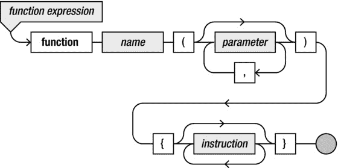

# 二、游戏编程基础

本章涵盖了游戏编程的基本要素，并为后面的章节提供了一个起点。首先，你学习任何游戏的基本框架，包括一个*游戏世界*和一个*游戏循环*。通过查看各种示例，比如一个改变背景颜色的简单应用，您将看到如何在 JavaScript 中创建这个框架。最后，我将讨论如何通过在适当的地方使用注释、布局和空白来澄清你的代码。

游戏的积木

这一节讲的是游戏的构建模块。我从总体上讨论游戏世界，然后向您展示使用更新-绘制循环来改变游戏世界的过程，该循环不断更新游戏世界，然后在屏幕上绘制游戏世界。

游戏世界

让游戏成为如此好的娱乐形式的原因是，你可以探索一个想象的世界，在那里做你在现实生活中永远不会做的事情。你可以骑在龙的背上，摧毁整个太阳系，或者创造一个由用想象语言说话的角色组成的复杂文明。你在其中玩游戏的这个虚拟世界被称为*游戏世界*。游戏世界可以是非常简单的领域，如俄罗斯方块世界，也可以是复杂的虚拟世界，如侠盗猎车手和魔兽世界。

当游戏在电脑或智能手机上运行时，该设备会维护游戏世界的内部表示。这种表现和你玩游戏时在屏幕上看到的一点也不像。它主要由描述物体位置的数字组成，敌人可以从玩家那里获得多少生命值，玩家的库存中有多少物品，等等。幸运的是，该程序还知道如何创建一个视觉上令人愉悦的世界表示，并显示在屏幕上。否则，玩电脑游戏可能会令人难以置信地无聊，玩家必须筛选一页页的数字，以找出他们是救了公主还是死于可怕的死亡。玩家永远看不到游戏世界的内部表示，但游戏开发者看到了。当你想开发一款游戏的时候，你还需要设计如何在内部表现你的游戏世界。编写你自己的游戏的部分乐趣在于你可以完全控制它。

另一个需要意识到的重要事情是，就像现实世界一样，游戏世界也在不断变化。怪物移动到不同的地点，天气变化，汽车没油，敌人被杀，等等。此外，玩家实际上影响着游戏世界的变化！因此，仅仅在电脑内存中存储游戏世界的图像是不够的。一个游戏还需要不断地记录玩家在做什么，因此，*更新*这个表示。此外，游戏需要*通过在电脑显示器、电视或智能手机屏幕上显示游戏世界来为玩家展示*。处理这一切的过程被称为*游戏循环*。

游戏循环

游戏循环处理游戏的动态方面。游戏运行时会发生很多事情。玩家按下游戏手柄上的按钮或触摸他们设备的屏幕，由关卡、怪物和其他角色组成的不断变化的游戏世界需要保持最新。还有爆炸、声音等等特效。所有这些需要游戏循环处理的不同任务都可以组织成两类:

*   与更新和维护游戏世界相关的任务
*   与向玩家显示游戏世界相关的任务

游戏循环连续执行这些任务，一个接一个(见[图 2-1](#Fig1) )。作为一个例子，让我们看看如何在像吃豆人这样的简单游戏中处理用户导航。游戏世界主要由一个迷宫组成，里面有几个讨厌的鬼魂在四处游荡。Pac-Man 位于这个迷宫的某个地方，正朝着某个方向前进。在第一个任务(更新和维护游戏世界)中，你检查玩家是否按下了箭头键。如果是这样，你需要根据玩家希望吃豆人走的方向来更新吃豆人的位置。还有，因为那个动作，吃豆人可能吃了一个白点，增加了分数。你需要检查它是否是关卡中的最后一个点，因为这意味着玩家已经完成了关卡。最后，如果它是一个较大的白点，鬼需要被渲染成不活动的。然后你需要更新游戏世界的其他部分。幽灵的位置需要更新，您必须决定是否应该在某个地方展示水果以获得奖励积分，您需要检查 Pac-Man 是否与其中一个幽灵发生碰撞(如果幽灵不是不活动的)，等等。你可以看到，即使在像吃豆人这样的简单游戏中，在第一个任务中也需要做很多工作。从现在开始，我将把这个与更新和维护游戏世界相关的不同任务的集合称为`Update`动作。


[图 2-1](#_Fig1) 。游戏循环，不断更新然后绘制游戏世界

第二组任务与向玩家显示游戏世界有关。在吃豆人游戏的情况下，这意味着绘制迷宫、鬼魂、吃豆人和对玩家来说很重要的游戏信息，例如他们已经获得了多少分，他们还剩下多少条命，等等。这些信息可以显示在游戏屏幕的不同区域，例如顶部或底部。这部分显示器也叫*平视显示器* (HUD)。现代 3D 游戏的绘图任务要复杂得多。这些游戏需要处理光照和阴影、反射、剔除、爆炸等视觉效果，等等。我将游戏循环中处理与向玩家显示游戏世界相关的所有任务的部分称为`Draw`动作。

用 JavaScript 构建游戏应用

前一章展示了如何创建简单的 JavaScript 应用。在那个 JavaScript 应用中，您看到指令被分组到一个函数中，如下:

```js
function changeBackgroundColor () {
    document.body.style.background = "blue";
}

```

这种分组的想法与 JavaScript 是一种过程化语言的想法是一致的:指令被分组到过程/函数中。第一步是用 JavaScript 建立一个简单的游戏循环。看看下面的例子:

```js
var canvas = undefined;
var canvasContext = undefined;

function start () {
    canvas = document.getElementById("myCanvas");
    canvasContext = canvas.getContext("2d");
    mainLoop();
}

document.addEventListener('DOMContentLoaded', start);

function update () {
}

function draw () {
}

function mainLoop () {
    canvasContext.fillStyle = "blue";
    canvasContext.fillRect(0, 0, canvas.width, canvas.height);
    update();
    draw();
    window.setTimeout(mainLoop, 1000 / 60);
}

```

如您所见，这个脚本中有几个不同的函数。当 HTML 文档的主体已经加载时，调用`start`函数，因为这个指令:

```js
document.addEventListener('DOMContentLoaded', start);

```

在`start`函数中，您检索画布和画布上下文；你将它们存储在*变量*中，这样你就可以在程序的其他部分使用它们(稍后会详细介绍)。然后，你*执行*另一个叫做`mainLoop`的功能。这个函数又包含其他指令。两个指令负责设置背景颜色。然后你调用`update`函数，接着是`draw`函数。这些函数中的每一个都可能包含其他指令。调用的最后一条指令如下:

```js
window.setTimeout(mainLoop, 1000 / 60);

```

这只是在等待一段时间(本例中为 1000/60 = 16.6 毫秒)后，再次调用`mainLoop`函数。再次调用`mainLoop`函数时，设置画布背景颜色，并调用`update`和`draw`函数。目前，`update`和`draw`是空的，但是你可以开始用指令填充它们来更新和绘制一个游戏世界。注意，在循环迭代之间使用`setTimeout`等待并不总是最好的解决方案。有时，这种方法可能会受到超出您控制范围的事件的负面影响，例如速度较慢的计算机、浏览器中打开的其他标签、需要处理能力的并发运行的应用等等。当你必须处理敏感的时间操作时(比如玩家需要存活五分钟)，你可能不想依赖`setTimeout`，而是依赖于某种系统，该系统在特定的时间点安排事件，并在`update`函数中检查这些事件是否已经发生。

当您运行示例程序时，会持续执行`update`和`draw`函数:更新、绘制、更新、绘制、更新、绘制、更新、绘制、绘制、更新、绘制、更新、绘制、更新、绘制等等。此外，这是以非常高的速度发生的。这个特殊的例子创建了一个简单的游戏循环，以每秒 60 帧的速度运行。这种循环被称为*固定时间步长*循环、循环，在休闲游戏中非常流行。你也可以设计不同的程序，让游戏尽可能多的执行循环，而不是每秒 60 次。

**注意**当你创建依赖于(游戏)循环的程序时，你可能想要避免在实现和测试的早期阶段使用全自动循环。您可能会创建一个无限循环，这可能会意外地使开发机器陷入困境。相反，您可以将循环设置为运行有限的次数，或者您可以让循环在每次按下按钮时运行一次。大多数浏览器也支持 JavaScript 的调试。例如，在 Firebug(在 Firefox 浏览器中)中，您可以在循环中的某个点放置一个断点。这样，您就可以跟踪程序运行时发生了什么。

这本书向你展示了很多不同的方法来填充`update`和`draw`函数，以完成你在游戏中需要执行的任务。在这个过程中，我还介绍了许多对游戏(和其他应用)有用的编程技术。下一节将更详细地介绍基本的游戏应用。然后，你用额外的指令填充这个游戏的基本框架。

程序的结构

这一节将更详细地讨论程序的结构。在早期，许多计算机程序只将文本写到屏幕上，而不使用图形。这种基于文本的应用被称为*控制台*应用。除了将文本打印到屏幕上，这些应用还可以读取用户在键盘上输入的文本。因此，与用户的任何交流都是以问题/答案序列的形式进行的(`Do you want to format the hard drive (Y/N)? Are you sure (Y/N)?`等等)。在基于 Windows 的操作系统流行起来之前，这种基于文本的界面在文本编辑程序、电子表格、数学应用甚至游戏中非常普遍。这些游戏被称为*基于文本的冒险*、，它们以文本形式描述游戏世界。然后，玩家可以输入命令与游戏世界互动，如`go west`、`pick up matches`或`Xyzzy`。这类早期游戏的例子有 Zork 和 Adventure。虽然它们现在看起来已经过时了，但是玩起来仍然很有趣！

仍然可以用 JavaScript 等语言编写控制台应用。虽然看到如何编写这样的应用很有趣，但我更喜欢专注于用图形编程现代游戏。

应用类型

控制台应用只是一种应用的一个例子。另一种非常常见的类型是 *Windows* 应用。这样一个应用显示一个包含窗口、按钮和图形用户界面 (GUI)的其他部分的屏幕。这种类型的应用通常是*事件驱动的* : 它对点击按钮或选择菜单项等事件做出反应。

另一种应用是在手机或平板电脑上运行的*应用*。在这些类型的应用中，屏幕空间通常是有限的，但是新的交互可能性是可用的，例如用于找出设备位置的 GPS、检测设备方向的传感器以及触摸屏。

开发应用时，编写一个能在所有不同平台上运行的程序是一个相当大的挑战。创建 Windows 应用与创建应用有很大不同。并且在不同类型的应用之间重用代码很困难。由于这个原因，，*基于网络的应用*变得越来越流行。在这种情况下，应用存储在服务器上，用户在 web 浏览器中运行程序。这种应用有很多例子:想想基于网络的电子邮件程序或社交网站。在这本书里，你将学习如何开发基于网络的游戏。

**注意**并非所有的项目都属于一种应用类型。一些 Windows 应用可能有一个控制台组件，例如浏览器中的 JavaScript 控制台。游戏通常也有一个窗口组件，如清单屏幕、配置菜单等等。如今，一个节目的界限实际上*是*已经变得不那么清晰了。想象一下，一个多人游戏有数万名玩家，每个人都在平板电脑上运行一个应用，或者在台式电脑上运行一个应用，而这些程序与同时在许多服务器上运行的复杂程序进行通信。在这种情况下，什么构成了*节目*？它是什么类型的节目？

功能

记住，在命令式程序中，*指令*正在做程序的实际工作:它们被一个接一个地执行。这改变了内存和/或屏幕，因此用户注意到程序正在做一些事情。在 BasicGame 程序中，并不是程序中的所有行都是指令。指令的一个例子是行`context.fillRect(0, 0, canvas.width, canvas.height);`,它指示画布用前面指令中指定的颜色在屏幕上画一个矩形。因为这个矩形恰好是画布的大小，所以整个画布的颜色都改变了。

因为 JavaScript 是一种过程化语言，所以指令可以被分组到*函数*中。在 JavaScript 中，指令并不一定是函数的一部分。例如，BasicGame 程序中的以下指令不属于函数:

```js
var canvas = undefined;

```

但是，函数非常有用。它们防止了代码的重复，因为指令只在一个地方，并且它们允许程序员通过调用一个名字来容易地执行那些指令。函数中的指令分组是用大括号(`{`和`}`)完成的。这种组合在一起的指令块被称为函数的*体*。在主体上面，你写了函数的*头*。函数头的一个例子如下:

```js
function mainLoop ()

```

这个头包含了函数的*名*(在这里是`mainLoop`)。作为一名程序员，你可以为一个函数选择任何名字。你已经看到游戏循环由两部分组成:`update`和`draw`。在编程术语中，这些部分被建模为函数，正如您在示例程序中看到的那样。在这些函数中，您可以放置您想要执行的指令，以便更新或绘制游戏世界。函数名前面是单词`function`，名字后面是一对括号。这些用于向在函数内部执行的指令提供信息。例如，看看下面的标题:

```js
function playAudio (audioFileId)

```

在这个头中，函数的名字是`playAudio`；在括号之间你可以看到单词`audioFileId`。显然，`playAudio`函数需要一个音频文件标识符，这样它就知道应该播放哪个音频文件。

语法图

如果你不知道 JavaScript 这种语言的规则，那么用这种语言编程会很困难。这本书使用所谓的*语法图* 来解释语言是如何构成的。编程语言的*语法*指的是定义什么是有效程序的正式规则(换句话说:编译器或解释器可以读取的程序)。相比之下，程序的*语义*指的是程序的实际*含义*。为了说明语法和语义之间的区别，看看短语“你所有的基础都是属于我们的”。从语法上来说，这个短语是无效的(英语口译员肯定会抱怨它)。然而，这个短语的*意思是*非常清楚:你显然因为一个说着糟糕英语的外星种族而失去了所有的基础。

**注意**短语“你所有的基地都是属于我们的”来自电子游戏《零翼》(1991，Sega Mega Drive)的开场过场动画，是对日文原版的拙劣翻译。从那以后，这个短语出现在我的文章、电视剧、电影、网站和书中(比如这篇！).

解释器可以检查程序的语法:任何违反规则的程序都会被拒绝。不幸的是，解释器不能检查程序的语义是否符合程序员的想法。所以如果一个程序在语法上是正确的，这并不能保证它在语义上是正确的。但是如果它在语法上不正确，它就根本不能运行。语法图有助于您可视化编程语言(如 JavaScript)的规则。例如，[图 2-2](#Fig2) 是一个简化的语法图，展示了如何在 JavaScript 中定义一个函数。



[图 2-2](#_Fig2) 。函数表达式的语法图

您可以使用语法图构建 JavaScript 代码，方法是从图的左上角开始，在本例中是从单词*函数*开始，然后按照箭头指示进行操作。当你到达灰点时，你的代码就完成了。这里你可以清楚地看到一个函数定义是以`function`关键字开始的；然后你写下函数的名字。之后，你写括号。在这些括号之间，您可以(可选地)编写任意数量的由逗号分隔的*参数*、。接下来你写一些指令，都在大括号里。之后，你就完成了，因为你已经到达了灰点。在本书中，我使用语法图来展示如何根据 JavaScript 语言的语法规则来构建代码。

调用函数

当指令`canvasContext.fillRect(0, 0, canvas.width, canvas.height);`被执行时，你*调用*的`fillRect`函数。换句话说，你希望程序执行函数`fillRect`中的指令。这组指令正是你在这个例子中所需要的:即，用一种颜色填充一个矩形。但是，您需要给这个函数一些额外的信息，因为它需要知道应该填充的矩形的大小。参数提供了这些额外的信息。正如您在语法图中看到的，一个函数可以有多个参数。当一个函数被调用时，你总是在它后面写括号，括号内是参数(如果需要的话)。

为了使用`fillRect`功能，你需要知道哪些指令被组合在一起吗？不，你没有！这是在函数中对指令进行分组的好处之一。您(或其他程序员)可以在不知道其工作原理的情况下使用该函数。通过智能地将指令分组到函数中，就有可能编写出可重用的程序片段，可以在许多不同的上下文中使用。`fillRect`函数就是一个很好的例子。它可以用于各种应用，您不需要知道该功能如何工作才能使用它。您唯一需要知道的是，它将矩形的尺寸作为参数。

更新并绘制

BasicGame 示例中的游戏循环包含`update`和`draw`函数。因为一个函数基本上是一组指令，每次调用`update`函数时，函数中的指令都会被执行。`draw`也是如此。

例如，假设您想要一个简单的游戏，在鼠标指针的位置绘制一个气球。当你移动鼠标时，气球也跟着移动。对于`update`和`draw`功能，您可以如下操作。在`update`函数中，您需要执行一条指令来检索鼠标指针的当前位置，并将其存储在内存中。在`draw`功能中，您需要执行一个在存储位置显示一个气球图像的指令。当然，你还不知道这些说明是否存在(剧透:它们存在！)，而且你还不知道说明书是什么样子的。此外，你可能想知道为什么会这样。你不是在移动气球，你只是在存储在`update`函数中的位置画气球。回想一下，`update`和`draw`功能以非常高的速度执行(每秒 60 次)。由于这种高速率，在不同的位置绘制气球会使它看起来像是在移动(但实际上并没有)。这就是所有游戏世界是如何绘制的，玩家是如何被诱惑去认为世界是运动的。实际上，你只是在不同的位置快速绘制图像。请继续关注——您将回到这个示例，并在以后让它工作起来！

程序布局

本节讨论程序源代码的布局。您首先会看到如何在代码中添加澄清性注释。然后，您将学习如何通过使用单行或多行、空白和缩进来尽可能清晰地编写指令。

备注

对于程序的读者来说(另一个程序员，或者几个月后你自己，当你忘记了程序是如何工作的细节)，在程序中添加一些说明性的注释是非常有用的。编译器完全忽略了这些注释，但它们有助于程序更容易理解。JavaScript 中有两种方法来标记代码中的注释:

*   符号组合`/*`和`*/`之间的所有内容都被忽略(可以有多行注释)。
*   符号组合`//`和行尾之间的所有内容都被忽略。

在代码中放置注释来解释指令组、参数的含义或完整的类是很有用的。如果你使用注释，那么做是为了*阐明*代码，而不是用文字重新编写代码:你可以假设你的代码的读者知道 JavaScript。为了说明这一点，下面的注释行增加了指令的清晰度:

```js
// Set the background color to green.
canvasContext.fillStyle = "green";
canvasContext.fillRect(0, 0, canvas.width, canvas.height);

```

这也是一个注释，但是它没有阐明指令的作用:

```js
/* Pass the value "green" to the fillStyle variable of canvasContext and call the fillRect method of canvasContext with the parameters 0, 0, canvas.width and canvas. */
canvasContext.fillStyle = "green";
canvasContext.fillRect(0, 0, canvas.width, canvas.height);

```

在测试程序时，还可以使用注释符号来临时删除程序中的指令。一旦你完成程序，不要忘记删除你的代码中被注释掉的部分，因为当其他开发人员查看你的源代码时，它们会导致混乱。

指令与行

关于如何将 JavaScript 程序的文本分布到文本文件的各个行上，并没有严格的规则。通常你把每条指令都写在一个单独的行上，即使这对于编译器理解程序是不必要的。有时，如果为了让程序更清晰，程序员会在一行上写多条指令。此外，有时一条很长的指令(包含函数/方法调用和许多不同的参数)可以分布在多行中(您在本书后面也会看到这一点)。

空白和缩进

如您所见，BasicGame 示例大量使用了空格。每个函数之间有一个空行，每个等号和它两边的表达式之间也有空格。间距可以帮助程序员澄清代码。对于浏览器/解释器来说，空格没有任何意义。空格真正重要的唯一地方是在单独的单词之间:不允许将`function update()`写成`functionupdate()`。同样，你也不能在单词中间多写一个空格。在按字面解释的文本中，空格也按字面理解。是有区别的

```js
canvasContext.fillStyle = "blue";

```

和

```js
canvasContext.fillStyle = "b l u e";

```

但除此之外，任何地方都允许额外的空格。以下是放置额外空白的好地方:

*   在每个逗号和分号后面(但不是前面)。
*   等号的左右(`=`)。你可以在指令`canvasContext.fillStyle = "blue";`中看到这样的例子。
*   在行首，因此方法和类的主体相对于包围主体的大括号缩进(通常是四个位置)。

大多数编辑程序通过自动执行缩进来帮你一点忙。此外，编辑器会自动在代码中的特定位置放置空格，以增加可读性。

你学到了什么

在本章中，您学习了:

*   游戏的骨架是什么，由游戏循环和循环所作用的游戏世界组成
*   如何构建一个游戏程序，它由几个不同的函数组成，这些函数检索画布，还有构成游戏循环的`update`和`draw`函数
*   JavaScript 程序的基本布局规则，包括如何在代码中放置注释，以及在何处放置额外的空白以提高代码的可读性