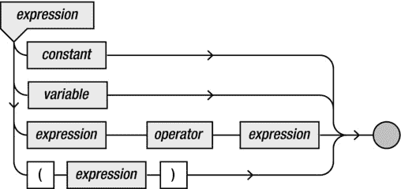
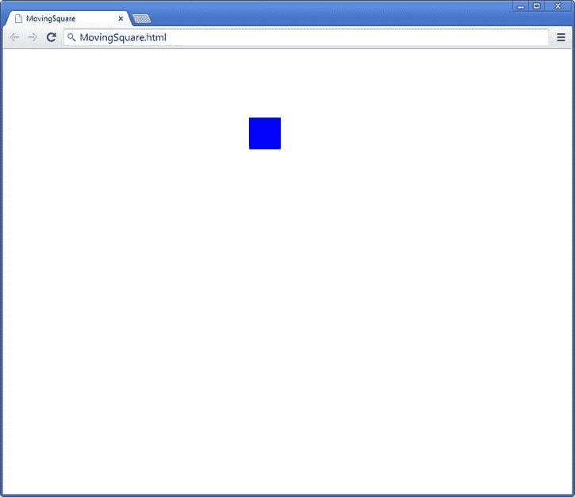

# 三、创造一个游戏世界

本章向你展示了如何通过在内存中存储信息来创建一个游戏世界。它介绍了基本类型和变量，以及如何使用它们来存储或更改信息。接下来，您将看到如何在由成员变量和方法组成的对象中存储更复杂的信息。

基本类型和变量

前几章讨论了几次内存。您已经看到了如何执行类似于`canvasContext.fillStyle = "blue";`的简单指令来设置在画布上绘制形状时应该填充的颜色。在本章的例子中，你使用*内存*来临时存储信息，以便记住一些简单计算的结果。在这个 *DiscoWorld* 的例子中，您根据过去的时间改变背景颜色。

类型

类型，或*数据类型*，代表不同种类的结构化信息。前面的例子使用了不同种类的信息作为参数传递给函数。例如，函数`fillRect`需要四个整数作为信息，BasicGame 示例中的`start`函数需要一个引用画布的文本标识符，而同一示例中的`update`和`draw`函数根本不需要任何信息。浏览器/解释器可以区分所有这些不同类型的信息，在许多情况下，甚至可以将一种类型的信息转换成另一种类型。例如，在 JavaScript 中，可以使用单引号或双引号来表示文本。例如，下面两条指令也是如此:

```js
canvas = document.getElementById("myCanvas");

```

```js
canvas = document.getElementById('myCanvas');

```

浏览器能够在不同种类的信息之间自动转换。例如，以下内容不会导致语法错误:

```js
canvas = document.getElementById(12);

```

作为参数传递的数字将被简单地转换成文本。当然，在这种情况下，没有 ID 为 12 的画布，所以程序将不再正确。但是，如果您要按如下方式替换画布 ID，那么该程序将正常工作:

```js
<canvas id="12" width="800" height="480"></canvas>

```

浏览器会自动在文本和数字之间转换。

大多数编程语言都比 JavaScript 严格得多。在 Java 和 C#等语言中，类型之间的转换是在非常有限的基础上完成的。大多数情况下，您必须明确地告诉编译器需要进行类型之间的转换。这种类型转换也称为*转换*。T3】

在类型转换方面有更严格的政策的原因是什么？首先，明确定义函数或方法期望哪种类型作为参数，可以让其他程序员更容易理解如何使用该函数。请看下面的标题示例:

```js
function playAudio (audioFileId)

```

只看这个头，你不能确定`audioFileId`是数字还是文字。在 C#中，类似方法的标头如下所示:

```js
void playAudio(string audioFileId)

```

你可以看到在这个头中，不仅提供了一个名字，还提供了一个属于这个名字的*类型*。这种情况下的类型是`string`，在 C#中表示文本(一串字符)。再者，方法名前面是单词`void`，表示该方法没有可存储的结果(我在[第七章](07.html)中更多地谈到有结果的方法/函数)。

变量的声明和赋值

将信息存储在 JavaScript 中并在以后使用很容易。您需要做的是提供一个您在引用此信息时使用的名称。这个名字叫做*变量*。当你想在你的程序中使用一个变量时，在你实际使用它之前，*声明*它是一个好主意。这是你如何声明一个变量:

```js
var red;

```

在本例中，`red`是变量的名称。您可以在程序中使用该变量来存储以后需要的信息。

声明变量时，不需要提供存储的信息类型。变量只是内存中一个有名字的位置。相当多的编程语言要求在声明变量时固定变量的类型。例如，C++或 Java 等语言就是这种情况。然而，许多脚本语言(包括 JavaScript)允许你声明一个变量而不定义它的类型。当一门语言不需要类型定义来声明变量时，那么这门语言就有了*松散类型*。在 JavaScript 中，你可以一次声明多个变量。例如:

```js
var red, green, fridge, grandMa, applePie;

```

这里您声明了五个不同的变量，现在您可以在您的程序中使用它们。当您声明这些变量时，它们还不包含值。在这种情况下，这些变量被视为*未定义的*。您可以使用*赋值指令*给变量赋值。例如，我们给变量`red`赋值，如下:

```js
red = 3;

```

分配指令由以下部分组成:

*   应该赋值的变量的名称
*   `=`标志
*   变量的新值
*   分号

您可以通过中间的等号识别赋值指令。然而，在 JavaScript 中，最好将这个符号理解为“变成”而不是“等于”。毕竟，变量还不等于等号右边的值——它在指令执行后*变成了*那个值。描述赋值指令的语法图见[图 3-1](#Fig1) 。


[图 3-1](#_Fig1) 。赋值指令的语法图

现在你已经看到了一条声明变量的指令，和另一条在变量中存储值的指令。但是，如果在声明变量时已经知道要在变量中存储哪个值，则可以将变量的声明和对变量的第一次赋值结合起来:

```js
var red = 3;

```

执行该指令时，存储器将包含值 3，如图[图 3-2](#Fig2) 所示。


[图 3-2](#_Fig2) 。变量声明和赋值后的内存

以下是更多数值变量声明和赋值的几个例子:

```js
var age = 16;
var numberOfBananas;
numberOfBananas = 2;
var a, b;
a = 4;
var c = 4, d = 15, e = -3;
c = d;
numberOfBananas = age + 12;

```

在这个例子的第四行，你可以看到在一个声明中声明多个变量是可能的。您甚至可以在一个声明中执行多个带有赋值的声明，如示例代码的第六行所示。在赋值的右边，你可以放其他变量或者数学表达式，就像你在最后两行看到的。指令`c = d;`导致存储在变量`d`中的值也存储在变量`c`中。因为变量`d`包含值 15，所以执行完这条指令后，变量`c`也包含值 15。最后一条指令将存储在变量`age` (16)中的值加上 12，并将结果存储在变量`numberOfBananas`(现在的值是 28—很多香蕉！).总之，执行完这些指令后，内存看起来类似于图 3-3[中描述的内容。](#Fig3)


[图 3-3](#_Fig3) 。多变量声明和赋值后的内存概述

在图 3-4 的[中显示了声明变量](#Fig4)的语法。


[图 3-4](#_Fig4) 。带有可选初始化的变量声明的语法图

全局变量和严格模式

不用在使用变量之前声明它，在 JavaScript 中也可以不声明就开始使用变量。例如，考虑以下指令:

```js
var a = 3;
var b;
b = 4;
x = a + b;

```

正如你所看到的，变量`a`和`b`是通过使用`var`关键字在前两条指令中声明的。变量`x`从来没有被声明过，但是它被用来存储两个变量的和。JavaScript 允许这样做。然而，这是非常糟糕的做法，原因如下。简单地使用一个变量而不声明它的问题是，JavaScript 解释器会在您没有意识到的情况下自动为您声明该变量。如果您碰巧在其他地方使用了一个同名的变量，您的程序可能会显示您不期望的行为，因为该变量已经存在。此外，如果你使用许多不同的变量，你也必须跟踪这些全局变量。但是下面的例子显示了一个更大的问题:

```js
var myDaughtersAge = 12;
var myAge = 36;
var ourAgeDifference = myAge - mydaughtersAge;

```

在编写这些指令时，您会期望变量`ourAgeDifference`包含值 24 (36 减 12)。然而现实中会*未定义*。原因是第三条指令有错别字。变量名不应该是`mydaughtersAge`，而是`myDaughtersAge`。浏览器/解释器*没有停止脚本并报告错误，而是悄悄地*声明了一个新的全局变量`mydaughtersAge`。因为这个变量是未定义的(它还没有引用一个值)，所以用这个变量做的任何计算也将是未定义的。因此，变量`ourAgeDifference`也是未定义的。

这类问题真的很难解决。幸运的是，新的 EMCAScript 5 标准有一种叫做*严格模式*的东西。当在严格模式下解释脚本时，不允许在没有声明变量的情况下使用变量。如果您希望在严格模式下解释脚本，您唯一需要做的就是在脚本的开头添加一行，如下所示:

```js
"use strict";
var myDaughtersAge = 12;
var myAge = 36;
var ourAgeDifference = myAge - mydaughtersAge;

```

字符串/指令`"use strict";`告诉解释器应该在严格模式下解释脚本。如果您现在尝试运行该脚本，浏览器将停止该脚本，并报告一个错误，即某个变量未经声明就被使用。

除了检查变量是否在使用前声明之外，严格模式还包括其他一些东西，使得编写正确的 JavaScript 代码更加容易。此外，JavaScript 标准的新版本很可能会接近严格模式所施加的 JavaScript 语法限制。

我强烈建议您在严格模式下编写所有的 JavaScript 代码。为了设置模型，本书中剩下的所有例子都是以严格模式编程的。它为程序员省去了很多麻烦，代码也为将来的 JavaScript 版本做好了准备。

指令和表达式

如果您查看语法图中的元素，您可能会注意到赋值右边的值或程序片段被称为一个*表达式*。那么表达式和*指令*有什么区别呢？两者的区别在于，*指令*以某种方式改变内存，而*表达式*有一个值。指令的例子有方法调用和赋值，正如您在上一节中看到的。指令经常使用表达式。下面是一些表达的例子:

```js
16
numberOfBananas
2
a + 4
numberOfBananas + 12 - a
-3
"myCanvas"

```

所有这些表达式都代表某种类型的值。除了最后一行，所有的表达式都是数字。最后一个表达式是一个字符串。除了数字和字符串，还有其他种类的表达式。我在本书中讨论了最重要的几个问题。例如，在接下来的部分我将讨论带有运算符的表达式，和[第 7 章](07.html)描述了使用函数或方法作为表达式。

运算符和更复杂的表达式

本节讨论 JavaScript 知道的不同操作符。您将了解每个运算符的优先级，从而知道计算的执行顺序。您还会看到，在 JavaScript 中，表达式有时会非常复杂。例如，一个变量可以由多个值组成，或者它甚至可以引用一个函数。

算术运算符

在数字表达式中，可以使用以下算术运算符:

*   `+`添加
*   `-`减去
*   `*`倍增
*   `/`划分
*   `%`除法余数(读作“模数”)

乘法使用星号是因为数学中常用的符号(∙和×)在电脑键盘上找不到。在 JavaScript 中不允许完全省略这个操作符，数学中也是这样做的(例如，在公式中)，因为这会引起由多个字符组成的变量的混淆。

当使用除法运算符`/`时，在某些情况下，结果是一个实数(而不是整数)。例如，在执行以下指令后，变量`y`包含值 0.75:

```js
var y = 3/4;

```

特殊运算符`%`给出除法余数。例如，`14%3`的结果是 2，`456%10`的结果是 6。结果总是介于 0 和运算符右侧的值之间。如果除法的结果是整数，则结果为 0。

运营商的优先级

当在一个表达式中使用多个运算符时，优先的常规算术规则适用:先乘后加。因此，表达式`1+2*3`的结果是 7，而不是 9。加法和减法具有相同的优先级，乘法和除法也是如此。

如果一个表达式包含多个相同优先级的运算符，则该表达式从左到右计算。所以，`10-5-2`的结果是 3，不是 7。当您想偏离这些标准的优先级规则时，可以使用括号:例如，`(1+2)*3`和`3+(6-5)`。在实践中，这样的表达式一般也包含变量；否则，您可以自己计算结果(9 和 4)。

不禁止使用多余的括号:例如，`1+(2*3)`。如果你愿意，你可以完全疯狂地使用这个:`((1)+(((2)*3)))`。然而，如果你这样做了，你的程序将更难阅读。

总之，一个表达式可以是一个常量值(比如 12)，可以是一个变量，可以是圆括号中的另一个表达式，也可以是一个表达式后跟一个运算符再跟另一个表达式。[图 3-5](#Fig5) 显示了表示表达式的(部分)语法图。



[图 3-5](#_Fig5) 。表达式的部分语法图

将函数赋给变量

在 JavaScript 中，函数(指令组)存储在内存中。因此，函数本身也是表达式。所以，把一个函数赋给一个变量是可能的。例如:

```js
var someFunction = function () {
    // do something
}

```

这个例子声明了一个变量`someFunction`并给它赋值。这个变量引用的值是一个匿名函数。如果要执行该函数中包含的指令，可以使用变量名调用它，如下:

```js
someFunction();

```

那么这种定义函数的方式和你已经看到的方式有什么区别呢？

```js
function someFunction () {
    // do something
}

```

其实没多大区别。最主要的是，通过用传统的方式定义函数(不使用变量)，函数在使用之前不必定义。当浏览器解释一个 JavaScript 文件时，它分两个阶段完成。在第一阶段，浏览器构建一个可用功能列表。在第二阶段，浏览器解释脚本的其余部分。这是必要的，因为为了正确地解释脚本，浏览器需要知道哪些功能是可用的。例如，这段 JavaScript 代码运行良好，即使函数是在调用后定义的:

```js
someFunction();
function someFunction () {
    // do something
}

```

然而，如果函数被赋值给一个变量，那么这仅在第二阶段被解释。这意味着这段代码会导致一个错误:

```js
someFunction();
var someFunction = function () {
    // do something
}

```

浏览器会抱怨脚本访问了一个还没有声明的变量`someFunction`。在定义了函数之后调用它是非常好的:

```js
var someFunction = function () {
    // do something
}
someFunction();

```

由多个值组成的变量

除了包含单个值，变量还可以由多个值组成。这类似于你在函数中所做的，将指令组合在一起。比如:

```js
function mainLoop () {
    canvasContext.fillStyle = "blue";
    canvasContext.fillRect(0, 0, canvas.width, canvas.height);
    update();
    draw();
    window.setTimeout(mainLoop, 1000 / 60);
}

```

您可以通过调用`mainLoop`函数来执行所有这些指令。使用大括号将属于该函数的指令分组。与分组指令类似，也可以将变量分组到一个更大的变量中。这个更大的变量包含多个值。看看下面的例子:

```js
var gameCharacter = {
    name : "Merlin",
    skill : "Magician",
    health : 100,
    power : 230
};

```

这是一个*复合变量*的例子。变量`gameCharacter`由几个值组成，每个值都有一个名称和该名称引用的值。所以，从某种意义上说，`gameCharacter`变量是由其他变量组成的*。你可以看到，就像在函数体中一样，变量在大括号中分组。每个子变量都有一个名字，在冒号后面指定这个变量引用的值。由大括号括起来的名称和值组成的表达式称为*对象文字*。 [图 3-6](#Fig6) 显示了一个对象文字表达式的(部分)语法图。*


[图 3-6](#_Fig6) 。对象文字表达式的(部分)语法图

在对`gameCharacter`变量进行声明和初始化后，内存将如图 3-7 中的[所示。](#Fig7)


[图 3-7](#_Fig7) 。创建复合变量后的内存结构

您可以访问复合变量中的数据，如下所示:

```js
gameCharacter.name = "Arjan";
var damage = gameCharacter.power * 10;

```

正如你所看到的，你可以通过在一个点后写变量的名字来访问属于`gameCharacter`的变量。JavaScript 甚至允许您在声明和初始化复合变量之后修改它的结构。例如，看看下面的代码:

```js
var anotherGameCharacter = {
    name : "Arthur",
    skill : "King",
    health : 25,
    power : 35000
};

anotherGameCharacter.familyName = "Pendragon";

```

变量`anotherGameCharacter`现在由五部分组成:`name`、`skill`、`health`、`power`和`familyName`。

因为变量也可以指向函数，所以你甚至可以包含一个指向函数的子变量。例如，您可以将`anotherGameCharacter`定义如下:

```js
var anotherGameCharacter = {
    name : "Arthur",
    familyName : "Pendragon",
    skill : "King",
    health : 25,
    power : 35000,
    healMe : function () {
        anotherGameCharacter.health = 100;
    }
};

```

和以前一样，在给变量赋值后，可以给变量添加一个函数部分:

```js
anotherGameCharacter.killMe = function () {
    anotherGameCharacter.health = 0;
};

```

您可以像访问其他变量一样调用这些函数。以下指令完全恢复游戏角色的健康:

```js
anotherGameCharacter.healMe();

```

如果你想杀死这个角色，`anotherGameCharacter.killMe();`指令会完成任务。以这种方式构造变量和函数的好处在于，您可以将相关的数据和函数组合在一起。这个例子将属于同一个游戏角色的变量分组。它还增加了一些对这个游戏角色有用的功能。从现在开始，如果一个函数属于一个变量，我就称这个函数为*方法*。我将把一个由其他变量组成的变量称为*对象*。如果一个变量是对象的一部分，我称这个变量为*成员变量* 。

你大概可以想象对象和方法有多强大。它们提供了一种将结构带入复杂游戏世界的方式。如果 JavaScript 没有这种能力，您将不得不在程序开始时声明一个很长的变量列表，而不知道变量之间是如何关联的，也不知道您可以用它们做什么。通过将对象中的变量分组并提供属于这些对象的方法，您可以编写更容易理解的程序。在下一节中，您将在一个简单的示例中使用这种能力，在画布上移动一个正方形。

移动广场游戏

本节研究一个在画布上移动一个方块的简单程序。其目的是为了说明两件事:

*   游戏循环中的`update`和`draw`部分如何更详细地工作
*   如何使用对象来构建程序

在开始编写这个程序之前，让我们再看一遍 BasicGame 示例的代码:

```js
var canvas = undefined;
var canvasContext = undefined;

function start () {
    canvas = document.getElementById("myCanvas");
    canvasContext = canvas.getContext("2d");
    mainLoop();
}

document.addEventListener('DOMContentLoaded', start);

function update () {
}

function draw () {
    canvasContext.fillStyle = "blue";
    canvasContext.fillRect(0, 0, canvas.width, canvas.height);
}

function mainLoop () {
    update();
    draw();
    window.setTimeout(mainLoop, 1000 / 60);
}

```

这里有几个变量声明和几个函数来处理这些变量。有了关于在对象中将变量分组的新知识，让我们弄清楚所有这些变量和函数都属于一个*游戏*应用，如下所示:

```js
"use strict";

var Game = {
    canvas : undefined,
    canvasContext : undefined
};

Game.start = function () {
    Game.canvas = document.getElementById("myCanvas");
    Game.canvasContext = Game.canvas.getContext("2d");
    Game.mainLoop();
};

document.addEventListener('DOMContentLoaded', Game.start);

Game.update = function () {
};

Game.draw = function () {
    Game.canvasContext.fillStyle = "blue";
    Game.canvasContext.fillRect(0, 0, Game.canvas.width, Game.canvas.height);
};

Game.mainLoop = function () {
    Game.update();
    Game.draw();
    window.setTimeout(mainLoop, 1000 / 60);
};

```

这里您要做的主要事情是创建一个名为`Game`的复合变量(对象)。这个对象有两个*成员变量* : `canvas`和`canvasContext`。此外，你添加了一些*方法*到这个对象中，包括共同形成游戏循环的方法。您单独定义属于这个对象的方法(换句话说，它们不是变量声明和初始赋值的一部分)。原因是您现在可以很容易地将组成对象的*数据*与处理数据的*方法区分开来。还要注意，正如我所承诺的，你将指令`"use strict";`添加到程序中！*

现在让我们扩展这个例子，让它显示一个更小的矩形在屏幕上移动。您希望随着时间的推移更改矩形的 x 位置。为此，您必须将矩形的当前 x 位置存储在一个变量中。这样，您可以在`update`方法中为该变量赋值(在这里您可以改变游戏世界)，并在`draw`方法中使用该变量在屏幕上绘制矩形(在这里您可以在屏幕上绘制游戏世界)。添加这个变量的逻辑位置是作为`Game`对象的一部分，所以你如下声明并初始化这个对象:

```js
var Game = {
    canvas : undefined,
    canvasContext : undefined,
    rectanglePosition : 0
};

```

您使用变量`rectanglePosition` 来存储矩形的 x 位置。在`draw`方法中，您可以使用该值在屏幕上的某个地方绘制一个矩形。在本例中，您绘制了一个较小的矩形，它没有覆盖整个画布，因此您可以看到它四处移动。这是新的`draw`方法:

```js
Game.draw = function () {
    Game.canvasContext.fillStyle = "blue";
    Game.canvasContext.fillRect(Game.rectanglePosition, 100, 50, 50);
}

```

现在你唯一需要做的就是计算矩形的 x 位置。你在`update`方法中这样做，因为改变矩形的 x 位置意味着你在*更新游戏世界*。在这个简单的例子中，让我们根据经过的时间来改变矩形的位置。在 JavaScript 中，您可以使用以下两条指令来获取当前系统时间:

```js
var d = new Date();
var currentSystemTime = d.getTime();

```

您以前没有见过第一行中使用的那种符号。现在，让我们假设`new Date()`创建了一个复合变量(对象),其中填充了日期和时间信息以及一些有用的方法。其中一种方法就是`getTime`。你在对象`d`上调用该方法，并将其结果存储在变量`currentSystemTime`中。该变量现在包含自 1970 年 1 月 1 日以来经过的毫秒数。).可想而知，这个数字是相当大的。如果您想将 x 位置设置为该值，您需要一个高分辨率的计算机显示器。这台显示器肯定不适合你的房间(或者任何房间，就此而言)。相反，您可以将系统时间除以画布的宽度，取该除法的余数，并将其用作矩形的 x 位置。这样，你总是得到一个介于零和画布宽度之间的 x 位置。下面是完成这项工作的完整的`update`方法:

```js
Game.update = function () {
    var d = new Date();
    Game.rectanglePosition = d.getTime() % Game.canvas.width;
};

```

如你所知，`update`和`draw`方法被顺序调用，大约每秒 60 次。每当这种情况发生时，系统时间已经改变(因为时间已经过去)，这意味着矩形的位置将被改变，并且它将被绘制在与以前不同的位置。

在这个例子正常工作之前，您还需要做一件事情。如果你像这样运行程序，屏幕上会出现一个蓝色条。原因是您当前正在旧矩形的顶部绘制新矩形。为了解决这个问题，每次在画布上再次绘制之前，你都需要*清空画布*。清除画布是通过`clearRect`方法完成的。此方法清除给定大小的矩形中绘制的任何东西。例如，这条指令清除整个画布:

```js
Game.canvasContext.clearRect(0, 0, Game.canvas.width, Game.canvas.height);

```

为了方便起见，您将这条指令放在一个名为`clearCanvas`的方法中，如下所示:

```js
Game.clearCanvas = function () {
    Game.canvasContext.clearRect(0, 0, Game.canvas.width, Game.canvas.height);
};

```

你唯一要做的就是确保在调用`update`和`draw`之前调用这个方法。你在`mainLoop`方法:中这样做

```js
Game.mainLoop = function() {
    Game.clearCanvas();
    Game.update();
    Game.draw();
    window.setTimeout(Game.mainLoop, 1000 / 60);
};

```

现在这个例子完成了！双击属于本章的文件夹中的`MovingSquare.html`文件，即可运行该程序。[图 3-8](#Fig8) 显示了它的样子。



[图 3-8](#_Fig8) 。MovingSquare 示例的输出

研究矩形的位置是如何随时间变化的。试着让下面的一些事情正常工作(如果你有其他想法，也不要犹豫尝试一下):

*   使矩形从右向左移动。
*   使矩形从上到下移动。
*   使矩形在屏幕上对角移动。
*   让矩形以两倍的速度移动。

变量的范围

声明变量的地方会影响到允许使用变量的地方。看看 MovingSquare 程序中的变量`d`。这个变量在`update`方法中声明(并赋值)。因为它是在`update`方法中声明的，所以只允许在这个方法中使用它。例如，不允许在`draw`方法中再次使用这个变量。当然，你可以在`draw`方法中声明另一个名为`d`的变量，但是重要的是要意识到在`update`中声明的`d`变量在那种情况下不会是在`draw`方法中声明的同一个`d`变量。

或者，如果你在*对象*级别声明一个变量，你可以在任何地方使用它，只要你把对象的名字放在它前面。您需要在`update`和`draw`方法中使用矩形的 x 位置，因为在`update`方法中，您更新这个位置，而在`draw`方法中，您使用它在 x 位置绘制一个矩形。因此，逻辑上这个变量需要在对象级别声明，这样所有属于这个对象的方法都可以使用这个变量。

可以使用变量的地方统称为变量的*范围*。在这个例子中，变量`d`的范围是`update`方法，变量`Game.rectanglePosition`的范围是全局范围。

你学到了什么

在本章中，您学习了:

*   如何使用变量在内存中存储基本信息
*   如何创建由成员变量和方法组成的对象
*   如何使用`update`方法通过变量改变游戏世界和`draw`方法在屏幕上显示游戏世界