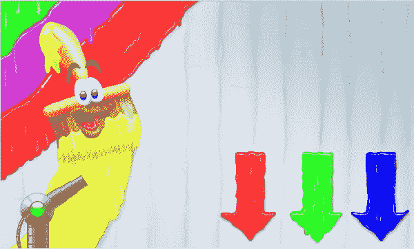
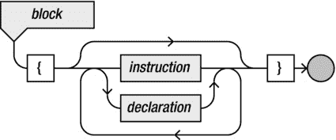

# 六、对玩家输入做出反应

在这一章中，你会看到你的游戏程序是如何对按键做出反应的。为了做到这一点，您需要一个名为`if`的指令，它在条件满足时执行一条指令(或一组指令)。您还将学习如何将代码更多地组织成对象和方法。

游戏中的对象

到目前为止，所有的示例程序都有一个名为`Game`的大对象。这个对象由许多变量组成，用于存储画布及其上下文、精灵、位置等等。这是 Painter1 示例中的`Game`对象的外观:

```js
var Game = {
    canvas : undefined,
    canvasContext : undefined,
    backgroundSprite : undefined,
    cannonBarrelSprite : undefined,
    mousePosition : { x : 0, y : 0 },
    cannonPosition : { x : 72, y : 405 },
    cannonOrigin : { x : 34, y : 34 },
    cannonRotation : 0
};

```

正如你所看到的，它已经包含了相当多的变量，即使对于一个只画背景和旋转大炮的简单程序也是如此。随着你开发的游戏变得越来越复杂，这个变量列表会越来越大，结果，代码会变得更难被其他开发者理解(对你来说，当你几个月不看代码的时候)。问题是你把所有东西都存储在一个叫做`Game`的大对象中。从概念上讲，这是有意义的，因为`Game`包含了与画家游戏相关的一切。然而，如果你把事情分开一点，代码会更容易理解。

如果您查看`Game`对象的内容，您可以看到某些变量以某种方式组合在一起。例如，`canvas`和`canvasContext`变量属于同一类，因为它们都与画布有关。此外，相当多的变量存储关于大炮的信息，例如它的位置或它的旋转。您可以将相关的变量分组到不同的对象中，以便在代码中更清楚地说明这些变量是相关的。例如，看看这个例子:

```js
var Canvas2D = {
    canvas : undefined,
    canvasContext : undefined
};

var Game = {
    backgroundSprite : undefined,
};

var cannon = {
    cannonBarrelSprite : undefined,
    position : { x : 72, y : 405 },
    origin : { x : 34, y : 34 },
    rotation : 0
};

var Mouse = { position : { x : 0, y : 0 } };

```

正如您所看到的，现在您有了几个不同的对象，每个对象都包含一些之前分组在`Game`对象中的变量。现在看哪些变量属于大炮，哪些变量属于画布就容易多了。好的方面是你可以对*方法*做同样的事情。例如，您可以将清除画布并在其上绘制图像的方法添加到`Canvas2D`对象中，如下所示:

```js
Canvas2D.clear = function () {
    Canvas2D.canvasContext.clearRect(0, 0, this.canvas.width,
        this.canvas.height);
};

Canvas2D.drawImage = function (sprite, position, rotation, origin) {
    // canvas drawing code
};

```

使用不同的对象，而不是包含游戏所有内容的单一对象，会使你的代码更容易阅读。当然，只有当你以一种*逻辑方式*将变量分布在对象上时，这才是真的。 即使是简单的游戏，也有很多方法可以组织代码。所有开发人员都有自己的风格。当你继续读下去，你会发现这本书也遵循某种风格。你可能不同意这种风格，或者有时你处理问题的方式可能与本书不同。没关系。编程问题几乎没有唯一正确的解决方案。

回到对象的分布，您可以看到我们以大写字符开始命名大多数对象(例如`Canvas2D`)，但是`cannon`对象以小写字符开始。我们这样做是有原因的，我们将在后面详细讨论。现在，我们只能说以大写字母开头的对象对任何游戏的*都有用，但是名称以小写字母开头的对象只用于特定的*游戏。在这种情况下，你可以想象`Canvas2D`对象可以在任何 HTML5 游戏中使用，但是`cannon`对象只对画师游戏有用。**

装载精灵

现在你在游戏中有了不同的物体，你在哪里加载精灵呢？你可以在`Game`对象的`start`方法中加载所有的精灵，但是另一个选择是添加一个类似的方法到`cannon`对象，并加载属于那里的大炮的精灵。哪种方法更好？

在该对象的初始化方法中加载属于`cannon`对象的精灵是有道理的。这样，您可以从代码中清楚地看到哪些精灵属于哪个对象。然而，这也意味着如果你为不同的游戏对象重用同一个图像，你必须多次加载这个精灵。对于在浏览器中运行的游戏，这意味着浏览器必须从服务器下载图像文件，这可能需要时间。更好的选择是在游戏开始时加载游戏需要的所有精灵。为了清楚地将精灵与程序的其余部分分开，您将它们存储在一个名为`sprites`的对象中。该对象在程序的顶部声明为空对象:

```js
var sprites = {};

```

在`Game.start`方法中用精灵填充这个变量。对于要加载的每个 sprite，创建一个 Image 对象，然后将其源设置为 sprite 位置。因为您已经使用了相当多不同的精灵，所以您从另一个包含属于画师游戏的所有精灵的素材文件夹中加载这些精灵。这样，你就不必为书中所有使用这些精灵的不同例子复制这些图像文件。以下是加载本章中 Painter2 示例所需的各种精灵的说明:

```js
var spriteFolder = "../../assets/Painter/sprites/";
sprites.background = new Image();
sprites.background.src = spriteFolder + "spr_background.jpg";
sprites.cannon_barrel = new Image();
sprites.cannon_barrel.src = spriteFolder + "spr_cannon_barrel.png";
sprites.cannon_red = new Image();
sprites.cannon_red.src = spriteFolder + "spr_cannon_red.png";
sprites.cannon_green = new Image();
sprites.cannon_green.src = spriteFolder + "spr_cannon_green.png";
sprites.cannon_blue = new Image();
sprites.cannon_blue.src = spriteFolder + "spr_cannon_blue.png";

```

这里使用了`+`操作符来连接文本。例如，表达式`spriteFolder + "spr_background.jpg"`的值是`"../../assets/Painter/sprites/spr_background.jpg"`。精灵文件夹路径看起来有点复杂。这../../ bit 表示您在层次结构中向上移动了两个目录。这是必要的，因为示例目录`Painter2`和`Painter2a`与`assets`目录不在同一层。您将这些图像存储在属于`sprites`对象的变量中。稍后，当您需要检索精灵时，您可以访问该对象。下一步是处理玩家的按键。

处理按键事件

在前一章中，您看到了如何使用事件处理程序来读取鼠标的当前位置。以非常相似的方式，您可以对玩家按住键盘上的一个键的事件做出反应。同样，您可以通过定义事件处理程序来实现这一点。您需要存储被按住的键，以便以后可以访问它并利用该信息做一些事情。存储哪个键被按下的最简单方法是使用*键码*。键码基本上就是代表某个键的数字。例如，空格键可能是数字 13，或者 A 键可能是数字 65。那么，为什么这些键使用这些特定的数字，而不是其他的呢？因为*字符码表* 是标准化的，而且这些年来出现了不同的标准。

在 20 世纪 70 年代，程序员认为 2 <sup>6</sup> = 64 个符号就足以表示您可能需要的所有符号:26 个字符、10 个数字和 28 个标点符号(逗号、分号等等)。尽管这意味着小写和大写字符没有区别，但这在当时并不是问题。

在 20 世纪 80 年代，人们使用 2 <sup>7</sup> = 128 种不同的符号:26 个大写字符、26 个小写字符、10 个数字、33 个标点符号和 33 个特殊字符(行尾、制表、嘟嘟声等等)。这些符号的顺序被称为 *ASCII* :美国信息交换标准代码。这对英语来说很好，但对法语、德语、荷兰语、西班牙语等其他语言来说还不够。

结果在 90 年代，用 2 <sup>8</sup> = 256 个符号构造了新的码表；不同国家最常见的字母也有所体现。从 0 到 127 的符号与 ASCII 中的相同，但符号 128 到 255 用于表示属于给定语言的特殊字符。根据语言(英语、俄语、印度语等)，使用不同的代码表。例如，西欧代码表是 Latin1。对于东欧，使用另一个代码表(波兰语和捷克语有许多特殊的口音，在 Latin1 表中没有更多的空间)。希腊、俄罗斯、希伯来和印度的梵文字母都有自己的代码表。这是处理不同语言的合理方式，但是如果您想同时存储不同语言的文本，事情就变得复杂了。此外，包含超过 128 个符号的语言(如普通话)也不可能用这种格式来表示。

二十一世纪初，编码标准再次扩展为包含 2 <sup>16</sup> = 65536 个不同符号的表。这张表可以很容易地包含世界上所有的字母表，包括许多不同的标点符号和其他符号。如果你曾经遇到一个外星物种，这张表可能也有空间来表示外星人语言中的字符。码表叫做 *Unicode* 。Unicode 的前 256 个符号与 Latin1 码表的符号相同。

回到您想要为示例存储的按键代码，让我们添加一个包含最后按下的按键的简单变量:

```js
var Keyboard = { keyDown : -1 };

```

当变量被初始化时，它包含一个包含值-1 的`keyDown`变量。该值表示玩家*当前没有按下任何键*。当玩家按下一个键时，你必须将键码存储在变量`Keyboard.keyDown`中。你可以通过编写一个*事件处理程序* 来存储当前被按下的键。下面是这个事件处理程序的样子:

```js
function handleKeyDown(evt) {
    Keyboard.keyDown = evt.keyCode;
}

```

如您所见，该函数获取一个事件作为参数。该事件对象有一个名为`keyCode`的变量，包含玩家当前按下的键的键码。

您在`Game.start`中分配这个事件处理函数，如下所示:

```js
document.onkeydown = handleKeyDown;

```

现在，每当玩家按下一个键，键码就会被储存起来，这样你就可以在你的游戏中使用它了。但是当玩家释放按键时会发生什么呢？`Keyboard.keyDown`的值应该再次被赋值为-1，这样你就知道玩家当前没有按任何键。这是通过*键向上*事件处理程序完成的。下面是该处理程序的头部和主体:

```js
function handleKeyUp(evt) {
    Keyboard.keyDown = -1;
}

```

如你所见，这很简单。您唯一需要做的就是将值-1 赋给`Keyboard`对象中的`keyDown`变量。最后，您在`Game.start`中分配这个功能:

```js
document.onkeyup = handleKeyUp;

```

现在你已经准备好处理游戏中的按键了。注意，这种处理按键的方式有点局限。例如，没有办法跟踪同时按键，例如玩家同时按下 A 和 B 键。后来，在第 13 章中，你扩展了`Keyboard`对象来考虑这一点。

条件执行

作为如何使用`Keyboard`对象做某事的一个简单例子，让我们扩展 Painter1 程序，在炮管顶部绘制一个彩球。通过按 R、G 或 B 键，玩家可以将加农炮的颜色改为红色、绿色或蓝色。[图 6-1](#Fig1) 显示了程序的截图。



[图 6-1](#_Fig1) 。Painter2 程序的屏幕截图

你需要加载三个额外的精灵，每个彩球一个。这是通过以下三条指令完成的:

```js
sprites.cannon_red = Game.loadSprite(spriteFolder + "spr_cannon_red.png");
sprites.cannon_green = Game.loadSprite(spriteFolder + "spr_cannon_green.png");
sprites.cannon_blue = Game.loadSprite(spriteFolder + "spr_cannon_blue.png");

```

您向`cannon`对象添加一个`initialize`方法，在该方法中，您向属于该对象的变量赋值。这种方法叫从`Game.start`。这样，游戏开始时大炮就被初始化了:

```js
Game.start = function () {
    Canvas2D.initialize("myCanvas");
    document.onkeydown = handleKeyDown;
    document.onkeyup = handleKeyUp;
    document.onmousemove = handleMouseMove;
    ...
    cannon.initialize();
    window.setTimeout(Game.mainLoop, 500);
};

```

在`cannon.initialize`方法中，你给属于加农炮的变量赋值。这是完整的方法:

```js
cannon.initialize = function() {
    cannon.position = { x : 72, y : 405 };
    cannon.colorPosition = { x : 55, y : 388 };
    cannon.origin = { x : 34, y : 34 };
    cannon.currentColor = sprites.cannon_red;
    cannon.rotation = 0;
};

```

如您所见，您有两个位置变量:一个用于炮管，一个用于彩色球体。此外，您添加了一个变量，该变量引用应该绘制的球体的当前颜色。最初，您将红色球体精灵分配给该变量。

为了明确区分对象，你还可以给`cannon`对象添加一个`draw`方法。在这种方法中，您绘制炮管和炮管上的彩色球体:

```js
cannon.draw = function () {
    Canvas2D.drawImage(sprites.cannon_barrel, cannon.position, cannon.rotation,
        cannon.origin);
    Canvas2D.drawImage(cannon.currentColor, cannon.colorPosition, 0,
        { x : 0, y : 0 });
};

```

这个`draw`方法从`Game.draw`调用如下:

```js
Game.draw = function () {
    Canvas2D.clear();
    Canvas2D.drawImage(sprites.background, { x : 0, y : 0 }, 0,
        { x : 0, y : 0 });
    cannon.draw();
};

```

这样，您可以更容易地看到哪个绘图指令属于哪个对象。现在，准备工作已经完成，您可以开始处理玩家的按键。直到现在，你写的所有指令都必须一直执行。例如，程序总是需要绘制背景精灵和炮管精灵。但是现在你遇到一种情况，只有在满足某些条件的情况下才需要执行指令。例如，只有当玩家按下 G 键时，你才需要将球的颜色改为绿色*。这种指令被称为*条件指令*，它使用了一个新的关键字:`if`。*

使用`if`指令，您可以提供一个条件，如果这个条件成立，就执行一个指令块(总的来说，这有时也被称为*分支*)。以下是一些条件示例:

*   演奏者按下了 G 键。
*   游戏开始后经过的秒数大于 1，000。
*   气球精灵就在屏幕的正中央。
*   怪物吃掉了你的角色。

这些条件可以是*真*或*假*。条件是一个*表达式*，因为它有一个值(或者是*真*或者是*假*)。这个值也被称为一个*布尔*值。使用`if`指令，如果条件为真，您可以执行一组指令。看看这个例子`if`指令:

```js
if (Game.mousePosition.x > 200) {
    Canvas2D.drawImage(sprites.background, { x : 0, y : 0 }, 0,
        { x : 0, y : 0 });
}

```

条件总是放在括号中。接下来是一组指令，用大括号括起来。在本例中，只有当鼠标的 x 位置大于 200 时，才会绘制背景。因此，如果您在屏幕上向左移动鼠标太远，背景就不会被绘制出来。如果需要，您可以在大括号之间放置多个指令:

```js
if (Game.mousePosition.x > 200) {
    Canvas2D.drawImage(sprites.background, { x : 0, y : 0 }, 0,
        { x : 0, y : 0 });
    cannon.draw();
}

```

如果只有一条指令，您可以省略大括号来稍微缩短代码:

```js
if (Game.mousePosition.x > 200)
    Canvas2D.drawImage(sprites.background, { x : 0, y : 0 }, 0,
        { x : 0, y : 0 });

```

在这个例子中，你想只在玩家按下 R、G 或 B 键时改变炮管的颜色。这意味着你必须检查这些键中的一个是否被按下。使用`Keyboard`对象，检查 R 键是否被按下的条件如下:

```js
Keyboard.keyDown === 82

```

`===`运算符比较两个值，如果相同则返回 true，否则返回 false。这个比较运算符的左边是`Keyboard`对象中的`keyDown`变量的值。右边是对应 R 键的键码。现在，您可以在`cannon`的`update`方法中使用它，如下所示:

```js
if (Keyboard.keyDown === 82)
    cannon.currentColor = sprites.cannon_red;

```

有点烦人的是，为了理解程序中发生的事情，你必须记住所有这些关键代码。您可以通过定义第二个名为`Keys`的变量来简化工作，该变量包含最常见的键码，如下所示:

```js
var Keys = {
    A: 65, B: 66, C: 67, D: 68, E: 69, F: 70,
    G: 71, H: 72, I: 73, J: 74, K: 75, L: 76,
    M: 77, N: 78, O: 79, P: 80, Q: 81, R: 82,
    S: 83, T: 84, U: 85, V: 86, W: 87, X: 88,
    Y: 89, Z: 90
};

```

现在，如果你想知道键 R 的数字，你可以简单地访问变量`Keys.R`，并且`if`指令变得更加清晰:

```js
if (Keyboard.keyDown === Keys.R)
    cannon.currentColor = sprites.cannon_red;

```

比较运算符

`if`指令头中的条件是一个返回真值的表达式:*是*或*否*。当表达式的结果为*是*时，执行`if`指令的主体。在这些情况下，您可以使用比较运算符。以下操作符可用:

*   `<`小于
*   `<=`小于或等于
*   `>`大于
*   `>=`大于或等于
*   `===`等于
*   `!==`不等于

这些运算符可用于任意两个数字之间。在这些操作符的左边和右边，您可以放入常量值、变量或带有加法、乘法或任何您想要的内容的完整表达式。使用三个等号(`===`)测试两个值是否相等。这与表示赋值的单个等号非常不同。这两个运算符之间的差异非常重要:

`x = 5;`表示:*将*的值 5 赋给`x`。

`x === 5`的意思:*`x`等于 5 吗？*

 *因为您已经见过单等于和三等于运算符，所以您可能想知道是否还有双等于运算符。有。double-equals 运算符也比较值，但是如果这些值的类型不同，该运算符会转换其中一个值，以使类型匹配。这种转换听起来很有用，但是会导致一些奇怪的行为。这里有几个例子:

```js
'' == '0' // false
0 == '' // true!
0 == '0' // true!

```

三重等于运算符在这三种情况下都会返回 false，因为类型不同。一般来说，最好避免使用双等号运算符。三倍等于运算符更容易预测，这使得在程序中使用它时会出现更少的 bug 和错误。

**注意**在现有的 JavaScript 库或代码片段中，您可能会经常遇到双等号运算符。编程习惯很难改变。

逻辑运算符

在逻辑术语中，条件也称为*谓词*。在逻辑中用于连接谓词的操作符(*和*、*或*、*而非*)也可以在 JavaScript 中使用。他们有一个特殊的符号:

*   `&&`是逻辑 and 运算符。
*   `||`是逻辑*或*运算符。
*   `!`是逻辑*而不是*运算符。

您可以使用这些操作符来检查复杂的逻辑语句，以便只在非常特殊的情况下执行指令。比如你可以画一个“你赢了！”只有玩家积分超过 10000，敌人生命值为 0，玩家生命值大于 0 时才叠加:

```js
if (playerPoints > 10000 && enemyLifeForce === 0 && playerLifeForce > 0)
    Canvas2D.drawimage(winningOverlay, { x : 0, y : 0 }, 0, { x : 0, y : 0 });

```

布尔类型

使用比较运算符或用逻辑运算符连接其他表达式的表达式也有类型，就像使用算术运算符的表达式一样。毕竟，这样一个表达式的结果是一个值:两个真值之一*是*或*否*。在逻辑上，这些值被称为*真*和*假*。在 JavaScript 中，这些真值由关键字`true`和`false`表示。

除了用于表达`if`指令中的条件，逻辑表达式还可以应用于许多不同的情况。逻辑表达式类似于算术表达式，只是类型不同。例如，您可以将逻辑表达式的结果存储在变量中，将其作为参数传递，或者在另一个表达式中再次使用该结果。

逻辑值的类型是*布尔*，以英国数学家和哲学家乔治·布尔(1815–1864)的名字命名。以下是布尔变量声明和赋值的示例:

```js
var test;
test = x > 3 && y < 5;

```

在这种情况下，例如，如果`x`包含值 6，而`y`包含值 3，布尔表达式`x > 3 && y < 5`将计算为`true`，该值将存储在变量`test`中。您也可以将布尔值`true`和`false`直接存储在变量中:

```js
var isAlive = false;

```

布尔变量对于存储游戏中不同对象的状态非常方便。例如，您可以使用一个布尔变量来存储玩家是否还活着，玩家当前是否正在跳跃，一个关卡是否完成，等等。您可以在`if`指令中使用布尔变量作为表达式:

```js
if (isAlive)
   // do something

```

在这种情况下，如果表达式`isAlive`的计算结果为`true`，则执行`if`指令的主体。您可能认为这段代码会产生一个编译器错误，您需要对布尔变量进行比较，如下所示:

```js
if (isAlive === true)
    // do something

```

然而，这种额外的比较是不必要的。在`if`指令*中的条件表达式必须评估为* `true`或`false`。因为布尔变量已经表示了这两个值中的一个，所以不需要进行比较。事实上，如果需要之前的比较，您还需要再次将结果与布尔值进行比较:

```js
if ((isAlive === true) === true)
    // do something

```

更糟的是:

```js
if ((((((isAlive === true) === true) === true) === true) === true) === true)
    // do something

```

综上所述，不要把事情搞得比实际更复杂。如果结果已经是一个布尔值，你就不用和任何东西比较了。

您可以使用 Boolean 类型存储复杂的表达式，这些表达式可以是`true`或 fa `l` se。让我们再看几个例子:

```js
var a = 12 > 5;
var b = a && 3 + 4 === 8;
var c = a || b;
if (!c)
    a = false;

```

在你继续阅读之前，试着在执行完这些指令后确定变量`a`、`b`和`c`的值。在第一行中，您声明并初始化一个布尔值`a`。存储在该布尔值中的真值由表达式`12 > 5`计算得出，其结果为`true`。然后将该值分配给变量`a`。在第二行中，您声明并初始化了一个新变量`b`，其中存储了一个更复杂的表达式的结果。这个表达式的第一部分是变量`a`，它包含值`true`。表达式的第二部分是比较表达式`3 + 4 === 8`。这个比较不成立(3 + 4 不等于 8)，所以它的计算结果是`false`，因此逻辑*和*也产生`false`。因此，该指令执行后，变量`b`包含值`false`。

第三条指令将变量`a`和`b`的逻辑*或*运算结果存储在变量`c`中。因为`a`包含值`true`，所以这个运算的结果也是`true`，这个结果被赋给`c`。最后，还有一个`if`指令，它将值`false`赋给变量`a`，但前提是`!c`的计算结果为`true`。在这种情况下，`c`是`true`，所以`!c`是`false`，这意味着`if`指令的主体没有被执行。因此，所有指令执行完毕后，`a`和`c`都包含值`true`，`b`包含值`false`。

做这种练习表明很容易犯逻辑错误。这个过程类似于您调试代码时所做的事情。一步一步，你通过指令，并确定在不同阶段的变量的值。一个简单的混淆就可能导致你认为是`true`的东西变成`false`！

将枪管对准鼠标指针

在前面的章节中，您已经看到了如何使用`if`指令来检查玩家是否按下了 R 键。现在，假设你想在鼠标左键按下的情况下更新炮管的角度。为了处理鼠标按键，您还需要两个事件处理程序:一个用于处理用户按下鼠标按键的事件，另一个用于处理用户释放鼠标按键的事件。这类似于按下和释放键盘上的一个键。每当按下或释放鼠标按钮时，事件对象中的`which`变量会告诉您是哪个按钮(1 是左按钮，2 是中按钮，3 是右按钮)。您可以向`Mouse`对象添加一个布尔变量，指示鼠标按钮是否被按下。让我们对鼠标左键这样做:

```js
var Mouse = {
    position : { x : 0, y : 0 },
    leftDown : false
};

```

您还必须添加两个处理函数，为`leftDown`变量赋值。下面是两个函数:

```js
function handleMouseDown(evt) {
    if (evt.which === 1)
        Mouse.leftDown = true;
}

function handleMouseUp(evt) {
    if (evt.which === 1)
        Mouse.leftDown = false;
}

```

如您所见，您使用`if`指令来确定鼠标左键是被按下还是被释放。根据条件的真值，执行指令体。当然，您需要将这些处理程序分配给文档中适当的变量，以便在按下或释放鼠标按钮时调用它们:

```js
document.onmousedown = handleMouseDown;
document.onmouseup = handleMouseUp;

```

现在，在`cannon`的`update`方法中，只有当鼠标左键被按下时才更新炮管角度:

```js
if (Mouse.leftDown) {
    var opposite = Mouse.position.y - this.position.y;
    var adjacent = Mouse.position.x - this.position.x;
    cannon.rotation = Math.atan2(opposite, adjacent);
}

```

假设您想在玩家释放鼠标左键后将角度重置为零。你可以添加另一个`if`指令，就像这样:

```js
if (!Mouse.leftDown)
    cannon.rotation = 0;

```

对于更复杂的情况，这种解决方案将变得更难理解。有一种更好的方式来处理这种情况:使用一个带有*替代*的`if`指令。当`if`指令中的条件不为真时，执行替代指令；你可以使用`else`关键字:

```js
if (Mouse.leftDown) {
    var opposite = Mouse.position.y - this.position.y;
    var adjacent = Mouse.position.x - this.position.x;
    cannon.rotation = Math.atan2(opposite, adjacent);
} else
    cannon.rotation = 0;

```

这条指令做的事情和前面两条`if`指令完全一样，但是你只需要写一次条件。执行 Painter2 程序，看看它能做什么。请注意，只要松开鼠标左键，炮管的角度就为零。

带有替代指令的`if`指令的语法由[图 6-2](#Fig2) 中的语法图表示。一条`if`指令的主体可以由括号内的多条指令组成，因为一条指令也可以是指令的*块*，如图 6-3 中的语法图所定义。


[图 6-2](#_Fig2) 。`if`指令的语法图



[图 6-3](#_Fig3) 。指令块的语法图(本身就是一条指令)

许多不同的选择

当有多个类别的值时，你可以用`if`指令找出你在处理哪种情况。第二个测试放在第一个`if`指令的`else`之后，这样只有当第一个测试失败时才执行第二个测试。第三个测试可以放在第二个`if`指令的`else`之后，依此类推。

下面的片段决定了玩家属于哪个年龄段，这样你就可以绘制不同的玩家精灵了:

```js
if (age < 4)
    Canvas2D.drawImage(sprites.babyPlayer, playerPosition, 0,
        { x : 0, y : 0 });
else if (age < 12)
         Canvas2D.drawImage(sprites.youngPlayer, playerPosition, 0,
             { x : 0, y : 0 });
     else if (age < 65)
              Canvas2D.drawImage(sprites.adultPlayer, playerPosition, 0,
                  { x : 0, y : 0 });
          else
              Canvas2D.drawImage(sprites.oldPlayer, playerPosition, 0,
                  { x : 0, y : 0 });

```

在每个`else`(除了最后一个)之后是另一个`if`指令。对于婴儿来说，`babyPlayer`精灵被画出来，其余的指令被忽略(毕竟它们在`else`之后)。而老玩家则通过所有测试(年龄小于 4？小于 12 岁？65 岁以下？)在你得出结论之前，你必须画出`oldPlayer`精灵。

我在这个程序中使用了缩进来表示哪个`else`属于哪个`if`。当有许多不同的类别时，程序的文本变得越来越不可读。因此，作为通常规则的一个例外，在`else`之后的指令应该缩进，你可以使用一个简单的布局来处理复杂的`if`指令:

```js
if (age < 4)
    Canvas2D.drawImage(sprites.babyPlayer, playerPosition, 0,
        { x : 0, y : 0 });
else if (age < 12)
    Canvas2D.drawImage(sprites.youngPlayer, playerPosition, 0,
        { x : 0, y : 0 });
else if (age < 65)
    Canvas2D.drawImage(sprites.adultPlayer, playerPosition, 0,
        { x : 0, y : 0 });
else
    Canvas2D.drawImage(sprites.oldPlayer, playerPosition, 0, { x : 0, y : 0 });

```

这里的额外优势是，使用这种布局，可以更容易地看到指令处理了哪些情况。您还可以看到，示例代码使用多种选择来处理`cannon`对象的`update`方法中的三种不同颜色:

```js
if (Keyboard.keyDown === Keys.R)
    cannon.currentColor = sprites.cannon_red;
else if (Keyboard.keyDown === Keys.G)
    cannon.currentColor = sprites.cannon_green;
else if (Keyboard.keyDown === Keys.B)
    cannon.currentColor = sprites.cannon_blue;

```

在`if`指令旁边，有一个叫做`switch`的指令，它更适合处理许多不同的选择。参见[第二十一章](21.html)更多关于如何使用`switch`的信息。

切换炮管的行为

作为使用`if`指令处理鼠标按键的最后一个例子，让我们试着处理鼠标按键*点击*而不是鼠标按键按下。你知道如何用一个`if`指令来检查鼠标按钮当前是否被按下，但是你如何发现玩家是否已经*点击了*(在按钮没有被按下的时候按下了它)？看程序画师 2a。在这个程序中，当你点击鼠标左键后，炮管会跟随鼠标指针旋转。再次点击时，大炮停止跟随鼠标指针。

这种*切换*行为的问题在于，你只知道在`update`方法中鼠标的当前状态。这些信息不足以确定点击何时发生，因为点击在一定程度上是由上次在`update`方法中发生的事情定义的。如果发生以下两种情况，您可以说玩家点击了鼠标按钮:

*   目前，鼠标按钮已按下。
*   在最后一次调用`update`方法时，鼠标按钮没有按下。

您向`Mouse`对象添加了一个额外的布尔变量`leftPressed`，该变量指示鼠标是否被按下。如果您收到一个鼠标按下事件(覆盖项目符号列表中的第一个项目)，并且变量`Mouse.leftDown`尚未为真(对应于第二个项目符号项目)，您需要将该变量设置为`true`。这是扩展的`handleMouseDown`事件处理程序的样子:

```js
function handleMouseDown(evt) {
    if (evt.which === 1) {
        if (!Mouse.leftDown)
            Mouse.leftPressed = true;
        Mouse.leftDown = true;
    }
}

```

这里你还可以看到一个*嵌套* `if`指令的例子，这意味着`if`指令本身包含一个或多个`if`指令。现在，您可以通过编写一条检查鼠标左键是否被按下的`if`指令来编写切换炮管行为所需的代码:

```js
if (Mouse.leftPressed)
    cannon.calculateAngle = !cannon.calculateAngle;

```

在`if`指令的主体中，切换`calculateAngle`变量。这是`cannon`对象的布尔成员变量。为了获得切换行为，您使用逻辑*而不是*操作符。对变量`calculateAngle`进行*非*运算的结果再次存储在变量`calculateAngle`中。因此，如果该变量包含值`true`，则在同一个变量中存储值`false`，反之亦然。结果是每次执行该指令时,`calculateAngle`变量的值都会切换。

现在，您可以在另一个`if`指令中使用该变量来确定您是否应该更新角度:

```js
if (cannon.calculateAngle) {
    var opposite = Mouse.position.y - this.position.y;
    var adjacent = Mouse.position.x - this.position.x;
    cannon.rotation = Math.atan2(opposite, adjacent);
} else
    cannon.rotation = 0;

```

为了完成这个例子，你需要做一些额外的簿记工作。目前，变量`Mouse.leftPressed`从未被重置。因此，在每次执行游戏循环后，您将`Mouse.leftPressed`重置为`false`。您添加一个`reset`方法到`Mouse`对象来完成这个任务，如下所示:

```js
Mouse.reset = function() {
    Mouse.leftPressed = false;
};

```

最后，从`Game`对象中的`mainLoop`方法调用该方法:

```js
Game.mainLoop = function() {
    Game.update();
    Game.draw();
    Mouse.reset();
    window.setTimeout(Game.mainLoop, 1000 / 60);
};

```

你学到了什么

在本章中，您学习了:

*   如何使用`if`指令对鼠标点击和按钮按压做出反应
*   如何使用布尔值为这些指令制定条件
*   如何将`if`指令用于不同的备选方案*