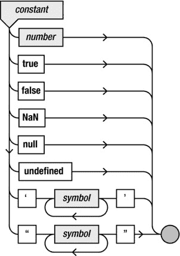
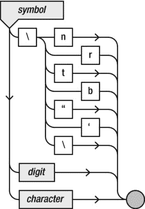

第十二章

完成画家游戏

在本章中，您将通过添加一些额外的功能(如动作效果、声音和音乐)以及维护和显示分数来完成画师游戏。最后，您将更详细地了解字符和字符串。

添加运动效果

为了使游戏更具视觉吸引力，您可以在颜料罐的移动中引入漂亮的旋转效果，以模拟风和摩擦对下落运动的影响。属于本章的 Painter10 程序是游戏的最终版本，在易拉罐中添加了这种运动效果。添加这样的效果并不复杂。由于您在上一章所做的工作，只需要在`PaintCan`类的`update`方法中添加一行代码。因为`PaintCan`是`ThreeColorGameObject`的子类，它已经有了一个`rotation`成员变量，在屏幕上绘制 sprite 时会自动考虑到这个变量！

为了达到运动效果，你使用了`Math.sin`的方法。通过让该值依赖于罐的当前位置，可以根据该位置得到不同的值。然后使用这个值在精灵上应用一个*旋转*。这是您添加到`PaintCan.update`方法中的代码行:

```js
this.rotation = Math.sin(this.position.y / 50) * 0.05;

```

该指令使用颜料罐位置的 y 坐标来获得不同的旋转值。此外，你把它除以 50，得到一个很好的慢速运动；将结果乘以 0.05，以降低正弦的幅度，使旋转看起来更真实。如果您愿意，可以尝试不同的值，看看它们如何影响颜料罐的行为。

创建精灵

即使你不是艺术家，自己制作简单的精灵也会有所帮助。它能让你快速制作出游戏的原型——也许会发现你内心也有一个艺术家。要创建精灵，你首先需要好的工具。大多数艺术家使用像 Adobe Photoshop 这样的绘画程序或像 Adobe Illustrator 这样的矢量绘图程序，但其他人使用像 Microsoft Paint 或更广泛和免费的 GIMP 这样的简单工具。每个工具都需要练习。浏览一些教程，并确保对许多不同的特性有所了解。通常，你想要的东西可以用一种简单的方式实现。

最好是，为你的游戏对象创建非常大的图像，然后将它们缩小到所需的尺寸。这样做的好处是，你可以在以后的游戏中更改所需的尺寸，并且可以消除由于图像由像素表示而产生的锯齿效应。缩放图像时，抗锯齿技术会混合颜色，使图像保持平滑。如果您保持图像中游戏对象的外部透明，那么，当您缩放时，边界像素将自动变为部分透明。只有当你想创建经典的像素样式时，你才应该按照实际需要的大小来创建精灵。

最后，在网上四处看看。有很多精灵可以免费使用。确保检查许可条款，这样你使用的精灵包对于你正在构建的东西是合法的。然后你可以把它们作为你自己精灵的基础。但是最后，要意识到当你和一个有经验的艺术家一起工作时，你的游戏质量会显著提高。

添加声音和音乐

另一种让游戏更有趣的方法是添加一些声音。这个游戏同时使用了背景音乐和音效。为了使 JavaScript 中的声音处理变得更简单，您添加了一个`Sound`类，允许您回放和循环声音。下面是该类的构造函数:

```js
function Sound(sound, looping) {
    this.looping = typeof looping !== 'undefined' ? looping : false;
    this.snd = new Audio();
    if (this.snd.canPlayType("audio/ogg")) {
        this.snd.src = sound + ".ogg";
    } else if (this.snd.canPlayType("audio/mpeg")) {
        this.snd.src = sound + ".mp3";
    } else // we cannot play audio in this browser
        this.snd = null;
}

```

因为不是所有的浏览器都能够播放所有不同类型的音乐，所以您添加了一个`if`指令，根据浏览器可以播放的类型来加载不同的声音类型。类似于创建`Image`对象(用于表示精灵)，您创建一个`Audio`对象，并将其源初始化为需要加载的声音文件。除了声音文件之外，您还添加了一个`looping`变量来指示声音是否应该循环。一般来说，背景音乐要循环播放；声音效果(如发射彩球)不应该。

除了构造函数之外，还要添加一个名为`play`的方法。在这个方法中，加载声音，并将名为`autoplay`的属性设置为 true。这样做的结果是，声音将在加载后立即开始播放。如果声音不需要循环，就完成了，可以从方法返回。如果您确实需要循环播放声音，您需要在声音播放完毕后重新加载并再次播放声音。`Audio`类型允许你给所谓的*事件*附加功能。当事件发生时，执行您附加的函数。例如音频已经开始播放的事件，或者音频已经结束播放的事件。

这本书很少使用事件和事件处理。但是，许多 JavaScript 概念依赖于它们。例如，键盘按键和鼠标动作都会产生你应该在游戏中处理的事件。在这种情况下，您希望在音频播放完毕后执行一项功能。下面是完整的`play`方法:

```js
Sound.prototype.play = function () {
    if (this.snd === null)
        return;
    this.snd.load();
    this.snd.autoplay = true;
    if (!this.looping)
        return;
    this.snd.addEventListener('ended', function () {
        this.load();
        this.autoplay = true;
    }, false);
};

```

最后，添加一个属性来更改正在播放的声音的音量。这特别有用，因为通常你希望音效比背景音乐更响亮。在一些游戏中，这些音量可以被玩家改变(在本书的后面，你会看到如何去做)。每当你在游戏中引入声音时，确保总是提供音量或者至少静音控制。没有静音功能的游戏将会遭到用户通过评论的愤怒！下面是`volume`属性，很简单:

```js
Object.defineProperty(Sound.prototype, "volume",
    {
        get: function () {
            return this.snd.volume;
        },
        set: function (value) {
            this.snd.volume = value;
        }
    });

```

在`Painter.js`(加载所有资源的文件)中，你加载声音并将它们存储在一个变量中，就像你对精灵所做的那样:

```js
var sounds = {};

```

下面是如何使用刚刚创建的`Sound`类加载相关的声音:

```js
var loadSound = function (sound, looping) {
    return new Sound("../../assets/Painter/sounds/" + sound, looping);
};

sounds.music = loadSound("snd_music");
sounds.collect_points = loadSound("snd_collect_points");
sounds.shoot_paint = loadSound("snd_shoot_paint");

```

现在在游戏过程中播放声音非常容易。例如，当游戏初始化时，您开始以低音量播放背景音乐，如下所示:

```js

sounds.music.volume = 0.3;
sounds.music.play();

```

你也想玩音效。比如球员投篮，他们就想听到！所以，当他们开始投篮时，你播放这个音效。这在`Ball`类的`handleInput`方法中处理:

```js
Ball.prototype.handleInput = function (delta) {
    if (Mouse.leftPressed && !this.shooting) {
        this.shooting = true;
        this.velocity = Mouse.position.subtract(this.position)
            .multiplyWith(1.2);
        sounds.shoot_paint.play();
    }
};

```

同样，当正确颜色的颜料罐从屏幕上掉落时，您也可以播放声音。

保持分数

分数往往是激励玩家继续玩下去的非常有效的方法。*高分*在这方面特别有效，因为它们给游戏引入了竞争因素:你想比 AAA 或 XYZ 更好(许多早期街机游戏只允许高分列表中的每个名字有三个字符，导致名字非常有想象力)。高分是如此激励人心，以至于第三方系统的存在将它们纳入游戏。这些系统让用户与世界上成千上万的其他玩家进行比较。在画师游戏中，保持简单，在存储当前分数的`PainterGameWorld`类中添加一个成员变量`score`:

```js
function PainterGameWorld() {
    this.cannon = new Cannon();
    this.ball = new Ball();
    this.can1 = new PaintCan(450, Color.red);
    this.can2 = new PaintCan(575, Color.green);
    this.can3 = new PaintCan(700, Color.blue);
    this.score = 0;
    this.lives = 5;
}

```

玩家从零分开始。每次油漆罐落在屏幕外，分数就会更新。如果有一罐颜色正确的罐子从屏幕上掉了下来，就加 10 分。如果罐子不是正确的颜色，玩家失去一条生命。

分数是一场比赛所谓的经济的一部分。游戏的经济基本上描述了游戏中不同的成本和优点，以及它们如何相互作用。当你制作自己的游戏时，考虑它的经济性总是有用的。东西有什么成本，作为玩家执行不同的动作有什么收获？这两件事是相互平衡的吗？

您在`PaintCan`类中更新分数，在这里您可以检查罐子是否落在屏幕之外。如果是这样，你检查它是否有正确的颜色，并相应地更新分数和玩家生存的数量。然后您将`PaintCan`对象移动到顶部，以便它可以再次落下:

```js
if (Game.gameWorld.isOutsideWorld(this.position)) {
    if (this.color === this.targetColor) {
        Game.gameWorld.score += 10;
        sounds.collect_points.play();
    }
    else
        Game.gameWorld.lives -= 1;
    this.moveToTop();
}

```

最后，每当一个颜色正确的罐子从屏幕上掉下来，你就播放一个声音。

更完整的 Canvas2D 类

除了在屏幕上画精灵，你还想在屏幕上画当前的分数(否则维护它就没多大意义了)。到目前为止，您只在画布上绘制了图像。HTML5 canvas 元素还允许在其上绘制文本。为了绘制文本，您扩展了`Canvas2D_Singleton`类。

当您修改 canvas drawing 类时，您还想做些别的事情。既然您已经将所有变量组织到对象中，这些对象可以使用类来创建，可以从其他类继承，现在是考虑应该在哪里更改哪些信息的好时机。例如，您可能只想更改`Canvas2D_Singleton`类中的`canvas`和`canvasContext`变量。例如，您不需要在`Cannon`类中访问这些变量。在`Cannon`类中，您只想使用通过 canvas drawing 类中的方法提供的高级行为。

不幸的是，JavaScript 没有办法直接控制对变量的访问。一个邪恶的程序员可以在他们程序的某个地方写下下面一行代码:

```js
Canvas2D.canvas = null;

```

执行完这行代码，屏幕上什么也画不出来！当然，没有一个正常的程序员会故意写这样的东西，但是让你的类的用户尽可能清楚他们应该改变什么数据，什么数据是类内部的，不应该被修改，这是一个好主意。一种方法是在任何内部变量的名字上加一些东西。这本书给所有的内部变量加上了下划线，这些变量不应该在它们所属的类之外被改变。例如，下面是遵循此规则的`Canvas2D_Singleton`类的修改后的构造函数:

```js
function Canvas2D_Singleton() {
    this._canvas = null;
    this._canvasContext = null;
}

```

您还向该类添加了一个新方法`drawText`，该方法可用于在屏幕上的特定位置绘制文本。`drawText`方法与`drawImage`方法非常相似。在这两种情况下，您都使用 canvas 上下文在绘制文本之前执行转换。这允许您在画布上的任意位置绘制文本。此外，您可以更改文本的颜色和文本对齐方式(左对齐、居中或右对齐)。查看属于本章的 Painter10 示例，以了解该方法的主体。

现在使用这种方法在屏幕上绘制文本很容易。例如，这会在屏幕的左上角绘制一些绿色文本:

```js
Canvas2D.drawText("Hello, how are you doing?", Vector2.zero, Color.green);

```

字符和字符串

在包括 JavaScript 在内的大多数编程语言中，一个字符序列被称为*字符串*。就像数字或布尔值一样，字符串是 JavaScript 中的基本类型。字符串也是*不可变的*。这意味着字符串一旦创建，就不能更改。当然，仍然有可能*用另一根弦替换*这根弦。例如:

```js
var name = "Patrick";
name = "Arjan";

```

在 JavaScript 中，字符串由单引号或双引号字符分隔。如果字符串以双引号开始，它应该以双引号结束。所以，这是不允许的:

```js
var country = 'The Netherlands";

```

当你将一个字符串赋给一个变量时，这个字符串被称为*常量*。除了字符串值，常量值还可以是数字、布尔值、`undefined`或`null`，如[图 12-1](#Fig1) 中的语法图所示。



[图 12-1](#_Fig1) 。常量值的语法图

使用单引号和双引号

当使用字符串值并将它们与其他变量组合时，您必须小心使用哪种类型的引号(如果有的话)。如果您忘记了引号，您就不再是在编写文本或字符，而是 JavaScript 程序的一部分！有很大的区别

*   字符串`"hello"`和变量名`hello`
*   字符串`'123'`和值`123`
*   字符串值`'+'`和运算符`+`

特殊字符

特殊字符，仅仅因为它们是*特殊的*，并不总是容易用引号之间的单个字符来表示。因此，一些特殊的符号有特殊的符号使用反斜杠符号，如下:

*   `'\n'`为行尾符号
*   `'\t'`为制表符号

这就引入了一个新问题:如何表示反斜杠字符本身。反斜杠字符用*双反斜杠*表示。以类似的方式，反斜杠符号用于表示单引号和双引号本身的字符:

*   `'\\'`为反斜杠符号
*   `'\''`或`"'"`为单引号字符
*   `"\""`或`'"'`为双引号字符

如您所见，您可以在由双引号分隔的字符串中使用不带反斜杠的单引号，反之亦然。图 12-2 中给出了表示所有这些符号的语法图。



[图 12-2](#_Fig2) 。符号语法图

字符串操作

在 Painter 游戏中，您将字符串值与`drawText`方法结合使用，在屏幕上的某个地方以所需的字体绘制某种颜色的文本。在这种情况下，你需要在屏幕的左上角写下当前的分数。分数保存在一个名为`score`的成员变量中。该变量在`PaintCan`的`update`方法中增加或减少。鉴于文本的一部分(乐谱)一直在变化，你如何构建应该打印在屏幕上的文本？这个解决方案叫做*字符串串联*，意思是一段接一段的粘贴文本。在 JavaScript(以及许多其他编程语言)中，这是使用加号来完成的。例如，表达式`"Hi, my name is " + "Arjan"`产生字符串`"Hi, my name is Arjan"`。在本例中，您连接了两段文本。也可以将一段文本和一个数字连接起来。例如，表达式`"Score: " + 200`产生字符串`"Score: 200"`。你可以用一个变量来代替常量。因此，如果变量`score`包含值 175，那么表达式`"Score: " + score`的计算结果为`"Score: 175"`。通过编写这个表达式作为`drawText`方法的参数，您总是在屏幕上绘制当前的分数。对`drawText`方法的最后一次调用变成了

```js
Canvas2D.drawText("Score: " + this.score, new Vector2(20, 22), Color.white);

```

注意:连接只有在处理文本时才有意义。例如，不可能“连接”两个数字:表达式`1 + 2`的结果是`3`，而不是`12`。当然，您可以将表示为文本的数字*:`"1" + "2"`连接成`"12"`。通过使用单引号或双引号来区分文本和数字。*

其实在表情`"Score: " + 200`里偷偷做的就是一个*型转换*或者*投*。在连接到另一个字符串之前，数值`200`被自动转换为字符串`"200"`。

如果你想把一个字符串值转换成一个数值，事情会变得有点复杂。对于解释器来说，这不是一个容易执行的操作，因为不是所有的字符串都可以转换成数值。为此，JavaScript 有一些有用的内置函数。例如，这是将字符串转换为整数的方法:

```js
var x = parseInt("10");

```

如果作为参数传递的字符串不是整数，则`parseInt`函数的结果是该数字的整数部分:

```js
var y = parseInt("3.14"); // y will contain the value 3

```

为了解析带小数的数字，JavaScript 有`parseFloat`函数:

```js
y = parseFloat("3.14"); // y will contain the value 3.14

```

如果字符串不包含有效的数字，那么尝试使用这两个函数之一解析它的结果是常数`NaN`(不是数字；另见图 12-1。

最后几句话

祝贺您，您已经完成了您的第一个游戏！[图 12-3](#Fig3) 包含了最终比赛的截图。在开发这个游戏的过程中，你学到了很多重要的概念。在下一个游戏中，你将继续你已经完成的工作。同时，别忘了玩游戏！你会注意到几分钟后变得非常困难，因为油漆罐下降的速度越来越快。


[图 12-3](#_Fig3) 。画师最终版本截图

谁玩游戏？

你可能认为游戏主要是年轻男性玩的，但这完全不是事实。很大一部分人玩游戏。2013 年，美国有 1.83 亿活跃游戏玩家，超过总人口的一半(包括婴儿)。他们在许多不同的设备上玩游戏。36%的人在智能手机上玩游戏，25%的人在无线设备上玩游戏(资料来源:娱乐软件协会(ESA)，2013 年)。

如果你开发一款游戏，你最好先想想你想要它的受众。小孩子的游戏不同于中年妇女的游戏。游戏应该有不同种类的游戏，不同的视觉风格和不同的目标。

虽然主机游戏往往发生在大型 3D 世界，但网站和移动设备上的休闲游戏通常是 2D，并且大小有限。此外，主机游戏被设计成可以(并且需要)玩几个小时，而休闲游戏通常被设计成只玩几分钟。也有许多类型的*严肃游戏*，这是用来训练专业人员的游戏，如消防员、市长和医生。

意识到你喜欢的游戏不一定是你的目标受众喜欢的游戏。

你学到了什么

在本章中，您学习了:

*   如何在游戏中加入音乐和音效
*   如何维护和显示分数
*   如何使用字符串来表示和处理文本