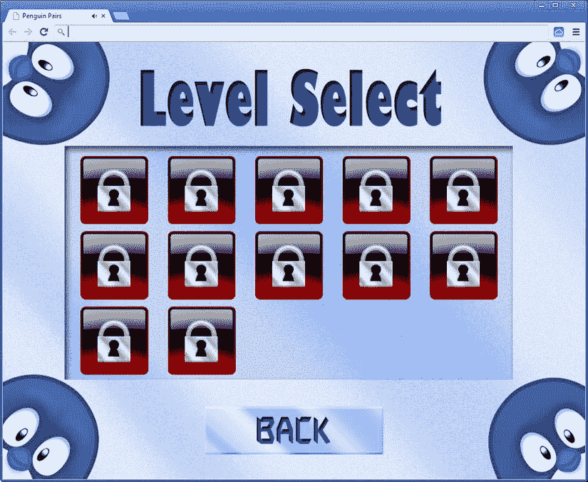
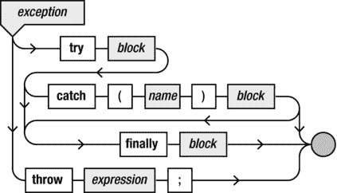

# 二十、游戏状态管理

通常情况下，当一个游戏应用启动时，你不会立即开始玩。例如，在 Jewel Jam 游戏中，您会在玩之前看到一个标题屏幕。更复杂的游戏有选项菜单，选择不同级别的菜单，完成一个级别后显示高分的屏幕，选择不同角色和属性的菜单，等等。在 Jewel Jam 中，添加标题屏幕并不困难，因为标题屏幕本身几乎没有交互。然而，当你看上一章的例子时，你会发现用一些选项和控件构建一个屏幕会产生大量的代码。你可以想象，当你给游戏添加更多的菜单和屏幕时，管理哪些对象属于哪个屏幕以及何时应该绘制或更新它们将是一件痛苦的事情。

通常，这些不同的菜单和屏幕被称为*游戏状态*。在一些节目中，他们被称为*场景*，负责管理场景的对象是*导演*。有时，在游戏*模式*和游戏*状态*之间存在区别。在这种情况下，像菜单、主游戏屏幕等等是游戏模式*而“关卡完成”和“游戏结束”是游戏状态*和*。*

这本书遵循一个简化的范例，把所有的事情都叫做*游戏状态*。为了处理这些不同的游戏状态，你需要一个*管理器*。在本章中，您将开发这种结构所需的主要类，并了解如何使用它来显示不同的菜单并在它们之间切换，同时保持代码的清晰分离。

管理游戏状态的基础

当您想要正确处理游戏状态时，您需要确保以下几点:

*   游戏状态应该完全独立运行。换句话说，当你在玩游戏的时候，你不想处理选项菜单屏幕或者“游戏结束”屏幕。
*   应该有一个简单的方法来定义游戏状态，找到游戏状态，并在它们之间切换。这样，当玩家按下标题屏幕中的选项按钮时，您可以轻松切换到选项菜单状态。

在你到目前为止看到的例子中，总是有某种游戏世界类；它被称为`PainterGameWorld`、`JewelJamGameWorld`或`PenguinPairsGameWorld`，这取决于你正在构建的游戏。从游戏状态的角度来看，每个世界代表一个游戏状态。您需要为每个不同的状态定义这样一个类。好的一面是，您已经有了很多代码来帮助您做到这一点。`GameObjectList`类特别有用，因为它表示游戏对象的列表，这是表示游戏状态的充分基础。在之前的游戏中，代表游戏世界的类继承自`GameObjectList`类。在本书剩余的例子中，代表*游戏状态*的类也将从`GameObjectList`继承。因此，如果你有一个选项菜单，一个标题屏幕，一个级别选择屏幕，和一个帮助菜单，你为每一个游戏状态创建一个单独的类。您唯一需要提供的是一种管理游戏中各种游戏状态的方法。你可以通过创建一个*游戏状态管理器*来做到这一点。

游戏状态管理器

在本节中，您将创建一个名为`GameStateManager`的类。因为在一个游戏中应该只有一个游戏状态管理器，所以你遵循*单例设计模式* ，其中类被称为`GameStateManager_Singleton`，你将(单个)实例存储在一个全局变量`GameStateManager`中，就像你对`Canvas2D`和`Game`这样的类所做的那样:

```js
var GameStateManager = new GameStateManager_Singleton();

```

您以这样的方式设置这个类，它允许您存储不同的游戏状态(即不同的`GameObjectList`实例)，您可以选择当前的游戏状态，然后管理器自动调用当前活动游戏状态的游戏循环方法。

为了存储不同的游戏状态，你需要一个数组。您还可以定义一个附加变量来跟踪当前活动的游戏状态。因此，这是游戏状态管理器的构造函数:

```js
function GameStateManager_Singleton() {
    this._gameStates = [];
    this._currentGameState = null;
}

```

现在您需要定义一个方法，将游戏状态添加到数组中。在该方法中，使用`push`将一个元素添加到数组的末尾。您还将当前活动的游戏状态设置为刚刚添加的状态。下面是完整的`add`方法:

```js
GameStateManager_Singleton.prototype.add = function (gamestate) {
    this._gameStates.push(gamestate);
    this._currentGameState = gamestate;
    return this._gameStates.length - 1;
};

```

正如您在查看方法中的最后一条指令时所看到的，您返回了数组中游戏状态的索引。您这样做是因为稍后它将为您提供一个简单的方法来找到您添加的游戏状态。您将这个索引作为标识符值存储在`ID`变量中。例如，添加标题菜单状态并在添加后存储其 ID 可以在一行代码中完成，如下所示:

```js
ID.game_state_title = GameStateManager.add(new TitleMenuState());

```

因为游戏状态标识符正好对应于数组中游戏状态的索引，所以您可以编写一个非常简单的`get`方法来检索游戏状态，给定一个 ID:

```js
GameStateManager_Singleton.prototype.get = function (id) {
    if (id < 0 || id >=this._gameStates.length)
        return null;
    else
        return this._gameStates[id];
};

```

切换到另一个游戏状态也很简单。这是通过调用`switchTo`方法来完成的:

```js
GameStateManager_Singleton.prototype.switchTo = function (id) {
    this._currentGameState = this.get(id);
};

```

处理不同的游戏循环方法非常简单。你必须在当前活跃的游戏状态下调用它们。例如，`GameStateManager`的`handleInput`方法如下:

```js
GameStateManager_Singleton.prototype.handleInput = function (delta) {
    if (this._currentGameState !== null)
        this._currentGameState.handleInput(delta);
};

```

对于其他游戏循环方法，您可以遵循类似的过程。为了使游戏状态管理器成为游戏不可或缺的一部分，您在`Game.mainLoop`方法中调用它的游戏循环方法:

```js
Game_Singleton.prototype.mainLoop = function () {
    var delta = 1 / 60;
    GameStateManager.handleInput(delta);
    GameStateManager.update(delta);
    Canvas2D.clear();
    GameStateManager.draw();

    Keyboard.reset();
    Mouse.reset();
    Touch.reset();

    requestAnimationFrame(Game.mainLoop);
};

```

添加状态并在它们之间切换

现在你有了游戏状态管理器，你可以开始添加不同的状态了。一个非常基本的游戏状态是标题菜单状态。在`PenguinPairs3`示例中，您向应用中添加了一个表示该状态的类`TitleMenuState`。因为这个状态包含几个不同的游戏对象，所以让它从`GameObjectList`类继承。在这个类的构造函数中，您添加了这个状态所需的游戏对象:一个背景和三个按钮。你可以重用你之前为宝石果酱游戏开发的`Button`类。这里是`TitleMenuState`的构造器:

```js
function TitleMenuState(layer) {
    GameObjectList.call(this, layer);

    this.add(new SpriteGameObject(sprites.background_title,
        ID.layer_background));

    this.playButton = new Button(sprites.button_play, ID.layer_overlays);
    this.playButton.position = new Vector2(415, 540);
    this.add(this.playButton);

    this.optionsButton = new Button(sprites.button_options, ID.layer_overlays);
    this.optionsButton.position = new Vector2(415, 650);
    this.add(this.optionsButton);

    this.helpButton = new Button(sprites.button_help, ID.layer_overlays);
    this.helpButton.position = new Vector2(415, 760);
    this.add(this.helpButton);
}

```

因为您需要在按钮被按下时做一些事情，所以您必须覆盖`handleInput`方法。在该方法中，您检查每个按钮是否都被按下，如果是，则切换到另一个状态。例如，如果玩家按下玩游戏按钮，您需要切换到级别菜单:

```js
if (this.playButton.pressed)
    GameStateManager.switchTo(ID.game_state_levelselect);

```

您可以为其他两个按钮添加类似的替换选项。现在标题菜单状态基本完成了。在`PenguinPairs`类中，您唯一需要做的事情就是创建一个`TitleMenuState`的实例，并将其添加到游戏状态管理器中。你对游戏中的其他州做同样的事情。之后，您将当前状态设置为标题菜单，以便玩家在游戏开始时看到标题菜单:

```js
ID.game_state_title = GameStateManager.add(new TitleMenuState());
ID.game_state_help = GameStateManager.add(new HelpState());
ID.game_state_options = GameStateManager.add(new OptionsMenuState());
ID.game_state_levelselect = GameStateManager.add(new LevelMenuState());

// the current game state is the title screen
GameStateManager.switchTo(ID.game_state_title);

```

帮助和选项菜单状态的设置方式类似于`TitleMenuState`。在类构造函数中，您将您的游戏对象添加到游戏世界中，并覆盖`handleInput`方法以在状态之间切换。例如，帮助和选项菜单状态都包含返回标题屏幕的后退按钮:

```js
if (this.backButton.pressed)
    GameStateManager.switchTo(ID.game_state_title);

```

看看`PenguinPairs3`示例中的`HelpState`和`OptionsMenuState`类，了解不同的状态是如何设置的，以及如何在状态之间切换。

级别菜单状态

稍微复杂一点的游戏状态是关卡菜单。您希望玩家能够从关卡按钮的网格中选择一个关卡。您希望能够用这些关卡按钮显示三种不同的状态，因为一个关卡可以被锁定、解锁但尚未被玩家解决，或者已经解决。为了做到这一点，你需要某种跨游戏的持久存储，这将在下一章讨论。对于关卡按钮的每一种不同状态，你可以使用不同的精灵。因为你还不能玩当前版本的游戏，你只需显示每个关卡的“锁定”状态。

在创建`LevelMenuState`类之前，您需要添加一个继承自`GameObjectList`的名为`LevelButton`的类。在`LevelButton`类中，您跟踪两件事:按钮是否被按下，以及按钮引用的级别索引:

```js
function LevelButton(levelIndex, layer, id) {
    GameObjectList.call(this, layer, id);
    this.pressed = false;
    this.levelIndex = levelIndex;
    // to do: create the button sprites
}

```

因为按钮有三种不同的状态，所以要加载三个精灵，每种状态一个。如果玩家完成了一关，按钮上会显示一只彩色企鹅。因为有几只不同颜色的企鹅，所以通过根据级别索引改变工作表索引来选择彩色按钮:

```js
this._levelSolved = new SpriteGameObject(sprites.level_solved,
    ID.layer_overlays);
this._levelUnsolved = new SpriteGameObject(sprites.level_unsolved,
    ID.layer_overlays);
this._levelLocked = new SpriteGameObject(sprites.level_locked,
    ID.layer_overlays_2);
this.add(this._levelSolved);
this.add(this._levelUnsolved);
this.add(this._levelLocked);

this._levelSolved.sheetIndex = levelIndex;

```

最后，您添加一个绘制在企鹅腹部的文本标签，这样玩家就可以看到每个按钮所指的级别:

```js
var textLabel = new Label("Arial", "20px", ID.layer_overlays_1);
textLabel.text = levelIndex + 1;
textLabel.position = new Vector2(this._levelSolved.width - textLabel.width,
    this._levelSolved.height - textLabel.height + 50).divideBy(2);
textLabel.color = Color.black;
this.add(textLabel);

```

在`handleInput`、和方法中，你检查按钮是否被按下。在鼠标输入的情况下，鼠标位置应该在精灵的边界框内，并且玩家必须按下鼠标左键。如果你正在处理一个触摸界面，玩家的手指应该在屏幕上的按钮区域内按下。最后，玩家只能按下按钮，如果它是可见的。下面是完整的`handleInput`方法:

```js
LevelButton.prototype.handleInput = function (delta) {
    if (Touch.isTouchDevice)
        this.pressed = this.visible &&
            Touch.containsTouchPress(this._levelLocked.boundingBox);
    else
        this.pressed = this.visible && Mouse.left.pressed &&
            this._levelLocked.boundingBox.contains(Mouse.position);
};

```

如果你看一下`PenguinPairs3`例子中的`LevelButton`类，它还包括`width`和`height`属性，当你在屏幕上放置关卡按钮时，你需要用到它们。

现在您已经有了一个基本的`LevelButton`类，您可以在`LevelMenuState`类中添加关卡按钮。在这个例子中，您使用一条`for`指令向菜单添加了 12 个级别按钮。根据计数器变量(`i`)的值，计算按钮所属的行和列。这些信息，连同关卡按钮的宽度和高度，帮助你计算每个关卡按钮的最终位置:

```js
this.levelButtons = [];

for (var i = 0; i < 12; i += 1) {
    var row = Math.floor(i / 5);
    var column = i % 5;
    var level = new LevelButton(i, ID.layer_overlays);
    level.position = new Vector2(column * (level.width + 30) + 155,
        row * (level.height + 5) + 230);
    this.add(level);
    this.levelButtons.push(level);
}

```

因为稍后您必须检查每个按钮是否都被按下了，所以您不仅要将按钮添加到游戏状态，还要将每个按钮的引用存储在一个名为`levelButtons`的数组中。当你想确定玩家是否点击了某个关卡按钮时，这个数组就派上了用场。你用一个叫做`getSelectedLevel`的方法来检查这个。这个方法在`LevelMenuState`类中，遍历数组中的所有级别按钮，并返回属于第一个被按下的按钮的级别索引。如果玩家没有按任何按钮，该方法返回-1。下面是完整的方法:

```js
LevelMenuState.prototype.getSelectedLevel = function () {
    for (var i = 0, j = this.levelButtons.length; i < j; i += 1) {
        if (this.levelButtons[i].pressed)
            return this.levelButtons[i].levelIndex;
    }
    return -1;
};

```

然后，您可以在`handleInput`方法中使用该方法:

```js
LevelMenuState.prototype.handleInput = function (delta) {
    GameObjectList.prototype.handleInput.call(this, delta);

    var selectedLevel = this.getSelectedLevel();
    if (selectedLevel != -1) {
        // start playing the level
    }
    else if (this.back.pressed)
        GameStateManager.switchTo(ID.game_state_title);
};

```

正如你所看到的，给游戏添加不同的状态并在它们之间切换并不困难，只要你事先考虑软件的设计。通过预先考虑需要哪些类，以及游戏的功能应该如何在它们之间划分，你可以在以后节省很多时间。在下一章中，您将通过创建实际的级别来进一步扩展这个示例。[图 20-1](#Fig1) 显示了一级菜单状态的截图。T3】



[图 20-1](#_Fig1) 。企鹅配对中的等级菜单屏幕

处理错误

在你读完这一章之前，让我们再多谈一点关于处理 JavaScript 中的错误。特别是当游戏变得更复杂时，你需要考虑当错误发生时会发生什么。举一个具体的例子，在`GameStateManager`类的`get`方法中，只有当作为参数传递的标识符落在数组中的元素范围内时，才返回游戏状态:

```js
GameStateManager_Singleton.prototype.get = function (id) {
    if (id < 0 || id >=this._gameStates.length)
        return null;
    else
        return this._gameStates[id];
};

```

这样做是因为，否则，游戏状态管理器的用户可能会意外地访问其范围之外的数组。然而，您在这里使用的方法可能不是最健壮的方法。首先，当索引太大或太小时，返回`null`。这意味着使用该方法的代码需要知道该方法可能会返回`null`。结果，同样的代码必须在一个`if`指令中检查这一点，以确保你没有试图在一个`null`引用上调用一个方法。另一个问题是，你不能用这种方法避免所有的数组越界错误。例如:

```js
var oops = GameStateManager.get(3.4);

```

当然，数组只能用整数值访问，所以如果你不处理传递非整数，程序就会崩溃。这可以通过按如下方式访问阵列来避免:

```js
return this._gameStates[Math.floor(id)];

```

但这真的是你想要的吗？如果用户试图访问数组中的元素 3.4(它显然不存在)，您是否希望返回一个对象，即假设索引 3.4 处的对象存在？也许最好让用户知道这是不可能的，并停止该方法的执行。

还有其他一些例子说明了处理错误的正确方法。有时这些情况的发生并不是因为程序中的错误，而是因为发生了程序员无法控制的事情。例如，也许你的游戏玩家有一个很好的主意，在设置一个在线游戏时禁用网络适配器。或者，由于病毒在服务器上肆虐，一些您期望在那里的文件被破坏了。如果你依赖于其他公司开发的软件，一个新的版本可能会破坏你的代码，因为规范已经改变了。有几种方法可以处理这些类型的错误。一种方法是什么都不做，让程序崩溃。对于游戏开发者来说，这是一个廉价的解决方案(至少最初是这样)，但它并不能产生一个非常健壮、用户友好的游戏。您还可以维护一个错误代码列表。如果出现错误，该方法将返回这个错误代码，用户将需要筛选一个大文档，详细说明每个错误代码以及如何解决它。还有一种方法是根本不报告错误，并尝试在程序中解决它。尽管有时这是一个好的解决方案，但在许多情况下，您根本无法解决错误。例如，如果在大型多人在线游戏中网络连接突然中断，除了向玩家报告这一情况，你别无选择。

包括游戏在内的大多数应用都通过使用*异常*来处理错误。 异常是*被方法抛出*，方法的调用者要处理它。例如，看看下面的方法定义:

```js
GameStateManager_Singleton.prototype.get = function (id) {
    if (id < 0 || id >=this._gameStates.length)
        throw "game state id out of range";
    else if (Math.floor(id) !== id)
        throw "game state id should be an integer number";
    else
        return this._gameStates[id];
};

```

这段代码在实际访问数组之前处理各种情况。如果`id`超出范围或者不是整数(换句话说，数字的 floor 函数不返回数字本身)，该方法停止执行并抛出一个异常(在本例中是一个字符串值)。为了处理这个错误，你可以调用`try`-`catch`:-块中的`get`函数

```js
try {
    var myGameState = GameStateManager.get(someId);
    // do something with the game state
} catch (e) {
    console.log("Error: " + e);
}

```

如您所见，可能抛出异常的方法调用在`try`指令的主体中。如果有异常，程序继续在`catch`部分的主体中运行。如果没有异常，那么`catch`体不会被执行。

在`catch`部分，异常被捕获。在单词`catch`后面是一个包含被抛出对象的参数。在前面的例子中，`get`方法可以抛出一个包含错误信息的字符串。这不是做这件事的最好方法。更复杂的程序通常定义异常类的层次结构。此类的实例可以包含异常发生的时间和方法、该方法的参数值、自定义错误信息等信息。不同的类可以用来表示不同类型的错误。因为本书中的游戏很简单，所以它们不会以这种方式处理错误。但是考虑一下你想如何处理游戏中的错误是一个好主意，也许异常可以帮助你以更健壮的方式处理错误。

让我们回到`try`指令。您可以在该指令的正文中放置多条指令。但是一旦出现异常，执行就会停止，并且执行`catch`的主体。因此，`try`之后的剩余指令可以假设它们被执行时没有异常。

`try`和`catch`部分的主体需要在大括号之间，即使主体中只有一条指令。这有点不合逻辑，例如，`if`和`while`指令中可能会省略括号。

在`catch`部分之后，可以放置一个`finally`部分，无论是否捕获到某种异常，都会执行这个部分。比如:

```js
try {
    openServerConnection(ipAddress);
    // communicate with the server
    ...
}
catch (e) {
    console.log("Error while communicating with the server: " + e);
finally {
   // always close the server connection
   closeServerConnection();
}

```

在这个例子中，`finally`部分避免了复制代码。不管在与服务器通信时是否有错误，您都需要在完成后关闭连接。

总之，[图 20-2](#Fig2) 显示了异常相关表达式的语法图。试着想出迄今为止你在游戏中见过的其他例子，在这些例子中，异常可能是有用的。



[图 20-2](#_Fig2) 。异常相关表达式的语法图

你学到了什么

在本章中，您学习了:

*   如何使用游戏状态管理器定义不同的游戏状态
*   如何根据玩家的动作在游戏状态之间切换
*   如何利用异常正确处理游戏中的错误