# 一、设置您的环境

正确设置您的环境将为您提供构建定制解决方案所需的所有工具。您需要的许多东西已经内置到 SharePoint 中，并且随时可以使用。然而，你也会想下载和安装一些额外的工具，让你的生活更轻松。这些工具包括:

*   SharePoint Online 开发人员网站
*   SharePoint 设计器
*   免费版
*   各种浏览器和开发工具
*   框架
*   在您的 SharePoint 环境中实现 jQuery

如果这个列表看起来令人生畏，不要担心。在本章中，我们将详细探究每一个项目，让您熟悉它们以及它们的用途。此外，我们还将了解如何创建您自己的 SharePoint Online 环境来用作开发区域，并向您展示如何在该环境中实现 jQuery。

如果您已经在开发 SharePoint 解决方案，甚至只是在进行 web 开发，那么您很可能已经安装了这些解决方案。本章将更多地面向商业用户或那些刚接触前端开发的人。因此，如果你是一个经验丰富的开发人员，你可以浏览这一章，以确保你有你需要的一切。无论您是谁，在本章结束时，您都将做好充分准备，开始在 SharePoint 中构建自定义解决方案的旅程！

## SharePoint Online 开发人员网站

不言而喻，如果没有地方可以构建自定义 SharePoint 解决方案，那么构建自定义 SharePoint 解决方案是一项浪费的技能！你们中的一些人已经有了一个用于开发的环境。这可能是您的企业用于内部网的 SharePoint Online 环境，也可能是 SharePoint 2013 内部环境。可能是你第一次想学习 SharePoint 开发，却没有地方工作。在任何情况下，您都有很多选择，我们将在这里探讨这些选择。

Note

本节探讨的选项将集中在 SharePoint Online 和 Office 365 上。如果您在内部安装了 SharePoint，您可以轻松地创建一个新的工作网站。即使您在工作中随手可得 SharePoint，您可能仍然希望在自己的环境中工作，以便此处的选项仍然适用。

微软使得在最新版本的 SharePoint 上开始前端开发变得非常容易。您可以通过以下网址注册 Office 365 开发人员网站: [`http://msdn.microsoft.com/en-us/library/office/fp179924(v=office.15).aspx`](http://msdn.microsoft.com/en-us/library/office/fp179924(v=office.15).aspx) 。图 [1-1](#Fig1) 显示了注册的页面和各种选项。

图 1-1。

Office 365 Developer Site sign-up options on the Microsoft site

如您所见，创建开发人员站点有三个选项:

*   MSDN 订阅者-如果你或你的公司订阅了 MSDN，你可以免费创建一个开发者网站。很多有专职开发人员的公司都有 MSDN 订阅，或者你自己也有一个。无论哪种情况，只需点击标题为“立即兑现您的权益”的链接即可开始。如果您是商业用户，也值得考虑这个选项。如果您的公司订阅了 MSDN，您可以申请许可，或者让 IT 部门的人为您创建网站并提供访问权限。
*   Office 365 订阅者-已经订阅了 e 3 或 E4 Office 365 计划的企业可以直接从 Office 365 管理中心提供开发人员站点。这些订阅级别允许开发人员使用特殊的网站模板创建新的私有网站集。要了解创建开发者网站的全部细节和步骤，请访问以下 URL: [`http://msdn.microsoft.com/en-us/library/office/jj692554(v=office.15).aspx`](http://msdn.microsoft.com/en-us/library/office/jj692554(v=office.15).aspx) 。
*   30 天试用或开发者订阅-如果你想或需要拥有自己的环境，微软还允许你对 Office 365 进行 30 天的试用。这是一个很好的选择，因为它为您提供了大量的时间来探索 Office 365 和 SharePoint Online，以及在完全属于您的环境中测试您的开发技能。您也可以随时以 99 美元的价格将试用升级为年度订阅。这是一个很好的选择，即使你的公司有 SharePoint。它为您提供了一个远离任何生产场所的完美区域，您可以在这里构建自己的定制解决方案。每年 99 美元，它提供了一个构建解决方案的低成本选项，可以轻松地迁移到生产环境中。

无论您的情况如何，您都可以轻松获得一个可以开发自定义 SharePoint 解决方案的环境。既然我们已经介绍了在哪里以及如何获得您的 SharePoint 环境，那么让我们来探索一下我们将在本书中使用的一些工具。

Note

本书中的所有示例和屏幕截图都来自 SharePoint Online 环境，这是 SharePoint 的最新版本。

## SharePoint 设计器

如果您过去使用过 SharePoint，那么您可能也使用过 SharePoint Designer。这是微软提供的免费工具，也是 SharePoint 的主要工具。它允许您执行广泛的任务—从品牌、连接到外部数据库、构建列表等等。老实说，对于这本书来说，Designer 并没有发挥很大的作用，但它将是帮助我们在 SharePoint 中实现 jQuery 的关键。这是本章的结尾。现在，让我们只下载设计师。

您可以从以下网址下载 SharePoint Designer:[`http://www.microsoft.com/en-us/download/details.aspx?id=35491`](http://www.microsoft.com/en-us/download/details.aspx?id=35491)。图 [1-2](#Fig2) 显示了微软下载中心网站的页面，您可以在这里下载 Designer。

图 1-2。

SharePoint Designer download page on the Microsoft site

现在，您可以简单地下载并安装 Designer 我们以后会用到它。尽管我们在本书中没有深入探讨 Designer，但您会发现它是使用 SharePoint 时的一个有用工具。正如我之前所说的，它具有广泛的功能，可以帮助你完成许多任务。Designer 适用于 SharePoint Online 和内部环境。

## 免费版

如果您不是开发人员，那么您可能没有听说过 Visual Studio Express 如果你有，它可能看起来像一个代码骑师压倒性的计划。在某种程度上，它是，但它是一个强大的工具，我们将使用它来编写我们的 HTML 和 JavaScript。它也是免费的，由微软提供。

Visual Studio 是一个集成开发环境，简称 IDE。这是“允许你写代码的程序”的一种奇特说法对于这本书，我们所有的例子都是 HTML 和 JavaScript。HTML 和 JavaScript 的一个优点是它们只是带有特殊扩展名的文本文件:`.html`和`.js`。为此，创建和编辑这些文件真正需要的是记事本。然而，尽管 Notepad 看起来友好且不起眼，但在编写代码时，它绝不是你的朋友。Visual Studio Express 提供了您需要的所有工具，甚至会在检测到问题时通知您。记事本做不到！

Visual Studio 有许多不同的版本，这取决于您的技术需求。速成版是一个功能齐全的版本，将超过这本书的需要。您可以从以下网址下载 Visual Studio Express:[`http://www.visualstudio.com/en-us/products/visual-studio-express-vs.aspx`](http://www.visualstudio.com/en-us/products/visual-studio-express-vs.aspx)。图 [1-3](#Fig3) 显示了 Visual Studio 站点的下载页面。

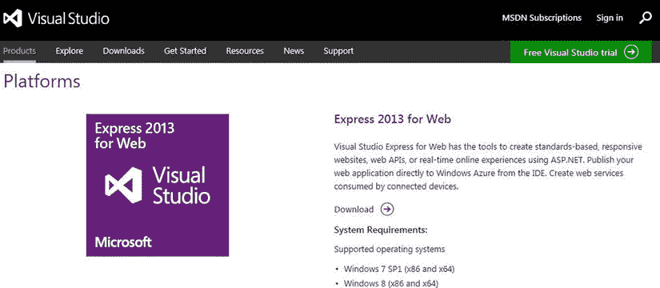

图 1-3。

Visual Studio Express download page on the Microsoft site

Visual Studio 速成版有多个版本，包括 Web 版、Windows 版等等。Express for Web 是使用 HTML 和 JavaScript 构建解决方案的完美版本。

## 浏览器和开发工具

当作为最终用户使用 SharePoint 时，最明显的浏览器选择是 Internet Explorer。虽然 SharePoint 与其他浏览器(如 Firefox 和 Chrome)配合得很好，但 Internet Explorer 显然是微软推荐的浏览器，也是 SharePoint 最有可能与之友好相处的浏览器。也就是说，这本书是关于使用 HTML 和 JavaScript 构建定制解决方案的，你会发现大多数现代浏览器的行为和表现都是一样的。在讨论浏览器之前，我们先来讨论一下开发者工具。

开发者工具是一个通用术语，意思是用来帮助开发、调试和了解浏览器中的 HTML、JavaScript 和 CSS 的工具。这些工具也可以被称为开发者工具栏、浏览器工具，或者可以用一个完全不同的名字，比如 Firebug。不管是什么工具，它们都执行相同的功能，即帮助您开发解决方案。在几乎所有的浏览器中，你需要做的就是按下键盘上的 F12 键来启动开发者工具，如 Internet Explorer 中的图 [1-4](#Fig4) 所示。

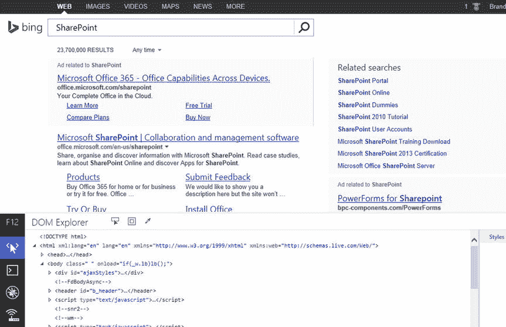

图 1-4。

Developer tools launched in Internet Explorer after hitting F12

正如您在图 [1-4](#Fig4) 中看到的，这些工具提供了对浏览器中正在发生的事情的深入了解。您可以立即看到生成页面的 HTML，以及已经应用的任何 CSS 样式。使用工具左侧的菜单，您还可以查看页面上加载了哪些 JavaScripts，甚至可以查看其中的代码。您可以更进一步，在 JavaScript 中设置“断点”来暂停它的执行，这样您就可以看到这些脚本运行时发生了什么。在您的前端开发工作中，这是一个非常有价值的工具，并且会经常使用。

图 [1-5](#Fig5) 显示了 Google Chrome 中打开的开发者工具。同样，只需按 F12 即可打开工具。与 Internet Explorer 一样，您可以立即看到应用于页面的 HTML 和样式。

图 1-5。

Developer tools launched in Google Chrome after hitting F12

在 Chrome 中，菜单选项在工具屏幕的顶部运行，并提供类似的功能。您可以像打开开发人员工具一样，通过按 F12 来关闭它们。你应该下载几个浏览器，感受一下它们的工具。每个开发人员都有自己对浏览器和工具的偏好；我的是 Firefox 和 Firebug，我们将在本书中使用它们。

我要公开声明，我认为 Internet Explorer 是一个非常棒的浏览器，至少最新版本是这样。这些年来，它已经走过了一段漫长的路，终于可以和这个街区的一些新人比肩了。Internet Explorer 中的开发工具非常好，但我更喜欢在 Firefox 中使用 Firebug。Firebug 是 Firefox 中的一个插件，它的表现就像其他浏览器中的工具一样，但在我看来，它以一种更友好的方式组织内容，并且更容易使用。你一定要找到你的偏好，并使用最适合你的浏览器/工具。本书中的所有示例都将使用 Firebug，但您并不局限于这些工具。

要安装 Firebug，请从以下网址下载 Firefox 浏览器: [`https://www.mozilla.org/firefox/`](https://www.mozilla.org/firefox/) 。安装完成后，单击右上角的菜单图标。图 [1-6](#Fig6) 显示菜单打开，附加选项高亮显示。

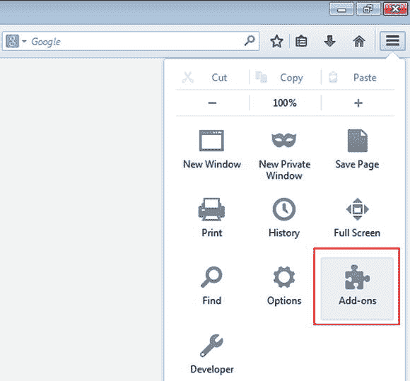

图 1-6。

The Add-ons menu option in the Firefox menu

单击附加组件选项将在新选项卡中打开附加组件管理器页面。此页面允许您管理所有加载项并搜索新的加载项。在屏幕右上角的搜索框中键入 firebug，然后单击放大镜图标。图 [1-7](#Fig7) 显示输入后的搜索框。

图 1-7。

Search box on the Add-ons Manager page before searching

搜索结果会返回与您的请求相匹配的任何附加组件，Firebug 应该位于列表的顶部。点击图 [1-8](#Fig8) 所示的安装按钮，将 Firebug 添加到 Firefox 中。

图 1-8。

Clicking the Install button will install Firebug in Firefox

一旦下载和安装完成，Firefox 就会在右上角的菜单旁边显示一个“bug”图标。图 [1-9](#Fig9) 突出显示了 Firebug 图标。

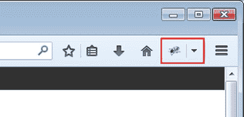

图 1-9。

Firebug icon is present once the installation is complete

现在已经安装了 Firebug，您可以像在其他浏览器中打开开发人员工具一样打开它——通过按键盘上的 F12 键。你也可以点击 Firebug 图标打开它，如图 [1-10](#Fig10) 所示。

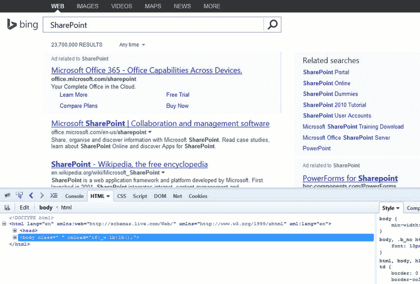

图 1-10。

Firebug toggled open by clicking F12

正如你在图 [1-10](#Fig10) 中看到的，Firebug 的外观和行为与其他浏览器中的开发工具非常相似。同样，您最终决定使用哪些工具是您的个人偏好。本书中的所有例子都将使用 Firefox 和 Firebug。

## 框架

如果你过去做过 JavaScript 工作，你可能会不时地感到有点沮丧。JavaScript 是前端开发的一个很好的框架。它很快，你可以用它立刻构建有用的代码。但是它可能很难使用，有时很难调试，而且对新手来说似乎很吓人。jQuery 的出现改变了这一切。

jQuery 是一个框架，它与 JavaScript 一起工作，使编写前端代码更加容易和快速。jQuery 标榜自己是“写得更少，做得更多”的框架——你会发现事实就是如此。它很快成为了 JavaScript 开发的标准，本书中的很多例子都会以某种方式利用 jQuery。如果您以前从未使用过它，不要担心:我们会慢慢开始，让您快速上手。

Note

如果您是 jQuery 新手，jQuery 网站上有一个很棒的“入门”指南，网址是 [`http://learn.jquery.com/about-jquery/how-jquery-works/`](http://learn.jquery.com/about-jquery/how-jquery-works/) 。还有 Jack Franklin 的 Beginning jQuery(a press，2013)，对于那些刚刚入门的人来说是一个很好的资源(参见 [`www.apress.com/9781430249320`](http://www.apress.com/9781430249320) )。

现在，让我们做一个快速的 jQuery 练习，让您熟悉它是如何工作的。jQuery 的一个主要优点是能够轻松地选择页面上的 HTML 元素。实现这一点的两种主要方法是使用元素的 ID 或它的 CSS 类。图 [1-11](#Fig11) 显示了 Firefox 中打开 Firebug 的 jQuery 主页( [`jquery.com`](http://jquery.com) )。我们将在这个练习中使用 jQuery 的站点，因为他们肯定已经加载了它！

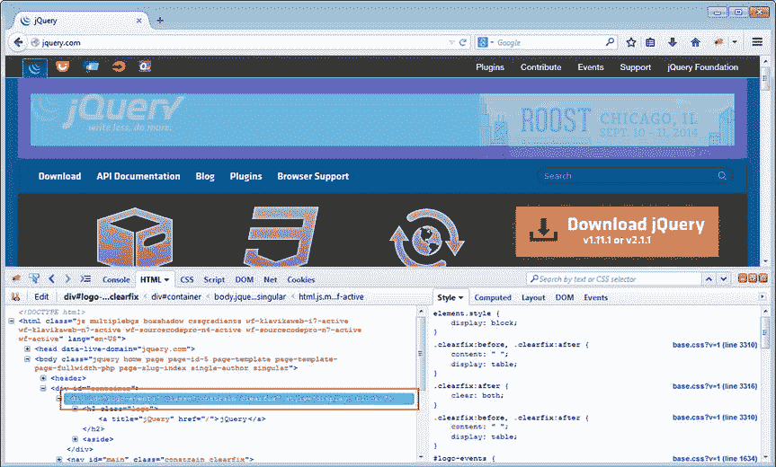

图 1-11。

The jQuery home page in Firefox with Firebug open. Hovering over an HTML section with the mouse will highlight it on the page

我们已经在 Firebug 中展开了 HTML，并在页面的左上方找到了徽标。当你将鼠标悬停在 HTML 上时，Firebug 会高亮显示浏览器中的部分，这样你就可以很容易地看到它。在这个页面上，徽标位于 ID 为`"logo-events"`的 DIV 元素中。因为这个元素有一个 ID，所以可以很容易地用 jQuery 定位它。在 Firebug 中，点击标题为脚本的选项卡将其激活，如图 [1-12](#Fig12) 所示。

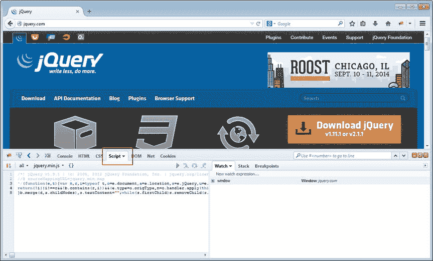

图 1-12。

Scripts tab activated in Firebug

在“脚本”选项卡中，您将在两个主要区域使用前端代码。左侧面板显示您正在检查的当前脚本。在它的上方有一个下拉菜单，在这里您可以看到并选择当前加载到这个页面上的所有 JavaScript 文件。稍后我们将更详细地探讨这一点。右边的面板有更多的标签，但主要的是手表标签。在该选项卡中，我们可以使用“新观察表达式”文本框在浏览器中运行按需 JavaScript 命令。这个区域在编写前端代码的时候会非常有用。

在“新观察表达式”文本框内单击，键入以下行，然后按 Enter 键:

`$("#logo-events")`

图 [1-13](#Fig13) 显示了运行这行代码的输出。

图 1-13。

Output of running the jQuery command in the Watch tab

如您所见，结果是一个对象，在括号内您可以看到`"div#logo-events"`，这意味着 jQuery 成功地找到了您正在寻找的元素。让我们花点时间来看看这里发生了什么以及 jQuery 是如何工作的。我们可以像这样分解 jQuery 命令的结构:

*   这是一个调用 jQuery 的简写符号。所有 jQuery 命令都将以这个符号开始。您可以把它想象成让 jQuery 为您做一些事情。在这种情况下，我们说，“jQuery 查找具有这个 ID 的元素。”`$`后面总是跟着`()`，它包含了您正在寻找的元素。
*   这是一个简写符号，告诉 jQuery 你正在通过它的 ID 寻找某样东西。任何跟在`#`后面的文本都应该是 HTML 元素上的有效 id，并且只返回一个条目，因为 HTML 元素不能共享 ID。
*   句点是告诉 jQuery 你正在通过它的 CSS 类寻找某样东西的简写。因此，如果你的 HTML 中有 10 个 div 共享同一个 CSS 类`"red-box"`，你可以使用下面的命令找到它们:`$(".red-box")`。它的结构与 ID 命令完全相同，只是用`.`代替了`$`。`.`后面总是跟着`()`，它包含了您正在寻找的元素。

现在我们已经找到了包含徽标的 DIV，我们可以开始在它上面使用 jQuery 并操作页面上的 HTML。在“新观察表达式”文本框内单击，键入以下行，然后按 Enter 键:

`$("#logo-events").hide("slow")`

您将看到徽标区域慢慢从浏览器窗口中消失。您可以使用以下命令将其恢复:

`$("#logo-events").show("slow")`

这些都是非常简单的例子，但是应该显示出 jQuery 可以轻松地为您的代码带来的强大功能。我们将在整本书中使用 jQuery，所以随着您的进步，您将会看到更多的例子，并且更加熟悉使用它。现在，让我们在 SharePoint 环境中实现 jQuery，这样它就可以使用了。

## 使用 SharePoint Designer 在 SharePoint 环境中实现 jQuery

对于你们中的一些人来说，jQuery 已经在 SharePoint 中实现了。这样做可能是为了支持之前的开发。但是，如果您刚开始使用 SharePoint Online 或者刚刚注册试用，您需要为本书中的示例实现 jQuery。实现 jQuery 实际上非常简单明了，在本节中，我们将了解如何使用 SharePoint Designer 来实现这一点。

Note

在您的环境中有许多不同的方法来实现 jQuery。这些包括自定义代码部署以将其注入所有页面，将内容编辑器 web 部件放置在特定页面上，等等。我们将使用 SharePoint Designer，因为它提供了一种将 jQuery 导入 SharePoint 的快捷方式。

### 获取 jQuery

在我们可以实现 jQuery 之前，我们首先需要引用 jQuery 代码或者下载一个副本并将其物理上传到 SharePoint。在本节中，我们将使用内容交付网络(CDN)来引用 jQuery。CDN 基本上是一个公共可用的服务器，你可以在你的站点上使用内容。jQuery 运行一个 CDN，你可以在 [`https://code.jquery.com`](https://code.jquery.com/) 引用。许多其他公司也运营托管 jQuery 的 cdn，包括微软和谷歌。

使用 CDN 的好处有很多。最大的好处是速度，因为网上有许多网站使用相同的 CDN。如果您的用户已经访问过这些网站，那么 jQuery 可能已经加载到他们的浏览器中了，所以您的页面会加载得更快。另一大好处是你不必担心直接下载和存储代码。无论哪种情况，在生产站点使用 CDN 的决定都应该与您的 IT 部门讨论。在我们的例子中，它会工作得很好，您应该对在开发环境中使用它感到舒适。

为了从 CDN 引用 jQuery，我们将使用下面一行代码:

``

这是一个基本的 HTML 脚本标记，它将从 jQuery CDN 加载 jQuery 1.11 版。您会注意到在 URL 中没有 HTTP 或 HTTPS。这一点已被删除，以便脚本在不安全或安全的 URL 中都可以正常运行。现在让我们看看如何将它放入 SharePoint。

### 工作组网站模板

既然我们已经知道了如何实现 jQuery，我们就需要这样做了！我们将看到两个选项:一个团队站点和一个发布站点。它们略有不同，所以让我们先来看一个团队站点。启动 SharePoint Designer，点击打开网站图标，如图 [1-14](#Fig14) 所示。

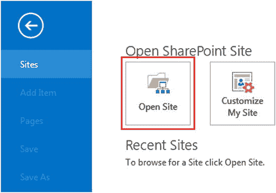

图 1-14。

The home screen in SharePoint Designer with an Open Site icon

单击此按钮将启动“打开网站”对话框，您需要在其中指定 SharePoint 网站集的 URL。您可以打开特定的网站集，也可以通过键入 SharePoint 环境的基本 URL 来打开根网站。如果你正在使用 SharePoint online，你的根站点的 URL 看起来会像 [`https://YOURSITENAME.sharepoint.com`](https://yoursitename.sharepoint.com/) 。

图 [1-15](#Fig15) 显示了打开场地对话框。您将在标有“网站名称”的文本框中键入 URL，然后单击“打开”。在 Designer 打开网站之前，您将看到另一个对话框来输入您的凭据。

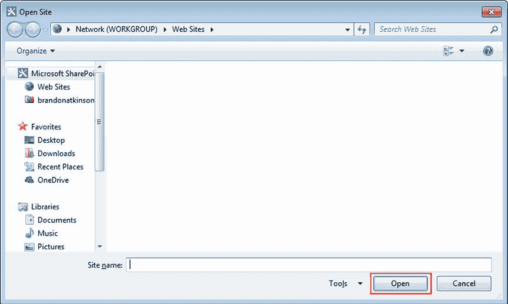

图 1-15。

Open Site dialog where you supply the URL to your SharePoint site

一旦您提供了凭据并通过了身份验证，SharePoint Designer 将会打开并为您提供网站视图。如果你以前从未使用过 Designer，花点时间四处看看；你可能会对你所能获得的信息量印象深刻。Designer 让您深入了解所有列表和库、工作流、外部内容类型等。这是一个非常有用的工具，尤其是在 SharePoint Online 中，您无法访问服务器。

Note

SharePoint Designer 是一个非常强大的工具，可以非常轻松地更改您的 SharePoint 环境。如果您不熟悉这个工具，那么在浏览时要小心，并且只做那些您知道不会对您的环境有害的更改。

熟悉 Designer 后，点击左侧导航栏中的母版页链接，如图 [1-16](#Fig16) 所示。此区域不仅显示 SharePoint 中的所有母版页，还显示其他布局，包括搜索结果、显示模板等。我们将在本书的后面回到这个领域，但是现在，突出显示`seattle.master`文件。此文件高亮显示后，单击功能区中的编辑文件。

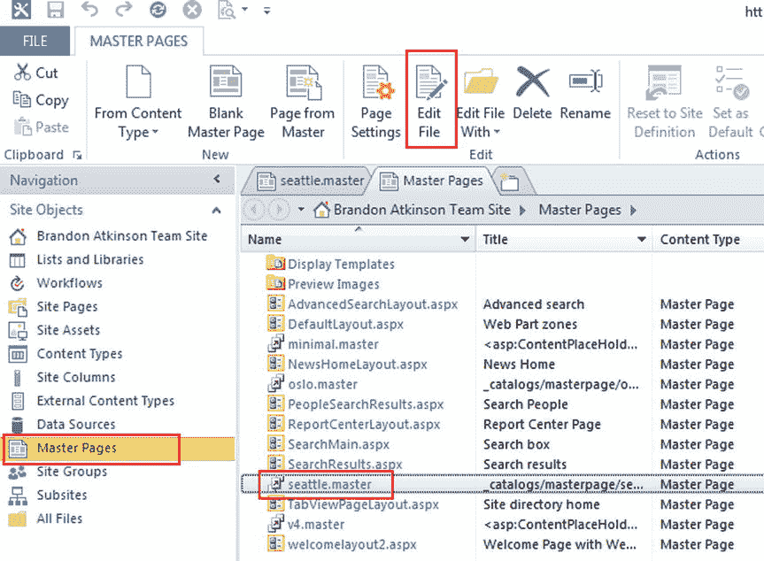

图 1-16。

The Master Pages tab in SharePoint Designer. Once you highlight the seattle.master file, click Edit File in the Ribbon

如果您是开发新手，下一个屏幕可能看起来很吓人，但事实并非如此。一旦你编辑了`seattle.master`文件，你将会看到所有呈现你的 SharePoint 页面的 ASP.NET 代码。嗯，差不多了。该文件负责 SharePoint 页面的公共部分，如徽标、功能区、导航等。尽管这里有很多，我们只需要添加我们的 jQuery 引用——然后退出！

我们将把我们的代码行放在页面顶部附近，就在结束标签`</head>`之前，如图 [1-17](#Fig17) 所示。

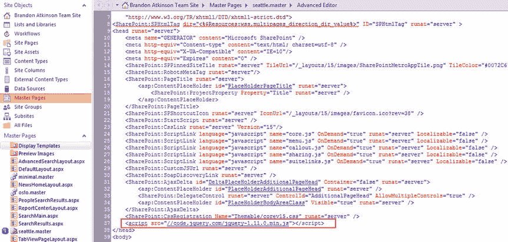

图 1-17。

jQuery reference added the Seattle master page

正如你在图 [1-17](#Fig17) 中看到的，我们将 jQuery 引用放在右`</head>`标签之前，右`<body>`标签之上。它基本上是母版页中 Head 区域引用的最后一个脚本。完成后，单击屏幕左上方的保存图标保存更改。这将自动将更改发布到您的 SharePoint 环境中。

保存更改后，启动浏览器并导航到您的站点。图 [1-18](#Fig18) 显示了 Firebug 打开时的 SharePoint 环境。检查 HTML，我们可以看到 jQuery 引用现在位于母版页中，并且可用于 SharePoint 中的所有页面。

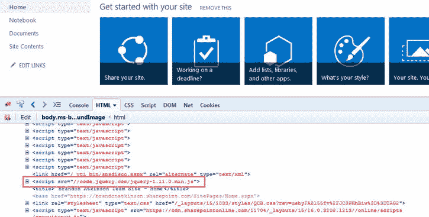

图 1-18。

Inspecting your SharePoint environment with Firebug to ensure the jQuery reference is in place Note

一般来说，在 SharePoint 中修改现成的母版页不是一个好主意。最大的原因是因为它们是现成的，如果更新或新版本出现，并且您的 SharePoint Online 升级，您的更改丢失的风险很高。最佳做法是制作一份要修改的母版页的副本，并更改该母版页。这样，更新将不会覆盖您的更改。

### 发布网站模板

当涉及到修改母版页时，发布站点的行为非常不同。SharePoint 2013 提供了设计管理器，允许您上传 HTML 文件，该文件将被转换为母版页。这对于想要上传自定义设计并完全改变其网站外观的用户来说非常好。然而，我们只需要注入 jQuery，所以我们需要完成一些额外的步骤。

打开 SharePoint Designer 并单击左侧导航栏中的母版页链接。您将注意到的第一件事是比团队网站中多得多的文件。所有额外的文件都有一个发布网站，所以你现在可以完全忽略它们。找到`seattle.master`文件，你会注意到它有一个附带的 HTML 文件，如图 [1-19](#Fig19) 所示。

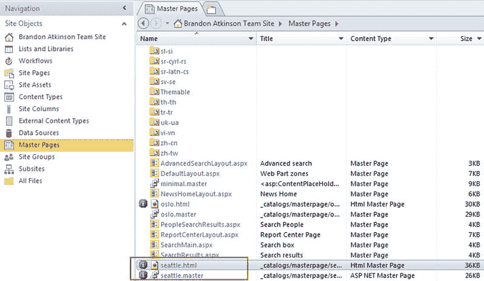

图 1-19。

Master Pages in SharePoint Designer on a Publishing Site template

在这个模型中，您只能编辑 HTML 文件。对 HTML 文件进行编辑并保存后，更改将被转换并保存到母版页文件中。我们需要做的第一件事是复制一份`seattle.html`文件，因为这是我们实际可以编辑的文件。突出显示`seattle.html`文件，并从功能区中单击复制按钮。粘贴按钮将被激活。单击粘贴。将会创建一个`seattle.html`的副本，如图 [1-20](#Fig20) 所示。

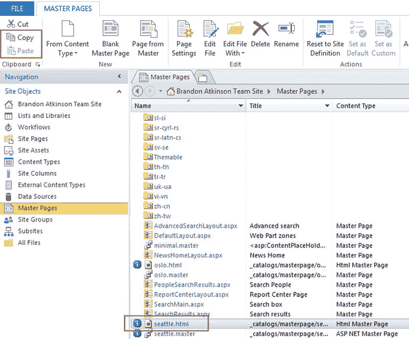

图 1-20。

Copy and Paste buttons in the Ribbon

一旦您制作了文件的副本，它将以默认名称`seattle_copy(1).html`粘贴进来。对于大多数人来说，这只是一个不能接受的名字！你可以右键点击新文件，从上下文菜单中选择重命名，如图 [1-21](#Fig21) 所示。

图 1-21。

The Rename option from the context menu

我们将文件重命名为 seattle_jquery.html，然后单击 Enter。由于 HTML 文件以相同的名称链接到母版页，因此在重命名新文件之前，Designer 会提示您。图 [1-22](#Fig22) 显示了重命名过程中您将看到的提示。

图 1-22。

The Rename prompt when renaming the copied HTML file

重命名后，您现在将拥有一个`seattle_jquery.html`和一个`seattle_jquery.master`文件。突出显示新的`seattle_jquery.html`文件，并单击功能区中的编辑文件。与团队站点母版页一样，我们将插入下面一行来引用 jQuery:

``

这次我们将把它放在不同的位置，如图 [1-23](#Fig23) 所示。它将被添加到 META 标签的正下方，一些现成的 SharePoint 标签之后。

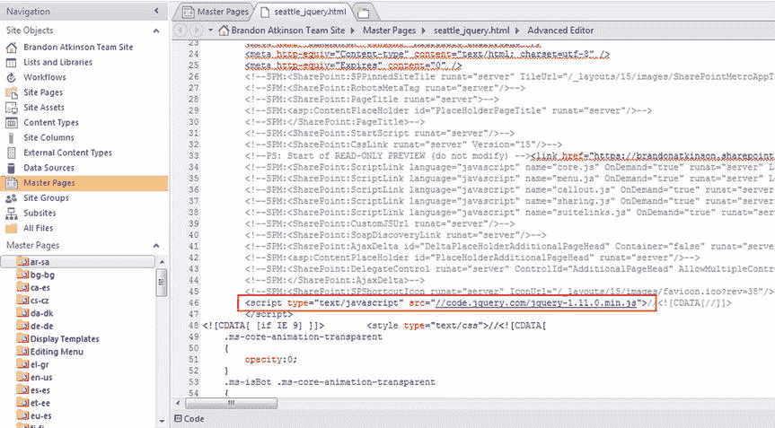

图 1-23。

Adding the jQuery line to the new master page file

添加 jQuery 引用后，单击 Save，这将保存并发布文件。它还会生成一个包含更改的新的`seattle_jquery.master`文件。现在我们已经添加了引用，并且所有文件都已更新，我们需要将这个新的母版页设置为默认母版页，以便我们的站点使用它。高亮显示`seattle_jquery.master`，点击功能区中的【设为默认】，如图 [1-24](#Fig24) 所示。

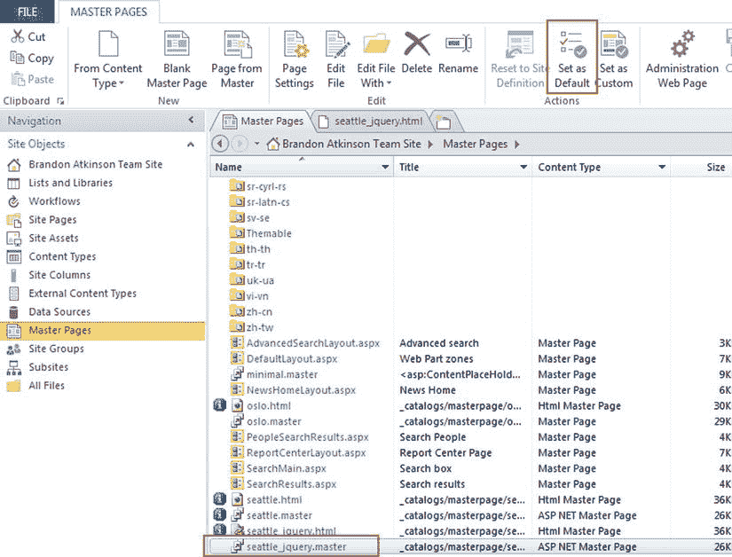

图 1-24。

Setting the new master page as the default

既然已经创建了新的母版页并将其设置为默认母版页，我们将检查以确保 jQuery 引用设置正确。导航到使用发布网站模板的网站。图 [1-25](#Fig25) 显示了 Firebug 打开时的 SharePoint 环境。检查 HTML，我们可以看到 jQuery 引用现在位于母版页中，并且可用于 SharePoint 中的所有页面。

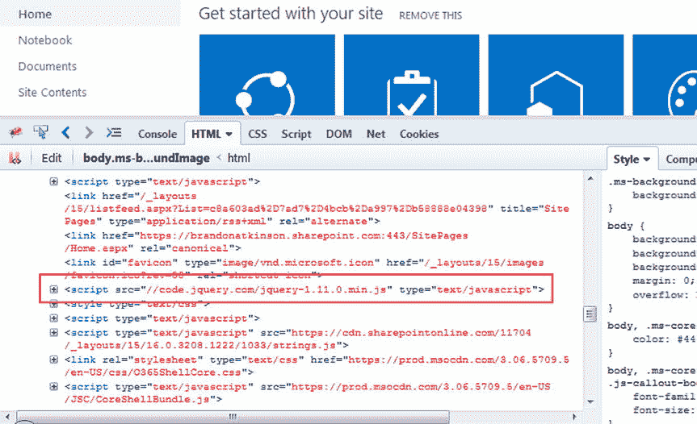

图 1-25。

jQuery reference in the new master page

使用发布模板从父网站创建的任何子网站都将自动继承这个新母版页。这是在母版页中添加 jQuery 引用的首选方式。制作文件副本可确保在更新应用到 SharePoint 时，您的更改将保持不变。

## 摘要

在这一章中，我们看了你在这本书里做前端开发需要的各种组件。如果您已经在开发解决方案，那么在阅读本书之前，您可能已经安装了大部分(如果不是全部)这些组件。如果你是前端开发的新手，你可能安装了一些新程序！现在，您应该已经具备了开始创建自己的定制解决方案所需的一切。这些组件的优点在于，在 SharePoint Online 和 Designer 之外，所有这些组件都可以用于许多其他项目。如果你发现你喜欢前端开发，你可以将这些工具用于广泛的项目！

在下一章，我们将探索服务器端和前端开发的区别。我们还将看看 SharePoint 提供的允许这种类型开发的一些组件。您将看到一些代码，并为后面的章节做准备！