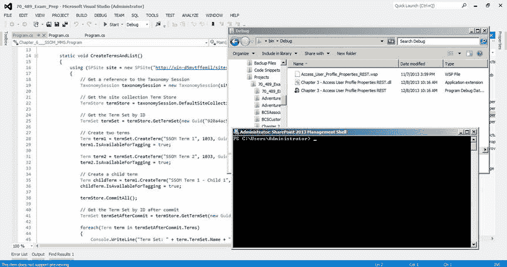
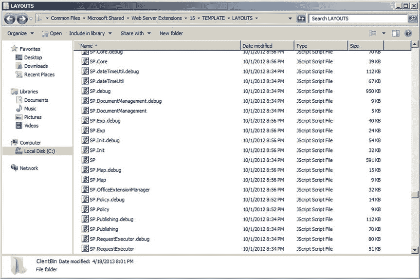
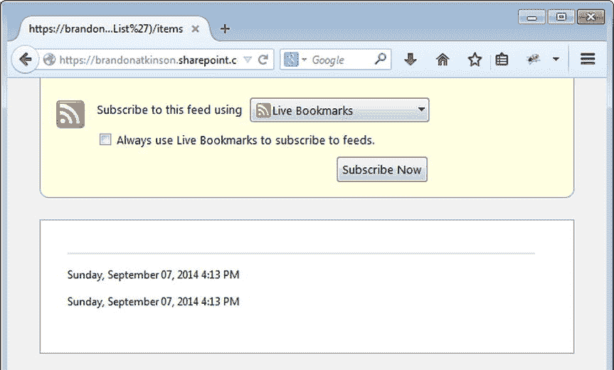
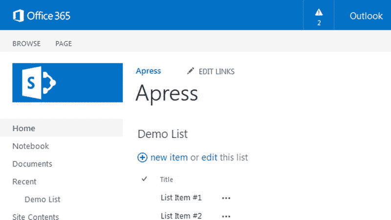
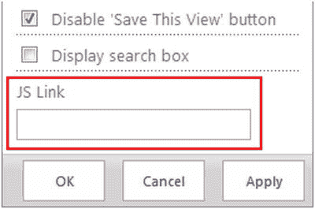
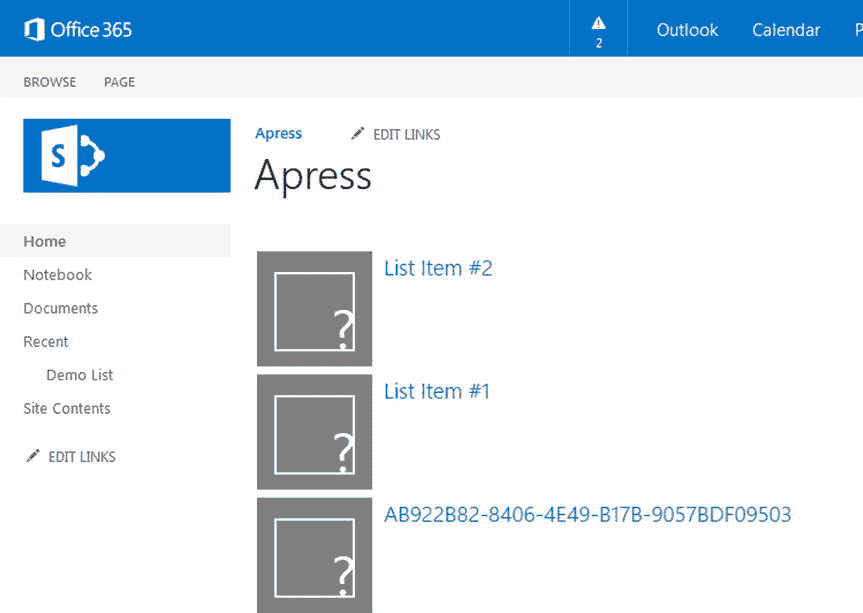
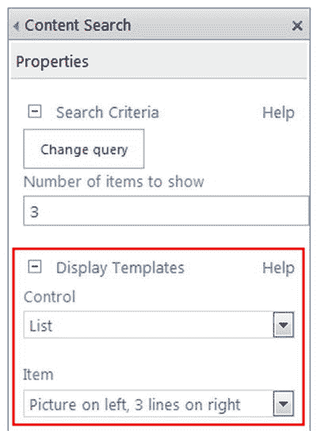
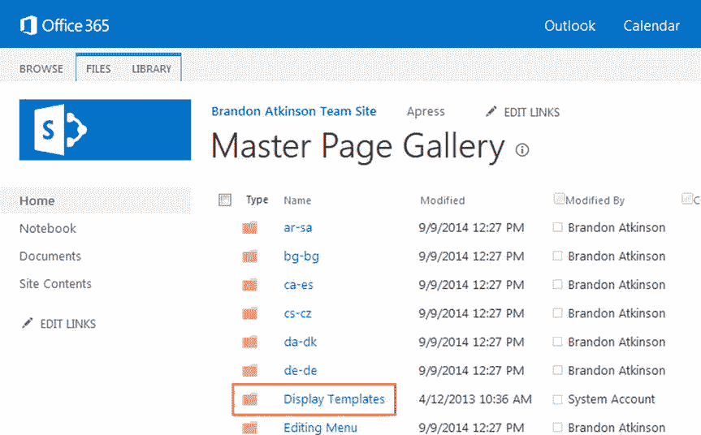

# 二、SharePoint 前端解决方案简介

SharePoint 自问世以来已经走过了漫长的道路，其发展历程也不例外。如果您必须在 SharePoint 2007 或更早版本上进行任何开发，可以相当肯定地说，您讨厌这种体验。SharePoint 2010 使事情变得更加简单，并引入了一些允许前端开发的新组件，如 ECMAScript 对象模型，后来更名为 JavaScript 对象模型。对于最新版本的 SharePoint，真正的重点是将代码从 SharePoint 服务器转移到浏览器或其他服务器。

这种关注在一定程度上是因为微软看到了许多由服务器代码引起的支持问题，这些代码要么写得很差，要么只是将服务器推到了极限。再加上 SharePoint Online 的引入，最终用户无法访问服务器本身，因此需要更强大的前端开发解决方案。由此而来的是一个扩展的 JavaScript 对象模型、一个新的 REST API 和 SharePoint 应用程序。

我们将在本书中更详细地探讨 JavaScript 对象模型和 REST API。我们还将关注新的前端组件，比如 JSLink 和显示模板。本章将探讨服务器端和前端开发之间的差异，以及这种开发风格的一些功能。我们还将探讨在这个过程中可能会遇到的一些限制。

Note

本书不涉及 SharePoint 应用程序。虽然在某些情况下应用程序可以被认为是前端开发，但这是一个非常大的主题，涉及开发、网络和域管理。在很多情况下，SharePoint 的应用程序在服务器端运行，只是不在运行 SharePoint 的服务器上。有关构建 SharePoint 应用程序的更多信息，请访问以下 URL: [`http://msdn.microsoft.com/en-us/library/office/jj163230(v=office.15).aspx`](http://msdn.microsoft.com/en-us/library/office/jj163230(v=office.15).aspx) 。

## 服务器端开发与前端开发

SharePoint 开发和定制解决方案的构建在很长一段时间内都是核心开发人员的领域。它需要广泛的组件知识，包括 Visual Studio、PowerShell、ASP.NET、微软服务器等等。这有时是一次令人生畏的经历——即使对那些一直在做的人来说。NET 开发，但不熟悉 SharePoint。图 [2-1](#Fig1) 展示了一个典型的服务器端开发体验，其中包括 Visual Studio、部署包和一个 PowerShell 窗口，用于将代码实际部署到服务器。

图 2-1。

A typical SharePoint server-side development experience

服务器端代码是专门为在 SharePoint 服务器上运行而编写的。一旦为部署编写并打包了代码，它就被复制到服务器上，并使用 PowerShell 或管理中心进行安装。在大多数情况下，它需要开发人员、业务用户和服务器管理员一起工作。由于代码直接在服务器上运行，因此它具有巨大的威力，很容易对 SharePoint 环境产生负面影响。

甚至为 SharePoint 编写服务器端代码也很困难，因为这需要一台安装了 SharePoint 的功能强大的 PC。过去，大多数开发人员会在他们的电脑上构建虚拟机，他们可以在隔离的环境中为 SharePoint 编写代码。学习服务器端开发有时很困难，因为您需要学习新的代码框架，需要在您的 PC 上安装 SharePoint，并且需要编码最佳实践来确保您不会用糟糕的代码损害服务器。

一旦 SharePoint Online 和 Office 365 出现，服务器端开发就受到了打击，因为使用这些产品，你无法访问运行 SharePoint 的服务器。从使用同一台服务器的所有其他客户的角度来看，这很好。如果一个客户安装了写得很差或恶意的代码，他们就有可能让所有人的整个服务器瘫痪。但是，如果您是一个需要定制解决方案的客户，您将不再拥有健壮的服务器端代码。

Note

沙盒解决方案提供了在 SharePoint 中编写和部署服务器端代码的另一种方式。这些解决方案不需要访问服务器，因为网站集管理员可以使用浏览器安装它们。它们被称为“沙盒”，因为它们在服务器上独立运行，并由 SharePoint 监控，以确保它们不会影响性能。对于 SharePoint 2013，沙盒解决方案仍然可以安装在内部，但在 SharePoint Online 中已被否决，并且只能包含 HTML 和 JavaScript。有关沙盒解决方案的更多信息，请访问以下网址: [`http://technet.microsoft.com/en-us/library/ee721992(v=office.14).aspx`](http://technet.microsoft.com/en-us/library/ee721992(v=office.14).aspx) 。

乍一看，微软似乎已经放弃了为你的业务创建定制 SharePoint 解决方案的能力，尤其是当你使用 Office 365 的时候。使用 SharePoint 内部部署的客户也收到了来自微软的相同消息，该公司已停止在服务器上放置自定义代码。幸运的是，微软没有让任何人“孤立无援”。最新版本的 SharePoint 附带了广泛的前端组件来开发解决方案。

前端开发或客户端代码是专门为在 web 浏览器中运行而编写的。它使用 HTML、JavaScript 和 CSS，可以在任何浏览器上运行。您仍将向 SharePoint 添加您的代码，但由于它只有 HTML 和 JavaScript，您可以利用现成的组件(如文档库)来上传和存储您的解决方案。在下一节中，我们将探索使用 SharePoint 进行前端开发的各种组件，并看看它们能为您提供什么。

## SharePoint 中前端开发的组件

既然我们已经了解了服务器端和前端开发之间的一些差异，那么让我们来看看本书将要涉及的前端开发的一些组件。在本书中，我们将展示几种不同的创建定制解决方案的方法，在这一节中，我们将向您介绍它们。这些将是相当快速、高水平的介绍，因为我们将在后面的章节中更深入地探讨每一个。我们会探索

*   JavaScript 对象模型(JSOM)
*   应用程序接口
*   JS 链接
*   显示模板

这些项目中的每一项都与其他组件配合使用，构成一个完整的前端解决方案。如果需要的话，你甚至可以一起使用其中的几个。现在，我们将快速地看一下每一项，让你准备好在接下来的章节中开始构建一些解决方案。

### JavaScript 对象模型(JSOM)

JavaScript 对象模型，简称 JSOM，是 SharePoint 客户端 API 家族的一部分。这通常被称为客户端对象模型，或简称为 CSOM。所有这些都相当令人困惑，因为人们倾向于在广泛的讨论中使用“客户端对象模型”这个术语。CSOM 囊括了从 JSOM 到 Silverlight 库，再到一组服务器端库，甚至是 REST API。这里的要点是，如果有人在谈论 CSOM，你可能需要他们更具体地说明他们在做什么。

JavaScript 对象模型基本上是作为 SharePoint 一部分的 JavaScript 文件的集合。每个文件都包含允许您执行各种任务的代码——从与术语库交互、访问用户配置文件信息，或者只是阅读列表和网站等常见的核心任务。如果您可以访问服务器，您可以在`C:\Program Files\Common Files\Microsoft Shared\Web Server Extensions\15\TEMPLATE\LAYOUTS`查看所有这些文件。图 [2-2](#Fig2) 显示了 Windows 资源管理器中的这个文件夹。如果您在 SharePoint Online 上，请不要担心，所有这些文件仍然对您可用，只是您无法在 Windows 资源管理器中查看它们！

图 2-2。

Files that make up the JavaScript Object Model on the file system

所有文件都位于 SharePoint 的 Layouts 文件夹中。Layouts 文件夹是 SharePoint 中的一个常用文件夹，包含许多在整个环境中使用的通用文件和代码。当部署使用自定义页面、图像等的自定义服务器端代码时，通常会将其部署到 Layouts 文件夹中。如果你还不熟悉，没必要担心，你很快就会熟悉的。

图 [2-2](#Fig2) 仅显示了您可用的部分文件，但应该有助于说明 JSOM 在构建定制解决方案方面的强大功能。微软投入了大量的时间和精力来扩展 JSOM 的功能。由于他们告诉他们的客户不再使用服务器端代码，并在许多方面转移到 SharePoint Online，他们确保提供一套全面的工具，以提供丰富的开发体验。

Note

有关 JSOM 的更多信息，请访问 SharePoint 的 JavaScript API 参考，网址为: [`http://msdn.microsoft.com/en-us/library/office/jj193034(v=office.15).aspx`](http://msdn.microsoft.com/en-us/library/office/jj193034(v=office.15).aspx) 。

在您的解决方案中使用 JSOM 相当简单，因为它们都是 JavaScript。首先，您需要放置一个对特定文件的引用，如下所示:

``

这是 HTML 中的标准脚本标记，它告诉浏览器加载位于 SRC 属性中指定位置的特定文件。在这种情况下，浏览器将加载位于 Layouts 文件夹中的`sp.js`文件。一旦我们有了对我们需要的 SharePoint JSOM 文件的引用，我们就可以编写一个类似这样的脚本:

`$(function () {`

`retrieveListItems();`

`});`

`function retrieveListItems() {`

`var clientContext = new SP.ClientContext();`

`var oList = clientContext.get_web().get_lists().getByTitle('Demo List');`

`var camlQuery = new SP.CamlQuery();`

`this.collListItem = oList.getItems(camlQuery);`

`clientContext.load(collListItem);`

`clientContext.executeQueryAsyn` `c(`

`Function.createDelegate(this, this.onQuerySucceeded),`

`Function.createDelegate(this, this.onQueryFailed)`

`);`

`}`

如果这是你第一次看到 JSOM 代码，不要不知所措！它可能看起来令人生畏，但是当你读完这本书，它将变得更容易阅读和写作。让我们把这个例子分解一下，看看每一部分。

*   `$(function () {});`——这是代码的入口点，都是 jQuery。这被称为 document.ready 函数，之所以这样叫是因为它在浏览器完全加载 HTML 页面时被触发。在 jQuery 开发中，您会经常看到这种情况，因为这是在页面加载时启动代码的一种简单方便的方式。在这个例子中，我们所做的就是调用 JSOM 代码所在的另一个函数。
*   `SP.ClientContext()` -该行获取对客户端上下文的引用，并在对 SharePoint 服务器的每个 JSOM 调用中使用。客户端上下文包含许多关于当前 web 应用程序、站点、站点集合等的信息。
*   使用客户端上下文，我们可以获得对站点中任何内容的引用。在这一行中，我们引用当前站点，从所有列表中请求一个标题为“演示列表”的特定列表。这一行的语法非常容易理解:获取 Web、获取列表、按标题获取。使用 REST API 时，您会看到类似的模式。
*   `SP.CamlQuery()` -这一行允许您使用 CAML 查询来指定要返回的项目，这是一种用于查询 SharePoint 的语法。它已经存在了一段时间，在处理列表和库时经常使用。在本例中，我们简单地传递一个空查询，告诉 SharePoint 我们需要列表中的所有项目。我们通过在查询中调用`oList.getItems(camlQuery)`来实现这一点。
*   `clientContext.executeQueryAsync()` -该行将实际启动对 SharePoint 服务器的查询。然后，您可以处理返回的数据，并将其显示给用户。

这是对 JSOM 尽可能高层次的解释了！主要目的是展示一些 JSOM 和简要说明部分。关于 JSOM 还有很多内容，但是在我们开始任何演示之前，您至少已经接触了一些代码。

### 应用程序接口

SharePoint 2013 和 SharePoint Online 引入了 REST API。它允许您通过特制的 URL 对 SharePoint 进行 RESTful 调用。数据可以以 XML 或 JSON 的形式返回，并且可以很容易地被浏览器中的 JavaScript 使用。RESTful 数据在 SharePoint 的早期版本中是可用的，但仅限于大多数列表交互。像 JSOM 一样，新的 REST API 已经得到了极大的扩展，包含了广泛的函数。

Note

有关 REST API 的更多信息，请访问 SharePoint 的 REST API 参考和示例，网址为: [`http://msdn.microsoft.com/en-us/library/office/jj860569(v=office.15).aspx`](http://msdn.microsoft.com/en-us/library/office/jj860569(v=office.15).aspx) 。

典型的 REST API 调用将类似于以下 URL:

`http://SERVER/_api/web/lists/GetByTitle('Demo` `List')/items`

就像上一节中的 JSOM 示例一样，这个 URL 将查询名为 Demo List 的列表，并请求所有项目。语法也应该看起来很熟悉:Web、列表、GetByTitle、Items。在这两个例子中，调用的结构非常容易阅读，并为您提供了您需要了解的关于预期数据的所有上下文。图 [2-3](#Fig3) 显示了浏览器中 REST 调用的结果。

图 2-3。

REST API call in the browser returned as XML

在这个例子中，结果以 XML 的形式返回，因为这是浏览器默认请求的。当通过 JavaScript 调用时，我们可以请求 XML 或 JSON。我们稍后会更详细地讨论这个问题。像 JSOM 一样，我们可以提供一个 CAML 查询来限制结果，我们可以使用查询字符串操作符来选择、过滤和排序我们从 API 请求的数据。

如果我们想将数据限制为一行，REST API 调用将类似于以下 URL:

`http://SERVER/_api/web/lists/GetByTitle('Demo` `List')/items?$top=1`

查询字符串操作符`top=1`告诉 API 只返回第一行数据。图 [2-4](#Fig4) 在浏览器中显示了这次调用的结果。

图 2-4。

REST API call with a query string operator limiting results

有许多操作符可以用来编写 REST API 调用。我们将在后面的章节中看到更多，但是请放心，您将拥有获得正确结果所需的所有工具。这个例子应该说明使用 REST API 从 SharePoint 请求数据是多么容易。

### 路由器

JSLink 是 SharePoint 2013 中的新增功能，它提供了一种非常强大且简单的方法来设置列表视图 web 部件的样式。在 JSLink 出现之前，您必须使用 XSLT 或可扩展样式表语言转换。XSLT 是一种样式化或转换 HTML 并赋予其生命力的方法。它在允许开发人员改变 web 部件的呈现方式方面做得很好，但使用起来相当痛苦。大多数开发人员一想到必须使用 XSLT 就畏缩不前，通常会远离它。

伴随而来的是 JSLink，它允许使用 JavaScript 和 HTML 对部件进行样式化。它提供了一种更容易、更快速的方法来呈现 web 部件以满足业务需求，并提供更多的功能。JSLink 不仅提供了一种简单的方法来设计 web 部件的样式，因为它是 HTML 和 JavaScript，你还可以用它做更多的事情。现在，让我们来看看 JSLink 是如何工作的。图 [2-5](#Fig5) 显示了一个标准的 SharePoint 主页，上面插入了一个列表 Web 部件，并显示了演示列表中的项目。

图 2-5。

SharePoint page with a List Web Part inserted, listing the items from the Demo List

这是 SharePoint 附带的标准列表 Web 部件，但现在它有了新的属性。如果将 web 部件置于编辑模式，并在 web 部件工具窗格中展开“杂项”面板，您将看到一个名为“JS 链接”的新属性。这是一个文本框，您可以在其中放置将在呈现 web 部件期间使用的 JavaScript 文件的路径。图 [2-6](#Fig6) 显示了这个新属性。

图 2-6。

JSLink property in the Web Part Properties pane

现在您已经知道如何通过 JSLink 属性应用 JavaScript 文件，让我们看看 JavaScript 实际上是什么样子。下面的代码简单演示了 JS 链接代码是如何工作的。

`(function () {`

`var overrideContext = {};`

`overrideContext.Templates = {};`

`overrideContext.Templates.Item = overrideTemplate;`

`SPClientTemplates.TemplateManager.RegisterTemplateOverrides(overrideContext);`

`})();`

`function overrideTemplate(ctx) {`

`return "
" + ctx.CurrentItem.Title + "
";`

`}`

让我们把这个例子分解一下，看看每一部分。

*   `overrideContext`、`overrideContext.Templates`和`overrideContext.Templates.Item`——顾名思义，这些是覆盖 web 部件默认呈现的对象。父对象`overrideContext`，可以随意命名。前两行只是创建了一个对象和一个名为`Templates`的属性。这是所有 JSLink 文件的标准，因为它是代码的基础。第三行定义了另一个 JavaScript 函数，它将为 web 部件中的每个单独的项目触发；这是由它的名字中的“`Item`”指定的。您可以将项目作为目标，或者仅将项目中的特定属性作为目标。例如，如果我们只想设计`Title`的样式，我们可以只引用那个属性。
*   `SPClientTemplates.TemplateManager.R``egisterTemplateOverrides(overrideContext)`——一旦你构建了你的对象，你必须告诉 SharePoint 你想使用它。这一行就是通过将它注册到`TemplateManager`对象来实现的。一旦完成，您引用的 JavaScript 函数将在呈现 web 部件时被调用。
*   `function overrideTemplate(ctx)` -这是呈现 web 部件时将运行的实际代码。它非常简单:它所做的只是呈现一个 HTML DIV 元素，其中包含一些样式和当前项目的标题。

一旦这些代码被放到一个文件中，我们就把它上传到 SharePoint 中的一个库中。然后，我们将文件的路径放在 web 部件的 JSLink 属性中。图 [2-7](#Fig7) 显示了使用 JSLink 文件呈现 web 部件后的输出。

图 2-7。

List Web Part after applying JS Link code

我们将在后面的章节中更详细地讨论 JSLink 的使用，我将展示更多的方法来设计内容和构建定制的解决方案。当在页面上使用列表 web 部件时，您会发现 JSLink 是一个非常有用的工具，可以满足您的业务需求。

### 显示模板

与 JSLink 一样，显示模板是 SharePoint 2013 和 SharePoint Online 中的新增功能。它们与搜索 Web 部件协同工作，例如 SharePoint 附带的内容搜索 Web 部件。显示模板使用 HTML 和 JavaScript 来呈现内容，并允许您指定要显示的属性、放置位置以及样式。通过使用这些模板，您可以极大地控制搜索结果及其显示方式。图 2-8 显示了放置在页面上的标准内容搜索 Web 部件。

图 2-8。

Out-of-the-box Content Search Web Part placed on a page

我们可以通过将 web 部件置于编辑模式并查看 web 部件工具窗格中的属性面板来更改正在使用的显示模板。在搜索条件的正下方，您将找到显示模板区域。这一部分有两个下拉框，允许您选择内容应该如何呈现:控件和项目。图 [2-9](#Fig9) 显示了显示模板区域和下拉菜单。

图 2-9。

Control and Item options in the Content Search Web Part tool pane

这些项目中的每一个都是一个模板，它们一起工作来呈现内容。控件模板为您的内容提供了一个总体的 HTML 布局。你可以把它想象成一个保存所有搜索结果项的容器。这也是一个加载您想在搜索结果中使用的任何 JavaScript 或 CSS 的好地方。项目模板为每个搜索结果项目提供了单独的 HTML。此模板还利用搜索结果上的托管属性，并允许您控制显示哪些属性。当一起使用时，这些模板提供了一个完整的方法来呈现您的内容。

您可以通过导航到网站设置，然后导航到 Web Designer 库标题下的母版页来查看现成的显示模板。这将打开母版页图库页面，如图 [2-10](#Fig10) 所示。

图 2-10。

Master Page Gallery where you can find the out-of-the-box display templates Note

为了使用显示模板和内容搜索 Web 部件，您需要确保 SharePoint Server 发布网站功能已激活。如果您的站点正在使用发布模板，应该已经激活了。此 web 部件也仅在 Office 365 E3 和 E4 计划或 SharePoint 内部部署的企业版中可用。

单击显示模板文件夹将显示另一个页面，其中所有当前显示模板都按文件夹组织。内容搜索 Web 部件显示模板都位于内容 Web 部件文件夹中，如图 [2-11](#Fig11) 所示。

图 2-11。

Display Templates and the Content Web Parts folder

打开内容 Web 部件文件夹时，您会发现一堆显示模板。每个模板都有一个 HTML 文件和一个对应的 JavaScript 文件，如图 [2-12](#Fig12) 所示。

图 2-12。

Display template with an HTML file and corresponding JavaScript file

当您构建新的显示模板时，您将只能使用 HTML 文件。上传 HTML 文件后，SharePoint 会为您生成 JavaScript 文件，这是它在呈现内容时使用的文件。有了这个模型，您不需要担心所需的脚本；您只需要担心 HTML，SharePoint 会处理其余的事情。显示模板使用搜索结果中的托管属性来呈现内容。该模板使用令牌系统来呈现内容，如下面的代码示例所示:

`<a class="cbs-pictureImgLink" href="_#= linkURL =#_" title="_#= $htmlEncode(line1.defaultValueRenderer(line1)) =#_" id="_#= pictureLinkId =#_">`

令牌看起来像`_#= variabl` `eName =#_`。您可以创建自己的变量来存储稍后在模板中使用的内容。我们将在后面的章节中更详细地讨论这些。

## 摘要

在这一章中，我们研究了服务器端开发和前端开发之间的区别，并探索了一些可用于定制解决方案的组件。在最新版本的 SharePoint 中，微软强调了在开发工作中不使用服务器端代码的优势。说到 SharePoint Online，您根本无法使用它！正如你在本章中读到的，它们提供了许多选项来构建不依赖于服务器端代码的定制解决方案。所有这些解决方案都利用了 HTML 和 JavaScript，使得任何习惯于构建网页的人都可以轻松访问这些解决方案。

在下一章中，我们将继续扩展我们目前所学的内容。我们将看看内容编辑器 Web 部件，以及如何将 HTML 内容直接放在页面上。此外，我们将探索新的脚本编辑器 Web 部件，它可以与内容编辑器结合使用。我们将使用你在本章中看到的一些代码，并实际看到它的运行。