# 五、使用 JSLink 设置列表 Web 部件的样式

在 SharePoint 中，您可以将许多不同的现成 web 部件放在页面上。这些提供了列表、搜索、日历、外部数据等视图。其中最流行和使用最广泛的是列表视图 Web 部件。创建自定义列表，然后通过这些 web 部件向用户显示其内容是很常见的。这些 web 部件允许您快速、轻松地向用户公开数据，并且大多数用户都非常熟悉它们。

列表视图 Web 部件提供了多种不同的方式来自定义所显示的数据。这些选项包括:

*   选择要显示的列
*   整理
*   过滤
*   分组

这是为您提供的现成的大量功能。在很多情况下，这些选项提供了您定制数据所需的一切；然而，如果您需要真正定制的东西，这些选项是不够的。设想一个场景，业务需求是根据列表中某个项目的状态显示图像。也许有一个状态为“准时”和“迟到”的列。对于每种状态，您需要根据该状态显示笑脸或皱眉。对于现成的列表视图 Web 部件，您必须使用一种称为 XSLT 的呈现技术。现在，您可以利用 JSLink 在列表视图 Web 部件中执行这种数据操作。在这一章中，我们将探索 JSLink 是如何工作的，以及你可以用它完成什么。

## JSLink 和一个简单的例子

在 SharePoint 2013 之前，如果您想要在列表视图 Web 部件上执行任何类型的样式，您必须使用 XSLT。XSLT 代表可扩展样式表语言转换，它用于样式化和呈现 XML 内容。不仅很难说，而且更难共事。您很难找到一个不仅知道如何有效地编写 XSLT，而且愿意接触它的开发人员。这很难写，也很难理解。典型的 XSLT 文件如下所示:

`<?xml version="1.0"?>`

`<xsl:stylesheet version="1.0"`

`xmlns:xsl="``http://www.w3.org/1999/XSL/Transform`T2】

`<xsl:template match="/">`

`<html>`

`<body>`

`<h2>My CD Collection</h2>`

`<table border="1">`

`<tr bgcolor="#9acd32">`

`<th>Title</th>`

`<th>Description</th>`

`</tr>`

`<xsl:for-each select="catalog/cd">`

`<tr>`

`<td><xsl:value-of select="title"/></td>`

`<td><xsl:value-of select="description"/></td>`

`</tr>`

`</xsl:for-each>`

`</table>`

`</body>`

`</html>`

`</xsl:template>`

`</xsl:stylesheet>`

微软知道使用 XSLT 的挑战，需要为开发人员提供开发这类解决方案的更好方法。JSLink 就是从这种需求中诞生的，它是一个完美的替代品。JSLink 的妙处在于它基本上是 JavaScript！任何熟练编写 JavaScript 的人都可以快速编写 JSLink 代码。此外，JSLink 可以与其他 JavaScript 文件结合，创建非常健壮的解决方案。

JSLink 基本上是 web 部件上的一个属性，为 JavaScript 文件提供一个或多个位置。如果使用文件的有效 URL 设置此属性，则在呈现 web 部件时，它会选取该文件并使用该文件将内容呈现给浏览器。由于都是 JavaScript，所有的渲染都由浏览器处理，因此减轻了 SharePoint 服务器的负担，因为它只负责返回数据。这提供了不影响服务器性能的简单定制。

让我们看一个使用 JSLink 来设置 web 部件样式的简单例子。我们将利用 Webparts 文档库和演示列表来扩展我们在前面章节中构建的内容。导航到放置内容编辑器 Web 部件的页面，然后将其删除，这样您就有了一个干净的页面。使用功能区为演示列表插入一个列表视图 Web 部件，如图 [5-1](#Fig1) 所示。

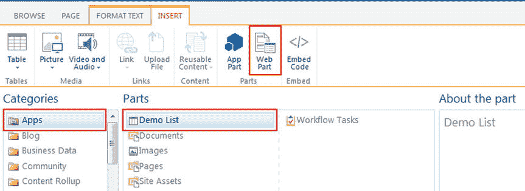

图 5-1。

Adding the List View Web Part for the Demo List

如果尚未高亮显示，请点按“应用”类别。演示列表应该在列表的顶部，这取决于你的站点中有多少列表。将 web 部件插入页面并保存。结果视图将简单地显示列表项，如图 [5-2](#Fig2) 所示。

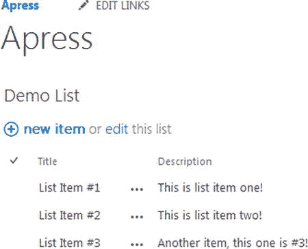

图 5-2。

The out-of-the-box List View Web Part for the Demo List

我们需要创建一个文件夹来保存这个例子的脚本。导航回 Webparts 文档库，创建一个名为 JSLink 的新文件夹，如图 [5-3](#Fig3) 所示。对于这一章，我们将把所有的脚本放在这个文件夹中；但是，在生产环境中，您可能希望遵循 Etherson 方法，并为使用 JSLink 设计样式的每个 web 部件创建一个文件夹。

图 5-3。

Adding a new folder for JSLink in the Webparts document library

打开 Visual Studio，通过转到文件➤新➤文件创建一个新文件。选择 Web 类别，然后从选项中选择“JavaScript 文件”。我们将从一个非常基本的脚本开始，该脚本将获取 web 部件中的每个项目并对其进行样式化。将以下代码放入文件中:

`(function () {`

`var overrideContext = {};`

`overrideContext.Templates = {};`

`overrideContext.Templates.Item = overrideTemplate;`

`SPClientTemplates.TemplateManager.RegisterTemplateOverrides(overrideContext);`

`})();`

`function overrideTemplate(ctx) {`

`return "
"`

`+ ctx.CurrentItem.Title`

`+ "
";`

`}`

这个脚本是我们能够制作的最精简的 JSLink JavaScript 文件；然而，它将对这些脚本如何工作提供一个很好的介绍。首先，你会注意到我们声明了一个没有名字的函数。这个函数作为脚本的入口点，并且是所有设置发生的地方。接下来，我们用下面一行声明一个新变量:

`var overrideContext = {};`

这是一个简单的 JavaScript 变量，我们将其命名为`overrideContext`，并使用`{}`语法将其设置为一个空对象。这里需要注意的是，这个名字并没有什么魔力。我们可以称它为“`myObject`”或“`SomeCoolNewThing`”，或任何类似的名字。我们称之为`overrideContext`,因为我们提供了默认样式的覆盖。接下来，我们用下面的代码行声明另一个名为`Templates`的对象:

`overrideContext.Templates = {};`

这个对象用于保存对我们想要覆盖样式的所有不同模板的引用。例如，您可以添加`Item`来覆盖整个列表项的样式，或者添加`Field`来覆盖列表中单个列的样式。我们使用下面的代码行来实现这一点:

`overrideContext.Templates.Item = overrideTemplate;`

这一行表明我们想用另一个函数覆盖`Item`模板，这个函数叫做`overrideTemplate`。还是那句话，这个函数的名字没什么神奇的；它可以是任何东西。最后，我们用下面的代码行注册覆盖:

`SPClientTemplates.TemplateManager.RegisterTemplateOverrides(overrideContext);`

`SPClientTemplates.TemplateManager.RegisterTemplateOverrides`是一个内置的 SharePoint 函数，将注册您的代码进行渲染。您传入您在开始时创建的基本对象。一旦注册了覆盖，最后一部分就是实际执行渲染的函数:

`function overrideTemplate(ctx) {`

`return "
"`

`+ ctx.CurrentItem.Title`

`+ "
";`

`}`

这个函数接受一个名为`ctx`的参数。和这个脚本中的其他项目一样，这个名称没有任何意义。`ctx`是列表上下文，将用于根据该函数中的内容呈现列表项。我们将保持简单，对于列表中的每一项，我们将返回一个 DIV 元素，其中包含列表项标题。我们可以使用`ctx.CurrentItem.Title`访问标题。因为这个函数将为列表中的每一项触发，`CurrentItem`就是循环中的当前列表项。DIV 有一些内联 CSS，因此自定义呈现非常突出。

保存该文件并将其命名为 JSLinkDivExample.js，然后将其上载到 Webparts 文档库中的 JSLink 文件夹。Visual Studio 中的完整文件如图 [5-4](#Fig4) 所示。

图 5-4。

JSLinkDivExample.js file in Visual Studio

文件上传后，我们需要获取文件的 URL。在前一章中，我们看到了如何右击文件并从上下文菜单中选择复制链接位置。也可以通过打开文件的菜单，从弹出的文本菜单中复制来获取 URL，如图 [5-5](#Fig5) 所示。

图 5-5。

Copying the URL of the JavaScript file from the menu

导航回放置列表视图 Web 部件的页面。将页面置于编辑模式，然后将列表视图 Web 部件也置于编辑模式。在 web 部件的工具窗格中，滚动到底部并展开“杂项”折叠面板。在这个面板的底部，你会发现 JSLink 属性，如图 [5-6](#Fig6) 所示。

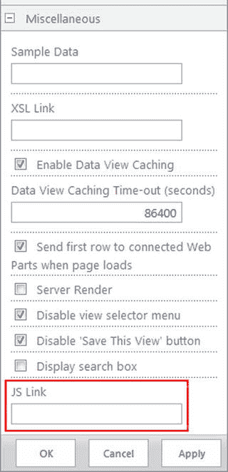

图 5-6。

JSLink property in the web part tool pane

在内容编辑器 Web 部件中使用 URL 时，您只需粘贴 URL，SharePoint 会自动将其转换为相对路径 URL。也就是说，SharePoint 将从 URL 中剥离域，只留下定位文件所需的部分。例如，我的环境中的`JSLinkDivExample.js`文件路径如下所示:

`https://brandonatkinson.sharepoint.com/apress/Webparts/JSLink/JSLinkDivExample.js`

如果将此内容粘贴到 JSLink 属性中并保存 web 部件，SharePoint 会将 URL 转换为以下内容:

`/apress/Webparts/JSLink/JSLinkDivExample.js`

通常，SharePoint 更喜欢它的 URL，因为 SharePoint 可以配置为提供来自多个域的内容。通过利用相对路径 URL(没有域的 URL)，SharePoint 可以很容易地计算出内容的位置，无论它是从哪个域提供的。这对于内容编辑器 Web 部件非常有用，但是在与 JSLink 一起使用时会失败。

幸运的是，SharePoint 通过使用 URL 令牌提供了一种简单的补救方法。令牌提供了一种为 SharePoint 想要删除的 URL 部分传入占位符的方法。以下列表显示了一些较常见的令牌:

*   `∼site` -当前站点的 URL
*   `∼sitecollection` -当前网站的网站集的 URL
*   `∼layouts`-`_layouts/15`文件夹的 URL

使用这些令牌，可以将 URL 更新为以下内容:

`∼sitecollection` `/apress/Webparts/JSLink/JSLinkDivExample.js`

或者

`∼site/Webparts/JSLink/JSLinkDivExample.js`

这两个新 URL 都可以使用，因为它们都指向同一个位置。因为我们的 web 部件文档库与放置 web 部件的页面位于同一站点，所以我们可以使用两者中较短的一个。在 JSLink 属性中输入这个 URL，如图 [5-7](#Fig7) 所示。

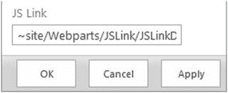

图 5-7。

URL to the JavaScript file using the URL token

单击确定并保存页面。当页面重新加载时，`JSLinkDivExample.js`文件将被加载，列表项将基于其中的`overrideTemplate`函数呈现。结果如图 [5-8](#Fig8) 所示。

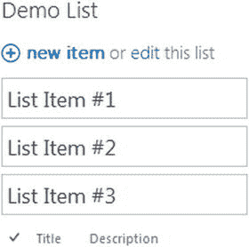

图 5-8。

JSLink rendering of the Demo List items

如您所见，每个列表项都呈现在一个具有边框和更大文本的 DIV 中，就像 JavaScript 文件中的内联 CSS 一样。在我们的函数中，我们呈现的唯一一段数据是`Title`属性，它显示在 DIV 中。这个简单的例子应该开始说明 JSLink 为设计列表视图 Web 部件样式提供的强大功能，以及开始构建健壮的自定义解决方案的一种方法。

## 使用项模板

前面的例子是用 JSLink 可以做什么的一个快速示例。然而，这远远不是一个现实的解决方案，它有一些问题。例如，标题和描述列的排序链接仍然存在，并显示在列表项下。显然，这不是您希望最终用户看到的样子。在这一节中，我们将更深入地探讨条目模板以及如何使用它。

使用项目模板时，您通常会设置列表视图 Web 部件的所有方面的样式。我的意思是，它通常看起来不再像列表视图。JSLink 提供了很多方法来帮助你实现这个目标。让我们首先使用下面的代码为列表视图的页眉和页脚提供一个模板:

`(function () {`

`var overrideContext = {};`

`overrideContext.Templates = {};`

`overrideContext.Templates.Item = overrideTemplate;`

`overrideContext.Templates.Header = "<h2>Custom Header</h2>";`

`overrideContext.Templates.Footer = "<h3>Custom Footer</h3>";`

`SPClientTemplates.TemplateManager.RegisterTemplateOverrides(overrideContext);`

`})();`

这个示例与之前的完全相同，只是我们增加了两行:

`overrideContext.Templates.Header = "<h2>Custom Header</h2>";`

`overrideContext.Templates.Footer = "<h3>Custom Footer</h3>";`

通过使用这些行，我们告诉 SharePoint 我们希望使用提供的 HTML 覆盖默认的页眉和页脚。HTML 非常简单——它只返回一些包装在 H2 和 H3 标签中的文本。然而，结果很快显示了这些覆盖的力量，如图 [5-9](#Fig9) 所示。

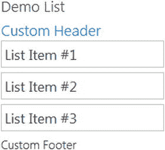

图 5-9。

Custom header and footer being rendered on the List View Web Part

您可以通过提供返回页眉和页脚的函数来进一步扩展这一点，而不是在同一行中声明 HTML，如下所示:

`overrideContext.Templates.Header = overrideHeader;`

`overrideContext.Templates.Footer = overrideFooter;`

生成的函数如下所示:

`function overrideHeader() {`

`return "<h2>Custom Header</h2>";`

`}`

`function overrideFooter() {`

`return "<h3>Custom Footer</h3>";`

`}`

将这段代码放在它自己的函数中为增加功能打开了大门。您可以想象这样一个场景，您需要进行一个 web 服务调用来检索您想要在标题中显示的数据。这允许非常健壮的代码启动并执行任何可用的任务。您可以开始以这种方式创建非常丰富的用户体验。Visual Studio 中的完整代码如图 [5-10](#Fig10) 所示。

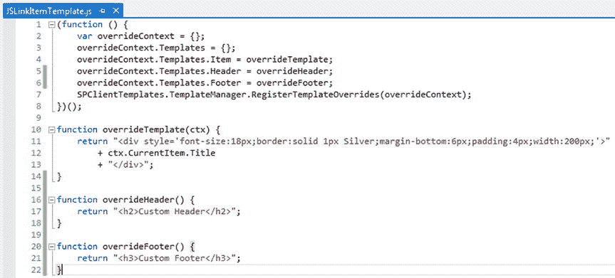

图 5-10。

Providing header and footer overrides via JavaScript functions

使用文件➤另存为以新名称保存此文件。将其命名为 JSLinkItemTemplate.js，上传到 Webparts 文档库中的 JSLink 文件夹。导航回列表视图 Web 部件，将其置于编辑模式，并将 JSLink 属性更新为以下内容:

`∼site/Webparts/JSLink/JSLinkItemTemplate.js`

web 部件应该使用新的 JSLink 文件。这个例子离真实世界的体验还很远。让我们用一些数据来更新演示列表，这些数据可以表示一个任务列表或者其他类型的具有状态的列表。导航到演示列表并从功能区访问列表设置。在“列表设置”页面上，创建一个名为“状态”的新选项栏。提供以下选择(见图 [5-11](#Fig11) ):

*   准时
*   延时的
*   晚

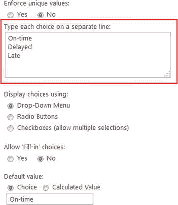

图 5-11。

Adding a Choice field to the Demo List called Status

我们将使用这个新的状态栏来显示基于所选状态的图像。然而，在我们这样做之前，让我们用一些对业务更有意义的数据填充演示列表。图 [5-12](#Fig12) 显示了一些更合适的数据列表。

图 5-12。

Demo List with more real-world data populated

为了使这个例子更加真实，我们将更新我们的脚本，以便满足以下要求:

*   呈现 web 部件时，每个项目将只显示标题。
*   将显示自定义页眉和页脚，并为用户提供说明。
*   当用户单击项目标题时，状态和描述将显示在下面。
*   状态将显示为图像。

让我们从页眉和页脚开始，因为这些函数已经存在，我们只需要更新返回的内容。可以使用以下内容更新自定义代码:

`function overrideHeader() {`

`return "<h3>These items are tasks from the Demo List:</h3>";`

`}`

`function overrideFooter() {`

`return "<h4>Click an item to view it's details.</h4>";`

`}`

我们实际上根本没有对代码做太多修改。我们已经分别将 H2/H3 更改为 H3/H4，并更新了返回的文本。我们将使用客户页眉作为 web 部件中的标题，自定义页脚现在为用户提供说明。接下来，我们将更新`overrideTemplate`函数；这是实施重大变革的地方。以下面的代码为例:

`function overrideTemplate(ctx) {`

`var status = ctx.CurrentItem.Status;`

`var image = "";`

`if (status == "Delayed")`

`image = "/apress/Webparts/JSLink/Status-Delayed.png";`

`if (status == "On-time")`

`image = "/apress/Webparts/JSLink/Status-Ontime.png";`

`if (status == "Late")`

`image = "/apress/Webparts/JSLink/Status-Late.png";`

`return "
"`

`+ ctx.CurrentItem.Title`

`+ "
"`

`+ "" + ctx.CurrentItem.Status + " "`

`+ "" + ctx.CurrentItem.Description + ""`

`+ "
"`

`+ "
";`

`}`

`overrideTemplate`功能更新了不少。虽然乍一看它似乎有更多的功能，但实际上并没有更多的功能。有额外的逻辑以及更多的 HTML。让我们分别分解每一部分，以便更好地理解发生了什么。

`var status = ctx.CurrentItem.Status;`

`var image = "";`

这两行简单地声明了将在代码的其余部分使用的几个变量。首先，我们声明一个名为`status`的变量，并将当前列表项的`Status`属性的值赋给它。这只是简化了代码，使其可读性更好。接下来，我们声明一个名为`image`的空字符串。这将保存我们希望根据项目状态显示的图像的 URL。

`if (status == "Delayed")`

`image = "/apress/Webparts/JSLink/Status-Delayed.png";`

`if (status == "On-time")`

`image = "/apress/Webparts/JSLink/Status-Ontime.png";`

`if (status == "Late")`

`image = "/apress/Webparts/JSLink/Status-Late.png";`

这个部分是对`if`语句的简单分组。我们检查变量`status`的值，对照列表列的已知值进行检查。一旦发现状态匹配，我们就将`image`变量设置为我们想要显示的图像的适当 URL。

Note

本例中使用的图像可以从 Apress 网站下载。访问 Apress 站点，搜索这本书的标题，找到图像文件和源代码。在这个例子中，为了简单起见，我将图像和 JavaScript 文件上传到同一个文件夹中。

`return "
"`

`+ ctx.CurrentItem.Title`

`+ "
"`

`+ "" + ctx.CurrentItem.Status + " "`

`+ ""`

`+ "<strong>Description</strong> "`

`+ ctx.CurrentItem.Description + ""`

`+ "
"`

`+ "
"`

最后，我们更新了返回的 HTML，这样我们就可以显著地改变结果。首先，我们用一些额外的内联 CSS 创建一个 DIV 元素，以及一个 CSS 类`list-item-div`。当我们使用 jQuery 定位元素时，将会用到这个 CSS 类。接下来，我们显示当前的列表项标题，然后创建一个子 DIV 元素来保存状态和描述。这个 DIV 也有一些包含`display:none;`的内联 CSS。这将使 DIV 保持隐藏，直到我们想要查看它。我们继续创建 HTML 来保存项目状态、状态图像和描述，最后关闭所有的 DIV 元素。

此时，页面将呈现出来，您将看到页面上每个列表项的标题，但是状态和描述信息将被隐藏。我们需要提供一种方便查看这些信息的方法。下面的函数将处理这个问题:

`function listItemClick() {`

`$(".list-item-div").on("click", function () {`

`var childDiv = $(this).children()[0];`

`$(childDiv).toggle("slow");`

`});`

`}`

当我们在前一个函数中创建每个子 DIV 时，我们隐藏了那些使用 CSS 的子 DIV，并应用了一个 CSS 类。这个类只是提供一种通过 jQuery 定位它的方法。我们使用 jQuery 内置的`on`函数为每个 DIV 附加一个点击事件。所以通过使用`$(".list-item-div").on("click", function ()...`，我们告诉 jQuery 找到所有带有`list-item-div` CSS 类的元素，并为每个元素附加一个`on click`事件。当单击元素时，将触发提供的函数。在这个函数中，我们要求 jQuery 给出 DIV 中的第一个子元素。`$(this).children()[0]`告诉 jQuery，对于刚刚被点击的条目(“this”)，给我们它的“children”集合中的第一个子对象。因为我们精心制作的 HTML 有一个父 DIV 和一个子 DIV，所以我们知道这将返回保存状态和描述信息的 DIV 元素。

接下来，我们使用一个名为`toggle`的 jQuery 函数来显示元素。`toggle`实际上会切换元素的可见性。因此，如果元素当前是隐藏的，`toggle`将显示它，反之亦然。通过使用这个函数，我们可以用一行代码轻松地提供打开和关闭功能。

一旦我们有了用于将点击事件附加到 div 的函数，我们就需要一种方法来触发它。简单地编写这个函数并把它放在脚本中，在它被调用之前什么都不会做。通常，我们会包含一个 jQuery `Document` `.ready`调用，以确保使用`$(function()...`调用正确连接事件。然而，在 JSLink 中，这不起作用，它将产生一个错误。原因是 JSLink onload 函数将在 jQuery 加载之前触发。这意味着来自 jQuery 的可靠的`Document.ready`函数在 JSLink 中是无用的。但是，SharePoint 提供了自己的内置函数来做同样的事情:

`_spBodyOnLoadFunctions.push(listItemClick);`

`_spBodyOnLoadFunctions`允许您注册自己的 JavaScript 函数，以便在页面加载时触发。它与 jQuery 的`Document.ready`非常相似，但是它与 JSLink 配合得很好，所以这是我们在连接 jQuery 事件时需要使用的方法。Visual Studio 中的完整脚本如图 [5-13](#Fig13) 所示。

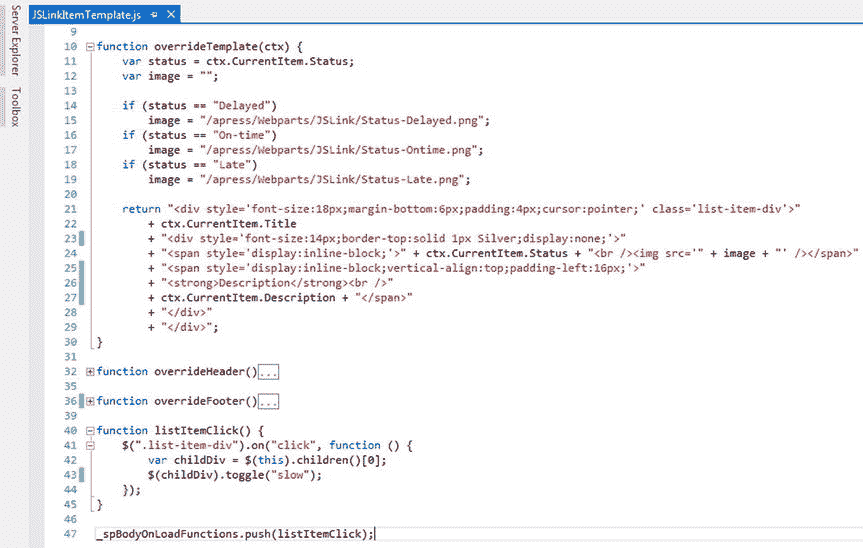

图 5-13。

The updated JSLinkItemTemplate.js script in Visual Studio. The custom header and footer functions have been collapsed for readability

保存更新后的文件，并将其上载到 web 部件库中的 JSLink 文件夹。在此脚本正常工作之前，您需要更新列表视图 Web 部件的一些属性。当您第一次将列表视图 Web 部件放在页面上时，返回的数据是列表类型的最低数据。例如，演示列表是一个自定义列表，所以默认情况下只返回标题和描述。这对于任务列表也是一样的；例如，当列表视图 Web 部件添加到页面时，只返回创建时存在的列。当然，你可以很容易地更新这个。导航到放置列表视图 web 部件的页面，并将该页面和 Web 部件置于编辑模式。在 web 部件的工具窗格中，第一个属性称为`Selected`视图。使用下拉菜单选择所有物品视图，如图 [5-14](#Fig14) 所示。

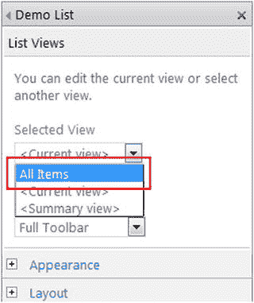

图 5-14。

Changing the Selected View on the List View Web Part

更改这个视图可以确保新的`Status`属性将被返回，并可用于我们的 JSLink 代码。接下来，因为我们在代码中使用自定义标题来呈现标题，所以我们将从 web 部件中移除 Chrome。在工具窗格中展开“外观”折叠面板。在这一部分的最底部，你会找到 Chrome 类型属性。从下拉菜单中选择无，如图 [5-15](#Fig15) 所示。

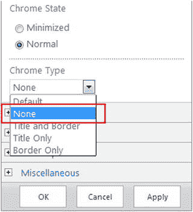

图 5-15。

Changing the Chrome Type on the List View Web Part

单击确定，然后保存页面。列表视图 Web 部件现在应该可以使用 JSLink 文件正确显示。结果如图 [5-16](#Fig16) 所示。将显示自定义页眉和页脚，它们为用户提供 web 部件标题以及如何使用 web 部件的说明。Chrome 不再显示，每个项目仅显示项目标题。将鼠标悬停在项目上，鼠标光标将变为指针，表示可以单击它。单击该项会触发 jQuery `toggle`函数，打开和关闭该项。

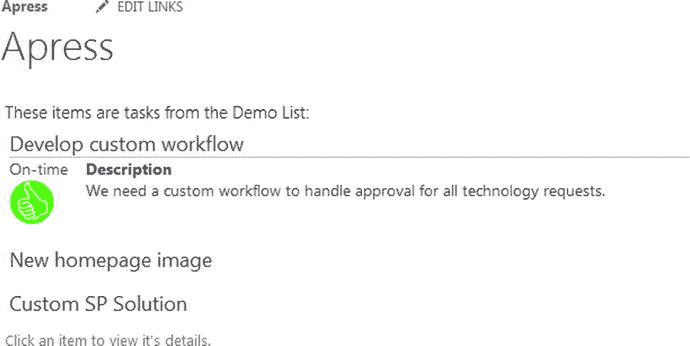

图 5-16。

The Demo List items displayed using the JSLink file

正如您所看到的，这与您之前看到的现成的列表视图 Web 部件相比有了很大的变化。事实上，它的外观和行为就像您所期望的那样——一个根据业务需求构建的自定义 web 部件！过去，这种类型的解决方案需要服务器端编码和已部署到 SharePoint 服务器的自定义 web 部件。现在这一切都可以在浏览器中用 JavaScript 实现了！接下来，让我们看看如何操作单个列，而不是一次操作所有数据。

## 使用字段模板

JSLink 中的字段模板允许您针对列表中的特定字段或列进行自定义呈现。当您的自定义渲染需求不复杂时，您可以使用字段模板。使用这个模板，您肯定会得到非常复杂的自定义渲染。但是，与项目模板不同的是，项目模板更有针对性，在项目模板中，您最终得到的东西看起来一点也不像列表视图 Web 部件。最终结果是类似于类固醇的列表视图 Web 部件。

代码看起来非常类似于项目模板代码。我们将继续使用状态栏。对于此解决方案，我们将检查状态栏并返回相应的图像，但这次它将作为列数据出现在列表视图 Web 部件中。在 Visual Studio 中创建一个新文件，并从以下代码开始:

`(function () {`

`var overrideContext = {};`

`overrideContext.Templates = {};`

`overrideContext.Templates.Fields =`

`{`

`'Status': { 'View': overrideTemplate }`

`};`

`SPClientTemplates.TemplateManager.RegisterTemplateOverrides(overrideContext);`

`})();`

这段代码看起来非常类似于条目模板代码，但有几处主要的变化。首先，我们不再使用自定义页眉和页脚。原因是该模板不会覆盖 web 部件的标准功能。所以我们仍然需要常规的列标题、排序等等。接下来，我们用以下代码行指定这是一个字段模板:

`overrideContext.Templates.Fields =`

`{`

`'Status': { 'View': overrideTemplate }`

`};`

`'Status'`告诉 JSLink 我们的目标是列表中的状态字段。`'View'`指定在呈现状态栏时触发哪个函数。所以我们需要使用下面的代码声明名为`overrideTemplate`的函数来呈现列:

`function overrideTemplate(ctx) {`

`var status = ctx.CurrentItem.Status;`

`var image = "";`

`if (status == "Delayed")`

`image = "/apress/Webparts/JSLink/Status-Delayed.png";`

`if (status == "On-time")`

`image = "/apress/Webparts/JSLink/Status-Ontime.png";`

`if (status == "Late")`

`image = "/apress/Webparts/JSLink/Status-Late.png";`

`return "";`

`}`

这个函数与前面的例子几乎相同。我们仍然声明了几个变量来保存当前项目的状态和图像 URL。通过使用`if`语句，我们根据状态设置图像 URL，就像以前一样。不同的是返回，这是一个图像 HTML 元素。我们将`SRC`属性设置为从`if`语句中确定的图像 URL。我们还设置了一个 CSS 类`status-image`和一个名为`data-val`的属性，用于保存状态的文本值。最后两个属性将用于 jQuery click 事件。这个函数只是返回状态的图像，而不是状态的文本。

接下来，我们将使用下面的代码来设置将点击事件附加到每个图像的函数:

`function listItemClick() {`

`$(".status-image").on("click", function () {`

`var status = $(this).attr("data-val");`

`alert(status);`

`});`

`}`

这个函数看起来和前面的例子非常相似。我们使用 CSS 类“`status-image`”设置了一个 jQuery click 事件。接下来，我们使用`$(this).attr("data-val")`获取状态文本。jQuery 的“`attr`”函数返回 HTML 元素上任何属性的值，所以我们可以很容易地访问这个值。然后，我们发出一个带有状态文本的标准警报。最后，我们使用`_spBodyOnLoadFunctions.push`函数连接函数:

`_spBodyOnLoadFunctions.push(listItemClick);`

这个例子比条目模板例子小得多。这是因为覆盖只针对单个字段，而不是所有列以及页眉和页脚。Visual Studio 中完整的代码示例如图 [5-17](#Fig17) 所示。

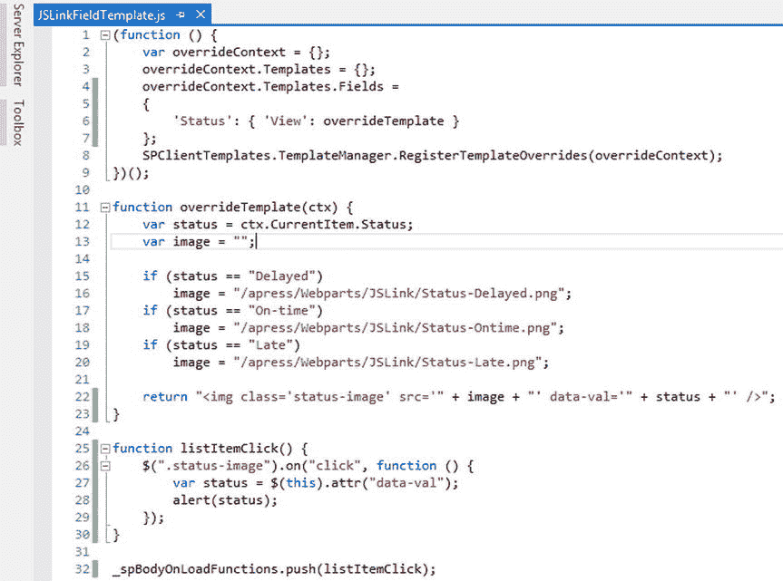

图 5-17。

JSLinkFieldTemplate.js file in Visual Studio

保存这个文件，并将其命名为`JSLinkFieldTemplate.js`。将其上载到 Webparts 文档库中其他 JSLink 文件所在的 JSLink 文件夹中。导航回列表视图 Web 部件，将其置于编辑模式，并将 JSLink 属性更新为以下内容:

`∼site/Webparts/JSLink/JSLinkFieldTemplate.js`

与项模板一样，您可能需要使用 Selected View 属性设置适当的视图。您也可以将 Chrome 类型设置回默认值，以便再次显示 web 部件标题。列表视图 Web 部件中呈现的新 JSLink 文件如图 [5-18](#Fig18) 所示。

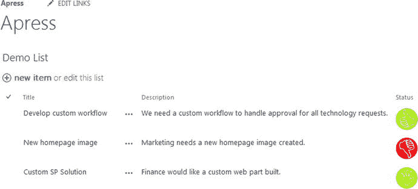

图 5-18。

Field template rendering using JSLink

您也可以点击图像，在 JavaScript 警告中查看状态文本，如图 [5-19](#Fig19) 所示。

图 5-19。

Click event on the status image

您可以通过提供多个覆盖函数来覆盖多个字段。例如，如果我们想对描述字段应用自定义呈现，我们可以将代码更新为:

`(function () {`

`var overrideContext = {};`

`overrideContext.Templates = {};`

`overrideContext.Templates.Fields =`

`{`

`'Status': { 'View': overrideTemplate },`

`'Description': { 'View': overrideDescTemplate }`

`};`

`SPClientTemplates.TemplateManager.RegisterTemplateOverrides(overrideContext);`

`})();`

`function overrideDescTemplate(ctx) {`

`return "" + ctx.CurrentItem.Description + "";`

`}`

Fields 属性将接受多个覆盖，只需在每个覆盖之间放置一个逗号。在本例中，我们创建了另一个名为`overrideDescTemplat` `e`的函数，它只是返回当前项目的描述字段，该字段包含在一个 SPAN 元素中，该元素提供了一种粗体字体。Visual Studio 中完整的脚本如图 [5-20](#Fig20) 所示。

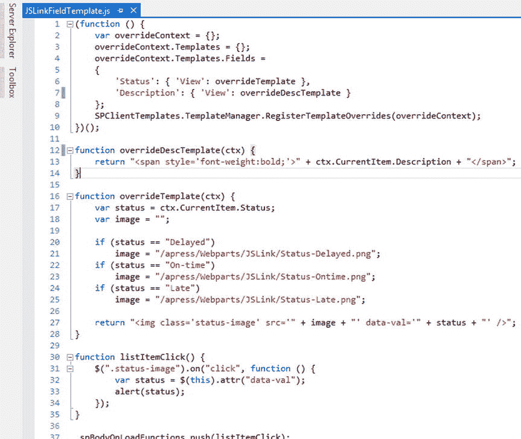

图 5-20。

The updated JSLinkFieldTemplate.js file in Visual Studio Note

有些字段不能使用 JSLink 覆盖。例如，分类字段不允许不同的呈现。如果您可以覆盖像托管元数据列这样复杂的字段的呈现，您可以想象这会导致多么令人头痛的问题。如果您试图覆盖任何不允许这样做的字段，只会导致 SharePoint 忽略您的自定义呈现功能。这很好，因为这意味着你的脚本不会分页；然而，这可能会令人沮丧，因为似乎什么也没发生！如果您注意到了这一点，请后退一步，记住有些字段是不能被覆盖的。

正如您在这个更新的代码示例中看到的，JSLink 提供了覆盖一个或多个字段所需的所有工具。只需提供一个函数来处理呈现并定义覆盖。保存此文件并将其上载到文档库。图 [5-21](#Fig21) 显示了使用新的 JSLink 文件呈现的列表视图 Web 部件。

图 5-21。

Updated JSLink file rendering multiple fields on the web part

现在，您已经看到了使用 JSLink 呈现列表视图 Web 部件的多个示例。无论您需要覆盖特定的字段还是完全改变 web 部件的外观，您都拥有了获得自定义解决方案所需的所有工具。通过加载多个脚本来帮助您创建健壮的解决方案，您可以进一步使用 JSLink。

## 加载多个脚本

在使用 JSLink 进行开发的过程中，您可能会发现您的文件变得越来越大，或者您可能还有其他一些想要加载的脚本。幸运的是，使用 JSLink 很容易做到这一点。JSLink 允许添加多个文件，只需使用管道`|`，将其放在 JSLink 属性中的每个文件路径之间。例如，如果我们的文件夹中有多个文件，我们可以使用以下路径:

`∼site/Webparts/JSLink/File1.js|∼site/Webparts/JSLink/File2.js`

带有`|`分隔符的组合路径将放在列表视图 Web 部件的 JSLink 属性中。我们可以更新前面的代码示例来说明这一点。首先，我们将使用以下代码返回到该示例的简化版本:

`(function () {`

`var overrideContext = {};`

`overrideContext.Templates = {};`

`overrideContext.Templates.Fields =`

`{`

`'Status': { 'View': overrideTemplate }`

`};`

`SPClientTemplates.TemplateManager.RegisterTemplateOverrides(overrideContext);`

`})();`

`function overrideTemplate(ctx) {`

`var status = ctx.CurrentItem.Status;`

`var image = "";`

`if (status == "Delayed")`

`image = "/apress/Webparts/JSLink/Status-Delayed.png";`

`if (status == "On-time")`

`image = "/apress/Webparts/JSLink/Status-Ontime.png";`

`if (status == "Late")`

`image = "/apress/Webparts/JSLink/Status-Late.png";`

`return "";`

`}`

这个示例基本上回到了第一个字段代码示例，其中我们只使用图像覆盖了 Status 字段。呈现警报的自定义 jQuery 代码已经被删除，所以我们将把它移到另一个文件中。Visual Studio 中的脚本如图 [5-22](#Fig22) 所示。

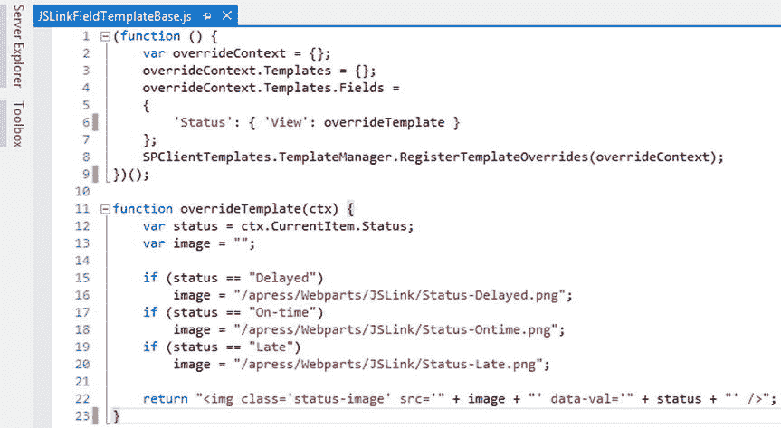

图 5-22。

JSLink file that only renders the Status field on the list

保存该文件并将其命名为 JSLinkFieldTemplateBase.js。接下来，我们将创建配套文件来处理 jQuery click 事件功能。使用文件➤新➤文件创建一个新文件。选取“Web”类别，然后从选项中选取“JavaScript 文件”。我们将使用上一节中的代码，该代码使用 jQuery 将 click 事件添加到 DIV 中，如下所示:

`function listItemClick() {`

`$(".status-image").on("click", function () {`

`var status = $(this).attr("data-val");`

`alert("STATUS: " + status);`

`});`

`}`

`_spBodyOnLoadFunctions.push(listItemClick);`

这与之前的代码相同，只是在警报中添加了文本“STATUS:”而已。这主要是为了表明我们正在使用一个新文件，并且 JSLink 正在加载这两个文件。保存该文件，命名为 JSLinkFieldTemplateExt.js，Visual Studio 中的脚本如图 [5-23](#Fig23) 所示。

图 5-23。

JSLinkFieldTemplateExt.js file in Visual Studio

既然已经创建了这两个文件，请将它们上载到 Webparts 文档库中的 JSLink 文件夹。文件上传后，您可以创建组合路径，它应该如下所示:

`∼site/Webparts/JSLink/JSLinkFieldTemplateBase.js|∼site/Webparts/JSLink/ JSLinkFieldTemplateExt.js`

将列表视图 Web 部件置于编辑模式，并使用组合路径更新 JSLink 属性。单击应用，然后保存页面。乍一看，自定义渲染变化不大。点击一个状态图像触发点击事件，如图 [5-24](#Fig24) 所示。

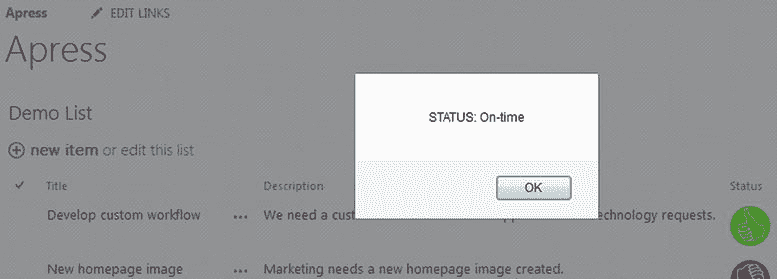

图 5-24。

Updated click event from the second JavaScript file

在警报中，您可以看到显示了附加“状态:”文本的状态。这是对两个 JavaScript 文件已经通过 JSLink 加载的确认。虽然这是一个非常简单的例子，但它应该说明了加载多个文件的强大功能。随着脚本变得越来越大，您现在可以灵活地将代码分成多个文件，并通过 JSLink 引用它们。

## 摘要

在本章中，我们探讨了 JSLink 作为在 SharePoint 中构建自定义解决方案的一种方式的强大功能。我们看到了如何使用此方法来覆盖列表视图 Web 部件的默认呈现。您可以使用“项目”模板来完全自定义整体呈现，或者使用“字段”模板来覆盖列表中的单个或多个字段。我们还看到了如何将代码分解成多个文件。希望这一章展示了 JSLink 的可能性。在下一章中，我们将继续关注 SharePoint 中使用显示模板和结果源创建自定义搜索解决方案的新功能。