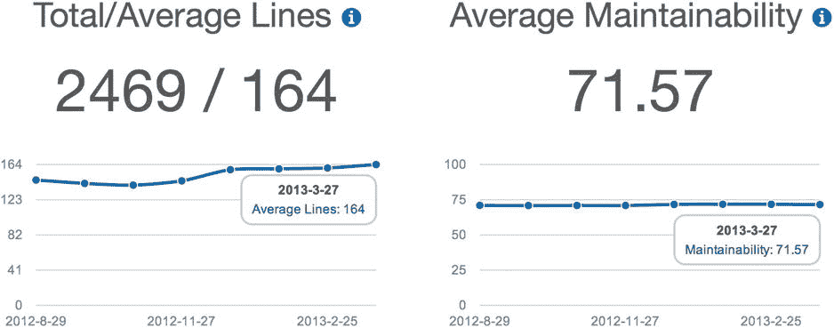
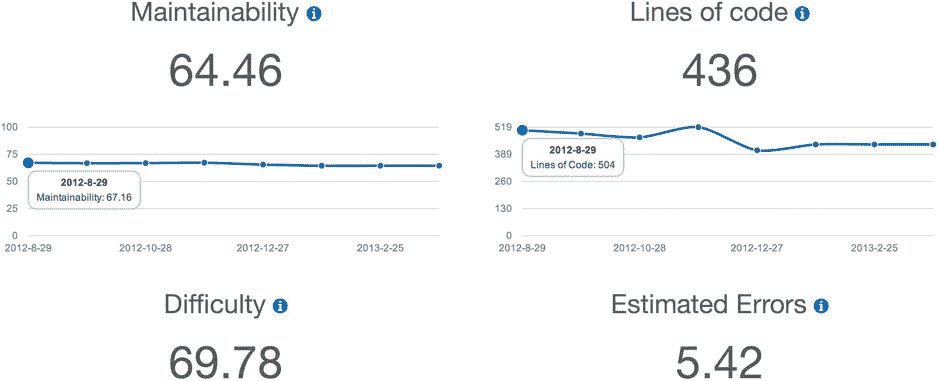
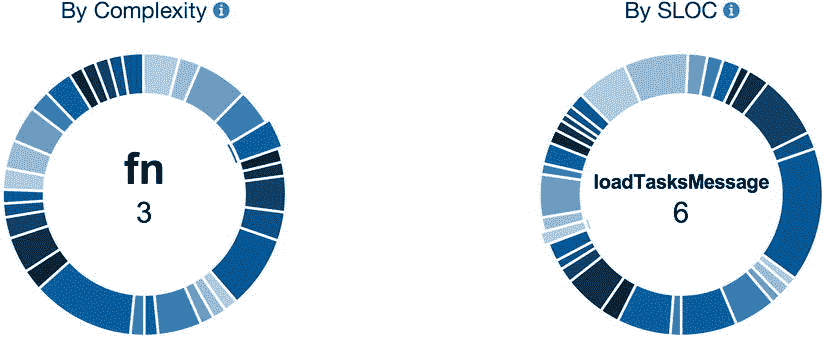
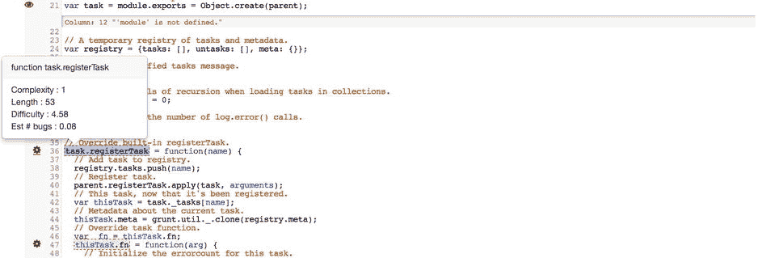

# 九、代码质量

Abstract

品质不是一种行为，而是一种习惯。

—亚里士多德

品质不是一种行为，而是一种习惯。—亚里士多德

写出高质量的 JavaScript 意味着什么？质量可以被测量吗，或者它是一种主观的观点，类似于柏拉图式的关于美和艺术的理想？程序员倾向于在对质量的主观和客观理解之间摇摆不定。他们提升了软件工艺等概念，软件工艺是编写软件的手工方法。软件工匠被描述为拥有高超的技能，并且已经将他们的工作浓缩到基本的组成部分。匠人的电气化体现就是所谓的摇滚明星程序员。一个人的定义是基于一个概念，即一个人可以是如此独特的天才艺术家，工作产品在某种程度上大于他们的部分之和。然而，许多编程都围绕着通过过程化和可重复的过程来度量、重构和改进代码。这意味着质量可以被提取为一系列独立的和可测量的步骤。

如果质量是可以衡量的，那么 JavaScript 开发人员有什么机制可以确保他们产生优秀的代码？本章深入探讨了编写高质量 JavaScript 的概念，首先定义了与编程相关的质量，然后提供了一个评估和改进代码的框架。

## 定义代码质量

像许多吸引来自不同背景的个人的复杂学科一样，程序质量的定义经常跨越艺术和科学之间的界限。编程行为通常是创造性解决问题和运用工程师的严谨来提炼解决方案的融合。编程是通过编码的可重复步骤进行的客观观察和来自个人经验和洞察力的主观评估之间的一种张力。事实上，质量这个词支持这两种观点。芭芭拉·w·塔奇曼是这样解释品质的两面性的:“品质”这个词当然有两个意思:第一，某物的本质或本质特征，如“他的声音具有命令的品质”；第二，优秀的条件意味着好的质量，区别于差的质量(塔奇曼，1980)。

塔奇曼继续将质量描述为“自我滋养”，这是一个非常令人回味的形象。质量也被描述为一种追求，这表明它不是一个目的地，而是一个旅程。这可能是因为定义不固定；它属于时代精神。要证明这一点，你只要看看艺术史就知道了，艺术史一直在排斥或拥抱不同的艺术表现形式。在一生的时间里，法国印象派画家从被艺术机构嗤之以鼻到数年后达到了艺术界的顶峰。他们的画没有改变——只是品质的定义变了。

在这一章中，我认为评价 JavaScript 源代码需要主观和客观两种立场。事实上，我相信你甚至不能把一个和另一个完全分开。然而，在我提出这个问题之前，我需要正确地展示这两种形式。

### 主观质量

主观质量通常描述受启发的或必要的代码，或者 Truchman 所说的“天生的优秀”在他关于产品质量的文章中，大卫·加文定义了一种质量形式，他称之为超越。他将卓越品质定义为

> .... absolute and universally accepted, uncompromising standards and signs of high achievement. However, supporters of this view claim that quality cannot be defined accurately; On the contrary, it is a simple and unanalyzable attribute, and we can only know it through experience. This definition borrows a lot from Plato's discourse on beauty. In the seminar, he thought that beauty was one of "Platonic forms", so it was an undefined term. Like other terms considered by philosophers as "logical primitive", beauty (and perhaps quality) can only be understood after a person comes into contact with a series of objects showing its characteristics. (Gavin, 1984)

这个定义清楚地阐明了这样一个观点，即主观质量依赖于个人经验或有技能的个人的指导，以认可和促进他们领域内的优秀。它断言，主观质量在其本质层面上是普遍真实的，与其说是创造的，不如说是发现的。

### 客观质量

客观质量断言，如果天才是可以衡量的，它是可以量化和重复的。蛋糕的质量并不取决于面包师天生的优秀，而是精确选择和测量配料以及精确遵循食谱的结果。客观质量在一个反馈循环中产生、应用和提炼关于主题的经验近似值。这种形式的质量有助于算法、测试套件和软件工具。在本章的剩余部分，我将介绍一种通过客观质量来改进代码的方法。

## 质量是如何衡量的？

您正在为质量寻找一个可用的定义，但是首先您需要考虑它与编程相关的各个方面。这些方面通常被表示为软件度量:

> Software metrics are measurements of some attributes of a piece of software or its specifications. Because quantitative measurement is essential in all sciences, computer science practitioners and theorists have been trying to introduce similar methods into software development. The goal is to obtain objective, repeatable and quantifiable metrics, which may have many valuable applications in schedule and budget planning, cost estimation, quality assurance testing, software debugging, software performance optimization and optimal personnel task assignment.

为了通过度量来框定代码质量，我包含了六个度量标准:

*   美学:这个标准衡量代码的视觉内聚性，但是也包括格式、命名约定和文档结构的一致性和思考性。美学被测量来回答这些问题:
*   代码的可读性如何？
*   页面上的各个部分是如何组织的？
*   它在编程风格方面使用了最佳实践吗？
*   完整性:完整性度量代码是否“适合目的” [1](#Fn1) 一个程序要被认为是完整的，必须满足或超过指定问题的要求。完整性还可以衡量特定实现符合行业标准或理想的程度。这项措施试图回答的关于完整性的问题是:
*   代码解决了它想要解决的问题吗？
*   给定一个期望的输入，代码会产生期望的输出吗？
*   它满足所有定义的用例吗？
*   安全吗？
*   它能很好地处理边缘情况吗？
*   是否经过充分测试？
*   性能:性能根据已知的基准来测量实现，以确定它有多成功。这些指标可能会考虑程序大小、系统资源效率、加载时间或每行代码的错误等属性。使用绩效评估，您可以回答以下问题:
*   这种方法的效率如何？
*   它能承受多大的负荷？
*   这种代码的容量限制是什么？
*   努力:这个度量测量产生和支持代码的开发成本。努力可以根据所用的时间、金钱或资源来分类。衡量努力有助于回答这些问题:
*   代码可维护吗？
*   它容易部署吗？
*   有记录吗？
*   写作花了多少钱？
*   持久性:为了具有持久性，程序在产品中的生命周期被测量。耐久性也可以被认为是对可靠性的一种衡量，这是衡量寿命的另一种方式。耐久性可以通过测量来回答这些问题:
*   它的性能可靠吗？
*   在必须重启、升级和/或更换之前，它可以运行多长时间？
*   是否可扩展？
*   接受度:接受度衡量其他程序员如何评估和评价代码。跟踪接收允许您回答这些问题:
*   代码有多难懂？
*   设计决策有多周密？
*   该方法是否利用了已有的最佳实践？
*   用起来过瘾吗？

## 为什么要度量代码质量？

“我不能对代码质量收费。”当我问一个朋友对这个问题的看法时，他直接引用了我的一个朋友的话。他的意思是代码质量主要对程序员有利，对客户来说是无形的税收。我能理解他的观点；我有不止一次的经历，当我抱怨测试方法的时候，一个潜在的客户的眼睛会相应地转回来。我朋友接着说:“客户花钱买的是一个结果，不是一个过程。当我购买西南航空的机票时，我支付的是到达目的地的费用，而不是乘坐飞机。”这种说法听起来有些天真，但是我将在这一节中论证测量代码质量不会让你失去竞争优势；这是你的竞争优势。

管理顾问汤姆·彼得斯曾经说过，“能衡量的就能完成。”在这种情况下，衡量意味着向前看，以便预测变化。通常，测试和质量度量只是在出现问题后进行的事后分析。当在开发过程中持续应用时，度量代码质量可以让您理解项目的健康状况。它也可以暗示未来负面事件的可能性。考虑以下方式，代码质量不仅可以提高您的代码，还可以提高项目的底线:

*   技术债务是一个隐喻，它描述了随着时间的推移，坏代码从您的项目中窃取的时间、金钱和资源等不断增加的成本。有许多质量度量，包括代码复杂性分析，可以识别软件中代码不足的区域。
*   有几个度量标准(比如 Halstead metrics，我将在后面介绍)可以表明维护您的代码库所需的未来工作量。了解这一点可以帮助你准确地为这些改进做预算。
*   许多代码质量度量试图理解代码中的路径。然后，这些措施可以识别缺陷存在的可能性，以及它们可能隐藏的位置。这些工具在评估另一个团队的代码时特别有价值，因为它们可以像地雷探测器一样，通过算法扫描未知的函数领域。
*   虽然发现新错误的能力很重要，但是知道何时停止编写测试是安全的技能也很重要。许多著名的开发人员已经证明测试不是免费的，所以知道什么时候停止可以省钱。许多代码质量工具可以使用简单的试探法告诉您何时达到了适当的测试覆盖率水平。
*   接受代码质量度量是预防性维护的一种形式。我听过有人不屑一顾地谈论代码质量，说这就像刷牙一样。在某种程度上，他们是对的，质量的本质是后期添加要困难得多，就像刷牙不会去除现有的蛀牙一样。

既然有了代码质量的基线，您就有了一个有效的定义，并且您不仅理解了如何度量质量，还理解了为什么您应该这样做。在下一节中，我将解释您在追求质量的过程中可以使用的各种工具和技术。

## 在 JavaScript 中测量代码质量

客观质量分析在程序上搅动代码，以便计算精华能够上升到顶端。这项任务是通过使用编程工具来完成的，这些工具在各种环境中评估代码，使用度量标准来得出最终的质量分数。本节解释静态代码分析，这是一种非常适合评估 JavaScript 质量的方法。

### 静态代码分析

静态代码分析是在不运行代码的情况下分析代码的过程。静态分析很像文本编辑器中的拼写检查器。拼写检查器扫描文档以查找文本正文中的错误和歧义，而无需理解书写的含义。类似地，代码的静态分析分析源代码的功能正确性，而不必知道它做什么。尽管 JavaScript 是一种非常动态的语言，但它非常适合静态分析，因为它没有被编译成另一种形式。本节将评估 JavaScript 中的两种静态分析方法，包括语法验证器和复杂性分析工具。

#### 语法验证

在 JavaScript 中，语法验证有两种方法。第一种是使用诸如 JSLint [3](#Fn3) 或 JSHint， [4](#Fn4) 之类的 linter，它不仅检查你的代码的功能正确性，而且当你的程序没有遵循它们的最佳实践时，偶尔还会提供一点严厉的爱。考虑以下质量可疑的代码:

`// foo.js`

`onmessage = function(event) {`

`"use strict"`

`event = event`

`if(event){`

`return {"success" : postMessage('pong'), "success" : "ok"}`

`}`

`};`

我使用的是 JSHint，您可以通过这种方式将它作为 npm 模块安装(根据您的用户帐户权限，您的系统可能需要使用`sudo`):

`npm install jshint -g`

安装完成后，您可以从终端的命令行对源文件运行 linter:

`jshint foo.js`

JSHint 将报告这些警告:

`foo.js: line 7, col 3, Missing semicolon.`

`foo.js: line 8, col 16, Missing semicolon.`

`foo.js: line 10, col 56, Duplicate key 'success'.`

`foo.js: line 10, col 63, Missing semicolon.`

请注意，linter 只通知您缺少分号和重复的键。就个人而言，我认为`event = event`的无意义赋值也值得一提，但从技术上讲，这段代码没有任何问题。这种模糊性说明了 linter 的观点驱动方法，即它不仅验证语法，还验证您的方法。

对于那些对识别代码中所谓的不良气味不太感兴趣的人，可以使用一个简单的独立 ECMAScript 解析器，比如 Esprima， [5](#Fn5) ，它只会剔除无效代码。可以从 npm 模块安装 Esprima，如下所示:

`npm install -g esprima`

与 JSHint 类似，它可以从终端的命令行验证代码:

`esvalidate foo.js`

完成后，Esprima 应该会在终端窗口中输出如下内容:

`foo.js:6: Duplicate data property in object literal not allowed in strict mode`

Linters 和 parsers 是建立代码质量基线的优秀工具。这些工具中的许多可以并且应该集成到更大的开发工作流中。它们是提高我前面提到的美学、努力和接收质量的关键因素。然而，在大多数情况下，简单的语法卫生不足以确保代码质量。下一节将探索有助于减少代码库中复杂性蔓延的工具。

#### 复杂性

Antoine de Saint-Exupery 可能是在谈论代码质量，他说，“完美是可以实现的，不是当没有什么可以添加的时候，而是当没有什么可以删除的时候。”高质量的代码不仅在形式上是正确的，而且在概念上是清晰的，并且在向读者说明所需的问题是如何解决的能力上是富有表现力的。不幸的是，有许多原因可以解释为什么简洁的代码会退化成操作数和操作符的混乱。团队可能会改变，功能可能会增加或减少，涉众的目标可能会改变；所有这些事件都发生在程序员们顶着压力继续发货的时候。

任何从事编程工作过一段时间的人都知道“代码是我们的敌人” [6](#Fn6) 一个简单的发展事实是，代码越多，质量越下降。代码是句法脂肪团；添加比移除容易。所谓的代码膨胀会导致一个复杂的程序，因为程序员需要阅读、理解和维护更多的源代码。聪明的程序员通过利用设计模式和应用程序框架来对抗复杂性。他们采用的开发方法试图通过一致的编程方法来降低复杂性。

除了这些方法之外，复杂性也可以通过编程使用质量度量标准来测量，这些质量度量标准被调整以发现困难的代码。本节探讨了识别、隔离并最终从程序中删除复杂 JavaScript 的方法。

#### 通过代码度量测量复杂性

对于运行时引擎来说，JavaScript 并不复杂。它可能漏洞百出，效率低下，或者不完整，但是与编程相关的复杂性是一个纯粹的人类难题。因此，代码复杂度是程序员为了完全理解一个代码单元而必须忍受的脑力劳动的度量。

多年来，程序员已经开发了度量复杂性的方法。这些度量确定了源代码中的缺点，这些缺点通常会导致复杂的代码。其中一些指标是经验观察的结果，其他的是关于程序员如何思考代码的算法解释。其他程序员已经将这些度量利用到工具中，这些工具可以定期扫描程序，以帮助开发人员了解他们的代码哪里需要重构或额外的测试。

本节展示了这些复杂性度量的精选，它们非常适合 JavaScript，以及一组可以自动化质量控制的工具。

##### 过多的评论

复杂代码的一个明显结果是，对于读者来说，源代码不再是自文档化的。注释通常被用来使未来的程序员能够翻译以前的开发人员的方法。出于这个原因，注释可能是一个引人注目的复杂性度量，因为它们表明还有工作要做或者可以进行改进。

##### 代码行

就像过度注释度量一样，计算代码行数具有直观的意义。随着功能的扩展，开发人员误解实现细节的可能性也在增加。代码行数可以用多种方法来度量，包括代码行数(LOC)，源代码行数(SLOC)，或者无注释的源代码行数(NCSL)。

评估 LOC 指标时，请确保您在正确的详细程度上进行分析。例如，将一个函数重构为三个函数可能会增加 LOC 度量，但实际上会降低源代码的整体复杂性。出于这个原因，开发人员有时称 LOC 为一个天真的度量。在评估 JavaScript 时，我发现 LOC 度量在函数级最有效，因为长函数通常是不必要的复杂性的标志。

##### 耦合

如果一个对象需要另一个对象的实现的显式知识才能工作，那么依赖对象就被认为是与另一个对象紧密耦合的。应尽可能避免这种耦合，因为它会使整个源变得脆弱。此外，这意味着信息隐藏正在失败，实现逻辑正在泄漏到更大的代码库中。

当静态分析 JavaScript 的紧密耦合时，可以计算用于访问对象链中属性的点数。在可能的情况下，你应该将通话链控制在三点或更少。这里有一个例子:

`// too tighly coupled`

`var word = library.shelves[0].books[0].pages[0].words[10];`

`// loosely coupled`

`var shelf = library.getShelfAt(0);`

`var book = shelf.getBookAt(0);`

`var page = book.getPageAt(0);`

`var word = page.getWordAt(10);`

##### 每个函数的变量

带有太多局部变量的 JavaScript 函数可能表明该函数可以改进，要么通过关注点分离，要么通过将变量分组到一个公共对象中。考虑以下示例:

`var race = function () {`

`var totalLaps = 10;`

`var currentLap = 0;`

`var driver1 = "Bob";`

`var driver2 = "Bill";`

`var car1 = {`

`driver: driver1`，

`fuel: 100`，

`maxMph: 100`，

`miles: 0`，

`tires: 4`

`};`

`var car2 = {`

`driver: driver2`，

`fuel: 100`，

`maxMph: 100`，

`miles: 0`，

`tires: 4`

`};`

`var cars = [car1, car2];`

`while (currentLap < totalLaps) {`

`currentLap++;`

`cars.forEach(function (car) {`

`car.miles += Math.floor(Math.random() * car.maxMph) + 1;`

`});`

`}`

`if (car1.miles > car2.miles) {`

`console.log(car1.driver + " wins!");`

`} else {`

`console.log(car2.driver + " wins!");`

`}`

`}`

`// => (Bob or Bill) wins!`

`race();`

`race`函数处理的不仅仅是模拟比赛，所以函数体充满了局部变量。通过改进关注点的分离，您可以将变量的数量从七个减少到两个，如下所示:

`var addCar = function (driver) {`

`return {`

`driver: driver`，

`fuel: 100`，

`maxMph: 100`，

`miles: 0`，

`tires: 4`

`};`

`};`

`var race = function (cars) {`

`var totalLaps = 10;`

`var currentLap = 0;`

`while (currentLap < totalLaps) {`

`currentLap++;`

`cars.forEach(function (car) {`

`car.miles += Math.floor(Math.random() * car.maxMph) + 1;`

`});`

`}`

`cars.sort(function (a, b) {`

`return a.miles > b.miles ? -1 : 1;`

`});`

`console.log(cars[0].driver + " wins!");`

`};`

`// => (Bob or Bill) wins!`

`race([addCar('Bob'), addCar('Bill')]);`

##### 每个函数的参数

对于使函数过于复杂的参数数量，并没有硬性规定。然而，向函数中传递一系列参数可能表明函数的目的是混乱的。在某些情况下，你可以通过逻辑地组织相关的论点来减少读者必须记住的论点的数量。这可以通过将它们分组到一个对象中来实现，您可以将该对象提供给函数:

`var detectCollision = function (x1, x2, y1, y2, xx1, xx2, yy1, yy2) {`

`// more code`

`}`

`// Restructure the function to accept logically organized objects.`

`// rect1 == { x1:0, x2:0, y1:0, y2:0 }`

`var detectCollision = function (rect1, rect2) {`

`// more code`

`}`

##### 嵌套深度

深度嵌套的代码比浅层代码更复杂，也更难测试。函数中的嵌套深度有多种测量方法。例如，这些函数中的每一个都有四个嵌套深度:

`// Nesting depth of three`

`var isRGBA = function (color) {`

`if (color != 'red') {`

`if (color != 'blue') {`

`if (color != 'green') {`

`if(color != 'alpha'){`

`return false;`

`}`

`}`

`}`

`}`

`return true;`

`};`

`// Nesting depth of three`

`var isRGBA = function (color) {`

`if (color != 'red' && color != 'blue' && color != 'green' && color != 'alpha') {`

`return false;`

`}`

`return true;`

`};`

`isRGBA`的第二个实现与第一个版本具有相同的嵌套深度，这似乎是不正确的；毕竟只有一个 if 语句。然而，逻辑操作符(`&&`)的使用是用来嵌套条件逻辑的，所以读者必须在心里解开它们。应该重新考虑总嵌套深度为 4 或更多的函数。

##### 圈复杂度

圈复杂度有一个听起来非常复杂的名字。每次大声说出来都觉得自己更聪明。自己试试；你会明白我的意思。幸运的是，这项措施背后的概念比其名称更容易理解。圈复杂度是由 Thomas McCabe (McCabe，1976)发明的，作为发现函数内部复杂度的一种方法。他断言，函数的复杂性与函数体内发生的控制流决策的数量成正比。

这种方法以两种方式之一得出复杂性分数:

*   它可以计算一个函数中的所有决策点，然后加 1。
*   它可以把函数看成一个控制流图 [7](#Fn7) (G)从顶点总数(n)和连通平方分量总数(p)中减去边数(e)；例如:

`v(G) = e - n + 2p`

###### 基本示例

为了更好地理解这一措施，让我们看看它的行动。在下面的例子中，我编写了一个假想的页面路由器，它可以从一些重构中受益。为了更加清晰，我在函数的每个决策点都增加了复杂度分数。此外，分数从 1 开始，而不是在末尾加 1。

`var route;`

`// score = 1`

`route = function() {`

`// score = 2`

`if (request && request.controller) {`

`switch (true) {`

`// score = 3`

`case request.controller === "home":`

`// score = 4`

`if (request.action) {`

`// score = 5`

`if (request.action === "search") {`

`return goTo("/#home/search");`

`// score = 6`

`} else if (request.action === "tour") {`

`return goTo("/#home/tour");`

`} else {`

`return goTo("/#home/index");`

`}`

`}`

`break;`

`// score = 7`

`case request.controller === "users":`

`// score = 8`

`if (request.action && request.action === "show") {`

`return goTo("/#users/show" + request.id);`

`} else {`

`return goTo("/#users/index");`

`}`

`}`

`} else {`

`return goTo("/#error/404");`

`}`

`};`

这个函数的复杂度为 8，McCabe 认为这是非常复杂的。理想情况下，McCabe 认为这个函数的得分应该在 4 分以下。8 分说明这个功能做的太多了。圈分数能告诉你的不仅仅是一个函数需要修剪的事实；McCabe 建议为每个圈点编写一个测试。这样做将确保覆盖所有可能的决策路径。因为分数越低越好，所以任何分数为 10 或更高的函数都会增加函数中出现 bug 的可能性。

###### 限制

圈度量的一个盲点是，它只关注控制流，把它作为函数中复杂性的唯一来源。任何花了很少时间阅读代码的程序员都知道复杂性不仅仅来自控制流。例如，这两个表达式将获得相同的圈分数，尽管其中一个显然更难理解:

`// Cyclomatic score: 2`

`if(true){`

`console.log('true');`

`}`

`// Cyclomatic score: 2`

`if([+[]]+[] == +false){`

`console.log('surprise also true!');`

`}`

此外，通过使用 McCabe 的推理，一个单一的整体程序，不管多长，总会被认为没有一个只有一个 if 语句的程序复杂。对于开发者来说，这与现实不符。这并不是说这个指标没有价值；它像代码矿坑中的金丝雀一样工作得很好，对函数中可能潜伏的潜在问题起到了早期警告的作用。值得考虑另一个度量，它不仅仅使用控制流来度量复杂性。为此，您需要发现 NPATH。

##### n 路径复杂性

Brian Nejmeh 创建了 NPATH 复杂度度量来分析函数或单元级别的代码质量。Nejmeh 认为软件质量的最大收益是在单元级别上实现的，因为它们可以从源代码的其余部分中分离出来，因此提供了一种客观度量复杂性的有效方法。根据 Nejmeh:

> NPATH, the non-circular execution path of the function, is an objective measure of software complexity related to the ease with which the software can be comprehensively tested. (Nejmeh，1988)

计算非循环执行路径是一种隐晦的说法，这种方法是对一个函数可以执行的所有不同方式的总结。NPATH 使用这个路径计数来导出函数的最终复杂度分数。这类似于 McCabe 的圈复杂度测量的工作方式。两者的区别在于圈复杂度计算控制流决策，而 NPATH 计算所有可能的路径。奈梅赫认为 NPATH 的非循环计数是对麦凯布方法的改进。具体来说，Nejmeh 认为 McCabe 的度量标准未能衡量一个函数的全部复杂性，原因如下:

*   与指数函数相比，圈复杂度不能正确地解释通过线性函数的不同数量的非循环路径。
*   它以同样的方式对待所有的控制流机制。然而，Nejmeh 认为有些结构天生就难以理解和正确使用。
*   McCabe 的方法没有考虑函数中嵌套的级别。例如，三个连续的 if 语句与三个嵌套的 if 语句得分相同。然而，Nejmeh 认为程序员理解后者会更困难，因此应该被认为更复杂。

###### 基本示例

为了更好地理解 NPATH 度量如何对 JavaScript 函数进行评分，考虑下面的例子。如前所述，NPATH 对各种控制流机制进行不同的评分。为了帮助读者，我在每个控制流语句上方添加了评分说明作为注释。

`var equalize;`

`equalize = function(a, b) {`

`// NP[(if)] = NP[(if-range)] + NP[(else-range)] + NP[(expr)]`

`// 1 + 1 + 0`

`// NPATH Score = 2`

`if (a < b) {`

`// NP[while] = NP[(while-range)] + NP[(expr)] + 1`

`// 1 + 0 s+ 1`

`// NPATH Score = 2`

`while (a <= b) {`

`a++;`

`console.log("a: " + a + " b: " + b);`

`}`

`} else {`

`// NP[while] = NP[(while-range)] + NP[(expr)] + 1`

`// 1 + 0 + 1`

`// NPATH Score = 2`

`while (b <= a) {`

`b++;`

`console.log("a: " + a + " b: " + b);`

`}`

`}`

`console.log("now everyone is equal");`

`};`

`// Total NPATH Score: 2 * 2 * 2 = 8`

`equalize(10, 9);`

Note

所有的 NPATH 表达式计算 NP[(expr)]都得到 0 分。NPATH 通过计算逻辑运算符(`&&`、`||)`)的数量来确定表达式得分。这是因为这些操作符对可能的控制流路径的数量有复杂的分支影响。

###### 限制

正如我前面所讨论的，量化复杂性有益于程序员，而不是运行时引擎。因此，这些度量标准是基于创造者个人对复杂性的定义的基础水平。就 NPATH 而言，Nejmeh 认为一些控制流语句天生就比其他语句更容易理解。例如，在一对连续的 if 语句上使用带有两个`case`标签的 switch 语句，您将得到较低的 NPATH 分数。尽管这对 if 语句可能需要更多的代码行，但我不认为它们在本质上更难理解。这就是为什么不要盲目地应用复杂性度量，而是花时间去理解他们的世界观是至关重要的。对于复杂性的另一个固执的观点，让我们考虑霍尔斯特德度量。

##### 霍尔斯特德度量

在 70 年代后期，计算机程序被写成单个文件，随着时间的推移，由于它们的整体结构，变得难以维护和增强。为了提高这些程序的质量，Maurice Halstead 开发了一系列定量的方法来确定程序来源的复杂性(Halstead，1977)。众所周知，霍尔斯特德度量是“最早的软件度量之一，[而且]它们是复杂性的一个强有力的指示器。” [8](#Fn8)

Halstead 回避了这样一个普遍的观点，即衡量质量和复杂性只能由熟悉程序目标和语言的领域专家来完成。相反，霍尔斯特德的论点是“软件应该反映算法在不同语言中的实现或表达，但独立于它们在特定平台上的执行。因此，这些指标是从代码中静态计算出来的。” [9](#Fn9)

自从引入 Halstead 以来，近 40 年来，开发人员已经将 Halstead 的度量标准应用到许多不同的语言中，包括 JavaScript。尽管这些衡量标准及其关于人类认知的潜在假设并非没有批评者，但单独考虑每个衡量标准以及它们如何得出 JavaScript 代码的分数仍然是有益的。通过理解这些度量标准是如何工作的，您可以扩展自己评估代码的思维框架，并且至少可以更好地理解如何以及为什么使用这些度量标准对一个 JavaScript 单元进行评分。

###### 输入

霍尔斯特德的度量标准将函数对运算符和操作数的使用作为其各种度量的输入。然而，在收集这些输入之前，您必须考虑 Halstead 在 JavaScript 中的操作数和运算符是什么意思。

JavaScript 中的操作数是语句的一部分，包含要执行的对象或表达式。相比之下，JavaScript 有许多形式的操作符 [10](#Fn10) 对操作数执行操作。下面是一个基本的例子:

`var x = 5 + 4;`

为了清楚地看到操作符和操作数的细节，可以使用 Esprima JavaScript 解析器 [11](#Fn11) 将语句提取到语法树中:

`// Syntax tree of: var x = 5 + 4;`

`{`

`"type": "Program"`，

`"body": [`

`{`

`"type": "VariableDeclaration"`，

`"declarations": [`

`{`

`"type": "VariableDeclarator"`，

`"id": {`

`"type": "Identifier"`，

`"name": "x"`

`}`，

`"init": {`

`"type": "BinaryExpression"`，

`"operator": "+"`，

`"left": {`

`"type": "Literal"`，

`"value": 5`，

`"raw": "5"`

`}`，

`"right": {`

`"type": "Literal"`，

`"value": 4`，

`"raw": "4"`

`}`

`}`

`}`

`]`，

`"kind": "var"`

`}`

`]`

`}`

使用这个语法树，您可以计算唯一操作数(3)和运算符(2)。出于本章的目的，我使用这个简单的陈述作为霍尔斯特德指标中使用的计算的基础。现在有了 JavaScript 中操作数和操作符的工作定义，您可以通过以下方式获得 Halstead 指标的输入:

*   n1 =唯一运算符的数量
*   n2 =唯一操作数的数量
*   N1 =总运营商数量
*   N2 =总操作数的数量

使用语法树中的运算符和操作数计数，可以得到以下值:

`n1 = 2`

`n2 = 3`

`N1 = 2`

`N2 = 3`

有了这些输入的值，您现在可以将它们输入到各种指标中来计算分数。使 Halstead 度量如此灵活的一个事实是，它们的定量性质意味着它们可以很好地应用于整个源文件或单个函数。事实上，在同一个程序上以不同的分辨率运行霍尔斯特德度量标准会给你带来有趣的结果。不过，出于本节的目的，我将解释这些指标，就好像您将在函数级别应用它们一样。

###### 程序长度(N)

程序长度通过将操作数和运算符的总数加在一起`(N1 + N2)`来计算。较大的数字表示将函数分解成较小的组件可能会有好处。你可以用这种方式表达节目长度:

`var N = N1 + N2;`

###### 词汇量(n)

词汇表的大小是通过将唯一的操作符和操作数相加得到的`(n1 + n2)`。正如程序长度度量一样，较高的数字表示该函数可能做得太多。你可以用下面的表达式来表示词汇量:

`var n = n1 + n2;`

###### 程序体积(V)

如果你的大脑是一个玻璃罐，一个程序的体积描述了它占据了容器的多少。它描述了为了完全理解函数，读者必须在心里分析的代码量。程序量考虑在一个函数中对操作数执行的操作的总数。因此，无论是否缩小，函数都将得到相同的分数。这不能说是其他复杂性度量标准，包括源代码行(SLOC)作为他们计算的一部分。节目量是通过将节目长度(N)乘以词汇量(N)的以 2 为底的对数来计算的。你可以用 JavaScript 这样写:

`// => 11.60964047443681`

`var V = N * (Math.log(n) / Math.log(2));`

体积是这一衡量标准的一个令人回味的名称，因为它可以有多种含义。之前，我谈到体积是一种取代其他精神资源的质量，但你也可以把它看作是一种信噪比度量。就像在现实世界中一样，当音量设置在一定范围内时，信息传输效果最佳。想象你正在听收音机；当音量旋钮调得太低时，你必须使劲才能听到。但是，将旋钮转到 11 会使输出声音过大，影响理解。

###### 程序级别(L)

程序级别定义了一种方法的相对复杂性。它使用潜在量(V1)除以实际量(V)来得出感知的能力水平。一个函数的潜在体积是这样定义的，就好像它是以最理想的实现形式写的一样。程序级别可以表示如下:

`var L = (V1 * V);`

因此，实现越接近 1，该方法就越可取。

Note

每种语言的潜在音量不同。高级语言比低级语言得分高得多，因为高级语言从程序源中抽象出复杂性。

###### 难度级别(D)

难度衡量读者误解源代码的可能性。难度级别的计算方法是将唯一运算符的一半乘以操作数的总数，再除以唯一操作数的数量。在 JavaScript 中，应该这样写:

`var D = (n1 / 2) * (N2 / n2);`

如果你考虑到当一个程序的容量增加时，理解它的难度也增加，这就可以直观地理解了。当操作数和操作符被重用时，它们增加了跨许多控制流路径引入错误的可能性。

###### 规划工作(E)

这种方法估计了一个有能力的程序员在理解、使用和改进一个基于容量和难度分数的函数时可能付出的努力。因此，编程工作可以表示如下:

`var E = V * D;`

毫不奇怪，与卷和难度一样，需要较低的努力分数。

###### 实施时间(T)

这种方法估计了一个合格的程序员实现一个给定功能所需要的时间。霍尔斯特德通过将努力(E)除以一个斯特劳德数得出这个度量。 [12](#Fn12) 斯特劳德数是一个人每秒可以做出的基本(二元)决策的数量。因为斯特劳德数不是从程序源中导出的，所以可以通过比较预期结果和实际结果来随时间进行校准。实施的时间可以这样表示:

`var T = E / 18;`

Note

有效的斯特劳德数范围从 5 到 25，其中 25 是一个人在每单位测量中可以做出的简单决策的最大数量。霍尔斯特德认为数字 18 可以很好地替代一个合格程序员的表现。

###### 错误数量(B)

这个度量估计了给定程序中已经存在的软件缺陷的数量。正如您所料，错误的数量与其复杂性(数量)密切相关，但可以通过程序员自己的技能水平(E1)来减轻。霍尔斯特德在他自己的研究中发现，在 3000 到 3200 的范围内可以找到足够的 E1 值。可以使用下面的表达式来估计错误:

`var B = V/E1;`

###### 限制

虽然霍尔斯特德指标可以提供信息，但一些人质疑它们的可靠性和表面有用性。一些人，如卢·马尔科，批评了评分系统的模糊性和如何应用的不确定性。Marco 指出，霍尔斯特德并没有在这个问题上提供明确的方向:

> Halsted pointed out that the lower the program level, the more complicated the program is. Unfortunately, he didn't go further. Is the program of level 100 complicated? How about class 05? All you can do is compare the versions of the same program and compare their program levels. Recall that the McCabe metric gives the upper limit of complexity of 10\. The calculation of halsted metric of bubbling sort shows that bubbling sort is very complicated in implementation. The problem is that the calculation of potential volume requires the number of input and output parameters. For bubble sort, only the array to sort is needed. The low number of potential capacity distorts the program and language level. Most programmers will agree that this algorithm is not complicated. (Marco, 1997)

#### 工具作业

客观质量分析的一个主要目标是创建一系列程序化的度量，这些度量可以使用一致的和可重复的过程按需对复杂性进行评分。这些度量的过程性质意味着它们是包含在编程工具中的主要候选对象。毫不奇怪，有几个项目就是专门为此而设计的。本节比较和对比了两个 JavaScript 复杂性分析程序。

##### 复杂性报告

菲尔·布斯的复杂性报告 [13](#Fn13) 是一个简单的命令行工具，它分析任何 JavaScript 文件，然后从中生成复杂性报告。复杂性由以下指标决定:

*   代码行
*   每个函数的参数
*   圈复杂度
*   霍尔斯特德度量
*   保养率指数

因为 complexity-report 是一个命令行工具，部署工程师可以毫不费力地将其添加到他们持续集成工作流中。它可以配置为当源文件低于任意质量阈值时阻止代码部署。

###### 基本示例

要查看此库如何工作，您必须首先将其作为 npm 模块安装:

`npm install -g complexity-report`

为了测试复杂性报告的输出，您将对它自己的一个源文件运行该工具，这被亲切地称为吃自己的狗粮。从命令行中，键入以下代码:

`cr ./node_modules/complexity-report/src/cli.js`

Note

您可能需要将目录更改为复杂性报告节点模块的本地目录。

一旦完成，库应该将结果打印到终端窗口。该报告首先对整个文件的复杂性进行评分，然后分别评估每个函数。以下是整份报告的摘录:

`Maintainability index: 125.84886810899188`

`Aggregate cyclomatic complexity: 32`

`Mean parameter count: 0.9615384615384616`

`Function: parseCommandLine`

`Line No.: 27`

`Physical SLOC: 103`

`Logical SLOC: 19`

`Parameter count: 0`

`Cyclomatic complexity: 7`

`Halstead difficulty: 11.428571428571427`

`Halstead volume: 1289.3654689326472`

`Halstead effort: 14735.605359230252`

`Function: expectFiles`

`Line No.: 131`

`Physical SLOC: 5`

`Logical SLOC: 2`

`Parameter count: 2`

`Cyclomatic complexity: 2`

`Halstead difficulty: 3`

`Halstead volume: 30`

`Halstead effort: 90`

`// report continues`

复杂性报告非常有用，因为它不仅自动化了对源代码评分的手工工作，而且还在文件和函数级别分析了源代码。这为开发者提供了一种机制来评估一个尺度上的变化如何影响另一个尺度上的分数。尽管该图书馆的报告信息丰富，但它们并没有为技术含量较低的利益相关者提供一个获得整体复杂性快照的途径。幸运的是，还有其他专门为此目的设计的工具。

##### 柏拉图

Jarrod Overson 的 Plato [14](#Fn14) 是一个代码质量分析仪表板，它创建了一组视觉上令人愉悦且信息丰富的报告。Plato 利用 JSHint 和 complexity-report 进行实际的分析，然后将它们的原始报告整理成一组信息丰富的图表。像任何好的可视化套件一样，Plato 理解当在不同的上下文中查看数据时，可以有不同的理解。出于这个原因，柏拉图将原始分数转换成各种信息空间，我将在接下来讨论。在本节中，我将使用关于 Grunt [15](#Fn15) 项目的柏拉图报告的截图。

###### 项目质量时间表

Plato 的第一个报告界面是项目质量时间表(见图 [9-1](#Fig1) )。它提供了项目整体质量变化的一英里高的视图。

图 9-1。

Plato’s project quality timeline charts

不像其他的质量报告，在任何给定的时间仅仅给你一个快照，Plato 的总结视图，绘制了项目质量随时间的变化。这是非常重要的，因为它允许开发人员或经理了解质量的趋势。

###### 项目度量视图

图 9-2。

Plato’s project maintainability chart

在程序摘要下面，Plato 显示了一组条形图，如图 [9-2](#Fig2) 所示。这些图表显示了常见测试的各种度量分数:“可维护性”(如图所示)、“代码行数”、“估计错误”和“lint 错误”。使用该视图，用户可以在选择一个文件进行详细检查之前，从整体上对文件进行视觉评估。

###### 文件质量概述

图 9-3。

Plato’s file quality overview charts

最后一个概览图组织了每个文件的各种指标得分，如图 [9-3](#Fig3) 所示。度量视图允许您在心里将文件的性能相对于其对等文件进行排名；文件质量视图让您全面了解哪些文件在所有指标中问题最大。

Plato 总结视图的要点是快速识别代码库中的全局关注区域。然后，您可以深入检查任意文件。文件视图使用由数据源提供的相同的原始数据，但是将它们限定为在文件级别有意义，我将在下面解释这一点。

###### 文件质量时间线

图 9-4。

Plato’s file quality timeline charts

文件质量时间线绘制了给定文件的质量随时间的变化，如图 [9-4](#Fig4) 所示。它们与项目时间表非常相似。Overson 已经有意识地决定只绘制可维护性和 LOC 度量作为时间表。他将难度和估计误差度量表示为单个值。然而，如果这些也是时间序列，将会提供更多的信息。

###### 功能质量

图 9-5。

Plato’s function quality charts

一旦 Plato 建立了全局文件质量，文件级报告的剩余部分将致力于功能级分析。Plato 将文件的所有功能表示为一对环形图(见图 [9-5](#Fig5) )。切片和颜色代表每个函数的不同分数。选择环形图是明智的，因为一个文件在函数总数上可以有很大的变化。然而，就信息密度而言，这些图表是最不成功的。

当用户选择一个圆环切片时，剩余圆环中的相应切片也被选择将是有益的。允许多重选择将使得复杂性和 LOC 之间的关系变得清晰。然而，两个图表甚至不需要。这两个指标可以很容易地在一个圆环图中表示出来，其中 LOC 控制切片的大小，complexity 控制颜色。更成问题的是选择使图表单色化。例如，除非你知道大的复杂性分数是不可取的，否则你很难仅凭柏拉图的颜色选择得出这个结论。更好的方法是重新引入概览图表中使用的红色、橙色和蓝色编码。这些颜色清楚地描述了哪个分数是理想的，哪个不是。更重要的是，柏拉图已经训练它的用户理解这些颜色语义，所以不再次利用它们是一种浪费。

###### 源代码视图

柏拉图的最终视图根本不是图，而是程序源代码的注释视图(见图 [9-6](#Fig6) )。查看者可以手动滚动到该部分，也可以单击功能质量图表中的任意环形切片。单击一个切片会立即将它们直接带到源代码中该函数出现的位置。通过点击函数的名称，查看者可以看到它收到的各种分数。在视觉上将分数定位到源中为观看者提供了在更大的源主体的上下文中考虑分数的机会。

图 9-6。

Plato’s source view screen

Plato 是探索特定代码库的质量度量的一个极好的工具。它做了所有好的可视化所做的事情，让浏览者对数据有更深的理解。柏拉图通过允许观众在不同的尺度和不同的语境中思考相同的分数来达到这个目的。对于非技术人员来说，当涉及到代码库的质量时，它尤其有用。对于这些观众来说，它提供了一种与开发人员就质量展开有见识的对话的方式，而不需要首先理解程序的实现。

## 摘要

本章考虑了 JavaScript 中代码质量的需求和推理。一个程序的质量经常影响程序员维护、增强甚至完全理解其源代码的能力。质量差的代码通常被描述为一种技术债务，它剥夺了项目的时间和资源，而这些时间和资源本可以更好地用在其他地方。然而，编程是一门学科，经常跨越艺术和科学之间的界限，使得质量的定义更加复杂。此外，质量同时是主观和客观的衡量标准。

可以说，素质受一个人的当代文化和个人经历的影响。这种形式将质量描述为具有一种“内在的卓越”，这种卓越必须由一个有这方面经验的人来识别。这可以解释为什么随着质量观念的改变，美术等领域的某些运动会经历潮起潮落。主观质量经常出现在手工编程的描述中(例如，软件工匠)。

相反，客观质量分析认为质量可以被提炼为一系列可重复的步骤。这些步骤可以通过质量度量来监控，这为程序员提供了如何改进代码的洞察力。这些度量很大程度上围绕着代码的静态分析，这是在不首先运行代码的情况下研究代码的能力。本章研究了静态分析的三种用途:

*   检查语法正确性
*   识别程序员偏离既定最佳实践的领域
*   找到其他人难以理解的代码

这一章的大部分内容都是关于其他人为复杂代码评分而创建的算法度量。在编程中，复杂性是对开发人员为了完全理解一个代码单元而必须忍受的脑力劳动的度量。然而，这些措施中的许多，尽管信息丰富，但也不是没有它们自己的盲点。有些衡量标准，如霍尔斯特德的度量标准，利用了关于人类认知生理学的可疑假设。其他人，如 NPATH，认为额外的复杂性是基于某些流结构本来就比其他流结构更难理解。为了适应这些缺陷，最好是使用彼此一致的复杂性度量，并且只有当它们符合你自己对复杂性的世界观时。

本章的剩余部分致力于各种现成的工具，为您完成质量分析的重任。将这些工具作为持续集成工作流的一部分来使用，可以确保当您将代码发布到野外时，它将有最好的机会在将来被理解和维护。

Footnotes [1](#Fn1_source)

[T2`http://en.wikipedia.org/wiki/Quality_assurance`](http://en.wikipedia.org/wiki/Quality_assurance)

  [2](#Fn2_source)

[T2`http://37signals.com/svn/posts/3159-testing-like-the-tsa`](http://37signals.com/svn/posts/3159-testing-like-the-tsa)

  [3](#Fn3_source)

[T2`http://www.jslint.com/`](http://www.jslint.com/)

  [4](#Fn4_source)

[T2`http://www.jshint.com/`](http://www.jshint.com/)

  [5](#Fn5_source)

[T2`https://github.com/ariya/esprima`](https://github.com/ariya/esprima)

  [6](#Fn6_source)

[T2`http://www.skrenta.com/2007/05/code_is_our_enemy.html`](http://www.skrenta.com/2007/05/code_is_our_enemy.html)

  [7](#Fn7_source)

[T2`http://en.wikipedia.org/wiki/Control_flow_graph`](http://en.wikipedia.org/wiki/Control_flow_graph)

  [8](#Fn8_source)

[T2`http://www.verifysoft.com/en_halstead_metrics.html`](http://www.verifysoft.com/en_halstead_metrics.html)

  [9](#Fn9_source)

[T2`http://en.wikipedia.org/wiki/Halstead_complexity_measures`](http://en.wikipedia.org/wiki/Halstead_complexity_measures)

  [10](#Fn10_source)

[T2`https://developer.mozilla.org/en-US/docs/Web/JavaScript/Reference/Operators`](https://developer.mozilla.org/en-US/docs/Web/JavaScript/Reference/Operators)

  [11](#Fn11_source)

[T2`http://esprima.org/demo/parse.html`](http://esprima.org/demo/parse.html)

  [12](#Fn12_source)

[T2`http://www.eetimes.com/author.asp?section_id=36&doc_id=1265859`](http://www.eetimes.com/author.asp?section_id=36%26doc_id=1265859)

  [13](#Fn13_source)

[T2`https://github.com/philbooth/complexityReport.js`](https://github.com/philbooth/complexityReport.js)

  [14](#Fn14_source)

[T2`https://github.com/es-analysis/plato`](https://github.com/es-analysis/plato)

  [15](#Fn15_source)

[T2`http://gruntjs.com/`](http://gruntjs.com/)