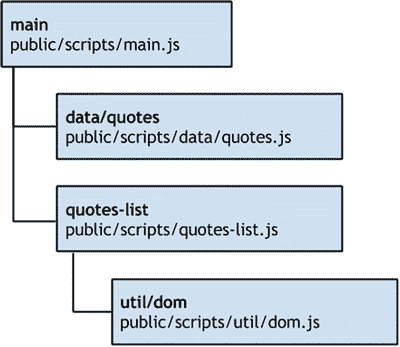
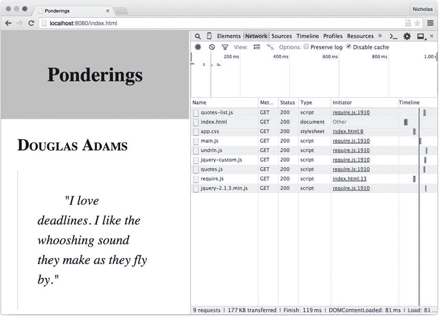
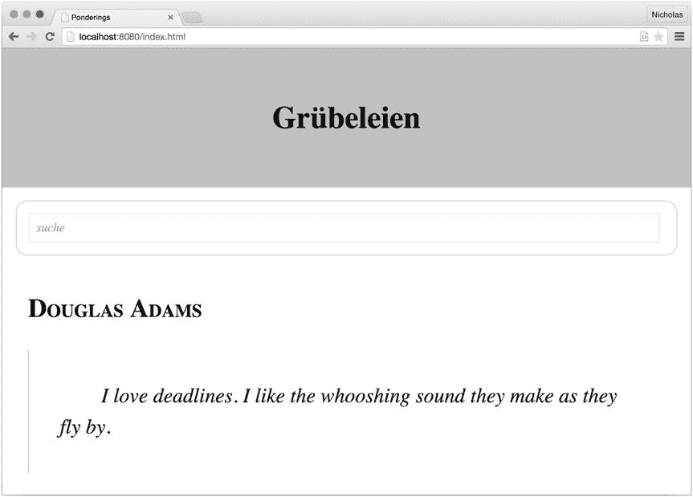
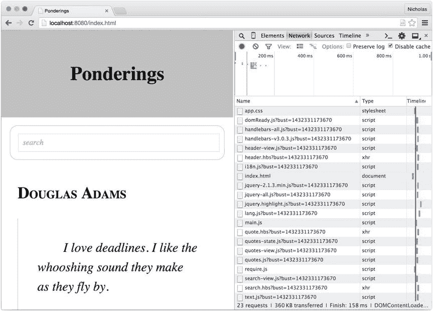

# 五、RequireJS

思考我能控制的事情比担心和烦恼我控制不了的事情更有成效。担忧不是一种思考方式。——彼得·圣安德烈

虽然 JavaScript 现在在 web 应用中扮演着重要得多的角色，但 HTML5 规范(以及现代浏览器)并没有指定检测脚本间依赖关系的方法，也没有指定如何以特定的顺序加载脚本依赖关系。在最简单的场景中，脚本通常用简单的``

`</body>`

### 配置

在 RequireJS 脚本加载到页面上之后，它会寻找一个配置，这个配置将主要告诉 RequireJS 脚本和模块位于何处。在中，可以通过三种方式之一提供配置选项。

首先，可以在加载 RequireJS 脚本之前创建一个全局`require`对象。该对象可能包含所有的 RequireJS 配置选项以及一个“启动”回调，一旦 RequireJS 加载完所有的应用模块，就会执行该回调。

清单 [5-4](#FPar5) 中的脚本块显示了存储在全局`require`变量中的一个新生成的 RequireJS 配置对象。

Listing 5-4\. Configuring RequireJS with a Global `require` Object

`<!-- example-001/public/config01.html -->`

`<body>`

`<header>`

`<h1>Ponderings</h1>`

`</header>`

`<section id="quotes"></section>`

``

``

`</body>`

这个对象上最重要的配置属性`baseUrl`标识了相对于应用根的路径，RequireJS 应该从该路径开始解析模块依赖关系。`deps`数组指定了配置后应该立即加载的模块，而`callback`函数的作用是在模块加载后接收这些模块。这个例子加载了一个模块`quotes-view`。一旦回调被调用，它就可以访问这个模块上的属性和方法。

清单 [5-5](#FPar6) 中的目录树显示了`quotes-view.js`文件相对于`config01.html`(正在查看的页面)和`require.js`的位置。

Listing 5-5\. Application File Locations

■t0]

■t0]

◆θ★★★★★★★★★★★★★★★★★★★★★★

★★★★★★★★★★★★★★

ε──t0″

ε──t0″

注意在`deps`数组中省略了`quotes-view`模块的绝对路径和文件扩展名。默认情况下，RequireJS 假定任何给定的模块都是相对于正在查看的页面定位的，并且它包含在具有适当文件扩展名的单个 JavaScript 文件中。在这种情况下，后一个假设是正确的，但第一个不是，这就是为什么指定一个`baseUrl`属性是必要的。当 RequireJS 试图解析任何模块时，它将组合任何配置的`baseUrl`值和模块名，然后附加`.js`文件扩展名以产生相对于应用根的完整路径。

当`config01.html`页面加载时，传递给`quotesView.addQuote()`方法的字符串将显示在页面上。

第二种配置方法与第一种类似，但在加载 RequireJS 脚本后使用 RequireJS API 来执行配置，如清单 [5-6](#FPar7) 所示。

Listing 5-6\. Configuration with the RequireJS API

`<!-- example-001/public/config02.html -->`

`<body>`

`<header>`

`<h1>Ponderings</h1>`

`</header>`

`<section id="quotes"></section>`

``

``

`</body>`

在这个例子中，``

`</body>`

一旦加载了 RequireJS，它将寻找`data-main`属性，如果找到，异步加载属性中指定的脚本。清单 [5-8](#FPar9) 显示了`main.js`的内容，与清单 [5-6](#FPar7) 中的`<script>`块相同。

Listing 5-8\. The RequireJS Main Module

`// example-001/public/scripts/main.js`

`// configuration`

`requirejs.config({`

`baseUrl: '/scripts'`

`});`

`// kickoff`

`requirejs(['quotes-view'], function (quotesView) {`

`quotesView.addQuote('Lorem ipsum dolor sit amet, consectetur adipiscing elit.');`

`quotesView.addQuote('Nunc non purus faucibus justo tristique porta.');`

`});`

Tip

因为`data-main`脚本是异步加载的，所以包含在 RequireJS 之后的脚本或`<script>`块可能会首先运行。如果 RequireJS 管理一个应用中的所有脚本，或者在 RequireJS 之后加载的脚本对应用本身没有影响(比如广告商脚本)，就不会有冲突。

### 应用模块和依赖关系

RequireJS 模块由三部分定义:

A module name   A list of dependencies (modules)   A module closure that will accept the output from each dependency module as function arguments, set up module code, and potentially return something that other modules can use  

清单 [5-9](#FPar11) 展示了假模块定义中的每一点。当全局`define()`函数被调用时，模块被创建。这个函数有三个参数，对应于上面的三点。

Listing 5-9\. Module Anatomy

`define(``/*#1*/``'m1',``/*#2*/``['d1', 'd2'],``/*#3*/`T6】

`/*`

`* Variables declared within the module closure`

`* are private to the module, and will not be`

`* exposed to other modules`

`*/`

`var privateModuleVariable = "can’t touch this";`

`/*`

`* The returned value (if any) will now be available`

`* to any other module if they specify m1 as a`

`* dependency.`

`*/`

`return {`

`getPrivateModuleVariable: function () {`

`return privateModuleVariable;`

`}`

`};`

`})`

模块的名字是关键。在清单 [5-9](#FPar11) 中，明确声明了一个模块名`m1`。如果省略了模块名(将依赖项和模块闭包作为传递给`define()`的唯一参数)，那么 RequireJS 将假设模块名是包含模块脚本的文件名，没有扩展名`.js`。这在实践中很常见，但是为了清楚起见，这里显示了模块名称。

Tip

给模块指定特定的名称会带来不必要的复杂性，因为需要依赖脚本 URL 路径来加载模块。如果一个模块被显式命名，而文件名与模块名不匹配，那么需要在 RequireJS 配置中定义一个模块别名，将模块名映射到一个实际的 JavaScript 文件。这将在下一节中介绍。

清单 [5-9](#FPar11) 中的依赖列表标识了 RequireJS 应该加载的另外两个模块。值`d1`和`d2`是这些模块的名称，位于脚本文件`d1.js`和`d2.js`中。这些脚本看起来类似于清单 [5-9](#FPar11) 中的模块定义，但是它们将加载自己的依赖项。

最后，模块闭包接受每个依赖模块的输出作为函数参数。这个输出是从每个依赖模块的闭包函数返回的任何值。清单 [5-9](#FPar11) 中的闭包返回它自己的值，如果另一个模块将`m1`声明为依赖项，那么这个返回值将被传递给那个模块的闭包。

如果一个模块没有依赖关系，那么它的依赖数组将会是空的，并且它不会收到任何关于它的闭包的参数。

一旦模块被加载，它就存在于内存中，直到应用被终止。如果多个模块声明了同一个依赖项，则该依赖项只加载一次。它从闭包返回的任何值都将通过引用传递给两个模块。然后，给定模块的状态在使用它的所有其他模块之间共享。

一个模块可以返回任何有效的 JavaScript 值，或者根本不返回任何值，如果模块的存在只是为了操纵其他模块或者只是在应用中产生副作用。

清单 [5-10](#FPar13) 显示了`example-002/public`目录的结构。这看起来与`example-001`相似，但是添加了一些额外的模块，即`data/quotes.js`(一个用于获取报价数据的模块)和`util/dom.js`(一个为其他模块包装全局`window`对象以便它们不需要直接访问`window`的模块)。

Listing 5-10\. Public Directory Structure for `example-``002`

`public`

■t0]

■t0]

◆θ★★★★★★★★★★★★★★★★★★★★★★

──★t0∮

◆θ★★★★★★★★★★★★★★★★★★★★★★

◆θ★★★★★★★★★★★★★★★★★★★★★★

◆θ★★★★★★★★★★★★★★★★★★★★★★

★★★★★★★★★★★★★★

★★★★★★★★★★★★★★

回想一下，模块的依赖关系是相对于 RequireJS `baseUrl`值而存在的。当一个模块指定依赖路径时，它是相对于`baseUrl`路径来指定的。在清单 [5-11](#FPar14) 中，`main.js`文件依赖于`data/quotes`模块(`public/scripts/data/quotes.js`)，而`quotes-view.js`模块依赖于`util/dom` ( `public/scripts/util/dom.js`)。

Listing 5-11\. Module Dependency Paths

`// example-002/public/scripts/main.js`

`requirejs(['data/quotes', 'quotes-view'], function (quoteData, quotesView) {`

`// ...`

`});`

`// example-002/public/scripts/data/quotes.js`

`define([/*no dependencies*/], function () {`

`// ...`

`});`

`// example-002/public/scripts/quotes-view.js`

`define(['util/dom'], function (dom) {`

`// ...`

`});`

`// example-002/public/scripts/util/dom.js`

`define([/*no dependencies*/], function () {`

`// ...`

`});`

图 [5-1](#Fig1) 显示了加载这些模块时创建的逻辑依赖树。

图 5-1。

RequireJS dependency tree

随着应用依赖性的增加，模块路径会变得单调乏味，但是有两种方法可以减轻这种情况。

首先，模块可以使用前导点符号来指定相对于自身的依赖关系。例如，一个声明了依赖关系`./foo`的模块会将`foo.js`作为一个兄弟文件加载，与它自己位于同一个 URL 段上，而一个具有依赖关系`../bar`的模块会将`bar.js`从它自己“向上”加载一个 URL 段。这大大减少了依赖性的冗长。

第二，模块可以用路径别名命名，在 RequireJS 配置中定义，如下一节所述。

### 路径和别名

给一个模块分配一个别名允许其他模块使用该别名作为依赖名，而不是完整的模块路径名。由于各种原因，这可能是有用的，但通常用于简化供应商模块路径，从供应商模块名称中消除版本号，或者处理显式声明自己的模块名称的供应商库。

清单 [5-12](#FPar15) 中的模块依赖于供应商库 jQuery。如果`jquery`模块脚本位于`/scripts/jquery.js`处，则不需要模块别名来加载依赖关系；RequireJS 将根据已配置的`baseUrl`配置值来定位模块。

Listing 5-12\. Specifying a jQuery Module Dependency

`define(['jquery'], function ($) {`

`// ...`

`});`

然而，`jquery`不太可能位于由`baseUrl`配置定义的模块根。更有可能的是，`jquery`脚本将存在于供应商目录中，例如`/scripts/vendor/jquery`，并且脚本名称将包含 jQuery 版本(例如`jquery-2.1.3.min`)，因为 jQuery 脚本就是这样分发的。更复杂的是，jQuery 明确声明了自己的模块名`jquery`。如果模块试图使用 jQuery 脚本的完整路径`/scripts/vendor/jquery/jquery-2.1.3.min`加载`jquery`，RequireJS 将通过 HTTP 加载脚本，然后无法导入模块，因为它声明的名称是`jquery`，而不是`jquery-2.1.3.min`。

Tip

显式命名模块被认为是不好的做法，因为应用模块必须使用模块声明的名称，并且包含该模块的脚本文件必须共享其名称或者在 RequireJS 配置中有别名。为 jQuery 做了一个特殊的让步，因为它是一个相当普遍的库。

别名在 RequireJS 配置散列中的`paths`属性下指定。在清单 [5-13](#FPar17) 中，别名`jquery`被分配给`vendor/jquery/jquery-2.1.3.min`，这是一个相对于`baseUrl`的路径。

Listing 5-13\. Configuration Module Path Aliases

`requirejs.config({`

`baseUrl: '/scripts',`

`// ... other options ...`

`paths: {`

`'jquery': 'vendor/jquery/jquery-2.1.3.min'`

`}`

`});`

在`paths`对象中，别名是键，它们映射到的脚本是值。一旦定义了模块别名，它就可以在任何其他模块的依赖列表中使用。清单 [5-14](#FPar18) 显示了正在使用的`jquery`别名。

Listing 5-14\. Using a Module Alias in a Dependency List

`// jquery alias points to vendor/jquery/jquery-2.1.3.min`

`define(['jquery'], function ($) {`

`// ...`

`});`

因为模块别名优先于实际的模块位置，所以 RequireJS 将在试图在`/scripts/jquery.js`定位 jQuery 脚本之前解析它的位置。

Note

匿名模块(没有声明自己的模块名)可以用任何模块名作为别名，但是如果命名模块有别名(像`jquery`)，它们必须用它们声明的模块名作为别名。

#### 加载带有代理模块的插件

jQuery、下划线、Lodash、Handlebars 等库都有插件系统，允许开发人员扩展各自的功能。战略性地使用模块别名实际上可以帮助开发人员一次性加载这些库的扩展，而不必在每个使用它们的模块中指定这样的扩展。

在清单 [5-15](#FPar20) 中，为了简洁起见，`jquery`脚本位置用名称`jquery`作为别名，自定义模块`util/jquery-all`用名称`jquery-all`作为别名。所有的应用模块将通过指定`jquery-all`为依赖项来加载`jquery`。反过来，`jquery-all`模块加载普通的`jquery`模块，然后给它附加定制插件。

Listing 5-15\. Using Module Aliases to Load jQuery Plugins

`requirejs.config({`

`baseUrl: '/scripts',`

`// ... other options ...`

`paths: {`

`// vendor script`

`'jquery': 'vendor/jquery/jquery-2.1.3.min',`

`// custom extensions`

`'jquery-all': 'util/jquery-all'`

`}`

`});`

`// example-003/public/scripts/util/jquery-all`

`define(['jquery'], function ($) {`

`$.fn.addQuotes = function () {/*...*/};`

`return $;`

`// or`

`//return $.noConflict(true);`

`});`

`jquery-all`代理模块返回 jQuery 对象本身，这允许依赖于`jquery-all`的模块使用加载的定制扩展访问`jquery`。默认情况下，jQuery 向全局`window`对象注册自己，即使它被用作 AMD 模块。如果所有的应用模块都通过`jquery-all`模块(或者甚至是普通的`jquery`模块，正如大多数供应商库所做的那样)访问 jQuery，那么就不需要 jQuery 全局变量。可以通过调用`$.noConflict(true)`将其移除。这将返回`jquery`对象，并且是清单 [5-15](#FPar20) 中`jquery-all`模块的替代返回值。

因为 jQuery 现在是示例应用的一部分，所以负责在 DOM 中呈现报价数据的`quotes-view`模块不再需要依赖于`util/dom`模块。它可以将`jquery-all`指定为依赖项，并一次性加载`jquery`和自定义的`addQuotes()`插件方法。清单 [5-16](#FPar21) 显示了对`quotes-view`模块所做的更改。

Listing 5-16\. Loading jQuery and Custom Plugins in the quotes-view Module

`// example-003/public/scripts/quotes-view.js`

`define(['jquery-all'], function ($) {`

`var $quotes = $('#quotes');`

`return {`

`render: function (groupedQuotes) {`

`for (var attribution in groupedQuotes) {`

`if (!groupedQuotes.hasOwnProperty(attribution)) continue;`

`$quotes.addQuotes(attribution, groupedQuotes[attribution]);`

`}`

`}`

`};`

`});`

使用模块代理来加载`jquery`的优点是，它消除了在依赖于`jquery`和定制插件模块的其他模块中指定这两者的需要。例如，如果没有这种技术，应用模块将会有多个依赖项来确保在需要时加载适当的 jQuery 插件，如清单 [5-17](#FPar22) 所示。

Listing 5-17\. Loading Plugins Without a Proxy Module

`// scripts/util/jquery-plugin-1.js`

`define(['jquery'], function ($) {`

`$.fn.customPlugin1 = function () {/*...*/};`

`});`

`// scripts/util/jquery-plugin-2.js`

`define(['jquery'], function ($) {`

`$.fn.customPlugin2 = function () {/*...*/};`

`});`

`// scripts/*/module-that-uses-jquery.js`

`define(['jquery', 'util/jquery-plugins-1', 'util/jquery-plugins-2'], function ($) {`

`// ...`

`});`

在这种情况下，即使`jquery-plugin-1`和`jquery-plugin-2`没有返回值，它们仍然必须作为依赖项添加，这样它们的副作用——向`jquery`模块添加插件——仍然会发生。

### 垫片

支持 AMD 模块格式的库可以直接用于 RequireJS。通过配置 RequireJS 垫片或手动创建垫片模块，仍可使用非 AMD 库。

`example-003`中的`data/quotes`模块公开了一个`groupByAttribution()`方法，该方法迭代引用集合。它创建了一个散列，其中键是人名，值是属于他们的引号数组。这种分组功能可能对其他集合也很有用。

幸运的是，供应商库 undrln 可以提供该功能的通用版本，但它与 AMD 不兼容。对于其他 AMD 模块来说，使用 undrln 作为依赖项，需要一个垫片。Undrln 是作为函数闭包内的标准 JavaScript 模块编写的，如清单 [5-18](#FPar24) 所示。它将自己分配给全局`window`对象，页面上的其他脚本可以访问它。

Note

脚本公然模仿了 Lodash API 的一个子集，不兼容 AMD 模块，专门用于本章的例子。

Listing 5-18\. The Completely Original Undrln Library

`// example-004/public/scripts/vendor/undrln/undrln.js`

`/**`

`* undrln (c) 2015 l33th@x0r`

`* MIT license.`

`* v0.0.0.0.1-alpha-DEV-theta-r2`

`*/`

`(function () {`

`var undrln = window._ = {};`

`undrln.groupBy = function (collection, key) {`

`// ...`

`};`

`}());`

要创建一个 shim，必须向 RequireJS 配置中添加一些东西。首先，必须在`paths`下创建一个模块别名，以便 RequireJS 知道填充的模块位于何处。其次，必须将一个垫片配置条目添加到`shim`部分。两者都被添加到清单 [5-19](#FPar25) 中的 RequireJS 配置中。

Listing 5-19\. Configuration of a Module Shim

`// example-004/public/scripts/main.js`

`requirejs.config({`

`baseUrl: '/scripts',`

`paths: {`

`jquery: 'vendor/jquery/jquery-2.1.3.min',`

`'jquery-all': 'util/jquery-all',`

`// giving undrln a module alias`

`undrln: 'vendor/undrln/undrln'`

`},`

`shim: {`

`// defining a shim for undrln`

`undrln: {`

`exports: '_'`

`}`

`}`

`});`

在`shim`部分下的每个键标识要填充的模块别名(或名称),分配给这些键的对象指定了关于填充程序如何工作的细节。在幕后，RequireJS 通过定义一个空的 AMD 模块来创建一个 shim，该模块返回由脚本或库创建的全局对象。un drn 创建了全局`window._`对象，因此名字`_`在 shim 配置中被指定为 un drn 的导出。最终生成的 RequireJS shim 将类似于清单 [5-20](#FPar26) 中的模块。请注意，这些垫片是在模块加载时动态创建的，并不作为“文件”实际存在于 web 服务器上。(这个规则的一个例外是 r.js 打包工具，稍后讨论，它将生成的 shim 输出写入一个包文件，作为一种优化措施。)

Listing 5-20\. Example RequireJS Shim Module

`define('undrln', [], function () {`

`return window._;`

`});`

清单 [5-21](#FPar27) 中的`quotes`模块现在可以使用`undrln`垫片作为依赖项。

Listing 5-21\. Using the Undrln Shim As a Dependency

`// example-004/public/scripts/data/quotes.js`

`define(['undrln'], function (_) {`

`//...`

`return {`

`groupByAttribution: function () {`

`return _.groupBy(quoteData, 'attribution');`

`},`

`//...`

`}`

`});`

通过填充非 AMD 脚本，当非 AMD 脚本依赖于其他 AMD 模块时，RequireJS 可以在后台使用其异步模块加载功能来加载非 AMD 脚本。如果没有这个功能，这些脚本将需要用标准的`<script>`标签包含在每个页面上，并同步加载以确保可用性。

在`example-004`中运行 web 应用，然后浏览到`http://localhost:8080/index.html`将显示报价列表。图 [5-2](#Fig2) 显示了渲染页面和 Chrome 的网络面板，其中列出了所有加载的 JavaScript 模块。注意，Initiator 列清楚地显示了 RequireJS 负责加载所有模块，甚至非 AMD 的`undrln.js`模块也包含在列表中。

图 5-2。

RequireJS modules shown loaded in Chrome

#### 填补依赖项

期望填充的脚本具有依赖性是合理的，例如全局范围内的对象。当 AMD 模块指定依赖项时，RequireJS 确保在执行模块代码之前，首先加载依赖项。填补脚本的依赖性在填补配置中以类似的方式指定。一个填充的脚本可能依赖于其他填充的脚本，或者甚至依赖于 AMD 模块，如果这些模块使内容在全局范围内可用的话(通常是一个坏主意，但有时是必要的)。

为了增强示例应用，在`example-005`的报价页面中添加了一个搜索字段。在搜索字段中输入的术语会在找到它们的任何报价文本中突出显示。到目前为止，所有示例都使用一个视图`quotes-view`来显示呈现的标记。因为应用的功能越来越多，所以将引入两个新模块来帮助管理功能:`search-view`和`quotes-state`。`search-view`模块负责监控用户输入的文本字段。当这个字段改变时，视图通知`quotes-state`模块已经进行了搜索，并向其传递搜索词。`quotes-state`模块充当所有视图的单一状态源，当它接收到一个新的搜索词时，它触发一个视图可能订阅的事件。

挖掘一些遗留的源代码产生了文件`public/scripts/util/jquery.highlight.js`，这是一个非 AMD 的 jQuery 插件，突出显示了 DOM 中的文本。当`quotes-view`模块从`quotes-state`模块接收到搜索事件时，它使用这个插件根据存储在`quotes-state`中的搜索词高亮显示 DOM 中的文本。要使用这个遗留脚本，需要在`main.js`配置中添加一个路径和一个填充条目。`highlight`插件不导出任何值，但是它需要先加载 jQuery，否则插件在试图访问全局 jQuery 对象时会抛出一个错误。

依赖关系已经被添加到具有`deps`属性的`highlight`垫片中，如清单 [5-22](#FPar28) 所示。该属性包含一个模块名(或别名)数组，该数组应该在 shim 之前加载——在本例中是 jQuery。

Listing 5-22\. The `highlight` Shim Depends on jQuery

`// example-005/public/scripts/main.js`

`requirejs.config({`

`baseUrl: '/scripts',`

`paths: {`

`jquery: 'vendor/jquery/jquery-2.1.3.min',`

`'jquery-all': 'util/jquery-all',`

`undrln: 'vendor/undrln/undrln',`

`ventage: 'vendor/ventage/ventage',`

`highlight: 'util/jquery.highlight'`

`},`

`shim: {`

`undrln: {`

`exports: '_'`

`},`

`highlight: {`

`deps: ['jquery']`

`}`

`}`

`});`

一旦`highlight`插件被填充，它可能作为另一个模块的依赖项被加载。既然`jquery-all`模块负责加载定制插件，那么在清单 [5-23](#FPar29) 中让`highlight`模块成为它的依赖项之一似乎是明智的。

填充脚本应该只有两种依赖关系:

*   其他填充脚本立即执行，并可能在全局范围内创建一个或多个可重用的变量或名称空间
*   作为副作用，AMD 模块还在全局范围内创建了可重用的变量或名称空间(如`window.jQuery`)

因为 AMD 模块通常根本不干涉全局范围，所以将它们用作填充脚本的依赖项实际上是无用的，因为填充脚本没有办法访问 AMD 模块的 API。如果一个 AMD 模块没有给全局范围增加任何东西，那么它对屏蔽脚本是没有用的。此外，AMD 模块是异步加载的，它们的闭包以特定的顺序执行(在下一节讨论)，而填充的脚本将在加载后立即运行。(Rembmer:填充脚本是普通的脚本，一旦被引入 DOM 就运行。生成的 shim 模块简单地将非 AMD 脚本创建的全局导出作为依赖项传递给其他 AMD 模块。)即使经填补的脚本可以访问 AMD 模块的 API，也不能保证该模块在经填补的脚本实际运行时是可用的。

Listing 5-23\. Loading the `highlight` Module As a Dependency of Another Module

`// example-005/public/scripts/util/jquery-all.js`

`define(['jquery', 'highlight'], function ($) {`

`$.fn.addQuotes = function (attribution, quotes) {`

`// ...`

`};`

`return $;`

`});`

在这种安排下，可能会立即想到两个问题:

Since both the `highlight` and `jquery-all` modules declare `jquery` as a dependency, when is jQuery actually loaded?   Why isn’t a second `highlight` parameter specified in the `jquery-all` module closure function?  

首先，RequireJS 在评估模块间的依赖关系时，会基于模块层次结构创建一个内部依赖树。通过这样做，它可以确定加载任何特定模块的最佳时间，从叶子开始并向主干移动。在这种情况下,“主干”是`jquery-all`模块，最远的叶子是`highlight`依赖的`jquery`模块。RequireJS 将按照以下顺序执行模块关闭:`jquery`、`highlight`、`jquery-all`。因为`jquery`也是`jquery-all`的依赖项，RequireJS 将简单地交付为`highlight`模块创建的同一个`jquery`实例。

第二，`highlight`模块不返回值，只是用于副作用——为 jQuery 对象添加插件。没有参数传递给`jquery-all`模块，因为`highlight`返回 none。出于这个原因，仅用于副作用的依赖项应该总是放在模块的依赖项列表的末尾。

### 加载程序插件

有几个非常有用的 RequireJS loader 插件，它们在大多数项目中都有一席之地。加载器插件是一个外部脚本，用于方便地加载，有时解析特定种类的资源，这些资源可以作为标准 AMD 依赖项导入，即使资源本身可能不是实际的 AMD 模块。

#### text.js

RequireJS `text`插件可以通过 HTTP 加载一个纯文本资源，将其序列化为一个字符串，并将其作为一个依赖项交付给 AMD 模块。这通常用于加载 HTML 模板，甚至是来自 HTTP 端点的原始 JSON 数据。要安装插件，必须从项目存储库中复制`text.js`脚本，并且按照惯例，将它放在与`main.js`配置文件相同的目录中。(可选的安装方法在插件项目的自述文件中列出。)

示例应用中的`quotes-view`模块使用 jQuery 插件构建引用列表，一次一个 DOM 元素。这不是很有效，很容易被模板解决方案取代。AMD 兼容的 Handlebars 模板库是这类任务的流行选择。在清单 [5-24](#FPar30) 中，库被添加到了`example-006`的`vendor`目录中，并且在`main.js`配置中创建了一个方便的模块别名。

Listing 5-24\. Handlebars Module Alias

`// example-006/public/scripts/main.js`

`requirejs.config({`

`baseUrl: '/scripts',`

`paths: {`

`//...`

`Handlebars: 'vendor/handlebars/handlebars-v3.0.3'`

`},`

`//...`

`});`

当`quotes-view`模块呈现自己时，它使用对象散列中的报价数据，其中键是属性(即，每个报价的收款人),值是每个报价的数组。(给定的属性可以与一个或多个报价相关联。)清单 [5-25](#FPar31) 显示了将被绑定到这个数据结构的模板，位于`public/scripts/templates/quotes.hbs`文件中。

Listing 5-25\. The `quotes-view` Handlebars Template

`{{#each this as |quotes attribution|}}`

`<section class="multiquote">`

`<h2 class="attribution">{{attribution}}</h2>`

`{{#each quotes}}`

`<blockquote class="quote">`

`{{#explode text delim="\n"}}`

`
{{this}}
`

`{{/explode}}`

`</blockquote>`

`{{/each}}`

`</section>`

`{{/each}}`

不需要完全熟悉 Handlebars 语法就能理解这个模板遍历数据对象，提取每个属性及其相关的引号。它为属性创建一个`<h2>`元素，然后为每个报价构建一个`<blockquote>`元素来保存报价文本。一个特殊的块助手，`#explode`，在新行(`\n`)分隔符处将引用文本分开，然后将引用文本的每一段包装在一个`
`标签中。

`#explode`辅助对象很重要，因为它不是手柄的原生属性。它在文件`public/scripts/util/handlebars-all.js`中被定义并注册为把手辅助对象，如清单 [5-26](#FPar32) 所示。

Listing 5-26\. `#explode` Handlebars Helper

`// example-006/public/scripts/util/handlebars-all.js`

`define(['Handlebars'], function (Handlebars) {`

`Handlebars.registerHelper('explode', function (context, options) {`

`var delimiter = options.hash.delim || '';`

`var parts = context.split(delimiter);`

`var processed = '';`

`while (parts.length) {`

`processed += options.fn(parts.shift().trim());`

`}`

`return processed;`

`});`

`return Handlebars;`

`});`

因为这个模块添加了助手，然后返回 Handlebars 对象，`quotes-view`模块将把它作为依赖项导入，而不是普通的 Handlebars 模块，就像用`jquery-all`模块代替`jquery`一样。清单 [5-27](#FPar33) 中的配置中添加了适当的模块别名。

Listing 5-27\. `handlebars-all` Module Alias

`// example-006/public/scripts/main.js`

`requirejs.config({`

`baseUrl: '/scripts',`

`paths: {`

`//...`

`Handlebars: 'vendor/handlebars/handlebars-v3.0.3',`

`'handlebars-all': 'util/handlebars-all'`

`},`

`//...`

`});`

在清单 [5-28](#FPar34) 中，`quotes-view`模块已经被修改为导入`handlebars-all`和`quotes.hbs`模板。文本模板的模块名非常具体:它必须以前缀`text!`开头，后跟模板文件的路径，该路径相对于`main.js`中定义的`baseUrl`路径。

Listing 5-28\. The `quotes.hbs` Template Imported As a Module Dependency

`// example-006/public/scripts/quotes-view.js`

`define([`

`'jquery-all',`

`'quotes-state',`

`'handlebars-all',`

`'text!templates/quote.hbs'`

`],`

`function ($, quotesState, Handlebars, quotesTemplate) {`

`var bindTemplate = Handlebars.compile(quotesTemplate);`

`var view = {`

`// ...`

`render: function () {`

`view.$el.empty();`

`var groupedQuotes = quotesState.quotes;`

`view.$el.html(bindTemplate(groupedQuotes));`

`},`

`// ...`

`};`

`// ...`

`});`

当 RequireJS 遇到带有`text!`前缀的依赖项名称时，它会自动尝试加载`text.js`插件脚本，然后该脚本会将指定的文件内容作为字符串加载并序列化。`quotes-view`闭包中的`quotesTemplate`函数参数将包含`quotes.hbs`文件的序列化内容，然后由 Handlebars 编译并用于在 DOM 中呈现模块。

#### 页面加载

当一个网页完全加载时，它触发一个`DOMContentLoaded`事件(在现代浏览器中)。在浏览器完成 DOM 构建之前加载的脚本通常会监听该事件，以了解何时开始操作页面元素是安全的。如果脚本恰好在结束标签`</body>`之前被加载，它们可能会认为大部分 DOM 已经被加载了，并且它们不需要监听这个事件。然而，`<body>`元素中其他地方的脚本，或者更常见的`<head>`元素，就没有这样的奢侈了。

尽管在应用示例中，RequireJS 是在结束的`</body>`标记之前加载的，但是清单 [5-29](#FPar35) 中的`main.js`文件(配置省略)仍然将一个函数传递给 jQuery，一旦`DOMContentLoaded`触发，该函数将被执行。如果将 RequireJS `<script>`标签移动到文档`<head>`中，就不会破坏任何东西。

Listing 5-29\. Using jQuery to Determine If the DOM Is Fully Loaded

`// example-006/public/scripts/main.js`

`// ...`

`requirejs(['jquery-all', 'quotes-view', 'search-view'],`

`function ($, quotesView) {`

`$(function () {`

`quotesView.ready();`

`});`

`});`

`domReady`插件是一种特殊的“加载器”,它只是暂停模块闭包的调用，直到 DOM 完全准备好。像文本插件一样，`domReady.js`文件必须可以被在`main.js`配置中定义的`baseUrl`路径内的 RequireJS 访问。按照惯例，它通常是`main.js`的兄弟。

清单 [5-30](#FPar36) 显示了`main.js`的修改版本(配置省略)，其中`jquery`依赖项被移除，而`domReady!`插件被添加到依赖项列表中。后面的感叹号告诉 RequireJS，这个模块作为一个加载器插件，而不是一个标准模块。与`text`插件不同，`domReady`实际上什么也不加载，所以感叹号后不需要额外的信息。

Listing 5-30\. Using the domReady Plugin to Determine If the DOM Is Fully Loaded

`// example-007/public/scripts/main.js`

`// ...`

`requirejs(['quotes-view', 'search-view', 'domReady!'],`

`function (quotesView) {`

`quotesView.ready();`

`});`

#### i18n

RequireJS 通过`i18n`加载器插件支持国际化。(i18n 是一个 numeronym，表示数字“18”代表“国际化”一词中“I”和“n”之间的 18 个字符。)国际化是指编写 web 应用，使其内容适应用户的语言和地区(也称为国家语言支持，或 NLS)的行为。`i18n`插件主要用于翻译网站控件和“chrome”中的文本:按钮标签、标题、超链接文本、字段集图例等等。为了展示这个插件的功能，示例应用中添加了两个新模板，一个用于页眉中的页面标题，另一个用于带有占位符文本的搜索字段。实际的报价数据不会被翻译，因为它可能来自负责提供适当翻译的应用服务器。不过，在这个应用中，为了简单起见，数据被硬编码在`data/quotes`模块中，并且总是以英文显示。

清单 [5-31](#FPar37) 中的`search.hbs`模板也已经从`index.html`文件中提取出来，现在接受搜索字段的占位符文本作为唯一的输入。`search-view`模块已经被修改为在 DOM 中呈现内容时使用这个模板。

Listing 5-31\. The `search.hbs` Template Will Display the Placeholder Translation

`<!-- example-008/public/scripts/templates/search.hbs -->`

`<form>`

`<fieldset>`

`<input type="text" name="search" placeholder="{{searchPlaceholder}}" />`

`</fieldset>`

`</form>`

清单 [5-32](#FPar38) 显示了将由新的`header-view`模块呈现的新的`header.hbs`模板。该模板接受一个输入，即页面标题。

Listing 5-32\. The `header.hbs` Template Will Display the Page Title Translation

`<!-- example-008/public/scripts/templates/header.hbs -->`

`<h1>{{pageTitle}}</h1>`

清单 [5-33](#FPar39) 中的`header-view`模块不仅演示了如何使用`text`插件导入模板依赖，还演示了如何使用`i18n`插件导入语言模块依赖。熟悉的加载器语法看起来几乎是一样的:插件名后面跟一个感叹号和一个相对于配置的模块路径`baseUrl`，在这里是`nls/lang`。当加载一个模板时，它的序列化字符串内容被传递给模块的闭包，但是`i18n`插件加载一个包含翻译文本数据的语言模块，并将该模块的对象传递给闭包。在清单 [5-33](#FPar39) 中，这个对象可以通过`lang`参数访问。

Listing 5-33\. The header-view Module Depends on the `i18n` Language Object

`// example-008/public/scripts/header-view.js`

`define([`

`'quotes-state',`

`'jquery-all',`

`'handlebars-all',`

`'text!templates/header.hbs',`

`'i18n!nls/lang'`

`], function (quotesState, $, Handlebars, headerTemplate, lang) {`

`// ...`

`});`

language 模块是一个常规的 AMD 模块，但是它没有向`define()`传递依赖项列表和闭包，而是使用了一个简单的对象文字。这个对象文字遵循一个非常特殊的语法，如清单 [5-34](#FPar40) 所示。

Listing 5-34\. Default English Language Module

`// example-008/public/scripts/nls/lang.js`

`define({`

`root: {`

`pageTitle: 'Ponderings',`

`searchPlaceholder: 'search'`

`},`

`de: true`

`});`

首先，`root`属性保存了当插件解析语言翻译时将用于获取翻译数据的键/值对。该对象中的键只是简单的键，通过这些键可以以编程方式访问翻译的文本。例如，在`search`模板中，当模板绑定到语言对象的关键字`searchPlaceholder`时，`{{searchPlaceholder}}`将被替换为字符串值。

其次，`root`属性的兄弟是各种 IETF 语言标签，用于活动和非活动的翻译，它们应该基于浏览器的语言设置来解析。在这个例子中，德语`de`语言标签被赋值为`true`。如果有西班牙语翻译，可以添加一个值为`true`的`es-es`属性。对于法语翻译，可以添加一个`fr-fr`属性，对于其他语言也是如此。

当在默认语言模块中启用新的语言标签时，必须将对应于语言代码的目录作为模块文件的兄弟。目录可以在清单 [5-35](#FPar41) 中看到。

Listing 5-35\. Directory Structure for NLS Modules

■t0]

◆θ★★★★★★★★★★★★★★★★★★★★★★

──★t0∮

★★★★★★★★★★★★★★

创建特定于语言的目录后，必须在其中创建与默认语言模块文件同名的语言模块文件。这个新的语言模块将只包含默认语言模块中的`root`属性的翻译内容。清单 [5-36](#FPar42) 显示了`pageTitle`和`searchPlaceholder`属性的德语(`de`)翻译。

Listing 5-36\. German (`de`) Translation Module

`// example-008/public/scripts/nls/de/lang.js`

`define({`

`pageTitle: 'Grübeleien',`

`searchPlaceholder: 'suche'`

`});`

当默认语言模块用`i18n`插件加载时，它会检查浏览器的`window.navigator.language`属性，以确定应该使用什么语言环境和语言翻译。如果默认语言模块指定了一个兼容的、已启用的语言环境，`i18n`插件会加载特定于语言环境的模块，然后将其与默认语言模块的`root`对象合并。特定于区域设置的模块中缺少的翻译将用默认语言模块中的值填充。

图 [5-3](#Fig3) 显示了谷歌 Chrome 浏览器的语言设置为德语时报价页面的外观。

图 5-3。

Switching the browser language loads the German translation Note

`window.navigator.language`属性受不同浏览器中不同设置的影响。例如，在 Google Chrome 中，它只反映用户的语言设置，而在 Mozilla Firefox 中，它也会受到页面 HTTP 响应中的`Accept-Language`标题的影响。

### 缓存破坏

应用服务器通常缓存脚本文件、图像、样式表等资源，以消除在为自上次读取以来没有更改的资源提供服务时不必要的磁盘访问。缓存的资源通常存储在内存中，并与某个键相关联，通常是资源的 URL。当在指定的缓存期间内出现对给定 URL 的多个请求时，将使用键(URL)从内存中提取资源。这在生产环境中具有显著的性能优势，但是在开发或测试环境中，每次进行代码更改或引入新资源时使缓存失效会变得很繁琐。

当然，缓存可以在每个环境的基础上切换，但是一个更简单的解决方案，至少对于 JavaScript(或任何由 RequireJS 加载的资源)，可能是利用 RequireJS 缓存破坏特性。缓存破坏是对每个资源请求的 URL 进行变异的行为，其方式是资源仍然可以被获取，但永远不会在缓存中找到，因为它的“键”总是不同的。这通常是通过包含一个查询字符串参数来实现的，该参数会在页面重新加载时发生变化。

清单 [5-37](#FPar44) 中的配置脚本添加了一个`urlArgs`属性。这将把查询字符串参数`bust={timestamp}`追加到 RequireJS 生成的所有请求中。每次页面加载时都会重新计算时间戳，以确保参数值发生变化，从而使 URL 变得唯一。

Listing 5-37\. The `urlArgs` Configuration Property Can Be Used to Bust Cache

`// example-009/public/scripts/main.js`

`requirejs.config({`

`baseUrl: '/scripts',`

`urlArgs: 'bust=' + (new Date().getTime()),`

`paths: {`

`// ...`

`},`

`shim: {`

`// ...`

`}`

`});`

图 [5-4](#Fig4) 显示`bust`参数确实应用于 RequireJS 发起的每一个请求，甚至是像`header.hbs`这样的 XHR 对文本资源的请求。

图 5-4。

The `bust` parameter is appended to each RequireJS request

虽然这个特性的有用性是显而易见的，但是它也会产生一些问题。

首先，RequireJS 尊重 HTTP 缓存头，因此即使将`urlArgs`用作缓存破坏机制，RequireJS 仍然可以请求(并接收)资源的缓存版本，这取决于缓存是如何实现的。如果可能，在每个环境中始终提供适当的缓存头。

其次，要注意一些代理服务器会丢弃查询字符串参数。如果开发或登台环境包括模拟生产环境的代理，则破坏缓存的查询字符串参数可能无效。一些开发人员使用`urlArgs`来指定生产环境中的特定资源版本(例如`version=v2`)，但是由于这个原因，通常不鼓励这样做。这是一种不可靠的版本控制技术。

最后，一些浏览器将具有不同 URL 的资源视为不同的、可调试的实体。例如，在 Chrome 和 Firefox 中，如果在源代码中为`http://localhost:8080/scripts/quotes-state.js?bust=1432504595280`设置了一个调试断点，当新的资源 URL 变为`http://localhost:8080/scripts/quotes-state.js?bust=1432504694566`时，如果页面被刷新，它将被删除。重置断点可能会变得繁琐，尽管`debugger`关键字可以用来通过强制浏览器暂停执行来规避这个问题，但它仍然需要勤奋的开发人员来确保在代码投入生产之前删除所有的`debugger`断点。

## 需要优化器

RequireJS 优化器 r.js 是一个用于 RequireJS 项目的构建工具。它可以用来将所有 RequireJS 模块连接成一个文件，缩小源代码，将构建输出复制到一个不同的目录，等等。本节介绍该工具及其基本配置。接下来将介绍几种常见场景的具体示例。

使用 r.js 最常见的方式是为 Node.js 安装 RequireJS npm 包，作为全局包或本地项目包。本节中的示例将使用在安装所有 npm 模块时创建的本地 RequireJS 安装。

### 配置 r.js

大量的参数可以作为参数传递给 r.js 工具来控制它的行为。幸运的是，这些参数也可以在常规的 JavaScript 配置文件中传递给 r.js，这使得终端命令明显更短。对于重要的项目，这是首选的配置方法，也是本章中唯一涉及的方法。

目录`example-010`中的代码文件已经被移动到一个标准的`src`目录中，一个新文件`rjs-config.js`已经被放置在根目录中。不出所料，这个文件包含 r.js 配置。其内容如清单 [5-38](#FPar45) 所示。

Listing 5-38\. r.js Configuration

`// example-010/rjs-config.js`

`({`

`// build input directory for application code`

`appDir: './src',`

`// build output directory for application code`

`dir: './build',`

`// path relative to build input directory where scripts live`

`baseUrl: 'public/scripts',`

`// predefined configuration file used to resolve dependencies`

`mainConfigFile: './src/public/scripts/main.js',`

`// include all text! references as inline modules`

`inlineText: true,`

`// do not copy files that were combined in build output`

`removeCombined: true,`

`// specific modules to be built`

`modules: [`

`{`

`name: 'main'`

`}`

`],`

`// uglify the output`

`optimize: 'uglify'`

`})`

熟悉构建工具的开发人员会立即识别出配置中存在的输入/输出模式。

属性指定了相对于配置文件的项目“输入”目录，未编译的源代码就在这个目录中。

属性指定了相对于配置文件的项目“输出”目录，当 r.js 工具运行时，编译和缩小的输出将被写入该目录。

`baseUrl`属性告诉 r.js 项目脚本相对于 appDir 属性的位置。这不应该与`main.js`文件中的`baseUrl`属性混淆，后者告诉 RequireJS 模块相对于 web 应用根的位置。

`mainConfigFile`属性指向实际的 RequireJS(不是 r.js)配置。这有助于 r.js 理解模块是如何相互关联的，以及存在什么样的模块别名和垫片(如果有的话)。可以省略这个属性，在 r.js 配置中指定所有这些路径，尽管这超出了本例的范围。

将`inlineText`属性设置为`true`可以确保所有引用了文本插件前缀`text!`的文本文件都将在最终的构建输出中用 RequireJS 模块进行编译。默认情况下启用该选项，但为了清楚起见，在该项目中明确设置了该选项。

默认情况下，r.js 会将所有脚本(打包和解包的)缩小并复制到输出目录中。`removeCombined`属性切换这种行为。在这种情况下，只有打包、编译的脚本以及打包输出中无法包含的任何其他脚本才会被复制到输出目录中。

`modules`数组列出了所有要编译的顶级模块。因为这是一个单页面应用，所以只需要编译实际的`main`模块。

最后，`optimize`属性指示 r.js 对所有脚本应用丑陋转换，从而最小化所有 JavaScript 代码。

### 运行 r.js 命令

构建项目只是在终端中运行`r.js`命令，通过它的`-o`标志将配置文件的路径传递给它，如清单 [5-39](#FPar46) 所示。

Listing 5-39\. Running the r.js Command

`example-010$ ../node_modules/.bin/r.js -o rjs-config.js`

终端输出显示了 r.js 在构建过程中编译和复制了哪些文件。检查清单 [5-40](#FPar47) 中的构建输出文件显示了 r.js 到底优化和复制了什么。

Listing 5-40\. Build Directory Content

`example-010/build$ tree`

`.`

■t0]

■t0]

ε──t0″

■t0]

■t0]

◆θ★★★★★★★★★★★★★★★★★★★★★★

◆θ★★★★★★★★★★★★★★★★★★★★★★

──★t0∮

──★t0∮

◆θ★★★★★★★★★★★★★★★★★★★★★★

◆θ★★★★★★★★★★★★★★★★★★★★★★

──μ──t0∮

──μ──t0∮

──★t0∮

★★★★★★★★★★★★★★

★★★★★★★★★★★★★★

◆θ★★★★★★★★★★★★★★★★★★★★★★

◆θ★★★★★★★★★★★★★★★★★★★★★★

◆θ★★★★★★★★★★★★★★★★★★★★★★

◆θ★★★★★★★★★★★★★★★★★★★★★★

★★★★★★★★★★★★★★

◆θ★★★★★★★★★★★★★★★★★★★★★★

◆θ★★★★★★★★★★★★★★★★★★★★★★

◆θ★★★★★★★★★★★★★★★★★★★★★★

◆θ★★★★★★★★★★★★★★★★★★★★★★

◆θ★★★★★★★★★★★★★★★★★★★★★★

◆θ★★★★★★★★★★★★★★★★★★★★★★

◆θ★★★★★★★★★★★★★★★★★★★★★★

◆θ★★★★★★★★★★★★★★★★★★★★★★

◆θ★★★★★★★★★★★★★★★★★★★★★★

★★★★★★★★★★★★★★

ε──t0″

ε──t0″

`9 directories, 24 files`

在`public/scripts`目录中，有几样东西立即凸显出来。

首先，`require.js`和`main.js`脚本都存在。由于这些脚本是在`index.html`中引用的唯一文件，它们的出现是意料之中的。其他脚本，如`quotes-view.js`和`quotes-state.js`脚本明显不存在，但检查`main.js`的内容会发现原因:它们已经根据 r.js 构建设置进行了打包和缩小。

第二，本地化文件`nls/lang.js`现在丢失了，因为它已经作为`main.js`的一部分被包含进来。`nls/de/lang.js`脚本仍然是构建输出的一部分，尽管它的内容已经被缩减了。任何在默认语言环境下浏览示例 web 页面的用户都将获得优化的体验，因为 RequireJS 不必进行外部 AJAX 调用来加载默认语言翻译。来自德国的用户将产生额外的 HTTP 请求，因为打包的输出中没有包括德语本地化文件。这是本地化插件的一个限制，r.js 必须尊重。

第三，把手模板，尽管在`main.js`中被编译为构建输出的一部分，也被复制到了`public/scripts/templates`目录中。发生这种情况是因为 RequireJS 插件目前无法看到构建过程，因此无法在 r.js 配置文件中使用`removeCombined`选项。幸运的是，因为这些模板已经被包装在 AMD 模块中，并与`main.js`连接在一起，所以 RequireJS 不会试图用 AJAX 请求加载它们。如果部署规模是这个项目的一个问题，如果需要，可以创建一个后期构建脚本或任务来删除`templates`目录。

第四，`vendor` / `ventage`目录已经被复制到`build`目录，尽管它的核心模块`ventage.js`已经与`main.js`连接在一起。虽然 RequireJS 可以在编译后自动删除单个模块文件(如`ventage.js`)，但它不会清理与模块相关联的其他文件(在本例中，是单元测试和包定义文件，如`package.json`和`bower.json`)，因此它们必须手动删除，或者作为后期构建过程的一部分。

## 摘要

RequireJS 是一个非常实用的 JavaScript 模块加载器，在浏览器环境中运行良好。它异步加载和解析模块的能力意味着它不仅仅依靠捆绑或打包脚本来获得性能优势。不过，为了进一步优化，可以使用 r.js 优化工具将 RequireJS 模块合并到一个精简的脚本中，以最大限度地减少加载模块和其他资源所需的 HTTP 请求数量。

尽管 RequireJS 模块必须以 AMD 格式定义，但 RequireJS 可以填充非 AMD 脚本，以便在必要时 AMD 模块可以导入遗留代码。填补的模块还可能具有可由 RequireJS 自动加载的依赖项。

`text`插件允许模块将外部文本文件依赖项(如模板)作为字符串导入。这些文本文件像任何其他模块依赖项一样被加载，甚至可能被 r.js 优化器内联到构建输出中。

本地化由`i18n`模块加载器支持，它可以根据浏览器的区域设置动态加载文本翻译模块。虽然主要的语言环境翻译模块可以被优化并与 r.js 连接，但是额外的语言环境翻译模块总是会加载 HTTP 请求。

模块的执行可以被`pageLoad`插件推迟，这可以防止模块的闭包在 DOM 完全呈现之前执行。这可以有效地消除对 jQuery 的`ready()`函数的重复调用，或者手动搜索订阅`DOMContentLoaded`事件所需的跨浏览器代码。

最后，RequireJS 配置可以自动将查询字符串参数附加到所有 RequireJS HTTP 请求中，为开发环境提供了一个廉价但有效的缓存破坏特性。