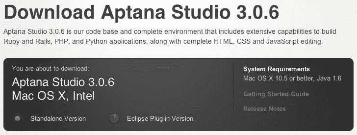
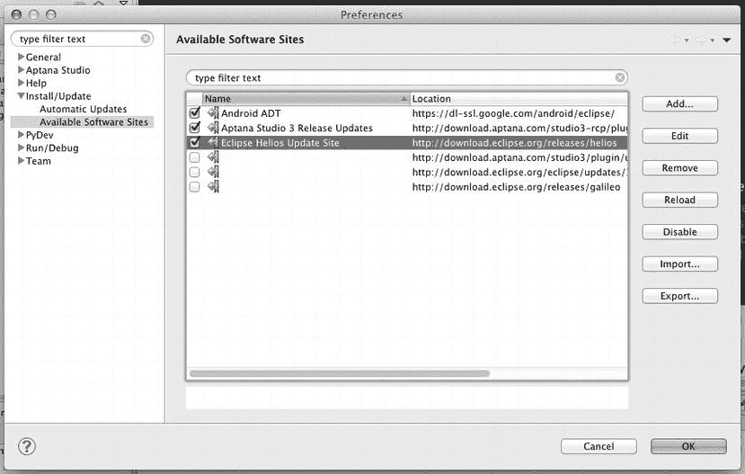
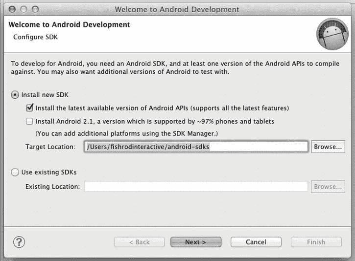
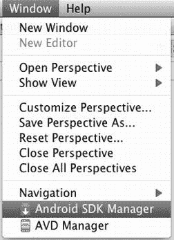
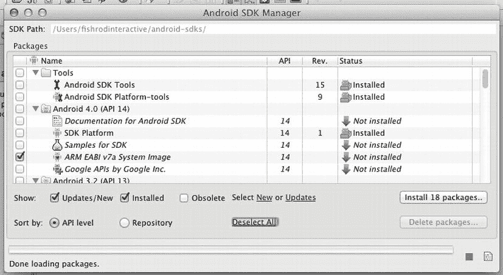
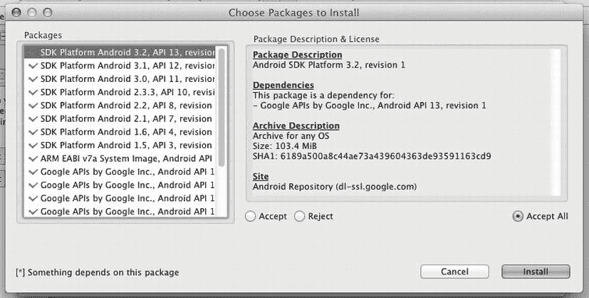
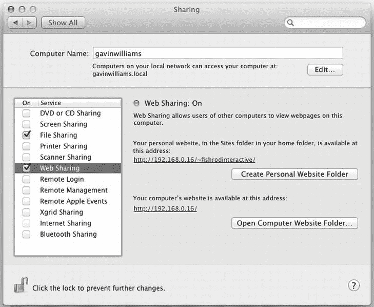

## 第一章第一章

## 入门指南

在 2008 年 9 月发布第一款 Android 手机和 2007 年 6 月发布第一款 iPhone 手机之前，移动网络浏览器的标准化并没有立即推进。播放视频需要 Flash mobile 或低质量的 3GP 版本的视频。开发人员避免使用 JavaScript，因为 JavaScript 在大多数移动 web 浏览器上默认是禁用的，而其他浏览器根本不支持 JavaScript。一个这样的开发者，登录 stackoverflow.com，评论说使用 JavaScript 是“一场噩梦”。。。就像在 90 年代使用网络浏览器一样，但是经理们对未来充满期待。” [1](#CH-1-FN-1)

移动网站只是灰度手机上 WAP 时代的无线标记语言(WML)页面，如摩托罗拉 V50，但带有一点色彩。从那以后没有太大的变化，大多数移动网站仍然保持着同样的从上到下的线性信息流，交互性不强。这种设计风格有三个原因。

1.  WAP/GPRS 和 EDGE 都是速度很慢的协议，不能处理大量文件的网站，所以设计和内容被限制为快速传递网站及其信息。
2.  旧手机的分辨率和长宽比很糟糕，以至于你几乎不能在屏幕上显示任何内容。
3.  传统上，你使用一个球或按键来浏览移动网站。上下滚动似乎比左右滚动更自然。

__________

1 Stackoverflow.com，由安娜卡塔发布，`[http://stackoverflow.com/questions/316876/using-javascript-in-mobile-webapplication#316920](http://stackoverflow.com/questions/316876/using-javascript-in-mobile-webapplication#316920)`。

我们现在不再依赖基于硬件的控件来浏览移动设备上的内容。随着每一款新的平板电脑和手机的发布，屏幕的尺寸、质量、分辨率、像素密度/PPI 和颜色深度都在增加。我们看到桌面浏览器引擎，如 WebKit 和 Geko，被插入到网络浏览器中，如移动 Safari、Android 浏览器和 Firefox，就在我们的移动设备上。这有助于开发人员制作出令人惊叹的移动网站，这些网站在目前流行的 Android 和 iOS 手机以及平板设备上的外观和感觉都是一致的。

此外，最新的手机浏览器也支持 GPU 加速。这意味着移动网络应用程序可以变得更加精致和互动，因为大多数渲染现在可以卸载到图形处理器上(这在几年前还是闻所未闻的)。

考虑到 Adobe axing Flash Mobile 的最新发布，以及将更快的 CPU 和 ram 塞入移动设备的持续竞争，现在不仅是进入移动 web，而且是 HTML5、CSS3 和 JavaScript 的最佳时机。

作为一名移动 web 开发人员，您现在有机会在现有 web 标准的基础上为小型笔记本电脑开发近乎原生的应用程序。

然而，不要被愚弄；就标准化而言，移动网络世界还有很长的路要走。所以，在这本书里，我会给你一些防御性的编程技巧，帮助你在开发移动网络时避免常见的错误和误解。

开始之前，你需要一台平板电脑和/或一台基于 Android 的移动设备来测试应用程序。您还需要一个坚实的开发环境来工作。

### 选择测试设备

虽然不是必需的，但手边有一个实体的 Android 设备，如手机和平板电脑，会有很大帮助。你可以使用 Android SDK 或普通的网络浏览器来测试你的移动网络应用。然而，这也有缺点。众所周知，Android SDK 启动极其缓慢，运行缓慢；在桌面浏览器上进行测试不允许你在设计和构建的平台上测试你的 web 应用。

与其他移动操作系统不同，Android 遭遇了开发者最可怕的噩梦，即设备碎片化。设备碎片可能由以下一些因素引起。

*   不止一个设备供应商为单一操作系统生产设备。
*   每种设备都有不同的硬件规格和限制。
    *   加速计
    *   全球（卫星）定位系统
    *   陀螺仪
    *   屏幕分辨率
    *   像素密度
    *   中央处理器
    *   随机存取存储
*   旧设备不支持具有最新功能的最新操作系统，例如具有最新 API 和渲染引擎的最新默认浏览器。

正因为如此，挑选一款人人都有的设备进行测试变得极其困难。为了客观地看待这个问题，请参见[表 1-1](#tab_1_1) 中截至 2011 年 12 月 Android 设备与行业其他设备的对比统计。

[表 1-1](#tab_1_1) 描绘了一幅清晰的画面，Android 设备厂商为 Android 用户生产了各种各样的设备。

理想情况下，你应该挑 12 个安卓设备(6 个手机，6 个平板)。还要考虑以下标准。

*   高端设备(450 美元或以上)
    *   最近六个月内释放
    *   12-18 个月前发布
*   一款中档设备(150-449 美元)
    *   最近六个月内释放
    *   12-18 个月前发布
*   低端设备(不到 150 美元)
    *   最近六个月内释放
    *   12-18 个月前发布

你应该以这种方式挑选设备有两个主要原因。

1.  设备功能会因价格而异。例如，通常情况下，你不会在低于 100 美元的设备中看到双核 CPU。然而，你还是应该迎合那些没有最新最棒的人。这将允许您针对能力较低的设备进行测试，并确保您的移动 web 应用程序将适度降级。
2.  设备合同以 12 个月、18 个月和现在的 24 个月为周期结束。这是用户升级手机和设备供应商发布新硬件的理想时机。记住这一点，您应该选择购买用户将在 2-3 个月后升级的设备。同样，这将帮助您针对设备进行测试，并确保您的移动 web 应用程序能够正常降级。

如果你只能选择一个设备，选择最新最好的。这个装置本身可以让你使用一年多一点。如果您的目标是每年升级一次设备，那么您将会收集大量的旧设备进行测试，并且这些设备与您的用户将要使用的设备相同或相似。

出于这本书的目的，我将使用 HTC Desire HD、华硕 Eee Pad 和三星 Galaxy 智能手机。

### 设置您的开发环境

既然您已经选择了要测试的设备，现在是时候设置您的开发环境了。

我选择的操作系统是 Mac OS X 狮子；但是，其他平台的设置过程非常相似。

我选择了开源或免费的应用程序来开发。所有的应用程序都可以在 Mac、Windows 或 Linux 上运行。

#### Aptana

Aptana 是一个用于 web 开发的集成开发环境(IDE)。IDE 不同于常规的文本编辑器，如 TextMate 或 BBEDIT，也不同于网站编辑器，如 Dreameweaver。它们将提供开箱即用的开发所需的一切，并且可以扩展以适应您特定的开发风格或平台。

Aptana 基于 Eclipse，因此可以支持大多数(如果不是全部)Eclipse 插件；它将管理您的虚拟 Android 测试环境，执行代码完成，验证您的代码，并为您部署它。

要下载 Aptana，请前往`[http://aptana.com/](http://aptana.com/)`。您将看到图 1-1 中[所示的下载选项。](#fig_1_1)

**图 1-1。** *Aptana 下载选项*

选择[图 1-1](#fig_1_1) 所示的“单机版”，点击下载按钮。安装它并继续安装 Android SDK。

**注意:**你可以改变 Aptana 中编辑器的外观来适应你的偏好(例如，你可能希望你的 IDE 有一个或暗或亮的主题)。为此，只需转到首选项。“首选项”窗口将会打开。使用左上角的过滤器并键入主题。点按搜索栏下方菜单中的“主题”选项。默认将是 Aptana Studio，但选择任何你喜欢的主题并点击 OK。

#### Android SDK

Android SDK 将允许您创建虚拟的 Android 环境，以便使用不同的硬件配置和 SDK/OS 版本进行开发。Eclipse 有一个插件，允许您管理、创建和配置虚拟 Android 设备，并从 Aptana 中启动它们。

在安装 ADT 之前，您需要在 Aptana 中启用 Eclipse Helios 更新站点。这包含了 Eclipse 的 Android ADT 插件的依赖项。

要启用 Eclipse Helios 更新站点，请从苹果任务栏转到 Aptana Studio 3，然后选择首选项安装/更新可用软件站点。将出现一个类似于[图 1-2](#fig_1_2) 的屏幕。

**图 1-2。** *启用日食太阳神更新网站*

要为 Aptana 安装 ADT，请转到`[http://developer.android.com/sdk/eclipse-adt.html#downloading](http://developer.android.com/sdk/eclipse-adt.html#downloading)`。

按照说明操作。成功安装 ADT 后，Aptana 将重新启动，您将看到类似于[图 1-3](#fig_1_3) 的屏幕。

**图 1-3。** *初始 ADT 启动屏幕*

保留所有默认选项，然后单击下一步>。您可以决定是否要向 Android 发送使用数据，然后单击“完成”。接受最后一个屏幕上的所有选项，并再次单击 Finish。ADT 将开始下载最新的 SDK，这将需要几分钟时间。

现在已经安装了 ADT，您可以安装所有的 SDK 来测试您的 Android web 应用程序。Android ADT 可以在窗口菜单底部找到，如图[图 1-4](#fig_1_4) 所示。

**图 1-4。***Aptana*的新安卓菜单

转到 Android SDK 管理器。你会看到一个 Android SDKs 下载列表，如图[图 1-5](#fig_1_5) 所示。展开所有 Android 版本，并确保为每个 Android 版本勾选以下选项。

*   谷歌公司的谷歌 API。
*   SDK 平台
*   三星电子的 GALAXY Tab

**图 1-5。***Android SDK 管理器*

点击安装按钮开始下载和安装过程。

在随后的屏幕上选择全部接受，然后单击安装。你应该会看到一个类似于[图 1-6](#fig_1_6) 的窗口。安装 SDK 的过程可能需要相当长的时间，这取决于您的计算机的能力和您的互联网速度。

**图 1-6。***Android SDK 管理器安装包*

完成这些步骤后，您就可以用 Android SDK 的每个版本来测试您的移动网络应用了。

#### 萨斯

SASS 是一个 CSS 预处理器。它允许您嵌套 CSS 规则，在 CSS 中使用变量，重用 CSS 块(比如用 mixins 设置一组元素的边框半径)，并允许 CSS 规则继承其他规则。

SASS 将贯穿本书来编写 CSS。为了让 SASS 工作，需要安装 SASS Ruby gem。

这对于使用终端的 OS X 来说相当简单。终端可以在应用程序实用程序中找到。

打开“终端”后，输入以下命令:

`sudo gem install sass`

输入您的密码，等待 SASS gem 安装完成。要测试 SASS 是否已成功安装，请输入:

`sass –v`

如果 SASS 已经成功安装，您将看到 SASS 的版本号。要在 Windows 或 Linux 上安装，在 SASS 的下载页面`[http://sass-lang.com/download.html](http://sass-lang.com/download.html)`上有安装程序和说明。如果您没有安装 Ruby，您必须先安装它。从`[http://rubyinstaller.org/downloads/](http://rubyinstaller.org/downloads/)`下载并安装。安装 Ruby 后，从程序 Ruby【版本】运行它，用 Ruby 启动命令提示符。从那里，运行“gem install sass”。

#### Apache

为了在开发环境之外的 Android 设备上测试移动网站，需要一个 web 服务器。Mac OS X 预装了 Apache，所以只需要打开它。

为此，进入系统偏好设置共享并启用网络共享，如图 1-7 所示。单击创建个人网站文件夹按钮。这将为您创建一个文件夹，将您的网页内容储存在您的 Mac 帐户中，以便在网页浏览器中查看。要测试它，请单击按钮上方的链接。这将打开带有欢迎页面的网站。

**图 1-7。**T3【OS X 狮子】上启用网络共享

### 总结

既然您的开发环境已经设置好了，您就可以开始为 Android 编写和测试移动网站了。这将为您提供一个坚实的平台来开发小型和大型的移动 web 应用程序。