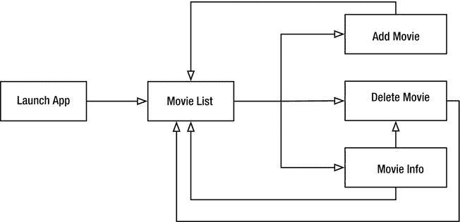
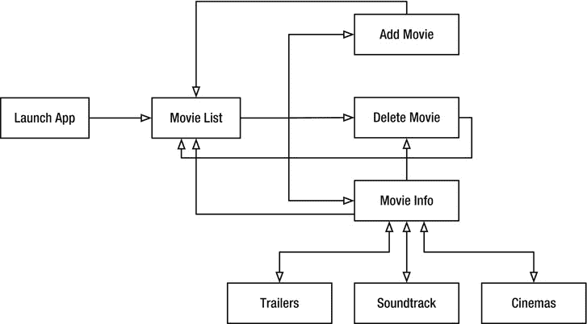
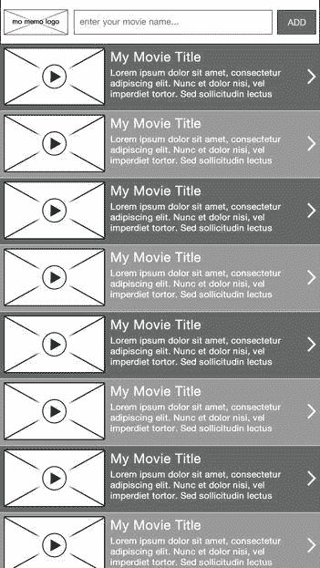
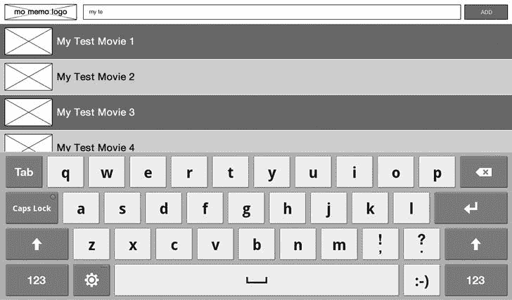
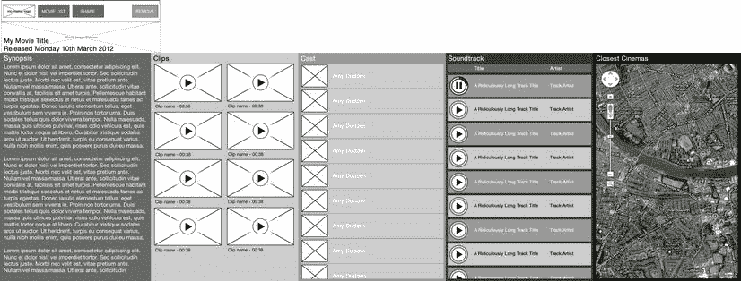
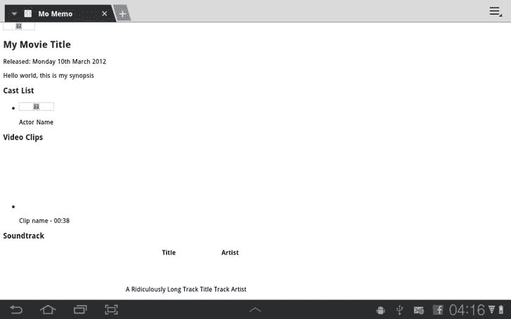

# 四、使用 HTML5 启动您的项目

HTML 为任何 web 项目提供了一个很好的起点。它本质上给了你一个框架，让你在用 CSS(视觉风格)和 JavaScript(交互性)增强网页时可以使用。对于本书中的三个研讨会(HTML5、CSS 和 JavaScript)，您将逐步增强一个名为 MoMemo 的移动 web 应用。MoMemo 将利用以下 HTML/HTML5 特性。

*   帆布
*   JavaScript APIs
*   CSS3 过渡
*   媒体查询
*   HTML5 视频/音频
*   离线存储

在这一章中，你将学习三种不同的方法来设计你的网页，这取决于你正在制作的移动网络应用的类型。

您还将开始用 HTML 创建 MoMemo 应用的框架。在此之前，您将学习如何将一个移动应用从一个想法，到需求收集，到 IA，最后用 HTML5 编码。您还将简要介绍应用缓存，该功能允许您指定在用户的移动设备上缓存哪些元素，以及在没有网络连接时如何返回到不应该缓存的文件。

### 分页策略

在 HTML 中创建页面有三种主要方式。

*   **标准 HTML:** 创建标准 HTML 页面并链接到它们
*   **单页面 Ajax:** 使用单个页面并使用 Ajax 加载后续页面
*   **单页面容器:**使用单个页面作为容器，多个页面保存在一个容器`
`中，并使用 JavaScript 在它们之间移动

每种方法都有其优点和缺点。例如，当使用单页面容器方法时，具有许多页面和资源(图像、CSS、JavaScript)的移动 web 应用可能会出现性能问题，因为所有资源和页面都将在第一次页面加载时加载。因此，Ajax 或标准 HTML 方法可能会提供更好的性能和加载时间。

对于小型应用和原型开发，单页容器方法可能是首选。CSS3/JavaScript 可以处理页面之间的动画转换，由于资源数量可能很少，所以不会对页面加载产生很大影响。这可能是首选，因为最终用户不必等待通过 Ajax 或标准 HTML 方法加载页面。这创造了一个更像应用的体验。

对于简单的应用，标准的 HTML 方法可能是首选。但是，页面之间的动画可能会变得不切实际，并且当在页面间导航时加载页面和资源时会有一点等待时间。

**注意:**要使用本章中的练习，在 Aptana 项目中创建一个名为`exercises`的新文件夹，并在其中创建一个名为`chapter4`的文件夹。在示例中，我们将这称为“章节文件夹”。

#### 使用标准 HTML 分页

创建标准 HTML 分页的方法很简单。首先，在项目的 chapter 文件夹中创建一个名为`standard`的新文件夹，并创建两个名为`index.html`和`index2.html`的基本移动友好网页，如[清单 4-1](#list_4_1) 所示。

**清单 4-1。** *基础 HTML 手机网页*

`<!DOCTYPE html>
<html lang="en-GB" dir="ltr">

   <head>

      <meta charset="UTF-8" />
      <meta name="viewport" content="width=device-width; initial-scale=1.0;
maximum-scale=1.0; user-scalable=0; target-densitydpi=device-dpi;"/>
      <title>Standard Paging</title>

   </head>

   <body>

   </body>

</html>`

这里没有什么特别的，正如在第一章的[中解释的那样，我们设置了`charset`和`viewport` meta 标签，以确保页面相应地缩放，并防止用户用手指放大。我们还设置了页面标题。在`index.html`的主体中，创建一个链接和标题，如](01.html)[清单 4-2](#list_4_2) 所示。

**清单 4-2。** *在 index.html 创建链接*

`<h1>Page 1</h1>
<a href="./index2.html">Page 2</a>`

在`index2.html`中，在主体中创建另一个链接，链接回上一页，如[清单 4-3](#list_4_3) 所示。

**清单 4-3。**【index2.html T2】创建回 index.html 的链接

`<h1>Page 2</h1>
<a href="./index.html">Page 1</a>`

在你的手机浏览器中加载并测试它。就这么简单。为移动设备创建指向其他标准 HTML 页面的链接没有什么特别的。

#### 用单页 Ajax 分页

使用单页面 Ajax 创建移动应用需要更多的思考和努力。Ajax 允许从用户所在的当前网页之外的文件或页面中动态获取内容。这可以使应用更具可伸缩性，因为您不必在一个页面上包含多个页面。相反，当你需要他们的时候，你就把他们拉进来。这样做的好处是，当用户在页面之间移动时，您可以使用 CSS3 来应用动画。清单 4-4 显示了通过 Ajax 加载一个 HTML 页面的基本要求。

**清单 4-4。** *使用 Ajax 加载 HTML】*

`

   

      <h1>Page 1</h1>
      <a href="index2.html" data-method="xhr">Page 2</a>
   

`

[清单 4-4](#list_4_4) 中的代码可能看起来有点混乱和冗长，但它将允许你加载外部 HTML 文档，像普通的 HTML 文档一样遍历它的 DOM，并从中挑选元素。它还绑定所有属性设置为`xhr`的链接。

与使用 XML 或 JSON 相比，这样做的好处是，如果您想让 web 应用在没有 JavaScript 支持的设备上工作，您不必这样做——您不需要创建不同的视图，您只需删除 JavaScript 代码就可以在页面之间移动。

为此，我们要做的第一件事是设置页面，如下面的代码片段所示。

`

   

      <h1>Page 1</h1>
      <a href="index2.html" data-method="xhr">Page 2</a>
   

`

这就产生了一个容纳卡片的容器。在容器中，有一个带有标题和链接的基本卡。HTML5 允许我们使用数据属性在标记中设置自定义属性。

接下来，您必须使用下面的代码片段将所有链接绑定到 JavaScript 方法。

`function bindLinks(){

   [].forEach.call(document.querySelectorAll("#container a[data-method]"),
function(el){

      if(el.getAttribute("data-method") == "xhr"){
         el.addEventListener("click", function requestCard(event){
            loadCard(this.href);
            event.preventDefault();
         });
      }
   });

}`

这个功能包含在一个名为`bindLinks`的函数中，以便稍后使用。该方法中的第二行遍历从查询选择器返回的 HTML 元素列表或节点列表。这样做的方法看起来有点复杂。首先使用`[]`创建一个新的空数组对象。从这里开始，使用`call`方法在查询返回的节点列表的上下文中运行`Array`对象的`forEach`方法。`forEach`方法接受一个回调函数作为第一个参数。回调函数也接受以下三个参数:

*   正在迭代的当前元素
*   数组中当前元素的索引
*   实际的数组

您只需要当前元素，这样您就可以在回调函数中使用它；这叫`el`。

该方法中的第三行检查属性`data-method`是否存在，值是否为`xhr`。如果这是真的，它将向链接添加一个事件侦听器。这允许您手动指定应该通过 Ajax 获取哪些链接。

第四行向 click 事件添加一个事件侦听器。click 事件的行为方式与在桌面上的行为方式非常相似，只是如果用户将手指从链接上移开，就会取消该事件。您为此使用了一个命名函数，以便在 Android 浏览器或 Chrome for Android 中调试时可以在调用堆栈中跟踪它。

在事件监听器函数中，当用户点击链接时，方法`loadCard`被调用，调用的参数包含链接的预期路径`event.target.getAttribute("href")`。这取自链接的`href`属性。`event.preventDefault();`阻止链接在浏览器中被跟踪，并阻止下一页以通常的方式加载。

下一个代码片段中显示的`loadCard`函数将使用`XMLHttpRequest`从 path 参数加载 html，获取页面中的卡片，并使用`setCardContent`方法用新内容替换当前页面中的卡片。完成后，该方法将使用事件处理程序重新绑定链接，以便以相同的方式加载所有后续页面，因为新内容中的任何新链接都不会附加事件处理程序。

`function loadCard(path){

   var xhr = new XMLHttpRequest();
   xhr.open("GET", path, true);
   xhr.onreadystatechange = function contentLoaded(){

      if (this.readyState === this.DONE) {` `         var container = document.querySelector("#container");

         if (this.status === 200) {

            var domParser = new DOMParser(),
            externalDocument = domParser.parseFromString(this.responseText,
'text/html'),
            card = externalDocument.querySelector("#card").outerHTML;

            setCardContent(card);
            bindLinks();

         } else {

            setCardContent('
<h1>Oops</h1>
Something went
wrong!

');

         }

      }

   }

   xhr.send();

}`

这个函数中的第一行实例化了一个新的`XMLHttpRequest` ( `xhr`)对象。第二行设置了`xhr`请求。open 方法接受以下五个参数:

*   方法—获取、发布
*   统一资源定位器
*   Async—true，false(默认为 true，调用 send 方法后将继续运行 JavaScript。如果设置为 false，它将在运行 send 方法后冻结浏览器，直到请求完成)
*   用户(如果请求受 HTTP 用户名和密码保护，您可以在此输入用户名)
*   密码(如果请求受 HTTP 用户名和密码保护，您可以在此输入密码)

调用`open`不会发出 Ajax 请求。第四行设置了`onreadystatechange`事件的处理程序。

#### 用单页容器分页

使用单页容器分页允许您在一个 HTML 页面中创建一组卡片，并使用 JavaScript 在它们之间导航。随着应用的增长，这可能会产生潜在的问题，即试图管理包含多个卡的多个部分/功能。解决这个问题的方法是将每一组特性分成几个 HTML 页面。在每个 HTML 页面中，都有一副与特定功能相关的卡片。要在不同的卡片组之间导航，您可以通过 Ajax 将它们拉进来，或者使用标准 HTML 在它们之间导航，而无需动画。

创建单页面容器移动 web 应用很简单，其工作方式与 Ajax 方法非常相似。

首先，在练习文件夹中创建一个名为`container`的文件夹。在这个文件夹中，创建一个名为`css`的文件夹。创建一个名为`mobile.css`的新 CSS 文件，并添加清单 4-5 中的 CSS。

**清单 4-5。** *单页容器的 CSS*

`/**
 * Sets the body, html, and deck element styles
 */
body, html, #deck {
   height: 100%; /** Sets the height of the document to 100% of the viewport **/
   overflow: hidden; /** Set so that all content that flows outside is hidden
**/
   margin: 0; /** The body's margin is usually never 0, so this removed any
margin **/
   position: realtive; /** The card will be positioned relative to the deck **/
}

/**
 * The card within the deck’s styles
 */
#deck .card {
   overflow: auto; /** If there is too much content, this lets the user scroll
**/
   height: 100%; /** Sets the height of the card to be 100% **/
   position: absolute; /** Allows the card to be absolutely positioned **/
   left: -100%; /** Sets the default position to be off the screen (hidden) **/
   width: 100%; /** Sets the width of the card to be the width of the deck **/
}

/**
 * Sets the active card style so that it is visible when the class is added to
it
 */` `#deck .card.active {
   left: 0; /** moves the card back into view **/
}`

这个 CSS 中的第一条规则将把`body`、`html`和`deck`的高度设置为`100%`。这将使网络浏览器的视窗中充满这副牌和卡片。在这里，您将`overflow`设置为`hidden`，这样这些元素之外的任何内容都将被删除，并且不显示滚动条。你也把`margin`设置成`0`；这将只应用于主体，但是这样可以省去专门为主体编写新的 CSS 规则。

第二条规则为卡片本身设定了样式。每张卡都将`overflow`设置为`auto`。当内容超出屏幕的可见高度时，这将允许用户用手指滚动卡片中的更多内容。每张牌都有一个`absolute`的`position`，因此它的位置可以放在牌组内的任何地方。这样做可以让卡片在不需要的时候放在屏幕之外。将`left` CSS 规则设置为`-100%`会将该副牌中所有非活动的牌推到视窗左侧的宽度，这样用户就看不到了。

第三个规则将 CSS 规则设置为`active`卡片。这将把卡的`left`位置设置为`0`，这将使卡回到用户的视野中。显示卡片非常简单，只需使用 JavaScript 为您想要呈现给用户的卡片添加和移除`active`类。[清单 4-6](#list_4_6) 展示了如何做到这一点。

**清单 4-6。** *显示和隐藏卡片的 JavaScript*

`function goToCard(to) {
   /**
    * Gets all cards with the active class and removes it. This hides the card
    * from view.
    */
   document.querySelectorAll('.card.active')[0].classList.remove('active');

   /**
    * Adds the active CSS class to the target card and brings it into view.
    */
   document.querySelectorAll(to)[0].classList.add('active');
}`

从`goToCard`方法中，您可以看到它采用了一个`to`参数。`to`参数是从清单 4-7 中显示的 HTML 链接的 URL 中提取的散列

**清单 4-7。** *从卡片组加载卡片的链接的 HTML】*

`<a data-method="push" href="#card-index">Page 1</a>`

从这里，您可以看到`data`属性用于标识将内容推至顶层的链接。在这种情况下，使用 push 但是，任何其他属性都可以用于您的需求。属性与卡的 ID 相关联，如清单 4-8 中的[所示。](#list_4_8)

**清单 4-8。** *一副套牌的 HTML】*

`<section class="card" id="card-index">
   <h1>Page 1</h1>
   <a data-method="push" href="#card-second-page">Page 2</a>
</section>`

从这段代码中可以看到，卡的`id`被设置为`card-index`。您使用`card`作为前缀来帮助命名卡片组。这将防止您无意中在另一个 HTML 元素上使用`index`，从而导致分页问题。[清单 4-9](#list_4_9) 展示了如何使用 JavaScript 来激活页面。

**清单 4-9。** *激活一副牌内的牌*

`/**
 * Works in much the same way as the previous method. It will iterate over all
matched
 * elements and call the callback method.
 */
[].forEach.call(document.querySelectorAll('.card a[data-method="push"]'),
function(el){
   /**
    * As you can see, the callback method is named. Instead of function(event){
    * function pushCard(event) is used. This can help with debugging; e.g., in
    * the JavaScript stack trace you can see the function’s name rather than
    * anonymous.
    */
   el.addEventListener("click", function pushCard(event){
      /**
       * This gets the hash (#card-second-page) element of the href in
       * the link and assigns it to pageid. The href object has various
       * properties, all of which can be found at
       * http://www.w3.org/TR/html5-author/urls.html#url-decomposition-idl-
       * attributes.
       */
      var pageid = this.href.hash;
      /**
       * This calls the goToCard method that will load the content with the
       * specified pageID.
       */
      goToCard(pageid);` `      /**
       * This will prevent the browser from following the URL.
       */
      event.preventDefault();
   });
});`

您使用与 Ajax 方法相同风格的 JavaScript 将事件绑定到带有`push`数据属性的链接。在事件监听器中，使用`this.href.hash`从链接中获取散列。这被传递给来自[清单 4-5](#list_4_5) 的`goToCard`方法，该方法从可见卡片中移除了`active`类，并将其添加到卡片中以显示给用户。完整的代码示例可以在清单 4-10 中看到。

**清单 4-10。** *完整的单页容器示例*

`<!DOCTYPE html>
<html lang="en-GB" dir="ltr">

<head>
   <meta charset="UTF-8" />
   <meta name="viewport" content="width=device-width; initial-scale=1.0;
maximum-scale=1.0; user-scalable=0; target-densitydpi=device-dpi;"/>
   <title>Single Page Container</title>
   <link rel="stylesheet" type="text/css" href="css/mobile.css" />
</head>

<body>
   

      <section class="card active" id="card-index">
         <h1>Page 1</h1>
         <a data-method="push" href="#card-second-page">Page 2</a>
      </section>

      <section class="card" id="card-second-page">
         <h1>Page 2</h1>
         <a data-method="push" href="#card-third-page">Page 3</a>
      </section>

      <section class="card" id="card-third-page">
         <h1>Page 3</h1>
         <a data-method="push" href="#card-index">Page 1</a>
      </section>

   

   

</body>

</html>`

正如您所看到的，有几种有用的方法来寻呼移动设备。虽然这些例子是分开展示的，但是您可以将它们组合起来。例如，您可以结合容器和 Ajax 方法来分离应用的不同部分和功能。您还可以使用 Ajax 通过 JSON/XML 和本章中提到的任何方法来动态加载内容和数据，从而生成新的动态视图。

下一节将带您完成创建 MoMemo 应用的第一个阶段。

### 创建应用

创建可用的移动 web 应用的关键在于规划。确定移动 web 应用的关键功能，以及用户如何获得重要的功能和数据，将有助于您决定如何使用分页技术、设计和 UI 来实现应用本身。如果你不喜欢计划，这可能是一个费力又无聊的任务，但它会帮助你在开始开发和设计之前解决问题。

#### 策划 MoMemo

这个过程的第一步是用一句话来定义应用。在用一句话定义一个应用的时候，你应该尽量避免包括特性或者技术细节。句子应该简单描述应用及其目标。对于 MoMemo，应用定义如下:

MoMemo 是一个应用，允许用户快速记下他们在电影院看到的电影预告片，并在电影上映时得到提醒。

下一步是定义必须具备的特性，这些特性将有助于满足应用的主要目标。MoSCoW(必须有，应该有，可能有，不会有)可以是定义应用核心特性和功能的好方法。它将允许您定义核心功能(必须具备)，提供附加值的功能(应该具备)，如果在项目结束时还有剩余时间可以实现的功能(可能具备)，以及由于时间或资金限制而无法实现但可以在不久的将来实现的功能(不会具备)。这将有助于防止范围蔓延和“永无止境的项目”综合症，即开发人员不断谈论一个应用及其极长的不可能的功能列表，但从未实际创建它。

要使 MoMemo 成功，应用必须:

*   允许用户在个人列表中快速添加和删除电影
*   允许用户观看列表中的电影

它应该:

*   在用户键入时提供电影建议列表
*   显示关于电影的信息，包括
    *   摘要
    *   发布日期
    *   演员表

它可以:

*   允许用户观看电影预告片
*   允许用户播放电影中的声音剪辑
*   允许用户在社交网络上共享添加到其列表中的项目
*   查看电影备忘录时，向用户显示最近电影院的地图

不会的:

*   电影上映时向用户发送通知
*   允许用户在看过电影后对电影进行分级
*   允许用户邀请其他用户去电影院看电影

既然已经定义了核心特性和功能，我们就可以开始基于必须具备、应该具备和可能具备的特性集来创建用户旅程了。

首先，我们应该从必备类别中构建我们的核心特性集。图 4-1 显示了应用的核心功能应该如何运行。用户应该启动应用，并提出了他们已经添加的电影列表。从这里，他们可以添加或删除列表。然后它们将被带回到电影列表。

**图 4-1。** *应用的主要特性*

现在，您可以在此基础上开始添加应有的功能。在[图 4-2](#fig_4_2) 中，可以看到只增加了电影信息功能。我们仍然需要在用户输入时提供一个电影建议列表，但是这个电影建议列表将是 Add Movie 特性的一个特性，而不是 Movie Info 特性。

**图 4-2。** *应用的二级特性*

最后，您可以添加可能拥有的或增值的功能，如图[图 4-3](#fig_4_3) 所示。

**图 4-3。** *增值增值功能*

正如您从[图 4-3](#fig_4_3) 中看到的，电影信息功能有三个子功能，允许您在电影信息主功能之间导航。这增加了应用的复杂性，并建议电影信息应该潜在地被分解到它自己的页面或卡片组中。

现在我们已经清楚地了解了应用当前应该如何运行，我们可以开始创建 UI 了。

#### 创建用户界面和 HTML

如果你曾经专门为 Android 开发过一个应用(原生或网络)，你会知道一些设计原则不同于你对 iOS 或 Windows Mobile 等其他移动操作系统的预期。例如，在谷歌 Galaxy Nexus 和三星 Galaxy Tab 上，系统栏(导航栏和组合栏)位于屏幕底部，并且在使用 Android 浏览器时总是活跃或可见的。一个好的设计原则是不要把工具栏堆叠在系统栏的顶部；这将防止用户无意中点击系统按钮，而他们实际上是想与你的应用进行交互。

为了方便用户使用该应用，有必要为用户提供一种清晰的方式来添加和查看他们的电影，同时也为您提供在未来添加新功能的能力。

LinkedIn 提供了一个很好的清晰的例子。正如你从[图 4-4](#fig_4_4) 中看到的，很明显，移动网络应用的主要用途是搜索人和查看最近的更新。如果你想访问更多的功能，在搜索栏旁边的“在”图标下有一个隐藏的工具栏。如果你想更新你的 LinkedIn 状态，你可以点击右上角的信息气球图标。

**图 4-4。** *LinkedIn 为整洁的登陆/主页提供的解决方案*

在应用的每个页面上都可以看到这个顶栏。在设计任何基于移动设备的网站时，你应该记住，它可以在各种屏幕尺寸上以横向或纵向模式浏览。

**注:**迄今为止，还没有已知的方法可以将网络浏览器的方向锁定为横向或纵向。所以当你设计一个移动网络应用时，你应该考虑到方向会改变。

#### 创建电影列表

MoMemo 应用的 UI 围绕着屏幕顶部的搜索栏。[图 4-5](#fig_4_5) 和[图 4-6](#fig_4_6) 显示了应用的电影列表部分，包括平板电脑和移动设备的任务栏。

**图 4-5。** *电影列表为风景写字板*

从[图 4-5](#fig_4_5) 中可以看到，在浏览之前添加到列表中的电影时，可以访问搜索和添加电影的功能。用户也很清楚，这会将项目添加到列表中，而不是搜索现有的列表，因为提交表单的按钮被标记为 add 而不是 search。

[图 4-6](#fig_4_6) 以同样的方式显示信息，但屏幕更小；但是，列表项稍大一些，以适应用户手指敲击准确度可能较低的情况。虽然列表项被捆绑在一起，但是用户点击以查看关于电影的更多信息的目标是相当大的。将任务栏放在顶部还允许用户自然轻松地浏览他们保存的电影列表，而不必担心意外激活应用的另一部分。应用的两个 UI 模型在 HTML 方面是相同的；但是，我们可以使用 CSS 媒体查询来确定特定的显示大小和方向。您还可以利用流体布局来确保应用对方向和屏幕大小的变化做出正确的反应。

**图 4-6。** *人像手机电影列表*

用 HTML 标记这一点非常简单。首先，在项目的根目录下创建一个名为`application`的文件夹。在该文件夹中，再创建三个名为`css`、`img`和`js`的文件夹。`css`文件夹将存储你的 CSS/SASS，`img`将存储你所有的图片和精灵，`js`将存储你所有的库和应用 JavaScript。

您还需要在`js`中创建两个名为`lib`和`app`的文件夹，在`js/app/`文件夹中创建一个名为`bootstrap.js`的文件，在`css`文件夹中创建一个名为`mobile.scss`的文件。

在`application`文件夹中创建一个名为`index.html`的新文件；[清单 4-11](#list_4_11) 中的代码将有助于引导应用。

**清单 4-11。** *初始引导 HTML*

`<!DOCTYPE html>
<html lang="en-GB" dir="ltr">

   <head>

      <meta charset="UTF-8" />
      <meta name="viewport" content="width=device-width; initial-scale=1.0;
maximum-scale=1.0; user-scalable=0; target-densitydpi=device-dpi;"/>
      <title>Mo Memo</title>
      <link rel="stylesheet" type="text/css" href="css/mobile.css" />
      <link rel="apple-touch-icon-precomposed" href="img/home-screen-icon.png">
   </head>

   <body>

      

         

         

      

      <!-- This script will instantiate any JavaScript necessary -->
      

   </body>

</html>`

你可以看到，有一个`div`围绕着名为`shoe`的甲板。这将有助于包含出现在每个页面上的全局元素，例如顶部任务栏，并且如果应用需要在未来扩展，它将拥有多个面板。除了与赌场和扑克牌相关的命名约定之外，您可以使用任何层次命名约定。

**注意:**这只是一个命名约定，我采用它是为了让我和其他开发人员更容易理解我的应用的结构。这也使得在编写 CSS 和 JavaScript 来挂钩移动 web 应用的功能时，语义更加清晰。您可以使用任何您希望的 id 或类，或者您可以使用 suite 并使用我的。只要确保它们是有意义的。

你会注意到 CSS 没有链接到`mobile.scss`。这是因为 SCSS 文件需要被 SASS 编译并转换成 CSS。一旦编译完成，就会出现`mobile.css`文件。打开`mobile.scss`文件按 Shift + CMD + R 然后按 1。这将把 SASS 文件编译成 CSS 文件。(SASS 将在第 5 章的[中介绍。)](05.html)

是时候为应用创建标题了。在[清单 4-12](#list_4_12) 中显示的代码应该被添加到`
`元素中，但是在`
`元素之前。

**清单 4-12。** *标题代码*

`<header id="taskbar">

   <h1 class="branding">Mo Memo</h1>

   <form method="post">
      <input type="text" name="query" placeholder="enter your movie
name&hellip;" />
      <input type="submit" value="ADD" />
   </form>

</header>`

这将简单地创建一个标题和表格供用户搜索，如图 4-7 所示。使用 CSS，这将被放置在屏幕的顶部。

**图 4-7。** *没有样式的任务栏*

现在是时候添加第一张卡片了，电影列表卡片。这很简单，通过创建一个无序的数据列表来实现，如清单 4-13 中的代码所示。

**清单 4-13。** *保存的电影列表*

`<ul class="list alternating medium">
   <li>
      <a href="path/to/movie/">
         <video poster="img/video.jpg" title="Movie Title">
            <source type="video/webm" src="path/to/video.webm" />
         </video>
         <h2>My Movie Title</h2>
         
My Movie Description

      </a>
   </li>
   <li>
      <a href="path/to/movie/">
         <video poster="img/video.jpg" title="Movie Title">
            <source type="video/webm" src="path/to/video.webm" />
         </video>
         <h2>My Movie Title</h2>
         
My Movie Description

      </a>
   </li>
</ul>`

在 HTML5 中，可以用`href`标签包围块级元素。这使得将列表项的全部内容链接到另一个资源变得更加容易。

从[图 4-8](#fig_4_8) 中可以看出，这个页面看起来相当无聊。下一个研讨会将涉及使用 CSS 样式的应用。

**图 4-8。** *完整电影列表页面*

##### 电影搜索和添加

有了电影列表功能，现在是时候介绍搜索和添加电影的任务了。这可以通过两种方式之一来实现。

*   用户搜索一部电影，并得到一个列表。从这个列表中，用户点击电影，然后将他们带到电影信息屏幕。从这个屏幕上，用户可以将电影添加到列表中并返回到电影列表。
*   第二个选项是向用户提供建议，允许他们点击适合他们的建议，然后单击 add 按钮。然后，用户可以在以后查看电影信息。

这两种选择都没有错，但最优的还是在于用户在搜索电影时所处的情境。要回答这个问题，你需要参考莫斯科对这个项目的要求。必备要求之一是“允许用户**快速**在个人列表中添加和删除电影”。用户很可能会打开应用，搜索电影，添加电影，关闭应用，并在以后更详细地查看电影列表。[图 4-9](#fig_4_9) 和 [4-10](#fig_4_10) 展示了基于此的平板电脑和移动设备的搜索功能。

**图 4-9。** *平板电脑电影列表*

搜索和显示搜索结果将是 JavaScript 的任务(在第 8 章的[中介绍)。](08.html)

**图 4-10。** *手机电影列表*

##### 电影信息

MoMemo 应用的最后一部分是电影信息部分。它有几个子功能，包括电影简介，剪辑，演员阵容，配乐和最近的电影院。您可以在单独的卡片上呈现这些信息，但是当您在大屏幕设备(如平板电脑)上查看小部分内容(如概要)时，最终会有很多空白空间。为了解决这个问题，您可以将所有内容放在同一个视图中，但允许用户在纵向设备上侧滚至内容，以利用垂直空间，并在横向模式下正常滚动。图 4-11 和 [4-12](#fig_4_12) 显示了这应该如何呈现。

**图 4-11。** *人像移动设备上的电影信息*

**图 4-12。** *平板设备上的电影信息*

虽然两个视图的显示略有不同，但内容是相同的，并且可以使用 CSS 媒体查询重新定位，以适应设备的方向。创建一个`id`为`card-movie_info`的新卡，并添加来自[清单 4-14](#list_4_14) 的 HTML。

**清单 4-14。** *电影信息头*

`<header>

   
   <hgroup>
      <h2>My Movie Title</h2>
      
Released: Monday 10th March 2012

   </hgroup>

</header>`

这将为标题创建标记，根据设备的方向，可以使用 CSS 以不同的方式显示该标记。您使用`hgroup`对发布日期信息进行分组，该信息不应该包含在`h2`元素中。

清单 4-15 显示了大纲块，它将只包含文本。有一个`div`,其中一类内容围绕着块内的内容，但不包括主标题。这是为了使内容可以滚动，但标题始终在视图中。

**清单 4-15。** *剧情简介块*

`<section class="block" id="block-synopsis">
   

      
Hello world, this is my synopsis

   

</section>`

[清单 4-16](#list_4_16) 显示了铸造块。从设计上看，演员名单应该可以在它的区块内滚动；但是，标题应该始终保持在顶部。这个块还显示了列表将被标准化，以减少 CSS 中的臃肿。

**清单 4-16。** *施展封锁*

`<section class="block" id="block-cast">
   <h3>Cast List</h3>
   

      <ul class="list scrolling medium">
         <li>
            
            
Actor Name

         </li>
      </ul>
   

</section>`

然后你移动到视频块，如清单 4-17 所示。在两种线框中，视频都以网格格式显示，但它们是灵活的，因为一行可以包含两个或四个视频，这使得使用表格不灵活。为此，您可以选择使用常规列表，并根据设备的方向使用 CSS 对其进行格式化。

**清单 4-17。** *视频块*

`<section class="block" id="block-video">

   <h3>Video Clips</h3>

   

      <ul class="list grid">

         <li>
            <video poster="path/to/posterframe.jpg" title="Clip Title">
               <source type="video/webm" src="path/to/video.webm" />
            </video>
            
Clip name - 00:38

         </li>

      </ul>
   

</section>`

音轨块非常简单，因为它在两个方向上都很相似，在平板电脑和移动设备上都是如此。这显示在[清单 4-18](#list_4_18) 中。

**清单 4-18。** *配乐块*

`<section class="block" id="block-soundtrack">

   <h3>Soundtrack</h3>

   

      <table class="alternating">

         <thead>
            <tr>
               <th>&nbsp;</th>
               <th>Title</th>
               <th>Artist</th>
            </tr>
         </thead>` `         <tbody>
            <tr>
               <td>
                  <canvas class="audio"></canvas>
               </td>
               <td>
                  A Ridiculously Long Track Title
               </td>
               <td>
                  Track Artist
               </td>
            </tr>
            <tr>
               <td>
                  <canvas class="audio"></canvas>
               </td>
               <td>
                  A Ridiculously Long Track Title
               </td>
               <td>
                  Track Artist
               </td>
            </tr>
         </tbody>

      </table>

   

</section>`

如您所见，每行的第一列都有一个`canvas`元素。我们将使用 HTML 画布来生成播放按钮和动画进度条。

最后，[清单 4-19](#list_4_19) 显示了最近的电影院街区。这由一个带有类`map`的`div`组成。谷歌地图应用编程接口将用于这项任务。

**清单 4-19。** *最近的电影院街区*

`<section class="block" id="block-closest_cinemas">

   <h3>Closest Cinemas</h3>

   

      

   

</section>`

为 MoMemo 创建标记的工作到此结束。任务栏如何对应用做出反应将在 JavaScript 的第 8 章中讨论。

如果您看到类似于图 4-13 中所示的内容，请不要惊慌。你将在[第五章](05.html)中学习如何使用 SASS 生成模块化 CSS。

**图 4-13。** *三星 Galaxy 标签上的完整标记*

您可能希望做的最后一件事是开始实现应用的离线缓存功能。这将允许用户在没有接收信号时浏览他们的电影列表。

第一步是将`manifest`属性添加到`html`标签中，如[清单 4-20](#list_4_20) 所示。

**清单 4-20。** *应用清单属性*

`<!DOCTYPE html>
<html lang="en-GB" dir="ltr" manifest="momemo.cache">`

现在在应用目录的根目录下创建一个名为`momemo.cache`的文件。在这个文件中，添加清单 4-21 中的代码。

**清单 4-21。** *缓存清单文件*

`CACHE MANIFEST
index.html
js/app/bootstrap.js
css/mobile.css`

这将确保缓存`index.html`、`bootstrap.js`和`mobile.css`文件以供离线查看。随着应用的构建，更多的文件和规则将被添加到缓存清单文件中。

### 总结

从本章中，你应该已经了解了如何在移动 web 应用中管理分页，以及如何根据项目的需求选择合适的分页策略。您还应该了解如何开始构建应用——从想法到需求，从 IA/线框到用 HTML 编写基础代码，以及设备的方向和屏幕大小将如何影响您设计应用。

在[第 5 章](05.html)中，你接下来将学习 CSS 如何改变你的风格、动画和提高你的移动网络应用的性能，以及 SASS 如何帮助组织你的 CSS 规则和产生一组结构化的 CSS 文件。