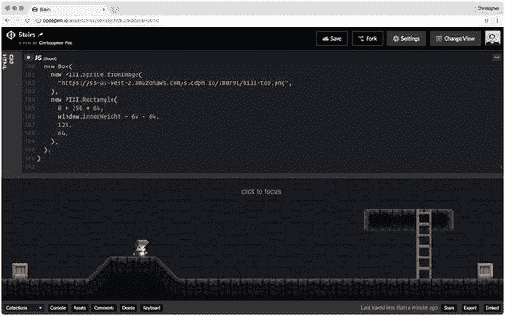

# 7.楼梯

我们实现了跳跃和攀爬作为垂直穿越一个关卡的主要方式。这些行动是伟大的，但他们限制了平台和梯子组成的水平设计。让我们通过实现楼梯(或类似的爬坡动作)来扩展我们的设计选项。

我们需要为这个部分创建更多的精灵作品，并构建由多种精灵类型组成的更复杂的盒子。让我告诉你我的意思....

## 建造一个斜坡

我已经创建了新的斜坡精灵。我们还需要添加一些新的对象类型:贴花和斜坡。贴花将会是非碰撞类型，而斜坡将会被玩家的碰撞检测算法识别:

```js
class LeftSlope {
  get collides() {
    return false
  }

  constructor(sprite, rectangle) {
    this.sprite = sprite
    this.rectangle = rectangle
  }

  animate(state) {
    this.sprite.x = this.rectangle.x
    this.sprite.y = this.rectangle.y
  }
}

class RightSlope {
  get collides() {
    return false
  }

  constructor(sprite, rectangle) {
    this.sprite = sprite
    this.rectangle = rectangle
  }

  animate(state) {
    this.sprite.x = this.rectangle.x
    this.sprite.y = this.rectangle.y
  }

}

class Decal {
  get collides() {
    return false
  }

  constructor(sprite, rectangle) {
    this.sprite = sprite
    this.rectangle = rectangle
  }

  animate(state) {
    this.sprite.x = this.rectangle.x
    this.sprite.y = this.rectangle.y
  }
}

// ...later

game.addObject(
  new LeftSlope(
    new PIXI.Sprite.fromImage(
      "path/to/sprites/slope-left.png",
    ),
    new PIXI.Rectangle(
      0 + 250,
      window.innerHeight - 64 - 64 + 1,
      64,
      64,
    ),
  ),
)

game.addObject(
  new RightSlope(
    new PIXI.Sprite.fromImage(
      "path/to/sprites/slope-right.png",
    ),
    new PIXI.Rectangle(
      0 + 250 + 64 + 128,
      window.innerHeight - 64 - 64 + 1,
      64,
      64,
    ),
  ),
)

game.addObject(

  new Decal(
    new PIXI.Sprite.fromImage(
      "path/to/sprites/hill-base.png",
    ),
    new PIXI.Rectangle(
      0 + 250,
      window.innerHeight - 64 + 1,
      128,
      64,
    ),
  ),
)

game.addObject(
  new Box(
    new PIXI.Sprite.fromImage(
      "path/to/sprites/hill-top.png",
    ),
    new PIXI.Rectangle(
      0 + 250 + 64,
      window.innerHeight - 64 - 64 + 1,
      128,
      64,
    ),
  ),
)

```

这是出自 [`http://codepen.io/assertchris/pen/dpmOEJ`](http://codepen.io/assertchris/pen/dpmOEJ) 。

我们需要在地板后添加这些对象，否则地板会遮住它们。它们一起创造了一座令人愉悦的小山。我们可以跳到它上面，但是当我们试图爬上或爬下这些物体时，事情开始变得令人毛骨悚然。尽管如此，它看起来还是不错的，如图 [7-1](#Fig1) 所示:



图 7-1。

A Little hill

## 爬坡

为了让我们的玩家爬上斜坡，我们需要再次调整碰撞检测算法:

```js
if (me.x < you.x + you.width &&
    me.x + me.width > you.x &&
    me.y < you.y + you.height &&
    me.y + me.height > you.y) {

  if (object.constructor.name === "LeftSlope") {
    const meCenter = Math.round(me.x + (me.width / 2))
    const youRight = you.x + you.width
    const youBottom = you.y + you.height
    const highest = you.y - me.height
    const lowest = youBottom - me.height

    this.isOnGround = true
    this.isOnSlope = true

    me.y = lowest - (meCenter - you.x)
    me.y = Math.max(me.y, highest)
    me.y = Math.min(me.y, lowest)

    if (me.y >= lowest || me.y <= highest) {
      this.isOnSlope = false
    }

    return
  }

  if (object.constructor.name === "RightSlope") {
    const meCenter = Math.round(me.x + (me.width / 2))
    const youBottom = you.y + you.height
    const highest = you.y - me.height
    const lowest = youBottom - me.height

    this.isOnGround = true
    this.isOnSlope = true

    me.y = highest + (meCenter - you.x)
    me.y = Math.max(me.y, highest)

    me.y = Math.min(me.y, lowest)

    if (me.y >= lowest || me.y <= highest) {
      this.isOnSlope = false
    }

    return
  }

  if (collides && this.velocityY > 0 && you.y >= me.y) {
    this.isOnGround = true
    this.velocityY = 0
    return
  }

  // ...remaining collision detection code
}

if (state.keys[32] && this.isOnGround) {
    this.velocityY = this.jumpVelocity
    this.isOnGround = false
    this.isOnSlope = false
}

```

这是出自 [`http://codepen.io/assertchris/pen/dpmOEJ`](http://codepen.io/assertchris/pen/dpmOEJ) 。

如果玩家和`LeftSlope`碰撞，我们不会像和盒子碰撞一样。相反，我们减少玩家的`y`坐标(向上移动玩家精灵),无论玩家在斜坡的右边多远。换句话说，随着玩家的`x`增加，他们的顶端减少。

对于`RightSlope`，我们只是交换了`x`和`y`的关系，随着玩家的`x`增加，玩家向下移动。我们还希望玩家能够跳上斜坡，所以我们需要将`isOnGround`设置为`true`。

最后，如果玩家的底部边缘与斜坡的顶部边缘相同(或更少)，我们将`isOnSlope`设置为`false`，这样玩家将在水平轴上正确移动。

## 停留在地面以上

如果您一直遵循代码，您可能会注意到一个奇怪的视觉缺陷。似乎在碰撞检测阻止他们之前，玩家可能会中途摔倒在地板上。

我们可以通过重置适当碰撞的`y`玩家坐标来解决这个问题:

```js
if (collides && this.velocityY > 0 && you.y >= me.y) {
  me.y = you.y - me.height + 1
  this.isOnGround = true
  this.velocityY = 0
  return
}

if (collides && this.velocityY < 0 && you.y <= me.y) {
  this.velocityY = this.accelerationY
  return
}

if (collides && this.velocityX < 0 && you.x <= me.x) {
  this.velocityX = 0
  return
}

if (collides && this.velocityX > 0 && you.x >= me.x) {
  this.velocityX = 0
  return
}

This is from http://codepen.io/assertchris/pen/dpmOEJ.

```

现在，当玩家碰到什么东西时，它会再次被推到外面。这将阻止玩家沉入地板。

## 摘要

在这一章中，我们学习了如何制作玩家可以走上去的斜坡(不需要跳跃)。这些概念转化为一个古老城堡中楼梯的实现。

试着创造你自己的楼梯。也许你的楼梯会比我的更陡或更浅，你需要调整你的玩家上升或下降的速度。