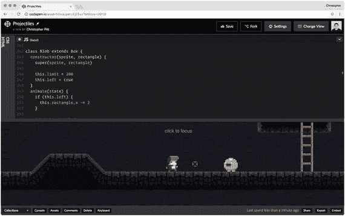

# 十、暴徒

如果玩家独自经历这一切，这个游戏会有什么乐趣呢？我们现在需要的是无脑的暴民(或者你喜欢的一群人)巡逻和/或以其他方式使英雄的道路复杂化。

## 巡逻队

在这一章中，我们将添加巡逻 blobs，这意味着我们需要另一个类来封装它们的逻辑:

```js
class Blob extends Box {
  constructor(sprite, rectangle) {
    super(sprite, rectangle)

    this.limit = 200
    this.left = true
  }

  animate(state) {
    if (this.left) {
      this.rectangle.x -= 2
    }

    if (!this.left) {
      this.rectangle.x += 2
    }

    this.limit -= 2

    if (this.limit <= 0) {
      this.left = !this.left
      this.limit = 200
    }

    this.sprite.x = this.rectangle.x
    this.sprite.y = this.rectangle.y
  }
}

```

这是出自 [`http://codepen.io/assertchris/pen/XjEExz`](http://codepen.io/assertchris/pen/XjEExz) 。

这次我们在构造函数中设置了几个属性。我们仍然希望应用父构造函数，所以我们调用`super`，提供预期的`sprite`和`rectangle`参数。

然后，在`animate`方法中，我们向左或向右移动斑点`2`像素(取决于斑点是否在移动`left`)。一旦斑点在同一个方向移动了`200`像素，我们就把它转过来(并重置另一个方向的`200`像素)。

我们应该在我们的关卡周围点缀一些:

```js
game.addObject(
  new Blob(
    new PIXI.Sprite.fromImage(
      "path/to/sprites/blob-idle-1.png",
    ),
    new PIXI.Rectangle(
      width - 450,
      height - 64 - 48,
      48,
      48,
    ),
  ),
)

```

这是出自 [`http://codepen.io/assertchris/pen/XjEExz`](http://codepen.io/assertchris/pen/XjEExz) 。

这段代码会把 blob 放在玩家的起始位置旁边，如图 [10-1](#Fig1) 所示(至少在我这个级别)。看着它来回移动，甚至让玩家跳到它头上，这很有趣。



图 10-1。

Patrolling blob

## 射杀暴徒

在上一章中，我们增加了玩家发射射弹的能力。让我们通过给子弹本身添加一些碰撞检测来使用它们:

```js
class Bullet extends Decal {
  animate(state) {
    const rect = state.player.rectangle

    this.x = this.x || rect.x + rect.width
    this.y = this.y || rect.y + (rect.height / 2)
    this.angle = this.angle || state.angle
    this.rotation = this.rotation || state.rotation
    this.radius = this.radius || 0

    this.radius += 10

    const targetX = this.x + Math.cos(this.angle) * this.radius
    const targetY = this.y - Math.sin(this.angle) * this.radius

    this.rectangle.x = targetX
    this.rectangle.y = targetY

    this.sprite.x = targetX
    this.sprite.y = targetY
    this.sprite.rotation = this.rotation

    state.objects.forEach((object) => {
      if (object === this) {
        return
      }

      const me = this.rectangle
      const you = object.rectangle

      if (me.x < you.x + you.width &&
          me.x + me.width > you.x &&
          me.y < you.y + you.height &&
          me.y + me.height > you.y) {

        if (object.constructor.name === "Blob") {
          state.game.removeObject(object)
          state.game.removeObject(this)
        }
      }
    })
  }
}

```

这是出自 [`http://codepen.io/assertchris/pen/XjEExz`](http://codepen.io/assertchris/pen/XjEExz) 。

这个冲突检测逻辑类似于我们在`Player`类中做的第一遍。我们不需要检查斜坡或梯子之类的东西。我们感兴趣的是子弹是否会撞上一个斑点。如果是这样，我们将两者从游戏中移除。

Note

我还稍微降低了子弹速度。认为一个玩家几乎可以追上一颗飞驰的子弹是不太现实的，但是这样确实感觉好一点。

这并不像 blob 的生命值稳步下降那么优雅，但是我们稍后会重新讨论这个话题。

## 摘要

在这一章中，我们在游戏中加入了一种简单的暴徒。我们也授权我们的子弹去派遣这些暴徒。他们不是最聪明的(甚至不是最持久的)暴民，但他们是一个开始。

这是你可以真正发挥创造力的地方。如果你给小怪的运动加上重力会怎么样？还是让它们静止不动，直到玩家靠近？如果他们能还击呢？