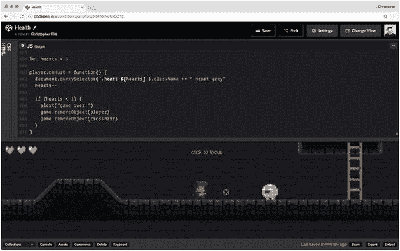

# 十一、健康

我很少玩第一次失误就导致立即失败的游戏。通常，在失败的最后时刻会有一个相当大的引导。索尼克( [`https://en.wikipedia.org/wiki/Sonic_the_Hedgehog`](https://en.wikipedia.org/wiki/Sonic_the_Hedgehog) )失去了戒指，马里奥失去了力量。

本章的目标是让我们实现一个健康系统，这样玩家就有机会犯错并从中吸取教训。

## 受到伤害

玩家只有一种可能失败的方式(在我们的游戏中，到目前为止):从关卡边缘跳下。然而，这并不是一个现实的失败条件，因为构建良好的关卡会以这样一种方式建立，玩家永远不能到达关卡的边界之外。

在我们能够计算出健康损失的细节之前，我们需要引入另一种导致健康损失的机制。在这里，我们将介绍一种机制，当我们接触到粘液时，它会导致我们失去健康(并暂时失去控制)。

首先，我们将不得不在`Player.animate`中引入更多的冲突检测逻辑:

```js
if (object.constructor.name === "Blob" && !this.invulnerable) {
  if (this.velocityX >= 0) {
    this.velocityX = -10
  } else {
    this.velocityX = 10
  }

  this.velocityY *= -1

  this.invulnerable = true
  this.sprite.alpha = 0.5

  setTimeout(() => {
    this.invulnerable = false
    this.sprite.alpha = 1
  }, 2000)

  if (typeof this.onHurt === "function") {
    this.onHurt.apply(this)

  }
}

```

这是出自 [`http://codepen.io/assertchris/pen/qaoyPo`](http://codepen.io/assertchris/pen/qaoyPo) 。

我们之前在`Bullet.animate`中添加了`Blob`特有的碰撞检测。现在，我们将它添加到`Player.animate`中，这样玩家在接触到`Blob`时就会“受到伤害”。

Note

我在这里和之前已经硬编码了很多东西。您可以自由地将硬编码的值抽象出来，但是为了节省时间和保持简单，我选择不在每个实例中都这样做。例如，您可以完全移除`alpha`逻辑，并为构造函数提供`invulnerable`持续时间。

现在，当玩家和 blob 连接时，玩家被从 blob 向上和向后抛出。玩家也进入无敌状态，这意味着他们不会在`2000`毫秒内失去所有生命值。既然我们有了伤害玩家的方法，那就来做点什么吧。

## 显示健康

注意到关于`onHurt`的那一点了吗？我不想硬编码显示玩家当前健康状况的界面变化。通过调用用户提供的函数，我们可以将该行为外包给创建播放器的代码。

尝试将所有东西都放入 PixiJS 模型很诱人，但我们是在 web 环境中编码。我们将使用 HTML 和 CSS 显示健康栏，而不是通过我们的 PixiJS 渲染器和场景来呈现玩家的健康状况。而且，既然我们有办法将内部破坏行为与外部环境联系起来(通过`onHurt`)，这应该不会太难。

让我们创建所需的 HTML 元素:

```js
<div class="camera"></div>
<div class="hud">
  <div class="heart heart-1"></div>
  <div class="heart heart-2"></div>
  <div class="heart heart-3"></div>
</div>
<div class="focus-target">click to focus</div>
-------

.camera, .hud, .focus-target {
  width: 100%;
  height: 100%;
  position: absolute;
  top: 0;
  left: 0;
}

.hud {
  .heart {
    width: 32px;
    height: 28px;
    background-image: url("path/to/sprites/heart-red.png");
    position: absolute;
    top: 15px;
  }

  .heart-1 {
    left: 15px;
  }

  .heart-2 {
    left: 57px;
  }

  .heart-3 {
    left: 99px;
  }

  .heart-grey {
    background-image: url("path/to/sprites/heart-grey.png");
  }
}

```

这是出自 [`http://codepen.io/assertchris/pen/qaoyPo`](http://codepen.io/assertchris/pen/qaoyPo) 。

这个标记在屏幕的左上方添加了三个红心。当玩家受伤时，我们会将每个颜色变成灰色:

```js
let hearts = 3

player.onHurt = function()

{
  document.querySelector(".heart-" + hearts)
    .className += " heart-grey"

  hearts--

  if (hearts < 1) {
    alert("game over!")
    game.removeObject(player)
    game.removeObject(crosshair)
  }
}

```

这是出自 [`http://codepen.io/assertchris/pen/qaoyPo`](http://codepen.io/assertchris/pen/qaoyPo) 。

这比我一开始预想的要简单很多。每次调用`onHurt`函数时，我们获取与我们剩余的红心数量相关的元素，并将其变为灰色，如图 [11-1](#Fig1) 所示(这要感谢我们之前添加的`.heart-grey`类)。



图 11-1。

Taking damage

如果玩家用完了最后一颗心，我们会弹出一个警告(虽然这可能是一个程式化的“游戏结束”消息)，并从游戏中移除玩家和十字准线。

## 摘要

在这一章中，我们增加了玩家失败的第一种合法方式。现在有一些危险，这种经历应该更愉快。

我们还创造了一种将内部事件(比如玩家受伤)与外部行为联系起来的方法。当玩家受伤时，你不必杀死他们。你可以试着把他们传送回关卡的起点或者减少他们的能力。选择权在你。