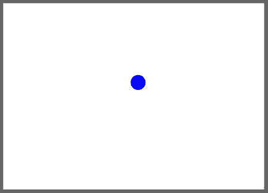

# 1.物理编程导论

您选择这本书是因为您对在编程项目中实现物理学感兴趣。但是你为什么要这么做呢？它能为你做什么？难度会有多大？本章将为这些问题提供答案。

本章涵盖的主题包括以下内容:

*   为什么要模拟真实的物理？这一部分将解释为什么你想在你的项目中加入物理学。
*   什么是物理？这里我们揭开神秘的面纱，用简单的术语解释什么是物理。简而言之，我们也告诉你，在你能写涉及物理的代码之前，你需要知道什么。
*   编程物理。谢天谢地，一旦你理解了一些基本原理，编程物理并不像你想象的那么难。这一部分解释了你需要做什么。
*   一个简单的例子。作为一个具体的例子，我们将用最少的代码编写一个简单的物理动画。

## 为什么要模拟真实的物理？

您可能对使用 JavaScript 建模物理感兴趣有很多原因。以下是一些最常见的:

*   创建逼真的动画效果
*   创造真实的游戏
*   建立模拟和模型
*   从代码中生成艺术

让我们依次看看每一个。

### 创建逼真的动画效果

由于 HTML5 canvas 元素，现在可以在不需要 Flash 等插件的情况下创建动画。使用一点 JavaScript 并熟悉一些物理知识，也可以制作出外观和行为都像真实事物的动画。例如，假设您正在制作一个场景，其中有人踢球，球从地面反弹。您可以尝试创建一个模拟球的行为的动画，但是无论您如何努力，它可能看起来都不太真实。只需要一点编码和一些基础物理知识，你就可以制作出更加真实的动画。如果像作者一样，你是程序员而不是设计师，你可能会觉得更容易！我们将在本章末尾的例子中向您展示这有多简单。

### 创建真实的游戏

基于网络的游戏非常受欢迎。随着现代网络浏览器功能的不断改进，可以开发出更好、更强大的游戏。硬件加速和 3D 支持只是有可能显著改善在线游戏用户体验的新兴发展中的两个。但游戏除了性能和外观，手感和外观的逼真也同样重要。如果球员投出一个球，根据万有引力定律，球应该会落下；如果一名球员在水下发射一枚鱼雷，它的运动方式应该与球在空中的运动方式不同。换句话说，你的游戏需要融入真实的物理。

你如何在游戏中建立物理意识？这本书会告诉你怎么做。

### 建筑模拟和模型

计算机模拟或计算机模型是一种试图模仿物理系统某些关键方面的程序。模拟在完整性或准确性方面有所不同，这取决于目的和资源。让我们以一个飞行模拟器程序为例。我们希望为训练飞行员设计的飞行模拟器比为游戏设计的更全面、更准确。模拟在电子学习、培训和科学研究中极为常见。在本书的最后一章，你将建立模拟——即一艘潜艇、一个基本的飞行模拟器和一个太阳系模型。事实上，整本书中的许多编码示例都是模拟的，即使通常更简单。

### 从代码生成艺术

近年来，生成艺术越来越受欢迎。一些基础物理可以带来很多乐趣，例如，可以使用粒子(可以用代码创建和激活的小图形对象)和不同种类的力来产生复杂的视觉效果和运动。这些效果可以包括逼真的动画，如烟和火，以及更抽象的生成艺术示例，这些示例可以通过混合使用算法、随机性和用户交互来创建。在混音中加入一些物理效果可以增强真实感和/或更丰富的效果。

我们将探索生成艺术的世界，并提供额外的工具和算法，可用于创建原始和有趣的效果，如复杂力场中的粒子轨迹。

## 什么是物理？

物理学是最基本的科学。从广义上讲，物理学是对支配事物行为的自然规律的研究。更具体地说，它关注的是空间、时间和物质(定义为存在于空间和时间中的任何“东西”)。物理学的一个方面是阐明支配物质行为、相互作用及其时空运动的普遍规律。另一个方面是使用这些定律来预测特定事物移动和相互作用的方式——例如，根据重力定律预测日食或根据空气动力学定律预测飞机如何飞行。

物理学是一门庞大的学科，在这种性质的书中，我们只能触及皮毛。幸运的是，你可能需要了解的大部分物理学都属于一个叫做力学的分支，这是最容易理解的分支之一。力学支配着物体运动的方式，以及这种运动是如何受到环境影响的。因为大多数游戏和动画都包含运动，力学显然与开发使对象在代码中表现真实的算法相关。

### 一切都根据物理定律运行

就物理学家所能观察到的而言，不要过于哲学化，可以公平地说物理定律确实是普遍适用的。这意味着一切都必须按照物理规律运行。这与生物学定律不同，后者只适用于生物。抛向空中的一块石头，绕太阳运行的一颗行星，人体的运转，人造机器的运行和运动，都必须遵守物理定律。此外，许多看似不同的现象是由相同的法律子集管理的。换句话说，一个或一组定律可以解释物理世界中多种观察到的事实或行为模式。例如，一块落下的石头和一颗绕太阳运行的行星都遵守万有引力定律。另一个例子是，所有的电、磁和辐射现象(如光和无线电波)都受电磁定律支配。

### 这些定律可以写成数学方程式

最棒的是物理定律可以写成数学方程式。好吧，如果你不喜欢数学，这听起来可能不太好！但这里的要点是，要使法律有用，它必须精确。数学方程是最精确的。与在法庭上争论不休的法律相比，在如何应用一条用数学表达的法律方面没有可能的模糊性！第二，这意味着几个世纪以来数学的发展被证明适用于物理学，使许多物理学问题的解决成为可能。第三，也是与我们最相关的一点:数学方程很容易转换成代码。

### 预测运动

让我们说得更具体些。作为一名 JavaScript 程序员，您最感兴趣的是事物如何运动。物理学的大部分内容是关于事物在不同类型的影响下如何运动的。这些“影响”可以来自其他事物，也可以来自环境。例子包括重力、摩擦力和空气阻力。在物理学中，我们对这些影响有一个特殊的名称:它们被称为力。真正的好消息是这些力有精确的数学形式。虽然物体的运动通常很复杂，但描述力的基本数学定律通常很简单。

力和运动之间的一般关系可以用符号表示如下:

运动=功能{力}

这里使用单词 function 并不是为了表示实际的代码功能。相反，它旨在强调两件事。首先，它意味着一种因果关系。力使物体以不同的方式运动。其次，它还指出了力和运动在代码中的算法关系，即物体的运动可以被视为以力为输入的函数的输出。用实际的话来说就是这样的:指定作用在物体上的力，并把它们放入一个数学方程中，然后你就可以计算出物体的运动。

Note

运动就是效果。力是原因。物体的运动是力作用于其上的结果。力和运动之间的数学关系被称为“运动定律”

为了能够应用本笔记中所述的原理，您需要了解以下内容:

*   定义。运动和力的精确定义。
*   运动定律。换句话说，将力与它产生的运动联系起来的函数的精确数学形式。
*   强制法。换句话说，如何计算力。有公式告诉你如何计算每一种力。

所以有两种定律你需要知道:运动定律和力定律。你还需要知道正确的概念(称为物理量)来描述和分析运动和力以及它们之间的关系。最后，你需要知道处理和组合这些量的数学方法。我们将在[第 3 章](03.html)中讲述相关的数学，在[第 4 章](04.html)中讲述基本的物理概念，在[第 5 章](05.html)中讲述运动定律，在[第 6 章](06.html)–[第 10 章](10.html)中讲述各种类型力的力定律。

## 编程物理学

那么，你如何编写物理代码呢？你是对运动编程，还是对力编程，或者两者都编程？它包括什么？

一旦你知道了一些基本的物理知识(和一些相关的数学知识)，只要你用正确的方法去做，编写代码并不会比你作为一个程序员所习惯的有太大的不同或者更难。让我们花一些时间来解释这个“正确的方法”是什么，通过描述模拟真实物理所涉及的内容，以及如何通过涉及数学方程、算法和代码的步骤来完成。

### 动画和模拟的区别

某个聪明人曾经说过“一幅画胜过千言万语”之类的话。你可以把它延伸为“一部电影抵得上一千张照片”一部电影(或动画)比一幅静态图像增加了我们更多的感知，因为它包含了时间变化的元素，一个额外的维度。但是有一种感觉，动画仍然是静态的，而不是动态的。不管你放多少遍，动画的开头和结尾都是一样的。一切都以完全相同的方式发生。虽然我们可能会看到从书面文字到视觉图像到动画电影的真实世界的进步，但仍然缺少一些东西:与媒体互动的能力，以及以复制现实生活中事物行为的方式影响结果的能力。下一步我们称之为模拟。当我们在本书中使用这个词时，模拟意味着真实性和交互性。当你模拟某样东西时，你不只是描绘它在一组条件下的行为；你允许许多，甚至无限多的情况。构建包括物理在内的交互式模拟使事物表现得像在真实世界中一样:与环境和用户交互以产生多样而复杂的结果。

还有更多。如果你真的很注意准确性，你甚至可以建立一个如此逼真的模拟，可以用作虚拟实验室。你可以在你的电脑上用它进行实验，了解现实世界中的事情是如何运作的！事实上，您将在本书中构建这样的模拟。

### 物理定律是简单的方程式

我们已经说过，物理定律是数学方程式。好消息是，你将遇到的大多数定律(以及方程)实际上都很简单。显然坏消息是这些定律会产生非常复杂的运动。事实上，这可能也是一件好事；否则宇宙将会是一个相当无聊的地方。

例如，支配重力的定律可以写成两个简单的方程(它们在第六章中给出)。但是它们负责月球绕地球的运动，行星绕太阳的运动，以及星系中恒星的运动。所有这些运动的净效应，加上不同天体之间的引力相互作用，将产生非常复杂的运动，这些运动仅由两个方程产生。

### 方程式可以很容易地编码！

我们现在可以回答本节开始时提出的前两个问题了。运动和力的定律很简单；它们产生的实际运动是复杂的。如果你知道定律，你可以计算不同条件下的运动。因此，对定律和力进行编码比对它们产生的运动进行编码更有意义。

动画试图直接再现物体的运动。模拟对运动规律进行编程，然后推导出物体的运动。对运动的原因进行编码要比对其结果进行编码容易得多。此外，一个动画通常描述一个单一的场景。但是模拟可以处理无限多种不同的场景。

Note

简单的运动定律和简单的力定律可以产生复杂的运动。因此，一般来说，编写法律比编写动议更容易。因此，矛盾的是，模拟可能比动画更容易。

模拟就像扮演上帝。你重新创造了一个虚拟世界，不是通过盲目复制你看到的所有行为，而是通过复制支配事物行为方式的规律，然后让这一切发生。

### 物理编程的四个步骤

为了回答我们在本节开始时提出的第三个问题，编程物理的过程可以分解为四个步骤，如图 [1-1](#Fig1) 所示。

图 1-1。

Steps in programming physics

第一步是确定适用于您正在建模的情况的物理原理。如果你没有物理学背景，这可能会很棘手。这本书会对你有所帮助:它不仅仅是一本操作指南，也是为了教你一些物理知识。第二步是回忆、研究或推导相关方程。显然，这一步涉及到一些数学。不用担心；我们会给你所有你需要的帮助！第三步是开发求解方程的算法。有时方程可以解析求解(我们将在后面的章节中解释这意味着什么)，在这种情况下算法非常简单。更常见的情况是，人们需要使用数值方法，这些方法可能简单，也可能不那么简单，这取决于问题和所需的精度水平。虽然前两步似乎显而易见，但第三步往往被忽视。事实上，许多开发人员甚至没有意识到它的存在或必要性。同样，我们会在这方面花些时间，尤其是在本书的第四部分。第四步，也是最后一步，用你最喜欢的编程语言编写代码。你已经很擅长这个了，不是吗？

## 一个简单的物理模拟例子

为了了解图 [1-1](#Fig1) 中描述的过程在实践中是如何工作的，我们现在来看一个简单的例子。我们将用几行代码模拟一个球被抛向地面的运动。

首先，让我们描绘一下我们试图建模的场景，它在现实中的行为方式。假设你把一个排球抛向空中。它是如何移动的？你可能已经注意到这样一个球不是直线运动，而是沿着一条曲线运动。此外，球似乎在曲线的顶部移动缓慢，而在底部靠近地面的地方移动迅速。当它落地时，通常会反弹，但总是比它落下的高度低。在我们试图重现这种运动之前，让我们更仔细地研究一下引起这种运动的物理学。

### 弹跳球的物理学

正如你现在已经知道的，力是导致物体运动的原因。因此，理解排球为什么以这种方式运动的第一条线索是找出是什么力量在作用于它。稍后你会了解到，在日常情况下，通常有许多力一起作用在物体上。但在这种情况下，有一种力量比其他任何力量都重要得多。这是地球施加在球上的重力。

所以让我们假设一旦球被抛向空中，重力是唯一作用在球上的力。谢天谢地，重力以一种简单的方式起作用。靠近地球表面，如本例所示，它是一个垂直向下的恒力。因此，它的作用是将物体向下拉，使它们加速。加速？是的，这意味着它增加了物体的速度。正如我们将在后面的章节中更详细地讨论的那样，重力每秒钟以恒定的量增加一个物体的垂直速度。但是因为重力向下作用，所以不影响物体的水平速度。

球每落地一次，后者就对其施加一个接触力(接触力是两个固体物体直接接触时相互施加的力)。这个力向上作用的时间很短。与重力不同，直接对这种接触力建模并不容易。因此，我们将简化事情并对其效果建模。它的作用是在降低球的速度的同时，将球的运动从向下逆转到向上。

### 在 2D 编码一个弹跳球

为了简化场景和生成的代码，我们将假设我们生活在一个 2D 世界中。2D 中的物体可以沿着两个独立的方向移动:水平和垂直。我们将用两个数字来表示球在任意给定时间的位置，`x`和`y`，其中`x`表示水平位置，`y`表示垂直位置。我们将球沿这两个方向运动的速度记为`vx`和`vy`。

根据我们所说的，时钟每滴答一次，重力就会导致`vy`增加一个恒定的量，但是`vx`会保持不变。

因为`vx`和`vy`是速度，它们告诉我们时钟每次滴答时物体移动了多少。换句话说，在时钟的每一个滴答声中，`x`增加了一个量`vx`，而`y`增加了一个量`vy`。

这实现了重力的效果。要实现地面的效果，我们要做的就是把`vy`的符号反过来，在每次球落地的时候减小它的大小。信不信由你，差不多就是这样了。

#### 终于有代码了！

图 [1-2](#Fig2) 中所示示例的 JavaScript 代码包含在`bouncing-ball.js`文件中，该文件可以在`apress.com`与书中的所有其他源代码一起下载。

图 1-2。

The bouncing ball created by this example

`Here is the code that does it all:`

`var canvas = document.getElementById('canvas');`

`var context = canvas.getContext('2d');`

`var radius = 20;`

`var color = "#0000ff";`

`var g = 0.1; // acceleration due to gravity`

`var x = 50;  // initial horizontal position`

`var y = 50;  // initial vertical position`

`var vx = 2;  // initial horizontal speed`

`var vy = 0;  // initial vertical speed`

`window.onload = init;`

`function init() {`

`setInterval(onEachStep, 1000/60); // 60 fps`

`};`

`function onEachStep() {`

`vy += g; // gravity increases the vertical speed`

`x += vx; // horizontal speed increases horizontal position`

`y += vy; // vertical speed increases vertical position`

`if (y > canvas.height - radius){ // if ball hits the ground`

`y = canvas.height - radius; // reposition it at the ground`

`vy *= -0.8; // then reverse and reduce its vertical speed`

`}`

`if (x > canvas.width + radius){ // if ball goes beyond canvas`

`x = -radius; // wrap it around`

`}`

`drawBall(); // draw the ball`

`};`

`function drawBall() {`

`with (context){`

`clearRect(0, 0, canvas.width, canvas.height);`

`fillStyle = color;`

`beginPath();`

`arc(x, y, radius, 0, 2*Math.PI, true);`

`closePath();`

`fill();`

`};`

`};`

我们将在下一章全面解释 JavaScript 代码的所有元素以及它嵌入的 HTML5 标记。包含物理的重要行是那些旁边有注释的行。变量`g`是重力加速度。这里我们已经设置了一个值，这个值将使动画看起来更真实。接下来的几行设置了球的初始水平和垂直位置以及速度。所有的物理动作都发生在名副其实的函数`onEachTimestep()`中，它以电影设定的帧速率执行。这里我们增加了`vy`，但没有增加`vx`，因为重力只垂直作用。然后我们通过将`x`和`y`分别增加`vx`和`vy`来更新球的位置。后续代码负责球的反弹，并在球离开画布时回收球。函数`drawBall()`在每个时间步擦除并重新绘制球，函数的内部结构将在下一章与其余代码一起变得清晰。

运行代码并查看结果。看起来很逼真，不是吗？这么少的指令球怎么知道怎么表现？这就像魔术一样。我们挑战你在没有物理的情况下创造同样的效果！

真的那么容易吗？等等！我们仅仅触及了可能性的表面。有很多方法可以改进模拟，使其更加真实，但它们需要更多的物理和更多的编码。例如，你可以增加摩擦力，这样当球沿着地面移动时，它的水平速度会降低。假设你正在构建一个游戏，其中包含了移动的球。你可能想让球感受空气阻力的影响，除了在重力的作用下移动之外，还想让球被风吹动。如果把它扔进水中，下沉然后上升，在静止和漂浮之前在水面上振荡，你可能希望它表现正常。可能会有很多球相撞。或者，您可能希望创建一个精确的模拟，让学校学生可以用来了解重力。在这种情况下，您需要特别注意实现适当的边界效果以及精确稳定的时间步进算法。当你读完这本书时，你将能够做到所有这些，甚至更多。你会知道你在做什么。我们保证。

## 摘要

物理学以数学形式概括了自然法则。这些定律很简单，很容易编码。因此，创建看起来真实的效果通常很容易。

编程物理包括四个步骤:确定你需要什么物理原理，写下相关方程，设计求解方程的数值算法，编写代码。因此，它涉及四个不同领域的知识和技能:物理、数学、数值方法和编程。这本书在前三个方面给你帮助；假设你已经精通第四部分:JavaScript 通用编程。

话虽如此，下一章将提供 JavaScript 和 HTML5 中选定主题的快速概述，强调与物理编程特别相关的方面。