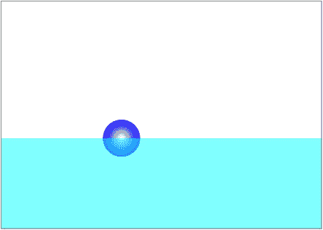
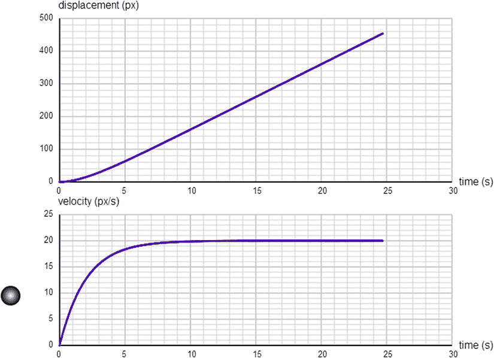
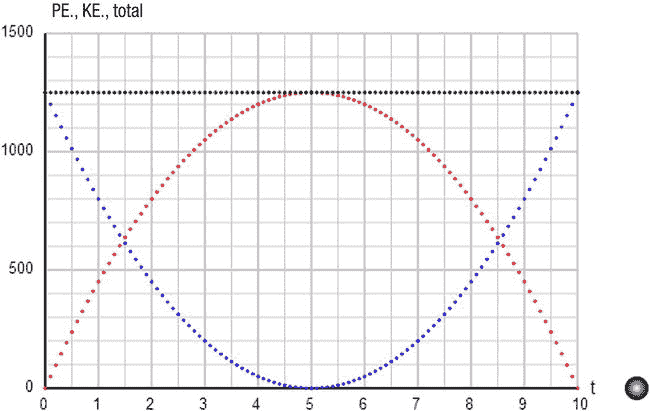
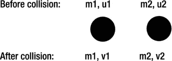

# 5.支配运动的定律

第四章提供了一些描述和分析运动的一般概念背景。背景知识包括对运动相关概念的讨论，如速度、加速度和力。在这一章中，我们将使用这些概念来阐述物理定律，这将允许你计算粒子在任何类型的力下的运动。接下来的五章将把这些定律应用到一些不同的力上。我们将用简短的例子来说明这些原则的应用，目的是在接下来的几章中以它们为基础。

我们特意让这一章保持简短，并把重点放在你需要应用到本书这一部分和其他部分的例子中的基本法则和原则上。你可以根据需要回到这一章来更新你对基本物理原理的理解，就像你在这本书的其余部分研究它们的应用一样。

本章涵盖的主题包括以下内容:

*   牛顿运动定律:牛顿三定律提供了力和运动之间的联系。这些定律使我们能够预测物体在已知力的作用下的运动。
*   应用牛顿定律:我们向你展示了如何在代码中实现牛顿运动定律，并用几个例子来说明它们的用法。
*   牛顿第二定律作为微分方程:在物理教科书中，牛顿第二定律有时被表示为微分方程，并使用微积分进行解析求解。我们简要讨论了该公式和我们的数值方法之间的联系，并用一个例子来说明。
*   能量守恒原理:我们通过考虑运动粒子的势能和动能，将能量守恒原理应用于运动。
*   动量守恒原理:我们来看看动量守恒及其在一个简单碰撞例子中的应用。
*   支配旋转运动的定律:我们将简要地注意到前面的定律可以扩展到经历旋转运动的物体。我们在这里不讨论旋转，但将在后面的章节中讨论。

## 牛顿运动定律

牛顿的三大运动定律，在他 1687 年的经典著作《数学原理》中阐明，提供了力和运动之间的联系。你可能还记得，我们在前一章说过，公式 F = m a 提供了这种联系。这个公式实际上是牛顿三大运动定律中的第二个。事实上，它是法律一种特殊形式。在这一章中，我们将深入一点，看看牛顿第二定律以及其他两个定律的一般形式。

### 牛顿第一运动定律(N1)

运动第一定律告诉你如果没有力作用在物体上会发生什么(见图 [5-1](#Fig1) )。想象一个静止不动的物体。如果你不对它施加任何力(换句话说，如果你不管它)，你认为会发生什么？没错——什么都没有。事物不会突然自己开始运动。这基本上就是第一定律所说的。常识？但是等等，还有更多。假设物体已经在运动，没有力作用在它上面。它会怎么样？日常经验可能会诱使你认为物体会减速并最终停止。所以当你听到第一定律说只要没有外力作用，物体就会继续以初速度运动时，你可能会感到惊讶。

图 5-1。

Schematic illustration of Newton’s first law of motion

这个命题似乎与我们的日常经验有些背道而驰。例如，一个在地上滚动的球总是会停下来。事实上，它这样做是因为与地面的摩擦导致它减速。如果没有摩擦力，球会无限期地运动。这可以通过减少与底层表面的摩擦来证明——例如，在非常光滑的水平面上使用弹珠。然后，弹珠以直线移动很长一段距离，其速度不会显著降低。

另一种说法是，你不需要一个力来让一个物体继续匀速运动。你只需要一个力来改变它的速度——例如，开始移动，加速或减速。换句话说，你只需要一个力来使一个物体加速(或减速)。

有了这种认识，我们可以用下面的形式简洁地表述牛顿第一运动定律，它涵盖了物体静止和匀速运动的两种情况:

*   N1:如果作用在物体上的合力为零，那么它的加速度也为零。F = 0 意味着 a = 0。

这条定律非常重要，所以我们可以用另一种方式来表述:如果没有合力作用在一个物体上，它的速度一定是恒定的(包括零)。反过来，如果一个物体有一个恒定的速度(可能是零)，你肯定知道它受到的合力一定是零。

最后注意，我们说合力为零。我们并不是说没有力作用在物体上。正如你在第四章中看到的，作用在同一物体上的两个或更多的力可以处于平衡状态，因此它们的合力为零。在这种情况下，第一定律仍然成立。它没有区分没有合力和根本没有力。

为了将这些概念放入上下文中，第四章中[的最后两个例子中的`moveObject()`方法实现了第一定律；它带走一个粒子，并永远以它的速度运动。它对力一无所知。](04.html)

### 牛顿第二运动定律(N2)

牛顿第二运动定律建立在第一定律的基础上(见图 [5-2](#Fig2) )。第一定律告诉你当没有合力作用在物体上时会发生什么。第二定律告诉你当合力作用在物体上时会发生什么。它告诉你物体的运动改变了。但这还不是全部。它会准确地告诉你它改变了多少——它会给出一个精确的公式，将施加的力和产生的运动变化联系起来。

图 5-2。

Schematic illustration of Newton’s second law of motion

回想一下上一章，动量(用符号 p 表示，定义为 p = m v)代表一个物体所拥有的“运动量”。牛顿第二定律把施加的力和它产生的动量变化联系起来。我们不会去探究牛顿是如何得出那个公式的，但这里有:

*   N2:如果一个合力 F 作用在一个物体上，它的动量会改变，所以动量的变化率等于所施加的力:F = d p/dt。

这是牛顿第二定律的一般形式，可能看起来有些不直观，至少在你习惯之前是这样的！用微积分的话来说，这告诉我们作用力等于动量对时间的导数。本质上，动量的时间导数告诉我们，动量在瞬间的变化有多快。这意味着在任何给定时间施加的力等于单位时间内动量的变化。

我们以前见过类似的公式。比如 v = d s/dt，a = d v/dt。牛顿第二定律的形式完全相同:F = d p/dt。请注意，前面的速度和加速度方程实际上是定义，而 F = d p/dt 是告诉我们现实世界中事物如何表现的定律。

在这种一般形式下，第二定律可能看起来与第一定律大不相同。在第一定律中，我们在讨论加速度，现在我们在讨论动量变化率。当我们将第二定律应用于质量不变的物体时，比如粒子，这两者之间实际上是有联系的。

要了解这种联系，请再次回忆动量是由 p = m v 定义的，对于一个粒子，质量 m 是常数。那样的话，微积分的规则告诉我们 d p/dt = m d v/dt。如果你对微积分感兴趣，我们在这里做的是计算 p 的(时间)导数，它必须等于 m v 的导数(因为这两件事是相等的:p = m v)。但是 m 是常数，所以 m v 的导数等于 m 乘以 v 的导数，你大概还记得 d v/dt = a(加速度的定义)。因此，我们得出结论，对于一个粒子，d p/dt = m a。因为牛顿向我们保证 F = d p/dt，我们已经恢复了我们的老朋友 F = m a。所以这里是牛顿第二运动定律的特殊形式:

N2(特殊):如果一个合力 F 作用在一个质量为 m 的物体上，它会产生一个加速度 a，公式为 F = m a

如果你现在将第二定律的这种形式与上一节给出的第一定律的陈述相比较，你会发现 N1 实际上只是 N2 的一个特例。从 F = m a 开始，放 F = 0，得到 m a = 0，因此 a = 0。换句话说，F = 0 给出 a = 0，这正是第一定律所说的。所以第一定律被“包含”在第二定律中。好；少了一条需要担心的法律！

大多数时候你会用到牛顿第二定律，以 F = m a 的形式。但是请记住，这不是定律最普遍的形式，它只适用于质量 m 不变的情况。有第三种形式的定律适用，当你有一股以一定速度运动的物质流，而不是一个固定质量的物体。例如，火箭的废气以相对于火箭恒定的速度 v 被推出。因为 v 现在是常数，微积分规则告诉我们 d p/dt = v dm/dt。因此，气体上的力由 F = v dm/dt 给出，其中 dm/dt 是质量变化率(每秒释放的气体质量)。我们将在第六章中使用这种形式的牛顿第二定律来模拟火箭:

N2(交替):以恒定速度 v 以 dm/dt 的速率移动任何物质所需的力 F 由 F = v dm/dt 给出。

尽管简单，牛顿第二定律可以说是牛顿力学中最重要的定律。它是如何将力和运动联系起来的，这几乎是不可思议的。但是，除非我们知道如何计算出作用在物体上的力，否则这也是毫无用处的。我们需要强制法。我们很快会看一些力定律的例子。但在这之前，你想知道牛顿第三定律，不是吗？

### 牛顿第三运动定律(N3)

在前一章中，我们说过力是运动变化的原因。正如你刚才看到的，牛顿第二定律使这个陈述更加精确，给了我们一个公式来计算一个给定力引起的运动变化。但是到目前为止，关于力从何而来，我们还没有说太多。许多力的产生是因为其他物体的存在。牛顿第一和第二定律告诉我们物体的运动是如何对外力做出反应的。牛顿第三定律告诉我们两个物体是如何通过相互施加力来相互作用的。这是这样的:

N3:如果一个物体 A 对另一个物体 B 施加一个力 F，物体 B 必然反过来对物体 A 施加一个大小相等方向相反的力 F

这意味着物体之间的力总是以作用力-反作用力对的形式存在。两种力量同时存在；他们之间没有延迟。即使它们的大小和方向随时间变化，它们始终保持大小相等，方向相反。

牛顿第三运动定律经常被误解和错误引用。一个常见的错误是认为作用力和反作用力相互“平衡”。事实上，在作用力-反作用力对中，作用力作用在不同的物体上。所以，认为它们互相“平衡”或“抵消”是错误的。换句话说，它们并不均衡。每个力作用在不同的物体上，单独影响其运动。诸如此类的细微之处使得牛顿第三定律在抽象层面上有些难以深入理解。但是看看这个定律在分析具体问题时是如何应用的，会有很大帮助。例如，在接下来的“动量守恒原理”一节中，牛顿第三定律被用来分析两个粒子之间的相互作用。你也会看到它在整本书不同例子的分析中的应用。

以下是力的作用力-反作用力对的一些例子:

*   Two colliding bodies exert equal and opposite forces on each other, even if they have different masses, as depicted in Figure [5-3](#Fig3).

    

    图 5-3。

    Schematic illustration of Newton’s third law of motion
*   地球对你施加的重力等于你的体重。这暗示着你也在对地球施加一个大小相等方向相反的重力！
*   在火箭中，发动机对废气施加一个向下的力，废气反过来对火箭施加一个大小相等方向相反的力，推动火箭前进。

## 运用牛顿定律

实际上，这本书的其余部分都是关于应用牛顿运动定律。在这里，我们将建立方法，创建一些力函数，并用一些简单的例子说明它们的应用。

### 应用 F = ma 的一般方法

要分析应用 F = m a 的问题，请使用以下步骤:

Draw a diagram representing the interacting objects in the problem.   Choose the object whose motion is to be calculated and indicate using arrows all the forces acting on it due to other objects. Ignore the forces exerted by the object on other objects. This gives you a force diagram, as described in [Chapter 4](04.html).   Calculate the resultant force F on the object (using vector addition, as described in [Chapter 3](03.html)) and apply the second law F = m a to calculate the acceleration a.  

原则上，这就是全部内容。你必须用纸和笔完成第一步和第二步。让我们使用 JavaScript 来帮助我们做第 3 步。

### 对任何力下的运动进行编码

为了实现上一节中的步骤 3，我们需要一段通用代码，它允许你计算一个粒子上的力，找到它们的合力，从而计算它们的加速度。然后，您可以使用加速度来更新粒子的速度和位置。回想一下我们使用术语“粒子”的意义，正如在第 4 章中所讨论的:从模拟的角度来看，任何内部结构不相关的物体。因此，为了我们的目的，一个粒子可以是一个球，也可以是一个行星。

这样做的一般代码结构看起来非常类似于上一章示例`forces-example.js`中的`move()`方法:

`function move(){`

`moveObject();`

`calcForce();`

`updateAccel();`

`updateVelo();`

`}`

如前所述，`moveObject()`方法只是根据粒子的现有速度来移动粒子:

`function moveObject(){`

`particle.pos2D = particle.pos2D.addScaled(particle.velo2D,dt);`

`context.clearRect(0, 0, canvas.width, canvas.height);`

`particle.draw(context);`

`}`

剩下的代码计算力，计算加速度，并更新速度，准备在下一个时间步的`moveObject()`方法中使用。`calcForce()`的工作是计算作用在质点上的合力。我们将在最后讨论这个问题。一旦我们知道了力，T2 方法就会更新加速度。我们如何做到这一点？当然，使用 F = m a 给出 a = F/m。因此，将`acc`和`force`定义为`Vector2D`对象，`updateAccel()`只是一行代码:

`function updateAccel(){`

`acc = force.multiply(1/particle.mass);`

`}`

回顾第四章中的[可知，δv = aδt，`updateVelo()`方法同样简单:](04.html)

`function updateVelo(){`

`particle.velo2D = particle.velo2D.addScaled(acc,dt);`

`}`

最后，`calcForce()`方法应该计算出作用在粒子上的每一个力，然后将它们相加，得到它们的合力，即`force`变量。进入`calcForce()`的代码将取决于问题和涉及的力量。在第四章[的`forces-example.js`代码中，`calcForce()`看起来是这样的:](04.html)

`function calcForce(){`

`force = new Vector2D(0,particle.mass*g-k*ball.vy);`

`}`

在这个简单的例子中，我们直接指定了力。但是随着我们的例子变得越来越复杂，将我们将遇到的不同种类的力定律聚集到一个我们称之为`Forces`的对象中的静态方法中是很有用的。为了调用特定力的作用，我们可以这样做:

`function calcForce(){`

`force = Forces.zeroForce();`

`}`

这种方法目前所做的就是将力设置为零。它使用`Forces.zeroForce()`方法来实现这一点，该方法产生一个没有组件的`Vector2D`对象。当然，关于`Forces`对象我们还没有说太多，所以现在让我们开始吧。

### 力对象

确切地说，进入`calcForce()`取决于手头的问题，但它总是涉及指定粒子上的力，然后将它们相加。因此，让我们构建一个新的对象来帮助我们完成这些任务。

我们将构建的对象基本上只包含不同类型力的静态方法。因此，我们将把这个对象命名为`Forces`，这样就足够恰当了:

`function Forces(){`

`}`

一般来说，作用在粒子上的力可能取决于粒子的性质(大小、位置、速度、质量、电荷)，以及它所处环境的性质，或其他物体的性质。这些属性需要被指定为相关方法中的参数。

让我们看一些例子。首先，让我们创建一个零力。这是一个大小为零的力，因此分量等于零。

下面是将创建一个的静态方法:

`Forces.zeroForce = function() {`

`return (new Vector2D(0,0));`

`}`

接下来，让我们创建一个重力方法:

`Forces.constantGravity = function(m,g){`

`return new Vector2D(0,m*g);`

`}`

质量为 m 的物体所受的重力由 mg 给出，并指向下方。因此，我们给出 m 和 g 的值作为自变量，并返回一个向量，其垂直(y)分量为 mg，水平(x)分量为零。你会注意到我们将函数命名为`constantGravity`，而不是简单的`gravity`。这是因为我们将重力这个名称保留给更一般形式的重力，你会在第六章的[中了解到。mg 给出的引力形式是近地引力，就像地球表面附近的物体所经历的那样。在下一章你会学到更多。](06.html)

作为另一个例子，让我们看看阻力，这是一个物体在流体(如空气或水)中运动时受到的阻力。我们将在第七章中更深入地研究阻力，但现在我们只能说在低速时，阻力由–k v 给出。这是一个常数 k 乘以物体的速度 v。负号表示阻力与速度方向相反。让我们为这种类型的阻力创建一个函数，我们称之为`linearDrag`。

下面是静态方法`linearDrag`:

`Forces.linearDrag = function(k,vel){`

`var force;`

`var velMag = vel.length();`

`if (velMag > 0) {`

`force = vel.multiply(-k);`

`}else {`

`force = new Vector2D(0,0);`

`}`

`return force;`

`}`

如你所见，`linearDrag`函数有两个参数:物体的阻力常数`k`(一个`Number`)和速度`vel`(一个`Vector2D`)。

接下来，我们创建一个静态方法`add()`来添加任意数量的力:

`Forces.add = function(arr){`

`var forceSum = new Vector2D(0,0);`

`for (var i=0; i<arr.length; i++){`

`var force = arr[i];`

`forceSum.incrementBy(force);`

`}`

`return forceSum;`

`}`

`add()`方法将力的数组`arr`作为参数。它遍历数组，依次添加力并返回最终的矢量和。这就是我们目前所需要的。在接下来的几章中，我们将添加更多的力函数作为`Forces`对象的静态方法。要使用`Forces`对象，不要忘记在你的 HTML 文件中添加文件`forces.js`(可以在 [`http://apress.com`](http://apress.com/) 找到所有的源代码)。

### 一个简单的例子:有阻力的抛射体

为了演示如何使用`Forces`类，让我们看一个简单的例子，它将我们在前面两节中讨论的内容结合在一起。假设我们想让一个粒子在重力作用下运动，同时经历阻力(比如一个物体在空气或水等流体中抛出或下落)。文件`forces-test.js`显示了如何做:

`var canvas = document.getElementById('canvas');`

`var context = canvas.getContext('2d');`

`var ball;`

`var t;`

`var t0;`

`var dt;`

`var animId;`

`var force;`

`var acc;`

`var g = 10;`

`var k = 0.1;`

`var animTime = 10; // duration of animation`

`window.onload = init;`

`function init() {`

`ball = new Ball(15,'#0000ff',1,0,true);`

`ball.pos2D = new Vector2D(50,400);`

`ball.velo2D = new Vector2D(60,-60);`

`ball.draw(context);`

`t0 = new Date().getTime();`

`t = 0;`

`animFrame();`

`};`

`function animFrame(){`

`animId = requestAnimationFrame(animFrame,canvas);`

`onTimer();`

`}`

`function onTimer(){`

`var t1 = new Date().getTime();`

`dt = 0.001*(t1-t0);`

`t0 = t1;`

`if (dt>0.2) {dt=0;};`

`t += dt;`

`if (t < animTime){`

`move();`

`}else{`

`stop();`

`}`

`}`

`function move(){`

`moveObject();`

`calcForce();`

`updateAccel();`

`updateVelo();`

`}`

`function stop(){`

`cancelAnimationFrame(animId);`

`}`

`function moveObject(){`

`ball.pos2D = ball.pos2D.addScaled(ball.velo2D,dt);`

`context.clearRect(0, 0, canvas.width, canvas.height);`

`ball.draw(context);`

`}`

`function calcForce(){`

`var gravity = Forces.constantGravity(ball.mass,g);`

`var drag = Forces.linearDrag(k,ball.velo2D);`

`force = Forces.add([gravity, drag]);`

`}`

`function updateAccel(){`

`acc = force.multiply(1/ball.mass);`

`}`

`function updateVelo(){`

`ball.velo2D = ball.velo2D.addScaled(acc,dt);`

`}`

这里的新物理发生在`calcForce()`方法中，我们通过使用`Forces`类的相关静态方法来包括重力和线性阻力。所以我们调用了`Forces.constantGravity()`，使用 g = 10 和粒子质量。我们还使用 k = 0.1 调用了`Forces.linearDrag()`。然后我们通过将它们作为数组参数传递给`Forces.add()`方法来添加这两个力，并将结果赋给`force`变量。

运行代码，你会看到一个球被向上抛；然后它被重力拉下，并因阻力而减速。

为了理解附加阻力对球运动的影响，用下面的行替换`calcForce()`中的最后两行:

`force = gravity;`

这使得球只在重力作用下运动。如果你现在运行代码，你会看到球遵循抛物线轨迹，就像第四章中的抛射体模拟一样。

另一方面，如果你保持阻力并将阻力系数 k 增加到 0.5，阻力将产生更极端的影响，迅速扼杀球的水平运动，并使它在此后几乎垂直下落——类似于你向上撞击气球可能发生的情况。

这个简单的例子演示了利用`Forces`对象构建模拟是多么容易，以及如何通过在`calcForce()`方法中改变力及其参数来获得不同的效果。

为了让您了解这种方法有多灵活和强大，让我们看一个稍微复杂一些的例子。

### 一个更复杂的例子:浮球

我们要看的例子包括在空中或水中扔一个球，并让它像在现实生活中那样运动。这个例子使用了比我们所涵盖的更多的物理知识，所以我们不会深入到所涉及的物理或编码的细节中，留给第 7 章更完整的讨论。在这个阶段，我们只是想通过向您展示使用本节中概述的方法，通过相当少量的简单编码可以完成什么来吊起您的胃口。

这个例子的源代码在文件`floating-ball.js`中。在我们看这个之前，在 HTML 设置上简单说一下，给出想要的视觉环境，如图 [5-4](#Fig4) 所示。正如你从这个截图中看到的，我们有一个代表水的矩形区域，和一个看起来部分浸入其中的球。为了实现这种视觉效果，水被绘制在前景中的透明画布实例`canvas_fg`上，动画发生在另一个名为`canvas`的画布实例上。看看文件`floating-ball.html`和`style2.css`，看看这是如何实现的。

图 5-4。

The floating ball simulation

以下是`floating-ball.js`的完整代码:

`var canvas = document.getElementById('canvas');`

`var context = canvas.getContext('2d');`

`var canvas_fg = document.getElementById('canvas_fg');`

`var context_fg = canvas_fg.getContext('2d');`

`var ball;var t0;`

`var dt;`

`var animId;`

`var force;`

`var acc;`

`var g = 50;`

`var k = 0.01;`

`var rho = 1.5;`

`var V = 1;`

`var yLevel = 300;`

`var vfac = -0.8;`

`window.onload = init;`

`function init() {`

`// create a ball`

`ball = new Ball(40,'#0000ff',1,0,true);`

`ball.pos2D = new Vector2D(50,50);`

`ball.velo2D = new Vector2D(40,-20);`

`//ball.velo2D = new Vector2D(20,-60);`

`ball.draw(context);`

`// create water`

`context_fg.fillStyle = "rgba(0,255,255,0.5)";`

`context_fg.fillRect(0,yLevel,canvas.width,canvas.height);`

`// set up event listeners`

`addEventListener('mousedown',onDown,false);`

`addEventListener('mouseup',onUp,false);`

`// initialize time and animate`

`initAnim();`

`};`

`function onDown(evt) {`

`ball.velo2D = new Vector2D(0,0);`

`ball.pos2D = new Vector2D(evt.clientX,evt.clientY);`

`moveObject();`

`stop();`

`}`

`function onUp(evt) {`

`ball.velo2D = new Vector2D(evt.clientX-ball.x,evt.clientY-ball.y);`

`initAnim();`

`}`

`function initAnim(){`

`t0 = new Date().getTime();`

`animFrame();`

`}`

`function animFrame(){`

`animId = requestAnimationFrame(animFrame,canvas);`

`onTimer();`

`}`

`function onTimer(){`

`var t1 = new Date().getTime();`

`dt = 0.001*(t1-t0);`

`t0 = t1;`

`if (dt>0.2) {dt=0;};`

`move();`

`}`

`function move(){`

`moveObject();`

`calcForce();`

`updateAccel();`

`updateVelo();`

`}`

`function stop(){`

`cancelAnimationFrame(animId);`

`}`

`function moveObject(){`

`ball.pos2D = ball.pos2D.addScaled(ball.velo2D,dt);`

`context.clearRect(0, 0, canvas.width, canvas.height);`

`ball.draw(context);`

`}`

`function calcForce(){`

`//force = new Vector2D(0,ball.mass*g-k*ball.vy);`

`var gravity = Forces.constantGravity(ball.mass,g);`

`var rball = ball.radius;`

`var xball = ball.x;`

`var yball = ball.y;`

`var dr = (yball-yLevel)/rball;`

`var ratio; // volume fraction of object that is submerged`

`if (dr <= -1){ // object completely out of water`

`ratio = 0;`

`}else if (dr < 1){ // object partially in water`

`//ratio = 0.5 + 0.5*dr; // for cuboid`

`ratio = 0.5 + 0.25*dr*(3-dr*dr); // for sphere`

`}else{ // object completely in water`

`ratio = 1;`

`}`

`var upthrust = new Vector2D(0,-rho*V*ratio*g);`

`var drag = ball.velo2D.multiply(-ratio*k*ball.velo2D.length());`

`force = Forces.add([gravity, upthrust, drag]);`

`//force = Forces.add([gravity, upthrust]);`

`if (xball < rball){`

`ball.xpos = rball;`

`ball.vx *= vfac;`

`}`

`if (xball > canvas.width - rball){`

`ball.xpos = canvas.width - rball;`

`ball.vx *= vfac;`

`}`

`}`

`function updateAccel(){`

`acc = force.multiply(1/ball.mass);`

`}`

`function updateVelo(){`

`ball.velo2D = ball.velo2D.addScaled(acc,dt);`

`}`

不用深入细节，你可以看到我们有一个更复杂的`calcForce()`方法，包括三个力:重力、上推力和阻力。`calcForce()`中也有一些逻辑，告诉代码如何根据球的位置计算出球上的力。此外，还有一些逻辑告诉代码在边界上做什么。最后，不同的力有许多参数。不过，总的来说，这肯定不是一段过于复杂的代码，您应该有可能了解它在做什么。

`onDown()`和`onUp()`方法允许用户通过点击鼠标与模拟交互。如果你点击画布上的任何地方，球会立即移动到那里。如果您按住鼠标按钮，拖动光标，然后释放鼠标，球将被赋予一个速度，该速度在数值上等于球与释放鼠标的点之间的距离。

运行模拟，看看它在多大程度上像真实的东西一样，所有这些都是用相对少量的代码完成的。很好玩！

## 作为微分方程的牛顿第二定律

这一节特别为那些想了解我们在这里所做的事情和你通常在物理教科书、物理网站或维基百科上找到的东西之间的联系的读者准备。它提供了对材料更深入的理解，但在本书的其余部分中并不是严格要求的。如果你愿意，你可以安全地跳过它。

如果你是一个严肃的物理程序员，你可能会在某个时候发现自己在钻研物理教科书或在线资源，也许是为了寻找一些公式或寻找特定问题的解决方案。现在，如果你在寻找任何涉及牛顿第二定律的问题的答案，你很可能会遇到微分方程，以及用数学来解析地解决它们。所有这些数学与我们在前面讨论的数值求解牛顿定律的方法有什么关系？在接下来的两个小节中，我们从概念上解释这种联系，然后用一个具体的例子来说明它。

### 深入了解 F = ma

微分方程包含量的导数。解微分方程一般比解普通代数方程更复杂，因为它涉及积分(参见[第 3 章](03.html))。

F = m a 形式的牛顿第二定律表面上看起来可能像一个简单的代数方程。

然而，记住加速度实际上是速度的导数是有用的，a = d v/dt，这样我们也可以把牛顿第二定律写成

这是所谓的关于速度的一阶微分方程，因为它涉及速度的一阶导数。回想 v = d s/dt，我们可以将前面的等式写成

这现在是一个关于位移的二阶微分方程，因为它涉及到位移的二阶导数(参考[第三章](03.html))。

一般来说，力 F 可以是位置和速度的函数。你很快就会看到这样一个力函数的例子。

如果你看物理教科书，你有时会看到牛顿第二定律以这些形式表达。原则上，前述微分方程可以通过解析或数值积分来求解，以产生作为时间函数的位移 s 和速度 v。大部分物理教材侧重于解析解。但是只有在特殊情况下解析解才是可能的，这需要应用微积分积分技术。另一方面，用数值方法求解微分方程总是可能的。事实上，这正是我们在我们所看到的例子中所做的。具体来说，我们在`updateVelo()`方法中积分微分方程的第一种形式，然后在`moveObject()`方法中积分速度以给出位移。

下一个例子将说明一种情况，在这种情况下，我们可以用解析方法和数值方法求解牛顿第二定律。我们将用这个例子向你展示这个微分方程的典型解析解。我们还将比较精确的解析解和数值积分解，看看后者有多好。

### 示例:重温重力和阻力下的坠落

这个例子建立在上一章所描述的例子的基础上，在这个例子中，我们模拟了一个球在重力和阻力的联合作用下下落，并表明它达到了简单物理理论所预测的极限速度。这里，我们将更新示例，以比较详细的解析解和模拟。

这种情况下的微分方程如下(注意这是 1D 情况；因此没有必要使用向量符号):

或者是速度的一阶形式:

这个方程的解析解在很多物理教材中都有给出(有兴趣的可以从 [`www.physicscodes.com`](http://www.physicscodes.com/) 下载一个推导作为补充资料)。对于从静止状态掉落的物体，它是这样的:

当时间 t 较大时，指数项趋于零(回想一下[第三章](03.html)对指数函数的复习)。所以根据这个方程，v 趋向于一个极限值 mg/k，当然就是终速度。所以这个解决方案与我们在[第 4 章](04.html)中发现的一致。另外，它现在告诉我们在任意时刻 t 的速度，而不仅仅是终端速度。

这个解可以反过来积分，给出任意时刻 t 的位移，结果如下:

现在可以将位移 s 和速度 v 的这些解析解与模拟结果进行比较。在`forces-example2.js`中，我们从[第 4 章](04.html)更新了`forces-example.js`来做这个比较。我们也在`calcForce()`中使用了`Forces`方法；除此之外，物理学与`forces-example.js`中的完全相同，因为涉及到相同的力(重力和阻力)。

相关代码是函数`plotGraphs()`，它绘制图表来比较 s 和 v 的分析值和数值:

`function plotGraphs(){`

`graphDisp.plot([t], [ball.y-y0], '#ff0000');`

`graphDisp.plot([t], [m*g/k*(t+m/k*Math.exp(-k/m*t)-m/k)], '#0000ff');`

`graphVelo.plot([t], [ball.vy], '#ff0000');`

`graphVelo.plot([t], [m*g/k*(1-Math.exp(-k/m*t))], '#0000ff');`

`}`

在这段代码中，我们绘制了球的垂直位移，即`ball.y`减去其初始值`y0`，以及由`Graph`实例`graphDisp`的解析解给出的值。类似地，`graphVelo`显示由代码和解析解计算的垂直速度。模拟如图 [5-5](#Fig5) 所示。两者之间的一致性如此之好，以至于在两个图中各自的曲线位于彼此的顶部。因此，我们很高兴在这种情况下，代码中实现的简单欧拉积分方案实际上做得相当不错。

图 5-5。

Comparing numerical and analytical solutions for a ball falling under gravity and drag

## 能量守恒原理

我们在前一章中介绍了能量及其守恒。这里要重申的关键点是，我们可以应用能量守恒原理来计算事物如何运动以及它们如何与其他事物相互作用。

同样重要的是要记住，该原理可以应用于不同形式之间的能量转换，以及不同物体之间的能量转移。以下是原则的陈述，形式略有不同:

*   能量守恒原理:在不同形式的能量转换中，或在不同物体间的能量转移中，转换或转移前后的能量总量总是相等的。

该原理的一个特别有用的形式是当能量转换或转移只涉及势能和动能时。我们把 PE 和 KE 统称为机械能。

### 机械能守恒

虽然能量守恒原理的一般形式是强有力的，而且总是正确的，但在实践中可能很难应用，因为计算一个相互作用中涉及的所有能量形式并不总是容易的。例如，想一想当一个球落下，穿过空气落下，从一个表面弹回时所涉及的能量转换。球最初有 PE，当它穿过空气下落时，由于重力的作用，当它加速时，PE 逐渐转化为 KE。由于空气中的摩擦(阻力),少量能量也转化为热量。当它撞击地表时，大量的能量可能会转移到地表。更多的能量通常在撞击时转化为热能，一些也可以转化为声音。现在，我们将避开试图计算像热能和声能这样的东西，因为那会变得相当复杂。但有时，如果它们可以被假设为很小，我们只需要处理 PE 和 KE 在那种情况下，我们说机械能守恒。

机械能守恒是一个特别有用的原理，因为它涉及到与运动(KE)和位置(PE)有关的能量形式。在这一章中，我们将看两个应用它的例子。一种是两个粒子的弹性碰撞，此时粒子的总动能守恒。我们将在后面的“动量守恒原理”一节中讨论这个问题另一个例子是抛射体的运动(忽略空气阻力产生的阻力)。现在我们来看看这个例子。

### 例子:射弹中的能量变化

为了简化这个例子，让我们假设抛射体以某个初速度 u 从地面水平垂直向上发射。然后我们有一个在重力作用下恒定加速度的 1D 问题，我们可以使用在第 4 章中介绍的运动分析方程的 1D 版本:

这里 s = h，即抛射体离地面的高度，a =–g，其中 g 是重力加速度。所以我们可以这样写:

现在可以很容易地用下面的公式计算出射弹在任何时候的 PE 和 KE:

以下代码使用 m = 1、g = 10 px/s 2 和 u = 50 px/s 的值计算并绘制 10 秒钟的 PE、KE 及其总和。源代码在`projectile-energy.js`中。

`var canvas = document.getElementById('canvas');`

`var context = canvas.getContext('2d');`

`var canvas_bg = document.getElementById('canvas_bg');`

`var context_bg = canvas_bg.getContext('2d');`

`var ball;`

`var animId;`

`var graph;`

`var m = 1;  // particle mass`

`var g = 10; // gravity`

`var u = 50; // initial velocity`

`var groundLevel = 350;`

`var n = 0;`

`var tA = new Array();`

`var hA = new Array();`

`var peA = new Array();`

`var keA = new Array();`

`var teA = new Array();`

`window.onload = init;`

`function init() {`

`ball = new Ball(10,'#000000',m,0,true);`

`ball.pos2D = new Vector2D(550,groundLevel);`

`ball.draw(context);`

`setupGraph();`

`setupArrays();`

`animFrame();`

`};`

`function setupGraph(){`

`//graph = new Graph(context,xmin,xmax,ymin,ymax,xorig,yorig,xwidth,ywidth);`

`graph = new Graph(context_bg,0,10,0,1500,50,350,450,300);`

`graph.drawgrid(1,0.5,500,100);`

`graph.drawaxes('t','p.e., k.e., total');`

`}`

`function setupArrays(){`

`var t;`

`var v;`

`for (var i=0; i<=100; i++){`

`tA[i] = i*0.1;`

`t = tA[i];`

`v = u - g*t;`

`hA[i] = u*t - 0.5*g*t*t;`

`peA[i] = m*g*hA[i];`

`keA[i] = 0.5*m*v*v;`

`teA[i] = peA[i] + keA[i];`

`}`

`}`

`function animFrame(){`

`setTimeout(function() {`

`animId = requestAnimationFrame(animFrame,canvas);`

`animate();`

`}, 1000/10);`

`}`

`function animate(){`

`moveObject();`

`plotGraphs();`

`n++;`

`if (n==hA.length){`

`stop();`

`}`

`}`

`function moveObject(){`

`ball.y = groundLevel-hA[n];`

`context.clearRect(0, 0, canvas.width, canvas.height);`

`ball.draw(context);`

`}`

`function plotGraphs(){`

`graph.plot([tA[n]], [peA[n]], '#ff0000', true, false);`

`graph.plot([tA[n]], [keA[n]], '#0000ff', true, false);`

`graph.plot([tA[n]], [teA[n]], '#000000', true, false);`

`function stop(){`

`cancelAnimationFrame(animId);`

`}`

代码应该容易理解。注意，我们通过在`setTimeout()`函数中嵌套对`requestAnimationFrame()`和`animate()`的调用，将帧速率限制为 10 fps。这将使动画变慢，足以使球的运动在视觉上与图上的相应位置相匹配。在图 [5-6](#Fig6) 中，我们显示了作为时间函数的三个曲线图。向上弯曲的一系列点是 PE，向下弯曲的一系列点是 KE，水平的(常数)是总能量(PE 和 KE 之和)。从这些图中，我们了解到，当抛射体最初在地面上发射时，它具有零 PE 和最大 KE，然后，在它上升的前 5 秒，它的 PE 以其 KE 为代价增加。恰好在 5 秒钟时，它的 KE 为零，表明它暂时处于静止状态。当它达到最高点时，就会发生这种情况。然后它又开始往下掉。当它这样做时，它的 PE 又开始下降，它的 KE 随着向地面加速而增加。在整个运动过程中，PE 和 KE 的总和是恒定的，如水平系列的点所示。这证明了能量守恒。注意，PE 和 KE 之和只是常数，因为我们忽略了阻力效应。如果你包括阻力，那么你会发现 PE 和 KE 之和会随着时间的推移而略微减小。如果你特别感兴趣，你可以通过增加一个阻力项，对运动方程进行数值积分，给出 v 和 h 作为时间的函数。

图 5-6。

Energy graphs for a projectile—downward curve: KE; upward curve: PE; constant line: total

## 动量守恒原理

如前一章所述，动量守恒定律和能量守恒定律一样。先说原理，再解释:

*   动量守恒原理:对于任何相互作用的粒子系统，只要没有外力作用于该系统，所有粒子的总动量保持不变。

“相互作用的粒子”是指粒子通过相互施加力来相互影响。力可以是任何类型的；例如，星系中恒星之间的引力。不管粒子间力的性质如何，这个原理都是正确的。一旦你定义了你的系统，该系统中的粒子可能会相互受到任何数量的内力——只要没有外力，该系统的总动量就会守恒。

动量守恒与牛顿运动定律密切相关。实际上，在一定条件下，可能是从牛顿定律推导出来的。让我们看看怎么做。

起点是牛顿第二定律 F = d p/dt，我们可以写成离散形式 F =δp/δt，两边乘以δt 得出:

当然，这只是牛顿第二定律的一种稍微不同的形式，对于一个小但有限的时间间隔δt。它告诉我们的是，如果一个力 F 作用在一个粒子上一个小的持续时间δt，用 F 乘以δt 就可以得到粒子动量的变化δp。我们称这个量 fδt 为力引起的冲量。前面的关系叫做冲量-动量定理。

接下来，想象两个粒子相互作用(相互施加力；例如通过碰撞)，如图 [5-7](#Fig7) 所示。从牛顿第三运动定律来看，它们同时对彼此施加大小相等方向相反的力。如果它们在δt 的时间间隔内相互施加力 F 和–F，它们分别经历–Fδt 和 Fδt 的冲量。根据冲量-动量定理，这意味着它们交换动量，分别获得–δp 和δp。然而，两个粒子的总动量仍然相同，因为一个粒子获得的动量正好是另一个粒子获得的动量的负值；换句话说，一个粒子失去的动量被另一个粒子获得。这个论点延伸到任何数量的相互作用的粒子，所以我们有动量守恒原理。

图 5-7。

Two interacting particles exchanging momentum

动量守恒的例子包括:

*   一个苹果落到地上，每一瞬间都会获得向下的动量。考虑到苹果-地球系统，地球本身必须“倒向”苹果以进行补偿。但是因为地球的质量如此之大，它朝向苹果的速度非常小。
*   火箭排出的废气和火箭本身在相反的方向上获得相等的动量变化。
*   在爆炸中，所有碎片的总动量必须等于爆炸前整个物体的动量。如果物体最初是静止的，爆炸后的总动量(所有碎片动量的矢量和)仍然为零。

为了让你感觉到如何在实践中应用这个原则，这里有一个数值例子。假设你从一把质量为 1.6 kg 的步枪中射出一颗质量为 40 g 的子弹，子弹的出膛速度为 80 m/s，那么步枪的后坐速度是多少？

让我们分别用 m 和 v 来表示子弹的质量和速度。我们将用 M 和 V 分别表示步枪的质量和速度。最初，两者都是静止的，所以总动量为零。

因此，动量守恒原理意味着最终动量也应该为零:

这个等式可以很容易地重新排列为:

代入 M、v 和 M 的值，得到如下结果:

因此，步枪的后坐力速度是–2 米/秒。负号表示它与子弹的速度方向相反。

### 例子:两个粒子之间的 1D 弹性碰撞

动量守恒在处理粒子间的碰撞时特别有用。碰撞是一种特殊类型的相互作用，在这种相互作用中，粒子在很短的时间内相互施加很大的力。

第 11 章的全部内容都致力于碰撞。在这里，我们将简要地看一下 1D 中两个粒子之间弹性碰撞的最简单情况。这里的弹性意味着动能守恒。换句话说，在碰撞过程中，没有能量转化为其他形式(如热量)。当然，动量总是守恒的。

假设粒子的质量为 m1 和 m2，碰撞前的初速度为 u1 和 u2，碰撞后的终速度为 v1 和 v2(见图 [5-8](#Fig8) )。运用动量守恒告诉我们

应用动能守恒得出:

记住动能的公式是 1/2 m v 2 。

图 5-8。

Change in particle velocities caused by a collision

这里我们有两个方程，包含两个未知量:两个碰撞粒子的最终速度 v1 和 v2。其他的都知道了。可以求解这些方程，根据已知量 m1、m2、u1 和 u2 给出 v1 和 v2 的一般公式。但是我们会把它留到第 11 章来讲。

现在，我们来讨论 m1 = m2 的情况；也就是说，这两个粒子具有相同的质量。在那种情况下，可以证明 v1 = u2，v2 = u1 换句话说，粒子 1 的最终速度等于粒子 2 的初始速度，反之亦然。相同质量的粒子弹性碰撞只是交换了它们的速度！

我们现在将构建一个实现这种特殊情况的示例。代码在`collisions-test.js`里。由于它与您到目前为止遇到的其他示例有些不同，所以在讨论它之前，我们在这里复制完整的代码:

`var canvas = document.getElementById('canvas');`

`var context = canvas.getContext('2d');`

`var t0;`

`var dt;`

`var animId;`

`var radius = 15; // ball radius`

`var balls = new Array();`

`window.onload = init;`

`function init() {`

`makeBalls();`

`t0 = new Date().getTime();`

`animFrame();`

`};`

`function makeBalls(){`

`setupBall('#0000ff',new Vector2D(50,200),new Vector2D(30,0));`

`setupBall('#ff0000',new Vector2D(500,200),new Vector2D(-20,0));`

`setupBall('#00ff00',new Vector2D(300,200),new Vector2D(10,0));`

`}`

`function setupBall(color,pos,velo){`

`var ball = new Ball(radius,color,1,0,true);`

`ball.pos2D = pos;`

`ball.velo2D = velo;`

`ball.draw(context);`

`balls.push(ball);`

`}`

`function animFrame(){`

`animId = requestAnimationFrame(animFrame,canvas);`

`onTimer();`

`}`

`function onTimer(){`

`var t1 = new Date().getTime();`

`dt = 0.001*(t1-t0);`

`t0 = t1;`

`if (dt>0.2) {dt=0;};     checkCollision();`

`move();`

`}`

`function move(){`

`context.clearRect(0, 0, canvas.width, canvas.height);`

`for (var i=0; i<balls.length; i++){`

`var ball = balls[i];`

`ball.pos2D = ball.pos2D.addScaled(ball.velo2D,dt);`

`ball.draw(context);`

`}`

`}`

`function checkCollision(){`

`for (var i=0; i<balls.length; i++){`

`var ball1 = balls[i];`

`for (var j=i+1; j<balls.length; j++){`

`var ball2 = balls[j];`

`if (Vector2D.distance(ball1.pos2D,ball2.pos2D)<=ball1.radius+ball2.radius){`

`var vtemp = ball1.velo2D;`

`ball1.velo2D = ball2.velo2D;`

`ball2.velo2D = vtemp;`

`}`

`}`

`}`

`}`

这里我们在函数`makeBalls()`中创建和初始化三个球，使用一个特殊的函数`setupBalls()`来最小化代码重复。为了让事情更有趣一点，我们创建了三个水平排列的球，并给它们不同的水平速度。动画循环代码看起来没什么特别的，但是触发每个时间步长的`onTimer()`方法现在除了`move()`方法之外还包含了一个额外的函数`checkCollision()`。

在`checkCollision()`中，我们测试了阵列中粒子对之间的碰撞。为此，我们使用`Vector2D.distance(vec1,vec2)`静态方法，用位置向量`vec1`和`vec2`计算两点之间的距离。碰撞检测算法的逻辑很简单:如果两个粒子中心之间的距离小于或等于它们半径的总和，这意味着它们已经碰撞。然后我们交换两个粒子的速度。

顺便说一下，`Vector2D.distance()`方法通过勾股定理计算两点之间的距离(参见[第 3 章](03.html))，如下面相关`Vector2D`方法列表所示:

`Vector2D.prototype = {`

`lengthSquared: function(){`

`return this.x*this.x + this.y*this.y;`

`},`

`length: function(){`

`return Math.sqrt(this.lengthSquared());`

`},`

`}`

`Vector2D.distance =  function(vec1,vec2){`

`return (vec1.subtract(vec2)).length();`

`}`

如果你运行代码，你会看到，最初，所有三个球靠得更近了。然后，它们经历三次连续的碰撞，交换每一对碰撞的速度。最后，他们都彼此远离。

## 支配旋转运动的定律

在这一章中，我们集中讨论了平移运动，在这种运动中，所考虑的物体改变了它的位置。但是如果一个物体围绕一个中心旋转或者(如果它是一个延伸的物体)围绕某个轴自转呢？

事实证明，旋转运动学、动力学和守恒定律也存在类似的原理。例如，牛顿运动定律的模拟可以写成旋转运动。类似于动量，有一个量叫做角动量，它也是守恒的。

我们将在第 9 章和第 13 章[中研究旋转力学。](13.html)

## 摘要

这一章为模拟粒子在任何类型的力下的运动奠定了基础。这里讨论的运动定律和守恒原理可以应用于许多不同的场景。在第二部分的剩余章节中，我们将应用这些定律来模拟物体在各种力定律作用下的运动。