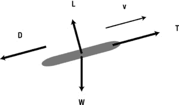
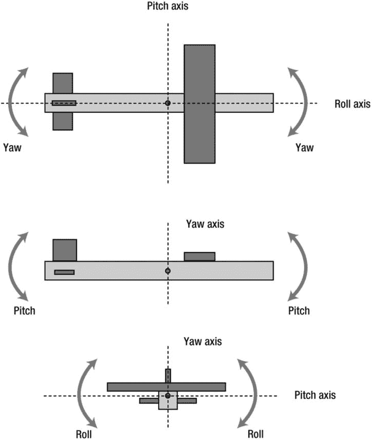
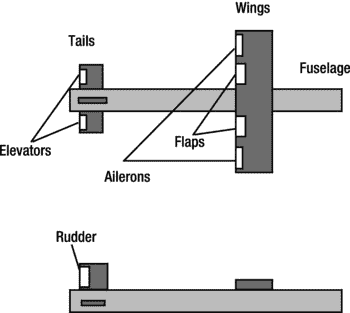
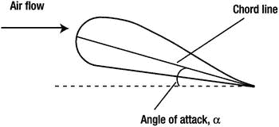
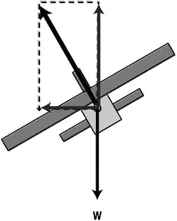
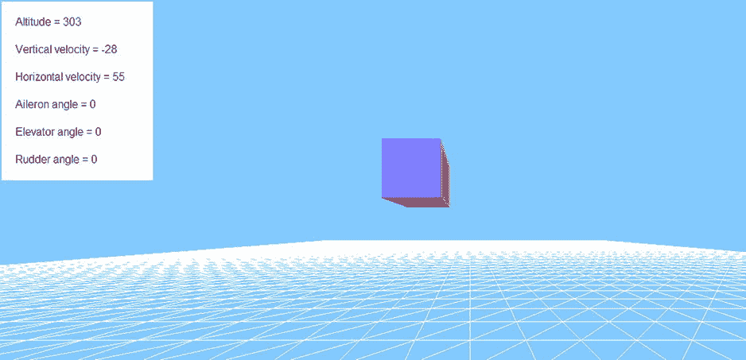
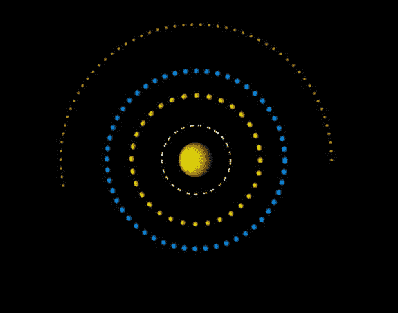
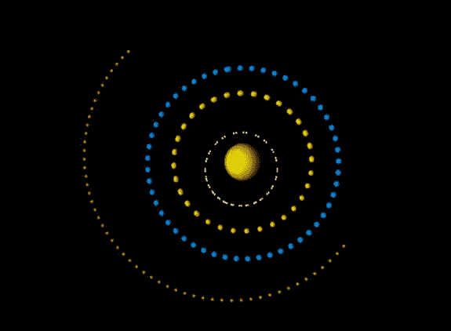
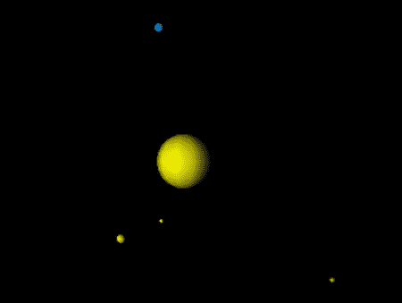
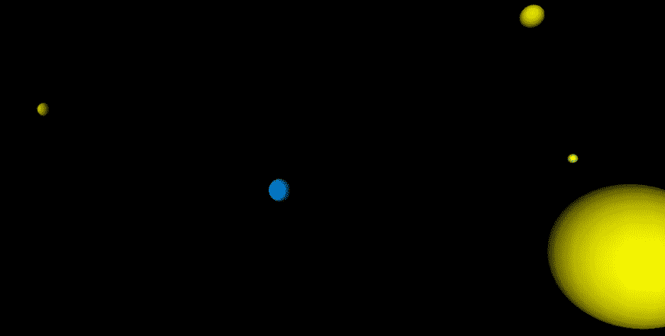

# 十六、模拟项目

这最后一章由三个模拟项目组成，它们将说明你在本书中学到的物理和方法如何应用于不同类型的应用。这些例子彼此大相径庭，不仅反映了基础物理的不同，也反映了它们建造的目的的不同。

这三个例子包括:

*   建造一艘潜艇:这里的目的是展示你可以多么容易地修改一些你已经遇到的现有代码来创建一艘你可以合并到 2D 游戏中的潜艇。
*   构建一个飞行模拟器:在这个例子中，我们将创建一个 3D 飞行模拟器，可以用许多有趣的方式进一步开发，纯粹是为了好玩！
*   创建一个精确的太阳系模型:这个项目是创建一个精确的太阳系三维模型，可以作为一个电子学习工具。然后，我们将把模拟结果与美国国家航空航天局模拟产生的数据进行比较。

这个想法是，这些是你的项目，所以我们将描述相关的物理，并帮助你建立一个基本的版本，但然后让你以任何你可能想要的方式开发和增强它们。玩得开心！

## 建造潜艇

在第七章中，我们有一个简单而有趣的例子，一个球漂浮在水中。修改这个例子并把它变成一个可以在简单的 2D 游戏中使用的交互式潜水艇实际上是很容易的。我们先快速回顾一下涉及的主要物理。

### 物理学的简要回顾

在浮球的例子中，我们确定了作用在球上的三个主要力:重力、上推力和阻力，它们分别由以下公式给出:

请注意，我们已经以矢量形式编写了上推力公式:需要负号，因为上推力向上作用，与重力矢量 g 相反。提醒一下，在该公式中，ρ是水的密度，V 是物体排开的水的体积。

对于潜艇，你有第四种力量:推力 T 推动潜艇，让它在水中水平移动。当通电时，这将被模拟为恒定大小的水平力。

另一个相关的物理学原理(如第 7 章所讨论的)是，如果一个物体的密度(单位体积的质量)小于或等于水的密度，它就会漂浮，否则它就会下沉。潜水艇的工作原理是，它的有效密度可以通过向压载舱充入海水或压缩空气来改变:它的密度(质量/体积比)是变化的，因为它的质量因此而变化，而它的体积保持不变。

### 视觉设置

视觉背景非常简单，由一个用渐变填充表示天空的矩形和另一个表示大海的矩形组成，这两个矩形都是使用绘图 API 创建的。仿真截图如图 [16-1](#Fig1) 所示。屏幕上还有一些文字显示潜艇的密度与水的密度之比。

图 16-1。

Screenshot of the submarine simulation

使用绘图 API 将潜艇创建为 JavaScript 对象`Sub`——代码在文件`sub.js`中，在 [`www.apress.com`](http://www.apress.com/) 中可以找到所有源代码和相关文件。图 [16-2](#Fig2) 仔细看看。潜艇内的蓝色矩形代表压载舱内的水。通过控制它的高度，我们创造了改变水位的假象，潜艇的质量也随之调整。

图 16-2。

A closer look at the submarine

### 设置代码

设置代码在仿真文件`submarine.js`的`init()`方法中。这里列出了`init()`中的代码:

`function init() {`

`// create the sky`

`gradient = context_bg.createLinearGradient(0,0,0,yLevel);`

`gradient.addColorStop(0,'#0066ff');`

`gradient.addColorStop(1,'#ffffff');`

`context_bg.fillStyle = gradient;`

`context_bg.fillRect(0,0,canvas_bg.width,yLevel);`

`// create the sea`

`context_fg.fillStyle = "rgba(0,255,255,0.5)";`

`context_fg.fillRect(0,yLevel,canvas.width,canvas.height);`

`// create a sub`

`sub = new Sub(160,60,'#0000ff',emptySubMass);`

`sub.pos2D = new Vector2D(250,300);`

`sub.velo2D = new Vector2D(40,-20);`

`sub.draw(context);`

`// set water height in sub`

`setWaterHeight();`

`// set up text formatting`

`setupText();`

`// set up event listener`

`window.addEventListener('keydown',keydownListener,false);`

`// initialise time and animate`

`initAnim();`

`}`

注意，我们使用了三个 canvas 实例(参见相关 HTML 文件中的标记，`submarine.html`)。天空绘制在背景画布上，大海绘制在前景画布上。sub 被放置在中间的画布实例上。自然，最后两个画布元素是透明的(参见相关的样式文件，`style7.css`)。sub 中的水位在`setWaterHeight()`方法中设置，文本格式在`setupText()`方法中设置。然后设置一个`keydown`事件监听器，最后调用初始化动画代码的`initAnim()`方法。

创建的`Sub`对象有四个参数，分别指定其宽度、高度、颜色和质量。除了这些属性之外，它还有一个`tankWidth`和一个`tankHeight`属性，默认情况下，这两个属性分别被设置为其宽度和高度的一半。它还有一个`waterHeight`属性，默认值为 0。它具有位置(`x`和`y`)和速度(`vx`和`vy`)属性，以及相关的`pos2D`和`velo2D`获取器和设置器。最后，它有一个`draw()`方法，绘制潜艇的身体、坦克和水位。参见`sub.js`中的代码。

### 基本运动代码

剩下的代码是我们在《T4》第 7 章中创建的浮动模拟`floating-ball.js`的修改。主要的变化与视觉效果和控制有关(它们将在下一节描述)。在`calcForce()`方法中实现的基本运动代码实际上与`floating-ball.js`中的代码没有太大不同。下面是`calcForce()`的方法:

`function calcForce(){`

`var rheight = 0.5*sub.height;`

`var ysub = sub.y + rheight;`

`var dr = (ysub-yLevel)/rheight;`

`var ratio; // volume fraction of object that is submerged`

`if (dr <= -1){ // object completely out of water`

`ratio = 0;`

`}else if (dr < 1){ // object partially in water`

`ratio = 0.5+0.5*dr; // for cuboid`

`}else{ // object completely in water`

`ratio = 1;`

`}`

`var gravity = Forces.constantGravity(sub.mass,g);`

`var upthrust = Forces.upthrust(rho,V*ratio,g);`

`var drag = Forces.drag(k*ratio,sub.velo2D);`

`force = Forces.add([gravity, upthrust, drag, thrust]);`

`}`

变量`dr`是淹没在水面下的接头高度的分数。变量`ratio`是被淹没的体积分数(它决定了接头上的上推力和阻力),并以复杂的方式取决于接头的形状。因为这个模拟是为了一个简单的游戏，所以用一种近似的方式来处理它是有意义的。所以我们简单地把接头当成一个长方体，在这种情况下，只要`dr`的值在 0 到 1 之间，体积比就等于`0.5 + 0.5*dr`。如果`dr`为负(在这种情况下，接头完全在水面之外)，`ratio`设置为零。如果`dr`大于 1(在这种情况下，接头完全浸入水中)，`ratio`设置为 1。

变量`ratio`用于调整上推力和阻力，然后将它们添加到接头的重量中。还有第四个力，`thrust`，这是增加的，显然没有出现在第七章的[的浮球例子中。这是一个`Vector2D`变量，其值根据用户交互设置。所以让我们来看看用户是如何控制模拟的。](07.html)

### 添加控件和视觉效果

目的是通过键盘上的箭头键来控制潜艇。右箭头将施加向前的推力；向左箭头将施加向后的推力；向下箭头将把水引入压载舱；向上箭头将从压载舱中移除水，并向压载舱中充入空气。这是通过以下两个事件处理程序完成的，它们分别响应`keydown`和`keyup`键盘事件:

`function keydownListener(evt){`

`if (evt.keyCode == 39) { // right arrow`

`thrust = new Vector2D(thrustMag,0);`

`} else if (evt.keyCode == 37) { // left arrow`

`thrust = new Vector2D(-thrustMag,0);`

`}`

`if (evt.keyCode == 40) { // down arrow`

`ballastInc = incMag;`

`} else if (evt.keyCode == 38) { // up arrow`

`ballastInc = -incMag;`

`}`

`window.addEventListener('keyup',keyupListener,false);`

`}`

`function keyupListener(evt){`

`thrust = new Vector2D(0,0);`

`ballastInc = 0;`

`window.removeEventListener('keyup',keyupListener,false);`

`}`

变量`thrustMag`和`incMag`控制推力的大小和每个时间步长内水位的增减量。代码中的默认值分别是 20 和 0.01。推力和水位增量的当前值分别存储在变量`thrust`和`ballastInc`中。当按键再次按下时，推力和水位增量都被重置为零。

必要的视觉变化由单独的方法控制，这些方法在每个时间步从`move()`方法中的`updateSub()`方法调用:

`function updateSub(){`

`adjustBallast();`

`updateInfo();`

`}`

`adjustBallast()`方法增加了`waterFraction`变量，该变量跟踪压载舱中的水量，作为压载舱装满时水量的一部分。显然，该分数不能小于 0 或大于 1；因此，代码也确保这种情况永远不会发生:

`function adjustBallast(){`

`if (ballastInc != 0){`

`waterFraction += ballastInc;`

`if (waterFraction < 0){`

`waterFraction = 0;`

`}`

`if (waterFraction > 1){`

`waterFraction = 1;`

`}`

`setWaterHeight();`

`}`

`}`

`adjustBallast()`中的最后一行代码调用了一个`setWater()`方法，该方法的任务是根据水箱中水质量的变化来调整水位的高度和接头的质量:

`function setWaterHeight(){`

`sub.waterHeight = sub.tankHeight*waterFraction;`

`sub.mass = emptySubMass + waterMass*waterFraction;`

`}`

从`updateSub()`调用的最后一个方法是`updateInfo()`方法，它计算并显示潜艇密度与水密度的更新比率:

`function updateInfo(){`

`var ratio = sub.mass/V/rho; // ratio of submarine density to water density`

`ratio = Math.round(ratio*100)/100; // round to 2 d.p.`

`var txt = "[sub density] / [water density] = ";`

`txt = txt.concat(ratio.toString());`

`context_fg.clearRect(0,0,700,100);`

`context_fg.fillText(txt,20,20);`

`}`

### 完整的代码

为了展示一切是如何组合在一起的，我们在这里列出了`submarine.js`的完整代码:

`var canvas = document.getElementById('canvas');`

`var context = canvas.getContext('2d');`

`var canvas_bg = document.getElementById('canvas_bg');`

`var context_bg = canvas_bg.getContext('2d');`

`var canvas_fg = document.getElementById('canvas_fg');`

`var context_fg = canvas_fg.getContext('2d');`

`var sub;`

`var g = 10;`

`var rho = 1;`

`var V = 1;`

`var k = 0.05;`

`var yLevel = 200;`

`var thrustMag = 20;`

`var thrust = new Vector2D(0,0);`

`var waterMass = 1;`

`var emptySubMass = 0.5;`

`var waterFraction = 0.4; // must be between 0 and 1`

`var ballastInc = 0; // ballast increment`

`var incMag = 0.01; // magnitude of the ballast increment`

`var t0, dt`

`var force, acc;`

`var animId;`

`window.onload = init;`

`function init() {`

`// create the sky`

`gradient = context_bg.createLinearGradient(0,0,0,yLevel);`

`gradient.addColorStop(0,'#0066ff');`

`gradient.addColorStop(1,'#ffffff');`

`context_bg.fillStyle = gradient;`

`context_bg.fillRect(0,0,canvas_bg.width,yLevel);`

`// create the sea`

`context_fg.fillStyle = "rgba(0,255,255,0.5)";`

`context_fg.fillRect(0,yLevel,canvas.width,canvas.height);`

`// create a sub`

`sub = new Sub(160,60,'#0000ff',emptySubMass);`

`sub.pos2D = new Vector2D(250,300);`

`sub.velo2D = new Vector2D(40,-20);`

`sub.draw(context);`

`// set water height in sub`

`setWaterHeight();`

`// set up text formatting`

`setupText();`

`// set up event listener`

`window.addEventListener('keydown',keydownListener,false);`

`// initialize time and animate`

`initAnim();`

`};`

`function setupText(){`

`context_fg.font = "12pt Arial";`

`context_fg.textAlign = "left";`

`context_fg.textBaseline = "top";`

`}`

`function keydownListener(evt){`

`if (evt.keyCode == 39) { // right arrow`

`thrust = new Vector2D(thrustMag,0);`

`} else if (evt.keyCode == 37) { // left arrow`

`thrust = new Vector2D(-thrustMag,0);`

`}`

`if (evt.keyCode == 40) { // down arrow`

`ballastInc = incMag;`

`} else if (evt.keyCode == 38) { // up arrow`

`ballastInc = -incMag;`

`}`

`window.addEventListener('keyup',keyupListener,false);`

`}`

`function keyupListener(evt){`

`thrust = new Vector2D(0,0);`

`ballastInc = 0;`

`window.removeEventListener('keyup',keyupListener,false);`

`}`

`function initAnim(){`

`t0 = new Date().getTime();`

`animFrame();`

`}`

`function animFrame(){`

`animId = requestAnimationFrame(animFrame,canvas);`

`onTimer();`

`}`

`function onTimer(){`

`var t1 = new Date().getTime();`

`dt = 0.001*(t1-t0);`

`t0 = t1;`

`if (dt>0.2) {dt=0;};`

`move();`

`}`

`function move(){`

`updateSub();`

`moveObject();`

`calcForce();`

`updateAccel();`

`updateVelo();`

`}`

`function stop(){`

`cancelAnimationFrame(animId);`

`}`

`function updateSub(){`

`adjustBallast();`

`updateInfo();`

`}`

`function adjustBallast(){`

`if (ballastInc != 0){`

`waterFraction += ballastInc;`

`if (waterFraction < 0){`

`waterFraction = 0;`

`}`

`if (waterFraction > 1){`

`waterFraction = 1;`

`}`

`setWaterHeight();`

`}`

`}`

`function setWaterHeight(){`

`sub.waterHeight = sub.tankHeight*waterFraction;`

`sub.mass = emptySubMass + waterMass*waterFraction;`

`}`

`function updateInfo(){`

`var ratio = sub.mass/V/rho; // ratio of submarine density to water density`

`ratio = Math.round(ratio*100)/100; // round to 2 d.p.`

`var txt = "[sub density] / [water density] = ";`

`txt = txt.concat(ratio.toString());`

`context_fg.clearRect(0,0,700,100);`

`context_fg.fillText(txt,20,20);`

`}`

`function moveObject(){`

`sub.pos2D = sub.pos2D.addScaled(sub.velo2D,dt);`

`context.clearRect(0, 0, canvas.width, canvas.height);`

`sub.draw(context);`

`}`

`function calcForce(){`

`var rheight = 0.5*sub.height;`

`var ysub = sub.y + rheight;`

`var dr = (ysub-yLevel)/rheight;`

`var ratio; // volume fraction of object that is submerged`

`if (dr <= -1){ // object completely out of water`

`ratio = 0;`

`}else if (dr < 1){ // object partially in water`

`ratio = 0.5+0.5*dr; // for cuboid`

`}else{ // object completely in water`

`ratio = 1;`

`}`

`var gravity = Forces.constantGravity(sub.mass,g);`

`var upthrust = Forces.upthrust(rho,V*ratio,g);`

`var drag = Forces.drag(k*ratio,sub.velo2D);`

`force = Forces.add([gravity, upthrust, drag, thrust]);`

`}`

`function updateAccel(){`

`acc = force.multiply(1/sub.mass);`

`}`

`function updateVelo(){`

`sub.velo2D = sub.velo2D.addScaled(acc,dt);`

`}`

潜艇现在准备试驾了！像您在整本书中对示例所做的那样，享受试验参数值的乐趣。

### 轮到你了

那还不算太糟，是吗？你现在有了一个基本但功能齐全的潜艇，你可以在游戏中添加它。现在它在你的手中，你可以进一步发展它。您可以增强潜艇的视觉外观，添加风景，如带有水生生物和植物的漂亮背景，添加气泡，等等。你可以添加一个海底，用正常的力来处理与它的接触。将这种模拟转换成 3D 应该也不是很困难。如果你这样做，你当然也需要包含代码来处理旋转。

## 建造一个飞行模拟器

这个项目比前一个例子要复杂得多，因为我们将在 3D 中工作，也因为飞机的物理和操作相当复杂。因此，在我们开始编码之前，我们需要在理论上多花一点时间。

### 飞机的物理学和控制机制

为了模拟飞机飞行，需要理解两个方面的理论。首先是基础物理学，包括对作用在飞机上的力和力矩以及它们如何影响飞机运动的理解。第二个方面是飞机控制这些力和力矩的机制；这需要了解飞机的相关部件及其相关的机动动作。

#### 飞机上的力

我们在第 7 章中讨论了作用在飞机上的力:重力、推力、阻力和升力。图 [16-3](#Fig3) 显示了与水平面成一定角度的平面的力图。这是图 7-15 所示力图的概括，它是针对飞机水平飞行的特殊情况。因此，推力和阻力的方向不一定是水平的，升力也不一定是垂直的。因此，在这种情况下，力的平衡稍微复杂一些。在任何时候(在上升和下降过程中，而不仅仅是在水平飞行过程中)获得这些不同力的大小和方向显然是很重要的，所以我们需要稳健的方程来计算它们。

图 16-3。

The four forces acting on an airplane during flight

重力 W = m g 仍然向下作用，当然是常数；所以这个很简单。推力 T，无论是由螺旋桨还是喷气发动机产生的，通常都是沿着飞机的轴线向前作用的(除非你考虑的是一种飞机模型，如“鹞”式飞机，其中推力的方向是可变的)。推力的大小取决于许多因素，如发动机类型、发动机效率和海拔影响。在我们的模拟中，我们将忽略所有这些影响，只规定一个用户可以更改的值。

阻力和升力更加微妙。严格地说，它们是相对于相关飞机部件(如机翼)上的气流方向来定义的。假设没有风，我们可以把它近似为飞机速度的方向。阻力可以定义为与飞机速度方向相反的气动力(由气流产生的力)的分量。升力是垂直于飞机速度的分量。

阻力公式与第 7 章中给出的公式相同，其中 v 现在被解释为飞机的速度:

我们在第 7 章中给出的升力公式被推广到下面的公式，其中 k 是垂直于飞机速度的单位矢量，指向飞机机翼的上方:

这些是通用公式，当我们更详细地研究飞机部件时，需要对它们进行修改。特别是，应定义这些等式中使用的相关区域。我们还需要指定阻力系数和升力系数，这些系数会根据几个因素而变化。

#### 飞机上的扭矩:旋转

飞机上的力不足以计算它的运动。如你所知，合力决定了平移运动，但如果这些力的作用线不通过质心，它们也会产生力矩。物体的重量通过一个称为重心的点起作用。在均匀的重力场中，例如在地球表面附近(为此目的，飞机离地球表面足够近)，重心与质心重合。因此，飞机的重量不会产生扭矩。然而，阻力和升力通过一个称为压力中心的点起作用。这是一个类似于重心的概念，但是它取决于飞机的形状和倾角，并且通常与飞机的质心不一致。所以如果不平衡的话，它会产生一个能让飞机旋转的扭矩。因此，飞机需要有稳定机制来平衡这种扭矩。

当然，有时你确实想让飞机旋转。图 [16-4](#Fig4) 显示了飞机绕质心和轴旋转的三种方式。它可以通过上下移动鼻子和尾巴来俯仰；它可以通过上下移动翼尖来滚动；它可以通过向侧面移动鼻子和尾巴来偏转。这些轴是相对于飞机的形状定义的，它们都通过飞机的重心。俯仰轴的方向平行于翼展，滚转轴沿着飞机的长度方向，偏航轴垂直于其他两个轴。一架飞机被设计成具有特殊的部件，可以通过控制升力和阻力来产生这些类型的运动。我们现在来看看这些。

图 16-4。

Pitch, roll, and yaw

#### 飞机零件和控制

飞机可以通过改变作用在它们身上的推力、阻力和升力来控制它们的运动。本节简要描述飞机上做这些工作的部件以及它们是如何做的。推力由发动机(可以是不同类型的，如螺旋桨或喷气式)控制，将推动飞机前进。图 [16-5](#Fig5) 显示了一架飞机的示意图，强调了那些与阻力、升力及其控制相关的部件。

图 16-5。

Aircraft parts

固定的“主要”部件包括:

*   机身:这是飞机的主体。这是造成阻力的主要原因。它还会产生升力和俯仰力矩，但只是在大倾角时，通常可以忽略不计。它还可以为大的横向倾斜产生偏航扭矩；同样，这通常可以被忽略。
*   机翼:飞机的两个机翼提供了大部分的升力和阻力。没有翅膀，飞机就飞不起来。主翼上升力和阻力的压力中心靠近质心，所以可以假定它们不产生扭矩，就像机身一样。然而，它们有称为襟翼和副翼的可移动部件，可以操纵这些部件来改变升力和阻力，并产生滚动扭矩。
*   尾翼:尾翼由两部分组成:水平尾翼和垂直尾翼，它们有助于保持飞机的水平和垂直稳定性。它们也有称为升降舵和方向舵的可移动部件，产生俯仰和偏航扭矩。

可移动的“控制”部件包括:

*   襟翼:襟翼安装在机翼后部，在起飞和着陆时向下旋转，以增加升力(也增加着陆时的阻力，使快速移动的飞机减速)。
*   副翼:副翼也附在机翼的后部，但是更靠近翼尖。向下转动副翼增加升力，向上转动副翼减小升力。两个副翼反方向旋转，产生一个滚转力矩(力偶)。由于副翼远离质心，机翼两侧相对较小的升力变化就能产生较大的力矩(回想一下力矩=力×距离)。副翼通常由操纵杆控制；向左或向右移动驾驶杆会使飞机向左或向右滚动。
*   升降舵:升降舵铰接在水平尾翼的后侧。与副翼不同，升降舵一起运动(都向上或都向下)，从而产生俯仰力矩。升降舵是通过向前移动操纵杆来升高机头，向后移动操纵杆来降低机头来控制的。
*   方向舵:方向舵附着在垂直尾翼的后部。它可以向任意一侧旋转，产生偏航力矩。方向舵由两个脚踏板控制，踩下左踏板或右踏板，飞机的机头分别向左或向右移动。

#### 翼型几何形状和攻角

飞机机翼的形状和倾角是决定升力大小的重要因素。图 [16-6](#Fig6) 显示了机翼横截面的形状，称为翼型。翼型的形状通常是前圆后尖。连接前后缘曲率中心的线叫做弦线。

图 16-6。

Flow over an aircraft wing (airfoil)

弦线和入射气流之间的角度(通常沿飞机速度)称为迎角，通常用希腊字母α表示。翼型的阻力和升力系数取决于攻角，飞行模型通常使用实验数据或简单函数来评估这些系数作为攻角的函数。

#### 起飞和着陆

飞机只有在速度超过一定限度时才能起飞。该阈值对应于升力平衡飞机重量的点。在这种情况下，您可以使升力和重量的表达式相等:

然后你可以重新整理这个公式，得到一个速度公式，即起飞的临界速度:

在着陆过程中，你会遇到相反的问题。你不希望飞机接触地面的速度太高；否则，飞机会坠毁。您可以在游戏或模拟中设置合理的阈值速度。着陆时的另一个考虑是，俯仰角必须为零或略正；否则，飞机的机头会撞到地面。

#### 旋转

转弯是通过倾斜产生升力的水平不平衡分量来实现的，因为它总是垂直于速度，所以产生一个向心力，使飞机做圆周运动(见图 [16-7](#Fig7) )。倾斜是通过副翼使飞机滚动来实现的。方向舵产生的偏航运动不是用来转弯，而是用来调整飞机的速度方向。

图 16-7。

Force diagram for a banked plane

### 我们将创造什么

我们将创建的模拟将包括使飞机飞行所需的基本物理知识，以及经历所讨论的不同类型的运动(直线飞行、俯仰、滚转和偏航)和机动(起飞、着陆和转弯)的能力。用户将能够使用键盘控制一个非常简单的飞机模型，就像飞行员控制飞机一样。将模拟升降舵、副翼和方向舵在产生俯仰、滚转和偏航力矩时的操作。用户也可以调整推力的大小。为了简单起见，我们不包括副翼——但是，它们很容易添加。

### 创建视觉设置

视觉设置是极简主义的，只包括地面和一个非常简单的长方体飞机模型。代码在文件`airplane.js`中，`init()`方法如下所示:

`function init() {`

`setupObjects();`

`setupOrientation();`

`setupText();`

`renderer.render(scene,camera);`

`window.addEventListener('keydown',startControl,false);`

`t0 = new Date().getTime();`

`animFrame();`

`}`

前两个方法`setupObjects()`和`setupOrientation()`分别负责创建显示对象和初始化飞机的方位。我们先来看`setupObjects()`:

`function setupObjects(){`

`renderer = new THREE.WebGLRenderer({clearColor: 0xff0000, clearAlpha: 1});`

`renderer.setClearColor( 0x82caff, 1);`

`renderer.setSize(width, height);`

`document.body.appendChild(renderer.domElement);`

`scene = new THREE.Scene();`

`var angle = 45, aspect = width/height, near = 0.1, far = 10000;`

`camera = new THREE.PerspectiveCamera(angle, aspect, near, far);`

`camera.position.set(100,0,1000);`

`scene.add(camera);`

`var light = new THREE.DirectionalLight();`

`light.position.set(30,0,30);`

`scene.add(light);`

`var geom = new THREE.PlaneGeometry(5000, 100000, 50, 500);`

`var wireframeMat = new THREE.MeshBasicMaterial();`

`wireframeMat.wireframe = true;`

`var ground = new THREE.Mesh(geom, wireframeMat);`

`ground.rotation.x = -Math.PI/2;`

`ground.position.set(0,groundLevel,0);`

`scene.add(ground);`

`airplane = new THREE.Mesh(new THREE.CubeGeometry(400, 100, 100), new THREE.MeshNormalMaterial());`

`airplane.overdraw = true;`

`scene.add(airplane);`

`airplane.mass = massAirplane;`

`airplane.pos = new Vector3D(0,200,0);`

`airplane.velo = new Vector3D(0,0,0);`

`airplane.angVelo = new Vector3D(0,0,0);`

`}`

使用带有`MeshBasicMaterial`和一个`wireframe`选项的`PlaneGeometry`创建“地面”，并围绕 x 轴旋转 90 度。使用`CubeGeometry`创建飞机，并给定质量、位置向量、速度向量和角速度。飞机的惯性矩在变量`I`中指定，该变量在代码开头的变量列表中初始化。如前一章所述，转动惯量是一个 3 × 3 的 3D 矩阵。这里，我们认为惯性矩阵仅由三个对角分量组成:`Ixx`、`Iyy`和`Izz`，矩阵的其他分量为零。为了实现所需的矩阵代数(参见下一节“编写物理代码”)，我们编写了一个非常简单的`Matrix3D`对象，通过将矩阵的每一行视为一个`Vector3D`对象来创建一个 3 × 3 矩阵。`Matrix3D`因此在其构造函数中接受三个`Vector3D`参数。我们赋予了`Matrix3D`两个方法，`multiply()`和`scaleBy()`，分别将其乘以一个`Vector3D`对象和一个标量。具体实现见文件`matrix3D.js`中的代码。

请注意，创建飞机时，飞机的初始方向是其长度沿着 x 轴。在模拟中，我们希望它指向–z 轴，这样它就可以飞入屏幕。为此，`setupOrientation()`方法将平面绕 y 轴旋转 90 度:

`function setupOrientation(){`

`// initialize airplane orientation`

`var qRotate = new THREE.Quaternion();`

`qRotate.setFromAxisAngle(new THREE.Vector3( 0, 1, 0 ), Math.PI/2);`

`airplane.quaternion.multiply(qRotate);`

`// airplane local axes`

`ix = new Vector3D(1,0,0);`

`iy = new Vector3D(0,1,0);`

`iz = new Vector3D(0,0,1);`

`}`

我们还定义了三个向量`ix`、`iy`和`iz`来表示飞机在它自己的参考系中的三个轴。在`calcForce()`中，计算飞机上的升力和扭矩需要用到这些。参见图 [16-4](#Fig4) ，这些轴分别对应横滚、偏航和俯仰轴。它们是相对于飞机定义的，因此会在所谓的“世界坐标系”中相对于地面变化

### 编写物理代码

动画循环是通过调用`init()`中的`animFrame()`方法建立的。这产生了对熟悉的方法的调用，如`moveObject()`、`calcForce()`、`updateAccel()`和`updateVelo()`，这些方法像前面的例子一样处理飞机平移和旋转运动的更新。此外，还有一种`controlRotation()`方法，应用一点黑客技术来稳定飞机的旋转运动，防止它失去控制。实际上，稳定机制相当复杂，要正确实施相当困难。所以我们在`controlRotation()`中稍微作弊了一下，简单的对飞机的角速度应用一个阻尼因子。

代码的核心是计算飞机上的力和扭矩，这是在`calcForce()`方法中完成的。这个乍一看挺复杂的，但是一步步走过去就有道理了。我们还在可下载的源文件中包含了大量的注释；其中一些包含在下面的清单中。在讨论之前，让我们先列出`calcForce()`的全部:

`function calcForce(obj){`

`// *** rotate airplane velocity vector to airplane's frame ***`

`var q = new THREE.Quaternion;`

`q.copy(airplane.quaternion);`

`var rvelo = rotateVector(obj.velo,q);`

`// *** forces on whole plane ***`

`force = new Vector3D(0,0,0);`

`var drag = Forces3D.drag(kDrag,rvelo);`

`force = force.add(drag);`

`var thrust = new Vector3D(-thrustMag,0,0); // thrust is assumed along roll axis`

`force = force.add(thrust);`

`// *** torques on whole plane ***`

`torque = new Vector3D(0,0,0); // gravity, drag and thrust don't have torques`

`// *** lift forces and torques on wings and control surfaces ***`

`if (rvelo.length() > 0){ // no lift if velocity is zero`

`var viXY = new Vector3D(rvelo.x,rvelo.y,0); // velocity in the airplane xy plane`

`var viZX = new Vector3D(rvelo.x,0,rvelo.z); // velocity in the airplane xz plane`

`// *** calculate angle of attack and lateral angle ***`

`calcAlphaBeta(rvelo);`

`// *** Wing ***`

`// force: lift on the Wing; no overall torque`

`var liftW = liftforce(viXY,iz,areaWing,clift(alphaWing+alpha));`

`force = force.add(liftW);`

`// *** Ailerons ***`

`// force: ailerons; form a couple, so no net force`

`var liftAl = liftforce(viXY,iz,areaAileron,clift(alphaAl));`

`var torqueAl = (iz.multiply(distAlToCM*2)).crossProduct(liftAl); // T = r x F`

`torque = torque.add(torqueAl);`

`// *** Elevators ***`

`// force: horizontal tail (elevators)`

`var liftEl = liftforce(viXY,iz,areaElevator,clift(alphaEl));`

`torqueEl = (ix.multiply(-distTlToCM)).crossProduct(liftEl);  // T = r x liftHt;`

`force = force.add(liftEl);`

`torque = torque.add(torqueEl);`

`// *** Rudder ***`

`// force: vertical tail (rudder)`

`var liftRd = liftforce(viZX,iy.multiply(-1),areaRudder,clift(alphaRd+beta));`

`torqueRd = (ix.multiply(-distTlToCM)).crossProduct(liftRd); // T = r x liftVt`

`force = force.add(liftRd);`

`torque = torque.add(torqueRd);`

`}`

`// *** rotate force back to world frame ***`

`force = rotateVector(force,q.conjugate());`

`// *** add gravity ***`

`var gravity = Forces3D.constantGravity(massAirplane,g);`

`force = force.add(gravity);`

`}`

这种模拟的一个主要特点是，大部分力和力矩的计算都是在飞机的参考系中进行的。所以我们开始通过应用`rotateVector()`方法将飞机的速度向量旋转到飞机的框架中，这利用了`three.js`中的`applyQuaternion()`方法。然后，计算与该旋转速度矢量相反的阻力。阻力是在假定阻力系数不变的情况下计算的。这是一种简化；一般来说，阻力系数将取决于迎角，但为了简单起见，这里不模拟这种相关性。推力施加在飞机的`ix`(滚转)轴方向，其大小由用户通过更新`thrustMag`变量来控制(将在后面描述)。由于这些力产生的净扭矩假定为零，因此飞机保持旋转平衡。

下一节代码计算飞机各种表面(机翼、副翼、升降舵和方向舵)的升力以及这些力产生的力矩。因为如果飞机不动，升力为零，所以整个计算只有在飞机速度不为零时才进行。升力包括机翼、升降舵和副翼上的垂直升力和方向舵上的水平升力。它们取决于 xy 和 xz 平面相对于飞机的速度。因此，首先计算这些速度。然后在`calcAlphaBeta()`函数中用它们来计算迎角α和侧向角β(飞机速度的 x 和 z 分量之间的角度)。请注意，我们在这里假设没有风。加入风的影响很简单，但这只会使代码更加复杂。

接下来，计算机翼上的升力。使用叉积是因为机翼上的升力垂直于 xy 平面和机翼轴(俯仰轴)上的速度。计算升力系数时，假设线性依赖于迎角，梯度 dC L /dα不变:

注意，我们将机翼相对于飞机滚转轴的倾角(`alphWing`)加到先前计算的α值上，以获得实际迎角。我们还对升力施加了一个极限值，因为实际上升力不会随着迎角的增加而无限增加，而是达到一个最大值。升力系数在`clift()`函数中计算，升力在`liftforce()`中计算。

假设当飞机处于平衡状态时，主翼上的升力不产生扭矩，就像阻力和推力一样(或者，更准确地说，实际上这些力的组合扭矩被抵消了)。

接下来的代码块计算活动操纵面(升降舵、副翼和方向舵)上的升力及其产生的力矩。升力的计算方法与主翼相同。扭矩通常通过计算升力与质心的距离矢量和升力的叉积来计算:

需要为每个控制表面指定适当的距离矢量。

在所有的升力被添加到`force`向量后，后者旋转回到世界框架，重力被添加为一个恒定的向下的力。加速度和速度更新的后续计算将照常在世界坐标系中执行。

请注意，在整个代码中，角运动计算是在飞机的框架中进行的。在这里，我们必须小心应用运动的角度方程(即扭矩和角加速度之间的关系)。因为飞机在一个旋转参考系中，后者有一个附加项，看起来像这样(见第十五章[中的“力矩、角加速度和惯性矩矩阵”一节):](15.html)

回想一下，这是一个矩阵方程，惯性矩 I 是一个 3 × 3 的矩阵，转矩 T，角速度ω，角加速度α = d ω/dt 是矢量。这个方程可以很容易地用来给出角加速度的矩阵方程:

这里是转动惯量矩阵的逆矩阵。该等式可使用正向方案离散化，并在代码中实现，如下面列出的`updateAccel()`方法中的粗体行所示:

`function updateAccel(obj){`

`acc = force.multiply(1/obj.mass);`

`var omega = obj.angVelo;`

`alp = Iinv.multiply(torque.subtract(omega.crossProduct(I.multiply(omega))));`

`}`

逆惯性矩矩阵`Iinv`在代码中根据惯性矩矩阵`I`的指定分量预先计算。

最后，飞机的方位和位置在`moveObject()`中更新:

`function moveObject(obj){`

`var p = new THREE.Quaternion;`

`p.set(obj.angVelo.x*dt/2,obj.angVelo.y*dt/2,obj.angVelo.z*dt/2,1);`

`obj.quaternion.multiply(p);`

`obj.quaternion.normalize();`

`obj.pos = obj.pos.addScaled(obj.velo,dt);`

`positionObject(obj);`

`positionCamera(obj);`

`renderer.render(scene,camera);`

`}`

还要注意的是在`moveObject()`中增加了新的`positionCamera()`方法，它控制摄像机的位置和移动，欢迎您定制。

### 实施控制

在`init()`方法中，为`keydown`事件设置了一个事件监听器。通过使用箭头、X 和 Z 键控制升降舵、副翼和方向舵来控制飞机；空格键和回车键来控制推力。这是在`startControl()`事件监听器中完成的。(我们不会在这里列出代码，因为它相当简单。)向下箭头键增加俯仰，向上抬起飞机机头，向上键降低机头。左箭头键和右箭头键分别使飞机向左和向右滚动。这些运动类似于飞行员使用操纵杆控制升降舵和副翼的方式。使用 X 和 Z 键控制方向舵。这些可移动部件的最大角度和增量在程序开始时设置。分别按空格键和回车键可以增加和减少推力的大小。同样，推力的最大值及其增量设置在代码的开头。

通过按 A 键跟随飞机或按 W 键保持在世界帧中的固定点来控制相机位置。最后，按 Esc 键停止模拟。

### 显示航班信息

在每个时间步长从`onTimer()`方法调用的`updateInfo()`方法包含代码，用于在模拟过程中在单独的画布元素上写文本。显示的信息包括飞机的高度、垂直速度、水平速度以及副翼、升降舵和方向舵的角度。当你试图让飞机保持飞行而不坠毁时，记住前两条信息是很重要的。正的垂直速度意味着飞机在上升；如果垂直速度是负的，它正在失去高度，所以你最好小心。

您可以轻松地添加附加信息，如飞机的当前位置(如果您想去某个地方，这很有用)。

### 试飞模拟器

飞机现在可以飞行了！使用默认参数值运行它。当模拟开始时，飞机的初始速度为零，但有一个施加的推力。如果你什么都不做，飞机最初会在重力作用下下降，然后随着施加的推力增加其水平速度并因此提供升力而开始上升。按住空格键增加推力。然后按下向下箭头键增加电梯的角度。你会看到飞机在前进的过程中逐渐上升。然后通过按向上箭头键来减小俯仰角，这将减小升力并降低飞机的上升，甚至使其下降。看看你能否让飞机上升到一个给定的高度并保持在那里。要做到这一点，你需要调整推力和/或俯仰角，你需要在你想要的高度使垂直速度接近于零。一旦你做到了这一点，你就可以高枕无忧了；飞机会自己照顾自己的。

重新开始模拟，并尝试副翼和方向舵控制。注意，飞机翻滚时飞机也在转弯，就像“转弯”一节所描述的那样。然而，过多的滚动或偏航可能会使飞机的行为有些不可预测。另请参见源代码中包含的详细注释。图 [16-8](#Fig8) 显示了飞机飞行时的模拟截图。

图 16-8。

The airplane in flight

### 轮到你了

关于如何改进这个模拟器，你可能已经有了一些想法。创造一个更令人印象深刻的 3D 模型飞机可能是其中之一，也可能是更具视觉吸引力的风景。你可以在 3D 效果上走得更远，还可以加入更广阔的地形，这可以是生成的，也可以是基于真实的空中信息。您还可以通过添加襟翼来改进飞机的控制，在模型中包含视觉元素来表示控制表面，添加坠毁场景，等等。你可能有自己更好的想法！

## 创建一个精确的太阳系模型

这个项目与书中的大多数例子有些不同。这里的目标是创建一个准确的太阳系计算机模型，可以用作学生的电子学习工具。这里的关键词是准确:视觉和动画效果不如物理的正确性和模拟的准确性重要。因此，我们将偏离我们通常的动画框架，从一开始就采用一种稍微不同的编码方法，这种方法将反映项目的模拟而不是动画方面。

### 我们将创造什么

我们的目标是创建一个包括太阳和行星的太阳系比例模型。在提供的源代码中，我们包括了最里面的四颗行星(水星、金星、地球和火星)——所谓的类地行星。我们把它作为一个练习，让你添加其他四个(木星、土星、天王星和海王星)——所谓的气态巨行星。这应该很容易做到，并且会给你宝贵的代码实践经验。

请注意，冥王星不再被归类为行星。在模拟中，我们将假设像这样的小天体不存在，包括小行星和卫星。我们可以忽略它们，因为它们对行星运动的影响可以忽略不计。

该项目将分不同阶段进行:

*   第一步:首先，我们将使用四阶龙格-库塔方案(RK4，在第 14 章的[中介绍)在 3D 中建立一个模拟循环，我们将用一个简单的例子来测试它。这个的源代码在文件`rk4test3d.js`中。](14.html)
*   第二步:第二，我们将使用模拟循环以一种简单理想化的方式来模拟单个行星的运动。该步骤的源代码在文件`single-planet.js`中。
*   第三步:第三，我们将包括四个内行星，并根据平均天文数据设置它们的属性和初始条件，这样我们将最终得到一个相当现实的太阳系模型(或者说是它的一半)。我们还需要仔细设置合适的秤。对应的文件命名为`solar-system-basic.js`。
*   第四步:第四步，在文件`solar-system.js`中，我们将包含精确的初始条件，并运行模拟一年。
*   第五步:第五步，在`solar-system-nasa.js`中，我们将把结果与美国宇航局相应的模拟数据进行比较，看看我们的模拟有多好。
*   第六步:最后，在`solar-system-animated.js`中，我们将引入一些基本的动画来使模拟更具视觉吸引力。

### 物理学

模拟将包括模拟每颗行星在太阳和其他行星施加的综合引力作用下的运动。当然，太阳的影响要大得多，因为与其他行星相比，它的质量非常大。我们将采用一个太阳固定的坐标系，这样我们就不必模拟太阳本身的运动。在这些力的作用下，行星将能够在三维空间中移动。

设 m 为行星的质量，r i 为其相对于其他行星和太阳的位置矢量(其中 rIT4】u 为相应的单位矢量)，m i 为其他行星和太阳的质量。那么每个行星上的合力由下面的公式给出:

除以质量，我们得到每个行星的加速度:

这是数值积分代码将求解的方程。就这样。这个问题的物理原理非常简单！但是还有其他问题使得模拟不简单:实现精确的数值积分方案，适当地缩放模型，以及加入精确的初始条件。我们将一步一步地处理这些需求。

### 编写合适的集成方案

因为精度是我们首要关注的问题，所以使用 RK4 积分方法是完全有意义的。为了实现 RK4，我们将首先创建一个简单的“模拟循环”来进行时间步进，但是我们将独立于迄今为止使用的“动画循环”来进行。做这件事比解释它要容易得多，所以我们就这样做吧，然后再解释。

我们从第 14 章的[中的示例中借用 RK4 代码，并对其进行修改，得出以下代码，该代码在文件`rk4test3d.js`中:](14.html)

`var dt = 0.05;`

`var numSteps = 20;`

`var t = 0;`

`var g = 10;`

`var v = new Vector3D(0,0,0);`

`var s = new Vector3D(0,0,0);`

`window.onload = init;`

`function init(){`

`simulate();`

`}`

`function simulate(){`

`console.log(t,s.y);`

`for (var i=0; i<numSteps; i++){`

`t += dt;`

`RK4();`

`console.log(t,s.y);`

`}`

`}`

`function RK4(){`

`// step 1`

`var pos1 = s;`

`var vel1 = v;`

`var acc1 = getAcc(pos1,vel1);`

`// step 2`

`var pos2 = pos1.addScaled(vel1,dt/2);`

`var vel2 = vel1.addScaled(acc1,dt/2);`

`var acc2 = getAcc(pos2,vel2);`

`// step 3`

`var pos3 = pos1.addScaled(vel2,dt/2);`

`var vel3 = vel1.addScaled(acc2,dt/2);`

`var acc3 = getAcc(pos3,vel3);`

`// step 4`

`var pos4 = pos1.addScaled(vel3,dt);`

`var vel4 = vel1.addScaled(acc3,dt);`

`var acc4 = getAcc(pos4,vel4);`

`// sum vel and acc`

`var velsum = vel1.addScaled(vel2,2).addScaled(vel3,2).addScaled(vel4,1);`

`var accsum = acc1.addScaled(acc2,2).addScaled(acc3,2).addScaled(acc4,1);`

`// update pos and velo`

`s = pos1.addScaled(velsum,dt/6);`

`v = vel1.addScaled(accsum,dt/6);`

`//acc = accsum.multiply(1/6);`

`}`

`function getAcc(ppos,pvel){`

`return new Vector3D(0,g,0);`

`}`

好吧，我们从熟悉的开始。如前所述，`RK4()`方法是我们在[第 14 章](14.html)中第一次看到的`RK4()`方法的改进。如果你比较这两个版本，你会注意到一个关键的区别:这段代码通过抽象变量`s`和`v`处理当前的位置和速度，而不是像以前一样处理实际的粒子位置和速度属性。这是动画方面从模拟中分离出来的第一个迹象。

之前调用`calcForce()`的`getAcc()`方法在这里被简化为简单地返回一个指向 y 方向下方的恒定加速度向量。这意味着在这里我们将代码专门化到一个简单的重力问题。剩下的另一段代码是`simulate()`方法，它在初始化时被调用一次。代码的核心非常简单。下面的`for`循环执行所有的时间步长，递增当前时间并调用`RK4()`方法，该方法在每个时间步长更新位置和速度向量`s`和`v`:

`for (var i=0; i<numSteps; i++){`

`t += dt;`

`RK4();`

`}`

从动画的角度来看，这段代码和相关的时间步长将一次性执行:实际上，我们将在对现有显示对象进行任何动画之前预先计算运动。这段代码中甚至没有显示对象。这样做的好处是，它将模拟循环从动画循环中“解耦”(如果有动画循环的话)，这样任何一个都可以不受另一个引入的任何时间延迟的影响而完成自己的工作。然而，如果您的模拟需要交互，这种方法就不起作用。

看看变量是如何初始化的，我们可以看到，我们是在模拟一个时间单位的重力作用下，一个物体从静止(`v`初始为零)下落的过程(因为`dt * numSteps` = 0.05 × 20 = 1)。例如，为`dt`选择秒的单位，为`g`选择 m/s 2 ，这相当于让一个物体在重力作用下从静止状态下落 1 秒，g 等于 10 m/s 2 。使用公式 s = ut + at 2 然后告诉我们，物体在这段时间内下落了 5 m 的距离。在代码中，我们在每个时间步向控制台输出一对值`t`和`s.y`，这告诉我们物体每次下落了多远。运行代码，你会发现最终的距离确实是 5。你可以尝试不同的时间步长(相应地调整步数)，你会发现无论时间步长是多少，RK4 都做得很好。例如，即使时间步长为 0.5 并且有 2 个步骤(因此持续时间仍然是 1 个时间单位)，它仍然给出正好 5！

现在我们已经有了一个好的积分器和一个基本的模拟回路，我们准备继续前进，创建一个更接近行星系统的东西。

### 建立一个理想化的单行星模拟

修改我们刚刚创建的基本 RK4 模拟器来模拟行星轨道是很简单的:你必须根据牛顿的 1/r 2 引力公式修改`getAcc()`方法，并为`s`和`v`选择适当的初始条件。但是我们也想在画布上看到一些东西！因此，在`three.js`的一点帮助下，我们还使用`sphereGeometry`添加了一个太阳和一个行星，并包含一些代码，向我们展示它们的位置如何随时间变化。结果是下面的代码，保存为`single-planet.js`:

`var width = window.innerWidth, height = window.innerHeight;`

`var dt = 0.05;`

`var numSteps = 2500;`

`var animFreq = 40;`

`var t = 0;`

`var v = new Vector3D(5,0,14);`

`var s = new Vector3D(0,250,0);`

`var center = new Vector3D(0,0,0);`

`var G = 10;`

`var massSun = 5000;`

`var scene, camera, renderer;`

`var sun, planet;`

`window.onload = init;`

`function init(){`

`setupObjects();`

`simulate();`

`renderer.render(scene, camera);`

`}`

`function setupObjects(){`

`renderer = new THREE.WebGLRenderer();`

`renderer.setSize(width, height);`

`document.body.appendChild(renderer.domElement);`

`scene = new THREE.Scene();`

`var angle = 45, aspect = width/height, near = 0.1, far = 10000;`

`camera = new THREE.PerspectiveCamera(angle, aspect, near, far);`

`camera.position.set(0,0,1000);`

`scene.add(camera);`

`var light = new THREE.DirectionalLight();`

`light.position.set(-10,0,20);`

`scene.add(light);`

`var radius = 80, segments = 20, rings = 20;`

`var sphereGeometry = new THREE.SphereGeometry(radius,segments,rings);`

`var sphereMaterial = new THREE.MeshLambertMaterial({color: 0xffff00});`

`sun = new THREE.Mesh(sphereGeometry,sphereMaterial);`

`scene.add(sun);`

`sun.mass = massSun;`

`sun.pos = center;`

`positionObject(sun);`

`var sphereGeometry = new THREE.SphereGeometry(radius/10,segments,rings);`

`var sphereMaterial = new THREE.MeshLambertMaterial({color: 0x0099ff});`

`planet = new THREE.Mesh(sphereGeometry,sphereMaterial);`

`scene.add(planet);`

`planet.mass = 1;`

`planet.pos = s;`

`positionObject(planet);`

`}`

`function positionObject(obj){`

`obj.position.set(obj.pos.x,obj.pos.y,obj.pos.z);`

`}`

`function simulate(){`

`for (var i=0; i<numSteps; i++){`

`t += dt;`

`RK4();`

`if (i%animFreq==0){`

`clonePlanet(planet);`

`}`

`}`

`}`

`function clonePlanet(){`

`var p = planet.clone();`

`scene.add(p);`

`p.pos = s;`

`positionObject(p);`

`}`

`function getAcc(ppos,pvel){`

`var r = ppos.subtract(center);`

`return r.multiply(-G*massSun/(r.lengthSquared()*r.length()));`

`}`

`function RK4(){`

`//` `code as in previous example`

`}`

第一段新颖的代码是在`setupObjects()`方法中，它实现了`three.js`功能并创建了太阳和行星。注意渲染只做一次，在`init()`方法的最后，在`setupObjects()`和`simulate()`执行之后。我们在`simulate()`函数中添加了一个`if`代码块，它以`animFreq`的间隔调用一个`clonePlanet()`方法。方法`clonePlanet()`创建了一个行星的副本，并把它放在新的位置。最终结果是一系列克隆的行星出现在行星经过相同时间后所在的位置(见图 [16-9](#Fig9) )。不完全是“动画”，因为如果您运行代码，您将立刻看到所有显示的内容，但它确实传达了某种穿越时间的感觉。这是 3D 的行星轨迹。您可以看到，当 z 坐标较大时，透视效果会导致行星看起来较小。就物理学而言，最重要的修改是`getAcc()`方法现在应用了由于太阳对行星的吸引力而产生的加速度。这产生了我们在图 [16-9](#Fig9) 中看到的轨道。

图 16-9。

A planetary trajectory in 3D

### 选择合适的比例因子

既然我们已经有了一个精确的轨道模拟器，现在是时候代表真实的太阳系进行缩放，作为现实模拟的下一步。要做到这一点，我们需要回到控制方程。为了选择合适的比例因子，重要的是方程的形式，而不是各项的细节。因此，只考虑方程中反映太阳影响的部分是没问题的。此外，重要的是相关量的大小，而不是它们的方向。因此，最后一个等式导致每个行星加速度的以下近似等式，其中 M s 是太阳的质量，r 是行星与太阳的距离:

我们现在以与上一章中的示例类似的方式定义时间、距离和质量的比例因子:

将这些因子代入前面的等式并重新排列，根据重新调整后的变量得出以下相应的等式:

比较这两个方程告诉我们，在重新标度的系统中，重力常数 G 的值由下式给出:

我们现在需要为基本单位选择适当的比例因子μ、τ和λ，以便将量从常用的 SI 单位转换为相应的模拟单位。在任何给定的问题中，比例因子的合理选择应该反映与物理学相关的比例。例如，在这种情况下，用千克来表示质量值是没有意义的，而是用太阳或地球的质量来表示。我们选择后者吧。同样，坚持以秒为时间单位也没有什么意义，因为我们将有兴趣看到行星至少绕太阳完成一周(模拟的持续时间将在几年的量级)。因此，我们将选择 1 天作为时间单位。最后，我们可以选择地球到太阳的平均距离(称为天文单位或 au)作为距离单位。这大约是 1.5 亿公里，或 150 × 10 9 米。根据定义，这将使地球和太阳之间的距离在模拟中为 1 个单位。然而，因为我们正在建立一个视觉模拟，我们将考虑像素方面的距离，并希望看到地球离太阳有相当数量的像素。在这种情况下，更合适的比例因子选择是每像素 100 万公里(109米)，这将使地球与太阳的距离约为 150 像素。表 [16-1](#Tab1) 总结了这些比例因子的选择。

表 16-1。

Scaling Factors for Base Units

<colgroup><col> <col></colgroup> 
| 换算系数 | 价值 |
| --- | --- |
| μ(质量) | 地球质量= 5.9736 x 10 24 千克 |
| τ(时间) | 地球日= 86400 秒 |
| λ(长度) | 100 万公里= 10 9 米 |

速度等导出量的比例因子可以从基本量的比例因子中计算出来。例如，速度的比例因子由λ/τ给出。

### 获取行星数据和初始条件

接下来，我们需要获得一些行星数据，如行星的质量和初始条件(行星的位置和速度)的一些合适的值。这个来自美国宇航局网站的网页上有所有需要的信息: [`http://nssdc.gsfc.nasa.gov/planetary/planetfact.html`](http://nssdc.gsfc.nasa.gov/planetary/planetfact.html) 。

为了方便访问，我们保存了一些数据，我们将在`Astro`对象中使用这些数据作为静态常量。这包括，例如，常数`EARTH_MASS`、`EARTH_RADIUS`、`EARTH_ORBITAL_RADIUS`和`EARTH_ORBITAL_VELOCITY`以及其他行星的类似常数。看一下文件`astro.js`。在文件`phys.js`中有一个相关的类叫做`Phys,`，里面包含了几个物理常量的值，比如引力常数 G ( `GRAVITATIONAL_CONSTANT`)和地球上由于引力产生的加速度的标准值(`STANDARD_GRAVITY`)。这些值是从 NIST 网站上的以下网页获得的: [`http://physics.nist.gov/cuu/Constants/`](http://physics.nist.gov/cuu/Constants/) 。

`Astro`物体中行星的平均轨道半径和轨道速度的值将在我们下一步构建的太阳系模型的基本版本中用作近似初始条件。

### 创建一个基本的太阳系模型

我们现在准备建立一个基本的太阳系模型，它将包括模拟的所有重要方面。相关文件`solar-system-basic.js`包含了相当多的代码。所以我们会稍微分解一下。让我们首先列出变量和`init()`方法:

`// rendering`

`var width = window.innerWidth, height = window.innerHeight;`

`var scene, camera, renderer;`

`// time-keeping variables`

`var dt = 1/24; // simulation time unit is 1 day; time-step is 1 hr`

`var numSteps = 8760; // 1 year; 365*24`

`var animFreq = 168; // once per week; 24*7`

`var t = 0;`

`// gravitational constant`

`var G;`

`// sun variables`

`var center;`

`var massSun;`

`var radiusSun = 30;`

`// arrays to hold velocity and position vectors for all planets`

`var v;`

`var s;`

`// visual objects`

`var sun;`

`var planets;`

`var numPlanets = 4;`

`// planets' properties`

`var colors;`

`var radiuses;`

`var masses;`

`var distances;`

`var velos;`

`// scaling factors`

`var scaleTime;`

`var scaleDist;`

`var scaleMass;`

`var scaleVelo;`

`window.onload = init;`

`function init(){`

`setupScaling();`

`setupPlanetData();`

`setInitialConditions();`

`setupObjects();`

`simulate();`

`renderer.render(scene, camera);`

`}`

首先，看一下变量的定义。请特别注意，`s`和`v`现在是保存行星的`Vector3D`位置和速度的数组。还要注意数组`colors`、`radiuses`等等，它们将保存行星的属性。接下来看看`init()`功能。最终渲染前依次调用以下方法:`setupScaling()`、`setupPlanetData()`、`setInitialConditions()`、`setupObjects()`、`simulate()`。让我们依次简单讨论一下每一个。

`setupScaling()`方法正如其名所示:它定义比例因子，然后使用它们将太阳质量和引力常数重新调整到模拟值:

`function setupScaling(){`

`scaleMass = Astro.EARTH_MASS;`

`scaleTime = Astro.EARTH_DAY;`

`scaleDist = 1e9; // 1 million km or 1 billion meters`

`scaleVelo = scaleDist/scaleTime; // million km per day`

`massSun = Astro.SUN_MASS/scaleMass;`

`G = Phys.GRAVITATIONAL_CONSTANT;`

`G *= scaleMass*scaleTime*scaleTime/(scaleDist*scaleDist*scaleDist);`

`}`

`setupPlanetData()`方法将行星属性的适当值放入五个数组`radiuses`、`colors`、`masses`、`distances`和`velos`。我们为`radiuses`选择的值与四颗行星的真实半径成比例。但是请注意，它们与太阳的半径不成比例(实际上，太阳的半径比行星的半径大得多)。此外，行星的半径和太阳的半径都与它们之间的距离不成比例。如果我们这样做了，这些行星将会在浏览器窗口的可用空间中变成微小的点。质量、距离和速度是从每个行星的`Astro`物体读取的缩放值。

`function setupPlanetData(){`

`radiuses = [1.9, 4.7, 5, 2.7];`

`colors = [0xffffcc, 0xffcc00, 0x0099ff, 0xff6600];`

`masses = new Array();`

`distances = new Array();`

`velos = new Array();`

`masses[0] = Astro.MERCURY_MASS/scaleMass;`

`masses[1] = Astro.VENUS_MASS/scaleMass;`

`masses[2] = Astro.EARTH_MASS/scaleMass;`

`masses[3] = Astro.MARS_MASS/scaleMass;`

`distances[0] = Astro.MERCURY_ORBITAL_RADIUS/scaleDist;`

`distances[1] = Astro.VENUS_ORBITAL_RADIUS/scaleDist;`

`distances[2] = Astro.EARTH_ORBITAL_RADIUS/scaleDist;`

`distances[3] = Astro.MARS_ORBITAL_RADIUS/scaleDist;`

`velos[0] = Astro.MERCURY_ORBITAL_VELOCITY/scaleVelo;`

`velos[1] = Astro.VENUS_ORBITAL_VELOCITY/scaleVelo;`

`velos[2] = Astro.EARTH_ORBITAL_VELOCITY/scaleVelo;`

`velos[3] = Astro.MARS_ORBITAL_VELOCITY/scaleVelo;`

`}`

`setInitialConditions()`方法使用`setupPlanetData()`中设置的距离和速度来设置`s`和`v`中每个行星相对于太阳的位置和速度矢量的初始值。

`function setInitialConditions(){`

`center = new Vector3D(0,0,0);`

`s = new Array();`

`s[0] = new Vector3D(distances[0],0,0);`

`s[1] = new Vector3D(distances[1],0,0);`

`s[2] = new Vector3D(distances[2],0,0);`

`s[3] = new Vector3D(distances[3],0,0);`

`v = new Array();`

`v[0] = new Vector3D(0,velos[0],0);`

`v[1] = new Vector3D(0,velos[1],0);`

`v[2] = new Vector3D(0,velos[2],0);`

`v[3] = new Vector3D(0,velos[3],0);`

`}`

就像在单个行星的例子中一样，`setupObjects()`方法然后利用`three.js`来创建太阳和行星，给每个行星适当的半径、颜色和质量，并在`positionObject()`方法的帮助下设置初始位置和速度。

`function setupObjects(){`

`renderer = new THREE.WebGLRenderer();`

`renderer.setSize(width, height);`

`document.body.appendChild(renderer.domElement);`

`scene = new THREE.Scene();`

`var angle = 45, aspect = width/height, near = 0.1, far = 10000;`

`camera = new THREE.PerspectiveCamera(angle, aspect, near, far);`

`camera.position.set(0,0,1000);`

`scene.add(camera);`

`var light = new THREE.DirectionalLight();`

`light.position.set(-10,0,20);`

`scene.add(light);`

`var sphereGeometry = new THREE.SphereGeometry(radiusSun,10,10);`

`var sphereMaterial = new THREE.MeshLambertMaterial({color: 0xffff00});`

`sun = new THREE.Mesh(sphereGeometry,sphereMaterial);`

`scene.add(sun);`

`sun.mass = massSun;`

`sun.pos = center;`

`positionObject(sun);`

`planets = new Array();`

`for (var n=0; n<numPlanets; n++){`

`sphereGeometry = new THREE.SphereGeometry(radiuses[n],10,10);`

`sphereMaterial = new THREE.MeshLambertMaterial({color: colors[n]});`

`var planet = new THREE.Mesh(sphereGeometry,sphereMaterial);`

`planets.push(planet);`

`scene.add(planet);`

`planet.mass = masses[n];`

`planet.pos = s[n];`

`planet.velo = v[n];`

`positionObject(planet);`

`}`

`}`

`function positionObject(obj){`

`obj.position.set(obj.pos.x,obj.pos.y,obj.pos.z);`

`}`

最后，我们有了`simulate()`方法，以及相关的`clonePlanet()`方法，我们在代码的前一个版本中已经有了。这些都是它们之前对应的多个行星的自然推广，加上一个参数`n`，代表相关行星的阵列索引。`RK4()`和`getAcc()`方法也被更新以包括这个行星指数参数`n`，这样他们就知道他们在计算哪个行星。注意`getAcc()`现在在计算每个行星的合力和加速度时，除了太阳施加的引力之外，还包括了其他每个行星施加的引力。

`function simulate(){`

`for (var i=0; i<numSteps; i++){`

`t += dt;`

`for (var n=0; n<numPlanets; n++){`

`RK4(n);`

`if (i%animFreq==0){`

`clonePlanet(n);`

`}`

`}`

`}`

`}`

`function clonePlanet(n){`

`var planet = planets[n];`

`var p = planet.clone();`

`scene.add(p);`

`p.pos = s[n];`

`positionObject(p);`

`}`

`function getAcc(ppos,pvel,pn){`

`var massPlanet = planets[pn].mass;`

`var r = ppos.subtract(center);`

`// force exerted by sun`

`var force = Forces3D.gravity(G,massSun,massPlanet,r);`

`// forces exerted by other planets`

`for (var n=0; n<numPlanets; n++){`

`if (n!=pn){ // exclude the current planet itself!`

`r = ppos.subtract(s[n]);`

`var gravity = Forces3D.gravity(G,masses[n],massPlanet,r);;`

`force = Forces3D.add([force, gravity]);`

`}`

`}`

`// acceleration`

`return force.multiply(1/massPlanet);`

`}`

`function RK4(n){`

`// step 1`

`var pos1 = s[n];`

`var vel1 = v[n];`

`var acc1 = getAcc(pos1,vel1,n);`

`// step 2`

`var pos2 = pos1.addScaled(vel1,dt/2);`

`var vel2 = vel1.addScaled(acc1,dt/2);`

`var acc2 = getAcc(pos2,vel2,n);`

`// step 3`

`var pos3 = pos1.addScaled(vel2,dt/2);`

`var vel3 = vel1.addScaled(acc2,dt/2);`

`var acc3 = getAcc(pos3,vel3,n);`

`// step 4`

`var pos4 = pos1.addScaled(vel3,dt);`

`var vel4 = vel1.addScaled(acc3,dt);`

`var acc4 = getAcc(pos4,vel4,n);`

`// sum vel and acc`

`var velsum = vel1.addScaled(vel2,2).addScaled(vel3,2).addScaled(vel4,1);`

`var accsum = acc1.addScaled(acc2,2).addScaled(acc3,2).addScaled(acc4,1);`

`// update pos and velo`

`s[n] = pos1.addScaled(velsum,dt/6);`

`v[n] = vel1.addScaled(accsum,dt/6);`

`}`

运行模拟。请注意，这可能需要几秒钟的时间来运行，这取决于您的计算机的速度以及当前正在运行的其他进程。当它在计算时，似乎什么也不会发生。这是因为在进行任何渲染之前，它会经历整个时间步长循环。计时变量的代码默认值为`dt` = 1/24、`numSteps` = 8760、`animFreq` = 168。回想一下，在模拟中，时间单位是 1 天，`dt` = 1/24 对应于 1 小时的时间步长。加倍它将意味着模拟可以在相同的挂钟时间内运行两倍的时间，或者可以在挂钟时间的一半内运行相同的模拟时间。

您可以试验一下时间步长，看看在不显著降低精确度的情况下，可以将时间步长调整到多大。`numSteps`的值 8760 等于 365×24；所以我们正在做一个地球年的模拟。168 的值等于 7 × 24，因此行星的位置每周可视地更新一次。用默认值运行模拟将产生如图 [16-10](#Fig10) 所示的轨迹。地球当然是从太阳算起的第三颗行星，它在 1 年的模拟时间内完成了一个完整的轨道，这是令人放心的！金星和水星完成不止一个轨道，因此你可以看到克隆体之间的一些重叠。另一方面，火星只完成略多于一半的轨道。如果你把模拟时间减少到 8500 个时间步(约 354 天)，你会发现地球只是未能完成一个轨道，正如预期的那样。这是一个很好的迹象，表明我们得到的模拟至少大致正确。

图 16-10。

A basic solar system model that looks a bit artificial

这是一个功能齐全、物理上相当真实的太阳系模型。除了行星和太阳的大小与它们之间的距离不成比例这一次要事实外，该模型的真正限制是为行星选择的初始条件不是实际的瞬时值；它们是基于它们离太阳距离的平均值和它们的平均轨道速度。此外，行星一开始都排成一条直线，这有点人为。现在让我们解决这些限制。

### 包含精确的初始条件

我们快成功了，但是要创建一个真正真实的太阳系模拟，你需要使用精确的数据作为初始条件。唯一需要修改的代码实际上是`setInitialConditions()`方法。你需要在里面放一些真实的数据；你可以从美国宇航局的地平线系统这里得到数据: [`http://ssd.jpl.nasa.gov/horizons.cgi`](http://ssd.jpl.nasa.gov/horizons.cgi) 。

该系统为太阳系中的大量物体生成高度精确的轨迹数据(称为星历表)。这些数据是由 NASA 自己模拟生成的，精确度极高(通常是 16 位有效数字！).您可以选择数据类型、坐标原点、时间跨度和其他设置。这个例子的源代码中包含的文件`initial_conditions.txt`，包含了我们下载的 2012 年 1 月 1 日 00:00 时八颗行星的位置和速度的一些数据。在每个行星的名字旁边有六个字段，分别包含值`x`、`y`、`z`、`vx`、`vy`和`vz`。位置以千米为单位，速度以千米/秒为单位，都是相对于太阳而言的。在文件名为`solar-system.js`的代码版本中，我们使用这些数据作为我们正在模拟的四颗行星的初始条件。注意，`setupPlanetData()`方法也被简化了，去掉了不再需要的`distances`和`velos`数组。

如果你运行模拟，你会发现在适当的初始条件下，模拟的轨迹现在看起来更真实(见图 [16-11](#Fig11) )。请特别注意水星轨道特有的偏心率。因为我们可以访问 NASA 的模拟数据，为什么不把我们的模拟和他们的进行比较呢？

图 16-11。

Planets’ trajectories in a 1-year simulation with our code

### 将模型结果与 NASA 数据进行比较

我们还从 HORIZONS 网站下载并保存了从 2012 年 1 月 1 日到 2013 年 1 月 1 日一整年的模拟头寸数据。数据以 CSV 格式保存在每个行星的单独文件中，并位于该模拟的源代码文件夹的子目录中。请注意，HORIZONS 系统会随着新测量数据的引入而频繁更新。这意味着，如果您在不同的时间下载数据，您可能无法获得精确到 16 位的相同数字。但是，在大多数情况下，您甚至不会注意到其中的区别！

为了使我们能够将我们的模拟结果与 NASA 的数据进行比较，我们对`solar-system.js`中之前的代码做了一些小的修改。新代码是文件`solar-system-nasa.js`。第一个变化是运行模拟 366 天，将 numSteps 的值改为 8784。接下来我们将`animFreq`的值改为`numSteps`，这样新行星的位置只在 366 天结束时显示。在渲染之前的`init()`方法中，我们引入了一个对新方法`compareNASA()`的调用，该方法创建了行星的克隆体，并将它们放置在第 366 天 NASA 数据给出的位置。剩下的变化是在`simulate()`方法中(见下面清单中的粗体行)，用一个`movePlanet()`方法替换了`clonePlanet()`方法，将原来的行星移动到新的位置，而不是克隆它们。还要注意的是，在`if`语句中，索引`i`被替换为`i+1`——这确保了`movePlanet()`不是在最初被调用(当`i` = 0 时),而是在最后一个时间步长被调用。

`function simulate(){`

`for (var i=0; i<numSteps; i++){`

`t += dt;`

`for (var n=0; n<numPlanets; n++){`

`RK4(n);`

`if ((i+1)%animFreq==0){`

`movePlanet(n);`

`}`

`}`

`}`

`}`

`function movePlanet(n){`

`var planet = planets[n];`

`planet.pos = s[n];`

`positionObject(planet);`

`}`

这些变化的结果是，在模拟的第 366 天，每个行星的两个副本被放置在画布上。一组行星是根据我们的模拟计算定位的，另一组位于从 NASA 的数据中读取的位置，每一组都是在初始条件下一年后。那么他们如何比较呢？

运行模拟，你会在图 [16-12](#Fig12) 中的截图所示的位置看到行星。但是为什么只有一组行星呢？答案是，实际上有两组——它们在彼此之上！为了说服自己，在`compareNASA()`方法的最后一行之前添加以下代码行:

`p.pos = sN[i].multiply(2);`

图 16-12。

Planet positions after one year of simulated time compared with NASA data

这样做的目的是根据美国宇航局的数据，将克隆的一组行星与太阳的距离增加一倍。重新运行代码，你会发现确实有两组行星，其中一组距离太阳的距离是另一组的两倍。这表明 NASA 的克隆体在第一次运行时位于原始行星之上，在这个分辨率下你根本无法区分这两组行星。不错吧，嗯？

尽管我们忽略了一大堆效应，如气态巨行星(尤其是最大的行星，也是离四大类地行星最近的木星)、小行星和相对论效应，但结果看起来相当不错。当然，美国宇航局的模拟有所有这些和更多，加上更先进的数值方法，这使得它更加准确。这将是有趣的运行模拟时间更长或减少时间步长，看看它在什么时候开始显示与美国宇航局数据的明显差异。当然，有一些小的差异，记住屏幕上的 1 px 在现实中是 100 万 km，它们在绝对值上可能是显著的。然而，虽然你不一定能利用这个模拟把你自制的太空探测器送上火星，但你肯定可以用它来教小学生或大学生太阳系是如何工作的。

### 制作太阳系模拟动画

修改`solar-system.js`模拟引入一些基础动画并不难。这是在修改后的文件`solar-system-animated.js`中完成的。首先，我们将对`init()`中`simulate()`方法的调用替换为对`animFrame()`方法的调用。然后，我们引入以下修改后的代码，其中大部分应该看起来非常熟悉:

`function animFrame(){`

`animId = requestAnimationFrame(animFrame);`

`onTimer();`

`}`

`function onTimer(){`

`if (nSteps < numSteps){`

`simulate();`

`moveCamera();`

`renderer.render(scene, camera);`

`}else{`

`stop();`

`}`

`nSteps++;`

`}`

`function simulate(){`

`t += dt;`

`for (var n=0; n<numPlanets; n++){`

`RK4(n);`

`movePlanet(n);`

`}`

`}`

`function movePlanet(n){`

`var planet = planets[n];`

`planet.pos = s[n];`

`positionObject(planet);`

`}`

`function moveCamera(){`

`camera.position.x += -0.1;`

`camera.position.z += -0.5;`

`}`

`function stop(){`

`cancelAnimationFrame(animId);`

`}`

请注意，调用渲染器的行现在包含在`onTimer()`中的时间循环中，因此行星在每个时间步的新位置被重新渲染，产生动画。我们还引入了一个新的`moveCamera()`方法，它会随着动画的进展移动摄像机。运行模拟来看看这产生的有趣的视觉效果。你可以通过让相机以不同的方式移动来进行实验。例如，您可以从固定地球的角度查看模拟，将`moveCamera()`中的两行替换为以下行:

`camera.position.set(planets[2].position.x,planets[2].position.y,planets[2].position.z+200);`

图 [16-13](#Fig13) 显示了修改后的动画截图。

图 16-13。

Animated version of the solar system simulation

### 轮到你了

有许多方法可以开发或扩展这种模拟。最明显(也是最直接)的改进是增加四颗外行星。您还可以添加交互性、动态缩放、增强的动画效果等等。

这里还有大量的 3D 功能等待开发。也许你可以使用包裹在上面的行星的真实图像地图。然后，您可以添加旋转和缩放视图的功能。也许你甚至可以展示行星靠近时的旋转。我们不打扰你了。

## 摘要

随着这本书的完成，你现在有了一套强大的工具供你使用，这将帮助你构建更真实、更吸引人的游戏和动画，以及一些非常强大的模拟。从第一章中的简单弹跳球模拟开始，你已经走了很长一段路，真的！

让我们快速回顾一下这本书涉及的所有内容。在第 1 部分中，您浏览了大量 JavaScript、数学和物理学的背景材料，以建立与基于物理学的运动和模拟相关的关键概念和技术。

第二部分讲述了运动的基本定律，你会遇到各种各样的力，构建了许多例子来展示这些力产生的有趣的运动类型。

在第三部分中，您模拟了由多个粒子或扩展对象组成的系统，包括粒子碰撞、刚体和可变形体。

最后，在第四部分中，您研究了如何创建更复杂的模拟，这些模拟需要更多地关注数值精度，或者涉及 3D 或比例建模。

那是很多材料。

这最后一章只是提供了一个微小的机会，让我们看到将所有的物理学结合在一起并投入使用的可能性。我们希望您将继续从这些项目以及您将从头构建的许多其他项目中获得一些真正的乐趣。我们邀请您在本书的网站 [`www.physicscodes.com`](http://www.physicscodes.com/) 上分享您的创作！