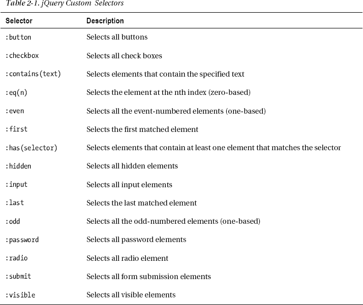
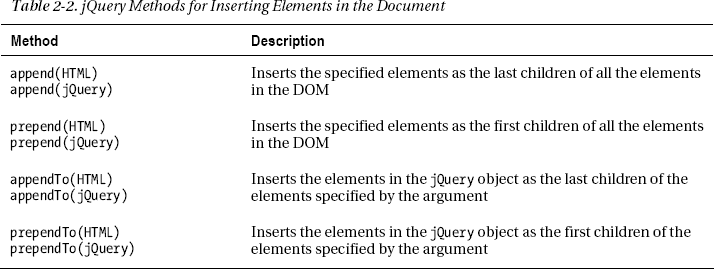
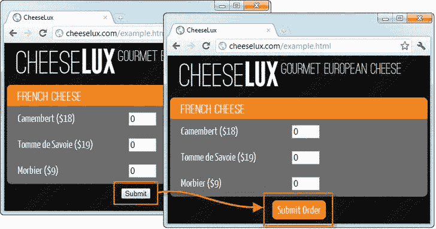
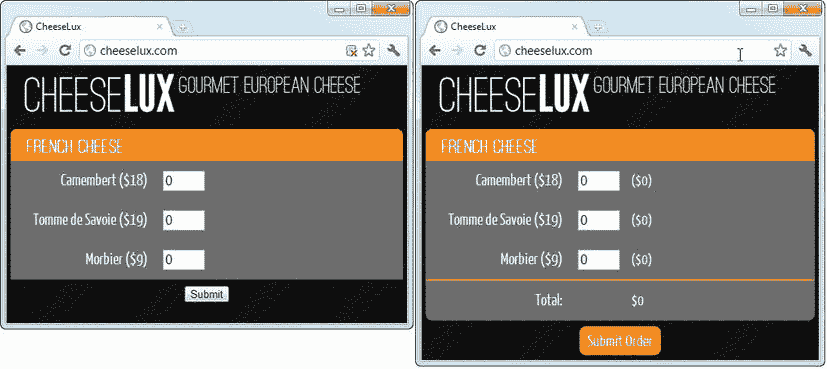
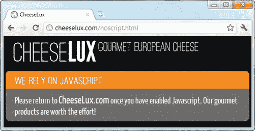

## C H A P T E R 2

## 入门指南

在这一章中，我将增强我在第一章中介绍的示例 web 应用。这些都是入门级的技术，本书的大部分内容致力于向您展示改善结果的不同方法。这并不是说本章中的例子没有用；对于简单的 web 应用来说，它们绝对没问题。但是它们对于大型复杂的 web 应用来说是不够的，这就是为什么接下来的章节解释了如何从服务器端开发的世界中获取关键概念并应用到您的 web 应用中。

这一章也让我为一些我将在本书中使用的 web 应用开发原则奠定了基础。首先，我将尽可能依赖 JavaScript 库，以避免创建别人已经生成和维护的代码。我将最常用的库是 jQuery，以使使用 DOM API 变得更简单和容易(我在本章的例子中解释了一些 jQuery 基础知识)。第二，我将专注于单个 HTML 文档。

### 升级提交按钮

首先，我将使用 JavaScript 替换第 1 章中[基线示例中的提交按钮。浏览器从一个类型为`submit`的`input`元素创建了这个按钮，我将把它换成与文档其余部分视觉上一致的东西。更具体地说，我将使用 jQuery 来替换`input`元素。](01.html)

#### 准备使用 jQuery

DOM API 很全面，但使用起来很笨拙——笨拙到有许多 JavaScript 便利库包装了 DOM API，使它更容易使用。根据我的经验，这些库中最好的是 jQuery，它易于使用，并且得到了积极的开发和支持。jQuery 也是许多其他 JavaScript 库的基础，其中一些我稍后会用到。jQuery 只是 DOM API 的包装器，如果需要的话，它允许使用底层的 DOM 对象和方法。

您可以从 jQuery.com 下载 jQuery 库。和大多数 JavaScript 库一样，jQuery 有两个版本。未压缩版本包含完整的源代码，对于开发和调试非常有用。压缩版本(也称为最小化的版本)要小得多，但是不可读。较小的尺寸使最小化版本非常适合在 web 应用部署到生产环境中时节省带宽。对于流行的网络应用来说，带宽可能很贵，任何节省都是值得的。

下载你想要的版本，放在你的`content`目录下，和`example.html`放在一起。我将在本书中使用未压缩版本，所以我下载了一个名为`jquery-1.7.1.js`的文件。

 **提示**我使用的是未压缩版本，因为它们使调试更容易，当你探索本书中的例子时，你会发现这很有用。对于真正的 web 应用，您应该在部署之前切换到最小化版本。

文件名包括 jQuery 版本，在我写这篇文章时是 1.7.1。使用一个`script`元素将 jQuery 库导入到示例文档中，如[清单 2-1](#list_2_1) 所示。我已经在文档的`head`部分添加了`script`元素。

*清单 2-1。将 jQuery 导入示例文档*

`...
<head>
    <title>CheeseLux</title>
    <link rel="stylesheet" type="text/css" href="styles.css"/>
**    **
</head>
...`

**使用 CDN 进行 JQUERY**

在您自己的 web 服务器上托管 jQuery 库的另一种方法是使用托管 jQuery 的公共*内容分发网络* (CDN)。CDN 是一个由服务器组成的分布式网络，使用离用户最近的服务器向用户交付文件。使用 CDN 有几个好处。首先是用户体验更快，因为 jQuery 库文件是从离他们最近的服务器上下载的，而不是从您的服务器上。通常根本不需要这个文件。jQuery 如此受欢迎，以至于用户的浏览器可能已经缓存了来自另一个也使用 jQuery 的应用的库。第二个好处是，您不会将宝贵而昂贵的带宽花费在向用户交付 jQuery 上。

使用 CDN 的时候，一定要对 CDN 运营商有信心。您希望确保用户收到他们应该收到的文件，并且服务将始终可用。谷歌和微软都免费为 jQuery(以及其他流行的 JavaScript 库)提供 CDN 服务。两家公司都有运行高可用性服务的丰富经验，不太可能故意篡改 jQuery 库。你可以在`[www.asp.net/ajaxlibrary/cdn.ashx](http://www.asp.net/ajaxlibrary/cdn.ashx)`了解微软服务，在`[http://code.google.com/apis/libraries/devguide.html](http://code.google.com/apis/libraries/devguide.html)`了解谷歌服务。

CDN 方法不适合在内部网中交付给用户的应用，因为它会导致所有浏览器都通过互联网来获取 jQuery 库，而不是访问本地服务器，后者通常更近、更快且带宽成本更低。

所以，让我们直接使用 jQuery 来隐藏现有的`input`元素，并在它的位置上添加一些东西。清单 2-2 展示了这是如何做到的。

*清单 2-2。隐藏输入元素并添加另一个元素*

`<!DOCTYPE html>
<html>
<head>
    <title>CheeseLux</title>
    <link rel="stylesheet" type="text/css" href="styles.css"/>
    
**    **
</head>
<body>
    

        
            Gourmet European Cheese
    

    <form action="/basket" method="post">

        

            
French Cheese

            

                <label for="camembert" class="cheesename">Camembert ($18)</label>
                <input name="camembert" value="0"/>
            

            

                <label for="tomme" class="cheesename">Tomme de Savoie ($19)</label>
                <input name="tomme" value="0"/>
            

            

                <label for="morbier" class="cheesename">Morbier ($9)</label>
                <input name="morbier" value="0"/>
            

        

        
` `            <input type="submit" />
        

    </form>
</body>
</html>`

我在文档中添加了另一个`script`元素。该元素包含内联代码，而不是加载外部 JavaScript 文件。我这样做是因为这样更容易向你展示我所做的改变。jQuery 并不要求使用内联代码，如果愿意，可以将 jQuery 代码放在外部文件中。在`script`元素的四个 JavaScript 语句中发生了很多事情，所以我将在接下来的章节中一步一步地进行分解。

#### 了解就绪事件

jQuery 的核心是`$`函数，这是开始使用 jQuery 特性的一种便捷方式。使用 jQuery 最常见的方式是将`$`视为一个 JavaScript 函数，并传递一个 CSS 选择器或一个或多个 DOM 对象作为参数。在 jQuery 中使用`$`函数是很常见的。例如，我在四行代码中使用了三次。

`$`函数返回一个 *jQuery 对象*，您可以在其上调用 jQuery 方法。`jQuery`对象是您选择的元素的包装器，如果您传递一个 CSS 选择器作为参数，`jQuery`对象将包含文档中与您指定的选择器匹配的所有元素。

 **提示**这是 jQuery 优于内置 DOM API 的主要优势之一:可以更容易地选择和修改多个元素。DOM API 的最新版本(包括 HTML5 的一部分)提供了使用选择器查找元素的支持，但是 jQuery 做得更简洁和优雅。

第一次使用清单中的`$`函数时，我将`document`对象作为参数传入。`document`对象是 DOM 中元素层次的根节点，我用`$`函数选择了它，这样我就可以调用`ready`方法，如[清单 2-3](#list_2_3) 中突出显示的。

*清单 2-3。选择文档并调用就绪方法*

`...

...`

浏览器一找到文档中的`script`元素就执行 JavaScript 代码。当您想要操作 DOM 中的元素时，这就给我们带来了一个问题，因为您的代码是在浏览器解析完 HTML 文档的其余部分、发现了您想要处理的元素并将对象添加到 DOM 以表示它们之前执行的。最好的情况是您的 JavaScript 代码不工作，最坏的情况是当这种情况发生时您会导致一个错误。有许多方法可以解决这个问题。最简单的解决方案是将`script`元素放在文档的末尾，这样浏览器就不会发现并执行您的 JavaScript 代码，直到 HTML 的其余部分被处理完。一种更优雅的方法是使用 jQuery `ready`方法，它在刚刚显示的清单中突出显示。

您将一个 JavaScript 函数作为参数传递给`ready`方法，一旦浏览器处理完文档中的所有元素，jQuery 就会执行这个函数。使用`ready`方法允许您将`script`元素放在文档中的任何地方，因为知道您的代码直到正确的时刻才会被执行。

 **注意**一个常见的错误是忘记将要执行的 JavaScript 语句封装在一个函数中，这会导致奇怪的效果。如果您向`ready`方法传递一个语句，那么它将在浏览器处理`script`元素时立即执行。如果您传递多个语句，那么浏览器通常会报告一个 JavaScript 错误。

`ready`方法为`ready`事件创建一个处理程序。在本章的后面，我将向您展示 jQuery 支持事件的更多方式。`ready`事件仅对`document`对象可用，这就是为什么您会在几乎所有使用 jQuery 的 web 应用的清单中看到突出显示的语句。

#### 选择和隐藏输入元素

既然我已经将 JavaScript 代码的执行推迟到 DOM 准备好之后，那么我可以转到任务的下一步，即隐藏提交表单的`input`元素。[清单 2-4](#list_2_4) 突出显示了例子中这样做的语句。

*清单 2-4。选择并隐藏输入元素*

`...

...`

这是一个经典的由两部分组成的 jQuery 语句:首先，我选择我想要处理的元素，然后我应用一个 jQuery 方法来修改所选择的元素。您可能不认识我使用的选择器，因为`:submit`部分是除 CSS 规范中定义的选择器之外 jQuery 定义的选择器之一。表 2-1 包含了最有用的 jQuery 自定义选择器。

 **注意**jQuery 定制选择器非常有用，但是它们会影响性能。只要有可能，jQuery 就使用本地浏览器支持来查找文档中的元素，这通常非常快。然而，jQuery 必须以不同的方式处理自定义选择器，因为浏览器对它们一无所知，这比本机方法花费的时间更长。这种性能差异对于大多数 web 应用来说无关紧要，但是如果性能很重要，您可能希望坚持使用标准的 CSS 选择器。

在[清单 2-4](#list_2_4) 中，我的选择器匹配任何类型为`submit`的`input`元素，并且它是`id`属性为`buttonDiv`的元素的后代。我不需要对选择器如此精确，因为它是文档中唯一的`submit`元素，但是我想演示 jQuery 对选择器的支持。`$`函数返回一个包含所选元素的`jQuery`对象，尽管在本例中只有一个元素与选择器匹配。

选择元素后，我调用`hide`方法，通过将 CSS `display`属性设置为`none`来改变所选元素的可见性。`input`元素是这样的方法调用之前的*:*

`<input type="submit">`

并且在方法调用之后像这样转换*:*

`<input type="submit" **style="display: none; "**>`

浏览器不会显示`display`属性为`none`的元素，因此`input`元素变得不可见。

 **提示**`hide`方法的对应方法是`show`，它删除了`display`设置，并将元素返回到可见状态。我将在本章后面演示`show`方法。

#### 插入新元素

接下来，我想在文档中插入一个新元素。[清单 2-5](#list_2_5) 突出显示了例子中这样做的语句。

*清单 2-5。向文档添加新元素*

`...

...`

在这个语句中，我将一个 HTML 片段字符串传递给了 jQuery `$`函数。这导致 jQuery 解析片段并创建一组对象来表示它包含的元素。然后这些元素对象在一个`jQuery`对象中返回给我，就好像我从文档本身中选择了元素一样，只是浏览器还不知道这些元素，它们还不是 DOM 的一部分。

在这个清单的 HTML 片段中只有一个元素，所以 jQuery 对象包含一个`a`元素。为了将这个元素添加到 DOM 中，我调用 jQuery 对象上的`appendTo`方法，传入一个 CSS 选择器，它告诉 jQuery 我希望将元素插入到文档中的什么位置。

`appendTo`方法将我的新元素作为选择器匹配的元素的最后一个子元素插入。在本例中，我指定了`buttonDiv`元素，这意味着我的 HTML 片段中的元素被插入到隐藏的`input`元素旁边，就像这样:

`...

       <input type="submit" style="display: none; ">
       **<a href="#">Submit Order</a>**

...`

 **提示**如果我传递给`appendTo`方法的选择器匹配了多个元素，那么 jQuery 将复制 HTML 片段中的元素，并插入一个副本作为每个匹配元素的*的最后一个子元素。*

jQuery 定义了许多方法，可以用来将子元素插入到文档中，其中最有用的方法在[表 2-2](#tab_2_2) 中有描述。当您*追加*元素时，它们成为其父元素的最后一个子元素。当你*前置*元素时，它们成为其父元素的第一个子元素。(我将在本章后面解释为什么有两个 append 和两个 prepend 方法。)

#### 应用 CSS 类

在前面的例子中，我插入了一个`a`元素，但是我没有将它分配给一个 CSS 类。[清单 2-6](#list_2_6) 展示了我如何通过调用`addClass`方法来纠正这个遗漏。

*清单 2-6。链接 jQuery 方法调用*

`...

...`

请注意，我只是将对`addClass`方法的调用添加到了语句的末尾。这被称为*方法链接*，一个支持方法链接的库据说有一个*流畅的 API* 。

大多数 jQuery 方法返回的 jQuery 对象与调用该方法时返回的对象相同。在这个例子中，我通过向`$`函数传递一个 HTML 片段来创建`jQuery`对象。这产生了一个包含一个`a`元素的`jQuery`对象。`appendTo`方法将元素插入到文档中，并返回一个 jQuery 对象，该对象包含与结果相同的`a`元素。这允许我进行进一步的方法调用，比如对`addClass`的调用。流畅的 API 可能需要一段时间来适应，但它们可以使代码简洁而富有表现力，并减少重复。

`addClass`方法将参数指定的类添加到选定的元素中，如下所示:

`...

    <input type="submit" style="display: none; ">
    <a href="#" **class="button"**>Submit Order</a>

...`

在`styles.css`中定义了`a.button`类，它使`a`元素的外观与文档的其余部分保持一致。

**了解方法对和方法链**

如果你看一下[表 2-2](#tab_2_2) 中描述的方法，你会发现你可以用两种方式附加或前置元素。插入的元素可以包含在调用方法的 jQuery 对象中，也可以包含在方法参数中。jQuery 提供了不同的方法，因此您可以选择哪些元素包含在用于方法链接的`jQuery`对象中。在我的例子中，我使用了`appendTo`方法，这意味着我可以安排事情，使`jQuery`对象包含从 HTML 片段解析的元素，允许我链接对`addClass`方法的调用，并将类应用于`a`元素。

`append`方法颠倒了父元素和子元素之间的关系，如下所示:

`$('#buttonDiv').append('<a href=#>Submit Order</a>').addClass("button");`

在这个语句中，我选择父元素并提供 HTML 片段作为方法参数。append 方法返回一个包含`buttonDiv`元素的`jQuery`对象，因此`addClass`对父`div`元素生效，而不是新的`a`元素。

概括一下，我隐藏了原来的`input`元素，添加了一个`a`元素，最后，将`a`元素赋给了`button`类。你可以在[图 2-1](#fig_2_1) 中看到结果。

*图 2-1。替换标准表单提交按钮*

用四行代码(其中只有两行操作 DOM)，我将标准的提交按钮升级为与 web 应用的其余部分一致的东西。正如我在本章开始时所说的，一点点代码可以带来显著的增强。

### 应对事件

我还没有完全完成新的`a`元素。浏览器知道一个类型属性为`submit`的`input`元素应该向服务器提交 HTML 表单，当按钮被点击时，它会自动执行这个动作。

我添加到 DOM 中的`a`元素看起来像一个按钮，但是浏览器不知道这个元素的用途，所以没有应用相同的自动操作。我必须添加一些 JavaScript 代码来完成这个效果，并使`a`元素的行为像一个按钮，而不只是看起来像。

您可以通过响应*事件*来做到这一点。事件是当元素的状态改变时，例如，当用户单击元素或将鼠标移到元素上时，浏览器发送的消息。您告诉浏览器您对哪些事件感兴趣，并提供事件发生时执行的 JavaScript 回调函数。当一个事件被浏览器发送时，据说已经被*触发*，回调函数负责*处理*该事件。在接下来的部分中，我将向您展示如何处理事件来完成替换按钮的功能。

#### 处理点击事件

本例中最重要的是`click`，当用户按下并释放鼠标按钮时(换句话说，当用户单击一个元素时)触发该事件。对于这个例子，我想通过向服务器提交 HTML 表单来处理`click`事件。DOM API 提供了处理事件的支持，但是 jQuery 提供了一个更好的选择，你可以在[清单 2-7](#list_2_7) 中看到。

*清单 2-7。处理点击事件*

`<!DOCTYPE html>
<html>
<head>
    <title>CheeseLux</title>
    <link rel="stylesheet" type="text/css" href="styles.css"/>
    

</head>
<body>
    

        
            Gourmet European Cheese
    

    <form action="/basket" method="post">

        

            
French Cheese

            

                <label for="camembert" class="cheesename">Camembert ($18)</label>
                <input name="camembert" value="0"/>
            

            

                <label for="tomme" class="cheesename">Tomme de Savoie ($19)</label>
                <input name="tomme" value="0"/>
            

            

                <label for="morbier" class="cheesename">Morbier ($9)</label>
                <input name="morbier" value="0"/>
            

        
`  `

    <input type="submit" />

    </form>
</body>
</html>`

jQuery 提供了一些有用的方法，使得处理常见事件变得简单。这些事件以事件命名；因此，`click`方法将作为方法参数传递的回调函数注册为`click`事件的处理程序。我已经将对`click`事件的调用链接到创建和格式化`a`元素的其他方法。为了提交表单，我通过类型选择了`form`元素并调用了`submit`方法。这就是全部了。我现在已经有了按钮的基本功能。它不仅与 web 应用的其他部分具有相同的视觉样式，而且单击按钮会将表单提交给服务器，就像最初的按钮一样。

#### 处理鼠标悬停事件

我还想处理另外两个事件来完成按钮功能；他们是`mouseenter`和`mouseleave`。当鼠标指针在元素上移动时触发`mouseenter`事件，当鼠标离开元素时触发`mouseleave`事件。

我想处理这些事件，给用户一个可以点击按钮的视觉提示，当鼠标在元素上时，我通过改变按钮的样式来做到这一点。处理这些事件最简单的方法是使用 jQuery `hover`方法，如[清单 2-8](#list_2_8) 所示。

*清单 2-8。使用 jQuery 悬停方法*

`...

...`

`hover`方法将两个函数作为参数。第一个函数在`mouseenter`事件被触发时执行，第二个函数响应`mouseleave`事件被触发。在这个例子中，我使用这些函数从`a`元素中添加和删除了`buttonHover`类。该类更改 CSS `background-color`属性的值，以便当鼠标位于元素上方时高亮显示按钮。你可以在[图 2-2](#fig_2_2) 中看到效果。

*图 2-2。使用事件将类应用于元素*

#### 使用事件对象

在前一个例子中，我作为参数传递给`hover`方法的两个函数基本相同。我可以将这两个函数合并成一个可以处理这两个事件的处理器，如清单 2-9 所示。

*清单 2-9。在单个处理函数中处理多个事件*

`...

...`

本例中的回调函数接受一个参数`e`。这个参数是浏览器提供的一个`Event`对象，为您提供关于您正在处理的事件的信息。我已经使用了`Event.type`属性来区分我的函数所期望的事件类型。`type`属性返回一个包含事件名称的字符串。如果事件名是`mouseenter`，那么我调用`addClass`方法。如果没有，我调用`removeClass`方法，该方法的作用是从 jQuery 对象的元素的`class`属性中删除指定的类，与`addClass`方法的作用相反。

#### 处理默认动作

为了让程序员的生活更轻松，当特定元素类型的特定事件被触发时，浏览器会自动执行一些操作。这些被称为*默认动作*，它们意味着你不必为 HTML 文档中的每个事件和元素创建事件处理程序。例如，浏览器将导航到由`a`元素的`href`属性指定的 URL，以响应`click`事件。这是网页导航的基础。

我把`href`属性设置成`#`有点作弊。这是定义其动作将由 JavaScript 管理的元素时的常用技术，因为当执行默认动作时，浏览器不会离开当前文档。换句话说，我不必担心默认动作，因为它并没有真正做任何用户会注意到的事情。

当你需要改变元素的行为，而你又不能像使用`#`作为 URL 那样做一些小技巧的时候，默认动作可能会更重要。清单 2-10 提供了一个演示，我已经将`a`元素的`href`属性更改为一个真实的网页。我已经使用了`attr`方法将`a`元素的`href`属性设置为`[http://apress.com](http://apress.com)`。通过这种修改，单击元素不再提交表单；它会导航到 Apress 网站。

*清单 2-10。管理默认操作*

`...

...`

要解决这个问题，需要调用传递给事件处理函数的`Event`对象上的`preventDefault`方法。这将禁用事件的默认操作，意味着将只使用事件处理函数中的代码。你可以在[清单 2-11](#list_2_11) 中看到这个方法的使用。

*清单 2-11。防止违约行为*

`...

...`

对于`a`元素上的`mouseenter`和`mouseleave`事件没有默认动作，所以在这个清单中，我只需要在处理`click`事件时调用`preventDefault`方法。当我现在点击元素时，表单被提交，`href`属性值没有任何影响。

### 添加动态购物篮数据

您已经看到了如何通过添加和修改元素以及处理事件来改进 web 应用。在本节中，我将进一步演示如何使用这些简单的技术，通过将购物篮阶段显示的信息与产品选择结合起来，创建一个响应更快的奶酪店。我称之为*动态*购物篮，因为当用户改变单个奶酪产品的数量时，我将更新向他们显示的信息，而不是*静态*购物篮，当用户使用该 web 应用的未增强版本提交他们的选择时，就会显示该信息。

#### 添加购物篮元素

第一步是向文档中添加我需要的附加元素。我可以使用 HTML 片段和`appendTo`方法添加元素，但是为了多样化，我将使用另一种技术，称为*潜在内容*。潜在内容指的是文档中的 HTML 元素，它们使用 CSS 隐藏，使用 JavaScript 显示和管理。那些没有启用 JavaScript 的用户将看不到这些元素，并将获得基本的功能，但是一旦我揭示了这些元素并设置了我的事件处理，那些使用 JavaScript 的用户将获得更丰富、更完美的体验。[清单 2-12](#list_2_12) 展示了向 HTML 文档添加潜在内容。

*清单 2-12。在 HTML 文档中添加隐藏元素*

`<!DOCTYPE html>
<html>
<head>
    <title>CheeseLux</title>
    <link rel="stylesheet" type="text/css" href="styles.css"/>
    
    
</head>
<body>
    

        
            Gourmet European Cheese
    

    <form action="/basket" method="post">

        

            
French Cheese

            

                <label for="camembert" class="cheesename">Camembert ($18)</label>
                <input name="camembert" value="0"/>
                **($0)**
            

            

                <label for="tomme" class="cheesename">Tomme de Savoie ($19)</label>
                <input name="tomme" value="0"/>
                **($0)**
            
            

            

                <label for="morbier" class="cheesename">Morbier ($9)</label>
                <input name="morbier" value="0"/>` `**                ($0)**
            

**            

**
**            
**
**                <label class="cheesename">Total:</label>**
**                <input class="placeholder" name="spacer" value="0"/>**
**                $0                    **
**            
**
        

        

            <input type="submit" />
        

    </form>
</body>
</html>`

我已经突出显示了清单中的附加元素。它们都被分配给了`latent`类，该类在`styles.css`文件中有如下定义:

`...
.latent {
    display: none;
}
...`

在这一章的前面，我向你展示了 jQuery `hide`方法将 CSS `display`属性设置为`none`来对用户隐藏元素，我在设置这个类的时候也遵循了同样的方法。这些元素在文档中，但对用户不可见。

#### 显示潜在的内容

既然潜在元素已经就位，我就可以使用 jQuery 来处理它们了。第一步是向用户展示它们。因为我使用 JavaScript 操作这些元素，所以它们将只对启用了 JavaScript 的用户显示。清单 2-13 展示了对`script`元素的添加。

*清单 2-13。揭示潜在内容*

`...

...`

突出显示的语句选择所有属于`latent`类的元素，然后调用`show`方法。`show`方法为每个选中的元素添加了一个`style`属性，该属性将`display`属性设置为`inline`，具有显示元素的效果。这些元素仍然是`latent`类的成员，但是在`style` *属性*中定义的值覆盖了在`style` *元素*中定义的值，因此这些元素变得可见。

#### 响应用户输入

为了创建一个动态购物篮，我希望能够显示每一项的小计，以及每当用户更改产品数量时的总计。我将处理两个事件来获得我想要的效果。第一个事件是`change`，当用户输入一个新值，然后将焦点移动到另一个元素时触发。第二个事件是`keyup`，当用户释放之前按下的一个键时触发。这两件事的结合意味着我可以自信地对新的价值观做出平稳的反应。jQuery 定义了`change`和`keyup`方法，我可以像之前使用`click`方法一样使用它们，但是因为我想以同样的方式处理这两个事件，所以我将使用`bind`方法，如[清单 2-14](#list_2_14) 所示。

*清单 2-14。绑定到 change 和 keyup 事件*

`...

...`

`bind`方法的优点是它允许我使用同一个匿名 JavaScript 函数处理多个事件。为此，我选择了文档中的`input`元素来获取一个 jQuery 对象，并对其调用了`bind`方法。`bind`方法的第一个参数是一个包含要处理的事件名称的字符串，其中事件名称由空格字符分隔。第二个参数是当事件被触发时处理事件的函数。事件处理函数中只有两个语句，但是它们值得一解，因为它们包含了 jQuery、DOM API 和纯 JavaScript 的有趣组合。

 **提示**像这样处理两个事件意味着我的回调函数可能会在不需要的时候被调用。例如，如果用户按下 Tab 键，焦点将转移到下一个元素，并且`change`和`keyup`事件都将被触发，即使`input`元素中的值没有改变。我倾向于接受这种重复，作为确保流畅用户体验的代价。我宁愿我的功能执行得比实际需要的更频繁，不要错过任何用户交互。

##### 计算小计

函数中的第一条语句负责计算`input`值已更改的奶酪产品的小计。以下是声明:

`var subtotal = $(this).val() * priceData[this.name];`

用 jQuery 处理事件时，可以使用名为`this`的变量来引用触发事件的元素。`this`变量是一个`HTMLElement`对象，DOM API 用它来表示文档中的元素。有一组由`HTMLElement`定义的核心属性，其中最重要的在[表 2-3](#tab_2_3) 中描述。

T2】

补充了核心属性，以适应不同元素类型的独特特征。一个这样的例子是`name`属性，它返回那些支持它的元素的`name`属性的值，包括`input`元素。我已经在`this`变量上使用了这个属性来获取`input`元素的名称，这样我就可以用它来从我添加到脚本中的`priceData`对象中获取一个值:

`var subtotal = $(this).val() * **priceData[this.name];**`

`priceData`对象是一个简单的 JavaScript 对象，它有一个对应于每种奶酪的属性，每个属性的值就是奶酪的价格。

`this`变量也可以用来创建`jQuery`对象，如下所示:

`var subtotal = **$(this)**.val() * priceData[this.name];`

通过将一个`HTMLElement`对象作为参数传递给 jQuery `$`函数，我创建了一个`jQuery`对象，它的行为就像我使用 CSS 选择器选择了元素一样。这允许我轻松地将 jQuery 方法应用于来自 DOM API 的对象。在这个语句中，我调用了`val`方法，该方法返回`jQuery`对象中第一个元素的`value`属性的值。

 **提示**我的`jQuery`对象中只有一个元素，但是 jQuery 方法被设计成可以处理多个元素。当您使用类似于`val`的方法从元素中读取一些值时，您从选择的第一个元素中获取值，但是当您使用相同的方法设置值(通过将值作为参数传递)时，所有选择的元素都将被修改。

使用`this`变量，我已经能够获得触发事件的`input`元素的值以及与之相关的产品价格。然后，我将价格和数量相乘以确定小计，并将其赋给一个名为`subtotal`的局部变量。

##### 显示小计

处理函数中的第二条语句负责向用户显示小计。这一声明也分为两部分。第一部分选择将用于显示值的元素:

`**$(this).siblings("span").children("span").**text(subtotal)`

我再次使用`this`变量创建了一个 jQuery 对象。我调用了`siblings`方法，该方法返回一个`jQuery`对象，该对象包含原始`jQuery`对象中匹配指定 CSS 选择器的元素的任何兄弟元素。该方法返回一个`jQuery`对象，该对象包含触发事件的`input`元素旁边的潜在`span`元素。

我链接了对`children`方法的调用，该方法返回一个`jQuery`对象，该对象包含前面的`jQuery`对象中匹配指定选择器的元素的所有子元素。我以一个包含嵌套的`span`元素的`jQuery`对象结束。在这个例子中，我本来可以简化选择器，但是我想演示 jQuery 如何支持在文档中导航元素，以及在一系列方法调用中`jQuery`对象的内容如何改变。这些变化在[表 2-4](#tab_2_4) 中描述。

通过像这样组合方法调用，我能够在元素层次结构中导航以创建一个`jQuery`对象，该对象精确地包含我想要处理的一个或多个元素，在本例中，是触发事件的元素的兄弟元素的子元素。

语句的第二部分是对`text`方法的调用，该方法设置`jQuery`对象中元素的文本内容。在本例中，文本是`subtotal`变量的值:

`$(this).siblings("span").children("span")**.text(subtotal)**`

最终结果是，一旦用户更改了所需的数量，奶酪的小计就会更新。

#### 计算整体总数

为了完成这个篮子，我需要在每次小计发生变化时生成一个总计。我在`script`元素中定义了一个新函数，并在`input`元素的事件处理函数中添加了对它的调用。[清单 2-15](#list_2_15) 显示了增加的内容。

*清单 2-15。计算总体总数*

`...

...`

`calculateTotal`函数中的第一条语句定义了一个局部变量，并初始化为零。我用这个变量来计算各个小计的总和。下一个语句是这个函数中最有趣的一个。语句的第一部分选择一组元素:

`...
**$('span.subtotal span').not('#total')**.each(function(index, elem) {
...`

我首先选择所有的`span`元素，它们是属于`subtotal`类的`span`元素的后代。这是选择小计元素的另一种方式。然后我使用`not`方法从选择中移除元素。在这种情况下，我删除了`id`为`total`的元素。我这样做是因为我使用相同的类和样式定义了 subtotal 和 total 元素，并且我不希望在计算新的总计时包含当前的总计。

选择完项目后，我使用`each`方法。这个方法为一个`jQuery`对象中的每个元素调用一次函数。该函数的参数是选择中当前元素的索引和代表 DOM 中元素的`HTMLElement`对象。

我使用`text`方法获取每个 subtotal 元素的内容。我通过将`HTMLElement`对象作为参数传递给`$`函数来创建一个`jQuery`对象，就像我在本章前面对`this`变量所做的一样。

`text`方法返回一个字符串，所以我使用 JavaScript `Number`函数创建一个数值，我可以将它添加到运行总数中:

`total += **Number**($(elem).text());`

最后，我选择了`total`元素，并使用`text`方法来显示总计:

`$('#total').text("$" + total);`

添加此函数的效果是奶酪数量的变化会立即反映在总数和单个小计中。

#### 改变表单目标

通过添加动态购物篮，我将购物篮 web 页面的功能引入了应用的主页面。当启用 JavaScript 的用户提交表单时，将他们发送到购物篮 web 页面是没有意义的，因为它只是复制了他们已经看到的信息。我将更改`form`元素的目标，以便提交表单直接进入发货页面，完全跳过购物篮页面。清单 2-16 显示了改变目标的语句。

*清单 2-16。更改表单元素的目标*

`...

...`

至此，新语句的工作原理应该显而易见了。我按类型选择了`form`元素(因为文档中只有一个这样的元素),并调用`attr`方法为`action`属性设置一个新值。提交表单时，用户会被带到 shipping details 页面，完全跳过购物篮页面。你可以在[图 2-3](#fig_2_3) 中看到效果。

*图 2-3。改变申请流程*

正如这个例子所演示的，您可以改变 web 应用的流程以及各个页面的外观和交互性。当然，后端服务需要了解不同类型的用户可以通过 web 应用遵循的各种路径，但这很容易通过一点预先考虑和规划来实现。

### 了解渐进式改进

我在这一章中展示的技术是基本的，但是非常有效。通过使用 JavaScript 管理 DOM 中的元素并响应事件，我已经能够使示例 web 应用对用户的响应更快，提供关于用户产品选择成本的有用和及时的信息，并简化应用本身的流程。

但是——这很重要——因为这些变化是通过 JavaScript 完成的，所以对于非 JavaScript 用户来说，web 应用的基本性质和结构保持不变。[图 2-4](#fig_2_4) 显示了启用和禁用 JavaScript 时的 web 应用主页面。

*图 2-4。禁用和启用 JavaScript 时的 web 应用*

非 JavaScript 用户体验的版本仍然功能齐全，但使用起来比较笨拙，需要更多步骤才能下订单。

创建一个基本的功能级别，然后有选择地丰富它，这是*渐进增强*的一个例子。渐进式改进不仅仅是关于 JavaScript 的可用性；它包括基于任何因素的选择性丰富，例如带宽量、浏览器类型，甚至用户的经验水平。然而，在创建 web 应用时，最常见的渐进式改进形式是由用户是否启用了 JavaScript 来驱动的。

 **提示**与*渐进增强*类似的术语是*优雅退化*。就我在本书中的目的而言，渐进增强和适度降级是相同的，即 web 应用的核心内容和功能对所有用户都是可用的，而与用户浏览器的功能无关。

如果您不想支持非 JavaScript 浏览器，那么您应该让非 JavaScript 访问者清楚地看到存在问题。最简单的方法是使用`noscript`和`meta`元素将浏览器重定向到解释情况的页面，如[清单 2-17](#list_2_17) 所示。

*清单 2-17。处理非 JavaScript 用户*

`...
<head>
    <title>CheeseLux</title>
    <link rel="stylesheet" type="text/css" href="styles.css"/>
    
    
**    <noscript>**
**        <meta http-equiv="refresh" content="0; noscript.html"/>**
**    </noscript>**
</head>
...`

这些元素的组合将用户重定向到一个名为`noscript.html`的页面，这是一个 HTML 文档，告诉用户我需要 JavaScript(显然，并不依赖于 JavaScript 本身)。你可以在本书附带的源代码下载中找到这一页，并在图 2-5 中看到结果。

*图 2-5。在 web 应用中强制执行仅 JavaScript 策略*

要求 JavaScript 很诱人，但我建议谨慎；您可能会惊讶于有多少用户不启用 JavaScript 或者根本不能启用。对于大公司的用户来说尤其如此，在大公司中，计算机通常被锁定，普通人群中常见的功能以安全的名义被禁用，遗憾的是，包括浏览器中的 JavaScript。有些 web 应用没有 JavaScript 就没有意义，但是在决定开发它们之前，要仔细考虑你要排除的潜在用户/客户。

 **注意**这是一本关于用 JavaScript 构建 web 应用的书，所以我不打算在接下来的章节中保持渐进式增强。不要认为这是对纯 JavaScript 政策的认可。在我自己的项目中，我尽可能地支持非 JavaScript 用户，即使这需要很多额外的工作。

### 重温按钮:使用 UI 工具包

在本章的最后，我想向你展示一种不同的方法来获得本章中的一个结果:创建一个视觉上一致的按钮。我之前使用的技术演示了如何操作 DOM 和响应事件来定制元素的外观和行为，这是本章的主要前提。

也就是说，对于专业开发来说，最好不要写可以从好的 JavaScript 库中获得的东西，当我想创建视觉上丰富的元素时，我会使用 UI 工具包。在这一节中，我将向您展示使用 jQuery UI 创建自定义按钮是多么容易，jQuery UI 是由 jQuery 团队开发的，是使用最广泛的 JavaScript UI 工具包之一。

#### 设置 jQuery UI

设置 jQuery UI 是一个多阶段的过程。第一步是创建一个*主题*，它定义了 jQuery UI *小部件*(UI 工具包创建的样式元素的名称)使用的 CSS 样式。要创建主题，请转到`[http://jqueryui.com](http://jqueryui.com)`，点击主题按钮，展开屏幕左侧的每个部分，并指定您想要的样式。当您进行更改时，屏幕右侧的示例小部件将会更新以反映新的设置。我花了大约五分钟(以及一点点尝试和错误)来创建一个与示例 web 应用外观相匹配的主题。如果您不想创建自己的主题，我已经在本书的源代码下载中包含了我创建的主题。

 **提示**如果您不想创建自定义主题，您可以从图库中选择预定义的样式。如果你不想匹配现有的应用设计，这可能是有用的，尽管一些画廊风格中使用的颜色非常惊人。

完成后，点按“下载主题”按钮。您将看到一个屏幕，允许您选择下载中包含哪些 jQuery UI 组件。如果您深入了解 jQuery UI 的细节，您可以创建一个较小的下载，但是对于本书，请确保选择了所有的组件并单击 download 按钮。您的浏览器将下载一个`.zip`文件，其中包含 jQuery UI 库、您创建的 CSS 主题和一些支持图片。

设置的第二部分是将以下文件从`.zip`文件复制到 Node.js 服务器的`content`目录中:

> *   `development-bundle\ui\jquery-ui-1.8.16.custom.js` file
> *   File `development-bundle\themes\custom-theme\jquery-ui-1.8.16.custom.css` file
> *   `development-bundle\themes\custom-theme\images` folder

这些文件的名称包括 jQuery UI 版本号。当我写这篇文章的时候，当前的版本是 1.8.16，但是在这本书出版的时候，你可能会有一个更高的版本。

 **提示**我再次使用 JavaScript 文件的未压缩版本，以使调试更容易。你会在`.zip`文件的`js`文件夹中找到最小化版本。

#### 创建 jQuery UI 按钮

既然 jQuery UI 已经设置好了，我可以在 HTML 文档中使用它来创建一个按钮小部件并简化我的代码。清单 2-18 显示了将 jQuery UI 导入文档并创建一个按钮所需的附加内容。

导入 jQuery UI 只是添加一个用于导入 JavaScript 文件的`script`元素和一个用于导入 CSS 文件的`link`元素。你不需要明确地引用`images`目录。

 **提示**注意，导入 jQuery UI JavaScript 文件的`script`元素出现在导入 jQuery 的元素之后的*元素。这种排序很重要，因为 jQuery UI 依赖于 jQuery。*

*清单 2-18。使用 jQuery UI 创建一个按钮*

`<!DOCTYPE html>
<html>
<head>
    <title>CheeseLux</title>
    <link rel="stylesheet" type="text/css" href="styles.css"/>
    
    ****
    **<link rel="stylesheet" type="text/css" href="jquery-ui-1.8.16.custom.css"/>**

<noscript>
    <meta http-equiv="refresh" content="0; noscript.html"/>
</noscript>
</head>
...`

在使用 jQuery UI 时，我不必隐藏`input`元素并插入一个替代。相反，我使用 jQuery 选择我想要修改的元素并调用`button`方法，如下所示:

`$('#buttonDiv input:submit').button()`

通过一次方法调用，jQuery UI 改变标签的外观，并在鼠标悬停在按钮上时处理高亮显示。在这种情况下，我不需要担心处理`click`事件，因为`submit` `input`元素的默认动作是提交表单，这正是我想要发生的。

我使用`css`方法进行了一次额外的方法调用。该方法使用`style`属性将 CSS 属性直接应用于所选元素，我已经用它在`input`元素上设置了`font-family`属性。jQuery UI 主题系统不太支持处理字体，并且使用单一的字体系列生成小部件。我已经从 Google Fonts ( `[www.google.com/webfonts](http://www.google.com/webfonts)`和 the excellent League of mobile Type(`[www.theleagueofmoveabletype.com](http://www.theleagueofmoveabletype.com)`)中设置了 web 字体，所以我必须覆盖 jQuery UI CSS 样式，以便将我喜欢的字体应用到 button 元素。在[图 2-6](#fig_2_6) 中可以看到使用 jQuery UI 创建按钮的结果。如您所见，结果与 web 应用的其余部分一致，但用 JavaScript 创建要简单得多。

*图 2-6。用 jQuery UI 创建按钮*

像 jQuery UI 这样的工具包只是我前面描述的相同 DOM、CSS 和事件技术的方便包装。理解幕后发生的事情很重要，但是我推荐使用 jQuery UI 或其他好的 UI 库。这些库经过了全面的测试，它们让您不必编写和调试定制代码，让您可以将更多时间花在使您的 web 应用从竞争中脱颖而出的功能上。

### 总结

正如我在本章开始时提到的，我在这些例子中使用的技术简单、可靠，并且完全适合小型 web 应用。如果应用很小，维护起来不会有任何问题，那么使用这些方法本质上没有任何问题，因为它的行为的每个方面对程序员来说都是显而易见的。

然而，如果你正在读这本书，你想更进一步，创建大型的、复杂的、有许多活动部件的 web 应用。当应用于这样的网络应用时，这些技术会产生一些根本性的问题。潜在的问题是 web 应用的不同方面都混在一起了。应用数据(产品和购物篮)、数据的表示(HTML 元素)以及它们之间的交互(JavaScript 事件和处理函数)分布在整个文档中。这使得很难在不引入错误的情况下添加额外的数据、扩展功能或修复错误。

在接下来的章节中，我将向您展示如何将服务器端开发领域的重型技术应用到 web 应用中。多年来，客户端开发一直是服务器端工作的穷亲戚，但是随着浏览器变得更加强大(以及 web 应用程序员变得更加雄心勃勃)，我们再也不能假装客户端不是一个完全成熟的平台。是时候认真对待 web 应用开发了，在接下来的章节中，我将向您展示如何为您的 web 应用创建一个坚实、健壮、可伸缩的基础。