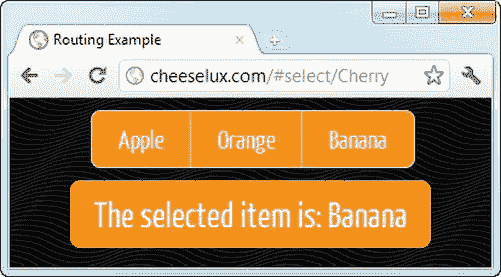
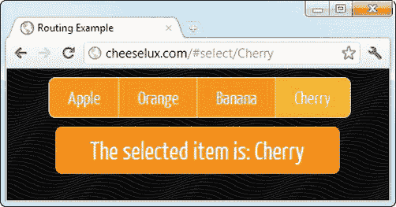
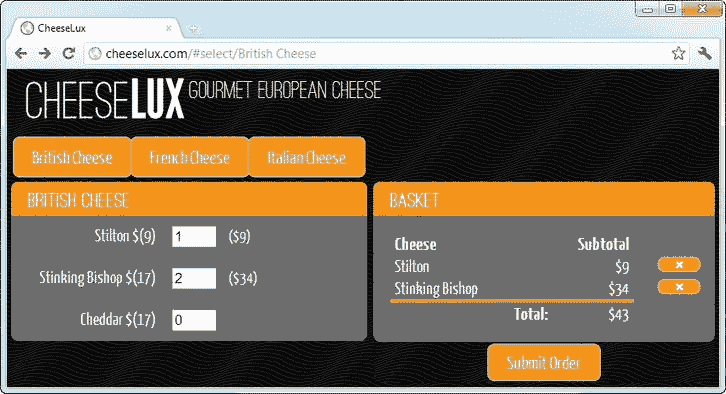

# 四、使用 URL 路由

在这一章中，我将向你展示如何在你的 web 应用中添加另一个服务器端的概念:URL 路由。URL 路由背后的想法非常简单:我们将 JavaScript 函数与内部的 T2 URL 联系起来。内部 URL 是相对于当前文档的 URL，包含一个散列片段。事实上，它们通常只表示为散列片段本身，比如`#summary`。

在正常情况下，当用户点击一个指向内部 URL 的链接时，浏览器会查看文档中是否有一个元素的`id`属性值与片段相匹配，如果有，就滚动以使该元素可见。

当我们使用 URL 路由时，我们通过执行 JavaScript 函数来响应这些导航变化。这些函数可以显示和隐藏元素，更改视图模型，或者执行应用中可能需要的其他任务。使用这种方法，我们可以为用户提供一种在应用中导航的机制。

当然，我们可以使用事件。问题还是在于规模。对于小型简单的 web 应用来说，处理由元素触发的事件是一种完全可行且可接受的方法。对于更大、更复杂的应用，我们需要更好的东西，URL 路由提供了一种简单、优雅、可伸缩的好方法。当我们使用 URL 作为导航机制时，向 web 应用添加新的功能区域，并为用户提供使用它们的方法，变得非常简单和健壮。

### 构建一个简单的路由 Web 应用

解释 URL 路由的最好方式是用一个简单的例子。清单 4-1 显示了一个依赖于路由的基本 web 应用。

*清单 4-1。一个简单的路由 Web 应用*

`<!DOCTYPE html>
<html>
<head>
    <title>Routing Example</title>
    <link rel="stylesheet" type="text/css" href="jquery-ui-1.8.16.custom.css"/>
    <link rel="stylesheet" type="text/css" href="styles.css"/>
    
    
    
    ` `    
    
    
    
</head>
<body>
    

        <a data-bind="formatAttr: {attr: 'href', prefix: '#select/', value: $data},
            css: {selectedItem: ($data == viewModel.selectedItem())}">
            
        </a>
    

    

        

            The selected item is: 
        

    

</body>
</html>`

这是一个相对较短的列表，但是有很多内容，所以我将在接下来的部分中分解内容并解释活动的部分。

#### 添加路由库

我将再次使用一个公开可用的库来获得我需要的效果。周围有一些 URL 路由库，但我最喜欢的一个叫做 Crossroads。它简单、可靠、易于使用。它有一个缺点，那就是它依赖于同一作者的另外两个库。我喜欢看到依赖关系被整合到一个单独的库中，但是这并不是一个普遍的偏好，这仅仅意味着我们必须下载一些额外的文件。[表 4-1](#tab_4_1) 列出了我们从下载档案中需要的项目和 JavaScript 文件，这些文件应该复制到 Node.js 服务器`content`目录中。(如果您不想单独下载这些文件，这三个文件都是本书源代码下载的一部分。可在 Apress.com 免费下载。)

我使用`script`元素将 Crossroads、它的支持库和我的新`cheeseutils.js`文件添加到 HTML 文档中:

`...

****
****
**  **
`

通过对容器元素应用`buttonset`方法，我能够从子`a`元素创建一组按钮。我使用了`buttonset`，而不是`button`，这样 jQuery UI 将在一个连续的块中设计元素的样式。你可以在[图 4-1](#fig_4_1) 中看到这造成的效果。

*图 4-1。应用路由的基本应用*

由`buttonset`方法创建的按钮之间没有空间，按钮组的外边缘被很好地圆化了。您还可以在图中看到一个内容元素。这个想法是，点击其中一个按钮将允许用户显示相应的内容项。

#### 应用 URL 路由

我几乎准备好了一切:一组导航控件和一组内容元素。我现在需要将它们连接在一起，这是通过应用 URL 路由来实现的:

``

突出显示的前三条语句设置了 Hasher 库，以便它能与 Crossroads 一起工作。Hasher 通过`location.hash` browser 对象响应内部 URL 的变化，并在有变化时通知 Crossroads。

Crossroads 检查新的 URL，并将其与给定的每条路线进行比较。使用`addRoute`方法定义路线。该方法的第一个参数是我们感兴趣的 URL，第二个参数是用户导航到该 URL 时要执行的函数。因此，例如，如果用户导航到`#select/Apple`，那么将视图模型中的`selectedItem`可观察值设置为`Apple`的函数将被执行。

 **提示**我们在使用`addRoute`方法时不需要指定`#`字符，因为 Hasher 在通知 Crossroads 发生变化之前会删除它。

在这个例子中，我定义了三条路由，每条路由对应于我在`a`元素上使用`formatAttr`绑定创建的一个 URL。

这是 URL 路由的核心。您创建一组驱动 web 应用行为的 URL 路由，然后在文档中创建导航到这些 URL 的元素。[图 4-2](#fig_4_2) 显示了示例中这种导航的效果。

*图 4-2。浏览示例 web 应用*

当用户点击一个按钮时，浏览器导航到由底层`a`元素的`href`属性指定的 URL。这种导航变化被路由系统检测到，从而触发对应于该 URL 的功能。该函数更改视图模型中可观察项目的值，并导致用户显示表示所选项目的元素。

需要理解的重要一点是，我们正在使用浏览器的导航机制。当用户单击其中一个导航元素时，浏览器移动到目标 URL 尽管 URL 位于同一文档中，但浏览器的历史记录和 URL 栏会更新，如图所示。

这给 web 应用带来了两个好处。首先是后退按钮的工作方式符合大多数用户的预期。第二，用户可以手动输入 URL 并导航到应用的特定部分。要查看这两种行为的运行情况，请按照以下步骤操作:

> 1.  Load the list in the browser.
> 
> 2.  。
> 3.  Enter `cheeselux.com/#select/Banana` in the address bar of the browser.
> 4.  Click the back button of the browser.

当您单击橙色按钮时，橙色项目被选中，并且该按钮被突出显示。当您输入 URL 时，香蕉商品也会发生类似的情况。这是因为应用的导航机制现在由浏览器来协调，这就是我们如何能够使用 URL 路由来分离应用的另一个方面。

在我看来，第一个好处是最有用的。当用户单击后退按钮时，浏览器会导航回上一次访问的 URL。这是一个导航更改，如果以前的 URL 在我们的文档中，新的 URL 将与应用定义的路由集匹配。这是一个将应用状态展开到上一步的机会，在示例应用中，上一步显示橙色按钮。对于用户来说，这是一种更自然的工作方式，特别是与使用常规事件相比，在常规事件中，点击后退按钮往往会导航到用户在应用之前访问的站点。

### 巩固路线

在前面的例子中，我分别定义了每条路由及其执行的功能。如果这是定义路由的唯一方式，那么复杂的 web 应用将会陷入路由和功能的泥沼，并且与常规事件处理相比没有任何优势。幸运的是，URL 路由非常灵活，我们可以轻松地合并我们的路由。在接下来的部分中，我将描述这方面可用的技术。

#### 使用可变段

清单 4-4 显示了将之前演示的三条路线合并成一条路线是多么容易。

*清单 4-4。合并路线*

``

URL 的路径部分由段组成。比如 URL 路径`select/Apple`有两段，分别是`select`和`Apple`。当我指定一条路线时，像这样:

`/select/Apple`

只有当两段完全匹配时，路由才会与 URL 匹配。在清单中，我已经能够通过添加一个*变量段*来合并我的路线。可变段允许路由匹配具有相应段的任何值的 URL。因此，为了明确起见，简单 web 应用中的所有导航 URL 都将匹配我的新路线:

`select/Apple
select/Orange
select/Banana`

第一段仍然是静态的*，这意味着只有第一段是`select`的 URL 才会匹配，但是我为第二段添加了一个通配符。*

 *这样我就可以适当地响应 URL，变量段的内容作为参数传递给我的函数。我使用这个参数来更改视图模型中可观察的`selectedItem`的值，这意味着`/select/Apple`的 URL 会导致如下调用:

`viewModel.selectedItem('Apple');`

一个 URL`select/Cherry`将导致这样一个调用:

`viewModel.selectedItem('Cherry');`

##### 处理意外的段值

最后一个网址有问题。在我的 web 应用中没有一个名为 Cherry 的项目，将视图模型`observable`设置为这个值会为用户创建一个奇怪的效果，如图[图 4-3](#fig_4_3) 所示。

*图 4-3。意外变量段值的结果*

URL 路由带来的灵活性也是一个问题。能够导航到应用的特定部分对用户来说是一个有用的工具，但是，对于用户提供输入的所有机会，我们必须防止意外的值。对于我的示例应用，验证变量段值的最简单方法是检查视图模型中数组的内容，如清单 4-5 所示。

*清单 4-5。忽略意外的段值*

`...
crossroads.addRoute("select/{item}", function(item) {
    **if (viewModel.items.indexOf(item) > -1) {**
        viewModel.selectedItem(item);
    **}**
});
...`

在这个清单中，我选择了阻力最小的方法，即简单地忽略意外值。有许多可供选择的方法。我本可以显示一条错误消息，或者如清单 4-6 所示，接受这个意外的值并将其添加到视图模型中。

*清单 4-6。通过将意外值添加到视图模型中来处理它们*

``

如果变量 segment 的值不是视图模型中的`items`数组中的值之一，那么我使用`push`方法添加新值。我改变了视图模型，所以使用`ko.observableArray`方法，`items`数组是一个可观察的项目。一个可观察数组就像一个常规的可观察数据项，除了像`foreach`这样的绑定会随着数组内容的改变而更新。使用可观察数组意味着添加一个项目会导致 Knockout 在文档中生成内容和导航元素。

这个过程的最后一步是再次调用 jQuery UI `buttonset`方法。KO 不知道应用于`a`元素来创建按钮的 jQuery UI 样式，必须重新应用这个方法才能获得正确的效果。在[图 4-4](#fig_4_4) 中可以看到导航到`#select/Cherry`的结果。

*图 4-4。将意外的段值合并到应用状态中*

#### 使用可选段

可变段的限制是 URL 必须包含一个段值来匹配路由。比如路由`select/{item}`会匹配任何一个第一段是`select`的两段式 URL，但是不会匹配`select/Apple/Red`(因为段太多)或者`select`(因为段太少)。

我们可以使用可选航段来增加路线的灵活性。[清单 4-7](#list_4_7) 显示了该示例的可选段上的应用。

*清单 4-7。使用路线中的可选路段*

`...
crossroads.addRoute(**"select/:item:"**, function(item) {
    **if (!item) {**
        **item = "Apple";**
    } else  if (viewModel.items.indexOf(item)== -1) {
        viewModel.items.push(item);
        $('div.catSelectors').buttonset();
    }
    viewModel.selectedItem(item);
});
...`

为了创建一个可选的段，我简单地用冒号替换括号字符，这样`{item}`就变成了`:item:`。通过这一改变，路由将匹配具有一个或两个段并且第一个段是`select`的 URL。如果没有第二段，那么传递给函数的参数将为 null。在我的清单中，如果是这种情况，我默认使用`Apple`值。一条路线可以包含任意多的静态、变量和可选航段。在这个例子中，我将保持我的路线简单，但是您可以创建几乎任何您需要的组合。

#### 添加默认路线

随着可选段的引入，我的路由将匹配一段和两段 URL。我想添加的最后一个路由是一个*默认路由*，它是一个当 URL 中根本没有段时将被调用的路由。这是完成对后退按钮的支持所必需的。要查看我正在解决的问题，请将清单加载到浏览器中，单击其中一个导航元素，然后单击 Back 按钮。你可以在[图 4-5](#fig_4_5) 中看到效果——或者说，没有效果。

*图 4-5。导航回应用起始点*

单击“后退”按钮时，应用不会重置为其原始状态。只有当点击 Back 按钮将浏览器带回到 web 应用的基本 URL(在我的例子中是`[http://cheeselux.com](http://cheeselux.com)`)时，才会发生这种情况。什么都不会发生，因为基本 URL 与应用定义的路由不匹配。清单 4-8 显示了增加一条新的路线来解决这个问题。

*清单 4-8。为基本 URL 添加路由*

`...

...`

此路由不包含任何类型的段，只匹配基本 URL。现在，单击 Back 按钮直到到达基本 URL 会使应用返回到其初始状态。(嗯，它回到了它的初始状态；在这一章的后面，我将解释这种方法中的一个小问题，并告诉你如何改进它。)

### 使事件驱动控件适应导航

并不总是能够限制文档中的元素，使得所有的导航都可以通过`a`元素来处理。当向路由的应用添加 JavaScript 事件时，我遵循一个简单的模式，它在 URL 路由和常规事件之间架起了一座桥梁，给了我许多路由的好处，也让我可以使用其他类型的元素。[清单 4-9](#list_4_9) 展示了这种应用于其他元素类型的模式。

*清单 4-9。URL 路由和 JavaScript 事件之间的桥接*

`...

...`

这里的技术是向元素添加一个`data-url`属性，这些元素的事件将导致导航的改变。我使用 jQuery 来处理具有`data-url`属性的元素的`change`和`click`事件。处理这两个事件让我能够迎合不同种类的`input`元素。我使用了`live`方法，这是一个简洁的 jQuery 特性，它依靠事件传播来确保在脚本执行后为添加到文档中的元素处理事件；当文档中的元素集可以根据视图模型的变化而改变时，这是非常重要的。这种方法允许我使用这样的元素:

`...

    <label data-bind="attr: {for: $data}">
        
**        <input type="radio" name="item" data-bind="attr: {id: $data},**
**            formatAttr: {attr: 'data-url', prefix: '#select/', value: $data}**">
    </label>

...`

该标记为视图模型`items`数组中的每个元素生成一组单选按钮。我用我的自定义`formatAttr`数据绑定为`data-url`属性创建值，我在前面已经描述过了。`select`元素需要一些特殊的处理，因为当`select`元素触发`change`事件时，关于哪个值被选中的信息是从子`option`元素获得的。下面是创建一个使用该模式的`select`元素的一些标记:

`...

    <select name="eventItemSelect" data-bind="foreach: items,
**            attr: {'data-url': '#select/'}**">
        <option data-bind="**value: $data**, text: $data,
            **selected: $data == viewModel.selectedItem()**">
        </option>
    </select>

...`

目标 URL 的一部分在`select`元素的`data-url`属性中，其余部分取自`option`元素的`value`属性。包括`select`在内的一些元素会同时触发`click`和`change`事件，所以在使用`location.replace`触发导航更改之前，我会检查目标 URL 是否不同于当前 URL。清单 4-10 显示了这种技术如何应用到`select`元素、按钮、单选按钮和复选框中。

*清单 4-10。事件之间的桥接和不同类型元素的路由*

`<!DOCTYPE html>
<html>
<head>
    <title>Routing Example</title>
    <link rel="stylesheet" type="text/css" href="jquery-ui-1.8.16.custom.css"/>
    <link rel="stylesheet" type="text/css" href="styles.css"/>
    
    
    
    
    
    
    
    
</head>
<body>
    

        <a data-bind="formatAttr: {attr: 'href', prefix: '#select/', value: $data},
            css: {selectedItem: ($data == viewModel.selectedItem())}">
            
        </a>
    

    

        

            The selected item is: 
        

    

**    
**
**        <select name="eventItemSelect" data-bind="foreach: items,**
**                attr: {'data-url': '#select/'}">**
**            <option data-bind="value: $data, text: $data,**
**                selected: $data == viewModel.selectedItem()">**
**            </option>**
**        </select>**
**    
**

**    
**` `**        <input type="button" data-bind="value: $data,**
**            formatAttr: {attr: 'data-url', prefix: '#select/', value: $data}" />**
**    
**

**    
**
**        <label data-bind="attr: {for: $data}">**
**            **
**            <input type="checkbox" data-bind="attr: {id: $data},**
**                formatAttr: {attr: 'data-url', prefix: '#select/', value: $data}">**
**        </label>**
**    
**

**    
**
**        <label data-bind="attr: {for: $data}">**
**            **
**            <input type="radio" name="item" data-bind="attr: {id: $data},**
**                formatAttr: {attr: 'data-url', prefix: '#select/', value: $data}">**
**        </label>**
**    
**
</body>
</html>`

我定义了另一个定制绑定来正确设置适当的`option`元素上的`selected`属性。我把这个绑定叫做`selected`(显然足够了)，它被定义了，如[清单 4-11](#list_4_11) 所示，在`utils.js`文件中。

*清单 4-11。所选数据绑定*

`ko.bindingHandlers.selected = {
    init: function(element, accessor) {
        if (accessor()) {
            $(element).siblings("[selected]").removeAttr("selected");
            $(element).attr("selected", "selected");
        }
    },
    update: function(element, accessor) {
        if (accessor()) {
            $(element).siblings("[selected]").removeAttr("selected");
            $(element).attr("selected", "selected");
        }
    }
}`

您可能想简单地处理事件并直接触发应用更改。这是可行的，但是您将增加应用的复杂性，因为您需要承担开销或者创建和管理路由*和*来跟踪哪些元素的哪些事件触发了不同的状态变化。我的建议是关注 URL 路由，并使用桥接，如这里所述，将事件从元素传递到路由系统。

### 使用 HTML5 历史 API

到目前为止，我在本章中使用的 Crossroads 库依赖于同一作者的 Hasher 库来接收 URL 更改时的通知。Hasher 库监控 URL，并在它改变时告诉 Crossroads，触发路由行为。

这种方法有一个弱点，那就是应用的状态不会作为浏览器历史的一部分保存下来。以下是演示该问题的一些步骤:

> 1.  Load the manifest into the browser.
> 2.  Click the orange button.
> 3.  Navigate directly to `#select/Cherry`.
> 4.  Click the banana button.
> 5.  Click the back button twice.

一切都开始得很好。当您导航到`#select/Cherry` URL 时，新项目被添加到视图模型并被正确选择。当您第一次单击后退按钮时，Cherry 项目再次被正确选择。当您第二次单击后退按钮时，问题出现了。所选项目正确地绕回橙色，但樱桃项目仍然在列表中。应用能够使用 URL 来选择正确的项目，但是当最初选择橙色项目时，视图模型中没有 Cherry 项目，但是它仍然显示给用户。

对于一些 web 应用来说，这没什么大不了的，对于这个简单的例子来说也是如此。毕竟，用户是否能够选择他们首先明确添加的项目并不重要。但是对于其他 web 应用，这是一个关键问题，确保视图模型正确地保存在浏览器历史中是至关重要的。我们可以使用 HTML5 历史 API 来解决这个问题，这使我们能够比 web 程序员更好地访问浏览器历史。我们通过`windows.history`或全局`history`对象访问历史 API。对于这种情况，我对历史 API 的两个方面感兴趣。

 **注意**除了维护应用状态之外，我不打算讨论 HTML5 API。我在*的 HTML5* 权威指南中提供了全部细节，该指南也由 Apress 出版。你可以在`[http://dev.w3.org/html5/spec](http://dev.w3.org/html5/spec)`阅读 W3C 规范(关于历史 API 的信息在 5.4 节，但这可能会改变，因为 HTML5 规范仍在草案中)。

`history.replaceState`方法允许您将一个状态对象与浏览器历史中当前文档的条目相关联。这种方法有三个论据:第一个是状态对象，第二个参数是历史中使用的标题，第三个是文档的 URL。第二个参数不被当前一代的浏览器使用，但是 URL 参数允许您有效地替换与当前文档相关联的历史中的 URL。本章中我感兴趣的部分是第一个参数，我将用它来存储历史中的`viewModel.items`数组的内容，这样当用户点击后退和前进按钮时，我可以正确地维护状态。

 **提示**你也可以使用`history.pushState`方法将新条目插入历史记录中。该方法采用与`replaceState`相同的参数，并且可以用于插入额外的状态信息。

每当激活的历史条目改变时，`window`浏览器对象触发一个`popstate`事件。如果条目有与之相关的状态信息(因为使用了`replaceState`或`pushState`方法)，那么您可以通过`history.state`属性检索状态对象。

#### 向示例应用添加历史状态

当使用历史 API 时，事情并不像你想的那么简单；它遇到了大多数 HTML5 APIs 共有的两个问题。第一个问题是，并不是所有的浏览器都支持历史 API。显然，HTML5 之前的浏览器不知道历史 API，但即使是一些支持其他 HTML5 特性的浏览器版本也没有实现历史 API。

第二个问题是那些实现 HTML5 API 的浏览器会引入不一致性，这需要一些仔细的测试。因此，即使历史 API 帮助我们解决了一个问题，我们也面临着其他问题。尽管如此，历史 API 是值得使用的，只要你承认它不是普遍支持的，并且需要一个后备。[清单 4-12](#list_4_12) 展示了向简单示例 web 应用添加历史 API。

*清单 4-12。使用 HTML5 历史 API 保存视图模型状态*

`<!DOCTYPE html>
<html>
<head>
    <title>Routing Example</title>
    <link rel="stylesheet" type="text/css" href="jquery-ui-1.8.16.custom.css"/>
    <link rel="stylesheet" type="text/css" href="styles.css"/>
    
    
**    **
    
    
    
    
    
    
</head>
<body>
    

        <a data-bind="formatAttr: {attr: 'href', prefix: '#select/', value: $data},
            css: {selectedItem: ($data == viewModel.selectedItem())}">
            
        </a>
    

    

        

            The selected item is: 
        

    

</body>
</html>`

##### 存储应用状态

当主应用路由匹配一个 URL 时，清单中的第一组更改存储应用状态。通过响应 URL 更改，我能够在用户单击导航元素或直接输入 URL 时保留状态。下面是存储状态的代码:

`...

...
crossroads.addRoute("select/:item:", function(item) {
    if (!item) {
        item = "Apple";
    } else  if (viewModel.items.indexOf(item)== -1) {
        viewModel.items.push(item);
    }

    if (viewModel.selectedItem() != item) {
        viewModel.selectedItem(item);
    }

    $('div.catSelectors').buttonset();
**    if (Modernizr.history) {**
**        history.replaceState(viewModel.items(), document.title, location);**
**    }**
});
...`

清单中新的`script`元素将 Modernizr 库添加到 web 应用中。Modernizr 是一个*特性检测库*，它包含了确定浏览器是否支持大量 HTML5 和 CSS3 特性的检查。您可以下载 Modernizr，并在`[http://modernizr.com](http://modernizr.com)`获得它可以检测到的功能的全部细节。

我不想调用历史 API 的方法，除非我确定浏览器实现了它，所以我检查了`Modernizr.history`属性的值。值`true`意味着已经检测到历史 API，值`false`意味着该 API 不存在。

如果您愿意，您可以编写自己的特性检测测试。作为一个例子，下面是测试背后的代码:

`tests['history'] = function() {
    return !!(window.history && history.pushState);
};`

Modernizr 只是检查`history.pushState`是否由浏览器定义。我更喜欢使用像 Modernizr 这样的库，因为它执行的测试是经过良好验证的，并且可以根据需要进行更新，此外，因为不是所有的测试都这么简单。

 **提示**像 Modernizr 这样的特性检测库不会对一个特性的实现做任何评估。`history.pushState`方法的出现表明 History API 的存在，但是它并没有提供任何对可能必须考虑的古怪行为的洞察。简而言之，特性检测库不能代替在一系列浏览器上彻底测试你的代码。

如果历史 API *存在*，那么我调用`replaceState`方法将视图模型`items`数组的值与当前 URL 关联起来。如果历史 API 不可用，我可以不执行任何操作，因为在浏览器中没有存储状态的替代机制(尽管我可以使用*poly fill*；详见侧栏)。

**使用历史聚合填充**

polyfill 是一个 JavaScript 库，为老版本的浏览器提供 API 支持。Pollyfilla，这个名字的来源，是英国的 Spackle 家庭修复产品，其理念是 polyfill 库使开发前景变得平滑。多填充库还可以解决浏览器实现功能之间的差异。History API 似乎是 polyfill 的理想选择，但问题是浏览器没有提供任何存储状态对象的替代方法。最常见的解决方法是将状态表示为 URL 的一部分，这样我们可能会得到如下结果:

`[http://cheeselux.com/#select/Banana?items=Apple,Orange,Banana,Cherry](http://cheeselux.com/#select/Banana?items=Apple,Orange,Banana,Cherry)`

我不喜欢这种方法，因为我不喜欢看到复杂的数据类型以这种方式表达，我认为它会产生令人困惑的 URL。但是您可能会有不同的感觉，或者有状态历史特性可能对您的项目至关重要。如果是这样的话，那么我找到的最好的历史 API polyfill 叫做 History.js，位于`[http://github.com/balupton/history.js](http://github.com/balupton/history.js)`。

##### 还原应用状态

当然，存储应用状态是不够的。我还必须能够恢复它，这意味着当 URL 更改触发`popstate`事件时，要对其做出响应。下面是代码:

`...
crossroads.addRoute("select/:item:", function(item) {

*    ...other statements removed for brevity...  *

**    if (Modernizr.history) {**
**        $(window).bind("popstate", function(event) {**
**            var state = history.state ? history.state**
**                : event.originalEvent.state;**` `**            if (state) {            **
**                viewModel.items.removeAll();**
**                $.each(state, function(index, item) {**
**                    viewModel.items.push(item);**
**                });**
**            }**
**            crossroads.parse(location.hash.slice(1));**
**        });                  **
**    } else {**
**        hasher.initialized.add(crossroads.parse, crossroads);**
**        hasher.changed.add(crossroads.parse, crossroads);**
**        hasher.init();            **
**    }**
});
...`

在使用 bind 方法为`popstate`事件注册一个处理函数之前，我已经使用了`Modernizr.history`来检查 API。严格来说，这不是必需的，因为如果 API 不存在，事件就不会被触发，但是我想让它变得明显，这段代码与历史 API 相关。

您可以在处理`popstate`事件的函数中看到一个迎合浏览器古怪性的例子。`history.state`属性应该返回与当前 URL 关联的状态对象，但 Google Chrome 不支持这一点，取而代之的是必须从`Event`对象的`state`属性中获取值。jQuery 规范化了`Event`对象，这意味着我必须使用`originalEvent`属性来访问浏览器生成的底层事件对象，如下所示:

`var state = history.state ? history.state: **event.originalEvent.state**;`

使用这种方法，我可以从`history.state`中获取`state`数据(如果可用的话),如果不可用则获取事件。可悲的是，使用 HTML5 APIs 通常需要这种变通方法，尽管我希望各种实现的一致性会随着时间的推移而提高。

我不能指望每次触发`popstate`事件时都有一个状态对象，因为不是浏览器历史中的所有条目都有与之相关的状态。

当*是*状态数据时，我使用`removeAll`方法清除视图模型中的`items`数组，然后使用 jQuery `each`函数用从状态数据中获得的项目填充它:

`if (state) {
    **viewModel.items.removeAll();**
    **$.each(state, function(index, item) {**
        **viewModel.items.push(item);**
    **});**
}`

一旦设置了视图模型的内容，我通过调用`parse`方法通知 Crossroads URL 发生了变化。这是以前由 Hasher 库处理的函数，它在将 URL 传递到 Crossroads 之前从 URL 中删除了前导字符`#`。我做了同样的事情来保持与我之前定义的路由的兼容性:

`crossroads.parse(**location.hash.slice(1)**);`

我想保持兼容性，因为我不想假设用户有一个支持历史 API 的 HTML5 浏览器。为此，如果`Modernizr.history`属性是`false`，我就退回到使用 Hasher，这样 web 应用的基本功能仍然可以工作，即使我不能提供状态管理特性:

`if (Modernizr.history) {
*    ...History API code...*
} else {
**    hasher.initialized.add(crossroads.parse, crossroads);**
**    hasher.changed.add(crossroads.parse, crossroads);**
**    hasher.init();**
}`

有了这些改变，我能够在历史 API 可用时使用它来管理应用的状态，并在用户使用后退按钮时展开它。[图 4-6](#fig_4_6) 显示了本节开始时我让你执行的任务序列中的关键步骤。当用户在历史中向后移动时，`Cherry`项消失。

*图 4-6。使用历史 API 管理应用状态的变化*

顺便说一下，我选择在每次 URL 改变时存储应用状态，因为它允许我支持前进按钮和后退按钮。从图中所示的状态，单击 Forward 按钮将 Cherry 项恢复到视图模型，这表明应用状态在两个方向上都得到了正确的保留和恢复。

### 向 CheeseLux Web 应用添加 URL 路由

在本章中，我切换到一个简单的例子，因为我不想用标记和数据绑定(可能很冗长)淹没路由代码(相当稀疏)。但是现在我已经解释了 URL 路由是如何工作的，是时候向 CheeseLux 演示介绍它了，如清单 4-13 所示。

*清单 4-13。向 CheeseLux 示例添加路由*

`<!DOCTYPE html>
<html>
<head>` `<title>CheeseLux</title>
    <link rel="stylesheet" type="text/css" href="styles.css"/>
    
    
    
    
    
    
    <link rel="stylesheet" type="text/css" href="jquery-ui-1.8.16.custom.css"/>
    <noscript>
        <meta http-equiv="refresh" content="0; noscript.html"/>
    </noscript>
    ` `</head>
<body>
    

        
        Gourmet European Cheese
    

    

        

            <a data-bind="formatAttr: {attr: 'href', prefix: '#category/',
               value: category},
            css: {selectedItem: (category == cheeseModel.selectedCategory())}">
                
            </a>
        

    

    

        
Basket

        

            

                No products selected
            

            <table id="basketTable" data-bind="visible: total">
                <thead><tr><th>Cheese</th><th>Subtotal</th><th></th></tr></thead>
                <tbody data-bind="foreach: products">
                    <!-- ko foreach: items -->
                        <tr data-bind="visible: quantity, attr: {'data-prodId': id}">
                            <td data-bind="text: name"></td>
                            <td>$</td>
                            <td>
                                
                            </td>
                        </tr>
                    <!-- /ko -->
                </tbody>
                <tfoot>
                    <tr><td class="sumline" colspan=2></td></tr>
                    <tr>
                        <th>Total:</th><td>$</td>
                    </tr>
                </tfoot>
            </table>
        

        

        

            <input type="submit" value="Submit Order"/>
        
` `    

    <form action="/shipping" method="post">
        <!-- ko foreach: products -->
        

            

            

                

                    <label data-bind="attr: {for: id}" class="cheesename">
                        
                         $()</label>
                    <input data-bind="attr: {name: id}, value: quantity"/>
                    
                        ($)
                    
                

            

        

        <!-- /ko -->
    </form>
</body>
</html>`

我不打算逐行分解这个清单，因为大部分功能与前面的例子相似。然而，有一些值得学习的技术和我需要解释的一些变化，所有这些我将在接下来的章节中介绍。[图 4-7](#fig_4_7) 显示了 web 应用如何出现在浏览器中。

*图 4-7。向 CheeseLux 示例添加路由*

#### 移动地图产品功能

第一个变化，也是最基本的，是我将`mapProducts`函数移到了`util.js`文件中。在[第 9 章](09.html)中，我将向你展示如何更有效地打包这类函数，我不想在清单中重复使用相同的代码。当我移动这个函数时，我重写了它，使它可以在任何嵌套数组上工作。[清单 4-14](#list_4_14) 显示了这个函数的新版本。

*清单 4-14。修改后的 mapProducts 函数*

`function mapProducts(func, **data, indexer**) {
    $.each(data, function(outerIndex, outerItem) {
        $.each(outerItem[indexer], function(itemIndex, innerItem) {
            func(innerItem, **outerItem**);
        });
    });
}`

该函数的两个新参数是外部嵌套数组和内部数组的属性名。您可以看到我是如何在主清单中使用它的，因此参数分别是`cheeseModel.products`和`items`。

#### 增强视图模型

我对视图模型做了两处修改。第一个是定义一个可观察的数据项，以捕捉选定的奶酪类别:

`cheeseModel.selectedCategory = ko.observable(cheeseModel.products[0].category);`

第二种更有趣。数据绑定不是将视图模型更改传播到 web 应用的方法。您还可以*订阅*一个可观察的数据项，并指定一个当值改变时将被执行的函数。这是我创建的订阅:

`mapProducts(function(item) {
    item.quantity = ko.observable(0);
    item.subtotal = ko.computed(function() {
        return this.quantity() * this.price;
    }, item);
**    item.quantity.subscribe(function() {**
**        updateState();**
**    });**
}, cheeseModel.products, "items");`

我订阅了每个奶酪产品上可观察到的数量。当数值改变时，将执行`updateState`功能。我将简要描述这个函数。订阅很像视图模型的事件；它们在很多情况下都很有用，当我想自动执行一些任务时，我经常会使用它们。

#### 管理应用状态

我想在这个 web 应用中保留两种状态。第一个是选择的产品类别，第二个是购物篮的内容。我将状态信息存储在浏览器的历史记录中的`updateState`函数中，每当我的`quantity`订阅被触发或所选类别改变时，就会执行该函数。

 **提示**我在这里演示的技术在应用于购物篮时有点奇怪，因为网站通常会不遗余力地保存你的产品选择。如果您愿意，可以忽略这一点，将注意力集中在状态管理技术上，这是本节的真正目的。

`function updateState() {
    var state = {
        category: cheeseModel.selectedCategory()
    };
    mapProducts(function(item) {
        if (item.quantity() > 0) {
            state[item.id] = item.quantity();
        }
    }, cheeseModel.products, "items");
    **history.replaceState(state, "", "#select/" + cheeseModel.selectedCategory());**
}`

 **提示**这个清单需要 HTML5 历史 API，并且不像本章前面的例子，没有回退到 Hasher 库采用的 HTML4 兼容方法。

我创建了一个对象，它有一个包含所选类别名称的`category`属性，以及一个包含非零`quantity`值的每个奶酪的属性。我使用`replaceState`方法将其写入浏览器历史，我在清单中突出显示了这一点。

一些聪明的事情正在这里发生。为了解释我在做什么——以及为什么——我们必须从从购物篮中移除产品的导航元素的标记开始。以下是相关的 HTML:

``

当数据绑定被应用时，我得到了这样一个元素:

``

在第 3 章的[中，我通过处理这些元素的`click`事件从篮子中移除了项目。现在我使用 URL 路由，我必须定义一个路由，如下所示:](03.html)

`crossroads.addRoute("remove/{id}", function(id) {
    mapProducts(function(item) {
        if (item.id == id) {
            item.quantity(0);
        }
    }, cheeseModel.products, "items");
});`

我的路线匹配任何两段式 URL，其中第一段是`remove`。我使用第二段在视图模型中找到正确的项目，并将`quantity`属性的值更改为零。

在这一点上，我有个问题。我已经导航到一个 URL，我不希望用户能够导航回来，因为它将匹配的路线只是从篮子中删除项目，这并没有帮助我。

解决方案就在对`history.replaceState`方法的调用中。当`quantity`值改变时，我的订阅导致`updateState`函数被调用，该函数又调用`history.replaceState`。第三个论点很重要:

`history.replaceState(state, "", **"#select/" + cheeseModel.selectedCategory()**);`

此参数指定的 URL 用于替换用户导航到的 URL。当 URL 被更改时，浏览器不会导航到该 URL，但是当用户在浏览器历史中向后移动时，浏览器将使用替换的 URL。无论哪条路由与 URL 匹配，历史记录总是包含一条以`#select/`开头的路由。这样，我就可以使用 URL 路由，而不会向用户暴露我的 web 应用的内部工作方式。

### 总结

在这一章中，我已经向你展示了如何在你的 web 应用中添加 URL 路由。这是一种强大而灵活的技术，它将应用导航从 HTML 元素中分离出来，提供了一种更简洁、更具表现力的导航处理方式，以及一个更易测试和维护的代码库。习惯在客户端使用路由可能需要一段时间，但是投入时间和精力是值得的，尤其是对于大型复杂的项目。*