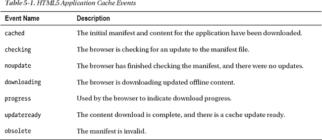
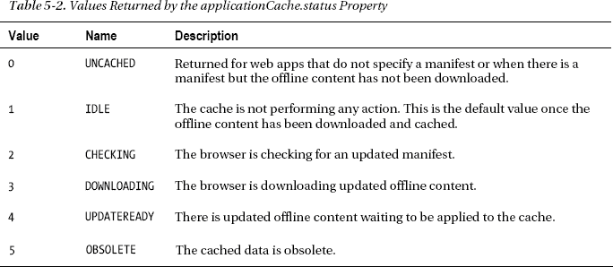
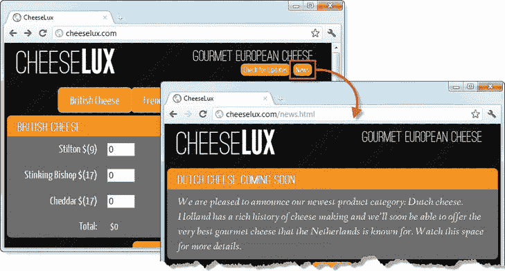
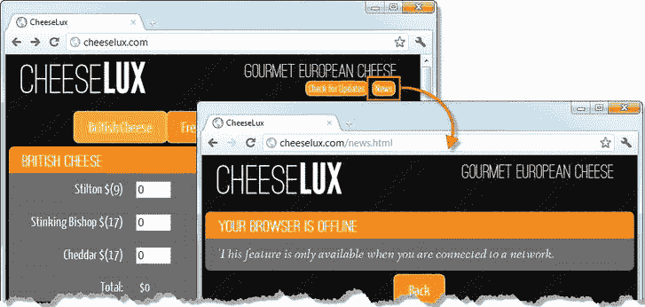

## T1】C H A P T E R 5

## 创建离线 Web 应用

HTML5 规范包括对*应用缓存*的支持，该缓存用于创建 web 应用，即使在没有网络连接的情况下，用户也可以使用。如果您的用户需要离线工作或在连接受限的环境中工作(例如在飞机上)，这是非常理想的。

与所有更复杂的 HTML5 特性一样，使用应用缓存并不是一帆风顺的。浏览器之间的实现存在一些差异，您需要注意一些奇怪的地方。在这一章中，我将向你展示如何创建一个有效的离线 web 应用，以及如何避免各种陷阱。

 **注意**浏览器对离线存储的支持还处于初级阶段，有很多不一致的地方。我已经试图指出潜在的问题，但是因为每个浏览器版本都倾向于改进 HTML5 特性的实现，所以当你运行本章中的例子时，你应该期望看到一些变化。

### 重置示例

我将再次简化 CheeseLux 的例子，这样我就不会列出与其他章节相关的大量代码。清单 5-1 显示了修改后的文档。

*清单 5-1。复位 CheeseLux 示例*

`<!DOCTYPE html>
<html>
<head>
    <title>CheeseLux</title>
    <link rel="stylesheet" type="text/css" href="styles.css"/>
        
    
    
    
    
        
    
    <link rel="stylesheet" type="text/css" href="jquery-ui-1.8.16.custom.css"/>
    <noscript>
        <meta http-equiv="refresh" content="0; noscript.html"/>      
    </noscript>    
    
</head>
<body>
    

        
        Gourmet European Cheese
    

    

        

            <a data-bind="formatAttr: {attr: 'href', prefix: '#category/',
               value: category},
            css: {selectedItem: (category == cheeseModel.selectedCategory())}">
                
            </a>
        

    
                

    <form action="/shipping" method="post">
        

            

                

                <!-- ko foreach: items -->
                

                    <label data-bind="attr: {for: id}" class="cheesename">
                        
                         $()</label>
                    <input data-bind="attr: {name: id}, value: quantity"/>
                    
                        ($)
                    
                

                <!-- /ko -->
                **
**
                    **<label class="cheesename">Total:</label>**
                    ****
                        **$**
                    ****                    
                **
**
            

        

        

            <input type="submit" value="Submit Order"/>
        

    </form>
</body>
</html>`

这个例子建立在前面章节的视图模型和路由概念之上，但是我简化了一些功能。我在每一类奶酪的底部增加了一个`total`显示屏，而不是一个篮子。我已经将创建可观察视图模型项目的代码移到了`utils.js`文件中一个名为`enhanceViewModel`的函数中。清单中的其他内容应该是不言自明的。

### 使用 HTML5 应用缓存

使用应用缓存的起点是创建一个*清单*。这告诉浏览器脱机运行应用需要哪些文件，以便浏览器可以确保它们都存在于缓存中。清单文件的后缀是`appcache`，所以我将清单文件命名为`cheeselux.appcache`。你可以在[清单 5-2](#list_5_2) 中看到这个文件的内容。

*清单 5-2。一个简单的清单文件*

`CACHE MANIFEST

# HTML document
example.html
offline.html

# script files
jquery-1.7.1.js
jquery-ui-1.8.16.custom.js
knockout-2.0.0.js
signals.js
crossroads.js
hasher.js
utils.js

# CSS files
styles.css
jquery-ui-1.8.16.custom.css

# images
**#blackwave.png**
cheeselux.png
img/ui-bg_flat_75_eb8f00_40x100.png
img/ui-bg_flat_75_fbbe03_40x100.png
img/ui-icons_ffffff_256x240.png
img/ui-bg_flat_75_595959_40x100.png
img/ui-bg_flat_65_fbbe03_40x100.png

# fonts
fonts/YanoneKaffeesatz-Regular.ttf
fonts/fanwood_italic-webfont.ttf
fonts/ostrich-rounded-webfont.woff`

一个基本的清单文件以`CACHE MANIFEST`头开始，然后列出应用需要的所有文件，包括 HTML 文件，其`html`元素包含`manifest`属性(稍后讨论)。在清单中，我按照类型对文件进行了分类，并使用了注释(以`#`字符开始的行)来更容易地判断发生了什么。

 **提示**您会注意到我已经注释掉了`blackwave.png`文件的条目。我用这个文件来演示一个缓存应用的行为。

清单通过`html`元素的`manifest`属性添加到 HTML 文档中，如[清单 5-3](#list_5_3) 所示。

*清单 5-3。将清单添加到 HTML 文档*

`<!DOCTYPE html>
<html **manifest="cheeselux.appcache">**
    <head>
        ...
    </head>
    <body>
        ...
    </body>
</html>`

当加载 HTML 文档时，浏览器检测到`manifest`属性，从 web 服务器请求指定的`appcache`文件，并开始加载和缓存清单文件中列出的每个文件。浏览器处理清单时下载的文件被称为*离线内容*。有些浏览器会提示用户是否允许存储脱机内容。

 **注意**创建清单时要小心。如果不能从服务器获得任何列出的项目，那么浏览器根本不会缓存该应用。

#### 了解何时使用缓存内容

浏览器第一次加载离线内容时不会使用它。它将被缓存，以备下次用户加载或重新加载页面时使用。*这个名字线下内容*有误导性。一旦浏览器有了 web 应用的离线内容，无论用户何时访问 web 应用的 URL，都将使用它，即使有可用的网络连接。浏览器负责确保使用最新版本的离线内容，但正如您将了解到的，这是一个复杂的过程，需要一些程序员的干预。

我注释掉了清单中的`blackwave.png`文件，以演示浏览器如何处理离线内容。我使用`blackwave.png`作为 CheeseLux web 应用的背景图像，这给了我一个演示缓存 web 应用的基本行为的好方法。

首先，将`manifest`属性添加到清单 5-3 所示的示例中，并将文档加载到浏览器中。不同的浏览器以不同的方式处理缓存的应用。例如，Google Chrome 会悄悄地处理清单，并开始下载它指定的内容。Mozilla Firefox 通常会提示用户允许离线内容，如图[图 5-1](#fig_5_1) 所示。如果您使用的是 Firefox，请单击“允许”按钮启动浏览器处理清单。

*图 5-1。Firefox 提示用户允许网络应用在本地存储数据*

 **提示**所有主流浏览器都允许用户禁用缓存应用，这意味着即使浏览器实现了这一功能，你也不能指望能够存储数据。在这种情况下，应用清单将被忽略。您可能需要更改浏览器的配置来缓存示例内容。

您应该会看到 CheeseLux web 应用的黑色背景。此时，浏览器有两个 web 应用的副本。第一个副本在常规浏览器缓存中，这是当前运行的版本。第二个副本位于应用缓存中，包含清单中指定的项。只需重新加载页面，切换到应用缓存版本。当你重新加载时，背景将是白色的，如图[图 5-2](#fig_5_2) 所示。

*图 5-2。切换到应用缓存*

这种差异是由于清单中的文件`blackwave.png`被注释掉了。浏览器将应用缓存和常规缓存分开，这意味着即使它在常规缓存中有一个`blackwave.png`文件，它也不会将它用于缓存的应用。

 **提示**注意你没有对网络连接做任何事情。浏览器仍然在线，但是应用是单独使用离线内容加载的。这是我很快会谈到的。

#### 接受对清单的更改

缓存应用在行为上最显著的变化是刷新网页不会导致应用内容被缓存。这个想法是，需要管理对缓存应用的更新，以避免不一致的更改。例如，取消清单中的`blackwave.png`行的注释并重新加载不会将背景改为黑色。

清单 5-4 显示了 web 应用支持更新所需的最少代码量。在本章的后面，我将向您展示如何使用更多的应用缓存 API，但是在我们进一步深入之前，我们需要这些更改。

*清单 5-4。接受清单中的更改*

`...

...`

HTML5 应用缓存 API 是通过`window.applicationCache`浏览器对象来表达的。这个对象触发事件来通知 web 应用缓存状态的变化。目前对我们来说最重要的是`updateready`事件，这意味着有更新的缓存数据可用。除了事件之外，`applicationCache`对象还定义了一些有用的方法和属性。同样，我将在本章后面回到这些，但是我现在关心的方法是`swapCache`，它将更新的清单及其内容应用到应用缓存。

现在，我已经准备好演示如何更新缓存的 web 应用了。但在此之前，我必须删除现有的缓存数据。我通过应用清单而没有添加对`swapCache`方法的调用，创建了一个僵尸 web 应用，我没有办法让更新生效。我需要清空缓存并重新开始。使用 JavaScript 无法清除缓存，浏览器有不同的机制来手动清除应用缓存数据。对于谷歌浏览器，你删除了定期浏览历史。对于 Mozilla Firefox，您必须选择高级网络选项选项卡，从列表中选择网站，然后单击删除按钮。

清除应用缓存后，重新加载清单以加载清单并缓存数据。再次重新加载页面，切换到应用的缓存版本(背景为白色)。

最后，您可以取消对`cheeselux.appcache`文件中的`blackwave.png`条目的注释。此时，您将需要重新加载网页*两次*。第一次使浏览器检查更新的清单，发现有新版本，并将更新的资源下载到缓存中。此时，`updateready`事件被触发，我的脚本调用`swapCache`方法，将更新应用到缓存中。这些更改要到下次加载 web 应用时才会生效，这就是为什么需要第二次重新加载的原因。这是一种笨拙的方法，但是我将很快向您展示如何改进它。在这一点上，缓存将被更新为包含`blackwave.png`文件的清单，web 应用背景将变成黑色。

 **提示**浏览器仅检查清单文件是否已更改。对单个资源(包括 HTML 和脚本文件)的更改将被忽略，除非清单也发生了更改。如果清单已经更改，那么浏览器将检查单个资源自上次下载以来是否已经更新(当然，将下载已经添加到清单中的任何资源)。

#### 控制缓存更新过程

我带你绕远路更新，因为我想强调的方式，浏览器试图隔离我们不得不处理不一致的缓存。JavaScript web 应用在运行时没有标准的方法来响应缓存更改，因此 HTML5 应用缓存标准过于谨慎，只有在加载应用时才会应用缓存更新。

总有一天，您会开始出现奇怪的行为，并且您对清单或应用所做的任何更改都不会解决问题。发生这种情况时，最简单的方法就是清除浏览器历史记录和应用缓存内容，看看问题是否仍然存在。大多数时候，我发现行为的突然变化是由浏览器引起的，重新开始可以解决问题(尽管这有时需要使用文件浏览器直接从磁盘中清除文件，因为浏览器管理应用缓存的能力也会出错)。

我们可以使用`applicationCache` browser 对象以更优雅的方式管理缓存的应用。我们可以做的第一件事是监控缓存的状态，并为用户提供一些选项。清单 5-5 展示了如何做到这一点。

*清单 5-5。主动控制应用缓存*

`<!DOCTYPE html>
<html manifest="cheeselux.appcache">
<head>
    <title>CheeseLux</title>
    <link rel="stylesheet" type="text/css" href="styles.css"/>
        
    
    
    
    
        
    
    <link rel="stylesheet" type="text/css" href="jquery-ui-1.8.16.custom.css"/>
    <noscript>
        <meta http-equiv="refresh" content="0; noscript.html"/>      
    </noscript>    
    
</head>
<body>
    <**div id="logobar">
        
        

            Gourmet European Cheese
            

                <a data-bind="visible: cheeseModel.cache.status() != 4"
                   data-action="update" class="cachelink">Check for Updates</a>
                <a data-bind="visible: cheeseModel.cache.status() == 4"
                   data-action="swapCache" class="cachelink">Apply Update</a>
            

        

    
**

    

        

            <a data-bind="formatAttr: {attr: 'href', prefix: '#category/',
               value: category},
            css: {selectedItem: (category == cheeseModel.selectedCategory())}">
                
            </a>
        

    
                

    <form action="/shipping" method="post">
        

            

                

                <!-- ko foreach: items -->
                

                    <label data-bind="attr: {for: id}" class="cheesename">
                        
                         $()</label>
                    <input data-bind="attr: {name: id}, value: quantity"/>
                    
                        ($)
                    
                

                <!-- /ko -->
                

                    <label class="cheesename">Total:</label>
                    
                        $
                                        
                

            

        

        

            <input type="submit" value="Submit Order"/>
        

    </form>
</body>
</html>`

首先，我向视图模型添加了一个新的可观察数据项，它代表应用缓存的状态:

`cache: {
    status: ko.observable(window.applicationCache.status)    
}`

我使用视图模型是因为我想使用数据绑定将状态传播到 HTML 标记中。为了保持值是最新的，我订阅了一组由`window.applicationCache`对象触发的事件，如下所示:

`$(window.applicationCache).bind("**checking noupdate downloading " +**
    **"progress cached updateready"**, function(e) {
        cheeseModel.cache.status(**window.applicationCache.status);**
});`

七个缓存事件可用。我已将它们列在[表 5-1](#tab_5_1) 中。我使用了`bind`方法来处理其中的六个，因为第七个方法`obsolete`仅在清单文件无法从 web 服务器获得时出现。

当我收到一个应用缓存事件时，我更新了视图模型中的`cache.status`数据项。当前状态可从`window.applicationCache.status`属性获得，我已经在[表 5-2](#tab_5_2) 中描述了返回值的范围。

如您所见，`status`值对应于一些应用缓存事件。对于这个例子，我只关心`UPDATEREADY`状态值，我用它来控制我添加到页面徽标区域的一些`a`元素的可见性:

`

    <a **data-bind="visible: cheeseModel.cache.status() != 4"**
        data-action="update" class="cachelink">Check for Updates</a>
    <a **data-bind="visible: cheeseModel.cache.status() == 4"**
        data-action="swapCache" class="cachelink">Apply Update</a>

`

当缓存空闲时，我显示提示用户检查更新的元素，当有可用的更新时，我提示用户安装它。[图 5-3](#fig_5_3) 显示了这两个按钮的原位。

*图 5-3。添加按钮控制缓存*

如图所示，我已经使用 jQuery UI 从`a`元素创建了按钮。我还使用 jQuery `click`方法为`click`事件注册了一个处理程序，如下所示:

`$('div.tagcontainer a').button().click(function(e) {
    **e.preventDefault();**
    **if ($(this).attr("data-action") == "update") {**
        **window.applicationCache.update();**
    **} else {**                    
        **window.applicationCache.swapCache();**
        **window.location.reload(false);**                    
    **}**
});            `

我使用常规的 JavaScript 事件来控制缓存，因为我希望用户能够反复检查更新。浏览器忽略导航到正在显示的同一内部 URL 的请求。你可以看到这种情况发生，如果你点击一个奶酪类别按钮。重复单击同一个按钮不会做任何事情，该按钮实际上是禁用的，直到选择另一个类别。如果我使用 URL 路由来处理缓存按钮，那么用户将能够检查一次更新，然后不能再次这样做，直到他们导航到另一个内部 URL(在这个例子中需要选择一个奶酪类别)。因此，我使用了 JavaScript 事件，每次点击按钮时都会触发这些事件，而不考虑应用的其他状态。

当单击任一缓存按钮时，我会读取`data-action`属性的值。如果属性值是`update`，那么我调用缓存`update`方法。这将导致浏览器检查服务器以查看清单是否已更改。如果是，那么缓存的状态将变为`UPDATEREADY`，并且 Apply Update 按钮将显示给用户。

当点击 Apply Update 按钮时，我调用`swapCache`方法将更新推入应用缓存。这些更新直到应用重新加载后才会生效，这是我通过调用`window.location.reload`方法强制实现的。这意味着更新会应用到缓存中，并立即用于响应用户的单个操作。测试这些添加的最简单的方法是在清单中切换`blackwave.png`映像的状态，并应用结果更新。如果您想测试更多实质性的更改，请参阅缓存控制标题上的信息。

**应用缓存条目和缓存控制头**

调用`applicationCache`方法并不总是导致浏览器联系服务器来查看清单是否已经改变。所有主流浏览器都支持 HTTP `Cache-Control`头，并且只有在清单到期时才会检查更新。

此外，即使清单*已经*改变，浏览器也认可单个清单项目的`Cache-Control`值。这可能会导致这样的情况:如果清单在受影响资源的`Cache-Control`生命周期内发生变化，则忽略对 HTML 或脚本文件的更新。

在生产中，这种行为是完全合理的。但在开发和测试期间，这是一个巨大的痛苦，因为对 HTML 和脚本文件内容的更改不会立即反映在更新中。为了解决这个问题，我在 Node.js 服务器提供的内容上设置了非常短的缓存寿命。您需要做一些类似于您的开发服务器的事情来获得相同的效果。

#### 向清单添加网络和回退条目

常规清单条目告诉浏览器主动获取并缓存 web 应用所需的资源。此外，应用缓存支持另外两种清单条目类型:*网络*和*回退*条目。网络条目，也称为*白名单条目*，指定浏览器不应该缓存的资源。当浏览器在线时，对这些资源的请求将总是导致对服务器的请求。这有助于确保用户始终收到文件的最新版本，即使应用的其余部分已被缓存。

回退条目告诉浏览器当浏览器离线并且用户请求网络条目时该做什么。回退条目允许您替换替代文件，而不是向用户显示错误。清单 5-6 展示了在`cheeselux.appcache`文件中两种条目的使用。

*清单 5-6。使用应用清单中的网络条目*

`CACHE MANIFEST

# HTML document
example.html

# script files
jquery-1.7.1.js
jquery-ui-1.8.16.custom.js
knockout-2.0.0.js
signals.js
crossroads.js
hasher.js
utils.js

# CSS files
styles.css
jquery-ui-1.8.16.custom.css

# images
blackwave.png
cheeselux.png
img/ui-bg_flat_75_eb8f00_40x100.png
img/ui-bg_flat_75_fbbe03_40x100.png
img/ui-icons_ffffff_256x240.png
img/ui-bg_flat_75_595959_40x100.png
img/ui-bg_flat_65_fbbe03_40x100.png

# fonts
fonts/YanoneKaffeesatz-Regular.ttf
fonts/fanwood_italic-webfont.ttf
fonts/ostrich-rounded-webfont.woff

**NETWORK:**
**news.html**`

网络条目的前缀是单词`NETWORK`和冒号(`:`)。与常规条目一样，每个资源占用一行。在这个清单中，我为文件`news.html`创建了一个网络条目。我在`example.html`文件中创建了一个链接到该文件的按钮，如下所示:

`

    
    

        Gourmet European Cheese
        

            <a data-bind="visible: cheeseModel.cache.status() != 4"
               data-action="update" class="cachelink">Check for Updates</a>
            <a data-bind="visible: cheeseModel.cache.status() == 4"
               data-action="swapCache" class="cachelink">Apply Update</a>
            **<a class="cachelink" href="news.html">News</a>**                
        

    

`

当浏览器在线时，点击此链接显示`news.html`文件。你可以在[图 5-4](#fig_5_4) 中看到效果。

*图 5-4。链接到 news.html 页面*

因为它在`NETWORK`部分，所以`news.html`文件永远不会被添加到应用缓存中。当我单击“新闻”按钮时，浏览器的行为与常规内容一样。它联系服务器，获取资源，并将它们添加到常规(非应用)缓存中，然后将它们显示给用户。我可以对`news.html`文件进行更改，即使应用缓存没有更新，这些更改也会显示给用户。

当浏览器离线时，无法获得不在应用缓存中的内容。这就是`FALLBACK`条目出现的地方。这些条目的格式与其他条目不同。

 **警告**浏览器对离线意味着什么有不同的看法。我将在本章后面的“监视脱机状态”一节中详细解释这一点。

第一部分指定资源的前缀，第二部分指定在浏览器脱机时请求与前缀匹配的资源时要使用的文件。因此，在[清单 5-7](#list_5_7) 中，我已经设置了清单，因此任何对任何 URL(由`/`表示)的请求都应该被给予文件`offline.html`。

*清单 5-7。在应用清单中使用后备条目*

`...
# fonts
fonts/YanoneKaffeesatz-Regular.ttf
fonts/fanwood_italic-webfont.ttf
fonts/ostrich-rounded-webfont.woff

**FALLBACK:**
**/ offline.html**`

 **提示**浏览器对网络中资源的回退处理不一致。您不应该依赖回退部分来为网络部分中列出的 URL 提供替代内容，而应该只为清单主要部分中的 URL 提供替代内容。对单个文件提供回退的支持也是不一致的，这就是为什么我在本章的例子中使用了尽可能广泛的回退。我希望随着 HTML5 实现的稳定，这些特性的可靠性和一致性会提高。

当浏览器脱机时，单击“新闻”按钮会触发对浏览器无法从应用缓存提供服务的 URL 的请求，而使用回退条目。你可以在[图 5-5](#fig_5_5) 中看到结果。浏览器地址栏中的 URL 显示请求的 URL，但显示的内容来自后备资源。

*图 5-5。使用回退条目*

HTML5 应用缓存规范支持更复杂的回退条目，包括每个 URL 的回退和通配符的使用。然而，在我写这篇文章的时候，Google Chrome 不支持这些条目，只有一个通用的后备选项，比如我在清单中展示的，才是可靠的。

对于浏览器是否应该使用常规内容缓存来满足对网络入口资源的请求，HTML5 应用缓存功能的规范并不明确。当然，采取了不同的方法。谷歌 Chrome 对该标准做了最字面的解释。当浏览器离线时，网络入口资源对 web 应用不可用。Mozilla Firefox 和 Opera 采取了一种更宽容的方法:如果浏览器离线时资源在主浏览器缓存中，它将可供 web 应用使用。当然，浏览器经常更新，所以当你读到这篇文章时，可能会有不同的行为。

 **注意**网络和回退功能的实现可能不一致。主流浏览器的实现有些奇怪，因此，我倾向于避免在缓存应用中使用这类条目。然而，常规缓存条目工作得很好，并且可以在那些支持应用缓存特性的浏览器中使用。

### 监控离线状态

HTML5 定义了确定浏览器是否在线的能力。离线意味着什么取决于平台和浏览器。对于移动设备，离线通常需要用户切换到飞行模式，或者以其他方式明确关闭网络。仅仅是不在覆盖范围内通常不会改变浏览器的状态。

大多数桌面浏览器也需要明确的用户操作。例如，Firefox 和 Opera 都有在在线和离线模式之间切换浏览器的菜单项。谷歌 Chrome 是一个例外，它可以监控底层网络连接，如果没有网络设备，它就会切换到离线状态。

 **注意** Chrome 只有在没有启用网络连接的情况下才会进入离线模式。为了创建本节中的屏幕截图，我必须禁用我的主(无线)连接，手动禁用一个已启用但未插入任何东西的以太网端口，*和*禁用一个由虚拟机包创建的连接。直到那时，Chrome 才决定是时候下线了。大多数用户不会有这个问题，但这是要记住的事情，特别是如果你没有得到你期望的离线行为。

主流浏览器的最新版本实现了一个 HTML5 特性，可以报告浏览器是在线还是离线。这对于向用户呈现有用的上下文界面以及管理 web 应用的内部操作都很有用。为了演示这个特性，我将更改示例 web 应用，以便仅当浏览器在线时才显示缓存控件和新闻按钮。[清单 5-8](#list_5_8) 显示了对`script`元素的修改。

*清单 5-8。检测网络状态*

``

`window`浏览器对象支持浏览器状态改变时触发的`online`和`offline`事件。可以通过`window.navigator.onLine`属性获取当前状态，如果浏览器是`online`则返回 true，如果是`offline`则返回 false。注意`onLine`中的`L`是大写的。我已经向视图模型添加了一个`online`可观察数据项，我更新它以响应`online`和`offline`事件。这与我用于应用缓存状态的技术相同，它允许我使用视图模型将更改传播到我的标记。[清单 5-9](#list_5_9) 显示了显示新闻和应用缓存控制按钮的 HTML 元素的变化。

*清单 5-9。添加元素和绑定以响应浏览器在线状态*

`

    
    

        Gourmet European Cheese
        

            ****
                <a data-bind="visible: cheeseModel.cache.status() != 4"
                   data-action="update" class="cachelink">Check for Updates</a>
                <a data-bind="visible: cheeseModel.cache.status() == 4"
                   data-action="swapCache" class="cachelink">Apply Update</a>
                <a class="cachelink" href="/news.html">News</a>                                
            ****
            ****
                **(Offline)**
            ****            
        

    

`

当浏览器联机时，将显示缓存控件和新闻按钮。当浏览器离线时，我用一个简单的占位符替换按钮。你可以在[图 5-6](#fig_5_6) 中看到效果。

 **提示**在让浏览器离线之前，你需要确保你拥有离线内容的正确版本。在运行此示例之前，您应该更改清单或清除浏览器的历史记录。

*图 5-6。响应浏览器在线状态*

**使用递归 AJAX 请求聚合填充**

有一些 JavaScript polyfill 库可以使用定期的 Ajax 请求来替代`navigator.onLine`属性。每隔几分钟就会向服务器请求一个小文件，如果请求失败，则认为浏览器处于脱机状态。

我强烈建议避免这种方法。首先，它没有足够的响应能力。如果你想知道浏览器何时离线，在离线几分钟后发现是没有多大用处的。在两次测试之间，浏览器的状态是未知的，也是不可靠的。

第二，重复请求一个文件会消耗你和用户必须支付的带宽。如果您有一个流行的 web 应用，定期检查的带宽成本可能会很大。更重要的是，随着移动设备的无限数据计划变得越来越不常见，假设你可以免费使用你的用户的带宽是极其放肆的。我的建议是不要依赖这种聚合填充物。如果浏览器不支持通知，就不要通知。

### 了解 Ajax 和 POST 请求

应用缓存使得使用 Ajax 变得困难，更广泛地说，是发布表单。当浏览器离线时，情况会变得更糟，尽管可能不是你所期望的那样。在这一节中，我将向您展示这些问题以及处理这些问题的有限选择。然而，首先，我需要更新 CheeseLux web 应用，以便它依赖于 Ajax GET 请求来操作。[清单 5-10](#list_5_10) 显示了对`script`元素的必要修改(本例中不需要修改标记)。

*清单 5-10。添加一个 Ajax 请求请求*

`...

...`

在这个清单中，我使用了 jQuery `getJSON`方法。这是一个方便的方法，它让 Ajax GET 请求第一个方法参数指定的 JSON 文件，在本例中是`products.json`。当 Ajax 请求完成时，jQuery 解析 JSON 数据以创建一个 JavaScript 对象，该对象被传递给第二个方法参数指定的函数。在我的清单中，该函数简单地获取 JavaScript 对象，并将其分配给视图模型的`products`属性。`products.json`文件包含我已经内联定义的数据的超集。定义了相同的类别、产品和价格，以及每种奶酪的附加描述。清单 5-11 显示了来自`products.json`的摘录。

*清单 5-11。products.json 文件的摘录*

`...
{"id": "stilton", "name": "Stilton", "price": 9,
"description": "A semi-soft blue cow's milk cheese produced in the Nottinghamshire region. A strong cheese with a distinctive smell and taste and crumbly texture."},
...`

在清单中，我用对`success`的调用链接了`getJSON`方法。`success`方法是 jQuery 支持 JavaScript *承诺*的一部分，这使得使用和管理像 Ajax 请求这样的异步操作变得容易。传递给`success`方法的函数在`getJSON`方法完成之前不会被执行，确保我的视图模型在脚本的其余部分运行之前完成。

这种从 JSON 获取核心数据的方法很常见，尤其是当数据来源于 web 应用其他部分的不同系统时。而且，如果小心使用，它可以确保用户拥有最新的数据，但仍然具有缓存应用的好处。

#### 了解默认的 Ajax GET 行为

浏览器以非常简单的方式处理 Ajax GET 请求。如果 Ajax 请求的资源不在清单中，即使浏览器在线，请求也会失败。

对于我的示例应用来说，这意味着数据从请求中返回，并且它死得很难看。我作为参数传递给`getJSON`方法的函数只有在 Ajax 请求成功时才会执行，传递给`success`方法的函数也是如此。因为两个函数都没有执行，所以我的`script`代码的主要部分没有执行，我让用户束手无策。更糟糕的是，因为应用缓存控制按钮从来没有设置过，所以我没有给用户一个更新应用来解决问题的方法。

我展示了这个场景，因为这是程序员第一次开始使用应用缓存时经常遇到的情况。我将很快向您展示如何使 Ajax 连接工作，但是首先，有几个重要的变化要做。

##### 重构应用

第一个变化是构建应用，以便让用户摆脱困境的核心行为总是被执行。我最初的清单过于乐观，我需要将那些应该一直运行的代码部分分开。有很多不同的技术可以做到这一点，但是我发现最简单的是创建另一个依赖于 jQuery `ready`事件的函数。[清单 5-12](#list_5_12) 显示了我需要对`script`元素进行的修改。

*清单 5-12。重组脚本元素*

`...

...`

我将所有与成功的 Ajax 请求无关的代码放在一起，放在传递给`complete`方法的函数中，我将它添加到方法调用链中。这个函数将在 Ajax 请求完成时执行，不管它是成功还是失败。

现在，即使 Ajax 请求失败，更新缓存和应用更改的控件也总是可用的。鉴于 Ajax 问题最有可能是客户端出错的原因，为用户提供一种应用更新的方式是至关重要的。否则，您必须提供每个浏览器的指令来清除缓存。这不是一个完美的解决方案，因为我无法应用我的数据绑定，所以我宁愿隐藏的元素是可见的。我可以使用 CSS `display`属性来隐藏其中的一些项目，但是我认为让用户能够下载和应用更新才是最重要的。在[图 5-7](#fig_5_7) 中可以看到重组前后的效果。

*图 5-7。重组应用的效果*

##### 处理 Ajax 错误

我需要做的另一个改变是添加某种错误处理程序，以应对 Ajax 请求失败的情况。这似乎是一个基本的技术，但是许多 web 应用都是为了成功而编写的，当连接失败时，一切都会崩溃。有很多方法可以处理 Ajax 错误，但是清单 5-13 中显示的方法使用了一些 jQuery 特性。

*清单 5-13。增加对处理 Ajax 错误的支持*

``

jQuery 使得用`error`方法处理错误变得很容易。这是 Promises 特性的另一部分，如果请求有问题，传递给`error`方法的函数将被执行。在这个例子中，我创建了一个简单的 jQuery UI 对话框，告诉用户有问题。

#### 将 Ajax URL 添加到主清单或回退部分

此时最糟糕的事情是将 Ajax URL 添加到清单的主要部分。浏览器会像对待任何其他资源一样对待 URL，在处理清单时下载并缓存内容。当客户端发出 Ajax 请求时，浏览器将从应用缓存中返回内容，直到清单更改触发缓存更新，数据才会更新。这样做的结果是，您的用户将使用陈旧的数据，这通常与最初发出 Ajax 请求的原因相反。

如果您将 URL 添加到`FALLBACK`部分，您会得到几乎相同的结果。每个请求，即使当浏览器在线时，也将由您设置为后备的任何内容来满足，并且不会向服务器发出任何请求。

#### 将 Ajax URL 添加到清单网络部分

最好的方法(尽管远非理想)是将 Ajax URL 添加到清单的`NETWORK`部分。当浏览器在线时，Ajax 请求将被传递给服务器，最新的数据将呈现给用户。

当浏览器离线时，问题就出现了。在离线浏览器中处理 Ajax 请求有两种不同的方法。第一种方法，你可以在 Google Chrome 中看到，是 Ajax 请求会失败。您的 Ajax 错误处理程序将被调用，这是一个干净的失败。

另一种方法可以在 Firefox 中看到。当浏览器离线时，如果可能的话，将使用主浏览器缓存来处理 Ajax 请求。这就造成了一种奇怪的情况，如果在浏览器离线之前请求了同一个 URL，用户将得到陈旧的数据，如果这是第一次请求该 URL，将得到一个错误。

#### 了解发布请求行为

POST 请求的处理方式比 GET 请求更加一致。如果浏览器在线，那么将向服务器发出 POST 请求。如果浏览器离线，那么请求将失败。对于使用常规 HTML 发出的 POST 请求和使用 Ajax 发出的 POST 请求来说都是如此。

这导致了用户的烦恼，因为发布表单通常是在他们一段时间的活动之后。在 CheeseLux 示例中，用户将翻阅类别并输入他们需要的每种产品的数量。当他们提交订单时，浏览器会显示一个错误页面。您甚至不能使用清单的`FALLBACK`部分来指定要显示的页面，而不是错误。

唯一明智的做法是拦截表单提交，并使用`navigator.onLine`属性和事件来监控浏览器状态，防止用户在浏览器离线时试图发布内容。在第六章中，我将向你展示一些保存用户努力结果的技巧，为浏览器重新上线做好准备。

### 总结

在本章中，我向你展示了如何使用 HTML5 应用缓存来创建离线应用。通过使用应用缓存，即使用户没有网络连接，您也可以创建可用的应用。尽管应用缓存的核心得到了很好的支持，但仍有一些异常，需要仔细的设计和测试才能得到可靠和健壮的结果。在下一章，我将向你展示如何使用一些相关的功能来帮助消除离线应用的一些粗糙边缘，并可以用来为用户创造更好的体验。