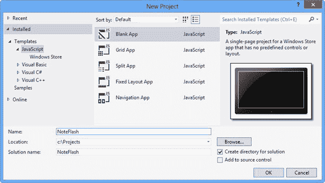
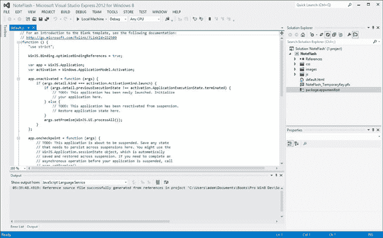
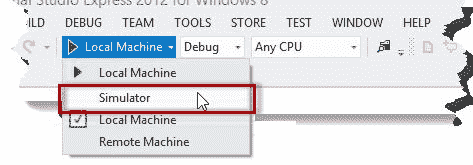
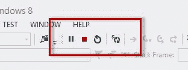
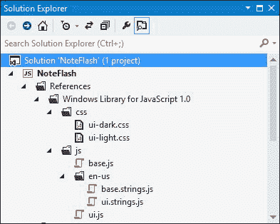
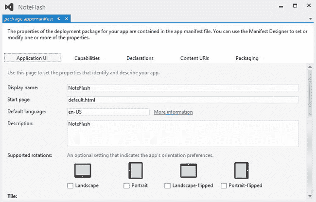
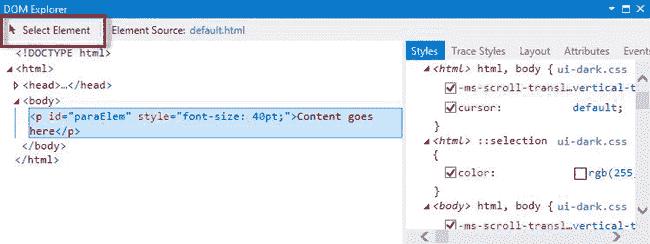
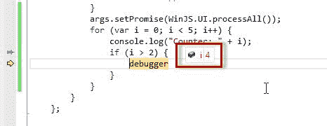

# 二、入门指南

在开始开发应用之前，您需要启动并运行 Windows 8 和开发工具。

在这一章中，我将带您完成正确软件的安装过程，并带您完成为 Windows 8 应用创建 Visual Studio 项目的过程，带您浏览它包含的文件和 Visual Studio 提供的工具。

### 准备就绪

你不需要一台特别高端的电脑来进行应用开发——任何满足最低 Windows 8 规格的电脑都可以。在开发中，更快的机器让开发变得更愉快，但是你不需要任何强大的东西。

 **提示**如果你正在购买一台用于 Windows 8 应用开发的电脑，我建议你把大部分的钱花在获得你能找到的最大的屏幕上。对于编写应用来说，没有什么屏幕是太大的——对我来说，最棒的是能够并排编辑 JavaScript 文件、HTML 文件和 CSS 文件，并且仍然有足够的空间来容纳 Visual Studio 界面的其余部分(我将很快向您展示)。你的下一个重点应该是记忆。最不重要的组件是 CPU:今天的 CPU 都非常强大，即使是更便宜的型号也能够应付 Visual Studio 的应用开发。

如果你想在承诺之前看看应用开发是什么样的，你可以获得 Windows 8 的 90 天免费试用。你可以在这里获得 Windows 8 评估版:`[http://msdn.microsoft.com/en-us/evalcenter](http://msdn.microsoft.com/en-us/evalcenter)`。点击`Windows and Platform Development`部分的`Release`链接，你会找到你需要的东西。

您需要创建一个 Microsoft 帐户来获得评估，但无论如何您都需要一个帐户来设置为开发人员。Microsoft 帐户可以免费创建，如果您还没有帐户，可以按照说明进行操作。

 **提示**如果你要从早期版本的 Windows 系统升级，微软会提供相当不错的折扣。如果你是学生或者你在一家和微软有协议的公司工作，你也可以得到一份便宜的拷贝。很少有人需要支付 Windows 的全零售价，问问周围的人看看你是否在微软无数计划中的一个之内总是值得的。

#### 准备好 Visual Studio

您还需要一份 Visual Studio 2012。正如我在前一章提到的，微软使 Visual Studio 的一个版本完全免费。它没有一些付费版本包含的所有测试和集成功能，但你不需要这些来创建应用。在所有其他方面，Visual Studio 的免费版本功能齐全，并能满足您的所有需求。如果您有不同版本的 Visual Studio 2012，请不要担心。您不需要您的版本中的所有功能，但是本书中的所有说明和示例都可以工作，没有任何问题或修改。

您可以从`[www.microsoft.com/visualstudio/11/en-us/products/express](http://www.microsoft.com/visualstudio/11/en-us/products/express)`下载 Visual Studio 安装程序。有几种不同的风格可供选择，每一种都可以用来开发特定类型的应用。对于应用开发，您需要 Visual Studio Express 2012 for Windows 8。这些口味的名字非常相似，所以一定要下载正确的。

像安装任何其他应用一样安装 Visual Studio。虽然该软件可以免费使用，但您需要激活它，这需要您之前创建的 Microsoft 帐户。完成这个过程后，您将得到一个 Visual Studio 的激活码。你还需要一个开发者许可，这也是免费的。当您第一次启动 Visual Studio 2012 时，系统会提示您获取许可证，这只需要一秒钟的时间，并且同样需要您之前创建的 Microsoft 帐户。

#### 可选设备

一台 Windows 8 PC 和 Visual Studio 是你编写应用所需要的全部，但是如果你有一台带有方位传感器的设备，一些应用功能就更容易理解了。正如您将在本书的第 2 部分中了解到的，对用户定位设备的方式做出响应是 Windows 8 的一项重要功能，虽然您可以使用 Visual Studio 模拟这种效果，但没有什么可以替代真实的设备。同样，一个带触摸屏的设备将让你开发和测试触摸屏交互——另一个关键的应用功能。这是你可以模拟的其他东西，但是模拟不能代替真实的东西。

 **提示**我用的是戴尔 Latitude Duo，它是平板电脑和笔记本电脑的奇怪混合体。你可以买到便宜的二手货，它们有一个像样的触摸屏和一个方向传感器(尽管这种驱动程序必须从传感器制造商那里找到，而不是从戴尔那里)。我不建议在 Duo 上编码，这对于舒适来说有点太慢了，而且缺少 RAM，但它是一个相当不错的测试机器，我不会没有它。

### 开始使用

一旦你安装了 Windows 8 和 Visual Studio，你就可以开始了。在本节中，我将向您展示如何为一个应用创建一个 Visual Studio 项目，并简要介绍您将使用的工具和功能。如果您使用过另一种集成开发工具，您将会认识到 Visual Studio 的许多关键特性。

#### 创建 Visual Studio 项目

要创建一个新的应用项目，您可以单击 Visual Studio 起始页上的`New Project`链接(当您第一次启动 Visual Studio 2012 时显示),或者从`File`菜单中选择`New Project`。

 **注意**实际上是`FILE`菜单，因为微软已经决定在 Visual Studio 中以大写字母显示菜单，尽管这给人的感觉是你的开发工具在对你大喊大叫。我将只是参考正常情况下的菜单。

你会看到`New Project`对话框，如图[图 2-1](#fig_2_1) 所示。Visual Studio 包括一些模板，可以帮助您开始不同种类的项目，这些模板显示在对话框的左侧。可用的模板集因您使用的 Visual Studio 版本而异。该图显示了可用于 Visual Studio Express 2012 for Windows 的模板，该模板支持四种用于创建应用的编程语言。对于每种语言，都有一些预先填充的模板，用于创建不同的项目。

***图 2-1。**Visual Studio 新建项目对话框窗口*

我明白为什么微软包括这些模板，但它们是相当无用的。对于新程序员来说，面对一个空项目和一个闪烁的光标可能有点令人担忧，但是他们放入这些模板的代码并不是很好，并且除了最简单和最琐碎的项目之外，很少是你想要的那种东西。

 **提示** Visual Studio 支持彩色主题。大多数 Visual Studio 版本的默认主题是深色主题，主要是黑色，在屏幕截图中显示不出来。我已经切换到灯光主题，这就是为什么图中的`New Project`对话框看起来和你在屏幕上看到的不一样。我通过从`Tools`菜单中选择`Options`并改变`Environment`部分的`Color Theme`设置来改变主题。

导航到`Templates` > `JavaScript`部分的`Blank App`模板。`Blank Template`创建一个几乎为空的项目，其中只有运行应用所需的文件，而不会产生任何错误。这是我将在整本书中使用的模板，当我说我创建了一个新项目时，这将永远是我使用过的模板。

在名称字段中输入`NoteFlash`。这是你将在第三章中创建的第一个应用的名称。在这一点上，我不打算做任何严肃的开发，但在本章结束时，你会明白 Windows 8 应用项目中的移动部分是什么，然后你会看到它们如何在第三章中使用。

接下来，单击`Browse`按钮为您的项目选择一个位置。你把文件保存在哪里并不重要，只要你以后能再次找到它们。最后，单击`OK`按钮创建项目。Visual Studio 在生成文件和配置内容时会磨蹭一会儿，然后你会看到项目的初始视图，如图[图 2-2](#fig_2_2) 所示。

***图 2-2。**新项目的初始 Visual Studio 视图*

在接下来的几节中，我将向您展示将在应用开发中使用的最重要的 Visual Studio 特性。其中一些可能有点显而易见，但请继续关注我，因为 Visual Studio 提供了一个紧密集成的开发环境，了解各个部分如何协同工作是很有用的。

#### 运行项目

开始一个新项目的最好地方是运行它，看看它看起来怎么样。在开发过程中运行应用时，您有三种选择。第一种是在你用来写代码的同一台 PC 上运行应用，即本地机器。第二种方法是在 Visual Studio 附带的模拟器中运行应用。最后一个选项是在另一台设备上运行该应用。

在这三个选项中，模拟器是最有用的。在您正在使用的设备上运行应用的问题是，Windows 8 应用是全屏的，它们覆盖了 Visual Studio 和桌面的其余部分。你可以在应用和桌面之间切换，但这是一个笨拙的过程，尤其是当你试图调试某种问题或错误时。

在另一台设备上运行该应用可能非常有用。你需要在设备上下载并安装 Visual Studio 2012 的远程工具，你可以在`[http://msdn.microsoft.com/en-gb/windows/apps/br229516](http://msdn.microsoft.com/en-gb/windows/apps/br229516)`从微软获得。当我想测试某个功能或问题与我的开发机器所不具备的硬件功能(例如触摸屏)之间的关系时，我发现远程运行应用的能力非常有用。我不在常规开发中使用它，因为 Visual Studio 需要几秒钟来打包应用并将其传输到远程设备，过一会儿这就变得令人厌倦了。

 **提示**你不能像使用传统的 Windows 桌面应用那样，将一个应用复制到另一个设备上。微软非常热衷于使用 Windows Store 来部署应用，在你准备好发布之前，最简单的设备测试方法是使用远程工具。

这就剩下第三个选项:Visual Studio 模拟器。这是我在开发过程中测试应用的方式，我建议你也这样做。该模拟器是真实 Windows 8 设备的忠实再现，您可以使用它来模拟一些重要的设备特征，包括设备方向、GPS 位置、触摸和手势输入以及不同的屏幕大小和分辨率。然而，它并不完美，而且有些应用功能你无法在模拟器中正确测试。我会在适当的章节中指出这些特性，这样你就知道如何使用其他方式来运行应用。

您可以使用 Visual Studio 菜单栏选择您希望的应用运行方式。默认情况下，Visual Studio 会在本地机器上运行一个新的项目，但是你可以通过点击图 2-3 中[按钮旁边的箭头来改变。该按钮显示的文本反映了您所做的选择，因此它可能与图形不完全匹配，但您不会错过该按钮，因为它旁边有一个大的绿色箭头。(您需要单击以更改设置的箭头是按钮文本右侧的小向下箭头，而不是绿色箭头)。](#fig_2_3)

***图 2-3。**选择 Visual Studio 运行应用的方式*

从下拉菜单中选择`Simulator`选项，如图所示。做出选择后，单击绿色箭头或按钮文本启动应用。Visual Studio 将启动模拟器，安装您的应用，并开始运行它。你用来创建项目的`Blank App` Visual Studio 模板确实只生成了一个应用的基本结构，所以目前没有太多东西可看——只有一个黑色的屏幕，左上角有一小行文字写着`Content goes here`。暂时忽略这个应用，看看模拟器窗口右边的按钮，我已经在[图 2-4](#fig_2_4) 中显示了。你也可以通过从 Visual Studio `Debug`菜单中选择`Start Debugging`来启动应用——效果是一样的。我将在本章的后面回到 Visual Studio 调试器。

 **注意**当我告诉你启动应用时，我的意思是你应该选择`Start Debugging`菜单项或点击工具栏上的按钮，以便使用调试器。有几个特性需要在没有调试器的情况下进行测试，但是我会在您使用它们的时候说明这一点。在所有其他情况下，您应该确保调试器正在运行。

***图 2-4。**Visual Studio 模拟器*

我在模拟器旁边放大显示了按钮。这些按钮允许您使用模拟器以不同的方式与应用交互，并更改模拟设备的方向。

模拟器按钮按相关功能分组。第一组改变输入法，允许你用鼠标模拟触摸输入。当我向你展示如何处理触摸手势时，你会在第 17 章中看到这些按钮是如何工作的。

第二组允许您模拟顺时针和逆时针旋转设备。我在第 6 章中使用这些按钮向你展示如何创建在设备方向改变时适应的布局。

第三组中唯一的按钮改变屏幕分辨率和像素密度，我在第 6 章中也探讨了这一点。第四组中也只有一个按钮，用于模拟 GPS 数据。在《T2》第 29 章中，当我向你展示如何创建具有位置感知的应用时，你会看到这是如何使用的。最后一个按钮组可以让你截屏模拟器显示的任何内容。我在这本书里不用这些按钮。

**模拟器使用提示**

模拟器的工作方式是在您的开发机器上创建第二个桌面会话，并将其显示在一个窗口中。这是一个巧妙的技巧，但是它有一些值得了解的副作用。如果你有任何问题，有些是有用的，有些是值得注意的。

首先，当您使用 Visual Studio 启动一个应用时，应用包会在本地计算机上安装和执行，并显示在模拟器中。这意味着，如果您愿意，您可以导航到模拟器的开始屏幕或本地计算机上的真正开始屏幕，并在没有 Visual Studio 的情况下启动应用。如果你在运行应用时遇到问题——这种情况时有发生——你通常可以通过进入开始屏幕，找到你正在开发的应用，然后卸载它(右击应用的磁贴并选择`Uninstall`)来解决问题。

第二，一些提供与 Windows 功能集成的应用功能最容易从桌面测试，例如文件激活，我在第 24 章中描述了它。因为 Visual Studio 模拟器正在运行常规的 Windows 会话，所以当您第一次在模拟器中激活桌面时，您设置为自动运行的所有应用都会启动。我发现这导致了一些问题，特别是对于那些希望独占存储位置或管理硬件的应用。我最讨厌的例子是让我重新映射鼠标按钮的软件——当我在模拟器中切换到桌面时，该软件的第二个实例会自动启动，并使我的鼠标无法使用，直到我杀死其中一个进程(由于缺少可用的鼠标，这项工作变得更加复杂)。这些通常不是终端问题，但是如果您在使用模拟器时开始看到奇怪的问题，请记住它运行一个完整的 Windows 会话，包括所有好的和坏的方面。

最后，模拟器创建和显示 Windows 会话的方式意味着，如果在模拟器启动时连接到 VPN，它将不起作用。您可以在模拟器启动后激活 VPN *，一切都会好的。*

##### 控制应用执行

启动应用后，Visual Studio 界面会发生变化，为您提供控制其执行的选项。工具栏上出现一排按钮，如图[图 2-5](#fig_2_5) 所示。

***图 2-5。**在 Visual Studio 中控制应用执行的按钮*

这些按钮可以暂停、停止和重启应用。如果您对项目进行了任何更改，重启按钮将确保在开始执行之前更新应用。第四个按钮(其图标是一个带有两个形成圆圈的箭头的闪电)是重新加载按钮。此按钮可快速重新加载任何已更改的文件，而无需完全停止和重新启动应用。这个特性在开发过程中很有用，例如，当我微调 CSS 布局时，我发现它最有用。如果您在项目中添加或移除文件，或者进行需要重新安装应用的更改(例如更改清单，我将很快介绍)，则无法重新加载—在这些情况下，Visual Studio 将提示您执行重新加载。

 **提示**按钮由 Visual Studio `Debug`菜单上执行相同功能的项目补充。我倾向于使用工具栏按钮，但它们之间没有区别。

### 探索项目

默认情况下，`Solution Explorer`位于 Visual Studio 窗口的右上角，尽管您可以移动它，甚至完全分离它。按照 Visual Studio 的说法，一个*解决方案*是一个或多个*项目*的包装。本书中的所有示例应用都包含在单个项目中，并且在很大程度上，解决方案是 Windows 8 应用之前的开发实践的延续。

`Solution Explorer`提供了对项目中所有文件的访问。`Solution Explorer`显示的大部分条目是 Visual Studio 在您创建项目时生成的文件夹和文件，其他条目是对您的应用所依赖的文件的引用。你可以在[图 2-6](#fig_2_6) 中看到所有文件的更多细节，我将在接下来的章节中解释每个文件的作用和它们的初始内容。

***图 2-6。**解决方案浏览器，显示 Visual Studio 为空白应用模板生成的文件*

要编辑项目中的文件，只需在解决方案资源管理器窗口中双击其条目。您还可以使用图标行正下方的搜索栏在解决方案资源管理器中按名称搜索文件，这在大型复杂的项目中非常有用。(图标本身允许您导航和配置解决方案资源管理器)。

 **提示`Solution Explorer`窗口下面的**是`Properties`窗口。这个窗口在其他种类的开发项目中很重要，但是它对于 JavaScript 应用开发没有任何价值，您可以安全地关闭它，为`Solution Explorer`窗口腾出更多空间，这对大型复杂的项目很有用。您可以通过`View`菜单重新打开任何已关闭的窗口(通过`Other Windows`菜单项可以打开一些不常用的窗口)。

#### 探索项目参考

`Solution Explorer`中显示的第一个条目是项目参考。共有六个参考文件，在[图 2-7](#fig_2_7) 中的`Solution Explorer`中可以看到完全展开的`References`项。

***图 2-7。**解决方案浏览器中显示的项目引用*

引用由 JavaScript 和 CSS 文件组成。这是很重要的一点，因为它展示了 Windows 8 应用对 web 技术的支持是如何深入人心的——以至于用 JavaScript 和 HTML 编写的应用可以使用 Internet Explorer 10 来执行。用户并不知道浏览器被用来运行应用，但它是执行你的应用的引擎。

##### 理解 CSS 引用

`References`部分中的 CSS 文件包含 JavaScript 应用使用的默认样式。有两个主题可以应用到您的应用中。`ui-dark.css`文件包含一个在深色背景上有浅色文本的应用的样式。`ui-light.css`文件包含一个应用的样式，该应用在浅色背景上有深色文本。大多数 Visual Studio 版本默认使用深色主题，并且在`default.html`文件中选择该主题，稍后我将介绍该主题。

大多数应用以其中一个主题开始，然后出于自定义或品牌化目的覆盖选定的样式，但您不必使用任何一个文件，您可以自己创建应用中使用的所有样式。然而，这样做需要大量的工作，并且通过使用一个预定义的主题作为起点，您可以受益于与其他 Windows 8 应用和默认应用外观的一致性。

##### 了解 JavaScript 参考

`base.js`和`ui.js`文件包含创建应用的部分 API。它们组成了 *WinJS API* ，其中包含了特定于 JavaScript 应用开发的对象和函数。还有 *Windows API* ，它包含所有可用于应用开发的编程语言之间共享的对象和函数。

WinJS API 包含许多有用的功能，我在本书的第 2 部分和第 3 部分中解释和演示了这些功能。由于这些都是 JavaScript 文件，你可以打开它们，查看它们的内容，设置调试器断点，并大致了解一下微软是如何实现不同特性的。(Windows API 不是用 JavaScript 编写的，也没有源代码形式。)

粗略地说，`ui.js`文件包含了 *WinJS UI 控件*的代码，这是本书[第 3 部分](pt3.html)的主题，您可以使用它从标准 HTML 元素创建复杂的用户界面控件，就像您使用 jQuery UI 这样的库一样(尽管 UI 控件是专门针对 JavaScript 应用开发的)。`base.js`文件包含用于创建应用基本结构的对象。我将在本书的第 2 部分中向您介绍这些对象，因为我将涉及导航和数据绑定等主题。

另外两个文件`base.strings.js`和`ui.strings.js`，包含显示给用户的文本，针对不同的语言和地区进行了本地化。您不需要直接处理这些文件，因为它们的内容是通过`base.js`和`ui.js`文件自动消费的。

#### 探索默认文件

当您使用`Blank App`模板创建 Visual Studio 项目时，会生成三个默认文件，它们构成了应用的基本结构和初始内容。这些文件是`default.html`(在项目的根文件夹中)`default.css`(在`css`文件夹中)`default.js`(在`js`文件夹中)。这些文件也描述了一个 JavaScript Windows 8 应用项目的基本组织——根文件夹中的 HTML 文件、`css`文件夹中的 CSS 文件和`js`文件夹中的 JavaScript 文件。这种结构是一种建议，并不是强制的，你可以自由地以你喜欢的任何方式组织你的文件——你将在本书中看到我这样做，以使示例应用更容易理解。在接下来的几节中，我将向您展示每个文件的初始内容，并解释关键特征，指出我将在本书后面详细讨论的章节。在本章中我不打算修改这些文件，但是在第三章中，你将使用它们来构建你的第一个真正的应用。

 **注意**你可以重命名或替换这些文件，但我在本书中使用它们作为示例应用，这样你就知道哪些文件是由 Visual Studio 创建的，哪些文件是我添加的。

##### 了解默认 HTML 文件

`default.html`文件在应用启动时加载，负责导入`default.css`和`default.js`文件，这是使用标准的 HTML `link`和`script`元素完成的。这些元素也用于导入`References`文件，为您的应用提供对 WinJS API 和浅色或深色主题 CSS 样式的访问。您可以在清单 2-1 中看到这些元素，它显示了 Visual Studio 生成的`default.html`文件的内容。

***清单 2-1** 。由 Visual Studio 创建的 default.html 文件的初始内容*

`<!DOCTYPE html>
<html>
<head>
    <meta charset="utf-8" />
    <title>NoteFlash</title>

**    <!-- WinJS references -->**
**    <link href="//Microsoft.WinJS.1.0/css/ui-dark.css" rel="stylesheet" />**
**    **
**    **`  `**    <!-- NoteFlash references -->**
**    <link href="/css/default.css" rel="stylesheet" />**
**    **
</head>
<body>
    
Content goes here

</body>
</html>`

我已经突出显示了导入项目和引用文件的元素。当您构建一个应用时，您会想要创建新的 JavaScript 和 CSS 文件，并使用`link`和`script`元素将它们纳入范围，就像在 web 应用中一样。这些文件是按照它们被指定的顺序加载的，这意味着你不能在一个不同的 JavaScript 文件中调用一个函数，除非那个文件的`script`元素已经被处理，并且在一个 CSS 文件中定义的样式可以被随后导入的文件中的样式覆盖。如果你想改变你的应用的主题，你可以改变文档中的第一个`link`元素，这样它就会导入`ui-light.css`文件。

 **提示**对于大多数应用来说，`default.html`文件通常是一个占位符，其他内容将被导入其中，这意味着该文件往往会保持非常简短。我将在[第 5 章](05.html)中解释内容是如何导入的，以及这种方法如何适应应用开发。

##### 了解默认 CSS 文件

当第一次创建时，`default.css`文件包含一些占位符，你可以在[清单 2-2](#list_2_2) 中看到。这个文件中没有定义实际的样式，但是请记住，`ui-dark.css`或`ui-dark.css`文件提供了许多默认的样式。甚至当你开始为你的应用定义自定义样式时，你会发现你最终使用的 CSS 比一个类似的 web 应用要少，因为主题文件包含了基本的东西。

***清单 2-2** 。Visual Studio 创建的 default.css 文件的初始内容*

`body {
}

@media screen and (-ms-view-state: fullscreen-landscape) {
}

@media screen and (-ms-view-state: filled) {
}

@media screen and (-ms-view-state: snapped) {
}

@media screen and (-ms-view-state: fullscreen-portrait) {
}`

在应用中使用`@media`规则来创建适应屏幕方向和分配给应用的空间量的布局(应用可以全屏显示或分配给屏幕的大部分，称为*填充模式*，或分配给屏幕的一小部分，称为*捕捉模式*)。在第 6 章的[中，我解释了所有这些是如何工作的，并提供了不同种类的适应性应用布局的演示。](06.html)

##### 了解默认的 JavaScript 文件

`default.js`文件为应用带来了活力，它使用标准的 HTML DOM 和各种特定于应用的 API 来管理布局并与 Windows 集成。Visual Studio 创建的代码，如清单 2-3 所示，并没有做很多事情，正如我在第 19 章中解释的那样，需要修改才能真正有用。在第 19 章之前，我将在我的示例应用项目中使用该文件的简化版本，届时我将详细解释应用的生命周期，并向您展示如何以一种有用且有意义的方式响应 Windows 发送的系统事件。

***清单 2-3** 。Visual Studio 创建的 default.js 文件的初始内容*

`// For an introduction to the Blank template, see the following documentation:
// http://go.microsoft.com/fwlink/?LinkId=232509
(function () {
    "use strict";

    WinJS.Binding.optimizeBindingReferences = true;

    var app = WinJS.Application;
    var activation = Windows.ApplicationModel.Activation;

    app.onactivated = function (args) {
        if (args.detail.kind === activation.ActivationKind.launch) {
            if (args.detail.previousExecutionState !==
                activation.ApplicationExecutionState.terminated) {
                // TODO: This application has been newly launched. Initialize
                // your application here.
            } else {
                // TODO: This application has been reactivated from suspension.
                // Restore application state here.
            }
            args.setPromise(WinJS.UI.processAll());
        }
    };

    app.oncheckpoint = function (args) {
        // TODO: This application is about to be suspended. Save any state
        // that needs to persist across suspensions here. You might use the
        // WinJS.Application.sessionState object, which is automatically
        // saved and restored across suspension. If you need to complete an
        // asynchronous operation before your application is suspended, call
        // args.setPromise().
    };

    app.start();
})();`

您现在不必理解这个文件的内容——我将在本书的后面解释所有的对象和方法调用。然而，值得理解的是，应用是使用标准 JavaScript 编写的，因此您熟悉的基本对象和数据类型是可用的，标准 DOM API 也是如此，例如，您可以使用它来定位应用标记中的 HTML 元素并注册事件处理程序。在接下来的章节中，你会看到无数的例子。

#### 理解清单

解决方案资源管理器中最后一个感兴趣的文件是`package.appxmanifest`，它是应用的*清单文件*。清单向 Windows 应用商店和 Windows 描述您的应用。清单中的一些信息提供了基本信息，例如用于在“开始”菜单上显示应用的图像。我会在第四章的[中给你展示这些设置。](04.html)

清单中的其他信息更复杂。例如，您使用清单来指示您的应用需要访问的文件系统位置，以及您的应用与哪些 Windows 服务集成。Windows 使用这些信息中的一部分来激活和启动您的应用以响应用户操作，而另一部分则在 Windows 应用商店中呈现给用户，以便他或她可以评估您的应用带来的安全风险。我在整本书中解释了更复杂的设置，但是你可以了解我在第 22 章中给出的例子(在那里我向你展示了如何声明你想要使用的文件系统位置)和在第 23 章 - [26 章](26.html)中给出的例子，在那里我向你展示了如何实现 Windows 集成契约。

清单是一个 XML 文件，但是您不必直接处理 XML。如果双击`package.appxmanifest`文件，Visual Studio 将打开一个可视化编辑器，将清单显示为一系列要填写的表单，由一系列选项卡组织。你可以在图 2-8 的[中看到其中一个标签。(如果您*确实*想要查看 XML，您可以右击`Solution Explorer`中的文件，并从弹出菜单中选择`View Code`。](#fig_2_8)

***图 2-8。**Visual Studio 清单编辑器的应用 UI 标签*

 **提示**`Solution Explorer`显示有一个文件我还没有提到:`NoteFlash_TemporaryKey.pfx`文件。此文件包含一个数字证书，用于在开发过程中自动签署应用包。在发布过程中，您用一个真实的证书替换这个文件，我在本书的第 5 部分中对此进行了描述。

### Visual Studio 工具

在这一节中，我将简要介绍 Visual Studio 的不同部分，您将使用它们来开发应用。我不会详细介绍，因为 Visual Studio 就像任何其他 IDE 一样，您以前已经无数次使用过文本编辑器和调试器。本章的这一节向您展示了如何找到主要的 IDE 构造块，并指出了您自己可能还没有发现的有用功能。

#### Visual Studio 编辑器

双击`Solution Explorer`窗口中的文件，打开编辑器。编辑器做了所有你能想到的事情。编辑器可以适应文件格式，因此您可以无缝地编辑 HTML、CSS 和 JavaScript 文件，并且它可以自动完成所有这三种类型的文件。它对语法进行颜色编码，它知道你可以在 HTML 文件中嵌入 CSS 和 JavaScript，并做出相应的响应。它是一个非常好的程序员编辑器，它做了所有其他程序员编辑器做的事情。

您可以通过从 Visual Studio `Options`菜单中选择`Tools`来配置如何在编辑器中处理每种语言。展开`Text Editor`部分，您将看到一个适用于所有语言的`General`项和一组每种语言的项。您可以控制颜色编码、缩进、自动完成和许多其他特性，以根据您的喜好定制编辑器。

一个值得指出的特性是 Visual Studio 编辑器出色的文本搜索功能。键入`Control+F`会打开一个编辑器内搜索框，您可以使用它来定位当前文件中的项目。每个编辑器窗口都可以使用自己的搜索框进行独立搜索，或者您可以单击向下箭头来扩展搜索范围。我经常使用搜索功能，但当我使用其他 ide 或编辑器时，我很怀念它。

#### JavaScript 控制台

启动应用时，Visual Studio 界面会发生变化。其中一个变化就是会出现`JavaScript Console`窗口。(如果它不可见或者如果您不小心关闭了它，您可以从`Visual Studio Debug`菜单上的`Windows`项手动打开此窗口，但只能在应用运行调试器时打开。)

`JavaScript Console`窗口是最有用的 Visual Studio 功能之一，用于跟踪应用中的问题，它扮演着几个不同的角色。如果从 JavaScript 代码中调用`console.log`方法，您指定的字符串将会显示在`JavaScript Console`窗口中，正如您所期望的那样。

您还可以执行任意 JavaScript 代码，探索应用定义的变量和函数。作为一个简单的例子，我将修改`default.html`文件，使`p`元素具有一个`id`属性，如[清单 2-4](#list_2_4) 所示。

***清单 2-4** 。向 p 元素添加 id 属性*

`<!DOCTYPE html>
<html>` `<head>
    <meta charset="utf-8" />
    <title>NoteFlash</title>

    <!-- WinJS references -->
    <link href="//Microsoft.WinJS.1.0/css/ui-dark.css" rel="stylesheet" />
    
    

    <!-- NoteFlash references -->
    <link href="/css/default.css" rel="stylesheet" />
    
</head>
<body>
**    
Content goes here
**
</body>
</html>`

我突出显示了我修改的元素。启动应用，找到`JavaScript Console`窗口，在窗口底部的文本框中输入以下内容:

* * *

`paraElem.style.fontSize = "40pt"`

* * *

如果你点击回车键，你会看到模拟器窗口中显示的内容被调整为 40 磅，如图 2-9 所示。

***图 2-9。**使用 JavaScript 控制台窗口定位和配置 HTML 元素*

在这个简单的例子中，有几个要点需要注意。首先，JavaScript 控制台为您提供了对应用实时状态的访问。你可以调用任何函数，读取或修改任何变量，改变任何样式。唯一的限制是 JavaScript 变量和函数需要成为全局名称空间的一部分——我将在第 3 章的[中回到这个话题。](03.html)

第二点是，Internet Explorer 允许您通过将 HTML 元素的`id`属性值视为全局变量来定位 HTML 元素。这不是一个标准功能，尽管其他一些浏览器也有类似的功能。我在这本书里经常使用这个特性，这意味着我不必使用冗长的 DOM API(尽管需要明确的是，如果你愿意，你可以在你的应用代码和窗口中使用 DOM API)。`paraElem`变量返回表示 HTML 文档中`p`元素的 DOM 对象，我可以使用标准的`HTMLElement`对象和属性来操作该元素——在本例中，更改`style.fontSize`属性的值来增加文本的大小。

**在应用开发中使用浏览器怪癖**

能够通过 HTML 元素的`id`属性值来定位它们是非常有用的，但是这不是标准的 DOM 特性，所以它被归类为*浏览器怪癖*。在 web 应用开发中，您将学会避免浏览器怪癖，因为您需要支持各种各样的浏览器，并且您不想将您的应用与特定于浏览器的功能绑定在一起。

在应用开发的世界里，事情是不同的。将用于运行 JavaScript Windows 8 应用的唯一浏览器是 Internet Explorer，安装新浏览器，如 Chrome 或 Firefox，对 Windows 8 应用没有任何影响。

这意味着您可以毫无畏惧地使用 Internet Explorer 的怪癖，尽管您可能会质疑这样做是否是好的做法。几个月来，我一直在这个问题上反反复复。最初，我坚持使用标准的 DOM API，尽管我觉得它冗长又烦人。我通过使用`WinJS.Utilities`特性让自己的生活变得更轻松，这就像是 jQuery 的简化版。(你可以在应用项目中使用 jQuery，但我不会在本书中使用——我必须承认，我一般不会在我的 Windows 8 应用项目中使用它。即使我是 jQuery 的超级粉丝，也没有太大的必要——如果你对我的 jQuery 粉丝身份有任何疑问，可以看看我的专业 jQuery 书籍，由 Apress 出版。)

不过，最终我发现我忽略了重要的一点:Windows 8 应用开发*不是* web 应用开发，尽管它有着共同的根源和技术。我是出于习惯而避免那些方便省时的怪癖，而不是因为它们会带来问题。事实上，一些怪癖有助于避免问题——例如，我发现使用全局变量定位元素比使用 DOM API 更不容易出错。

你可以自由选择最适合你的方法——但我建议你审视自己的决定，以确保你不是不必要的教条主义者，就像我开始 Windows 8 应用开发时一样。

在本书中，我通过元素的全局属性来定位元素——有两个例外。当我想清楚地表明我在一个例子中定位一个 HTML 元素时，我使用 DOM API，当我想用 CSS 选择器选择多个元素时，我使用类似 jQuery 的`WinJS.Utilities`特性(我在第 3 章的[中介绍了该特性，并在第 18 章](03.html)的[中详细描述了该特性),这样我可以在一个步骤中对所有元素执行操作。](18.html)

#### DOM Explorer

启动应用时出现的另一个窗口是`DOM Explorer`。这允许您探索应用的 HTML 结构，查看单个元素的框布局属性，并跟踪 CSS 优先规则如何应用于确定元素的样式。`DOM Explorer`窗口在 Visual Studio 的编辑器区域中显示为一个选项卡。我发现自己经常不经意地关闭`DOM Explorer`窗口——如果你也这样做，你可以从 Visual Studio `Debug`菜单的`Windows`项中重新打开它。

我觉得最有用的功能是能够通过在应用中点击 HTML 文档中的元素来定位它。这是 web 应用开发工具中非常标准的东西，能够在应用开发中使用也很好。在`DOM Explorer`窗口的顶部是`Select Element`按钮，我在[图 2-10](#fig_2_10) 中高亮显示了这个按钮。

***图 2-10。**使用 DOM 浏览器窗口的选择元素功能*

点击此按钮并切换到模拟器窗口。当您移动到元素上时，您会看到它们被突出显示，并且它们的详细信息显示在`DOM Explorer`窗口中。单击您感兴趣的元素，使用 DOM Explorer 查看它的所有特征、布局细节和 CSS 样式。

#### 调试器

Visual Studio 包含我最喜欢的调试器。我发现它比我用过的任何其他调试器都更快、更可靠，我喜欢它如此完美地集成到 Visual Studio 的其余部分的方式。我不会向您提供详细的调试教程，因为您已经知道如何在 web 应用项目中使用调试器，但是在接下来的部分中，我将向您展示 Visual Studio 提供的有用的附加功能。

##### 在您自己的代码中设置断点

如果你想在你可以修改的代码中设置一个断点(相对于微软的 JavaScript 文件)，最简单的方法是使用 JavaScript `debugger`关键字，如[清单 2-5](#list_2_5) 所示，我已经将这种断点添加到了`default.js`文件中。

***清单 2-5** 。使用 debugger 关键字创建断点*

`// For an introduction to the Blank template, see the following documentation:
// http://go.microsoft.com/fwlink/?LinkId=232509
(function () {
    "use strict";

    WinJS.Binding.optimizeBindingReferences = true;

    var app = WinJS.Application;
    var activation = Windows.ApplicationModel.Activation;

    app.onactivated = function (args) {
        if (args.detail.kind === activation.ActivationKind.launch) {
            if (args.detail.previousExecutionState !==` `                activation.ApplicationExecutionState.terminated) {
                // TODO: This application has been newly launched. Initialize
                // your application here.
            } else {
                // TODO: This application has been reactivated from suspension.
                // Restore application state here.
            }
            args.setPromise(WinJS.UI.processAll());
**            for (var i = 0; i < 5; i++) {**
**                console.log("Counter: " + i);**
**                if (i > 2) {**
**                    debugger**
**                }**
**            }**
        }
    };

    app.oncheckpoint = function (args) {
        // TODO: This application is about to be suspended. Save any state
        // that needs to persist across suspensions here. You might use the
        // WinJS.Application.sessionState object, which is automatically
        // saved and restored across suspension. If you need to complete an
        // asynchronous operation before your application is suspended, call
        // args.setPromise().
    };

    app.start();
})();`

我在文件中添加了一个简单的`for`循环，以便稍后我可以演示另一个特性。当计数器的值大于 2 时，断点被触发，并且应用执行的控制被转移到调试器。启动 app，你会看到 Visual Studio 在文本编辑器中高亮显示执行点，如图[图 2-11](#fig_2_11) 所示。

***图 2-11。**激活用调试器关键字*创建的断点

您使用标准的`Step Into`、`Step Over`和`Step Out`命令来控制调试器的执行。Visual Studio 将这些作为工具栏上的按钮和`Debug`菜单中的项目提供。您可以通过键入`F5`或点击工具栏上的`Continue`按钮来恢复应用的正常执行。

##### 在其他代码中设置断点

使用`debugger`关键字要求您能够修改文件，这与显示在`Solution Explorer`窗口的`References`部分的 JavaScript 文件不同。对于这种文件，您必须使用 Visual Studio 对断点的支持。通过右键单击希望调试器中断的语句，并从弹出的`Breakpoint`菜单中选择`Insert Breakpoint`，可以创建一个断点。断点在文件的空白处显示为红色圆圈。当您想要移除断点时，右键单击该语句并从断点菜单中选择`Delete Breakpoint`。

Visual Studio 断点非常复杂，您可以创建仅在特定情况下触发的条件断点。尽管这个特性很好，但当我试图弄清楚微软是如何在`base.js`或`ui.js`文件中实现一个特性时，我发现自己尽可能地使用`debugger`关键字并依赖 Visual Studio 断点。

##### 监控变量

我将`for`循环放入[清单 2-5](#list_2_5) 的代码中的原因是为了演示 Visual Studio 让您看到变量如何变化的方式——当您使用`debugger`关键字或 Visual Studio 断点时，这一功能的工作方式完全相同。

启动应用，当调试器取得控制权时，将鼠标悬停在源代码中的变量`i`上。您将看到显示的当前值。值的右边是一个小图钉图标——单击这个, Visual Studio 将创建一个显示当前值的小窗口。键入`F5`继续执行，等待下一次循环迭代再次触发调试器。你会看到值窗口被更新，显示变量的当前值，如图 2-12 所示。

***图 2-12。**使用 Visual Studio 监控变量值*

如果单击窗口中的值，将出现一个文本框，允许您更改分配给变量的值。当您键入`F5`继续执行时，将使用新值。

##### 使用 JavaScript 控制台

`JavaScript Console`窗口在调试时也非常有用。当应用的执行暂停时，`JavaScript Console`的范围是断点的上下文。这意味着您可以引用局部定义的变量和调用函数，而不仅仅是全局定义的。例如，启动应用，等待调试器接管控制权，在`JavaScript Console`窗口底部的文本框中键入字母`i`，然后按下`Enter`。您将看到显示的当前值。如果您使用控制台为变量赋值(例如，输入`i = 5`并按下`Enter`)，您的值将在应用恢复执行时使用。

`JavaScript Console`也可以用来探索复杂的物体。例如，在文本框中键入`args`，然后按下`Enter`。单击响应左边的箭头，您将看到由`args`对象定义的属性和函数，该对象被传递给我放置了`debugger`关键字的函数。暂时不要担心这个对象——我将在第 19 部分详细解释它的重要性。你可以在图 2-13 中看到`JavaScript Console`显示对象的方式。

***图 2-13。**用 JavaScript 控制台窗口探索一个对象*

我经常使用这个功能。它不允许您通过单击值来修改值，但是您可以输入 JavaScript 语句，为对象或其属性分配新值，并且还可以执行其功能。

### 总结

在本章中，我创建了一个初始的 Visual Studio 项目，并使用它向您展示了正在开发的应用的结构，突出显示了对 Microsoft 库和默认 HTML、JavaScript 和 CSS 文件的引用。我还简要介绍了您将在应用开发中使用的 Visual Studio 关键特性。Visual Studio 是一个庞大而复杂的工具，但我向您展示的部分将让您在开始 Windows 8 应用开发时处于良好的地位。在下一章中，我将在我创建的项目的基础上，展示利用您现有的 web 应用开发技能和知识，您可以在应用开发中走多远。