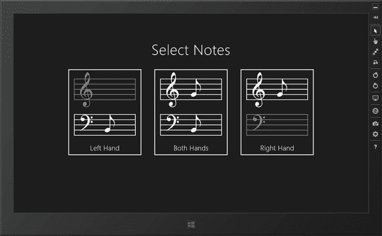
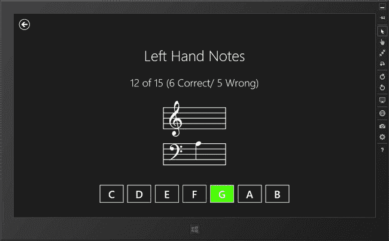
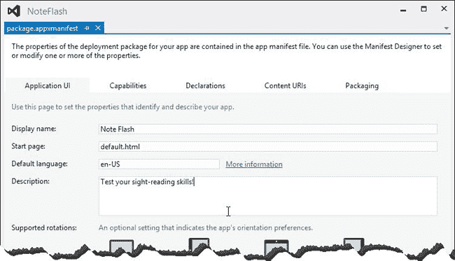

## 第四章

## 完成应用程序

在这一章中，我将完成我在第三章中开始的基础版本`NoteFlash`示例应用程序。我继续使用与常规 web 应用程序开发有很多共同之处的方法和技术，但我也开始融入更多特定于 Windows 的功能，这些功能可通过 WinJS API 获得。我简要概述了我使用的每个 Windows 应用程序的功能，并解释了在本书中可以获得更多详细信息的地方。

### 重温示例应用程序

在这一章中，我将直接从第三章的[开始构建`NoteFlash`项目。正如您所记得的，我将应用程序的基本结构放在适当的位置，定义了导航功能，并定义了将在整个应用程序中应用的样式。我还使用了`Page Control`条目模板来生成一组相关的 HTML、CSS 和 JavaScript 文件，这些文件用于创建允许用户选择要测试的笔记的内容。你可以在](03.html)[图 4-1](#fig_4_1) 中看到结果。在这一章中，我将创建额外的内容来根据用户的选择执行测试。

***图 4-1。**便签选择页面*

### 定义 Notes 数据

构建示例应用程序的下一步是定义用户将要测试的笔记。为此，我在名为`notes.js`的`js`文件夹中添加了一个新的 JavaScript 文件，其内容可以在[清单 4-1](#list_4_1) 中看到。(右击`Solution Explorer`中的`js`文件夹，选择`Add`  `New Item`，使用`JavaScript File`项模板。)

 **提示**在`Solution Explorer`窗口中右键点击`js`文件夹，从弹出菜单中选择`Add`  `New Item`，添加一个 JavaScript 文件。从文件类型列表中选择`JavaScript File`，设置文件名为`notes.js`，点击`Add`按钮。

***清单 4-1** 。定义音符数据*

`(function () {
    "use strict";

    var Note = WinJS.Class.define(function (note, character, hand) {
        this.note = note;
        this.character = character;
        this.hand = hand;
    });

    WinJS.Namespace.define("Notes", {
        leftHand: [
                new Note('C', 80, "left"), new Note('D', 81, "left"),
                new Note('E', 82, "left"), new Note('F', 83, "left"),
                new Note('G', 84, "left"), new Note('A', 85, "left"),
                new Note('B', 86, "left"), new Note('C', 87, "left"),
                new Note('D', 88, "left"), new Note('E', 89, "left"),
                new Note('F', 90, "left"), new Note('G', 91, "left"),
                new Note('A', 92, "left"), new Note('B', 93, "left"),
                new Note('C', 94, "left")
        ],
        rightHand: [
                new Note('C', 82, "right"), new Note('D', 83, "right"),
                new Note('E', 84, "right"), new Note('F', 85, "right"),
                new Note('G', 86, "right"), new Note('A', 87, "right"),
                new Note('B', 88, "right"), new Note('C', 89, "right"),
                new Note('D', 90, "right"), new Note('E', 91, "right"),
                new Note('F', 92, "right"), new Note('G', 93, "right"),
                new Note('A', 94, "right"),
        ],
    });

})();`

这个文件需要一些解释。我使用了 WinJS API 的两个有用的特性:*类*和*名称空间*。我将在接下来的章节中解释它们。

#### Windows JavaScript 类

JavaScript 是一种基于*原型的*面向对象语言，这意味着继承是通过克隆现有对象来工作的(这些对象被称为*原型*)。所有其他可用于 Windows 应用程序开发的语言都使用基于*类的*继承，其中对象的功能在单独的类中定义。对象是作为这些类的实例创建的。大多数主流编程语言使用基于类的继承，例如，如果你用 C#或 Java 编写过软件，你就会遇到类。

WinJS API 支持用 JavaScript 创建类。`WinJS.Class.define`方法最多接受三个参数:一个作为类构造函数的函数、一个包含类实例成员的对象和一个包含类静态成员的对象。`WinJS.Class.derive`方法允许您通过从现有的类派生来创建新的类。

 **提示**微软曾表示，基于类的继承比标准的基于 JavaScript 原型的方法提供了性能优势，但我怀疑它更多地与 Windows API 必须向本地支持类的 JavaScript *和*语言公开的方式有关。

在`notes.js`文件中，我定义了一个名为`Note`的基类，就像这样:

`...
**var Note = WinJS.Class.define(function (note, character, hand) {**
**    this.note = note;**
**    this.character = character;**
**    this.hand = hand;**
**});**
...`

我只为这个类定义了构造函数，它有三个参数——音符(如`C`),在音乐字体中代表音符的字符，以及音符与哪只手相关(因为，当然，弹钢琴时要用两只手——这给我的音乐课带来了很多困难)。

一旦定义了一个类，就可以使用关键字`new`创建新的实例，如下所示:

`...
var myNote = new Note('C', 80, "left");
...`

这条语句创建了一个代表左手音符 C 的`Note`对象，由我在[第 3 章](03.html)中添加到项目中的音乐字体中的字符代码`80`表示。

关键字`new`是 JavaScript 的标准部分，但在 web 应用程序开发中并未广泛使用。`WinJS.Class.define`方法创建的类是非常基本的，它们缺少你在其他语言中期望的类的大部分特性。这种方法的主要好处是，它提供了一种机制，以一种可以在 JavaScript 中使用的方式公开 Windows API。

您不必在自己的 JavaScript 中使用类，但是理解这个特性是很重要的，因为微软已经在 WinJS API 中广泛使用了它，一旦您使用调试器单步调试代码，就会遇到它。我很少在自己的代码中使用类，因为我认为它们增加了许多基于类的继承的问题，却没有任何好处。

#### 创建名称空间

正如我在[第三章](03.html)中解释的那样，*名称空间*是减少 Windows 应用中全局名称空间污染的技术之一(另外两个是*自执行函数*和*严格模式*)。名称空间背后的思想是创建一个单独的全局变量并将数据值和函数附加到它上面，而不是使每个单独的值和函数都是全局的。

您已经看到了微软如何使用名称空间来构建 API，比如`WinJS.Utilities`和`WinJS.UI.Pages`。如果您想使用`query`方法在 HTML 中搜索元素，您可以调用`WinJS.Utilities.query`。查询方法是`WinJS.Utilities`名称空间的一部分，该名称空间包含许多其他有用的函数。

名称空间可以是分层的。`Utilities`名称空间是`WinJS`名称空间的一部分。`WinJS`包含许多子名称空间，`Utilities`只是其中之一。在上一节中，我使用了`WinJS.Class.define`方法——该方法位于`WinJS.Class`名称空间中，而`Class`是`Utilities`的对等体。通过使用名称空间，微软将大量的功能打包到两个全局名称空间对象中:`WinJS`和`Windows`。

所有的名称空间都是:全局对象。例如，清单 4-2 展示了如何使用常规的 JavaScript 对象来重新创建`WinJS.Utilities.query`方法。

***清单 4-2** 。作为对象层次结构的名称空间*

`...
var WinJS = {
    Utilities: {
        query: function (someArguments) {
            // ...implementation goes here...
        }
    }
};
...`

名称空间的层次性意味着您可以在名称空间层次结构的不同位置重用变量和方法的名称。例如，一个(假设的)`WinJS.Database.query`方法完全独立于`WinJS.Utilities.query`，尽管这两个方法都被称为`query`。这是名称空间的好处之一。如果所有的方法都是全局的，我会以像`queryHTMLById`和`queryHTMLByTagName`这样的名字结束，这和你在 DOM API 中看到的冗长的名字是一样的，其中所有的方法都是对等的。使用名称空间向代码添加结构意味着方法*名称*可能是有意义的，而方法操作的上下文来自其*名称空间*。

您可以使用 WinJS API 来创建自己的名称空间，使用`WinJS.Namespace`名称空间的特性，我在`notes.js`文件中使用了如下的特性:

`...
**WinJS.Namespace.define("Notes"**, {
    leftHand: [
        new Note('C', 80, "left"), new Note('D', 81, "left"),
        // ...other notes removed for brevity...
    ],
    rightHand: [
        new Note('C', 82, "right"), new Note('D', 83, "right"),
        // ...other notes removed for brevity...
    ],
**});**
...`

`WinJS.Namespace.define`方法创建新的名称空间。第一个参数是要创建的命名空间的名称，第二个参数是其成员将被添加到命名空间的对象。

 **提示**您可以通过将带点的名称作为第一个参数传递给 define 方法来创建名称空间的层次结构，比如`MyData.Music.Notes`。将自动创建层次结构中的每个级别。

在清单中，我创建了一个名为`Notes`的新名称空间，它包含两个数组:`leftHand`和`rightHand`。每个数组包含一组`Note`对象，代表与那只手相关的音符序列，这些对象是使用我在本章前面描述的`Note`类创建的。

使用`define`方法创建名称空间在几个方面让生活变得更简单。首先，名称空间被自动添加到全局名称空间中。考虑到创建全局变量是多么容易(真的太容易了)，这没什么大不了的，但这确实意味着我将能够在我的应用程序中的任何地方引用`Notes.leftHand`和`Notes.rightHand`。这是我创建*视图模型*时所依赖的东西，我会在第 8 章的[中解释。](08.html)

使用`define`方法的第二个好处是它检查您正在创建的名称空间的部分是否已经存在。例如，如果我像这样定义了名称空间`Notes`:

`...
window.Notes = {
   leftHand: [ ...notes... ]
}
...`

然后尝试添加到该命名空间，就像这样:

`...
window.Notes = {
    rightHand: [ ...notes... ]
}
...`

我将最终只得到`rightHand`笔记，因为我的第二个`window.Notes`对象将完全取代第一个。然而，我可以使用`define`方法安全地添加名称空间，没有任何问题，如[清单 4-3](#list_4_3) 所示。

***清单 4-3** 。通过多次调用 define 方法逐步构建名称空间*

`(function () {
    "use strict";

    var Note = WinJS.Class.define(function (note, character, hand) {
        this.note = note;
        this.character = character;
        this.hand = hand;
    });

**    WinJS.Namespace.define("Notes", {**
**        leftHand: [**
**                new Note('C', 80, "left"), new Note('D', 81, "left"),**
**                new Note('E', 82, "left"), new Note('F', 83, "left"),**
**                new Note('G', 84, "left"), new Note('A', 85, "left"),**` `**                new Note('B', 86, "left"), new Note('C', 87, "left"),**
**                new Note('D', 88, "left"), new Note('E', 89, "left"),**
**                new Note('F', 90, "left"), new Note('G', 91, "left"),**
**                new Note('A', 92, "left"), new Note('B', 93, "left"),**
**                new Note('C', 94, "left")**
**        ]**
**    });**

**    WinJS.Namespace.define("Notes", {**
**        rightHand: [**
**                new Note('C', 82, "right"), new Note('D', 83, "right"),**
**                new Note('E', 84, "right"), new Note('F', 85, "right"),**
**                new Note('G', 86, "right"), new Note('A', 87, "right"),**
**                new Note('B', 88, "right"), new Note('C', 89, "right"),**
**                new Note('D', 90, "right"), new Note('E', 91, "right"),**
**                new Note('F', 92, "right"), new Note('G', 93, "right"),**
**                new Note('A', 94, "right"),**
**        ],**
**    });**

})();`

结果是一个包含`leftHand`和`rightHand`注释的名称空间。当然，您可以自己执行这些检查，但是使用`WinJS.Namespace.define`方法更方便。对于许多 WinJS 功能来说都是如此——您可以自己编写这些功能的实现，但是 Microsoft API 通常更方便。

### 添加闪存卡页面

`NoteFlash`应用中缺失的部分是测试用户音符知识的页面。构建应用程序的下一步是添加这个页面，所以我使用`Page Control`项模板在`pages`文件夹中创建一个名为`flashCardsPage.html`的新页面。这是我在上一章用来创建`selectorPage.html`页面的同一个模板，当你使用这个模板时，Visual Studio 会向项目添加 HTML、CSS 和 JavaScript 文件。

为了解释我如何实现这个页面，我需要在这个页面的 HTML、CSS 和 JavaScript 之间切换。最简单的方法是列出组成页面的文件内容，然后解释各个部分是如何组合在一起的。在这个过程中，我将介绍一些重要的 WinJS 特性。

首先，你可以在清单 4-4 的[中看到我添加到`flashCardsPage.html`文件的内容。在接下来的几节中，我将分解这个文件的每个部分是做什么的。](#list_4_4)

***清单 4-4** 。flashCardsPage.html 文件的内容*

`<!DOCTYPE html>
<html>
<head>
    <meta charset="utf-8" />
    <title>flashCardsPage</title>

    <!-- WinJS references -->
    <link href="//Microsoft.WinJS.1.0/css/ui-dark.css" rel="stylesheet" />` `    
    

    <link href="flashCardsPage.css" rel="stylesheet" />
**    **
    
</head>
<body>
**    
**
**        
**
**            <button id="backButton" class="win-backbutton" aria-label="Back">**
**            </button>**
**        
**

**        <h1 id="title" data-win-bind="innerText: title">Title Will Go Here</h1>**
**        <h1 class="subhead" id="currentNote">**
**            1 of**
**            1**
**            (**
**                 Correct/**
**             Wrong)                    **
**        </h1>**

**        
**
**            
**
**                '&=====!**
**            
**
**            
**
**                '&#175;=====!**
**            
**
**        
**

**        
**
**            <button data-note="C">C</button>**
**            <button data-note="D">D</button>**
**            <button data-note="E">E</button>**
**            <button data-note="F">F</button>**
**            <button data-note="G">G</button>**
**            <button data-note="A">A</button>**
**            <button data-note="B">B</button>**
**            <button id="back" style="display: none">Back</button>**
**            <button id="restart" style="display: none">Again</button>**
**        
**
**    
**
</body>
</html>`

本文档中的`head`元素包含您所期望的内容:WinJS API 文件的`script`元素、`flashCardsPage.js`和`notes.js`文件以及`flashCardsPage.css`文件的`link`元素。

#### 添加页面特定的 CSS

元素中的标记为应用程序的测试部分提供了布局。`flashCardsPage.css`文件包含页面特定的 CSS，它布局了`flashCardsPage.html`中的元素，您可以在[清单 4-5](#list_4_5) 中看到 CSS 文件的内容。

***清单 4-5** 。flashCardsPage.css 文件*

`header {
    margin: 20px;
}

h1.subhead {
    font-size: 30pt;
    margin: 10px;
}

#backButtonContainer {
    width: 100%;
    padding: 20px;
}

#backButton {
    margin-left: 20px;
}

#flashContainer {
**    display: -ms-flexbox;**
**     -ms-flex-direction: column;**
**     -ms-flex-align: center;**
**     -ms-flex-pack: justify;  **
    height: 100%;
}

#noteButtons {
    margin-bottom: 50px;
}

#noteButtons button {
    font-size: 30pt;
    margin: 5px;
}

button.correct {
    background-color: #4cff00;
}

#noteButtons button[id] {
    width: 200px;
}`

我强调了 CSS 文件最重要的部分:使用`flexbox`布局，这是我在本书中经常使用的另一个 CSS3 布局(第一个是我在第三章[中展示的`grid`布局)。我在`flashCardsPage.css`中使用的其他属性是常用的，但是`flexbox`布局是新的，还没有被广泛采用——部分是因为规范仍在开发中，这就是为什么我必须使用特定于供应商的属性名。](03.html)

##### 了解柔性盒布局

*柔性盒布局*，通常被称为*柔性盒*，它提供了一种流体布局，当屏幕尺寸改变时，这种布局能够很好地响应。这在 Windows 应用程序中很重要，因为用户可以重新定位设备或改变分配给应用程序的屏幕大小(我会讨论这两个功能，并在第六章的[中告诉你如何适应它们)。](06.html)

 **提示**当我需要精确划分屏幕空间时，我倾向于使用网格布局，当我更关心流动性和居中元素时，我倾向于使用 flexbox 布局。

您可以通过将`display`属性设置为`–ms-flexbox`来启用 flexbox 布局，就像我在清单中所做的那样。最重要的属性是`–ms-flex-direction`，它指定了子元素的布局方式。我已经在[表 4-1](#tab_4_1) 中列出了该属性支持的值。

在清单中，我指定了列值，这意味着我的元素将按照它们在 HTML 中定义的顺序从上到下排列。

`–ms-flex-pack`属性指定元素如何沿`–ms-flex-direction`属性指定的轴对齐(沿垂直轴为`column`值，沿水平轴为`row`值)。我已经在[表 4-2](#tab_4_2) 中列出了该房产的价值。

在清单中，我使用了`justify`属性，这意味着`flashContainer`元素中的元素将被隔开，这样它们就占据了元素的整个高度。

`–ms-flex-align`属性指定元素沿轴的对齐方式，该轴未被`–ms-flex-direction`属性使用——也就是说，与元素布局所沿的轴成 90 度，称为*正交轴*。该属性值如[表 4-3](#tab_4_3) 所示。

使用这三个属性，你可以在布局中构建很多流动性，但是还有一些我在本书中没有用到的属性(并且经常发现没有用)。你可以在`[http://msdn.microsoft.com/en-us/library/windows/apps/hh453474.aspx](http://msdn.microsoft.com/en-us/library/windows/apps/hh453474.aspx)`看到完整的列表。

只需将`–ms-flex-align`属性设置为`justify`并将`–ms-flex-pack`属性设置为`center`，子元素将被放置在元素的中心。

在清单中，我指定了`center`值，这意味着我的元素将与`flashContainer`元素的中心对齐。结合我指定的其他值，`flashContainer`元素的子元素将垂直布局，分布在元素的整个高度，并位于元素的中心。您可以在[图 4-2](#fig_4_2) 中看到页面的布局。

***图 4-2。**闪存卡页面的布局*

我还没有定义 JavaScript 代码来控制这些元素，但是你已经可以看到该功能的主要组成部分:用户正确和错误回答的详细信息的占位符，显示左手和右手笔记所需的五线谱，以及用户点击或触摸来识别笔记的一组按钮。

#### 定义闪存卡页面的代码

[清单 4-6](#list_4_6) 显示了`flashCardsPage.js`文件的内容。没有大量的代码，但是有一些有趣的东西在进行，我将在下面的部分中解释。

***清单 4-6** 。flashCardsPage.js 文件*

`(function () {
    "use strict";

    var appState = WinJS.Binding.as({
        title: "", mode: null, leftNote: "=",
        rightNote: "=", currentIndex: 0, noteCount: 0,
        notes: [], currentNote: null,
        results: {
            numberCorrect: 0,
            numberWrong: 0
        },
    });

    WinJS.UI.Pages.define("/pages/flashCardsPage.html", {
        ready: function (element, options) {

            WinJS.Binding.processAll(document.body, appState);

            backButton.addEventListener("click", function (e) {
                showPage("/pages/selectorPage.html");
            });
            $("#noteButtons button").listen("click", handleButtonClick);

            setState(options);
            selectAndDisplayNote();
        }
    });

    function setState(mode) {

        appState.mode = mode;
        switch (mode) {
            case "leftHand":
                appState.title = "Left Hand Notes";
                break;
            case "rightHand":
                appState.title = "Right Hand Notes";
                break;` `case "bothHands":
                appState.title = "All Notes";
                break;
        }

        appState.notes = [];
        if (mode == "leftHand" || mode == "bothHands") {
            Notes.leftHand.slice().forEach(function (item) {
                appState.notes.push(item);
            });
        }
        if (mode == "rightHand" || mode == "bothHands") {
            Notes.rightHand.slice().forEach(function (item) {
                appState.notes.push(item);
            });
        }
        appState.currentIndex = 0;
        appState.results.numberCorrect = 0;
        appState.results.numberWrong = 0;
        appState.noteCount = appState.notes.length;
    }

    function selectAndDisplayNote() {
        if (appState.notes.length > 0) {
            var index = Math.floor((Math.random() * appState.notes.length));
            var note = appState.notes.splice(index, 1)[0];
            appState.leftNote = (note.hand == "left" ? "&#"
                + note.character + ";" : "=");
            appState.rightNote = (note.hand == "right" ? "&#"
                + note.character + ";" : "=");
            appState.currentNote = note;
            appState.currentIndex++;
        } else {
            $("#noteButtons button").forEach(function (item) {
                item.style.display = "none";
            });
            $("#noteButtons button[id]").setAttribute("style", "");
        }
    }

    function handleButtonClick(e) {
        if (this.id == "restart") {
            showPage("/pages/flashCardsPage.html", appState.mode);
        } else if (this.id == "back") {
            showPage("/pages/selectorPage.html");
        } else {
            $("button[data-note].correct").removeClass("correct");
            $("button[data-note=" + appState.currentNote.note + "]")
                .addClass("correct");

            if (this.innerText == appState.currentNote.note) {` `                appState.results.numberCorrect++;
            } else {
                appState.results.numberWrong++;
            }
            selectAndDisplayNote();
        }
    }
})();`

### 使用 WinJS 数据绑定

保持元素的内容与应用程序的状态同步可能是一个乏味且容易出错的过程。有两个问题:第一个是简单地确保所有的 HTML 元素在用户与应用程序交互时显示正确的数据。第二个问题是确定哪个元素是特定数据的权威来源——如果用户可以使用一系列不同的元素编辑相同的数据值，这是很困难的。

web 应用和 Windows 应用的解决方案是一样的:*数据绑定*。数据绑定将数据值保存在 JavaScript 代码中，并提供自动同步数据变化和显示给用户的 HTML 元素内容的机制。

我最喜欢的 web 应用程序数据绑定包是由我偶尔的合作者和全面的好人史蒂夫·桑德森编写的。我在我的《网络应用 JavaScript》一书中广泛使用了 Knockout，它是一个非常好的工具。您可以在 JavaScript Windows 应用程序中使用 Knockout 或其任何竞争对手，但 WinJS API 中内置了对数据绑定的支持。

WinJS 数据绑定支持不像一些 web 应用程序库那样功能丰富，但我还是会使用它——不仅因为它是 Windows API 的一部分，还因为它集成到了我在本书第三部分中描述的一些 UI 控件中。我在这一章给你一个关于绑定的简要概述，这样我就可以介绍这个主题并让`NoteFlash`应用程序工作起来。我在[第 8 章](08.html)中再次深入讨论这个话题。

#### 定义数据

对于数据绑定，我首先需要一些数据，表达这些数据的最简单方式是使用一个对象，就像这样:

`...
var appState = **WinJS.Binding.as**({
    title: "", mode: null, leftNote: "=",
    rightNote: "=", currentIndex: 0, noteCount: 0,
    notes: [], currentNote: null,
    results: {
        numberCorrect: 0,
        numberWrong: 0
    },
});
...`

这个代码片段最重要的部分是对`WinJS.Binding.as`方法的调用，它将一个对象作为参数。我传递给`as`方法的对象包含了代表我的应用程序当前状态的所有数据。通过将这个对象传递给`as`方法，我可以观察到对象*中的数据值*。

可观察值是*动态*数据绑定所必需的，其中数据项和 HTML 的内容或属性值总是同步的，这就是我将在`NoteFlash`应用中使用的数据绑定类型。现在不要太担心数据——当你看到绑定系统的其他部分就位时，它会开始变得更有意义。

#### 声明绑定

数据必须被*绑定*到某个东西，对于这个应用程序，绑定关系的另一面出现在 HTML 标记中。下面是来自`flashCardsPage.html`文件的一个例子:

`...

...`

这是一个*声明性绑定*，这意味着我已经在 HTML 代码中包含了绑定的细节。为了创建这个绑定，我向元素添加了`data-win-bind`属性。

 **提示**`data-win-*`绑定用于表示 WinJS 功能。以`data-`开头的属性称为*数据属性*。一段时间以来，它们一直是将自定义属性应用于元素的一种非正式方式。HTML5 规范使数据属性成为 HTML 的正式组成部分。

这个绑定属性的值由两部分组成。第一部分是绑定所应用到的 DOM 中的`HTMLElement`对象的属性名——在本例中是`innerText`属性，它控制元素的文本内容。属性名后跟一个冒号(`:`)，然后是将绑定到该属性的数据值的名称。

在这种情况下，我选择了`results.numberCorrect`作为数据值。该属性的结果是`span`元素的`innerText`属性被*绑定到`results.numberCorrect`属性的值。*

#### 将数据应用于绑定

剩下的步骤是将数据和声明性绑定放在一起。上一节中我的`span`元素知道它需要`results.numberCorrect`属性的值，但是它不知道如何获得该值。`WinJS.Binding.as`方法创建可观察的数据对象，但是它不知道这些值应该显示在哪里。我需要使用另一个`WinJS`方法连接数据和声明，如下所示:

`...
WinJS.UI.Pages.define("/pages/flashCardsPage.html", {
    ready: function (element, options) {

**        WinJS.Binding.processAll(document.body, appState);**

        backButton.addEventListener("click", function (e) {
            showPage("/pages/selectorPage.html");
        });
        $("#noteButtons button").listen("click", handleButtonClick);

        setState(options);
        selectAndDisplayNote();` `    }
});
...`

`WinJS.Binding.processAll`方法有两个参数:DOM 中的一个元素和一个数据对象。该方法处理指定元素的所有后代，并将数据对象设置为任何具有`data-win-bind`属性的元素的数据源。在我的示例应用程序中，我已经指定了`document.body`元素——以便处理整个布局——以及我之前创建的可观察的`appState`对象。

这缩小了数据和声明性绑定之间的差距。您可以看到，这个方法是我在处理函数中为`WinJS.UI.Pages.ready`事件调用的第一个方法。我喜欢尽快设置我的绑定，但这只是个人偏好。您可以在任何合适的时候调用`processAll`方法，但是如果您在 HTML 中使用数据绑定，那么调用这个方法是很重要的——否则绑定不会被激活，您的数据值也不会被 HTML 元素显示。

### 配置按钮和导航

当 Visual Studio 创建一个新页面时，它会在 HTML 标记中包含一个导航`Back`按钮，如下所示:

`...
<button id="backButton" class="win-backbutton" aria-label="Back"></button>
...`

这是 Windows 应用程序中常见的布局功能，允许用户在应用程序中后退一步。当我更新`flashCardsPage.html`文件的内容时，我保留了这个元素。元素被赋予的 CSS 类`win-backbutton`，在`ui-dark.css`和`ui-light.css`文件中定义，我在[第二章](02.html)中介绍过，它们定义了 Windows 应用程序的所有基本样式。在[图 4-3](#fig_4_3) 中，您可以看到按钮是如何显示的。

***图 4-3。**后退按钮*

你不必在你的应用程序布局中有这个`button`，但是我将保留它，以允许用户返回到选择页面。处理 Windows 应用程序中的按钮就像处理 web 应用程序中的按钮一样，您可以在下面的`flashCardsPage.js`文件中的`ready`事件处理程序片段中看到这一点:

`...
backButton.addEventListener("click", function (e) {
    showPage("/pages/selectorPage.html");
});
...`

我使用`addEventListener`方法注册一个函数来处理`click`事件。Windows 应用程序有一些微软特有的事件，我在第 18 章中描述过，但是标准的`click`事件工作得非常好，可以响应鼠标和触摸事件。当按钮被点击时，我调用我的全局`showPage`函数(您还记得，我在`default.js`文件中定义了它)来显示`selectorPage.html`文件。

#### 配置应答按钮

页面上的其他按钮允许用户识别显示的每个注释。在[图 4-4](#fig_4_4) 中可以看到这些按钮。

***图 4-4。**音符识别按钮*

我想以同样的方式处理所有这些按钮的`click`事件，如下所示:

`...
$("#noteButtons button").listen("click", handleButtonClick);
...`

我使用了我在`default.js`文件中为`WinJS.Utilities.query`方法设置的`$`别名。我可以将`listen`方法应用于来自`query`方法的结果，为所有匹配元素的事件注册相同的处理函数——在本例中，为所有按钮的`click`事件注册`handleButtonClick`函数。(我将在本章后面描述`handleButtonClick`函数是如何工作的。)

### 设置状态

Windows 应用程序单页模型中的一些奇怪之处意味着每次收到`ready`事件时重置状态是很重要的。我会在第五章中解释原因。在`NoteFlash`应用中，我创建了一个名为`setState`的专用设置功能，如下:

`...
function setState(mode) {

    appState.mode = mode;
    switch (mode) {
        case "leftHand":
            appState.title = "Left Hand Notes";
            break;
        case "rightHand":
            appState.title = "Right Hand Notes";
            break;
        case "bothHands":
            appState.title = "All Notes";
            break;
    }

    appState.notes = [];` `    if (mode == "leftHand" || mode == "bothHands") {
        Notes.leftHand.slice().forEach(function (item) {
            appState.notes.push(item);
        });
    }
    if (mode == "rightHand" || mode == "bothHands") {
        Notes.rightHand.slice().forEach(function (item) {
            appState.notes.push(item);
        });
    }
    appState.currentIndex = 0;
    appState.results.numberCorrect = 0;
    appState.results.numberWrong = 0;
    appState.noteCount = appState.notes.length;
}
...`

该函数的参数是由`ready`事件处理程序接收的值，该值指示用户想要测试哪组音符:左手音符、右手音符，或者两者都测试。我根据这个值在数据对象中设置了`appState.title`属性的值，这触发了对一个 HTML 数据绑定的更新:

`...
<h1 id="title" **data-win-bind="innerText: title"**></h1>
...`

该函数的下一部分清除`appState.notes`数组，并用来自`Notes`名称空间(我在本章前面创建的)的值重新填充它。在`appState.notes`数组中的最后一组音符取决于用户在`selectorPage`中点击了哪个按钮。

#### 重置其他状态值

该函数的其余部分重置`appState`对象中的剩余值。所有这些值都在数据绑定中使用:

`...
<h1 class="subhead" id="currentNote">
    1 of
    1
    (
     Correct/
     Wrong)                    
</h1>
...`

重置这些属性的值具有清除应用程序状态和重置用户界面的双重效果。如果没有数据绑定，我将不得不手动重置元素的内容，确保找到显示每个数据值的所有实例——对于像这样的基本应用程序来说，这相当简单，但对于更复杂的应用程序来说，这很快就会变成一个痛苦且容易出错的过程。当我更深入地回顾数据绑定并介绍视图模型时，我将在第 8 章回到这个主题。

每当我接收到`WinJS.UI.Pages.ready`事件时，我就调用`setState`函数，如下所示:

`...
WinJS.UI.Pages.define("/pages/flashCardsPage.html", {
    ready: function (element, options) {
        // *...other statements removed for brevity...*
**        setState(options);**
        selectAndDisplayNote();
    }
});
...`

这确保我在每次显示页面时重置应用程序状态并清除数据绑定值。

### 展示抽认卡

`selectAndDisplayNote`函数负责从`appState.notes`数组包含的集合中随机选取一个音符并显示给用户:

`...
function selectAndDisplayNote() {
    if (appState.notes.length > 0) {
        var index = Math.floor((Math.random() * appState.notes.length));
        var note = appState.notes.splice(index, 1)[0];
        appState.leftNote = (note.hand == "left" ? "&#"
            + note.character + ";" : "=");
        appState.rightNote = (note.hand == "right" ? "&#"
            + note.character + ";" : "=");
        appState.currentNote = note;
        appState.currentIndex++;
    } else {
**        $("#noteButtons button").forEach(function (item) {**
**            item.style.display = "none";**
**        });**
**        $("#noteButtons button[id]").setAttribute("style", "");**
    }
}
...`

这是使用标准 JavaScript 代码实现的。如果没有留下测试用户的注释，那么我会修改布局——我用粗体标记的代码。这些语句隐藏答案按钮，并显示附加的导航按钮。您可以在[图 4-5](#fig_4_5) 中看到替代按钮组。注意，我已经使用了`WinJS.Utilities.query`方法，之前我将其别名化为`$`，使用`id`属性值来定位`button`元素。

***图 4-5。**附加导航按钮*

我将这些按钮定义在常规的回答按钮旁边，但是将 CSS `display`属性的值设置为`none`，所以它们最初是不可见的。我这样定义按钮是为了再次强调标准的 HTML 和 CSS 特性在 Windows 应用程序中是如何可用的:

`...

    <button data-note="C">C</button>
    <button data-note="D">D</button>
    <button data-note="E">E</button>
    <button data-note="F">F</button>
    <button data-note="G">G</button>
    <button data-note="A">A</button>
    <button data-note="B">B</button>
**    <button id="back" style="display: none">Back</button>**
**    <button id="restart" style="display: none">Again</button>**

...`

作为一个相关的好处，所有的按钮——回答和导航——都与我使用别名`$`搜索的元素相匹配，并被配置为当它们被点击时调用`handleButtonClick`函数。

### 处理回答和导航按钮事件

应用程序功能的最后一部分包含在`handleButtonClick`功能中，当点击任何一个回答按钮或附加导航按钮时，就会执行该功能:

`...
function handleButtonClick(e) {
    if (this.id == "restart") {
        showPage("/pages/flashCardsPage.html", appState.mode);
    } else if (this.id == "back") {
        showPage("/pages/selectorPage.html");
    } else {
**        $("button[data-note].correct").removeClass("correct");**
**        $("button[data-note=" + appState.currentNote.note + "]")**
**            .addClass("correct");**

**        if (this.innerText == appState.currentNote.note) {**
**            appState.results.numberCorrect++;**
**        } else {**
**            appState.results.numberWrong++;**
**        }**
        selectAndDisplayNote();
    }
}
...`

该函数在很大程度上使用了标准的 JavaScript 技术，但是有几个方面值得您注意，我将在下面的部分中进行描述。请注意我是如何在回答按钮中添加和删除 CSS 类的:

`...
$("button[data-note]").**removeClass("correct").removeClass("normal")**;
$("button[data-note=" + appState.currentNote.note + "]")
    **.addClass("correct").addClass("normal").removeClass("correct")**;
...`

CSS 类将绿色背景应用到一个按钮上。当用户点击一个按钮时，我从应用它的任何按钮中删除正确的类，然后将它重新应用到当前显示的便笺的正确按钮上。这允许我创建一个简单的视觉提示来指示正确的答案。

#### 依靠数据绑定发布数据更新

我想提醒您注意动态数据绑定的使用方式:

`...
if (this.innerText == appState.currentNote.note) {
**    appState.results.numberCorrect++;**
} else {
**    appState.results.numberWrong++;**
}
...`

每当我评估用户提供的答案时，我就增加`appState`对象中的数据值，记录正确和错误答案的数量。

重要的是我*不*必须做的事情:我不必手动更新 HTML 元素来显示更新的信息。这是自动发生的，因为我更新的值是可观察的，并且布局中的元素通过数据绑定系统显示数据。

这不仅是一种更方便的方法，而且还创建了一个更具可伸缩性和可维护性的应用程序结构。我可以更改 HTML 元素的布局，并且可以在应用程序的许多地方显示相同的数据值——但是当我需要进行更新时，我必须只给数据对象分配一个新值，就像在代码片段中一样。这在任何有 UI 的应用中都是一个重要的概念，但在 Windows 应用开发中尤其重要，我将在第 8 章中回到这个主题。

你可以在[图 4-6](#fig_4_6) 中看到完整的应用程序，显示了正在向用户显示的笔记，以及关于正在测试哪组笔记的信息，用户的进度，以及指示正确答案的颜色提示。

***图 4-6。**完成的 NoteFlash 应用*

正如我之前提到的，这不是`NoteFlash`应用的最终版本，但基本功能已经完成，用户可以测试他的视奏能力。在后面的章节中，我将回到这个应用程序并添加更多的功能。

### 更新应用清单

虽然我已经完成了应用程序的 HTML、CSS 和 JavaScript 组件，但还有一点工作要做。如果你转到`Start`屏幕并找到`NoteFlash`应用的磁贴，你会发现应用呈现给用户的方式相当简单，如图[图 4-7](#fig_4_7) 所示。

***图 4-7。**note flash 应用的默认磁贴*

默认情况下，Visual Studio 会为应用程序磁贴分配一个默认图标，并使用项目作为应用程序名称。我们可以通过对清单进行一些简单的更改来改善应用程序呈现给用户的方式。

双击`Solution Explorer`窗口中的`package.appxmanifest`文件，并导航到清单编辑器中的`Application UI`选项卡。此页面包含应用程序的基本设置。

#### 设置平铺图像和颜色

我要做的第一个改变是应用程序磁贴的图像和颜色。Windows 应用程序出于各种目的使用不同大小的图像。有一个正方形拼贴的图像，如图 3-7 所示，它必须是 150 像素乘 150 像素。

平铺也可以是宽的(右击平铺并选择`Larger`按钮)，这需要一个 310 像素乘 150 像素的图像。有一个小图标，30 x 30 像素，当应用程序显示为列表的一部分时使用，最后，一个 620 像素 x 300 像素的图像，当应用程序启动时用作启动屏幕。

对于这个应用程序，我创建了一系列图像，并将它们放在 Visual Studio 项目的`images`文件夹中。这些文件显示高音谱号符号，但由于我使用了白色图标和透明背景，我无法在打印页面上显示图像，但当它应用到应用程序时，您将能够看到它们。(当然，它们在本章的源代码下载中。)

在清单编辑器的`Application UI`选项卡中，有许多文本字段，这样你就可以为图块指定图像，如图 4-8 中的[所示。](#fig_4_8)

***图 4-8。**设置磁贴的图像*

我的图像文件的名称以谱号开头，然后详细说明分辨率，例如`clef30x30.png`。您可以看到我是如何为清单中的各个字段设置图像名称的。图像没有缩放，如果图像大小不合适，您将无法使用它。

还要注意，我已经为`Background color`选项设置了一个值。这用于设置瓷砖的颜色——对于这个应用程序，我选择了蓝色的阴影，由十六进制代码`#528FC8`指定。

 **提示**虽然图中没有显示，但是我也设置了闪屏的图像。

#### 设置应用程序名称

我还想更改显示在磁贴上的名称，该名称取自清单中的`Display name`字段。我已经把这个改成了`Note Flash`，如图[图 4-9](#fig_4_9) 所示。

***图 4-9。**更改应用程序的显示名称*

我还更改了`Description`字段，它为用户提供了应用程序的摘要。更改显示名称和应用图像的结果是如图 4-10 所示的磁贴，为用户呈现一个更加完美的应用磁贴。

 **提示**这是一个*静态磁贴*，只显示图片和应用名称。在第 27 章的[中，我将向你展示如何创建*动态磁贴*，向用户显示有用的信息。](27.html)

***图 4-10。**note flash 应用的更新磁贴*

### 测试完成的应用程序

这就是`NoteFlash`应用程序的全部内容。这是一个简单的软件，但它展示了 Windows 应用程序开发的一些基本特征和功能。要提高您的基本音符识别技能，只需启动应用程序，选择您想要测试的音符，然后给出您的答案。在本书每一部分的结尾，我将回到这个应用程序，并使用我在前一章描述的 Windows 特性对它进行改进。在我继续之前，我想回顾一下本章和第三章的关键主题。

#### 基于网络技术的 Windows 应用程序

我怎么强调这一点都不为过:如果你正在使用 HTML 和 JavaScript 开发 Windows 应用程序，那么你就是在利用你已经掌握的常规 web 应用程序开发技能。有一些与 HTML 世界相当大的差异，特别是当它与一些高级 Windows 8 功能集成时，但正如 NoteFlash 应用程序所展示的那样，你可以使用标准的 web 技术和技巧完成很多事情。

#### Windows 应用不是网络应用

尽管你的 web 应用程序开发经验非常有用，但如果不使用平台功能和遵循微软惯例，你就无法发挥应用程序的全部潜力。你已经看到了 Windows 应用不同于 web 应用的关键领域——在核心导航模型中——我将在本书的其余部分向你展示更多。

#### 数据绑定简化了应用开发

我是 web 和 Windows 应用程序中数据绑定的忠实粉丝，我在第 8 章中深入讨论了这个主题。Windows 应用程序可能会变得非常复杂，您应该采用一切可能的技术来保持代码和标记的可管理性，包括数据绑定。如果你愿意，你可以手动设置 HTML 元素的内容，但是你会让自己的日子更难过，尤其是在维护或增强你的应用程序的时候。

#### WinJS API 是用 JavaScript 写的

WinJS API 是常规 web 应用程序和 Windows 应用程序开发之间的桥梁。最重要的是，您可以通读 WinJS 代码，了解微软如何实现不同的功能，并应用调试器来跟踪困难的问题。对于 Windows API 来说，情况并非如此，但是随着您对 Windows 应用程序开发的掌握，您会发现您大部分时间都在使用 WinJS 特性。

### 总结

在这一章中，我向你展示了如何完成 NoteFlash 应用程序的功能，同时，也介绍了更多的核心 WinJS 功能。特别值得注意的是 WinJS 对类、名称空间和数据绑定的支持。既然您已经看到了如何创建一个基本的 Windows 应用程序，那么是时候开始深入研究细节了。在本书的第二部分，我展示了 WinJS API 的核心特性，你可以用它来创建一个好的 Windows 应用程序的结构。