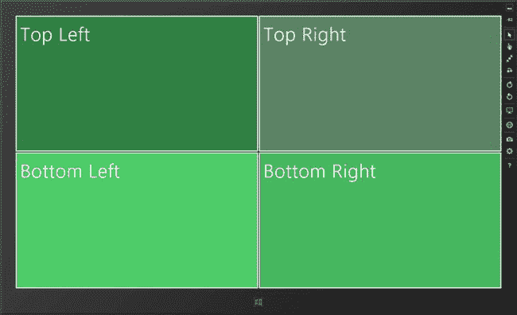
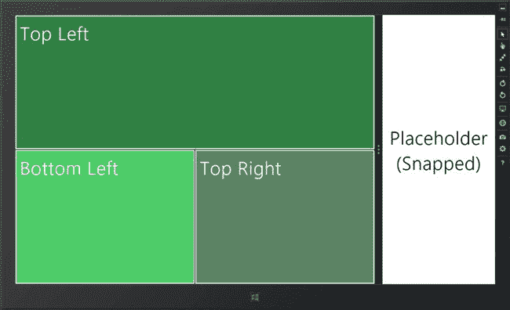
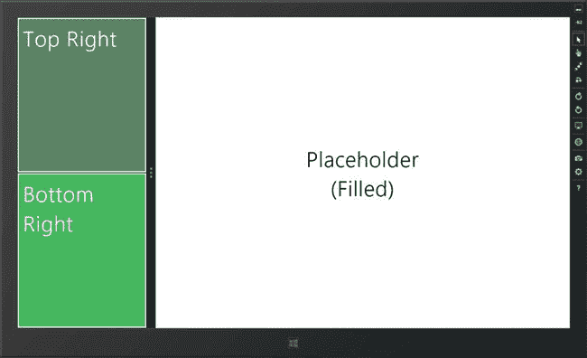
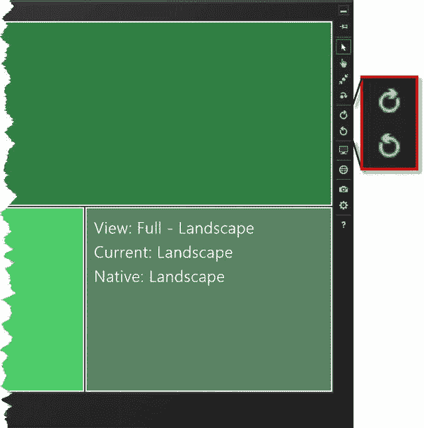
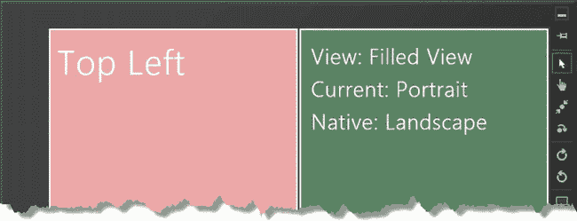
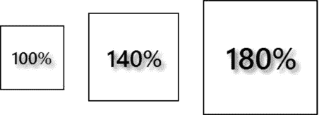
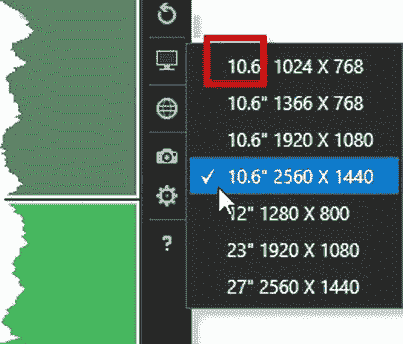

# 六、创建自适应布局

在第三十章，我向你展示了如何使用 Metro 对单页内容模型的支持来为你的应用创建布局。在这一章中，我将向您展示如何使布局适应不同的视图和方向。大多数 Windows 8 设备上都有视图，允许用户选择不同的方式与应用交互，包括并排运行两个 Metro 应用。方位出现在可以保持在不同位置或容易旋转的设备上，并且这些设备配备有传感器来报告它们的状态。你需要仔细考虑如何在应用中容纳不同的视角和方向，以创造一流的地铁体验。

我还将向您展示如何处理高像素密度显示器。这些显示器在平板电脑和手机平台上越来越常见，为用户提供了比传统硬件更清晰的显示器。在大多数情况下，Windows 8 会为您处理像素密度，但有一个关键的例外需要注意:位图图像。我解释了 Windows 8 如何接近像素密度，并向您展示 Metro 功能，这些功能可以帮助您为正在使用的硬件呈现正确的分辨率位图。表 6-1 对本章进行了总结。

### 创建示例项目

我已经创建了一个名为`AppViews`的示例项目，这样我可以在本章中演示不同的特性。我再次使用了 Visual Studio `Blank App`项目模板。你可以在清单 6-1 的[中看到我对`default.html`所做的添加，我将把它用作我的 HTML 母版页。](#list_6_1)

***清单 6-1** 。AppViews 项目中 default.html 文件的内容*

`<!DOCTYPE html>
<html>
<head>
    <meta charset="utf-8">
    <title>AppViews</title>

    <!-- WinJS references -->
    <link href="//Microsoft.WinJS.1.0/css/ui-dark.css" rel="stylesheet" />
    
    

    <!-- AppViews references -->
    <link href="/css/default.css" rel="stylesheet">
    <link href="/css/views.css" rel="stylesheet">
    
</head>
<body>
    

        
Top Left

        
Top Right

        
Bottom Left

        
Bottom Right

    

</body>
</html>`

我使用 CSS `grid`特性创建了一个 2 乘 2 网格的主布局。网格将包含在 id 为`gridContainer`的`div`元素中，每个子元素包含一个标签来指示其位置。你可以在清单 6-2 中看到我用来创建布局的 CSS 属性，它显示了`css/default.css`文件。还有第二个链接到`default.html`的 CSS 文件——这个文件叫做`views.css`。它目前是空的，我将在本章后面回到它。

***清单 6-2** 。default.css 文件*

`#gridContainer {
    display: -ms-grid;
    -ms-grid-rows: 1fr 1fr;
    -ms-grid-columns: 1fr 1fr;
    height: 100%;
    font-size: 40pt;
}

#gridContainer > div {
    border: medium solid white;
    padding: 10px; margin: 1px;
}

#topLeft {
    -ms-grid-row: 1; -ms-grid-column: 1;
    background-color: #317f42;
}

#topRight {
    -ms-grid-row: 1; -ms-grid-column: 2;
    background-color: #5A8463;
}

#bottomLeft {
    -ms-grid-row: 2; -ms-grid-column: 1;
    background-color: #4ecc69;    
}

#bottomRight {
    -ms-grid-row: 2; -ms-grid-column: 2;
    background-color: #46B75E;
}

span, button, img {
    font-size: 25pt;
    margin: 5px;
    display: block;
}

#testImg {
    width: 100px;
    height: 100px;
}`

 **提示**我保留了 Visual Studio 创建的`js/default.js`文件。我将回到这个文件，并在本章的后面向您展示它的内容。

这些文件产生了一个简单的应用，它有四个彩色象限，如图 6-1 所示。在本章的剩余部分，我将使用这个应用来解释应用可以显示的不同视图，以及如何适应它们。

***图 6-1。**默认视图中显示的示例应用*

### 了解地铁景观

Metro 应用可以以四种视图之一显示。[图 6-1](#fig_6_1) 显示了全屏横向视图中的应用，其中整个显示屏专用于示例应用，屏幕的最长边位于设备的顶部和底部。还有另外三个视图需要你处理:*全屏人像*、*抓拍*、*填充*。

在*全屏纵向视图*中，你的应用占据了整个屏幕，但是最长的边在设备的左右两边。在*截图*中，应用以 320 像素宽的条状显示在屏幕的左边缘或右边缘。在*填充视图*中，除了被抓拍的应用占据的 320 像素条之外，应用显示在整个屏幕上。仅当显示器的水平分辨率为 1366 像素或更高时，才支持对齐和填充视图。对于当今的大多数设备来说，这意味着只有当设备处于横向方向时，填充和对齐视图才可用，但这不是必需的，并且在屏幕足够大的情况下，设备将能够在横向和纵向方向上对齐和填充。你可以在图 6-2 中的截图和填充视图中看到示例应用。

 **提示**在填充视图和捕捉视图之间切换的最简单方法是按下`Win` + `.`(句点键)。

***图 6-2。**截图和填充视图中的示例应用*

如您所见，Metro 应用的默认行为只是适应任何可用的空间。在我的示例应用中，这意味着可用空间在我的网格中的列间平均分配。当你的应用在填充视图中时，这通常不是那么糟糕，因为 320 像素并不是屏幕空间的巨大损失。当你的应用在快照视图中时，它会有更大的影响，因为 320 像素根本不是很大的空间。如图所示，我的示例被压缩到可用空间中，没有完全显示文本。

 **注意**图中另一个 app 报告其当前视图。我在这本书的源代码下载中包含了这个应用，以防你会觉得它有用——这个应用叫做`PlaceHolder`，在本章的文件夹中。它使用的特性和功能与我在本章中描述的相同，这也是我没有列出代码的原因。

用户决定他想要哪个视图以及何时想要。你不能创建一个只在特定视图下工作的应用，所以你需要花时间让你的应用布局以一种有意义的方式适应每个视图。有不同的方法来适应这些视图，我将在接下来的小节中带您了解它们。

 **注意**理解这一章的最好方法是跟随并像我一样构建应用。这将让你看到应用响应视图变化的方式，这是静态截图无法正确捕捉的。

### 使用 CSS 适应视图

适应不同视图的第一种方法是使用 CSS。微软已经定义了一些特定于 Metro 的 CSS `media`规则，当应用从一个视图移动到另一个视图时会应用这些规则。你可以在[清单 6-3](#list_6_3) 中看到这四个规则，它显示了我前面提到的`css/views.css`文件。

***清单 6-3** 。响应 views.css 文件中的视图更改*

`**@media screen and (-ms-view-state: fullscreen-landscape) {**
**}**

**@media screen and (-ms-view-state: fullscreen-portrait) {**` `**}**

**@media screen and (-ms-view-state: filled) {**
    #topLeft {
        -ms-grid-column-span: 2;
    }

    #topRight {
        -ms-grid-row:  2;
    }

    #bottomRight {
        display: none;
    }
}

@media screen and (-ms-view-state: snapped) {
    #gridContainer {
        -ms-grid-columns: 1fr;
    }
**}**`

至少在我看来，这是 Metro 和支撑它的标准 web 技术之间最好的接触点之一。CSS `media`规则简单而优雅，通过定义少量特定于 Metro 的属性，微软使得响应不同的视图变得非常容易。

我经常与微软斗争，我认为它倾向于忽视或扭曲公认的标准，但我不得不称赞该公司对 Metro 采取了更温和的态度。我已经为两个`media`规则定义了属性，我将在下面的章节中解释。

当 Visual Studio 创建一个 CSS 文件作为新项目的一部分时，它会添加四个对应于四个视图的`media`规则。这通常在`default.css`文件中，但是对于这个项目来说，将它们移到`views.css`更适合我。仅当您的应用显示在相应视图中时，您在每个规则中定义的样式才有效。通常的 CSS 优先规则适用，这意味着规则通常被定义为项目的 CSS 文件中的最后一项。如果您使用一个单独的文件来定义规则，就像我对示例项目所做的那样，那么您需要确保导入 CSS 的`link`元素出现在最后，就像我在`default.html`文件中所做的那样:

`...
<!-- AppViews references -->
**<link href="/css/default.css" rel="stylesheet">**
**<link href="/css/views.css" rel="stylesheet">**

...`

#### 适应填充视图

大多数应用可以容忍屏幕丢失 320 像素，没有太多问题。如果你创建了一个布局不能自动适应的应用，你可以在`–ms-view-state`属性值为`filled`时应用的`media`规则中定义样式。为了演示如何适应填充视图，我重新定义了一些 CSS 网格属性，这些属性应用于填充默认横向视图中每个象限的`div`元素:

`...
@media screen and (-ms-view-state: filled) {
    #topLeft {
        -ms-grid-column-span: 2;
    }

    #topRight {
        -ms-grid-row:  2;
    }

    #bottomRight {
        display: none;
    }
}
...`

CSS 网格布局和媒体规则的结合使您在适应特定视图时可以轻松地应用全面的更改。对于这个视图，我改变了布局，使四个`div`元素中的三个可见，扩展了一个`div`元素，使其跨越两列，并将第三个元素重新定位到网格中的不同位置。你可以在[图 6-3](#fig_6_3) 中看到效果。

***图 6-3。**使用 CSS 网格调整布局以适应填充的视图*

#### 适应快照视图

快照视图通常需要更多的思考。你需要在那个 320 像素的长条中放一些有用的东西，但是整个应用的布局通常放不下。我的首选方法是在应用处于快照视图时切换到仅显示信息的视图，并在用户与我的应用交互后立即脱离该视图。在本章的后面，我将向你展示如何改变你的应用的视图。

不管你用什么方法，你都必须面对这样一个事实:与整个屏幕相比，你的空间相对较小。在我的示例应用中，我通过改变我的 CSS 网格来做出响应，这样它只有一列——这具有在网格的其余部分隐藏内容的效果，使用了清单 6-4 中所示的属性。

***清单 6-4** 。适应快照视图*

`...
@media screen and (-ms-view-state: snapped) {
**    #gridContainer {**
**        -ms-grid-columns: 1fr;**
**    }**
}
...`

你可以在[图 6-4](#fig_6_4) 中看到结果。

***图 6-4。**使用 CSS 网格来适应抓取的视图*

### 使用 JavaScript 适应视图

我喜欢 CSS 适应视图的方法，但是它只能让我到此为止——例如，我不能用它来改变元素的内容。对于更广泛的变化，您可以用一些 JavaScript 代码来补充您的 CSS `media`规则。视图相关的功能包含在`Windows.UI.ViewManagement`名称空间中。这是我在本书中第一次使用 Windows API 的功能，而不是 WinJS API。Windows API 在 HTML/JavaScript Metro 应用和用 Microsoft 编写的应用之间共享。NET 技术，如 XAML/C#。因此，一些方法和事件的命名可能会有点笨拙。在接下来的小节中，我将向您展示如何检测当前视图并在视图改变时接收通知。

#### 检测当前视图

您可以通过读取`Windows.UI.ViewManagement`的值来找出应用当前显示在哪个视图中。`ApplicationView.value`属性(正如我说过的，Windows API 中的一些命名有点奇怪)。该属性返回一个与`Windows.UI.ViewManagement`中的值相对应的整数。`ApplicationViewState`枚举，如[表 6-2](#tab_6_2) 所示。

 **提示** Metro *枚举*有点像名称空间和接口。它们在 JavaScript 中实际上没有多大意义，但是它们使得像 C#等其他 Metro 语言一样使用 Windows API 中的对象成为可能。在 JavaScript 中，它们被表示为对象，这些对象的属性定义了一组预期或支持的值。

我已经在`default.js`文件中添加了一些代码，这样其中一个网格元素就会显示当前的方向，如[清单 6-5](#list_6_5) 所示。

 **提示**我不想在我的代码中一直输入`Windows.UI.ViewManagement`，所以我创建了一个名为 view 的变量作为名称空间的别名——您可以在清单中看到强调这一点的语句。

***清单 6-5** 。在 JavaScript 中获取并显示当前方向*

`(function () {
    "use strict";

    var app = WinJS.Application;
**    var view = Windows.UI.ViewManagement;**

    app.onactivated = function (eventObject) {
**        topRight.innerText = getMessageFromView(view.ApplicationView.value);**
    };

**    function getMessageFromView(currentView) {**
**        var displayMsg;**
**        switch (currentView) {**
**            case view.ApplicationViewState.filled:**` `**                displayMsg = "Filled View";**
**                break;**
**            case view.ApplicationViewState.snapped:**
**                displayMsg = "Snapped View";**
**                break;**
**            case view.ApplicationViewState.fullScreenLandscape:**
**                displayMsg = "Full - Landscape";**
**                break;**
**            case view.ApplicationViewState.fullScreenPortrait:**
**                displayMsg = "Full - Portrait";**
**                break;**
**        }**
**        return displayMsg;**
**    }**

    app.start();
})();`

在这个清单中，我获取当前视图，并使用`ApplicationViewState`枚举从数字字符串映射到可以显示给用户的消息。然后，我使用这个消息来设置表示 DOM 中的`topRight`元素的对象的`innerText`属性。

#### 接收视图变化事件

前面清单中的代码在应用启动时获取视图，但是当用户切换到不同的视图时，它不会保持 UI 最新。为了创建一个适应不同视图的应用，我需要监听视图变化事件，这是通过 DOM window 对象的`resize`事件发出的信号。您可以在[清单 6-6](#list_6_6) 中的`default.js`文件中看到我是如何处理这些事件的。

***清单 6-6** 。处理视图变化事件*

`(function () {
    "use strict";

    var app = WinJS.Application;
    var view = Windows.UI.ViewManagement;

    app.onactivated = function (eventObject) {

        topRight.innerText = getMessageFromView(view.ApplicationView.value);
**        window.addEventListener("resize", function () {**
**            topRight.innerText = getMessageFromView(view.ApplicationView.value);**
**        });**
    }

    function getMessageFromView(currentView) {
        var displayMsg;
        switch (currentView) {
            case view.ApplicationViewState.filled:
                displayMsg = "Filled View";
                break;` `            case view.ApplicationViewState.snapped:
                displayMsg = "Snapped View";
                break;
            case view.ApplicationViewState.fullScreenLandscape:
                displayMsg = "Full - Landscape";
                break;
            case view.ApplicationViewState.fullScreenPortrait:
                displayMsg = "Full - Portrait";
                break;
        }
        return displayMsg;
    }

    app.start();
})();`

`resize`事件表示视图发生了变化，但是为了弄清楚用户选择了哪个视图，我必须再次读取`ApplicationView.value`属性。然后，我将该值传递给`getMessageFromView`函数，以创建一个可以显示在应用布局右上面板中的字符串。

你可以在图 6-5 的[中看到我添加示例应用的结果。示例应用响应视图变化，使用 CSS `media`规则控制布局，使用 JavaScript 修改内容(尽管在两种情况下都做了简单的修改)。当然，您可以用 JavaScript 做任何事情，但是我发现这种方法变得非常笨拙，很难测试。CSS 布局和 JavaScript 内容的良好结合对我来说是最好的。](#fig_6_5)

***图 6-5。**通过使用 JavaScript 改变元素内容来适应视图*

### 适应导入内容的视图变化

没有特殊的机制将视图信息传播到您导入到布局中的内容，但是您可以使用 CSS `media`规则并响应`resize`事件，就像处理母版页一样。[清单 6-7](#list_6_7) 显示了我添加到项目`content.html`中的一体化页面的简单例子。(一体化页面将脚本和样式包含在与标记相同的文件中——我在整本书中使用它们来为示例应用添加自包含的演示。)

***清单 6-7** 。响应导入内容的视图更改*

`<!DOCTYPE html>
<html>
    <head>
        <title></title>
        
        
    </head>
    <body>
        

            <button id="button1">Button One</button>
            <button id="button2">Button Two</button>
        

    </body>
</html>`

我已经使用`default.js`文件中的`WinJS.UI.Pages.render`方法导入了这些内容，如[清单 6-8](#list_6_8) 所示。有关该方法的更多详细信息，请参见第 XXX 章。内容被导入到具有`bottomRight`的`id`的元素中，占据了网格布局的右下部分。

***清单 6-8** 。将 content.html 文件导入到右下角的元素*

`...
app.onactivated = function (eventObject) {` `    topRight.innerText = getMessageFromView(view.ApplicationView.value);
    window.addEventListener("resize", function () {
        topRight.innerText = getMessageFromView(view.ApplicationView.value);
    });
**    WinJS.UI.Pages.render("/content.html", document.getElementById("bottomRight"));**
}
...`

`content.html`文档包含两个`button`元素。当应用显示在快照视图中时，我将其中一个`button`隐藏起来，并更改另一个的内容和风格。请注意，除了响应更改事件之外，我还检查当前视图——这很重要，因为您无法假设应用在加载内容时显示在哪个视图中。在图 6-6 的[中可以看到按钮元件的两种状态。](#fig_6_6)

***图 6-6。**在导入的内容中使用视图更改事件和 CSS 媒体规则*

这与我用于主内容的技术完全相同，但我想强调的是，你需要在整个应用中应用它们，包括你导入的任何内容。如果你不严格地应用这些技术，当某些应用状态和视图组合在一起时，你最终会得到一个对用户来说很奇怪的应用。

 **提示**您可能会看到对一个`updateLayout`属性的引用，该属性与用于响应视图变化的`WinJS.UI.Pages.define`方法一起使用。Visual Studio 导航应用项目模板使用它来将视图事件与页面功能结合起来。它不是 WinJS 或 Windows APIs 的一部分，它依赖于各种各样的东西，坦率地说，我不喜欢或不推荐这些东西。我建议您处理变更事件，并在您的内容中使用 CSS `media`规则，如我在本节中所示。

### 脱离快照视图

根据您对捕捉视图采取的方法，您可能希望将该选项分解成一个更大的布局。我之前提到过，我倾向于在快照视图中使用仅显示信息的布局，因此，例如，当用户与我的应用交互时，我希望切换到更大的视图，这样他就可以看到用于创建和编辑数据的控件。您可以通过调用`ApplicationView.tryUnsnap`方法来请求取消应用的快照。[清单 6-9](#list_6_9) 展示了这个方法在`content.html`文件中的使用。

***清单 6-9** 。从快照视图中取消应用快照*

`...

...`

`tryUnsnap`方法仅在应用处于快照视图中且处于前台(即，向用户显示)时有效。如果取消捕捉有效，该方法返回`true`，如果无效，则返回`false`。取消应用的快照会触发视图更改事件，并应用 CSS `media`规则，就像用户已经更改了视图一样，因此您不必使用`tryUnsnap`方法的结果来直接重新配置应用。

### 适应设备方向

许多 Windows 8 设备都是便携式的，并且配备了方位传感器。Windows 8 将自动改变其方向，以匹配设备的握持方式。有四种方向:横向、纵向、横向翻转和纵向翻转。方向和视图密切相关，例如，当设备处于横向时，您的应用可以以全屏、快照和填充视图显示。翻转方向是通过将设备从相应的常规方向旋转 180 度来实现的，实质上是将设备倒置。

设备有两个方向。如你所料，设备的当前方向是当前的方向，也是我列出的四个方向之一。设备还具有自然方向，即方向传感器处于零度的位置。自然方向只能是横向或纵向，并且通常是设备的硬件按钮与显示器的方向相匹配的地方。

不是所有的设备都会改变方向，有些设备很少会改变方向。桌面设备就是一个很好的例子，在这种设备中，显示器通常是固定位置的，重新调整它们的方向需要明确的配置更改。在接下来的章节中，我将向您展示如何处理设备方向来创建一个灵活且适应性强的 Metro 应用。

#### 确定和监控设备方位

`Windows.Graphics.Display`名称空间提供了确定当前方向并在方向改变时接收通知的方法。我已经在`default.html`文件中添加了元素，如[清单 6-10](#list_6_10) 所示，这样我就可以很容易地显示视图和方向。

***清单 6-10** 。向 default.html 添加元素以显示视图和方向*

`...

    
Top Left

    

**        **
**        **
**        **
    

    
Bottom Left

    
Bottom Right

...`

[清单 6-11](#list_6_11) 展示了我如何使用这些元素，并演示了如何获取方向值并监听`default.js`文件中的变化。

***清单 6-11** 。确定和监控设备方向*

`(function () {
    "use strict";

    var app = WinJS.Application;
    var view = Windows.UI.ViewManagement;
**    var display = Windows.Graphics.Display;**

    app.onactivated = function (eventObject) {

        view.innerText = getMessageFromView(view.ApplicationView.value);

        window.addEventListener("**view**", function () {
            topRight.innerText = getMessageFromView(view.ApplicationView.value);
        });

**        displayOrientation();**

**        display.DisplayProperties.addEventListener("orientationchanged", function (e) {**
**            displayOrientation();**
**        });**` `WinJS.UI.Pages.render("/content.html", document.getElementById("bottomRight"));
    };

**    function displayOrientation() {**
**        var msg = getStringFromValue(display.DisplayProperties.currentOrientation);**
**        currentOrientation.innerText = "Current: " + msg;**

**        msg = getStringFromValue(display.DisplayProperties.nativeOrientation);**
**        nativeOrientation.innerText = "Native: " + msg;**
**    }**

**    function getStringFromValue(value) {**
**        var result;**
**        switch (value) {**
**            case display.DisplayOrientations.landscape:**
**                result = "Landscape";**
**                break;**
**            case display.DisplayOrientations.landscapeFlipped:**
**                result = "Landscape Flipped";**
**                break;**
**            case display.DisplayOrientations.portrait:**
**                result = "Portrait";**
**                break;**
**            case display.DisplayOrientations.portraitFlipped:**
**                result = "Portrait Flipped";**
**                break;**
**        }**
**        return result;**
**    }**

    function getMessageFromView(currentView) {
        var displayMsg;
        switch (currentView) {
            case view.ApplicationViewState.filled:
                displayMsg = "Filled View";
                break;
            case view.ApplicationViewState.snapped:
                displayMsg = "Snapped View";
                break;
            case view.ApplicationViewState.fullScreenLandscape:
                displayMsg = "Full - Landscape";
                break;
            case view.ApplicationViewState.fullScreenPortrait:
                displayMsg = "Full - Portrait";
                break;
        }
**        return "View: " + displayMsg;**
    }

    app.start();` `})();`

`Windows.Graphics.Display.DisplayProperties`对象提供对器件方向的访问。`currentOrientation`和`nativeOrientation`值返回对应于`DisplayOrientations`枚举值的整数。我已经在[表 6-3](#tab_6_3) 中列出了这些值。

`nativeOrientation`属性将只返回`landscape`或`portrait`值，并设置基线与其他值是相对的。在清单中，我读取了`currentOrientation`和`nativeOrientation`属性的值，并将它们显示在布局中。我还为由`DisplayProperties`对象发出的`orientationchanged`事件创建了一个处理函数。当当前方向或自然方向改变时，触发此事件。传递给 handler 函数的`Event`对象不包含关于哪个值已更改的信息，这意味着您必须读取属性值，并确定您需要在应用的上下文中做什么。[图 6-7](#fig_6_7) 显示了方向信息是如何在示例应用中显示的(当然，您看到的值将取决于设备方向)。我留下了显示当前视图的代码，以强调您需要管理方向和视图的组合，以创建一个具有完全响应布局的应用。

***图 6-7。**显示当前和本地方向*

您可以使用 Visual Studio 模拟器来测试方向，并且可以使用图中突出显示的两个按钮来更改方向。模拟器的自然方向是横向，在图中，我将模拟器旋转了 180 度(您可能会看到小的 Microsoft 徽标位于模拟器窗口的顶部)。

#### 使用 CSS 适应设备方向

您还可以使用 CSS `media`规则来响应设备方向，但仅限于设备是横向还是纵向——标准视图和翻转视图之间的差异无法通过 CSS 来表达。关键规则属性为`orientation`，支持的值为`landscape`和`portrait`。清单 6-12 展示了我如何在`css/views.css`文件中添加一个媒体规则，以使应用布局适应方向的变化。

***清单 6-12** 。使用 CSS 媒体规则来适应设备方向*

`@media screen and (-ms-view-state: fullscreen-landscape) {
}

@media screen and (-ms-view-state: fullscreen-portrait) {
}

@media screen and (-ms-view-state: filled) {
    #topLeft {
        -ms-grid-column-span: 2;
    }

    #topRight {
        -ms-grid-row:  2;
    }

    #bottomRight {
        display: none;
    }
}

@media screen and (-ms-view-state: snapped) {
    #gridContainer {
        -ms-grid-columns: 1fr;
    }
}

**@media screen and (orientation: portrait) {**
**    #topLeft {**
**        background-color: #eca7a7;**
**    }**
**}**`

当设备处于纵向方向时，我的添加会更改布局中某个`div`元素的背景颜色。当设备处于纵向或纵向翻转方向时，应用此样式。你可以在[图 6-8](#fig_6_8) 中看到效果(如果你正在阅读这本书的印刷版本，有黑白图像，你将需要运行这个例子)。

***图 6-8。**根据方向变化改变元素的颜色*

看起来这种`orientation`媒体规则属性重复了我在本章前面向您展示的`–ms-view-state`的功能，但实际上它们可以很好地协同工作。当我想在设备处于横向时应用样式时，我发现`orientation`属性很有用，例如，不管它是在全屏、快照还是填充视图。

#### 表达您的设备方向偏好

并非所有应用都能够在所有方向上提供完整的用户体验，因此当设备在不同方向之间移动时，您可以要求应用不要旋转。你可以使用应用清单来声明你的长期偏好。当我向`NoteFlash`应用添加磁贴图标时，您在第 XXX 章看到了清单，它包含了运行时执行您的应用所需的配置信息。要打开清单，双击`Solution Explorer`窗口中的`package.appxmanifest`文件。默认情况下，Visual Studio 为清单打开一个漂亮的编辑器，但是清单只是一个 XML 文件，如果愿意，您可以直接编辑文本。我很喜欢这个编辑器，因为它用一个漂亮的 UI 覆盖了所有的配置选项。如[图 6-9](#fig_6_9) 所示，要更改方向设置，点击`Application UI`选项卡并在`Supported Rotations`部分检查您想要支持的方向。

***图 6-9。**使用清单编辑器为应用选择支持的方向*

当您设置您想要支持的方向时，您只是表达了一种偏好，仅此而已。在图中，我已经说明了我的示例应用在纵向和纵向翻转方向上效果最好，如果可能的话，Windows 应该只在这些方向上显示我的应用。

 **提示**不勾选任何一个选项表明你的应用很乐意在所有选项中显示。

不选中某个选项并不会阻止您的应用以该方向显示。Windows 将尝试满足您的愿望，但前提是它在运行您的应用的设备上有意义。作为一个例子，我的只有纵向的偏好在只有横向的桌面设备上没有意义，所以 Windows 会以横向显示我的应用，因为否则对用户来说毫无用处。

您不能使用方向首选项来避免实现对捕捉和填充视图的处理。如果你的应用真的不能在特定的方向和视图组合中工作，那么你需要通过监听视图和方向变化事件来处理这个问题，并向用户显示一条消息来解释这个问题，并鼓励他将你的应用切换到首选的排列。

对于首选项有意义的设备，Windows 将尊重您的首选方向。对于我的示例应用，这意味着如果你以横向方向启动应用，应用将以纵向模式启动，即使这意味着布局将呈 90 度——这将鼓励用户重新调整设备以适应你的应用。它工作得很好，对于平板设备来说，这是一个自然和无缝的反应。

 **注意**截图并不能很好地说明效果，因为它只是显示了与常规方向成 90 度的布局。你真的需要对这个例子进行实验来理解它的效果。不幸的是，您将需要一个带有加速度计的设备来进行测试，因为 Visual Studio 模拟器忽略了方向首选项。我使用戴尔 Inspiron Duo 进行这种测试-它有点动力不足，但价格合理，而且它有方向变化所需的硬件。

##### 覆盖清单方向首选项

您可以在应用运行时更改应用的方向首选项，这将临时覆盖清单中的设置。我说暂时，因为下一次你的应用启动时，清单首选项将再次生效。如果你的应用有独特的模式，其中一些模式在某些方向上无法有意义地表达，那么能够覆盖方向偏好是有用的。当用户在应用内容和布局中导航时，你可以让窗口知道你在任何给定时刻想要支持哪些方向。

 **注意**你必须向用户提供一个视觉提示，来解释你的应用的当前状态和你当前支持的一组方向之间的关系。如果你不提供这个提示，你将会迷惑用户，创建一个应用，它将进入一个方向，然后，没有明显的原因，陷入其中。用户不会将应用的状态已经改变联系起来。我建议您不要动态更改方向首选项，而是支持所有方向，并调整您的布局，以解释为什么某些应用状态在某些方向上不起作用。

可以通过`Windows.Graphics.Display.DisplayProperties`对象的`autoRotationPreferences`属性动态更改方向首选项。您使用 JavaScript 按位 OR 操作符(使用`|`字符表示)来组合来自`DisplayOrientations`枚举的值，以指定您想要支持的方向。为了演示这个特性，我在`default.html`文件中添加了一个标记为`Lock`的`button`元素，如[清单 6-13](#list_6_13) 所示。该按钮覆盖`orientation`首选项，防止方向改变。

***清单 6-13** 。给 default.html 文件添加一个按钮*

`...

    
Top Left
**        <button id="lock">Lock</button>**
    

    

        
        
        
    

    
Bottom Left

    
Bottom Right

...`

[清单 6-14](#list_6_14) 展示了我如何在`default.js`文件中改变我的应用的首选方向来响应被点击的`button`元素。

***清单 6-14** 。动态更改方向偏好*

`(function () {
    "use strict";

    var app = WinJS.Application;
    var view = Windows.UI.ViewManagement;
    var display = Windows.Graphics.Display;

    app.onactivated = function (eventObject) {

        view.innerText = getMessageFromView(view.ApplicationView.value);

        window.addEventListener("view", function() {
            topRight.innerText = getMessageFromView(view.ApplicationView.value);
        });

        displayOrientation();

        display.DisplayProperties.addEventListener("orientationchanged", function (e) {
            displayOrientation();
        });

**        lock.addEventListener("click", function (e) {**
**            if (this.innerText == "Lock") {**
**                display.DisplayProperties.autoRotationPreferences =**
**                    display.DisplayOrientations.landscape |**
**                    display.DisplayOrientations.landscapeFlipped;**
**                this.innerText = "Unlock";**
**            } else {**
**                display.DisplayProperties.autoRotationPreferences = 0;**
**                this.innerText = "Lock";**` `**            }**
**        });**

        WinJS.UI.Pages.render("/content.html", document.getElementById("bottomRight"));
    };

    // ... code removed for brevity

    app.start();
})();`

这是另一个不能在模拟器中测试的例子——你需要使用一个带有方位传感器的设备。当点击`button`时，我将我的偏好限制在横向和横向翻转方向。当再次单击按钮时，我将`autoRotationPreferences`属性设置为零，表示我没有方向偏好。

 **注意**如果你更改了首选项，Windows 会立即旋转你的应用，使当前方向不是你的首选选项之一。您应该小心使用这种行为，除非是为了明确响应明确描述的用户交互，否则不要强制改变方向。在没有用户指导的情况下触发方向改变是令人讨厌和困惑的，它会破坏用户对你的应用的信心。

### 适应像素密度

有一种趋势是显示器每英寸具有更大数量的像素。这最初是由苹果及其“视网膜”显示器流行起来的，但这种硬件已经变得更加普遍，也用于 Windows 8 设备。更高的像素密度的效果是打破显示器中的像素数量和显示器尺寸之间的联系，创建物理上更小的高分辨率显示器。

传统上，当显示器的分辨率增加时，屏幕的尺寸也会增加。目标是能够在屏幕上显示更多内容——更多 UI 控件、更多窗口、更多表格行等等。

对于高像素密度显示器，目标是显示与相同尺寸的低像素密度显示器相同的数量，并使用额外的像素使图像更清晰和锐利。为了实现这一点，Windows 扩展了 Metro 应用——如果不这样做，你最终会得到太小而无法阅读的文本和太小而无法触摸或点击的 UI 控件。[表 6-4](#tab_6_4) 显示了 Windows 8 基于显示屏像素密度应用于 Metro 应用的三个缩放级别。

Windows 会自动缩放 Metro 应用，并将始终缩放到表中的某个级别。你不必担心放大你的布局，即使它们包含绝对尺寸——例如，Windows 会将你指定的 CSS 像素数量转换成场景背后放大的显示像素数量。当您在 DOM 中查询元素的大小时，您将得到 CSS 像素而不是缩放值。所有这些使得创建在高和低像素密度下看起来都不错的 Metro 应用变得非常容易。

在这种排列中，有一点不太好，那就是位图图像，随着像素密度的增加，显示质量会下降。高密度显示的效果是位图图像看起来模糊不清，边缘参差不齐，如图[图 6-10](#fig_6_10) 所示。左边的图像显示了放大图像时会发生什么，右边的图像显示了您应该瞄准的清晰边缘。

***图 6-10。**位图图像在高像素密度显示器上放大时产生的模糊效果*

解决这个问题的最好方法是使用矢量图像格式，比如 SVG。这说起来容易做起来难，因为许多设计包缺乏良好的 SVG 支持。更实用的解决方案是为每个 Windows 8 缩放级别创建一个位图，并确保使用最合适的图像来匹配显示器的像素密度。为了演示这种方法，我创建了三个图像文件。你可以在[图 6-11](#fig_6_11) 中看到它们。

***图 6-11。**展示 Metro 支持高像素密度显示器的图像*

在实际项目中，您将创建同一图像的三个版本。因为我想弄清楚显示的是哪个图像，所以我创建了三个单独的图像。每个图像都显示了我想要使用的缩放因子，并且图像大小与该缩放比例匹配:第一个图像是 100 x 100 像素，第二个是 140 x 140 像素，最后一个是 180 x 180 像素。在接下来的章节中，我将向您展示如何在 Metro 应用中使用这些图像。

#### 使用自动资源加载

最简单的方法是遵循命名约定，让 Metro 运行时为正在使用的缩放因子加载正确的文件。为了演示这一点，我使用以下文件名将测试图像的副本添加到示例项目中的`images`文件夹中:

> *   `img.scale-100.png`
> *   `img.scale-140.png`
> *   `img.scale-180.png`

通过在文件后缀前插入`scale-XXX`，其中`XXX`是缩放百分比，您告诉 Metro 运行时这些文件是用于不同密度的图像的变体。当您在 HTML 中使用这些文件时，您排除了缩放信息，正如您在[清单 6-15](#list_6_15) 中看到的，它显示了我添加到`default.html`文件中的一个`img`元素。

 **注意**仅仅将图像文件复制到磁盘上的图像文件夹是不够的。您还需要在 Visual Studio `Solution Explorer`窗口中右键单击 images 文件夹，并从弹出菜单中选择`Add` `Existing`项。选择图像文件并点击`Add`按钮。

***清单 6-15** 。使用一组缩放文件中的图像*

`...

    
Top Left
        <button id="lock">Lock</button>
    

    

        
        
        
    

    
Bottom Left
**        **
    

    
Bottom Right

...`

##### 测试图像选择

如果没有一系列配备不同像素密度显示屏的设备，测试这项功能是很棘手的。Visual Studio simulator 支持在不同的屏幕分辨率和密度之间切换，但它不能正确处理图像，而是以原始大小显示图像，这就违背了模拟的目的。然而，模拟器确实加载了正确的图像来反映模拟的密度，所以我可以通过限制`img`元素的大小来得到我想要的效果，我已经使用了我在`default.css`文件中定义的样式之一，如[清单 6-16](#list_6_16) 所示。对于真实的设备和真实的项目，这不是你需要做的事情。

***清单 6-16** 。固定图像元素的大小以说明像素密度支持*

`...
#testImg {
    width: 100px;
    height: 100px;
}
...`

模拟器窗口边缘的一个按钮改变屏幕尺寸和密度，如图[图 6-12](#fig_6_12) 所示。最有用的设置是 10.6 英寸显示屏，可以用四种不同的分辨率进行模拟，覆盖 Windows 8 支持的不同比例级别。

***图 6-12。**在 Visual Studio 模拟器中更改屏幕特性*

为了测试这种技术，启动应用并在可用的像素密度之间切换。您将看到自动显示针对像素密度的图像。

 **提示**每次更改后，你都必须在调试器中重新加载应用才能看到正确的图像——请求的图像名称(`img.png`)和缩放版本(`img.scaled-XXX.png`)之间的映射似乎被缓存了。

#### 使用 JavaScript 适应像素密度

您可以通过`Windows.Graphics.Display.DisplayProperties`对象获得像素密度和缩放工厂的详细信息。为了演示这是如何工作的，我使用名称`img100.png`、`img140.png`和`img180.png`将图像文件的副本添加到项目`images`文件夹中。我已经创建了这些副本，因此它们不受我在上一节中描述的缩放命名方案的约束。此外，我已经从`default.html`文件的`img`元素中移除了`src`属性，如[清单 6-17](#list_6_17) 所示。

***清单 6-17** 。从 default.html 文件的 img 元素中删除 src 属性*

`...

    
Top Left
        <button id="lock">Lock</button>
    

    

        
        
        ` `    

    
Bottom Left
**        **
    

    
Bottom Right

...`

我想要的信息可以通过`DisplayProperties.resolutionScale`属性获得，该属性返回一个对应于`Windows.Graphics.Display.ResolutionScale`枚举的值。这个枚举中的值是`scale100Percent`、`scale140Percent`和`scale180Percent`。在[清单 6-18](#list_6_18) 中，您可以看到我是如何基于来自`default.js`文件中`resolutionScale`属性的值为`img`元素设置`src`属性的值的。

***清单 6-18** 。基于显示比例因子明确选择图像*

`(function () {
    "use strict";

    var app = WinJS.Application;
    var view = Windows.UI.ViewManagement;
    var display = Windows.Graphics.Display;

    app.onactivated = function (eventObject) {

**        switch (display.DisplayProperties.resolutionScale) {**
**            case display.ResolutionScale.scale100Percent:**
**                testImg.src = "img/img100.png";**
**                break;**
**            case display.ResolutionScale.scale140Percent:**
**                testImg.src = "img/img140.png";**
**                break;**
**            case display.ResolutionScale.scale180Percent:**
**                testImg.src = "img/img180.png";**
**                break;**
**        };**

        // *...code removed for brevity...*
    };

    app.start();
})();`

 **注意**你也可以使用 CSS `media`规则来适应像素密度，但是没有方便的缩放贴图，你必须直接处理像素密度值。这是 Visual Studio 模拟器的问题，因为它以错误的方式舍入了像素密度数字，所以模拟的分辨率不属于正确的类别。此外，由于您只需要使位图图像适应像素密度，而使用 CSS 无法做到这一点，因此这种技术没有什么价值。如果你发现自己在调整布局的任何其他部分以适应像素密度，那你的方法就有问题了。请记住:Windows 将为您缩放应用中的所有其他内容。

### 总结

在这一章中，我向你展示了让你的应用布局适应设备的不同方法——适应视图、适应方向和适应像素密度。确保您的应用以有意义的方式适应，对于创建流畅、高质量的用户体验非常重要，这种体验可以与设备和操作系统功能完美融合。如果你不仔细考虑你的适应方法，或者更糟的是，完全跳过它们，你将创建一个行为怪异的应用，并且不能真正与 Metro 体验相融合。我的建议是花时间考虑你的应用能做出什么样的最佳反应，特别是在快照视图和纵向视图方向上。

在下一章中，我将介绍一些 UI 控件，它们是 Metro 的独特部分，您可以使用它们来提供一致且简单的应用功能导航。