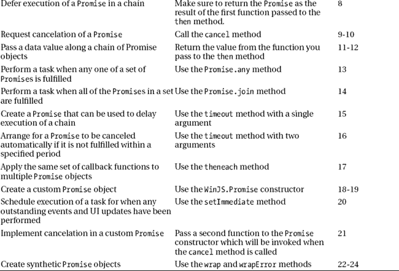
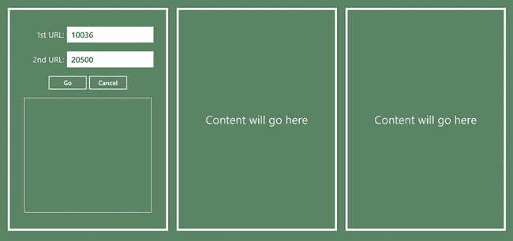
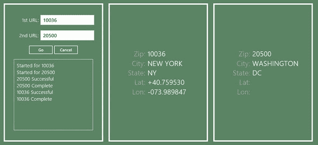
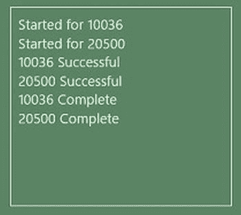
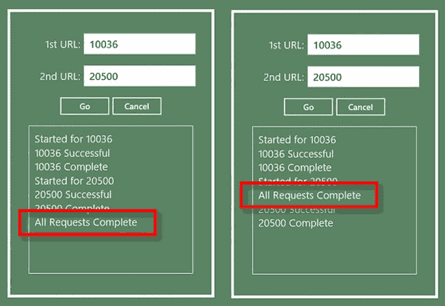
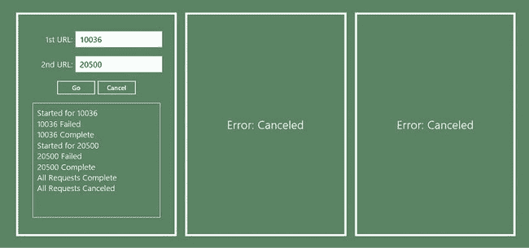
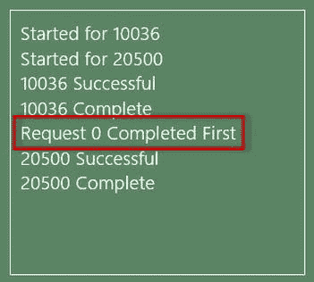
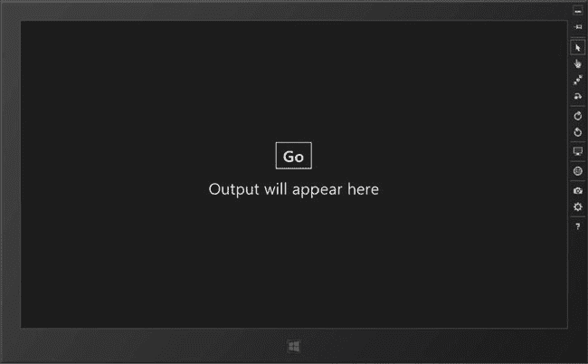

# 九、利用承诺

Windows 应用中异步编程的基本前提很简单。您调用一个方法，它执行的工作被安排在以后执行。在未来的某个时刻，工作被执行，并通过回调函数通知您结果。

异步编程在 JavaScript 中已经很成熟了。当您在 web 应用中发出 Ajax 请求时，您可能已经遇到过异步编程。你想从服务器加载一些内容，但不想阻止用户与应用进行交互。因此，您使用`XMLHttpRequest`对象(或 jQuery 之类的包装器库，使`XMLHttpRequest`对象更容易使用)进行了一次方法调用，并提供了一个在服务器内容到达时执行的函数。如果您没有使用 Ajax，web 应用在数据从服务器返回之前不会对用户交互做出响应，从而造成应用停滞不前的现象。

Windows 应用中的异步编程以相同的方式工作，并用于相同的目的-允许用户在执行其他操作时与应用进行交互。Windows 应用更广泛地使用异步编程，而不仅仅是 Ajax 请求，这就是为什么有一个通用对象来表示异步操作:`WinJS.Promise`对象。

术语 *promise* 表示在未来某个时间执行任务并返回结果的承诺。当这种情况发生时，这个承诺就被说成是*兑现了*。[表 9-1](#tab_9_1) 对本章进行了总结。

 **提示**`WinJS.Promise`对象是`CommonJS Promises/A`规范的一个实现，你可以在`[http://commonjs.org](http://commonjs.org)`读到。这正在成为 JavaScript 异步编程的标准，并在 jQuery 库采用它作为其延迟对象特性的基础时得到了极大的普及。

### 创建示例项目

开始异步编程的最佳方式是直接投入进去。为了构建一些熟悉的东西，我将使用用`WinJS.Promise`包装`XMLHttpRequest`对象的`WinJS.xhr`函数。为了演示这个特性，我使用 Visual Studio `Blank App`模板创建了一个名为`Promises`的新项目。[清单 9-1](#list_9_1) 显示了`default.html`文件的内容。

***清单 9-1** 。default.html 文件的内容*

`<!DOCTYPE html>
<html>
<head>
    <meta charset="utf-8" />
    <title>Promises</title>

    <!-- WinJS references -->
    <link href="//Microsoft.WinJS.1.0/css/ui-dark.css" rel="stylesheet" />
    
    `  `<!-- Promises references -->
    <link href="/css/default.css" rel="stylesheet" />
    
    
</head>
<body>
    

        

            

                <label>1st Zip:</label>
                <input id="zip1" data-win-bind="value: State.zip1" />
            

            

                <label>2nd Zip:</label>
                <input id="zip2" data-win-bind="value: State.zip2" />
            

            

                <button id="go">Go</button>
                <button id="cancel">Cancel</button>
            

            

        

        
Content will go here

        
Content will go here

    

    

        

    

    

        
<label>Zip:</label>
        
        
<label>City:</label>
        
        
<label>State:</label>
        
        
<label>Lat:</label>
        
        
<label>Lon:</label>
        
    

</body>
</html>`

这个应用执行邮政编码的网络搜索。布局分成三个面板，你可以在图 9-1 中看到。最左边的面板包含一对`input`元素，允许你输入邮政编码，旁边是`Go`和`Cancel`按钮。还有一个区域，我将在其中显示关于我发出的 Ajax 请求的消息。

***图一。**诺言 app 的初步布局*

中间和右侧面板是显示搜索结果的地方。正如您在清单中看到的，我已经定义了一个显示搜索结果的模板，使用了我在[第 8 章](08.html)中描述的技术。

你可以在清单 9-2 中看到我用来创建这个布局的 CSS，它显示了`css/default.css`。

***清单 9-2** 。default.css 的内容*

`body {
    display: -ms-flexbox;
    -ms-flex-direction: column;
    -ms-flex-align: center; -ms-flex-pack: center;
    background-color: #5A8463; color: white;      
}

div.container {
    display: -ms-flexbox; -ms-flex-direction: row;
    -ms-flex-align: center; -ms-flex-pack: center;
}

div.panel {
    width: 25%; border: thick solid white;
    margin: 10px; padding: 10px; font-size: 14pt;    
    height: 500px; width: 350px;
    display: -ms-flexbox; -ms-flex-direction: column;
    -ms-flex-align: center; -ms-flex-pack: center;
}

#left > div { margin: 10px 0;}
#left input {font-size: 14pt; width: 200px;}
div.panel label {display: inline-block; width: 100px; text-align: right;}
div.panel span {display: inline-block; width: 200px;}` `#messages {width: 80%; height: 250px; padding: 10px; border: thin solid white;}
#middle, #right {font-size: 20pt;}
#middle label, #right label {color: darkgray; margin-left: 10px;}`

如您所料，我已经为这个应用定义了一个简单的视图模型。清单 9-3 显示了视图模型的内容，我在一个名为`js/viewmodel.js`的文件中创建了这个视图模型。

***清单 9-3** 。承诺应用的视图模型*

`(function () {
    WinJS.Namespace.define("ViewModel", WinJS.Binding.as({
        State: {
            zip1: "10036", zip2: "20500",
        }
    }));

    ViewModel.State.messages = new WinJS.Binding.List();
})();`

最后，[清单 9-4](#list_9_4) 显示了`js/default.js`文件的内容。这个文件包含为布局中的`button`和`input`元素定位和设置事件处理函数的代码，但是它不包含实际向 web 服务发出请求的代码——我将在本章后面添加这个代码。

***清单 9-4** 。default.js 文件*

`(function () {
    "use strict";

    var app = WinJS.Application;
    var $ = WinJS.Utilities.query;

**    function requestData(zip, targetElem) {**
**        ViewModel.State.messages.push("Started for " + zip);**
**        // ...code will go here...**
**    }**

    app.onactivated = function (args) {

        $('input').listen("change", function (e) {
            ViewModel.State[this.id] = this.value;
        });

        $('button').listen("click", function (e) {
            if (this.id == "go") {
                var p1 = requestData(ViewModel.State.zip1, middle);
                var p2 = requestData(ViewModel.State.zip2, right);
            };
        });

        ViewModel.State.messages.addEventListener("iteminserted", function (e) {
                messageTemplate.winControl.render({ message: e.detail.value }, messages);
            });` `        WinJS.UI.processAll().then(function () {
            return WinJS.Binding.processAll(document.body, ViewModel);
        });
    };

    app.start();
})();`

至此，应用的基本结构已经完成。你可以在输入元素中输入邮政编码，你可以点击按钮——我所缺少的是做实际工作的代码，这也是我在本章剩余部分要关注的。

这个示例应用通过网络连接向远程服务器请求数据。这需要在应用清单中启用一个*功能*，让 Windows 和用户知道你的应用能够发出这样的请求。这允许 Windows 实施安全策略(不具备该功能的应用将不被允许发起请求)，并且允许用户在考虑从 Windows 应用商店购买应用时对您的应用存在的风险进行评估(尽管很明显用户实际上并不太关注此类信息)。

当您创建新的应用开发项目时，Visual Studio 会自动为您启用这一特定功能。要查看功能，双击`Solution Explorer`中的`package.appxmanifest`文件并导航到`Capabilities`选项卡。你会看到`Internet (Client)`被选中，如图[图 9-2](#fig_9_2) 所示，告诉 Windows 你的 app 能够发起出站网络连接。

***图 9-2。**启用呼出网络连接的能力*

### 处理基本异步编程流程

您可以判断何时处理异步操作，因为您调用的方法将返回一个`WinJS.Promise`对象。返回一个`Promise`的方法将把它们的工作安排在未来的某个时间发生，工作的结果将通过`Promise`发出信号。

*Scheduled* 在这个上下文中不是最有用的词，因为它暗示了未来某个固定的时间。事实上，你所知道的是工作将会完成——你对何时完成没有任何影响,也不知道离任务开始还有多长时间。*延迟*可能是一个更好的词，也是 jQuery 团队采用的词，但是调度是使用最广泛的术语。

使用异步方法是一种权衡。好处是你的应用可以执行后台任务，同时保持对用户的响应。缺点是你失去了对任务执行的直接控制，你不知道你的任务什么时候会被执行。

然而，在很大程度上，你没有选择。Windows 在整个 WinJS 和 Windows API 中使用异步编程，如果不采用`Promise`对象和它所代表的编程方法，你就无法创建一流的应用。

#### 使用异步回调

`Promise`对象使用回调函数为您提供关于异步任务结果的信息。您使用`then`方法注册这些函数。`then`方法最多接受三个回调函数作为参数。如果任务成功完成，则调用第一个函数(*成功回调*)，如果任务遇到错误，则调用第二个函数(*错误回调*)，并且在任务执行期间调用第三个函数来通知进度信息(*进度回调*)。

为了演示`Promise`对象，我使用了`WinJS.xhr`方法，它是标准`XMLHttpRequest`对象的包装器，您可以在 web 应用中使用它来发出 Ajax 请求。`WinJS.xhr`方法接受一个对象，该对象包含与`XMLHttpRequest`定义的属性相对应的属性，包括`url`、`type`、`user`、`password`和`data`，所有这些属性都不加修改地传递给`XMLHttpRequest`对象。

 **提示**您可能使用了 jQuery 等库中的便利包装器来管理您的请求，而没有直接使用`XMLHttpRequest`对象。你不需要理解`XMLHttpRequest`的工作原理来理解本章，但是如果你想要更多的信息，那么 W3C 规范是一个很好的起点:`[http://www.w3.org/TR/XMLHttpRequest](http://www.w3.org/TR/XMLHttpRequest)`

在清单 9-5 的[中，你可以看到我是如何在它返回的`Promise`上使用`WinJS.xhr`方法和`then`函数的，这展示了我是如何在`default.js`文件中实现`requestData`函数的。如清单所示，我使用 success 回调函数显示来自服务器的数据，使用 error 回调函数显示请求中任何问题的细节。](#list_9_5)

***清单 9-5** 。使用 WinJS。约定方法*

`...
function requestData(zip, targetElem) {

    ViewModel.State.messages.push("Started for " + zip);

    var promise = WinJS.xhr({
        url: "http://gomashup.com/json.php?fds=geo/usa/zipcode/" + zip
    }).then(function (xhr) {
        ViewModel.State.messages.push(zip + " Complete");
        var dataObject = JSON.parse(xhr.response.slice(1, -1)).result;
        WinJS.Utilities.empty(targetElem);
        zipTemplate.winControl.render(dataObject[0], targetElem);
    }, function (xhr) {` `        WinJS.Utilities.empty(targetElem);
        targetElem.innerText = "Error: " + xhr.statusText;
    });
    return promise;
}
...`

我传递给`WinJS.xhr`方法的对象有一个`url`属性，它指定了我想要请求的 URL。`WinJS.xhr`方法返回一个`Promise`对象，我使用`then`方法为成功和错误回调注册函数。

 **提示**你没有*有*要用`then`的方法。如果您不关心异步任务的结果，只需丢弃或忽略该方法返回的`Promise`来创建一个“一劳永逸”的任务。

`WinJS.xhr`方法立即返回，Ajax 请求将在未来某个未指定的时间执行。我无法控制请求何时开始，只有当我的一个回调函数被执行时，我才知道请求何时结束。

如果我的成功回调函数被执行，我知道我有一个来自服务器的响应，我处理并显示在布局中。如果我的错误回调函数被执行，那么我就知道出错了，并显示错误的详细信息。你可以在[图 9-3](#fig_9_3) 中看到结果，该图展示了点击`Go`按钮并完成创建的`Promise`对象后应用的布局。

***图 9-3。**使用回调处理程序响应已履行的承诺*

WinJS 和 Windows APIs 中的大多数异步方法往往比`WinJS.xhr`更细粒度，将某种结果对象传递给成功回调函数，将描述性字符串消息传递给错误函数(进度回调函数并不经常使用，尽管在本章后面我向您展示如何创建自己的`Promise`时，您可以看到演示)。

**使用 GOMASHUP 邮政编码服务**

我在这个例子中使用的 web 服务来自`GoMashup.com`，他提供了许多有用的数据服务。我选择 GoMashup 是因为他们的服务快速、可靠，并且不需要在请求中包含任何开发者密钥，这使得他们非常适合用于演示。例如，如果我想要关于邮政编码`10036`的信息，我使用以下 URL 进行查询:

`[http://gomashup.com/json.php?fds=geo/usa/zipcode/10036](http://gomashup.com/json.php?fds=geo/usa/zipcode/10036)`

我得到这样一个字符串:

`({"result":[{
    "Longitude" : "-073.989847",
    "Zipcode" : "10036",
    "ZipClass" : "STANDARD",
    "County" : "NEW YORK",
    "City" : "NEW YORK",
    "State" : "NY",
    "Latitude" : "+40.759530"
}]})`

GoMashup 服务旨在与 JSONP 一起使用，其中调用一个函数将数据插入到应用中。这意味着我需要去掉字符串的第一个和最后一个字符来获得一个有效的 JSON 字符串，我可以解析这个字符串来创建一个 JavaScript 对象。

#### 创建链

`then`方法的一个有趣的方面是它返回一个`Promise`,当回调函数被执行时，这个 T1 被实现。

这意味着当 Ajax 请求完成时，我从`requestData`函数返回的`Promise`并没有完成。相反，它是一个`Promise`，当 Ajax 请求已经完成*并且*成功或错误回调也已经执行时，它就完成了。

使用`then`方法创建动作序列被称为*链接*，它允许你控制任务执行的顺序。作为一个例子，我可以改变`requestData`函数的结构，使它更有用。目前，如果我的请求成功，我只向`ViewModel.State.messages`对象添加一条消息，但是使用`then`方法，我可以区分 Ajax 请求的实现和初始回调集的实现，如[清单 9-6](#list_9_6) 所示。

***清单 9-6** 。使用 then 方法将动作链接在一起*

`...
function requestData(zip, targetElem) {

    ViewModel.State.messages.push("Started for " + zip);`  `var promise = WinJS.xhr({
        url: "http://gomashup.com/json.php?fds=geo/usa/zipcode/" + zip
    }).then(function (xhr) {
**        ViewModel.State.messages.push(zip + " Successful");**
        var dataObject = JSON.parse(xhr.response.slice(1, -1)).result;
        WinJS.Utilities.empty(targetElem);
        zipTemplate.winControl.render(dataObject[0], targetElem);
    }, function (xhr) {
**        ViewModel.State.messages.push(zip + " Failed");**
        WinJS.Utilities.empty(targetElem);
        targetElem.innerText = "Error: " + xhr.statusText;
    });

**    return promise.then(function () {**
**        ViewModel.State.messages.push(zip + " Complete");**
**    });**

}
...`

你可以在[图 9-4](#fig_9_4) 中看到这些信息的顺序，图中显示了点击`Go`按钮的结果。

***图 9-4。**使用 then 方法控制异步任务的顺序*

`Promise`对象和`then`方法的一个缺点是，你最终会得到难以阅读的代码。更具体地说，很难确定任务链的执行顺序。为了帮助在清单 9-6 中弄清楚这一点，将`Promise`赋给一个名为`promise`的变量，然后分别使用`then`方法创建一个链。然而，通常情况下，`then`方法会更直接地应用，如[清单 9-7](#list_9_7) 所示。

***清单 9-7** 。直接在承诺上使用 then 方法创建链*

`function requestData(zip, targetElem) {

    ViewModel.State.messages.push("Started for " + zip);` `    var promise = WinJS.xhr({
        url: "http://gomashup.com/json.php?fds=geo/usa/zipcode/" + zip
    }).then(function (xhr) {
        ViewModel.State.messages.push(zip + " Successful");
        var dataObject = JSON.parse(xhr.response.slice(1, -1)).result;
        WinJS.Utilities.empty(targetElem);
        zipTemplate.winControl.render(dataObject[0], targetElem);
    }, function (xhr) {
        ViewModel.State.messages.push(zip + " Failed");
        WinJS.Utilities.empty(targetElem);
        targetElem.innerText = "Error: " + xhr.statusText;
**    }).then(function () {**
**        ViewModel.State.messages.push(zip + " Complete");**
**    });**

    return promise;
}`

因为`then`方法返回一个`Promise`对象，所以来自`requestData`方法的结果是一个`Promise`，当 Ajax 请求已经完成*并且*一个回调函数已经执行*并且*写`Complete`消息的函数已经执行时，这个结果被实现。链是组合`Promise`的一种简单方式，但是它们可能很难阅读。

 **提示**`Promise.done`方法是对`then`方法的补充。`done`方法必须作为一个链中的最后一个方法，因为它不返回结果。链中任何未处理的异常在到达`done`方法时被抛出(然而它们只是通过`then`方法反映在`Promise`的状态中)。像这样抛出一个异常并不是特别有用，因为在调用`done`方法时，应用代码的执行已经开始了。更好的方法是确保在链中使用错误回调函数来处理任何异常。

##### 连锁承诺

注意，图 9-4 中的[所示的信息是混合在一起的。这是因为 IE10 能够同时执行多个请求，并且每个请求独立地通过其生命周期。请求之间没有协调，这就是为什么消息是交错的，也是为什么您在运行示例时可能会看到不同的结果。当您看到我是如何在`Go`按钮的事件处理程序中调用`requestData`函数时，这是有意义的，如下所示:](#fig_9_4)

`...
var p1 = **requestData**(ViewModel.State.zip1, middle);
var p2 = **requestData**(ViewModel.State.zip2, right);
...`

我接收`requestData`函数返回的`Promise`对象，但是我不对它们做任何事情，所以请求是独立调度的。这对于我的示例应用来说很好，因为每个请求更新布局的不同部分，我不需要协调结果。

但是，在许多情况下，您会希望将一项任务推迟到另一项任务完成之后。你可以使用`then`方法创建一个链来完成这个任务，但是你必须注意从第二个请求中返回`Promise`对象作为你的回调函数的结果，如[清单 9-8](#list_9_8) 所示，它展示了我对`default.js`文件所做的更改，以确保请求按顺序执行。

***清单 9-8。**连锁承诺*

`...
$('button').listen("click", function (e) {
    if (this.id == "go") {
**        requestData(ViewModel.State.zip1, middle).then(function () {**
**            return requestData(ViewModel.State.zip2, right);**
**        });**
    };
});
...`

这真的很重要。如果从回调函数中返回`Promise`对象，那么链中的任何后续动作都不会被调度，直到`Promise`被完成。这意味着清单 8 中的代码会产生以下效果:

> 1.  Schedule the first request
> 2.  Wait until `Promise` from the first request
> 3.  Schedule the second request
> 4.  Wait until `Promise` from the second request
> 5.  Add a message to the `ViewModel.State.messages` object

这通常是所需要的效果——在前一个活动完成之前，不要安排下一个活动。然而，如果您省略了`return`关键字，您会得到一个非常不同的效果:

> 1.  Schedule the first request
> 2.  Wait until the first request `Promise` is satisfied
> 3.  Schedule the second request
> 4.  To the `ViewModel.State.messages` object
> 
> 添加消息

如果你没有从回调函数中返回一个`Promise`，那么后续的活动将会在回调函数执行完成后立即被调度——当你调用一个异步方法时，是在任务被调度后，而*不是*在任务完成后。

在我的示例应用中，这种差异很容易发现，因为我在请求的整个生命周期中都在编写消息。[图 9-5](#fig_9_5) 显示了两种情况下的消息顺序——左图显示了使用 return 关键字的效果，右图显示了没有 return 关键字的效果。指示器是`All Requests Complete`消息在事件序列中出现的地方。

省略关键字`return`并不总是错误的。如果您想将某个任务推迟到其前任完成之后，但不关心该任务的结果，那么省略`return`关键字是完全合适的。只要确保你知道你的目标是什么效果，并根据需要包括或省略`return`。

***图 9-5。**在回调函数中省略 return 关键字的影响*

#### 取消承诺

您可以通过调用`Cancel`方法来请求取消`Promise`。这并不像听起来那么有用，因为不要求`Promise`支持取消，如果支持，取消是一个请求，并且`Promise`几乎肯定会在检查取消之前完成当前的工作(当我在本章后面向您展示如何创建自己的`Promise`时，您可以看到这是如何工作的)。

`WinJS.Xhr`函数*返回的`Promise`确实支持取消，这也是我在本章一直使用它的原因之一。没有办法在你的应用中发现未实现的`Promise`对象，所以你需要保存对`Promise`的引用，就像你想要再次引用任何变量一样。你可以看到我是如何连接`Cancel`按钮并保存对我在[清单 9-9](#list_9_9) 中创建的`Promise`对象的引用的。*

***清单 9-9** 。取消承诺*

`...
**var p1;**
**var p2;**

$('input').listen("change", function (e) {
    ViewModel.State[this.id] = this.value;
});

$('button').listen("click", function (e) {
    if (this.id == "go") {
**        p1 = requestData(ViewModel.State.zip1, middle);**
**        p1.then(function () {**` `**            p2 = requestData(ViewModel.State.zip2, right);**
**            return p2;**
**        }).then(function () {**
**            ViewModel.State.messages.push("All Requests Complete");**
**        });**
    } else {
**        p1.cancel();**
**        p2.cancel();**
**        ViewModel.State.messages.push("All Requests Canceled");**
    }
});
...`

当按下`Cancel`按钮时，我在每个我在按下`Go`按钮时创建的`Promise`对象上调用`cancel`方法。这向`Promise`对象发出信号，我想终止对服务器的请求。

当您取消`Promise`时，会调用错误回调。传递给函数的对象有三个属性(`name`、`message`和`description`)，它们都被设置为字符串`Canceled`。你可以在清单 9-10 中的回调函数中看到我是如何处理这种情况的。如果有值的话，我显示`statusText`的值，否则显示`message`属性的值。

***清单 9-10** 。在错误回调中处理取消*

`...
function requestData(zip, targetElem) {

    ViewModel.State.messages.push("Started for " + zip);

    var promise = WinJS.xhr({
        url: "http://gomashup.com/json.php?fds=geo/usa/zipcode/" + zip
    }).then(function (xhr) {
        ViewModel.State.messages.push(zip + " Successful");
        var dataObject = JSON.parse(xhr.response.slice(1, -1)).result;
        WinJS.Utilities.empty(targetElem);
        zipTemplate.winControl.render(dataObject[0], targetElem);
    }, function (xhr) {
        ViewModel.State.messages.push(zip + " Failed");
        WinJS.Utilities.empty(targetElem);
        targetElem.innerText = "Error: "
            **+ (xhr.statusText != null ? xhr.statusText : xhr.message);**
    }).then(function () {
        ViewModel.State.messages.push(zip + " Complete");
    });

    return promise;
}
...`

测试该功能最简单的方法是重启(而不是刷新应用)，点击`Go`按钮，然后立即点击`Cancel`按钮。重新启动很重要，因为这意味着请求的任何方面都不会被缓存，只给你足够的时间来执行取消。你可以在[图 9-6](#fig_9_6) 中看到效果。

***图 9-6。**取消请求的影响*

#### 从承诺中传递结果

你可以在图 9-6 的[中看到，当发出取消请求的`Promise`任务被取消时，为每个请求写`Complete`消息和整个`All Requests Complete`消息的链式任务仍然被执行。](#fig_9_6)

有时候，这正是你想要的:不管前面的`Promise`中发生了什么都要执行的任务，但是你经常会想要在面对错误时有选择地进行。在清单 9-11 的[中，您可以看到我对`default.js`文件中的`requestData`函数所做的修改，以便在请求被取消时不显示`Complete`消息，这是通过从我的`Promise`函数返回结果来实现的。](#list_9_11)

***清单 9-11** 。从承诺传递结果*

`...
function requestData(zip, targetElem) {

    ViewModel.State.messages.push("Started for " + zip);

    var promise = WinJS.xhr({
        url: "http://gomashup.com/json.php?fds=geo/usa/zipcode/" + zip
    }).then(function (xhr) {
        ViewModel.State.messages.push(zip + " Successful");
        var dataObject = JSON.parse(xhr.response.slice(1, -1)).result;
        WinJS.Utilities.empty(targetElem);
        zipTemplate.winControl.render(dataObject[0], targetElem);
**        return true;**
    }, function (xhr) {
        ViewModel.State.messages.push(zip + " Failed");
        WinJS.Utilities.empty(targetElem);
        targetElem.innerText = "Error: "
            + (xhr.statusText != null ? xhr.statusText : xhr.message);
**        return false;**` `    }).then(function (**allok**) {
**        if (allok) {**
**            ViewModel.State.messages.push(zip + " Complete");**
**        }**
        return allok;
    });

    return promise;
}
...`

当由`WinJS.xhr`函数返回的`Promise`被满足时，我的成功或错误处理函数将被执行。我已经修改了成功处理程序，使它返回`true`，表明请求已经完成。我将错误处理程序改为返回 false，表示出现了错误或请求被取消。

来自被执行的处理函数的`true`或`false`值被作为参数传递给链中的下一个`then`函数。在这个例子中，我使用这个值来判断是否应该显示请求的`Complete`消息。

您可以通过这种方式沿着`Promise`对象链传递任何对象，每个`then`函数可以返回不同的结果，甚至是不同种类的结果。在清单中，当我在`default.js`文件的其他地方使用时，我从作为参数接收的`then`函数返回相同的值，如[清单 9-12](#list_9_12) 所示。

***清单 9-12** 。将结果沿着链传递得更远*

`...
$('button').listen("click", function (e) {
    if (this.id == "go") {
        p1 = requestData(ViewModel.State.zip1, middle);
        p1.then(function () {
            p2 = requestData(ViewModel.State.zip2, right);
            return p2;
        }).then(function (**allok**) {
**            if (allok) {**
                ViewModel.State.messages.push("All Requests Complete");
**            }**
        });
    } else {
        p1.cancel();
        p2.cancel();
        ViewModel.State.messages.push("All Requests Canceled");
    }
});
...`

记住，`requestData`函数返回的`Promise`对象是最后一个`then`函数返回的对象，所以我从那个函数返回的结果将作为参数传递给链中的下一个函数——如清单所示。我使用`true` / `false`值来决定是否应该向用户显示`All Requests Complete`消息。这是一个简单的数据流经一系列`Promise`的例子，但是它清楚地展示了这种技术的灵活性。当点击图 9-7 中的`Cancel`按钮时，您可以看到向用户显示的一组精简的消息。

***图 9-7。**通过一个链传递来自承诺对象的结果的效果*

### 协调承诺

`then`函数并不是协调异步任务的唯一方法。`Promise`对象支持其他几种方法，这些方法可以用来创建特定的效果，或者使处理多个`Promise`对象变得更容易。我在[表 9-2](#tab_9_2) 中总结了这些方法，并在下面演示了它们的用法。

#### 使用任意方法

`any`方法接受一组`Promise`并返回一个`Promise`作为结果。当自变量数组中的`Promise`对象中的*任意一个*被满足时，由`any`方法返回的`Promise`被满足。你可以在清单 9-13 中看到正在使用的`any`方法。

***清单 9-13** 。使用任意方法*

`...
var p1, p2;`  `$('button').listen("click", function (e) {
    if (this.id == "go") {
        p1 = requestData(ViewModel.State.zip1, middle);
        p2 = requestData(ViewModel.State.zip2, right);

**        WinJS.Promise.any([p1, p2]).then(function (complete) {**
**            complete.value.then(function (result) {**
**                if (result) {**
**                    ViewModel.State.messages.push("Request " + complete.key**
**                        + " Completed First");**
**                } else {**
**                    ViewModel.State.messages.push("Request " + complete.key**
**                        + " Canceled or Error");**
**                }**
**            });**
**        });**

    } else {
        p1.cancel();
        p2.cancel();
        ViewModel.State.messages.push("All Requests Canceled");
    }
});
...`

如果您使用`then`方法在由`any`方法返回的`Promise`上设置一个回调，您的函数将被传递一个具有两个属性的对象。`key`属性返回参数数组中被满足的`Promise`的索引(结果导致 any `Promise`被满足)。`value`属性返回一个`Promise`,当它被满足时，传递来自任务链的结果。您可以看到我是如何使用这两个值向布局中写入消息的，该消息报告了哪个请求首先完成及其结果。您可以在图 9-8 中看到该示例生成的输出。

***图 9-8。**用任意方式报告哪个承诺先兑现*

 **提示**`any`方法返回的`Promise`在底层的`Promise`之一满足后立即满足。`any` `Promise`不会等到所有的`Promise`都实现了才告诉你哪一个是第一个。当任何一个`Promise`完成时，其他`Promise`对象可能仍未完成。

#### 使用 join 方法

`join`方法类似于`any`方法，但是它返回的`Promise`直到参数数组中所有`Promise`对象的*都被实现后才被实现。你可以在清单 9-14 中看到正在使用的`join`方法。传递给`then`回调函数的参数是一个数组，包含所有原始`Promise`对象的结果，按照原始数组的顺序排列。*

***清单 9-14** 。使用连接方法*

`...
var p1, p2;

$('button').listen("click", function (e) {
    if (this.id == "go") {
        p1 = requestData(ViewModel.State.zip1, middle);
        p2 = requestData(ViewModel.State.zip2, right);

        WinJS.Promise.any([p1, p2]).then(function (complete) {
            complete.value.then(function (result) {
                if (result) {
                    ViewModel.State.messages.push("Request " + complete.key
                        + " Completed First");
                } else {
                    ViewModel.State.messages.push("Request " + complete.key
                        + " Canceled or Error");
                }
            });
        });

**        WinJS.Promise.join([p1, p2]).then(function (results) {**
**            ViewModel.State.messages.push(results.length + " Requests Complete");**
**            results.forEach(function (result, index) {**
**                ViewModel.State.messages.push("Request: " + index + ": " + result);**
**            });**
**        });**

    } else {
        p1.cancel();
        p2.cancel();
        ViewModel.State.messages.push("All Requests Canceled");
    }
});
...`

注意，我可以在同一套`Promise`对象上使用`any`和`join`方法。一个`Promise`能够支持对`then`方法的多次调用，并将正确执行多组回调。你可以在[图 9-9](#fig_9_9) 中看到使用`any`和`then`方法的效果。

***图 9-9。**any 和 join 方法显示的消息*

#### 使用超时

方法有两种用途，做完全不同的事情。最简单形式的`timeout`方法采用一个数字参数，并返回一个在指定时间段后实现的`Promise`。这可能看起来有点奇怪，但是当你想推迟一系列`Promise`的调度时，它会很有用。你可以在[清单 9-15](#list_9_15) 中看到它是如何工作的。

***清单 9-15** 。使用超时方法推迟承诺*

`...
var p1, p2;

$('button').listen("click", function (e) {
    if (this.id == "go") {

**        WinJS.Promise.timeout(3000).then(function () {**
            p1 = requestData(ViewModel.State.zip1, middle);
            p2 = requestData(ViewModel.State.zip2, right);

            WinJS.Promise.any([p1, p2]).then(function (complete) {
                complete.value.then(function (result) {
                    if (result) {
                        ViewModel.State.messages.push("Request "
                            + complete.key + " Completed First");
                    } else {
                        ViewModel.State.messages.push("Request "
                            + complete.key + " Canceled or Error");
                    }
                });
            });` `            WinJS.Promise.join([p1, p2]).then(function (results) {
                ViewModel.State.messages.push(results.length + " Requests Complete");
                results.forEach(function (result, index) {
                    ViewModel.State.messages.push("Request: " + index + ": " + result);
                });
            });
**        });**
    } else {
        p1.cancel();
        p2.cancel();
        ViewModel.State.messages.push("All Requests Canceled");
    }
});
...`

在这个清单中，我创建了三秒钟的延迟。一旦这段时间过去，由`timeout`方法返回的`Promise`将自动完成，我用`then`方法设置的回调函数被调用——在这种情况下，我对服务器的邮政编码数据的请求直到单击`Go`按钮三秒后才开始。

##### 为承诺设置超时

`timeout`方法的另一个用途是设置`Promise`的到期时间。要使用这个版本的方法，您需要传入一个超时值和您想要应用它的`Promise`。你可以看到这种形式的`timeout`方法是如何用在[清单 9-16](#list_9_16) 中的。

***清单 9-16** 。使用超时方法自动取消承诺*

`...
var p1, p2;

$('button').listen("click", function (e) {
    if (this.id == "go") {

        WinJS.Promise.timeout(250, p1 = requestData(ViewModel.State.zip1, middle));
        WinJS.Promise.timeout(2000, p2 = requestData(ViewModel.State.zip2, right));

        WinJS.Promise.any([p1, p2]).then(function (complete) {
            complete.value.then(function (result) {
                if (result) {
                    ViewModel.State.messages.push("Request "
                        + complete.key + " Completed First");
                } else {
                    ViewModel.State.messages.push("Request "
                        + complete.key + " Canceled or Error");
                }
            });
        });        
    } else {
        p1.cancel();
        p2.cancel();` `        ViewModel.State.messages.push("All Requests Canceled");
    }
});
...`

在这个清单中，我使用`timeout`方法为一个请求设置 250 毫秒的最大持续时间，为另一个请求设置 2 秒。如果请求在这些时间内完成，那么没有什么特别的事情发生。然而，如果在周期结束时没有实现`Promise`对象，它们将被自动`cancelled`(这是通过调用我在本章前面演示的`cancel`方法来执行的)。为了让这个有用，你需要确保你正在使用的`Promise`对象支持取消。

#### 对多个承诺应用相同的回调函数

`theneach`方法是将同一组回调函数应用于一组`Promise`对象的一种便捷方式。这个方法不会改变`Promise`的调度顺序，但是它会返回一个`Promise`，这相当于为回调函数返回的所有`Promise`调用`join`方法。[清单 9-17](#list_9_17) 显示了正在使用的`theneach`方法。

***清单 9-17** 。使用新方法*

`...
var p1, p2;

$('button').listen("click", function (e) {
    if (this.id == "go") {

        p1 = requestData(ViewModel.State.zip1, middle);
        p2 = requestData(ViewModel.State.zip2, right);

**        WinJS.Promise.thenEach([p1, p2], function (data) {**
**            ViewModel.State.messages.push("A Request is Complete");**
**        }).then(function (results) {**
**            ViewModel.State.messages.push(results.length + " Requests Complete");**
        **});**

    } else {
        p1.cancel();
        p2.cancel();
        ViewModel.State.messages.push("All Requests Canceled");
    }
});
...`

我只指定了一个成功函数，但是您也可以指定错误和进度回调。没有传递给回调的上下文信息来指示哪个`Promise`正在被处理，这使得`theneach`方法没有它本来应该有的用处。

### 创建自定义承诺

创建异步方法有两种方式。第一种，您已经看到了，是建立在现有的异步方法上，操作它们返回的`Promise`对象并返回结果。本章第一个示例应用中的`requestData`函数就是这样创建的异步方法的一个很好的例子。

另一种方法是实现您自己的`Promise`,并创建一个在未来某个时间执行的定制任务。当您想从头开始创建异步方法时，可以采用这种方法。在这一节中，我将向您展示如何创建您自己的`Promise`对象。我创建了一个名为`CustomPromise`的 Visual Studio 项目，其中所有的标记、代码和 CSS 都包含在一个文件中。您可以在[清单 9-18](#list_9_18) 中看到这个文件`default.html`的内容。

 **注意**这是一个高级主题，大多数应用都不需要。也就是说，即使您不需要立即使用这种技术，快速浏览这一部分也会帮助您理解由 WinJS 和 Windows 名称空间中的方法返回的`Promise`对象是如何工作的。

***清单 9-18** 。default.html 档案*

`<!DOCTYPE html>
<html>
<head>
    <meta charset="utf-8" />
    <title></title>
    <link href="//Microsoft.WinJS.1.0/css/ui-dark.css" rel="stylesheet" />
    
    
    
    
</head>
<body>
    <button>Go</button>
    

        Output will appear here
    

</body>
</html>`

这个简单的应用非常适合演示如何创建定制的`Promise`。你可以在[图 9-10](#fig_9_10) 中看到布局。

***图 9-10。**custom promise app 的布局*

当点击`Go`按钮时，我调用`calculateSum`函数，该函数生成前 10，000，000 个整数的和。这个任务需要几秒钟才能完成，在此期间，应用*没有响应*。当应用没有响应时，用户界面不会响应用户交互。对于这个简单的例子，您可以看出有问题，因为在点击了`button`元素之后，直到求和计算完成，它才返回到未按下的状态。这是因为`click`事件是在 CSS 更改被应用之前被触发和处理的，这意味着计算会阻止任何 UI 更新，直到它完成。这就是异步方法要解决的问题。

 **提示**10，000，000 这个值对我的电脑来说很好，但是如果你有一个更快的系统，你可能需要增加它，或者为一个更慢的系统减少它。为了获得问题的本质(和解决方案)，您希望任务花费大约 5-10 秒。

#### 实现承诺

第一步是创建`Promise`对象，通过向`Promise`对象构造函数传递一个函数来完成。你可以在[清单 9-19](#list_9_19) 中看到我是如何做到的。

***清单 9-19** 。创建承诺对象*

`...

...`

传递给`Promise`构造函数的函数有三个参数，每个参数都是一个函数。第一个参数是您在完成任务并希望返回结果时调用的参数。如果要报告错误，可以调用第二个参数。当您想要制作进度报告时，会调用最后一个参数。

您可以看到，我在这个清单中添加了对报告错误的支持。如果`calculateSum`函数的 count 参数小于 5000，我调用`fError`函数来指出问题。对于其他值，我计算总和并通过`fDone`函数返回结果。(如果您愿意，可以忽略目标是固定的这一事实——`calculateSum`函数不知道这一点)。

当您创建一个异步方法时，您返回`Promise`对象，以便调用者可以使用`then`方法来接收任务的结果或创建一个链。您可以在示例中看到我是如何这样做的，以便从由`calculateSum`方法返回的承诺中获得结果。

#### 延期执行

我已经实现了一个`Promise`，但是我仍然有一个问题:当我点击`Go`按钮时，应用仍然没有响应。创建一个`Promise`不会自动推迟任务的执行，这是一个常见的陷阱。要创建一个真正的异步方法，我必须采取额外的步骤，显式地调度工作。我已经用`setImmediate`函数完成了，如[清单 9-20](#list_9_20) 所示。

***清单 9-20** 。推迟任务的执行*

`...

...`

创建一个好的异步方法有两个基本规则。第一条规则是将任务分成小的子任务，这些子任务只需要很短的时间就能完成。第二个规则是一次只安排一个子任务。如果你偏离了其中任何一条规则，那么你最终会得到一个没有响应的应用*和*创建和管理一个`Promise`所涉及的费用。

创建子任务的最佳方式会因所做工作的种类而异。对于我的例子，我只需要在较小的块中执行计算，每个块都通过调用清单中的内联`calcBlock`函数来处理。

我已经使用`setImmediate`方法安排了我的子任务，这被定义为 IE10 对 JavaScript 支持的一部分。这是一种相对较新的方法，旨在补充常用的`setTimeout`。当您将一个函数传递给`setImmediate`时，您要求它在所有未决事件和 UI 更新完成后立即执行。

您需要使用子任务的原因是，一旦 JavaScript 运行时开始执行您的函数，任何新的事件和 UI 更新都会建立起来。通过将工作分解成子任务，并仅在每个任务完成时调用`setImmediate`，您给了 JavaScript 运行时一个清除事件和更新积压的机会。在完成执行一个子任务和开始下一个子任务之间，运行时能够响应用户输入并保持应用响应。

因为我已经将工作分解成子任务，所以我利用这个机会在每组计算结束时调用`fProgress`函数来向任何感兴趣的听众报告进度。您可以看到，我在我的`then`调用中添加了第三个函数来接收和显示这些信息。

**WINDOWS 应用中的并行处理**

如果你密切关注了这一章，你会注意到我没有使用*平行*这个词。JavaScript 在单线程运行时中执行，这就是为什么没有关键字来确保原子更新或创建关键部分，就像在 C#和 Java 等语言中一样。当你创建一个异步方法并实现后台任务时，你并没有创建一个新线程；相反，您只是简单地推迟任务，直到主(也是唯一的)线程能够并且愿意执行它。

然而，*有可能用 JavaScript 创建真正的并行应用，不同的任务由不同的线程同时执行。一种方法是构建用本机代码编写的异步功能。当我使用一个`XMLHttpRequest`对象发出 Ajax 请求时，您已经看到了这样一个例子。`XMLHttpRequest`对象是浏览器的一部分，能够创建和管理多个并发请求。这种并行性对 JavaScript 代码是隐藏的，回调通知被封送到主 JavaScript 线程进行简单处理。Windows API 也是用本机代码编写的，您的调用通常会导致多线程的创建和执行，即使作为 JavaScript 程序员，您并不知道这种复杂性。*

如果你想用 JavaScript 创建一个真正的并行应用，那么你应该看看 Web Workers 规范。这是与 HTML5 相关的规范之一，它受 IE10 支持。创建和维护 Web workers 的成本相对较高，这意味着它们只适合于长期任务，应该谨慎使用。我在本书中没有深入讨论 Web Workers 规范，因为它不是一个特定于应用的特性，但是你可以在`[http://msdn.microsoft.com/en-us/library/windows/apps/hh767434.aspx](http://msdn.microsoft.com/en-us/library/windows/apps/hh767434.aspx)`阅读更多关于 IE10 支持的内容。

#### 实施取消

您不必在自己的定制中实现对取消的支持，但是这样做是一个好主意，尤其是对于长期任务或资源密集型任务。

这是因为调用`cancel`方法将触发错误回调来通知取消，即使您的`Promise`不支持取消。这意味着你的`Promise`将继续调度工作(并消耗资源),即使回调函数已经被调用，应用已经继续运行。作为最后的侮辱，你的任务结果将被悄悄地丢弃。

要实现取消，您需要向`Promise`构造函数传递第二个函数。如果在`Promise`对象上调用了`cancel`方法，那么你的函数将被执行。你可以看到我是如何在清单 9-21 中的例子中添加取消支持的。

***清单 9-21** 。在自定义承诺中增加取消支持*

`<!DOCTYPE html>
<html>
<head>
    <meta charset="utf-8" />
    <title></title>
    <link href="//Microsoft.WinJS.1.0/css/ui-dark.css" rel="stylesheet" />
    
    
    
    
</head>
<body>
    <button>Go</button>
**    <button>Cancel</button>**
    

        Output will appear here
    

</body>
</html>`

我在 HTML 的`default.html`中添加了一个`Cancel`按钮，点击这个按钮会调用在点击`Go`按钮时创建的`Promise`的取消方法。注意，我很小心地取消了由`calculateSum`函数返回的`Promise`,而不是由`then`方法返回的`Promise`——重要的是取消正在工作的`Promise`,而不是随后将被启动的`Promise`。

 **提示**注意，你不必经常检查取消。我发现在安排下一个子任务之前执行检查是一种合理的方法，在响应性和复杂性之间取得了良好的平衡。

### 创造合成承诺

您会发现,`WinJS.Promise`对象在 Windows APIs 中被广泛使用，有时您需要创建一个`Promise`,作为您已经拥有的数据值的包装器。在这种情况下，`WinJS.Promise`对象定义了一些有用的方法。我已经在[表 9-3](#tab_9_3) 中描述了这些方法，并在下面的章节中演示了两个最有用的方法。

我已经更新了`CustomPromise`应用，这样就有一个函数接受一个`Promise`并使用`then`方法来设置将向用户显示信息的回调。你可以在清单 9-22 的[中看到这个例子的`script`元素(HTML 和 CSS 没有改变)。](#list_9_22)

***清单 9-22** 。创建一个接受承诺的函数*

`...

...`

在这种安排下，如果我想显示不在`Promise`中的数据，我会受到限制。当然，我可以重写函数使之更加灵活，但是这并不总是可能的，尤其是在使用别人的代码时。解决方案是创建一个`Promise`，它的唯一目的是返回一个值或错误。这样的`Promise`没有异步方面，这就是为什么它们被称为*合成* `Promise`的原因

#### 写下你自己的承诺

理解这是如何工作的最好方法是从编写你自己的合成`Promise`开始。对于这个例子，我想在我的代码中处理两种新的情况。如果用户在点击`Go`按钮之前点击`Cancel`按钮，我想显示一个错误，我想优化应用，这样如果我已经知道结果，我就不会执行计算(即，如果用户按顺序点击`Go`按钮两次)。你可以在清单 9-23 的[中看到我需要添加的`script`元素。](#list_9_23)

***清单 9-23** 。创建自定义合成承诺对象*

`...

...`

我在这个清单中创建的`Promise`只返回一个结果——没有任务，也没有对`setImmediate`的调用。在每种情况下，我只是调用其中一个函数来指示我的`Promise`完成了或者遇到了错误。

#### 使用包装方法

我在上一节中创建的合成`Promise`对象的问题是，WinJS API 不知道我只是将它们用作适配器，所以我可以使用`displayResults`函数。当一个`Promise`被创建时，有许多管道要设置，我承担了设置所有东西的成本，只是为了稍后丢弃它。为了解决这个问题，`Promise`对象定义了`wrap`和`wrapError`方法，它们创建轻量级的`Promise`对象。这意味着它们被明确地用作适配器，并且创建起来不那么复杂和昂贵。当您想要创建一个满足预定结果的`Promise`时，您可以使用`wrap`方法；当您想要打包一个错误消息时，您可以使用`wrapError`方法。[清单 9-24](#list_9_24) 展示了这些方法在示例应用中的应用。

***清单 9-24** 。使用 wrap 和 wrapError 方法*

`...

...`

你应该优先使用`wrap`和`wrapError`方法来创建你自己的合成`Promise`物体。它们不仅更便宜，而且代码更简单，因此更容易阅读和维护。

### 总结

在这一章中，我已经向你展示了`WinJS.Promise`对象背后的细节。WinJS 和 Windows APIs 中有许多异步方法，对它们的机制有很好的理解对于编写复杂的应用是必不可少的。重要的是要记住，Windows 应用中的 JavaScript 代码是在单线程上执行的，同时还有事件处理程序和 UI 更新。当您创建自定义异步方法时，您管理的是单线程上的工作调度，而不是创建多个并行线程。如果您在应用中遇到异步操作的问题，通常是因为您将代码视为多线程。在本书的第三部分中，我向你展示了 WinJS UI 控件，你可以用它来增强你的应用，并创建一个与其他 Windows 应用一致的外观。