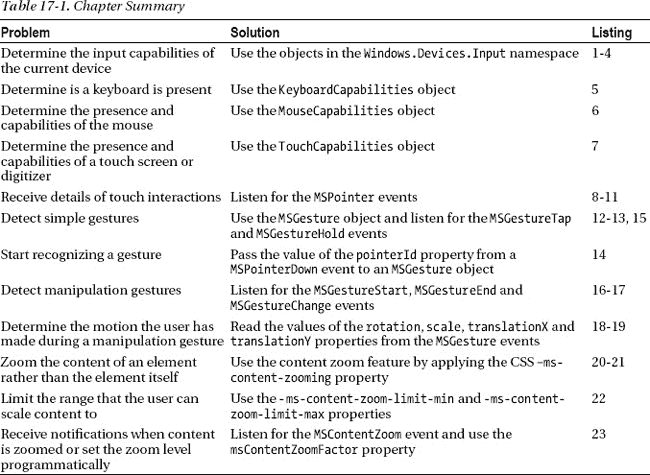
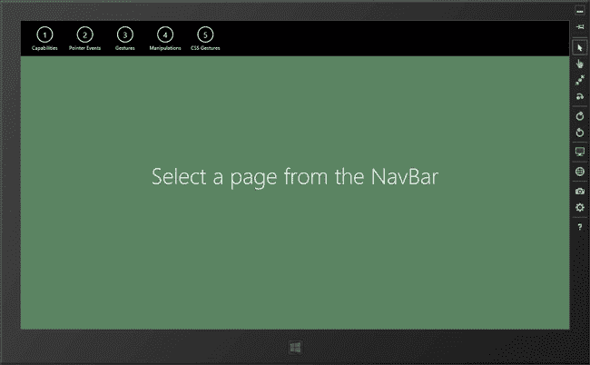
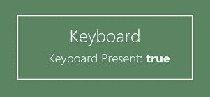
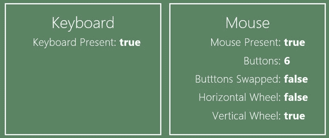
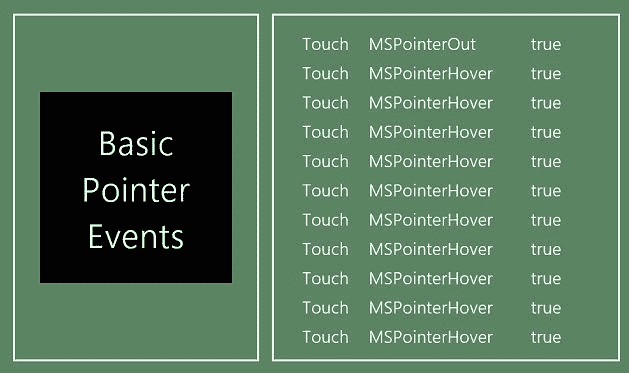
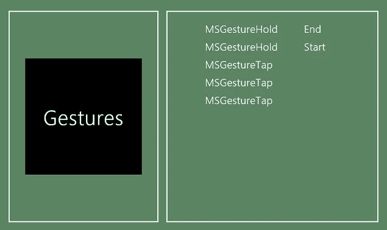
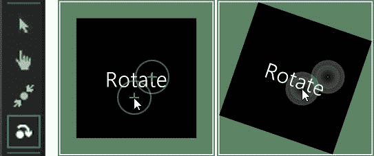
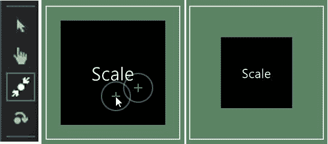
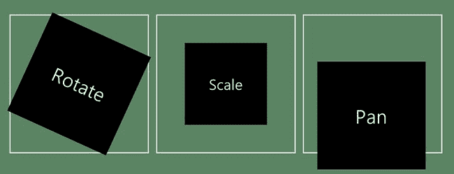
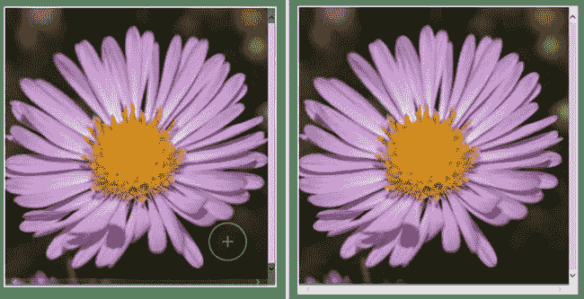

## 第十七章

## 使用指针和手势

到目前为止，在本书中，我一直依赖标准的 DOM 事件，如`click`和`moveover`来响应用户输入。对于简单的交互来说，这是一种可行的方法，但是需要不同的技术来充分利用 Windows 应用程序，特别是支持触摸手势，这使得用户可以轻松地表达复杂的命令。在本章中，我将向您展示如何确定 Windows 8 设备支持哪些输入技术，解释 Windows 如何使用一个通用的*指针系统*来表示这些输入，以及如何识别触摸手势。[表 17-1](#tab_17_1) 对本章进行了总结。

### 创建示例项目

我创建了一个名为`AppInput`的项目来演示 Windows 应用程序可以支持的不同事件和手势。我将在自己的内容页面中展示每个主要功能，因此我创建了一个熟悉的带有`NavBar`的主内容页面的应用程序结构，这将允许用户在应用程序中导航。在清单 17-1 中，您可以看到`default.html`文件的内容，它将作为示例应用程序的母版页。

***清单 17-1** 。default.html 文件的内容*

`<!DOCTYPE html>
<html>
<head>
    <meta charset="utf-8">
    <title>AppInput</title>
    <link href="//Microsoft.WinJS.1.0/css/ui-dark.css" rel="stylesheet" />
    
    
    <link href="/css/default.css" rel="stylesheet">
    
</head>
<body>
    

        <h1>Select a page from the NavBar</h1>
    

    

        <button data-win-control="WinJS.UI.AppBarCommand"
            data-win-options="{id:'DeviceCapabilities', label:'Capabilities',
                icon:'\u0031', section:'selection'}">
        </button>  
        <button data-win-control="WinJS.UI.AppBarCommand"
            data-win-options="{id:'PointerEvents', label:'Pointer Events',
                icon:'\u0032', section:'selection'}">
        </button>  
        <button data-win-control="WinJS.UI.AppBarCommand"
            data-win-options="{id:'Gestures', label:'Gestures',
                icon:'\u0033', section:'selection'}">
        </button>  
        <button data-win-control="WinJS.UI.AppBarCommand"
            data-win-options="{id:'Manipulations', label:'Manipulations',
                icon:'\u0034', section:'selection'}">
        </button>  
        <button data-win-control="WinJS.UI.AppBarCommand"
            data-win-options="{id:'CSSGestures', label:'CSS Gestures',
                icon:'\u0035', section:'selection'}">
        </button>  
    

</body>
</html>`

这个文件包含给用户的初始消息和导航条命令，这些命令允许用户导航到我将在本章中添加的五个内容页面。这是一个比我用于 UI 控件更简单的应用程序结构，例如，我不需要从定义对象生成元素。

#### 定义 CSS

所有内容页面的 CSS 都可以在`/css/default.css`文件中找到，其内容可以在[清单 17-2](#list_17_2) 中看到。这个文件中没有新的技术，我把它包括进来只是为了让你能看到这个示例应用程序的每个方面。

***清单 17-2** 。/css/default.css 文件的内容*

`body { background-color: #5A8463; display: -ms-flexbox;
    -ms-flex-direction: column; -ms-flex-align: center; -ms-flex-pack: center;}

.container { display: -ms-flexbox; -ms-flex-direction: row;
    -ms-flex-align: stretch; -ms-flex-pack: center; }

.panel { border: medium white solid; margin: 10px; padding: 20px;    
    display: -ms-flexbox; -ms-flex-direction: column; -ms-flex-align: stretch;
    -ms-flex-pack: center; text-align: center;}

.sectionHeader { font-size: 30pt; text-align: center; padding-bottom: 10px;}

.coloredRect { background-color: black; color: white; width: 300px; height: 300px;
    margin: 20px; font-size: 40pt; display: -ms-flexbox;
    -ms-flex-direction: column; -ms-flex-align: stretch; -ms-flex-pack: center; }

#eventList { width: 500px; height: 500px;}

.eventDisplay { background-color: #5A8463;}
.pointerDetail, .eventDetail, .primaryDetail {
    display: inline-block; width: 250px; font-size: 20pt; text-align: left;}
.pointerDetail {width: 100px;}
.primaryDetail {width: 75px;}

input.cinput {width: 75px;display: inline-block;margin-left: 20px;font-size: 18pt;}
.imageRect {width: 600px;height: 80vh;}

#capabilitiesContainer div.panel {-ms-flex-pack: start;}
.capabilityTitle {text-align: right; width: 250px; }
span.capabilityResult { text-align: left; font-weight: bold; width: 80px; }
div.capability {font-size: 20pt;width: 350px;}
div.capability > * {display: inline-block;padding-bottom: 10px;}`

#### 定义 JavaScript

`/js/default.js`文件包含应用程序的导航代码，使用了您现在熟悉的相同模式。这是一个稍微简化的版本，因为我在这个应用程序中使用的唯一数据绑定是在模板中，所以当我加载新内容页面时，我不必调用`WinJS.Binding.processAll`方法。与我的其他示例页面一样，导航代码从 Visual Studio 项目的`pages`文件夹中加载内容文件。您可以在[清单 17-3](#list_17_3) 中看到`default.js`文件的内容。

***清单 17-3** 。/js/default.js 文件的内容*

`(function () {
    "use strict";

    var app = WinJS.Application;

    WinJS.Navigation.addEventListener("navigating", function (e) {

        WinJS.UI.Animation.exitPage(contentTarget.children).then(function () {
            WinJS.Utilities.empty(contentTarget);
            WinJS.UI.Pages.render(e.detail.location, contentTarget)
            .then(function () {
                return WinJS.UI.Animation.enterPage(contentTarget.children)
            });
        });
    });

    app.onactivated = function (eventObject) {
        WinJS.UI.processAll().then(function () {
            navbar.addEventListener("click", function (e) {
                var navTarget = "pages/" + e.target.winControl.id + ".html";
                WinJS.Navigation.navigate(navTarget);
            });
        })
    };

    app.start();
})();`

[图 17-1](#fig_17_1) 显示了应用程序的基本布局，如果您此时运行应用程序并调出导航条，您将会看到这个布局。在接下来的部分中，我将向应用程序添加内容页面，以演示应用程序支持指针和手势的不同方式。

***图 17-1。**app 的初始布局*

### 确定设备的输入能力

本章的起点是计算用户设备支持何种输入形式的技术。您可以通过使用`Windows.Devices.Input`名称空间中的对象来获取这些信息，该名称空间提供了关于设备对键盘、鼠标和触摸交互的支持的信息。

确定哪些输入功能可用对于定制应用程序呈现的用户体验非常有用。例如，如果没有键盘，您可能不想显示允许用户配置键盘快捷键的设置。(题外话，我在[第 20 章](20.html#ch20)中向你展示了如何管理应用程序设置并呈现给用户)。

为了演示如何确定设备输入功能，我在示例 Visual Studio 项目的 pages 文件夹中添加了一个名为`DeviceCapabilities.html`的新文件。你可以在清单 17-4 中看到这个文件的内容。

***清单 17-4** 。DeviceCapabilities.html 文件的内容*

`<!DOCTYPE html>
<html>
<head>
    <title></title>
    
</head>
<body>
    

        <h1 class="sectionHeader" data-win-bind="innerText: section"></h1>
    

    

        <h2 class="capabilityTitle" data-win-bind="innerText: name"></h2>:
        
    

    

</body>
</html>`

我已经使用`WinJS.Binding.Template`功能生成了一个显示设备功能的布局。`generateCapabilityPanel`函数接受一个标题和一组功能，并在 DOM 中生成元素来显示它们。我采用这种方法，这样我就不必列出大量的 HTML 标记，因为我想展示这种形式的模板绑定。

当我调用`Template.render`方法时，我接收到一个`Promise`对象，当从模板中生成新元素时，该对象被满足。传递给`then`函数的对象是已经创建的顶级元素(这是因为我省略了`render`方法的第二个参数，它指定了模板元素将要插入的容器元素——如果我指定了一个元素，那么这个容器元素将被传递给`then`函数)。

我使用这种方法是因为`Template`控件在从模板创建元素时去掉了`class`属性的值。为了解决这个问题，我使用了`WinJS.Utilities.addClass`方法，并使用 DOM `appendChild`方法将模板元素插入到文档中。这些都与设备功能没有直接关系，但是我忍不住展示了使用 WinJS 模板的另一种方法。

#### 确定键盘功能

您可以通过创建一个新的`Windows.Devices.Input.KeyboardCapabilities`对象来获取有关用户设备键盘功能的信息。该对象只定义一个属性，该属性指示设备上是否有键盘。我已经在[表 17-2](#tab_17_2) 中总结了这个属性，以便您在以后返回本章时可以轻松找到它，并且不想阅读文本来查找属性名称。

在清单 17-5 中，您可以看到我是如何创建`KeyboardCapabilities`对象并读取属性的值的。注意，这个属性返回的是`1`而不是`true`，因此为了得到一个`true` / `false`值，我必须将属性值与数字文字值`1`进行比较。

***清单 17-5** 。检测硬件键盘的存在*

`...
var kbd = new input.KeyboardCapabilities();
generateCapabilityPanel("Keyboard", [{
    name: "Keyboard Present", value: kbd.keyboardPresent == 1
}]);
...`

`keyboardPresent`属性与*硬件*键盘相关。没有硬件键盘的设备仍然支持通过软件键盘输入文本，当合适的 HTML 元素(如`input`或`textarea`元素)获得焦点时，软件键盘会自动显示文本。

如果此时运行应用程序，并使用`Capabilities` NavBar 命令导航，您将会看到如图[图 17-2](#fig_17_2) 所示的内容。图 17 显示了在我的开发 PC 上运行的应用程序，正如你所料，它有一个键盘。

***图 17-2。**确定设备是否有键盘*

#### 确定鼠标功能

您可以通过`Windows.Devices.Input.MouseCapabilities`对象获得关于鼠标的信息，该对象定义了[表 17-3](#tab_17_3) 中所示的属性。

T2】

注意不要因为`SwapButtons`属性返回`1`就认为用户是左撇子。如果你有一个可以从左手和右手配置中受益的界面，那么把`SwapButtons`值作为一个提示，但是要求用户明确地确认他们想要一个替代的配置。在[清单 17-6](#list_17_6) 中，你可以看到我是如何确定和显示由`DeviceCapabilities.html`文件的脚本元素中的示例应用程序中的`MouseCapabilities`对象定义的属性值的。

***清单 17-6** 。确定鼠标的存在和功能*

`...

...`

我建议在对鼠标做假设时要谨慎。虽然大多数用户以标准的方式使用鼠标，但是惊人数量的用户重新配置鼠标的操作方式，以便在某些情况下重新映射按钮或执行宏。重新配置鼠标设备的软件质量变化很大，好的软件通过重新映射操作系统的硬件功能工作得很好。写得很差的代码(到处都有)使用了各种令人讨厌的黑客手段，你从用户那里得到的输入并不总是与 Windows 报告的功能相对应。我的建议是不要假设用户将能够使用垂直滚轮，例如，当`verticalWheelPresent`属性返回`1`时，它很可能完全被重新映射到一些其他函数，因此您应该对如何在您的应用程序中导航内容保持灵活。在[图 17-3](#fig_17_3) 中，你可以看到在我的开发 PC 上运行应用程序并选择`Capabilities`导航条命令的结果。

 **提示**Visual Studio 模拟器将总是报告一个不带滚轮的 2 键鼠标，而不管连接到运行模拟器的 PC 的硬件如何。

***图 17-3。**确定当前设备的鼠标功能*

#### 确定触摸能力

最后一类输入是触摸，包括触摸屏和数字化平板电脑在内的各种设备类型。您可以使用`Windows.Devices.Input.TouchCapabilities`对象查看设备是否支持触摸，该对象定义了[表 17-4](#tab_17_4) 中所示的属性。

如果设备有多个触摸面，那么`contacts`属性返回能力最差的一个支持的接触点的数量。你可以看到我是如何使用清单 17-7 中的`TouchCapabilities`对象的，它显示了我对`DeviceCapabilities.html`文件的`script`元素的添加。

 **注意**我发现当`TouchPresent`属性描述的设备有更多接触点时，它经常返回`1`。

***清单 17-7** 。使用 TouchCapabilities 对象*

`...

...`

你可以在[图 17-4](#fig_17_4) 中看到这段代码生成的结果。我已经在我的开发 PC 上运行了示例应用程序，我在 PC 上连接了一个便宜的数字化平板。

***图 17-4。**显示设备触摸功能的详细信息*

### 处理指针事件

您可以在 Windows 应用程序中愉快地使用标准的 DOM 事件，如`click`和`mouseover`。负责运行 JavaScript Windows 应用程序的 Internet Explorer 10 将生成这些事件，而不管用于生成它们的输入设备是什么。这意味着，例如，当点击一个`button`元素时，它将触发一个`click`事件，而不管用户是用鼠标、触摸屏上的手指还是数字化仪上的笔进行交互。这些事件由 IE10 生成，以提供与 web 应用程序的兼容性，您可以在您的应用程序代码中非常安全地使用它们，正如我在本书的示例应用程序中所做的那样。

然而，如果你想使用 Windows 触摸手势，那么你需要使用`MSPointer`事件。这些事件与 web 应用程序开发中的标准 DOM 事件相对应，但是它们具有额外的属性，这些属性提供了所使用的输入类型的详细信息。在[表 17-5](#tab_17_5) 中，我列出了`MSPointer`事件，并描述了它们被触发的情况。没有叫`MSPointer`的事件——这个名字指的是事件名称*以`MSPointer`—`MSPointerDown`、`MSPointerUp`等开始*。

 **提示**`MSPointer`事件与 DOM 兼容性事件一起生成。您可以毫无问题地监听像`MSPointerMove`和`mousemove`这样的混合事件，尽管有时在`MSPointer`事件和被触发的标准 DOM 事件之间会有一点延迟。

T2】

对这些事件的描述必然是模糊的，因为它们涉及广泛的交互类型。当用户点击鼠标时，当手指或手写笔触摸屏幕时，或者使用不太常见的设备进行其他交互时，指针可以*触摸*一个元素。为了演示这些事件是如何工作的，我在示例 Visual Studio 项目的`pages`文件夹中添加了一个名为`PointerEvents.html`的文件，您可以在[清单 17-8](#list_17_8) 中看到。

***清单 17-8** 。PointerEvents.html 文件的内容*

`<!DOCTYPE html>
<html>
<head>
    <title></title>
    
</head>
<body>
    

        

            

            

            

        

    

    

        

            

                Basic Pointer Events
            

        

        

            

            

        

    

</body>
</html>`

这个页面的布局由一个简单的彩色块组成，您可以与它交互以生成事件。我通过将事件添加到一个`WinJS.Binding.List`对象来处理它们，该对象是一个`ListView`控件的数据源(你可以在第 8 章的[中了解到`WinJS.Binding.List`对象，在第 15 章](08.html#ch8)的[中了解到`ListView` UI 控件)。你可以在](15.html#ch15)[图 17-5](#fig_17_5) 中看到结果，显示了简单交互后的内容。

***图 17-5。**响应 MSPointer 事件*

您可以像注册常规 DOM 事件一样注册您对指针事件的兴趣——但是您必须注意使用正确的大写。例如，事件名称是`MSPointerDown`，而不是`mspointerdown`、`MsPointerDown`或任何其他排列。你可以在[清单 17-9](#list_17_9) 中看到我是如何设置我的处理函数的。我已经注释掉了`MSPointerMove`事件，因为任何交互都会产生许多这样的事件，很难发现其他类型的事件。

***清单 17-9** 。注册一个函数来处理 MSPointer 事件*

`...
var eventTypes = [
    "MSPointerUp", "MSPointerDown","MSPointerOut",
    "MSPointerOver","MSPointerCancel","MSPointerHover",
**    /*"MSPointerMove" */**
    "MSGotPointerCapture", "MSLostPointerCapture"];

eventTypes.forEach(function (eventType) {
    targetElem.addEventListener(eventType, function (e) {
        eventList.unshift(e);
    }), true;
});
...`

`MSPointer`事件并不直接等同于 HTML DOM 中的事件，但在很大程度上，它们非常相似，并且以与仅使用鼠标的交互一致的方式触发。例如，当用户触摸屏幕上的元素时，就会触发`MSPointerDown`和`MSPointerUp`事件，无论用户使用的是鼠标还是触摸屏，都是如此。

有两件事很麻烦。`MSPointerHover`事件是指当一个点在一个元素上移动而没有接触到屏幕时被触发。这听起来很合理，但我无法在真实的硬件上触发这个事件——尽管在应用模拟器中触发它很容易(只需选择模拟器窗口右边缘的`Basic Touch Mode`按钮，并将鼠标指针移动到元素上)。

我也不能触发`MSPointerCancel`事件。当设备中止交互时会触发此事件，微软给出的例子是当同时触摸点的数量超过触摸屏或数字化仪处理它们的能力时。我已经在我能找到的所有硬件上测试了[清单 17-8](#list_17_8) 中的代码，但是还不能触发这个事件。

#### 获取指针信息

一个`MSPointer`事件的处理函数被传递一个`MSPointerEvent`对象，它实现了一个常规 DOM `Event`的所有方法和属性，但是增加了一些内容。许多附加功能被系统用来计算多个事件是如何形成一个手势的，但是有一些属性可能更有用，我已经在[表 17-6](#tab_17_6) 中描述了这些属性。

你可以看到我是如何通过我的`ListView`模板显示这些属性的，如[清单 17-10](#list_17_10) 所示。

***清单 17-10** 。在 ListView 模板中显示选中的 MSPointerEvent 值*

`...

    

        

        

        

    

...`

通过选择不同的输入模式，您可以在模拟器中生成不同类型的事件。模拟器窗口右侧的按钮允许您在鼠标和触摸输入之间移动。

导致`MSPointer`事件被触发的指针类型可通过`pointerType`属性获得。该属性返回一个数值，您可以将其与由`MSPointerEvent`对象定义的此类值的枚举进行比较。在这个例子中，我使用了一个绑定转换器将数值转换成有意义的文本，如清单 17-11 中的[所示。](#list_17_11)

***清单 17-11** 。确定 MSPointer 事件的类型*

`...
var pointerTypeConverter = WinJS.Binding.converter(function (typeCode) {
    switch (typeCode) {
        case MSPointerEvent.MSPOINTER_TYPE_MOUSE:
            return "Mouse";` `        case MSPointerEvent.MSPOINTER_TYPE_PEN:
            return "Pen";
        case MSPointerEvent.MSPOINTER_TYPE_TOUCH:
            return "Touch";
        default:
            return "Unknown";
    }
});
...`

值`MSPOINTER_TYPE_MOUSE`、`MSPOINTER_TYPE_PEN`和`MSPOINTER_TYPE_TOUCH`对应于`pointerType`属性返回的值。

 **提示来自数字化平板的**事件通常被报告为`MSPOINTER_TYPE_MOUSE`事件，而不是`MSPOINTER_TYPE_PEN`事件。这取决于数字化仪硬件是如何被识别的——我测试过的许多输入设备对系统来说就像鼠标一样，大概是为了更广泛的兼容性。

我在模板中显示的第三个字段指示事件是否由输入设备上的主要点生成。这与多点触摸设备有关，其中第一个接触点(通常是触摸屏幕的第一个手指)被认为是主要点。响应其他手指的移动或接触而触发的事件将为`isPrimary`属性返回`false`。

### 处理手势

手势是以特定顺序接收的一系列事件。因此，例如，一个点击手势由一个`MSPointerDown`事件组成，在某个时刻，后面跟着一个`MSPointerUp`事件。我说*在某些时候*是因为手势交互是复杂的——用户的手指可能会在指针被按下然后释放的时刻之间移动，指针可能会移动到你正在收听的事件所在的元素之外，等等。微软已经包含了一些有用的工具，可以更容易地处理手势，而不必处理它们派生的单个事件。在接下来的部分中，我将向您展示如何在用户执行手势时接收通知，以及您可以在应用程序中响应手势的一些不同方式。

处理手势可能相当复杂，所以我将从最简单的手势开始，逐步增加到更复杂的。为了演示基础知识，我在 Visual Studio 项目的`pages`目录中添加了一个名为`Gestures.html`的文件，你可以在[清单 17-12](#list_17_12) 中看到。

***清单 17-12** 。Gestures.html 文件的内容*

`<!DOCTYPE html>
<html>
<head>
    <title></title>
    
</head>
<body>
    

        

            

            

        

    

    

        

            

                Gestures
            

        

        

            

            

        

    

</body>
</html>`

该内容遵循我用于指针事件的相同模式。有一个彩色的矩形，我监听它的事件——但是在这个例子中有一些关键的不同。

最基本的手势是`tap`和`hold`，分别用`MSGestureTap`和`MSGestureHold`事件表示。为了从一个元素接收这些事件，我必须创建一个`MSGesture`对象，并告诉它我希望它对哪个元素进行操作，如清单 17-13 所示。

***清单 17-13** 。创建 MSGesture 对象*

`...
var ges = new MSGesture();
ges.target = targetElem;
...`

`MSGesture`对象内置于 Internet Explorer 10 中，因此您不需要使用名称空间来引用它。使用`target`属性设置想要接收手势事件的元素——在本例中，我指定了作为我的彩色矩形的`div`元素。

 **提示**`MSGesture`对象只处理单一元素。如果您想要接收多个元素的手势事件，那么您需要为每个元素创建`MSGesture`对象。

`MSGesture`对象解除了您跟踪单个`MSPointer`事件的责任，但是您需要告诉它，通过`addPointer`方法传递来自`MSPointerDown`事件的细节，一个新的手势可能正在开始，该方法接受由`MSPointerEvent`对象的`pointerId`属性返回的值，如[清单 17-14](#list_17_14) 所示。

***清单 17-14** 。开始一个手势*

`...
ges.addPointer(e.pointerId);
...`

此时，您不需要做任何其他事情——`MSGesture`对象将跟踪来自元素的事件，并在手势出现时生成事件。手势事件的处理函数被传递一个`MSGestureEvent`对象，该对象包含关于手势的信息。点击手势没有额外的细节，但是保持手势可以导致多个`MSGestureHold`事件被触发。您可以通过读取`detail`属性并将其与`MSGestureEvent`对象枚举的值进行比较来确定这些事件的重要性，如[表 17-7](#tab_17_7) 中所述。

在例子中，我使用一个`ListView`和一个非常简单的项目模板来响应事件的基本手势和细节作为列表。我已经定义了一个绑定转换器，这样我就可以读取`detail`值并显示一个有意义的字符串，如清单 17-15 中的[所示。](#list_17_15)

***清单 17-15** 。通过读取细节属性*确定手势事件的重要性

`...
var holdConverter = WinJS.Binding.converter(function (detail) {
    if (detail == MSGestureEvent.MSGESTURE_FLAG_BEGIN) {
        return "Start";
    } else if (detail == MSGestureEvent.MSGESTURE_FLAG_END) {
        return "End";
    } else if (detail == MSGestureEvent.MSGESTURE_FLAG_CANCEL) {
        return "Cancel";
    } else {
        return "";
    }
});
...`

你可以在图 17-6 中看到这些值是如何显示的，以及手势事件的类型。

***图 17-6。**响应顶部和保持手势*

#### 表演基本手势

为了测试这个例子，您需要知道如何执行手势。在介绍每个手势时，我将向您展示如何使用鼠标在触摸屏上创建它，以及如何使用鼠标在 Visual Studio 模拟器中模拟触摸。

要使用鼠标执行点击手势，只需在元素上单击鼠标按钮并立即释放——对于鼠标使用，执行点击手势与生成`click`事件并触发`MSGestureTap`事件是一样的。要执行保持手势，单击鼠标按钮并按住它——几秒钟后会触发`MSGestureHold`事件。

在触摸屏上，用一个手指按下并立即释放元素以执行点击手势，然后按住(即，不要将手指从屏幕上移开)以执行保持手势。

在模拟器中，使用模拟器窗口右边缘的按钮选择`Basic Touch Mode`，如图 17-7 中的[所示。光标变为代表手指(显示为带有十字光标的大圆)。您的光标现在是一个手指——按下鼠标按钮模拟用手指触摸屏幕，松开按钮模拟移开手指。如果你想回到模拟器中常规的鼠标交互，那么选择`Mouse Mode`，它就在`Basic Touch Mode`按钮的正上方。](#fig_17_7)

***图 17-7。**在 Visual Studio 模拟器中选择基本触摸模式*

### 搬运操作

操作是更复杂的手势，允许用户缩放、旋转、平移和滑动元素。为了演示操作手势，我在 Visual Studio 项目中添加了一个名为`Manipulations.html`的文件。你可以在清单 17-16 中看到这个文件的内容。

***清单 17-16** 。Manipulations.html 文件的内容*

`<!DOCTYPE html>
<html>
<head>
    <title></title>
    
</head>
<body>
    

        

            
Rotate

        

        

            
Scale

        

        

            
Pan

        

    

</body>
</html>`

对于这个例子，我已经创建了三个目标元素，每个元素都用我将在接下来的小节中应用的操作进行了标记。你可以在[图 17-8](#fig_17_8) 中看到初始布局。

***图 17-8。**可以应用操作手势的元素*

#### 表演操纵手势

这个示例演示的操作手势是*旋转*、*缩放*和*平移*，在深入研究示例代码之前，我将向您展示如何执行每个手势。您需要在示例中的相应元素上执行每个手势。

 **注意**您可以使用触摸或鼠标进行平移动作，但旋转和缩放手势仅适用于触摸。

##### 旋转元素

要旋转一个元素，用两个手指触摸屏幕，并围绕一个中心点做圆周运动。要在模拟器中执行该手势，从模拟器窗口的右边选择`Rotation Touch Mode`按钮。光标将变为两个圆圈，代表手势的两个手指。将光标放在元素上，并按住鼠标按钮。向上滚动垂直鼠标滚轮执行逆时针旋转，向下滚动垂直鼠标滚轮执行顺时针旋转。释放鼠标按钮以完成手势。在[图 17-9](#fig_17_9) 中可以看到`Rotation Touch Mode`按钮、模拟光标和效果。

 **提示**不按鼠标键滚动鼠标滚轮，改变模拟手指的初始位置。

***图 17-9。**选择旋转触摸模式，旋转一个元素*

##### 缩放元素

要缩放一个元素(也称为*捏/缩放手势)*将两个手指放在显示屏上，将它们分开以放大元素。一起移动手指会缩小元素。要在模拟器中模拟该手势，选择`Pinch/Zoom Touch Mode`按钮。光标将变为代表两个手指。在元素上按住鼠标按钮以开始手势，并使用鼠标滚轮调整接触点–向上滚动滚轮会将接触点分开，向下滚动滚轮会将它们一起移动。释放鼠标按钮以完成手势。在[图 17-10](#fig_17_10) 中可以看到`Pinch/Zoom Touch Mode`按钮、模拟光标和缩放手势的效果。

 **提示**两个接触点都需要在元素内才能发起手势。在不按下按钮的情况下使用鼠标滚轮来调整接触点之间的距离，以使它们合适。

***图 17-10。**选择挤压/缩放触摸模式并缩放一个元素*

##### 平移元素

平移手势是唯一可以使用鼠标执行的操作:只需在元素上按住鼠标按钮并移动鼠标，元素就会跟随鼠标指针移动。手势的工作方式与触摸非常相似——触摸元素，然后移动手指在屏幕上移动元素。要模拟触摸手势，选择`Basic Touch Mode`并按下鼠标按钮，模拟将手指放在屏幕上。

#### 处理操纵手势事件

使用手势时，您需要为每个想要变换的元素创建一个`MSGesture`对象，并使用`target`元素来关联它所应用的元素。在[清单 17-17](#list_17_17) 中，您可以看到我是如何在示例中做到这一点的，在数组上使用了`forEach`方法，这样我就可以用相同的方式设置所有的元素，并表达对相同事件集的兴趣。

***清单 17-17** 。设置 MSGesture 对象并监听操作手势事件*

`...
var eventTypes = ["MSPointerDown", "MSGestureStart", "MSGestureEnd", "MSGestureChange"];
...
var ids = ["rotate", "scale", "pan"];
var elems = [];
var gestures = [];

ids.forEach(function (id) {
    elems[id] = document.getElementById(id);
    gestures[id] = new MSGesture();
    gestures[id].target = elems[id];
    eventTypes.forEach(function (eventType) {
        elems[id].addEventListener(eventType, handleGestureEvent);
    });
});
...`

操纵手势有它们自己的一套事件，我在[表 17-8](#tab_17_8) 中描述了这些事件。当用户开始执行操作手势时触发`MSGestureStart`事件，当手势完成时触发`MSGestureEnd`事件。当用户移动指针时，使用`MSGestureChange`事件发送关于手势的更新。

系统不会区分不同的手势。这些事件的处理函数被传递给一个包含附加属性的`MSGestureEvent`对象，该属性包含用户所做的旋转、缩放和平移的详细信息。由你来决定你想对这些运动的哪些方面做出反应。我在[表 17-9](#tab_17_9) 中总结了这些特性。

这种方法的好处是用户可以同时执行多个手势。您可以选择要读取的属性值，并忽略那些表示您不感兴趣的手势的属性值。这是我在示例中采用的方法，我只想为布局中的每个元素支持一种手势。

##### 使用 CSS3 转换响应操作

你可以在应用程序中以任何有意义的方式响应操作手势，但如果你想让用户直接操作布局中的元素，那么最简单的方法是使用 CSS3 转换，这在 Internet Explorer 10 中是受支持的。你可以在例子中看到我是如何使用清单 17-18 中的[函数来完成的。](#list_17_18)

***清单 17-18** 。处理操作手势事件的细节*

`...
function filterGesture(e) {
    var matrix = new **MSCSSMatrix**(e.target.style.transform);
    switch (e.target.id) {
        case "rotate":
            return **matrix.rotate**(e.rotation * 180 / Math.PI);
            break;
        case "scale":
            return **matrix.scale**(e.scale);
            break;
        case "pan":
            return **matrix.translate**(e.translationX, e.translationY)
            break;
    };
}
...`

表示布局中元素的每个 DOM 对象都有一个`style.transform`属性，您可以将它用作`MSCSSMatrix`对象的构造函数参数。传递给事件处理函数的每个`MSGestureEvent`对象包含自上次事件以来每次操作的变化量，而`MSCSSMatrix`对象使得通过`rotate`、`scale`和`translate`方法应用这些变化变得容易。

 **提示**`CSSMatrix`对象和元素`style.transform`属性是 CSS3 过渡和转换特性的一部分，我将在第 18 章的[中详细介绍。](18.html#ch18)

唯一不方便的是,`MSGestureEvent.rotation`值是用弧度表示的，而 CSS3 转换是用度数表示的——您可以在清单中看到我是如何从一种转换到另一种的。你必须记住将`rotate`、`scale`或`translate`方法的结果设置为用户正在操作的元素的`transform`属性，如[清单 17-19](#list_17_19) 所示。

***清单 17-19** 。将更新后的变换应用于被操纵的元素*

`function handleGestureEvent(e) {
    if (e.type == "MSPointerDown") {
        gestures[e.target.id].addPointer(e.pointerId);
    } else {
**        e.target.style.transform = filterGesture(e);**
    }
}`

你可以在图 17-11 中看到操纵所有三个元素的结果。

***图 17-11。**操纵示例中的元素*

### 使用内容缩放

*内容缩放*允许你缩放一个元素的内容，而不是元素本身。你可以在[图 17-8](#fig_17_8) 中看到，我放大了其中一个元素，以至于它溢出了初始边界——这是一个巧妙的技巧，但有时你只是想让用户在原位缩放内容，这就是内容缩放允许的。为了演示这个特性，我在示例 Visual Studio 项目的`pages`文件夹中添加了一个名为`CSSGestures.html`的新文件。你可以在清单 17-20 中看到这个文件的内容。

***清单 17-20** 。CSSGestures.html 文件的内容*

`<!DOCTYPE html>
<html>
<head>
    <title></title>
    
</head>
<body>
    

        

            
        

    

</body>
</html>`

使用 CSS 配置内容缩放功能，本例中没有`script`块。我依赖于一个名为`aster.jpg`的图像文件，我已经将它添加到 Visual Studio 项目的`images`目录中——你可以在这个例子中使用任何图像，我使用的图像包含在本章的源代码下载中，可以从`Apress.com`获得(并且是我在第 14 章的[中用来演示`WinJS.UI.FlipView`控件的图像之一)。](14.html#ch14)

本章这一节的内容非常简单。图像以相当大的格式显示。用户可以触摸屏幕并做出缩放手势来缩放图像。在[图 17-12](#fig_17_12) 中可以看到布局的原始状态和放大后的内容。该手势与标准缩放手势的主要区别在于，图像已在其容器的边界内缩放，但容器保持不变。

***图 17-12。**使用内容缩放手势*

控制内容缩放手势的 CSS 属性在[表 17-10](#tab_17_10) 中进行了描述，在接下来的章节中，我将向您展示如何使用它们，并解释支持值的范围。

#### 启用内容缩放功能

启用内容缩放手势需要两个属性。首先，您必须将 CSS `overflow`属性设置为`scroll`。该属性并不特定于内容缩放，但它是启用该功能所必需的。第二个属性是`–ms-content-zooming`，必须设置为`zoom`。结合这些属性可以启用元素的内容缩放功能。

你必须将这些属性应用到一个有内容的元素上，如[清单 17-21](#list_17_21) 所示。您可以看到内容是一个`img`元素，它包含在一个 div 中。这是内容缩放手势应用到的`div`元素。

***清单 17-21** 。对包含内容的元素应用内容缩放功能*

`<!DOCTYPE html>
<html>
<head>
    <title></title>
    
</head>
<body>
    

        

            
        

    

</body>
</html>`

#### 应用缩放限制

您可以使用`-ms-content-zoom-limit-min`和`ms-content-zoom-limit-max`属性来限制内容的缩放量。这些以原始大小的百分比表示。用户可以在执行捏合/缩放手势时将内容缩放到这些限制之外，但当手势结束时，它会迅速恢复到该限制。在这个例子中，我设置了 50%的最小比例和 200%的最大比例，如清单 17-22 中的[所示。设置这些属性时，不要忘记`%`符号。](#list_17_22)

***清单 17-22** 。应用缩放限制*

`...
-ms-content-zoom-limit-min: 50%;
-ms-content-zoom-limit-max: 200%;
...`

 **提示**`-ms-content-zoom-limit`便利属性允许您在一条语句中指定最小值和最大值。

#### 设置缩放内容样式

`-ms-overflow-style`属性允许您配置内容缩放后的显示方式。该属性支持的值如[表 17-11](#tab_17_11) 所示。

我倾向于使用`-ms-autohiding-scrollbar`值，它可以确保用户意识到他们可以在元素的内容周围平移，但是使用滚动条，滚动条覆盖在内容的顶部，并且只在用户与内容交互时显示。相比之下，由`scrollbar`值应用的滚动条增加了元素的大小，并且总是被显示。你可以在[图 17-13](#fig_17_13) 中看到不同之处。左图显示了`-ms-autohiding-scrollbar`值的效果，右图显示了`scrollbar`值。

***图 17-13。**使用内容缩放功能时滚动条的不同样式*

#### 限制缩放级别的范围

您可以通过应用`-ms-content-zoom-snap-points`属性来限制缩放级别的范围。用户在执行收缩/缩放手势时可以缩放到任何级别，但是内容将会靠齐该属性指定的最接近的缩放级别。有两种方法指定捕捉点，如[表 17-12](#tab_17_12) 所述。

T2】

#### 以编程方式使用内容缩放

虽然 CSS 用于设置内容缩放，但它还有一些编程特性。当用户改变内容的比例时，`MSContentZoom`事件被触发，您可以使用`msContentZoomFactor`属性获取或设置缩放因子。[清单 17-23](#list_17_23) 显示了对`CSSGestures.html`文件的一些添加，以演示事件和属性的使用。

***清单 17-23** 。程序化内容缩放功能*

`<!DOCTYPE html>
<html>
<head>
    <title></title>
    
**    **
</head>
<body>
    

        

            
        

**        
**
**          
**
**                <h2 class="sectionHeader">Zoom Factor:</h2>**
**                <input id="zoomFactor" class="cinput"/>**
**            
**
**        
**
    

</body>
</html>`

我在布局中添加了一个`input`元素，当`MSContentZoom`事件被触发时，这个元素会被更新。当输入元素的值改变时，我通过更新`msContentZoomFactor`属性来处理`change`事件。在[图 17-14](#fig_17_14) 中可以看到修改后的布局。

 **注意**`msContentZoomFactor`是直接在`HTMLElement`对象上定义的，而不是由 WinJS 定义的。这意味着您不需要使用`winControl`来访问属性——您可以直接从`document.getElementById`方法返回的对象中获取或设置值。

***图 17-14。**在 JavaScript 中使用内容缩放功能*

### 总结

在这一章中，我向您展示了如何确定设备上可用的输入形式，以及如何使用`MSPointer`事件来响应用户交互。这些事件提供了对常规 DOM 事件的重要增强，因为它们包含了输入机制的细节，可以用来识别手势。我向您展示了手势系统的工作原理，并演示了简单的手势和操作。在本章的最后，我演示了如何使用内容缩放功能来创建另一种效果。这个特性依赖于 CSS——我将在下一章回到这个主题，在那里我将描述 WinJS 动画系统。