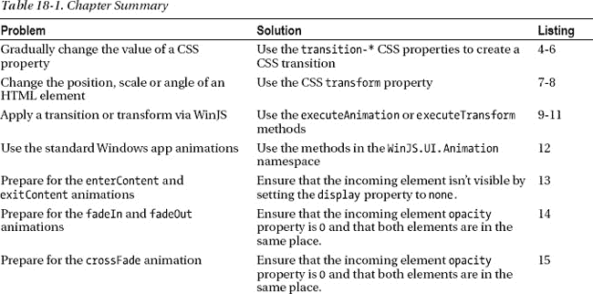
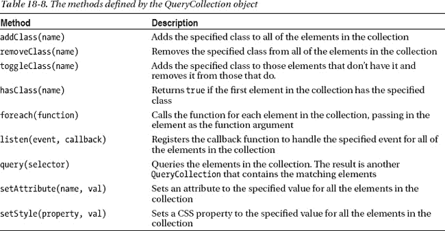

## 第十八章

## 使用动画和实用程序

在这一节中，我将向您展示如何使用 WinJS 动画特性。Windows 应用程序通常具有的颜色和排版的一致性可能会使用户难以意识到内容已被更新或替换，因此用一个简短的动画来突出显示这种变化可能会很有用。我在前面的章节中提到了一些基本的动画特性，但是现在我要回到这个主题上来。我首先向您展示如何直接使用 WinJS 所依赖的 CSS 特性，然后解释这些特性是如何被 WinJS 动画便利方法打包的。WinJS 包含一些用于常见布局更新场景的预打包动画，我将向您展示如何使用这些动画——包括如何为动画准备元素以及如何在之后进行整理。

在本章的第二部分，我描述了一些在`WinJS.Utilities`名称空间中有用的方法。我在整本书中一直在使用这些方法，并且我已经描述了当我第一次使用它们时它们做了什么。在这一章中，我给出了一个更完整的使用指南，并演示了一些额外的功能，包括计算布局中元素的大小和位置，以及创建一个灵活的日志记录系统，即使应用程序没有连接到调试器，您也可以使用该系统。表 18-1 对本章进行了总结。

T4】

### 使用动画

出于我不完全理解的原因，当涉及到应用程序中的动画时，一些程序员变得有点疯狂。不仅仅是 Windows 应用程序——你可以在网络应用程序、桌面应用程序以及任何地方看到这种疯狂的结果。你可以很快疏远你的用户，特别是如果动画阻止用户继续当前的任务。过多的动画是业务线应用程序中的一种残酷形式，用户将日复一日地重复执行相同的任务。在开发过程中看起来很酷很刺激的动画，当你的用户每天看一百遍的时候，会让他们筋疲力尽。当涉及到 Windows 应用程序中的动画时，我遵循一套简单的规则，我建议你也这样做:

> 1.  Only use animation to attract users' attention to changes or results that they may miss.
> 2.  Keep the animation short to ensure that it won't interfere with the user's work. Use standard animations where they exist, and create subtle effects when they do not exist.

这三条规则会让你的应用看起来不像维加斯的老虎机，让你的应用使用起来更愉快。

#### 创建示例项目

为了演示不同的动画和技术，我创建了一个名为`Animations`的示例项目。这遵循了我在前面章节中使用的模式，并使用单页模型为本章中的每个示例导入内容，并支持通过 NavBar 导航。你可以在[清单 18-1](#list_18_1) 中看到这个项目的`default.html`文件的内容，它包含了我将在本章中添加的三个内容页面的导航条命令。

***清单 18-1** 。动画项目*中 default.html 文件的内容

`<!DOCTYPE html>
<html>
<head>
    <meta charset="utf-8">
    <title>Animations</title>
    <link href="//Microsoft.WinJS.1.0/css/ui-dark.css" rel="stylesheet" />
    
    
    <link href="/css/default.css" rel="stylesheet">
    ` `</head>
<body class="column">
    

        <h1 class="message">Select a page from the NavBar</h1>
    

    

        <button data-win-control="WinJS.UI.AppBarCommand"
            data-win-options="{id:'CSSTransitions', label:'CSS Transitions',
                icon:'\u0031', section:'selection'}">
        </button>  

        <button data-win-control="WinJS.UI.AppBarCommand"
            data-win-options="{id:'CoreFunctions', label:'Core',
                icon:'\u0032', section:'selection'}">
        </button>  

        <button data-win-control="WinJS.UI.AppBarCommand"
            data-win-options="{id:'ContentAnimations', label:'Content Animations',
                icon:'\u0033', section:'selection'}">
        </button>  

    

</body>
</html>`

为了布局这个例子中的元素，我在清单 18-2 中定义了样式，它显示了`/css/default.css`文件的内容。这都是标准的 CSS，在这个文件中没有特定于应用程序的技术。

***清单 18-2** 。/css/default.css 文件的内容*

`body {background-color: #5A8463;}
.column { display: -ms-flexbox; -ms-flex-direction: column;
    -ms-flex-align: center; -ms-flex-pack: center;}
div.panel { border: medium white solid; margin: 10px; padding: 20px;}
.outerContainer { display: -ms-flexbox; -ms-flex-direction: row;
    -ms-flex-align: stretch; -ms-flex-pack: center;}
.coloredRect { background-color: black; color: white; width: 300px;
    height: 300px; margin: 20px; font-size: 40pt;text-align: center; }
.coloredRectSmall { width: 200px; height: 200px;}
.buttonPanel button { width: 200px; font-size: 20pt; margin: 20px; height: 85px;}`

内容页面之间的导航由`/js/default/js`文件处理，其内容可以在[清单 18-3](#list_18_3) 中看到。这是我在前一章中使用的相同的基本导航代码。

***清单 18-3** 。default.js 文件的内容*

`(function () {
    "use strict";` `    var app = WinJS.Application;
    window.$ = WinJS.Utilities.query;

    WinJS.Navigation.addEventListener("navigating", function (e) {
        var elem = document.getElementById("contentTarget");

        WinJS.UI.Animation.exitPage(elem.children).then(function () {
            WinJS.Utilities.empty(elem);
            WinJS.UI.Pages.render(e.detail.location, elem)
                .then(function () {
                    return WinJS.UI.Animation.enterPage(elem.children)
                });
        });
    });

    app.onactivated = function (eventObject) {
        WinJS.UI.processAll().then(function () {
            document.getElementById("navbar").addEventListener("click",
                function (e) {
                    var navTarget = "pages/" + e.target.winControl.id + ".html";
                    WinJS.Navigation.navigate(navTarget);
                });
        })
    };

    app.start();
})();`

#### 直接使用元素

CSS3 定义了对*过渡*和*转换*的支持，以动画化 HTML 标记中的元素。过渡允许您更改 CSS 属性的值，转换允许您平移、缩放和旋转元素。

 **提示**在这一节中，我主要关注与 WinJS 动画直接相关的 CSS3 特性。关于 CSS3 更完整的报道，请参阅我的另一本书*html 5*的权威指南，这本书也是由 Apress 出版的。

过渡和转换是 WinJS 动画使用的底层机制。通过理解 CSS3 的功能是如何工作的，你将会对 WinJS 的功能有更好的理解，并且如果需要的话能够创建你自己的效果。为了演示如何直接使用这些 CSS 特性，我在示例 Visual Studio 项目的`pages`文件夹中添加了一个文件。这个文件叫做`CSSTransitions.html`，如[清单 18-4](#list_18_4) 所示。

***清单 18-4** 。使用 CSS 过渡和转换*

`<!DOCTYPE html>
<html>
<head>` `    <title></title>
    
    
</head>
<body>
    

        

            
Transition

        

        

            
Transform

        

    

</body>
</html>`

这个例子在布局中有两个明确标记的元素，我将用它们来演示转换和变换。你可以在图 18-1 中看到初始布局，我将在接下来的章节中解释其功能。

***图 18-1。**过渡和变换的初始布局示例*

##### 应用过渡

当您应用转换时，您告诉浏览器您希望一个或多个属性的值在一段时间内逐渐改变。您可以将过渡应用于颜色和任何具有数值的属性。

 **提示**有两种方法可以应用过渡和变换:通过 CSS 类或者使用 JavaScript 直接应用于元素。我使用了基于类的方法进行转换，并在本章的后面向您展示了基于代码的方法进行转换。

有几个 CSS 属性可以用来定义一个过渡的特征，我已经在[表 18-2](#tab_18_2) 中描述了这些属性。

在这个例子中，我定义了一个 CSS 类，它包含了我的转换。我省略了`transition-property`，这意味着任何值被改变的属性都服从于`transition-direction`和`transition-delay`属性，如[清单 18-5](#list_18_5) 所示。

***清单 18-5** 。使用 CSS 过渡属性*

`...

...`

当这个类被应用到一个元素时，`color`、`background-color`和`font-size`属性的新值将在 500 毫秒的延迟后 1 秒内被应用。我将这个类应用于目标元素以响应`click`事件，如[清单 18-6](#list_18_6) 所示。

***清单 18-6** 。响应于点击事件应用转换类*

`...
WinJS.Utilities.toggleClass(e.target, "colorTransition");
...`

如果指定的元素上没有`colorTransition`类，则`WinJS.Utilities.toggleClass`方法会添加它，如果有，则移除它。这意味着元素将随着每个`click`在正常状态和转换状态之间移动。你可以在图 18-2 的[中看到这个效果，它显示了应用过渡时从初始状态的渐进过程。这些只是快照，如果你用示例应用程序进行实验，你会看到完整的效果是多么平滑。](#fig_18_2)

***图 18-2。**一个 HTML 元素的过渡*

该图显示了应用过渡时产生的逐渐过渡。请注意，`colorTransition`类中所有属性的值被同时修改。

如果再次单击该元素，它会立即恢复到原始状态。这是因为`transition-delay`和`transition-duration`属性是`colorTransition`类的一部分，当该类被删除时，应用渐变的指令也被删除。通过在`colorTransition`类之外设置`transition-duration`属性，可以确保所有的属性更改都是逐步进行的。

##### 应用变换

在第 17 章中，当我修改元素来响应手势时，我使用了一个变换。在这一节中，我将向您展示实现相同结果的不同方法，并演示变换和过渡如何协同工作。变换是通过`transform`属性来控制的，我在[表 18-3](#tab_18_3) 中总结了这个属性，这样你将来可以很容易地找到参考。

transform 属性的值可能相当复杂，这取决于您想要进行的更改的性质。我在[表 18-4](#tab_18_4) 中列出了不同的变换值。

您可以通过将一个或多个单独的转换连接起来作为 transform 属性的值来指定一个转换(这就是我在《T2》第 17 章中使用的`CSSMatrix`对象的作用)。例如，我定义了三个不同的`transform`值，如[清单 18-7](#list_18_7) 所示。

***清单 18-7** 。定义变换值*

`...
var transforms = ["", "translateX(100px) rotate(45deg)", "translateY(50px) scale(1.2)"];
...`

这个数组中有三个`transform`值。第一个是空字符串，这意味着没有应用任何转换。第二个将元素沿 X 轴移动 100 个像素，并将其旋转 45 度。旋转用 CSS 度数单位表示(即`90deg`为 90 度)，正值表示顺时针旋转。最后的转换将元素沿 Y 轴移动 50 个像素，并将元素的大小增加 20%。

这些是*绝对变换*，意味着当你应用其中一个值时，任何先前的变换都被撤销。如果你想累积应用变换，那么你可以使用`CSSMatix`对象，我在第 17 章的[中提到过。](17.html#ch17)

在本例中，每次单击元素时，我都会依次遍历这些转换。变换和过渡可以组合在一起，为了演示这一点，我还为`transitionDuration`和`backgroundColor`属性应用了一系列值。我使用 DOM 属性应用了这个值，如[清单 18-8](#list_18_8) 所示。

***清单 18-8** 。使用 DOM 应用变换*

`...
var curr = e.target.style.transform;
var index = (transforms.indexOf(curr) + 1) % 3;
**e.target.style.transitionDuration = durations[index];**
e.target.style.transform = transforms[index];
e.target.style.backgroundColor = colors[index];
...`

我突出显示了为属性`transitionDuration`赋予新值的语句。当通过 DOM 使用转换和过渡时，在将更改应用到其他属性之前设置这个值是很重要的——如果您不采取这种预防措施，那么更改将会立即应用，不会有任何渐进的效果。你可以看到一组变换和过渡是如何应用到元素[图 18-3](#fig_18_3) 中的，尽管你应该用示例应用程序来体验一下真实的效果有多平滑和优雅。

***图 18-3。**通过 DOM 应用变换和过渡*

#### 使用 WinJS 核心动画方法

`WinJS.UI`名称空间包含一组方法，使得在 Windows 应用程序中应用过渡和变换更加容易。这些是控制 WinJS 动画整体状态的包装器函数，并为我在上一节描述的 CSS 功能提供了一个方便的包装器。[表 18-5](#tab_18_5) 总结了核心动画制作方法。

前三种方法允许您控制应用程序中的所有动画。将此功能作为设置向用户公开是一个好主意，这样他们就可以禁用动画——我在第 20 章中向您展示如何显示用户设置。

 **提示**这里有一个术语不匹配。您可以使用`executeAnimation`和`executeTransition`方法来执行 CSS 过渡和转换。不同之处在于操作完成时元素所处的状态。使用`executeAnimation`方法，元素被返回到它们的原始状态，而`executeTransition`使元素保持修改后的状态，这与前面的例子非常相似。微软并不想在这些名字上为难——`executeAnimation`方法支持一个叫做*关键帧*的特性，它执行更复杂的效果，被称为动画——这就是方法名称的来源。我没有在这一章描述关键帧，因为它们不太适合更广泛的 Windows UX 主题，但你可以在`[http://www.w3.org/TR/css3-transforms](http://www.w3.org/TR/css3-transforms)`获得更多细节。

`executeAnimation`和`executeTransition`方法将 CSS 变换和过渡应用于元素。这些方便的方法比直接使用 CSS 类或`style`属性更容易使用。为了演示这些方法，我在示例项目中添加了一个名为`CoreFunctions.html`的新页面，它使用`executeAnimation`和`executeTransition`方法再现了早期的内容。你可以在清单 18-9 中看到这个新文件的内容。

***清单 18-9** 。使用 executeAnimation 和 executeTransition 方法*

`<!DOCTYPE html>
<html>
<head>
    <title></title>
    <link href="/css/cssTransitions.css" rel="stylesheet">
    
</head>
<body>
    

        

            
Transition

        

        

            
Transform

        

    

</body>
</html>`

这两种方法的第一个参数是您想要操作的元素集。这可以是单个元素(这是我在示例中使用的)，也可以是元素的数组，这将导致相同的效果应用于数组中的所有元素。第二个参数是一个对象，其属性包含要应用的过渡或变换的详细信息。我已经在[表 18-6](#tab_18_6) 中描述了支持的属性名称。

##### 使用 executeAnimation 方法

如果您想一次操作多个属性，那么您可以将包含表中属性的对象数组作为第二个参数传递给`executeAnimation`或`executeTransition`方法。这两个方法都返回`WinJS.Promise`对象，你可以用它们来链接效果。如[清单 18-10](#list_18_10) 所示，我在示例中使用了两种技术，你可以在第 9 章的[中了解更多关于`Promise`对象的信息。](09.html#ch9)

 **提示**当指定属性值时，使用 CSS，而不是 DOM，属性名。所以，比如用`background-color`而不用`backgroundColor`。如果使用 DOM 属性名称，效果将无法正确应用。

***清单 18-10** 。预先制作多个同步效果和连锁效果*

`...
WinJS.UI.executeAnimation(e.target, [{
    property: "background-color", to: "white", duration: 500, delay: 0, timing: "ease"
}, {
    property: "color", to: "black", duration: 500, delay: 0, timing: "ease"
}]) .then(function () {
    return WinJS.UI.executeAnimation(e.target, {
        property: "font-size", to: "50pt", duration: 500, delay: 0, timing: "ease"
    });
});
...`

这是处理左边元素的片段——标记为`Transition`的那个。我首先使用`executeAnimation`方法来转换`background-color`和`color`属性——我是通过将两个对象的数组作为第二个参数传递给该方法来完成的。我在返回的`Promise`上使用了`then`方法来链接对`executeAnimation`方法的第二次调用——这次是为了转换`font-size`属性。结果是`background-color`和`color`属性被一起转换，当两个转换都完成时，`font-size`属性被转换。

`executeAnimation`和`executeTransition`方法的区别在于，在动画结束时，元素会返回到其原始状态。最好的方法是使用示例应用程序并点击`Transition`元素，但我试图捕捉[图 18-4](#fig_18_4) 中的效果。不会逐渐返回到初始状态——元素只是快速返回到调用`executeAnimation`方法之前的位置。

***图 18-4。**使用 executeAnimation 方法*

元素的状态在每次调用`executeAnimation`结束时被重置，您可以在图中看到它的效果。在`font-size`属性转换之前，`background-color`和`color`属性的值被重置。

##### 使用 executeTransition 方法

除了被操作的一个或多个元素保持在它们的转换状态之外，`executeTransition`方法的工作方式与`executeAnimation`方法类似。你可以在清单 18-11 的[中看到我是如何使用`executeTransition`方法的。](#list_18_11)

***清单 18-11** 。使用 executeTransition 方法*

`...
var curr = e.target.style.transform;
**var index = (transforms.indexOf(curr) + 1) % 3;**` `                            
WinJS.UI.executeTransition(e.target, [
    { property: "transform", to: transforms[index], duration: durations[index],
          delay: 0, timing: "ease"
    }, { property: "background-color", to: colors[index],
          duration: durations[index], delay: 0, timing: "ease"}
    ]);
...`

使用这个方法就像使用`executeAnimation`方法一样，您可以从清单中看到，我向该方法传递了一个对象数组，这样就可以转换`transform`和`background`属性。当直接使用 CSS 属性时，使用`transform`属性具有相同的效果，并允许将变换应用于元素。

事实上，`executeTransform`方法只是我之前向您展示的 CSS 功能的包装，我在清单中突出显示的语句说明了这一点。我可以从元素中读取`transform`属性的值，以确定我在循环中的位置。

#### 使用 WinJS 动画

`WinJS.UI.Animation`名称空间包含一组在应用程序内容上执行预定义动画的方法。这些是标准的 Windows 动画，您应该在应用程序中执行与它们相关的活动时使用它们，例如，显示新的内容页面。使用这些方法有两个好处。首先，它们使用起来非常简单，比使用`executeTransition`方法或直接使用 CSS 要简洁得多。第二个原因是，你的应用程序将与其他 Windows 应用程序保持一致，并受益于用户先前对这些动画的意义的体验。[表 18-7](#tab_18_7) 描述了 WinJS 内容动画。

 **提示**`WinJS.UI.Animation`名称空间中还有其他方法，但是它们被系统用来在 UI 控件中应用动画，并不是通用的。

这些是标准化的动画，通常成对使用。作为一个例子，你可以看到我是如何在[清单 18-12](#list_18_12) 中的`default.js`中使用`enterPage`和`exitPage`动画方法的。我调用这些方法来响应`navigating`事件(我在第 7 章的[中描述过)以引起用户对内容变化的注意。](07.html#ch7)

***清单 18-12** 。使用 default.js 文件中的 enterPage 和 exitPage 方法*

`...
WinJS.Navigation.addEventListener("navigating", function (e) {
    var elem = document.getElementById("contentTarget");

    **WinJS.UI.Animation.exitPage**(elem.children).then(function () {
        WinJS.Utilities.empty(elem);
        WinJS.UI.Pages.render(e.detail.location, elem)
            .then(function () {
                **WinJS.UI.Animation.enterPage**(elem.children)
            });
    });
});
...`

表中的所有方法都返回一个`WinJS.Promise`对象，当动画完成时，该对象被实现。在接下来的章节中，我将向您展示如何使用其他动画。

##### 使用内容进入和退出动画

为了演示内容动画，我添加了一个名为`ContentAnimations.html`的新 HTML 页面。我将为每个动画构建这些内容，从`enterContent`和`exitContent`方法开始。你可以在[清单 18-13](#list_18_13) 中看到`ContentAnimations.html`文件的初始版本。

***清单 18-13** 。使用内容输入和内容退出动画*

`<!DOCTYPE html>
<html>
<head>
    <title></title>
    
</head>
<body>
    

        

            
One

            
Two

            

                <button id="content">Enter/Exit Content</button>
            

        

    

</body>
</html>`

尽管动画方法是成对出现的，但您仍然要负责协调对这些方法的调用，并准备将被动画化的元素。使用`exitContent`方法制作动画的元素只需要在页面上可见即可。将由`enterContent`方法引入的元素需要被添加到 DOM 中，但不可见，这是通过将`display`属性设置为`none`来实现的，如下所示:

`...
content2.style.display = "none";
...`

要协调动画序列，以便从一个元素到另一个元素的过渡是平滑的，请遵循以下顺序:

> 1.  Call the `exitContent` method, passing in and out elements as parameters.
> 2.  Use `then` method for `WinJS.Promise` returned by `exitContent`:
>     1.  Outgoing elements
>     2.  Set the `display` property on to none to clear the incoming element.
>     3.  The `display` property on calls the `enterContent` method, passing in the method as a parameter.

这些方法在改变`opacity`属性的值时翻译元素。这个过程非常快——`exitContent`动画耗时 80 毫秒，而`enterContent`动画耗时 370 毫秒。

 **提示**通过在 Visual Studio 项目的`References`部分的`ui.js`文件中搜索方法名，可以看到每个动画是如何设置的细节。

点击示例中的`button`元素触发动画。对于每个`click`事件，我计算出哪个元素是可见的(因此是传出的),哪个元素是隐藏的(因此是传入的)——这允许示例在元素之间交替。

##### 使用淡入和淡出动画

`fadeIn`和`fadeOut`方法操作动画元素的`opacity`属性。这意味着在动画开始之前，输出元素需要有一个值为`1`的`opacity`和一个值为`0`的输入元素。如果您希望一个元素替换另一个元素，那么您需要确保它们在布局中占据相同的空间-一种方法是使用网格布局并将两个元素分配给同一个网格单元。你可以看到我是如何应用这种技术，并调用动画方法的，在建立在前面例子基础上的清单 18-14 中。

***清单 18-14** 。使用渐强和渐弱方法*

`<!DOCTYPE html>
<html>
<head>
    <title></title>
    
</head>
<body>
    

        

            
One

            
Two

            

                <button id="content">Enter/Exit Content</button>
            

        

**        
**
**            
**
**                
One
**
**                
Two
**
**            
**
**            
**
**                <button id="fade">Fade In/Out</button>**
**            
**
**        
**
    

</body>
</html>`

通过将`display`属性设置为`–ms-grid`，可以很容易地将元素放置在同一位置。如果没有为行或列设置任何值，也没有为单元格分配任何元素，那么结果将是一个 1 x 1 的网格，所有内容元素都在同一个单元格中。在这个例子中，我通过将`style`属性应用到容器元素来设置这种排列。我通常不直接对元素应用 CSS，但是我破例了，因为这是一个如此简单的例子。

`fadeIn`和`fadeOut`不会变换元素的位置(因此不需要显式地改变动画之间的`display`属性)。你可以在图 18-5 的[中看到示例的布局。](#fig_18_5)

##### 使用交叉渐变动画

`crossFade`方法转换一对元素的`opacity`属性，这样一个变得透明，而另一个变得不透明。`crossFade`方法所需的准备与`fadeIn`和`fadeOut`方法相同，因为您需要为输出元素设置`opacity`到`1`，为输入元素设置`0`。不同之处在于两个动画是同时开始的。你可以看到我是如何在清单 18-15 中添加对`crossFade`方法的支持的。

***清单 18-15** 。使用交叉渐变方法*

`<!DOCTYPE html>
<html>
<head>
    <title></title>
    
</head>
<body>
    

        

            
One

            
Two

            

                <button id="content">Enter/Exit Content</button>
            

        

        

            

                
One
` `                
Two

            

            

                <button id="fade">Fade In/Out</button>
            

        

**        
**
**            
**
**                
One
**
**                
Two
**
**            
**
**            
**
**                <button id="crossfade">Cross Fade</button>**
**            
**
**        
**
    

</body>
</html>`

交叉淡入淡出动画非常快。淡入和淡出动画都持续 167 毫秒，因此过渡是即时的。我发现效果有点*太*快，倾向于将`fadeOut`和`fadeIn`方法链接在一起。你可以在[图 18-5](#fig_18_5) 中看到触发动画的元素和按钮的布局。我建议您花一些时间对这三个元素进行实验，以感受用户将如何看到从一个元素到另一个元素的转换。

***图 18-5。**使用 enterContent 和 exitContent 动画*

### 使用 WinJS 实用程序

在本书这一部分的例子中，我一直在使用`WinJS.Utilities`名称空间的特性。在这一节中，我将描述其中最有用的特性，如果您使用过 jQuery 之类的 DOM 操作库，就会对其中的许多特性很熟悉。

#### 查询 DOM

在本书的许多例子中，我给符号`$`起了别名，这样它就可以引用`WinJS.Utilities.query`方法。这是一个类似 jQuery 的方法，它在 DOM 中搜索匹配 CSS 选择器字符串的元素。结果作为一个`QueryCollection`对象从`query`方法返回——该对象定义了[表 18-8](#tab_18_8) 中描述的方法。

到目前为止，我已经在本书的例子中使用了几乎所有这些方法，并且在接下来的章节中也使用了它们。在这一章中，我不打算给出任何具体的例子，因为这些方法是不言而喻的，而且大多数 web 程序员至少对 jQuery 或类似的库有一点熟悉。

 **提示**如果你正在做 web 开发而没有使用 jQuery 之类的东西，那么你就错过了。更多细节请见我的书 Pro jQuery，这本书也是由 Apress 出版的。你的网络开发将会改变。

您可以在 Windows 应用程序项目中使用 jQuery。不过，在很大程度上，我倾向于坚持使用`WinJS.Utilities`方法。它们完成了 jQuery 支持的大部分基本功能，我发现它们又快又可靠。

#### 确定元素的大小和位置

除了 DOM 查询之外，`WinJS.Utilities`名称空间还包含帮助确定应用布局中元素的大小和位置的方法。这些方法在[表 18-9](#tab_18_9) 中描述。这些方法对单个元素进行操作，这些元素可以使用 DOM 方法如`getElementById`或从`QueryCollection`对象中获得。

T2】

为了演示这些方法，我创建了一个名为`SizeAndPosition`的新 Visual Studio 项目。整个项目包含在`default.html`文件中，如[清单 18-16](#list_18_16) 所示，我已经移除了 Visual Studio 默认添加到新项目中的其他文件。

***清单 18-16** 。来自 SizeAndPosition 项目的 default.html 文件*

`<!DOCTYPE html>
<html>
<head>
    <meta charset="utf-8" />
    <title>SizeAndPosition</title>
    <link href="//Microsoft.WinJS.1.0/css/ui-dark.css" rel="stylesheet" />
    
    
    
    
</head>
<body>
    

        
Here is some content

    

</body>
</html>`

在这个例子中，我把所有的东西都放在了一起，所以你可以看到 CSS 如何影响元素的布局，以及这个布局如何影响`WinJS.Utilities`方法。我定义了一个包含嵌套的`div`元素的简单布局。外部元素设置为网格布局，其中可用空间以不同的数量分配给行和列。网格中空间的部分分配以及填充和边距的使用使得很难从标记中计算出内部元素的位置。在`script`元素中，我使用了[表 18-9](#tab_18_9) 中的方法来获取职位的详细信息，并将它们写入 JavaScript 控制台窗口。你可以在[图 18-6](#fig_18_6) 中看到布局是如何出现的。

***图 18-6。**创建展示 WinJS 的布局。使用方法*

运行这个示例应用程序会产生下面的输出。根据您使用的设备或模拟器配置，您的结果会有所不同。该输出将显示在 Visual Studio JavaScript 控制台窗口中。

* * *

`Content Height: 55
Content Width: 608
Total Width: 698
Total Height: 145` `Position Top: 59
Position Left: 284
Position Width: 658
Position Height: 105
Rel Left: 264
Rel Top: 39`

* * *

#### 记录消息

`WinJS.Utilities`名称空间包含三种方法，可用于记录来自应用程序的消息。乍一看这似乎没什么用——但是有一个巧妙的技巧可以让这些方法比乍看起来更有趣。这些方法用于通过`WinJS.log`方法设置日志记录。[表 18-10](#tab_18_10) 总结了这些方法，我将在下面的章节中解释。

 **提示**注意，`log`方法在`WinJS`名称空间中，但是其他方法在`WinJS.Utilities`中。

##### 编写日志消息

在这种情况下，您最常用的方法是`WinJS.log`，它有三个参数:一个写入日志的*消息*，一个包含一个或多个*标签*(用空格分隔)的字符串，这些标签对消息进行分类，以及一个消息类型，如`info`、`error`或`warn`。您可以使用任何字符串作为标签和类型，只要对您的应用程序有意义。

`WinJS.log`方法不会总是被定义(原因我将很快解释)，所以您需要在编写日志消息之前确保它存在。你可以在清单 18-17 的[中看到我是如何做到的，在那里我修改了来自`SizeAndPosition`项目的 default.html 文件，使用了`WinJS.log`方法。](#list_18_17)

***清单 18-17** 。将 WinJS.log 方法应用于 SizeAndPosition 示例*

`<!DOCTYPE html>
<html>
<head>
    <meta charset="utf-8" />
    <title>SizeAndPosition</title>
    <link href="//Microsoft.WinJS.1.0/css/ui-dark.css" rel="stylesheet" />
    
    
    
    
</head>
<body>
    

        
Here is some content

    

</body>
</html>`

我发现使用`WinJS.log`方法最简单的方法是通过应用程序代码中定义的函数，这就是我在示例中使用`logSizeAndPos`函数所做的。传递给该函数的任何消息都使用标签`winjs`、`app`、`info`写入日志，并指定类型`info`。如果在这种状态下运行应用程序，您将看不到任何输出，因为默认情况下，WinJS.log 方法尚未定义。我将在下一节解释如何设置。

##### 启动日志

在调用`WinJS.Utilities.startLog`方法之前，没有定义`WinJS.log`方法。这将告诉系统您对哪种类型的日志消息感兴趣，从而允许您过滤被记录的内容。`startLog`方法的参数是一个对象，它的属性有特殊的含义——我已经在[表 18-11](#tab_18_11) 中列出了公认的属性名。

从本质上讲，`startLog`方法设置了一个过滤器来捕获某些日志消息，并在默认情况下将它们写入 JavaScript 控制台。[清单 18-18](#list_18_18) 显示了对添加到`SizeAndPosition`项目的脚本块中的`startLog`的调用。

***清单 18-18** 。启动日志*

`...

...`

在清单 18 中——我调用了`startLog`方法，指定我对类型为`info`且标签为`app`、`bugs`或`info`的消息感兴趣。一个日志消息只需要有一个您指定给`startLog`方法的标签就可以被捕获和处理。对`startLog`的调用设置了过滤器，在中，创建了`WinJS.log`方法。如果您现在运行应用程序，您将在 JavaScript 控制台窗口中看到输出。以下是输出的示例行:

`winjs:app:info: Position Top: 59` 

Windows 应用程序日志记录系统已格式化输出，以便包含标记。如果您没有看到该消息，请检查`JavaScript Console`窗口顶部的按钮。这些按钮可用于过滤控制台中显示的消息类型，您可能会发现有一个或多个按钮未按下。您可以在图 18-7 中看到[按钮。](#fig_18_7)

***图 18-7。**确保显示日志信息*

##### 创建自定义日志记录操作

JavaScript 控制台的问题在于，当应用程序在调试器之外部署和运行时，它是不可用的。这就是传递给`startLog`方法的对象的`action`属性发挥作用的地方——它允许你创建一个定制的日志记录方法，该方法与你的应用程序的其余部分集成，并且可以在调试器之外工作。`action`属性被设置为一个函数，该函数被传递了日志消息、标签和类型，如清单 18-19 中的[所示，这里我向`SizeAndPosition`示例的`script`块添加了一个自定义日志动作。](#list_18_19)

***清单 18-19** 。添加自定义日志动作*

`<!DOCTYPE html>
<html>
<head>
    <meta charset="utf-8" />
    <title>SizeAndPosition</title>
    <link href="//Microsoft.WinJS.1.0/css/ui-dark.css" rel="stylesheet" />
    
    
    
    
</head>
<body>
    

        
Here is some content

    

**    

    **
</body>
</html>`

在这个例子中，我使用了`startLog`来创建一个动作，该动作捕获那些类型为`info`、标签为`app`并且消息以工作`Position`开始的消息。对于每个匹配的消息，我创建一个新的`div`元素，并将其作为子元素添加到我添加到布局中的新容器元素中。这并不是一种特别有用的显示日志消息的方式，但是它确实证明了您可以对您需要的日志信息做几乎任何事情——这可能包括向用户显示它、将它保存到一个文件或者将它上传到一个服务器。

您可以通过调用`formatLog`方法来创建与写入 JavaScript 控制台的字符串格式相同的字符串——这与默认操作使用的方法相同，并生成包含消息和标签细节的字符串。当然，您可以完全忽略这个方法，生成对您的应用程序有意义的任何消息格式。你可以在图 18-8 的[中看到这些增加的结果，它显示了作为布局一部分的日志信息。(布局元素没有正确对齐，因为我在最初的示例中使用了奇怪的网格布局。)](#fig_18_8)

 **提示**注意，我在示例中保留了对`startLog`的原始调用。WinJS 日志记录系统支持多种过滤器和操作，这意味着消息仍然被写入 JavaScript 控制台，这在开发和测试过程中非常有用。

***图 18-8。**在应用布局中显示选中的日志信息*

### 总结

在这一章中，我通过描述动画特性结束了对 WinJS UI 特性的介绍。我向您展示了如何直接使用 CSS3 特性来转换属性和元素。我转到了 WinJS 便利功能，它可以使 CSS 功能更容易使用，并且包含您希望向用户发出信号的常见情况的预定义效果，例如应用程序布局中出现的新内容。一如往常的效果，WinJS 动画应该简短，简单，少用。

本章结束时，我详细介绍了`WinJS.Utilities`名称空间中最有用的方法。我向您展示了如何查询元素、操作 DOM、获取应用程序布局中元素的大小和位置，以及如何创建一个灵活的日志系统，供您在整个应用程序生命周期中使用。我在前面的章节中解释了这些方法的用途，并把它们包含在这里，这样你将来可以很快地引用它们。在本书的下一部分，我将向您展示如何将您的应用程序集成到 Windows 中，并通过这样做来改善您的应用程序向用户提供的体验。