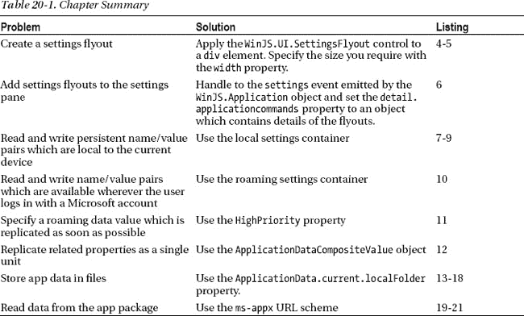
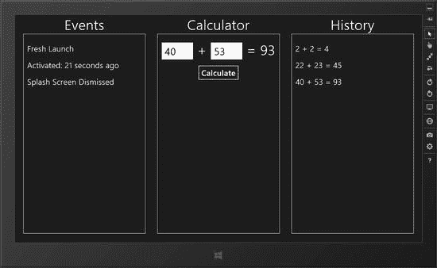
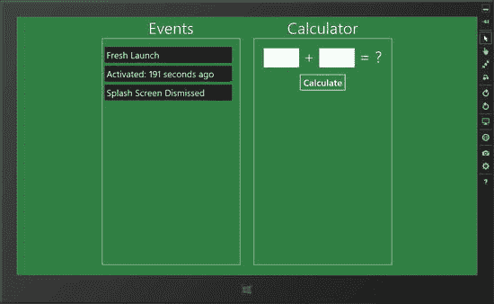
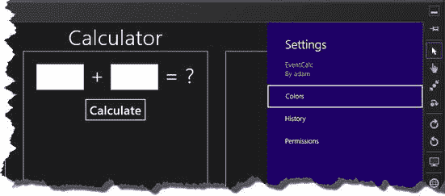
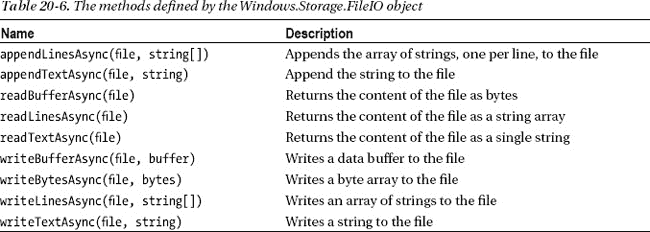

## 第二十章

## 使用设置和应用数据

在这一章中，我将向您展示如何向用户展示应用设置，以及如何使它们持久化。几乎每个应用都有一些用户可以自定义的功能，以与其他应用一致的方式向用户提供选项是一种重要的方式，可以确保用户在使用应用时能够建立在他们以前的 Windows 体验上。

对应用有特殊的规定，使设置工作变得简单和相对容易。我将向您展示呈现设置的不同技术以及持久存储设置(和其他数据)的 Windows 特性。表 20-1 提供了本章的总结。

### 准备示例 App

我将建立在我在[第 19 章](19.html#ch19)中用来解释生命周期事件的`EventCalc`例子之上。在那一章中，我向你展示的一个特性是当应用即将被挂起时如何存储会话状态。我当时提到，您不应该将用户设置存储为会话数据，所以我构建同一个示例应用来告诉您故事的其余部分是合适的。提醒一下，你可以看到`EventCalc`是如何出现在[图 20-1](#fig_20_1) 中的。

***图 20-1。**event calc 应用*

#### 准备示例应用

为了准备演示设置的应用，我在项目中添加了一个名为`/js/settings.js`的新文件，你可以在[清单 20-1](#list_20_1) 中看到。这个文件定义了一个名为`ViewModel.Settings`的名称空间，我将在这里存储用户首选项。

***清单 20-1** 。settings.js 文件的内容*

`(function () {
    WinJS.Namespace.define("ViewModel", {
        **Settings**: WinJS.Binding.as({
**            backgroundColor: "#1D1D1D",**
**            textColor: "#FFFFFF",**
**            showHistory: true**
        })
    });

    WinJS.Namespace.define("ViewModel.Converters", {
        display: WinJS.Binding.converter(function (val) {
            return val ? "block" : "none";
        }),
    });

})();`

`ViewModel.Settings`名称空间中的属性将控制应用布局的背景和前景色，以及显示计算历史的面板的可见性。我修改了`default.html`文件，将`settings.js`文件纳入范围，并添加了一些新的数据绑定，以便将`ViewModel.Settings`属性应用于适当的元素，如[清单 20-2](#list_20_2) 所示。

***清单 20-2** 。将设置绑定添加到 default.html 文件*

`<!DOCTYPE html>
<html>
<head>
    <meta charset="utf-8" />
    <title>EventCalc</title>

    <!-- WinJS references -->
    <link href="//Microsoft.WinJS.1.0/css/ui-dark.css" rel="stylesheet" />
    
    

    <!-- EventCalc references -->
    <link href="/css/default.css" rel="stylesheet" />
    
    
**    **
    
</head>
<body **data-win-bind="style.backgroundColor: backgroundColor; style.color: textColor"**>
    

        

    

    

        Events
        

        

    

    

        Calculator
        

            <input id="firstInput" data-win-bind="innerText: firstNumber
                ViewModel.Converters.calcNumber" />
            +
            <input id="secondInput" data-win-bind="innerText: secondNumber
                ViewModel.Converters.calcNumber" />
            =
            ` `            <button id="calcButton">Calculate</button>
        

    

    

        History
        

        

    

</body>
</html>`

我要做的最后一个更改是添加一个对`WinJS.Binding.processAll`方法的额外调用，以便激活标记中的数据绑定。您可以在[清单 20-3](#list_20_3) 中看到我添加到`/js/default.js`文件中的附加语句。

***清单 20-3** 。激活设置数据绑定*

`...
app.onactivated = function (args) {
    var promises = [];

    if (args.detail.kind === activation.ActivationKind.launch) {
        switch (args.detail.previousExecutionState) {
            case activation.ApplicationExecutionState.suspended:
                startBackgroundWork();
                writeEventMessage("Resumed from Suspended");
                break;
            case activation.ApplicationExecutionState.terminated:
                ViewModel.State.setData(app.sessionState);
                writeEventMessage("Launch from Terminated");
                promises.push(performInitialization());
                break;
            case activation.ApplicationExecutionState.notRunning:
            case activation.ApplicationExecutionState.closedByUser:
            case activation.ApplicationExecutionState.running:
                writeEventMessage("Fresh Launch");
                promises.push(performInitialization());
                break;
        }

        if (args.detail.splashScreen) {
            args.detail.splashScreen.addEventListener("dismissed", function (e) {
                writeEventMessage("Splash Screen Dismissed");
            });
        }` 
`        promises.push(WinJS.UI.processAll().then(function() {
**            return WinJS.Binding.processAll(document.body, ViewModel.Settings);**
        }).then(function () {
            return WinJS.Binding.processAll(calcElems, ViewModel.State);
        }));

        args.setPromise(WinJS.Promise.join(promises));
    }
};
...`

这些更改和添加的结果是一组可观察的属性，在`ViewModel.Settings`名称空间中定义。当这些属性改变时，`default.html`文件中标记的数据绑定会更新关键元素的 CSS 值。您可以通过使用调试器启动应用(从 Visual Studio `Debug`菜单中选择`Start Debugging`)并在`JavaScript Console`窗口中输入以下语句来测试这些属性:

* * *

`ViewModel.Settings.showHistory = false
**ViewModel.Settings.backgroundColor = "#317f42"**`

* * *

改变设置值会触发数据绑定的更新，改变背景颜色并隐藏计算历史，如图[图 20-2](#fig_20_2) 所示。

***图 20-2。**改变设置属性的值*

在接下来的小节中，我将向您展示向用户呈现这些设置属性并持久存储用户选择的值的机制。

### 向用户呈现设置

Windows 提供了一个处理设置的标准机制，它是通过设置魅力(你可以通过魅力栏或使用`Win+I`快捷方式打开它)来触发的。

设置通过*设置窗格*呈现，如图[图 20-3](#fig_20_3) 所示，默认设置窗格显示了应用的一些基本细节，并包含一个`Permissions`链接，向用户显示应用在其清单中声明了哪些功能。“设置”面板的底部有一组标准按钮，用于配置系统范围的设置。

***图 20-3。**默认设置窗格*

如果你点击`Permissions`链接，你会看到一个*设置弹出按钮*的例子，如图 20-4 中的[所示。这就是设置的处理方式——它们被分组到类别中，在设置窗格中显示为链接，单击链接会显示一个设置弹出按钮，其中包含更多详细信息，通常还包含允许用户更改应用设置的控件。](#fig_20_4)

***图 20-4。**权限弹出按钮*

 **提示**您可以通过更改应用清单的`Packaging`部分中的值来更改`Permissions`弹出按钮中显示的详细信息。

如图所示，设置弹出按钮有一个标题区，其中包含一个后退按钮——单击此按钮将返回设置窗格。设置窗格和设置弹出按钮都是轻触式的，这意味着用户可以通过单击或触摸屏幕上的其他地方来关闭它们，就像我在本书的前一部分描述的弹出 UI 控件一样。

在这一部分，我将在设置窗格中添加额外的链接，以允许用户查看和更改我在`/js/settings.js file`中定义的设置。我将向窗格添加两个新链接:`Colors`链接将打开一个窗格，让用户设置`backgroundColor`和`textColor`设置属性，`History`链接将打开一个窗格，让用户设置`showHistory`设置属性。在这个过程中，我将演示你的应用如何将自己集成到标准设置系统中，以及你如何创建设置弹出按钮，其外观和行为与图 20-4 中的默认`Permissions`弹出按钮相同。

 **注**通过设置魅惑辅助设置是*契约*的一个例子。契约是一组定义明确的交互、事件和数据对象，允许应用在标准的 Windows 功能中具体化。设置只是我在本书中解释的合同之一——当我向你展示如何将你的应用集成到 Windows 搜索功能中时，你会在第 21 章中看到一个更复杂的例子。

#### 定义弹出型 HTML

我需要做的第一件事是为每个设置面板创建一个 HTML 文件。首先，我创建了一个名为`colorsSettings.html`的文件，其内容可以在[清单 20-4](#list_20_4) 中看到。这是一个相对简单的文件，所以我将 CSS 和 JavaScript 放在 HTML 标记所在的文件中。

***清单 20-4** 。colorsSettings.html 文件的内容*

`<!DOCTYPE HTML>
<html>
<head>
    <title></title>
    
    
</head>` `<body>
    

        

            <button id="backbutton" class="win-backbutton"></button>
            
Colors

        

        

            

                <h2>Background Color</h2>
                <input id="backgroundColorInput" data-win-bind="value:backgroundColor" />
            

            

                <h2>Text Color</h2>
                <input id="textColorInput" data-win-bind="value:textColor" />
            

        

    

</body>
</html>`

这个 HTML 的核心是一个名为`SettingsFlyout`的 WinJS UI 控件。该控件应用于`div`元素，仅用于向用户呈现设置。`width`选项是由`SettingsFlyout`定义的唯一配置选项，它允许你请求一个标准的弹出按钮(使用`narrow`值)或一个有额外空间的按钮(使用`wide`值)。

设置弹出文件的内容通常需要一些 JavaScript 来处理用户输入，您可以看到我已经使用了`WinJS.UI.Pages.define`方法(我在[第 7 章](07.html#ch7)中描述过)来确保在我设置我的事件处理程序和应用数据绑定之前加载文档中的元素。

 **提示**我建议你在创建设置弹出按钮时使用列表中的 HTML 作为模板。它包含了你需要的一切——包括标题和后退按钮的标题，以及一个用于设置内容的区域。

对于这个设置弹出按钮，我定义了两个`input`元素，它们是绑定到`ViewModel.Settings`属性的数据，并且在`change`事件被触发时更新这些属性。对于另一个设置弹出按钮，我已经创建了一个非常相似的文件，叫做`historySettings.html`，它的内容你可以在[清单 20-5](#list_20_5) 中看到。

***清单 20-5** 。historySettings.html 文件的内容*

`<!DOCTYPE HTML>
<html>
<head>
    <title></title>
    
    
</head>
<body>
    

        

            <button id="backbutton" class="win-backbutton"></button>
            
History

        

        

            

            

        

    

</body>
</html>`

对于这个弹出按钮，我为`width`配置选项选择了`wide`值。`ToggleSwitch`控件(我在[第 11 章](11.html#ch11)中描述过)允许用户切换计算历史的可见性。当切换值改变时，`ViewModel.Settings`名称空间中相应的属性也会更新。

 **注意**我的设置弹出按钮有点稀疏，在一个真实的项目中，我可以很容易地在一个弹出按钮上显示所有三个选项。我这样做是为了演示如何添加多个类别，但在实际项目中，如果需要将设置组合在一起，我建议您合并设置并使用弹出按钮中的标准 HTML 元素来创建部分。我在这一章中采用的方法对于一个例子来说是有用的，但是让用户更难配置应用。

#### 响应设置事件

定义了弹出 HTML 文件后，下一步是在设置窗格中注册它们。我这样做是为了响应由`WinJS.Application`对象发出的`settings`事件，该事件在用户激活设置符时被触发。

您可以在清单 20-6 的[中看到我对此事件的反应。为了将设置代码与应用的其他部分分开，我在`settings.js`文件中响应这个事件，但在实际项目中，我会在`default.js`文件中这样做，在那里我处理`WinJS.Application`发出的其他事件。](#list_20_6)

***清单 20-6** 。处理设置事件*

`(function () {
    WinJS.Namespace.define("ViewModel", {
        Settings: WinJS.Binding.as({
            backgroundColor: "#1D1D1D",
            textColor: "#FFFFFF",
            showHistory: true
        })
    });

    WinJS.Namespace.define("ViewModel.Converters", {
        display: WinJS.Binding.converter(function (val) {
            return val ? "block" : "none";
        }),
    });

**    WinJS.Application.onsettings = function (e) {**
**        e.detail.applicationcommands = {**
**            "colorsDiv": { href: "colorsSettings.html", title: "Colors" },**
**            "historyDiv": { href: "historySettings.html", title: "History" }**
**        };**
**        WinJS.UI.SettingsFlyout.populateSettings(e);**
**    };**
})();`

我通过给`WinJS.Application.onsettings`属性分配一个处理函数来处理`settings`事件。当用户激活 Settings Charm 时，我的函数将被调用，向我提供向 Settings 窗格添加附加类别设置的机会。

这是一个两步过程。首先，我将一个对象分配给传递给处理函数的对象的`detail.applicationcommand`属性。我的对象定义的属性的名称对应于我的 HTML 文件中的`div`元素，其中已经应用了`WinJS.UI.SettingsFlyout`控件。

我给这些`div`名称属性中的每一个分配一个具有`href`和`title`属性的对象。必须将`href`属性设置为您想要显示的弹出文件的名称，并将`title`属性设置为您想要包含在设置窗格链接中的文本。每个`div`名称必须是唯一的，如果`div`元素名称或`href`值不正确，您的链接将从设置窗格中被忽略。

第二步是调用`WinJS.UI.SettingsFlyout.populateSettings`方法，传入传递给处理函数的对象(其`detail.applicationcommands`属性已经被分配了我想要的链接和弹出按钮的详细信息)。第二步加载弹出 HTML 文件的内容并处理它们。这些增加的结果是当用户激活设置符时，设置窗格包含一些新的链接，如图[图 20-5](#fig_20_5) 所示。

***图 20-5。**向设置面板添加自定义链接*

如果您点击或触摸这些链接，则会显示相应的设置窗格。[图 20-6](#fig_20_6) 显示了我创建的两个窗格，展示了`width`设置的`narrow`和`wide`值之间的差异。

***图 20-6。**点击链接时显示的自定义设置弹出按钮*

我没有做太多的工作来使设置弹出按钮吸引人，因为我在这一章的重点是窗口设置机制。但是在一个真实的项目中，如果我只有一个`ToggleSwitch`要显示，我不会使用 wide 设置，我也不会期望用户通过输入十六进制代码或 CSS 颜色名称来选择颜色。这些都是显而易见的，你应该考虑如何分组和安排弹出按钮的内容，以使配置应用的过程尽可能简单和轻松。

### 使设置持久

我已经关联了“设置”弹出按钮中的控件和元素，以便视图模型在它们发生变化时立即更新。您可以尝试更改设置的效果，并立即看到效果——但下次启动应用时，将使用我在`settings.js`文件中定义的默认值，您的更改将会丢失。

这就把我带到了*应用数据*或*应用数据*的话题上，这些数据是你的应用运行所需要的，但你不想让用户直接访问——比如设置。当用户与应用数据交互时，是通过某种形式的中介，比如设置弹出按钮。在接下来的部分中，我将向您展示如何存储和检索应用数据设置。

 **提示**应用数据的替代品是*用户数据*，用户可以直接使用这些数据——我将在[第 22 章](22.html#ch22)–[24 章](24.html#ch24)中解释应用如何操作用户数据，届时我将描述 Windows 对使用文件的支持。

#### 存储设置

用于处理应用数据的 Windows 功能非常出色，设置是最容易处理的应用数据。[清单 20-7](#list_20_7) 显示了我对`settings.js`文件所做的添加，以持久存储设置数据。

***清单 20-7** 。添加到 settings.js 文件以永久存储设置数据*

`(function () {
    WinJS.Namespace.define("ViewModel", {
        Settings: WinJS.Binding.as({
            backgroundColor: "#1D1D1D",
            textColor: "#FFFFFF",
            showHistory: true
        })
    });

    WinJS.Namespace.define("ViewModel.Converters", {
        display: WinJS.Binding.converter(function (val) {
            return val ? "block" : "none";
        }),
    });

    WinJS.Application.onsettings = function (e) {
        e.detail.applicationcommands = {
            "colorsDiv": { href: "colorsSettings.html", title: "Colors" },
            "historyDiv": { href: "historySettings.html", title: "History" }
        };
        WinJS.UI.SettingsFlyout.populateSettings(e);
    };

**    var storage = Windows.Storage;**
**    var settingNames = ["backgroundColor", "textColor", "showHistory"];**

**    settingNames.forEach(function (setting) {**
**        ViewModel.Settings.bind(setting, function (newVal, oldVal) {**
**            if (oldVal != null) {**
**                storage.ApplicationData.current.localSettings.values[setting] = newVal;**
**            }**
**        });**
**    });**
})();`

 **注意**除非另有说明，否则我在本节中引用的所有新对象都是`Windows.Storage`名称空间的一部分。

这项技术的核心是`ApplicationDataContainer`对象，其中数据存储为键/值对。有两个内置容器——第一个允许您存储数据，以便数据位于运行应用的设备上，另一个存储漫游数据，这些数据会自动复制到用户登录的任何设备上。

稍后我将回到漫游数据容器，但是对于这个例子，我从最简单的选项开始，使用本地容器。为了获得本地容器对象，我读取了`ApplicationData.current.localSettings`属性，如下所示:

`...
storage.ApplicationData.current.localSettings.values[setting] = newVal;
...`

属性返回一个可以用来存储数据的对象。容器中的数据是永久存储的，这意味着您不必担心显式指示 Windows 保存您的应用数据-一旦您在存储容器中设置了值，您的数据就会被存储。

`ApplicationData`定义了许多有用的属性，我在[表 20-2](#tab_20_2) 中总结了这些属性，并在接下来的章节中进行了描述。

一旦获得了想要使用的容器，就可以通过`values`属性存储键/值对，该属性返回一个`ApplicationDataContainerSettings`对象。在这个例子中，我像使用数组一样使用这个对象，并给它赋值如下:

`...
storage.ApplicationData.current.localSettings.**values[setting] = newVal;**
...`

你可以使用数组符号来赋值和读取值，但是一个`ApplicationDataContainerSettings`对象并不能实现一个真实数组的所有行为，你可能需要使用我在[表 20-3](#tab_20_3) 中描述的方法和属性来代替。

T2】

现在您已经理解了所涉及的对象，您可以看到我是如何在示例中持久存储设置值的。我使用 WinJS 编程数据绑定(如第 8 章中的[所述)来监控`ViewModel.Settings`属性，并在设置改变时存储新值，这一点我在](08.html#ch8)[清单 20-8](#list_20_8) 中已经强调过。

***清单 20-8** 。绑定查看模型更改以保持用户选择*

`...
var storage = Windows.Storage;
var settingNames = ["backgroundColor", "textColor", "showHistory"];

settingNames.forEach(function (setting) {
**    ViewModel.Settings.bind**(setting, function (newVal, oldVal) {
        if (oldVal != null) {
**            storage.ApplicationData.current.localSettings.values[setting] = newVal;**
        }
    });
});
...`

 **提示**我忽略了任何可观察属性的旧值为`null`的更新。这是因为编程数据绑定在首次创建时会被发送一个更新，提供初始值和旧值的`null`。我只想在值改变时存储它们，因此检查了`null`。

#### 恢复设置

如果你不能在需要的时候读取设置，那么将设置存储为应用数据就没有多大用处。在[清单 20-9](#list_20_9) 中，你可以看到我在`/js/settings.js`文件中添加的内容，以便在应用首次加载时恢复任何保存的设置。

 **注意**我定义了恢复设置的函数，并在`settings.js`文件中调用该函数，但在实际项目中，我会从 default.js 文件中调用该函数来响应正在启动的应用。我已经把这个项目中的所有东西放在一起，所以我不必列出代码页来显示简单的变化。

***清单 20-9** 。加载应用数据设置*

`(function () {
    WinJS.Namespace.define("ViewModel", {
        Settings: WinJS.Binding.as({
            backgroundColor: "#1D1D1D",
            textColor: "#FFFFFF",
            showHistory: true
        })
    });

    WinJS.Namespace.define("ViewModel.Converters", {
        display: WinJS.Binding.converter(function (val) {
            return val ? "block" : "none";
        }),
    });

    WinJS.Application.onsettings = function (e) {
        e.detail.applicationcommands = {
            "colorsDiv": { href: "colorsSettings.html", title: "Colors" },
            "historyDiv": { href: "historySettings.html", title: "History" }
        };
        WinJS.UI.SettingsFlyout.populateSettings(e);
    };

    var storage = Windows.Storage;
    var settingNames = ["backgroundColor", "textColor", "showHistory"];
**    var loadingSettings = false;**

    settingNames.forEach(function (setting) {
        ViewModel.Settings.bind(setting, function (newVal, oldVal) {
            if (`!loadingSettings `&& oldVal != null) {
                storage.ApplicationData.current.localSettings.values[setting] = newVal;
            }
        });
    });

**    function loadSettings() {**
**        loadingSettings = true;**
**        var container = storage.ApplicationData.current.localSettings;**
**        settingNames.forEach(function (setting) {**
**            value = container.values[setting];**
**            if (value != null) {**
**                ViewModel.Settings[setting] = value;**
**            }**
**        });**
**        setImmediate(function () {**
**            loadingSettings = false;**
**        })**
**    };**` `**    loadSettings();**

})();`

我通过读取`ApplicationData.current.localSettings`属性获得本地设置容器。然后，我使用数组符号来检查是否有我感兴趣的每个设置的存储值。如果有，那么我使用该值来更新相应的`ViewModel.Settings`属性值，这将触发我定义的数据绑定，将应用返回到其先前的配置。

为了避免存储我正在加载的相同值，我定义了`loadSettings`变量，在读取存储的设置之前，我将它设置为`true`。当我收到数据绑定通知时，我会检查这个变量的值，如果加载正在进行，我会放弃更新。

 **提示**注意，在我传递给`setImmediate`方法的函数中，我将变量`loadingSettings`设置为`false`。我这样做是为了确保在我再次开始存储值之前，所有的数据绑定事件都得到处理。我在第九章的[中解释了`setImmediate`的方法。](09.html#ch9)

这些添加的结果是对显示在“设置”弹出按钮上的设置的更改现在是持久的。为了测试这一点，启动应用，激活设置符，选择`History`链接，并将`ToggleSwitch`控制改为`Off`位置。

计算历史将立即隐藏。现在重启应用，要么重启调试器，要么使用`Alt` + `F4`并再次启动应用。你会看到，当应用启动时，计算历史并没有显示。

#### 使用漫游设置

在前面的例子中，我使用本地应用存储进行设置。这意味着数据仅存储在当前设备上——如果用户在另一台设备上运行该应用，则将使用默认设置。通过这种方式，用户可以在两个设备上运行相同的应用，而每个实例都有完全不同的配置。

如果您想在用户登录的任何地方应用相同的设置，那么您需要使用*漫游设置*。这是 Windows 应用最有前途的功能之一，对于将其 Windows 帐户与 Microsoft 帐户相关联的用户，应用和用户数据可以无缝复制。

作为一名 Windows 应用程序员，您不必担心帐户登录过程的细节、正在使用的 Microsoft 帐户或如何复制数据的细节。相反，您只需将设置存储在漫游容器中，而不是本地容器中。你可以在清单 20-10 的[中看到我对`/js/settings.js`文件所做的更改，以使用漫游设置。](#list_20_10)

***清单 20-10** 。使用漫游设置容器*

`(function () {
    WinJS.Namespace.define("ViewModel", {
        Settings: WinJS.Binding.as({
            backgroundColor: "#1D1D1D",
            textColor: "#FFFFFF",
            showHistory: true
        })
    });` 
`    WinJS.Namespace.define("ViewModel.Converters", {
        display: WinJS.Binding.converter(function (val) {
            return val ? "block" : "none";
        }),
    });

    WinJS.Application.onsettings = function (e) {
        e.detail.applicationcommands = {
            "colorsDiv": { href: "colorsSettings.html", title: "Colors" },
            "historyDiv": { href: "historySettings.html", title: "History" }
        };
        WinJS.UI.SettingsFlyout.populateSettings(e);
    };

    var storage = Windows.Storage;
    var settingNames = ["backgroundColor", "textColor", "showHistory"];
    var loadingSettings = false;

    settingNames.forEach(function (setting) {
        ViewModel.Settings.bind(setting, function (newVal, oldVal) {
            if (!loadingSettings && oldVal != null) {
                storage.ApplicationData.current.**roamingSettings**.values[setting] = newVal;
            }
        });
    });

    function loadSettings() {
        loadingSettings = true;
        var container = storage.ApplicationData.current.**roamingSettings**;
        settingNames.forEach(function (setting) {
            value = container.values[setting];
            if (value != null) {
                ViewModel.Settings[setting] = value;
            }
        });
        setImmediate(function () {
            loadingSettings = false;
        })
    };
    loadSettings();

**    storage.ApplicationData.current.addEventListener("datachanged", function (e) {**
**        loadSettings();
    });**

})();`

要切换到漫游，而不是本地存储，我只需使用`ApplicationData.current.roamingSettings`属性。存储和检索单个设置的方法是相同的。

使用漫游设置时，Windows 将在用户登录的任何位置复制你的应用数据，这意味着你可以在多个设备上创建一致的体验。

 **注意**如果用户没有与其 Windows 登录相关联的 Microsoft 帐户，则无需处理任何错误——在这种情况下，数据不会被复制。

如果在应用运行时漫游设置被修改，`ApplicationData`对象将触发`datachanged`事件。这使您有机会更新您的应用状态以反映新数据，确保用户在其他地方所做的更改尽快得到应用。

 **提示**在示例中，我简单地调用了`loadSettings`函数来在收到`datachanged`事件时应用更新，但是您可能想在实际应用中进行更改之前询问用户是否要应用修改后的设置。

要在示例应用中测试对漫游数据的支持，您需要有两台 Windows 8 设备或虚拟机，并使用相同的 Microsoft 帐户登录。在复制应用数据之前，该帐户必须明确信任这两个设备(要信任一个设备，打开设置图标，选择`Change PC Settings` `Users`，然后点击`Trust this PC`链接)。在两台设备上运行应用，然后在其中一台设备上更改应用设置。几分钟后，您将看到同样的更改应用于另一台设备。

##### 了解漫游数据的工作原理

漫游数据功能使用简单，但有一些重要的限制。首先，数据在*最大努力*的基础上复制。漫游数据旨在让您的应用在不同设备上提供一致的体验，但没有性能保证。当适合 Windows 时，您的数据将被复制，并且您无法控制复制过程(有一个例外，我将在下一节中描述)。Windows 可能会选择无限期推迟数据复制，尤其是在电量或资源不足的情况下。Windows 不承诺在设备关闭或进入睡眠状态之前执行复制，这意味着在存储新设置值和将其复制到其他设备之间可能会经过很长一段时间。

第二，漫游数据是一种低流量、低频率的服务。如果您频繁更新漫游容器，Windows 将暂时停止复制您的数据。这意味着你不应该使用漫游数据来保持一个应用的多个实例同步-在最初几次更新后，Windows 将开始推迟你的应用的更新。

第三，Windows 复制的数据量是有限制的。您可以通过读取`ApplicationData.current.roamingStorageQuota`属性来确定配额是多少，但在 Windows 8 的初始版本中它被设置为 100KB。这可能看起来很多，但是，正如我在本章后面解释的，您也可以使用漫游存储来复制文件，所以配额可以很快用完。当您超过漫游配额时，不会出现警告，Windows 将会(静默地)停止为您的应用复制数据。此外，由于没有可靠的方法来计算您的应用存储了多少数据，所以在计划哪些数据将被漫游，哪些数据将被存储在本地时，您需要非常保守。

最后，漫游功能旨在让用户在不同设备间移动时获得一致的体验，而不是同时运行同一个应用。对于在不同设备上更改的漫游设置，没有冲突解决方案–Windows 只是丢弃除了最近所做的更改之外的任何更改。

当你考虑到这几点，你就明白漫游数据要慎用了。您应该发送尽可能少的数据，仅在必要时存储更新，并仔细考虑发送数据引用而不是数据本身的机会(例如复制 URL 而不是网页内容)。这并不是说你不应该使用漫游——这是一个很好的功能，它可以改变在多个设备上安装你的应用的用户的体验——但要慎重而谨慎地使用。

##### 使用高优先级设置

漫游设置容器以不同的方式处理一个设置。如果您给`HighPriority`设置赋值，Windows 将更努力地快速复制该设置。仍然没有性能保证，配额和频繁更新限制仍然适用，但是您可以使用这个特殊设置来尝试确保最重要的信息尽快在其他设备上可用。

`HighPriority`设置旨在让您创建流畅的用户体验，您应该使用此设置来复制应用状态的关键部分，以便用户在移动到新设备时可以无缝地继续他们的工作流程。这意味着什么将取决于你的应用的性质，但微软给出的一个例子是将一封由部分内容组成的电子邮件从一台设备复制到另一台设备，例如，允许用户开始在家里的 PC 上写邮件，然后在上班途中继续使用平板电脑。

为了演示`HighPriority`设置的使用，我优先考虑了`showHistory`设置。当这个设置改变时，我将新值赋给`HighPriority`,以便尽可能快地复制它。您可以在[清单 20-11](#list_20_11) 中看到我对`settings.js`文件所做的更改。

***清单 20-11** 。使用高优先级设置*

`(function () {
    WinJS.Namespace.define("ViewModel", {
        Settings: WinJS.Binding.as({
            backgroundColor: "#1D1D1D",
            textColor: "#FFFFFF",
            showHistory: true
        })
    });

    // *...statements removed for brevity...*

    var storage = Windows.Storage;
    var settingNames = ["backgroundColor", "textColor", "showHistory"];
    var loadingSettings = false;

    settingNames.forEach(function (setting) {
        ViewModel.Settings.bind(setting, function (newVal, oldVal) {
            if (!loadingSettings && oldVal != null) {
**                if (setting == "showHistory") {**
**                    setting = "HighPriority";**
**                }**
                storage.ApplicationData.current.roamingSettings.values[setting] = newVal;
            }
        });
    });

    function loadSettings() {
        loadingSettings = true;` `        var container = storage.ApplicationData.current.roamingSettings;
        settingNames.forEach(function (setting) {
**            value = container.values[setting == "showHistory" ?**
**                "HighPriority" : setting];**
            if (value != null) {
                ViewModel.Settings[setting] = value;
            }
        });
        setImmediate(function () {
            loadingSettings = false;
        })
    };
    loadSettings();

    storage.ApplicationData.current.addEventListener("datachanged", function (e) {
        loadSettings();
    });

})();`

我在这里采用的方法是截取对`showHistory`设置的更新，并使用`HighPriority`键将新值存储在容器中。它是触发加速行为的密钥名称，并且不需要明确的动作来触发复制。

 **注意**虽然使用复制时没有性能保证，但我的经验是常规设置大约每 5 分钟复制一次，而`HighPriority`设置在几秒钟内复制一次。在高峰时间，常规设置的复制通常会减慢到大约每 10 分钟一次。

##### 确保数据一致性

某些应用设置无法自行安全复制。考虑示例应用的以下场景:

> 1.  On the host computer, the user sets `backgroundColor` to `white` and `textColor` to `green`. The user was about to leave the house when they turned off the PC before Windows copied the changes. This means that the settings are stored locally, which will affect the application when it runs on the PC, but will not be copied to affect other devices.
> 2.  The user gets on the train and starts the same application on another device. They changed `backgroundColor` to `green`, but did not set the `textColor` attribute to the default value (`white`). Windows copies the new `backgroundColor` value.
> 3.  The user goes home and starts the application on the PC again. Windows will not copy the setting values in step 1 because they have been replaced by the values changed in step 2.
> 4.  The application program applies the new value set by `backgroundColor`, presents `green` text to the user on the `green` background, and makes the application program unavailable.

从这种情况中可以吸取几个教训。首先，明确询问用户是否想要应用更新的设置可能很重要——对于我的示例应用，我只是应用更新，在我在本节中提出的场景中，用户不会了解他们几个小时前所做的一系列设置更改已经组合在一起使应用变得无用。同样，您应该花时间确保有一种简单的方法将应用重置为默认设置，或者防止选择会导致应用不可用的设置组合。

然而，最重要的教训是，一些设置需要成组复制，尤其是当这些设置可以以危险的方式组合时。您可以通过使用一个`ApplicationDataCompositeValue`对象来做到这一点，它允许您将几个设置合并到一个对象中，并确保它们作为一个单一的原子单元被复制。你可以看到我如何在清单 20-12 中使用这个对象来确保我在本节开始描述的场景不会出现。

***清单 20-12** 。使用 ApplicationDataCompositeValue 对象复制多个值*

`(function () {
    WinJS.Namespace.define("ViewModel", {
        Settings: WinJS.Binding.as({
            backgroundColor: "#1D1D1D",
            textColor: "#FFFFFF",
            showHistory: true
        })
    });

    // *...statements removed for brevity...*

    var storage = Windows.Storage;
    var settingNames = ["backgroundColor", "textColor", "showHistory"];
    var loadingSettings = false;

    settingNames.forEach(function (setting) {
        ViewModel.Settings.bind(setting, function (newVal, oldVal) {
            if (!loadingSettings && oldVal != null) {
**                var container = storage.ApplicationData.current.roamingSettings;**
**                if (setting == "showHistory") {**
**                    container.values["HighPriority"] = newVal;**
**                } else if (setting == "backgroundColor" || setting == "textColor") {**
**                    var comp = new storage.ApplicationDataCompositeValue();**
**                    comp["backgroundColor"] = ViewModel.Settings.backgroundColor;**
**                    comp["textColor"] =  ViewModel.Settings.textColor;**
**                    container.values["colors"] = comp;**
**                }**
            }
        });
    });

    function loadSettings() {
        loadingSettings = true;
        var container = storage.ApplicationData.current.roamingSettings;
**        ["HighPriority", "colors"].forEach(function (setting) {**
**            value = container.values[setting];**
**            if (value != null) {**` `**                if (setting == "HighPriority") {**
**                    ViewModel.Settings.showHistory = value;**
**                } else {**
**                    ViewModel.Settings.backgroundColor = value["backgroundColor"];**
**                    ViewModel.Settings.textColor = value["textColor"];**
**                }**
**            }**
**        });**
        setImmediate(function () {
            loadingSettings = false;
        })
    };
    loadSettings();

    storage.ApplicationData.current.addEventListener("datachanged", function (e) {
        loadSettings();
    });
})();`

`ApplicationDataCompositeValue`对象本身就像一个容器，您可以使用数组符号样式为它分配多个设置。然后，您可以将组合的属性集添加为单个设置，并依赖它们一起被复制。我向清单中的`ApplicationDataCompositeValue`对象添加了两个属性，但是您可以根据需要为您的应用添加任意多个属性(受 Windows 应用于漫游数据的配额和容量限制的限制)。

 **提示**你可以使用一个`ApplicationDataCompositeValue`对象作为`HighPriority`设置的值。这允许您优先选择一组相关属性，以在设备之间保留您的应用状态。

有了这一改变，`ViewModel.Settings`名称空间中的属性和应用数据容器中的设置名称之间没有直接的联系。我使用特殊的`HighPriority`设置复制了`showHistory`属性的值，并将`backgroundColor`和`textColor`属性复制为一个名为`colors`的设置。这是一个非常合理的方法，但是您需要确保正确映射您的设置和属性，并进行彻底的测试。请注意，测试是一个痛苦的过程，因为没有办法强制复制-这意味着您必须在一个设备上进行更改，然后等待几分钟才能看到它在其他设备上的反映(当然，除非您正在使用`HighPriority`设置)。

### 使用应用数据文件

并不是所有的数据都可以用键/值对来表示。幸运的是，设置并不是应用可以使用的唯一应用数据——你也可以使用文件来存储你需要的数据。为了演示这个特性，我在`js`项目文件夹中添加了一个名为`appDataFiles.js`的新文件，其内容可以在[清单 20-13](#list_20_13) 中看到。

***清单 20-13** 。appDataFiles.js 的内容*

`(function () {` 
`    var storage = Windows.Storage;
    var historyFileName = "calcHistory.json";
    var folder = storage.ApplicationData.current.localFolder;

    ViewModel.State.history.addEventListener("iteminserted", function (e) {
        folder.createFileAsync(historyFileName,
                storage.CreationCollisionOption.openIfExists)
        .then(function (file) {
            var stringData = JSON.stringify(e.detail.value);
            storage.FileIO.appendLinesAsync(file, [stringData]);
        });
    });
})();`

这段代码使用数据绑定来观察`ViewModel.State.history`对象，它是一个`WinJS.Binding.List`对象。每当用户执行一个计算时，一个新的项目被添加到`List`中，并且`appDataFiles.js`文件中的代码创建一个用户操作的持久记录。在本章的后面，我将扩展这个例子，并使用这个文件来填充应用启动时的历史记录。但是，首先，我将介绍示例中的代码，并解释所有对象是如何组合在一起的。当你理解了基本的技术，在 Windows 应用中处理文件是非常简单的，但是它不同于我见过的任何其他处理文件系统的方法。在接下来的部分中，我将向您展示每个步骤，并详细解释选项。

 **注意**除非我明确声明，否则我在本节中引用的所有新对象都是`Windows.Storage`名称空间的一部分。

在[清单 20-14](#list_20_14) 中，您可以看到我添加到`default.html`文件头部分的脚本元素，以将`appDataFiles.js`文件中的代码引入示例应用。

***清单 20-14** 。为 appDataFiles.js 文件*向 default.html 添加脚本元素

`...
<head>
    <meta charset="utf-8" />
    <title>EventCalc</title>

    <!-- WinJS references -->
    <link href="//Microsoft.WinJS.1.0/css/ui-dark.css" rel="stylesheet" />
    
    

    <!-- EventCalc references -->
    <link href="/css/default.css" rel="stylesheet" />
    
    
    
**    **
    
</head>
...`

#### 获取文件夹和文件对象

起点是由`ApplicationData.current.localFolder`属性返回的`StorageFolder`对象。使用`StorageFolder`对象时有很多选项，在这一章中我将只关注基本的选项。我将在第 22 章–[24 章](24.html#ch24)中向您展示更多可用的功能，届时我将描述如何使用用户数据，而不是应用数据。

 **注意**与设置一样，应用对文件的数据支持可以是本地的，也可以是漫游的，我选择了本地选项。两个实例中的 API 是相同的，不同之处在于漫游文件是复制的。如果要使用漫游 app 数据文件，那么应该使用`ApplicationData.current.roamingFolder`属性返回的`StorageFolder`。注意不要超过漫游数据报价，否则您的文件将不会被复制。

[表 20-4](#tab_20_4) 总结了使用`StorageFolder`对象打开、创建或删除文件的基本方法。(我在[第 22 章](22.html#ch22)中描述了其他的`StorageFolder`方法，但是这些是你最常用于 app 数据文件的方法。)

Windows 应用中几乎所有与文件相关的操作都是异步执行的，这就是为什么表中的所有方法都返回一个`Promise`对象。完成后，这些`Promise`对象将把一个或多个`StorageFile`对象传递给`then`方法，代表指定的文件。你可以看到我是如何使用清单 20-15 中的`createFileAsync`方法得到一个`StorageFile`对象的。

 **提示**本章的剩余部分严重依赖于`WinJS.Promise`对象。如果你还没有阅读第 9 章，那么你应该现在就阅读，并在完成后返回这里。无法回避`Windows.Storage`名称空间对象的异步特性。微软为 Windows 应用引入异步支持的主要目标之一是防止应用在执行文件操作时挂起。在处理文件时，你必须使用承诺，即使一开始可能会感觉有点反直觉。

***清单 20-15** 。获取存储文件夹和存储文件对象*

`...
folder.**createFileAsync**(historyFileName, storage.CreationCollisionOption.openIfExists)
    .**then**(function (**file**) {
        // statements to operate on the StorageFile go here
});
...`

 **注意**异步文件操作中出现的任何错误都会传递给`then`方法的`error`函数。我在这一节中没有定义错误处理程序，因为我想向您展示如何处理文件，而不是处理错误，但是您应该小心处理真实项目中的错误。关于使用`Promise`时如何报告错误的详细信息，参见[第 9 章](09.html#ch9)。

`createFileAsync`方法的可选参数是来自`CreationCollisionOption`对象的一个值，该对象枚举了一些值，这些值决定了当您试图创建一个已经存在的文件时，Windows 将采取什么操作。[表 20-5](#tab_20_5) 描述了可用的值。

我使用了`openIfExists`值，这意味着如果没有文件，示例应用将创建一个新文件，如果有，将重用现有文件。

#### 写入文件

`StorageFile`对象支持对文件的所有操作——你可以重命名或删除它所代表的文件，打开允许你读写数据的流等等。

我不会直接做这些事情，因为`FileIO`对象定义了一组非常方便的方法，使得执行基本的读写选项变得简单(比直接使用`StorageFile`对象方法容易得多)。[表 20-6](#tab_20_6) 描述了`FileIO`定义的便利方法。

 **提示**读写缓冲区的方法本身并不是特别有用。它们旨在与来自`Windows.Storage.Streams`名称空间的对象一起使用，这允许您以更传统的方式执行操作(例如，读取一个字节或一串数据的调用)。`FileIO`中的便利方法对于大多数情况来说已经足够了，我鼓励你先看看它们是否能满足你的需求。

我发现最有用的方法是`appendLinesAsync`，因为我可以用它将 JSON 数据写入文件，而不必担心行终止符。你可以看到这是我用来在[清单 20-16](#list_20_16) 中写计算细节的方法，尽管我一次只写一项。

***清单 20-16** 。使用 FileIO 对象*将 JSON 数据写入文件

`...
ViewModel.State.history.addEventListener("iteminserted", function (e) {
    folder.createFileAsync(historyFileName,
            storage.CreationCollisionOption.openIfExists)
    .then(function (file) {
**        var stringData = JSON.stringify(e.detail.value);**
**        storage.FileIO.appendLinesAsync(file, [stringData]);**
    });
});
...`

请注意，我不必显式地打开我正在处理的文件，将写光标移动到文件的末尾，或者在完成后关闭文件。这些平凡的(并且容易出错的)任务由`FileIO`对象替我处理。

结果是，每次用户执行计算时，我都会在文件中添加一个字符串。这是一个真实的常规文件，您可以通过在 Visual Studio JavaScript 控制台窗口中输入`Windows.Storage.ApplicationData.current.localFolder.path`在 Windows 文件系统中找到该文件。对于我的系统，该属性的值是:

* * *

`"C:\Users\adam\AppData\Local\Packages\a52d9e6e-bba3-4774-a824b26e77499de7_6fxp0bkxjs8ye
\LocalState"`

* * *

当然，在您的系统上，路径会有所不同。如果您使用应用执行一些计算，然后打开文件夹，您将看到`calcHistory.json`文件，它将包含每个计算的简单 JSON 描述，类似于[清单 20-17](#list_20_17) 中显示的内容。

***清单 20-17** 。calcHistory.json 文件的内容*

`{"message":"1 + 2 = 3"}
{"message":"1 + 3 = 4"}
{"message":"1 + 4 = 5"}`

`message`属性的存在是因为我在`default.html`文件中使用了一个 WinJS 模板来显示事件消息和计算历史。在这个例子中，为了简单起见，我只是将对象转换为 JSON 并将其写入文件，但是如果需要，您可以重新格式化对象或以完全不同的方式表达数据。

#### 从文件中读取

从文件中读取计算历史所需的代码很容易理解，因为您已经看到了将数据写入文件所涉及的对象。[清单 20-18](#list_20_18) 显示了我在`appDataFiles.js`文件中添加的内容，以便在应用启动时读取历史记录。(我已经在保存新数据的代码之前插入了将数据添加到视图模型的代码，以便在加载初始数据之前不会对更改做出响应。)

***清单 20-18** 。从应用数据文件中读取计算历史*

`(function () {

    var storage = Windows.Storage;
    var historyFileName = "calcHistory.json";
    var folder = storage.ApplicationData.current.localFolder;

**    function readHistory() {**
**        folder.getFileAsync(historyFileName)**
**        .then(function (file) {**
**            var fileData = storage.FileIO.readLinesAsync(file)**
**            .then(function (lines) {**
**                lines.forEach(function (line) {**
**                    ViewModel.State.history.push(JSON.parse(line));**
**                });**
**            })**
**        });**
**    }**

**    readHistory();**

    ViewModel.State.history.addEventListener("iteminserted", function (e) {
        folder.createFileAsync(historyFileName,
                storage.CreationCollisionOption.openIfExists)
        .then(function (file) {
            var stringData = JSON.stringify(e.detail.value);
            storage.FileIO.appendLinesAsync(file, [stringData]);
        });
    });

})();`

我使用`FileIO.readLinesAsync`方法获取字符串数组形式的文件内容。这使我能够很好地将每个 JSON 字符串解析成一个 JavaScript 对象，并将其推送到`ViewModel.State.history`对象中，从而将每个项目显示给用户。

 **注意**如果你在添加`readHistory`函数之前没有运行这个 app，那么 Visual Studio 会报错。这是因为`readHistory`函数是在 app 刚启动的时候调用的，文件不存在。`readHistory`函数处理丢失的文件，您可以单击`Continue`按钮忽略该文件一次，或者取消选中复选框以防止 Visual Studio 在将来报告相同的异常。

### 从 App 包中加载文件

您不必从头开始生成设置和文件，您也可以将数据文件包含在您的应用包中，并将其处理为其他应用数据文件。当所有用户都需要相同的数据，并且只需要很少或不需要定制时，这非常有用。

我在本章中作为例子使用的`EventCalc`应用生成一组存储在缓存中的计算结果。我在第 19 章中添加了这个特性，当时我正在演示如何在应用生命周期的范围内执行任务。在本章中，我将更新应用，以便它从数据文件加载预先计算的结果，该数据文件包含在应用部署到用户设备中。首先，我在项目中创建了一个`data`文件夹，并添加了一个名为`calcData.json`的新文件。这个文件中的每一行都包含一个计算的 JSON 表示，你可以在清单 20-19 中看到这个数据的例子。在第 19 章中，我想要一个需要一段时间才能完成的任务，所以我生成了前 5000 个整数的和。对于这一章，我想要一个可管理的文件大小，所以数据文件只包含前 100 个整数值相加的结果。

***清单 20-19** 。calcData.json 文件*中的 JSON 数据示例

`...
{"first":3,"second":50,"result":53}
{"first":3,"second":51,"result":54}
{"first":3,"second":52,"result":55}
{"first":3,"second":53,"result":56}
{"first":3,"second":54,"result":57}
{"first":3,"second":55,"result":58}
{"first":3,"second":56,"result":59}
{"first":3,"second":57,"result":60}
...`

这个文件太长了，我无法在这一章中全部列出，所以如果你想按照这个例子学习，有两种方法可以得到这个文件的内容。首先是下载本书附带的源代码，其中包含了每章中所有示例的所有文件。第二种方法是自己生成数据，您可以在生成示例数据侧栏中找到相关说明。

**生成样本数据**

如果你不想从`apress.com`下载`calcData.json`文件，那么你可以自己轻松生成。在 Visual Studio 中创建一个新的 Windows 应用项目，并用以下内容替换`default.html`文件的内容:

`<!DOCTYPE html>
<html>
<head>
    <meta charset="utf-8" />
    <title>DataGen</title>
    <link href="//Microsoft.WinJS.1.0/css/ui-dark.css" rel="stylesheet" />
    
    
    
     </head> <body>
    <button id="gen">Generate</button>
</body>
</html>`

这个清单定义了一个简单的应用，其中 HTML、CSS 和 JavaScript 都定义在同一个文件中。应用的布局包含一个单独的`Generate`按钮，当点击它时，会提示你在你的系统上保存`calcData.json`文件，然后你可以将它复制到你的 Visual Studio 项目的`data`文件夹中。结果将被生成并保存到文件中。这个应用使用了我在本章后面才描述的特性，所以为了创建例子所需的数据，把它当作一个黑盒。

为了禁用缓存后台任务并减少预期缓存结果的数量，我更新了`default.js`文件中的`performInitialization`函数，如[清单 20-20](#list_20_20) 所示。这些变化缩小了预计算数据的范围，并停止在每次启动应用时生成结果。

***清单 20-20** 。修改 default.js 文件，准备加载计算结果*

`...
function performInitialization() {
    calcButton.addEventListener("click", function (e) {` `        var first = ViewModel.State.firstNumber = Number(firstInput.value);
        var second = ViewModel.State.secondNumber = Number(secondInput.value);
        if (first < **100** && second < **100**) {
            ViewModel.State.result = ViewModel.State.cachedResult[first][second];
        } else {
            ViewModel.State.result = first + second;
        }
    });

    ViewModel.State.bind("result", function (val) {
        if (val != null) {
            ViewModel.State.history.push({
                message: ViewModel.State.firstNumber + " + "
                    + ViewModel.State.secondNumber + " = "
                    + val
            });
        }
    });

    startBackgroundWork();

**    //return Utils.doWork(5000).then(function (data) {**
**    //    ViewModel.State.cachedResult = data;**
**    //});**
};
...`

这个例子的关键部分显示在[清单 20-21](#list_20_21) 中，它详细说明了我对`appDataFiles.js`文件所做的添加。我添加了一个自执行函数，它打开`data/calcData.json`文件，解析内容，并将结果作为缓存数据。

***清单 20-21** 。添加到 appDataFiles.json 文件以加载预先计算的数据*

`(function () {

    var storage = Windows.Storage;
    var historyFileName = "calcHistory.json";
    var folder = storage.ApplicationData.current.localFolder;

    ViewModel.State.history.addEventListener("iteminserted", function (e) {
        folder.createFileAsync(historyFileName,
                storage.CreationCollisionOption.openIfExists)
        .then(function (file) {` `            var stringData = JSON.stringify(e.detail.value);
            storage.FileIO.appendLinesAsync(file, [stringData]);
        });
    });

    function readHistory() {
        folder.getFileAsync(historyFileName)
        .then(function (file) {
            var fileData = storage.FileIO.readLinesAsync(file)
            .then(function (lines) {
                lines.forEach(function (line) {
                    ViewModel.State.history.push(JSON.parse(line));
                });
            })
        });
    }

    readHistory();

**    (function () {**
**        storage.StorageFile.getFileFromApplicationUriAsync(**
**            Windows.Foundation.Uri("ms-appx:///data/calcData.json"))**
**        .then(function (file) {**
**            var cachedData = {};**
**            storage.FileIO.readLinesAsync(file).then(function (lines) {**
**                lines.forEach(function (line) {**
**                    var calcResult = JSON.parse(line);**
**                    if (cachedData[calcResult.first] == null) {**
**                        cachedData[calcResult.first] = {};**
**                    }**
**                    cachedData[calcResult.first][calcResult.second] = calcResult.result;**
**                });**
**            });**
**            ViewModel.State.cachedResult = cachedData;**
**        });**
**    })();**
})();`

这类似于我在上一节中读取历史文件的方式，但是关键的区别是我获取对应于`calcData.json`文件的`StorageFile`对象的方式。在这种情况下，我不能使用`ApplicationData`对象，因为应用包中的文件被不同地处理。

第一步是创建一个`Windows.Foundation.Url`对象。名称空间包含的对象大部分是。NET 编程语言，并且与 JavaScript 关系不大。`Uri`对象接受一个 URI 字符串，并以一种可以和`Windows.Storage`对象一起使用的方式准备它。它不做任何对 JavaScript 程序员有用的事情。

URI 的格式很重要。协议组件必须设置为`ms-appx`，您必须使用三个`/`字符，然后包括您想要加载的文件的路径。对于`data/calcData.json`文件，这意味着我需要使用的字符串是:

`ms-appx:///data/calcData.json`

一旦有了一个`Windows.Foundation.Uri`对象，就可以把它作为`StorageFile.getFileFromApplicationUriAsync`方法的一个参数，该方法返回一个代表应用包中文件的`StorageFile`。从这一点开始，您可以使用`FileIO`对象来读取文件的内容，就像读取常规应用数据文件一样。(不要试图写入这些文件——它们是只读的。)这些变化的结果是，我能够将数据作为我的应用分发的一部分进行部署，并在应用启动时加载数据——对于我的示例应用，这意味着我不必依赖用户设备的潜在有限功能来生成缓存数据。

### 总结

在这一章中，我向你展示了如何实现设置契约，以便将你的应用集成到标准的 Windows 模型中，向用户呈现设置。契约是一种强大的技术，可以确保你的应用向用户呈现一系列一致的交互，正如你将在后面的章节中看到的，有些联系可能非常复杂。

如果您不能持久地存储用户选择的值，那么向用户提供设置是没有意义的。为此，我解释了 app 数据系统的工作原理，允许您存储键/值对和数据文件。Windows 应用可以存储设置和文件，以便它们位于当前设备的本地，或者在用户登录时漫游并跟随用户。漫游功能很容易使用，但在使用上有一些限制，我向您展示了一些高级功能，以帮助您获得特定种类的漫游行为。

本章结束时，我向您展示了如何加载作为应用包的一部分分发给用户的数据。当所有用户都需要相同的数据时，这很有用，并且避免了在应用启动时生成或下载数据的需要。

在下一章，我将向你展示如何使用 Windows 搜索功能，让用户搜索你的应用数据。