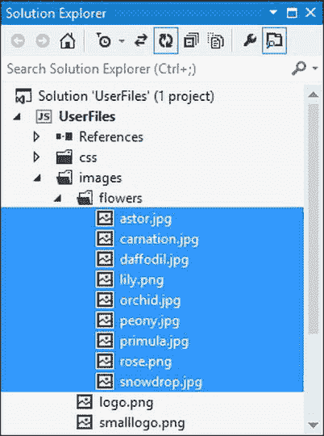
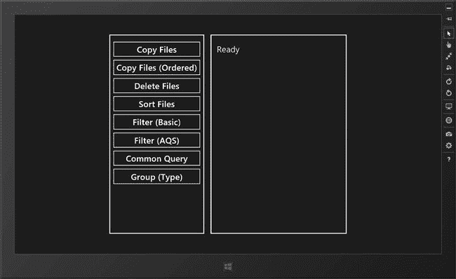
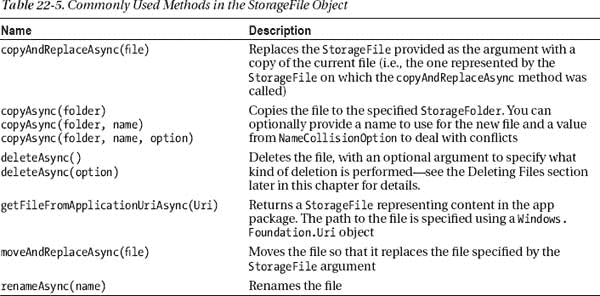
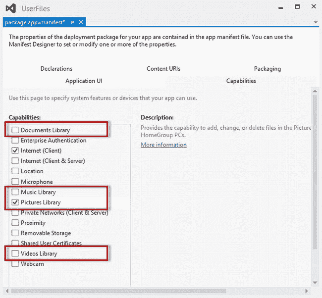
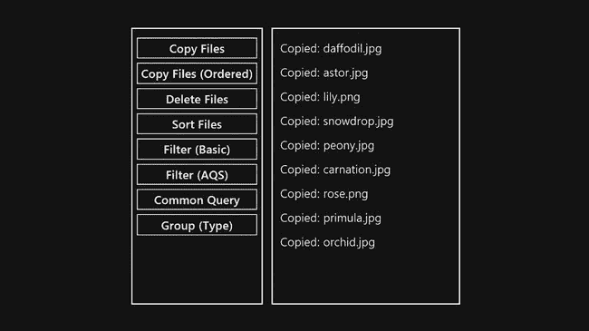
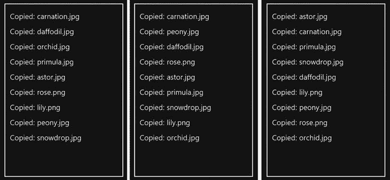
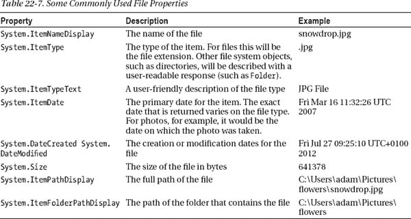
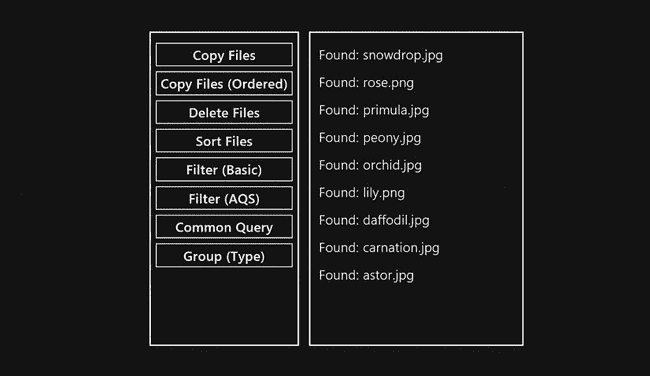
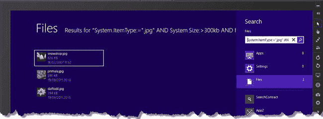
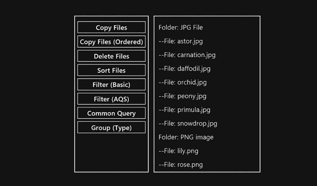

# 二十二、使用文件

这是关注用户文件的两章中的第一章，也就是说用户创建、更改和存储的文件不同于我在第 21 章中描述的应用数据和文件。

在这一章中，我将向您展示如何直接操作文件和文件夹来执行基本的文件操作，例如复制和删除文件。接下来，我将向您展示 Windows 应用的功能，这些功能可让您更全面地查看文件，包括对文件列表进行排序、过滤文件夹内容、执行复杂的文件搜索、创建虚拟文件夹以将相关文件分组在一起，以及监控文件夹以便在添加新文件时通知您。

这些技术让我为下一章做好了准备，下一章将展示如何将您的应用及其与文件和文件夹相关的功能集成到更广泛的 Windows 体验中。因此，简而言之，这一章的所有内容都是关于处理你的应用中的文件系统，而下一章是关于向用户展示这些功能。[表 22-1](#tab_22_1) 对本章进行了总结。

### 创建示例应用

对于这一章，我已经创建了一个名为`UserFiles`的新示例项目。我需要一些示例文件，所以我创建了一个`img/flowers`文件夹，并添加了一些 JPG 图片。这些是我在[第 21 章](21.html#ch21)中使用的相同图像，我已经将它们包含在本书附带的源代码下载中(可从`apress.com`获得)。您可以在图 22-1 中看到文件名列表，它显示了`UserFiles`项目的解决方案资源管理器窗口。

***图 22-1。**向示例应用添加图像文件*

该项目的其余部分是一个简单的应用。您可以在[清单 22-1](#list_22_1) 中看到`default.html`文件的内容。布局中有两个面板——一个包含一系列触发本章示例代码的按钮，另一个包含一个我用来显示消息的`WinJS.UI.ListView`控件。`WinJS.Binding.Template`控件用于显示`ListView`中的信息。

***清单 22-1** 。用户文件项目的 default.html 文件*

`<!DOCTYPE html>
<html>
<head>
    <meta charset="utf-8" />
    <title>UserFiles</title>
    <!-- WinJS references -->
    <link href="//Microsoft.WinJS.1.0/css/ui-dark.css" rel="stylesheet" />
    
    
    <!-- UserFiles references -->
    <link href="/css/default.css" rel="stylesheet" />
    ****
    
</head>` `<body>
    **
**
        **

**
    **
**

    **
**
        **<button id="copyFiles">Copy Files</button>**
        **<button id="copySeq">Copy Files (Ordered)</button>**
        **<button id="deleteFiles">Delete Files</button>**
        **<button id="sortFiles">Sort Files</button>**
        **<button id="filterBasic">Filter (Basic)</button>**
        **<button id="filterAQS">Filter (AQS)</button>**
        **<button id="commonQuery">Common Query</button>**
        **<button id="groupType">Group (Type)</button>**
    **
**

    **
**
        **
**
        **
**
    **
**
</body>
</html>`

你可以看到我在`css/default.css`文件中定义的 CSS 来管理这些元素在[清单 22-2](#list_22_2) 中的布局。

***清单 22-2** 。css/default.css 文件的内容*

`body {
    display: -ms-flexbox;
    -ms-flex-direction: row;
    -ms-flex-align: center; -ms-flex-pack: center;
}

.container {
    height: 80%; margin: 10px; padding: 10px;
    border: medium solid white;
}

#buttonsContainer button, .message {
    display: block; font-size: 20pt;
    width: 100%; margin-top: 10px;
}

#listContainer {width: 30%;}
#list { height: 100%;}`

我在`js/viewmodel.js`文件中定义了一些基本的应用状态和一些实用函数，你可以在[清单 22-3](#list_22_3) 中看到。这些支持显示在`ListView`控件中的信息。

***清单 22-3** 。示例应用的 viewmodel.js 文件*

`(function () {

    WinJS.Namespace.define("ViewModel", {
        State: WinJS.Binding.as({
            messages: new WinJS.Binding.List()
        })
    });

    WinJS.Namespace.define("App", {
        writeMessage: function (msg) {
            ViewModel.State.messages.push({ message: msg });
        },
        clearMessages: function () {
            ViewModel.State.messages.length = 0;
        }
    });

    App.writeMessage("Ready");
})();`

最后，你可以在[清单 22-4](#list_22_4) 中看到`js/default.js`文件。在这里，我将通过响应`default.html`文件中按钮元素的`click`事件来添加示例代码，但目前该文件只包含基本的应用管道。

***清单 22-4** 。示例应用的初始 default.js 文件*

`(function () {

    var $ = WinJS.Utilities.query;
    var app = WinJS.Application;
    var activation = Windows.ApplicationModel.Activation;
    var storage = Windows.Storage;
    var search = Windows.Storage.Search;

    var imageFileNames = ["astor.jpg", "carnation.jpg", "daffodil.jpg",
        "lily.png","orchid.jpg", "peony.jpg", "primula.jpg", "rose.png", "snowdrop.jpg"];

    app.onactivated = function (args) {
        if (args.detail.previousExecutionState !=
            activation.ApplicationExecutionState.suspended) {

            args.setPromise(WinJS.UI.processAll().then(function() {
                $('#buttonsContainer > button').listen("click", function (e) {
                    App.clearMessages();
                    switch (e.target.id) {
                        // *...code for examples will go here...*
                    }` `                });
            }));
        }
    };
    app.start();
})();`

我定义了一个名为`imageFileNames`的数组，它包含了`img/flowers`文件夹中的文件名。在接下来的几节中，我将在`switch`语句中添加代码来响应各个按钮。如果你现在启动示例应用，你会看到如图[图 22-2](#fig_22_2) 所示的基本布局。

***图 22-2。**示例 app 的布局*

### 执行基本的文件操作

在接下来的小节中，我将向您展示如何执行一些基本的文件操作。这将允许我演示使用`Windows.Storage`对象处理用户文件而不是应用文件的区别，并提供一些关于应用在处理文件系统时所受限制的细节。

 **提示**我在本章中没有提到的一个基本文件操作是读取文件的内容。你可以在[第 21 章](21.html#ch21)(我演示了如何读取应用数据文件的内容)和[第 23 章](23.html#ch23)(我展示了如何在应用布局中使用文件内容)中看到这一点。

#### 复制文件

在这一节中，我将向您展示如何将应用包中包含的花卉图像文件复制到用户的`My Pictures`文件夹中。您可以在清单 22-5 的[中看到我对`default.js`文件中的`switch`语句所做的补充。在 Windows 应用中处理文件的代码相当冗长，所以我将只展示我对每个示例所做的修改。](#list_22_5)

 **注意**除非我另外明确说明，否则我在本章中描述的新对象都在`Windows.Storage`名称空间中，在本例中我将其别名为`storage`。

***清单 22-5** 。增加从应用包复制文件到文件系统的支持*

`...
switch (e.target.id) {
    **case 'copyFiles':**
        **storage.KnownFolders.picturesLibrary.createFolderAsync("flowers",**
            **storage.CreationCollisionOption.replaceExisting)**
        **.then(function(folder) {**
            **imageFileNames.forEach(function (filename) {**
                **storage.StorageFile.getFileFromApplicationUriAsync(**
                    **Windows.Foundation.Uri("ms-appx:img/" + filename))**
                **.then(function (file) {**
                    **file.copyAsync(folder).then(function () {**
                        **App.writeMessage("Copied: " + filename);**
                    **}, function (err) {**
                        **App.writeMessage("Error: " + err);**
                    **});**
                **});**
            **});**
        **});**
        **break;**
}
...`

这比看起来要复杂得多，因为大多数与文件相关的方法都使用了`Promise`对象。我将一步一步地浏览这段代码，并解释发生了什么。一旦理解了基本结构，您会发现本节中的其余示例更容易解析。

##### 定位文件夹

我想做的第一件事是找到我的目标文件夹。当涉及到使用文件系统时，Windows 应用被置于严格的限制之下，只有某些位置你可以在没有用户明确许可的情况下写入(这种许可是通过文件选择器来表达的，我在第 23 章中进行了演示)。在第 23 章之前，我不会向您介绍文件拾取器，这意味着我被限制在一个非常小的预定义位置集合中，可以通过`KnownFolder`对象访问这些位置。该对象定义了[表 22-2](#tab_22_2) 中所示的属性，这些属性与常见的 Windows 文件位置相关。

 **提示**甚至访问由`KnownFolder`对象定义的位置集也受到限制。想要读写这些位置的应用必须在它们的清单中做一个声明，我将在本章后面演示。

在这个例子中，我将应用包中的文件复制到用户的`Pictures`文件夹中，如[清单 22-6](#list_22_6) 所示。

***清单 22-6** 。使用用户的图片文件夹*

`...
storage.**KnownFolders.picturesLibrary**.createFolderAsync("flowers",
    storage.CreationCollisionOption.replaceExisting)
...`

每个属性返回一个代表文件系统位置的`StorageFolder`对象。一旦我得到代表`Pictures`文件夹的`StorageFolder`，我就调用`createFolderAsync`方法来创建一个`flowers`文件夹。这将是我复制图像文件的位置。在第 21 章中，我向你展示了`StorageFolder`对象定义的创建或定位`StorageFile`对象的基本方法，但是`StorageFolder`也为其他文件夹定义了有用的方法。表 22-3 描述了这些方法中最有用的。

当使用`createFoldersAsync`和`renameAsync`方法时，你可以使用一个由`CreationCollisionOption`对象定义的值来提供一个可选参数，我在[表 22-4](#tab_22_4) 中总结了这个值。

T2】

在示例中，我使用了`replaceExisting`选项，这将删除任何名为`flowers`的现有文件夹，并用一个新的空文件夹替换它。由`createFolderAsync`方法返回的`Promise`向`then`方法传递一个`StorageFolder`对象，该对象代表我感兴趣的`flowers`文件夹。

 **警告**删除文件夹当然是破坏性的。在运行此示例应用之前，您应该确保您的`Pictures`文件夹中没有名为`flowers`的文件夹；否则你会丢失你的文件。

##### 复制文件

现在我有了一个代表文件目标的`StorageFolder`对象，我可以开始复制它们了。我通过代表单个文件的`StorageFile`对象来实现。首先，我为我的应用包中的每个文件获取一个`StorageFile`，然后依次为它们调用`copyAsync`方法，如[清单 22-7](#list_22_7) 所示。

***清单 22-7** 。将 app 包中的每个文件复制到目标文件夹*

`...
switch (e.target.id) {
    case 'copyFiles':
        storage.KnownFolders.picturesLibrary.createFolderAsync("flowers",
            storage.CreationCollisionOption.replaceExisting)
        .then(function(folder) {
            **imageFileNames.forEach(function (filename) {**
                **storage.StorageFile.getFileFromApplicationUriAsync(**
                    **Windows.Foundation.Uri("ms-appx:img/" + filename))**
                **.then(function (file) {**
                    **file.copyAsync(folder).then(function () {**
                        **App.writeMessage("Copied: " + filename);**
                    **}, function (err) {**
                        **App.writeMessage("Error: " + err);**
                    **});**
                **});**
            **});**
        });
        break;
}
...`

这是一个很好的例子，说明当您使用许多异步方法来执行相关操作时，会产生冗长的代码。确定给定的`Promise`对象上运行的函数可能需要一段时间——尽管随着你习惯于编写 Windows 应用，这变得更加容易。

我在清单中突出显示的代码列举了我在`imageFileNames`数组中定义的每个文件名，并使用`StorageFile.getFileFromApplicationUriAsync`方法获得一个依次代表每个图像的`StorageFile`对象。这是我在《T4》第 21 章中展示的技术，依靠`Windows.Foundation.Uri`物体。

`StorageFile`对象是对`StorageFolder`对象的补充，代表文件系统中的单个文件。一旦我有了一个`StorageFile`对象，我就可以调用`copyAsync`方法。这个方法的参数是`StorageFolder`对象，它代表文件应该被复制到的位置。我提供了我在上一节中创建的`flowers`文件夹。我已经在由`copyAsync`方法返回的`Promise`上使用了`then`方法来编写成功和错误消息，这些消息将显示在应用布局的`ListView`控件中。我在[表 22-5](#tab_22_5) 中总结了常用的`StorageFile`方法。

##### 启用清单中的功能

如果您在此时运行示例应用并单击`Copy Files`按钮，您将会看到 Visual Studio 中显示的一条消息，如图 22-3 中的[所示。](#fig_22_3)

***图 22-3。**试图访问文件系统时显示错误*

正如我前面提到的，应用对文件系统的访问非常有限。如果你想访问一个不是由用户通过文件选择器提供的位置(我会在第 23 章中解释)，那么你必须使用由`KnownFolders`对象定义的一个位置。您还必须在应用清单中声明您的应用能够访问该位置。如果您不这样做，一旦您的应用尝试访问文件系统，您就会看到如图所示的错误。

要声明该功能，在 Visual Studio `Solution Explorer`窗口中双击`package.appxmanifest`文件打开清单，并导航到`Capabilities`选项卡。你会看到能力列表包括`KnownFolders`位置的项目，我在[图 22-4](#fig_22_4) 中突出显示了这些项目。如图所示，我已经检查了与`KnownFolders.picturesLibrary`位置相对应的`Pictures Library`能力。(`Internet (Client)`功能在您创建新的 Windows 应用项目时默认选中。)

***图 22-4。**允许访问应用清单中的位置*

您必须为每个想要使用的位置启用该功能。这将为您的应用提供该位置的访问权限，并向您的应用的权限窗格(可通过 Settings Charm 获得)添加一个条目，如果您通过 Windows 应用商店分发您的应用，该条目将显示给用户。

 **提示**您应该只检查您需要的功能。这个想法是为了给用户提供他们需要的信息，让他们在把你的应用安装到他们的设备上之前，对他们的信任程度做出明智的选择。实际上，用户在任何平台上都不会太关注这些信息，他们会下载并安装任何看起来有趣的东西。即使如此，要求您需要的最低能力也是一个好的做法。

通过添加响应按钮点击的代码并在清单中声明该功能，我已经可以将项目中的文件复制到设备文件系统中了。

为了测试这个例子，启动应用并点击`Copy Files`按钮。你会在布局中间面板的`ListView`控件中看到一系列消息，报告每个文件都被复制，如图[图 22-5](#fig_22_5) 所示。如果您打开文件浏览器并导航到您的`Pictures`库，您将看到一个包含样本图像的 flowers 文件夹。

***图 22-5。**将文件从 app 包复制到文件系统*

在我继续之前，有几点需要注意。首先，我已经从应用包中复制了文件，因为这是我设置和分发示例的最简单的方法。虽然这在实际项目中可能是一项有用的技术，但是您当然可以在您的应用清单中声明的任何已知位置上执行文件操作(我将在第 23 章中向您展示如何获得用户许可来处理其他位置的文件)。

要注意的第二点是，由于我在使用`createFolderAsync`方法时指定的碰撞选项，单击`Copy Files`按钮将删除`flowers`文件夹，创建一个新文件夹，并再次复制文件。

##### 确保复制顺序

如果您重复点击`Copy Files`按钮，您将会看到`ListView`控件中显示的消息以不同的顺序显示。你可以在[图 22-6](#fig_22_6) 中看到效果，这里我已经显示了三次点击按钮的消息顺序。

***图 22-6。**消息顺序的变化*

在第九章的[中，当我解释`Promise`对象如何工作时，我说过 JavaScript 维护一个要完成的工作队列，使用`Promise` s 通过将工作放在那个队列中进行后续处理来推迟工作——这就是`setImmediate`方法所做的。](09.html#ch9)

然而，当您使用 Windows API(包括`Windows.Storage`)时，您的工作可以并行完成，因为 API 的这一部分中的对象是使用支持并行执行任务的语言实现的。JavaScript 隐藏了这方面的细节，它没有对并行任务的内置语言支持，但这确实意味着操作完成的顺序可以不同。

如果您不关心操作执行和完成的顺序，那么您不必采取任何特殊的操作。如果你真的在乎，那么你需要改变你调用异步方法的方式，这样你只需要在前一个操作完成时复制一个文件，如清单 22-8 所示。我添加了这段代码，以便在点击`Copy Files (Ordered)`按钮时执行。

***清单 22-8** 。强制按给定顺序执行复印操作*

`...
switch (e.target.id) {
    case 'copyFiles':
        // *...statements removed for brevity...*
        break;
    **case 'copySeq':**
        **var index = 0;**
        **function copyFile(index, folder) {**
            **return storage.StorageFile.getFileFromApplicationUriAsync(**
                **Windows.Foundation.Uri("ms-appx:img/" +**
                   **imageFileNames[index]))**
            **.then(function(file) {**
                **return file.copyAsync(folder).then(function () {**
                    **App.writeMessage("Copied: " + imageFileNames[index]);**
                **}).then(function() {**` `                    **index++;**
                    **if (index < imageFileNames.length) {**
                        **return copyFile(index, folder);**
                    **}**
                **})**
            **});**
        **}**
        **storage.KnownFolders.picturesLibrary.createFolderAsync("flowers",**
            **storage.CreationCollisionOption.replaceExisting)**
        **.then(function (folder) {**
            **copyFile(index, folder).then(function () {**
                **App.writeMessage("All files copied");**
            **});**
        **});**
        **break;**
}
...`

在这个清单中，我使用我在[第 21 章](21.html#ch21)中描述的技术将复制操作链接在一起，其效果是按照在`imageFileNames`数组中定义的顺序复制图像。这是另一段看起来曲折的代码，但是基本模式——定义一个返回`Promise`并递归调用自身的函数——与《T4》第九章中的链接示例是一样的。

只有在一致性非常重要的情况下，才应该强制异步操作的顺序，因为 Windows 能够并行执行多种操作，这种技术会强制序列化，因此会严重影响性能。

#### 删除文件

既然您已经看到了几个文件操作示例，您会发现本节的其余部分更容易理解。如果你还没有理解使用异步方法处理文件的想法，你应该考虑重温一下[第 9 章](09.html#ch9)——如果你还没有很好地掌握`Promise`对象如何工作，你会发现例子越来越难理解。

在这一节中，我将演示如何删除文件。这很简单，但是我想强调这种方法的共性——一旦你理解了一个文件操作是如何工作的，你就可以很快地创建其他的文件操作。在[清单 22-9](#list_22_9) 中，您可以看到我添加到`default.js`文件中的代码，以响应被点击的`Delete Files`按钮。

***清单 22-9** 。删除文件*

`...
switch (e.target.id) {
   // *...statements omitted for brevity...*
   **case 'deleteFiles':**
        **storage.KnownFolders.picturesLibrary.getFolderAsync("flowers")**
        **.then(function (folder) {**
            **folder.getFilesAsync().then(function (files) {**
                **if (files.length == 0) {**
                    **App.writeMessage("No files found");**
                **} else {**
                    **files.forEach(function (storageFile) {**` `                        **storageFile.deleteAsync(storage.StorageDeleteOption.default);**
                        **App.writeMessage("Deleted: " + storageFile.name);**
                    **});**
                **}**
            **});**
        **})**
        **break;**
}
...`

在这个清单中，我使用了`getFilesAsync`方法来获取代表 flowers 目录中文件的一组`StorageFile`对象。如果数组是空的，那么我知道文件夹中没有文件，并在`ListView`控件中显示一条适当的消息。如果数组中有`StorageFile`对象，那么我使用`forEach`方法枚举数组内容并调用`deleteAsync`方法，这将删除文件。该方法的参数是来自`StorageDeleteOption`对象的一个值，它指定了执行的删除类型。我在[表 22-6](#tab_22_6) 中描述了这些值。

例如，我指定了`default`值，这意味着如果你启动应用并单击`Delete Files`按钮，你将能够在 Windows 回收站中找到已删除的文件。

 **提示**您会注意到，在这个例子中，当我向`ListView`写消息时，我使用了`StorageFile.name`属性。`StorageFile`对象定义了许多属性，您可以用它们来获取关于文件的信息——我将在下一节更详细地解释这一点。

### 整理和过滤文件

在前一个例子中，我称为`StorageFolder.getFilesAsync`方法的`StorageFile`对象数组有两个定义特征。第一个是我得到了文件夹中所有文件的*和第二个是数组中按字母顺序排列的对象，基于文件名。*

在这一节中，我将向您展示如何执行*文件查询*，这允许您对检索的文件进行更多的选择，并以不同的方式对结果进行排序。本节中的新对象位于`Windows.Storage.Search`名称空间中，在示例中我将其别名为`search`。

对文件进行排序和过滤有两个原因。第一个是应用中的通用工具——你可能只想对满足某种标准的文件执行操作，对从`StorageFolder`中获得的文件进行过滤和排序是一种很好的方式。对文件进行分类和过滤的另一个原因是，这些技术支撑了一些关键的接触点，使你能够将你的应用集成到更广泛的 Windows 平台中，并向你的用户呈现一个处理文件的一致模型——这是我在第 23 章中再次提到的主题。

#### 整理文件

在 Windows 应用中，对文件的选择顺序进行排序是文件查询的一种简单形式。在后面的小节中，我将向您展示一些功能，这些功能更像是与单词 query 相关联的东西，但是从排序开始，让我介绍所需的对象，并解释它们是如何组合在一起的。首先，[清单 22-10](#list_22_10) 显示了我添加到`default.js`文件中的内容，以便在点击`Sort Files`按钮时做出响应。(如果您最近删除了文件，您需要再次点击`Copy Files`按钮，以便在`flowers`文件夹中有要处理的文件。)

***清单 22-10** 。使用文件查询对文件进行分类*

`...
switch (e.target.id) {
    // *...statements omitted for brevity...*
    **case 'sortFiles':**
        **var options = new search.QueryOptions();**
        **options.sortOrder.clear();**
        **options.sortOrder.push({**
            **ascendingOrder: false,**
            **propertyName: "System.ItemNameDisplay"**
        **});**
        **storage.KnownFolders.picturesLibrary.getFolderAsync("flowers")**
        **.then(function (folder) {**
            **folder.createFileQueryWithOptions(options).getFilesAsync()**
            **.then(function (files) {**
                **if (files.length == 0) {**
                    **App.writeMessage("No files found");**
                **} else {**
                    **files.forEach(function (storageFile) {**
                        **App.writeMessage("Found: " + storageFile.name);**
                    **});**
                **}**
            **});**
        **});**
        **break;**
}
...`

您使用一个`QueryOptions`对象控制文件的选择和排序方式，创建其中一个是我在清单中采取的第一个动作。我创建了这个没有任何构造函数参数的对象，它使用默认设置。

属性返回一个对象数组，这些对象按顺序应用来对文件夹中的文件进行排序。每个对象都有一个`propertyName`属性和一个`ascendingOrder`属性，前者指定执行排序的文件的属性，后者指定排序的方向。

在示例中，您可以看到我已经通过调用`QueryOptions.sortOrder.clear`方法开始了。这是因为默认的`QueryOptions`对象是用一个`sortOrder`对象创建的，该对象根据文件名对文件进行升序排序。如果不调用`clear`方法，您定义的任何自定义排序都将仅在默认排序之后应用。

 **提示**`sortOrder`属性是只读的。这意味着您需要通过更改属性返回的数组的内容来创建排序指令，而不是分配一个新的数组。

清除默认排序后，我添加自己的排序，如下所示:

`... options.sortOrder.push({
    ascendingOrder: false,
    propertyName: "**System.ItemNameDisplay**"
});
...`

该语句向`sortOrder`数组添加了一个新对象，该对象按照名称以逆序对文件进行排序，这是默认排序的一个简单变体。`propertyName`属性值`System.ItemNameDisplay`是 Windows 定义的一组广泛的文件属性之一。这样的房产有 125 个，太多了，我无法在此一一列举。相反，我在[表 22-7](#tab_22_7) 中列出了常用的。对于列表中的每一个条目，我都详细描述了当示例应用中的`snowdrop.jpg`文件被复制到`Pictures`库中并且拥有完整的路径`C:\Users\adam\Pictures\flowers\snowdrop.jpg`时，属性会显示什么。

除了 125 个基本属性(包括表中的属性)之外，还有数百个更具体的属性。例如，您可以在音频文件中找到一整套的`System.Music`属性，在视频文件中可以找到`System.Media`属性。你可以在`[http://msdn.microsoft.com/en-us/library/windows/desktop/ff521735(v=vs.85).aspx](http://msdn.microsoft.com/en-us/library/windows/desktop/ff521735(v=vs.85).aspx)`获得完整名单的详细信息。

 **提示**这些是字符串值，尽管它们看起来像是对`System`名称空间中对象的引用。在将这些值分配给`propertyName`属性时，必须用引号将它们括起来。

一旦我定义并配置了我的`QueryOptions`对象，我就调用我对其内容感兴趣的`StorageFolder`对象的`getFilesAsync`方法，并返回一个由按照我指定的顺序排序的`StorageFile`对象组成的数组。

 **提示**应用排序时，使用有效的文件系统属性名很重要。如果您提供的名称无效，应用将被终止，不会发出警告。

在示例中，我枚举了排序数组的内容，并显示了每个文件的名称。为了得到这个名字，我使用了一个由`StorageFile`对象定义的描述性属性，我在[表 22-8](#tab_22_8) 中总结了这个属性。我再次展示了每个属性为`snowdrop.jpg`文件返回的值。

其中一些属性提供了用户友好的值，您可以直接将其包含在应用布局中，而其他属性则更具技术性和细节性，旨在用于您的代码中。

文件系统属性和通过`StorageFile`属性可用的属性之间有很好的映射，但是并不是所有 125 个文件系统属性都可用。如果你想得到一个特定的值，那么你可以使用`StorageFile.properties.retrievePropertiesAsync`方法，如[清单 22-11](#list_22_11) 所示。

***清单 22-11** 。从 StorageFile 对象获取文件系统属性值*

`...
file.properties.retrievePropertiesAsync(["System.ItemType"]).then(function (props) {
     var value = props["System.ItemType"];
});
...`

我没有将这种技术结合到例子中，因为`StorageFile`属性足以满足我的需要。如果你启动 app，点击`Sort Files`按钮，你会看到文件按名字降序排列(即按字母顺序倒序排列)，如图[图 22-7](#fig_22_7) 所示。

***图 22-7。**列出文件时应用自定义排序顺序*

#### 过滤文件

除了排序，您还可以使用`QueryOptions`对象来过滤从`getFilesAsync`方法获得的`StorageFile`对象。`QueryOptions`对象定义了许多支持过滤的属性，我已经在[表 22-9](#tab_22_9) 中描述过了。

这些过滤属性分为两类——*基本*和*AQS*——我将在接下来的章节中解释这两种属性。三个基本的过滤属性是`fileTypeFilter`、`folderDepth`和`indexOption`。您可以在清单 22-12 中看到这些正在使用的属性，它列出了我添加到`default.js`文件中的代码，以响应被点击的`Filter (Basic)`按钮。

***清单 22-12** 。执行基本过滤*

`...
switch (e.target.id) {` `    // *...statements omitted for brevity...*
    **case 'filterBasic':**
        **var options = new search.QueryOptions();**
        **options.fileTypeFilter.push(".doc", ".jpg", ".pdf");**
        **options.folderDepth = search.FolderDepth.shallow;**
        **options.indexerOption = search.IndexerOption.useIndexerWhenAvailable;**
        **storage.KnownFolders.picturesLibrary.getFolderAsync("flowers")**
        **.then(function (folder) {**
            **folder.createFileQueryWithOptions(options).getFilesAsync()**
            **.then(function (files) {**
                **if (files.length == 0) {**
                    **App.writeMessage("No files found");**
                **} else {**
                    **files.forEach(function (storageFile) {**
                        **App.writeMessage("Found: " + storageFile.name);**
                    **});**
                **}**
            **});**
        **});**
        **break;**
}
...`

这个例子在结构上类似于我之前展示的排序例子，除了我使用了基本的过滤属性。当然，您可以将排序和过滤属性结合起来——我将它们分开显示，只是因为这样便于解释属性值。

##### 过滤文件类型

在清单中，我从`QueryOptions.fileTypeFilter`属性开始，它过滤掉没有您指定的文件前缀的任何文件。这是另一个需要修改从属性获取的数组内容的实例，而不是分配一个新的数组。

在这个例子中，我使用了由 JavaScript 数组定义的`push`方法来指定我想要的文件扩展名为`.doc`、`.jpg`和`.pdf`的文件。我的示例应用只有`.jpg`和`.png`文件，因此效果是从查询中排除了`.png`文件，但是我已经指定了多个值来向您展示这是如何做到的。该属性的默认值是一个空数组，表示不应根据文件扩展名排除任何文件。

 **提示**文件扩展名以前导句点指定，即。`.pdf`而不是`pdf`。

##### 设置搜索深度

使用由`FolderDepth`对象定义的值之一来设置`QueryOptions.folderDepth`属性，我已经在[表 22-10](#tab_22_10) 中描述过了。

T2】

我在清单中选择了`shallow`值，它将我通过`getFilesAsync`方法接收的文件限制在`flowers`目录中(当然，虽然没有子目录可供我操作我的示例文件)。使用`deep`值时要小心——您最终可能会查询大量文件，这可能是一个耗时且消耗资源的操作。

##### 使用以前的索引数据

Windows 为用户的内容编制索引以加快搜索速度，从而避免了通过文件系统来获取文件属性和内容的详细信息。问题是，索引是作为后台任务完成的，对文件的最新更改可能不会反映在索引中—本质上，索引数据是在更快的搜索和准确性之间的权衡。您可以使用`QueryOptions.indexerOption`属性指定查询是否使用索引数据，该属性设置为来自`IndexerOption`对象的值。我已经在[表 22-11](#tab_22_11) 中描述了可用值。

我在示例中使用了`useIndexerWhenAvailable`值。当您对文件的内容感兴趣时，索引数据的影响最大，访问文件系统意味着依次搜索每个文件。使用以前的索引数据可以大大加快这种搜索的速度。

##### 查看过滤结果

我为各种筛选器属性选择的值的效果是，我的查询选择了正在搜索的文件夹中的 JPG、DOC 和 PNG 文件，并且 Windows 应该使用缓存的文件数据(如果可用)。你可以在[图 22-8](#fig_22_8) 中看到结果。

***图 22-8。**文件过滤结果*

#### 使用高级查询语法属性

*高级查询语法* (AQS)允许表达复杂的查询，超出了使用其他`QueryOptions`属性所能管理的范围。有两个属性可用于指定 AQS 查询:`applicationSearchFilter`属性用于您在应用中定义的 AQS 查询，而`userSearchFilter`属性用于用户定义的查询。这种分离不是强制性的，无论如何，当查询文件系统时，两个查询字符串会自动合并。

[清单 22-13](#list_22_13) 显示了添加到`default.js`文件中的`switch`语句，我添加它是为了在点击`Filter (AQS)`按钮时做出响应。这段代码执行了一个相当简单的 AQS 查询。

***清单 22-13** 。执行 AQS 查询*

`...
switch (e.target.id) {
    // *...statements omitted for brevity...*
    **case 'filterAQS':**
        **var options = new search.QueryOptions();**
        **options.folderDepth = search.FolderDepth.deep;**
        **options.applicationSearchFilter**
            **= 'System.ItemType:=".jpg" AND System.Size:>300kb AND folder:flowers';**
        **storage.KnownFolders.picturesLibrary.createFileQueryWithOptions(options)**
            **.getFilesAsync().then(function (files) {**
                **if (files.length == 0) {**
                    **App.writeMessage("No files found");**
                **} else {**
                    **files.forEach(function (storageFile) {**` `                        **App.writeMessage("Found: " + storageFile.name);**
                **});**
            **}**
        **});**
        **break;**
}
...`

对于这个例子，我在代表`Pictures`库的`StorageFolder`对象上调用了`getFilesAsync`方法。这允许我将`flowers`文件夹指定为 AQS 查询的一部分，如下所示:

`System.ItemType:=".jpg" AND System.Size:>300kb AND folder:flowers`

这是一个典型的 AQS 查询，包含两个搜索词和一个约束。搜索词基于我前面描述的文件系统属性。我正在查询其`System.ItemType`属性为`.jpg`并且其`System.Size`属性大于`300kb`的文件。条款和约束与关键字`AND`组合在一起，该关键字必须总是大写(您也可以在查询中使用`OR`和`NOT`)。

请注意，每个搜索属性后跟一个冒号，然后是比较符号，如下所示:

`System.ItemType:=".jpg" AND System.Size:>300kb AND folder:flowers`

*约束*使用`folder`关键字表示，并将查询限制在路径包含名为`flowers`的文件夹的文件上。(这匹配路径中任何名为`flowers`的文件夹，而不仅仅是直接的父文件夹)。

如果运行应用并点击`Filter (AQS)`按钮，AQS 查询将用于过滤`Pictures`库中的文件，产生如图[图 22-9](#fig_22_9) 所示的结果。

***图 22-9。**使用 AQS 过滤文件*

AQS 也可以在 Windows 搜索窗格中使用。我想我从来没有见过用户使用 AQS，但它可以在应用开发过程中测试你的查询。图 22-10 显示了先前清单 22 中的 AQS 查询——在搜索窗格中使用。如果您的文件系统包含 Visual Studio 项目中图像的额外副本，您可能会看到更多结果(我清理了我的文件以获得此结果)。

***图 22-10。**在 Windows 搜索窗格中使用 AQS 查询查找文件*

在我的例子中，我使用了基于文件属性和路径的 AQS 查询，但是您也可以使用 AQS 来搜索文件内容，只需在查询中包含一个带引号的短语。因此，例如，如果您想要查找包含短语“我喜欢苹果”的所有 PDF 文件，您的查询应该是:

`System.ItemType:=".pdf" AND "I like apples"`

AQS 可以用来创建极其精确的查询，在`[http://msdn.microsoft.com/en-us/library/aa965711(v=VS.85).aspx](http://msdn.microsoft.com/en-us/library/aa965711(v=VS.85).aspx)`可以找到一个了解 AQS 更多信息的好起点。

#### 使用便捷查询

`CommonFileQuery`对象定义了六个常用的查询，您可以使用它们来创建预配置的`QueryOptions`对象。[清单 22-14](#list_22_14) 显示了我添加到`default.js`文件中的`switch`语句中的内容，以响应点击`Common Query`按钮。

***清单 22-14** 。使用 CommonFileQuery 对象*

`...
switch (e.target.id) {
    // *...statements omitted for brevity...*
    **case 'commonQuery':**
        **var options = new search.QueryOptions(**
            **search.CommonFileQuery.orderByName, [".jpg", ".png"]);**
        **storage.KnownFolders.picturesLibrary.getFolderAsync("flowers")**
                **.then(function (folder) {**
                    **folder.createFileQueryWithOptions(options).getFilesAsync()**
                    **.then(function (files) {**
                        **if (files.length == 0) {**
                            **App.writeMessage("No files found");**
                        **} else {**
                            **files.forEach(function (storageFile) {**
                                **App.writeMessage("Found: " + storageFile.name);**
                            **});**
                        **}**` `                    **});**
                **});**
        **break;**
}
...`

为了使用方便的查询，可以将一个值从`CommonFileQuery`对象作为构造函数参数传递给`QueryOptions`对象。您还必须提供一个文件扩展名数组，用于设置`fileTypeFilter`属性。

在这个例子中，我使用了`CommonFileQuery.orderByName`属性，该属性将`QueryOptions`对象配置为包含`StorageFolder`中的所有文件，并按照名称的字母顺序对它们进行排序。我已经过滤了文件，只接受了`jpg`和`png`文件扩展名(在示例文件夹中只有这种类型的文件，但是您已经明白了)。我已经在[表 22-12](#tab_22_12) 中描述了所有六个`CommonFileQuery`值。其中一些查询只有在应用于音乐文件时才有意义，因为它们依赖于`System.Music`文件属性。

### 使用虚拟文件夹

对象过着双重生活。在本章的前面，我向您展示了可以用来在文件系统上定位或创建新文件夹的`StorageFolder`方法。这是文件夹的传统用法，也是你对一个叫做`StorageFolder`的对象的期望。

然而，`StorageFolder`对象也可以在文件查询的结果中使用，其中它们表示用于按照共同特征或排序顺序将文件分组在一起的*虚拟文件夹*。[清单 22-15](#list_22_15) 展示了我是如何使用这个特性将我的示例图像文件按照年份分组到虚拟文件夹中，以响应点击`Group (Type)`按钮。

***清单 22-15** 。将文件分组到虚拟文件夹中*

`...
switch (e.target.id) {
    // *...statements omitted for brevity...*
    **case 'groupType':**
        **storage.KnownFolders.picturesLibrary.getFolderAsync("flowers")**` `            **.then(function (flowersFolder) {**
                **flowersFolder.getFoldersAsync(search.CommonFolderQuery.groupByType)**
                **.then(function (typeFolders) {**
                    **var index = 0;**
                    **(function describeFolders() {**
                        **App.writeMessage("Folder: " + typeFolders[index].displayName);**
                        **typeFolders[index].getFilesAsync().then(function (files) {**
                            **files.forEach(function (file) {**
                                **App.writeMessage("--File: " + file.name);**
                            **});**
                            **if (index < typeFolders.length -1) {**
                                **index++;**
                                **describeFolders();**
                            **}**
                        **});**
                    **})();**
                **});**
        **});**
        **break;**
}
...`

清单中的代码有点复杂，因为我想以特定的顺序显示输出，但是我执行的操作是异步的。解释发生了什么的最简单的方法是将代码分成两部分。建议你运行 app，点击`Group (Type)`按钮。您将看到图 22-11 中[所示的结果。](#fig_22_11)

 **注意**如果您已经删除了示例文件，您需要先点击`Copy Files`按钮。

***图 22-11。**根据类型对示例文件进行分组*

#### 将文件分组

将文件分组到虚拟文件夹的过程非常简单，你可以在清单 22-16 中看到重要的陈述。这是完整清单中语句的子集，这样我就可以专注于分组特性。

***清单 22-16** 。分组文件*

`...
storage.KnownFolders.picturesLibrary.getFolderAsync("flowers")
    .then(function (flowersFolder) {
        **flowersFolder.getFoldersAsync(search.CommonFolderQuery.groupByType)**
        .then(function (typeFolders) {
           // …code removed...
        });
});
...`

我通过对由`KnownFolders.picturesLibrary`属性返回的`StorageFolder`对象调用`getFolderAsync`方法来获得`flowers`文件夹，就像我在前面的例子中所做的一样。

这给了我一个代表`flowers`文件夹的`StorageFolder`对象。为了对文件夹包含的文件进行分组，我调用了`getFoldersAsync`方法并传入了由`CommonFolderQuery`对象定义的一个值。`CommonFolderQuery`对象定义了许多允许你以不同方式对文件进行分组的值，如[表 22-13](#tab_22_13) 所总结的。

在这个例子中，我使用了`groupByType`值，顾名思义，它根据文件扩展名对文件进行分组。用一个`CommonFolderQuery`值调用`getFoldersAsync`方法的结果是一个`Promise`对象，它在完成时将一个`StorageFolder`对象数组传递给 then 函数。

每个`StorageFolder`对象代表为组属性找到的一个值。在这个例子中，我按照类型对文件进行了分组，有两种类型的示例文件——JPG 文件和 PNG 文件。我将收到一个包含所有 JPG 文件的`StorageFolder`和一个包含所有 PNG 文件的`StorageFolder`。

#### 处理分组后的文件

一旦我获得了虚拟`StorageFolder`对象的数组，我需要在应用布局中显示结果。这是示例代码的第二部分，我已经在清单 22-17 中展示过了。

***清单 22-17** 。显示每个虚拟文件夹的内容*

`...
.then(function (typeFolders) {
    **var index = 0;**
    **(function describeFolders() {**
        **App.writeMessage("Folder: " + typeFolders[index].displayName);**
        **typeFolders[index].getFilesAsync().then(function (files) {**
            **files.forEach(function (file) {**
                **App.writeMessage("--File: " + file.name);**
            **});**
            **if (index < typeFolders.length -1) {**
                **index++;**
                **describeFolders();**
            **}**
        **});**
    **})();**
});
...`

您使用`getFilesAsync`方法获取每个虚拟文件夹中的文件。我已经调用了不带参数的方法，但是您可以使用`QueryOptions`对象过滤或排序文件，如本章前面所述。

这段代码解决的问题是,`getFilesAsync`方法返回一个提供文件数组的`Promise`,但是我需要确保在移动到下一个虚拟文件夹之前，我已经为一个虚拟文件夹中的所有文件调用了`App.writeMessage`方法。

为了解决这个问题，我使用了我在第 21 章中介绍的技术的一个小变体，通过定义一个自我执行的函数，当它遍历虚拟文件夹时调用它自己。这段代码的结果是，我对虚拟文件夹及其包含的文件的处理进行了序列化，这样我就可以确保描述性消息以正确的顺序显示，从而产生您在本节开始的[图 22-11](#fig_22_11) 中看到的结果。

### 监控文件夹中的新文件

我要展示的最后一个功能是监视文件夹中的新文件。为了演示这一点，我已经将[清单 22-18](#list_22_18) 中的代码添加到了`default.js`文件中。与本章中的其他例子不同，这个添加的代码不是响应按钮点击而触发的，而是作为`onactivated`函数的一部分执行的。

***清单 22-18** 。监控文件*

`...
app.onactivated = function (args) {
    if (args.detail.previousExecutionState
        != activation.ApplicationExecutionState.suspended) {` 
`        args.setPromise(WinJS.UI.processAll().then(function () {

            **storage.KnownFolders.picturesLibrary.getFolderAsync("flowers")**
            **.then(function (folder) {**
                **var query = folder.createFileQuery();**
                **query.addEventListener("contentschanged", function (e) {**
                    **App.writeMessage("New files!");**
                **});**

                **setTimeout(function () {**
                    **query.getFilesAsync();**
                **}, 1000);**
            **});**

            **$('#buttonsContainer > button').listen("click", function (e) {**
                App.clearMessages();
                switch (e.target.id) {
                    // ... statements removed for brevity
                }
            });
        }));
    }
};
...`

监控一个文件夹的起点是获得一个代表它的`StorageFolder`对象。我将再次监控`flowers`文件夹，所以我首先对由`KnownFolders.picturesLibrary`属性返回的`StorageFolder`调用`getFolderAsync`。

下一步是创建一个`StorageFileQueryResult`对象，通过调用您想要监控的`StorageFolder`上的`createFileQuery`方法可以获得这个对象。

当一个新文件被添加到被监控的目录中时，`StorageFileQueryResult`对象发出`contentschanged`事件。在这个例子中，我提供了一个函数来处理这个事件，在应用布局的`ListView`控件中向用户显示一条消息。

最后一步是调用`StorageFileQueryResult.getFilesAsync`方法，开始监控文件夹。我使用`setTimeout`函数在一秒钟的延迟后调用这个方法——这是因为`contentschanged`功能不是特别可靠，我发现这是增加工作几率的最好方法(尽管它仍然不时地失败，并且我没有在应该得到通知的时候得到通知)。

要在示例中测试该功能，请启动应用，单击`Delete Files`按钮从 flowers 文件夹中删除文件，然后单击`Copy Files`将新文件添加到受监控的文件夹中。几秒钟后你会在应用布局中看到一条消息，就像[图 22-12](#fig_22_12) 中的一样。

***图 22-12。**监控文件夹中的新文件*

这种技术有一些严重的局限性。首先，`contentschanged`事件只有在新文件被添加到文件夹中时才会被触发。当文件被删除或修改时，您不会收到该事件。其次，在添加新文件和触发事件之间可能会有几秒钟的延迟。第三，这不是一个健壮的特性，并且`contentschanged`事件并不总是在它应该触发的时候被触发，并且对于一个单独的改变经常被触发多次。但如果你能忍受这些问题，那么监控文件夹可能是一种有用的方法，可以确保你的应用让用户了解最新的内容。

### 总结

在这一章中，我向您展示了如何使用文件和文件夹，从复制和删除文件等基本功能开始。然后，我向您展示了如何对文件进行排序、过滤和查询，如何创建虚拟文件夹来将相关文件分组在一起，以及如何监视文件夹中的新文件。

所有这些特性和技术的共同点是它们都是在你的应用内部实现的，用户看不到。但由于我们处理的是用户的文件和内容，所以我们以一种清晰、明显、与其他应用和 Windows 本身一致的方式来表达文件和文件夹处理功能是很重要的。在下一章中，我将向您展示如何做到这一点，使用 Windows 为处理设备文件系统提供的大量集成功能。