## 第二十六章

## 自动播放、协议激活和打印合同

在这一章中，我将向你展示如何实现另外三个契约来更紧密地将你的应用集成到 Windows 中:自动播放契约、协议激活契约和打印契约。表 26-1 提供了本章的总结。

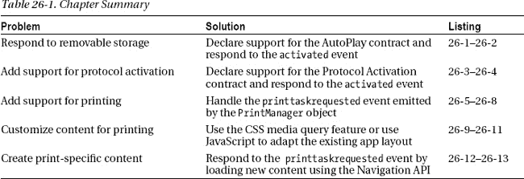

### 重温示例应用

对于这一章，我将继续使用我在[第 24 章](24.html#ch24)中创建并在[第 25 章](25.html#ch25)中扩展的`PhotoAlbum`应用。作为一个提醒，这个应用的基本功能让用户选择要在一个简单的相册中显示的图像文件(这只是一系列显示在`WinJS.UI.ListView`控件中的缩略图)。

我在此基础上实现了文件激活、保存选取器和打开选取器，以及共享合约，展示了应用集成到操作系统的不同方式——这是我将在本章中通过添加对更多合约的支持来继续的主题。提醒一下，[图 26-1](#fig_26_1) 展示了`PhotoAlbum`显示图像时的样子。

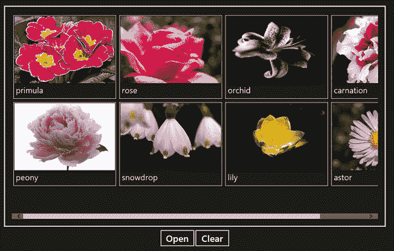

***图 26-1。**相册示例 app*

 **注意**再次声明，我不打算重新列出示例的代码和标记，因为你可以在[第 24 章](24.html#ch24)中找到它们，或者从`Apress.com`下载该项目作为源代码包的一部分。

### 实施自动播放合同

自动播放合同允许您的应用在新存储连接到 Windows 8 设备时自动做出响应。AutoPlay 近年来已经失宠，因为它一直被用作让个人电脑感染恶意软件的手段，但针对 Windows 8 进行了改进，并有可能被更广泛地使用，特别是在用户喜欢简单而不是安全的平板电脑设备上(一般来说，我发现如果有机会，用户会更喜欢任何东西而不是安全)。

像所有的合同一样，实现自动播放是可选的，但却是值得的，尤其是当你的应用以任何方式处理媒体文件的时候。正如你将看到的，自动播放契约建立在我在第 24 章中展示的文件激活契约的基础上，一旦你实现了文件激活，只需要一点额外的工作。

#### 更新清单

自动播放合同需要进行两项清单更改。首先，我需要声明我的应用想要访问可移动存储。为此，从 Visual Studio 的`Solution Explorer`窗口中打开`package.appxmanifest`文件，点击`Capabilities`选项卡，在功能列表中勾选`Removable Storage`项，如图[图 26-2](#fig_26_2) 所示。

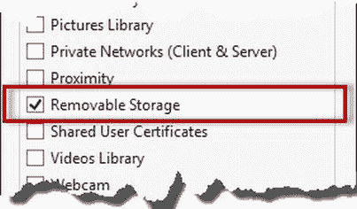

***图 26-1。**在应用清单中启用移动存储功能*

此外，我还必须告诉 Windows 我的应用希望如何集成到自动播放功能中，这需要移动到清单的`Declarations`选项卡。

从`Available Declarations`列表中选择`AutoPlay Content`，点击`Add`按钮。填写属性部分以匹配[图 26-3](#fig_26_3) ，点击`Add New`按钮创建新的`Launch action`部分。

***图 26-3。**宣布支持自动播放合同*

很难阅读图像中的文本，所以我在[表 26-2](#tab_26_2) 中列出了清单表单字段的必需值。

`Content event`值是您希望应用得到通知的 Windows 事件的名称。对于我的例子，我对`ShowPicturesOnArrival`、`MixedContentOnArrival`和`StorageOnArrival`事件感兴趣。这些是*而不是* JavaScript 事件，声明中的条目作为 Windows 内部和你的应用之间的映射——我将很快向你展示这些事件是如何呈现给你的应用的。确保如我所展示的那样将事件名称大写——如果您采用 JavaScript 全小写约定，您的契约实现将会失败。表 26-3 列出了最常见的 Windows 自动播放事件。

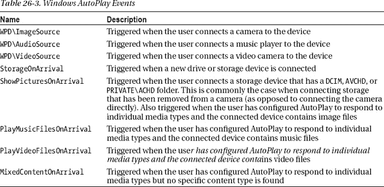

要弄清楚每种事件被触发的环境，需要对 Windows 进行一些研究。我发现在广泛的事件中注册兴趣更容易，这就是为什么如果用户连接包含图像的存储设备，我会为我可以预期的每个事件创建声明。

`verb`值是一个特定于应用的字符串，您将使用它来标识 Windows 事件。我的示例应用只能将文件添加到相册中，这就是为什么我的动词是`addpictures`、`addmixed`和`addstorage`，以及为什么`Action Display Name`，它是给用户的应用将通过自动播放执行的动作的描述，在每种情况下都被设置为`Add to Photo Album`。一个更复杂的应用可能会为每个事件提供多个操作，例如，播放、复制、打印或压缩存储设备上的文件。

#### 响应激活事件

自动播放契约的激活事件的`detail.kind`属性被设置为`ActivationKind.file`。这与用于文件关联契约的值相同。通过读取`detail.verb`属性的值来区分事件相关的契约，对于文件关联，该属性将被设置为`open`，对于自动播放，该属性将被设置为您分配给清单声明的`verb`字段的值。对于我的例子，这意味着我可以预期文件关联的`verb`属性是`open`，自动播放契约的属性是`addpictures`、`addmixed`或`addstorage`，这取决于哪个 Windows 事件被触发。

为了响应自动播放的`verb`值，我对清单 26-1 中的`PhotoAlbum` `default.js`文件进行了修改。

***清单 26-1** 。更新 default.js 文件以支持自动播放*

`(function () {

    var app = WinJS.Application;
    var activation = Windows.ApplicationModel.Activation;
    var appstate = activation.ApplicationExecutionState;
    var storage = Windows.Storage;

    var query = storage.ApplicationData.current.localFolder.createFolderQuery();
    query.addEventListener("contentschanged", function () {
        App.loadFilesFromCache();
    });
    query.getFoldersAsync();

    app.onactivated = function (args) {
        if (args.detail.previousExecutionState != appstate.suspended) {
            args.setPromise(WinJS.UI.processAll().then(function () {

                if (ViewModel.fileList.length == 0) {
                    App.loadFilesFromCache();
                }

                switch (args.detail.kind) {
                    case activation.ActivationKind.fileOpenPicker:
                        var pickerUI = args.detail.fileOpenPickerUI;
                        WinJS.Navigation.navigate("/pages/openPickerView.html",
                            pickerUI);
                        break;
                    case activation.ActivationKind.fileSavePicker:
                        var pickerUI = args.detail.fileSavePickerUI;
                        WinJS.Navigation.navigate("/pages/savePickerView.html",
                            pickerUI);
                        break;
**                    case activation.ActivationKind.file:**
**                        switch (args.detail.verb) {**
**                            case 'addpictures':**
**                            case 'addmixed':**
**                            case 'addstorage':**
**                                WinJS.Navigation.navigate(“/pages/autoplayView.html”,**` `**                                    args.detail.files);**
**                                break;**
**                            case 'open':**
**                                args.detail.files.forEach(function (file) {**
**                                    App.processFile(file);**
**                                });**
**                                WinJS.Navigation.navigate(“/pages/albumView.html”);**
**                                break;**
**                        }**
**                        break;**
                    default:
                        WinJS.Navigation.navigate("/pages/albumView.html");
                        break;
                }
            }));
        }
    };
    app.start();
})();`

当处理一个`file`激活事件时，我现在查看`verb`事件属性的值。如果值是`open`，我知道我正在处理文件关联契约，我从`detail.files`属性为数组中包含的每个文件调用`App.processFile`函数，就像我在上一章所做的一样。

当我得到一个其他的`verb`值时，我知道我正在处理自动播放合同，并且我通过导航到一个新的内容页面来响应，这个页面是我添加到项目`pages`文件夹中的，名为`autoPlayView.html`。当调用`WinJS.Navigation.navigate`方法时，我传递`detail.files`属性的值，这样我就可以在内容文件中使用它(你可以在[第 7 章](07.html#ch7)中了解更多关于这种技术的内容)。您可以在[清单 26-2](#list_26_2) 中看到`autoPlayView.html`文件的内容。

***清单 26-2** 。autoPlayView.html 文件的内容*

`<!DOCTYPE html>
<html>
<head>
    <title></title>
    
    
</head>
<body>
    
Select images to add to the album

    

    

    <button id="addButton">Add Selected Images</button>
</body>
</html>`

该文件呈现的布局基于一个`ListView`控件，在该控件中，我显示我在存储设备上找到的图像，允许用户选择应该导入到相册中的图像。还有一个`button`，用户点击它表示他们已经选择了想要的文件。

 **注意**我可以使用一个标准的打开文件选择器，让用户选择他们想要从存储设备导入的文件，但是没有办法禁用选择器导航控件。这意味着用户可以离开存储设备，从任何地方挑选文件。这并不总是所有应用的问题，但我想在这个例子中限制用户的选择，这就是我使用自定义布局的原因。

这个文件中的代码是我在前面章节中使用的技术的复述，并做了一些调整以适应自动播放合同。来自激活事件的`detail.files`属性的值作为`folders`参数传递给`ready`函数——我更改了名称，因为当自动播放契约的事件被触发时，`detail.files`属性返回的数组实际上包含了`StorageFolder`对象。通常只有一个文件夹，它是可移动存储设备的根目录。我处理数组中的所有项目，只是为了预防可移动设备的不同行为(微软对于是否会有多个文件夹被发送到应用非常含糊。)

为了安全起见，我查询了数组中的每个文件夹，并构建了我在一个`WinJS.Binding.List`对象中找到的文件的详细信息，我将它用作`ListView`控件的数据源。此时，我不想将存储设备的内容与应用中的其余图像混合在一起，这就是为什么我在本地将`List`定义到这个文件中，而不是使用视图模型中的那个。

 **提示** Windows 将过滤查询返回的文件，因此只有那些匹配自动播放清单声明的文件才会包含在结果中。

当用户点击`Add Selected Images`按钮时，我获取所选的`ListView`项，并将文件复制到本地 app data 文件夹中。通过复制文件，我可以将图像作为相册的一部分显示，即使自动播放存储设备已断开连接或被移除。

一旦文件操作开始，我就导航到`/pages/albumView.html`文件，这样用户就可以看到他们添加的效果。

#### 测试合同执行情况

现在，您已经看到了我是如何实现该契约的，是时候看看它是如何运行的了。首先，启动应用，以便在 Windows 设备上安装最新版本。应用不需要运行来处理自动播放事件，因此如果您愿意，您可以在此时停止或终止应用。

接下来就是准备 Windows 8 的机器了。这不是用户会采取的步骤，但我想展示一个特殊的效果。打开自动播放控制面板，确保勾选了`Use AutoPlay for all media and devices`选项，并将`Removable drive`选项设置为`Ask me every time`，如图 26-4 中[所示。](#fig_26_4)

***图 26-4。**配置自动播放测试合同执行*

接下来，插入一些包含 JPG 或 PNG 文件的可移动存储设备，如 u 盘或相机存储卡。我在测试中使用了 u 盘，但几乎任何可移动存储设备都可以。你会看到一个弹出的提示信息，就像图 26-5 中的[所示。](#fig_26_5)

***图 26-5。**自动播放祝酒词*

单击 toast，告诉 Windows 您要在存储设备上执行什么操作。窗口将显示一组选项，如[图 26-6](#fig_26_6) 所示。根据您安装的应用，您可能会看到不同的选项。我突出显示了您应该选择的操作，这显示了示例应用和我在前面的清单中指定的消息。

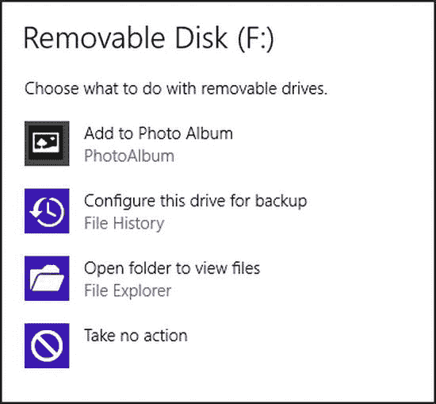

***图 26-6。**选择可移动硬盘的自动播放动作*

点击`Add to Photo Album`项，Windows 将启动示例应用。激活事件将加载`autoPlayView.html`文件作为布局，查询存储设备的文件内容，找到的图像文件在`ListView`控件中呈现给用户，如图[图 26-7](#fig_26_7) 所示。

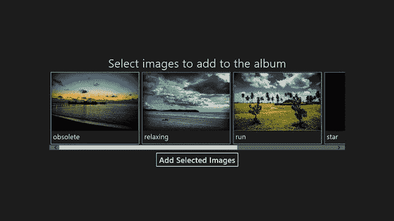

***图 26-7。**通过呈现可移动存储设备上的图像来响应自动播放事件*

选择图像并点击`Add Selected Images`按钮会将图像复制到本地应用数据文件夹，并将布局切换到`pages/albumView.html`文件。

##### 测试提示

当您测试 AutoPlay 契约的实现时，插拔存储设备可能会变成一个乏味的过程。你可以做一些事情来简化这个过程。第一个是在自动播放控制面板中为您正在使用的设备类型更改设置，如图[图 26-8](#fig_26_8) 所示。您可以看到示例应用包含在应用列表中，当连接新的存储设备时，可以选择该列表作为默认应用。

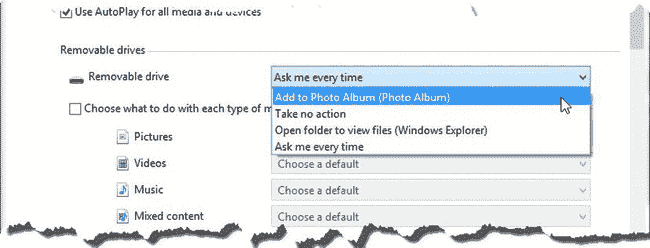

***图 26-8。**将示例应用设置为可移动驱动器的默认自动播放动作*

您可以通过插入硬件一次，然后在每次想要测试时使用文件资源管理器触发自动播放操作，来避免完全处理硬件。在文件浏览器窗口中右键单击设备，在弹出菜单中选择`Open AutoPlay`，如图[26-9](#fig_26_9)所示。

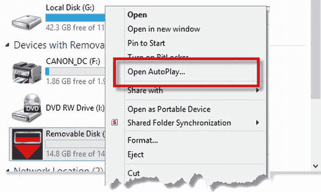

***图 26-3。**无需移除和连接存储设备即可触发自动播放操作*

这些技术使测试自动播放契约实现成为一种更加愉快的体验，尤其是当您处理大量不同的事件和动词时。

### 实现协议激活契约

协议激活契约让你的应用处理标准的 URL 协议，比如`mailto`，它用于启动创建和发送电子邮件的过程。该合约还可用于处理自定义协议，这些协议可用于执行应用之间的基本通信，或在您的网站和 Windows 应用之间移交任务(您在网页中嵌入了具有特定协议的链接，当用户单击该链接时，该链接会激活应用)。

在本节中，我将演示如何处理自定义协议，并使用它将数据从一个应用传递到另一个应用。

#### 创建助手应用

首先，我需要创建助手应用，它将向用户呈现使用我的自定义协议的链接。我创建了一个名为`ProtocolHelper`的新应用，这个应用非常简单，所有的东西 HTML、CSS 和 JavaScript——都包含在`default.html`文件中，如[清单 26-3](#list_26_3) 所示。

***清单 26-3** 。来自 ProtocolHelper 应用的 default.html 文件*

`<!DOCTYPE html>
<html>
<head>
    <meta charset="utf-8" />
    <title>ProtocolHelper</title>
    <link href="//Microsoft.WinJS.1.0/css/ui-dark.css" rel="stylesheet" />
    
    
    
    
</head>` `<body>
    
    <a id="linkElem">Protocol Link</a>
</body>
</html>`

这个应用执行对`Pictures`库的深度查询，并显示它找到的第一张图像的缩略图。该布局还包含一个`a`元素，其`href`属性包含一个带有自定义协议的 URL，如下所示:

`<a id="linkElem" **href=”photoalbum:C:\Users\adam\Pictures\flowers\astor.jpg”**>Protocol Link</a>`

协议设置为`photoalbum`，网址的其余部分包含助手应用找到并显示的文件路径。在[图 26-10](#fig_26_10) 中可以看到助手应用运行时的样子。

 **注意**为了确保助手应用可以找到文件，您需要检查清单中的`Pictures Library`功能。

***图 26-3。**protocol helper app 的布局*

点击`Protocol Link`会让 Windows 寻找一个可以处理自定义协议的应用。当然，目前还没有这样的应用，所以你会看到一个类似于[图 26-11](#fig_26_11) 所示的消息。在下一节中，我将向您展示如何在`PhotoAlbum`应用中添加协议激活支持。

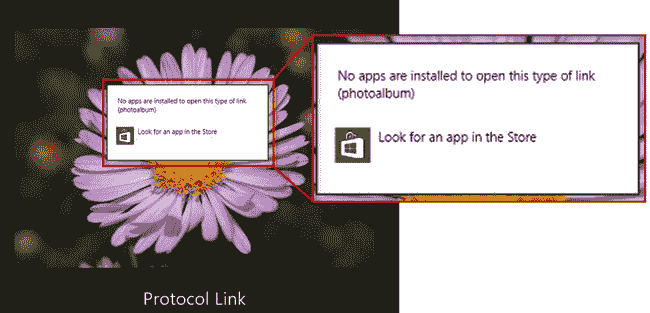

***图 26-11。**没有应用处理 URL 协议时显示的消息*

#### 增加协议激活支持

现在我有了一个包含与`photoalbum`协议的链接的应用，我可以返回到`PhotoAlbum`应用并添加对处理该协议的支持，这意味着当你单击助手应用中的链接时，`PhotoAlbum`将被激活并被赋予计算出该做什么的任务。

##### 添加清单声明

第一步是更新清单。从 Visual Studio `Solution Explorer`窗口打开`package.appxmanifest`文件，并导航到`Declarations`选项卡。从`Available Declarations`列表中选择`Protocol`，点击`Add`。将显示文本字段，供您输入想要支持的协议的详细信息。在`Name`字段中输入`photoalbum`并键入`Control+S`保存对清单的更改。(在本例中，您可以忽略`Logo`和`Display name`字段，它们用于区分支持相同协议的应用，这种情况下不会发生。)你可以在图 26-12 中看到完整的清单部分。

***图 26-12。**宣布支持协议激活合同*

##### 响应激活事件

协议激活的激活事件的`detail.kind`属性设置为`ActivationKind.protocol`。你可以在[清单 26-4](#list_26_4) 中的`PhotoAlbum` `default.js`文件中看到我是如何回应这个事件的。

***清单 26-4** 。响应协议激活事件*

`(function () {

    var app = WinJS.Application;
    var activation = Windows.ApplicationModel.Activation;
    var appstate = activation.ApplicationExecutionState;
    var storage = Windows.Storage;

    var query = storage.ApplicationData.current.localFolder.createFolderQuery();
    query.addEventListener("contentschanged", function () {
        App.loadFilesFromCache();
    });
    query.getFoldersAsync();

    app.onactivated = function (args) {
        if (args.detail.previousExecutionState != appstate.suspended) {
            args.setPromise(WinJS.UI.processAll().then(function () {

                if (ViewModel.fileList.length == 0) {
                    App.loadFilesFromCache();
                }

                switch (args.detail.kind) {
**                    case activation.ActivationKind.protocol:**
**                        if (args.detail.uri.schemeName == “photoalbum”) {**
**                            var path = args.detail.uri.path;**
**                            storage.StorageFile.getFileFromPathAsync(path)**
**                                .then(function (file) {**
**                                    App.processFile(file);**
**                            });**
**                        }**
**                        break;**
                    // *...statements removed for brevity...*
                    default:
                        WinJS.Navigation.navigate("/pages/albumView.html");
                        break;
                }
            }));
        }
    };
    app.start();
})();`

激活事件的`detail.uri`属性返回一个`Windows.Foundation.Uri`对象。我使用`schemeName`属性来确定我的应用是为哪个协议激活的，并使用`path`属性来获取 URL 的路径部分，在本例中是`ProtocolHelper`应用在`Pictures`库中找到的文件的路径。除了`schemeName`和`path`之外，`Windows.Fountation.Uri`对象还有许多有用的属性，我已经在[表 26-4](#tab_26_4) 中列出了它们，以及如果使用的 URL 是`[http://www.apress.com/books/index.html](http://www.apress.com/books/index.html)`时它们将返回的值(一个虚构但有用的 URL 来演示)。

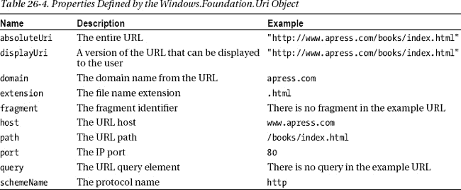

综上所述，您可以看到我通过调用`StorageFile.getFileFromPathAsync`方法，使用 URL 的`path`组件获得一个`StorageFile`对象，从而对`photoalbum`协议的激活做出响应。然后我将`StorageFile`传递给`App.processFile`方法，该方法将文件添加到照片库中。

##### 声明能力

还有一个步骤:在`PhotoAlbum`清单中声明应用需要访问`Pictures`库。

这不是协议激活的一个要求，但它是让我的应用按照我想要的方式工作所必需的。协议激活的优点是实现起来快速简单，并且已经定义了很多有用的协议，比如`mailto`。

缺点是应用之间没有信任转移或清单声明，这意味着协议激活最适合简单数据，或者当您确信两个应用对设备具有相同的访问权限时。对于我的例子，这意味着`PhotoAlbum`应用需要能够访问作为协议激活过程的一部分发送的文件，这意味着需要访问`Pictures`库(因为，正如您所记得的，激活事件的原因`ProtocolHelper`应用在`Pictures`库位置找到并显示第一个图像)。

在 Visual Studio 中打开`package.appxmanfest`文件，导航到`Capabilities`选项卡，并检查`Pictures Library Access`功能。对于一个更复杂的方法，你需要使用*共享契约*，我在[第 25 章](25.html#ch25)中描述过。

##### 测试合同实现

要测试对协议激活合同的支持，请启动`PhotoAlbum`应用，以便在您的设备上安装最新的更改。与许多其他合同一样，应用不一定要运行才能使合同生效，但是在 Visual Studio 中启动应用的过程会强制 Windows 处理清单并注册应用对合同的支持。如果您愿意，可以在此时终止`PhotoAlbum`应用，测试仍将继续。

接下来，启动`ProtocolHelper`应用并点击`Protocol Link`锚元素。Windows 将向`PhotoAlbum`应用发送协议激活事件，这将具有将文件路径从一个应用传递到另一个应用的效果，从而将图像添加到相册中。

### 执行印刷合同

从应用中打印内容的能力非常重要，尽管与几年前相比，用户打印的次数减少了，在屏幕上查看和阅读的内容增加了。假设你的用户不需要打印并跳过这个合同是很诱人的，但是在做这个决定的时候，你是在强迫用户以一种特殊的方式消费你的内容，并且忽略了他们的偏好。

我发现使用打印机是一件痛苦的事情——尽管在 Windows 应用中相对容易处理——但每当我想跳过对打印的支持时，我都会提醒自己我的图书销售数字。有超过 50%的机会，你正在阅读这本书的印刷本。你可能更喜欢印刷本的原因有很多——也许你喜欢在通勤时在火车上阅读，你喜欢打开书，这样你就可以在屏幕上编写代码时跟随示例，或者你喜欢买一本并与你的团队分享。不管是什么原因，Apress 不会因为让你购买电子书而忽视你的偏好，同样，你也不应该因为忽略打印功能而忽视用户的偏好。在这一节中，我将通过添加对打印来自`PhotoAlbum`示例应用的图像的支持来解释 Windows 对打印的支持是如何工作的。

从 Windows 应用打印是基于将应用的当前布局发送到打印机，这意味着很容易获得基本的打印工作，但需要更多的努力才能产生有用的东西。我将首先向您展示基本的打印机制，然后向您展示如何创建仅用于打印的内容。

 **注**正如你所料，你需要一台打印机来跟踪本章的这一节。您不需要实际打印任何东西，但是您需要有一个 Windows 识别为打印机的设备，以便它出现在 Devices Charm 中。

#### 实现基本打印

印刷合同不需要清单声明。相反，您注册一个函数来处理由可以在`Windows.Graphics.Printing`名称空间中找到的`PrintManager`对象发出的`printtaskrequested`事件。此事件表示用户已发起打印请求，您可以相应地准备您的应用。

为了演示合同是如何操作的，我在`albumView.html`文件中添加了打印支持，这是`PhotoAlbum`应用用来显示它所编目的图像的内容。您可以在[清单 26-5](#list_26_5) 中看到我所做的更改，我将在接下来的章节中介绍我所使用的对象。

 **注意**我在本章这一部分介绍的新对象都在`Windows.Graphics.Printing`名称空间中，除非另有说明。在代码示例中，我将这个名称空间别名化为`print`。

***清单 26-5** 。给 albumView.html 文件添加基本的打印支持*

`<!DOCTYPE html>
<html>
<head>
    <title></title>
    
</head>
<body>
    

    

    

        <button id="openButton">Open</button>
        <button id="clearButton">Clear</button>
    

</body>
</html>`

当`printtaskrequested`事件被触发时，处理函数被传递一个对象，该对象的`request`属性返回一个`PrintTaskRequest`。您的目标是创建并配置一个`PrintTask`对象，设置将要打印的内容并配置打印过程。

##### 创建打印任务

通过调用`PrintTaskRequest.createPrintTask`方法创建一个`PrintTask`对象。参数是任务的标题和一个处理程序，如果用户选择打印任务，这个处理程序将被调用。这似乎是重复的，但是当您将支持打印合同所需的步骤联系起来时，这是有意义的。为了理解我的意思，启动`PhotoAlbum`应用，调出魅力栏并激活设备的魅力(如果你愿意，你可以使用`Win+K`直接激活魅力)。

当你激活 Devices Charm 时，Windows 会向你发送`printtaskrequested`事件，这是你决定你的应用此刻是否能够打印的机会。你可以在[清单 26-6](#list_26_6) 中看到我是如何处理的，这里我重复了来自`printtaskrequested`事件处理程序的部分代码。

***清单 26-6** 。当接收到 printtaskrequested 事件*时，决定是否打印

`...
print.PrintManager.getForCurrentView().addEventListener("printtaskrequested",
    function (e) {
**        if (ViewModel.fileList.length > 0) {**
            var printTask = e.request.createPrintTask("PrintAlbum",
                function (printEvent) {
                printEvent.setSource(MSApp.getHtmlPrintDocumentSource(document));
            });
            printTask.options.orientation = print.PrintOrientation.landscape;
        };
    });
...`

如果相册中没有图像，那么我就没有东西可以打印。因此，当我得到`printtaskrequested`时，我检查在`WinJS.Binding.List`中是否有我用来跟踪应用内容的对象，并且只有当有图像时才调用`createPrintTask`方法。

当你激活设备魅力时，你看到的将取决于你之前添加到应用中的图像数量。你可以在[图 26-13](#fig_26_13) 中看到两种不同的结果。图中左侧的屏幕向用户显示了可用打印机的列表，并且在应用调用`createPrintTask`时显示。图右边的屏幕显示了没有调用`createPrintTask`时呈现给用户的消息，表示此时没有要打印的内容。

***图 26-13。**接收到 printtaskrequested 事件时调用 createPrintTask 方法的效果*

如图所示，我有几台旧的惠普打印机可供选择，当然，您在列表中看到的会有所不同。

##### 配置打印任务

一旦创建了`PrintTask`对象，就可以对其进行配置，为用户提供打印任务的合理初始值。您可以通过返回一个`PrintTaskOptions`对象的`PrintTask.options`属性来实现。您可以为打印任务配置许多选项，但我不打算在此列出。首先，它们中的许多是大多数应用不会关心的小众设置，其次，用户可以在打印过程的下一阶段设置它们(我将很快谈到)。

相反，我在[表 26-5](#tab_26_5) 中列出了四个配置选项的示例。其中两个在很多情况下都很有用，另外两个说明了您对打印任务的控制级别。

许多配置选项采用由`Windows.Graphics.Printing`名称空间中的对象定义的值。因此，例如，`orientation`属性被设置为由`PrintOrientation`对象定义的值之一，这可以在[表 26-6](#tab_26_6) 中看到。

我不想让你觉得我没有必要跳过这一部分。我想谈谈打印合同的核心内容，即准备您的应用内容，以便您获得良好的打印结果。你可以在打印任务上设置太多的细节，如果我把所有的细节都列出来，我会没有空间，而且这些设置中的大部分从来没有被使用过。相反，你可以看到我是如何应用清单 26-7 中一个真正有用的设置选项的，在这里我设置了打印任务的方向。

***清单 26-7** 。设置打印任务的方向*

`...
print.PrintManager.getForCurrentView().addEventListener("printtaskrequested",
    function (e) {
        if (ViewModel.fileList.length > 0) {
            var printTask = e.request.createPrintTask("PrintAlbum",` `                function (printEvent) {
                    printEvent.setSource(MSApp.getHtmlPrintDocumentSource(document));
                }
            );
**            printTask.options.orientation = print.PrintOrientation.landscape;**
        };
    });
...`

 **注意**我在这里走了一条捷径——这是我在真正的应用中不推荐的。如果你查看[表 26-6](#tab_26_6) 中的值，你会发现它们对应于我在第 6 章中向你展示的[方向。如您所见，Windows 应用打印通过打印应用的布局来工作，这意味着您通常需要设置打印任务的方向以匹配设备的方向。](06.html#ch6)

##### 指定要打印的内容

当您创建一个`PrintTask`时，您指定了一个当用户从 Device Charm 中选择一个设备时将被调用的函数。这个函数被传递了一个定义了`setSource`方法的`PrintTaskSourceRequestedArgs`对象。

`setSource`方法用于指定将要打印的内容，对于 JavaScript Windows 应用，这意味着你必须使用`MSApp.getHtmlPrintDocumentSource`方法，如[清单 26-8](#list_26_8) 中突出显示的，我在这里重复了`PhotoAlbum`应用的语句。

***清单 26-8** 。设置打印源*

`...
print.PrintManager.getForCurrentView().addEventListener("printtaskrequested",
    function (e) {
        if (ViewModel.fileList.length > 0) {
            var printTask = e.request.createPrintTask("PrintAlbum",
                function (printEvent) {
**                    printEvent.setSource(MSApp.getHtmlPrintDocumentSource(document));**
                }
            );
            printTask.options.orientation = print.PrintOrientation.landscape;
        };
    });
...`

`getHtmlPrintDocumentSource`方法只接受一个 DOM `Document`对象，这意味着你只能打印应用的当前内容或者一个`iframe`元素的内容。这意味着您必须有创造性地为文档打印一些有用的东西，这是我稍后将返回的主题。

但是，首先让我们用应用中的默认内容完成打印过程。启动应用，确保相册中有一些图像，并激活设备的魅力。单击列表中的一台打印机将触发我传递给`createPrintTask`方法的函数，该函数将设置打印任务的源——Windows 获取这些信息并呈现给用户，如我在[图 26-14](#fig_26_14) 中所示。

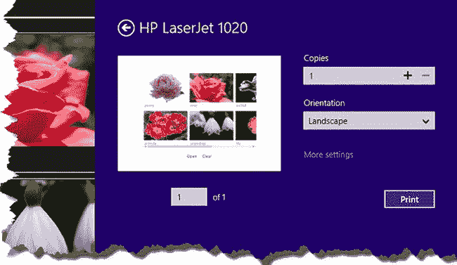

***图 26-14。**完成打印任务*

Windows 向用户显示了内容的预览，以及更改打印任务设置的机会(`More settings`链接允许用户查看和更改我前面提到的更神秘的配置选项)。如果你继续打印这个文档，你会得到如图[图 26-15](#fig_26_15) 所示的结果。(我使用保存图像的打印机驱动程序捕捉到了这一点，这使我可以向您显示结果，而不必打印到纸上，然后再次扫描页面。)

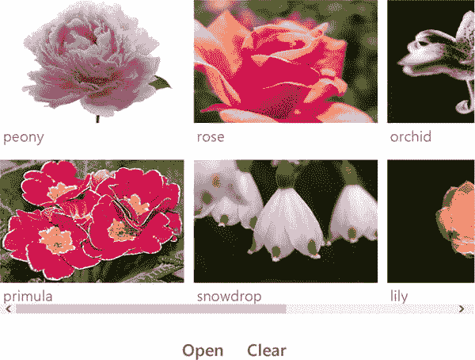

***图 26-15。**打印输出*

我添加了此图所示的边框，因为 Windows 所做的更改之一是更改打印任务中的背景颜色，以便打印图像时不会消耗掉用户所有的墨水/碳粉。

这是我所做的唯一更改，否则，打印输出将与创建打印任务时应用的布局相匹配。这是好的，因为这意味着在应用中支持基本的打印很简单，这也是坏的，因为这意味着布局中的所有东西——包括按钮和滚动条——都被发送到打印机。在接下来的部分中，我将向您展示控制发送到打印机的内容的不同技术。

#### 操作应用布局进行打印

改善打印效果的第一种方法是临时操作专门用于打印作业的应用布局。你可以使用 CSS，当然也可以使用 JavaScript，我会在本章的这一节向你展示这两种方法。

##### 使用 CSS 操作应用布局

CSS 的一个鲜为人知且不常使用的功能是能够创建仅适用于特定类型媒体的样式。这意味着我可以轻松地向我的`albumView.html`文档添加一个`style`元素，在打印时改变内容的布局。你可以在[清单 26-9](#list_26_9) 中看到一个简单的例子，在这里我创建了一个样式，隐藏了`Open`和`Clear`按钮，并为打印执行了一些其他小的布局调整。

***清单 26-9** 。打印时使用 CSS 样式化元素*

`...
<head>
**    **
    <title></title>
    
</head>
...`

这项技术的关键是将`media`属性添加到`style`元素中，并将值设置为`print`。这可确保仅在打印布局时应用样式，允许您调整应用布局以改善打印结果。你可以在图 26-16 中看到[的变化。(我又一次给这个图加了边框。)](#fig_26_16)

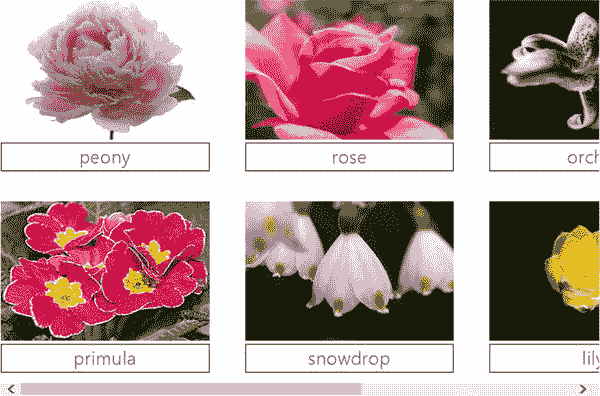

***图 26-16。**使用 CSS 改变打印布局的样式*

正如您在图中看到的，我隐藏了按钮，并更改了为每个图像显示的标签的格式。我在这个例子中定义的样式应用了相对较小的变化，但是效果可以像你喜欢的那样广泛。

##### 使用 JavaScript 操作应用布局

通过使用 JavaScript 来改变应用的布局，您可以做出更深刻的改变，尽管这比使用 CSS 需要更多的努力。特别是，您需要考虑一些 UI 控件的方式，包括我在示例应用中使用的`ListView`,依赖于使用事件向 UI 控件传递更改的数据源。作为示范，我修改了`PhotoAlbum`应用，这样每行最多打印两幅图像，避免了你在图 26-16 中看到的问题，每行的第三幅图像只是部分可见。首先，我在`js/app.js`文件中创建了一个名为`adaptLayout`的新函数，它切换作为`ListView` UI 控件数据源的`WinJS.Binding.List`对象中的元素数量。你可以在清单 26-10 中看到这个函数。

***清单 26-10** 。app.js 文件中的 adaptLayout 函数*

`(function () {

var storage = Windows.Storage;
var access = storage.AccessCache;
var cache = access.StorageApplicationPermissions.futureAccessList;
var pickers = storage.Pickers;

**var dataCache = [];**

WinJS.Namespace.define("App", {

**    adaptLayout: function (prepareForPrint) {**
**        var flist = ViewModel.fileList;**` `**        if (prepareForPrint == true) {**
**            dataCache = flist.splice(4, flist.length -4);**
**        } else {**
**            dataCache.forEach(function (item) {**
**                flist.push(item);**
**            });**
**            dataCache.length = 0;**
**        }**
**    },**
    // *...other functions removed for brevity...*
});

})();`

如果使用`true`作为参数调用该函数，则`List`中的项目数量将减少到 4 个。当使用参数`false`再次调用该函数时，这些项将被删除，从而将布局恢复到之前的状态。

我还更新了`albumView.html`文件中的`script`元素来使用这个函数进行打印，如[清单 26-11](#list_26_11) 所示。

***清单 26-11** 。使用 JavaScript 改变打印布局*

`...

...`

当我的`PrintTask`被用户激活时，我调用`App.adaptLayout`函数。我遇到的问题是，`adaptLayout`函数对`List`对象进行了更改，该对象使用事件将这些更改与`ListView` UI 控件进行了通信。那些事件将在我的函数被执行后被执行，这意味着我需要延迟用`setSource`方法将我的应用布局传递到窗口，直到那些事件被处理后，这就是我使用`setImmediate`方法的原因(它推迟了工作的执行，我在[第 9 章](09.html#ch9)中对此进行了详细描述):

`... var printTask = e.request.createPrintTask("PrintAlbum", function (printEvent) {
    var deferral = printEvent.getDeferral();
    App.adaptLayout(true);
**    setImmediate(function() {**
**        printEvent.setSource(MSApp.getHtmlPrintDocumentSource(document));**
        deferral.complete();
**    })**
})
...`

因为我推迟了对`setSource`方法的调用，所以在我的函数执行完成之前，我不能给 Windows 打印的内容。幸运的是，`PrintTaskSourceRequestedArgs`对象定义了一个`getDeferral`方法，该方法返回一个对象，当我异步设置内容时，我可以调用该对象的`complete`方法。(你可以在第 19 章中了解更多关于延期的内容，在那里我解释了它们在生命周期事件中的用法。)结果是我修改了`List`的内容，然后推迟了对`setSource`方法的调用，直到这些更改反映在`ListView`控件中。

与 CSS 技术不同，使用 JavaScript 会以用户可以看到的方式影响应用的布局，这意味着当打印任务完成或被用户取消时，将布局恢复到原始状态非常重要。`PrintTask`对象定义了一些有用的事件，我已经在[表 26-7](#tab_26_7) 中描述过，这些事件可以用来跟踪打印进度。

为了恢复布局，我对`completed`事件感兴趣，我通过调用`App.adaptLayout`函数来响应该事件。我已经提供了这个函数作为`addEventListener`方法的一个参数，这意味着它将被传递给 event 对象，该对象具有恢复布局的效果(因为除了 Boolean true 之外的任何值都被作为将图像恢复到`List`的请求):

`...
printTask.addEventListener("**completed**", App.adaptLayout);
...`

您可以在[图 26-17](#fig_26_17) 中的打印结果上看到这些变化的结果。

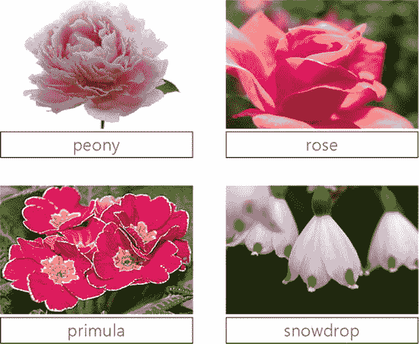

***图 26-17。**使用 JavaScript 改变打印应用的布局*

#### 创建特定打印内容

您可以通过调整应用的现有布局来改善打印效果，但要完全控制打印过程，您需要创建仅用于打印的内容。为了演示这种方法，我在`albumView.html`文件的`script`元素中添加了一个新特性，当用户在激活设备的魅力之前选择了`ListView`控件中的一个项目时，该特性会显示特定于打印的内容。你可以在[清单 26-12](#list_26_12) 中看到支持这个特性的变化。

***清单 26-12** 。添加对特定打印内容的支持*

`...

...`

如果在`ListView`中选择了一个项目，那么我调用导航 API 来显示我添加到`pages`文件夹中的名为`printView.html`的新页面。我将一个对象传递给`navigate`方法，该方法包含对`PrintTaskSourceRequestedArgs`对象的引用、由`getDeferral`方法返回的对象以及用户选择的来自`ListView`数据源的项目。这些细节将可用于我在`printView.html`文件的`script`元素中定义的`ready`函数，你可以在[清单 26-13](#list_26_13) 中看到。

 **注意**我为`PrintTask.completed`事件注册了一个处理程序，当打印任务完成或取消时，它将应用导航回 albumView.html 页面。这样做的一个副作用是，我不得不改变对由`PrintManager`对象发出的`printtaskrequested`事件的兴趣注册方式。如果您试图使用`addEventListener`方法为`printtaskrequested`事件添加第二个侦听器，则会抛出异常，并且由于当应用导航回`albumView.html`文件时会执行`ready`函数中的代码，因此我需要通过向`onprinttaskrequested`属性分配一个新函数来替换现有的侦听器——这确保了最多只有一个侦听器，并且不会遇到异常。

***清单 26-13** 。printView.html 文件的内容*

`<!DOCTYPE html>
<html>
<head>
    <title></title>
    
    
</head>
<body>
    

        
        
    

</body>
</html>`

这个文件包含一个非常简单的布局，显示选中的图像及其名称。`script`元素中的代码使用从`ListView`数据源中选择的项目来配置布局中的元素，然后调用`setSource`方法来为 Windows 提供要打印的内容。最后，调用延迟对象的`complete`方法，向 Windows 指示异步任务已经完成，可以向用户显示内容预览。你可以在[图 26-18](#fig_26_18) 中看到该文件产生的打印结果。

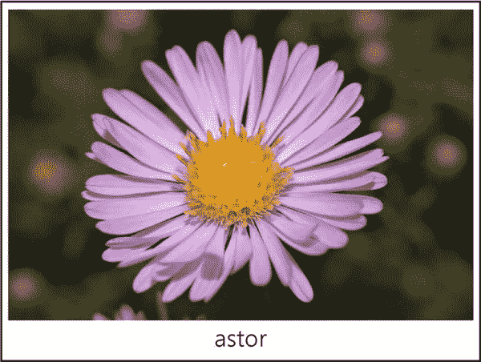

***图 26-18。**使用专用内容进行打印*

从图中可以看出，只需稍加努力，您就可以创建专门用于打印的内容，并且不会受到试图调整主要用于在屏幕上显示的布局的限制。

### 总结

在这一章中，我已经向您展示了如何实现另外三个契约:自动播放、协议激活和打印。这三者在提供一流的应用体验方面都有自己的位置，你应该考虑实现它们，以便将你的应用更紧密地集成到更广泛的 Windows 体验中。在下一章中，我将向您展示如何控制在 Windows 开始屏幕上为您的应用创建的磁贴。