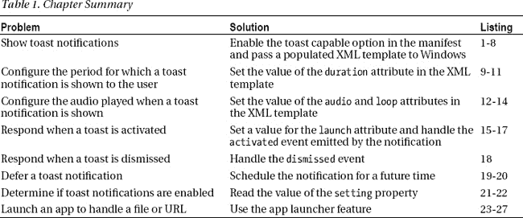
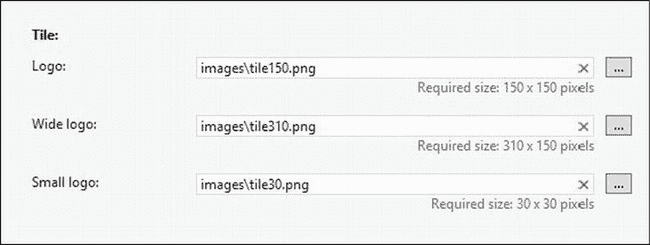
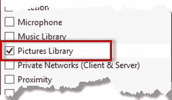
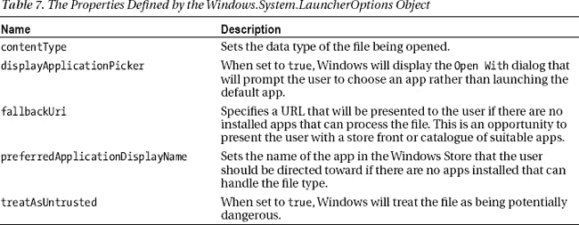

## 第二十八章

## 使用 Toast 和系统启动程序

在这一章中，我将向你展示如何使用 *toast 通知*，这是一种吸引用户注意力的更直接、更具侵入性的机制。Toast 通知是对我在上一章向您展示的更微妙的磁贴通知和徽章的补充，用于更重要或紧急的信息。像任何一种通知一样，祝酒词应该谨慎使用——太少的通知会让你的用户得不到他们想要的提示和提醒，太多的会让用户疲劳和烦恼。当有疑问时，允许用户使用我在[第 27 章](27.html#ch27)中描述的设置特性和技术来配置发出 toast 通知的环境。

我在本章中还描述了*系统启动器*功能，它允许你启动用户选择的 app 来处理你的 app 无法处理的文件和 URL。这是一个简单但有用的特性，值得了解如何使用它。[表 1](#tab_28_1) 提供了本章的总结。

### 使用 Toast 通知

Toast 通知是一种更直接、更吸引用户注意力的通知方式。屏幕上弹出一个祝酒词，通常伴随着声音效果，并具有打断用户注意力和工作流程的效果。因此，应该谨慎使用 toast 通知，只在重要且需要立即采取措施的情况下才显示它们。在接下来的小节中，我将带您完成创建和显示 toast 通知的过程，并向您展示当用户与它们交互时如何响应。

#### 创建示例应用

我为本章创建的示例应用名为`Toast`，我遵循了与上一章中的示例相同的基本格式——一个显示按钮的单页应用，当按钮被按下时，将触发通知。您可以在[清单 1](#list_28_1) 中看到我对`default.html`文件所做的初始添加，它包括本章中 toast 通知示例的按钮元素。

*清单 1。Toast 示例应用的初始 default.html*

`<!DOCTYPE html>
<html>
<head>
    <meta charset="utf-8" />
    <title>Toast</title>

    <!-- WinJS references -->
    <link href="//Microsoft.WinJS.1.0/css/ui-dark.css" rel="stylesheet" />
    
    

    <!-- Toast references -->
    <link href="/css/default.css" rel="stylesheet" />
    
</head>
<body>
    

**        <button id="toast">Show Toast</button>**
**        <button id="schedule">Schedule Toast</button>**
**        <button id="check">Check Status</button>**
    

</body>
</html>`

您可以在清单 2 的[中看到`css/default.css`文件，它显示了我用来创建应用布局的样式。](#list_28_2)

*清单 2。来自 Toast 项目*的 css/default.css 文件

`body, #container { display: -ms-flexbox; -ms-flex-direction: row;
    -ms-flex-align: stretch; -ms-flex-pack: center;}
#container {-ms-flex-direction: column;}
#container button {font-size: 30pt;width: 400px; margin: 10px;}` 

标记和 CSS 结合在一起为应用创建了一个简单的布局，你可以在[图 1](#fig_28_1) 中看到。布局非常简单，因为本例中的所有工作都将用于生成和管理 toast 通知。

***图 1。**吐司示例 app 的布局*

对于这一章，我不需要担心保存应用状态或处理暂停或终止，所以我从一个简单的`default.js`文件开始，如[清单 3](#list_28_3) 所示。

*清单 3。Toast 示例应用的初始 default.js 文件*

`(function () {
    "use strict";

    var app = WinJS.Application;
    var activation = Windows.ApplicationModel.Activation;
**    var wnote = Windows.UI.Notifications;**
    WinJS.strictProcessing();

**    var toastMessages = ["7pm Leave Office", "8pm: Meet Jacqui at Lucca's Bar",**
**        "9pm: Dinner at Joe's"];**
**    var toastImage =img/reminder.png";**

    app.onactivated = function (args) {
        if (args.detail.kind === activation.ActivationKind.launch) {
            args.setPromise(WinJS.UI.processAll().then(function () {
                WinJS.Utilities.query("#container > button").listen("click",
                    function (e) {
                        switch (this.id) {
**                            case "toast":**
**                                // code will go here**
**                                break;**
                        }
                    });
            }));
        }
    };
    app.start();
})();`

这与我在 live tiles 章节中使用的起点非常相似。代码中的`switch`语句被设置为当`Show Toast`按钮被按下时做出响应(它的`id`属性值为`toast`),我将在本章后面为剩余的按钮添加其他的`case`语句。

 **注意**提供 toast 通知功能的对象是`Windows.UI.Notifications`名称空间的一部分，为了简洁起见，我在示例中将其别名为`wnote`。除非我另有说明，本章中我提到的所有对象都是这个名称空间的一部分。

我已经为这个例子定义了不同的提醒数据，并向名为`img/reminder.png`的项目添加了一个图像，如图 2 中的[所示。](#fig_28_2)

***图二。**添加到项目中的 reminder.png 图像，用于 toast 通知*

当我在本章后面显示 toast 通知时，您将再次看到该图像。除了`reminder.png`文件，我还在`images`文件夹中添加了我在上一节中使用的相同的闹钟图标集，并将这些文件应用到应用清单的应用 UI 部分，如图[图 3](#fig_28_3) 所示。

 **提示**你可以从`apress.com`开始获得这本书的免费源代码下载中的所有图片文件。

***图三。**在清单中应用图标图片*

使用 toast 通知的一个重要区别是，您必须明确声明您将在应用清单中使用它们。为此，在 manifest `Application UI`选项卡上查找`Notifications`部分。将`Toast`设置为`Yes`，如图[图 4](#fig_28_4) 所示。

***图 4。**启用吐司通知*

 **警告**如果您忘记在清单中声明您将使用 toast 通知，Windows 将自动丢弃您的 toast 通知。

#### 创建基本的祝酒通知

创建 toast 通知的过程与创建 live tile 通知的过程非常相似:选择一个 XML 模板，填充内容，然后将其传递给系统，以便向用户显示。您可以在清单 4 的[中看到我添加到`default.js`文件中的代码，它创建了一个基本的 toast 通知。](#list_28_4)

*清单 4。创建基本的祝酒通知*

`(function () {
    "use strict";

    var app = WinJS.Application;
    var activation = Windows.ApplicationModel.Activation;
    var wnote = Windows.UI.Notifications;
    WinJS.strictProcessing();

    var toastMessages = ["7pm Leave Office", "8pm: Meet Jacqui at Lucca's Bar",
        "9pm: Dinner at Joe's"];
    var toastImage =img/reminder.png";

**    function getTemplateContent(templateName) {**
**        var template = wnote.ToastTemplateType[templateName];**
**        return wnote.ToastNotificationManager.getTemplateContent(template);**
**    }**

**    function populateTemplate(xml, textValues, imgValues) {**
**        if (textValues) {**
**            var textNodes = xml.getElementsByTagName("text");**` `**            var count = Math.min(textNodes.length, textValues.length);**
**            for (var i = 0; i < count; i++) {**
**                textNodes[i].innerText = textValues[i];**
**            }**
**        }**
**        if (imgValues) {**
**            var imgNodes = xml.getElementsByTagName("image");**
**            var count = Math.min(imgNodes.length, imgValues.length);**
**            for (var i = 0; i < count; i++) {**
**                imgNodes[i].attributes.getNamedItem("src").innerText = imgValues[i]**
**            }**
**        }**
**        return xml;**
**    }**

**    function showToast(xml) {**
**        var notification = wnote.ToastNotification(xml);**
**        var notifier = wnote.ToastNotificationManager.createToastNotifier();**
**        notifier.show(notification);**
**        return notification;**
**    }**

    app.onactivated = function (args) {
        if (args.detail.kind === activation.ActivationKind.launch) {
            args.setPromise(WinJS.UI.processAll().then(function () {
                WinJS.Utilities.query("#container > button").listen("click",
                    function (e) {
                        switch (this.id) {
                            case "toast":
**                                var xml = getTemplateContent("toastImageAndText04");**
**                                populateTemplate(xml, toastMessages, [toastImage]);**
**                                showToast(xml);**
                                break;
                        }
                    });
            }));
        }
    };
    app.start();
})();`

如果你运行应用并点击`Show Toast`按钮，你会看到屏幕右上角弹出了吐司，你可以在[图 5](#fig_28_5) 中看到示例制作的吐司是什么样子。

 **注意**Visual Studio 模拟器不支持 toast 通知，就像它不支持 live tiles 一样。为了测试这个例子和本章中的所有其他例子，你必须使用一个真实的 Windows 8 设备，比如你的开发机器。

***图五。**敬酒通知*

我选择了一个包含图像和一些文本行的 toast 通知模板，但系统添加了 bell 徽标，我再次在清单中为我的应用配置使用了该徽标，就像我在[第 27 章](27.html#ch27)中所做的一样。默认情况下，当显示提示信息时，您会听到一声蜂鸣声，几秒钟后提示信息会再次消失。

一次最多可以显示三个通知，它们可以来自多个应用或来自同一个应用。第一个 toast 通知与屏幕右侧对齐，与屏幕顶部有一个小间隙，后续通知堆叠在第一个通知的下方。如果要显示三个以上的通知，则使用一个队列，当旧的通知逐渐消失时，显示新的通知。在接下来的几节中，我将解释示例中的代码是如何工作的，以及它如何导致图中所示的 toast。

##### 获取并填充 Toast 模板

创建 toast 通知的第一步是选择模板。八个受支持的模板由`Windows.UI.Notifications.ToastTemplateType`对象枚举，包含纯文本和文本-图像混合选项。你可以在`[http://msdn.microsoft.com/en-us/library/windows/apps/windows.ui.notifications.toasttemplatetype.aspx](http://msdn.microsoft.com/en-us/library/windows/apps/windows.ui.notifications.toasttemplatetype.aspx)`的文档中看到`ToastTemplateType`对象的模板样本。通过将来自`ToastTemplateType`对象的值作为参数传递给`Windows.UI.Notifications.ToastNotficationManager.getTemplateContent`方法，可以获得 toast 模板的 XML 内容。在示例中，我添加了一个助手函数来完成这项工作，我也称之为`getTemplateContent`。作为我在上一章中使用的方法的变体，这个函数将包含模板名称的字符串值作为它的参数，并返回适当的 XML，如清单 5 中的[所示。](#list_28_5)

*清单 5。来自示例应用*的 getTemplateContent 函数

`...
function getTemplateContent(templateName) {
   var template = wnote.ToastTemplateType[templateName];
   return wnote.ToastNotificationManager.getTemplateContent(template);
}
...`

在这个例子中，我选择了`toastImageAndText04`模板，它包含一个图像和三行非换行文本。在该模板中，第一行以粗体显示，如果文本行太长而无法显示，Windows 将缩短它们并应用省略号(`...`)。您可以在[清单 6](#list_28_6) 中看到这个模板的 XML。

*清单 6。toastImageAndText04 模板的 XML*

`<toast>
    <visual>
        <binding template="ToastImageAndText04">` `            <image id="1" src=""/>
            <text id="1"></text>
            <text id="2"></text>
            <text id="3"></text>
        </binding>
    </visual>
</toast>`

填充 XML 模板的过程与 tile 的过程相同——事实上，我从上一章复制了这个例子的`populateTemplate`函数。toast 模板只有一种大小，这意味着您不必担心 XML 片段的组合。在这个例子中，我使用了三个简单的文本字符串和我前面提到的图像来填充模板，您可以在清单 7 中看到结果。

*清单 7。示例应用*的填充 Toast 模板

`<toast>
    <visual>
       <binding template="ToastImageAndText04">
          <image id="1" src="img/reminder.png**"/>
          <text id="1">**7pm Leave Office**</text>
          <text id="2">**8pm: Meet Jacqui at Lucca's Bar**</text>
          <text id="3">**9pm: Dinner at Joe's**</text>
        </binding>
    </visual>
</toast>`

##### 显示 Toast 通知

一旦填充了 XML 模板，就可以向用户显示 toast 通知。在示例中，我创建了`showToast`函数来处理这个问题。

第一步是创建一个`ToastNotification`对象，将填充的 XML 作为构造函数参数传入。然后创建一个负责实际工作的`ToastNotifier`对象——通过调用`ToastNotificationManager.createToastNotifier`方法得到这个对象。最后一步是在`ToastNotifier`对象上调用`show`方法，传入`ToastNotification`对象向用户显示吐司。我已经重复了清单 8 中的`showToast`函数。

*清单 8。来自示例应用*的 showToast 函数

`...
function showToast(xml) {
    var notification = wnote.ToastNotification(xml);
    var notifier = wnote.ToastNotificationManager.createToastNotifier();
    notifier.show(notification);
    return notification;
}
...`

#### 配置 Toast 通知

您可以通过向模板 XML 添加属性来更改 toast 通知的行为。在接下来的小节中，我将解释这些选项，并演示应用它们所需的代码。

##### 配置持续时间

有两个设置可用于控制向用户显示 toast 通知的时间段:`short`和`long`。默认是`short`，这意味着祝酒词显示 7 秒钟。`long`持续时间显示 25 秒的通知。

您可以通过向模板 XML 中的 toast 元素添加一个`duration`属性并将其设置为`long`或`short`(这是仅有的两个受支持的值)，来指定将使用哪个设置。为了支持设置持续时间，我向示例中的`default.js`文件添加了一个`setToastDuration`函数，如[清单 9](#list_28_9) 所示。

*清单 9。将 setToastDuration 函数添加到 default.js 文件*

`...
function getTemplateContent(templateName) {
    var template = wnote.ToastTemplateType[templateName];
    return wnote.ToastNotificationManager.getTemplateContent(template);
}

**function setToastDuration(xml, duration) {**
**    var attribute = xml.createAttribute("duration");**
**    attribute.innerText = duration;**
**    xml.getElementsByTagName("toast")[0].attributes.setNamedItem(attribute);**
**}**

// *...other functions omitted for brevity...*
...`

然后我从`onactivated`函数中的`button`元素的`click`事件处理函数中调用这个函数。您可以看到我是如何将这一更改应用到[清单 10](#list_28_10) 中的`default.js`文件的。

*清单 10。调用 setToastDuration 函数*

`...
app.onactivated = function (args) {
    if (args.detail.kind === activation.ActivationKind.launch) {
        args.setPromise(WinJS.UI.processAll().then(function () {
            WinJS.Utilities.query("#container > button").listen("click",
                function (e) {
                    switch (this.id) {
                        case "toast":
                            var xml = getTemplateContent("toastImageAndText04");
                            populateTemplate(xml, toastMessages, [toastImage]);
**                            setToastDuration(xml, "long");**
                            showToast(xml);
                            break;
                    }` `                });
        }));
    }
};
...`

在清单 11 的[中，您可以看到向模板 XML 添加了`duration`属性。](#list_28_11)

*清单 11。向 XML 中的 Toast 元素添加 Duration 属性*

`<toast **duration="long"**>
    <visual>
        <binding template="ToastImageAndText04">
            <image id="1" srcimg/reminder.png"/>
            <text id="1">7pm Leave Office</text>
            <text id="2">8pm: Meet Jacqui at Lucca's Bar</text>
            <text id="3">9pm: Dinner at Joe's</text>
        </binding>
    </visual>
</toast>`

只有当通知的内容特别重要并且错过通知的影响很严重时，才应该使用`long`设置。例如，微软引用未接电话和即将到来的约会提醒作为适合`long`选项的例子。我对这种方法的问题是，它让我决定什么对用户来说是重要的，所以我倾向于让这成为我的应用的可配置选项，使用我在[第 20 章](20.html#ch20)中描述的设置功能。

##### 配置音频警报

可以通过 XML 属性配置的另一个行为是当显示 toast 通知时播放的音频警报。您可以通过添加一个`audio`属性来实现，这个属性有一个`src`属性来指定播放的音频，还有一个`loop`属性来指定如何播放。这两个属性的选项都非常有限，大概是为了加强某种一致性，并确保用户将小范围的音频选项与 toast 通知相关联。有九个不同的值可以用于`src`属性，如表 2 所示。正如你将看到的，微软一直非常禁止何时使用它们。

第一次显示通知时，`Default`、`IM`、`Mail`、`Reminder`、`SMS`音很短，播放一次。`Alarm`、`Alarm2`、`Call`和`Call2`声音更长，并且只要通知可见就重复。

使用表中的值来指定 toast 通知的声音效果时需要小心。如果您想要使用`Alarm`、`Alarm2`、`Call`或`Call2`声音，那么您需要确保 audio 元素上的`loop`属性被设置为`true`，并且`toast`元素上的`duration`属性被设置为`long`。如果没有正确设置这两个属性，那么用户将会听到默认的声音(相当于指定了`Notification.Default`值)。

但是，如果您想在`duration`属性设置为`long`时使用`Default`、`IM`、`Mail`、`Reminder`或`SMS`声音，那么您必须确保`loop`设置为`false`。如果`loop`是`true`，那么用户将会听到`Alarm`的声音，与您指定的值无关。

 **提示**如果你不想让任何声音伴随你的祝酒通知，使用一个`silent`属性设置为`true`的`audio`元素。

对于我的示例应用，我想使用`Reminder`声音，这意味着我想生成如[清单 12](#list_28_12) 所示的 XML，确保`loop`属性的值为`false`。

*清单 12。向 Toast 通知 XML 添加音频元素*

`<toast duration="long">
    <visual>
        <binding template="ToastImageAndText04">
            <image id="1" srcimg/reminder.png"/>
            <text id="1">7pm Leave Office</text>
            <text id="2">8pm: Meet Jacqui at Lucca's Bar</text>
            <text id="3">9pm: Dinner at Joe's</text>
        </binding>
     </visual>
**     <audio src="ms-winsoundevent:Notification.Reminder" loop="false"/>**
</toast>`

为了将`audio`元素添加到示例中的 XML，我定义了`setToastAudio`函数，您可以在[清单 13](#list_28_13) 中看到。如果`silent`参数为`true`，该函数将禁用 toast 通知的声音，否则将使用提供的值设置`src`和`loop`属性。

*清单 13。示例应用*的 setToastAudio 函数

`...
function getTemplateContent(templateName) {
    var template = wnote.ToastTemplateType[templateName];
    return wnote.ToastNotificationManager.getTemplateContent(template);
}

function setToastDuration(xml, duration) {
    var attribute = xml.createAttribute("duration");
    attribute.innerText = duration;
    xml.getElementsByTagName("toast")[0].attributes.setNamedItem(attribute);
}` 
`**function setToastAudio(xml, silent, sound, loop) {**
**    var audioElem = xml.createElement("audio");**
**    if (silent) {**
**        audioElem.setAttribute("silent", "true");**
**    } else {**
**        audioElem.setAttribute("src", sound);**
**        audioElem.setAttribute("loop", loop);**
**    }**
**    xml.getElementsByTagName("toast")[0].appendChild(audioElem);**
**}**

// *...other functions omitted for brevity...*
...`

您可以看到我是如何从[清单 14](#list_28_14) 中的`default.js`按钮`click`处理函数调用这个函数的，它创建了我在[清单 12](#list_28_12) 中展示的 XML。

*清单 14。调用 setToastAudio 函数*

`...
app.onactivated = function (args) {
    if (args.detail.kind === activation.ActivationKind.launch) {
        args.setPromise(WinJS.UI.processAll().then(function () {
            WinJS.Utilities.query("#container > button").listen("click",
                function (e) {
                    switch (this.id) {
                        case "toast":
                            var xml = getTemplateContent("toastImageAndText04");
                            populateTemplate(xml, toastMessages, [toastImage]);
                            setToastDuration(xml, "long");
**                            setToastAudio(xml, false,**
**                                "ms-winsoundevent:Notification.Reminder", false);**
                            showToast(xml);
                            break;
                    }
                });
        }));
    }
};
...`

这些变化的效果是，我的祝酒词伴随着与提醒相关的标准声音。

#### 处理吐司激活和解除

我还没有把属性添加到 XML 中。还有一个属性可以使用，我将在这一节解释它是什么以及它是如何工作的。在此之前，我需要解释一下 toast 通知的生命周期。

一旦将填充的 XML 传递给`ToastNotifier.show`方法，通知就会呈现给用户，有三种可能的结果。第一个结果是用户*通过点击或触摸通知来激活*。第二种结果是用户取消通知，或者通过向屏幕的右边缘滑动通知，或者单击当鼠标在通知窗口上时出现的`X`图标，我已经在[图 6](#fig_28_6) 中显示了这一点(此图中的红色突出显示是我添加的，没有向用户显示)。

***图六。**出现在祝酒通知上的解雇图标*

第三个结果是用户忽略了通知。在由`duration`属性指定的时间段之后，系统将通过使弹出窗口慢慢消失来代表用户消除通知。您可以通过监听`ToastNotification`对象发出的一组事件来响应这些结果。我在表 3 中总结了三个事件。

在接下来的小节中，我将向您展示如何处理`activated`和`dismissed`事件。当 Windows 不能向用户显示 toast 通知时，触发`failed`事件。据我所知，只发现了两个导致`failed`事件的原因:试图从一个应用发出超过 4096 个通知，以及试图为过去的日期安排一个 toast 通知。我将在本章的后面向你展示如何安排 toast 通知，但是我很少遇到 toast 通知的问题，所以我不打算演示如何处理`failed`事件。

##### 处理激活

当用户点击或触摸正在显示的通知时，激活的事件被触发。传递给处理函数的对象的`target`属性返回用户激活的`ToastNotification`对象，如果您在生成多个通知的应用中使用单个函数，这将非常有用。`ToastNotification.content`属性返回用于创建通知的 XML，您需要将这个值与您的应用数据关联起来，以确定哪个通知被激活了。为此，您可以将`launch`属性应用于 XML 中的`toast`元素——该属性可以设置为任何字符串值，以便于识别通知。我在示例中添加了两个函数来设置和读取`launch`属性，如[清单 15](#list_28_15) 所示。

*清单 15。用于设置和读取 Toast 元素*的 Launch 属性的函数

`...
function getTemplateContent(templateName) {
    var template = wnote.ToastTemplateType[templateName];` `    return wnote.ToastNotificationManager.getTemplateContent(template);
}

**function setToastLaunchValue(xml, val) {**
**    var attribute = xml.createAttribute("launch");**
**    attribute.innerText = val;**
**    xml.getElementsByTagName("toast")[0].attributes.setNamedItem(attribute);**
**}**

**function getToastLaunchValue(xml) {**
**    var attribute =**
**       xml.getElementsByTagName("toast")[0].attributes.getNamedItem("launch");**
**    return attribute ? attribute.value : null;**
**}**

function setToastDuration(xml, duration) {
    var attribute = xml.createAttribute("duration");
    attribute.innerText = duration;
    xml.getElementsByTagName("toast")[0].attributes.setNamedItem(attribute);
}
...`

这些函数使用标准的 XML DOM 操作来设置或读取属性值。如果我在显示通知之前在 XML 中设置值，那么我可以更容易地识别哪个通知被激活了，如清单 16 中的[所示。](#list_28_16)

*清单 16。使用启动属性识别通知*

`...
app.onactivated = function (args) {
    if (args.detail.kind === activation.ActivationKind.launch) {
        args.setPromise(WinJS.UI.processAll().then(function () {

**            var notificationId = 0;**

            WinJS.Utilities.query("#container > button").listen("click",
                function (e) {
                    switch (this.id) {
                        case "toast":
                            var xml = getTemplateContent("toastImageAndText04");
                            populateTemplate(xml, toastMessages, [toastImage]);
                            setToastDuration(xml, "long");
                            setToastAudio(xml, false,
                                "ms-winsoundevent:Notification.Reminder", false);
**                            setToastLaunchValue(xml, "notification" + notificationId++);**
                            var notification = showToast(xml);
                            notification.addEventListener("activated", function (e) {
**                                var id = getToastLaunchValue(e.target.content)**
**                                console.log("Toast notification " + id**
**                                    + " was activated");**` `                            });
                            break;
                    }
                });
        }));
    }
};
...`

在这个清单中，我使用`setToastLaunchValue`函数为每个通知分配一个`launch`值，并使用`getToastLaunchValue`函数读取该值。如果您启动应用，单击`Show Toast`按钮，然后单击 toast 通知弹出窗口，您将在 Visual Studio `JavaScript Console`窗口上看到类似于此的消息，表明通知已激活:
`Toast notification notification0 was activated`

##### 处理 Toast 激活导致的应用激活

当您的应用运行或暂停时，您只能使用`ToastNotification` `activated`事件来响应 toast 激活。如果您的应用在通知显示后被用户终止或关闭，那么 Windows 将激活您的应用，并使用传递给`onactivated`处理函数的对象的`detail.arguments`属性，将您分配给通知 XML 的`launch`属性的值传递给您的应用。在清单 17 中，我向您展示了如何回应这些信息。

*清单 17。通过 onactivated 功能*接收 Toast 激活详情

`...
app.onactivated = function (args) {
    if (args.detail.kind === activation.ActivationKind.launch) {
        args.setPromise(WinJS.UI.processAll().then(function () {

**            if (typeof args.detail.arguments == "string"**
**                    && args.detail.arguments.indexOf("notification") == 0) {**
**                // respond to notification being activated**
**            }**

            var notificationId = 0;

            WinJS.Utilities.query("#container > button").listen("click",
                function (e) {
                    switch (this.id) {
                        case "toast":
                            var xml = getTemplateContent("toastImageAndText04");
                            populateTemplate(xml, toastMessages, [toastImage]);
                            setToastDuration(xml, "long");
                            setToastAudio(xml, false,
                                "ms-winsoundevent:Notification.Reminder", false);
                            setToastLaunchValue(xml, "notification" + notificationId++);
                            var notification = showToast(xml);
                            notification.addEventListener("activated", function (e) {
                                var id = getToastLaunchValue(e.target.content)
                                console.log("Toast notification " + id
                                    + " was activated");` `                            });
                            break;
                    }
                });
        }));
    }
};
...`

##### 处理解雇

当用户显式关闭弹出窗口，或者当用户完全忽略它并且超时时，`ToastNotification`对象触发`dismissed`事件。您可以通过读取传递给处理函数的事件的`reason`属性的值来找出发生了什么。该属性将返回由`ToastDismissalReason`对象枚举的值之一，我在表 4 中总结了这些值。

[清单 18](#list_28_18) 显示了对`default.js`文件的添加，以处理`dismissed`事件。

*清单 18。处理通知驳回事件*

`...
switch (this.id) {
    case "toast":
        var xml = getTemplateContent("toastImageAndText04");
        populateTemplate(xml, toastMessages, [toastImage]);
        setToastDuration(xml, "long");
        setToastAudio(xml, false, "ms-winsoundevent:Notification.Reminder", false);
        setToastLaunchValue(xml, "notification" + notificationId++);
        var notification = showToast(xml);
        notification.addEventListener("activated", function (e) {
            var id = getToastLaunchValue(e.target.content);
            console.log("Toast notification " + id + " was activated");
        });
**        notification.addEventListener("dismissed", function (e) {**
**            var id = getToastLaunchValue(e.target.content);**
**            if (e.reason == wnote.ToastDismissalReason.userCanceled) {**
**                console.log("The user dismissed toast notification " + id);**
**            } else if (e.reason == wnote.ToastDismissalReason.timedOut) {**
**                console.log("Toast notification " + id + " timed out");**
**            }**
**        });**
        break;` `}
...`

 **提示**如果你的应用正在运行，你只能知道通知何时被取消。系统不会启动您的应用来告诉您用户没有回复或取消了通知。

#### 安排祝酒通知

您可以计划在未来某个时间向用户显示 toast 通知，可能是在您的应用不再运行或暂停时。这对于特定时间的通知很有用，比如日历提醒，你想确保用户收到通知，但你不能确定他们会在关键时刻使用你的应用。

您通过创建一个`ScheduledToastNotification`对象来调度 toast 通知，如清单 19 中的[所示，它显示了我添加到`default.js`文件中的`scheduleToast`函数来帮助调度通知。](#list_28_19)

*清单 19。添加到示例应用的 default.js 文件中的 scheduleToast 函数*

`...
function getToastLaunchValue(xml) {
    var attribute =
       xml.getElementsByTagName("toast")[0].attributes.getNamedItem("launch");
    return attribute ? attribute.value : null;
}

**function scheduleToast(xml, time, interval, count) {**
**    var notification = wnote.ScheduledToastNotification(xml, time, interval, count);**
**    var notifier = wnote.ToastNotificationManager.createToastNotifier();**
**    notifier.addToSchedule(notification);**
**}**

function setToastDuration(xml, duration) {
    var attribute = xml.createAttribute("duration");
    attribute.innerText = duration;
    xml.getElementsByTagName("toast")[0].attributes.setNamedItem(attribute);
}
...`

传递给函数来创建一个`ScheduledToastNotification`对象的四个参数是填充的 XML 模板、一个指定通知将显示的未来时间的`Date`对象、暂停持续时间以及通知将暂停的次数。

当用户在由`duration`属性指定的时间内没有明确激活或关闭时，一个预定的 toast 通知就会暂停(我在本章前面已经描述过了)。Windows 将在暂停间隔(以毫秒为单位)结束后显示通知，这给了用户另一个响应的机会。这个过程会重复最后一个参数指定的次数。您可以看到我如何安排一个通知来响应在[清单 20](#list_28_20) 中按下的`Schedule Toast`按钮。

*清单 20。调度敬酒通知*

`...
app.onactivated = function (args) {
    if (args.detail.kind === activation.ActivationKind.launch) {
        args.setPromise(WinJS.UI.processAll().then(function () {

            if (typeof args.detail.arguments == "string"
                    && args.detail.arguments.indexOf("notification") == 0) {
                // respond to notification being activated
            }

            var notificationId = 0;

            WinJS.Utilities.query("#container > button").listen("click",
                function (e) {
                    switch (this.id) {
                        case "toast":
                            // ...statements removed for brevity...
                            break;
**                        case "schedule":**
**                            var xml = getTemplateContent("toastImageAndText04");**
**                            populateTemplate(xml, toastMessages, [toastImage]);**
**                            var scheduleDate = new Date(new Date().getTime()**
**                                + (10 * 1000));**
**                            scheduleToast(xml, scheduleDate, 60000, 2);**
**                            break;**
                    }
                });
        }));
    }
};
...`

在这个例子中，我将通知安排在未来 10 秒钟(这样您在试验这个例子时就不必等待太久)。我告诉 Windows 暂停通知 60 秒，并允许通知暂停两次(这意味着用户将总共看到通知三次——一次在预定时间到达时，两次在通知暂停后)。

 **警告** Windows 对暂停间隔和允许的暂停次数进行限制。间隔必须至少为 1 分钟，并且不能超过 1 小时。snoozes 的数量必须介于 1 和 5 之间(含 1 和 5)。

#### 确定是否启用 Toast 通知

您可以通过创建一个`ToastNotifier`对象(通过`ToastNotificationManager`)并读取`setting`属性来决定是否显示 toast 通知。在[清单 21](#list_28_21) 中，您可以看到我添加到`default.js`文件中的最后一条`case`语句，以响应被按下的`Check Status`按钮。

*清单 21。检查 Toast 通知的状态*

`...
switch (this.id) {
    case "toast":
        // *...statements omitted for brevity...*
        break;
    case "schedule":
        // *...statements omitted for brevity...*
        break;
**    case "check":**
**        var notifier = wnote.ToastNotificationManager.createToastNotifier();**
**        var value = getToastSettingValueFromEnum(notifier.setting);**
**        console.log("Toast setting: " + value);**
**        break;**
}
...`

`setting`属性将返回由`NotificationSetting`对象枚举的一个值，为了将该值呈现为可读的形式，我在示例中添加了`getToastSettingValueFromEnum`函数，如[清单 22](#list_28_22) 所示。

*清单 22。getToastSettingValueFromEnum 函数*

`...
function setToastDuration(xml, duration) {
    var attribute = xml.createAttribute("duration");
    attribute.innerText = duration;
    xml.getElementsByTagName("toast")[0].attributes.setNamedItem(attribute);
}

**function getToastSettingValueFromEnum(val) {**
**    for (var prop in wnote.NotificationSetting) {**
**        if (wnote.NotificationSetting[prop] == val) {**
**            return prop;**
**        }**
**    }**
**}**

// *...other functions omitted for brevity...*
...`

您可以在表 5 中看到`NotificationSetting`对象定义的值。这些值与我在第 27 章中描述的值相同，当时我向你展示了如何决定是否向用户显示实时磁贴通知。

T4】

### 使用应用启动器

有些时候，你想通知用户一些你的应用不能直接处理的重要数据。例如，我可能有一个监控新文件的`Pictures`库的应用，但是它只能显示有限范围的格式。我想在有新文件时通知用户，即使我不能直接在应用中显示它们。

这是一个人为的例子，因为 Internet Explorer 将很乐意显示大多数类型的图像文件-但它让我构建一个示例应用来演示*应用启动器*，您可以使用它来调用其他应用来为您处理您的数据。虽然图像格式可能不是问题，但是我在本节中描述的技术可以在您处理无法直接处理的数据时应用。

虽然这个示例应用很简单，但是考虑到我将要演示的特性的简单性，它是相当长的。我不会为此道歉:它允许我演示不同的功能如何一起使用——在这种情况下，在`Windows.Storage`和`Windows.Storage.Search`名称空间中的对象(在[第 21 章](21.html#ch21)到 23 章中描述)、文件激活契约(在[第 24 章](24.html#ch24)中描述)、toast 通知(本章)以及新添加的应用启动器。我在这本书里给你看的例子越多，将来你有问题要解决的时候，找到你需要的东西的机会就越大。

#### 创建示例应用

本节的示例应用名为`FileWatcher`，它出现了我之前描述的问题——它监控`Pictures`库，并在添加新文件时通知用户。我写的应用，以便它可以只显示 JPG 文件。您可以在清单 23 的[中看到这个项目的`default.html`文件的内容。](#list_28_23)

*清单 23。default.html 文件的内容*

`<!DOCTYPE html>
<html>
<head>
    <meta charset="utf-8" />
    <title>FileWatcher</title>

    <!-- WinJS references -->
    <link href="//Microsoft.WinJS.1.0/css/ui-dark.css" rel="stylesheet" />
    
    

    <!-- FileWatcher references -->
    <link href="/css/default.css" rel="stylesheet" />` `    
    
</head>
<body>
    

        
    

    <button id="startButton">Start</button>
</body>
</html>`

这个应用的布局基于一个`img`元素和一个`button`。当按钮被单击时，我将开始监视`Pictures`库，并在用户激活我的 toast 通知时使用`img`元素显示 JPG 图像。您可以在清单 24 中看到我用来设计布局样式的 CSS，它显示了`css/default.css`文件。

*清单 24。default.css 文件的内容*

`body { display: -ms-flexbox; -ms-flex-direction: column;
    -ms-flex-align: center; -ms-flex-pack: center;}

#imgContainer { border: medium solid white;
    width: 512px; height: 382px;
    margin: 20px; text-align: center;}

img {height: 382px; max-width: 512px;}
button {font-size: 24pt; margin: 10px;}`

#### 添加图像

我已经向 images 目录添加了一个名为`logo.png`的文件，您可以看到我在`default.html`文件中的`img`元素的`src`属性中使用了这个文件。该图像在透明背景上显示一个白色图标，您可以在[图 7](#fig_28_7) 中看到该图像，它显示了应用的布局。

***图 7。**file watcher app 的初始布局*

我还用包含相同图标的文件替换了清单中使用的图像文件，但这些文件的大小符合要求。您可以从免费的源代码下载中获得所有这些图像文件，可以从`apress.com`获得。

#### 定义 JavaScript 代码

这个应用将生成 toast 通知，所以我从本章的第一部分中提取了我需要的函数，并将它们放在一个名为`js/toast.js`的文件中。我没有对函数做任何修改，只是将它们放在一个名为`Toast`的名称空间中。您可以在清单 25 的[中看到`toast.js`文件的内容。](#list_28_25)

*清单 25。toast.js 文件*

`(function () {
    "use strict";

    var wnote = Windows.UI.Notifications;

    WinJS.Namespace.define("Toast", {

        getTemplateContent: function(templateName) {
            var template = wnote.ToastTemplateType[templateName];
            return wnote.ToastNotificationManager.getTemplateContent(template);
        },

        populateTemplate: function (xml, textValues, imgValues) {
            if (textValues) {
                var textNodes = xml.getElementsByTagName("text");
                var count = Math.min(textNodes.length, textValues.length);
                for (var i = 0; i < count; i++) {
                    textNodes[i].innerText = textValues[i];
                }
            }
            if (imgValues) {
                var imgNodes = xml.getElementsByTagName("image");
                var count = Math.min(imgNodes.length, imgValues.length);
                for (var i = 0; i < count; i++) {
                    imgNodes[i].attributes.getNamedItem("src").innerText = imgValues[i]
                }
            }
            return xml;
        },

        showToast: function(xml) {
            var notification = wnote.ToastNotification(xml);
            var notifier = wnote.ToastNotificationManager.createToastNotifier();
            notifier.show(notification);
            return notification;
        }

    });
})();`

我只需要几个功能，因为这个应用只会创建基本的吐司通知。这个应用的主要代码包含在`default.js`文件中，如[清单 26](#list_28_26) 所示，它使用文件查询来监控`Pictures`库，并在添加新文件时显示 toast 通知。当用户激活通知时，布局中的`img`元素将显示新文件——也就是说，只要它是 JPG 文件。出于这个例子的目的，我假设我的应用不能以同样的方式处理其他文件格式。在清单中，您将看到一个注释，它充当处理其他文件类型的代码的占位符。

*清单 26。js/default.js 文件的初始内容*

`(function () {
    "use strict";

    var app = WinJS.Application;
    var activation = Windows.ApplicationModel.Activation;
    var storage = Windows.Storage;

    var fileList = [];

    app.onactivated = function (args) {
        if (args.detail.kind === activation.ActivationKind.launch) {
            args.setPromise(WinJS.UI.processAll().then(function () {

                startButton.addEventListener("click", function (e) {
                    startButton.disabled = true;
                    var query = storage.KnownFolders.picturesLibrary.createFileQuery(
                            storage.Search.CommonFileQuery.orderByName);

                    query.addEventListener("contentschanged", function (e) {

                        query.getFilesAsync().then(function (files) {
                            files.forEach(function (file) {
                                if (fileList.indexOf(file.path) == -1) {
                                    fileList.push(file.path);
                                    displayToastForFile(file);
                                }
                            });
                        });
                    });

                    setTimeout(function () {
                        query.getFilesAsync().then(function (files) {
                            files.forEach(function (file) {
                                fileList.push(file.path);
                            });
                        });
                    }, 1000);
                });
            }));
        }
    };` `    function displayToastForFile(file) {
        var messages = ["Found new file", file.displayName];
        var xml = Toast.getTemplateContent("toastImageAndText04");
        Toast.populateTemplate(xml, messages, ["ms-appx:img/logo.png"]);
        var notification = Toast.showToast(xml);
        notification.addEventListener("activated", function (e) {
            if (file.fileType == ".jpg") {
                imgElem.src = URL.createObjectURL(file);
            } else {
**                // ... code to process other file types will go here...**
            }
        });
    }

    app.start();
})();`

当一个新文件被添加到`Pictures`库中时，我接收到的`contentschanged`事件并没有向我提供新添加文件的详细信息，所以我保存了一个文件路径数组，并使用它来确定库中哪些文件是新的。如果您的`Pictures`库中有大量文件，您可能需要监视不同的位置，因为数组会变得非常大。

##### 更新清单

此应用需要进行两项清单更改才能工作。打开`package.appxmanifest`文件并导航至`Capabilities`选项卡。勾选`Pictures Library`选项，如图[图 8](#fig_28_8) 所示。这是允许应用监控新文件的`Pictures`库所必需的。

***图 8。**启用对图片库的访问*

第二个变化是声明应用将生成 toast 通知。导航到清单的`Application UI`部分，将`Toast capable`选项设置为`Yes`，如图[图 9](#fig_28_9) 所示。(您也可以为应用设置徽标，但这不是必需的。我在第 24 章的[中重复使用了我为`PhotoAlbum`应用创建的标志。)](24.html#ch24)

***图九。**为示例应用启用 Toast 通知*

#### 测试示例应用

启动示例应用并单击`Start`按钮，开始监控`Pictures`库中的新文件。如果你拷贝一个新文件到`Pictures`库，你会看到一个 toast 通知，如图[图 10](#fig_28_10) 所示。(新文件可能需要几秒钟才能报告给应用。)

 **注意**你需要在本地开发机器等真实的 Windows 8 设备上运行这个应用，因为通知不会显示在 Visual Studio 模拟器中。

***图 10。**敬酒通知报告一份新发现的文件*

如果您通过点击或触摸通知来激活它，那么应用将使用标记中的`img`元素来显示图像，但前提是它是 JPG 文件。如果不是，那么什么都不会发生。我将在下一节中解决这个问题。

#### 使用应用启动器

启动文件的默认应用是通过`Windows.System.Launcher`对象完成的，它定义了表 6 所示的方法。

 **提示**从这些方法中可以看出，这个对象也可以用于启动 URL 的默认应用。在这一章中，我将着重于文件激活，但是 URL 激活的过程遵循相同的模式。

使用`Windows.System.LauncherOptions`对象指定启动器的选项。这让你可以对启动过程进行一些细粒度的控制，包括指示 Windows 如果没有安装可以处理该文件类型的应用应该发生什么。您可以在表 7 中看到由`LauncherOptions`对象定义的属性。

您可以在清单 27 的[中看到我如何在我的示例应用中使用`Launcher`和`LauncherOptions`对象，它显示了我对`default.js`文件中的`displayToastForFile`函数所做的更改。我使用带有`LauncherOptions`对象的`launchFileAsyc`方法，配置为向用户显示可以处理图像文件的应用列表。](#list_28_27)

*清单 27。添加启动默认应用的支持*

`...
function displayToastForFile(file) {
    var messages = ["Found new file", file.displayName];
    var xml = Toast.getTemplateContent("toastImageAndText04");
    Toast.populateTemplate(xml, messages, ["ms-appx:img/logo.png"]);
    var notification = Toast.showToast(xml);
    notification.addEventListener("activated", function (e) {
        if (file.fileType == ".jpg") {
            imgElem.src = URL.createObjectURL(file);
        } else {
**            var options = new Windows.System.LauncherOptions();**
**            options.displayApplicationPicker = true;**
**            Windows.System.Launcher.launchFileAsync(file, options);**
        }
    });
}
app.start();
...`

如果你启动这个应用，点击`Start`按钮，将任何不是 JPG 文件的文件复制到`Pictures`库，你会看到和我在上一节给你看的一样的 toast 通知。不同之处在于，当您激活 toast 时，您将看到一个已实现文件激活合同的 Windows 应用商店应用列表(以及已实现等效桌面功能的桌面应用)。选择其中一个应用，您添加到库中的文件将会打开。

此功能无需您知道对于给定的文件类型有哪些应用可用，或者用户选择了哪个应用作为默认应用。要了解这是如何工作的，复制一个完全不同类型的文件——比如一个 Word `DOCX`文件——你会看到 Windows 会处理细节。更好的是，微软简化了在没有安装应用的情况下查找合适应用的流程。要了解这是如何工作的，取一个现有文件，将文件扩展名改为`.xxxxx`(或者系统没有合适应用的任何扩展名)。当您在示例应用中激活 toast 通知时，您会看到一个有用的警告，并邀请您找到您需要的软件，如图[图 11](#fig_28_11) 所示。

***图 11。**帮助用户定位处理文件类型的 app*

这是一个简单的功能，但它允许你构建应用，这些应用可以操作它们不直接支持的格式的文件。该特性还利用了文件和协议激活契约，允许您构建补充应用，使*能够*处理特定的文件格式。

### 总结

在这一章中，我向你展示了如何使用 toast 通知来吸引用户的注意。谨慎而周到地使用，这是一个重要的特性，可以提高你的应用对用户的价值。过度使用，你会创建一个令人讨厌的、侵扰性的应用，它会打断用户对他们不重视的通知的注意力。我还向您展示了如何使用 app launcher，它允许您启动文件或 URL 的默认应用，而不知道哪个应用被配置为默认应用，甚至不知道是否安装了合适的应用。在下一章中，我将向您展示如何使用 Windows 对传感器的支持，将真实世界的数据引入您的应用。