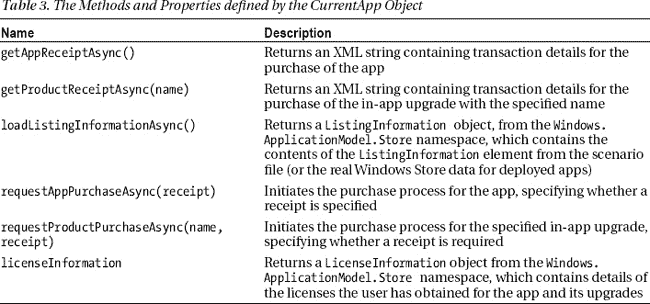
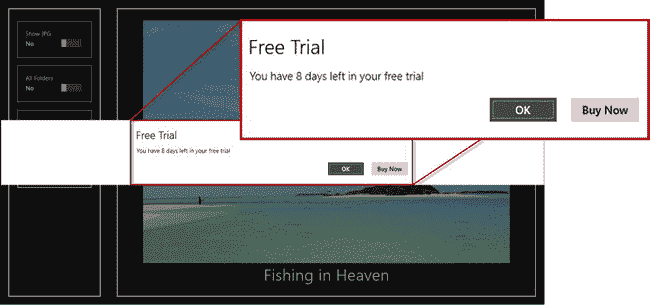
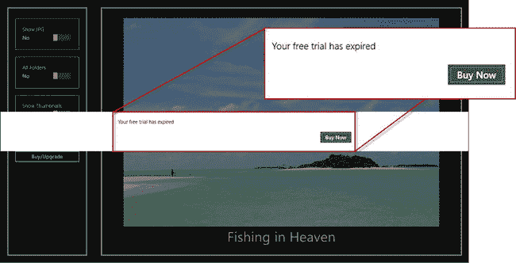
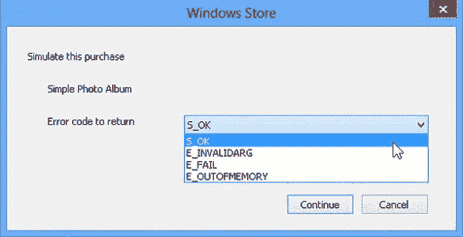
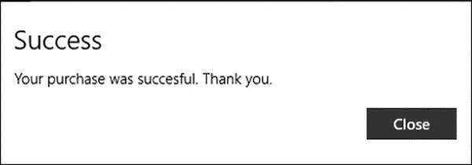

## 第三十一章

## Windows 应用商店集成

在本章中，我将向您展示如何将您的应用程序与 Windows 应用商店集成，并实现您的应用程序商业模式。我将向您展示提供商店功能访问的对象，以及如何在您的应用程序发布到商店之前使用它们来模拟不同的许可场景。我将向您展示如何确定您的用户有权使用哪些功能，以及如何强制实施该模型来阻止在没有合适许可证的情况下使用应用程序。

您会发现，与 Windows 商店集成的技术相当简单，但是实施业务模型和模拟不同的场景可能相当复杂，需要大量的测试。

### 关于应用许可的一般建议

在我开始为我的示例应用程序实现和实施业务模型之前，我想提供一些一般性的建议。期望你的用户付费使用你的应用程序是完全合理和公平的，但你需要对你提供的功能的价值和你所处的世界持现实态度。

你必须接受你的应用会被广泛盗版。它会在发布后的几个小时内出现在意想不到的地方，任何许可执行和权限管理都会立即被破坏。用户(如果你有一个特别吸引人的应用程序，会有很多用户)会从你的辛勤工作中获益，而不用付给你一分钱。

如果这是你的第一个应用程序，你会经历一系列常见的情绪:震惊、沮丧、愤怒和不公平感。你可能会非常沮丧，以至于更新你的应用程序来添加更复杂的许可方案，或者要求定期检查一些额外的验证服务。这是你能做的最糟糕的事情。

每次你添加额外的权限管理和许可层，你就让你的应用程序更难使用。但你实际上并没有让复制变得更难，因为没有一个现存的方案能够抵挡住想要免费拷贝的人的关注。你唯一惩罚的人是你的合法用户，他们现在不得不千方百计让你的应用程序工作。在竞争激烈的市场中，你希望消除尽可能多的障碍来吸引用户使用你的应用——而你增加的每一个使用障碍都会让竞争对手的应用更有吸引力。

一个更明智的方法是接受人们总是会抄袭你的软件，并花些时间考虑为什么会这样。

你可能想知道是什么让我觉得我可以告诉你让所有那些罪犯敲诈你——但这是我花了很多时间思考的事情，因为它每天都影响着我。

#### 书籍和应用有很多共同点

我的书在出版后几小时内就出现在文件共享网站上。这种情况已经发生了很多年，我开始明白，这并不是第一次出现的问题。

首先，从纯实践的角度来看，我没有办法阻止我的书被分享，即使我想这样做。第二，我开始意识到人们下载非法拷贝有各种原因，其中一些可能有利于我的长期销售数字。以下是我为自己的书考虑的几大类别:

1.  收集者
2.  快速修补程序
3.  预算员
4.  疼痛回避者

收藏者分享我的书是因为他们可以——他们喜欢收集大型图书馆的书籍、音乐、应用程序、游戏以及任何他们感兴趣的东西。对我来说，这些人并不代表销售的损失，因为他们从一开始就不会买一本，以后也不会。

速战速决者是那些有特定问题想要解决的人，他们会复制我的一本书，看看里面是否有解决方案。这些人也不代表销售失败，因为对他们来说，一个特定问题的解决方案并不代表 20-50 美元的价值。但是这些人*确实*代表了潜在的未来客户——他们可能记得他们发现我的书很有用，并为他们想更深入了解的主题购买了一本(或我的另一本著作)。

预算者是那些可能更喜欢买一本，但又买不起的人。书可能很贵，如果手头紧的话，书有多重要也没关系。这些人是*也是*潜在客户，因为他们现在可能破产了，但情况不会总是这样。当他们有更多的钱时，他们可能会开始买书，我希望他们在买书时对我的书有正面的感觉。

*痛苦回避者*是那些想要内容，但无法以适合他们的形式获得的读者。他们希望他们的内容以一种特定的方式或以一种特定的方式传递，而我和 Apress 不会给他们。所以他们转向文件共享，因为它以他们需要的方式给了他们所需要的东西。这些人是潜在的客户，无论是当我的作品以他们想要的方式出现时，还是当他们的需求发生变化时。

所以，总的来说，有一类人会抄袭我的书，因为他们可以也永远不会买一本，还有三类人今天会抄袭我的书，但将来可能会成为大客户。他们可能还会向其他人推荐我的书，这些人可能会付费购买一本(这种情况比你想象的更常见)。

收藏家对我来说是一个失败的事业，所以我不会因为他们而失眠。其他类型的文件复印机是我想培养的人，让他们体验我的内容，希望我将来能从他们身上赚些钱。我可以诚实地说，我从未把我的任何一本书放在文件共享网站上，但我很想这么做，因为我认为这有助于确保未来的收入。

同样重要的是，让我的书更难用并不会让任何一个复印机去买书。速战速决者会在别处找到解决方案，预算者不会有更多的闲钱，所以他们只会抄袭别人的书，而逃避痛苦者仍然无法以他们想要的方式获得内容。他们永远不会知道他们是否喜欢我的写作风格，因为他们永远也不会看到——我现在和将来都不会从他们那里得到任何销售。

#### 关注重要的事情

我试着考虑他们想要什么，而不是试图惩罚复印机。需要快速修复吗？我在每章的开头添加了汇总表，以便更容易找到具体的解决方案。没有现金吗？我写了 *Windows Revealed* 的书，花几美元就能让你快速入门。需要一种特定格式的电子书？我与 Apress 合作，它提供了一系列不同的无 DRM 格式。

我对文件共享者的回应是努力让我的书更有吸引力、更有用，而不是更难使用。而且，如果我成功了，我会取悦我的付费读者，因为他们希望快速找到解决方案，获得一系列电子书格式，并获得新主题的廉价有效的快速入门书籍。

我没有浪费时间去烦恼，而是为我的书被如此广泛地分享而暗自自豪，并一直希望今天抄袭我的书的人明天会为这些书付高价。

我给你的建议是，对你的 Windows 应用商店应用采取类似的方法。想想为什么人们复制它们，并试图为那些未来可能购买的人增加价值，同时为现在已经购买的人增加价值。你不能停止文件复制，所以你可以很好地接受它，并认为它是真正的自由市场暴露。

我不希望人们抄袭我的书，但如果他们不打算买一本，我宁愿他们抄袭我的书，而不是竞争对手的书，对书来说是真的，对应用程序来说也是真的。

### 处理基本的商店场景

实现应用程序业务模型的过程有点奇怪，因为您创建了一系列代表不同许可场景的 XML 文件，然后在您的应用程序中实现处理它们的代码。这些文件被称为*场景文件*，代表当你的应用在商店中发布并被用户下载或购买时，你的应用可以访问的数据。在本节中，我将创建一个非常基本的场景文件来介绍该格式，向您展示如何访问该场景所代表的数据，并在应用程序中对其进行响应。

#### 创建场景文件

我已经在项目中添加了一个名为`store`的新文件夹，我将在其中放置场景文件。我的第一个场景描述了用户下载了应用程序，但没有购买任何应用程序内升级或订阅的情况。对于我的业务模型，这意味着我对表示三种场景感兴趣:

1.  用户购买了基本应用程序功能的永久许可证。
2.  用户下载了尚未过期的免费试用版。
3.  用户下载了一个已经过期的免费试用版。

为了表示和测试这些场景，我在 store 文件夹中创建了一个名为`initial.xml`的新文件，其内容可以在清单 1 中看到。

*清单 1。/store/initial.xml 的内容*

`<?xml version="1.0" encoding="utf-16" ?>
<CurrentApp>
  <ListingInformation>
    <App>
      <AppId>e4bbe35f-0509-4cca-a27a-4ec43bed783c</AppId>
      <LinkUri>http://apress.com</LinkUri>
      <CurrentMarket>en-US</CurrentMarket>
      <AgeRating>3</AgeRating>
      <MarketData xml:lang="en-us">` `        <Name>Simple Photo Album</Name>
        <Description>An app to display your photos</Description>
        <Price>4.99</Price>
        <CurrencySymbol>$</CurrencySymbol>
        <CurrencyCode>USD</CurrencyCode>
      </MarketData>
    </App>
  </ListingInformation>
  <LicenseInformation>
    <App>
      <IsActive>true</IsActive>
      <IsTrial>false</IsTrial>
      <ExpirationDate>2012-09-30T00:00:00.00Z</ExpirationDate>
    </App>
  </LicenseInformation>
</CurrentApp>`

这个文件有两个部分，包含在`CurrentApp`元素中。`ListingInformation`元素包含 Windows Store 上应用程序列表的详细信息，而`LicenseInformation`元素包含用户获得该软件的许可证的详细信息。我将在接下来的小节中解释这两个元素。

 **注意** Windows 对场景文件的内容非常挑剔。确保`CurrentApp`元素关闭后没有内容，包括空行。如果应用程序在启动时崩溃，请尝试从 Visual Studio 重新加载应用程序，如果这不起作用，请仔细查看您的场景文件，看看您是否添加了 Windows 不期望的内容。

##### 了解清单部分

场景文件的`ListingInformation`部分包含了应用程序的描述，并为您提供了应用程序如何在商店中显示给用户的详细信息。我不太注意场景文件的这一部分，尽管当我为我想要提供的应用内升级和订阅创建定义时，我会在第 32 章中添加它。在[表 1](#tab_31_1) 中，我描述了商店整合和测试过程中的各种元素及其效果。

T4】

虽然你需要在一个场景文件中为这些元素创建值，但是`ListingInformation`部分中的值取自你发布应用程序时提供的信息，我将在第 33 章中演示。使用什么值进行测试并不重要，它们是必需的，但这些值只是真实数据的占位符，您不必使用您计划为真实 Windows 应用商店部署提供的相同值。

 **注意【Windows 应用商店集成期间的一个常见问题是为`AppId`元素使用格式错误的值。我发现最简单的方法是从应用清单中获取值。打开清单，导航到`Packaging`选项卡，从`Package name`字段复制值。**

##### 了解许可部分

`LicenseInformation`元素包含用户为应用程序及其升级获得的所有许可证的详细信息。对于我最初的例子，我只为应用程序本身定义了一个测试许可证，我已经在清单 2 中重复了。正是这一部分，我将改变创造不同的场景，我想迎合。

*清单 2。来自 initial.xml 场景文件*的许可信息

`...
<LicenseInformation>
  <App>
    <IsActive>true</IsActive>
    <IsTrial>false</IsTrial>
    <ExpirationDate>2012-09-30T00:00:00.00Z</ExpirationDate>
  </App>
</LicenseInformation>
...`

我在[表 2](#tab_31_2) 中描述了场景文件这一部分的元素。

对于我的初始场景，我已经将`IsActive`元素设置为`true`，将`IsTrial`元素设置为`false`——这种组合代表了用户已经购买了应用程序的基本功能的情况。

#### 使用许可信息

现在我已经定义了场景文件，我可以在我的应用程序中使用它了。我希望尽可能将许可证的管理与应用程序中的其他代码分开，这样我就可以在一个地方改变商业模式。在 Windows 商店中销售应用和应用内升级的方式有很大的灵活性，并且您可能不会第一次就获得可选功能的定价和组合，因此在您将进行更改的基础上进行编码是有意义的，并且您希望尽可能简化该过程。

首先，我对`/js/store.js`文件做了一些补充，如[清单 3](#tab_31_3) 所示。只有几行新的代码，但是有许多新的对象和技术要介绍，所以我将在接下来的小节中一步一步地分解这些新增内容。

*清单 3。添加到/js/store.js 文件*

`(function() {
**    var storage = Windows.Storage;**

**    var licensedCapabilities = {**
**        basicApp: false,**
**    }**

    WinJS.Namespace.define("ViewModel.Store", {
        events: WinJS.Utilities.eventMixin,

        checkCapability: function (name) {
**            var available = licensedCapabilities[name] != undefined**
**                ? licensedCapabilities[name] : true;**
            setImmediate(function () {
                ViewModel.Store.events.dispatchEvent("capabilitycheck",
                    { capability: name, enabled: available });
            });` `            return available;
        },

**        currentApp: Windows.ApplicationModel.Store.CurrentAppSimulator,**

**        loadLicenseData: function () {**
**            var url = new Windows.Foundation.Uri("ms-appx:///store/initial.xml");**
**            return storage.StorageFile.getFileFromApplicationUriAsync(url)**
**                .then(function (file) {**
**                    return ViewModel.Store.currentApp.reloadSimulatorAsync(file);**
**                });**
**        },**

    });

**    ViewModel.Store.currentApp.licenseInformation.addEventListener("licensechanged",**
**        function () {**
**            var license = ViewModel.Store.currentApp.licenseInformation;**
**            licensedCapabilities.basicApp = license.isActive;**
**    });**

})();`

##### 跟踪能力权利

我对`store.js`文件做的第一个添加是定义一个名为`licensedCapabilities`的对象，我将使用它来跟踪用户对应用程序中各个功能区域的权限——尽管最初我只跟踪应用程序的基本功能，如下所示:

`...
var licensedCapabilities = {
    basicApp: false,
}
...`

即使你的应用程序的功能与你要出售的应用程序内升级完全匹配，也要跟踪用户使用你的应用程序的功能的权利，这一点很重要，我设计的示例应用程序就是这种情况。

这有两个原因:首先，您可能需要稍后进行更改，并且您希望使您的代码过于依赖您最初定义的许可证。第二，你很少会得到一个完美的匹配，所以，作为一个例子，我打算提供一个名为`The Works`(如第 30 章中的[所述)的升级，它将允许用户访问所有的应用程序功能，因此在这个升级的许可证和应用程序功能之间没有直接的映射——你可以在第 32 章](30.html#ch30)中看到我如何处理这个轻微的不匹配。

添加了`licensedCapabilities`对象后，我可以更新`Windows.Store.checkCapabilities`方法，以便它开始反映用户的权限，如下所示:

`...
checkCapability: function (name) {
**    var available = licensedCapabilities[name] != undefined ? licensedCapabilities[name]**
**        : true;**
    setImmediate(function () {` `        ViewModel.Store.events.dispatchEvent("capabilitycheck",
            { capability: name, enabled: available });
    });
    return available;
},
...`

我用粗体标出了关键语句。如果在`licensedCapabilities`中有一个属性对应于被检查的能力，那么我使用`licensedCapabilities`值来响应`checkCapability`调用。

请注意默认值的不同。在`licensedCapabilities`对象中，我将`basicApp`属性的值设置为`false`，这将默认拒绝用户访问该功能。然而，在`checkCapability`方法中，如果在`licensedCapabilities`对象中没有相应的值，我将返回`true`。我这样做是为了让我定义的功能总是需要一个许可，但是如果我忘记定义一个功能，我不会通过禁用一个即使他们愿意付费也不能激活的功能来破坏用户的体验。

 **提示**这可能会让你觉得奇怪的谨慎，但是我已经写了一些这样的 Windows Store 实现，它们变得非常复杂——如果你忘记连接一个应用程序功能，在慷慨方面犯错误会带来更好的体验。

##### 获取当前应用程序的数据

用于管理 Windows 应用商店集成的对象位于`Windows.ApplicationModel.Store`名称空间中。这个关键对象叫做`CurrentApp`，它提供了对从 Windows 商店获得的许可证信息的访问，并定义了允许您启动应用程序和升级购买流程的方法。[表 3](#tab_31_3) 显示了`CurrentApp`对象定义的方法和属性，我将在本章中使用它们来管理示例应用程序。

我将在这一章中使用关键方法和属性，我将在使用它们时引入来自`Windows.ApplicationModel.Store`名称空间的其他对象。然而，`CurrentApp`对象有一个问题——它只有在应用发布后用户从商店下载了应用时才有效。

出于集成和测试的目的，您必须使用`CurrentAppSimulator`对象，它也包含在`Windows.ApplicationModel.Store`名称空间中。`CurrentAppSimulator`对象定义了`CurrentApp`定义的所有方法和属性，但是作用于场景文件。您使用`CurrentAppSimulator`对象，直到您准备好发布您的应用程序，此时您替换应用程序中的引用，以便您使用`CurrentApp`对象。

我想尽可能简单地完成从集成到发布的过渡，所以我定义了一个对`CurrentAppSimulator`类的引用，这样以后我只需要做一个修改。您可以看到我添加到`ViewModel.Store`名称空间的引用，如下所示:

`...
WinJS.Namespace.define("ViewModel.Store", {
    events: WinJS.Utilities.eventMixin,

    checkCapability: function (name) {
        // *...code removed for brevity...*
    },

**    currentApp: Windows.ApplicationModel.Store.CurrentAppSimulator,**

    loadLicenseData: function () {
        // *...code removed for brevity...*
    },

});
...`

我会在任何需要使用`CurrentApp/CurrentAppSimulator`功能的时候引用`ViewModel.Store.currentApp`属性，当我准备好发布时只做一个改变(我会在[第 33 章](33.html#ch33)中演示)。

除了那些由`CurrentApp`定义的方法之外，`CurrentAppSimulator`对象还定义了一个额外的方法。这个方法叫做`getFileFromApplicationUriAsync`，它将一个代表场景文件的`StorageFile`对象作为它的参数。该方法在文件中加载 XML 元素，并使用它们来模拟许可场景，因此您可以在将应用程序发布到应用商店之前实现您的业务模型。

为了加载场景文件，我在`ViewModel.Store`名称空间中定义了一个名为`loadLicenseData`的函数，如下所示:

`...
WinJS.Namespace.define("ViewModel.Store", {
    events: WinJS.Utilities.eventMixin,

    checkCapability: function (name) {
        // *...code removed for brevity...*
    },

    currentApp: Windows.ApplicationModel.Store.CurrentAppSimulator,

**    loadLicenseData: function () {**
**        var url = new Windows.Foundation.Uri("ms-appx:///store/initial.xml");**` `**        return storage.StorageFile.getFileFromApplicationUriAsync(url)**
**            .then(function (file) {**
**                return ViewModel.Store.currentApp.reloadSimulatorAsync(file);**
**            });**
**    },**

});
...`

我使用 URL 获得一个`StorageFile`对象，然后调用`reloadSimulatorAsync`方法从我的`/store/initial.xml`文件中加载数据。

##### 响应许可变更

我对`/js/store.js`文件做的最后一个添加是为`licensechanged`事件添加一个处理函数。当许可证信息发生变化时(例如当用户进行购买时)以及当使用`CurrentAppSimulator`对象加载一个场景文件时，该事件被触发。下面是我定义的处理函数:

`...
ViewModel.Store.currentApp.**licenseInformation**.addEventListener("**licensechanged**",
    function () {
        var license = ViewModel.Store.currentApp.licenseInformation;
        licensedCapabilities.basicApp = license.isActive;
    }
);
...`

`CurrentApp.licenseInformation`属性返回一个`LicenseInformation`对象。该对象定义了`licensechanged`事件，我已经为其添加了处理程序。

当事件被触发时，我再次读取`CurrentApp.licenseInformation`属性的值以获得`LicenseInformation`对象，该对象定义了我在[表 4](#tab_31_4) 中描述的属性。

从表中可以看出，场景文件中的元素直接对应于由`LicenseInformation`对象定义的属性，这使得创建和测试一系列不同的许可情况变得相对容易。在我的处理函数中，我将`licenseCapabilities`对象中`basicApp`属性的值设置为`LicenseInformation.isActive`属性的值。这意味着如果用户拥有有效的许可证，对`basicApp`功能的`ViewModel.Store.checkCapability`方法的调用将返回`true`。

##### 加载场景数据

为了加载我的场景数据，我从`/js/default.js`文件中添加了对`loadLicenseData`方法的调用，如[清单 4](#tab_31_4) 所示。

*清单 4。确保应用程序启动时加载许可信息*

`...
app.onactivated = function (args) {
    if (args.detail.kind === activation.ActivationKind.launch) {
        if (args.detail.previousExecutionState !==
            activation.ApplicationExecutionState.suspended) {
            // *...code removed for brevity...*
        }
        args.setPromise(WinJS.UI.processAll().then(function() {
            return WinJS.Binding.processAll(document.body, ViewModel)
                .then(function () {
**                    return ViewModel.Store.loadLicenseData().then(function () {**
                        setupPrinting();
                        loadFiles();
**                    });**
            });
        }));
    }
};
...`

我调用`ViewModel.Store.loadLicenseData`方法作为`Promise`对象链的一部分，这些对象将在应用程序启动时闪屏被移除之前完成。这可确保在向用户显示应用程序功能之前加载我的许可证数据。

### 实施许可政策

在这一点上，我已经建立了对 Windows Store 的支持，因此如果在场景文件中有应用程序本身的有效许可证，我的`checkCapabilities`方法将返回`true`,但是测试这个特性非常令人失望，因为我没有在应用程序的任何地方强制执行许可证。在这一部分，我将开始充实执行我的商业模式的不同方面的代码，通过只允许用户访问应用程序的基本功能，如果他们已经购买了许可证或如果他们正在使用免费试用。

#### 触发能力检查

我需要做的第一件事是调用`checkCapability`方法来查看用户是否有权使用`basicApp`功能。我已经在`/js/default.js`文件中这样做了，如[清单 5](#list_31_5) 所示。

*清单 5。检查用户是否有权使用基本应用功能*

`...
app.onactivated = function (args) {
    if (args.detail.kind === activation.ActivationKind.launch) {
        if (args.detail.previousExecutionState !==` `            activation.ApplicationExecutionState.suspended) {
                // *...code removed for brevity...*
        }
        args.setPromise(WinJS.UI.processAll().then(function() {
            return WinJS.Binding.processAll(document.body, ViewModel)
                .then(function () {
                    return ViewModel.Store.loadLicenseData().then(function () {
                        setupPrinting();
                        loadFiles();
**                        ViewModel.Store.checkCapability("basicApp");**
                    });
            });
        }));
    }
};
...`

您会注意到，虽然我调用了`checkCapability`方法，但是我并没有对结果做任何事情。我依赖于事件`capabilitycheck`事件，每当调用`checkCapability`方法时就会触发该事件。我将在执行基本应用程序功能策略的代码中处理这个事件，我已经在一个名为`/js/storeInteractions.js`的新文件中定义了它。我为`storeInteractions.js`文件在`default.html`文件中添加了一个新的`script`元素，如[清单 6](#list_31_6) 所示。

*清单 6。向 default.html 文件添加新的脚本元素*

`...
<head>
    <meta charset="utf-8" />
    <title>PhotoApp</title>

    <!-- WinJS references -->
    <link href="//Microsoft.WinJS.1.0/css/ui-dark.css" rel="stylesheet" />
    
    

    <!-- PhotoApp references -->
    <link href="/css/default.css" rel="stylesheet" />
    
    
**    **
    
</head>
...`

我定义了一个新文件，因为执行这种策略的代码往往冗长且重复，我希望将它与`store.js`文件中的代码分开。您可以在[清单 7](#list_31_7) 中看到`storeInteractions.js`文件的内容。

*清单 7。storeInteractions.js 文件的初始内容*

`(function () {` 
`    var pops = Windows.UI.Popups;

    ViewModel.Store.events.addEventListener("**capabilitycheck**", function (e) {
        if (e.detail.capability == "basicApp") {
            if (ViewModel.Store.currentApp.licenseInformation.isTrial &&
                e.detail.enabled) {
**                // user has a trial period which has not expired**
            } else if (!e.detail.enabled) {
**                // user has a trial period which has expired**
            }
        }
    });

    function buyApp() {
**        // code to purchase the app will go here**
**        return WinJS.Promise.wrap(true);**
    }
})();`

作为调用我添加到`default.js`中的`ViewModel.Store.checkCapability`方法的结果，将调用`capabilitycheck`事件的处理函数。我对这个代码文件中的两个场景感兴趣。第一是用户正在使用尚未过期的 app 免费试用，第二是免费试用*已经*过期。您可以在清单中看到我是如何结合事件对象和`LicenseInformation`对象的细节来处理这些场景的。

 **注意**我对基本应用功能的第三个设想是，用户已经购买了许可证。在这种情况下，我什么都不做，因为我想远离我的付费客户。嗯，至少在他们尝试使用需要升级的功能之前是这样，但是我会在第 32 章回到这个话题。

在接下来的小节中，我将填充事件处理函数中当前包含注释的三个部分。

#### 处理有效试用期

我想借此机会提醒用户，他们正在试用我的应用程序，让他们有机会在启动应用程序时购买许可证。您可以在清单 8 的[中看到我是如何做到这一点的，其中我展示了我对`storeInteractions.js`文件所做的添加。](#list_31_8)

*清单 8。提示用户购买应用*

`(function () {
    var pops = Windows.UI.Popups;

    ViewModel.Store.events.addEventListener("capabilitycheck", function (e) {
        if (e.detail.capability == "basicApp") {
            if (ViewModel.Store.currentApp.licenseInformation.isTrial
                    && e.detail.enabled) {

**                var daysLeft = Math.ceil(**` `**                    (ViewModel.Store.currentApp.licenseInformation.expirationDate**
**                    - new Date()) / (24 * 60 * 60 * 1000));**
**                var md = new pops.MessageDialog("You have " + daysLeft**
**                    + " days left in your free trial");**
**                md.title = "Free Trial";**
**                md.commands.append(new pops.UICommand("OK"));**
**                md.commands.append(new pops.UICommand("Buy Now"));**
**                md.defaultCommandIndex = 0;**
**                md.showAsync().then(function (command) {**
**                    if (command.label == "Buy Now") {**
**                        buyApp();**
**                    }**
**                });**

            } else if (!e.detail.enabled) {
                // user has a trial period which has expired
            }
        }
    });

    function buyApp() {
        // code to purchase the app will go here
        return WinJS.Promise.wrap(true);
    }
})();`

我计算出用户的试用期还剩多少天，并使用`Windows.UI.Popups.MessageDialog`显示这些信息，我在第 13 章的[中对此进行了描述。`MessageDialog`有一个`OK`按钮可以关闭弹出窗口，还有一个`Buy Now`按钮可以调用`buyApp`功能(我很快就会实现)。](13.html#ch13)

##### 测试场景

我需要修改我的场景文件来测试这个新代码，创建一个用户有一个试用期的场景。在清单 9 的[中，您可以看到我是如何修改`/store/initial.xml`文件来创建我想要的环境的。](#list_31_9)

*清单 9。更改 initial.xml 文件中的场景*

`...
<LicenseInformation>
  <App>
    <IsActive>true</IsActive>
    <IsTrial>**true**</IsTrial>
    <ExpirationDate>**2012-09-30T00:00:00.00Z**</ExpirationDate>
  </App>
</LicenseInformation>
...`

我已经将`IsTrial`元素的值更改为`true`，并确保`ExpirationDate`元素包含一个未来几天的日期。我在 2012 年 9 月 22 日写这一章，所以我在清单中指定的日期是未来 8 天。当您测试这个示例时，您将需要更改数据。

当你启动 app 时，你会看到一条消息，告诉你试用还剩多少天，如图[图 1](#fig_31_1) 所示。

***图 1。**向用户显示试用期还剩多少时间*

点击`OK`按钮关闭对话框，让用户继续使用应用程序。点击`Buy Now`按钮调用我在`storeInteractions.js`文件中定义的`buyApp`函数，当我在下一节实现它时，它将启动购买过程。有了这个新功能，我可以提醒用户，他们只有一个试用期，让他们有机会尽早购买应用程序。

#### 处理过期的试用期

我想阻止用户使用该应用程序时，试用期已过，只提供他们购买的机会。我使用另一个`MessageDialog`来做这件事，如清单 10 中的[所示。](#list_31_10)

*清单 10。处理过期的试用期*

`(function () {

    var pops = Windows.UI.Popups;

    ViewModel.Store.events.addEventListener("capabilitycheck", function (e) {
        if (e.detail.capability == "basicApp") {
            if (ViewModel.Store.currentApp.licenseInformation.isTrial
                    && e.detail.enabled) {
                var daysLeft = Math.ceil(
                    (ViewModel.Store.currentApp.licenseInformation.expirationDate
                    - new Date()) / (24 * 60 * 60 * 1000));
                var md = new pops.MessageDialog("You have " + daysLeft
                    + " days left in your free trial");` `                md.title = "Free Trial";
                md.commands.append(new pops.UICommand("OK"));
                md.commands.append(new pops.UICommand("Buy Now"));
                md.defaultCommandIndex = 0;
                md.showAsync().then(function (command) {
                    if (command.label == "Buy Now") {
                        buyApp();
                    }
                });

            } else if (!e.detail.enabled) {
**                var md = new pops.MessageDialog("Your free trial has expired");**
**                md.commands.append(new pops.UICommand("Buy Now"));**
**                md.showAsync().then(function () {**
**                    buyApp().then(function (purchaseResult) {**
**                        if (!purchaseResult) {**
**                            ViewModel.Store.checkCapability("basicApp");**
**                        }**
**                    });**
**                });**
            }
        }
    });

    function buyApp() {
        // code to purchase the app will go here
        return WinJS.Promise.wrap(true);
    }
})();`

我向用户显示的对话框通知他们试用已经过期，并提供给他们一个`Buy Now`按钮。当按钮被点击时，我调用`buyApp`函数，它将负责启动购买过程。该函数返回一个`Promise`对象，该对象在流程完成时实现，如果购买成功，则产生`true`，如果没有购买，则产生`false`(这可能有多种原因，包括用户取消交易、未能提供有效的支付形式，或者因为无法访问 Windows Store，没有连接的设备无法进行购买)。

 **提示**在开发免费试用的应用时，我喜欢加上一个宽限期。几年前，我想在一次长途飞行中使用一个试用应用程序，却发现它已经过期，并且我的连接能力不足意味着我无法升级，尽管我愿意这样做。相反，我对开发人员决定不再购买应用程序的硬性规定感到恼火。因此，对于我自己的项目，我通常会添加一个按钮，将试用期延长几天，以便他们有机会进行购买。我只允许一次扩展，之后应用程序停止工作。

如果购买成功，我就关闭对话框，这样用户就可以使用这个应用程序了。如果购买没有完成，我调用`ViewModel.Store.checkCapability`方法，再次评估许可证，导致相同的对话框显示，直到用户终止应用程序或能够完成购买。我使用了`checkCapability`方法，以便触发`capabilitycheck`事件，让我的应用程序的其他部分保持对正在发生的事情的了解。

##### 测试场景

为了测试这个场景，我必须在`/store/initial.xml`场景文件中指定一个过去的日期，如[清单 11](#list_31_11) 所示。为了得到我想要的效果，我必须将`isActive`元素设置为`false`，并确保将`isTrial`元素设置为`true`。

*清单 11。在 initial.xml 文件中创建过期的试用场景*

`...
<LicenseInformation>
  <App>
    <IsActive>**false**</IsActive>
    <IsTrial>**true**</IsTrial>
    <ExpirationDate>**2011-09-30T00:00:00.00Z**</ExpirationDate>
  </App>
</LicenseInformation>
...`

当你启动应用程序时，你会看到如图[图 2](#fig_31_2) 所示的对话框。

***图二。**处理过期的试用期*

此时，`buyApp`函数返回的`Promise`返回`true`，表示从商店购买成功。点击`Buy Now`按钮，对话框将被关闭，您可以使用该应用程序。

为了模拟一次失败的购买，修改`buyApp`函数，使`Promise`产生`false`，如[清单 12](#list_31_12) 所示。

*清单 12。模拟一次失败的购买*

`...
function buyApp() {
    // code to purchase the app will go here
    return WinJS.Promise.wrap(**false**);
}
...`

重启应用程序，你会看到同样的对话框。点击`Buy Now`按钮将暂时关闭对话框，但它会在一会儿后重新出现，阻止应用程序被使用。

#### 增加购买应用程序的支持

购买应用程序的大部分工作由 Windows 和 Windows 商店负责。我所要做的就是表明我想要启动这个过程，这是通过`CurrentApp`对象来完成的。您可以看到我如何在[清单 13](#list_31_13) 的`storeInteractions.js`文件中实现了`buyApp`函数，以使用`CurrentApp`功能的这一方面。

*清单 13。实现 buyApp 功能*

`...
function buyApp() {
**    var md = new pops.MessageDialog("placholder");**
**    return ViewModel.Store.currentApp.requestAppPurchaseAsync(false).then(function () {**
**        if (ViewModel.Store.currentApp.licenseInformation.isActive) {**
**            md.title = "Success"**
**            md.content = "Your purchase was succesful. Thank you.";**
**            return md.showAsync().then(function () {**
**                return true;**
**            });**
**        } else {**
**            return false;**
**        }**
**    }, function () {**
**        md.title = "Error"**
**        md.content = "Your purchase could not be completed. Please try again.";**
**        return md.showAsync().then(function () {**
**            return false;**
**        });**
**    });**
}
...`

关键部分是对`requestAppPurchaseAsync`方法的调用，它启动了购买过程。这个方法的参数是一个`boolean`值，指示是否应该为交易生成收据——我已经指定了`false`,这意味着不需要收据。

如果购买成功，`requestAppPurchaseAsync`方法返回一个正常完成的`WinJS.Promise`，否则调用错误函数(参见[第 9 章](09.html#ch9)，了解传递给`Promise.then`方法的不同函数的解释)。

成功和错误与流程本身有关，因此您需要检查 success 函数中的许可证状态，以确保购买成功。我通过使用另一个`MessageDialog`报告结果的来响应购买的结果。我的`buyApp`函数返回一个`Promise`,如果购买成功则返回`true`,否则返回`false`。

当使用`CurrentAppSimulator`对象时，调用`requestAppPurchaseAsync`方法会显示一个对话框，允许您模拟购买请求的不同结果。要看到这个对话框，启动应用程序并点击`Buy Now`按钮。[图 3](#fig_31_2) 显示了对话框和你可以选择的选项来模拟结果。

***图三。**模拟 app 购买流程*

`S_OK`选项将模拟一次成功的购买，而其他值模拟不同种类的错误。在我的例子中，我没有区分不同种类的错误，并以同样的方式对待所有失败的购买。

##### 测试失败的购买

如果您选择一个错误条件并点击`Continue`按钮，您将看到如图[图 4](#fig_31_4) 所示的错误信息。点击`Close`按钮关闭对话框，因为应用程序仍未获得许可，导致应用程序再次显示过期警告。

***图 31-4。**通知用户购买失败*

##### 测试一次成功的购买

测试成功购买稍微复杂一些，因为检查许可证信息是否正确更新很重要。首先，启动应用程序，在执行任何其他操作之前，在 Visual Studio JavaScript 控制台中输入以下语句:

`console.log("Active: " + ViewModel.Store.currentApp.licenseInformation.isActive); console.log("Trial: " + ViewModel.Store.currentApp.licenseInformation.isTrial);`

这些语句产生以下输出，表明该应用程序没有有效的许可证，并且是作为免费试用获得的，如下所示:

* * *

`Active: false
Trial: true`

* * *

点击应用程序对话框上的`Buy Now`按钮，通过从列表中选择`S_OK`值并点击`Continue`按钮来模拟一次成功的购买。您将看到如图[图 5](#fig_31_5) 所示的对话框，当您点击`Close`按钮时，您将能够使用该应用程序。

***图 5。**确认成功购买应用*

现在，在 JavaScript 控制台窗口中重新输入这些命令，您将看到许可信息已经更改，表明用户已经许可了应用程序，如下所示:

* * *

`Active: true
Trial: false`

* * *

当用户获得许可证时，`licensechanged`事件被自动触发，这意味着我在`/js/store.js`文件中的处理函数将重新评估可用的许可证，并更新用于响应对`ViewModel.Store.checkCapability`函数的调用的属性，确保应用程序状态与用户获得的许可证保持一致。

 **注意**重要的是要理解场景文件不会改变——只会改变正在运行的应用程序中许可信息的状态。如果重启 app，会重新加载`/store/initial.xml`文件中描述的场景，重新创建用户没有许可证，免费试用期已过的情况。

### 总结

在本章中，我已经向您介绍了`Windows.ApplicationModel.Store`名称空间，并使用它包含的一些对象来实现我的示例业务模型的一部分。我已经为我的应用程序添加了对强制试用期和从商店购买应用程序以获得永久许可证的支持，并使用场景文件测试了该功能。在下一章，我将向你展示如何销售和管理应用内升级。