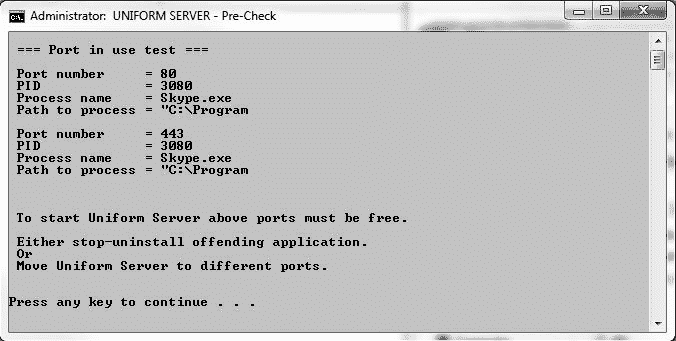
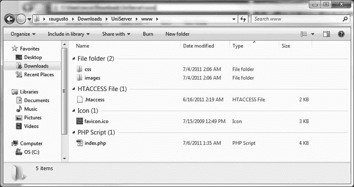
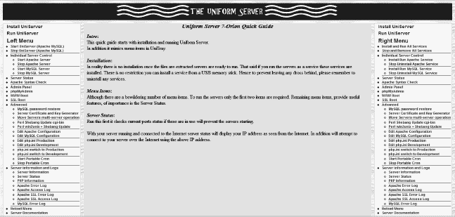
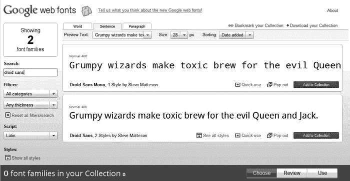
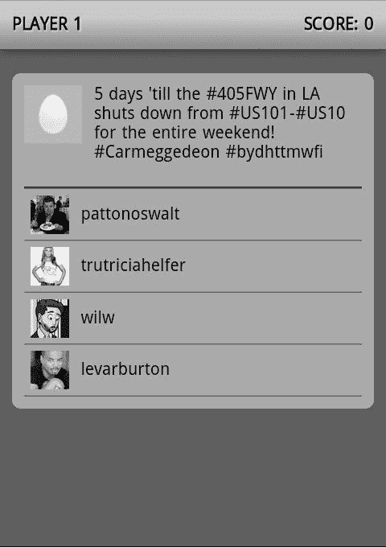
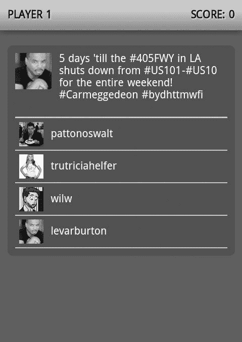
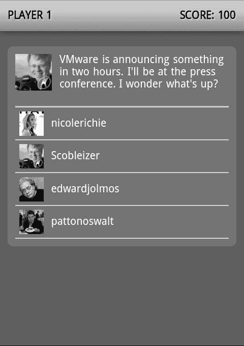
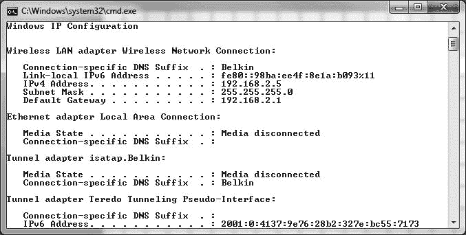

# 二、推特应用：那条推特是谁的？

既然我们已经涵盖了本书中将要学习的内容，那么是时候开始动手创建我们的第一个移动 web 应用了。这两个应用都是与 Twitter API 交互的非常简单的应用。API 或应用编程接口是一种接口，用于根据用户提供给应用的一组规则或参数与特定应用进行交互。人们通常会使用 API 从应用的基础设施中收集和解析数据，而无需直接连接到应用的数据库来获取这些信息。

我们将构建的第一个应用是“那条推特是谁？”，它将解析一个预定义的已验证 Twitter 用户的小列表，并在页面上显示一条随机的推文，以及可能创建该推文的四个可能个人的列表。

我们将构建的第二个小型 Web 应用名为“我爱火腿”，它也将借用 Twitter 的数据消防水管，为移动用户创造一种快速而有趣的娱乐形式。《我爱火腿》将关注非常基础的游戏机制。用户可以从两个预定义的押韵 Twitter 搜索中进行选择。如果他们选择收到最多结果的 Twitter 搜索，那么他们就是赢家。这两款手机网页游戏都将严重依赖 HTML5、JavaScript 和一项名为 JSONP 的神奇技术。

在这一章中，我们将让你在自己的个人电脑上建立并运行一个开发环境(把它想象成你自己的迷你互联网，它将连接到真实互联网上的 Twitter，但大多数情况下只是在你的电脑上运行),并讨论那条 Tweet 是谁？应用。在下一章，我们将继续讨论我爱火腿应用。我们开始吧！

### JSONP

你可能记得我们在第一章谈到 JSON。JSON 是一项很棒的技术，如果你在过去几年中在 web 开发领域工作过，你可能会遇到一两次。如果你在过去的一天里浏览过网页，你也可能浏览过使用它的网站！如果您曾经使用过 Flickr、Twitter 或 Gowalla 的 API，那么您可能也非常熟悉 JSON。对于那些完全跳过第一章的人来说，JSON 是一种人类可读的数据交换技术，它是轻量级的，也是一种开放标准。作为一项技术，JSON 还相当年轻，它的使用可以追溯到世纪之交，2002 年`JSON.org` ( `[http://www.json.org](http://www.json.org)`)网站上线。

如果您熟悉使用 JavaScript 和创建对象，那么 JSON 应该对您来说比较熟悉。然而，不要将 JSON 与 JavaScript 对象混淆，因为它们是不同的。虽然我很喜欢 JSON，但是有一件很小很烦人的事情，大多数开发人员直到花了几个小时拔掉自己的头发，让自己过早地秃顶，才意识到，这是一件非常讨厌、很小、很烦人的事情，叫做跨域脚本。

要理解什么是跨域脚本以及为什么你的浏览器中有硬编码规则来阻止你这样做，你必须首先理解什么是跨站点脚本(XSS)。XSS 是网站和应用中的一种漏洞，它允许攻击者或入侵者将自己的脚本和内容注入到网站或系统中。入侵者可能会利用 XSS 漏洞将脚本上传到您的服务器，这将允许他们在自己的浏览器中为您的服务器模拟 Bash shell(常见的 UNIX shell 或命令行界面),或者更糟的是，可能会利用该漏洞从您的数据库中窃取数千个用户名和密码。

出于这些考虑，在大多数情况下，您的浏览器不会从站点服务器之外的域加载 JSON 数据。为了获取和使用这些数据，必须在加载页面并提供给用户之前，在后端服务器端获取这些数据。这看起来没什么大不了的，直到你开始构建拥有成千上万用户的应用。那么解析外部数据最终会影响服务器的性能。为了解决这个性能问题并将一些外部数据解析需求委托给最终用户，我们将使用 JSONP 或“带填充的 JSON”，这将允许我们的应用请求我们需要的 JSON 数据，因为它将被包装(或填充)在一个 JavaScript 对象中。

### 设置您的开发环境

在我们开始编码之前，我们需要建立一个开发环境。为了简单起见，我将假设我们使用的是基于 Windows 的操作系统，所以我将只介绍设置一个基本的 WAMP (Windows、Apache、MySQL 和 PHP)服务器的步骤，以便我们在上面测试我们的代码。我知道并不是每个人都使用基于 Windows 的系统，但是如果你使用 Linux 或者 OS X，那么你可能已经熟悉了建立一个*AMP 测试环境。

对于我们的测试环境，我们将使用开源的免费 WAMP 服务器 Uniform Server ( `[http://www.uniformserver.com/](http://www.uniformserver.com/)`)。你可以从他们的网站下载 WAMP 服务器。我正在使用的版本，以及将在本章截图中显示的版本，将来自版本“7 . 1 . 2–Orion”

设置测试环境相当简单。只要找到你从网站上抓取的下载文件，运行自解压 EXE 文件。完成后，打开文件夹。在运行服务器之前，我想看一下 Uniform Server 团队为了让我们的生活更轻松而提供的一些有用的程序。第一个应用称为预检查(Run_pre_check.exe)。 [1](#CHP-2-FN-1) 让我们运行这个应用，看看[图 2–1](#fig_2_1)中的结果。

**图 2–1。** *统一服务器的预检查应用显示端口 80 和 443 当前正在使用*

如您所见，如果我试图在此时运行服务器，它将会失败。我目前打开了 Skype，它运行在我运行服务器所需的经典 HTTP 端口(端口 80 和 443)上。在网络中有一个程序到端口的规则，所以我们需要做一些简单的调整。虽然您可以编辑一些配置文件来更改您将使用的端口，但为了简单起见，我将关闭 Skype，以便我们可以在默认设置下运行。

现在我们已经释放了端口，我们可以运行“Start.exe”应用，它将打开并在您的系统托盘中放置一个图标。右键单击系统托盘中的统一服务器图标。它看起来像一个蓝色的盒子，里面有数字 1，如下面的[图 2–2](#fig_2_2)所示。选择菜单顶部的“安装并运行所有服务”选项。现在，如果您打开 web 浏览器并将其指向`http://localhost/,`，您应该会看到默认的统一服务器启动页面(localhost 只是您当前工作的计算机的另一个名称，IP 地址是 127.0.0.1)。

__________

您可能需要以 Windows 管理员的身份运行这个命令和其他命令。为此，右键单击命令并选择“以管理员身份运行”

**图 2–2。** *系统托盘中看到的统一服务器菜单*

现在我们的服务器已经启动并运行，我们已经*差不多*准备好开始写一些代码了。我们必须做的最后一件事是熟悉服务器的默认 WWW 根文件夹。如果你打开解压统一服务器的文件夹，你会看到一个名为 www 的文件夹(见[图 2–3](#fig_2_3))。任何通过浏览器查看您的站点的用户都可以看到您放在此文件夹中的任何内容。由于我们将使用我们自己的项目文件，您可以随意删除该文件夹中的所有内容，重新开始。稍后，您可能会在设置生产服务器时使用这些文件。但是，出于开发目的，并不需要它们。

**图 2–3。** *默认的 WWW 文件夹视图，将存放您的应用项目文件*

现在，您已经成功地为本地开发建立了自己的 web 服务器，并清理了根文件夹，是时候开始一些编码了！如果你需要任何关于统一服务器的帮助，或者只是想更深入地挖掘一下，看看你能用这个服务器做些什么，你可以运行统一服务器目录中的“help.bat”批处理文件，它会给你提供一些非常深入的文档(见[图 2–4](#fig_2_4))。

**图 2–4。** *统一服务器快速帮助文档*

### 你的第一个移动 Web 应用

给自己倒杯咖啡，做点伸展运动，因为现在是开始编码的时候了。我们正在构建的第一个应用，“那条推特是谁？”，将是一个小而简单的游戏，收集经过验证的 Twitter 用户和名人，并随机显示他们的一条推文。然后，用户将会看到一个由四个可能创建该 Twitter 帖子的 Twitter 用户组成的列表。如果最终用户选择了正确的 Twitter 用户来支持该帖子，那么他们的分数将增加 100 分，并进入下一个随机帖子。如果没有，他们会得到一个视觉提示，表明他们的猜测能力较差，并将继续随机发布下一篇 Twitter 帖子。

我们要做的第一件事是为我们的游戏创建一个非常基本的 HTML 布局，或者说基础。在那之后，我们将继续用一点 CSS3 来设计这个平淡无奇的框架布局，一旦它看起来很漂亮，我们将最终继续编写我们的 JavaScript，它将在我们的第一个移动 web 应用中把一切联系在一起。

##### HTML

清单 2–1 包含了我们游戏的基本 HTML。

**清单 2–1。** *那是谁的推文？*

`<!DOCTYPE HTML>
<html>
<head>
<meta charset="utf-8">
<meta name="viewport" content=" initial-scale=1.0; maximum-scale=1.0; minimum-scale=1.0;
user-scalable=0;" />
<title>Who's That Tweet?</title>
<link href='http://fonts.googleapis.com/css?family=Droid+Sans&v1' rel='stylesheet'
type='text/css'>
<link rel="stylesheet" type="text/css" href="css/style.css">

</head>
<body>
    <header>
      
<strong>Score:</strong>0

      <h2>Player 1</h2>
    </header>
    <section>
      

        

        

      

      <ul></ul>
    </section>
  </body>
</html>`

页面的 HTML 标记非常简单。从`head`元素开始，您可能注意到的与标准的基于桌面的 web 开发略有不同的第一件事是使用了名为`“viewport”`的`meta`元素。当涉及到移动设计和开发时，这个元素是极其重要的，我们将在[第 10 章](10.html#ch10)中详细讨论。通过它，您可以控制用户是否可以缩放页面上的内容，甚至可以控制用户可以放大页面的多少。在这里，我们将视口的缩放设置为默认值，并关闭了允许用户放大和缩小页面的选项，因此我们不必担心最终用户无意中双击显示器会导致您即将开发的 web 应用放大或缩小，同时让您的用户感到沮丧。

一旦进入`body`元素，你可能会注意到我们使用了几个“新”HTML5 元素，比如`header`和`section`。`header`元素是一个较新的标签，用于从语义上构建您的代码，以指示对 web 上的页面或文章的介绍。在我们的`header`区域，我们用它来存放玩家的当前分数，我们会在每一轮之后用 JavaScript 更新分数，以及玩家的名字。考虑到这个演示的简单性，我们将把玩家命名为`Player 1`。

接下来我们有`section`元素，它用来存放我们演示的主要内容。像`header`一样，`section`元素是一个新的 HTML5 标签，用于语义标记文档或页面的部分。回到过去的 xHTML 时代，我们通常会用潮水般的无休止的`div`标签来指定页面的各个部分，这可能会让搜索引擎和视障人士的屏幕阅读器感到非常困惑。现在，通过正确使用`section`标签，搜索引擎和屏幕阅读器应该很容易就能猜出页面上哪些信息是应该大声朗读或搜索的重要信息。

在页面的主要内容部分，我们有一个 ID 为`tweet,`的`div`容器，它将用于存放我们从已验证用户的数组中提取的随机 tweet，以及一个空的`ul`(无序列表)元素，它将用于包含我们将向最终用户显示的四个随机验证的 Twitter 用户。

在`#tweets`容器内部，我们看到两个`div`容器—`.avatar`和`.content`。对于那些不熟悉 CSS 的人来说，在本书中，每当你提到代码时看到散列标签(#)，就意味着我们指的是元素的 ID。如果我们通过一个标签的 class 属性来引用它，那么它前面会有一个句号，比如上面的`.avatar`。

现在我们已经有了基本的结构设置，是时候进行整个过程中我最喜欢的一部分了——用 CSS 来设计页面的样式！

##### CSS

在上一章中，我们讨论了 CSS。在这里，您将通过实际操作来了解更多信息。然而，如果你没有跟上正在发生的一切，也不要气馁。我们将在这一章和以后更多地讨论它。

有了这里的 CSS，我们不打算做任何超级花哨的东西。然而，我们将利用 Android 的 Webkit [2](#CHP-2-FN-2) 渲染引擎来使用一些在过去几年中变得流行的较新的 CSS3 功能。让我们从一些基本的样式重置和一般布局样式开始，然后一节一节地浏览我们的 CSS 文件。在[清单 2–2](#list_2_2)中，我们将梳理页面上的基本 HTML 元素，并重置它们的边距和填充，或者它们在页面上的间距，以及重置整个文档中使用的字体大小和类型。

**清单 2–2。** *那是谁的微博？CSS 文件–第 1 部分*

`/*** RESET ***/
html, body, header, section, div, p, ul, li, h2 {
    margin:0;    padding:0;
}
ul, li {
    list-style:none;
}

/*** GLOBAL CSS ***/
html, body {
    width:100%;
    overflow-x:hidden;
}
body {
    font-size:14px;
    font-family: 'Droid Sans', Arial, Helvetica, sans-serif;
    background:#06c;
}
h2 {
    font-size:14px;
}`

如果你过去写过 CSS，这第一点样式代码应该看起来非常基本和熟悉。我们首先将几个页面元素的边距和填充重置为零，以确保我们分配给页面的任何样式都可以在大量 Android 设备上正确定位。这一点非常重要，尤其是当你记住 Android 是一个快速发展的平台，每年会发布两次或更多的新版本。

接下来我们要做的是删除任何可能附加到无序列表(`ul)`和列表项(`li)`元素)的项目符号，然后设置页面的默认字体和字体大小，以及应用的背景颜色。

最后但同样重要的是，我们将使用“Droid Sans”网络字体。看，在过去的几年里，随着网络的发展，设计师和开发人员一直在尖叫和乞求一种新的和更容易的方式来使用那些你在他们的应用和网站上的印刷广告中一次又一次看到的华丽字体。我是认真的，谁想整天盯着 Arial 或者 Times New Roman？CSS3 令人难以置信的特性之一是在你的项目中使用了 True Type 字体。从现在开始，你不必依赖于压缩不良的图像或可怕的侵入式 Flash 解决方案来利用漂亮的排版。

__________

2 Webkit 是一个开源的网页浏览器引擎，这意味着人们可以使用它制作网页浏览器软件。安卓使用它的定制版本，苹果的 iOS 也是如此。

谷歌甚至想尽办法帮了我们一个忙，创建了一个免费开放的网络安全字体数据库，供你随心所欲地使用。您可以在`[http://www.google.com/webfonts](http://www.google.com/webfonts)`访问 Google Web Fonts 网站。一旦你找到你想要使用的字体，谷歌会给你一些 HTML 代码添加到你的布局中，将字体加载到你的浏览器中，并从你的 CSS 文件中调用它，因为我们已经将“Droid Sans”称为我们页面的默认字体(见[图 2–5](#fig_2_5))。

**图 2–5。** *在谷歌网络字体网站上查看 Droid Sans 字体*

在[清单 2–3](#list_2_3)中，我们将为用户提供一个时尚的标题，它将停留在他们浏览器的顶部，并将包含玩家的假名以及他们的分数。

**清单 2–3。** *那是谁的微博？CSS 文件，第 2 部分*

`/*** HEADER ***/
header {
    width:100%;
    font-weight:bold;
    text-transform:uppercase;
    text-shadow: 1px 1px 1px rgba(255,255,255,0.5);
    line-height:40px;
    background-image: -webkit-gradient(
        linear,
        left bottom,
        left top,
        color-stop(0, rgb(135,135,135)),
        color-stop(0.8, rgb(201,201,201))
    );
    -webkit-box-shadow:0 0 15px rgba(0,0,0,0.5);
    box-shadow:0 0 15px rgba(0,0,0,0.5);
}
header h2 {
    margin-left:10px;` `}
.score {
    float:right;
    margin-right:10px;
}`

CSS 的 HEADER 部分是我们享受乐趣和利用 CSS3 魔力的地方。在广泛使用 CSS3 之前，如果你想创建一个使用渐变背景的页面部分，那么你必须依赖于在图形设计程序中创建图像并拼接它们以满足你的需要。现在，就像魔术一样，你可以在你的 CSS 中添加一些不那么简单的代码，只需要几行代码就可以创建出和 Photoshop 一样的渐变效果。除了这些漂亮的渐变，我们还可以用一行小小的 CSS 代码给我们的`header`添加阴影。就像魔法一样！

清单 2–4 可以被认为是我们 CSS 文件的主菜，因为它包含了使我们的页面看起来很棒的大部分属性。

**清单 2–4。** *那是谁的微博？CSS 文件，第 3 部分*

`/*** SECTION ***/
section {
    margin:20px 10px;
    padding:10px;
    border-radius:7px;
    background:#aaa;
    -webkit- box-shadow:0 0 20px rgba(0,0,0,0.5);
    box-shadow:0 0 20px rgba(0,0,0,0.5);
}

section.fail {
    background:#990000;
    color:#fff;
}
section.win {
    background:#009900;
    color:#fff;
}
section.fail li, section.win li {
    border-bottom:1px solid #fff;
}
section.fail li:first-child, section.win li:first-child {
    border-top: 2px groove #fff;
}
section #tweet {
    width:100%;
    margin-bottom:10px;
    padding-bottom:10px;
}
section .avatar {
    float:left;
    width:48px;
    height:48px;
}
section .content {
    margin-left:58px;
    min-height:48px;` `}
section .person {
    margin-left:42px;
}
section ul {
    width:100%;
    clear:both;
}
section li {
    margin:0;
    padding:5px 5px 5px;
    height:32px;
    line-height:32px;
    border-bottom:1px solid #666;
}
section li .avatar {
    width:32px;
    height:32px;
}
section li .avatar img {
    width:32px;
    height:32px;
}
section li:first-child {
    border-top: 2px groove #666;
}`

CSS 的`section`部分，就像它之前的 HTML 文档一样，是大部分奇迹发生的地方。你应该注意到的第一件事是 CSS3 的另一个漂亮的新特性——border-radius，它是为了让我们的生活变得更简单而开发的。现在，我们可以将这项工作交给浏览器的渲染引擎来完成，而不是花费数小时来尝试将图像正确拼接在一起，以使文档具有圆角，或者更糟，依赖臃肿的 JavaScript 库来满足我们的边界半径需求。

这里我们利用 border-radius CSS 属性给我们的`section`容器一个漂亮的现代智能手机外观，然后用一个漂亮的阴影来结束它。之后，我们为`.win`和`.fail`类定义了两组样式，我们将通过 JavaScript 调用每一轮样式，作为用户选择是否正确的视觉指示器。

[图 2–6](#fig_2_6)、[2–7](#fig_2_7)和[2–8](#fig_2_8)分别显示了我们的游戏视图、错误答案后的视图和正确答案后的视图。现在，让我们了解一下生成用户反馈视图所需的 JavaScript。

**图 2–6。** *那是谁的推特？运行安卓 2.3 网络浏览器*

**图 2–7。** *那是谁的微博？未能选择正确的推文所有者后显示*

**图 2–8。** *那是谁的推特？选择正确的推文海报后显示*

##### JavaScript

现在我们已经设计好了页面的布局和样式，是时候用一些 JavaScript 让它动态起来了。本书中的所有应用演示都将利用 jQuery JavaScript 框架。如果你不熟悉 jQuery，它是一个奇妙的 JavaScript 库，世界各地都在使用，与 Internet Explorer 6 占主导地位的旧时代相比，它使跨平台 JavaScript 开发变得微不足道。

这里有一点 JavaScript 代码，所以我会像之前处理 CSS 代码一样分解它，一次解释一个部分。在编写这个演示时，我在代码中添加了大量有用的注释，这将进一步帮助我们当中的新开发人员理解正在发生的事情。

[清单 2–5](#list_2_5)将向我们展示一组将在我们的应用中使用的默认变量，并给我们一个非常丰富的数组，其中包含一些 Twitter 最受欢迎的验证用户。

**清单 2–5。** *那是谁的微博？Javascript 文件，第 1 部分*

`/**
  * Who's That Tweet
  * @author: Rocco Augusto
  * @file: js/main.js
**/

/* This array holds a list of verified` `   Twitter accounts that we will use
   to pull in random tweets for each
   round
*/
var defaultIcon =
'https://si0.twimg.com/sticky/default_profile_img/default_profile_3_normal.png';
var currentRound = [];
var correct = '';
var tweets =  [
    'jimmyjohns',
    'sugarsammyk',
    'wilw',
    'JeriLRyan',
    'pattonoswalt',
    'trutriciahelfer',
    'AndrewWK',
    'ChristianKane01',
    'charliesheen',
    'levarburton',
    'edwardjolmos',
    'Rosie',
    'kevinrose',
    'jason',
    'leolaporte',
    'aplusk',
    'StacyKeibler',
    'LilianGarcia',
    'nicolerichie',
    'rainnwilson',
    'ericschmidt',
    'pennjillette',
    'nerdist',
    'Scobleizer'
];`

这里我们定义了几个将在整个应用中使用的全局变量。第一个是`defaultIcon`变量，它包含默认用户 Twitter 头像的长 URL，我们将在整个脚本中使用。我们可以不使用变量，只在需要时将代码添加到脚本中，但是在编码时尽可能多地缓存代码以供重用始终是一个好的做法。现在，当我们想在脚本中的任何地方添加`defaultIcon`时，我们不必记住一些又大又长又复杂的 URL，在大多数情况下，这些 URL 只会在视觉上搞乱我们的代码。

接下来，我们创建一个名为`currentRound`的空数组，它将存放我们从 Twitter 上获取的当前回合的所有数据。我们创建一个预定义的验证用户阵列，从中随机选择。对于这个列表，我刚刚在谷歌上搜索了经过验证的 Twitter 用户，并复制了我在谷歌搜索的第一页上找到的所有用户的名字。

如果这是一个基于 Twitter API 的真实游戏，而不是一个演示，我们会希望利用一个包含所有 Twitter 验证帐户列表的在线服务器，但是，因为我们是从小规模开始，所以现在一个数组就可以了。

[清单 2–6](#list_2_6)显示了主 JavScript 文件的第二部分，这是关于那条 Tweet 是谁的。

**清单 2–6。** *那是谁的推特？Javascript 文件，第 2 部分*

`// this function will grab a random user from
// the tweets array.
function getRandom() {
    var l = tweets.length;      // grab length of tweet array
    var ran = Math.floor(Math.random()*l);      // grab random user

    // check if randomly selected user is in list
    if(currentRound.indexOf(tweets[ran]) == -1) {
        if(currentRound.length == 0)
            correct = tweets[ran];      // make first random user the correct user

        //push random user to currentRound array
        currentRound.push(tweets[ran]);

        // grab three additional random users
        if(currentRound.length < 4)
            getRandom();
    }
    else {
        // if random user is already in list then start over
        getRandom();
    }
}`

在[清单 2–7](#list_2_7)中，我们的下一个函数将遍历并从我们的 tweets 数组中选择一个随机用户，然后抓取另外三个随机用户供用户选择，如函数`getRandom()`所示。在这个函数中，我们使用 JavaScript Math 对象来选择随机用户。

**清单 2–7。** *那是谁的微博？Javascript 文件，第 3 部分*

`// grab the user avatars for users in currentRound array
function buildQuiz() {
    var l = currentRound.length;
    for(i=0;i<l;i++) {
        $.getJSON('https://twitter.com/status/user_timeline/' + currentRound[i] +
'.json?count=10&callback=?', function(data) {
            var img = data[0].user.profile_image_url;
            var name = data[0].user.screen_name
            var h = '';

            // crete the html that will be injected into the game screen
            h += '<li rel="' + name + '">';
            h += '  

';
            h += '  
' + name + '
';
            h += '</li>';

            // add users and images to page
            $('section ul').append(h);
        });
    }
}

function init() {
    //reset the correct answer and currentRound array
    correct = '';` `    currentRound = [];
    $('ul, section').removeClass();
    $('ul').empty();

    getRandom();

    //display the default twitter account icon
    $('#tweet .avatar').html('');

    //grab a random tweet from the correct user
    $.getJSON('https://twitter.com/status/user_timeline/' + correct +
'.json?count=10&callback=?', function(data) {
        var ran = Math.floor(Math.random()*data.length);

        console.log(data.length);
        console.log(ran);

        $('#tweet .content').html(data[ran].text);

        // randomize the currentRound array so the correct user isnt always first
        currentRound.sort(function() {return 0.5 - Math.random()});

        // grab avatars and display usernames
        buildQuiz();
    });
}`

在接下来的两个函数中，我们将通过调用函数`init().`来启动应用。该函数重置所有变量以启动一个全新的游戏，解析随机选择的验证 Twitter 帐户的 JSONP Twitter API 提要，然后通过函数`buildQuiz()`将所有要构建和显示的内容传递给用户。

一旦文档加载到浏览器中，DOM(文档对象模型 HTML 文档中所有对象的跨平台表示)准备好被操作，下面的代码([清单 2–8](#list_2_8))就会运行。在 jQuery 中，可以在文档准备好的时候运行代码 JavaScript 中的`ondocumentready`事件——使用下面的简写方式`$(function() { ... code goes here });`

一旦文档准备好，我们将调用`init()`函数，该函数将重置页面上的所有内容，随机获取一个用户，并像我们之前所经历的那样构建测验。我们还将把`click`事件分配给所有将被写入页面的列表项，这样它们最终会像按钮一样工作。一旦用户点击列表项，应用将使用发布推文的用户的正确头像替换`defaultIcon`，如果用户选择正确，则更新分数，并将`gameover`类分配给游戏，如果屏幕再次被点击，则应用将告诉应用开始新一轮游戏。

**清单 2–8。** *那是谁的微博？Javascript 文件，第 4 部分*

`$(function(){
    // run the init() function and start the application
    init();

    // check for correct user on user selection
    $('ul li').live('click', function() {
        var name = $(this).attr('rel');` `        var img = $('li[rel="' + correct + '"] img').attr('src');
        var score = $('.score span');

        // restart the game if game over
        if($('ul').hasClass('gameover')) {
            init();
        }
        else {
            // swap out default avatar for correct avatar
            $('#tweet .avatar img').attr('src',img);

            if(name == correct) {
                score.text(parseInt(score.text())+100);
                $('section').addClass('win');
            }
            else {
                $('section').addClass('fail');
            }

            // add gameover class to page
            $('ul').addClass('gameover');
        }
    });
});`

这就是了！对于那些正在编写代码的人，恭喜你，你已经正式完成了你的第一个移动 web 应用。你现在可以启动你信任的 Android 设备(如果你还没有这样做的话)，连接到你的电脑所在的网络，并在上面查看你的新应用。为此，只需将您设备的浏览器指向您计算机的 IP 地址。您可以通过打开命令提示符(Windows)并运行`ipconfig`命令(参见[图 2–9](#fig_2_9))或打开终端(OS X/Linux)并运行`ifconfig`命令来找到您的 IP 地址。

**图 2–9。***Windows 7 上的命令提示符显示我们服务器的 IP 地址*

这就是你的第一个应用。

### 总结

我们在这里已经讨论了很多“应用”领域，比如设置开发服务器、编写 CSS 和 JavaScript 文件，以及测试新的应用。我们将在下一章的另一个例子中继续这种“应用”写作，然后停下来多谈一点网页设计的核心概念。现在来说说[第三章](03.html#ch3)里的火腿！