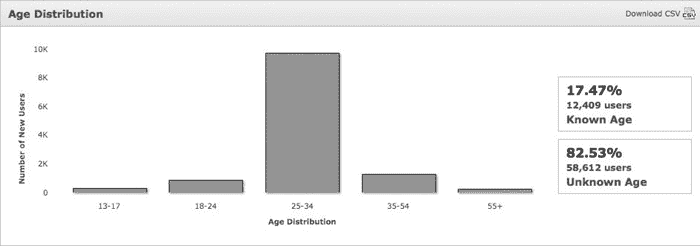
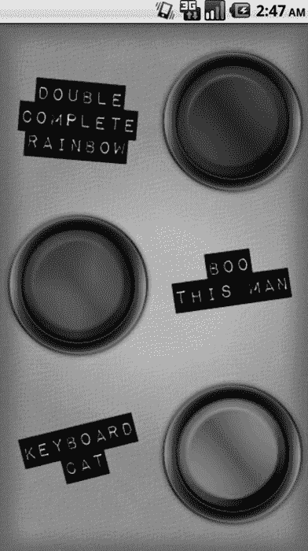
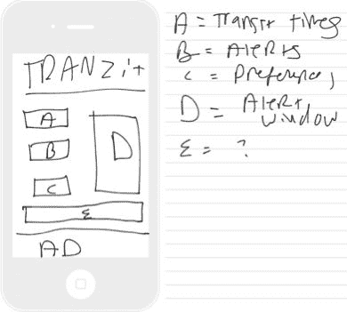
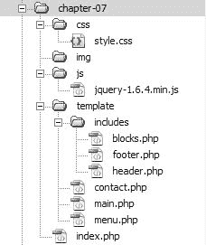

## 第四章

## 应用程序的基本规划和结构

到目前为止，我们已经让您直接开始编写一些应用程序，给了您一些关于屏幕分辨率、JavaScript 和 CSS 的背景信息，并且我们给了您一大包免费(而且便宜)的“东西”，以各种资源的形式供您在开发时使用。有了这些信息，你就不难完全疯狂地编写各种各样的好东西，并把它们公之于众。唯一的问题是，如果你不真正考虑你在构建什么，这个世界可能不会太热衷于实际使用你已经构建的东西。没有什么比在一个只有你(也许还有几个朋友)会看到的项目上花费大量时间更让人沮丧的了。

在这一章中，我们将以两种不同的方式来谈论应用程序开发:规划你的应用程序，这涉及到理解你正在构建什么，以及如何确保你不会忽略重要的部分；结构化你的代码，这是一个更简单的想法，但同样重要的原因我们将讨论。这是“将秩序带入混乱”的章节，我们希望你能注意到我们的警告和建议！

### 了解你的听众

如果你对创造东西有任何热情，那么你可能有过这样的经历:“我希望我有一个工具，它可以[在此插入机智的想法] …我知道，我只是要建造它！”此时，您很有可能出去为自己的使用一起做了一些东西，然后意识到其他人也可能对使用它感兴趣。我知道，每当我创建一个新的 web 或移动应用程序时，我总是这样做，为我自己的需要或有我这样需要的人而构建。也许这些人是你的观众。

或者也许你只是那些能看到别人看不到的问题的人之一。你知道，如果你把某样东西放在那里去解决某个问题，其他人会抓住不放，称赞你的名字。也许他们是你的观众。

或者最后，也许你是一个创新者，认为你已经进入了下一个伟大的游戏、服务或程序，人们会吵着要用。如果你付出一点努力(也许只是 50-100 个小时的编码)，你可以看到上瘾的大众的金钱符号在增加——他们当然是你的观众，对吗？

好吧，也许你的激情、独创性和创新就足够了，观众就会神奇地出现。但是让我们思考一下这个问题。在前面的每个例子中，你假设你的激情、问题和快乐会延伸到其他人身上，这是一个相当大的飞跃。如果你在一家公司，向其他人推销这些产品，第一个问题会是，“我们怎么知道我们有受众？”简单地回答“我会买”是不够的。你必须知道你的目标是谁，他们是否感兴趣。

#### 给人们想要的东西

有很多方法可以让你开始研究你的下一份申请。有时候，一个需求突然出现在你面前，或者你看到了一个明显的机会。其他时候，你可能认为某样东西会很受欢迎，但不知道它是否真的会受欢迎。虽然你可以在 Twitter 和脸书上寻找可以补救的抱怨，或者利用某种调查来了解你的观众想要什么，但我们将在这里介绍一个非常简单的方法，它符合一个普遍的规则:知道人们在寻找什么。下面的方法应该能让你了解人们是如何花时间上网的，从而让你知道你在哪里有机会。

我们从网络上流行的广告系统开始，谷歌的 Adwords。注册是免费的，即使你从来没有投放过一个广告，Adwords 提供的一个你可能会发现非常有用的工具是外部关键词工具(`[https://adwords.google.com/select/KeywordToolExternal](https://adwords.google.com/select/KeywordToolExternal)`)。这个工具告诉你有多少人在谷歌上搜索特定的关键词。这是一个很好的方法来看看人们是否真的对你想做的东西感兴趣。

例如，我考虑了一段时间的一个项目(从某种意义上说，实际上已经建立了)将是一个为有抱负的作家磨练技能的网站。我设想一个网站，在那里一个人可以得到一个主题，写一些散文形式(短篇小说，散文，诗歌等)。)并让其他人投票。题目的获胜者会得到一些“荣誉”,也许会赢得真正的奖励。

我怎么知道这个有没有市场？嗯，我可能会使用关键字工具来做一些简单的搜索，就像图 4–1 中的那些一样，搜索关键字“写作比赛”和“写作帮助”

**图 4–1。** *谷歌关键词搜索“写作大赛”和“写作帮助”*

人们应该记住，关键字搜索是为广告商设计的，所以对“营销 SEO 语言”这种不友好的混乱语言进行一点解读是很重要的。首先，我知道“写作竞赛”的流量(按谷歌每月搜索量计算)是“写作帮助”的 2.5 倍。这是有用的信息，因为它表明有更多的人寻求竞赛和认可，而不是对他们的作品的建设性评论。如果我的网站或应用程序将同时具备这两个元素，那么竞赛的角度可能会更好。然而，如果我不完全确定我的应用程序或网站会是什么，我可能会发现关键词创意列表([图 4–2](#fig_4_2))特别有用:

**图 4–2。** *上面为搜索词的部分关键词创意列表*

这里的“竞争”一栏可能有助于告诉我去哪里。根据 Google Adwords，你会看到“竞争”是指当人们搜索列出的关键词时，有多少其他广告商试图让他们的广告出现。对于“写作竞赛”(或者列表中更靠后的另一个项目，“免费帮助撰写商业计划”)，我会有激烈的竞争，但对于“论文写作竞赛”(或者另一个未显示的项目:“说服性写作竞赛”)竞争很少。

使用 Adwords 中的外部关键字工具，我不仅可以了解人们在搜索什么，还可以了解其他公司在做什么广告。这可以帮助你更好地了解你的产品是否有受众(通过使用你怀疑他们会在谷歌中使用的关键词)，以及是否已经有很多你要面对的替代品。虽然口碑广告对某些产品很有效，但你不应该低估搜索流量的力量！

#### 谁是我的用户？

假设你知道你的产品有受众，你现在必须弄清楚谁是你的用户。最近，在参加一个充满光明、年轻的未来 MBA 高管的课程时，我惊讶地发现，他们对“瞄准”或找到他们的利基用户并专门针对他们进行营销的想法感到恼火。他们对不向“每个人”营销的想法犹豫不决，没有意识到:a)“每个人”可能都不感兴趣，b)目标用户比一般的“每个人”更有动力实际使用你的产品。

了解你的用户最好的方法是研究你自己的产品(在其早期阶段)或者其他已经存在的产品或网站。如果你正在开发一个应用程序来跟踪通勤交通的到达和离开时间以及延误，也许可以看看竞争应用程序或服务的目标是谁。很有可能你的目标是同一个群体，所以花些时间和精力考虑这个群体对产品的需求是值得的。

让我们通过一个例子来讨论这个问题，这个例子是我前面提到的虚构的 transit 应用程序。确定受众可能很困难，您可能需要考虑不止一组人。忙碌的通勤者或商务旅行者似乎是一个合理的考虑群体。如果我想瞄准这个群体，我可能会问并回答几个问题，例如:

*   我的应用程序或网站中的哪些功能会吸引忙碌的人？
*   我的应用程序中的哪些功能、细微差别或程序会让快速移动的人慢下来？
*   我的应用程序有哪些对使用公共交通工具的人有用的功能？
*   我怎样才能方便地向忙碌的用户发出信号，告诉他们有重要的事情正在发生(例如，一辆晚点的公共汽车或火车)？
*   我的应用程序将如何使用？它会被用来计划一次旅行，还是在最后一刻改变路线？还是两者都有？

这个列表可以从这里开始，但是你得到了图片。通过开发一个假设的“用户”，并设身处地地为他/她着想，你可以更好地了解你需要做些什么来让他/她的生活更轻松。让它变得更容易，你将获得一个用户或客户！然后简单地对你的下一批人进行同样的研究，也许这次是“休闲旅行者”或“游客”

并不是所有的研究都必须在你的头脑中进行；资源的存在是为了挖掘你的潜在用户在说什么。或许看看你潜在竞争对手的评论，看看人们对这些应用程序的爱憎。您还可以查看用户组和论坛，甚至进行简单的 Twitter 搜索，以了解特定领域的“问题”。

正如我在前面几段提到的，您可能也已经准备好了这些信息。如果你过去开发过一个网站或应用程序，你可能用过 Google Analytics ( `[http://google.com/analytics](http://google.com/analytics)`)或 Flurry Analytics ( `[http://www.flurry.com](http://www.flurry.com)`)这样的产品。这些产品可以跟踪谁使用了您的应用程序，并为您提供宝贵的信息，您可以在以后使用这些信息来定义您的“用户”

例如，在我写的一个应用程序中，我有一个简单的表格，人们可以用它来告诉我更多关于他们自己的信息。从那里，我发现我的应用程序的平均用户年龄在 25 到 34 岁之间，如图 4–3 中的[所示。](#fig_4_3)

**图 4–3。** *申请的年龄分布*

这些信息在很多方面都很有用。首先，我可能会考虑这个团队会觉得重要的特性，并关注未来版本中的特性。或者，我可能会将小额广告预算从青少年转向 20 岁出头的市场，更多地关注 25 岁至 34 岁的人群，以吸引新用户。我对我的用户了解得越多，我就能更好地理解他们的需求，我的网站或应用程序就能更好地为他们服务。

不过需要注意的是:您可能注意到我的应用程序只有 17%的用户的已知信息。碰巧的是，我的应用程序中记录这些信息的部分可能对某些人口统计更有用，这可能会扭曲我的数据。在不深入讨论这个特定程序的情况下，最好注意不要依赖于一个来源，尤其是如果您只有少量数据，或者觉得您的样本可能有偏差。

一旦我从各种渠道获得了关于我的受众和用户的信息，我就可以制定一个计划。

### 有计划的

作为一个渴望游戏、建设和盈利的新开发者，规划很可能是最容易被忽视的事情。在这一节中，我们将讨论构建什么类型的应用程序，应用程序应该是什么样子，以及用户应该如何浏览它。通过从一开始就理解所有这些，我们可以保持我们的优先次序，并且在编码时，简单地实现我们已经解决的问题。让我们先来看看我们可以构建的不同类型的移动应用程序或界面。

#### 所有手机都不一样

这本书的标题包括“web 应用程序”这几个字，这本质上承认了还有其他种类的应用程序。让我们来谈谈移动界面或应用程序的三种类型。

##### 本机应用程序

如果你已经拥有或使用了一部安卓手机(如果你正在阅读这本书，我希望你已经拥有了)，你可能已经使用了手机上的一些应用程序。web 浏览器是这些应用程序中的一种，联系人应用程序是另一种，计算器应用程序又是另一种。这些 Android 应用程序通常使用 Java 编写，并使用称为 Android 软件开发工具包(SDK)的特殊工具进行编译。这些工具可以免费下载和使用，用来创建可以在 Android Marketplace 上发布的应用程序。

这些应用程序被称为“本地”应用程序，因为它们直接从电话上执行。用户有一个专用的图标，点击它打开应用程序(见[图 4–4](#fig_4_4))。这些应用程序可以轻松地在手机上存储数据，如果用户允许，还可以相互连接。通常，它们必须通过市场或出版商的网站下载和安装，但也可以通过在手机上下载和运行应用程序的 APK 包来“侧装”或安装在设备上。

**图 4–4。** *FAILboard Pro:原生安卓应用*

本地应用程序往往速度更快，因为应用程序的所有部分都存在于手机的内存中，而且它们还可以更深入地访问手机的硬件，这是网络浏览器所不具备的。出于同样的原因，本地应用程序会给最终用户带来风险；刚刚安装的应用程序可能真的是一个试图窃取信息的特洛伊木马，或者开发人员急于推出更新，没有注意他们正在做什么，留下了一个安全漏洞。这类似于 2011 年 Skype 发生的事情，当时有人发现用户名和密码以未加密的人类可读文本保存在用户的手机上，任何人都可以轻松检索。幸运的是，很快就有了解决问题的方法。对于开发人员来说，开发一个原生应用程序可能需要更多的时间，也可能需要更陡峭的学习曲线，尤其是如果开发人员已经精通 HTML、CSS、JavaScript 和其他 web 技术。

##### 移动网站

移动网站，或为移动设备优化的网站，通常在用户直接导航到该网站或常规网站后被用户浏览，常规网站将用户重定向到移动版本。这些仍然是网站，通常不会在用户的设备上存储数据或与之进行非常密切的互动。从本质上说，他们只是在那里做一个演示，并不是真的与你的用户进行激烈的互动。这通常是公司或网站改善移动用户体验的最基本的方法。移动网站允许你进行一些基本的操作，但是除了提供一些简单的文本页面和一两个表格之外，不与你交互。

正因为如此，这些网站缺乏桌面上的“完整功能”(即完整的网站)，也可能不是特别适合智能手机或平板电脑屏幕(例如，平板电脑可能会看到过大的版本，智能手机可能会看到过小的版本，这取决于网站针对的是哪种设备)。虽然开发人员可能喜欢这种方法，因为它的创建、更新和测试相当简单，但最终用户并不认为这些移动网站是应用程序。如果你的目标是构建一些交互性的东西或者被看作是一种工具，那么你可能会想要避免这种方法的简单性，而倾向于 Web 应用程序。

##### 网络应用

最后，我们将讨论前两种应用程序的联合，以及我们在本书中开发的应用程序的类型。Web 应用程序试图将本地应用程序的无缝性与来自移动网站的相对容易的编码和更新结合起来。例如，我们在本书中的早期应用程序(见第二章第一章和第三章第三章第三章)有用户可以轻松按下的按钮，就像图 4-4 所示的原生应用程序一样，但是存在于网络浏览器中。如果用户要创建应用程序的快捷方式(或者应用程序本身可以询问用户是否愿意创建一个快捷方式)，那么应用程序可以像本地应用程序一样拥有自己的图标。也有一些技术可以让 web 应用程序像本地应用程序一样将自己集成到操作系统中。

最好这样想:web 应用程序，就像普通的应用程序一样，是用来交互的，而不仅仅是浏览的。

##### 那我该造哪个呢？

现在，你可能在想你真正想去的方向。老实说，虽然这本书关注的是 web 应用程序的好处(因为它们通常比本地应用程序更容易编程，比移动网站功能更全，并且初学者也可以访问)，但您可能无法只使用一种解决方案。我们再次提到了解你的用户的想法。如果你的用户所在的区域总是有手机服务，那么也许一个网络应用程序会像本地应用程序一样有用。如果用户使用各种不同的设备(例如，Android、Windows Phone 或 iOS powered)，那么 web 应用程序可能是同时在这三个平台上运行的最简单的方法。

最后，你必须发展你的移动策略来适应你的用户。在本书的后面([第 13 章](13.html#ch13))，我们将告诉你如何“欺骗”一点，只需要很少甚至不需要工作就可以将一个 web 应用程序转换成一个本地应用程序(从而让你至少拥有一个 web 应用程序和一个 Android 本地应用程序)。

一旦你选择了如何构建你的移动战略，你就应该考虑避免直接投入并编写代码的冲动。一个好的开发人员会规划他或她的应用程序，无论是本地的、基于 web 的还是移动网站。这一步可以按照构建应用程序的思想进行分组，我们将在接下来讨论。

#### 构建您的应用程序

在这一节中，我们将讨论从头开始设计应用程序的过程。这采取三个步骤的形式，线框图或模型阶段，图形设计阶段，和代码构造阶段。先说设计。

##### 线框/实体模型

有了一个想法，然后立即开始编码，而不考虑最终产品会是什么样子，这是非常诱人的。这可能是个坏主意，原因有很多:

*   它可能会让你陷入一个最终看起来并不那么好的设计中(例如，它太杂乱了)。或者你可能意识到，如果你没有直接创建按钮和框，你的设计就不会有效率！
*   它可能会阻止你创新，因为你不“想”改变事物来增加新的特性。
*   它可能会阻止你征求反馈，直到项目结束，那时改变事情可能太费时间了。向用户展示你的设计，看看他们是否觉得直观，然后调整一个图形，比向他们展示一个应用程序，然后重新编码以使设计更好更容易。

为了防止这些事情，许多设计师创建他们的应用程序的线框图表或“模型”。例如，我们之前讨论过的一个非常粗糙的交通应用程序模型可能是这样的([Figure 4–5](#fig_4_5))。

**图 4–5。***tran zit 应用程序的原始模型*

正如我提到的，这是一个相当粗糙的模型；事实上，它甚至可能不是我最终拥有的设计的. 0001 版本。不过，在模仿它的过程中，我确实意识到了一些事情。我制作了运输时间、提醒和偏好的按钮；我为警报留出空间；我甚至在底部留出了一些空间做广告。然而，我还有另一个屏幕，标记为“E”，我不知道我可以用它来做什么。有了模型，我可以简单地删除和重画，以获得正确的。但是，如果我在现实生活中开发它，我可能会在那里留下一片空白，直到它接近 1.0 版本时才真正意识到这一点。

显然，你可以随意创建模型。[图 4–5](#fig_4_5)是用我平板电脑上的一个应用程序创建的，这个应用程序可以让我徒手绘制(你可能已经看出来了)。人们也可以在 web 编辑器中用实际的图像、按钮等等来设计一个模型(即使按钮实际上不会工作)。另一种选择是使用 PowerPoint 或 Keynote 等程序，在这些程序中很容易绘制方框、制作动画和创建许多类似的绘图。

##### HotGlooand 和其他模型工具

如果你正在寻找一个基于网络的工具来创建你的模型，那么你可能想看看 HotGloo。产品主页如[图 4–6](#fig_4_6)(`[http://www.hotgloo.com/](http://www.hotgloo.com/)`)所示。这个工具附带了一个月订阅，可能是我用过的最好也是最容易使用的线框工具之一。我用过的一些线框图工具只为你提供了基本的线框图，但是 HotGloo 允许你同时做很多视觉设计和线框图，节省你的时间。

你可能想考虑的其他产品包括 lucid chart([http://www.lucidchart.com](http://www.lucidchart.com))和 Pencil Project ( `[http://pencil.evolus.vn](http://pencil.evolus.vn)`)，它们可能会集成到你已经在使用的现有工具中，比如 Microsoft Visio。

**图 4–6。***hot gloo 网站，我们可以有把握地认为它是在 HotGloo* 被框住的

#### 用户移动:导航还是故事板

一旦你完成了你的线框，是时候坐下来把这些点连接起来，弄清楚你将如何在你的网站上构建内容，绘制出所有的页面和它们所属的部分。这个过程的这一部分被称为站点地图，如果你花时间去做的话，会非常容易和有趣。如果你的应用程序不是特别线性的(例如，也许是一个游戏)，你也可以把这看作是故事板。用最简单的话来说，就是以一种有组织、有逻辑的方式来布局内容。

创建地图时，最好尝试在相似的部分或组中保留相似的内容。这将使构建应用程序变得更加容易，因为您一眼就能看出应用程序中的哪些页面需要相互关联。在一个游戏的例子中，把这想象成以一种逻辑的方式呈现你的信息:把所有的“黄金”和你可以用它购买的东西放在一起，或者所有的“生命点”和影响它们的增强功能放在一起，等等。

看看下面的[图 4–7](#fig_4_7)可以更好地了解传统网站地图的样子。注意到它和我们在文法学校被迫做的那些家谱项目非常相似吗？嗯，这是非常相同的原则。站点的父页面(或部分)都有与该部分或类别相关联的子页面。

**图 4–7。** *演示应用程序的简单站点地图*

对于这个网站地图，我使用了一个图形设计工具来创建这本书的模型；但是每当我在做一个个人使用的项目时，或者当我坐下来和一个想快速看到一些东西的客户在一起时，我会在一张餐巾纸或一张笔记本纸上画出网站地图和线框。

尽你所能创建你的网站地图。不管它是如何创建的，重要的是你要坐下来，仔细考虑你的页面是如何组织的，以使你的构建和开发更容易。

任何开发人员都不想做的最后一件事就是完成一个项目的 80%,却不得不回去重新做一些事情，因为由于缺乏适当的规划而犯了一个错误！

既然我们知道了应用程序的外观和内容是如何组织的，我们就可以开始编码了。让我们用本章的最后几页来讨论如何最好地构建我们的开发环境以获得最大的生产率。

### 构建你的发展

有了这些高级信息，你还需要考虑一些实用的开发规则，让你在编写应用程序的时候保持有条理和高效。接下来，我们将讨论一些组织你的代码和保存它的目录的想法。

#### 代码结构

现在你已经完成了你的线框图，并且对你想让你的页面上的所有元素去哪里有了一个粗略的想法，是时候开始弄清楚你将如何组织你的代码，这样你就不会在构建你的应用程序时做更多的工作。

你现在可能正在挠头想，“这能有多难？我只是在一页纸上写文字。”你可能是对的。然而，假设您的应用程序中有十个不同的页面。您对 web 应用程序进行了更新，并意识到您的页脚有问题。

如果准备不充分，我们不幸的开发人员可能会在组成应用程序的十个不同的 HTML 页面中复制并粘贴同一个页脚。现在是时候更新代码了，我们虚构的开发人员必须用新的页脚信息更新十个不同的 HTML 文件。

正确构建这段代码的一个更简单的方法是获取页脚信息，它在整个站点中都是相同的，并为它创建一个单独的文件。然后，在您的代码中，您可以将该文件包含到您的页面模板中，并像以前一样在每个页面上显示它。如果您将来不得不更改代码，使用这种方法，您只需在一个文件中更改代码，这会让您的工作变得更加轻松。

让我们看看下面的例子。在[清单 4–1](#list_4_1)中，我们有一个非常稀疏的页面，它使用 PHP 来获取我们希望在每个页面上都有的额外页面代码。

**清单 4–1。** *使用 PHP 包含语句，我们将拉进额外的代码，以包括在我们的页面*

`<!DOCTYPE HTML>
<html>
<head>
<meta charset="utf-8">
<title>Super Cool Web Application</title>
</head>
<body>
<header>Super Awesome Header</header>
<article>
<header>Article Header</header>

Fusce luctus accumsan odio. Cras vel sodales mi. Suspendisse et arcu quis magna
feugiat ultrices sit amet non erat. Etiam malesuada dui venenatis eros gravida aliquet.
Aliquam erat volutpat. Nullam dapibus cursus ultricies. Suspendisse congue accumsan
purus non scelerisque. Phasellus ut sapien libero, vel luctus velit.

</article>

<!-- This is where we use PHP to include another file into our document -->
<?php include('footer.php'); ?>

</body>
</html>`

如果你看清单的底部，你会注意到我正在拉进页面`footer.php`(见[清单 4–2](#list_4_2))。我是通过将我的`include`函数包装在`<?php ?>`标签中来做到这一点的。这告诉您的页面执行 PHP 代码(如果您的服务器支持的话),并在这段代码中查找与前面列出的文档位于相同相对路径的页脚文档。如果您使用的是我们在本书前面讨论过的统一服务器本地开发服务器，那么这应该非常有用。否则我们可能需要指定一个相对路径；例如，如果我将我所有的“包含”文件放在一个名为“includes”的目录中，我的代码可能是:`include('includes/footer.php')`。我们一会儿将讨论目录结构，所以一旦你在这里完成了，你将知道相对路径看起来如何到你的文件。

现在我们知道了使用 PHP 在文档中包含一个文件是什么样子，我们将看看这个 PHP 文件的内部结构是什么样子，这样您就可以看到以一种简单的、可重用的方式来构造您的代码是多么简单。

**清单 4–2。**footer.php 档案里面的*一看*

`<footer>
<ul>
<li><a href="#">Home</a></li>
<li><a href="#">About</a></li>
<li><a href="#">Contact</a></li>
<li><a href="#">Privacy Policy</a></li>
<li><a href="#">Terms and Conditions</a></li>
</ul>

&copy; 2011 Super Awesome Site, Inc. All rights reserved.

</footer>`

正如您在这里看到的，本文档中的代码非常简单。我们有一个浮动在文档右边的无序列表和一些浮动在文档左边的版权文本。我们将想象在远处的某个地方有一个为这个文档创建的样式表，它使一切都变得很漂亮。

PHP 最酷的地方在于它运行在服务器上，而不是客户端。这意味着你在 HTML 文档中包含的 PHP 代码(无论这是指将其他文档包含到你的模板中，还是自定义创建的类、函数等。)将永远对客户端可见。当客户端加载页面并查看源代码时，他或她看到的只是一个无缝的 HTML 文档(参见[清单 4–3](#list_4_3))。

**清单 4–3。** *在浏览器中查看我们的人造文章会显示一个完整的 HTML 文档，没有服务器端 PHP 代码*

`<!DOCTYPE HTML>
<html>
<head>
<meta charset="utf-8">
<title>Super Cool Web Application</title>
</head>
<body>
<header>Super Awesome Header</header>
<article>
<header>Article Header</header>

Fusce luctus accumsan odio. Cras vel sodales mi. Suspendisse et arcu quis magna
feugiat ultrices sit amet non erat. Etiam malesuada dui venenatis eros gravida aliquet.
Aliquam erat volutpat. Nullam dapibus cursus ultricies. Suspendisse congue accumsan
purus non scelerisque. Phasellus ut sapien libero, vel luctus velit.

</article>

<!-- This is where we use PHP to include another file into our document -->
<footer>
<ul>
<li><a href="#">Home</a></li>
<li><a href="#">About</a></li>
<li><a href="#">Contact</a></li>
<li><a href="#">Privacy Policy</a></li>
<li><a href="#">Terms and Conditions</a></li>
</ul>

&copy; 2011 Super Awesome Site, Inc. All rights reserved.

</footer>

</body>
</html>`

#### 文件夹结构

在前一个例子中，我们讨论了将文件分割成小的结构，使它们更易于管理。对于更多的文件，您可能还想创建目录来存储按功能分组的特定文件。

在[图 4–8](#fig_4_8)中，我为一个虚拟应用程序创建了一个模拟文件夹结构。就像在你的文档中分离你的代码一样，整齐地安排你的文件夹结构也是一个很好的实践，这样你就可以在你的应用程序的整个开发过程中很容易地找到你需要的文件。

**图 4–8。** *在 Adobe Dreamweaver CS5.5* 的文件浏览器中看到的组织整齐的模拟文件夹结构

这里我们坚持一个非常基本的结构，其中所有的资源目录(比如我们的`css`、`img`和`js`文件夹)都在站点的文档根文件夹中，并且有一个`template`文件夹将保存我们的 web 应用程序的不同页面的模板代码。

在 template 文件夹中有一个 includes 文件夹，我们将使用它来存放在整个应用程序中使用的文档，例如页眉或页脚的标记代码，甚至可能是一些随机的内容块。参考我们在上一节中关于相对路径的例子，在[图 4–8](#fig_4_8)中的`index.php`文件中的包含行将引用页脚文件为`include('template/includes/footer.php')`。这不仅保持了事物的分离，也具有逻辑意义。页脚是模板的一部分，它包含在几乎所有内容中，因此它位于模板目录中的 includes 目录中。

现在，当需要开发我们的应用程序或在未来进行更新时，我们不必试图记住所有代码的位置，因为我们可以很容易地从逻辑上一眼就找到它。

如果我们想编辑联系页面上的信息，我们只需编辑位于`/template/contact.php`的模板文件。如果我们发现头文件有问题，我们可以很容易地跳到`/template/includes/header.php`中，对我们心中的内容做任何我们需要的更改，然后让这些更改在整个应用程序中得到反映。

### 总结

希望现在你已经到了另一个章节的结尾，在实际编码开始之前，你对创建一个 web 应用程序，甚至是一个 web 站点的思维过程和工作有了更好的了解。如果你在一家代理公司或工作室工作，或者其他以开发人员为中心的企业，那么你可能会在一个团队中，每个人负责自己的任务，并在交给你作为开发人员之前负责计划的不同部分。(在测试团队、开发里程碑、构建等方面，您可能还有更多。然而，如果你是为自己工作，你现在知道该怎么做才能让你的生活变得更容易忍受，让你的工作量变得更整洁。