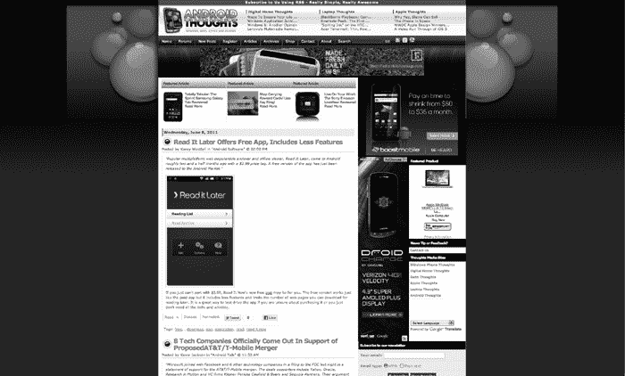
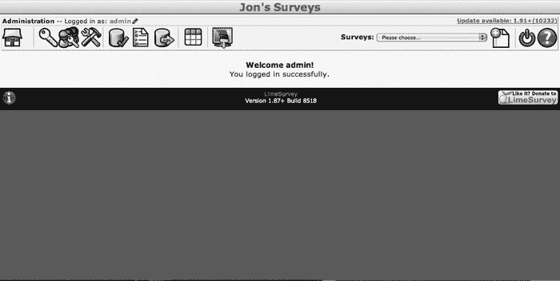
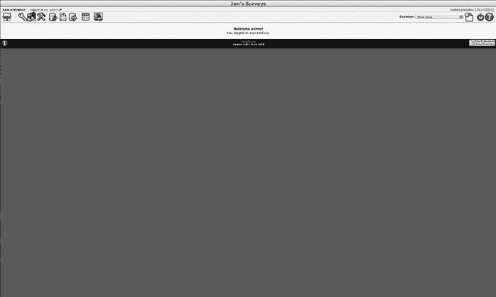
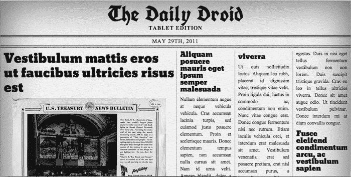
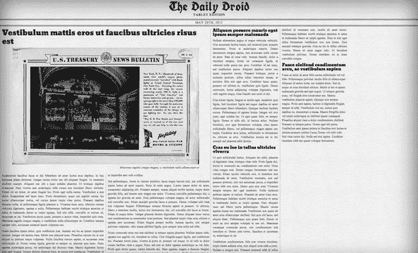
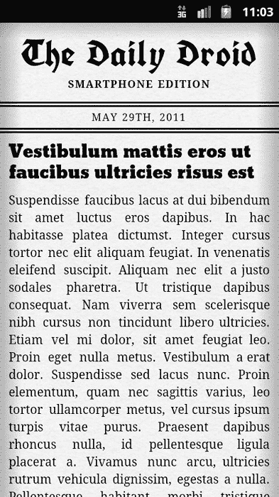
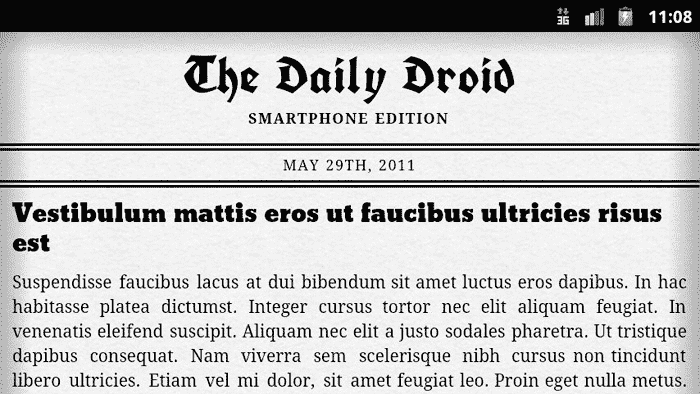
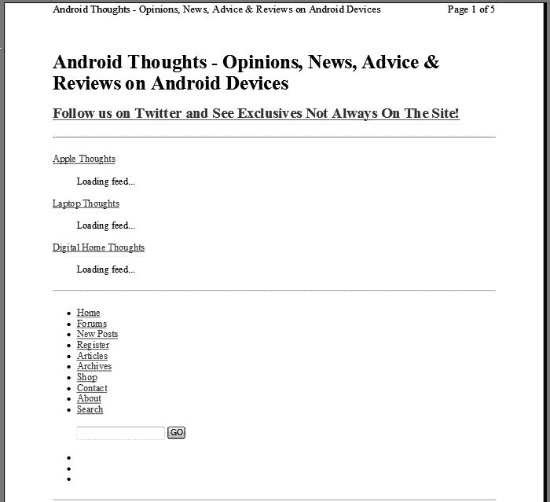

# 五、使用 CSS 3 处理多个屏幕分辨率

设计网站时最难处理的事情之一是你可能会遇到无数不同的用户配置。现代 web 浏览器和操作系统是高度可配置的，不同的选项会影响您的 web 应用的查看方式。在这一章中，我们将专门讨论屏幕分辨率——或者屏幕上的像素数量——以及如何使用 CSS 3 适应不同的分辨率设置。

### 眼睛疲劳和分辨率进化的历史

如果你曾经在深夜使用电脑，也许是在一整天的工作之后，你可能会发现一个有用的技巧:你可以改变屏幕上对象的大小，使你的眼睛更容易阅读它们。这通常包括更改计算机的显示分辨率。分辨率就是屏幕显示的像素数量，由两个数字表示，第一个是像素宽度，第二个是像素高度(即高度)。通过改变分辨率，最常见的是将其从较高的分辨率，如 2560 × 1600(顺便提一下，我在晚上 7 点输入本文时使用的分辨率)缩小到较低的分辨率(可能是 1600×1200——一个不错的 11 点分辨率),您会带走单个像素，这意味着您屏幕上的项目会显得更大。

20 世纪 90 年代末，随着越来越多的人开始上网冲浪，标准分辨率被称为 VGA(视频图形阵列)，通常设置为 640 × 480。随着时间的推移，显示器变得更大、更便宜、更高效，大多数用户都采用了 SVGA(老实说，S 代表超级!)!)，在 800 × 600。这让位于 1024 × 768 和更大的 XGA(扩展图形阵列——谢天谢地不是 Xtreme)。今天我的显示器显示的是前面提到的 2560 × 1600 的 WQHD(宽四高清)。

你可以想象，自从 640 × 480 不再流行以来，网页设计师们已经为屏幕分辨率奋斗了很多年。他们最终分成了两个阵营——一派支持为一种分辨率设计(“固定宽度”)，另一派支持为多种分辨率设计(“灵活宽度”)。固定宽度的人认为，最好的网页设计是你绝对确信所有用户看到的你的网站尽可能接近你设计的方式。这意味着选择一个分辨率，比如 1024 × 768，并设计你的页面来利用这个空间(见[Figure 5–1](#fig_5_1))。如果用户有一个更大的分辨率设置，你的页面会在两侧有额外的空间，但是表格和位置会保持在你想要的位置，在你的 1024 像素宽度内(见[图 5–2](#fig_5_2))。如果用户的分辨率非常小，那么你的内容将会占据屏幕的大部分空间，他们将会被迫使用非常可怕的水平滚动条。

**图 5–1。** *分辨率为 1024 × 600 的固定宽度网页示例*

**图 5–2。***2048×1536 分辨率的同一页面。注意两边的宽黑条*

相比之下，灵活宽度的布局将试图适应所有尺寸的分辨率(参见[图 5–3](#fig_5_3)和[5–4](#fig_5_4))。

**图 5–3。***1024×600 分辨率的可变宽度网页示例*

**图 5–4。** *同一页 2048 × 1536 分辨率*

现在，你可能已经开始看着你的智能手机或平板电脑，心想，“嗯……想知道这个东西的分辨率是多少？”你猜怎么着这也是大多数手机网页设计者想知道的。目前，随着 Android 每天激活大约 350，000 个新设备，设计人员和开发人员都意识到他们需要对 web 应用开发方法进行重大改变，以便与我们每天用来浏览 web 的大量设备保持联系。如果你喜欢固定宽度的方法，这是一个很难玩的游戏:我为什么分辨率构建我的移动应用？有一些简单的答案(“好吧，大多数人都有 iPhones，我只是为它而建”)，但它们也有自己的缺点(“什么？！？他们做了一个更大的 iPhone，叫做 iPad…呃哦…”)。通过瞄准特定的设备，你也容易惹恼除了你的目标之外的任何设备的用户。

在这一章中，我们将为您提供一点“屏幕分辨率”也就是说，我们将尝试通过讨论您的移动 web 应用如何能够真正智能地理解用户正在使用的设备的分辨率，甚至方向，并自动适应它来解决这个问题。这就好像你将编码一个小大脑，说“嗯，这个设备有很大的宽度；让我们展示我们能展示的一切”或者“哦，不；这是一个小屏幕。我们不能并排显示这些信息！”作为一名设计师，我们可以利用小大脑，让它变得更加智能，让它以各种不同的方式向不同的设备显示相同的内容，进而向不同的用户显示。让我们从一个例子开始。

### 日常机器人

想象一下，你已经决定开始为 Android 用户发行一份日报，并且想出了一个很棒的标题:每日机器人。唯一的问题是，你们有些用户用的是一个摩托罗拉 Xoom，分辨率 2048×1536；有的在用三星 Galaxy Tab(1024×600 分辨率)；还有一些人使用 Roccwest XTreme，出于某种奇怪的原因，它的分辨率为 1280 × 800。如果你的目标是这些设备中的一个，那么使用固定的宽度，另外两个看起来就不太对了。令人欣慰的是，我们可以编写一个在三种情况下看起来都不错的页面——参见[图 5–5](#fig_5_5)到[5–7](#fig_5_7):

**图 5–5。***1024×600 分辨率的日常机器人*

**图 5–6。**T3【每日机器人】1280 × 800 分辨率

**图 5–7。** *每日机器人 2048 × 1536 分辨率*

将这些数字放在一起比较可能会非常令人惊讶——内容完全相同，但布局发生了相当明显的变化。更令人惊奇的是，这个是同一个页面——我们的开发人员能够创建它一次，并让它足够智能地对这三种不同的分辨率 [1](#CHP-5-FN-1) 做出适当的反应。

但是我们没有平板的朋友怎么办？嗯，只要做一点点工作，我们也可以用日常的 Droid 智能手机版来容纳它们，如图[图 5–8](#fig_5_8)(纵向)和[图 5–9](#fig_5_9)(横向)所示。

**图 5–8。** *每日机器人 480 × 859 分辨率*

__________

在这种情况下，开发人员(Rocco)不知道编写叙述的人(Jon)会选择什么分辨率，但页面看起来仍然很棒。

**图 5–9。**T3【每日机器人】859 × 480 分辨率

让我们来看看 Daily Droid 背后的代码，了解页面是如何构建的，以及我们如何确定它应该显示“智能手机”还是“平板电脑”版本。我们将在下一节讨论 HTML，然后在下一节讨论 CSS。通读下面的代码，根据注释，您应该对每个部分的功能有所了解。

#### 每日机器人的基本 HTML 代码

我们已经把 HTML it 分成了几个部分，所以你可以在可管理的片段中浏览它。在第一部分，如[清单 5–1](#list_5_1)所示，我们创建了初始的 HTML 布局并指定了两个不同的标题。

**清单 5–1。** *每日机器人的 HTML 代码第 1 部分*

`<!DOCTYPE HTML>
<html>
<head>
<meta http-equiv="Content-Type" content="text/html; charset=utf-8">
<meta charset="utf-8">
<title>The Daily Droid</title>
<meta name="description" content="An Android Responsive Web Design Demonstration.">
<meta name="author" content="Rocco Augusto">

<!-- Here we set the viewport so the device knows that this page is not one that can
scale/zoom -->
<meta name="viewport" content="width=device-width; initial-scale=1.0; maximum-scale=1.0;
user-scalable=0;" />
<link href="style.css" rel="stylesheet" type="text/css" >

<!-- Here we pull in two fonts from the Google Font API database -->
<link href="http://fonts.googleapis.com/css?family=UnifrakturCook:bold" rel="stylesheet"
type="text/css">
<link href='http://fonts.googleapis.com/css?family=Bevan' rel='stylesheet' type='text/css'>` `</head>

<!--
    HEADER
    We are adding two different sub headings (h6) to this page.
    One heading will be for the "Smartphone Edition" of the
    page and the second will be for the "Tablet Edition"
    of the page. Both pages are the same but depending on
    the screen size the pages CSS will tell the browser which
    subheading to display.
-->
<header id="mast">
    <hgroup>
        <h1>The Daily Droid</h1>
        <h6>Smartphone Edition</h6>
        <h6>Tablet Edition</h6>
    </hgroup>
    <time datetime="2011-05–29">May 29th, 2011</time>
</header><!-- /HEADER -->`

从[清单 5–1](#list_5_1)中的代码可以看出，智能手机版和平板电脑版文本都出现在 HTML 中。CSS(在本节后面的“每日 Droid CSS”中讨论)将选择正确的一个来显示。在 HTML 的第二部分，如[清单 5–2](#list_5_2)所示，我们将布局内容和文章空间，然后完成 HTML 结构。

**清单 5–2。** *每日机器人的 HTML 代码，第二部分*

`<section id="content">
    <!--
        SECTION: FEATURED ARTICLES
        The featured article would be the main article on the page
        that will be featured. Think of it in this sense as the
        front page story on a newspaper - which makes sense since
        this demo's completed code would be a mock vintage newspaper
        layout.

        The article contains several sections. You have the header
        section which contains the title of the article as well as
        a "figure" or image that would be displayed with the article
        and any caption text that would go along with it.
   -->
  <section id="featured">
      <article>
          <header>
          <h1>Title goes here...</h1>
               <figure>
                  
                  <figcaption>Figure caption...</figcaption>
              </figure>
         </header>
         

              
Article content goes here...

          

      </article><!-- /ARTICLE -->
  </section><!-- /SECTION: FEATURED ARTICLES -->

  <!--
      SECTION: REGULAR ARTICLES` `      The regular articles on this page will be housed in this
      section of the document. The markup of this section is
      exactly the same as the featured articles section. The only
      difference will come down to how they are displayed based
      off their assigned styles.
   -->
  <section id="regular">
      <article>
          <header>
              <h2>Title...</h2>
          </header>
          

              
Body Content...

         

     </article><!-- /ARTICLE-->
  </section><!-- /SECTION: REGULAR ARTICLES -->

</section><!-- /SECTION: CONTENT -->
<body>
</body>
</html>`

现在让我们转向 CSS 和日常 Droid 的视觉呈现。

#### 每日机器人的半魔法 CSS 代码

下面是用来设置日常 Droid 整体外观的 CSS 样式表。如您所知，CSS 将采用上一节中解释的普通 HTML 结构，并按照我们的指定对标签应用各种样式。我们将 CSS 分成几个部分来帮助解释它的作用。第一部分，如[清单 5–3](#list_5_3)所示，设置正文和一些标题的外观。

**清单 5–3。** *每日机器人的 CSS 代码，第 1 部分*

`/*
    CSS reset code only for the elements that will be
    used in our code. We could use a more robust CSS reset
    solution, but I am a firm believer that you should not
    riddle your stylesheet with code that you have no
    intention of using in your markup.
*/
html, body, h1, h2, h6, p, article, figure, figcaption header, hgroup, section {
    padding:0;
    margin:0;
}
/*
    General global styles to be used throughout the demo
*/
html, body {
    width:100%;
    overflow-x:hidden;
}
body {
    font-size:14px;
    font-family:"Times New Roman", Times, serif;
    line-height:20px;` `    background:url(bg.png);
    -webkit-box-shadow: inset 0 -5px 300px rgba(153,99,38,1); /* This inset box-shadow
adds gives the page a nice vintage feel to it */
    box-shadow: inset 0 -5px 300px rgba(153,99,38,1);
}
h1, h2 {
    font-weight:normal;
}
h1 {
    font-size:36px;
    line-height:42px;
}
h2 {
    font-size:20px;
}
h6 {
    font-size:16px;
    text-transform:uppercase;
}
p {
    margin:10px 0;
}
/*
    Header/Mast CSS code
*/
#mast {
    padding:20px 0 00;
    text-align:center;
    letter-spacing:1px;
}
#mast h1 {
    font-family:'UnifrakturCook', Georgia, "Times New Roman", Times, serif;
    font-size:62px;
    line-height:48px;
}`

现在我们已经有了一些 CSS，是时候看看在“平板电脑”和“智能手机”版本之间切换的代码了。默认情况下，我们希望显示 Tablet Edition，因此代码如清单 5–4 所示:

**清单 5–4。** *每日机器人的 CSS 代码，第二部分*

`#mast h6 {
    display:none; /* hiding both of the pages subheaders */
}
#mast h6:nth-child(3) {
    display:block; /* displaying the "Tablet Edition" subheader by default */
}
#mast time {
    display:block;
    margin:10px 0;
    border-top:double 6px #000;
    border-bottom:double 6px #000;
    text-transform:uppercase;
    font-size:16px;
    line-height:24px;
}
/*` `Article/Content styles.
  This section will rely heavily on two new features
  of CSS3: Flexible Box Model and Columns.

  The Flexible Box Model is probably one of my favorite
  new features of CSS3\. In a nutshell, it allows one to
  take control of how their page is laid out, using a grid
  of flexible boxes and essentially eliminating the need to
  hack together layouts by improperly using floats in one’s
  code.

  CSS3 Columns are another time saving new feature of CSS3
  and allow a designer/developer to take a block of code
  and automatically convert it into a column based layout
  that is just perfect for a newspaper demonstration.
*/
#content {
    padding:0 10px;
    display:-webkit-box; /* here we are using the -webkit-box argument instead of
        plain old "box," so our code will work across newer and
        older Android browsers*'
    */
    -webkit-box-orient: horizontal; /* setting the box orientation to horizontal
        displays the content in this container from
        left to right instead displaying the content
        in the traditional way of top to bottom */
}
#featured {
    max-width:50%; /* our featured article will take up half the width of the display */
    height:100%; /* our featured article will take up all of the available height of the
display */
    box-flex:1; /* tell our child elements to be evenly sized and take up one "box"
space */
    -webkit-box-flex:1;
}
#featured .entry {
    -webkit-column-count: 2; /* this will display our featured content article text in 2
columns */
    -webkit-column-gap: 20px; /* here we add a hearty 20px gap/spacing between our
columns */
    -webkit-column-rule: 1px solid rgba(91,58,21,0.5); /* here we are adding a border to
our columns */
}
#regular {
    margin-left:5px;
    padding-left:10px;
    max-width:49%;
    box-flex:1;
    -webkit-box-flex:1;
    -webkit-column-count: 3;
    -webkit-column-gap: 20px;
    -webkit-column-rule: 1px solid rgba(91,58,21,0.5);
    border-left: 1px solid rgba(91,58,21,0.5);    /* here we are adding a border to the
#regular container to match the rest of the columns' borders */
}
#regular article {` `    display:inline; /* displaying our articles inline prevents our articles from
stacking on top of each other */
}
article h1, article h2 {
    margin-bottom:10px;
    font-family:Bevan, "Times New Roman", Times, serif;
}
article .entry {
    text-align:justify; /* to give the page a more realistic feel we will justify the
column text */
}
article figure {
    width:90%;
    padding:0;
    margin:10px auto 20px auto;
}
articlefigcaption {
    font-style:italic;
    text-align:right;
}`

现在我们将设置智能手机代码(在[清单 5–5](#list_5_5)中)并相应地调整布局。

**清单 5–5。** *每日机器人的 CSS 代码，第 3 部分*

`/*
    Android Smartphone Devices
    Here we will use CSS3 media queries to determine
    the resolution of our screen and present the user with
    a completely different layout if their viewing
    does not meet certain requirements.

    Here we are targeting smartphone devices that will,
    on average, have a width of 320px (portrait) and up
    to 569px (landscape).

    This layout will display the content in a more
    commonly used smartphone style layout, presenting the
    user with a list of articles that they can scroll up
    and down to view.
*/
@media screen and (min-width: 320px) and (max-width: 569px) {
    body {
        -webkit-box-shadow: inset 0 -5px 50px rgba(153,99,38,1); /* lessen the shadow on
the page to adjust to the screen's new dimensions */
        box-shadow: inset 0 -5px 50px rgba(153,99,38,1);
    }
    h1 {
        font-size:20px;  /* lower the size of the header font to accommodate the smaller
screen resolution */
        line-height:24px;
    }
    h6 {
        font-size:12px; /* same as the h1 above it */
    }
    #mast h1 {
        font-family:'UnifrakturCook', Georgia, "Times New Roman", Times, serif;
        font-size:42px;` `        line-height:42px;
    }
    #mast h6:nth-child(2) {
        display:block; /* since we are dealing with a smaller screen we will show the
"Smartphone Edition" subheader */
    }
    #mast h6:nth-child(3) {
        display:none; /* and hide the "Tablet Edition" subheader */
    }
    #mast time {
        font-size:12px;
        line-height:24px;
    }
    section#content {
        -webkit-box-orient: vertical; /* here we are telling this content to display
vertically instead of horizontally */
        padding-bottom:15px;
    }
    #featured {
        max-width:100%; /* take up the entire width of the screen instead of half of it
*/
    }
    #featured .entry {
        -webkit-column-count: 1; /* only display our text in a single column, which is
more appropriate for our screen real estate */
        -webkit-column-gap: 0; /* remove the 20px padding around columns */
        -webkit-column-rule: none; /* remove the border off our columns */
    }
    #regular {
        margin-left:0px;
        padding-left:0px;
        max-width:100%; /* like our featured article we will now take up the entire
width of the page */
        -webkit-column-count: 1; /* like our featured article we will display a single
column of text */
        -webkit-column-gap: 0;
        -webkit-column-rule: none;
        border-left: none;
    }
    #regular article {
        display:block; /* display our articles as blocks so they appear vertical */
    }
    article .entry p, article figure {
        display:none; /* hide all of our article content so the user is not stuck
scrolling into oblivion */
    }
    article .entry p:first-child {
        display:block; /* display only the first paragraph of an article for the user */
    }
    article {
        margin-bottom:10px;
        border-bottom:2px solid rgba(0,0,0,1);
    }
}`

对于一份简单的报纸来说，这是很多代码；然而，它的美妙之处在于它的多功能性:一个 HTML 页面和一个 CSS 页面来管理所有设备——手机、平板电脑、Android 媒体播放器，以及其他任何有人安装 Android 的设备！让我们花一点时间，通过媒体提问来讨论这种神奇是如何发生的。

### 媒体查询

当您查看前面的代码时，您可能注意到的第一件事是，编程的非常流畅的老式报纸布局只包含两个相对较小的代码文件。五到七年前，在一个 web 开发人员必须戴着两顶不同的帽子(web developer hat 和 Internet Explorer 6 hacker hat)的地方，创建这样一个布局会是一个非常麻烦的任务，很可能包含两个(如果不是更多的话)完全不同的布局。每个布局都必须有自己的一组 HTML 和 CSS 文件，由一些后端服务器代码显示给客户端，这些代码查找设备的用户代理字符串。移动设备将被提供专门为移动设备设计的 HTML 和 CSS 模板。台式计算机将被提供等同于桌面的模板。代码版本之间没有融合或流动性。

快进到未来几年——我们正处于 HTML5 和 CSS3 的黎明——前景完全不同。目前，在我们生活的世界里，桌面互联网浏览器的开发和发布速度比大多数用户安装最新更新的速度还要快。在移动领域，它几乎同样进步，智能手机操作系统的新版本，以及相应的互联网浏览器的新功能丰富版本，每六到十二个月发布一次，如果不是更早的话！

这对你，移动Web 开发者来说意味着你不会停留在过去，为十年前的浏览器编码。作为一个以 Android 用户体验为目标的开发者，你最多只需要担心过去一年半的 Android 版本的开发。专注于新设备而不必担心过多关注过去的技术会妨碍用户的体验，这种能力给开发人员带来了我们以前没有的自由。随着自由而来的是创新，随着创新而来的是更好的技术和功能，如 CSS3 媒体查询，这种技术让我们能够创建我们之前构建的美丽的“The Daily Droid”演示。

自 HTML4 时代以来，媒体查询已经以某种形式成为 web 开发的一部分。在字体标签和嵌套表格的黑暗时代，媒体类型通过控制与用户用来查看内容的媒体相关的样式和样式表而声名大噪(见图 5-10 和图 5-11)。例如，开发人员将为“打印”媒体类型分配一些样式，以从博客上的打印文章中删除所有广告，这样用户在尝试打印博客内容时就不会不必要地耗尽昂贵的墨水(参见[清单 5–6](#list_5_6))。

**清单 5–6。** *媒体查询示例 1:基于媒体类型隐藏或显示块*

`

` 

**图 5–10。** *在普通桌面网络浏览器中查看的 Android 思想主页*

**图 5–11。** *打印时查看同样的安卓思想网页*

开发人员还可以为“投影”媒体类型分配样式或样式表，以解决在会议室的投影仪上观看项目时网站标题中褪色的颜色(参见[清单 5–7](#list_5_7))。

**清单 5–7。** *媒体查询示例 2:根据媒体类型更改背景颜色*

`

`

然而，随着 CSS3 的出现，媒体类型的概念已经演变成更加漂亮和灵活的东西，这使得级联样式表能够不仅仅是一种为 web 文档和标记添加样式的“愚蠢”机制。当使用媒体查询时，感觉它们从一开始就应该是 CSS 的一部分。我听到我的一些朋友把媒体查询称为“自由”，甚至听到我认识的一个开发人员——当然，在一个漫长的编码夜之后——把媒体查询简单地称为数字时代的新“黑魔法”。事实上，它们都不是。媒体查询作为一种工具，当掌握时，将使您作为开发人员的工作更容易，并且在一天结束时，将为您提供一个漂亮灵活的布局，立即转换为用户的查看媒体，就在您的眼前！

如果您过去使用过 JavaScript 或任何其他脚本或编程语言，那么媒体查询对您来说可能很容易学会。基本上，我们所做的是为样式表分配逻辑，这将让客户端的浏览器在将正确的模板样式分配给正确的查看设备时完成所有繁重的工作。以下是使用 CCS 媒体查询的一个非常基本的示例:

`<linkrel="stylesheet" media="screen and (orientation:portrait)" href="portrait.css" />`

在本例中，当浏览器从垂直位置的移动设备查看应用或网站时，我们告诉客户端的浏览器加载“portrait.css”样式表。 [2](#CHP-5-FN-2) 不限于向链接标签分配媒体查询。媒体查询也可以直接添加到你的设备的 CSS 文件中，就像我们在前面的例子“The Daily Droid”中看到的那样。事实上，当使用@import 规则调用 CSS 文件以获得正确显示时，甚至可以调用媒体查询，如下例所示:

``

在下面的例子中，我们将有几个@import 规则导入到许多不同的 CSS 文件中，用于不同的布局类型(参见[清单 5–8](#list_5_8))。

**清单 5–8***:媒体查询示例 3*

``

__________

2 如果手机从横向模式切换到纵向模式，带有传感器来检测移动的设备通常会告诉软件，允许您的网页根据您定义的风格自动重新格式化。

我完全知道你在想什么，“如果我必须编写我的 web 应用来匹配连接到 16×9 显示屏的电视或设备的 Google TV Android 设备，会怎么样？!"您不必担心，因为 CSS3 媒体查询的灵活性已经涵盖了您的需求，如下例所示:

`<link rel="stylesheet" media="all and (device-aspect-ratio: 16/9)" href="television.css"
/>`

从前面的例子中可以看出，在一个由 HTML5 和 CSS3 支持的设备和应用迅速主导的世界中，媒体查询是任何 web 开发人员的武器库中一个不可思议的工具。要了解更多关于媒体提问的力量，请点击这里查看 W3.org 网站— `[www.w3.org/TR/css3-mediaqueries/#media0](http://www.w3.org/TR/css3-mediaqueries/#media0).`

### 总结

在这一章中，我们已经讨论了很多关于你的网页的大小，以及这个大小是如何根据用来浏览内容的屏幕而变化的。现在我们已经解决了屏幕分辨率的问题，我们将放大一点，解决处理不同浏览器的最佳方式！