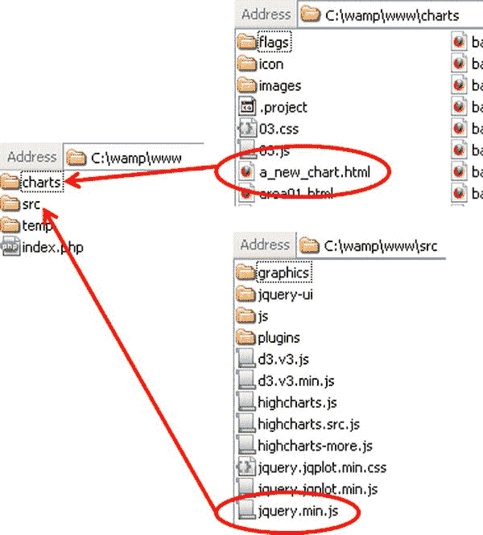
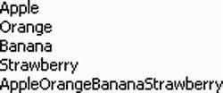
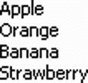
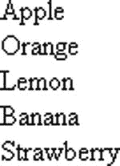
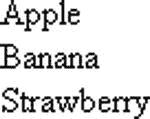
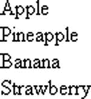
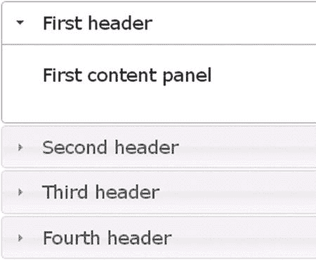
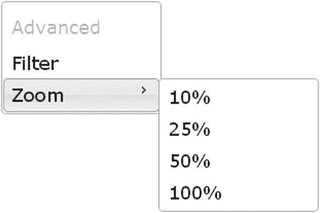

# 2.jQuery 基础知识

Abstract

在前一章中，您了解了 DOM 树，看到了 HTML 文档是如何由许多可以在初始上下文中创建、修改和删除的元素组成的。这些操作由浏览器通过 JavaScript 命令来执行，如前所述，这些命令可以在页面加载时执行，也可以作为后续事件的结果来执行。为此，开发了一个 JavaScript 库，它以一种简单且成熟的方式管理所有这些操作。这个库就是 jQuery，而且是完全开源的。它由 Jon Resig 于 2006 年创建，并由一个开发团队继续改进。与经典 JavaScript 相比，jQuery 非常有用，而且能够操作 DOM 元素，因此它是目前使用最广泛的 JavaScript 库，是所有 web 开发人员的参考点。

在前一章中，您了解了 DOM 树，看到了 HTML 文档是如何由许多可以在初始上下文中创建、修改和删除的元素组成的。这些操作由浏览器通过 JavaScript 命令来执行，如前所述，这些命令可以在页面加载时执行，也可以作为后续事件的结果来执行。为此，开发了一个 JavaScript 库，它以一种简单且成熟的方式管理所有这些操作。这个库就是 jQuery，而且是完全开源的。它由 Jon Resig 于 2006 年创建，并由一个开发团队继续改进。与经典 JavaScript 相比，jQuery 非常有用，而且能够操作 DOM 元素，因此它是目前使用最广泛的 JavaScript 库，是所有 web 开发人员的参考点。

任何计划在网页中包含 jQuery 库的开发人员都会很快发现伴随这个 UI 库的著名格言:“写得少，做得多。”本着这一口号的精神，jQuery 在 JavaScript 代码开发中引入了三个新概念——在使用 thisUI 库提供的方法时，您需要记住这些概念:

*   通过级联样式表(CSS)选择器选择要应用 jQuery 方法的 HTML 页面元素(选择)
*   构建 jQuery 方法链，在同一选择中按顺序应用
*   使用 jQuery 包装器进行隐式迭代

在本章中，在了解了如何在将要开发的网页中包含 jQuery 库之后，将介绍“选择”的概念。选择是 jQuery 库的基础，理解它们以及如何实现它们非常重要，因为它们将在整本书中讨论。通过一系列小示例并使用链接方法的技术，您将浏览 jQuery 库提供的一系列函数，这些函数允许您操作选择，以便创建、隐藏和更改各种 DOM 元素及其内容。在本章的最后一部分，我将介绍 jQuery 用户界面库(jQuery UI ),并举例说明一些最常见的小部件。您将了解它们的基本功能，并发现如何将它们整合到网页中。

本章的目的是提供一个 jQuery 的快速视图——它的功能和基本概念。对每种方法的详细描述超出了本书的范围。在本文的所有例子中，这些方法将根据上下文来解释。但是，您可能还想参考 jQuery 官方网站上的文档( [`http://jquery.com/`](http://jquery.com/) )。

## 包括 jQuery 库

现在，有两种方法可以将 jQuery 库包含在您的 web 页面中。

*   本地方法:在本地下载必要的库，然后添加到网页中。
*   CDN 方法:直接设置链接到提供这些 JavaScript 库的站点。

提供这些库的网站被称为内容交付网络(cdn)。CDN 是一个大型服务器系统，为最终用户提供高可用性和高性能的内容。当用户试图访问文件时，CDN 会选择离用户最近的服务器。最常用的 cdn 之一是谷歌托管图书馆。该服务为 web 应用程序提供了对许多最流行的开源 JavaScript 库(如 jQuery)的可靠访问。

要从此服务加载库，您需要复制以下 HTML 代码片段，并将其直接粘贴到您的网页中:

``

图 2-1。

An example of how a directory might be organized on a web server Note

有关如何在 web 服务器或 PC 上设置工作区以开发本书中的示例的详细信息，请参见附录 a。您还可以找到关于不同版本的库、如何下载它们以及如何将它们包含在工作区中的信息。

### 选择

选择是为了以某种方式操作而选择的一组 HTML 元素。实际上，这是 jQuery 背后的主要概念。让我们以清单 2-1 中的简单 HTML 页面为例:

清单 2-1。ch2_01a.html

`<HTML>`

`<HEAD>`

``

这三个元素中包含的所有文本都被赋给了变量 text。要查看其内容(在调试中非常有用)，可以使用函数`console.log()`，然后在 Google Chrome 上，直接右键点击页面选择 Inspect element(见图 [2-2](#Fig2) )。

图 2-2。

变量 text 包含三个< div >元素中的文本

根据您选择的频率，您也可以用`$()`调用这个函数，如清单 2-3 所示。我们将在本书提供的例子中使用这个选项。

清单 2-3。ch2_01b.html

``

相反，如果你只想选择三个元素中的一个，你可以通过给每个元素分配一个类名来区分它们，然后将选择器应用于所选元素的名称，而不是标签元素(清单 2-4)。

清单 2-4。ch2_01c.html

``

在这种情况下，变量 text 只包含第二个元素的文本，如图 [2-3](#Fig3) 所示。

图 2-3。

Google Chrome 浏览器中 Inspect 元素显示的文本变量的内容

一旦您理解了如何进行选择，您将会发现如何通过改变其内容或属性来操作任何元素。您甚至可以添加其他元素或从页面中删除一个元素。在这方面，由于 jQuery 提供了大量的方法，它为我们提供了必要的工具。

### 链接方法

jQuery 被设计成允许 jQuery 方法被链接。一旦选择了一个元素或一组元素，下一步就是对它应用一系列方法。这个序列可以用链接来写。

使用前面的例子(见清单 2-1)，假设您想用另一个短语替换第二个元素中的文本，并隐藏另外两个元素，使它们不再出现在网页中。为此，您将把“这是第二个文本”替换为一个新行，“这是一个新文本”，同时隐藏其他文本。图 [2-4](#Fig4) 显示了应用任何更改之前出现的内容。

图 2-4。

不使用 jQuery 方法链的网页显示的文本

现在，您应用以下方法链:

`$('div').hide().filter('.selected').text('This is a new text').show();`

这三个元素都包含在选择中，然后被隐藏。在您选择的选项中，只有类名为'`selected`'的元素及其内容会被替换为新文本。只有最后这些元素必须显示。因此，在这个命令链的末尾，结果将是

### 包装套件

当涉及到 jQuery 时，我们处理包装器集。在前面的例子中，有三个元素。您通常会选择包含几个元素的选项，但您永远不需要指定编程循环。这里，当您应用`hide()`方法来隐藏所有三个元素时，您没有使用`for`或`while`构造(即`$(‘div’).each(function() {}`)。因此，包装集可以被定义为一组可以进行任何操作的元素(选择)，就像它是单个项目一样。

## jQuery 和 DOM

jQuery 是一个主要在文档对象模型(DOM)上工作的库，并且总是引用它的所有特性。与 DOM 一样，jQuery 将每个 web 页面视为一个树形结构，其中每个标签(也称为元素)都是一个节点。这个树的根是文档，文档是包含 DOM 所有其他元素的元素。jQuery 提供了一组简化这种对象操作的方法，允许您为页面添加动态性。

### ready()方法

如果您想编写一个操纵 DOM 元素的 JavaScript 代码，那么在对 DOM 进行操作之前，需要加载 DOM。但是，您需要在浏览器完全加载所有资产之前进行操作。为此，jQuery 为您提供了`ready()`方法。这是一个自定义事件处理程序，绑定到文档对象的 DOM。`ready()`方法只有一个参数:一个包含代码的函数，这个函数应该在 DOM 加载之后、用户可以在浏览器中看到所有资源之前执行。

`$(document).ready( function() {`

`// we write the JavaScript code here.`

`});`

### 用选择遍历 DOM

您已经看到了如何选择一组 DOM 元素，使用特定的 CSS 选择器作为标识它们的参数传递。然而，jQuery 的潜力并不止于此；从 DOM 中的选择位置开始，可以遍历 DOM 以获得一组新的要操作的选择元素。jQuery 为我们提供了一组应用于选择的方法。

让我们以清单 2-5 中的简单 HTML 代码为例:

清单 2-5。ch2_03a.html

`<HTML>`

`<HEAD>`

``

图 2-5。

The alert dialog box shows the text contained within the elements of the selection

但是，通常您需要直接访问选择的特定值。例如，要直接访问当前选择的第二个元素，您可以编写

`var text = $('div:eq(1)').text();`

您已经将函数`eq()`用于您希望选择的元素的索引。现在，你只有这个文本:

同样，如果你想选择序列的第三个元素，你可以直接写

`var text = $('div:eq(2)').text();`

或者，如果您愿意，您可以进行遍历，使用`next()`方法将选择从一个元素移动到下一个元素:

`var text = $('div:eq(1)').next().text();`

然后，您会收到以下警告消息:

现在，让我们看一个例子，演示选择和 DOM 结构之间的区别。这有时会造成混乱。你必须记住,`eq()`方法产生了一种部分选择；`next()`、`prev()`、`parent()`、`children()`、`nextAll()`和`prevAll()`将选择移动到 DOM 上。

事实上，如果你写了这个链

`var text = $('div:eq(1)').prev().text();`

您不会得到任何东西，因为由`‘div:eq(1)’`选择的元素是列表中的第一个(但在选择中是第二个)。因此，如果您试图将选择移动到 DOM 中的前一个元素，您将什么也得不到。如果您想将选择转移到名为`‘fruits’`的父元素，您需要使用`parent()`方法:

`var text = $('div:eq(1)').parent().text();`

现在，您获得了父元素，它与选择的第一个元素相同。图 [2-6](#Fig6) 给出了结果。

图 2-6。

The alert dialog box shows the four fruits within the first element

你写了命令吗

`var text = $('div:eq(0)').text();`

你会得到同样的结果。

### 创建和插入新元素

到目前为止，您已经看到，通过在函数`jQuery()`或其别名`$()`中传递一个参数，您获得了在 DOM 中具有该标签或相同类名的所有项目的选择。现在，假设您将一个不在 HTML 页面中的标签作为参数传递。在这里，您刚刚创建了一个要添加到 DOM 的新项目。此外，该元素实际上是一个选择，因此可能会受到任何类型的操作，即使它尚未实际添加到网页中。通过在方法链的末尾添加一些特定的 jQuery 方法，您将决定在哪里插入新创建的元素。

例如，如前面的示例所示，通过编写代码片段

`$('
Lemon
').appendTo('div:eq(2)');`

您在水果列表中创建了一个新元素。然后，将它追加到选择的第三个元素(列表的第二个元素)之后。图 [2-7](#Fig7) 显示了应用更改后网页中的列表是如何显示的。

图 2-7。

The list can be increased dynamically, adding new elements

有许多方法可以指定在何处以及如何插入刚刚创建的元素:`prepend()`、`after()`、`before()`、`append()`、`appendTo()`、`prependTo()`、`insertAfter()`、`insertBefore()`、`wrap()`、`wrapAll()`、`wrapInner()`等等。

关于这些函数使用的更多细节，建议读者参考 jQuery 官方网站上的文档( [`http://jquery.com/`](http://jquery.com/) )。

### 移除、隐藏和替换元素

另一组非常有用的 jQuery 方法包括那些允许我们从页面(从 DOM)中消除静态元素或者至少隐藏它们的方法。有时，这些方法甚至可以用于用一个元素替换另一个元素。

要从列表中删除“橙色”水果，只需简单地写下

`$('div:eq(2)').remove();` 

如果你想隐藏它，你写

`$('div:eq(2)').hide();`

`...`

`$('div:eq(2)').show();`

然而，在这种情况下，在代码的后面，可能会再次显示“Orange”。

如果使用`remove()`(见清单 2-7)，对应于选择器`‘div:eq(2)’`的元素会改变，并且不可能恢复被移除的元素。

清单 2-7。ch2_04c.html

`$('div:eq(2)').remove();`

`var text = $('div:eq(2)').text();`

`alert(text); //returns 'Banana'`

最后，如果您想用“菠萝”替换“橘子”，您可以使用`replaceWith()`方法，如下所示:

`$('div:eq(2)').replaceWith('
Pineapple
');`

现在，你有了一个新的水果列表，如图 [2-8](#Fig8) 所示。

图 2-8。

The list can be dynamically reduced by removing some of its elements

## jquery ui:widget

除了 jQuery 库，还有另一个库可以帮助您将 web 页面与交互式图形对象集成在一起:jQuery UI。这个库提供了一整套工具，比如小部件、主题、效果和交互，这些工具丰富了 web 页面，将它们变成了高度交互的 web 应用程序。就我们的目的而言，小部件是我们特别感兴趣的。这些小图形应用程序可以证明是一个有价值的工具，当添加到您的网页，使您的图表更具互动性。小部件促进了网页下程序的交互，通常是真正的迷你应用程序。最简单的形式是，小部件以表格、手风琴、组合框甚至按钮的形式出现。

与 jQuery 库一样，如果想要集成插件，您需要在 web 页面中包含插件文件。您还必须包含表示主题的 CSS 文件。这可以通过谷歌托管图书馆服务来实现:

`<link rel="stylesheet" href="`[`http://ajax.googleapis.com/ajax/libs/jqueryui/1.10.3/themes/smoothness/jquery-ui.css`](http://ajax.googleapis.com/ajax/libs/jqueryui/1.10.3/themes/smoothness/jquery-ui.css)T2】

``

您也可以从 CDN jQuery 官方网站下载:

`<link rel="stylesheet" href="`[`http://code.jquery.com/ui/1.10.3/themes/smoothness/jquery-ui.css`](http://code.jquery.com/ui/1.10.3/themes/smoothness/jquery-ui.css)T2】

``

``

Note

本书中使用的 jQuery UI 小部件的主题是平滑度。可用主题的列表非常庞大，涵盖了许多颜色和形状的组合。这份库存丰富的清单可以在 ThemeRoller ( [`http://jqueryui.com/themeroller`](http://jqueryui.com/themeroller) )上查到。ThemeRoller 是 jQuery 官方网站上的一个页面，允许您预览小部件，然后从可用的小部件中下载您喜欢的主题。

在访问 jQuery UI 的官方网站( [`http://jqueryui.com/`](http://jqueryui.com/) )时，您会注意到这个库提供了大量的小部件。这里，我将只讨论最常见的例子，尤其是那些最有可能集成到包含图表的页面中的例子。

正如您将在本书中看到的，其中一些小部件将被用作容器，利用它们的特定功能，如调整大小和封装，包括:

*   手风琴
*   制表符

其他小部件将用于取代 HTML 提供的简单控件，因为前者更高级，功能更丰富，包括:

*   小跟班
*   组合框
*   菜单
*   滑块

还有一些小部件也将执行指示器的功能。通过这些，您将看到如何集成一个特定的小部件类:

*   进度条

### 手风琴

accordion 小部件是一组可折叠的面板，使网页能够在紧凑的空间中显示大量信息。每个面板可以包含一个主题区域，或者，正如您将在后面的章节中看到的，包含不同类型的图表。通过单击每个面板的选项卡来显示内容，允许用户从一个面板移动到另一个面板，而无需更改页面。手风琴的面板根据用户的选择扩展和收缩，使得在任何给定时间只有一个面板显示其内容。

为了在页面中获得一个折叠式小部件，您需要编写的 HTML 结构由一个包含所有面板的外部标签组成。每个面板依次由放置在两个

### 标签和一对标签之间的标题指定，内容在标签之间。清单 2-8 展示了一个简单的有四个面板的手风琴。

清单 2-8。ch2_05.html

`
`

`<h3>First header</h3>`

`
First content panel
`

`<h3>Second header</h3>`

`
Second content panel
`

`<h3>Third header</h3>`

`
Third content panel
`

`<h3>Fourth header</h3>`

`
Fourth content panel
`

`
`

在 JavaScript 代码中，您需要添加清单 2-9 中的代码片段，以便获得一个 accordion 小部件。

清单 2-9。ch2_05.html

`$(function() {`

`$( "#accordion" ).accordion();`

`});`

图 [2-9](#Fig9) 展示了我们的手风琴。

图 2-9。

An accordion consists of collapsible panels suitable for containing information in a limited amount of space

但是，这还不够。如果能控制手风琴的风格就更好了。这可以通过添加清单 2-10 中给出的代码来实现。

清单 2-10。ch2_05.html

``

结果如图 [2-10](#Fig10) 所示。

图 2-10。

By modifying the CSS style properties, you can change the accordion’s appearance as you like

### 标签

在功能上与手风琴非常相似的小部件是带有选项卡的面板。这里，每个面板都是唯一的，但是在顶部有几个选项卡，由不同的标题标识。尽管如此，这个小部件提供了在有限的空间内显示大量信息的可能性，用户可以选择一次只查看一个选项卡的内容。更重要的是面板垂直膨胀的损失。

为了在 web 页面中获得一个选项卡小部件，您需要编写的 HTML 结构比前一个稍微复杂一些。标题在一个无序列表

*   An anchor tag 

清单 2-11。ch2_06.html

`
`

`<ul>`

`<li><a href="#tabs-1">First header</a></li>`

`<li><a href="#tabs-2">Second header</a></li>`

`<li><a href="#tabs-3">Third header</a></li>`

`<li><a href="#tabs-4">Fourth header</a></li>`

`</ul>`

`
`

`
First tab panel
`

`
`

`
`

`
Second tab panel
`

`
`

`
`

`
Third tab panel
`

`
`

`
`

`
Fourth tab panel
`

`
`

`
`

在 JavaScript 代码中，您需要指定选项卡小部件，如清单 2-12 所示。

清单 2-12。ch2_06.html

`$(function() {`

`$( "#tabs" ).tabs();`

`});`

CSS 样式类也必须被定义，如清单 2-13 所示。

清单 2-13。ch2_06.html

``

当程序完成时，您将得到如图 [2-11](#Fig11) 所示的小部件。

图 2-11。

The tab widget consists of multiple panels that occupy the same area

### 纽扣

在所有可用的小部件中，按钮仍然是最常用的。以前，在网页中插入按钮有两种方法。第一种是经典方法，带有标签`<input type="button"/>`。一种更现代的方法是<button>标签。但是，多亏了 jQuery，还有另一种我们还没有考虑到的按钮。我们可以创建一个锚标签</button>

清单 2-14。ch2_07.html

`<button>A button element</button>`

`<input type="submit" value="A submit button" />`

`<a href="#">An anchor</a>`

在没有进一步说明或 JavaScript 代码的情况下，当您加载页面时，您会看到如图 [2-12](#Fig12) 所示的按钮。

图 2-12。

The web page shows three types of buttons: a simple button element, a submit button, and an anchor button

要使用 JavaScript 函数引用它们，请编写清单 2-15 中提供的代码片段。

清单 2-15。ch2_07.html

`$(function() {`

`$( "input[type=submit], a, button" )`

`.button()`

`.click(function( event ) {`

`event.preventDefault();`

`});`

`});`

这样，你将得到一组更美观的按钮，如图 [2-13](#Fig13) 所示。

图 2-13。

The three types of buttons are now represented by the jQuery UI button widgets

你可以通过添加图标来丰富你的按钮。jQuery UI 提供了大量的图标，但是您也可以使用更大的个人图标。清单 2-16 显示了如何将这四个按钮写入你的网页:

清单 2-16。ch2_08.html

`<button>Button with icon only</button>`

`<button>Button with custom icon on the left</button>`

`<button>Button with two icons</button>`

`<button>Button with two icons and no text</button>`

您添加了四个按钮来突出显示四种可能的情况:只有一个图标的按钮；左侧带有文本和图标的按钮；每边都有文本和图标的按钮；以及一个有两个图标但没有文本的按钮(见图 [2-14](#Fig14) )。查看 HTML 代码，您可以看到实际上所有四个按钮内部都有文本，但是可以禁用此功能以获得没有文本的按钮。清单 2-17 展示了不同按钮的图标分配，图标名称被分配给`primary`和`secondary`(可选)属性。此外，通过将`text`属性设置为`‘false’`，可以获得一个没有文本的按钮。

清单 2-17。ch2_08.html

`$(function() {`

`$( "button:first" ).button({`

`icons: {`

`primary: "ui-icon-locked"`

`},`

`text: false`

`}).next().button({`

`icons: {`

`primary: "ui-icon-italy"`

`}`

`}).next().button({`

`icons: {`

`primary: "ui-icon-gear",`

`secondary: "ui-icon-triangle-1-s"`

`}`

`}).next().button({`

`icons: {`

`primary: "ui-icon-gear",`

`secondary: "ui-icon-triangle-1-s"`

`},`

`text: false`

`});`

`});`

要插入定制图标，你需要使用函数`url(),`将它们的地址定义为一个 CSS 文件，如清单 2-18 所示。

清单 2-18。ch2_08.html

``

图 [2-14](#Fig14) 显示了您刚刚创建的一组按钮。

图 2-14。

Each button can be easily enriched with icons

### 组合框

组合框是网页和许多应用程序中另一个广泛使用的控件。组合框是一个可编辑的下拉菜单，用户可以从中选择一个条目。要在你的页面中插入一个组合框，你需要定义一个特定的元素结构，如清单 2-19 所示。

清单 2-19。ch2_09.html

`
`

`<label>Select your destination:</label>`

`<select id="combobox">`

`<option value="">Select one...</option>`

`<option value="Amsterdam">Amsterdam</option>`

`<option value="London">London</option>`

`<option value="Rome">Rome</option>`

`</select>`

`
`

接下来，您需要使用 JavaScript 代码引用这个结构，首先用`$()`选择元素，然后将该结构激活为一个 jQuery 组合框小部件:

`$(function() {`

`$( "#combobox" ).combobox();`

`});`

让我们添加一些 CSS 样式:

``

图 [2-15](#Fig15) 展示了组合框小部件，它代表了一系列事件捕获功能的起点。

图 2-15。

A combo box is a drop-down menu allowing the user to make a choise among various options

### 菜单

刚刚考虑了组合框，你不能忽视在你的主页上包含一个交互式菜单的可能性。使用这样的菜单，用户可以进行一系列选择，例如选择如何表示图表的选项。

在 HTML 中，无序列表被定义为

*   . If you want to add a submenu as a menu item, you only need to insert an embedded unordered list.

清单 2-20。ch2_10.html

`<ul id="menu">`

`<li class="ui-state-disabled"><a href="#">Advanced</a></li>`

`<li><a href="#">Filter</a></li>`

`<li>`

`<a href="#">Zoom</a>`

`<ul>`

`<li><a href="#">10%</a></li>`

`<li><a href="#">25%</a></li>`

`<li><a href="#">50%</a></li>`

`<li><a href="#">100%</a></li>`

`</ul>`

`</li>`

`</ul>`

与前面的小部件一样，您必须通过添加以下函数来激活菜单:

`$(function() {`

`$( "#menu" ).menu();`

`});`

您还需要包括 CSS 样式设置:

``

现在，你在页面上有了一个菜单，如图 [2-16](#Fig16) 所示。

图 2-16。

A drop-down menu lets you categorize different options

### 滑块

当你开始开发各种类型的图表时，你会发现每次都要设置几个参数。用户可以通过滑块实时修改这些参数。这些滑块使用户能够在一定范围内更改参数。

与许多其他小部件一样，首先添加元素来表示 web 页面中的滑块。

`

`

然后，像往常一样，用 JavaScript 函数激活小部件，在。例如，要指定滑块手柄的默认位置，可以将`value`属性设置为 0 到 100 之间的百分比值。类似地，可以通过将字符串`‘horizontal’`或`‘vertical’`分配给`orientation`属性来设置方向。对于`range`属性，您可以指示滑块覆盖的范围(滑块轨迹的阴影区域)是从'`min’`值还是从'`max`'值开始(参见图 [2-19](#Fig19) )。因此，如果您将范围属性设置为'【T7]'，范围将从最小值扩展到滑块句柄。`animation`属性是另一个需要考虑的设置。slider 小部件内置了动画:当用户点击滑块轨迹时，手柄从当前位置移动到被点击的点；这可以慢慢来，也可以很快来。您可以通过将`animation`属性设置为“`fast`或“`slow’. The attributes ‘true’`来选择手柄移动的速度，并且`‘false’`指示动画是启用还是禁用(参见清单 2-21)。

清单 2-21。ch2_12.html

`$(function() {`

`$( "#slider" ).slider({`

`value: 60,`

`orientation: 'horizontal',`

`range: 'min',`

`animate: 'slow'`

`});`

`});`

一旦你定义了滑块的基本属性，你必须决定它的大小(和句柄的大小)并添加 CSS 样式设置。当您定义滑块的长度和宽度时，您需要考虑您选择的方向，相应地设置`height`和`width`属性。在这种情况下，我们希望水平表示一个滑块；因此，`width`属性将远远大于`height`属性(见清单 2-22)。

清单 2-22。ch2_12.html

``

如果在浏览器中加载网页，可以看到滑块(见图 [2-17](#Fig17) )。

图 2-17。

A slider is a widget that allows you to select a numeric value in a range

有时，您将需要使用多个滑块；你需要水平地组织它们(你可以找到类似的结构，例如，在立体声的均衡器中)。当指定几个滑块时，没有必要定义多个元素:只需要一个元素，用`"eq"`作为它的`id`来标记它。然后，在这个元素中，将每个滑块定义为包含其默认值的一对滑块(即各自的句柄出现在滑块轨道上的位置)，如清单 2-23 所示。

清单 2-23。ch2_13.html

`
`

`88`

`77`

`55`

`33`

`40`

`45`

`70`

`
`

现在，您必须实现一个 JavaScript 函数，这次稍微复杂一些。首先，使用`$("#eq > span")`选择器，对七个元素进行选择。然后，使用`parseInt()`函数，将所有成对包含的值分配给相应的`value`属性，以便句柄位于图 [2-18](#Fig18) 所示的位置(参见清单 2-24)。

清单 2-24。ch2_13.html

`$(function() {`

`$( '#eq > span' ).each(function() {`

`// read initial values from markup and remove that`

`var value = parseInt( $( this ).text(), 10 );`

`$( this ).empty().slider({`

`value: value,`

`range: 'min',`

`animate: 'slow',`

`orientation: 'vertical'`

`});`

`});`

`});`

即使对于这种类似均衡器的结构，也有必要添加一些 CSS 样式设置，比如不同滑块之间的边距(见清单 2-25)。

清单 2-25。ch2_13.html

``

最终，你会得到如图 [2-18](#Fig18) 所示的条形。

图 2-18。

The sliders can also be grouped in series to achieve more complex controls (e.g., an equalizer)

### 进度条

当您开发复杂的操作时，系统可能需要很长时间来完成其任务。当用户处于等待状态时，为了防止系统看起来被锁定，通常用进度条来表示进程完成的百分比。定义进度条非常简单:

`

`

您还必须用 JavaScript 编写相应的函数来激活进度条，如清单 2-26 所示。

清单 2-26。ch2_11a.html

`$(function() {`

`$( "#progressbar" ).progressbar({`

`value: 37`

`});`

`});`

接下来，添加 CSS 样式设置，如清单 2-27 所示。

清单 2-27。ch2_11a.html

``

但是，你得到的并不是你想要的结果；你得到一个静态进度条，固定在 37%的标记处(见图 [2-19](#Fig19) )。

图 2-19。

With a progress bar, you can display the status of a process

为了获得一个全功能的进度条，您需要用一个直接连接到流程底层迭代的计数器值来设置它的属性`value`。此外，如果想增加进度条的动态效果，可以使用动画图形交换格式(GIF)图像作为背景。清单 2-28 显示了进度条中 CSS 样式属性的添加。

清单 2-28。ch2_11b.html

``

图 [2-20](#Fig20) 中的 GIF 图像给人一种更好的操作进度感。

图 2-20。

A progress bar with an animated GIF gives a highly dynamic appearance to the web page Note

从网站 ajaxload ( [`www.ajaxload.info`](http://www.ajaxload.info/) )可以轻松安全地获得适合任何种类进度条的动画 gif。只需选择你想使用的进度条类型，然后选择前景和背景颜色，网站就会自动生成动画 GIF 的预览。如果你喜欢这张图片，你可以继续下载。

否则，您可以使用本书附带的代码中的动画 GIF ( `pbar-ani.gif`)，在 charts/images 目录中(您可以在 Apress 网站[ [`www.apress.com/9781430262893`](http://www.apress.com/9781430262893) ]的源代码/下载区找到代码示例)。

## 关于 jQuery 库的总结性思考

现在，您可能想知道为什么我们从一个库(jQuery)开始，这个库显然与图表的开发或一般的数据可视化没有任何关系。您已经看到 jQuery UI 库为我们提供了图形元素，但是它的用途与您想象中的图表相去甚远。

实际上，我们必须从这里开始。您已经决定使用 JavaScript 语言，目的是在 web 页面中实现图形元素(只不过是 DOM 元素)。所有这些的核心是通过这个库引入的概念。选择、方法链、结构、使用 CSS 样式的实践——这些是 web 编程的基础，更是图表开发的基础。还有什么比使用 jQuery 库更好的方法来获得这些基础知识呢？

随着本书的深入，您会发现您操作的大多数 JavaScript 库(jqPlot、Highcharts 等等)都必须包含 jQuery 库。即使是不使用 jQuery 的 D3 库，其结构也能够管理选择、方法链和结构——也就是说，这些概念现在形成了 JavaScript 开发的基础。

这就是为什么了解 jQuery 很重要。

## 摘要

在开始直接用 JavaScript 开发图表之前，有必要介绍一些基本工具，它们构成了开发这类代码的基础。在第二章中，我们向您介绍了 jQuery 和 jQuery UI 库。使用 jQuery，您学习了如何通过选择和方法链动态操作 DOM 元素。通过 jQuery UI，您发现了如何用交互式图形元素来丰富页面:jQuery UI 小部件。

在下一章，你将开始运用你目前所学的一切来实现你的图表。您将从处理传入数据开始，这将通过解析一个 HTML 表来完成。