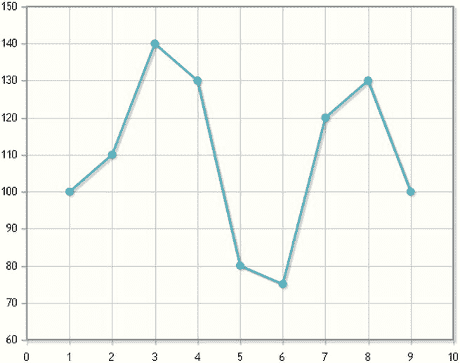
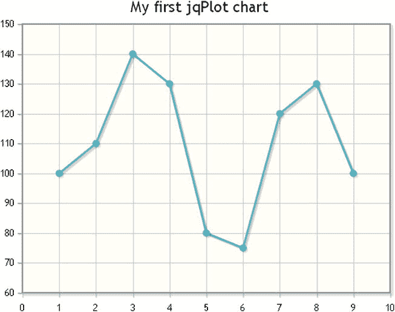
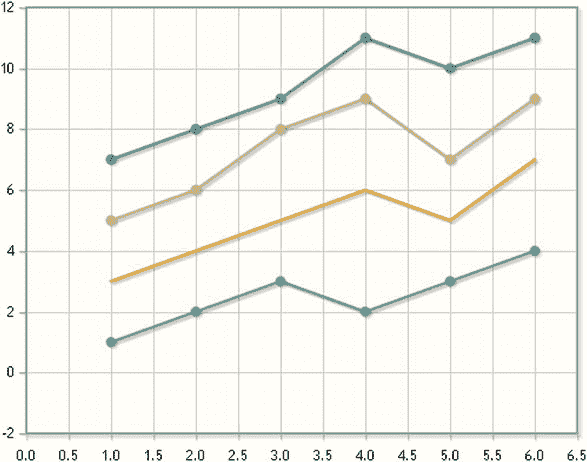
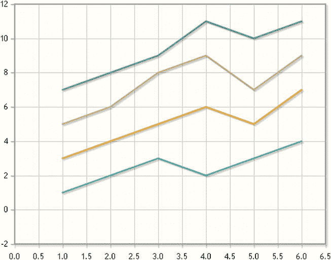
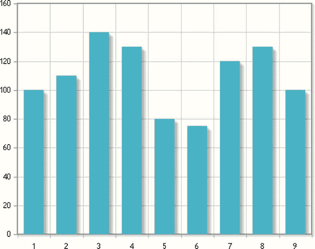
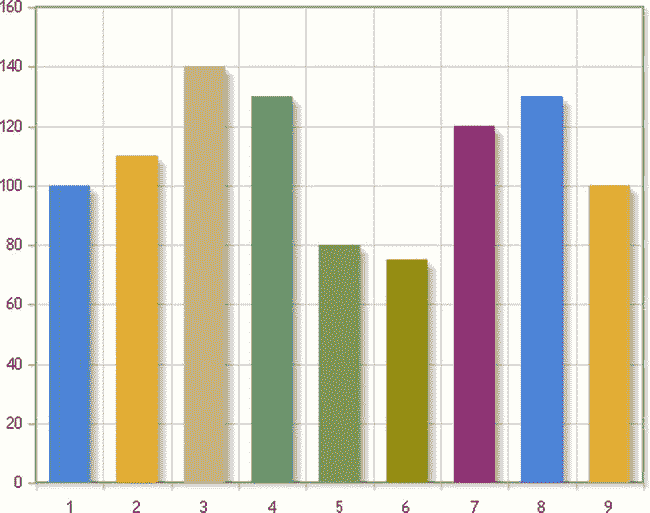
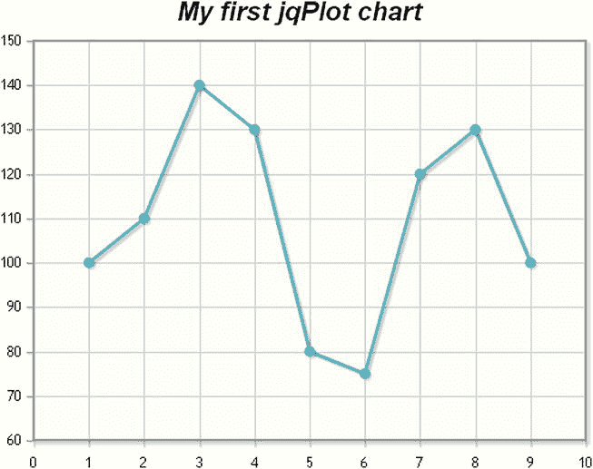

# 八、jqPlot 简介

Abstract

从这一章开始，你将开始本书的第二部分，关于 jqPlot 库。在本章的课程中，你将会被介绍到这个库的基本概念。在了解了库的结构和组成库的文件之后，您将开始理解只使用几行代码制作图表是多么容易。

从这一章开始，你将开始本书的第二部分，关于 jqPlot 库。在本章的课程中，你将会被介绍到这个库的基本概念。在了解了库的结构和组成库的文件之后，您将开始理解只使用几行代码制作图表是多么容易。

通过一系列的例子，并通过插件的使用，你将逐渐学会如何表示任何类型的图表。一切都将使用`$.jqPlot()`函数来完成，它的三个参数描述了 jqPlot 库的所有特性:目标画布、输入数据数组和 options 对象。

最后，在简要说明了如何通过使用级联样式表(CSS)样式定制图表之后，您将快速了解模块思维如何使您的实现有序、可维护和可重用。因此，让我们开始介绍这个奇妙的图书馆。

## jqPlot 库

jqPlot 是一个 JavaScript 库，专门用于在网页中生成图表。jqPlot 完全用纯 JavaScript 编写，是一个开源项目，自 2009 年以来由 Chris Leonello 完全开发和维护。当扩展时，jQuery 库达到了它的全部潜在功能。正是由于这个原因，除了它的简单性，jqPlot 是当今最流行的图表表示库之一。

jqPlot 非常成功，几乎取代了其他以前的库，比如 Flot，jqPlot 保留了它的许多方面，包括外观和感觉。事实上，jqPlot 的作者经常承认他是 Flot 的忠实用户，但是随着时间的推移，他开始意识到它的局限性。旧图书馆缺乏许多功能；此外，其架构的构建方式使其难以扩展。因此，Leonello 觉得有必要创建一个新的图书馆，保留 Flot 中所有好的东西，但允许它发展。因此，他完全重写了它的架构。jqPlot 具有高度模块化的结构，正如您将看到的，它基于大量的插件，每个插件都扮演一定的角色。因此，它最大的特点是它的可插拔性。用户绘制的每一个对象，无论是线条、轴、阴影还是网格本身，都由一个插件来处理。每个绘图元素都有可定制的设置选项，每个添加的插件都可以扩展绘图的功能。

插件的数量逐渐增加，进一步扩大了库的目标。jqPlot 现在是一个多功能和可扩展的库，适合那些想在几个步骤中开发专业图表的人。

在大多数情况下，jqPlot 允许您绘制漂亮的图表，而无需添加太多行代码。事实上，您将会看到 jqPlot(也许比 jQuery 更好)已经接受了“少写多做”的理念。我认为这是图书馆最受赞赏的方面。每天都有越来越多的开发者被添加到 jqPlot 用户列表中。

## 包括基本档案

当您决定利用 jqPlot 在您的网站上绘制图表时，首先需要包含一组关键文件。

如前所述，jqPlot 本质上是 jQuery 的扩展，因此使用它需要包含 jQuery 插件(见表 [8-1](#Tab1) )。您可以从 jqPlot 官方网站( [`www.jqplot.com`](http://www.jqplot.com/) )下载这个插件，以及组成 jqPlot 库的所有其他插件，包括 CSS 文件。根据发布版本的不同，这些文件被分组到不同的发行版中。

Note

本书中的所有示例都使用 jqPlot 库的 1.0.8 版本。

表 8-1。

The distributions of jqPlot and versions of jQuery on which they are based

<colgroup><col> <col></colgroup> 
| jqbatch 版本 | jQuery 版本 |
| --- | --- |
| 1.0.6–1.0.8 | 1.9.1 |
| 1.0.2–1.0.5 | 1.6.4 |

但是，有一小部分文件代表了库的核心，如果您想包含 jqPlot 提供的所有功能，这些文件是必不可少的。这组基本文件由 jQuery 插件、jqPlot 插件和一个 jqPlot CSS 文件组成。还有另一个文件需要导入，但只有当您希望在低于版本 9 的 Internet Explorer 浏览器中加载页面时才需要导入:ExplorerCanvas (excanvas)脚本。这个可选文件弥补了 HTML5 引入的画布功能的不足。

因此，在您的 web 页面的`<head></head>`标记中，您将包含这些文件(有关如何设置工作区的更多信息，请参见附录 A):

`<!--[if lt IE 9]><![endif]-->`

``

``

`<link rel="stylesheet" type="text/css" href="../src/jquery.jqplot.min.css" />`

除了在本地使用 jqPlot 库，通过从网站下载，您还可以使用内容交付网络(CDN)服务，就像您使用 jQuery 一样。jsDelivr ( [`www.jsdelivr.com/#!jqplot`](http://www.jsdelivr.com/#!jqplot) )是一个 CDN 网站，提供 jqPlot 的所有最新发行版。如果您想使用此服务，可以按如下方式修改 URL:

`<!--[if lt IE 9]>`

``

`<link rel="stylesheet" type="text/css" href="../src/jquery.jqplot.min.css" />`

``

``

清单 8-14。ch8_04a.html

``

``

`<link rel="stylesheet" type="text/css" href="../src/jquery.jqplot.min.css" />`

``

``

`</HEAD>`

`<BODY>`

`

`

`</BODY>`

`</HTML>`

如果您在浏览器中加载该网页，您将获得图 [8-11](#Fig11) 中的折线图。

图 8-11。

A simple line chart

显而易见，控制页面样式的部分包含在标签对