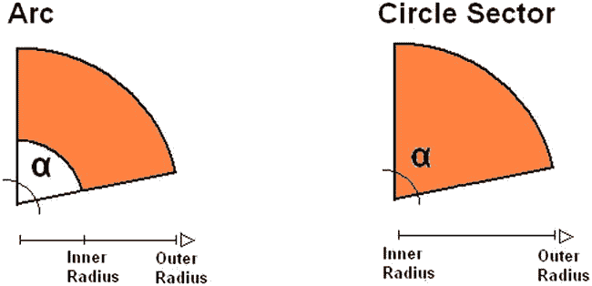
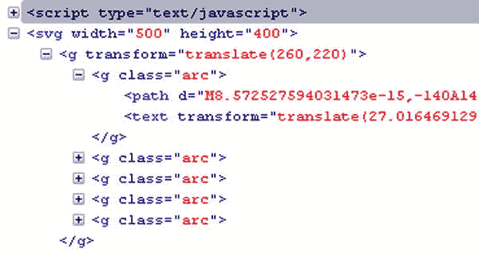
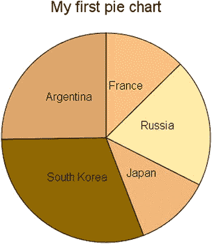
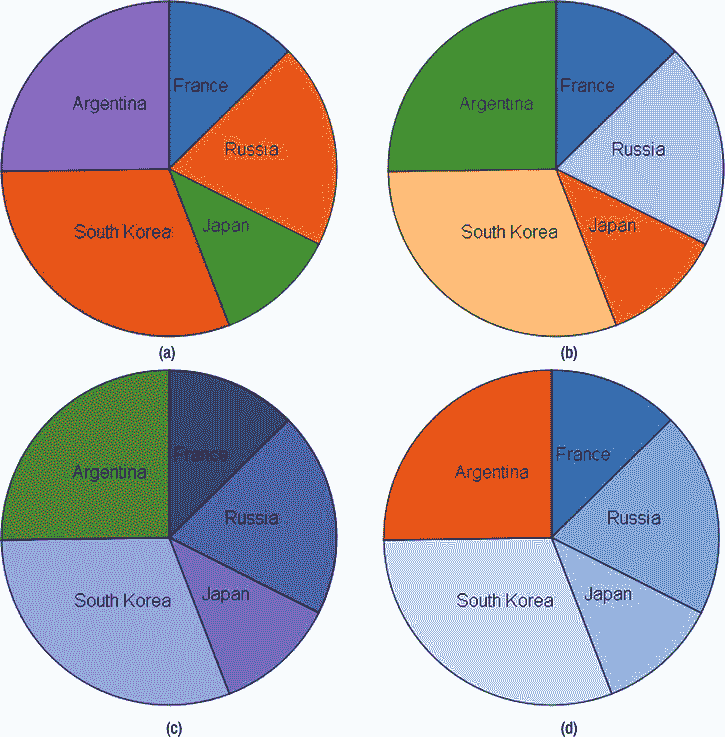
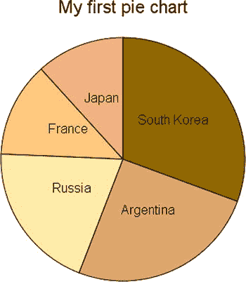
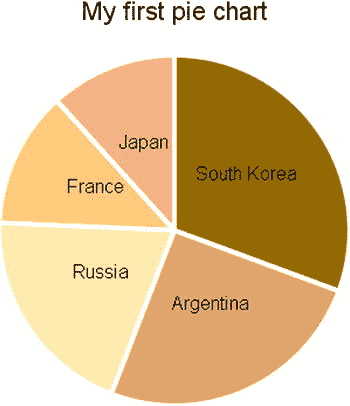
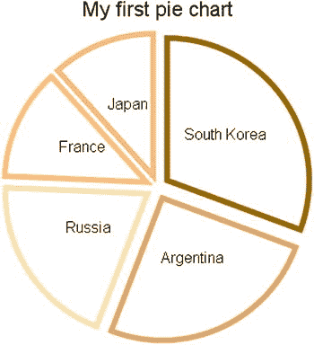
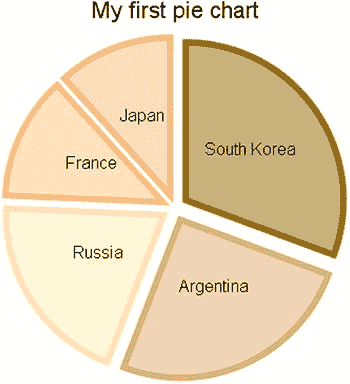
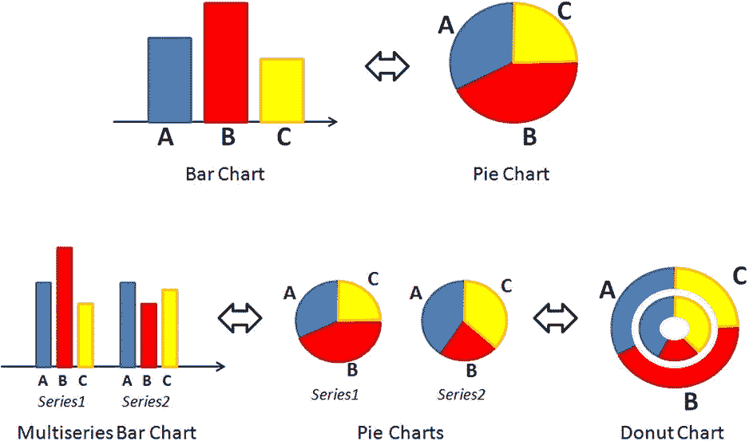
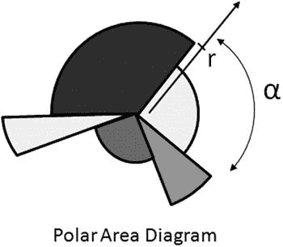

# 22.带 D3 的饼图

Abstract

在前一章中，你已经看到了条形图是如何表示某一类数据的。您还看到，从相同的数据结构开始，根据您的意图，您可以选择一种类型的图表，而不是另一种，以便强调数据的特定方面。例如，在选择标准化堆积条形图时，您希望关注每个部门在其所在国家产生的收入百分比。

在前一章中，你已经看到了条形图是如何表示某一类数据的。您还看到，从相同的数据结构开始，根据您的意图，您可以选择一种类型的图表，而不是另一种，以便强调数据的特定方面。例如，在选择标准化堆积条形图时，您希望关注每个部门在其所在国家产生的收入百分比。

通常，用条形图表示的数据也可以用饼图表示。在这一章中，你将学习如何使用 D3 库创建这种类型的图表。假设这个库不像 jqPlot 那样提供已经实现的图形，而是要求用户使用基本的标量矢量图形(SVG)元素来构建它们，那么我们将从如何构建圆弧和扇形开始。事实上，就像条形图的矩形和折线图的线条一样，如果您要实现饼图(使用扇形)或圆环图(使用弧线)，这些形状是非常重要的。在您实现了饼图的经典示例之后，我们将通过创建一些变体来进一步深化这个主题。在本章的第二部分，您将处理圆环图，管理从逗号分隔值(CSV)文件中读取的多个数据系列。

最后，我们将用一张图来结束这一章，这张图我们还没有处理过:极区图。这种类型的图表是饼图的进一步发展，其中的切片不再包含在一个圆圈中，而是具有不同的半径。有了极区图，信息将不再仅仅由切片所占据的角度来表示，而是由它的半径来表示。

## 基本饼图

为了更好地突出条形图和饼图之间的相似之处，在本例中，您将使用与创建基本条形图相同的 CSV 文件(参见第 21 章[中的“绘制条形图”一节)。因此，在本节中，您的目的是使用相同的数据实现相应的饼图。为了做到这一点，在你开始“烘烤”馅饼和油炸圈饼之前，你必须首先获得正确形状的“烤盘”。D3 库还允许您表示弧形，如拱形和扇形，尽管实际上没有这样的 SVG 元素。事实上，您很快就会看到，由于 D3 的一些方法，它可以像处理其他真正的 SVG 元素(矩形、圆形、直线等)一样处理圆弧和扇形。).一旦你对这些元素的实现有了信心，你创建一个基本的饼图的工作就差不多完成了。在这一部分的第二部分，你将制作一些主题的变化，主要是形状边框和颜色。](21.html)

### 绘制一个基本的饼图

将注意力再次转向包含在名为`data_04.csv`的 CSV 文件中的数据(参见清单 22-1)。

清单 22-1。data_04.csv

`country,income`

`France,14`

`Russia,22`

`Japan,13`

`South Korea,34`

`Argentina,28`

现在，我们将演示这些数据如何很好地适应饼图表示。首先，在清单 22-2 中，定义了绘图区域和边距。

清单 22-2。ch22_01a.html

`var margin = {top: 70, right: 20, bottom: 30, left: 40},`

`w = 500 - margin.left - margin.right,`

`h = 400 - margin.top - margin.bottom;`

即使对于饼图，您也需要使用一系列颜色来区分它们之间的切片。一般来说，通常使用`category10()`函数来创建一个颜色域，这就是你到目前为止所做的。在这个例子中，您可以做同样的事情，但是这并不总是必需的。因此，我们利用这个例子来看看如何传递自定义颜色序列。通过定义你喜欢的颜色来创建一个定制的例子，一个接一个，如清单 22-3 所示。

清单 22-3。ch22_01a.html

`var margin = {top: 70, right: 20, bottom: 30, left: 40},`

`w = 500 - margin.left - margin.right,`

`h = 400 - margin.top - margin.bottom;`

`var color = d3.scale.ordinal()`

`.` `range(["#ffc87c", "#ffeba8", "#f3b080", "#916800", "#dda66b"]);`

以前你用`rect`元素构建了条，而现在你必须处理圆的截面。因此，你正在处理圆、角、拱、半径等。在 D3 里，有一整套工具可以让你处理这些类型的对象，让你处理饼状图更加容易。

为了表示饼图的切片(圆形扇区)，D3 为您提供了一个函数:`d3.svg.arc()`。这个函数实际上定义了拱门。术语“弧”是指由一个角度和两个圆界定的特定几何表面，一个圆具有较小的半径(内半径)，另一个圆具有较大的半径(外半径)。扇形，即饼图的切片，只不过是一个内径等于 0 的圆弧(见图 [22-1](#Fig1) )。

图 22-1。

By increasing the inner radius, it is possible to switch from a circle sector to an arc

首先，计算与绘图区域大小一致的半径。然后，根据这个范围，你划定了外半径和内半径，在这个例子中是 0(见清单 22-4)。

清单 22-4。ch22_01a.html

`...`

`var color = d3.scale.ordinal()`

`.range(["#ffc87c", "#ffeba8", "#f3b080", "#916800", "#dda66b"]);`

`var radius = Math.min(w, h) / 2;`

`var arc = d3.svg.arc()`

`.outerRadius(radius)`

`.innerRadius(0);`

D3 还提供了一个定义饼图的函数:`d3.layout.pie()`函数。此函数构建了一个布局，允许您以非常简单的方式计算弧的开始和结束角度。使用这样的函数不是强制性的，但是饼图布局会自动将数据数组转换为对象数组。因此，定义一个对收入值有迭代函数的饼图，如清单 22-5 所示。

清单 22-5。ch22_01a.html

`...`

`var arc = d3.svg.arc()`

`.outerRadius(radius)`

`.innerRadius(0);`

`var pie = d3.layout.pie()`

`.sort(null)`

`.value(function(d) { return d.income; });`

现在，如清单 22-6 所示，插入根元素`<svg>`，分配正确的维度和适当的`translate()`转换。

清单 22-6。ch22_01a.html

`...`

`var pie = d3.layout.pie()`

`.sort(null)`

`.value(function(d) { return d.income; });`

`var svg = d3.select("body").append("svg")`

`.attr("width", w + margin.left + margin.right)`

`.attr("height", h + margin.top + margin.bottom)`

`.append("g")`

`.attr("transform", "translate(" +(w / 2 + margin.left) +`

`"," + (h / 2 + margin.top) + ")");`

接下来，为了读取 CSV 文件中的数据，您将一如既往地使用`d3.csv()`函数。在这里，您也必须确保收入是用数值而不是字符串来解释的。然后，用`forEach()`函数编写迭代，并在收入值旁边加上“+”号，如清单 22-7 所示。

清单 22-7。ch22_01a.html

`...`

`.append("g")`

`.attr("transform", "translate(" +(w/2+margin.left)+`

`"," +(h/2+margin.top)+ ")");`

`d3.csv("data_04.csv", function(error, data) {`

`data.forEach(function(d) {`

`d.income = +d.income;`

`});`

`});`

现在是时候添加一个`<arc>`项了，但是这个元素并不作为 SVG 元素存在。事实上，这里使用的是一个描述弧线形状的`<path>`元素。正是 D3 本身通过`pie()`和`arc()`函数构建了相应的路径。这使你免去了一项实在太复杂的工作。你只剩下定义这些元素的任务，就像它们是`<arc>`元素一样(见清单 22-8)。

清单 22-8。ch22_01a.html

`d3.csv("data_04.csv", function(error, data) {`

`data.forEach(function(d) {`

`d.income = +d.income;`

`});`

`var g = svg.selectAll(".arc")`

`.data(pie(data))`

`.enter().append("g")`

`.attr("class", "arc");`

`g.append("path")`

`.attr("d", arc)`

`.style("fill", function(d) { return color(d.data.country); });`

`});`

如果你用 Firebug 分析 SVG 结构，你可以在图 [22-2](#Fig2) 中看到弧线路径是自动创建的，并且每个切片都有一个`<g>`元素。

图 22-2。

With Firebug, you can see how the D3 library automatically builds the arc element

此外，有必要给每个切片添加一个指示性标签，以便您可以理解它与哪个国家相关，如清单 22-9 所示。注意`arc.centroid()`功能。该函数计算圆弧的质心。质心被定义为内半径和外半径以及起始角度和终止角度之间的中点。因此，标签文本完美地出现在每个切片的中间。

清单 22-9。ch22_01a.html

`d3.csv("data_04.csv", function(error, data) {`

`...`

`g.append("path")`

`.attr("d", arc)`

`.style("fill", function(d) { return color(d.data.country); });`

`g.append("text")`

`.attr("transform", function(d) {`

`return "translate(" + arc.centroid(d) + ")"; })`

`.style("text-anchor", "middle")`

`.text(function(d) { return d.data.country; });`

`});`

即使对于饼状图，在顶部和中心位置添加标题也是一个好习惯(见清单 22-10)。

清单 22-10。ch22_01a.html

`d3.csv("data_04.csv", function(error, data) {`

`...`

`g.append("text")`

`.attr("transform", function(d) {`

`return "translate(" + arc.centroid(d) + ")"; })`

`.style("text-anchor", "middle")`

`.text(function(d) { return d.data.country; });`

`var title = d3.select("svg").append("g")`

`.attr("transform", "translate(" +margin.left+ "," +margin.top+ ")")`

`.attr("class","title")`

`title.append("text")`

`.attr("x", (w / 2))`

`.attr("y", -30 )`

`.attr("text-anchor", "middle")`

`.style("font-size", "22px")`

`.text("My first pie chart");`

`});`

至于 CSS 类属性，您可以添加清单 22-11 中的定义。

清单 22-11。ch22_01a.html

``

最后，你使用 D3 库得到了你的第一个饼状图，如图 [22-3](#Fig3) 所示。

图 22-3。

A simple pie chart

### 饼图的一些变化

现在，您将对刚刚创建的基本饼图进行一些更改，展示您可以获得的主题变化的无限可能性:

*   处理颜色序列；
*   对饼图中的切片进行排序；
*   在切片之间添加空间；
*   仅用轮廓表示切片；
*   结合以上所有内容。

#### 处理颜色序列

在前面的例子中，我们定义了色阶中的颜色，在前面的例子中我们使用了`category10()`函数。还有其他已经定义的分类色标:`category20()`、`category20b()`和`category20c()`。将它们应用到您的饼图中，看看它们如何影响其外观。清单 22-12 显示了一个使用`category10()`函数的例子。对于其他类别，您只需将此函数替换为其他函数。

清单 22-12。ch22_01b.html

`var color = d3.scale.category10();`

图 [22-4](#Fig4) 显示了刻度之间的颜色变化(反映在打印的不同灰度色调中)。category10()和 category20()函数生成具有交替颜色的刻度；相反，类别 20b()和类别 20c()会生成一个颜色渐变缓慢的刻度。

图 22-4。

Different color sequences: a) category10, b) category20, c) category20b, d) category20c

#### 对饼图中的扇区进行排序

另一件要注意的事情是，默认情况下，D3 中的饼图经历了隐式排序。因此，如果您没有通过将`null`传递给`sort()`函数来显式地发出请求，如清单 22-13 所示。

清单 22-13。ch22_01c.html

`var pie = d3.layout.pie()`

`//.sort(null)`

`.value(function(d) { return d.income; });`

然后，饼图看起来会有所不同，如图 [22-5](#Fig5) 所示。

图 22-5。

A simple pie chart with sorted slices

在饼图中，第一个切片最大，然后其他切片按降序逐渐添加。

#### 在切片之间添加空间

通常，切片显示为在它们之间间隔开，这可以非常容易地实现。您只需要对清单 22-14 所示的`path`元素的 CSS 样式类进行一些修改。

清单 22-14。ch22_01d.html

`.arc path {`

`stroke: #fff;`

`stroke-width: 4;`

`}`

图 [22-6](#Fig6) 显示了当扇区被白色间隙隔开时，饼图如何呈现更令人愉悦的外观。

图 22-6。

The slices are separated by a white space

#### 仅用轮廓表示切片

绘制带有切片的饼图要稍微复杂一些，这些切片只有彩色边框，内部是空的。您已经看到了 jqPlot 的类似案例。更改 CSS 样式类，如清单 22-15 所示。

清单 22-15。ch22_01e.html

`.arc path {`

`fill: none;`

`stroke-width: 6;`

`}`

事实上，这一次您不希望用特定的颜色填充切片，而是希望定义它们的边用特定的颜色着色。所以需要在 SVG 元素的样式定义中用`stroke`属性替换`fill`。现在是用指示色着色的线。但是你需要做另一个改变，这个改变有点复杂，很难理解。

您使用每个切片的边界来指定彩色部分，但它们实际上是重叠的。所以，下面的颜色覆盖了前一个颜色的一部分，把所有的切片都连在一起就不那么整齐了。再加个小缺口就更好了。这很容易做到，只需对每个切片进行平移。每个切片都应该在离心方向上偏离中心一小段距离。因此，每个切片的平移是不同的，这里你利用了`centroid()`函数的功能，它给出了平移的方向(x 和 y 坐标)(见清单 22-16)。

清单 22-16。ch22_01e.html

`var g = svg.selectAll(".arc")`

`.data(pie(data))`

`.enter().append("g")`

`.attr("class", "arc")`

`.attr("transform", function(d) {`

`a = arc.centroid(d)[0]/6;`

`b = arc.centroid(d)[1]/6;`

`return "translate(" + a +","+b + ")";`

`})`

`g.append("path")`

`.attr("d", arc)`

`.style("stroke", function(d) { return color(d.data.country); });`

图 [22-7](#Fig7) 展示了这些变化如何影响饼图。

图 22-7。

A pie chart with unfilled slices

#### 混合所有这些

但这并没有结束。您可以在这最后两个饼图之间创建一个中间解决方案:获取具有更深颜色边缘的切片，并用更浅的颜色填充它们。定义两条相同但颜色不同的路径就足够了，如清单 22-17 所示。第一种颜色均匀，略显暗淡，而第二种只有彩色边缘，内部为白色。

清单 22-17。ch22_01f.html

`var g = svg.selectAll(".arc")`

`.data(pie(data))`

`.enter().append("g")`

`.attr("class", "arc")`

`.attr("transform", function(d) {`

`a = arc.centroid(d)[0]/6;`

`b = arc.centroid(d)[1]/6;`

`return "translate(" + a +","+b + ")";`

`})`

`g.append("path")`

`.attr("d", arc)`

`.style("fill", function(d) { return color(d.data.country); })`

`.attr('opacity', 0.5);`

`g.append("path")`

`.attr("d", arc)`

`.style("stroke", function(d) { return color(d.data.country); });`

图 [22-8](#Fig8) 显示了带有两条路径的间隔饼图，这两条路径为切片及其边界着色。

图 22-8。

A different way to color the slices in a pie chart

## 圆环图

就像饼图对于条形图一样，圆环图对于多系列条形图也是如此。事实上，当您有多组值时，您必须用每个系列的饼图来表示它们。如果你使用甜甜圈图，你可以把它们放在一起，并在一个图表中进行比较(见图 [22-9](#Fig9) )。

图 22-9。

A diagram representing the parallelism between pie charts and bar charts both with one and with multiple series of data

首先编写清单 22-18 中的代码；我们将不提供任何解释，因为它与前面的例子相同。

清单 22-18。ch22_02.html

`<!DOCTYPE html>`

`<html>`

`<head>`

`<meta charset="utf-8">`

``

`</body>`

`</html>`

对于一个多系列数据的例子，您将向文件`data_04.csv`中添加另一列表示费用的数据，如清单 22-19 所示，并且您将把这个新版本保存为`data_06.csv`。

清单 22-19。data_06.csv

`country,income,expense`

`France,14,10`

`Russia,22,19`

`Japan,13,6`

`South Korea,34,12`

`Argentina,28,26`

您添加了一组新数据。因此，与上一个示例不同，您必须为此系列创建一个新弧线。然后，除了第二条弧线之外，再添加第三条弧线。这个弧不会绘制一个系列的切片，但是您将使用它来循环分布标签。这些标签显示了国家的名称，为图例提供了另一种选择。因此，将半径分成三部分，中间留一个空隙来分隔系列，如清单 22-20 所示。

清单 22-20。ch22_02.html

`var arc1 = d3.svg.arc()`

`.outerRadius(0.4 * radius)`

`.innerRadius(0.2 * radius);`

`var arc2 = d3.svg.arc()`

`.outerRadius(0.7 * radius )`

`.innerRadius(0.5 * radius );`

`var arc3 = d3.svg.arc()`

`.outerRadius(radius)`

`.innerRadius(0.8 * radius);`

您刚刚创建了两个弧来管理这两个系列，因此现在有必要创建两个饼图，一个用于收入值，另一个用于支出值(见清单 22-21)。

清单 22-21。ch22_02.html

`var pie = d3.layout.pie()`

`.sort(null)`

`.value(function(d) { return d.income; });`

`var pie2 = d3.layout.pie()`

`.sort(null)`

`.value(function(d) { return d.expense; });`

使用`d3.csv()`函数读取文件中的数据，如清单 22-22 所示。您使用`forEach()`进行通常的数据迭代，将收入和费用解释为数值。

清单 22-22。ch22_02.html

`d3.csv("data_06.csv", function(data) {`

`data.forEach(function(d) {`

`d.income = +d.income;`

`d.expense = +d.expense;`

`});`

`});`

在清单 22-23 中，您创建了`path`元素，它绘制了两个甜甜圈的不同部分，对应于两个系列。使用函数`data()`，您将两个饼图布局的数据绑定到两个表示。两个甜甜圈必须遵循相同的颜色顺序。一旦定义了 path 元素，就可以用一个报告相应数值的`text`元素来连接它。因此，您添加了一些标签，使图表更容易阅读。

清单 22-23。ch22_02.html

`var g = svg.selectAll(".arc1")`

`.data(pie(data))`

`.enter().append("g")`

`.attr("class", "arc1");`

`g.append("path")`

`.attr("d", arc1)`

`.style("fill", function(d) { return color(d.data.country); });`

`g.append("text")`

`.attr("transform", function(d) {`

`return "translate(" + arc1.centroid(d) + ")"; })`

`.attr("dy", ".35em")`

`.style("text-anchor", "middle")`

`.text(function(d) { return d.data.income; });`

`var g = svg.selectAll(".arc2")`

`.data(pie2(data))`

`.enter().append("g")`

`.attr("class", "arc2");`

`g.append("path")`

`.attr("d", arc2)`

`.style("fill", function(d) { return color(d.data.country); });`

`g.append("text")`

`.attr("transform", function(d) {`

`return "translate(" + arc2.centroid(d) + ")"; })`

`.attr("dy", ".35em")`

`.style("text-anchor", "middle")`

`.text(function(d) { return d.data.expense; });`

现在，剩下要做的就是添加执行图例功能的外部标签，如清单 22-24 所示。

清单 22-24。ch22_02.html

`g.append("text")`

`.attr("transform", function(d) {`

`return "translate(" + arc3.centroid(d) + ")"; })`

`.style("text-anchor", "middle")`

`.text(function(d) { return d.data.country; });`

这样你就得到了如图 [22-10](#Fig10) 所示的环形图。

图 22-10。

A donut chart

## 极区图

极区图非常类似于饼图，但它们的不同之处在于每个扇区从圆心延伸的距离，从而可以表示更远的值。每个切片的范围与这个新的附加值成比例(见图 [22-11](#Fig11) )。

图 22-11。

In a polar area diagram, each slice is characterized by a radius r and an angle

再次考虑文件`data_04.csv`中的数据，添加一个额外的列来显示相应国家的增长，如清单 22-25 所示。另存为`data_07.csv`。

清单 22-25。data_07.csvl

`country,income,growth`

`France,14,10`

`Russia,22,19`

`Japan,13,9`

`South Korea,34,12`

`Argentina,28,16`

开始编写清单 22-26 中的代码；同样，我们不会解释这一部分，因为它与前面的例子相同。

清单 22-26。ch22_03.html

`<!DOCTYPE html>`

`<html>`

`<head>`

`<meta charset="utf-8">`

``

`</body>`

`</html>`

在清单 22-27 中，您用`d3.csv()`函数读取了`data_07.csv`文件中的数据，并确保收入和增长率的值被解释为数值。

清单 22-27。ch22_03.html

`d3.csv("data_07.csv", function(error, data) {`

`data.forEach(function(d) {`

`d.income = +d.income;`

`d.growth = +d.growth;`

`});`

`});`

与前面的例子不同，这里你不仅定义了一个弧线，而且定义了一个随着被读取数据的变化而变化的弧线；我们称之为`arcs`，因为`outerRadius`不再是常数，而是与文件中的增长值成比例。为了做到这一点，你需要应用一个通用的迭代函数，然后弧线必须在`d3.csv()`函数中声明(见清单 22-28)。

清单 22-28。ch22_03.html

`d3.csv("data_07.csv", function(error, data) {`

`data.forEach(function(d) {`

`d.income = +d.income;`

`d.growth = +d.growth;`

`});`

`arcs = d3.svg.arc()`

`.innerRadius( 0 )`

`.outerRadius( function(d,i) { return 8*d.data.growth; });`

`});`

现在，您只需添加 SVG 元素，这些元素绘制带有包含增长和收入值的标签的切片(参见清单 22-29)。报告收入值的标签将绘制在切片内，就在由`centroid()`函数返回的值处。相反，关于报告生长值的标签，它们将被画在切片的外面。要获得这种效果，您可以使用由`centroid()`返回的 x 和 y 值，并将它们乘以一个大于 2 的值。你一定记得质心在角度的正中心，在`innerRadius`和`outerRadius`的中间。因此，将它们乘以 2，就得到切片外边缘中心的点。如果您将它们乘以一个大于 2 的值，那么您将找到切片外部的 x 和 y 位置，就在您想要绘制具有增长值的标签的位置。

清单 22-29。ch22_03.html

`var g = svg.selectAll(".arc")`

`.data(pie(data))`

`.enter().append("g")`

`.attr("class", "arc");`

`g.append("path")`

`.attr("d", arcs)`

`.style("fill", function(d) { return color(d.data.country); });`

`g.append("text")`

`.attr("class","growth")`

`.attr("transform", function(d) {`

`a = arcs.centroid(d)[0]*2.2;`

`b = arcs.centroid(d)[1]*2.2;`

`return "translate(" +a+","+b+ ")"; })`

`.attr("dy", ".35em")`

`.style("text-anchor", "middle")`

`.text(function(d) { return d.data.growth; });`

`g.append("text")`

`.attr("class","income")`

`.attr("transform", function(d) {`

`return "translate(" +arcs.centroid(d)+ ")"; })`

`.attr("dy", ".35em")`

`.style("text-anchor", "middle")`

`.text(function(d) { return d.data.income; });`

您尚未对饼图执行的一项操作是添加图例。在清单 22-30 中，我们在`d3.csv()`函数之外定义了一个元素`<g>`来插入图例表，在函数内部我们定义了所有与国家相关的元素，因为定义它们需要访问文件中的值。

清单 22-30。ch22_03.html

`var legendTable = d3.select("svg").append("g")`

`.attr("transform", "translate(" +margin.left+ ","+margin.top+")")`

`.attr("class","legendTable");`

`d3.csv("data_07.csv", function(error, data) {`

`...`

`var legend = legendTable.selectAll(".legend")`

`.data(pie(data))`

`.enter().append("g")`

`.attr("class", "legend")`

`.attr("transform", function(d, i) {`

`return "translate(0," + i * 20 + ")"; });`

`legend.append("rect")`

`.attr("x", w - 18)`

`.attr("y", 4)`

`.attr("width", 10)`

`.attr("height", 10)`

`.style("fill", function(d) { return color(d.data.country); });`

`legend.append("text")`

`.attr("x", w - 24)`

`.attr("y", 9)`

`.attr("dy", ".35em")`

`.style("text-anchor", "end")`

`.text(function(d) { return d.data.country; });`

`});`

最后，您可以对 CSS 样式类进行一些调整，如清单 22-31 所示。

清单 22-31。ch22_03.html

``

这里是极区图(见图 [22-12](#Fig12) )。

图 22-12。

A polar area diagram

## 摘要

在这一章中，你学习了如何使用 D3 库实现饼状图和圆环图，遵循了与前几章几乎相同的指导方针。此外，在本章的最后，你学习了如何制作极区图，这是一种你以前没有见过的图表，D3 库允许你很容易地实现。

在下一章中，您将实现两种类型的烛台图表，您已经在介绍 jqPlot 库的书的第一部分中讨论过了，只是这次您将使用 D3 库。