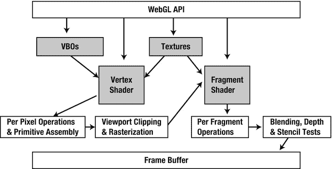
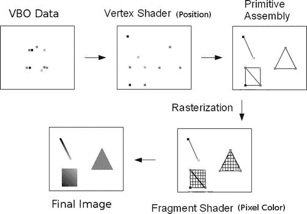

第二章

着色器 101

在这一章，我们将深入探讨 GL 着色语言(GLSL)。我们将涉及的主题包括

*   WebGL 图形管道概述
*   固定功能和现代可编程着色器之间的区别
*   GLSL 中顶点着色器和片段着色器的作用
*   如何在 WebGL 应用中创建和使用着色器
*   GLSL 的详细概述，包括其原始类型和内置函数
*   程序片段着色器的示例

图形管道

一个*图形管道*由图像从初始定义到最终屏幕渲染的步骤组成。这个管道由按照预先定义的顺序完成的几个步骤组成。流水线的组件可以是功能固定的，也可以是可编程的。

固定功能或可编程着色器

更传统的图形流水线具有固定的实现。初始图像定义将是一组顶点位置点和与这些点相关联的信息，例如颜色、法向量和纹理坐标。对于固定功能，操作是按照设定的顺序完成的。您可以禁用一些元素，如照明或纹理，但不能修改基础照明或纹理计算的完成方式。OpenGL 版之前的图形管道只使用固定功能。

*固定功能性*、顾名思义，相当死板。它允许更快和更容易地生成图像，因为照明公式和阴影已经内置到系统中。然而，它限制了我们所能完成的，因为我们不能覆盖这些设置。OpenGL 固定功能为顶点变换和光照提供了单独的流水线步骤。现在这一切都在顶点着色器(VS)和片段着色器(FS)中完成。类似地，纹理应用、颜色叠加、雾化和 alpha 测试都是不连续的步骤。现在这些组件都在 FS 中完成了。

在[图 2-1](#Fig1) 中显示了 WebGL API、可编程和不可编程的管道组件如何交互的高级视图。

[图 2-1](#_Fig1) 。WebGL 可编程流水线的简图。带有阴影背景的步骤是可编辑的

可编程管道可以显示更大范围的效果，因为你可以定义管道的一部分(不是全部)并覆盖用于计算颜色、位置、纹理坐标或照明模型的计算。可编程流水线组件使用顶点程序和片段程序，它们统称为着色器。这些着色器运行在现代计算机中强大的图形处理单元(GPU)上。OpenGL 版本 2.0 到 3.0 允许使用固定功能或着色器。OpenGL ES 和 WebGL 的精简 API 只支持着色器，不支持固定功能。

为什么是着色器？

如果着色器需要更多的工作来设置，为什么我们还要费事去使用它们呢？它们的好处是什么？

嗯，使用着色器，您可以创建增加场景真实感的效果。您可以创建看起来很卡通的非真实感图像。也可以在着色器中创建卷积滤镜和遮罩；并在着色器中进行额外的抗锯齿、混合、阴影创建和高级纹理操作，以及几乎所有您能想到和实现的其他操作。

还可以对图形处理单元(GPU)进行编程，进行侧面计算。GPU 的能力可以用来抵消浏览器的计算，对于一般计算来说更快更好。

WebGL 图形管道

在 WebGL 中，渲染过程如下:

*   获取顶点数组数据并将其放入顶点缓冲对象(VBOs)中。
*   将 VBO 数据流式传输到 VS，并使用对具有隐式索引排序的 drawArrays 或具有 drawElements 和索引数组的 draw arrays 的调用来发送索引信息。
*   VS 运行，最低限度地设置每个顶点的屏幕位置，并可选地执行额外的计算，然后传递给 FS。
*   VS 的输出数据继续沿着流水线的固定部分向下传输。
*   GPU 使用顶点和索引生成图元。
*   光栅化器丢弃位于视口之外的任何图元部分。然后视口内的部分被分解成像素大小的片段。
*   然后在每个片段上内插顶点值。
*   具有这些插值的片段被传递到 FS。
*   FS 最低限度地设置颜色值，但也可以做纹理和照明操作。
*   片段可以被丢弃或传递到帧缓冲区，帧缓冲区存储 2D 图像，也可以选择使用深度和模板缓冲区。在这种情况下，深度测试和模板测试可以在最终图像中丢弃一些被渲染的片段。该图像或者被传递到绘图缓冲区并显示给用户，或者被保存到屏幕外缓冲区供以后使用，例如保存为纹理数据。

WebGL 渲染过程的高级视图如[图 2-2](#Fig2) 所示。

[图 2-2](#_Fig2) 。WebGL 渲染流程概述

在[图 2-2](#Fig2) 中，我们从模型坐标空间中的顶点位置开始。然后，VS 将顶点转换到最终位置。形成适当的图元类型，对图像进行剪裁、光栅化，并传递给 FS。FS 对值进行插值，并可选地通过深度和模板缓冲区发送结果，最后通过帧缓冲区。

GL 阴影语言

学习 GL 着色语言(GLSL)对于学习 WebGL 是必不可少的。我喜欢引用 Khronos WebGL wiki，它恰当地指出:

"*没有着色器，WebGL 中不会发生任何事情。*

背景

在 WebGL 中使用的着色语言实际上是 OpenGL ES 着色语言(也称为 GLSL ES 或 ESSL)，并且基于 OpenGL 着色语言(GLSL)1.20 版。OpenGL ESSL 的完整规范可以从[http://www . khronos . org/registry/gles/specs/2.0/GLSL _ ES _ Specification _ 1 . 0 . 17 . pdf](http://www.khronos.org/registry/gles/specs/2.0/GLSL_ES_Specification_1.0.17.pdf)下载。

GLSL 是基于 C++的，实际上是顶点和片段处理器的两种独立但紧密相关的语言。每个处理器上的编译源分别称为 VS 或 FS。VS 和 FS 链接在一起形成一个运行在 GPU 上的程序。

VS 一次作用于一个顶点，每个顶点可以有不同的属性与之关联。FS 作用于光栅化图像的一部分，并且可以内插顶点数据。它不能改变片段的位置或查看相邻片段的数据。VS 可以向 FS 发送数据。着色器程序的最终目标是更新帧(绘图)缓冲区或纹理缓冲区。

WebGL 使用 JavaScript 脚本语言将我们的着色器绑定到 GLSL 应用编程接口(API)。意识到我们在一个

*   将同一 web 文件中的 VS 和 FS 源分别嵌入到“x 着色器/x 顶点”或“x 着色器/x 片段”类型的
*   将 VS 和 FS 放在外部文件中，并用 Ajax 加载它们

 **注意**默认情况下，<脚本>标签将 type 属性设置为 javascript 或 text/javascript。类型“x 着色器/x 顶点”和“x 着色器/x 片段”实际上不被浏览器识别并被忽略。该内容仍然被加载到文档对象模型(DOM)中以供以后检索，但在其他情况下不会被使用。

我们将在本章后面回到 GLSL。现在，让我们讨论着色器的角色。

着色器角色

VS 和 FS 具有不同的角色，它们一起工作来渲染完成的图像。本质上，VS 作用于每个顶点并负责设置最终的顶点位置，而 FS 作用于每个像素并设置最终的颜色。

顶点着色器

VS 负责所有的顶点坐标变换。这包括模型视图和投影矩阵视图计算。它还计算法线向量和纹理坐标的生成和转换。VS 可以执行逐顶点光照计算，并将这些值传递给 FS 进行逐像素计算。

总之，VS 负责

*   最终顶点位置以及可选地
*   逐顶点法线、纹理、照明和颜色
*   将值传递给 FS

最低限度，一个 VS 需要设置 gl_Position，我们将在本章后面讨论，它是一个内置的 VS 变量(见[清单 2-1](#list1) )。

***[清单 2-1](#_list1) 。*** 简单的顶点着色器，将输入的顶点位置传递给片段着色器