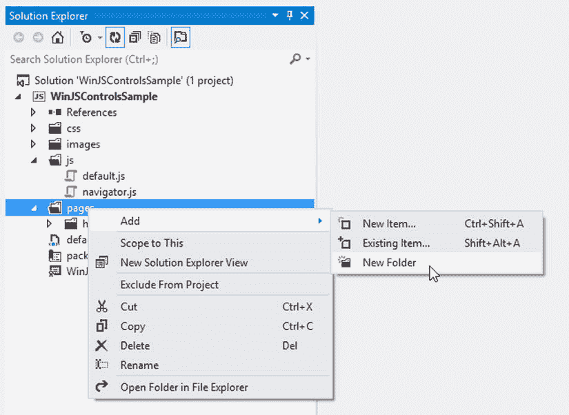
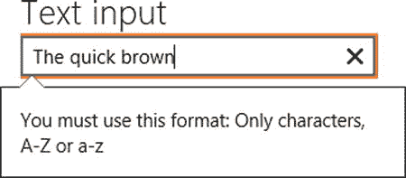
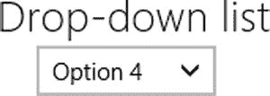
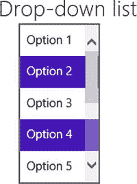
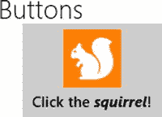

第五章


HTML 控件

正如许多新技术一样，许多人不知道 HTML5 到底是什么。对某些人来说，这就是视频。对一些人来说，这是关于语义标签的，比如新的`header`和`nav`标签。对某些人来说，这是一种让网站在移动设备上运行的新魔法。对其他人来说，它只是我们在过去几十年中所熟知和喜爱的 HTML 的下一个版本。不管你听说过什么，可以肯定地说 HTML5 不是一个单一的东西。事实上，很多被认为是 HTML5 的东西是三种东西的组合:HTML、JavaScript 和 CSS。互联网上不乏关于 HTML5 及其功能的信息。HTML5 Rocks 网站(`www.html5rocks.com`)是一个很好的资源。

如果你还不熟悉 HTML5，这一章是为你准备的。在这篇文章中，我将概述一些更常见的元素。因为我属于“HTML5 只是 HTML 的下一个版本”的阵营，所以我一般简称它为 HTML。此外，我经常将 HTML 元素称为控件，特别是当提到用户与之交互的界面元素时。

幸运的是，如果你熟悉 HTML 及其提供的控件，你会很高兴地知道所有这些知识现在都适用于 Windows 8 应用程序开发。我们将用于开发 Windows 8 应用程序的 HTML 和 JavaScript 与我们用于开发网站的 HTML 和 JavaScript 相同。也就是说，你仍然应该浏览这一章，因为它确实涵盖了一些特定于 Windows 应用商店应用程序开发的概念。

在开始之前，您需要创建一个 Visual Studio 项目来使用这些示例。

Visual Studio 项目

正如我在第 4 章中提到的，Visual Studio 有许多不同的版本。在目前可用的八个版本中，有四个可用于创建 Windows 应用商店应用程序。这四个是

*   适用于 Windows 8 的 Visual Studio 速成版 2012
*   Visual Studio 专业版 2012
*   Visual Studio 高级版 2012
*   Visual Studio 旗舰版 2012

在本书中，我将使用免费速成版来讨论所有的例子。虽然其他版本为专业开发人员提供了一些额外的好处，但是您会发现使用免费的开发人员工具来构建真实世界的应用程序是非常可行的。

 **注意**如果你有专业版、高级版或终极版，一定要利用它们包含的额外功能。请注意，在这些版本中，一些默认设置(如菜单项、键盘快捷键和工具栏)可能与本书中的屏幕截图和说明不同。

在接下来的几页中，我们将为本章以及第 6 章、 [7](07.html) 和 [8](08.html) 中将要进行的工作准备环境。我会走过去

*   创建项目
*   查看默认项目内容
*   添加新页面
*   导航到新页面

我们开始吧！

创建项目

正如在第四章中所描述的，在 Visual Studio 中有许多项目模板可用于使用 HTML 和 JavaScript 构建 Windows 8 应用程序。我发现，对于我的口味来说，导航应用程序模板达到了适当的平衡，包括足够的框架来开始一个应用程序，而不包括太多的“新项目膨胀”因此，让我们从基于该模板创建一个项目开始。

 **注**本书附带的源代码包括一个名为 WinJSControlsSample 的完整项目，其中包含了在[第 5 章](05.html)、[第 6 章](06.html)、[第 7 章](07.html)和[第 8 章](08.html)中使用的样本代码。你可以在本书的 press 产品页面(`www.apress.com/9781430257790`)的 Source Code/Downloads 选项卡上找到本章的代码示例。

1.  打开 Visual Studio。
2.  Select File  New Project. This will open the New Project dialog (see [Figure 5-1](#Fig1)).

    

    [图 5-1](#_Fig1) 。新建项目对话框

3.  在“新建项目”对话框的左侧窗格中，选择模板 JavaScript  Windows Store。
4.  选择导航应用程序项目模板。
5.  为项目命名:WinJSControlsSample。
6.  单击“确定”创建您的项目。

此时，您有了一个新项目。现在，通过按 Ctrl+F5 构建并运行它。你应该会看到类似于[图 5-2](#Fig2) 的东西。


[图 5-2](#_Fig2) 。现成的导航应用程序

 **注意**有几种方法可以让应用程序停止运行。你可以从触摸屏顶部向下滑动，或者用鼠标“抓取”应用程序的顶部，然后将其拖到屏幕底部。或者，您可以在键盘上按 Alt+F4。最后，如果您正在调试(即，您按了 F5 而不是 Ctrl+F5)，您可以使用 Alt+Tab 返回 Visual Studio 并停止调试器。

太好了！这不是很令人兴奋，但这是一个开始。现在，让我们准备在接下来几章的示例中使用的项目。

查看默认项目内容

使用导航应用程序模板创建项目时，会包含许多文件。名为`default.html`的文件是应用程序的起点。Visual Studio 还创建了相应的`default.css`和`default.js`文件，以及一个`navigator.js`文件，其中包含我们导航应用程序的逻辑。添加了一些占位符标志图像，以及一个名为 home.html 的`PageControl`。在阅读本书的其余部分时，您将会看到这些文件中的大部分，所以我在这里不会深入讨论它们。

让我们首先切换您的应用程序，以便使用灯光主题。打开`default.html`并在[清单 5-1](#list1) 中找到代码。这一步不是必需的，但它确实使接下来几章中的截图更容易阅读。你将在第九章开始构建的应用程序中使用一个定制的黑暗主题。

[***清单 5-1。***](#_list1) 变换主题

```js
<title>WinJSControlsSample</title>

<!-- WinJS references -->
<link href="//Microsoft.WinJS.1.0/css/ui-dark.css" rel="stylesheet" />
<script src="//Microsoft.WinJS.1.0/js/base.js"></script>
<script src="//Microsoft.WinJS.1.0/js/ui.js"></script>
```

将 CSS 参考从`ui-dark.css`更改为`ui-light.css`，然后在`home.html`中进行相同的更改。现在，浏览`default.html`并找到[清单 5-2](#list2) 中的代码。`PageControlNavigator`将是您将添加到该应用程序中的所有页面控件的宿主。注意这里有一个对`/pages/home/home.html`的引用。这是您的应用程序的主页，当应用程序启动时，它将被加载到`default.html`中。当您浏览整个应用程序时，`default.html`将始终可见，其他页面将动态加载到这个`PageControlNavigator`中。

[***清单 5-2。***](#_list2) 页面控制导航器

```js
<div id="contenthost"
data-win-control="Application.PageControlNavigator"
data-win-options="{home: '/pages/home/home.html'}"></div>
```

添加新页面

现在，让我们为您将在本章中看到的示例向应用程序添加一个新页面。

1.  Right-click the pages folder and select Add  New Folder. Name the new folder `htmlcontrols` (see [Figure 5-3](#Fig3)).

    

    [图 5-3](#_Fig3) 。添加新文件夹

2.  右键单击`htmlcontrols`文件夹并选择添加新项目..。。这将打开“添加新项目”对话框。
3.  选择页面控件项目。
4.  给页面控件起一个名字:`htmlcontrols`。

Visual Studio 现在创建了三个文件，它们共同组成了页面控件:`htmlcontrols.css`、`htmlcontrols.html`和`htmlcontrols.js`。在这一章中，你的大部分代码将进入`htmlcontrols.html`文件。打开`htmlcontrols.html`并添加`form`元素，如[清单 5-3](#list3) 所示。

[***清单 5-3。***](#_list3) 添加表单

```js
<body>
    <form id="myForm">
    <!-- SNIPPED -->
    </form>
</body>
```

虽然您的应用程序不需要，`form`将允许您在本章后面利用一些内置的验证和按钮功能。但是，默认情况下，当提交 HTML 表单时，表单中的数据会在请求新页面时发送到服务器。

因为您不希望在提交表单时导航到新页面，所以您修改了`htmlcontrols.js,`的`ready`函数，如[清单 5-4](#list4) 所示。这可以防止应用程序离开您的页面。

[***清单 5-4。***](#_list4) 防止默认表单提交

```js
ready: function (element, options) {
    document.getElementById("myForm").addEventListener("submit", function (e) {
        e.preventDefault();
    });
},
```

现在，准备示例应用程序还有最后一件事要做:让用户导航到这个新页面。

导航到新页面

如上所述，现在应用程序将在启动时加载`home.html`。然而，您将把您的代码添加到`htmlcontrols.html`中。您需要提供某种方式来从一个页面导航到另一个页面。打开`home.html`，找到主`section`元素。用按钮的代码替换占位符内容，就像我在[清单 5-5](#list5) 中所做的那样。

[***清单 5-5。***](#_list5) 新 home.html 主要内容章节

```js
<section aria-label="Main content" role="main">
    <p><button id="htmlButton">[Chapter 5](05.html) - HTML Controls</button></p>
</section>
```

现在，打开`home.js`并修改清单 5-6 中突出显示的代码。

[***清单 5-6。***](#_list6) 修改为 home.js

```js
"use strict";

var nav = WinJS.Navigation;

WinJS.UI.Pages.define("/pages/home/home.html", {
    // This function is called whenever a user navigates to this page. It
    // populates the page elements with the app's data.
    ready: function (element, options) {
        htmlButton.addEventListener("click", function (e) {
             nav.navigate("/pages/htmlcontrols/htmlcontrols.html")
        }, false);
    }
});
```

就这样。保存所有更改并运行应用程序。当应用程序启动时，您应该会看到一个类似于[图 5-4](#Fig4) 的页面。


[图 5-4](#_Fig4) 。应用程序的主页

点击按钮应该会将您带到类似于[图 5-5](#Fig5) 的页面。因为您使用导航应用程序模板和页面控件，所以后退按钮会自动连接。单击它将返回到应用程序主页。


[图 5-5](#_Fig5) 。htmlcontrols.html 的当前内容

控制器

HTML 已经被用来构建 web 应用程序很多年了。使用 HTML 和 JavaScript 构建 Windows 8 应用程序在许多方面与构建 web 应用程序相似。HTML 为构建应用程序提供了许多控件。在这一章中，我将快速介绍许多最常见的控件。这一章并不是对这些 HTML 控件的详尽的参考，而是对每一个控件都提供了一个简短的描述和示例用法。

 **注意**如果你正在执行本章中的所有示例，请确保将所有的示例代码放在`htmlcontrols.html`的`<section aria-label="Main content" role="main">`和`</section>`元素之间。

标签

标签可能是我将要介绍的所有 HTML 控件中最简单的一个。默认情况下，它不会以任何方式改变其内容的外观，尽管可以用 CSS 对其进行样式化。标签通常用于使用`for`属性将一些文本与输入字段相关联。当标签控件的`for`属性与输入控件的`id`属性匹配时，单击或触摸该标签会选择或切换输入控件。这对可用性非常好，尤其是在使用触摸时，因为它为用户选择输入字段提供了一个更大的上下文目标。

向页面添加标签非常简单。在[清单 5-7](#list7) 中，您可以看到在页面上放置一个标签所需的单行代码。通过将`id`属性设置为`"myLabel"`，您可以在您的 JavaScript 代码中引用这个标签，并使用 CSS 样式化标签。

[***清单 5-7。***](#_list7) 添加标签

```js
<label id="myLabel" for="myTextbox">This is text in a label</label>
```

将`for`属性设置为`"myTextbox"`会将该标签与该页面上某处定义的另一个控件相关联。当用户点击`myLabel`时，`myTextbox`控件将被聚焦。这段代码的结果可以在[图 5-6](#Fig6) 中看到。


[图 5-6](#_Fig6) 。标签

除了将文本与输入字段相关联之外，还可以考虑为其他文本使用标签，比如错误消息和其他动态用户反馈，或者甚至作为一种使文本具有样式的简单方法。虽然这在功能上是可能的，但许多人认为这在语义上是不正确的。对于这样的情况，您应该考虑使用 HTML `span`或`div`元素，或者其他在语义上更有意义的元素。一个这样的例子可以在`MessageDialog`的讨论中的第 6 章的[中看到，其中一个`span`元素用于动态显示用户在`MessageDialog`中的选择。](06.html)

链接

只有一个屏幕的应用程序当然有用，但是通常情况下，你的应用程序需要多个屏幕。有几种方法可以从一个屏幕导航到另一个屏幕，但最简单的方法之一是使用 HTML 链接。

超文本链接

[清单 5-8](#list8) 展示了你可以添加到`htmlcontrols.html`中的代码，以便在页面上放置一个链接。添加这段代码，然后添加另一个名为`otherpage`的页面控件，遵循与创建`htmlcontrols`页面控件相同的步骤。这是您的链接将导航到的页面。

[***清单 5-8。***](#_list8) 添加链接

```js
<a id="myLink" href="/pages/otherpage/otherpage.html">Link to another page</a>
```

现在运行应用程序。事情看起来很好，你应该在页面上看到一个类似于图 5-7 所示的链接。点击链接将导航至`otherpage.html`；所以，试试吧。


[图 5-7](#_Fig7) 。环

另一页看起来像你期望的那样吗？可能不会。我知道我第一次点击我正在构建的应用程序中的链接时，结果有点不和谐。我从`otherpage.html`看到了我期望的内容，但是我期望应用程序的格式保留在新页面上。相反，页边距和其他样式已经消失，如图 5-8 所示。


[图 5-8](#_Fig8) 。另一页，但不完全是预期的

发生了什么？在前面的[清单 5-2](#list2) 中，您看到了`default.html`中实现了一个`PageControlNavigator`的代码。你所有的页面，比如`otherpage.html`，都将被加载到那个容器中——或者至少这是我所期望的。相反，点击链接会导致一个顶级导航，`otherpage.html`被全屏加载，取代了`default.html`和导航容器。事实证明，使用`PageControlNavigator`需要以不同的方式处理导航。

导航方法

当您从导航应用程序项目模板创建此应用程序时，您隐含地做出了这样的决定:为了应用程序处理页面之间的导航并提供一致的用户体验的便利性，您牺牲了使用简单链接的能力。为了让导航如您所愿，您需要一种特殊的方法在页面之间导航。Windows 8 为此提供了`WinJS.Navigation.navigate`方法。在清单 5-6 中已经介绍了这个方法。您向`home.html`添加了一个按钮，并且在`home.js`中，您向按钮的`click`事件添加了一个事件处理程序。然后当你查看`home.html`和`htmlcontrols.html`时，导航“刚刚工作”要让这个链接按预期工作，您只需在这里使用相同的方法。让我们从`htmlcontrols.html`中的链接中移除`href`属性(参见[清单 5-9](#list9) ，让我们为`htmlcontrols.js`中的**就绪**函数添加一个链接的`click`事件的处理程序(参见[清单 5-10](#list10) )。

[***清单 5-9。***](#_list9) 改变链接

```js
<a id="myLink">Link to another page</a>
```

[***清单 5-10。***](#_list10) 处理链接点击事件

```js
ready: function (element, options) {
    myLink.addEventListener("click", function (e) {
        nav.navigate("/pages/otherpage/otherpage.html")
    }, false);
},
```

现在如果你运行应用程序并点击链接，你会看到预期的结果(见[图 5-9](#Fig9) )。页边距和后退按钮似乎对`otherpage.html`是正确的。事实上，back 按钮已经被连接起来，当它被点击时可以导航回`htmlcontrols.html`。


[图 5-9](#_Fig9) 。这是预料中的事

任务完成！正确嗯，从技术上来说，是的，但是如果你在一个页面上有五个链接呢？如果你的应用程序中有 25 个链接呢？如果您有一个从数据源动态生成的链接列表会怎么样？更新每个链接并为每个链接添加一个`click`事件处理程序，虽然可能，但效率不是很高。幸运的是，还有一种选择。

使用查询将 HTML 链接转换为使用 Navigate 方法

Windows 8 提供了`WinJS.Utilities.query`方法，该方法允许您获取与查询选择器匹配的元素集合，然后对该集合中的每个元素做一些事情。在您的例子中，您将为每个匹配链接查询的元素添加`click`事件处理程序(参见[清单 5-11](#list11) )。

[***清单 5-11。***](#_list11) 向链接集合添加事件处理程序

```js
WinJS.Utilities.query("a").listen("click", function (e) {
    e.preventDefault();
    nav.navigate(e.target.href);
});
```

我将带您浏览一遍，解释每条语句的作用。函数调用`WinJS.Utilities.query("a")`查找当前页面上的所有链接——所有`a`元素。对于找到的每个链接，调用`listen`方法来处理`click`事件，并提供一个匿名函数作为事件处理程序。调用`e.preventDefault`会阻止默认行为，即链接的`href`属性中指定地址的顶级导航的发生。然后，对`navigate`的调用按照预期执行导航。

 **注意**如果您熟悉 jQuery，`WinJS.Utilities.query`的行为与 jQuery `$`函数非常相似。两者都采用选择器(`www.w3.org/TR/css3-selectors/`)并返回匹配 DOM 元素的集合。如果你更喜欢 jQuery，你会很高兴知道你可以在你的 Windows 8 应用程序中使用它，以及 WinJS 功能。

现在你有几个选择来放置清单 5-11 中的代码。一种选择是将它放在每个页面控件的`ready`函数中，类似于您在`home.js` ( [清单 5-6](#list6) )中对按钮点击处理程序所做的。这是完全正确的，但是可能会导致几个文件有重复的代码。当您为您的项目选择导航应用程序模板时，Visual Studio 向`js`文件夹添加了一个名为`navigator.js`的文件，这里定义了`PageControlNavigator`控件。这似乎是添加您的`click`事件处理程序的好地方。在[清单 5-12](#list12) 中，我将定义一个名为`NavigationUtilities`的类，并将一个名为`HandleLinkClickWithNavigate`的静态方法添加到该类中。我将添加清单 5-11 中的代码作为`HandleLinkClickWithNavigate`方法的主体。

[***清单 5-12。***](#_list12) 定义导航工具类

```js
WinJS.Namespace.define("Application", {
    PageControlNavigator: WinJS.Class.define(
        // SNIPPED
    ),

    NavigationUtilities: WinJS.Class.define(
        function NavigationUtilities(element, options) { /* empty constructor */ },
        { /* no instance methods */ },
        { /* static methods */
            // change all links to use navigation methods instead
            HandleLinkClickWithNavigate: function () {
                WinJS.Utilities.query("a").listen("click", function (e) {
                    e.preventDefault();
                    nav.navigate(e.target.href);
                });
            }
        }
    )
});
```

现在，您必须确保在页面加载后调用此方法。如清单 5-13 中的[所示，你可以通过调用`htmlcontrols.js`的`ready`函数中的`HandleLinkClickWithNavigate`来实现。](#list13)

[***清单 5-13。***](#_list13)html controls . js 中的修改就绪函数

```js
ready: function (element, options) {
    Application.NavigationUtilities.HandleLinkClickWithNavigate();
    document.getElementById("myForm").addEventListener("submit", function (e) {
e.preventDefault();     });
},
```

您必须做的最后一件事是再次添加链接的`href`属性，这是您之前移除的，使它看起来再次类似于清单 5-8 中的[。现在，当您运行应用程序并单击链接时，导航按预期进行，但您还有一个额外的好处，即您添加到应用程序中的任何其他链接也将按预期工作。](#list8)

不过，要记住的一点是，这种方法会导致*所有的*链接都这样。如果您有任何想要以不同方式运行的链接，您将不得不修改`HandleLinkClickWithNavigate`方法。一种可能是将查询从`WinJS.Utilities.query("a")`更改为`WinJS.Utilities.query("a:not(.defaultClick)")`，然后向您希望保留默认行为的任何链接添加一个 CSS 类`defaultClick`。有许多方法可以解决这个问题，这只是一个选项。

文本输入控件

大多数应用程序接受用户以某种形式输入的文本。它可能是搜索字段、登录屏幕或数据输入表单，但应用程序不接受文本输入的情况很少见。HTML 为文本输入提供了几种选择:单行文本输入、密码输入和多行文本输入。

单行文本输入

向应用程序页面添加基本文本输入是通过 HTML `input`元素完成的。正如你将在本章中看到的，`input`元素用于许多不同类型的输入，这些输入由`type`属性指定。也许最广泛使用的是文本输入，通常称为文本框。将[清单 5-14](#list14) 中的代码添加到`htmlcontrols.html`中，运行您的应用程序，您会看到一个简单的文本输入，类似于图 5-10 中所示的内容。

[***清单 5-14。***](#_list14) 添加文本输入控件

```js
<input type="text" id="myTextbox" />
```


[图 5-10](#_Fig10) 。文本输入

该控件还有一些其他属性，可以设置这些属性来更改文本输入控件的行为。一些更常见的属性是

*   `placeholder`:这个属性允许你提供一些文本，用来给用户提供一些指示，通常是有效输入的一个样本。当字段为空时，文本可见，但当字段成为焦点时，文本消失。
*   `maxlength`:这个属性允许你指定一个文本输入控件中允许的最大字符数。这是一个简单的第一级数据验证，在用户输入最终将被保存到具有指定最大长度的数据库字段时特别有用。
*   `required`:这个属性表示用户必须在文本输入控件中输入一些内容才能生效。这是一个验证属性，是 HTML 提供的验证功能的一部分。
*   `pattern`:这个属性允许你指定一个正则表达式，用来验证用户输入到文本输入控件中的文本。这是一个验证属性，是 HTML 提供的验证功能的一部分。
*   `title`:这个属性允许你指定文本作为控件的工具提示。此外，如果指定了 pattern 属性，并且用户输入了无效文本，则该属性的内容也会作为错误消息的一部分显示给用户。

清单 5-15 显示了使用这些属性的简单语法。

[***清单 5-15。***](#_list15) 给你输入的文本添加占位符文本

```js
<input type="text" id="myTextbox"
    placeholder="Enter your name"
    maxlength="15"
    required
    pattern="^[A-Za-z]*$"
    title="Only characters, A-Z or a-z" />
```

当您运行该应用程序时，您将看到一个带有占位符文本的控件，如图 5-11 中的[所示，您将不能在该字段中输入超过 15 个字符。此外，当用户试图提交表单时，将进行验证以确保用户输入了某些内容(由于`required`属性)并且只输入了字母字符(因为`pattern`属性只允许字母)。提交带有无效文本的表格，或者根本没有输入任何文本，将导致向用户显示一条错误消息(参见](#Fig11)[图 5-12](#Fig12) )。


[图 5-11](#_Fig11) 。文本输入，带占位符文本



[图 5-12](#_Fig12) 。文本输入，无效文本包含空格

 **注意**虽然总是强制执行`maxlength`属性，但是在表单提交之前不会触发 HTML 验证。我将在本章后面的“按钮”部分讨论提交表单。关于 HTML5 提供的新表单验证功能的很棒的教程可以在`www.html5rocks.com/en/tutorials/forms/constraintvalidation/`找到。

只要用户输入有效文本，就不会显示错误消息。在[图 5-13](#Fig13) 中可以看到文本输入控件的一个新特性，这是 Windows 8 应用程序(以及微软的 Internet Explorer 10 网络浏览器)的一个新特性。当用户输入文本时，文本输入控件中会出现一个×按钮。单击此按钮将清除文本输入控件，以便用户可以输入新文本。


[图 5-13](#_Fig13) 。有文本的文本输入，有焦点

如果您有理由隐藏这个 clear 按钮，您可以使用 CSS 来样式化`-ms-clear`伪元素。可以将[清单 5-16](#list16) 中的代码添加到`default.css`中，从应用程序的所有文本输入控件中移除清除按钮。

[***清单 5-16。***](#_list16) 从文本输入控件中移除清除按钮

```js
::-ms-clear {
    display: none;
}
```

密码输入

密码是另一种通常输入到应用程序中的文本类型，HTML 提供了密码输入控件。这些控件的行为非常类似于我刚刚提到的单行文本输入控件,但是增加了屏蔽用户输入的安全性好处，使得窥探的眼睛看不到正在键入的内容。要添加一个密码输入控件，添加从[清单 5-17](#list17) 到`htmlcontrols.html`的代码。

[***清单 5-17。***](#_list17) 添加密码输入控件

```js
<input type="password" id="myPassword" />
```

运行应用程序，你会看到一个密码字段，看起来很像一个文本输入控件([图 5-14](#Fig14) )。但是，默认情况下，在字段中键入不会显示您的文本。相反，它显示了在[图 5-15](#Fig15) 中看到的熟悉的黑点。


[图 5-14](#_Fig14) 。密码输入


[图 5-15](#_Fig15) 。带文本的密码输入(用点屏蔽)

大多数可以应用于文本输入控件的可选属性也可以应用于密码输入控件。具体来说，`placeholder`、`maxlength`、`required`、`pattern`和`title`属性都创建了密码控件的行为，就像它们创建常规文本控件一样。

我提到密码输入控件默认不显示用户的文本。但是，与清除文本输入控件上的文本的×按钮类似，密码输入控件也有一个显示输入文本的按钮。当点击并按住按钮时，密码被显示，当松开按钮时，密码再次被圆点掩盖(参见[图 5-16](#Fig16) )。类似于用 CSS 移除文本输入控件上的×按钮，这个按钮可以通过样式化`-ms-reveal`伪元素来移除。


[图 5-16](#_Fig16) 。密码输入，显示密码

多行文本输入

有时，您需要比单行文本输入控件所能提供的更多的文本。使用 HTML 的`textarea`元素，您可以创建一个多行文本输入控件，它允许长文本和带回车的文本。将[清单 5-18](#list18) 中的代码添加到`htmlcontrols.html`中。

[***清单 5-18。***](#_list18) 添加多行文本输入控件

```js
<textarea id="myTextarea"></textarea>
```

这将创建最基本的多行文本输入控件，如图 5-17 所示。如果内容太大，控件容纳不下，滚动条就会出现(参见[图 5-18](#Fig18) )。


[图 5-17](#_Fig17) 。多行文本输入


[图 5-18](#_Fig18) 。多行文本输入，带文本和滚动条

该控件还有一些其他属性，可以设置这些属性来更改多行文本输入控件的行为。一些比较常见的是

*   `rows`:这个属性允许你指定控件的高度，以文本行为单位。例如，设置`rows="5"`将增加上面控件的高度，使五行文本可见。多行文本输入控件的高度也可以在 CSS 中用`height`属性设置。
*   `cols`:这个属性允许你指定控件的宽度，这个宽度是根据一行中字符的大概数量来度量的。例如，设置`cols="50"`将增加上面控件的宽度，这样每行大约可以容纳 50 个字符。因为在大多数字体中，字符宽度不是恒定的，所以有些字符比其他字符占用更多的空间，根据内容的不同，每行的字符可能更多或更少。多行文本输入控件的宽度也可以在 CSS 中用`width`属性设置。
*   `maxlength`:这个属性允许你指定多行文本输入控件中允许的最大字符数。这是一个简单的第一级数据验证，在用户输入最终将被保存到具有指定最大长度的数据库字段时特别有用。
*   `required`:这个属性表示用户必须在文本输入控件中输入一些内容才能生效。这是一个验证属性，是 HTML 提供的验证功能的一部分。
*   `title`:这个属性允许你指定文本作为控件的工具提示。

选择控件

你想要多大的比萨饼？你的比萨饼想要哪种配料？你想在家吃饭，带走，还是叫外卖？与订购比萨饼一样，应用程序可以向用户提供多种选择。HTML 提供了一些用于选择的控件:下拉列表、复选框和单选按钮。

下拉列表

下拉列表可以在很小的空间内为用户提供大量的选项。让我们添加一个并尝试一下。将[清单 5-19](#list19) 中的代码添加到`htmlcontrols.html`。

[***清单 5-19。***](#_list19) 添加下拉列表控件

```js
<select id="mySelect">
    <option value="option1">Option 1</option>
    <option value="option2">Option 2</option>
    <option value="option3">Option 3</option>
    <option selected="selected" value="option4">Option 4</option>
    <option value="option5">Option 5</option>
    <option value="option6">Option 6</option>
    <option value="option7">Option 7</option>
    <option value="option8">Option 8</option>
    <option value="option9">Option 9</option>
    <option value="option10">Option 10</option>
</select>
```

这段代码做了很多事情。它向页面添加一个下拉列表；它在下拉列表中添加了十个选项供用户选择；它使第四个选项成为页面加载时的默认选项(见[图 5-19](#Fig19) )。下拉列表的默认行为是只允许一个选择，并且只显示选中的选项。点击或触摸下拉列表展开控件，向用户显示所有选项(参见[图 5-20](#Fig20) )。如果列表太长，滚动条会自动添加。



[图 5-19](#_Fig19) 。下拉列表控件


[图 5-20](#_Fig20) 。展开的下拉列表控件

该控件还有一些属性，可以设置这些属性来更改下拉列表的行为。一些比较常见的是

*   `selected`:这是`option`元素的一个属性，见于[清单 5-19](#list19) ，允许你指定默认选择哪些选项。如果使用了多个`attribute`，那么`selected`属性可以被添加到多个`option`元素中。
*   `multiple`:该属性允许您指定用户可以从列表中选择多个选项。这是通过在选择每个所需选项时按住 Ctrl 键来完成的。设置此属性后，列表显示为列表框，而不是下拉列表。
*   `size`:这个属性允许你指定列表的大小，用不需要滚动就可以看到多少选项来衡量。

在[清单 5-20](#list20) 中，您可以修改之前的下拉列表，以允许多重选择并一次显示五个项目。

[***清单 5-20。***](#_list20) 添加允许多选的下拉列表控件

```js
<select id="mySelect" multiple size="5">
    <option value="option1">Option 1</option>
    <option value="option2">Option 2</option>
    <option value="option3">Option 3</option>
    <option selected="selected" value="option4">Option 4</option>
    <option value="option5">Option 5</option>
    <option value="option6">Option 6</option>
    <option value="option7">Option 7</option>
    <option value="option8">Option 8</option>
    <option value="option9">Option 9</option>
    <option value="option10">Option 10</option>
</select>
```

当你运行应用程序时，你会看到一个列表，类似于[图 5-21](#Fig21) 。您可以通过在选择选项时按住 Ctrl 键来选择多个项目(因为有了`multiple`属性)。



[图 5-21](#_Fig21) 。下拉列表，调整大小并允许多重选择

复选框

当你需要问用户一个“是或否”的问题时，或者当有许多选项并且允许用户选择多个时，复选框是一个很好的选择。在清单 5-21 的[中，你可以给`htmlcontrols.html`添加一个复选框。](#list21)

[***清单 5-21。***](#_list21) 添加复选框控件

```js
<input type="checkbox" id="myCheckbox" />
<label for="myCheckbox">Check the box</label>
```


[图 5-22](#_Fig22) 。复选框，未选中

注意标签的使用，当它的内容被点击或触摸时，切换复选框。默认情况下，该复选框是未选中的，如图[图 5-22](#Fig22) 所示。

该控件有几个属性，可以设置这些属性来更改复选框控件的行为。最常见的是`checked`属性(见[清单 5-22](#list22) )。

[***清单 5-22。***](#_list22) 添加复选框控件

```js
<input type="checkbox" id="myCheckbox" checked />
<label for="myCheckbox">Check the box</label>
```

该属性允许您指定默认情况下复选框是否被选中(参见[图 5-23](#Fig23) )。


[图 5-23](#_Fig23) 。复选框，已选中

单选按钮

当用户需要从可能选项的简短列表中选择一个选项时，单选按钮非常有用，例如回答选择题或回答调查。在[清单 5-23](#list23) 中，我给`htmlcontrols.html`添加了两个单选按钮。每个单选按钮由一个 HTML `input`元素表示，其`type`属性设置为`radio`。为了更好的可用性，我再次为每个单选按钮添加了一个标签控件。

[***清单 5-23。***](#_list23) 添加单选按钮

```js
<input type="radio" id="myRadio1" name="myRadioButtonGroup" value="radio1" />
<label for="myRadio1">Option 1</label>
<input type="radio" id="myRadio2" name="myRadioButtonGroup" value="radio2" checked />
<label for="myRadio2">Option 2</label>
```

当您运行您的应用程序时，您会看到两个单选按钮(参见图 5-24 )。由于`checked`属性，最初选择了选项 2，您应该能够在这两个选项之间切换。每个单选按钮都有一个唯一的`id`属性，但是`name`属性是相同的。`name`属性用于将相关的单选按钮组合在一起，页面上的每组单选按钮都需要不同的`name`属性。


[图 5-24](#_Fig24) 。单选按钮

选择选择控件

在决定使用哪种类型的选择控件时，应该考虑许多因素。用户是从一长串选项中选择一个选项吗？使用下拉列表。用户是从三到四个选项中选择一个选项吗？也许一系列单选按钮会更好。用户是否在回答“是或否”的问题？使用复选框。

显然，做出这个决定不仅仅是这三个简单场景中的例子。Microsoft 提供了有关如何确定控件是否适合在多种情况下使用的指南。

*   *下拉列表* : `http://msdn.microsoft.com/en-us/library/windows/desktop/aa511458.aspx`
*   *复选框* : `http://msdn.microsoft.com/en-us/library/windows/desktop/aa511452.aspx`
*   *单选按钮* : `http://msdn.microsoft.com/en-us/library/windows/desktop/aa511488.aspx`

按钮

当用户必须启动某种操作时，比如保存数据或执行搜索，您应该提供一个按钮控件。HTML 提供了三种不同类型的按钮控件，其中两种是为满足非常特殊的需求而设计的:重置按钮，用于将表单中的所有字段重置为默认值；提交按钮，触发表单的`submit`事件；和用于任何其他用途的标准按钮。将[清单 5-24](#list24) 中的代码添加到`htmlcontrols.html`中。

[***清单 5-24。***](#_list24) 添加按钮控件

```js
<button type="button" id="myButton">Button</button>
<button type="reset" id="myReset">Reset</button>
<button type="submit" id="mySubmit">Submit</button>
```

运行应用程序查看按钮，如[图 5-25](#Fig25) 所示。


[图 5-25](#_Fig25) 。小跟班

虽然您的按钮通常只包含纯文本，但也允许按钮包含其他更丰富的内容类型，如图像或格式化文本。例如，在[清单 5-25](#list25) 中，你可以创建一个包含松鼠图像和一些格式化文本的按钮。

[***清单 5-25。***](#_list25) 添加更丰富的按钮

```js
<button type="button" id="myButton">
    <br />
    Click the <em>squirrel</em>!
</button>
```

你的松鼠按钮可以在[图 5-26](#Fig26) 中看到。



[图 5-26](#_Fig26) 。富按钮

 **注意**松鼠图像可以在 WinJSControlsSample 项目中找到，该项目包含在本书附带的源代码中。你可以在本书的 press 产品页面(`www.apress.com/9781430257790`)的 Source Code/Downloads 选项卡上找到本章的代码示例。

复位按钮

重置按钮是最简单的，所以我从它开始。当按钮控件的`type`属性设置为`reset`时，按钮被赋予默认功能，该功能会将表单中所有其他字段的值更改为初始值。因为这个行为是自动分配的，所以不需要处理重置按钮的`click`事件；但是，表单中必须有一个重置按钮，此默认行为才能起作用。在这一章的开始，在[清单 5-3](#list3) (这里在[清单 5-26](#list26) 中重复)中，我给`htmlcontrols.html`添加了一个`form`来允许这个例子工作。

[***清单 5-26。***](#_list26) 添加表单

```js
<body>
    <form id="myForm">
    <!-- SNIPPED -->
    </form>
</body>
```

运行应用程序，在前面添加的文本输入控件中输入一些文本。现在单击 reset 按钮，文本将被清除。

提交按钮

按钮控件被赋予默认行为的另一个例子是当它的`type`属性被设置为`submit`时。在这种情况下，点击或触摸按钮将通过触发表单的`submit`事件来提交表单。提交按钮在默认情况下也有不同的样式，如图 5-25 所示。此外，提交按钮是页面上的默认按钮，例如，如果在光标位于单行文本输入字段时按下 Enter 键，则表单被提交。与 reset 按钮一样，submit 按钮必须在表单中，默认行为才能起作用，并且您不需要处理它的`click`事件；但是，您可以选择处理表单的`submit`事件。

实际上，这正是你之前在[清单 5-4](#list4) 中所做的(在[清单 5-27](#list27) 中重复)。在这种情况下，您只需通过调用`preventDefault`函数来取消表单提交。在本书的后面，我将向`submit`事件添加更多的功能，以便在提交表单时做更多有趣的事情。

[***清单 5-27。***](#_list27) 防止默认表单提交

```js
ready: function (element, options) {
    document.getElementById("myForm").addEventListener("submit", function (e) {
        e.preventDefault();
    });
},
```

标准按钮

标准按钮是当你将按钮控件的`type`属性设置为`button`时 HTML 所提供的，它用于启动某个动作。虽然“重置”按钮和“提交”按钮各有其特定的用途，但“标准”按钮则用于其他用途。事实上，您也可以使用标准按钮来提交或重置表单。但是，您将失去使用这些专用按钮所带来的默认行为的好处。当在你的页面上使用一个标准按钮时，你将把你的功能添加到按钮的`click`事件中。这就是你在清单 5-6 中看到的，我在`home.html`的按钮上添加了一个`click`事件处理程序。

进度指标

进度指示器控件为用户提供有关某个操作或进程状态的视觉反馈。它可用于指示用户正处于向导中五个步骤的第三步，或者提供关于多文件下载的反馈。Windows 8 应用程序可以用三种不同的方式显示进度指示器:确定条、不确定条和不确定环。

确定条

当剩余工作量或剩余时间已知时，使用确定的条形图。这个指示器让用户看到你的应用程序取得了多大的进展。它显示为一个条形，当工作完成时，颜色从左向右变化，直到工作完成，条形被填满。要添加一个确定的进度条，添加清单 5-28 中的代码到`htmlcontrols.html`。

[***清单 5-28。***](#_list28) 添加确定的进度条控件

```js
<progress id="myProgressDeterminate" value="75" max="100" />
```

指定`value`和`max`属性会添加一个填充了 75%的进度条。你可以在[图 5-27](#Fig27) 中看到这一点。


[图 5-27](#_Fig27) 。进度指示器，确定条

不定杆

当剩余工时或时间量未知时，使用不确定条形图。该指示器显示为点从左向右滚动的重复动画。当操作或流程正在进行时，用户仍然可以与您的应用程序交互时，通常会使用此指示器。要添加一个不确定的进度条，将清单 5-29 中的代码添加到`htmlcontrols.html`中。

[***清单 5-29。***](#_list29) 添加一个不确定的进度条控件

```js
<progress id="myProgressIndeterminateBar" />
```

因为没有指定`value`或`max`属性，这增加了在[图 5-28](#Fig28) 中看到的动画进度条。


[图 5-28](#_Fig28) 。进度指示器，不确定条形图

不定环

当剩余工作量或时间未知时，使用不定环。该指示器显示为圆点在圆圈中旋转的重复动画。当操作或流程正在进行时，如果不允许用户与您的应用程序进行交互，通常会使用此指示器。要添加一个不确定的进度环，添加清单 5-30 中的代码到`htmlcontrols.html`。

[***清单 5-30。***](#_list30) 添加一个不确定进度环控件

```js
<progress id="myProgressIndeterminateRing" class="win-ring" />
```

就像不确定条一样，没有指定`value`或`max`属性。在这种情况下，增加了 Windows 8 提供的特殊的“`win-ring`”CSS 类，这样就增加了[图 5-29](#Fig29) 中看到的动画进度环。


[图 5-29](#_Fig29) 。进度指示器，不定环

结论

在这一章中，你学习了 HTML 提供的一些更常见的控件。如果您是 web 开发人员，那么您可能已经在 web 应用程序中见过所有这些控件。多年来，这些控件一直被用于构建 web 应用程序，许多有用的 Windows 8 应用程序都可以仅使用这些控件来构建。在第 6 章和第 7 章，我将讨论 Windows 8 提供的额外控制，使你的应用程序看起来和感觉起来像 Windows 8 应用程序。