第十二章


承诺

当您正在使用的应用程序在执行某项任务时暂时停止运行时，您是否曾感到沮丧？也许当你搜索它的数据或者执行一个长时间的计算时，它冻结了。有许多因素可能导致应用程序变得无响应，但这通常是在负责更新用户界面(UI)的同一线程上执行某些密集型操作的结果。这意味着当这个长时间运行的代码执行时，用户界面无法更新，导致应用程序冻结。

显然，这不是我们在应用程序中想要的。幸运的是，有一些技巧可以让您在代码中最大限度地减少这种情况。在这一章中，我将讲述承诺，在[第 13 章](13.html)，我将讲述网络工作者。承诺允许你写代码来做一些你还不知道的事情。Web workers 允许您创建新的线程来执行长时间运行的操作。

为了保持应用程序的响应性，WinJS 库大量使用了承诺。事实上，只要在 Visual Studio 中使用第 4 章中的项目模板创建一个新项目，你的项目就会包含处理承诺的代码。在 Clok 的上下文中，我们在[第 9 章](09.html)中开始构建的示例时间跟踪应用程序，我们将探索承诺，因为我们添加了允许使用来保存和查看时间条目的功能。我将给出承诺的概述，包括如何处理从您可能调用的函数返回的承诺，以及如何在您自己的代码中创建它们。不过，首先，先介绍一下背景。

什么是承诺

简而言之，承诺代表了一种可能尚不存在的价值。这是什么意思？如果您有一个异步运行的操作，比如通过 HTTP 请求远程数据，而不是阻塞并等待该操作完成，那么您可以使用 promise 来表示您最终将从该 HTTP 请求中接收到的数据。如果您这样做了，那么您的代码的其余部分可以继续执行，并且当承诺已经实现时，一个指定的函数执行来处理异步(async)操作的结果。清单 12-1 展示了一个通过 HTTP 获得远程数据的潜在实现。

[***清单 12-1。***](#_list1) 一个伪码诺言的例子

```js
var myPromise = getJsonDataAsync();
myPromise.then(
    function doSomethingWithTheData(data) { /*  */ },
    function logError(e) { /*  */ }
);
```

显然，这段代码缺少一些上下文，但它确实说明了如何处理承诺。假设函数`getJsonDataAsync`已经被定义并返回一个 promise 对象。一旦收到数据，promise 就执行它的`then`函数，将数据作为参数传递，以便在`doSomethingWithTheData`中进行处理。或者，如果承诺中有错误，则执行`logError`功能。

需要指出的是，在清单 12-1 的[中，函数`getJsonDataAsync`没有返回我们请求的数据。它回报一个承诺。承诺不是异步操作的实际结果。它是一个独立的对象，可以以三种状态之一存在:未实现、实现或拒绝。未实现的承诺意味着异步工作尚未完成。兑现的承诺意味着工作完成无误。被拒绝的承诺是完成了，但有错误的承诺。](#list1)

承诺可能是一件棘手的事情。不同的库中有许多不同的 JavaScript 实现，比如 jQuery 或 Dojo，每一个都可能有稍微不同的实现，这并没有什么帮助。幸运的是，虽然 CommonJS Promises/A 规范(`http://wiki.commonjs.org/wiki/Promises/A`)不是一个标准，但它很流行，并且已经被许多不同的 Promises 库实现。事实上，promises 的 WinJS 实现遵循了这个规范。

正如我提到的，[清单 12-1](#list1) 中的代码缺少一些上下文，所以让我们通过定义`getJsonDataAsync`函数来添加一些，如[清单 12-2](#list2) 所示。这是创建返回`Promise`对象的函数的常见模式。

[***清单 12-2。***](#_list2) 延续前人的诺言的例子

```js
function getJsonDataAsync() {
    return new WinJS.Promise(function init(oncomplete, onerror) {
        setTimeout(function () {
            try {
                var data = getTheData();
                oncomplete(data);
            }
            catch (e) {
                onerror(e);
            }
        }, 1000);
    });
}
```

这是怎么回事？嗯，我已经将清单 12-2 中的一些语句合并成一个`return`语句。虽然这是定义`Promise`时的一种常见技术，但当引入主题时可能会有点复杂。在这个例子中，实际获取我需要的数据的任务发生在对`getTheData`的调用中，但是我需要`getJsonDataAsync`返回一个`Promise`对象。`Promise`构造函数将初始化函数`init`作为它的第一个参数。这个`init`函数接受两个函数作为参数。第一个是`oncomplete`，是在`Promise`成功完成时调用的函数，传递我需要的数据。第二个`init`参数`onerror`，是出错时调用的函数。我已经将`init`函数的内容包装在对`setTimeout`的调用中，因此它会在一秒钟后异步执行。

 **注意**`Promise`构造函数可以选择另一个函数作为第二个参数，如果承诺被取消，这个函数将被执行。此外，`init`函数可以选择接受第三个参数，该参数可用于向调用代码报告`Promise`的进度。有关这些可选参数的更多详细信息，请参见 MSDN:`http://msdn.microsoft.com/en-us/library/windows/apps/br211866.aspx`。

`Promise`类定义了两个函数来处理异步方法的结果:`then`和`done`。这两个功能非常相似。它们都可以接受多达三个函数作为参数:一个在成功完成承诺时调用的函数，一个在出现错误时调用的函数，以及一个报告异步代码进度的函数。事实上，在某些情况下，你可以用`then`来代替`done`。它们之间有两个主要区别。

第一个是`then`函数返回另一个`Promise`，允许您将多个`then`语句相互链接。另一方面，`done`函数不返回任何东西。[清单 12-3](#list3) 展示了一个例子，其中我们的`Promise`的结果被传递给第一个`then`函数，然后它的结果被传递给第二个`then`函数，最后传递给`done`函数。在这个例子中，只有处理承诺完成的函数被提供给`then`和`done`。

[***清单 12-3。***](#_list3) 承诺链的例子

```js
getRemoteData()
    .then(function processTheData(data) {
        // ...
    })
    .then(function postProcessedDataToServer(data) {
        // ...
    })
    .done(function updateUserInterfaceWithPostStatus(data) {
        // ...
    });
```

`then`和`done`的第二个显著区别与错误处理有关。如果没有向`then`提供错误处理函数，任何错误都将传递给链中的下一条语句。如果没有向`done`提供错误处理功能，任何错误都会导致应用程序中出现异常。

回到我们在[清单 12-1](#list1) 和[清单 12-2](#list2) 中的例子，从[清单 12-2](#list2) 中的`getTheData`返回的数据被传递给`oncomplete`函数，它映射到`then`函数的第一个参数`doSomethingWithTheData`，在[清单 12-1](#list1) 中。任何错误都被传递给`onerror`函数，该函数映射到清单 12-1 中`then`函数的第二个参数`logError`。结果是，我可以请求我需要的数据，并在实际拥有它之前指定我想用它做什么。在这一章的后面，你会看到一些完全实现承诺的例子。

在处理承诺时要记住的一点是，JavaScript 在默认情况下不是多线程语言。虽然 promises 的目的是处理异步函数的结果，但我想说明的是，仅仅拥有 promise 对象并不意味着您的代码在不同的线程上执行。换句话说，异步代码不一定运行在不同的线程上。它只是在不同的时间运行。异步代码在不同的线程上执行是很常见的，但是正如你将在本章后面看到的，即使使用 promises，你的 UI 仍然可能变得没有响应，因为异步代码是在 UI 线程上执行的。

在本章的其余部分，我将向您介绍 Clok 上下文中的承诺，这是我们在过去几章中组装的示例应用程序。虽然这一章的目的是涵盖`WinJS.Promise`类，但这一章中有大量的代码本身并不与承诺有内在的联系。但是，要构建一个有意义的示例，这段代码是必需的。在本章结束时，你会看到一些不同的处理承诺的技术，Clok 将会在成为一个有用的 Windows 应用商店的道路上走得更远。

记录时间条目

我们的示例应用程序 Clok 需要保存时间条目的能力。您可能还记得，我们在 Clok dashboard 屏幕上创建的时间输入表单实际上还没有做任何事情。它只会移动和重置。我们必须添加功能来保存这些时间条目，幸运的是，对于第 12 章(本章)来说，这是一个利用承诺的好机会。为了允许用户记录时间条目，我们必须采取三个步骤。

1.  我们必须用一个新的计时器控件替换 Clok 仪表板屏幕上的当前时钟。
2.  除了项目之外，我们还必须更新我们的数据模型来支持时间条目。
3.  我们必须添加代码，以便在用户单击 save 按钮时实际保存新的时间条目。

新的定时器控制

在保存时间条目之前，我们必须对 Clok dashboard 屏幕上的计时器进行一些更改。虽然当前的`Clok.UI.Clock`控件有助于说明如何创建自定义控件，但是让一个控件具有多种功能并不太实际:显示当前时间和显示经过的时间。我们将把这个控件分成两个不同的控件，每个控件都有其特定的用途。当前控件仍将存在，但将删除与计时器相关的功能，并将创建一个新的`Clok.UI.Timer`控件来计算和显示经过的时间。

这个新的`Timer`控件将跟踪它何时开始和停止，并根据这些值计算经过的时间，而不是存储一个经过的时间值。稍后，这将允许我们的用户启动计时器，然后关闭 Clok。当他们稍后返回时，计时器仍将显示为正在运行，显示自用户启动计时器以来所经过的总时间，即使在此期间应用程序没有运行。我会在[第 17 章](17.html)中介绍这一点。同时，让我们创建新的`Timer`控件。将名为`timerControl.js`的新 JavaScript 文件添加到 Visual Studio 项目的`controls/js`文件夹中。将清单 12-4 中的代码添加到这个新文件中。

[***清单 12-4。***](#_list4) 我们的新定时器控件

```js
(function () {
    "use strict";

    var controlDefinition = WinJS.Class.define(
        function Control_ctor(element, options) {
            this.element = element || document.createElement("div");
            this.element.winControl = this;

            // Set option defaults
            this._startStops = [];

            // Set user-defined options
            WinJS.UI.setOptions(this, options);

            this._init();
        },
        {
            _intervalId: 0,

            isRunning: {
                get: function () {
                    return (this.startStops.length > 0
                        && this.startStops[this.startStops.length - 1]
                        && this.startStops[this.startStops.length - 1].startTime
                        && !this.startStops[this.startStops.length - 1].stopTime);
                }
            },

            startStops: {
                get: function () {
                    return this._startStops;
                },
                set: function (value) {
                    this._startStops = value;
                }
            },

            timerValue: {
                get: function () {
                    if (this.startStops.length <= 0) {
                        return 0;
                    } else {
                        var val = 0;

                        for (var i = 0; i < this.startStops.length; i++) {
                            var startStop = this.startStops[i];
                            if (startStop.stopTime) {
                                val += (startStop.stopTime - startStop.startTime);
                            } else {
                                val += ((new Date()).getTime() - startStop.startTime);
                            }
                        }

                        return Math.round(val / 1000);
                    }
                }
            },

            timerValueAsTimeSpan: {
                get: function () {
                    return Clok.Utilities.SecondsToTimeSpan(this.timerValue);
                }
            },

            _init: function () {
                this._updateTimer();
            },

            start: function () {
                if (!this.isRunning) {
                    this._intervalId = setInterval(this._updateTimer.bind(this), 250);
                    this.startStops[this.startStops.length] = {
                        startTime: (new Date()).getTime()
                    };
                    this.dispatchEvent("start", {});
                }
            },

            stop: function () {
                if (this.isRunning) {
                    clearInterval(this._intervalId);
                    this._intervalId = 0;
                    this.startStops[this.startStops.length - 1]
                        .stopTime = (new Date()).getTime();
                    this._updateTimer();
                    this.dispatchEvent("stop", {});
                }
            },

            reset: function () {
                this._startStops = [];
                this._updateTimer();
                this.dispatchEvent("reset", {});
            },

            _updateTimer: function () {
                var ts = this.timerValueAsTimeSpan;

                var sec = ts[2];
                var min = ts[1];
                var hr = ts[0];

                min = ((min < 10) ? "0" : "") + min;
                sec = ((sec < 10) ? "0" : "") + sec;

                var formattedTime = new String();
                formattedTime = hr + ":" + min + ":" + sec;

                this.element.textContent = formattedTime;
            },

        }
    );

    WinJS.Namespace.define("Clok.UI", {
        Timer: controlDefinition,
    });

    WinJS.Class.mix(Clok.UI.Timer,
        WinJS.Utilities.createEventProperties("start"),
        WinJS.Utilities.createEventProperties("stop"),
        WinJS.Utilities.createEventProperties("reset"),
        WinJS.UI.DOMEventMixin);

})();
```

这是相当多的代码，但是您已经看到了其中的大部分，所以我不会详细讨论它。我将只指出有一个名为`startStops`的新属性，它包含计时器开始和停止的时间数组。每次定时器启动时，一个新的项目被添加到`startStops`中，仅定义了一个`startTime`。当定时器停止时，为数组中最近的项目定义`stopTime`。然后使用`startStops`属性来确定`isRunning`和`timerValue`属性的值。请注意，因为`Date`对象的`getTime`方法返回毫秒数，所以在返回之前，我在`timerValue`中将差值除以 1000。

您还会看到对一个新函数`Clok.Utilities.SecondsToTimeSpan`的调用。将名为`utilities.js`的文件添加到`js`文件夹中，并添加来自[清单 12-5](#list5) 的代码。

[***清单 12-5。***](#_list5) 我们的公用事业类

```js
(function () {
    "use strict";

    var utilClass = WinJS.Class.define(
        function constructor() { },
        { /* no instance members */ },
        {
            // static members
            SecondsToTimeSpan: function (totalSec) {
                if (!isNaN(totalSec)) {
                    var sec = totalSec % 60;
                    var min = ((totalSec - sec) / 60) % 60;
                    var hr = ((totalSec - sec - (60 * min)) / 3600);

                    return [hr, min, sec];
                }
                return [0, 0, 0];
            },

            TimeSpanToSeconds: function (timespan) {
                if (isNaN(timespan)) {
                    return (timespan[0] * 3600) + (timespan[1] * 60) + (timespan[2]);
                }
                return 0;
            },

        }
    );

    WinJS.Namespace.define("Clok", {
        Utilities: utilClass,
    });

})();
```

只剩下一些小的变化，用新的`Timer`控件替换旧的`Clock`控件。将清单 12-6 中突出显示的代码添加到`default.html`中，这样我们的新类在整个应用程序中都可用。

[***清单 12-6。***](#_list6) 在 default.html 添加脚本引用

```js
<link href="/css/default.css" rel="stylesheet" />

<script src="/js/default.js"></script>
<script src="/js/navigator.js"></script>
<script src="/js/utilities.js"></script>

<script src="/controls/js/timerControl.js"></script>
<script src="/controls/js/clockControl.js"></script>

<script src="/data/project.js"></script>
<script src="/data/storage.js"></script>
```

接下来，打开`home.html`，用我们新的`Timer`控件替换`Clock`控件。清单 12-7 中的[突出了这一变化。](#list7)

[***清单 12-7。***](#_list7) 切换到我们新的控制

```js
<div id="elapsedTime">
    <h2 id="elapsedTimeClock"
        data-win-control=" Clok.UI.Timer "></h2>
</div>
```

最后，我们要对`home.js`做两个小改动。当将计时器功能分解到它自己的类中时，我将`counterValue`属性的名称改为`timerValue`。因此，[清单 12-8](#list8) 突出了我们必须在`home.js`的`enableOrDisableButtons`函数中改变的两个地方。

[***清单 12-8。***](#_list8) 用新的属性名更新 home.js

```js
enableOrDisableButtons: function () {
    if ((project.value !== "")
            && (!this.timerIsRunning)
            && (elapsedTimeClock.winControl. timerValue > 0)) {
        saveTimeButton.disabled = false;
    } else {
        saveTimeButton.disabled = true;
    }

    discardTimeButton.disabled = (this.timerIsRunning)
            || (elapsedTimeClock.winControl. timerValue <= 0);

    editProjectButton.disabled =
        (project.options[project.selectedIndex].value === "");
},
```

现在，如果运行 Clok，它的外观和行为应该和以前完全一样。虽然这一变化似乎在这一点上没有任何区别，但`Timer`控件功能现在反映了用户的行为。用户可以启动和停止计时器，而`Timer`控件现在可以跟踪每次发生的时间。此外，这一变化对于你将在[第 15 章](15.html)中构建的功能至关重要，该功能允许用户关闭 Clok 并在稍后返回时保持计时器不变。

 **注意**在这一章中，我已经说明了新`Clok.UI.Timer`控件的代码，但是没有显示修改过的`Clok.UI.Clock`控件。在这个控件中保留不必要的与计时器相关的功能不会阻止 Clok 按预期运行，但是保持您的代码库整洁是一个很好的实践，可以在将来提高可维护性。因此，如果您有兴趣查看修改后的代码，本书提供的源代码包含一个删除了与计时器相关的功能的版本。你可以在该书的 press 产品页面的源代码/下载选项卡上找到本章的代码示例(`www.apress.com/9781430257790`)。

更新我们的数据模型

为了节省时间条目，需要更新 Clok 数据模型。需要一个新的`timeEntry`类，以及对`storage`类的修改，来处理`timeEntry`对象。在 Visual Studio 项目的`data`文件夹中创建一个名为`timeEntry.js`的新文件。将[清单 12-9 中的代码](#list9)添加到`timeEntry.js`。

[***清单 12-9。***](#_list9) 一类为时间条目

```js
(function () {
    "use strict";

    var timeEntryClass = WinJS.Class.define(
        function constructor() {

            // define and initialize properties
            this.id = (new Date()).getTime();
            this._projectId = -1;
            this._dateWorked = (new Date()).removeTimePart();
            this.elapsedSeconds = 0;
            this.notes = "";
        },
        {
            // instance members
            projectId: {
                get: function () {
                    return this._projectId;
                },
                set: function (value) {
                    this._projectId =
                        (value && !isNaN(value) && Number(value))
                            || this._projectId;
                }
            },

            dateWorked: {
                get: function () {
                    return this._dateWorked;
                },
                set: function (value) {
                    this._dateWorked = value.removeTimePart();
                }
            },

            project: {
                get: function () {
                    var p = Clok.Data.Storage.projects.getById(this.projectId);
                    return p;
                }
            },
        },
        {
            // static members
        }
    );

    WinJS.Namespace.define("Clok.Data", {
        TimeEntry: timeEntryClass,
    });
})();
```

 **注意**一定要在`default.html`中添加一个对`/data/timeEntry.js`的脚本引用。

你可能已经注意到，我在第 11 章的[中构造了与`project`略有不同的`timeEntry`类。我已经为一些`timeEntry`属性明确定义了`get`和`set`函数。这允许验证分配给这些属性的值。具体来说，在设置`projectId`属性的值之前，我验证了为`projectId`提供的值是一个数字。此外，我在`Date`类上使用了一个名为`removeTimePart`的方法，这样保存的日期没有时间。例如，保存“2013 年 12 月 1 日”而不是“2013 年 12 月 1 日下午 4:05”，可以简化时间条目的过滤，我将在本章的后面介绍这一点。](11.html)

不幸的是，`Date`类实际上没有名为`removeTimePart`的方法。为了让它工作，我给`Date.prototype`增加了一些功能。如果你熟悉 JavaScript，你可能已经知道如何使用`prototype`。如果你来自不同的背景，我来总结一下。因为 JavaScript 是一种动态语言，所以我们可以在创建一个对象后为其添加成员(属性和方法)。我从未调用过它，但这正是我在定义数据模型类的属性时所做的，比如当我初始化清单 12-9 中`this`对象的`notes`属性时，尽管它没有明确的定义。

除了将成员添加到对象的实例中，我们还可以在创建类定义之后，将成员添加到类定义本身中。完成后，该类的任何实例也包含该新成员。在 Visual Studio 项目的`js`文件夹中创建一个名为`extensions.js`的文件。将[清单 12-10](#list10) 中的代码添加到`extensions.js`中。

[***清单 12-10。***](#_list10) 扩展日期类

```js
Date.prototype.removeTimePart = function () {
    var year = this.getFullYear();
    var month = this.getMonth();
    var date = this.getDate();

    return new Date(year, month, date);
}
```

 **注意**如果你熟悉 C#，这和扩展方法有相似的感觉。这不是一回事，因为在 JavaScript 中我们改变了类的定义。然而，对于 C#扩展方法，编译器会变一些魔法，让我们的扩展方法看起来像是类的成员，而实际上并没有改变类的定义。

我们的`Clok.Data.Storage`类也需要一些更新，以允许我们保存`timeEntry`对象。打开`storage.js`，在`groupedProjects`函数定义后添加[清单 12-11](#list11) 中高亮显示的代码。

[***清单 12-11。***](#_list11) 添加一个空列表来存储时间条目

```js
groupedProjects: {
    // SNIPPED
},

timeEntries: new WinJS.Binding.List([]),
```

我们还需要一个`save`方法，比如我们为第 11 章中的[项目添加的方法。在`storage.projects.delete`函数定义之后，添加清单 12-12](11.html) 到`storage.js`中[突出显示的代码。](#list12)

[***清单 12-12。***](#_list12) 向我们的存储类添加获取和保存时间条目的方法

```js
storage.projects.delete = function (p) {
    // SNIPPED
};

storage.timeEntries.getById = function (id) {
    if (id) {
        var matches = this.filter(function (te) { return te.id === id; });
        if (matches && matches.length === 1) {
            return matches[0];
        }
    }
    return undefined;
};

storage.timeEntries.save = function (te) {
    if (te && te.id) {
        var existing = storage.timeEntries.getById(te.id);
        if (!existing) {
            storage.timeEntries.push(te);
        }
    }
};
```

从 Clok 仪表板保存时间条目

虽然我们仍然没有将数据持久化到任何地方，但是我们现在已经有了代码，可以像保存项目对象一样将`timeEntry`对象保存到内存中。我将在第 14 章中讨论更多持久存储选项。然而，我们终于准备好向 Clok 实际介绍承诺了。

实际上，我们已经有了。看一下`home.js`中的`discard`函数。对`WinJS.UI.executeTransition`的调用实际上返回了一个`Promise`对象(参见[清单 12-13](#list13) )。

[***清单 12-13。***](#_list13) 我们已经看到了承诺

```js
var slideTransition = WinJS.UI.executeTransition(
    // SNIPPED
    ]).done(function () { self.resetTimer(); });
```

当由`WinJS.UI.executeTransition`返回的`Promise`成功完成时，我们传递给`done`函数的匿名函数重置计时器。这是一个非常基本的承诺用例。当我们实现保存时间条目的能力时，我们可以以不同的方式利用承诺，因为我们对`home.js`中的`save`函数做了一些更改。用清单 12-14 中的代码替换`save`函数。

[***清单 12-14。***](#_list14) 修改保存功能

```js
save: function () {
    var self = this;

    var transitionPromise = new WinJS.Promise(function (comp, err, prog) {
        timeEntry.style.transition = 'color 5ms ease 0s, '
            + 'transform 500ms ease 0s, opacity 500ms ease 0s';

        timeEntry.style.transformOrigin = "-130px 480px";
        timeEntry.style.transform = 'scale3d(0,0,0)';
        timeEntry.style.opacity = '0';
        timeEntry.style.color = '#00ff00';

        var self = this;
        var transitionend = function (e1) {
            if (e1.propertyName === "transform") {
                timeEntry.removeEventListener('transitionend', transitionend);
                comp();
            }
        };

        timeEntry.addEventListener('transitionend', transitionend, false);
    });

    var savePromise = new WinJS.Promise(function (comp, err, prog) {
        var timeEntry = new Clok.Data.TimeEntry();
        timeEntry.projectId = Number(project.options[project.selectedIndex].value);
        timeEntry.dateWorked = new Date(elapsedTimeClock.winControl.startStops[0].startTime);
        timeEntry.elapsedSeconds = elapsedTimeClock.winControl.timerValue;
        timeEntry.notes = timeNotes.value;

        storage.timeEntries.save(timeEntry);

        comp();
    });

    WinJS.Promise.join([transitionPromise, savePromise]).done(function () {
        self.resetTimer();
    });
},
```

您将注意到的第一件事是，我们将执行 CSS 转换的代码包装在名为`transitionPromise`的`Promise`对象中。我们调用承诺初始化器的`comp`处理程序，而不是调用`transitionend`事件处理程序中的`self.resetTimer`。接下来，我们有一些代码来实际保存时间条目。创建和保存一个新的`timeEntry`对象本身非常简单。在[清单 12-14](#list14) 中，我们还将该功能包装在一个名为`savePromise`的`Promise`对象中。

现在我们有两个`Promise`对象。当两者都完成时——动画结束且时间条目已保存——计时器应复位。`Promise`类有一个`join`方法正好提供了这个功能。您可以将一个由`Promise`对象组成的数组传递给`join`方法，当数组中的每个`Promise`都成功完成时，`join`方法将返回一个新的`Promise`。因此，对`self.resetTimer`的调用不会发生，直到动画已经完成并且时间条目已经保存。

和`join`一样，`any`接受一组`Promise`对象作为它的参数。

到目前为止，我们在这一章中已经做了很多有益的工作。我们更改了计时器控件，更新了数据模型，并添加了代码来保存时间条目，充分利用了流程中的承诺。然而，当此时运行 Clok 时，表面上看起来一切都与第 11 章结束时完全一样。当用户单击“开始”菜单选项时，计时器仍然开始计时，当用户单击“停止”菜单选项时，计时器停止计时。当用户单击“保存”或“放弃”按钮时，表单仍然会显示动画，然后重置。尽管我们添加了保存时间条目的功能，但从用户的角度来看，没有办法看出有什么不同。让我们解决这个问题。

查看时间条目

现在，用户可以从 Clok dashboard 屏幕保存时间条目，他们需要一种查看它们的方式。在这一节中，我们将添加一个页面来查看保存的时间条目列表，以及一些不同的过滤列表的方法。

临时数据

虽然我们可以使用刚刚添加的功能来加载一些`timeEntry`对象，但每次测试应用程序时都必须这样做，会很快变得过时。因此，在我们构建查看时间条目的新页面之前，让我们通过在`storage.js`的最后添加来自[清单 12-15](#list15) 的代码来硬编码一些`timeEntry`对象。

[***清单 12-15。***](#_list15) 临时添加硬编码数据

```js
(function () {
    var createTime = function (id, projectId, dateWorked, elapsedSeconds, notes) {
        var newTimeEntry = new Clok.Data.TimeEntry();
        newTimeEntry.id = id;
        newTimeEntry.projectId = projectId;
        newTimeEntry.dateWorked = dateWorked;
        newTimeEntry.elapsedSeconds = elapsedSeconds;
        newTimeEntry.notes = notes;

        return newTimeEntry;
    }

    var time = Clok.Data.Storage.timeEntries;

    var date1 = (new Date()).addMonths(-1).addDays(1);
    var date2 = (new Date()).addMonths(-1).addDays(2);
    var date3 = (new Date()).addMonths(-1).addDays(3);

    var timeId = 1369623987766;
    time.push(createTime(timeId++, 1368296808757, date1, 10800, "Lorem ipsum dolor sit."));
    time.push(createTime(timeId++, 1368296808757, date2, 7200, "Amet, consectetur euismod."));
    time.push(createTime(timeId++, 1368296808757, date3, 7200, "Praesent congue diam."));
    time.push(createTime(timeId++, 1368296808760, date2, 7200, "Curabitur euismod mollis."));
    time.push(createTime(timeId++, 1368296808759, date1, 7200, "Donec sit amet porttitor."));
    time.push(createTime(timeId++, 1368296808758, date3, 8100, "Praesent congue euismod."));
    time.push(createTime(timeId++, 1368296808758, date2, 14400, "Curabitur euismod mollis."));
    time.push(createTime(timeId++, 1368296808761, date1, 7200, "Donec sit amet porttitor."));
    time.push(createTime(timeId++, 1368296808748, date3, 7200, "Praesent euismod diam."));
    time.push(createTime(timeId++, 1368296808748, date2, 7200, "Curabitur euismod mollis."));
    time.push(createTime(timeId++, 1368296808748, date1, 7200, "Donec sit amet porttitor."));
    time.push(createTime(timeId++, 1368296808746, date2, 8100, "Congue euismod diam."));
    time.push(createTime(timeId++, 1368296808753, date2, 14400, "Curabitur euismod mollis."));
    time.push(createTime(timeId++, 1368296808753, date1, 7200, "Donec sit amet porttitor."));
    time.push(createTime(timeId++, 1368296808761, date2, 10800, "Donec semper risus nec."));
})();
```

一旦我们开始持久化我们的数据，我们将不得不删除这些代码，但同时，随着我们的开发，在应用程序中有一些测试数据是很好的。这个自执行函数非常类似于[第 11 章](11.html)中添加的代码，用于硬编码临时项目到 Clok。

然而，有一点你可能已经注意到了，那就是我添加到`Date`类的`prototype`中的两个额外函数的使用:`addMonths`和`addDays`。在创建临时数据时使用这些函数将确保我们总是有最近的测试数据，不管我们什么时候测试。让我们定义这些函数，以及一个名为`addYears`的函数。添加清单 12-16[中的代码](#list16)到`extensions.js`。

[***清单 12-16。***](#_list16) 进一步扩展日期类

```js
Date.prototype.addDays = function (n) {
    var year = this.getFullYear();
    var month = this.getMonth();
    var date = this.getDate();

    date += n;

    return new Date(year, month, date);
}

Date.prototype.addMonths = function (n) {
    var year = this.getFullYear();
    var month = this.getMonth();
    var date = this.getDate();

    month += n;

    return new Date(year, month, date);
}

Date.prototype.addYears = function (n) {
    var year = this.getFullYear();
    var month = this.getMonth();
    var date = this.getDate();

    year += n;

    return new Date(year, month, date);
}
```

当我第一次看到这种通过向日期的一部分添加一个值来改变日期的技术时，我开始担心如果我向 5 月 24 日添加 30 天会发生什么。没有 5 月 54 日这个日期。幸运的是，JavaScript `Date`构造函数能够处理这个问题，在这个实例中会返回 6 月 23 日。

 **注意**许多编程语言和框架都提供了像这样轻松处理日期和时间的方法。默认情况下，JavaScript 没有处理日期的便捷方法。这些简单的方法满足了我们在 Clok 中的一些常见需求。此外，WinRT 提供了一些通过`Windows.Globalization.DateTimeFormatting`名称空间格式化日期的能力。如果您正在寻找额外的功能，许多库是可用的。比较流行的一个是 Moment.js 库，可以在网上`www.momentjs.com`找到。

列出时间条目

现在我们已经加载了一些临时数据，让我们定义当用户查看时间条目列表时 UI 应该如何显示。Windows 8 附带的邮件应用程序使用“拆分布局”，在结构上非常类似于 Visual Studio 在您选择我们在第 4 章中介绍的拆分应用程序模板时创建的项目。在邮件应用程序中，消息列表在屏幕左侧可见，消息细节在屏幕右侧可见(参见[图 12-1](#Fig1) )。


[图 12-1](#_Fig1) 。Windows Mail 应用程序

我想使用类似的布局来查看 Clok 中的时间条目。当我计划这本书的内容时，我制作了 Clok 中各种屏幕可能出现的模型。图 12-2 是我们将要构建的屏幕的早期模型。此后，我对 Clok 做了一些更新，与这个模型略有不同，但还是相当接近。

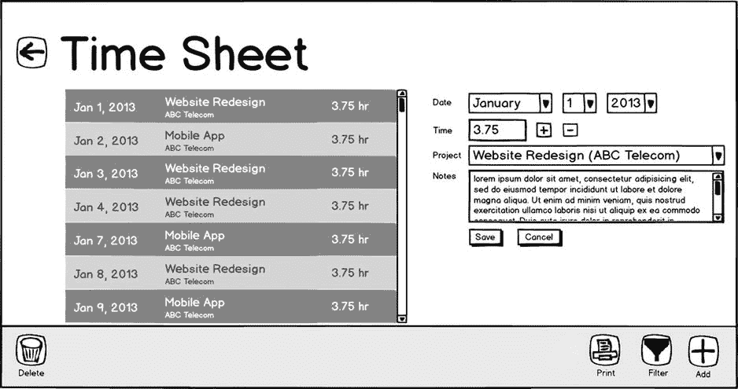

[图 12-2](#_Fig2) 。Clok 时间条目屏幕的早期模型

 **注意**为了创建我的 Clok 模型，我使用了一个流行的线框图工具，叫做 Balsamiq 样机。关于这个伟大工具的更多信息可以从 Balsamiq 网站获得，网址是`www.balsamiq.com/products/mockups`。使用线框或模型是一种很好的快速方法，可以确保你知道你将要构建什么。我强烈建议从模型开始工作，即使它们是白板上的图纸照片，巧合的是，这是我们将在第 22 章中添加到 Clok 的一个功能。

在左侧，用户将看到以前的时间条目列表，他们可以使用过滤器应用程序栏命令进行过滤。在右边，他们将能够编辑现有的一个。删除时间条目是一个场景，我将在本章稍后介绍，但我不会在本书的文本中实际介绍编辑现有时间条目或从该屏幕添加时间条目。这样做的代码类似于允许用户编辑或添加项目的代码。这本书附带的源代码确实有一个完整版本的时间表屏幕，包括从这个屏幕编辑时间条目或添加新条目的能力。(见该书的 Apress 产品页[ `www.apress.com/9781430257790` ]的源代码/下载标签)。)

创建和连接页面控件

首先要做的是在 Visual Studio 项目的`pages`文件夹中创建一个名为`timeEntries`的文件夹。在`timeEntries`文件夹中，添加一个名为`list.html`的新页面控件(参见[图 12-3](#Fig3) )。

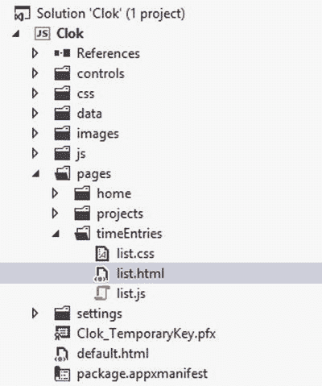

[图 12-3](#_Fig3) 。具有新的时间条目页面控件的解决方案资源管理器

现在我们必须修改 Clok dashboard 屏幕，以便时间表菜单选项([图 12-4](#Fig4) )将导航到我们的新页面控件。参考[第 11 章](11.html)，特别是[清单 11-9](#list9) 、[清单 11-10](#list10) 和[清单 11-11](#list11) ，如果你需要一个如何连接导航的快速提示。

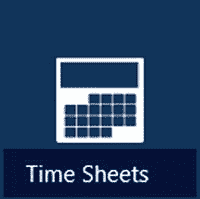

[图 12-4](#_Fig4) 。时间表菜单选项

对于这一部分，我们将从屏幕左侧唯一的时间条目列表开始。稍后，我们将添加用于过滤和删除时间条目的应用程序栏命令。首先，用来自[清单 12-17](#list17) 的代码替换`list.html`中`body`元素的全部内容。

[***清单 12-17。***](#_list17) 新增内容为 list.html

```js
<div class="timeEntryListPage fragment">
    <header aria-label="Header content" role="banner">
        <button class="win-backbutton" aria-label="Back" disabled type="button"></button>
        <h1 class="titlearea win-type-ellipsis">
            <span class="pagetitle">Time Sheets</span>
        </h1>
    </header>
    <section aria-label="Main content" role="main">
        <div id="timeEntryTemplate"
                data-win-control="WinJS.Binding.Template"
                style="display: none">
            <div class="timeEntryItem">
                <div class="timeEntryItem-dateWorked">
                    <h5 class="timeEntryItem-dateWorked-mon"
                        data-win-bind="textContent: dateWorked "></h5>
                    <h2 class="timeEntryItem-dateWorked-day"
                        data-win-bind="textContent: dateWorked"></h2>
                    <h5 class="timeEntryItem-dateWorked-year"
                        data-win-bind="textContent: dateWorked"></h5>
                </div>
                <div class="timeEntryItem-projectInfo">
                    <h3 class="timeEntryItem-projectName win-type-ellipsis"
                        data-win-bind="textContent: project.name"></h3>
                    <h6 class="timeEntryItem-clientName win-type-ellipsis"
                        data-win-bind="textContent: project.clientName"></h6>
                    <h6 class="timeEntryItem-projectNumber"
                        data-win-bind="textContent: project.projectNumber"></h6>
                </div>
                <div class="timeEntryItem-timeWorked">
                    <h2 class="timeEntryItem-timeWorked-elapsed"
                        data-win-bind="textContent: elapsedSeconds"></h2>
                    <h5>hours</h5>
                </div>
            </div>
        </div>

        <div id="timeEntriesContainer">
            <div id="timeEntriesListViewPane">
                <div
                    id="timeEntriesListView"
                    class="itemlist win-selectionstylefilled"
                    data-win-control="WinJS.UI.ListView"
                    data-win-options="{
                        itemTemplate: select('#timeEntryTemplate'),
                        selectionMode: 'multi',
                        swipeBehavior: 'select',
                        tapBehavior: 'directSelect'
                    }">
                </div>
                <div id="noMatchesFound">No data found.  Try adjusting the filters.</div>
                <div id="searchInProgress">
                    Searching for time entries...<br />
                    <progress />
                </div>
                <div id="searchError">There was an error searching for time entries.</div>
            </div>
            <div id="timeEntryDetailPane">
                <!-- edit form goes here -->
            </div>
        </div>
    </section>
</div>
```

至此，您可能已经非常熟悉这段代码在做什么了。我添加了一个名为`timeEntryTemplate`的`WinJS.Binding.Template`，并在页面上定义了两个区域。第二个是`timeEntryDetailPane div`元素，目前为空。我将在本章的后面回到这一点。我们在本节中使用的区域是`timeEntriesListViewPane div`元素。在那个区域中，我添加了一个`ListView`和一些其他的`div`元素，用于向用户显示不同的状态。这次我在`ListView`上设置了一些不同的属性。突出显示的代码显示了用于使`ListView`按预期运行的设置。在这种情况下，我们允许用户选择多个项目，通过在触摸屏上滑动项目或用鼠标右键单击。此外，如果用户点击或单击单个项目，该项目将被选中，其他任何项目都将被取消选中。接下来，用清单 12-18 中的代码替换`list.css`的全部内容。

[***清单 12-18。***](#_list18) 新内容为 list.css

```js
.timeEntryListPage section[role=main] {
    margin-left: 120px;
    width: calc(100% - 120px);
}

.hidden {
    display: none;
}

#timeEntriesContainer {
    display: -ms-flexbox;
    -ms-flex-align: start;
    -ms-flex-pack: start;
    -ms-flex-direction: row;
    -ms-flex-wrap: nowrap;
    height: 100%;
}

#timeEntriesListViewPane {
    -ms-flex: 0 auto;
    width: 600px;
    height: 100%;
}

#timeEntriesListView {
    height: 100%;
}

    #timeEntriesListView .win-container {
        background-color: #46468C;
    }

    #timeEntriesListView .timeEntryItem {
        display: -ms-grid;
        -ms-grid-columns: auto 1fr 150px;
    }

    #timeEntriesListView .timeEntryItem-dateWorked {
        -ms-grid-column: 1;
        margin: 5px;
        width: 75px;
        height: 75px;
        text-align: center;
        background-color: #8C8CD2;
    }

    #timeEntriesListView .timeEntryItem-dateWorked-day {
        font-weight: bold;
    }

    #timeEntriesListView .timeEntryItem-projectInfo {
        -ms-grid-column: 2;
        margin: 5px;
    }

    #timeEntriesListView .timeEntryItem-projectName {
        font-size: 1.25em;
    }

    #timeEntriesListView .timeEntryItem-timeWorked {
        -ms-grid-column: 3;
        height: 100%;
        margin-left: 5px;
        margin-right: 10px;
        text-align: right;
        display: -ms-flexbox;
        -ms-flex-pack: center;
        -ms-flex-direction: column;
    }

    #timeEntriesListView .timeEntryItem-timeWorked-elapsed {
        font-weight: bold;
    }

@media screen and (-ms-view-state: snapped) {
    .timeEntryListPage section[role=main] {
        margin-left: 20px;
        margin-right: 20px;
    }
}

@media screen and (-ms-view-state: fullscreen-portrait) {
    .timeEntryListPage section[role=main] {
        margin-left: 100px;
        margin-right: 100px;
    }
}
```

再说一次，这里没有你没见过的东西。我只是添加了 CSS，使用 flexbox 布局显示页面，并添加了一些规则来设计`timeEntryTemplate`的各个部分。

获取时间输入数据

到目前为止，还是真的没什么好看的。如果你现在运行 Clok，你会看到一个空的时间表页面，类似于图 12-5 。

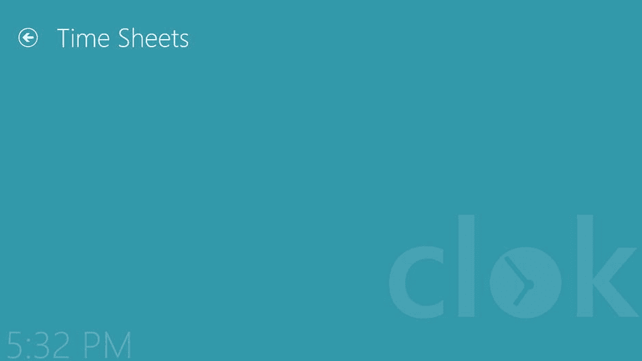

[图 12-5](#_Fig5) 。我们的工作正在进行中。还没什么可看的

 **注意**在我们所有的代码和技术讨论中，我都使用术语*时间条目*来指代应用程序的这一部分。然而，*时间表*对用户来说是一个更有意义的名字。请记住:虽然您应该在与开发人员交流时使用对开发人员有意义的名称和术语，但是您应该确保在您的用户界面和任何非技术文档中使用对您的用户有意义的名称和术语。如果有充分的理由让它们不同，这些术语不必匹配。

在[第 11 章](11.html)中，我们给`storage.js`添加了函数，允许我们为项目指定一个过滤器。这些函数最终返回一个经过过滤和排序的项目列表，我们在项目页面上将一个`ListView`绑定到这个列表。现在，我们将为时间条目做一些类似的事情。在`timeEntries`的定义之后，将[清单 12-19](#list19) 中高亮显示的代码添加到`storage.js`中。

[***清单 12-19。***](#_list19) 一个针对 storage.js 的时间条目比较器

```js
timeEntries: new WinJS.Binding.List([]),

compareTimeEntries: function (left, right) {
    // first sort by date worked...
    var dateCompare = left.dateWorked.getTime() - right.dateWorked.getTime();
    if (dateCompare !== 0) {
        return dateCompare;
    }

    // then sort by client name...
    if (left.project.clientName !== right.project.clientName) {
        return (left.project.clientName > right.project.clientName) ? 1 : -1;
    }

    // then sort by project name...
    if (left.project.name !== right.project.name) {
        return (left.project.name > right.project.name) ? 1 : -1;
    }

    return 0;
},
```

 **注意**比较函数应该返回-1、0 或 1。如果比较的两个值相等，函数应该返回 0。如果第一个值大于第二个函数，则返回 1。如果第二个函数大于第一个函数，则返回-1。

在这种情况下，我们决定使用更复杂的排序定义。时间条目将首先按日期排序，然后按客户名称排序，最后按项目本身的名称排序。接下来，在`storage.js`中，在`timeEntries.getById`的定义之前，添加来自[清单 12-20](#list20) 的高亮代码。

[***清单 12-20。***](#_list20) 时间录入搜索功能

```js
storage.timeEntries.getSortedFilteredTimeEntriesAsync = function (begin, end, projectId) {
    var filtered = this
        .createFiltered(function (te) {
            if (begin) {
                if (te.dateWorked < begin) return false;
            }

            if (end) {
                if (te.dateWorked >= end.addDays(1)) return false;
            }

            if (projectId && !isNaN(projectId) && Number(projectId) > 0) {
                if (te.projectId !== Number(projectId)) return false;
            }

            if (te.project.status !== Clok.Data.ProjectStatuses.Active) return false;

            return true;
        });

    var sorted = filtered.createSorted(storage.compareTimeEntries);

    return sorted;
};

storage.timeEntries.getById = function (id) {
    if (id) {
        var matches = this.filter(function (te) { return te.id === id; });
        if (matches && matches.length === 1) {
            return matches[0];
        }
    }
    return undefined;
};
```

虽然我们只允许用户按状态过滤项目列表，但允许他们按日期和项目过滤时间条目是有意义的。因此，`getSortedFilteredTimeEntriesAsync`接受三个参数:`begin`和`end`，用于定义日期范围，以及`projectId`，用于将时间条目列表限制为单个项目的时间条目。对于第一次迭代，我们不会使用那些过滤器，所有的时间条目都会显示出来。一旦我们得到了正确显示的未过滤列表，我们将在本章的下一节添加过滤。为此，添加清单 12-21 中突出显示的代码到`list.js`。

[***清单 12-21。***](#_list21) 添加别名使后续代码更容易编写

```js
(function () {
    "use strict";

    var data = Clok.Data;
    var storage = data.Storage;

    WinJS.UI.Pages.define("/pages/timeEntries/list.html", {
        // SNIPPED
    });
})();
```

用清单 12-22 中的代码替换`list.js`中页面定义的默认内容。

[***清单 12-22。***](#_list22) 页面定义为我们的第一次迭代

```js
ready: function (element, options) {

    this.setupListViewBinding(options);

    timeEntriesListView.winControl.layout = new WinJS.UI.ListLayout();

},

setupListViewBinding: function (options) {
    var results = storage.timeEntries.getSortedFilteredTimeEntriesAsync();

    if (results.length <= 0) {
        this.updateResultsArea(noMatchesFound);
    } else {
        this.updateResultsArea(timeEntriesListView);
    }

    timeEntriesListView.winControl.itemDataSource = results.dataSource;
},

updateResultsArea : function (div) {
    var allDivs = WinJS.Utilities.query("#timeEntriesListView, "
        + "#noMatchesFound, "
        + "#searchError, "
        + "#searchInProgress");

    allDivs.addClass("hidden");
    if (div) {
        WinJS.Utilities.removeClass(div, "hidden");
    }

    timeEntriesListView.winControl.forceLayout();
},
```

因为这在很大程度上类似于我已经在第 7 章和第 11 章中解释的内容，所以我将快速指出几件事。我已经将`ListView`控件设置为使用`ListLayout`，而不是默认的`GridLayout`。顾名思义，我们的`ListView`中的项目将从上到下显示在一个列表中，而不是像项目页面上那样从左到右显示在一个网格中。我还添加了一个名为`updateResultsArea`的函数，它将通过添加或删除一个名为`hidden`的 CSS 类来显示或隐藏`ListView`和在[清单 12-17](#list17) 中添加的各种状态`div`元素，这个 CSS 类在[清单 12-18](#list18) 中定义。最后，在`updateResultsArea`函数中，我调用了`ListView`的`forceLayout`方法。当一个`ListView`被隐藏时，WinJS 停止跟踪布局信息，所以当你改变一个`ListView`的显示时，你应该调用这个方法。更多关于`forceLayout`的信息可以在`http://msdn.microsoft.com/en-us/library/windows/apps/hh758352.aspx`的 MSDN 上找到。

运行 Clok 并导航至“时间表”页面。你应该看到我们之前添加的所有临时数据，在一个格式良好的列表中(见[图 12-6](#Fig6) )。大部分是。我们还需要添加一些内容来适当地格式化日期和时间。


[图 12-6](#_Fig6) 。需要一点点工作，但差不多了

为了解决日期和时间格式问题，我们将再次使用绑定转换器。让我们通过添加清单 12-23 中突出显示的代码到`timeEntry.js`来定义一些转换器。

[***清单 12-23。***](#_list23) 为日期和时间绑定转换器

```js
var secondsToHoursConverter = WinJS.Binding.converter(function (s) {
    return (s / 3600).toFixed(2);
});

var dateToDayConverter = WinJS.Binding.converter(function (dt) {
    return formatDate("day", dt);
});

var dateToMonthConverter = WinJS.Binding.converter(function (dt) {
    return formatDate("month.abbreviated", dt);
});

var dateToYearConverter = WinJS.Binding.converter(function (dt) {
    return formatDate("year", dt);
});

var formatDate = function (format, dt) {
    var formatting = Windows.Globalization.DateTimeFormatting;
    var formatter = new formatting.DateTimeFormatter(format)
    return formatter.format(dt);
}

WinJS.Namespace.define("Clok.Data", {
    TimeEntry: timeEntryClass,
    DateToDayConverter: dateToDayConverter,
    DateToMonthConverter: dateToMonthConverter,
    DateToYearConverter: dateToYearConverter,
    SecondsToHoursConverter: secondsToHoursConverter,
});
```

接下来，为`list.html`中的每个数据绑定元素指定要使用的转换器(参见[清单 12-24](#list24) 中突出显示的代码)。

[***清单 12-24。***](#_list24) 使用新转换器

```js
<div class="timeEntryItem">
    <div class="timeEntryItem-dateWorked">
        <h5 class="timeEntryItem-dateWorked-mon"
            data-win-bind="textContent: dateWorked Clok.Data.DateToMonthConverter "></h5>
        <h2 class="timeEntryItem-dateWorked-day"
            data-win-bind="textContent: dateWorked Clok.Data.DateToDayConverter "></h2>
        <h5 class="timeEntryItem-dateWorked-year"
            data-win-bind="textContent: dateWorked Clok.Data.DateToYearConverter "></h5>
    </div>
    <div class="timeEntryItem-projectInfo">
        <h3 class="timeEntryItem-projectName win-type-ellipsis"
            data-win-bind="textContent: project.name"></h3>
        <h6 class="timeEntryItem-clientName win-type-ellipsis"
            data-win-bind="textContent: project.clientName"></h6>
        <h6 class="timeEntryItem-projectNumber"
            data-win-bind="textContent: project.projectNumber"></h6>
    </div>
    <div class="timeEntryItem-timeWorked">
        <h2 class="timeEntryItem-timeWorked-elapsed"
            data-win-bind="textContent: elapsedSeconds Clok.Data.SecondsToHoursConverter "></h2>
        <h5>hours</h5>
    </div>
</div>
```

如果您再次运行 Clok，时间条目列表的格式应该与图 12-2 中的模型略有不同，但是图 12-7 中的[当前状态看起来相当不错。](#Fig7)

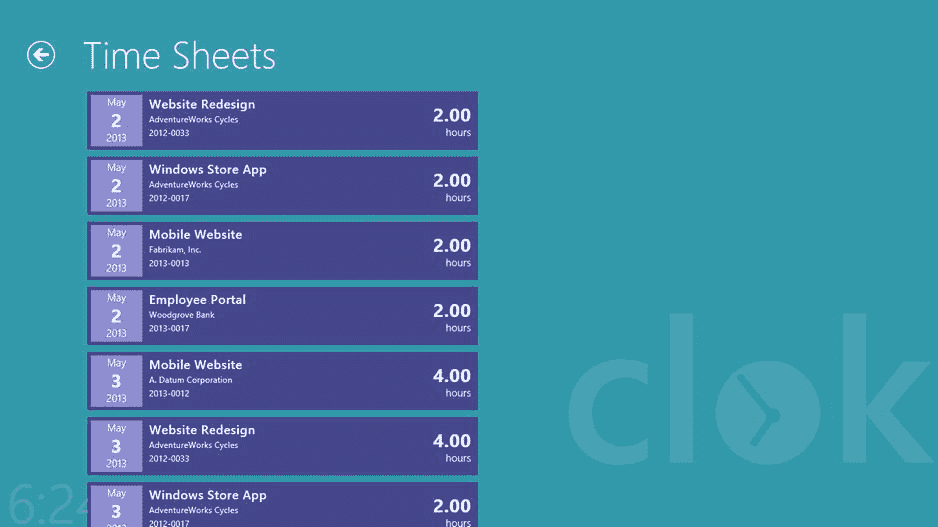

[图 12-7](#_Fig7) 。一个格式良好的时间条目列表

获取时间输入数据，这次是有承诺的

应用程序的当前状态工作得很好，就像它过滤一些已经在内存中的时间条目记录一样。然而，实际上，您的应用程序可能正在从远程数据源检索数据，这需要几秒钟或更长的时间来响应。我们将通过从`getSortedFilteredTimeEntriesAsync`函数返回一个`WinJS.Promise`对象来处理这个问题。更改`storage.js`中的`getSortedFilteredTimeEntriesAsync`函数，使其与[清单 12-25](#list25) 中的代码匹配，注意突出显示的代码。

[***清单 12-25。***](#_list25) 一诺千金

```js
storage.timeEntries.getSortedFilteredTimeEntriesAsync = function (begin, end, projectId) {
    return new WinJS.Promise(function (complete, error) {
        setTimeout(function () {
            try {
                var filtered = this
                    .createFiltered(function (te) {
                        if (begin) {
                            if (te.dateWorked < begin) return false;
                        }

                        if (end) {
                            if (te.dateWorked >= end.addDays(1)) return false;
                        }

                        if (projectId && !isNaN(projectId) && Number(projectId) > 0) {
                            if (te.projectId !== Number(projectId)) return false;
                        }

                        if (te.project.status !== Clok.Data.ProjectStatuses.Active) {
                            return false;
                        }

                        return true;
                    });

                var sorted = filtered.createSorted(storage.compareTimeEntries);

                //// simulate a delay
                //for (var i = 1; i <= 50000000; i++) { }

                //// simulate an error
                //throw 0;

                complete(sorted);
            } catch (e) {
                error(e);
            }
        }.bind(this), 10);
    }.bind(this));
};

storage.timeEntries.getById = function (id) {
    // SNIPPED
};
```

方法的主体大部分和以前一样。我只是将以前的方法体包装在一个新的`Promise`中。我没有返回`sorted`，而是将`sorted`传递给`Promise`构造函数中提供的`complete`方法。对`setTimeout`的调用导致这段代码立即返回，然后异步执行。

完整的处理程序

你可能已经注意到清单 12-25 中的一些注释语句。一个用于模拟获得结果的延迟，另一个用于模拟错误。现在，取消对模拟延迟的注释(参见[清单 12-26](#list26) )。在完成本节中的其余代码后，您需要回到这行代码，重新注释或删除它。

[***清单 12-26。***](#_list26) 模拟一次延迟

```js
//// simulate a delay
for (var i = 1; i <= 50000000 ; i++) { }
```

注意这是一种不精确的模拟延迟的方式。根据你的电脑，你可能要调整循环的上端:太小，你看不到进度条；太大，你会因为看到进度条的时间太长而感到沮丧。

既然`getSortedFilteredTimeEntriesAsync`函数返回了一个`Promise`，我们必须改变我们在`list.js`中进行数据绑定的方式。用[清单 12-27](#list27) 中的代码更新`setupListViewBinding`。

[***清单 12-27。***](#_list27) 履行诺言时具有约束力

```js
setupListViewBinding: function (options) {
    this.updateResultsArea(searchInProgress);

    storage.timeEntries.getSortedFilteredTimeEntriesAsync()
        .then(
            function complete(results) {
                if (results.length <= 0) {
                    this.updateResultsArea(noMatchesFound);
                } else {
                    this.updateResultsArea(timeEntriesListView);
                }
                timeEntriesListView.winControl.itemDataSource = results.dataSource;
            }.bind(this),
            function error(results) {
                this.updateResultsArea(searchError);
            }.bind(this)
        );
},
```

我们来走一遍这个版本的`setupListViewBinding`。第一条语句将向用户显示一条消息，表明正在进行搜索。调用`getSortedFilteredTimeEntriesAsync`返回一个`Promise`，而不是数据，所以我在`then`方法的一个参数中处理了数据绑定。第一个参数是当承诺已经实现并且结果可用时要调用的函数。如果有结果，我显示`ListView`，如果没有，我向用户显示适当的消息。

 **注意**在这个例子中，我将两个处理函数命名为`complete`和`error`。实际上，你可以给这些起任何对你有意义的名字。名字无关紧要。其实完全可以省略名字。例如，我可以写`function (results) {...}`而不是`function complete(results) {...}`。在这种情况下，名称是为了更容易理解。

现在运行 Clok。假设你已经在清单 12-26 的[中将模拟延迟设置为一个合适的数字，你将会看到一个“进行中”的信息和进度条(见](#list26)[图 12-8](#Fig8) )，最终，你会看到之前在[图 12-7](#Fig7) 中看到的相同的时间条目列表。


[图 12-8](#_Fig8) 。搜索时间条目—模拟延迟

此时，我们已经看到时间表页面处于“进行中”状态和“找到结果”状态。让我们做一个快速、临时的更改，这样我们就可以确保“没有找到结果”状态也能像预期的那样工作。对于这个测试，改变对`list.js`中`getSortedFilteredTimeEntriesAsync`的调用，以便它搜索遥远未来某个日期之后的时间条目(参见[清单 12-28](#list28) 中突出显示的代码)。

[***清单 12-28。***](#_list28) 为 Begin 参数指定一个值到遥远未来的某个日期

```js
storage.timeEntries.getSortedFilteredTimeEntriesAsync( new Date("1/1/2500") )
```

从`getSortedFilteredTimeEntriesAsync`返回的`Promise`对象仍将被实现，并将成功完成。然而，因为我们没有在我们的临时数据中提前定义任何条目，所以不会找到任何结果(见[图 12-9](#Fig9) )。

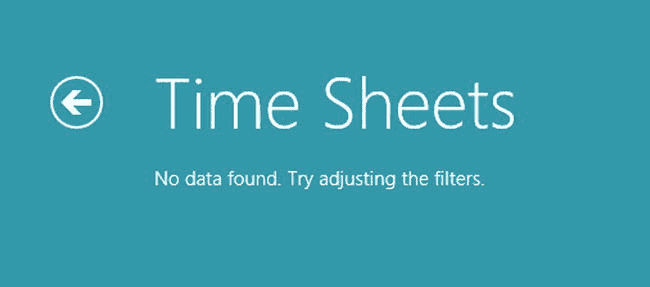

[图 12-9](#_Fig9) 。找不到 2500 年 1 月 1 日之后的时间条目

错误处理程序

目前为止，一切顺利。我们尚未处理的唯一情况是从`getSortedFilteredTimeEntriesAsync`返回的`Promise`对象处于错误状态。因为你不再需要在检索时间输入数据时模拟延迟，你现在可以删除，或者重新注释清单 12-26 中的代码。另外，一定要撤销在[清单 12-28](#list28) 中所做的更改，测试返回一个没有结果的承诺。现在，我们想模拟一个错误，所以切换回`storage.js`，取消[清单 12-29](#list29) 中代码的注释。

[***清单 12-29。***](#_list29) 模拟错误

```js
//// simulate an error
throw 0;
```

现在，当你运行 Clok 时，在[清单 12-27](#list27) 中定义的`error`处理程序将被调用，而不是`complete`处理程序。在 Clok 中，我们简单地向用户显示一条友好的消息(见[图 12-10](#Fig10) )。在其他应用程序中，我们可能会使用它来记录错误，或者将错误信息报告给我们的开发团队。


[图 12-10](#_Fig10) 。有一个错误

此时，您已经实现了处理时间表页面可能处于的各种状态的代码:搜索、找到并显示结果、没有找到结果以及错误状态。继续删除或重新注释清单 12-29 中的代码，因为不再需要模拟错误。

过滤时间条目

我已经提到过`getSortedFilteredTimeEntriesAsync`可以按日期或项目过滤时间条目。事实上，我们在清单 12-28 中使用了这个特性来做一些测试。现在是时候向 Clok 添加特性了，这样用户就可以以一种有意义的方式过滤时间条目。在本节中，我们将为用户提供两种过滤数据的方法。首先，我们将向项目详细信息页面添加一个按钮，以查看所选项目的时间条目。然后，我们将向时间表页面添加一些过滤控件，以便用户可以在查看时间条目时指定日期范围或项目。

从项目详细信息中筛选

您可能想知道为什么我要将页面的`options`参数传递给清单 12-27 中的`setupListViewBinding`函数。当我们从项目详细信息页面导航到时间表页面时，必须提供当前选择的项目，并且它将在这个`options`对象中传递。在我们修改项目细节页面之前，让我们对`timeEntries`文件夹中的`list.js`文件做一些必要的修改。对清单 12-30 至`list.js`中突出显示的内容进行更改。

[***清单 12-30。***](#_list30) 对 list.js 的修改

```js
setupListViewBinding: function (options) {
    this.filter = WinJS.Binding.as({
        startDate: (options && options.startDate) || (new Date()).addMonths(-1),
        endDate: (options && options.endDate) || new Date().removeTimePart(),
        projectId: (options&&
 **options.projectId) || -1**
    **});**

    **this.filter.bind("startDate", this.filter_changed.bind(this));**
    **this.filter.bind("endDate", this.filter_changed.bind(this));**
    **this.filter.bind("projectId", this.filter_changed.bind(this));**
**},**

**filter_changed** `: function (e) {`
    `this.updateResultsArea(searchInProgress);`

    **storage.timeEntries.getSortedFilteredTimeEntriesAsync(**
            **this.filter.startDate,**
            **this.filter.endDate,**
            **this.filter.projectId)**
        `.then(`
            `function complete(results) {`
                `if (results.length <= 0) {`
                    `this.updateResultsArea(noMatchesFound);`
                `} else {`
                    `this.updateResultsArea(timeEntriesListView);`
                `}`
                `timeEntriesListView.winControl.itemDataSource = results.dataSource;`
            `}.bind(this),`
            `function error(results) {`
                `this.updateResultsArea(searchError);`
            `}.bind(this)`
        `);`
`},`
```

 `这段代码为`setupListViewBinding`指定了一个新的定义，它声明了一个可观察的`filter`属性。另外，先前对`setupListViewBinding`函数的定义已经转移到一个名为`filter_changed`的新处理函数中。这与我们在第 11 章中为过滤项目所做的非常相似。不同的是，在这个页面上，`filter`可观察对象有三个属性可以改变:`startDate`、`endDate`和`projectId`。当这些属性中的任何一个发生变化时，就会调用新的`filter_changed`函数，并检索一组新的时间条目。新的`filter_changed`函数和以前的`setupListViewBinding`函数之间的唯一区别是各种`filter`属性作为参数被提供给`getSortedFilteredTimeEntriesAsync`的调用。

 **注意**如果我不知道我们将在下一节中添加的功能需求，那么[清单 12-30](#list30) 中的代码可能会简单一点。然而，因为我们将在下一节中利用所有这些变化，所以我现在添加了它们。

因此，我们的时间表页面现在被配置为支持从 Clok 中的不同位置进行过滤。现在，我们只需添加允许用户请求时间条目过滤列表的功能。打开`projects`文件夹中的`detail.html`文件，将[清单 12-31](#list31) 中高亮显示的代码添加到`projectDetailAppBar`中。

[***清单 12-31。***](#_list31) 向应用栏添加考勤表按钮

```js
<div id="projectDetailAppBar"
        class="win-ui-dark"
        data-win-control="WinJS.UI.AppBar"
        data-win-options="{ sticky: true }">

    <!-- SNIPPED -->
    <hr
        data-win-control="WinJS.UI.AppBarCommand"
        data-win-options="{type:'separator',section:'selection'}" />
    <button
        data-win-control="WinJS.UI.AppBarCommand"
        data-win-options="{
            id:'goToTimeEntriesCommand',
            label:'Time Sheet',
            icon:'url(/img/Timesheet-small-sprites.png)',

            section:'selection',
            tooltip:'Time Entries',
            disabled: true}">
    </button>
</div>
```

注意，我为这个新的`AppBarCommand`的`icon`属性指定了一个图像的路径。除了在`WinJS.UI.AppBarIcon`枚举中定义的所有图标，`AppBarCommand`对象可以使用自定义图像。对于 Clok，我创建了一个名为`Timesheet-small-sprites.png`的特殊格式的图像(见[图 12-11](#Fig11) )。


[图 12-11](#_Fig11) 。用于 AppBarCommand 图标的图像

这个图像有一个透明的背景，由两行组成，每行有四个版本的图标。当`AppBarCommand`处于正常状态时使用第一行，当其处于切换状态时使用第二行。因为这个`AppBarCommand`不需要切换状态，所以我没有在第二行创建图像。每个图标为 40×40 像素，整个图像为 160×80。从左到右，每行的四个图像分别用于按钮的默认状态、悬停状态、活动状态(当它被单击时)和禁用状态。因为 WinJS 会自动在图像周围添加圆环，所以只需要图标本身。`AppBarCommand.icon`遗产的文件可在`http://msdn.microsoft.com/en-us/library/windows/apps/hh700483.aspx`的 MSDN 上获得。此外，当我第一次研究这个问题时，我发现这篇博客文章特别有帮助:`http://blogs.msdn.com/b/shawnste/archive/2012/06/16/custom-appbar-sprite-icons-for-your-windows-8-metro-style-html-app.aspx`。

最后一步是在`detail.js`中连线`goToTimeEntriesCommand`。用清单 12-32 中[突出显示的代码更新`detail.js`。](#list32)

[***清单 12-32。***](#_list32) 接线新的 AppBarCommand

```js
ready: function (element, options) {
    // SNIPPED
    saveProjectCommand.onclick = this.saveProjectCommand_click.bind(this);
    deleteProjectCommand.onclick = this.deleteProjectCommand_click.bind(this);
    goToTimeEntriesCommand.onclick = this.goToTimeEntriesCommand_click.bind(this);
},

// SNIPPED

deleteProjectCommand_click: function (e) {
    storage.projects.delete(this.currProject);
    WinJS.Navigation.back();
},

goToTimeEntriesCommand_click: function (e) {
    if (this.currProject &&
 **this.currProject.id) {**
        **WinJS.Navigation.navigate("/pages/timeEntries/list.html",**
            **{ projectId: this.currProject.id });**
    **}**
**},**

`// SNIPPED`

`configureAppBar: function (existingId) {`

    `// SNIPPED`

    `if (existingId) {`
        `deleteProjectCommand.winControl.disabled = false;`
        **goToTimeEntriesCommand.winControl.disabled = false;**
    `}`
`},`

`// SNIPPED`
```

 `我们终于准备好测试这些变化了。立即运行 Clok 并转到现有项目的项目详细信息页面。如果你查看应用程序栏，你应该看到时间表命令被激活(见[图 12-12](#Fig12) )。


[图 12-12](#_Fig12) 。项目详细信息页面上的新 appbar 命令

我们在[清单 12-31](#list31) 和[清单 12-32](#list32) 中添加的代码将导致该按钮在添加新项目时被禁用，而在查看现有项目的详细信息时被启用。正如您可能期望的那样，点击 new 按钮将导航到时间表页面，为当前选择的项目提供`projectId`作为导航选项(参见[图 12-13](#Fig13) )。

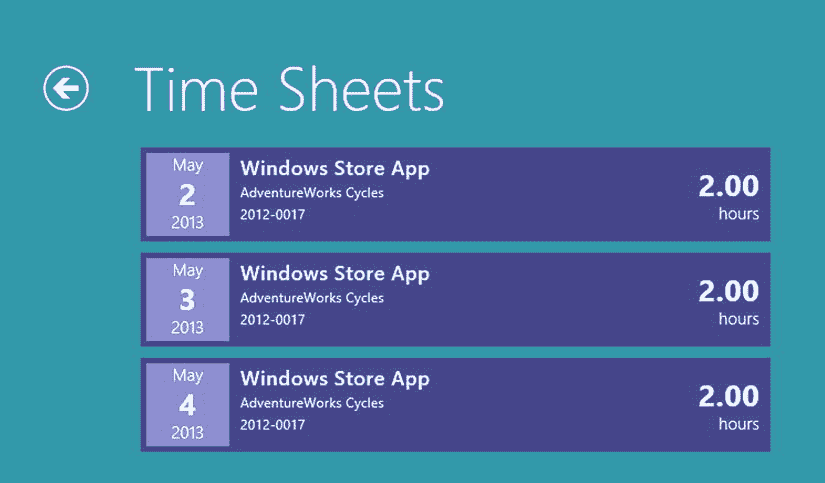

[图 12-13](#_Fig13) 。所选项目的时间条目

使用应用程序栏过滤

能够看到单个项目的时间条目列表非常方便。作为一个 Clok 用户，我可以看到自己经常使用这个功能。但是，目前没有办法按日期过滤时间条目列表，为了查看不同项目的条目，您必须导航回项目页面，从列表中选择不同的项目，然后单击时间表按钮。这是很好的功能，但还不够。我们必须添加一种方法来过滤时间表页面上的时间条目。将[清单 12-33](#list33) 中的代码添加到`list.html`中的开始`body`元素之后。

[***清单 12-33。***](#_list33) 添加应用栏和弹出按钮

```js
<div id="filterFlyout"
    data-win-control="WinJS.UI.Flyout">

    <label for="filterStartDate">From</label><br />
    <div id="filterStartDate" data-win-control="WinJS.UI.DatePicker"></div>

    <br />

    <label for="filterEndDate">To</label><br />
    <div id="filterEndDate" data-win-control="WinJS.UI.DatePicker"></div>

    <hr />

    <label for="filterProjectId">Project</label><br />
    <select id="filterProjectId">
        <option value="-1">All projects</option>
    </select>

    <br />

    <button id="clearFilterButton"> Clear Filter</button>
</div>

<div id="timeEntryAppBar"
    class="win-ui-dark"
    data-win-control="WinJS.UI.AppBar"
    data-win-options="{ sticky: true }">

    <button
        data-win-control="WinJS.UI.AppBarCommand"
        data-win-options="{
            id:'filterTimeEntriesCommand',
            label:'Filter',
            icon:'filter',
            type: 'flyout',
            flyout: 'filterFlyout',
            section:'global',
            tooltip:'Filter'}">
    </button>
</div>
```

我已经向时间表页面添加了一个`AppBar`，它包含一个过滤器按钮。单击过滤器按钮将打开一个弹出菜单，其中有几个选项用于过滤`ListView`中显示的时间条目。现在，将清单 12-34 中的简单 CSS 添加到`list.css`中。

[***清单 12-34。***](#_list34) 样式清晰滤镜按钮

```js
#clearFilterButton {
    border: 0px;
    background-color: transparent;
    float: right;
}

    #clearFilterButton:active {
        color: #666666;
    }
```

有了这些控件，它们的初始值必须设置为与`filter`的当前值相匹配。此外，当这些控件的值发生变化时，我们必须更新`filter`。这两项任务都将通过将[清单 12-35](#list35) 中高亮显示的代码添加到`list.js`中的`setupListViewBinding`函数中来完成。

[***清单 12-35。***](#_list35) 连接用于过滤的控件

```js
setupListViewBinding: function (options) {
    this.filter = WinJS.Binding.as({
        startDate: (options && options.startDate) || (new Date()).addMonths(-1),
        endDate: (options && options.endDate) || new Date().removeTimePart(),
        projectId: (options && options.projectId) || -1
    });

    this.filter.bind("startDate", this.filter_changed.bind(this));
    this.filter.bind("endDate", this.filter_changed.bind(this));
    this.filter.bind("projectId", this.filter_changed.bind(this));

    filterStartDate.winControl.current = this.filter.startDate;
    filterEndDate.winControl.current = this.filter.endDate;
    filterProjectId.value = this.filter.projectId;

    filterStartDate.winControl.onchange = this.filterStartDate_change.bind(this);
    filterEndDate.winControl.onchange = this.filterEndDate_change.bind(this);
    filterProjectId.onchange = this.filterProjectId_change.bind(this);
    clearFilterButton.onclick = this.clearFilterButton_click.bind(this);
},
```

接下来，我们必须定义[清单 12-35](#list35) 中引用的事件处理程序。此外，我们必须用当前活动的项目填充项目过滤器下拉列表，就像 Clok 仪表板屏幕上的下拉列表一样。在定义了`filter_changed`之后，添加新的事件处理程序和新的`bindListOfProjects`函数，如[清单 12-36](#list36) 所示。

[***清单 12-36。***](#_list36)list . js 中的新功能

```js
filter_changed: function (e) {
    // SNIPPED
},

filterStartDate_change: function (e) {
    this.filter.startDate = filterStartDate.winControl.current;
},

filterEndDate_change: function (e) {
    this.filter.endDate = filterEndDate.winControl.current;
},

filterProjectId_change: function (e) {
    this.filter.projectId = filterProjectId.value;
},

clearFilterButton_click: function (e) {
    filterStartDate.winControl.current = new Date().addMonths(-1);
    filterEndDate.winControl.current = new Date().removeTimePart();
    filterProjectId.value = -1;

    this.filterStartDate_change();
    this.filterEndDate_change();
    this.filterProjectId_change();
},

bindListOfProjects: function (selectControl) {
    selectControl.options.length = 1;

    var activeProjects = storage.projects.filter(function (p) {
        return p.status === Clok.Data.ProjectStatuses.Active;
    });

    activeProjects.forEach(function (item) {
        var option = document.createElement("option");
        option.text = item.name + " (" + item.projectNumber + ")";
        option.title = item.clientName;
        option.value = item.id;
        selectControl.appendChild(option);
    });
},
```

当任何一个过滤器控件被改变时，当前`filter`对象上的相应属性被设置，这将触发`filter_change`方法。单击清除滤镜按钮，简单地将滤镜控件重置为默认值，并更新当前的`filter`对象。`bindListOfProjects`功能与`home.js`中的同名功能几乎相同。唯一的区别是提供了一个下拉列表控件作为函数的参数，这允许在实现编辑现有时间条目的功能时重用`bindListOfProjects`，这可以在本书附带的源代码中看到。最后需要做的改变是在`ready`函数中调用`bindListOfProjects`函数。将清单 12-37 中突出显示的代码添加到`list.js`中的`ready`函数中。

[***清单 12-37。***](#_list37) 向 filterProjectId 添加项目

```js
ready: function (element, options) {

    this.bindListOfProjects(filterProjectId);

    this.setupListViewBinding(options);

    timeEntriesListView.winControl.layout = new WinJS.UI.ListLayout();

},
```

这样，您现在在时间表页面上就有了一个全功能的过滤器。运行 Clok 并尝试一下。选择不同的日期，选择一个项目，然后单击“清除过滤器”按钮。一旦您对其中一个过滤器控件进行了更改，`ListView`会立即更新匹配结果(参见[图 12-14](#Fig14) )。

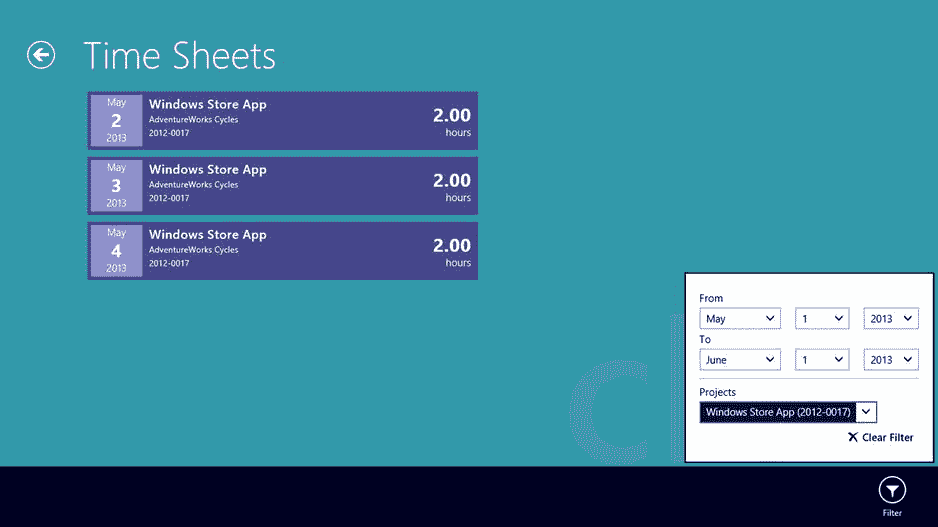

[图 12-14](#_Fig14) 。“时间表”页面上使用的过滤器弹出按钮

删除时间条目

我们可以创建，也可以阅读时间条目；我们已经实现了一半的 CRUD 操作。现在让我们给用户删除的能力。回到清单 12-17 中的[，我们配置了`ListView`来支持多重选择。在本节中，我们将利用这一点，允许用户选择一个或多个要删除的时间条目。让我们从在应用程序栏中添加一个删除按钮开始。在`list.html`的`timeEntryAppBar`控件中添加清单 12-38](#list17) 中突出显示的代码。

[***清单 12-38。***](#_list38) 向应用程序栏添加删除按钮

```js
<div id="timeEntryAppBar"
    class="win-ui-dark"
    data-win-control="WinJS.UI.AppBar"
    data-win-options="{ sticky: true }">

    <button
        data-win-control="WinJS.UI.AppBarCommand"
        data-win-options="{
            id:'deleteTimeEntriesCommand',
            label:'Delete',
            icon:'delete',
            section:'selection',
            tooltip:'Delete',
            disabled: true}">
    </button>

    <button
        data-win-control="WinJS.UI.AppBarCommand"
        data-win-options="{
            id:'filterTimeEntriesCommand',
            label:'Filter',
            icon:'filter',
            type: 'flyout',
            flyout: 'filterFlyout',
            section:'global',
            tooltip:'Filter'}">
    </button>
</div>
```

想一想 Windows 8 开始屏幕是如何工作的。当您在开始屏幕上选择一个或多个互动程序时，会出现一个应用程序栏，其中包含适合您选择的命令。我们对 Clok 的要求也差不多。默认情况下，我们刚刚添加的删除按钮是禁用的，但是当选择一个或多个时间条目时，应该显示应用程序栏，并且应该启用删除按钮。将清单 12-39 中的代码添加到`list.js`中。

[***清单 12-39。***](#_list39) 配置应用栏，基于当前选择

```js
timeEntriesListView_selectionChanged: function (e) {
    var selectionCount = timeEntriesListView.winControl.selection.count();

    if (selectionCount <= 0) {
        deleteTimeEntriesCommand.winControl.disabled = true;
        timeEntryAppBar.winControl.hide();
    } else {
        deleteTimeEntriesCommand.winControl.disabled = false;
        timeEntryAppBar.winControl.show();
    }
},
```

每次用户选择或取消选择`ListView`中的项目时，该功能将检查当前选择了多少个项目。如果选择了一个或多个项目，将显示应用程序栏，并启用删除按钮(参见[图 12-15](#Fig15) )。

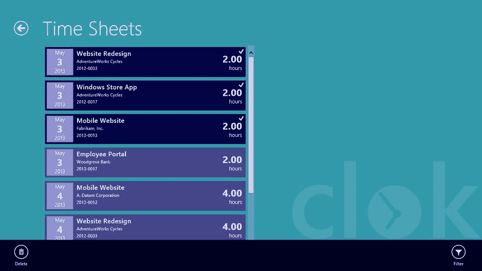

[图 12-15](#_Fig15) 。任何选择都会显示应用程序栏并启用删除按钮

当用户点击删除按钮时，我们当然希望从列表中删除时间条目。在我们定义`Storage`类中的`delete`函数之前，让我们看看当用户点击删除按钮时将执行的函数。将清单 12-40 中[的代码添加到`list.js`中。](#list40)

[***清单 12-40。***](#_list40) 点击处理删除按钮

```js
deleteTimeEntriesCommand_click: function (e) {
    timeEntriesListView.winControl.selection.getItems()
        .then(function complete(selectedItems) {
            var deletePromises = selectedItems.map(function (item) {
                return storage.timeEntries.delete(item.data);
            });

            return WinJS.Promise.join(deletePromises);
        })
        .then(null, function error(result) {
            new Windows.UI.Popups
                .MessageDialog("Could not delete all selected records.", "An error occurred. ")
                .showAsync();
        });
},
```

`ListView`类有一个`selection`属性，该属性又有一个`getItems`函数，用于标识`ListView`中的哪些项目当前被选中。然而，`getItems`函数实际上并不返回被选中的项目。相反，它返回一个`Promise`对象。当 promise 完成时，它的`then`方法被调用，选择的项目作为参数传递给`complete`函数，即`then`的第一个参数。我们将要添加到`Storage`类中的`delete`函数也将返回一个`Promise`(我们将很快定义它)，并且，使用`map`方法，用户的选择被映射到一个表示删除操作的`Promise`对象的数组。第一个`then`调用返回一个用`join`方法从该数组创建的新的`Promise`。当所有输入的`Promise`对象被满足时，从`join`创建的`Promise`被满足。如果成功删除所有选定的时间条目，第二个`then`函数不做任何事情，因为它没有`complete`函数(第一个参数是`null`)。但是，如果有任何错误，将向用户显示一条消息。

将[清单 12-41](#list41) 中高亮显示的代码添加到`list.js`中的`ready`函数中，以连接`timeEntriesListView_selectionChanged`和`deleteTimeEntriesCommand_click`处理程序。

[***清单 12-41。***](#_list41) 连接起事件处理程序

```js
ready: function (element, options) {

    this.bindListOfProjects(filterProjectId);

    this.setupListViewBinding(options);

    timeEntriesListView.winControl.onselectionchanged =
        this.timeEntriesListView_selectionChanged.bind(this);
    timeEntriesListView.winControl.layout = new WinJS.UI.ListLayout();

    deleteTimeEntriesCommand.winControl.onclick =
        this.deleteTimeEntriesCommand_click.bind(this);
},
```

现在，我们需要在`Storage`类中定义`delete`函数。将[清单 12-42](#list42) 中的代码添加到`storage.timeEntries.save`定义后的`storage.js`中。

[***清单 12-42。***](#_list42) 有删除时间条目的功能

```js
storage.timeEntries.delete = function (te) {
    var canceled = false;

    var delPromise = new WinJS.Promise(function (complete, error) {
        setTimeout(function () {
            try {
                if (te && te.id) {
                    var index = this.indexOf(te);
                    if (!canceled && index >= 0) {
                        this.splice(index, 1);
                    }
                }
                complete();
            } catch (e) {
                error(e);
            }
        }.bind(this), 100);
    }.bind(this),
    function oncancel(arg) {
        canceled = true;
    }.bind(this));

    return WinJS.Promise.timeout(20, delPromise);
};
```

当然，在我们使用内存数据的简单例子中，这段代码是多余的。我们可以删除除了突出显示的代码之外的所有内容，然后就到此为止。然而，有两个原因使我不打算那样做。首先，我们不会总是像这样使用内存中的数据。其次，也是更重要的，我正在写关于承诺的一章，所以我必须创建一个例子来说明如何创建一个`Promise`并取消它。

让我们浏览一下清单 12-42 中的代码。我已经创建了一个新的`Promise`，在`setTimeout`中定义的 100 毫秒延迟之后，它实际上删除了数据，假设`canceled`变量仍然是`false`。如果成功，调用`complete`方法，将成功信号返回给我们在[清单 12-40](#list40) 中的代码。如果有任何错误，`Promise`被置于错误状态，最终导致对话框显示给用户。在这个例子中，我在`Promise`构造函数中加入了第二个参数。如果`Promise`由于某种原因需要取消任何剩余的工作，就会调用`oncancel`函数。

有两种方法可以使用`WinJS.Promise.timeout`功能。第一种情况是只提供第一个参数，并且该参数是数值型的。在这种情况下，成功完成的`Promise`在指定的延迟后返回。我在清单 12-42 中使用的`WinJS.Promise.timeout`的第二个版本有两个参数。第一个还是一个数字，第二个是另一个`Promise`。如果在指定的毫秒数过去之前`Promise`没有完成，则`Promise`被取消。在本例中，我取消了`Promise`，它在 20 毫秒后删除数据。因为在那个`Promise`开始执行之前有 100 毫秒的延迟，所以每次都会被取消。运行 Clok 并选择一些时间条目，然后单击删除按钮。因为超时发生在`Promise`执行之前，所以`Promise`被取消，这被捕获为一个错误。然后，向用户显示一条消息(见[图 12-16](#Fig16) )。

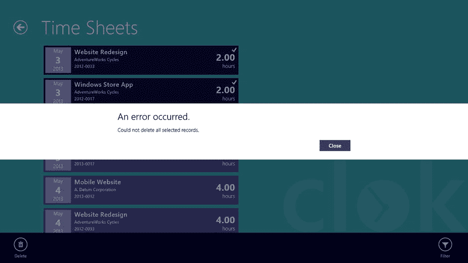

[图 12-16](#_Fig16) 。通知用户删除操作失败的错误消息

我希望大家清楚，这种被迫的失败只是为了展示这是如何工作的。在我们的`delete`函数中有代码来处理需要取消`Promise`的情况是很好的，在我们的删除按钮的点击处理程序中有代码来处理错误也是很好的。对依赖于外部资源的代码设置超时可能是一个好的做法，如果执行时间太长，可能必须取消这些外部资源。然而，拥有一个`WinJS.Promise`并不太实际。`timeout`在其有机会执行之前取消删除操作。因此，用清单 12-43 中突出显示的代码更新`storage.js`中的`delete`函数。

[***清单 12-43。***](#_list43) 更新删除功能

```js
storage.timeEntries.delete = function (te) {
    // SNIPPED

    return delPromise;
};
```

现在这个函数返回未取消的`Promise`，您可以运行 Clok 并删除一些时间条目。你应该可以删除任意多的内容，一次删除一个或者一次删除几个(见[图 12-17](#Fig17) )。您可以通过在触摸屏上滑动或用鼠标右键单击来选择多个项目。

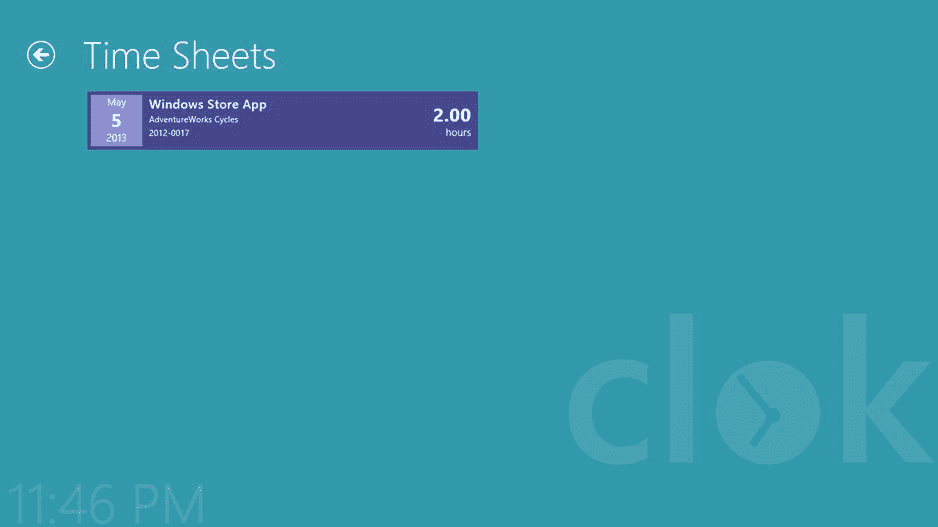

[图 12-17](#_Fig17) 。除了一个时间条目外，其他条目都已删除

 **注意**尽管本书中没有涉及，但编辑现有时间条目的功能包含在本书随附的源代码中。

结论

这是另一个包含大量代码的章节。在添加添加、查看和删除时间条目的能力的过程中，我介绍了几种不同的方法来利用`WinJS.Promise`类，以允许您的应用程序在等待异步操作完成时保持响应。当从 Clok dashboard 屏幕保存新的时间条目时，我介绍了如何协调两个不同的承诺并执行一些代码，一旦两个承诺都实现了，就使用`join`函数。在查看和过滤时间条目的过程中，我讲述了如何创建自己的`Promise`对象来异步执行一些代码，返回那个`Promise`，并处理`Promise`可能处于的各种可能状态。我还讲述了如何定义一个支持被取消的`Promise`，以及如何使用`Promise.timeout`来取消一个响应不够快的`Promise`。承诺可以为处理异步代码的结果提供一个很好的语法。在下一章，我将介绍 web workers，它将允许您运行多线程异步代码。``