第十九章


搜索和共享合同

借助 Windows 8，用户可以以全新的不同方式与您的应用进行交互。当然，他们可以启动您的应用，并利用您构建的用户界面。除此之外，您的应用可以实现某些功能，这些功能将允许与操作系统本身更紧密地集成。通过利用契约，您可以确保您的应用以一致的方式支持 Windows 的通用功能。

当你签署一份协议，做一些工作来换取报酬，这份文件描述了你和你的客户双方的责任和期望。同样，Windows 8 合约描述了您的应用与另一个应用之间的交互，或者您的应用与 Windows 本身之间的交互。Windows 8 包括许多您可以在应用中实现的契约。例如，通过实现文件保存选取器协定(请参阅本章后面的“文件选取器”一节)，当用户从另一个应用中保存文件时，他们可以选择将文件保存在您的应用中，或者您可以实现联系人选取器扩展以向用户提供存储在您的应用中的联系人详细信息。MSDN ( `http://msdn.microsoft.com/en-us/library/windows/apps/hh464906.aspx`)上列出了 Windows 应用商店应用可以实现的合同。

您已经实现了设置契约，允许 Clok 向设置窗格添加一些设置弹出按钮。在这一章中，我将带你实现搜索契约，为 Clok 添加对从 Windows Search charm 搜索项目的支持，以及实现共享契约，为在文档库之间共享文档添加支持。

搜索

对于 Windows 8，用户希望使用一个通用的搜索界面。不管他们在搜索什么，他们都会使用 Windows 搜索的魅力。Windows 8 中始终提供 Windows charms，包括搜索功能。有几种方法可以打开它们。

*   键盘上的 Windows 徽标键+C
*   从触摸屏的右边缘滑动
*   将鼠标移动到屏幕的右上角

当符咒可见时，通过选择图 19-1 中[所示的搜索符咒，系统范围的搜索界面](#Fig1)可用。


[图 19-1](#_Fig1) 。Windows 搜索的魅力

 **注**用户也可以通过在键盘上键入 Windows Logo 键+Q 来直接激活 Windows 搜索界面。此外，您可以编写代码从应用内部激活该接口。

在 Windows 搜索界面打开的情况下，用户可以输入搜索词。默认情况下，搜索范围是当前活动的应用，但用户可以选择支持搜索的任何其他应用，以及切换到搜索文件或设置。在图 19-2 中，你可以看到我最近在 Channel 9 应用中搜索“WinJS”。只需点击一下鼠标，我就可以选择在 Clok 中搜索。

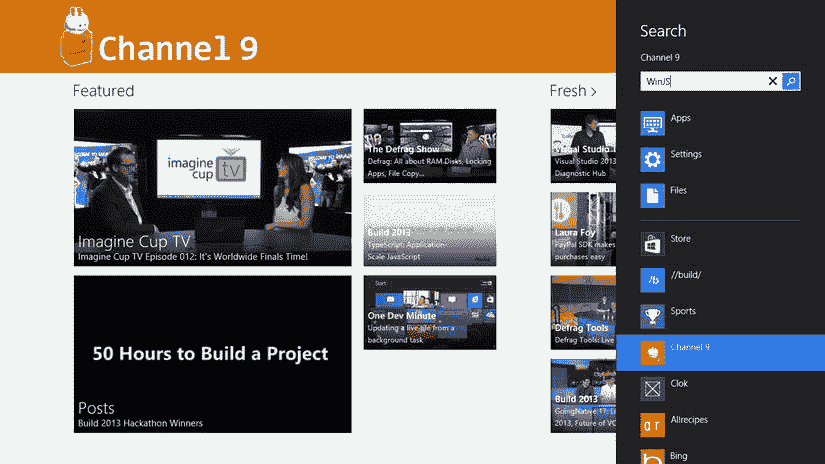

[图 19-2](#_Fig2) 。Windows 8 中的通用搜索界面

在本节的剩余部分，我将向您展示如何向 Clok 添加支持，以允许用户从 Windows 搜索界面搜索项目。方便的是，当您在应用中添加搜索契约时，许多繁琐的工作都会自动完成。

添加搜索合同

为了实现搜索契约并让 Clok 出现在用户可以搜索的应用列表中，必须完成几个步骤。

*   搜索契约必须在包清单(`package.appxmanifest`)中声明。
*   当应用激活的`kind`为`search`时，一个`activated`事件处理器必须处理这种情况。
*   必须创建搜索结果屏幕。
*   必须实现搜索应用数据的功能，以便它可以显示在搜索结果屏幕上。

这些步骤可以按任何顺序进行，都可以手动完成。对于某些应用来说，这可能是在应用中添加搜索的最简单或最好的方式。但是，前三个步骤都可以通过向项目中添加一个新项来完成。在这一节中，我将带您了解如何将搜索合同项添加到 Clok，以便它出现在用户可以搜索的应用列表中。在接下来的部分中，我将介绍一些定制默认搜索契约实现的步骤，以便更好地适应 Clok。

搜索合同是从您用于添加页面控件的同一“添加新项目”对话框中添加的。事实上，正如您稍后将看到的，就像新的页面控件一样，当添加搜索契约时，会创建三个文件——一个 HTML 文件、一个 CSS 文件和一个 JavaScript 文件。你需要为这些新文件准备一个家。在`pages`文件夹中创建一个名为`searchResults`的文件夹。右键单击新的`searchResults`文件夹，选择添加新项目的选项。在打开的添加新项目对话框中，选择搜索合同项目类型并创建一个名为`searchResults.html`的新项目(参见[图 19-3](#Fig3) )。

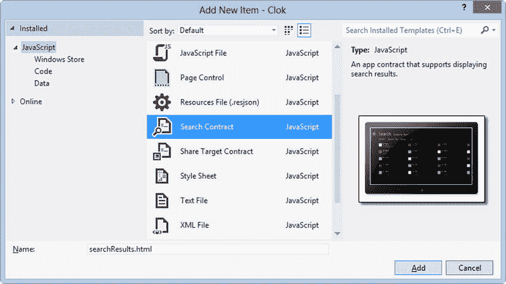

[图 19-3](#_Fig3) 。添加搜索合同

尽管这个过程添加了将用于显示搜索结果的 HTML、CSS 和 JavaScript 文件，但是 HTML 文件中实际上并没有引用 JavaScript 文件。这与创建页面控件时不同。相反，您必须手动添加对`searchResults.js`到`default.html`的引用。将清单 19-1 中突出显示的代码添加到`default.html`中。

[***清单 19-1。***](#_list1) 引用搜索 default.html 合同脚本

```js
<script src="/pages/searchResults/searchResults.js"></script>
<script src="/js/default.js"></script>
```

我们将在接下来的部分对`searchResults.js`和`default.js`进行一些修改。在此之前，查看项目清单中为您所做的更改是很重要的。打开`package.appxmanifest`并切换到申报选项卡(参见[图 19-4](#Fig4) )。

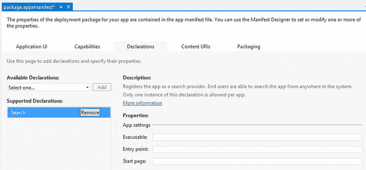

[图 19-4](#_Fig4) 。package.appxmanifest 文件会自动更新

当您将搜索契约项添加到项目中时，Visual Studio 声明 Clok 通过将正确的元素添加到`package.appxmanifest`中来支持搜索。这个文件实际上是一个 XML 文件，Visual Studio 提供了一个很好的界面来更新这个文件。清单 19-2 展示了 Visual Studio 添加到清单中的 XML，允许 Clok 支持搜索。

[***清单 19-2。***](#_list2) 自动对 package.appxmanifest 进行修改

```js
<Extensions>
    <Extension Category="windows.search" />
</Extensions>
```

虽然在这一点上没有实际的搜索工作，但是清单的这一变化使得 Clok 出现在用户可以搜索的应用列表中(见[图 19-5](#Fig5) )。

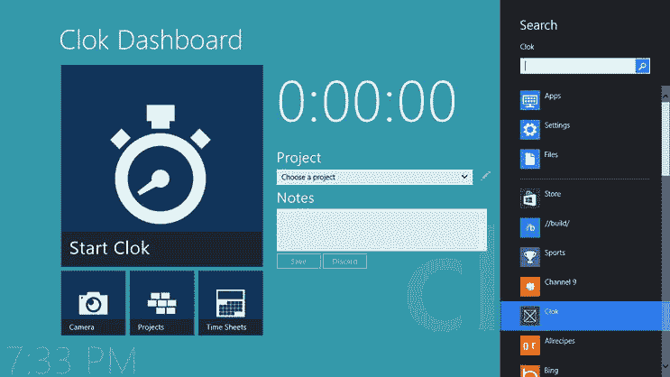

[图 19-5](#_Fig5) 。现在可以搜索 Clok 了

 **注意** Windows 会自动显示一个与您的应用打包在一起的图标文件。在第 23 章中，我将展示如何更新图标以匹配应用的风格。

向 Clok 数据模型添加搜索功能

一旦我们完成了这个搜索实现，用户将能够从 Windows 搜索界面按项目名称、客户名称或项目编号搜索项目。我们可以通过一些更智能的搜索功能使这种搜索变得非常复杂，但是对于本书来说，我们只需添加一个函数，该函数将返回其中一个可搜索字段包含用户输入的文本的任何项目。

目前，`storage.js`有一个基于项目状态过滤项目的功能。[清单 19-3](#list3) 定义了一个搜索函数，它将返回所有未被删除的项目，并且项目名称、客户名称或项目编号包含用户的搜索文本。将清单 19-3 中的`searchProjects`函数添加到`storage.js`中，就在`getGroupedProjectsByStatus`函数定义之前。

[***清单 19-3。***](#_list3) 向 storage.js 添加搜索功能

```js
storage.projects.searchProjects = function (queryText) {
    var filtered = this
        .createFiltered(function (p) {
            if (p.status == data.ProjectStatuses.Deleted) return false;

            if (!queryText) return false;

            if ((p.name.toUpperCase().indexOf(queryText.toUpperCase()) >= 0)
                    || (p.clientName.toUpperCase().indexOf(queryText.toUpperCase()) >= 0)
                    || (p.projectNumber.toUpperCase().indexOf(queryText.toUpperCase()) >= 0)) {

                return true;
            }

            return false;

        });

    return filtered.createSorted(storage.compareProjects);
};
```

除了这个函数，您还需要添加一个比较和排序项目的函数。您已经定义了一个函数来比较和排序项目组，所以将清单 19-4 中的[函数添加到`storage.js`中，就在`compareProjectGroups`函数定义之前。该功能将按照客户和项目名称对项目进行排序。](#list4)

[***清单 19-4。***](#_list4) 为项目排序功能

```js
compareProjects: function (left, right) {
    // first sort by client name...
    if (left.clientName !== right.clientName) {
        return (left.clientName > right.clientName) ? 1 : -1;
    }

    // then sort by project name...
    if (left.name !== right.name) {
        return (left.name > right.name) ? 1 : -1;
    }

    return 0;
},
```

对生成的搜索结果屏幕的更改

当您向 Clok 添加搜索协定时，Visual Studio 为搜索结果屏幕添加了 HTML 和 CSS 文件。它们非常接近在 Clok 中显示项目搜索结果所需的内容。唯一需要改变的是用于格式化每个结果的`WinJS.Binding.Template`。因为默认的`Template`没有指定属于`Project`对象的字段，所以用来自[清单 19-5](#list5) 的代码更新`searchResults.html`。

[***清单 19-5。***](#_list5) 修改模板

```js
<div class="itemtemplate" data-win-control="WinJS.Binding.Template">
    <div data-class="listViewItem" data-win-bind="className: status">
        <h4 data-win-bind="innerHTML: name searchResults.markText"></h4>
        <h6>
            <span data-win-bind="innerHTML: projectNumber searchResults.markText"></span>
                (<span data-win-bind="innerText: status"></span>)
        </h6>
        <h6 data-win-bind="innerHTML: clientName searchResults.markText"></h6>
    </div>
</div>
```

除了对`Template`做一些小改动，还需要做一些相应的 CSS 改动。这个 CSS 非常类似于您在创建列出所有项目的项目屏幕时添加的内容。用[清单 19-6](#list6) 中突出显示的代码更新`searchResults.css`。

[***清单 19-6。***](#_list6) 更新了 CSS 规则

```js
/* SNIPPED */
        .searchResults section[role=main] .resultslist .win-container {
            margin-bottom: 10px;
            margin-left: 23px;
            margin-right: 23px;
        }

        .searchResults section[role=main] .resultslist [data-class=listViewItem] {
            min-width: 250px;
            height: 75px;
            padding: 5px;
            overflow: hidden;
        }

            .searchResults section[role=main] .resultslist [data-class=listViewItem].active {
                background-color: #000046;
            }

            .searchResults section[role=main] .resultslist [data-class=listViewItem].inactive {
                background-color: #464646;
                color: #cccccc;
            }

            /* Define a style for both selected filters and text matching the query. */
            .searchResults section[role=main] .resultslist [data-class=listViewItem] mark {
                background: transparent;
                color: limegreen;
            }

@media screen and (-ms-view-state: snapped) {
/* SNIPPED */
```

对生成的 JavaScript 文件的更改

当您在本章前面的“添加新项”对话框中添加搜索协定时，Visual Studio 为您添加了大量代码。但是，仍有一些代码需要您自己添加。例如，`searchResults.js`有占位符，让您定义哪些过滤器可供用户利用，当用户单击一个项目时处理事件，当然，还可以确定屏幕上应该显示什么结果。

在这一节中，我将介绍这些以及您必须对`searchResults.js`进行的一些其他更改。让我们首先定义用户过滤搜索结果的选项。在第 11 章的[中，我们在项目屏幕中添加了过滤器，用于查看所有项目、仅活动项目或仅非活动项目。我们将在搜索结果屏幕中添加相同的选项。Visual Studio 在`searchResults.js`中生成的代码包含一个名为`_generateFilters`的函数。屏幕已经配置为使用该函数来显示我们添加的任何过滤器，并实现过滤行为。用清单 19-7](11.html) 中突出显示的代码更新`searchResults.js`中的`_generateFilters`，添加一个活动过滤器和一个非活动过滤器。

[***清单 19-7。***](#_list7) 为活动和非活动项目添加过滤器

```js
_generateFilters: function () {
    this._filters = [];
    this._filters.push({
        results: null,
        text: "All",
        predicate: function (item) { return true; }
    });

    var statuses = Clok.Data.ProjectStatuses;
    this._filters.push({
        results: null,
        text: "Active",
        predicate: function (item) { return item.status === statuses.Active; }
    });
    this._filters.push({
        results: null,
        text: "Inactive",
        predicate: function (item) { return item.status === statuses.Inactive; }
    });
},
```

因为我们在清单 19-3 的[中定义了`searchProjects`函数，所以找到匹配用户查询的项目就像调用该函数一样简单。用清单 19-8](#list3) 中突出显示的代码更新`searchResults.js`中的`_searchData`函数。

[***清单 19-8。***](#_list8) 检索搜索结果

```js
_searchData: function (queryText) {
    var storage = Clok.Data.Storage;
    return storage.projects.searchProjects(queryText);
}
```

一旦用户看到该函数返回的结果列表，他或她可能会点击其中一个来查看该项目的项目细节屏幕。[清单 19-9](#list9) 包含了`_itemInvoked`函数的新定义，供您在`searchResults.js`中更新。

[***清单 19-9。***](#_list9) 导航至项目详情屏幕

```js
_itemInvoked: function (args) {
    args.detail.itemPromise.done(function itemInvoked(item) {
        WinJS.Navigation.navigate("/pages/projects/detail.html", { id: item.data.id });
    });
},
```

Visual Studio 添加的`searchResults.js`文件中提供的一个有用特性是`WinJS.Binding.converter`函数`_markText`。该功能将在结果中突出显示用户搜索词的任何出现。默认情况下，`_markText`使用区分大小写的匹配来确定要突出显示的内容。例如，如果我搜索“win”，结果中将返回 Northwind Traders 的项目和任何名为 Windows Store App 的项目。然而，只有“Northwind”中的“win”会被默认的`_markText`功能高亮显示，因为 Windows Store 应用以大写的 *W、*开头，而我搜索的“win”是小写的 *w* 。用清单 19-10 中的[替换`searchResults.js`中该函数的定义，这样所有匹配都将被突出显示，无论大小写。](#list10)

[***清单 19-10。***](#_list10) 高亮匹配术语

```js
_markText: function (text) {
    return text.replace(new RegExp(this._lastSearch, "i"), function (match, capture) {
        return "<mark>" + match + "</mark>";
    });
},
```

这个文件中需要的最后一个修改是更改页面标题。用清单 19-11 中[高亮显示的代码行更新`searchResults.js`中的`_initializeLayout`函数](#list11)。

[***清单 19-11。***](#_list11) 改变页面标题

```js
_initializeLayout: function (listView, viewState) {
    /// <param name="listView" value="WinJS.UI.ListView.prototype" />

    if (viewState === appViewState.snapped) {
        listView.layout = new ui.ListLayout();
        document.querySelector(".titlearea .pagetitle").textContent
            = '"' + this._lastSearch + '"';
        document.querySelector(".titlearea .pagesubtitle").textContent = "";
    } else {
        listView.layout = new ui.GridLayout();

        document.querySelector(".titlearea .pagetitle").textContent = "Clok";
        document.querySelector(".titlearea .pagesubtitle").textContent
            = "Results for "" + this._lastSearch + '"';
    }
},
```

对应用激活的更改

根据您的应用的需要，您可能只需做很少的修改就可以使用生成的代码，就像我在上一节中展示的那样。然而，在 Clok 的情况下，稍微偏离生成的代码会提供更好的体验。在第 17 章中，我们定义了当用户点击开始屏幕上的磁贴启动 Clok 时会发生什么。当他或她从 Windows 搜索界面激活 Clok 时，也需要大部分相同的激活逻辑。

不管用户如何激活 Clok，我们仍然需要从 IndexedDB 中合并我们的数据模型类，初始化漫游设置，并将设置弹出按钮添加到设置窗格中。在`searchResults.js`中生成的代码包括一个用于`WinJS.Application.onactivated`事件的事件处理程序。因为激活过程几乎是一样的，我们将把它合并到已经存在于`default.js`中的事件处理程序中。首先，让我们去掉`searchResults.js`中多余的事件处理程序。从`searchResults.js`中的[清单 19-12](#list12) 中找到代码并删除它。

[***清单 19-12。***](#_list12) 从 searchResults.js 中移除激活的处理程序

```js
WinJS.Application.addEventListener("activated", function (args) {
    // SNIPPED
});
```

用清单 19-13 中[的高亮代码修改`default.js`中`onactivated`事件](#list13)的处理程序。这将允许我们现有的所有逻辑执行，无论用户从开始屏幕启动 Clok 还是通过执行搜索。

[***清单 19-13。***](#_list13) 通过搜索检查激活

```js
app.addEventListener("activated", function (args) {
    if ((args.detail.kind === activation.ActivationKind.launch)
            || (args.detail.kind === activation.ActivationKind.search)) {

        var extender = new Clok.SplashScreen.Extender(
            extendedSplash,
            args.detail.splashScreen,
            function (e) {
                args.setPromise(Clok.Data.Storage.initialize());
                simulateDelay(500);
                launchActivation(args);
            });
    }
});
```

虽然我们在整本书中添加的所有激活码都适用于任何一种激活类型，但在`launch`激活和`search`激活之间有一个区别。Clok 应该导航到不同的屏幕，这取决于它是如何被激活的。在激活`launch`的情况下，用户应该看到他或她之前所在的屏幕，或者 Clok 仪表板屏幕。然而，在`search`激活的情况下，有一些可能性。将清单 19-14[中突出显示的代码](#list14)添加到`default.js`中。

[***清单 19-14。***](#_list14) 激活后导航到正确的屏幕

```js
args.setPromise(WinJS.UI.processAll().then(function () {
    configureClock();

    if (args.detail.kind === activation.ActivationKind.search) {
        var searchPageURI = "/pages/searchResults/searchResults.html";
        var execState = activation.ApplicationExecutionState;

        if (args.detail.queryText === "") {
            if ((args.detail.previousExecutionState === execState.closedByUser)
                    || (args.detail.previousExecutionState === execState.notRunning)) {
                return nav.navigate(Application.navigator.home);
            } else if ((args.detail.previousExecutionState === execState.suspended)
                    || (args.detail.previousExecutionState === execState.terminated)) {
                return nav.navigate(nav.location, nav.state);
            }
            else {
                return nav.navigate(searchPageURI, { queryText: args.detail.queryText });
            }
        } else {
            if (!nav.location) {
                nav.history.current = {
                    location: Application.navigator.home,
                    initialState: {}
                };
            }

            return nav.navigate(searchPageURI, { queryText: args.detail.queryText });
        }
    } else if (nav.location) {
        nav.history.current.initialPlaceholder = true;
        return nav.navigate(nav.location, nav.state);
    } else {
        return nav.navigate(Application.navigator.home);
    }
}));
```

有两种方法可以从 Windows 搜索界面激活 Clok 。

*   用户可以输入搜索词，然后在应用列表中单击 Clok。
*   用户可以单击应用列表中的 Clok，然后输入搜索词。

如果用户输入搜索词，然后选择 Clok，清单 19-14[中的代码](#list14)会将他们的搜索词——属性——传递给搜索结果屏幕，显示所有结果。然而，如果用户激活了 Windows 搜索界面，并在输入任何搜索词之前点击 Clok，以将他们的搜索“预先限定”到 Clok，`queryText`的值将为空。在这种情况下，用户可能对他们在搜索时将看到的内容有不同的期望。因此，我们遵循类似于用户启动 Clok 时的模式。如果应用被暂停或终止，让用户返回到他们认为仍然活动的屏幕。如果应用之前没有运行，显示 Clok 仪表板屏幕。如果它正在运行，请导航到搜索结果屏幕，即使尚未显示任何结果。您可以决定在应用中以不同的方式处理这些情况。重要的是考虑用户在各种情况下期望发生什么。

现在运行 Clok 并在 Clok 中执行搜索。[图 19-6](#Fig6) 显示了我搜索“周期”的结果，所有匹配的项目都在结果中突出显示。

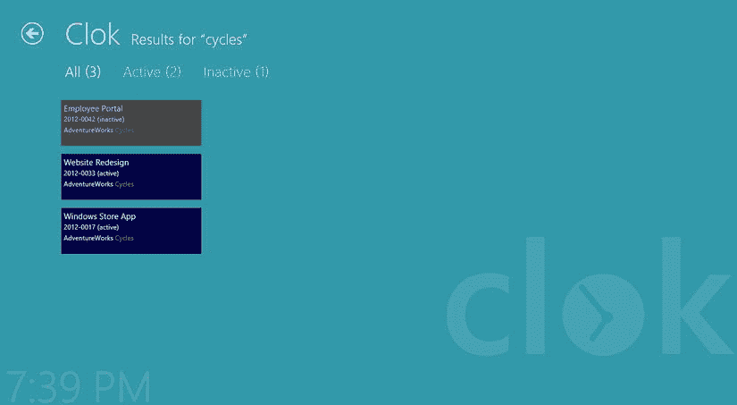

[图 19-6](#_Fig6) 。搜索结果

您可能已经意识到这个屏幕与列出所有项目的项目屏幕是多么相似。你可以把这两者合并成一个屏幕。这将消除一些多余的代码，如 CSS 和标记，以显示结果和过滤结果的功能。目前最大的区别是，默认情况下，项目屏幕显示 Clok 中的所有项目，而搜索结果屏幕不会显示任何结果，直到执行搜索。然而，有一个特别的原因需要考虑将它们作为单独的屏幕。使用专用的搜索结果屏幕，您可以修改逻辑，使其也包括对时间条目的搜索，甚至是对合并结果列表中的文档的搜索。如果将项目屏幕和搜索结果屏幕结合起来，这种行为就没有意义。同样，做你认为对你的用户最好的事情。要留心。

完成本节后，您会注意到将“添加新项”对话框中的搜索协定项添加到 Visual Studio 项目中实际上并不是一个必需的步骤。当您完成这一步时，Visual Studio 没有添加任何特别的东西。您可以手动完成每个步骤。事实上，如果我们需要对生成的代码进行更多的修改，或者如果我们想要将项目屏幕与搜索结果屏幕结合起来，那么手动完成这些工作可能会更简单。重申一下我在本章前面说过的，实现搜索契约包括几个步骤。

*   搜索契约必须在包清单(`package.appxmanifest`)中声明。
*   当应用激活的`kind`为`search`时，一个`activated`事件处理器必须处理这种情况。
*   必须创建搜索结果屏幕。
*   必须实现搜索应用数据的功能，以便它可以显示在搜索结果屏幕上。

Visual Studio 可以为您生成部分或大部分代码，您也可以手动生成。

调试搜索激活

在测试应用的可选激活时，我应该指出一个有用的调试技巧。大部分时间我启动 Clok 都没有附加 Visual Studio 调试器。您可以通过键入 Ctrl+F5 来实现这一点，或者您可以转到 Debug  Start 而不进行调试。当我必须通过代码来解决问题或者在 Clok 运行时查看不同变量的值时，我用 Visual Studio 调试器启动 Clok。你可以通过键入 F5，进入调试开始调试(见[图 19-7](#Fig7) ，或者点击工具栏中的按钮来完成。


[图 19-7](#_Fig7) 。开始调试或不调试就开始

默认情况下，调试时，Visual Studio 将启动 Clok。大多数时候，这是我们所希望的。然而，在调试其他类型的激活的情况下，您实际上并不希望 Clok 最初运行，这样您就可以调试添加到`onactivated`事件处理程序中的各种代码分支。幸运的是，有一个简单的方法可以改变这一点。

在解决方案资源管理器中右击 Clok 项目，并从上下文菜单中选择属性。确保选择 Clok 项目，而不是顶层的同名 Clok 解决方案。在“Clok 属性页”窗口的左窗格中，选择“调试”。然后将启动应用的值更改为否(参见[图 19-8](#Fig8) )。

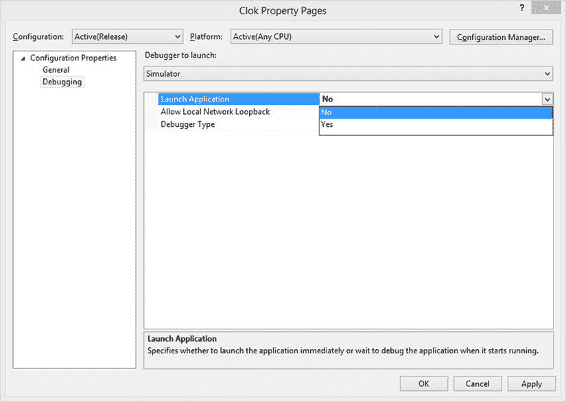

[图 19-8](#_Fig8) 。更改调试选项

如果您现在调试(按 F5)，Visual Studio 将切换到其调试模式，并等待 Clok 被激活，然后再执行其他操作。如果您现在使用 Windows 搜索界面来搜索项目，您将能够逐步完成激活处理程序。只需记住在调试与应用激活无关的其他 Clok 特性之前，将该属性设置回 Yes。

分享

Windows 8 的另一个新功能是在应用之间共享数据的能力。当一个应用支持共享时，用户可以使用图 19-9 中[所示的共享符](#Fig9)打开 Windows 共享界面，使数据对另一个应用可用。


[图 19-9](#_Fig9) 。窗户也有魅力

 **注**用户也可以直接激活分享界面，绕过 Share charm，在键盘上键入 Windows Logo 键+H。此外，我将在本章后面展示如何以编程方式激活共享界面。

开箱即用，您可以为您的应用添加对共享文本、HTML、URIs、图像和文件的支持。此外，您还可以创建自定义数据类型并共享它们。在这一节中，我将介绍将 Clok 配置为共享目标和共享源的步骤。

份额目标

在实现共享目标协定后，您的应用将向 Windows 表明自己是共享目标。共享目标是能够从另一个应用(共享源)接收共享数据的应用。当实现共享目标契约时，您指定您的应用能够接收什么类型的数据，并且当用户共享该类型的数据时，您的应用将在他或她可以选择的目标应用列表中。在这一节中，我将向您展示如何添加对与 Clok 共享文档的支持，以及如何将它们添加到项目的文档库中。

在我们开始在 Clok 中实现共享目标契约之前，你需要在你的电脑上安装一个可以共享文件的应用。您可能已经有一个或多个应用可以做到这一点，但是与其尝试确定哪些应用能够共享文档，我建议您查看名为“共享内容源应用示例”的示例项目您可以单独下载这个示例项目(`http://code.msdn.microsoft.com/windowsapps/Sharing-Content-Source-App-d9bffd84`)，但是我建议从 MSDN 下载整个示例应用包(`http://msdn.microsoft.com/en-US/windows/apps/br229516`)。当您在 Visual Studio 中构建这个应用时，它将在您的开始屏幕上显示为 Share Source JS。

添加份额目标合同

与搜索协定类似，实现共享目标协定最简单的方法是在 Visual Studio 中将特定类型的项添加到项目中。在 Visual Studio 项目的`pages`文件夹中创建一个名为`shareTarget`的新文件夹。然后在`shareTarget`文件夹中添加一个名为`shareTarget.html`的新份额目标合约项(见[图 19-10](#Fig10) )。


[图 19-10](#_Fig10) 。添加股份目标合约

当您添加这种类型的项时，Visual Studio 会对`package.appxmanifest`进行修改。它添加了所需的共享目标声明，因此 Clok 将显示在 Windows 共享界面的目标列表中。默认情况下，它指定您的项目可以接收共享文本和 URIs(参见[图 19-11](#Fig11) )。


[图 19-11](#_Fig11) 。Visual Studio 添加的共享目标声明

我们不会在 Clok 中支持这些格式，所以把它们都删除。因为我们希望用户能够将文档共享到文档库中，所以我们必须指定支持哪些文件类型。如果我们只想接受 Microsoft Word 文档，我们可以添加一个新的受支持的文件类型并指定”。docx”作为文件类型。然而，在 Clok 的情况下，用户可能希望共享 Microsoft Word 文档、电子表格、一些模型或任何数量的其他类型的文件。为此，只需勾选“支持任何文件类型”复选框(见[图 19-12](#Fig12) )。

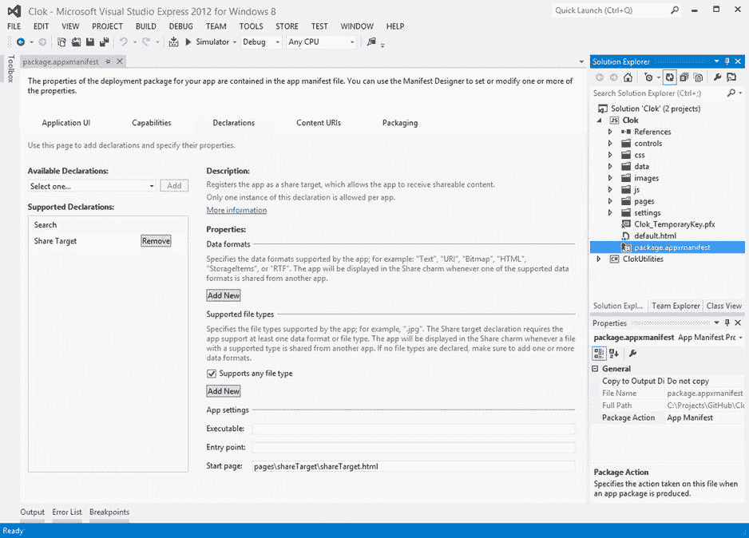

[图 19-12](#_Fig12) 。更新 package.appxmanifest 文件

在 Clok 中，共享文件被简单地保存到文档库中，根本不用查看文件的内容。如果您的应用将使用共享文件的内容，您应该将文件类型限制为您的应用可以理解的类型。此外，正如任何时候应用接受来自用户的数据一样，在对文件做任何其他事情之前，您应该仔细分析内容以确保它们是适当的格式。很容易将文件的名称和扩展名从`badThing.exe`更改为`niceThing.xml`。

更改生成的共享目标屏幕

除了对`package.appxmanifest`的更改，当您添加共享目标契约时，Visual Studio 创建了一个页面，当用户选择 Clok 作为共享目标时，该页面将显示给用户。Windows 会将`shareTarget.html`加载到一个类似设置弹出的滑动窗口中。必须对该页面进行定制，以便以对您的应用有意义的方式处理共享数据。

在向 Clok 中的项目文档库添加文档的情况下，我们将显示一些关于共享文件的细节，并向用户提供一个项目列表以供选择。与设置弹出按钮不同，此页面不是作为`default.html`的一部分加载的，因此您必须包含完成共享操作所需的任何脚本引用。用[清单 19-15](#list15) 中的代码更新`shareTarget.html`。

[***清单 19-15。***](#_list15) 更新 searchTarget.html 内容

```js
<!DOCTYPE html>
<html>
<head>
    <meta charset="utf-8" />
    <meta name="ms-design-extensionType" content="ShareTarget" />
    <title>Share Target Contract</title>

    <link href="//Microsoft.WinJS.1.0/css/ui-light.css" rel="stylesheet" />
    <script src="//Microsoft.WinJS.1.0/js/base.js"></script>
    <script src="//Microsoft.WinJS.1.0/js/ui.js"></script>

    <link href="/css/default.css" rel="stylesheet" />
    <link href="/css/themeroller.css" rel="stylesheet" />

    <script src="/js/extensions.js"></script>
    <script src="/js/utilities.js"></script>
    <script src="/js/navigator.js"></script>

    <script src="/data/project.js"></script>
    <script src="/data/timeEntry.js"></script>
    <script src="/data/storage.js"></script>

    <link href="shareTarget.css" rel="stylesheet" />
    <script src="shareTarget.js"></script>
</head>
<body>
    <!-- The content that will be loaded and displayed. -->
    <section aria-label="Main content" role="main">
        <header>
            <div>
                
            </div>
            <div class="shared-metadata">
                <h2 class="shared-title win-type-ellipsis"></h2>
                <h4 class="shared-description"></h4>
                <ul id="fileNames"></ul>
            </div>
        </header>

        <div id="projectContainer">
            <label for="project">Select a project to add these documents to:</label><br />
            <select id="project">
                <option value="">Choose a project</option>
            </select>
        </div>

        <div class="sharecontrols">
            <div class="progressindicators">
                <progress></progress>
                <span>Sharing...</span>
            </div>
            <input class="submitbutton" type="button" value="Share" />
        </div>
    </section>
</body>
</html>
```

一些 CSS 的变化也是必要的。首先，因为在[清单 19-15](#list15) 中，你用`projectContainer div`替换了一个`commentbox`元素，在`shareTarget.css`中，用[清单 19-17](#list17) 中的选择器更新[清单 19-16](#list16) 中的 CSS 选择器。

[***清单 19-16。***](#_list16) 找到这个 CSS 规则

```js
section[role=main] .commentbox {
    -ms-grid-column-align: stretch;
    -ms-grid-column: 2;
    -ms-grid-row: 2;
    height: 25px;
    margin-top: 0px;
    width: calc(100% - 4px);
}
```

[***清单 19-17。***](#_list17) 改变选择器

```js
section[role=main] #projectContainer {
    -ms-grid-column-align: stretch;
    -ms-grid-column: 2;
    -ms-grid-row: 2;
    height: 25px;
    margin-top: 0px;
    width: calc(100% - 4px);
}
```

在[清单 19-15](#list15) 中，您添加了一个无序列表，其中包含用户与 Clok 共享的文件名列表。将清单 19-18 中[的 CSS 规则添加到`shareTarget.css`中。](#list18)

[***清单 19-18。***](#_list18) CSS 文件列表规则

```js
section[role=main] header .shared-metadata #fileNames {
    overflow-y: scroll;
    height: 80px;
}
```

接收共享文件

当您将共享目标契约添加到 Clok 时，Visual Studio 生成的 JavaScript 非常简单。这是一个很好的起点，但还不够。在这一节中，我将带您了解`shareTarget.js`中所需的更改。将[清单 19-19](#list19) 中高亮显示的别名添加到`shareTarget.js`的顶部。

[***清单 19-19。***](#_list19) 添加一些别名

```js
var app = WinJS.Application;
var appData = Windows.Storage.ApplicationData.current;
var storage = Clok.Data.Storage;

var createOption = Windows.Storage.CreationCollisionOption;
var standardDataFormats = Windows.ApplicationModel.DataTransfer.StandardDataFormats;

var share;
```

当用户在 Windows Share 界面的目标列表中选择 Clok 时，Clok 会被`shareTarget ActivationKind`激活。因为我们正在构建的共享屏幕不是作为`default.html`的一部分托管的，所以您必须处理`searchTarget.js`中的`onactivated`事件。Visual Studio 生成的代码为此定义了一个处理程序，它包含大量代码。在许多情况下，将代码直接包含在`onactivated`事件处理程序中是完全可以接受的。但是，建议尽快完成此事件处理程序。我们将遵循本例中 MSDN ( `http://msdn.microsoft.com/en-us/library/windows/apps/hh758302.aspx`)上建议的指导，将大部分逻辑移到一个新函数中，并引发一个自定义事件来执行该函数。在`shareTarget.js`中，用清单 19-20 中的代码替换`onactivated`事件处理程序。

[***清单 19-20。***](#_list20) 从 Windows 搜索界面处理激活

```js
app.onactivated = function (args) {
    if (args.detail.kind === Windows.ApplicationModel.Activation.ActivationKind.shareTarget) {
        WinJS.Application.addEventListener("shareactivated", shareActivated, false);
        WinJS.Application.queueEvent({ type: "shareactivated", detail: args.detail });
    }
};

var shareActivated = function (args) {
    var thumbnail;

    document.querySelector(".submitbutton").disabled = true;
    document.querySelector(".submitbutton").onclick = onShareSubmit;

    bindListOfProjects();
    project.onchange = project_change;

    share = args.detail.shareOperation;

    document.querySelector(".shared-title").textContent = share.data.properties.title;
    document.querySelector(".shared-description").textContent
        = share.data.properties.description;

    thumbnail = share.data.properties.thumbnail;
    if (thumbnail) {
        // If the share data includes a thumbnail, display it.
        args.setPromise(thumbnail.openReadAsync().done(function displayThumbnail(stream) {
            document.querySelector(".shared-thumbnail").src
                = window.URL.createObjectURL(stream);
        }));
    } else {
        // If no thumbnail is present, expand the description  and
        // title elements to fill the unused space.
        document
            .querySelector("section[role=main] header")
            .style
            .setProperty("-ms-grid-columns", "0px 0px 1fr");

        document
            .querySelector(".shared-thumbnail")
            .style
            .visibility = "hidden";
    }

    if (share.data.contains(standardDataFormats.storageItems)) {
        share.data.getStorageItemsAsync().done(function (files) {
            if (files && files.length > 0) {
                var names = files.map(function (file) {
                    return "<li>" + file.name + "</li>";
                }).join("");
                fileNames.innerHTML = names;
            }
        });
    }
};
```

在这段代码中，共享屏幕的配置类似于您在`ready`函数中初始化之前页面的方式。全局变量`share`被设置为代表 Windows 将包含在激活中的`shareOperation`。这个变量是您将如何访问与您的应用共享的数据(在本例中是文件)。如果`share`变量指定了缩略图，则显示该缩略图；否则，允许标题和描述扩展到共享屏幕的整个宽度。最后，这个共享操作中包含的所有文件都被列出，以确保用户了解哪些文件将被复制到他或她选择的项目的文档库。

与 Clok 仪表板屏幕类似，共享屏幕将包括一个活动项目列表。用户将使用此列表来选择哪个项目的文档库将接收他或她共享的文件。添加从[清单 19-21](#list21) 到`shareTarget.js`的函数，以填充项目列表，并仅在项目被选中时启用共享按钮。

[***清单 19-21。***](#_list21) 绑定项目列表

```js
var bindListOfProjects = function () {
    storage.initialize().then(function () {
        project.options.length = 1; // remove all except first project

        var activeProjects = storage.projects.filter(function (p) {
            return p.status === Clok.Data.ProjectStatuses.Active;
        });

        activeProjects.forEach(function (item) {
            var option = document.createElement("option");
            option.text = item.name + " (" + item.projectNumber + ")";
            option.title = item.clientName;
            option.value = item.id;
            project.appendChild(option);
        });
    });
};

function project_change() {
    document.querySelector(".submitbutton").disabled
        = (project.options[project.selectedIndex].value === "");
}
```

为了让您走上正确的道路，生成的代码包括一个 Share 按钮的`click`事件的处理函数。它会显示进度指示器，这样用户就知道发生了什么，尽管在 Clok 的情况下，共享操作通常会很快完成，所以用户可能永远也看不到它们。用清单 19-22 中[突出显示的代码更新`shareTarget.js`中的`onShareSubmit`函数。](#list22)

[***清单 19-22。***](#_list22) 修改按钮点击处理程序

```js
function onShareSubmit() {
    document.querySelector(".progressindicators").style.visibility = "visible";
    document.querySelector(" #project ").disabled = true;
    document.querySelector(".submitbutton").disabled = true;

    share.reportStarted();
    addDocuments();
    share.reportCompleted();
}
```

除了显示进度指示器之外，生成的代码还被修改为禁用项目列表。它还禁用了“共享”按钮，以防止意外的重复提交。它最终调用`reportCompleted`函数，这将关闭 Clok 并让用户返回到他或她之前使用的应用。除了调用`addDocuments`(您稍后将定义的函数)将文件复制到文档库，我还调用了`reportStarted`。我在这里没有使用它，但是如果您的应用在接收共享数据时遇到任何错误，您也可以考虑调用`reportError`函数。MSDN ( `http://msdn.microsoft.com/en-us/library/windows/apps/windows.applicationmodel.datatransfer.sharetarget.shareoperation.aspx`)上记录了`ShareOperation`类的这些和其他功能。

完成使 Clok 成为文件共享目标的任务的最后一步是实现`addDocuments`函数。该函数将确定哪个`storageFolder`对应于所选项目，并从`share`变量中复制所有的`storageItem`对象，有效地将它们添加到该项目的文档库中。添加从[列表 19-23](#list23) 到`shareTarget.js`的功能。

[***清单 19-23。***](#_list23) 向库中添加文档

```js
var addDocuments = function () {
    var projectId = project.options[project.selectedIndex].value;
    getProjectFolder(projectId).then(function (projFolder) {
        if (share.data.contains(standardDataFormats.storageItems)) {
            share.data.getStorageItemsAsync().done(function (files) {
                var copyPromises = files.map(function (item) {
                    return item.copyAsync(projFolder, item.name, createOption.replaceExisting);
                });

                WinJS.Promise.join(copyPromises);
            });
        }
    });
};

var getProjectFolder = function (projectId) {
    return appData.localFolder
        .createFolderAsync("projectDocs", createOption.openIfExists)
        .then(function (folder) {
            return folder.createFolderAsync(projectId.toString(), createOption.openIfExists)
        });
};
```

看到它的实际应用

至此，您已经成功地将 Clok 配置为文件共享目标。通常，我不会用一整节的时间来尝试一个新特性，但是在这种情况下，已经有足够多的内容要介绍了。在调试该功能之前，确保启动调试器时不会启动 Clok(回头参考[图 19-8](#Fig8) )。

 **注意**如果你不打算用附加的调试器测试这个特性，那么你可以跳过这一步，但是你必须构建并运行 Clok 一次，让它注册为一个共享目标。

在本章的前面，我提到了共享源代码 JS 示例项目。现在构建并运行该项目。这个项目是构建一个可以作为共享操作源的应用的例子，这个主题我将在下一节讨论。因此，它包含了许多测试 Clok 时不需要的特性。通过尝试不同的场景，比如与另一个应用共享文本，来熟悉这个应用。为了测试 Clok，你应该特别关注标题为“共享文件”的场景(见[图 19-13](#Fig13) )。

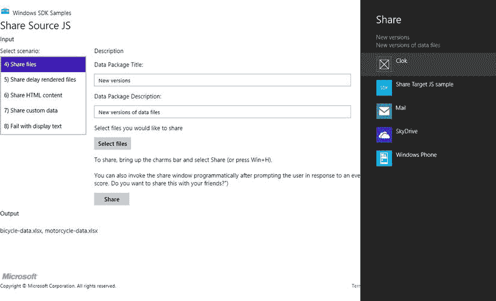

[图 19-13](#_Fig13) 。选择目标应用

在[图 19-13](#Fig13) 中，你可以看到我使用了选择文件按钮来指定两个应该共享的文件:`bicycle-data.xlsx`和`motorcycle-data.xlsx`。使用“选择文件”按钮从您自己的计算机中选择一些文件与 Clok 共享。选择文件后，通过以下方法之一激活 Windows 共享界面:

*   单击 Share Source JS 应用中的 Share 按钮，以编程方式打开 Windows 共享界面。
*   点击之前在[图 19-9](#Fig9) 中显示的共享图标，打开 Windows 共享界面。
*   使用键盘快捷键 Windows Logo 键+H 直接打开 Windows 共享界面，绕过 Windows charms。

当 Windows 共享界面处于活动状态时，您应该会看到 Clok 被列为可选的共享目标。你不会看到 Clok 作为其他场景的选项，比如那些共享文本或 HTML 内容的场景。一旦选择了 Clok，应用就会被激活。因为`searchTarget.html`被指定为搜索目标契约的起始页，所以您在过去几页中构建的页面将会打开，并且将会执行`shareTarget.js`中的激活码。你应该看到你选择的文件列表，以及可以接收这些文件到他们的文档库的活动项目列表(见[图 19-14](#Fig14) )。

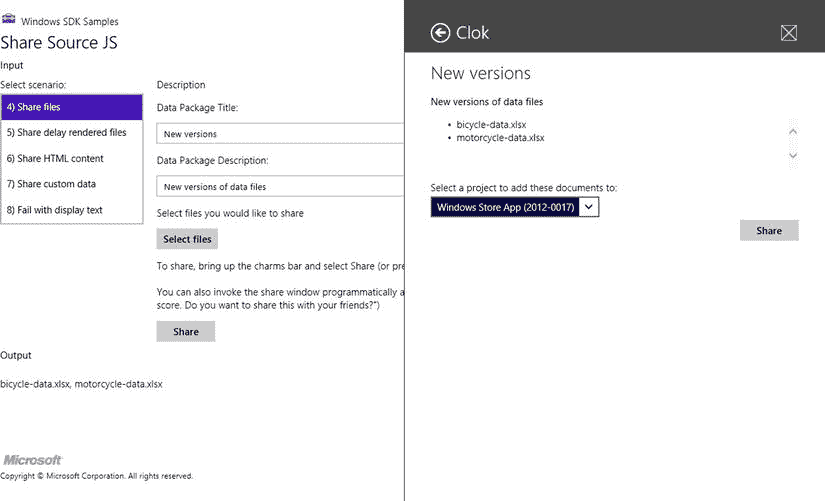

[图 19-14](#_Fig14) 。与克洛克共享文件T3】

从列表中选择一个项目，然后单击“共享”按钮。共享屏幕将关闭，您将返回到共享源 JS 应用。如果您现在启动 Clok 并导航到所选项目的文档库，您的文件将被列出，就好像您是从 Clok 中直接添加的一样。

当使用 Share Source JS 应用的“Share files”场景时，文件被添加到我在上一节中提到的全局`share`变量中。这种情况平等对待所有文件，不区分文档、电子表格、图像或任何其他文件类型。另一方面，Share Source JS 应用的“共享图像”场景专门共享图像。因为共享数据是一个图像，所以该场景通过共享操作指定了共享图像的缩略图。尽管 Clok 不支持图像的共享目标契约，但共享源 JS 示例的“共享图像”场景以位图数据格式共享图像，并将其作为文件共享。在清单 19-20 中，我们指定如果缩略图存在，它将被显示。测试该场景，查看缩略图可用时如何显示(参见[图 19-15](#Fig15) )。

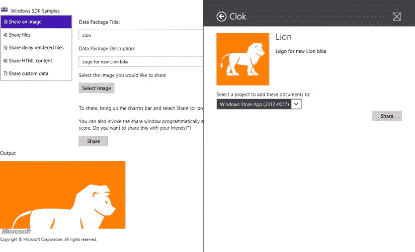

[图 19-15](#_Fig15) 。用缩略图共享图像

共享源

在上一节中，您添加了对 Clok 的支持，以便从其他应用接收共享文件。在本节中，您将实现该操作的相反方面，通过向文档库添加对从 Clok 到其他应用共享文件的支持，使 Clok 成为一个共享源。

在上一节中，您使用了 Share Source JS 应用来与 Clok 共享文件。该应用的开发人员在每个屏幕上添加了一个按钮来启动共享过程。这是一个可选的步骤，因为用户总是可以使用 Windows charms 来实现这一点，但是这是一个很好的步骤，有两个原因。首先，点击一个已经可见的按钮通常比使用其他方法打开 Windows 共享界面更简单。第二，也是更重要的一点，在我看来，在屏幕上看到一个共享按钮让用户清楚地知道当前屏幕上的项目是可以共享的。我不止一次使用 Windows Store 应用,我认为它可以让我分享一些东西。然而，当我点击 Windows Share charm 时，出现一条消息告诉我不能(见[图 19-16](#Fig16) )。

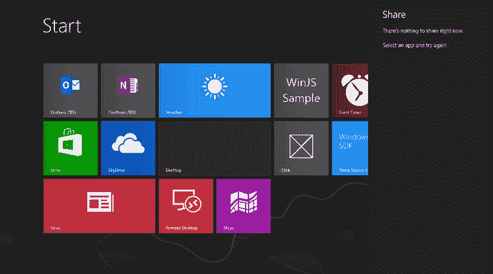

[图 19-16](#_Fig16) 。目前没有可共享的内容

向文档库添加共享按钮

因此，在进入共享文件的细节之前，让我们在 Document Library 屏幕上添加一个用户界面，在应用栏中添加一个共享按钮。因为我们将应用栏配置为每当用户在文档库中选择文件时自动出现，所以共享文档的能力将是显而易见的，并且只需点击一下就可以启动共享过程。将清单 19-24 中的代码添加到`library.html`中。

[***清单 19-24。***](#_list24) 添加新 App 栏命令

```js
<button
    data-win-control="WinJS.UI.AppBarCommand"
    data-win-options="{
        id:'shareDocumentsCommand',
        label:'Share',
        icon:'url(/img/Share-small-sprites.png)',
        section:'selection',
        tooltip:'Share',
        disabled: true}">
</button>
```

 **注意**一如既往，本书附带的源代码包括一个完整的项目，包含本章使用的所有源代码，包括用于共享`AppBarCommand`图标的`Share-small-sprites.png`图像。您可以在本书的产品详细信息页面的源代码/下载选项卡上找到本章的代码示例(`www.apress.com/9781430257790`)。

当用户点击这个按钮时，`showShareUI`功能会导致 Windows 共享界面打开。将[清单 19-25](#list25) 中的代码添加到`library.js`中。

[***清单 19-25。***](#_list25) 以编程方式打开 Windows 共享界面

```js
shareDocumentsCommand_click: function (e) {
    dataTransferManager.showShareUI();
},
```

在继续之前，请确保在`ready`函数中配置该事件处理程序并更新`libraryListView_selectionChanged`，以便在选择文件时启用共享应用栏按钮，类似于删除应用栏按钮。另外，将[清单 19-26](#list26) 中显示的`dataTransferManager`别名添加到`library.js`的顶部。

[***清单 19-26。***](#_list26) 添加别名

```js
var dataTransferManager = Windows.ApplicationModel.DataTransfer.DataTransferManager;
```

使用 DataTransferManager 类

对清单 19-25 中[的调用将导致 Windows 共享界面打开。当它打开时，接下来发生的事情是 Windows 将从 Clok 请求应该共享的数据。这是通过引发一个`DataTransferManager`对象的`datarequested`事件来实现的。你要在`library.js`里处理这个事件。您还必须确保在用户离开该页面时停止处理该事件。因为您的应用可以从不同的屏幕共享不同类型的数据，所以您必须确保仅当应该共享的数据在范围内时才处理该事件。通过添加清单](#list25)[19-27](#list27)到`library.js`中突出显示的代码来添加和删除`datarequested`事件的事件处理程序。

[***清单 19-27。***](#_list27) 添加和删除事件处理程序

```js
ready: function (element, options) {
    // SNIPPED

    var transferMgr = dataTransferManager.getForCurrentView();
    this.transferMgr_dataRequested_boundThis = this.transferMgr_dataRequested.bind(this);
    transferMgr.addEventListener("datarequested", this.transferMgr_dataRequested_boundThis);
},

unload: function () {
    var transferMgr = dataTransferManager.getForCurrentView();
    transferMgr.removeEventListener("datarequested", this.transferMgr_dataRequested_boundThis);
},
```

 **注意**你可能想知道为什么我创建了名为`transferMgr_dataRequested_boundThis`的函数。一般来说，我更喜欢使用`bind`函数来表示函数中的`this`关键字引用声明该函数的`this`的相同值。为了确保在`unload`函数中删除相同的事件处理程序，我将`transferMgr_dataRequested_boundThis`定义为一个已经绑定了`this`关键字的函数。另一种流行的技术是定义一个全局变量，通常命名为`that`或`$this`，并在整个代码中使用它来代替`this`关键字。您可能在许多其他地方看到过这种技术，如果您开发 JavaScript 已经有一段时间了，您可能对它很熟悉。如果是这样，您应该继续以这种方式编写代码。就像用 HTML 和 JavaScript 构建 Windows 应用商店应用时遇到的任何其他事情一样，除了提供 WinJS 和 WinRT 库之外，您编写的代码只是“普通的 HTML 和 JavaScript”如果您有自己喜欢的开发实践，您仍然可以使用它们。

当 Windows 从 Clok 请求共享数据时，最终调用的`transferMgr_dataRequested`函数，是这个特性的主力。将清单 19-28 中[的代码添加到`library.js`中。](#list28)

[***清单 19-28。***](#_list28) 向 Windows 提供共享数据

```js
transferMgr_dataRequested: function (e) {
    var request = e.request;
    var selectionCount = libraryListView.winControl.selection.count();

    if (selectionCount <= 0) {
        request.failWithDisplayText("Please select one or more documents and try again.");
        return;
    }

    libraryListView.winControl.selection.getItems()
        .then(function (selectedItems) {
            var project = storage.projects.getById(this.projectId);

            if (selectionCount === 1 && isImageType(selectedItems[0].data.fileType)) {
                // handle single image
                request.data.properties.title = "Image shared from Clok project";
                request.data.properties.description
                    = "From " + project.name + " (" + project.clientName + ")";

                var streamRef = Windows.Storage.Streams.RandomAccessStreamReference;
                var stream = streamRef.createFromFile(selectedItems[0].data);
                request.data.properties.thumbnail = stream;
                request.data.setBitmap(stream);
            } else {
                // handle non-images or multiple files
                request.data.properties.title = "File(s) shared from Clok project";
                request.data.properties.description
                    = selectionCount.toString() + " file(s) from "
                        + project.name + " (" + project.clientName + ")";
            }

            // share as files whether single image, non-images or multiple files
            var files = selectedItems.map(function (item) {
                return item.data;
            });

            request.data.setStorageItems(files);
        }.bind(this));
},
```

如果用户没有选择任何要共享的文件，可以使用`failWithDisplayText`功能向他或她显示消息或说明(参见[图 19-17](#Fig17) )。

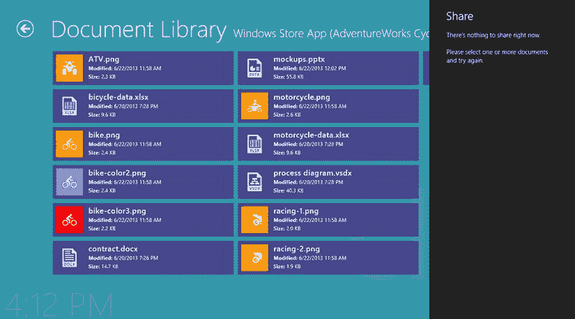

[图 19-17](#_Fig17) 。目前(仍然)没有可共享的内容

Clok 中的文档库可以包含任何类型的文件，包括图像文件，比如 JPG 或 PNG 文件。Windows 中的共享功能支持共享任何类型的文件，但也支持将图像作为数据流共享。如果您想要共享的图像不在磁盘上，这很有用，例如，可能是因为您从数据库中检索到了它。一些应用可能支持接收共享图像流，而其他应用可能支持接收文件；Clok 只支持以文件形式接收图像。

知道有些应用可能不支持这种或那种格式，当从文档库屏幕共享一个单一的图像时，清单 19-28 中的代码以两种格式共享图像。这将增加用户可以指定为共享目标的应用的数量，从而改善他们的体验。如果用户共享多个文件，或者不是图像的文件，那么我们只将数据作为文件共享。此外，如果只共享一个图像，我们指定该图像应该用作共享操作的缩略图。

看到它的实际应用

让 Clok 成为一个共享资源要简单得多。剩下唯一要做的事就是尝试一下。运行 Clok 并导航到包含一些文件的文档库。选择一个或多个文件，并通过以下方法之一共享它们(参见[图 19-18](#Fig18) ):

*   点按应用栏中的“共享”按钮。
*   点击[图 19-9](#Fig9) 所示的分享符。
*   使用键盘快捷键 Windows 徽标键+H，绕过 Windows charms。

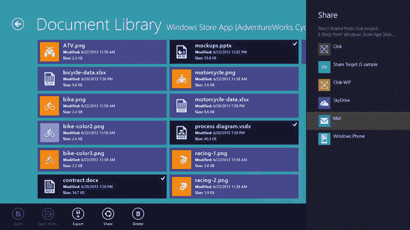

[图 19-18](#_Fig18) 。共享文档库中的文件

 **注意**如果你在用 Visual Studio 调试，别忘了再次更改项目属性，这样当你开始调试时 Clok 会自动启动。

选择目标应用。在我的测试中，我选择了邮件应用，正如你在[图 19-19](#Fig19) 中看到的，它有一个更大的共享屏幕，允许用户将文件作为附件发送给客户端。

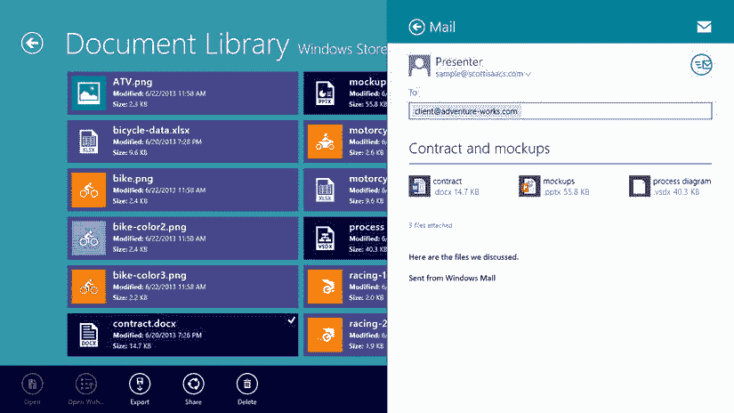

[图 19-19](#_Fig19) 。将文件共享到邮件应用

其他类似于分享的概念

除了将您的应用配置为共享目标或共享源之外，还有其他方法允许用户将数据放入您的应用以及从您的应用中获取数据。支持这种类型的共享的两种常见方法(这里我指的是“共享”的一般定义，而不是 Windows 8 特定的定义)是文件选取器和复制粘贴。

文件拾取器

文件打开选择器契约和文件保存选择器契约分别类似于共享源和共享目标。当用户使用文件选择器打开或保存文件时，这些契约允许选择您的应用。例如，当向文档库添加文件时，您可以选择已声明文件打开选择器合同的其他应用，并直接从这些应用导入文件，如 SkyDrive 或 Photos 应用(参见[图 19-20](#Fig20) )，即使它们当前不存在于您计算机的文件系统中。


[图 19-20](#_Fig20) 。文件打开选择器

同样，如果您将文件保存选择器合同添加到 Clok，您可以将邮件应用中的电子邮件附件直接保存到文档库中。我不会在本书中实现任何文件选择器，但是你可以考虑把它们作为作业添加到 Clok 中。更多关于文件拾取器合同的信息可以在 MSDN ( `http://msdn.microsoft.com/en-us/library/windows/apps/hh465174.aspx`)上找到。

复制并粘贴

复制粘贴已经成为我们生活的一部分很久了。我记得大约 30 年前，我在自己的第一台苹果电脑上使用了复制粘贴技术。Windows 8 以最令人期待的方式支持复制和粘贴，开箱即用:用户将能够自动从文本输入控件中复制和粘贴。此外，您可以以编程方式操作剪贴板。

一个有用的例子是添加支持，将时间表屏幕中的时间条目复制到制表符分隔的格式中，这样可以很容易地粘贴到 Microsoft Excel 中。事实上，虽然我不会在本书中涉及它，但是该特性已经在本书附带的源代码中实现了。(您可以在本书[ `www.apress.com/9781430257790` ]的产品页面的源代码/下载选项卡上找到本章的代码示例。)Clok 中支持复制粘贴的另一种情况是将它添加到文档库中，以允许用户将文档从一个项目的文档库复制到另一个项目的文档库中。有关在应用中复制和粘贴数据的更多信息，请访问 MSDN ( `http://msdn.microsoft.com/en-us/library/windows/apps/hh758298.aspx`)。

结论

Windows 8 做了大量工作来提高应用中完成常见任务的一致性。通过在应用之间搜索和共享数据的通用界面，用户将很快熟悉 Windows 应用商店应用支持这些功能的方式。尽管如果搜索是您的应用的一个重要特性，偏离通用的 Windows 搜索界面是完全可以接受的，甚至是推荐的，但是在大多数情况下，遵循已建立的约定更好——对用户更好，因为它是一致的，对您作为开发人员也更好，因为许多管道代码已经为您编写好了。

除了搜索和共享合同，Windows 8 还提供了许多合同和扩展，帮助您构建用户自动熟悉的应用。我鼓励你在 MSDN 上回顾它们。